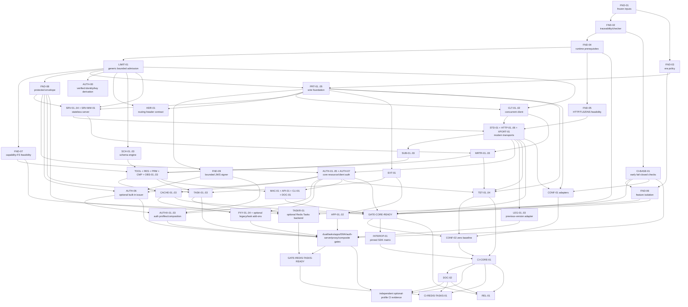

# Comprehensive Plan to Support MCP 2026-07-28 in FastMCP Rust

- Status: proposed implementation plan
- Target protocol: MCP `2026-07-28` final
- Plan date: 2026-07-28
- Repository snapshot: `a609b68` on `main`
- Workspace version at audit time: `0.3.2`
- Primary owner: FastMCP Rust maintainers
- Execution tracker: Beads graph created from the work packages in
  this document

---

## 1. Executive summary

FastMCP Rust cannot support MCP `2026-07-28` by changing
`PROTOCOL_VERSION`.

The new MCP revision changes the protocol's lifecycle, directionality,
result algebra, transport semantics, caching contract, extension model,
authorization requirements, and long-running operation model.

The current implementation is connection- and initialization-oriented.
The target protocol is stateless and declares the protocol version,
client capabilities, and optional client identity on every request.

The current implementation can send independent server-to-client
requests.
The target protocol replaces those requests with Multi Round-Trip
Requests, abbreviated MRTR.

The current HTTP implementation returns a completed JSON response after
dispatch.
The target transport must support a JSON result or a request-scoped SSE
response whose lifetime controls cancellation.

The current task protocol is a custom core feature.
The target task protocol is the opt-in
`io.modelcontextprotocol/tasks` extension and has different methods,
states, persistence rules, and subscription behavior.

This plan therefore treats the upgrade as an architectural migration.

The recommended end state is:

1. MCP `2026-07-28` is the canonical internal and public Rust model.
2. Modern requests are stateless and carry immutable request context.
3. Business handlers do not observe a protocol session.
4. Results use a closed, validated discriminator model.
5. MRTR is a first-class handler and client state machine.
6. Stdio and Streamable HTTP are cancel-correct asupersync transports.
7. `server/discover` is mandatory and version handling is explicit.
8. Core capabilities and extension capabilities are negotiated per
   request.
9. Tasks, Apps, and authorization extensions remain opt-in and do not
   contaminate the core wire model.
10. OAuth and OIDC behavior is bound to the actual HTTP transport,
    resource URI, issuer, audience, and authorization context.
11. The official wire schema and conformance harness become release
    gates.
12. A deliberately isolated MCP `2025-11-25` adapter provides
    transition interoperability.
13. The stale local `2024-11-05` public contract is not retained as a
    compatibility API.

This is a breaking release.

That is intentional.

The planned first release line is `0.4.0`, following the audited
workspace `0.3.2` line and Rust's pre-1.0 semver convention for a
breaking public API revision.

The repository is in early development, and its project instructions
prefer a correct design over compatibility shims.

The only compatibility layer proposed here is a first-class,
versioned wire implementation for the immediately preceding official
protocol revision.
It exists for ecosystem interoperability, not to preserve old Rust
types or handler signatures.

---

## 2. Definition of success

FastMCP Rust may claim support for MCP `2026-07-28` only when all of the
following statements are true.

### 2.1 Protocol correctness

- Every modern request carries the required protocol-version and
  client-capability metadata.
- Every modern successful result carries a valid `resultType`.
- Every server implements `server/discover`.
- Unsupported versions produce the final `-32022` error shape.
- Missing required client capabilities produce the final `-32021`
  error shape.
- Header mismatches produce the final `-32020` error shape.
- JSON-RPC envelopes cannot serialize both `result` and `error`.
- JSON-RPC request IDs cannot be null.
- Client requests, client notifications, server notifications, and
  responses obey the final directionality rules.
- Core protocol types round-trip against the final dated JSON Schema.

### 2.2 Statelessness

- Modern dispatch does not depend on `initialize`.
- Modern dispatch does not read identity, capabilities, log level,
  protocol version, or conversation state from a prior request.
- Stdio process lifetime is not treated as a protocol session.
- HTTP connection lifetime is not treated as a protocol session.
- List results do not vary because of connection-local state.
- Cross-call application state uses explicit, server-minted handles
  passed in ordinary parameters.
- Authorization-sensitive state is bound to the authenticated
  principal, never to a transport connection.

### 2.3 Transport behavior

- Stdio supports concurrent in-flight requests without dropping an
  unmatched response.
- Stdio supports discovery-first dual-era probing.
- Streamable HTTP uses one POST for each request or notification.
- Streamable HTTP validates `Origin` on every incoming request.
- Streamable HTTP validates protocol and routing headers before
  dispatch.
- Streamable HTTP clients accept both JSON and SSE results.
- Streamable HTTP servers cancel work when the response stream closes.
- Modern HTTP exposes no standalone MCP GET stream.
- Modern HTTP uses no protocol session ID.
- Modern HTTP uses no SSE event ID or `Last-Event-ID` replay.
- `subscriptions/listen` is the only modern long-lived notification
  stream.

### 2.4 Feature behavior

- Tools, resources, prompts, completion, progress, logging, and
  cancellation match the final schema.
- `tools/call`, `resources/read`, and `prompts/get` can return
  `input_required`.
- Clients can fulfill MRTR inputs and retry with a new JSON-RPC ID.
- `subscriptions/listen` acknowledges before emitting subscribed
  events.
- Cacheable methods return valid `ttlMs` and `cacheScope`.
- Client caches honor authorization boundaries and invalidation.
- JSON Schema Draft 2020-12 is supported with bounded evaluation and
  no automatic network dereference.

### 2.5 Extension behavior

- Extensions are disabled unless explicitly enabled by the developer.
- Extension capabilities are declared per request and in discovery.
- Unsupported extensions fall back or fail exactly as their extension
  contract specifies.
- Tasks are not represented as a core capability.
- Tasks use `tasks/get`, `tasks/update`, and `tasks/cancel`.
- Tasks never expose the old `tasks/list` or `tasks/submit` methods in
  modern mode.
- MCP Apps support is host-neutral and does not pretend that a Rust SDK
  is a browser iframe host.
- Enterprise-managed authorization support is isolated from ordinary
  OAuth behavior.

### 2.6 Verification

- Workspace formatting, checking, linting, documentation, and all
  feature tests pass.
- The official conformance harness passes in both client and server
  modes for `2026-07-28`.
- The conformance expected-failure baseline is empty.
- Every captured message passes official wire-schema validation.
- Raw-socket HTTP tests cover positive and negative header behavior.
- LabRuntime tests cover cancellation, retry, and task state races.
- Security tests cover issuer mix-up, audience confusion, scope
  escalation, cache isolation, request-state tampering, and header
  injection.
- A forbidden-dependency check proves that no Tokio runtime ecosystem
  entered the dependency graph.

---

## 3. Scope

### 3.1 In scope

- Final MCP `2026-07-28` core protocol.
- Final stateless lifecycle.
- `server/discover`.
- Per-request metadata and result metadata.
- Final JSON-RPC error allocations.
- Stdio transport.
- Streamable HTTP transport.
- Request-scoped SSE.
- `subscriptions/listen`.
- MRTR.
- Tools.
- Resources.
- Prompts.
- Completion.
- Progress.
- Per-request logging.
- Cancellation.
- Client caching behavior.
- Server cache hints.
- JSON Schema Draft 2020-12.
- Core authorization requirements.
- OAuth and OIDC client behavior.
- Protected Resource Metadata.
- Client ID Metadata Documents.
- Dynamic Client Registration only as a deprecated fallback.
- Explicit dual-era behavior for MCP `2025-11-25`.
- Generic extension negotiation.
- Official Tasks extension.
- Stable MCP Apps extension metadata and host-neutral message support.
- Stable enterprise-managed authorization OAuth profile.
- Proxy and gateway behavior across protocol eras and extensions.
- Procedural macros.
- Facade exports.
- CLI diagnostics.
- Documentation and migration guides.
- Official conformance and interoperability testing.

### 3.2 Explicitly out of scope

- Preserving the existing public Rust API through wrappers.
- Preserving the stale local `2024-11-05` wire behavior.
- Adding any Tokio-based runtime, transport, or HTTP client.
- Adding `reqwest`, `hyper`, `axum`, `tower`, `async-std`, or `smol`.
- Automatically fetching arbitrary external JSON Schema references.
- Treating Claude product features as normative MCP requirements.
- Implementing Claude's private-network tunnel service.
- Implementing Claude's connector observability control plane.
- Building a browser, webview, or iframe renderer inside this Rust
  workspace.
- Claiming that Apps support includes host rendering.
- Enabling any extension by default merely because both endpoints know
  its identifier.
- Retaining the old core task protocol in modern mode.
- Retaining connection-local tool/resource/prompt filtering in modern
  mode.
- Physical deletion of any repository file.

The final exclusion is procedural as well as technical.
Repository instructions require separate written permission before a
file or directory is removed.
Implementation work may revise existing files in place and may
quarantine obsolete code behind an explicit legacy boundary, but this
plan does not authorize file deletion.

---

## 4. Normative source hierarchy

Implementation must resolve sources by domain, not by one global
precedence list.

For wire structures, required fields, unions, constants, and message
directionality:

1. The final tagged `schema.ts` is the source of truth.
2. The final generated JSON Schema is derivative validation material.
3. The dated changelog explains intended deltas.

For behavior, transports, authorization, security, caching, and
lifecycle:

1. The final dated normative prose is authoritative.
2. Final accepted SEPs and conformance traceability clarify intent.
3. Official extension specifications govern their own negotiated
   surface.

For migration and context:

1. Official conformance scenarios provide observable examples.
2. Official SDK migration guides provide non-normative implementation
   patterns.
3. Release and product announcements provide context only.

Any conflict between the final tagged schema and final normative prose
is a blocking upstream ambiguity.
It must not be resolved by silently choosing whichever source is more
convenient.

Blog examples do not override the dated schema.

Draft extension prose does not override final core error allocation.

The implementation must never copy behavior from a release-candidate
example without checking the final dated source.

### 4.1 Pinned core inputs

- Final MCP tag:
  `5f5440bb26a62e2cf3440b92da5a667efa03b267`
- Final specification:
  <https://modelcontextprotocol.io/specification/2026-07-28>
- Final changelog:
  <https://modelcontextprotocol.io/specification/2026-07-28/changelog>
- Final TypeScript schema:
  <https://github.com/modelcontextprotocol/modelcontextprotocol/blob/2026-07-28/schema/2026-07-28/schema.ts>
- Final generated JSON Schema:
  <https://github.com/modelcontextprotocol/modelcontextprotocol/blob/2026-07-28/schema/2026-07-28/schema.json>
- Prior-version comparison:
  <https://github.com/modelcontextprotocol/modelcontextprotocol/compare/2025-11-25...2026-07-28>
- Post-release documentation revision inspected:
  `fc28315bb1eb362129ab27e85f2b65ca63f2fa30`

### 4.2 Pinned verification input

- Conformance repository revision:
  `49103de6ed70804e940637bf3e9e29e4a3f54e64`
- Package version observed at audit:
  `0.2.0-alpha.10`
- Conformance repository:
  <https://github.com/modelcontextprotocol/conformance>

The harness still used internal draft terminology for the final dated
version at the inspected launch-day revision.
Its default active server suite could therefore omit applicable
launch-day scenarios.
That revision is a reproducible audit baseline, not the permanent
release oracle.

Before release, FastMCP Rust must pin a reviewed harness revision whose
vendored schema matches the final tagged schema and whose scenario
manifest contains every traceability-backed `2026-07-28` check.
Until that promotion exists, CI must explicitly run every applicable
internally labeled draft scenario and freeze the expected scenario and
check inventory.
A zero-failure run with missing or silently skipped scenarios is not
success.

### 4.3 Pinned extension inputs

- Tasks repository revision:
  `2c1425d9a288b9b1f489430fe1e00bb392b47e48`
- Tasks repository at the pinned revision:
  <https://github.com/modelcontextprotocol/ext-tasks/tree/2c1425d9a288b9b1f489430fe1e00bb392b47e48>
- Tasks overview:
  <https://modelcontextprotocol.io/extensions/tasks/overview>
- Apps repository revision:
  `92f46a574568a3ddac7600343b7d3c4c4ed7b588`
- Apps stable specification:
  <https://github.com/modelcontextprotocol/ext-apps/blob/92f46a574568a3ddac7600343b7d3c4c4ed7b588/specification/2026-01-26/apps.mdx>
- Apps source types:
  <https://github.com/modelcontextprotocol/ext-apps/blob/92f46a574568a3ddac7600343b7d3c4c4ed7b588/src/spec.types.ts>
- Apps generated TypeScript schema:
  <https://github.com/modelcontextprotocol/ext-apps/blob/92f46a574568a3ddac7600343b7d3c4c4ed7b588/src/generated/schema.ts>
- Apps generated JSON Schema:
  <https://github.com/modelcontextprotocol/ext-apps/blob/92f46a574568a3ddac7600343b7d3c4c4ed7b588/src/generated/schema.json>
- Apps artifact SHA-256 values, verified from raw bytes at that commit:
  - `apps.mdx`:
    `ee452a7d1b9b7fb900acfeb4d6932d3963375b0f3f37d196a4b93eb80312af0e`;
  - `src/spec.types.ts`:
    `2ae52b6156f0f1fd2387717f15a8de968501d264e200d5409f09055297f8bc24`;
  - `src/generated/schema.ts`:
    `239277f079524bd457ffa3133728a0aa5573206b0cb6c57fc115c66deefef770`;
  - `src/generated/schema.json`:
    `002db9178110e644499e781415ee1025e5fde1e54500d14986626ba4a7b5b331`.
- Enterprise-managed authorization repository revision:
  `fb374c7db2b34f18ca9183882e0beecdf661892b`
- Authorization extensions:
  <https://modelcontextprotocol.io/extensions/auth/overview>
- Enterprise-managed authorization:
  <https://modelcontextprotocol.io/extensions/auth/enterprise-managed-authorization>
- Pinned enterprise profile:
  <https://github.com/modelcontextprotocol/ext-auth/blob/fb374c7db2b34f18ca9183882e0beecdf661892b/specification/stable/enterprise-managed-authorization.mdx>
- Pinned draft client-credentials profile:
  <https://github.com/modelcontextprotocol/ext-auth/blob/fb374c7db2b34f18ca9183882e0beecdf661892b/specification/draft/oauth-client-credentials.mdx>

### 4.4 Pinned cross-SDK interoperability inputs

These SDKs are interoperability peers, not normative authorities:

- TypeScript `@modelcontextprotocol/core`, `client`, and `server`
  `2.0.0`, tag commit
  `cc4b41617ce3601b1290d67216ea0b194a3cd9ac`.
- Python `mcp==2.0.0`, tag commit
  `6f69a3758ebf2ee55ce050f58b470ce11af71133`.
- Go `github.com/modelcontextprotocol/go-sdk@v1.7.0`, tag commit
  `bc72835f62eb94d0fb484439f886b6885b075f36`.
- C# `ModelContextProtocol` `2.0.0`, tag commit
  `15f8b2da110b574a1c20a35a8c629cea4095c7be`.

FND-01 records the registry artifact digest, transitive lock material,
and exact executable command for each peer.
A mutable package tag or default branch is never accepted as
interoperability evidence.

### 4.5 Product and release context

- MCP general-availability announcement:
  <https://blog.modelcontextprotocol.io/posts/2026-07-28/>
- Claude announcement:
  <https://claude.com/blog/bringing-mcp-2026-07-28-to-claude>

The Claude article says support is rolling out across Claude products.
It also discusses Apps, enterprise-managed authorization, connector
observability, and private-network tunnel research.
Only the first two correspond to official extension work in this plan.
The observability control plane and tunnel service are product features,
not core protocol clauses.

---

## 5. Upstream ambiguities that must be tracked

### 5.1 Tasks extension lag

At the pinned revision, portions of the Tasks repository still describe
the extension as experimental and still mention an obsolete error code.
Its artifacts also disagree in ways that cannot be hidden behind a
single claim of “schema parity”:

- the prose calls `ttlMs` and `pollIntervalMs` integer milliseconds but
  states no sign rule;
- the generated JSON Schema accepts any JSON number and supplies no
  integer or minimum constraint;
- pinned conformance scenario `tasks-wire-fields` requires a positive
  integer (`> 0`) whenever non-null `ttlMs` or present
  `pollIntervalMs` is emitted;
- the generated create/get result schemas compose an older SDK
  `Result` with Task/DetailedTask branches whose
  `additionalProperties: false` can reject the required final-core
  `resultType`; the old composition also exposes progress-token and
  related-task metadata through an SDK snapshot that cannot define
  their meaning in the composed Tasks contract;
- generated `tasks/get`, `tasks/update`, and `tasks/cancel` params set
  `additionalProperties: false` without admitting `_meta`, while
  final `2026-07-28` core requires request metadata on every request.

Decision:

- Treat Tasks as the official-namespaced extension target because the
  final core changelog and release announcement moved it out of core,
  while preserving the pinned repository's experimental maturity
  label.
- Do not claim stable Tasks support until the pinned extension
  artifact itself is marked stable or the MCP maintainers publish an
  equivalent normative stable artifact.
- Use final core error `-32021` for missing required capabilities.
- Pin the exact Tasks prose, generated schema, and conformance
  revisions used by FastMCP Rust and checksum each independently.
- Define a named FastMCP composed Tasks contract: final
  `2026-07-28` core `Result` algebra plus the pinned Tasks semantic
  fields and methods, and final core `RequestParams` with required
  `_meta` plus each Tasks method's extension fields.
- Validate the final core request envelope/metadata layer and Tasks
  payload layer separately. Extract and validate usable
  extension-payload constraints, but retain the raw schema only for
  provenance/drift diagnostics: its whole-message composition is
  incompatible with final core requests and results and is never the
  composed wire oracle.
- Emit and accept only `null` or a positive integer for `ttlMs`, and
  only a positive integer when `pollIntervalMs` is present. Reject
  zero, negative, fractional, non-finite, or locally unrepresentable
  values. This explicit interoperability policy follows the pinned
  conformance scenario and must not be attributed to the raw
  generated schema.
- Test the upstream prose, raw schema, conformance assertions, and
  local composed contract as four separately named artifacts so a
  future upstream correction produces a reviewed drift failure rather
  than a silent behavior change.
- Add an upstream-drift test and an implementation note.
- Do not silently follow a later Tasks revision without review.

### 5.2 Subscription teardown wording

The cancellation and subscriptions pages differ in emphasis about
server-initiated teardown.

Decision:

- On server-initiated stdio teardown, send the required
  subscription-specific cancellation notification and then produce
  the graceful complete result whenever the channel remains writable.
- When the client initiates cancellation on stdio with
  `notifications/cancelled`, stop/free the selected listen operation
  and send no response to that notification; do not misapply the
  server-initiated graceful-completion rule to this path.
- On client-initiated HTTP cancellation, closing the listen SSE
  response cancels/frees the operation; do not attempt a cancellation
  notification or final result after the channel is gone.
- On server-initiated HTTP teardown, emit the required
  `notifications/cancelled` on that listen response with
  `params.requestId` equal to the listen request ID and
  `_meta["io.modelcontextprotocol/subscriptionId"]` equal to the same
  ID. Treat it as subscription control independent of the accepted
  event filter. When the response remains writable, follow it with the
  correlated empty complete result and close.
- Add interoperability tests and retain a traceability note until
  upstream clarifies the text.

### 5.3 Apps lifecycle wording

The pinned Apps repository labels its `2026-01-26` document stable, but
its prose, source types, generated schemas, and embedded core SDK model
are not one coherent wire oracle:

- prose examples use bare `initialize`, while source/generated types
  use `ui/initialize`;
- prose gives `ui/resource-teardown` a `reason`, while source/generated
  types require empty params;
- source types include `ui/download-file` and
  `ui/notifications/request-teardown`, which the stable prose omits;
- source types advertise a Host `sampling` capability and name
  `sampling/createMessage`, but define no Apps request/result payload
  or Host/View message-union member for that method, while final core
  no longer permits the old standalone sampling request;
- stable prose describes app-exposed tools and Host catalog
  `listChanged` capabilities, while the pinned source/SDK surfaces add
  bidirectional `tools/list`, `tools/call`, and tool-list notifications
  that are absent from the plan's narrower View-to-Host bridge and are
  not represented coherently across all four pinned artifacts;
- final core plus Tasks permits `tools/call` to return
  `CreateTaskResult`, and final core MRTR permits
  `InputRequiredResult`, but the Apps
  `ui/notifications/tool-result` payload is only `CallToolResult` and
  defines no task-handle, task-status, or input-required lifecycle;
- prose describes flat `_meta["ui/resourceUri"]` as deprecated and to
  be removed before GA despite the artifact being labeled stable;
- generated Apps schemas inherit `@modelcontextprotocol/sdk`
  `^1.29.0`, including obsolete core progress/related-task metadata
  and a pre-final result algebra.

Decision:

- Treat final core `2026-07-28` as authoritative for base JSON-RPC
  envelope validity and for actual MCP requests/results. Isolated
  Apps-only Host↔View methods use their exact frozen Apps params and
  result descriptors: they do not acquire invented core request
  `_meta`, client capabilities, protocol version, or `resultType`.
- Within Apps-only types, use stable prose for normative security and
  behavioral requirements, and use pinned `src/spec.types.ts` as the
  method-name, direction, and payload-shape source when the prose and
  generated artifacts conflict. The generated schemas are drift and
  partial-validation inputs, not whole-message wire oracles.
- Freeze the four independent SHA-256 values in Section 4.3 and fail
  on any unreviewed drift.
- The local composed Apps contract therefore uses `ui/initialize`
  followed by `ui/notifications/initialized`, never bare
  `initialize`; uses empty `{}` params for `ui/resource-teardown`;
  includes source-defined `ui/download-file` and
  `ui/notifications/request-teardown`; includes the stable prose's
  View→Host standard `notifications/message` and `ping` inside the
  isolated Apps Host↔View protocol domain; and rejects the deprecated flat
  `_meta["ui/resourceUri"]` in favor of nested
  `_meta.ui.resourceUri`.
- Do not advertise or accept the source-only Apps Host `sampling`
  capability and reject View→Host `sampling/createMessage` as
  unsupported. A later pinned Apps revision may add it only after it
  defines an Apps message descriptor and a deliberate composition
  with final-core MRTR/sampling policy; capability acceptance without
  a dispatchable, typed method is forbidden.
- For this baseline, do not advertise `appCapabilities.tools` or the
  Host `serverTools.listChanged`/`serverResources.listChanged`
  sub-capabilities. Reject app-exposed Host→View `tools/list` and
  `tools/call`, View→Host app-tool `notifications/tools/list_changed`,
  and catalog-change forwarding that is not in the frozen descriptor
  set. This does not disable the explicitly authorized View→Host
  same-server `tools/call` and `resources/read` bridge below. A later
  expansion requires a separately pinned bidirectional descriptor
  table and authorization/lifecycle design.
- A call whose input/result lifecycle is delivered to an Apps View
  must omit Tasks and every MRTR request capability that permits an
  input-required result. The Host accepts only a final
  `CallToolResult`; `CreateTaskResult` and `InputRequiredResult` are
  protocol/composition errors, are never serialized into
  `ui/notifications/tool-result`, and terminate the Apps call through
  its single typed cancellation/error path. The Host must not poll a
  task or run an MRTR retry loop invisibly. Supporting either later
  requires an explicit Host-owned mediation design for input,
  cancellation, failure, teardown, quotas, and terminal result
  delivery.
- Compose Apps tool results and resource messages onto final core
  `2026-07-28` types. Accept and preserve final-core
  `_meta.progressToken` where its containing core type permits it and
  preserve a syntactically valid
  `io.modelcontextprotocol/related-task` as unknown open metadata, but
  do not generate or interpret either as Apps semantics. Reject a
  missing final `resultType` or any field that is actually invalid
  under the final core type.
- For a View bridge, never forward/relabel the Apps envelope as MCP.
  The Host constructs a new final-core `tools/call` or
  `resources/read` request with required core metadata, capabilities,
  fresh ID, auth context, and the core `2026-07-28` version, then maps
  only the explicitly frozen core result payload back into Apps.
  Apps-only and MCP versions/lifecycles remain independent.
- Use core per-request capability negotiation and `server/discover`
  for MCP. Apps' `ui/initialize` is an isolated Host↔View lifecycle
  message and never restores MCP core initialization or a protocol
  session.
- Maintain separately named prose, source-type, generated-schema, and
  composed-contract fixtures so an upstream correction is a reviewed
  policy change rather than a silent behavior change.

### 5.4 Release examples

At least one official announcement example omits required body metadata
while showing the protocol-version HTTP header.

Decision:

- Copy test vectors from the final schema and dated transport pages.
- Treat announcement snippets as explanatory, not executable.

### 5.5 Deprecated HTTP+SSE disposition

Official prose differs about the exact removal horizon.

Decision:

- Do not implement or expose the `2024-11-05` two-endpoint HTTP+SSE
  transport.
- Implement only the exact sessioned Streamable HTTP behavior required
  by the pinned `2025-11-25` adapter.
- Keep existing two-endpoint transport code physically present but
  unreachable because this plan does not authorize file deletion.
- Do not schedule physical file removal in this plan.
- Revisit its disposition only after repository-owner approval.

### 5.6 Authorization-profile wire-negotiation ambiguity

The current rendered authorization-extension documentation shows
MCP extension identifiers and empty capability settings for
enterprise-managed authorization and OAuth client credentials.
The exact pinned normative repository revision used for this release,
`fb374c7db2b34f18ca9183882e0beecdf661892b`, does not define either
identifier, a core capability-map entry, or a settings schema in the
stable enterprise profile or draft client-credentials profile. It
defines OAuth authorization profiles discovered through
authorization-server metadata. The draft client-credentials prose and
its pinned harness also disagree about client-secret placement; the
harness expects RFC-compliant HTTP Basic authentication rather than a
secret in the form body.

Decision:

- Treat the pinned repository files as authoritative for the wire
  surface of these two profiles.
- Implement them as opt-in OAuth deployment profiles selected by
  local policy and the exact authorization-server metadata defined by
  the pinned documents.
- For the draft client-credentials profile, follow the pinned
  conformance harness's HTTP Basic requirement, record the prose
  conflict, and keep independent drift fixtures until upstream aligns.
- Do not register, advertise, require, or parse an invented
  `io.modelcontextprotocol/...` core extension capability for either
  profile in this release.
- Preserve the rendered-document identifiers as tracked upstream
  drift evidence only. Before enabling such MCP-wire negotiation,
  pin a normative revision that defines the identifier, settings,
  direction, fallback, and interaction with final per-request
  capabilities, then revise this plan and its Beads.
- Keep enterprise-managed authorization independently claimable as a
  stable OAuth profile and client credentials explicitly experimental;
  neither changes core MCP conformance.
- Although the stable enterprise profile makes the first token
  exchange's `resource` form parameter optional, FastMCP clients send
  the exact canonical MCP resource identifier by default. Omitting it
  is permitted only when explicit authorization-server configuration
  proves a single-resource mapping that deterministically supplies and
  binds that same MCP resource through ID-JAG validation and final
  access-token audience restriction. Reject omission for a
  multi-resource or otherwise ambiguous authorization server; never
  issue, accept, cache, or use an access token whose MCP audience
  cannot be derived without ambiguity.

### 5.7 Broken Streamable HTTP response semantics

The final changelog says that a broken, non-resumable response stream
loses the in-flight request and that a client must re-issue it with a
new request ID. The final transport page defines disconnect as
cancellation, but does not define idempotency, duplicate-side-effect
protection, or unconditional automatic retry.

Decision:

- Treat the changelog sentence as a rule for how a client continues an
  operation, not permission to silently replay a possibly mutating
  request.
- A broken response produces a typed `ReissueRequired` outcome that
  records the uncertain-dispatch boundary and forbids reuse of the old
  JSON-RPC ID.
- Automatically re-issue only when the operation is locally proven
  not to have reached dispatch, or when its declared semantics plus
  application policy make replay safe.
- For a possibly side-effecting operation with an uncertain outcome,
  require an explicit caller decision or application idempotency
  mechanism before re-issuing with a fresh ID.
- Never claim SSE resumption, replay, or exactly-once execution.
- Keep a pinned traceability test for this interpretation and reopen it
  if the maintainers publish more specific final errata.

---

## 6. Non-negotiable repository constraints

Every work package in this plan inherits these constraints.

### 6.1 Runtime

- Use asupersync exclusively.
- All asynchronous operations receive a consumer-provided `Cx` or a
  request wrapper that contains it.
- Do not create an independent runtime inside a server feature.
- Use structured scopes for child work.
- Tie task and stream lifetimes to an explicit region or supervisor.
- Use cancel-correct channels and two-phase send where applicable.
- Do not add an orphan background task.
- Use LabRuntime for deterministic lifecycle tests.
- Do not assume `Cx::scope()` creates a child region. In pinned
  asupersync `0.3.9` it is explicitly bound to the current region.
- Block request/stream implementation until the pinned runtime exposes
  a public ambient-`&Cx` child-region owner with cancel, close, drain,
  and quiescence guarantees.
- Features that perform synchronous CPU or blocking I/O work require a
  consumer-provided, bounded blocking capability whose absence is
  detectable. The production path may not accept asupersync's
  zero-thread inline fallback as an executor-safe blocking pool.

### 6.2 Dependencies

- Use Cargo only.
- Pin explicit dependency versions.
- Inspect transitive dependencies before adoption.
- Reject any dependency graph that contains Tokio or its prohibited
  ecosystem.
- Prefer existing dependencies and asupersync primitives.
- Add `jsonschema` only with default features disabled and its
  arbitrary-precision number support enabled.
- Do not enable `resolve-http`, `resolve-async`, or another network
  resolver feature.
- Enable `serde_json`'s `arbitrary_precision` feature so valid
  arbitrary-precision JSON integers within LIMIT-01's finite numeric
  admission bounds, numeric schema operands, and arbitrary structured
  content are never silently rounded before validation or proxying.
- Make `fastmcp-core` the one direct owner of exactly pinned
  `url =2.5.8` with `default-features = false` and only `std`, for
  typed canonical URI/resource/security identity. Protocol, server,
  client, and transport consume core's opaque validated type and
  canonical bytes rather than a primitive string or another direct/
  transitive URL parser. Preserve the original validated issuer string
  separately where RFC 9207 requires exact comparison.
- Use exactly pinned `zeroize =1.9.0` with
  `default-features = false` and only `alloc,derive` through
  framework-owned secret containers. `alloc` is mandatory for
  `Zeroizing<Vec<_>>`; `derive` is admitted only for framework-owned
  secret wrapper types. The built-in issuer alone may enable exactly
  pinned `argon2 =0.5.3`; never hand-roll a password KDF from
  SHA-2/HMAC.
- Use exactly pinned `getrandom =0.4.3` for framework-generated
  security tokens; RNG failure is terminal and never falls back to a
  clock, counter, weak PRNG, process ID, or address.
- Make `fastmcp-core` the sole direct owner of that unconditional
  dependency. Expose sealed, purpose-typed fixed-size draws for
  security identifiers, FND-08 ephemeral key/nonce-domain material,
  and WebSocket masks; higher crates never depend on `getrandom`
  directly or pass arbitrary caller-selected buffers/purposes. Each
  artifact consumes a fresh OS draw, and mask bytes can never be
  returned through a security-token API.
- Implement the built-in filesystem provider only through the exact
  capability-filesystem dependency selected by FND-07. Never treat
  `canonicalize` plus a later path reopen as containment.

The audited compatible dependency shape is:

```toml
serde_json = { version = "=1.0.151", features = ["arbitrary_precision"] }
jsonschema = { version = "=0.49.2", default-features = false, features = ["arbitrary-precision"] }
url = { version = "=2.5.8", default-features = false, features = ["std"] }
zeroize = { version = "=1.9.0", default-features = false, features = ["alloc", "derive"] }
getrandom = { version = "=0.4.3", default-features = false }
hmac = { version = "=0.12.1", default-features = false }
sha2 = { version = "=0.10.9", default-features = false }
cap-std = { version = "=4.0.2", default-features = false }
cap-fs-ext = { version = "=4.0.2", default-features = false, features = ["std"] }
```

That configuration supports Draft 2020-12 validation without its
`reqwest` resolver or Tokio async resolver and preserves numeric
precision across the serde and validation boundaries.

### 6.3 Editing

- Revise existing code files in place where responsibility already
  belongs there.
- Add a file only for genuinely new functionality with a distinct
  responsibility.
- Do not create version-suffixed copies of an existing implementation.
- Do not perform regex-script rewrites.
- Do not delete files without separate written permission.
- Preserve unrelated worktree changes.

### 6.4 Compatibility

- Do not add Rust API compatibility wrappers.
- Do not keep deprecated aliases to make old application code compile.
- Migrate internal call sites and tests to the canonical model.
- Keep legacy wire interoperability behind explicit era boundaries.
- Never branch modern behavior on hidden connection state.

### 6.5 Verification

Every substantive implementation bead must name:

- unit tests;
- negative tests;
- integration tests;
- cancellation tests when asynchronous;
- security tests when trust boundaries are involved;
- affected conformance scenarios;
- workspace verification commands.

---

## 7. Current repository assessment

The audit covered the README, repository instructions, workspace
manifests, the nine crates, recent history, protocol types, message
types, JSON-RPC envelopes, schema handling, server dispatch, client
lifecycle, transports, auth, OAuth/OIDC, proxying, Tasks, macros, CLI,
tests, and CI.

The repository contains approximately 108,000 lines of Rust.

The test inventory is substantial, but it verifies the existing
protocol model rather than the target one.

### 7.1 Current strengths to preserve

- The workspace has clear crate boundaries.
- Handler registration is ergonomic.
- Router insertion order can support deterministic listings.
- `McpContext` already carries cancellation and budget concepts.
- `Outcome` represents cancellation and panic separately from ordinary
  errors.
- Pagination cursor utilities already exist.
- Memory transport is useful for deterministic integration tests.
- Stdio, SSE, WebSocket, HTTP, and event-store code provide reusable
  framing lessons.
- Caching, rate limiting, transform middleware, and auth middleware
  already exist as separable concepts.
- OAuth refresh, PKCE, OIDC, JWT, and token primitives provide useful
  building blocks.
- Task persistence and Docket contain reusable storage concepts.
- Procedural macros already generate ergonomic handler adapters.
- Console and CLI crates provide a natural diagnostics surface.
- Existing tests cover many happy and error paths.

Preservation does not mean preserving the old wire contract.
Each useful component must be reconnected to the new invariants.

### 7.2 Protocol-version and lifecycle gaps

- `crates/fastmcp-protocol/src/types.rs` hard-codes
  `PROTOCOL_VERSION` to `2024-11-05`.
- `crates/fastmcp-protocol/src/messages.rs` defines initialize request
  and result types as the primary lifecycle.
- `crates/fastmcp-server/src/router.rs` initializes a mutable Session.
- `crates/fastmcp-server/src/lib.rs` rejects ordinary requests before
  initialization.
- `crates/fastmcp-server/src/session.rs` stores client identity,
  capabilities, log level, subscriptions, and state across requests.
- `crates/fastmcp-client/src/builder.rs` always initializes.
- The repository has no `server/discover`.

### 7.3 JSON-RPC envelope gaps

- The request type accepts an arbitrary `jsonrpc` string.
- An optional request ID conflates request and notification shapes.
- The response type permits invalid result/error combinations.
- The model does not enforce the modern directional unions.
- Error data is not strongly typed for the final MCP-reserved errors.
- Serialization tests do not validate every message against the final
  official JSON Schema.

### 7.4 Metadata and capability gaps

- Request metadata models only a progress token.
- Client and server capabilities have no generic extension map.
- Per-request protocol version is absent.
- Per-request client capabilities are absent.
- Per-request client identity is absent.
- Per-result server identity is absent.
- W3C trace-context metadata is absent.
- Per-request log-level metadata is absent.
- Capabilities are stored on a session instead of validated per
  request.

### 7.5 Result-model gaps

- Results do not require `resultType`.
- Results have no common result metadata.
- List and read results omit `ttlMs` and `cacheScope`.
- Tool results omit arbitrary `structuredContent`.
- Tool, resource, and prompt handlers cannot return
  `input_required`.
- Extension result discriminators cannot be validated.
- Clients cannot distinguish complete, input-required, and task
  results without ad hoc parsing.

### 7.6 Core metadata-type gaps

- `Icon.src` is optional locally but required by the final schema.
- Icon sizes are modeled as one string rather than a string array.
- Icon theme is absent.
- Core metadata lacks the final title, description, website, icon, and
  open metadata combinations.
- Tool, resource, resource template, and prompt metadata use a single
  icon rather than `icons`.
- Local `version` and `tags` fields are unnegotiated protocol extras.
- Content lacks final annotations and metadata.
- Content lacks `ResourceLink`.
- Sampling content lacks final tool-use and tool-result variants.
- Logging exposes four levels rather than the final eight.

Local `version` and `tags` can remain as internal catalog metadata.
If transmitted, they must move under `_meta` or a documented FastMCP
extension.
They must not remain unadvertised core fields.

### 7.7 Tools, resources, prompts, and completion gaps

- Tool input schema support is only a subset of JSON Schema.
- Tool output schemas are not validated as full Draft 2020-12.
- Structured content is absent.
- Tool header projection annotations are absent.
- List results lack required cache hints.
- Resource-not-found error mapping is obsolete.
- Resource subscription methods are obsolete.
- Prompt and resource MRTR inputs are absent.
- `completion/complete` is absent.
- List-change invalidation is not connected to a client cache.

### 7.8 JSON Schema gaps

- `crates/fastmcp-protocol/src/schema.rs` explicitly documents that it
  is not a full implementation.
- Unknown schema features can be accepted without enforcement.
- Composition keywords are incomplete.
- Conditional validation is incomplete.
- Local and internal `$ref` handling is incomplete.
- External reference policy is not explicit.
- Schema compilation has no required complexity budget.
- Instance validation has no required work budget.
- Macro generation emits simplified schemas.

### 7.9 Server-dispatch gaps

- Modern requests are gated on mutable Session state.
- One HTTP Session is shared across all connections.
- Modern request identity and capability validation cannot occur before
  routing.
- Request metadata, transport headers, peer context, and auth context
  are not represented by one immutable ingress object.
- Notification routing assumes old lifecycle methods.
- Old resource subscription and core task methods are in the main
  dispatch table.
- Middleware does not receive all transport and authorization context
  needed for policy decisions.

### 7.10 Handler and MRTR gaps

- Tool handlers collapse success to `Vec<Content>`.
- Resource and prompt handlers return only complete legacy results.
- Server-side sampling, elicitation, and roots are implemented as
  independent reverse JSON-RPC requests.
- Pending reverse requests use blocking synchronization.
- HTTP cannot deliver those reverse requests.
- MRTR input request maps and response maps are absent.
- Request state integrity, expiry, replay, and principal binding are
  absent.

### 7.11 Stdio gaps

- The transport trait is synchronous.
- Blocking reads cannot observe cancellation while blocked.
- Blocking writes and flushes can fail after a nominal commit point.
- Client request processing is sequential.
- A response with an unexpected ID can be discarded.
- There is no concurrent request dispatcher.
- There is no subscription registry.
- There is no discovery-first era probe.
- Process restart and subscription re-establishment are not modeled as
  explicit policies.

### 7.12 Streamable HTTP gaps

- Incoming parsing does not enforce final routing headers.
- Origin validation is focused on preflight rather than every request.
- Default permissive CORS does not express the MCP origin policy.
- Responses are emitted as completed JSON bodies.
- Request-scoped SSE is absent.
- Response-stream close cannot cancel a running handler.
- The streamable transport is a global queue rather than per-POST
  response streams.
- Session storage and session headers remain part of the design.
- The server uses an operating-system thread per connection.
- The HTTP path constructs a default request handler and ignores
  configured handler policy.
- HTTP authorization headers do not reach the auth layer correctly.
- Unsupported modern methods return the wrong HTTP status.
- `x-mcp-header` projection and validation are absent.

### 7.13 SSE and event-store gaps

- The SSE module models the removed standalone stream.
- The event store models event IDs and replay.
- `Last-Event-ID` behavior is tested and documented.
- The current resource subscription model is URI-specific rather than
  the new generic filtered subscription.

These components may remain useful to a `2025-11-25` adapter.
They must never be reachable from a modern transport policy.

### 7.14 Client gaps

- The main client is tied to a stdio child process.
- The client always initializes.
- It does not attach modern metadata to every request.
- It has no Streamable HTTP client.
- It cannot multiplex responses and notification streams safely.
- It has no typed result discriminator handling.
- It has no MRTR resolver policy.
- It has no auth-aware client cache.
- It has no OAuth discovery and token lifecycle orchestration.
- It exposes obsolete task methods.
- It has no explicit protocol-era cache.

### 7.15 Authorization gaps

- Authentication searches synthetic JSON fields for tokens.
- HTTP bearer credentials are not modeled as transport-only input.
- Raw access-token types and auth context are serializable.
- Protected Resource Metadata is absent.
- `WWW-Authenticate` challenge construction is incomplete.
- Audience and canonical resource binding are not framework
  invariants.
- The built-in authorization server defaults to a non-URL issuer.
- PKCE plain mode remains supported.
- Authorization and token requests lack RFC 8707 resource indicators.
- Authorization responses omit RFC 9207 issuer data.
- OAuth client discovery and issuer validation are incomplete.
- Persisted credentials are not keyed by issuer as a required
  invariant.
- DCR has no required application type.
- Scope step-up and bounded retry are not implemented end to end.
- Metadata discovery lacks a unified SSRF and DNS-rebinding policy.

### 7.16 Tasks gaps

- Tasks are advertised as a core capability.
- Local statuses differ from the official extension.
- Modern creation is modeled as `tasks/submit`.
- The client and CLI expose task listing.
- Task IDs are predictable counters.
- The task manager creates its own runtime.
- Cancellation may mark terminal state before underlying work stops.
- Notifications use an obsolete method.
- Task state is not uniformly tenant-authorized.
- Task creation durability is not guaranteed before handle return.

### 7.17 Caching gaps

- Existing server middleware caches method outputs.
- It can cache `tools/call`, which is not a protocol cacheable method.
- Its key is method plus parameters without mandatory auth partition.
- Protocol cache hints are absent.
- Client-side TTL caching is absent.
- Private/public cache scopes are absent.
- Pagination page invalidation is absent.
- MRTR and task interim results are not explicitly excluded.

### 7.18 Proxy gaps

- Proxy traits use legacy result shapes.
- Catalog discovery is eager and loses TTL metadata.
- Extension capabilities are not intersected.
- MRTR state cannot be mapped safely.
- Task IDs have no gateway namespace or origin binding.
- HTTP routing headers cannot be reconstructed losslessly.
- Subscription streams and cache invalidation cannot be forwarded.
- A standard mutex serializes backend access.

### 7.19 Macros, facade, CLI, documentation, and CI gaps

- Macros generate simplified JSON Schemas.
- Macros cannot express titles, icon arrays, open metadata, or
  `x-mcp-header`.
- Macro handler adapters cannot return MRTR or task results.
- Facade exports reflect the old protocol.
- CLI inspect and run paths assume initialization.
- CLI task commands expose the obsolete task model.
- Inspection can hide list failures with defaults.
- README authorization statements are stale.
- Feature-parity documentation overstates support.
- CI has no official MCP conformance job.
- CI has no wire-schema drift gate.
- CI has no forbidden-Tokio graph gate.
- CI has no raw-socket transport security suite.
- Dependency audit is not a hard release gate.

### 7.20 Foundational runtime, custody, and dependency gaps

- `crates/fastmcp-core/src/runtime.rs` owns a process-global
  `OnceLock<Runtime>` and ambient `block_on` path instead of requiring
  a consumer-owned `Cx` and structured region.
- `crates/fastmcp-transport/src/codec.rs` calls
  `serde_json::from_slice` before duplicate-aware bounded raw JSON
  admission.
- `crates/fastmcp-transport/src/websocket.rs` owns a direct
  `getrandom::fill` path rather than consuming the purpose-typed core
  security-draw boundary.
- `crates/fastmcp-server/src/providers/filesystem.rs` canonicalizes a
  path and later performs metadata and read operations by pathname,
  leaving a reopen/TOCTOU containment gap.
- The Redis Docket backend stores blocking `redis::Connection` values
  behind `std::sync::Mutex`, with no admitted cancel-correct worker/
  connector boundary.
- Root and CLI manifests retain `ureq`, and CLI startup performs an
  eager update-check HTTP request outside asupersync's guarded fetch
  policy with an unbounded `read_to_string`.
- `rust-toolchain.toml`, every CI job, and release jobs select floating
  `nightly` rather than the exact audited compiler.
- The current lock graph's ring edge is an accidental CLI-to-`ureq`
  TLS consequence. The target graph removes `ureq`; JOSE directly
  constrains ring when enabled, while the admitted asupersync/rustls
  TLS graph is audited separately.

---

## 8. Final MCP 2026-07-28 delta matrix

| Area | Final requirement | Current state | Required disposition |
|---|---|---|---|
| Lifecycle | No modern initialize handshake | Mandatory initialize | Replace modern lifecycle |
| State | No protocol sessions | Mutable Session | Isolate legacy only |
| Request meta | Version and capabilities required | Progress only | Add strict typed meta |
| Identity | Client SHOULD identify each request | Stored once | Per-request |
| Result meta | Server SHOULD identify each result | Initialize only | Common result meta |
| Discovery | Server MUST implement discover | Absent | Add mandatory RPC |
| Version error | `-32022` with supported/requested | Absent | Add typed error |
| Capability error | `-32021` with required caps | Absent | Add typed error |
| Results | Required discriminator | Absent | Add result algebra |
| MRTR | Input required and retry | Reverse RPC | Replace modern flow |
| Subscriptions | Filtered listen request | URI subscribe | Replace modern flow |
| HTTP GET | Not a modern MCP stream | Legacy SSE | Legacy-only |
| HTTP sessions | Removed | Present | Legacy-only |
| SSE replay | Removed | Event store | Legacy-only |
| HTTP routing | Required MCP headers | Absent | Add validation |
| Custom headers | `x-mcp-header` | Absent | Add client/server |
| Caching | Required TTL and scope | Internal cache only | Add wire/client model |
| Schema | Full Draft 2020-12 | Partial subset | Replace validator |
| Structured output | Any JSON | Absent | Add and validate |
| Resource missing | `-32602` | Project server error | Correct mapping |
| Logging | Per-request opt-in | Session set-level | Replace modern flow |
| Ping | Removed | Present | Legacy-only |
| Roots changes | Removed notification | Present | Legacy-only |
| Tasks | Official extension | Custom core feature | Replace wire model |
| Extensions | Namespaced map | Absent | Add generic registry |
| Trace context | W3C metadata | Absent | Propagate safely |
| OAuth issuer | RFC 9207 validation | Incomplete | Harden |
| Registration | Pre-registration, then CIMD; DCR is deprecated fallback | Manual/DCR-oriented | Add policy |
| Credentials | Bound to issuer | Not invariant | Redesign store |
| DCR type | application type required | Absent | Add deprecated fallback |
| Icons | Required source, arrays, theme | Partial single icon | Correct models |
| Content | Final variants/annotations | Partial | Correct models |
| Completion | Core method | Absent | Implement |

---

## 9. Architectural decisions

### ADR-001: canonical protocol model

Decision:

MCP `2026-07-28` becomes the canonical internal protocol model.

Consequences:

- Public handler result types change.
- Public request metadata types change.
- Builders change.
- Client methods change.
- Old task APIs change.
- Tests and examples migrate directly.
- No wrapper retains old Rust signatures.

### ADR-002: legacy interoperability boundary

Decision:

Implement MCP `2025-11-25` as a separate wire-era adapter.

Do not preserve the stale local `2024-11-05` model.

Consequences:

- Modern business handlers remain stateless.
- The adapter owns initialization and any legacy session representation.
- The adapter maps only semantics that have an honest mapping.
- MRTR, modern subscriptions, and extensions do not masquerade as
  legacy core methods.
- Exact `2025-11-25` sessioned Streamable HTTP and its specified replay
  behavior remain reachable only when the legacy adapter is enabled.
- The older two-endpoint HTTP+SSE transport remains unsupported.
- Era selection is cached per stdio process or HTTP origin.

### ADR-003: protocol policy defaults

Decision:

- Library builders expose `ProtocolPolicy::LatestOnly`,
  `ProtocolPolicy::ModernWithLegacy`, and
  `ProtocolPolicy::LegacyOnly`.
- New low-level protocol APIs default to `LatestOnly`.
- A CLI build that explicitly enables the dual-era profile defaults to
  `ModernWithLegacy` during the ecosystem transition.
- A core-only CLI defaults to `LatestOnly` and reports legacy as a
  profile-disabled option.
- Server builders default to modern support and require an explicit
  call to enable legacy.
- Discovery always reports exactly what the server has enabled.

Rationale:

The canonical SDK remains clean while the CLI can interoperate with
the installed ecosystem during rollout.

### ADR-004: split raw transport ingress from safe request context

Decision:

HTTP transport first produces a private `TransportRequestParts` whose
fields never cross the `fastmcp-transport` crate boundary.

It contains raw, transport-authentication-only material:

- raw HTTP headers, including Authorization;
- socket peer;
- TLS peer and termination evidence;
- trusted-proxy inputs;
- request target and raw authority;
- Origin;
- connection and stream cancellation handles.

Only transport validation, canonical-endpoint derivation, and the
transport-owned authentication call site may read this object.
It is not `Clone`, `Serialize`, `Debug`, or handler-visible.

The server supplies an `IngressAuthenticator`.
`fastmcp-transport` invokes its cancel-aware `authenticate(&Cx,
AuthRequestView<'_>)` callback while the borrowed raw view remains
inside transport code.
The view exposes only the credential, TLS, peer, origin, canonical
resource, and trusted-proxy facts that an authentication provider
needs; it cannot be retained, cloned, formatted, or serialized.
The callback returns verified auth facts, never a raw credential.
For a request that can outlive one point-in-time authentication
decision, it also returns an opaque provider-owned
`AuthorizationLease`.
The lease exposes only cancel-aware revalidation, verified grant and
policy revisions, expiry, and a configured maximum-staleness bound.
It is not `Clone`, `Serialize`, or `Debug`, never exposes its retained
credential or introspection handle, fails closed when revalidation is
unavailable beyond the bound, and is dropped with the owning request
or subscription.

After transport validation and authentication, transport emits an
opaque `AuthenticatedTransportIngress` containing only sanitized
provenance, verified auth output, and—when required—the opaque
authorization lease.
The server consumes it to construct one immutable
`InboundRequestContext`.

It contains:

- requested protocol version;
- client capabilities;
- optional client information;
- negotiated extension settings;
- request ID;
- method;
- request metadata;
- trace context;
- requested log level;
- allowlisted, non-secret routing-header facts when applicable;
- canonical resource URI;
- peer and origin provenance;
- authenticated principal and grants;
- optional opaque authorization lease for a long-lived operation;
- transport kind;
- response-stream cancellation handle;
- request-scoped `McpContext`.

For an enabled gateway only, ingress may additionally carry a
`ValidatedForwardingHeaders` capsule.
It contains only bounded, syntax-validated, unrecognized
`Mcp-Param-*` fields.
It can never contain Authorization, Cookie, proxy credentials,
ordinary MCP singleton headers, or hop-by-hop fields.
Only gateway dispatch can consume it; ordinary middleware and
handlers cannot enumerate it.

Middleware and handlers receive views of this object.
They never receive Authorization, cookies, client certificates, or
unfiltered transport headers.

### ADR-005: result algebra

Decision:

Use a two-stage structural and semantic result decoder.

At the serde boundary, parse:

```rust
struct RawResultEnvelope {
    result_type: String,
    meta: OptionalNonNull<ResultMeta>,
    fields: serde_json::Map<String, serde_json::Value>,
}
```

`OptionalNonNull<T>` has distinct `Absent` and `Present(T)` states and
rejects explicit JSON null during structural decoding.
The structural envelope preserves enough data to report an exact
protocol violation.
Final core results may omit `_meta`.
Decoders therefore default absent result metadata to an empty
metadata view only after structural validation.
`serverInfo` is likewise optional, with its normative SHOULD enforced
as an interoperability recommendation rather than a serde
requirement.
The subscriptions-listen acknowledgement and final result are the
specific exception: their
`_meta["io.modelcontextprotocol/subscriptionId"]` is required by that
result type and is validated semantically.

After the request's extension registry is frozen and the peer's
capabilities are known, perform negotiated semantic decoding.

Core results decode to:

```rust
enum CoreResult<T> {
    Complete(CompleteResult<T>),
    InputRequired(InputRequiredResult),
}
```

Extension registries may add only registered discriminator values.

Tasks adds `task`.

An unknown or unnegotiated discriminator is preserved only long enough
to produce a precise protocol error.
It is never activated or exposed as a successful typed result.

A proxy may forward an extension result only when the extension is
registered, negotiated, and supported on both legs.

Legacy results without `resultType` are interpreted as complete only
inside the legacy decoder.

### ADR-006: modern handlers

Decision:

Handlers return domain-specific modern result enums.

Examples:

- `ToolOutcome`
- `ResourceReadOutcome`
- `PromptOutcome`

Each can represent complete output or input-required output.

Tool output additionally carries:

- content blocks;
- arbitrary structured content;
- tool-level error indication;
- result metadata.

Extension adapters can convert a tool outcome into a negotiated task
handle.

### ADR-007: structured request state

Decision:

MRTR `requestState` is opaque on the wire but typed internally.

The default state codec:

- serializes a versioned payload;
- binds method and canonicalized original parameters;
- binds the authenticated principal or anonymous security context;
- binds the capability set needed for the next round;
- carries issuance and expiry;
- carries a nonce;
- authenticates the payload;
- enforces a maximum encoded size;
- supports key rotation;
- requires stateful single-use/receipt tracking for side-effecting or
  unclassified continuations and permits stateless replay only for an
  explicitly proven read-only/replay-safe registration;
- encrypts confidential/application-private state or stores it
  server-side.

Applications may supply another codec through a trait.

No handler may trust arbitrary echoed state without verification.

### ADR-008: transport response abstraction

Decision:

Transport dispatch produces one of:

- accepted notification;
- immediate JSON response;
- request-scoped SSE response;
- subscription stream;
- transport-level rejection.

The response stream owns a cancellation child scope.

Dropping or closing that stream requests cancellation.

This ADR is conditional on FND-04 proving a real public child-region
owner. Pinned asupersync `0.3.9` does not provide that guarantee
through `Cx::scope()` or `Cx::scope_with_budget`; same-region scopes
are not an acceptable substitute.

### ADR-009: full JSON Schema engine

Decision:

Use exact `jsonschema 0.49.2` with default features disabled and
`arbitrary-precision` only as the audited feasibility baseline.
Enable matching exact `serde_json` arbitrary-precision preservation.
Do not close SCH-01 or publish the support claim until an exactly
pinned, distributable upstream release or separately published
reviewed fork instruments deterministic fuel inside every
compile/evaluate traversal and numeric-cost boundary.

Consequences:

- No automatic HTTP or file reference retrieval.
- No `reqwest`.
- No Tokio async resolver.
- No precision-losing conversion of a schema number or JSON instance
  before validation.
- Local `$ref` and registered in-memory resources are supported.
- Optional external retrieval, if later approved, must use a separate
  asupersync-based policy layer and remain off by default.
- Static byte/depth/count/cost admission wraps the validator, while
  hard execution fuel runs inside compilation/evaluation; a blocking
  timeout or error-output cap is not a work limit.

### ADR-010: extension isolation

Decision:

Core capabilities contain an open extensions map.

Typed extension support is registered through an extension registry.

Every extension registration defines:

- identifier;
- settings schema;
- client capability decoder;
- server capability decoder;
- supported result discriminator values;
- supported methods and notifications;
- transport header rules;
- fallback behavior;
- feature flag;
- runtime opt-in;
- conformance fixtures.

### ADR-011: authorization boundary

Decision:

Authentication is derived from real transport metadata before protocol
dispatch.

For HTTP:

- bearer credentials come only from the Authorization header;
- tokens in params, query strings, or `_meta` are rejected as auth
  credentials;
- the canonical MCP endpoint is the OAuth resource;
- audience and resource are verified;
- auth failures map to the correct HTTP status and challenge;
- JSON-RPC error handling occurs only after transport/auth validation
  where required.

For stdio:

- credentials are supplied through deployment configuration or the
  environment;
- the protocol body does not invent an HTTP bearer channel.

### ADR-012: task ownership

Decision:

Task execution uses the consumer-owned runtime and one injected
`ApplicationTaskSupervisor`.

The request scope atomically persists a queued execution descriptor;
the supervisor CAS-claims it with a lease and fencing epoch, installs
the worker in its application-lifetime structured region, and
acknowledges the handoff before a task handle is returned.
This is the one intentional long-lived operation boundary; it is not
an orphan spawn and it does not remain a child of the completed
request.

Task state becomes durable before the handle is returned.
Recovery is at least once, stale-epoch writes are rejected, and
applications own idempotency for external side effects.

Task IDs are unguessable.

Every task operation authorizes the task against the current principal.

Terminal states are immutable.

### ADR-013: proxy behavior

Decision:

The proxy is a protocol endpoint, not a JSON passthrough.

It must:

- negotiate each side independently;
- expose the union of independently routable downstream catalog
  behavior, annotated by which upstream can fulfill each item;
- compute capability and extension intersections only for an
  individual routed operation and its selected upstream;
- map metadata deliberately;
- preserve cache semantics;
- namespace task IDs and MRTR state;
- reconstruct transport headers;
- map subscriptions and invalidation;
- reject ambiguous catalog collisions unless aliases or equivalent
  route groups are explicitly configured;
- authenticate composite pagination cursors against catalog, route,
  auth, capability, and extension revisions;
- never forward credentials as tool arguments;
- never expose an upstream opaque handle without gateway origin
  binding.

A weak or legacy upstream must not erase capabilities offered by an
unrelated modern upstream.

### ADR-014: source fidelity

Decision:

Hand-maintained Rust wire types are validated against pinned official
schemas.

No code-generation script rewrites source files.

Official schema artifacts may be stored as test fixtures only after
their provenance and checksum are recorded.

This balances repository editing policy with drift detection.

### ADR-015: one bounded-resource policy

Decision:

All attacker-controlled protocol, transport, schema, MRTR,
subscription, cache, auth, and task bounds come from one immutable
`ProtocolLimits` snapshot captured when a request or long-lived
operation starts.

Builders may lower defaults.
They may raise a soft default only up to a documented hard ceiling.
Checked arithmetic is mandatory for byte, count, time, timestamp,
TTL, and retry calculations.

No work package may introduce an unbounded parser, queue, round trip,
redirect chain, pagination accumulator, schema traversal, or retry
loop.

LIMIT-01 owns the catalog, validated types, snapshots, common
admission primitives, and a machine-readable owner matrix.
Each consuming feature package owns enforcement and focused tests for
its rows. Each profile gate owns aggregate coverage and soak evidence.
LIMIT-01 therefore does not depend on features that themselves depend
on the foundational catalog.

### ADR-016: domain-separated security identities

Decision:

Authentication produces one immutable
`SecurityPartitionDescriptor` from verified facts.
Subsystems derive purpose-specific opaque keys from that descriptor;
they do not reuse one universal key with incompatible lifetimes.

The descriptor includes auth-provider/deployment identity, issuer,
canonical resource, tenant, subject/principal, authorized party or
client identity, result-affecting verified claims, and an auth-policy
revision.
Anonymous, statically configured, and mutually authenticated
identities have explicit non-colliding descriptor variants.

The domain-separated derivatives are:

- `CachePartitionKey`: includes the access-token instance digest and
  effective grants because cached private results must not survive a
  token or grant change;
- `ContinuationPartitionKey`: binds MRTR method, grant snapshot,
  capability fingerprint, policy revision, and an explicit
  refresh-survival policy;
- `DurableOwnerKey`: uses stable verified tenant/subject/client
  ownership facts rather than the access-token instance so Tasks and
  durable proxy handles survive legitimate refresh, while every
  operation is reauthorized under the current token;
- `SubscriptionPartitionKey`: binds the initiating authorization
  lifetime, token instance, accepted filter, and policy revision;
- `CredentialStoreKey`: binds issuer, resource, client identity, and
  auth profile without deriving identity from an access token;
- `QuotaPartitionKey`: uses stable verified provider/resource/tenant/
  subject/client ownership facts and a separately versioned quota
  policy, excluding token-instance digests, mutable grants, and
  ordinary auth-policy revisions so token refresh or token churn
  cannot reset admission accounting.

Purpose-specific keys still control state lookup and isolation.
`QuotaPartitionKey` controls only count, byte, and creation-rate
admission alongside the deployment-global cap; it is never
authorization and never substitutes for any lookup key.

Authenticated quota identity survives ordinary token refresh.
Deployment-static credentials use a configured stable deployment
identity; mTLS uses verified certificate/workload identity.
Anonymous or trusted-peer traffic maps into a fixed-size,
keyed bucket set plus one global anonymous cap, so changing addresses,
connections, or self-reported values cannot allocate unbounded quota
partitions.
Proxy admission charges both the stable downstream quota partition
and an upstream/deployment domain where applicable.
Tenant/ownership changes select a new partition while old retained
state remains charged globally; only an explicit quota-policy epoch
migration may remap accounting.

Raw tokens are never keys or diagnostics.
Token-instance discriminators use a keyed digest and never retain
bearer material.
Process-local keys are permitted only for process-local ephemeral
state.
Durable or distributed keys use a deployment-shared,
rotation-aware HMAC key ring or a verified stable provider token
identifier, include a key version, and define an overlap window.
No durable identity may rely only on a process secret.

### ADR-017: atomic catalog resolution and authorization

Decision:

Named operation resolution, visibility filtering, operation-scope
authorization, and creation of the typed authorized catalog view occur
inside one sealed `resolve_and_authorize` primitive.

The primitive applies a non-secret method-level admission policy first.
It then resolves only within the caller-visible catalog and returns the
same bounded error shape for an unknown identity and an existing but
hidden identity.
Only after visibility is established may it disclose the complete
operation-specific scope set in an insufficient-scope challenge.

Schema-derived header validation consumes the resulting
`AuthorizedOperation`; it cannot independently look up a private tool
or reconstruct an authorization decision.

---

## 10. Target component model

```text
Transport byte ingress
    |
    +-- stdio framing
    |
    +-- private TransportRequestParts
            |
            +-- common HTTP admission/path/origin/framing/method
            +-- media type and structural JSON parse
            |
            v
        Wire-era classifier
            |
            +-- Modern 2026-07-28 validation
            |       +-- metadata and standard routing headers
            |       +-- header/body equality
            |
            +-- Legacy 2025-11-25 validation
                    +-- initialize/session-header rules
                    +-- isolated legacy session lookup
            |
            v
        transport-owned IngressAuthenticator callback
            |
            +-- AuthenticatedTransportIngress
            +-- optional ValidatedForwardingHeaders
            |
            v
        operation authorization
            +-- authorized catalog/header validation
            +-- capability/extension validation
            +-- ProtocolLimits snapshot
            +-- SecurityPartitionDescriptor
            +-- purpose-specific partition keys
            +-- immutable InboundRequestContext
    |
    v
Version-aware router
    |
    +-- Core methods
    +-- Extension methods
    +-- Subscription registry
    +-- Auth policy
    +-- Middleware
    |
    v
Modern handler outcomes
    |
    +-- complete
    +-- input_required
    +-- registered extension outcome
    |
    v
Transport response
    |
    +-- JSON
    +-- request-scoped SSE
    +-- subscription SSE/stdio stream
```

### 10.1 Crate responsibilities

#### `fastmcp-core`

- request-scoped context;
- cancellation and budget integration;
- auth principal without raw-token serialization;
- verified `SecurityPartitionDescriptor`;
- domain-separated cache, continuation, durable-owner, subscription,
  credential-store, and stable quota-admission keys;
- immutable `ProtocolLimits`;
- trace context;
- MRTR state-codec traits;
- extension-neutral outcome primitives;
- application-state handle traits;
- no wire-specific serde contract.

#### `fastmcp-protocol`

- strict JSON-RPC envelopes;
- final core wire types;
- version and era types;
- request and result metadata;
- capabilities and extensions map;
- errors;
- methods and notifications;
- MRTR wire types;
- subscription wire types;
- cacheable result types;
- full schema validation facade;
- explicit legacy wire adapter;
- official extension wire modules.
- pure `Mcp-*` header codec, projection descriptors, and equality
  helpers;
- immutable wire `ExtensionDescriptorRegistry` containing identifiers,
  settings schemas/codecs, method direction, result discriminators,
  header rules, and subscription-event descriptors, but no server or
  client handlers.

#### `fastmcp-transport`

- cancel-correct stdio;
- modern Streamable HTTP;
- request/response stream abstraction;
- SSE encoding without replay in modern mode;
- private raw HTTP ingress and the constrained authenticator callback;
- safe `AuthenticatedTransportIngress`;
- bounded `ValidatedForwardingHeaders` construction;
- header encoding/decoding and body/header equality through the pure
  protocol-owned helpers;
- connection-independent transport APIs;
- previous-version Streamable HTTP containment;
- excluded two-endpoint HTTP+SSE remains unreachable;
- memory transport support for both eras.

#### `fastmcp-server`

- auth provider implementation and sanitized context construction
  from `AuthenticatedTransportIngress`;
- modern stateless router;
- mandatory discovery;
- handler outcome conversion;
- MRTR request-state protection;
- subscriptions registry;
- application-lifetime task supervisor, durable handoff, and backend
  integration;
- auth resource-server behavior;
- middleware;
- proxy/gateway;
- `ServerExtensionRegistry` for handlers, authorization, and catalog
  contributions;
- optional legacy adapter host.

#### `fastmcp-client`

- transport-neutral request executor;
- concurrent request-ID dispatcher;
- modern request metadata;
- discovery and version retry;
- exact dual-era probing;
- modern HTTP client;
- response-stream processing;
- MRTR resolvers;
- subscriptions;
- auth-aware cache;
- OAuth/OIDC client lifecycle;
- task client.
- `ClientExtensionRegistry` for result/notification dispatch,
  fallbacks, and input resolvers.

#### `fastmcp-macros`

- full metadata attributes;
- Draft 2020-12 schema generation;
- modern handler result conversion;
- structured content;
- MRTR declarations;
- `x-mcp-header`;
- compile-time diagnostics.

#### `fastmcp-console`

- discovery and capability rendering;
- extension rendering;
- MRTR and task status rendering;
- redacted auth diagnostics;
- per-era traffic views.

#### `fastmcp-cli`

- protocol policy configuration;
- stdio and HTTP client modes;
- discovery and conformance diagnostics;
- optional modern task commands;
- auth setup diagnostics;
- explicit error reporting.

#### `fastmcp-rust`

- canonical modern prelude;
- deliberate legacy module;
- extension modules;
- builder exports;
- testing utilities.

---

## 11. Work-package format

The remainder of the plan is the execution specification.

The numbered “Phase” headings are thematic workstreams, not a
topological execution order.
Only each package's explicit dependency list and the milestone gates
in Section 24 determine execution order.

Each work package contains:

- outcome;
- reason;
- implementation scope;
- acceptance criteria;
- required tests;
- dependencies.

The identifiers are stable.
Each is mapped reversibly to exactly one generated Beads label as
`wp-` followed by the ASCII-lowercase package identifier; for example,
`FND-01` maps to `wp-fnd-01`. The tracker consistency checker rejects
a missing, duplicate, noncanonical, or multiply referenced mapping.

The formal work-package Beads are execution gates.
A package may be claimed directly only after it has an estimate and the
four-field ownership card below. A package that cannot express one
narrow ownership card must be decomposed into estimated child
implementation Beads first.
An estimate is a positive integer number of minutes in Beads
`estimated_minutes`; null, zero, negative, fractional, or more than
480 minutes is not claim-ready. Work exceeding 480 minutes must be
split into independently verifiable children.

The following packages are mandatory planning aggregates and may never
be claimed monolithically: FND-04, FND-08, FND-09, AUTH-00, LIMIT-01,
HTTP-02, TASK-02, TASKR-01, AUTHX-01, AUTHX-03, and PXY-02. FND-04 has
three unresolved upstream runtime/I/O prerequisites. FND-08 and FND-09
each combine provider custody, cryptography, bounded execution, and
consumer integration. TASKR-01 spans connector qualification, bounded
RESP, topology, scripts, durability, ACLs, and destructive fault
evidence. AUTHX-01 and AUTHX-03 each cross protocol, provider, trust,
store, and integration surfaces. The remaining aggregates likewise
combine unusually broad implementation, test, state, or security
surfaces. Their parent closes only after their implementation children
and a named integration child close. Enforce that order in Beads, not
only in prose: the aggregate formally `blocks`-depends on its
integration child, the integration child formally `blocks`-depends on
every implementation child, and each child additionally carries its
real external prerequisites. Parent-child hierarchy alone is not
closure enforcement. The preclaim and close checker rejects an
aggregate without that chain or an integration child that omits an
implementation child.

Every mandatory or voluntary decomposition uses the same schema:

- the formal work-package issue remains the aggregate and retains its
  `work-package`, domain, profile, and canonical `wp-<package>` labels;
- every child has issue type `task`, has the formal package as its
  Beads parent, inherits all domain and `profile-*` labels, and adds
  `work-package-child`, exactly one of `implementation-child` or
  `integration-child`, and `wp-parent-<lowercase-package-id>`;
- child identity is stable as `<PACKAGE>/<role>-<ascii-slug>` in its
  external reference and Agent Mail thread suffix; renaming a title
  does not change that identity;
- there is exactly one integration child, it formally
  `blocks`-depends on every implementation child, and the formal
  aggregate formally `blocks`-depends on that integration child;
- an implementation child carries every external prerequisite needed
  for its own work, and the integration child carries any remaining
  package-level prerequisite needed to verify the assembled result;
  hierarchy never substitutes for those dependency edges.

The tracker checker rejects a decomposed package with a missing,
duplicate, wrongly parented, wrongly labelled, or dependency-bypassing
child. A voluntarily decomposed package is no longer directly
claimable and follows the same aggregate-to-integration-to-
implementation closure chain as the eleven mandatory aggregates.

More than twelve implementation bullets, more than eight test groups,
or ownership across three or more crates is a mandatory decomposition
review trigger, not an automatic split: before claim, the issue must
either name estimated children or record why one exact ownership card
still makes the package independently implementable. No split or
direct-claim rationale may weaken acceptance criteria or orphan shared
integration work.

Every code-changing bead must update nearby tests in the same bead.
Test work packages add cross-cutting verification and do not excuse
feature beads from their own tests.

Every code-changing child Bead must contain a four-field ownership
card before it is claimed:

- `Owned`: exact files or narrow globs it owns;
- `Shared`: exact files it may touch but does not own;
- `Reservation`: the exact Agent Mail reservation paths;
- `Integrator`: the named integration Bead responsible for each
  shared `lib.rs`, workspace `Cargo.toml`, facade export, CI, or
  documentation edit.

The checker validates the values, not merely those four key names:
no field may contain template prose; `Owned`, `Shared`, and
`Reservation` must be explicit existing or intended exact paths or
narrow non-recursive globs; `Reservation` must equal the paths
actually leased; and every shared path must name one live integrator.
When there are no shared paths, the only valid empty representation is
`Shared: []` together with
`Integrator: none — no shared paths`; an empty string, omitted field,
or prose such as “N/A” is invalid.

The broad paths below are reconnaissance routing hints only.
They are never reservation paths and do not satisfy an ownership card.
No reservation may use `crates/**`, a whole crate `/**`, or another
broad surface.
Mandatory planning aggregates intentionally have no time estimate;
every implementation child, integration child, and directly claimed
formal package must receive an estimate before claim. Each estimate
must satisfy the 1-through-480-minute rule above; work that cannot must
be split again before it is claimable.

The default ownership map is:

| Prefix | Primary ownership | Shared integrator surface |
|---|---|---|
| FND, LIMIT | workspace policy, runtime wiring, dependency evidence | root `Cargo.toml`, CI |
| PRT, HDR, EXT | `crates/fastmcp-protocol/**` | protocol `lib.rs`, fixtures |
| SRV, MRTR, SUB, TOOL, RES, PRM, CMP, CACHE, AUTH server, TASK server | `crates/fastmcp-server/**` | server `lib.rs`, builder |
| CLT, CACHE client, AUTH client, TASK client | `crates/fastmcp-client/**` | client `lib.rs` |
| STD, HTTP, XPORT | `crates/fastmcp-transport/**` | transport `lib.rs` |
| SCH | protocol schema modules and macro schema generation | workspace dependency pins |
| APP | its extension-facing server/client modules | EXT registry |
| AUTHX | OAuth/auth modules in server and client | AUTH-03/04/05 integration |
| PXY | existing server proxy modules | client/transport interfaces |
| MAC | `crates/fastmcp-macros/**` | facade compile fixtures |
| API | crate `lib.rs` files and facade exports | all public crates |
| CLI | `crates/fastmcp-cli/**` | client/server public APIs |
| OBS | core/context, console, and transport-specific routing | shared metadata types |
| TST, CONF, CI, REL | existing test modules, fixtures, and workflows | package-owned tests |
| DOC | README, architecture/spec docs, crate docs, examples | support-claim manifest |

When a package spans rows, its child Beads narrow the exact surface.
API-01 integrates crate `lib.rs` and facade exports, FND-06 integrates
workspace and crate feature manifests, CI-BASE-01 integrates shared CI
policy, and DOC-01/DOC-02 integrate shared documentation according to
their package scope.
Shared files are edited by the named integrator or under an explicit,
short exact-file reservation.

---

## 12. Phase 0 — Freeze the contract and execution boundaries

### FND-01 — Freeze authoritative inputs

Outcome:

Create a reproducible protocol baseline for all later work.

Reason:

The final release differs materially from the release candidate.
Tasks and conformance repositories also contained launch-day wording
lag.

Implementation:

- Record the final core tag and commit.
- Record the SHA-256 checksum of final `schema.ts`.
- Record the SHA-256 checksum of final `schema.json`.
- Record the final dated changelog revision.
- Record the pinned conformance commit and package version.
- Record pinned Tasks, Apps, and auth-extension commits.
- Record the TypeScript, Python, Go, and C# SDK artifact versions,
  commits, registry digests/checksums, and isolated lockfiles from
  Section 4.4.
- Freeze the exact immutable source set in the package evidence:
  core `5f5440bb26a62e2cf3440b92da5a667efa03b267`,
  conformance `49103de6ed70804e940637bf3e9e29e4a3f54e64`,
  Tasks `2c1425d9a288b9b1f489430fe1e00bb392b47e48`,
  Apps `92f46a574568a3ddac7600343b7d3c4c4ed7b588`, and
  auth extensions `fb374c7db2b34f18ca9183882e0beecdf661892b`.
- Freeze all four Apps byte artifacts and SHA-256 values from Section
  4.3 independently. Record Section 5.3's explicit precedence and
  final-core composition rule; a single “Apps stable schema” checksum
  is insufficient and must not be invented.
- Replace floating `channel = "nightly"` with
  `channel = "nightly-2026-07-11"` and retain explicit
  `rustfmt,clippy` components. Record and assert
  `rustc 1.99.0-nightly (375b1431b 2026-07-10)`,
  `cargo 1.99.0-nightly (59800466c 2026-07-07)`,
  `clippy 0.1.99 (375b1431b7 2026-07-10)`, and
  `rustfmt 1.9.0-nightly (375b1431b7 2026-07-10)`, plus every CI target
  and the rustup manifest/checksum provenance.
- Replace the misleading workspace `rust-version = "1.85"` with
  `rust-version = "1.99"`. The package requires the exact dated nightly
  above because the pinned asupersync graph enables unstable
  `try_trait_v2`; neither Edition 2024's stable 1.85 floor nor a
  dependency's lower MSRV is a supported FastMCP compiler. Treat the
  numeric `rust-version` as Cargo's lower version check and the dated
  nightly as the complete channel/build contract. Do not claim support
  for stable Rust, an arbitrary 1.99 nightly, or stable 1.99 without a
  separate successful compatibility review.
- Freeze `serde_json =1.0.151` with `arbitrary_precision` and
  `jsonschema =0.49.2` with `default-features = false` plus
  `arbitrary-precision`; record their registry checksums and complete
  normal/build/dev feature graphs.
- Reject `jsonwebtoken` 11 as a FastMCP crypto/JWK provider. Its
  process-global one-time provider can be installed first by an
  embedding host, its high-level calls cannot prove which provider won,
  and its RustCrypto RSA signer obtains an ambient `rand::thread_rng`
  with a second RNG dependency/failure model. Do not call its
  `encode`, `decode`, crypto, or JWK helpers and remove the dependency
  from every feature graph rather than trying to own process-global
  state in an embeddable library.
- Freeze the optional JOSE implementation instead to a direct exact
  `ring =0.17.14` dependency with `default-features = false` and only
  `alloc`. Implement the one stable verifier as
  `ring::signature::RsaPublicKeyComponents { n, e }.verify(
  &ring::signature::RSA_PKCS1_2048_8192_SHA256, signing_input,
  signature)`, after FastMCP has enforced exact 2048-, 3072-, or
  4096-bit minimal unsigned moduli, exponent 65537, and exact signature
  length. Do not use a generic algorithm selector, parsed private-key
  type, or any signing API. Version 0.17.14 is above
  RUSTSEC-2025-0009's patched `0.17.12` floor; record that
  RUSTSEC-2025-0007 was withdrawn and that RUSTSEC-2025-0010 affects
  only versions before 0.17 rather than silently suppressing either
  informational advisory.
- Account honestly for feature unification. FND-05's exact
  asupersync-to-rustls TLS graph also enables `ring` and rustls's
  dependency currently enables ring's defaults, including
  `dev_urandom_fallback`; the direct JOSE edge itself enables only
  `alloc` and adds no package, RNG version, or feature beyond that
  frozen TLS baseline. Public RS256 verification does not request
  randomness. Remove the current CLI-to-`ureq` path so the final shared
  ring edge is the admitted asupersync/rustls TLS implementation, not
  an accidental second HTTP stack.
- Treat the shared native implementation as a feasibility/security gate
  rather than “safe because direct.” Record the exact registry
  checksum and upstream tag/source provenance, exact
  `Apache-2.0 AND ISC` license expression,
  advisories, C/assembly and Rust `unsafe`/FFI inventory, build script,
  compiler/assembler requirements, final symbols, constant-time claims,
  exact public-verification-only FastMCP call graph, supported
  CPU/OS/target matrix, reproducible package builds, and
  cross-implementation vectors. Pin and test the complete unified
  rustls-plus-JOSE feature graph. Any private-key/import/generation/
  signing call site, unsupported target, audit failure, panic, or
  unbounded runtime path leaves every stable JWT profile unavailable;
  there is no RustCrypto `rsa` fallback because RUSTSEC-2023-0071 has
  no patched release.
- Ship no in-process signer. Stable RFC 9068 issuance and RFC 7523
  client assertions require FND-09's separately conforming external
  KMS/HSM signer, which returns a raw signature for local admission and
  verification. PEM, local private keys, PSS, HMAC/`none`, ECDSA,
  EdDSA, and every other algorithm remain absent until separately
  pinned and gated. Static/link/API deny checks must make ring's
  private-key types and signing constants unreachable from FastMCP
  production code.
- Freeze the existing keyed-state primitives to direct exact
  `hmac =0.12.1` and `sha2 =0.10.9`, both with
  `default-features = false` and no optional features, owned only by
  `fastmcp-core`. The sole built-in MAC is full-length
  HMAC-SHA-256 with a 256-bit key; there is no truncation, algorithm
  agility, raw `==` tag comparison, or ad hoc `Sha256(key || data)`.
  Record registry checksums, licenses/MSRV, full normal/build/dev
  graphs, advisories, constant-time API evidence, and every distinct
  transitive hmac/sha2 version rather than assuming the direct pin
  removes versions used by dependencies.
- Freeze and audit the other optional capability dependencies:
  `html5ever =0.39.0` with `default-features = false` and no optional
  features, and `image =0.25.10` with `default-features = false` and
  only `png,jpeg`. Record registry
  checksums, licenses/MSRV, full normal/build/dev graphs,
  algorithm/format surface, and prohibit unreviewed semver drift. The
  exact direct JOSE crate, not a mutable process-global provider, owns
  the stable algorithm surface.
- Freeze `url =2.5.8` with `default-features = false` and only `std`
  as the core-owned canonical URI/resource identity parser. Separately freeze
  `zeroize =1.9.0` with `default-features = false` and only
  `alloc,derive` for common core use, plus optional built-in-issuer
  `argon2 =0.5.3` with
  `default-features = false` and only
  `alloc,password-hash,zeroize`. Record the same checksum, license,
  MSRV, feature-graph, and packaged-consumer evidence.
- Freeze `chacha20poly1305 =0.11.0` with
  `default-features = false` and only `alloc,zeroize` for FND-08's
  reference `XChaCha20-Poly1305` envelope provider. Do not enable its
  `getrandom`, reduced-round, arrayvec, or bytes features; FastMCP's
  nonce sequence comes from the explicit provider contract rather than
  an implicit per-call RNG. Record checksum, dual license, Rust 1.85
  dependency MSRV, complete graph, known audits/advisories, algorithm
  limits, and supported-target constant-time assumptions.
- Freeze `getrandom =0.4.3` without optional features for
  framework-generated OAuth/MRTR/task/gateway security values and
  record the same checksum, license, declared dependency MSRV, target
  support, feature graph, and RNG-failure evidence. It is an
  unconditional direct dependency of `fastmcp-core` because FND-08's
  shipped ephemeral provider requires it; server, client, and transport
  consume only the sealed core API and remove their direct dependency
  edges. Experimental WebSocket code uses a distinct mask-draw method
  and fresh bytes without adding a second dependency edge, reusing
  token bytes, or enabling a JavaScript fallback silently.
- Freeze optional `redis =1.4.1` with `default-features = false` and
  only `acl,script` for the separately promoted Redis Tasks feasibility
  candidate. Explicitly prohibit `cluster`, `tls-rustls`, `aio`,
  connection-manager, and every other Redis feature. `cluster` pulls
  `rand` defaults and feature-unifies an ambient/system RNG surface;
  `tls-rustls` constructs a host-selectable default crypto provider and
  exposes cloneable ordinary-`Vec` mTLS private-key material. Record
  its checksum, BSD-3-Clause license,
  Rust 1.88 MSRV, complete graph, synchronous/blocking boundary, and
  negative TLS/Cluster/RNG feature evidence; prove that no `aio`, Tokio,
  smol, `rand`, extra `getrandom` feature, TLS, Cluster,
  connection-manager, Sentinel, or unrelated command
  feature is activated. TASKR-01 owns the local-Unix standalone
  operational topology and
  durability proof; a dependency feature is not such proof. Because
  TASKR-01 identifies unbounded resolver/parser/setup/retry paths in the
  unmodified sync API, this pin cannot itself pass the support gate.
  TASKR-01 may replace it only with an exact packageable published fork
  or alternative after recording the new checksum, provenance,
  feature/API/unsafe audit, and consumer evidence here and in the
  lockfile. A Git/workspace patch is spike-only and no backend claim
  exists while the distributable bounded connector is absent.
- Freeze `cap-std =4.0.2` with no features and
  `cap-fs-ext =4.0.2` with only `std` as the exact FND-07 feasibility
  candidates. Their crates do not declare an MSRV, so “current
  version” is not compatibility evidence: record checksums, licenses,
  complete normal/build/dev graphs, audited dependency/unsafe surface,
  and real builds with the exact dated workspace nightly on every
  supported target before adoption.
  FND-07 may replace these exact candidates only through the same
  reviewed evidence procedure.
- Replace the workspace's caret-compatible `asupersync = "0.3.9"`
  declaration with an exact audited `=0.3.9` baseline pin and record
  its registry checksum and complete feature graph. If FND-04's three
  upstream prerequisites require a later release or Git revision,
  change that exact pin only through a reviewed evidence update; never
  permit an unreviewed `<0.4` resolver upgrade to alter unstable
  runtime semantics.
- After FND-04 removes the stopgap, make the production feature set
  explicit with `default-features = false` and only
  `nightly-outcome-try,tls,tls-native-roots` for the audited 0.3.9 API
  surface (or the exact reviewed equivalents on its required
  successor). Do not retain `test-internals`, implicit defaults,
  WebPKI roots in parallel, compatibility adapters, or unrelated
  runtime features. FND-05 must prove native-root loading and every
  client/server TLS path under that literal graph before it becomes
  the release pin.
- An immutable Git revision is acceptable only for the blocked
  feasibility spike and non-release evidence. No packageable/published
  support claim may close until all three FND-04 primitives resolve
  from an exactly pinned crates.io release of asupersync or a separately
  published, reviewed fork with checksum/provenance. A workspace patch
  or Git-only dependency cannot satisfy external `cargo package`
  consumers.
- Record known upstream ambiguities from Section 5.
- Define a manual update procedure that requires review of schema and
  conformance diffs.
- Store any test fixture only with a provenance header or adjacent
  provenance note.
- Do not run a source-rewriting generator.

Acceptance:

- A maintainer can reproduce every checksum.
- A clean checkout resolves the exact Rust/Cargo/Clippy/rustfmt
  toolchain and target set rather than today's floating nightly.
- Every manifest and installation document declares `rust-version =
  "1.99"` plus the exact dated-nightly requirement; a stable 1.85
  compiler is rejected rather than advertised and then failing inside
  asupersync.
- No implementation task cites an unversioned draft page as its sole
  source.
- Final error codes are `-32020`, `-32021`, and `-32022`.
- The baseline distinguishes core conformance from extension
  conformance.
- Every cross-SDK peer resolves to the recorded immutable artifact and
  commit without consulting a floating version range.
- Apps prose, source types, generated TypeScript, generated JSON
  Schema, and the local composed-contract policy are separately
  identifiable and drift checked.
- No feature graph contains `jsonwebtoken`, RustCrypto `rsa`, or a
  process-global selectable JWT crypto provider. Freeze and report,
  rather than conceal, asupersync 0.3.9's known baseline RNG inventory:
  its direct `getrandom 0.4`, `nkeys`→`rand 0.8`/`getrandom 0.2`, native
  AEAD→`rand_core`/`getrandom 0.2`, and TLS/ring additions. Framework
  security draws use only core's direct, fallible `getrandom 0.4.3`
  API; they never call those transitive RNGs. JOSE and `redis-tasks`
  must add no `rand`, no new `getrandom` package/version/feature, and
  no ambient Rust RNG path relative to the exact frozen asupersync
  baseline. FND-04 should remove/optionalize unnecessary upstream RNG
  graphs in its published successor when feasible, but this plan does
  not falsify the 0.3.9 tree meanwhile.

Tests:

- Schema-checksum test.
- Fixture-provenance test.
- CI drift job in warning mode until `CONF-02`, then blocking mode.
- Cross-SDK artifact digest and lock-resolution test.
- Four-artifact Apps checksum and precedence/composition fixture test.
- Exact asupersync resolution/checksum and dependency-drift test.
- Exact rustup channel/component/target/version drift and clean-machine
  installation test.
- Exact direct `ring`, optional HTML5/PNG-JPEG/Redis dependency
  resolution, feature, checksum, license, source tag, build-tool,
  target, unsafe/FFI, advisory, and prohibited-runtime tree tests;
  negative scans for `jsonwebtoken`, RustCrypto `rsa`, global provider
  selection, ambient JOSE key generation, unreviewed algorithms, and
  any JOSE/Redis-added `rand` or `getrandom` delta beyond the separately
  fingerprinted asupersync/rustls baseline.
- Unified TLS-plus-JOSE ring feature/build/source/symbol attestation and
  reproducible native outputs under the pinned compiler/assembler
  toolchain; a protocol-only `jose` build proves its literal direct edge
  enables only `alloc`.
- Cross-implementation RS256 known-answer verification vectors, host
  dependency/provider-conflict fixtures proving FastMCP behavior cannot
  be changed by process-global JWT state, static and link/instrumented
  proof that no ring private-key/import/generation/signing API is
  reachable from FastMCP production code, and exact
  PEM/local-private-key/non-RS256 absence tests.
- Exact URL/zeroization/Argon2/XChaCha20-Poly1305 resolution and
  features, canonical URL
  corpus, framework-owned zeroization probes, Argon2 known-answer/
  parameter/rehash tests, and dependency drift checks.
- Exact direct HMAC/SHA-256 resolution/features/checksums/advisories,
  full-tag known-answer and cross-implementation vectors, API deny
  scans for truncation/raw equality/ad hoc keyed hashing, forced
  key-draw failure, and constant-time verification instrumentation.
- Exact `getrandom` resolution/feature/target and forced OS-RNG-failure
  tests proving no weak fallback.
- Exact capability-filesystem candidate resolution, checksum/license/
  graph/unsafe inventory, exact-dated-nightly target builds, and
  dependency drift checks.
- Exact `nightly-2026-07-11` build/package tests for every optional
  feature; a negative compiler-contract test proves stable 1.85 is not
  advertised or accepted, and a deny test rejects a dependency whose
  declared MSRV exceeds the truthful numeric workspace floor.

Dependencies:

- None.

### FND-02 — Build normative traceability

Outcome:

Map every observable requirement to implementation and tests.

Reason:

The new surface is too large to validate from a checklist of method
names.

Implementation:

- Create a clause table keyed by final SEP or specification heading.
- Record requirement strength: MUST, MUST NOT, SHOULD, or MAY.
- Record observable client behavior.
- Record observable server behavior.
- Record transport applicability.
- Record the owning work package.
- Record positive and negative test identifiers.
- Record official conformance scenario/check identifiers where
  available.
- Mark unobservable prose separately.
- Track upstream ambiguities explicitly rather than hiding them in
  code comments.
- Add a checked-in, read-only Cargo `xtask` command,
  `cargo xtask plan-tracker-check`, with `all`, `preclaim <issue-id>`,
  `preclose <issue-id>`, and `snapshot` modes. `preclaim` and
  `preclose` accept
  `--reservations-json <path|->`; the execution layer obtains that
  snapshot from Agent Mail rather than giving the checker network or
  mutation authority.
- Have the checker parse this plan and the Beads database and validate
  canonical package/label mapping, formal dependency parity, child
  parent/role/closure chains, estimates, ownership-card values, exact
  active reservations, profile projection, canonical package
  fingerprints, and graph/corpus snapshots.
- Define the reservation snapshot schema as exact project key,
  registered agent identity, generation time, lease IDs, normalized
  paths, exclusivity, reason/issue ID, lease/renewal history, and lease
  expiry. Reject the
  wrong project/agent/issue, duplicate or broader paths, a snapshot
  older than 60 seconds, or a claim-time lease with less than 30
  minutes remaining. The first preclaim pass may omit the snapshot and
  validates the declared reservation set; the final preclaim pass
  after acquisition requires the fresh snapshot and exact equality.
  Renew a live lease no later than half its TTL or 15 minutes before
  expiry, whichever occurs first. `preclose` requires a contiguous
  claim-to-close lease/renewal history for every edited owned/shared
  path; a gap requires human conflict adjudication and reinspection,
  not a fabricated reacquisition history.
- Make every mode emit deterministic machine-readable diagnostics and
  make validation strictly read-only: it must never edit Beads,
  reservations, source, or Git state.

Acceptance:

- Every final changelog item maps to at least one work package.
- Every final core wire type maps to a parity test.
- Every MUST or MUST NOT maps to a test or a written explanation of
  why it cannot be observed.
- No release blocker is owned only by documentation.
- The tracker checker detects every deliberately injected mismatch in
  package text, edge direction, labels, child role/parent/closure,
  estimate, ownership card, reservation, profile, and fingerprint.
- Before the checker exists, the manual bootstrap permits only
  FND-01's validated lineage and then FND-02's validated lineage, in
  that order. A lineage is either its directly claimable formal issue
  or, if the package exceeds the ownership/480-minute boundary, its
  manually validated implementation-child → integration-child →
  aggregate chain under the exact Section 11 schema. Use the frozen
  manual bootstrap procedure and snapshot in Section 36.3 for every
  lineage claim/close. FND-02 implements and self-tests the checker; no
  issue from a third formal-package lineage, including FND-04, is
  claimable until a clean `all` snapshot passes.

Tests:

- Traceability completeness check.
- Duplicate requirement-key check.
- Stale conformance-check reference check.
- Golden and mutation tests for every `plan-tracker-check` mode.
- Reservation snapshot wrong-project/agent/issue, stale/expired,
  insufficient-remaining-time, renewal-gap, duplicate, broad-path,
  declaration mismatch, and stdin/path parity tests with an Agent Mail
  fixture exporter.
- Proof that the checker leaves the plan, Beads database, Agent Mail
  reservations, worktree, and Git index byte-for-byte unchanged.

Dependencies:

- FND-01.

### FND-03 — Define protocol-era policy

Outcome:

Make modern, legacy, and dual-era behavior explicit.

Reason:

Scattered lifecycle conditionals would reintroduce session assumptions
into the modern implementation.

Implementation:

- Add a `ProtocolVersion` value type.
- Add `ProtocolEra::{Modern, Legacy}`.
- Add the policies in ADR-003.
- Define the server's supported-version set.
- Define the client's preferred-version ordering.
- Define per-stdio-process era cache semantics.
- Define per-HTTP-origin era cache semantics.
- Define invalidation and re-probe behavior.
- Define modern-only diagnostics for an incoming initialize request.
- Define the exact `2025-11-25` adapter boundary.
- Explicitly exclude local `2024-11-05` compatibility.
- Ensure no legacy Session type appears in a modern handler signature.

Acceptance:

- The compiler prevents a modern router from reading a legacy Session.
- Discovery lists only enabled versions.
- The policy is visible in builder and CLI diagnostics.
- Era detection is deterministic and transport-specific.
- There is no generic “try old behavior on any error” path after an
  endpoint is classified as modern.

Tests:

- Policy serialization and builder tests.
- Modern-only, legacy-only, and dual-era matrix tests.
- Era-cache invalidation tests.
- Diagnostic snapshot tests.

Dependencies:

- FND-01.

### FND-04 — Complete runtime-managed `Cx` migration

Outcome:

Remove production dependence on asupersync `test-internals`.

Reason:

Modern HTTP streams, subscriptions, MRTR, and Tasks all require real
structured cancellation.

Implementation:

- Execute existing Beads issue `bd-63l5`.
- Make library lifecycle entry points async and `&Cx`-first:
  server serve/accept, client connect and request execution, router
  dispatch, middleware, handlers, transport close/flush, and proxy
  forwarding all execute under the caller's capability context.
- Permit only application-owned binary boundaries, including the
  FastMCP CLI, to construct and drive one explicit top-level runtime.
  Do not expose a library convenience that creates or re-enters a
  runtime.
- Make macro expansions return or await handler futures directly;
  they must never wrap async handlers in nested `block_on`.
- Make production `block_on`, out-of-band `Cx` creation, reentrant
  runtime entry, and the current global private runtime
  non-exported and test-only or remove their production reachability
  without deleting files.
- First prove a public asupersync API that derives an owned child
  region from ambient `&Cx`, with independent cancellation plus
  close/drain/quiescence semantics.
- Treat pinned `Cx::scope()` and `Cx::scope_with_budget()` as
  same-region APIs, not child-region ownership.
- If the public primitive is absent—as it is in audited asupersync
  `0.3.9`—open and resolve a concrete upstream prerequisite and keep
  FND-04, HTTP-01, and all dependent work blocked. Do not emulate it
  with `ServerRequestRegion`, an unregistered root task, or a private
  runtime.
- Resolve the eventual runtime to an exact `=version` or immutable Git
  revision, update FND-01's checksum/feature evidence, and reject a
  floating Cargo range before relying on any new primitive.
- After that prerequisite is pinned, derive every request child
  region from the ambient `Cx`.
- Pass `&Cx` into transport shutdown and flush paths.
- Obtain task contexts inside supervised spawned closures.
- Gate testing-only context construction appropriately.
- Remove `test-internals` from the production dependency feature set.
- Prove that independent requests do not share cancellation state.
- Inventory every production `std::sync::{Mutex, RwLock, Condvar,
  mpsc}`, blocking filesystem call, synchronous Redis operation,
  private thread, and other blocking call site.
- Permit a standard-library lock only for a proven non-async,
  bounded critical section that cannot span an await; document every
  exception in a machine-checked allowlist.
- Use asupersync cancel-aware locks, channels, and structured scopes
  for async paths, and prove no lock guard crosses an await.
- Route an unavoidable blocking filesystem, crypto, or synchronous
  Redis operation through one bounded, consumer-owned, `Cx`-aware
  blocking facility with admission control.
- Admit only a blocking job class whose underlying OS/library
  operation has a proven finite connect/acquire/read/write/compute
  bound below its remaining budget and a documented late-completion
  reconciliation path. A worker occupied by an indefinitely hung
  synchronous call is an unsupported configuration, not acceptable
  merely because concurrency is bounded.
- Require that capability to report absence of a real blocking pool;
  do not accept the asupersync zero-blocking-thread inline fallback.
  If the runtime cannot provide a detectable non-inline facility,
  resolve it as a second explicit upstream prerequisite rather than
  spawning a private executor.
- Prove a public, cancel-aware asupersync path for this process's own
  stdin/stdout and spawned-child stdin/stdout that works without
  `test-internals`, a private I/O-driver handle, a per-stream thread,
  or a blocking Windows pipe fallback. At audited asupersync `0.3.9`,
  only child adapters are publicly exposed and relevant Windows pipe
  paths can block; treat the missing cross-platform own-process/child
  capability as a third explicit upstream prerequisite.
- Correct the root `Cargo.toml` comment that currently presents
  `scope_with_budget` as a child-region solution.
- Reconcile an operation that finishes after caller cancellation:
  discard pure reads, and for mutations verify or compensate the
  durable outcome before reporting the four-valued result.
- Add one core `ProcessGenerationGuard` installed before any runtime,
  process-local key, nonce/cursor/MRTR store, quota registry, or
  supervisor becomes usable. Every process-local protector, handle
  store, limiter, and supervisor operation verifies the creator process
  identity/generation and fails closed after Unix `fork()` or any
  detectable process-generation change. A child must `exec` or build a
  wholly new FastMCP instance; it cannot redraw a key while retaining
  inherited ciphertext, continuations, counters, work, or quota state.
  Raw fork-without-exec after initialization is unsupported.
- State the non-detectable boundary explicitly: process-memory
  checkpoint/restore, CRIU, VM snapshot, or container clone can
  duplicate a PID, key, nonce sequence, and one-use state. No
  process-local profile claims safety under such cloning. A deployment
  permitting live-memory snapshots must disable ephemeral protected/
  continuation state or use a conforming persistent provider with an
  external rollback-and-clone-resistant epoch before support is
  enabled.

Acceptance:

- Production code calls no testing-only `Cx` constructor.
- Cancelling one request does not cancel a sibling request.
- Server shutdown cancels all owned request regions.
- Transport close participates in the caller's budget.
- No feature constructs a private runtime.
- Public library lifecycle signatures cannot hide a runtime or
  synchronous block.
- Production macros, router, client, server, middleware, proxy, and
  transport paths contain no `block_on` or runtime re-entry.
- No blocking lock guard survives an await and no unbounded blocking
  work occupies an executor worker.
- Every permitted standard lock or blocking call has a reviewed,
  bounded allowlist entry.
- Cancellation races with stateful blocking work produce a verified
  or compensated outcome, never an ambiguous success.
- The pinned runtime provides a tested ambient child-region owner and
  a detectable, admitted non-inline blocking capability plus
  cancel-aware cross-platform process stdio before this package can
  close.
- Those primitives are available from an exactly pinned registry
  release (or separately published reviewed fork) consumable by
  `cargo package`; a Git/workspace patch proves only the interim spike.
- A post-initialization fork cannot use inherited runtime, crypto,
  continuation, quota, or supervisor state; snapshot-capable
  deployments cannot claim process-local replay/nonce safety.

Tests:

- LabRuntime sibling-cancellation test.
- Shutdown tree test.
- Transport-close budget test.
- Task-supervisor ownership test.
- Dependency-feature assertion.
- Exact runtime-pin and lockfile-regeneration drift assertions.
- Public-signature compile tests.
- Macro/router/client reentrant-runtime negative tests.
- Static production deny inventory for `block_on`, out-of-band `Cx`
  construction, private runtimes/threads, guards-across-await, and
  unallowlisted blocking primitives.
- LabRuntime lock cancellation, fairness, starvation, and shutdown
  tests.
- Bounded blocking-facility admission, cancellation-before-start,
  cancellation-after-mutation, reconciliation, and saturation tests.
- Hung endpoint/half-open socket, slow reply, pool exhaustion,
  filesystem/platform termination-guarantee rejection, and bounded
  shutdown/worker-recovery tests.
- Compile/runtime probes proving `Cx::scope()` is not mistaken for a
  child region and that a zero-thread blocking configuration is
  rejected before serving.
- Own-process and child-process stdin/stdout cancellation/backpressure
  probes on Linux, macOS, and Windows, including a proof that Windows
  pipe polling never blocks an executor worker.
- Fork before/after encryption and continuation minting, concurrent
  parent/child sequence/replay/quota/supervisor use, fork+exec, PID/
  generation simulation, and fail-closed inherited-state tests.
- Live-memory/CRIU/VM/container snapshot-clone configuration denial and
  external-epoch positive scenario evidence; never pretend a PID check
  detects a same-PID memory clone.

Dependencies:

- FND-02.

Tracker mapping:

- FND-04 is the plan identity for existing Beads issue `bd-63l5`.
- Update and reuse that issue; do not create a second FND-04 issue.

### FND-05 — Prove HTTP, TLS, DNS, and streaming feasibility

Outcome:

Resolve transport feasibility before downstream HTTP and OAuth design
is treated as implementable.

Reason:

Core HTTP, client OAuth, and authorization metadata discovery all need
production HTTPS, streaming, cancellation, DNS, and redirect behavior.

Implementation:

- Spend at most five working days on the asupersync HTTP/1
  client/server spike. Stop earlier when every acceptance probe has a
  reproducible result; at the deadline, any missing primitive becomes
  a named upstream prerequisite rather than open-ended investigation.
- Prove request-scoped streaming server responses.
- Prove incremental client SSE consumption.
- Prove peer-disconnect cancellation.
- Prove bounded backpressure.
- Prove cancel-aware accept, header read, body read, and write.
- Prove client DNS hooks and redirect interception.
- Expose the proven destination/TLS/redirect/body controls as one
  auth-agnostic `GuardedHttpFetcher` in `fastmcp-transport`, parameterized
  by lower-layer policy/value types and with no dependency on
  `fastmcp-client`, `fastmcp-server`, or OAuth orchestration. AUTH-03
  and AUTH-06 build their role-specific request/response policy on
  that shared transport capability rather than duplicating it.
- Prove origin, peer, and TLS provenance capture.
- Prove ambiguous framing rejection.
- Prove socket-accept, TLS-handshake, pre-first-request,
  keep-alive-idle, total connection-lifetime, and request-count
  deadlines/admission from the instant each phase acquires ownership.
- Prove TLS client hostname and certificate validation.
- Force TLS 1.3 early data/0-RTT off for every FastMCP client and
  server configuration. Reject an injected rustls/asupersync connector
  that can send credential-bearing or state-changing request bytes as
  early data; ordinary session resumption without early data remains a
  separate admitted optimization.
- Prove connection-pool identity and invalidation hooks sufficient for
  AUTH-03: exact origin and pinned peer address, SNI/ALPN, TLS roots/
  client auth, egress proxy, destination-policy revision, and
  redirect-origin isolation. If those hooks are absent, guarded OAuth
  fetches must disable pooling rather than reuse a connection admitted
  under another trust policy.
- Prove capacity hooks sufficient to enforce LIMIT-01's per-origin/
  policy and process pool-identity, active/idle socket, queued
  acquisition, DNS/TLS-handshake, byte, wait, idle, absolute-lifetime,
  request-count, and shutdown bounds. Admit before DNS/connect, use
  bounded LRU only for unborrowed idle entries, never evict a borrowed
  socket, and retain charges while a stale/tightened-policy connection
  drains or is quarantined.
- On destination, root, client-auth, proxy, ALPN/SNI, peer-address, or
  policy revision, stop new borrows from the old identity and close/
  drain it within the bound. An auth fetch disables pooling unless both
  the complete trust-identity hooks and these capacity/lifecycle hooks
  are present; direct one-shot connections still consume the same
  global socket/DNS/TLS reservations.
- Prove TLS server termination or document the trusted-terminator
  boundary, including which trusted component enforces handshake and
  idle deadlines and releases connection reservations.
- Prove every client/server adapter can force identity content coding
  and disable automatic decompression.
- For the guarded-fetch destination classifier, canonicalize
  IPv4-mapped IPv6 and then apply the IPv4 policy. Deny rather than
  reinterpret every other embedded/transition range, including
  IPv4-compatible addresses, NAT64 well-known `64:ff9b::/96`, NAT64
  local-use `64:ff9b:1::/48`, 6to4 `2002::/16`, and Teredo
  `2001::/32`. Pin and review the IANA special-purpose IPv4/IPv6
  registry snapshot; a newly special range fails the drift gate before
  release. Apply the same answer-set and connected-peer rule to OAuth,
  CIMD, icon, and update-check fetches.
- Use asupersync's rustls-backed `tls` plus one reviewed root-store
  feature, normally `tls-native-roots` for deployed clients and a
  deterministic configured root store in tests.
- Inspect the exact feature graph and reject any prohibited runtime
  dependency.
- Remove `ureq` and every direct non-asupersync HTTP client. A CLI
  update check remains disabled unless implemented as an explicit
  bounded guarded-fetch policy with a fixed crates.io origin; it never
  runs eagerly at process startup.
- Distinguish enforceable library constraints from release-lock
  evidence. A JOSE-enabled consumer is constrained by protocol's exact
  direct `ring =0.17.14` edge. A non-JOSE downstream TLS consumer can
  still resolve a semver-compatible ring/rustls version allowed by
  asupersync; the repository/release lock and SBOM record the exact
  tested graph but do not constrain that downstream resolution.
  FND-05 must test both the locked release graph and fresh downstream
  lowest/latest-compatible resolutions, and word support accordingly.
- If a required primitive is missing, create an explicit asupersync
  prerequisite issue and block HTTP implementation rather than adding
  another async ecosystem.

Acceptance:

- The spike passes on Linux, macOS, and Windows targets used by CI.
- HTTPS validates hostname and trust roots.
- Disconnect cancels a child scope.
- No Tokio, reqwest, hyper, or prohibited adapter enters the graph.
- No `ureq`, second HTTP/TLS policy stack, or TLS early-data path enters
  the graph.
- The final HTTP abstraction is revised from measured behavior, not
  assumed behavior.
- High-cardinality origins or policy revisions cannot retain unbounded
  sockets, TLS buffers, DNS work, pool identities, or acquisition
  waiters.
- The spike closes within five working days with either all probes
  green or explicit blocking upstream issues and captured reproducers.

Tests:

- Streaming round trip.
- Disconnect cancellation.
- Slow-reader backpressure.
- TLS valid, wrong-host, untrusted-root, and expired-certificate cases.
- TLS 1.3 replay server, host-supplied connector, resumption, and
  feature-unification tests proving no MCP/OAuth request byte is sent
  as 0-RTT early data.
- Stalled/partial ClientHello, accepted socket with no request,
  post-response keep-alive idle, total lifetime/request-count
  boundary, and shutdown in every phase.
- Identity-only request/response and auto-decompression-disabled
  probes.
- DNS and redirect hook cases.
- IPv4-mapped, IPv4-compatible, NAT64 well-known/local-use, 6to4,
  Teredo, alternate-spelling, embedded-private-IPv4, mixed-answer, and
  connected-peer destination tests plus IANA registry drift.
- Pool-key isolation and live/idle invalidation under peer-address,
  roots, client-auth, ALPN/SNI, proxy, CIDR-policy, and redirect-origin
  changes.
- High-cardinality origin/policy-revision churn, HTTP/1 nonmultiplexed
  pressure, half-open DNS/connect/TLS, per-origin/global acquisition
  saturation, idle/absolute expiry, borrowed-versus-idle eviction,
  policy/root/proxy rotation, stale-drain accounting, cancellation, and
  bounded shutdown/exact-once socket release.
- Direct client and server wrapper conformance proving byte-identical
  guarded-fetch destination/redirect/encoding/pool decisions without a
  crate dependency between those wrappers.
- Ambiguous transfer framing.
- `cargo tree` prohibited-dependency assertion.
- Locked-release versus fresh packaged-consumer TLS resolution/SBOM
  evidence and source/tree deny scans for `ureq` or another direct
  non-asupersync HTTP client.

Dependencies:

- FND-01.
- FND-04.

### FND-06 — Enforce Cargo profile isolation

Outcome:

Make core, legacy, extensions, proxy compositions, experimental
transports, auth modes, and storage backends independently buildable
with exact dependency propagation.

Reason:

Optional wire behavior is not isolated if its modules, exports, CLI
commands, or heavy dependencies remain unconditional.

Implementation:

- Implement the exact feature names and crate propagation in Section
  25.10.
- Implement the literal per-crate equations, including every `dep:`
  optional edge, rather than relying on facade forwarding or workspace
  feature unification.
- Make every optional feature default off and keep core
  `2026-07-28` behavior unconditional.
- Make `fastmcp-server`'s dependency on `fastmcp-client` optional under
  `proxy` and its add-ons.
- Make `getrandom` an unconditional direct dependency of
  `fastmcp-core` and remove direct server/client/transport edges.
  `websocket-experimental` gates only the WebSocket code; it obtains
  fresh mask bytes through core's sealed purpose-typed draw and never
  exposes or reuses security-token bytes.
- Keep the required `serde_json/arbitrary_precision` and
  `jsonschema/arbitrary-precision` features in the unconditional core
  dependency graph while keeping every resolver/network feature off.
- Gate current unconditional server exports for proxy, Tasks, legacy
  Session/bidirectional code, optional auth server, Redis, and
  experimental WebSocket at their owning features.
- Gate protocol descriptors, client modules, macro attributes, console
  views, CLI commands, and facade re-exports consistently.
- Encode feature implications for proxy-legacy, proxy-tasks, and
  redis-tasks.
- Preserve parseable configuration values, but return typed
  `FeatureUnavailable` before side effects when code is absent.
- Add exact feature-tree snapshots and a prohibited dependency
  assertion for normal, build, and dev graphs of every owning crate,
  direct CLI profile, facade profile, and composite.
- Build/test each owning crate and the CLI directly with
  `--no-default-features` for every Section 25.10 cell, then repeat
  through fresh packaged external consumers.
- Require each later optional work package to update its row and
  feature tests in the same change.

Acceptance:

- A core-only server dependency graph contains no `fastmcp-client`,
  legacy adapter, Tasks, Apps, proxy, optional issuer, Redis,
  WebSocket, or auth-extension implementation.
- Every optional profile compiles alone through the facade.
- Every owning crate and direct CLI profile compiles/tests alone; a
  passing facade build cannot mask a broken direct feature equation.
- Every composite feature implies its declared prerequisites and no
  unrelated profile.
- Every graph containing `fastmcp-core` contains the one resolved
  `getrandom =0.4.3` package and exactly one FastMCP-workspace direct
  edge from core. Asupersync's own edge to that same resolved package,
  plus its frozen `rand 0.8`/`getrandom 0.2` native graph, remains
  visible, fingerprinted, and audited rather than misreported as
  absent. Enabling
  `websocket-experimental` adds no RNG dependency or feature and
  activates only the declared code/propagation edges.
- A compiled-out configuration fails explicitly and never advertises
  behavior.
- `--all-features` compiles and tests safely without creating a
  support claim.

Tests:

- Every exact Section 25.10 Cargo command.
- `cargo tree -e features` golden/invariant checks.
- Separate `cargo tree -e normal`, `-e build`, and `-e dev`
  golden/invariant checks for every feature cell.
- Feature-off public-import compile failures.
- Compiled-out configuration error matrix.
- Composite implication and unrelated-feature exclusion tests.
- CLI weak-forward pairwise tests proving an optional server enabled by
  any second feature receives every selected base feature, especially
  literal `enterprise-auth,builtin-auth-server`.
- Prohibited runtime dependency scan per feature set.
- Packaged direct-crate, CLI, and facade consumer matrix outside the
  workspace.
- Exact WebSocket-off/on dependency-tree tests proving exactly one
  FastMCP-workspace direct `getrandom` edge from core, the expected
  frozen asupersync RNG inventory, no higher-crate direct edge or
  WebSocket/JOSE/Redis-added RNG package/feature delta, distinct typed
  mask/token draws, and
  arbitrary-precision-on/resolver-feature-off assertions.

Dependencies:

- FND-01.
- FND-03.
- CI-BASE-01.

### FND-07 — Prove capability-filesystem feasibility

Outcome:

Provide an implementable, race-resistant safe-Rust basis for
handle-relative resource reads and secure atomic credential-file
storage on every platform that claims either capability.

Reason:

`std::fs::canonicalize` followed by a later path reopen is vulnerable
to symlink/junction races, while `std` alone does not expose a portable
open-beneath capability API or all ACL/identity/atomic-replace
guarantees needed for persistent secrets.

Implementation:

- Time-box a Linux, macOS, and Windows spike around FND-01's exact
  `cap-std =4.0.2` and `cap-fs-ext =4.0.2` candidates or a separately
  reviewed exact alternative.
- Prove that one retained directory handle/capability can enumerate
  and open every component relative to the configured root, reject
  absolute paths and parent traversal, refuse final and intermediate
  symlink following, and read from the already-opened file handle
  without converting back to an ambient path.
- On Windows, explicitly prove behavior for file/directory symlinks,
  junctions, mount points, reparse points/tags, drive and UNC
  prefixes, alternate data streams, case/normalization aliases, and a
  reparse swap racing enumeration/open. An undocumented assumption
  that POSIX no-follow semantics transfer to Windows is a failed
  spike.
- Verify enumeration as well as direct reads. Directory entries are
  untrusted names; reopen them relative to the retained directory
  capability with the same no-follow policy before reading metadata or
  contents.
- Separately spike a `SecureAtomicFile` capability required by AUTH-05:
  acquire and retain an owner-controlled parent-directory handle;
  inspect owner/mode or Windows DACL without following reparse points;
  open/create a unique temporary file relative to that handle with
  no-follow/exclusive semantics; set owner-only permissions before
  secret bytes; detect and reject a multi-link target; lock and compare
  exact file identity; atomically replace only the expected target;
  revalidate parent/target identity and ACL at commit; flush file and
  directory durability where supported; and recover bounded crash
  states without an ambient path reopen.
- Record exact public safe-Rust APIs and semantics on Linux, macOS, and
  Windows for owner/ACL inspection, hard-link count/file identity,
  directory-relative lock/create/rename/replace, reparse refusal, and
  directory durability. Do not infer POSIX rename/mode semantics on
  Windows or assume `cap-std`/`cap-fs-ext` expose an operation that the
  spike has not compiled and fault-tested.
- Route synchronous enumeration/open/read/metadata work through
  FND-04's admitted `BlockingWorkExecutor`. Enforce LIMIT-01 file
  count, directory depth, metadata, decoded/encoded byte, rate,
  concurrency, and deadline reservations before work; reconcile or
  discard any late completion without publishing a post-cancellation
  result.
- Audit exact checksums, licenses, MSRV-by-build, normal/build/dev
  dependency trees, platform-specific code, maintenance/provenance,
  transitive prohibited-runtime absence, and all dependency `unsafe`
  blocks/capability invariants. `#![forbid(unsafe_code)]` remains true
  for FastMCP; reviewed dependency internals do not become an
  unexamined trust claim.
- Pin the selected packageable registry release in FND-01 evidence.
  A Git/workspace patch may prove a spike but cannot support an
  external `cargo package` claim.
- If an exact dependency/platform combination cannot prove
  handle-relative containment, compile the filesystem provider out or
  return a typed `FeatureUnavailable` on that platform. If it cannot
  prove the secure write/ACL/identity/replace contract, keep AUTH-05
  disk-file persistence unavailable and allow only a conforming
  platform secure-store/KMS implementation. The two capability results
  are recorded separately; neither falls back to canonicalize/reopen,
  lexical checks, path-based temp/rename, or private unsafe code.

Acceptance:

- Every supported target resolves, enumerates, opens, and reads only
  through retained capabilities/handles under adversarial mutation.
- Every target advertising secure credential-file persistence proves
  owner-controlled-parent, no-follow, exact-identity, ACL, hard-link,
  lock, atomic-replace, flush, and crash-recovery semantics through
  public safe-Rust APIs.
- No provider access after initial root acquisition uses an ambient
  path reopen.
- The exact selected dependency graph builds with
  `nightly-2026-07-11` on every supported target and contains no
  prohibited async runtime; it does not imply stable-Rust support.
- Unsupported platforms fail closed and cannot advertise the built-in
  filesystem provider or disk credential store capability that failed
  its separate spike.
- Blocking-pool absence, admission exhaustion, deadline, and
  cancellation are typed bounded outcomes rather than inline blocking.

Tests:

- Linux/macOS symlink, hard-link policy, rename, directory replacement,
  mount/bind-mount boundary policy, and enumerate/open/read race
  harnesses.
- Windows symlink/junction/mount-point/reparse-tag/drive/UNC/ADS/case/
  normalization and concurrent reparse-swap harnesses.
- Linux/macOS/Windows secure-file parent/file swap, symlink/junction/
  reparse, hard-link, owner/mode/DACL change, exact-identity lock,
  directory-relative temp/create/replace, concurrent external replace,
  file/directory flush, and crash-at-every-step harnesses.
- Absolute/parent/empty/dot/alternate-separator/percent-decoded path
  corpus and directory-entry substitution tests.
- Already-open-handle read proof and deny scan for provider
  `canonicalize` plus ambient `std::fs::{read,open}` reopen patterns.
- File/depth/count/byte/rate/concurrency/deadline admission,
  blocking-pool absence, cancellation, and late-completion tests.
- Exact package checksum/license/MSRV/feature/unsafe inventory,
  prohibited dependency graph, and packaged-consumer tests.

Dependencies:

- FND-01.
- FND-04.
- LIMIT-01.

### LIMIT-01 — Define central bounds and admission primitives

Outcome:

Define the one finite, configurable bounds catalog and the common
admission primitives that every consuming package must enforce.

Reason:

Scattered limits create gaps, conflicting behavior, overflow hazards,
and tests that cannot state which bound is normative for FastMCP.

This package owns the opaque, non-authorizing `QuotaPartitionKey`
shell, the distinct pre-verification `PreAuthSourceBucketKey`, policy
types, snapshots, common arithmetic/admission helpers, and an
exhaustive owner matrix. Their constructors remain sealed; AUTH-00
owns `QuotaPartitionKey` derivation from verified security facts and
cannot replace it with a string or request-supplied identifier.
Transport ingress derives `PreAuthSourceBucketKey` only from the
listener domain and a trusted transport-observed source bucket under
the configured trusted-proxy policy. It uses a keyed, fixed-cardinality
bucket space plus deployment caps, so spoofed addresses or source churn
cannot allocate unbounded limiter state; collisions only tighten
admission and never authorize. This dependency direction lets raw
protocol and credential-verification admission use finite limits
without depending on the later auth model.
It does not claim that not-yet-implemented caches, Tasks, subscriptions,
or proxies already enforce their rows; those feature packages and
their profile gates own enforcement and aggregate proof.

Implementation:

- Add a validated `ProtocolLimits` in `fastmcp-core`.
- Add the sealed opaque `QuotaPartitionKey` value domain and generic
  partition/global reservation interfaces without embedding auth
  claims or exposing a public constructor. AUTH-00 later supplies the
  only production derivation service.
- Add the sealed `PreAuthSourceBucketKey` and an
  `AdmissionPartition::{PreAuth, Verified}` sum type. Raw-header/body
  admission and authenticator work begin in `PreAuth`; after successful
  verification, reservations atomically transfer or add the verified
  partition charge. No code fabricates a `QuotaPartitionKey` for an
  unauthenticated request.
- Add a distinct non-authorizing `AuthorizationFlowQuotaKey` for
  client-side pre-token flows, derived only from validated configured
  issuer, canonical resource, client registration/application
  identity, redirect-driver class, and auth profile. It never uses an
  access token, resource-owner claim, attacker-supplied client ID, or
  network address.
- Capture an immutable snapshot per request, subscription, MRTR
  exchange, task wait, schema compilation, and OAuth flow.
- Establish these default soft limits and hard ceilings:

| Resource | Default | Hard ceiling |
|---|---:|---:|
| JSON-RPC request or response body | 8 MiB | 32 MiB |
| JSON-RPC request ID encoded bytes | 256 B | 1 KiB |
| Inbound JSON value nesting | 64 | 128 |
| One JSON number lexeme/significand | 4 KiB | 64 KiB |
| Aggregate JSON number lexeme bytes per document | 256 KiB | 4 MiB |
| Absolute JSON decimal exponent/scale | 10,000 | 100,000 |
| HTTP request line | 8 KiB | 16 KiB |
| HTTP header section | 64 KiB | 256 KiB |
| HTTP header fields | 128 | 512 |
| One HTTP field value | 16 KiB | 64 KiB |
| TLS handshake deadline | 10 s | 60 s |
| Accepted-socket/pre-first-request idle deadline | 10 s | 60 s |
| Header-read deadline | 10 s | 60 s |
| Body idle deadline | 30 s | 5 min |
| HTTP keep-alive idle deadline | 30 s | 5 min |
| HTTP connection lifetime | 1 h | 24 h |
| HTTP requests per connection | 1,000 | 100,000 |
| Ordinary request total budget | 120 s | 15 min |
| Graceful listener/request drain | 30 s | 5 min |
| Live HTTP connections | 1,024 | 16,384 |
| In-flight HTTP requests | 1,024 | 16,384 |
| Guarded outbound HTTP origin/policy pool identities per process | 256 | 4,096 |
| Guarded outbound HTTP idle connections per origin/policy | 4 | 32 |
| Guarded outbound HTTP active connections per origin/policy | 8 | 64 |
| Guarded outbound HTTP total sockets per process | 256 | 4,096 |
| Guarded outbound HTTP queued acquisitions per origin/policy | 32 | 512 |
| Guarded outbound HTTP queued acquisitions per process | 1,024 | 16,384 |
| Concurrent guarded DNS resolutions/TLS handshakes per process | 64 | 512 |
| Guarded outbound HTTP pool wait | 5 s | 30 s |
| Guarded outbound HTTP idle connection lifetime | 60 s | 10 min |
| Guarded outbound HTTP absolute connection lifetime | 15 min | 2 h |
| SSE line | 64 KiB | 256 KiB |
| SSE event | 1 MiB | 8 MiB |
| Decoded SSE JSON message | 8 MiB | 32 MiB |
| One outbound stream queue | 256 events or 8 MiB | 4,096 events or 32 MiB |
| One connection-lifetime control queue | 64 events or 256 KiB | 1,024 events or 4 MiB |
| Metadata entries | 256 | 1,024 |
| Encoded metadata bytes | 256 KiB | 1 MiB |
| Aggregate JSON object members/array elements per document | 100,000 | 1,000,000 |
| Content blocks per result/message | 1,024 | 16,384 |
| Prompt messages per result | 1,024 | 16,384 |
| Roots per result | 1,024 | 16,384 |
| Icons per annotated entity | 32 | 256 |
| Subscription filter identifiers | 1,024 | 16,384 |
| Task IDs per subscription filter | 1,024 | 16,384 |
| Task input requests/responses per transition | 128 | 1,024 |
| Catalog page size | 100 | 1,000 |
| Core catalog cursor encoded bytes | 4 KiB | 64 KiB |
| Core catalog cursor lifetime | 10 min | 24 h |
| Automatic pagination pages per logical operation | 1,000 | 10,000 |
| Automatic pagination items per logical operation | 100,000 | 1,000,000 |
| Automatic pagination decoded bytes per logical operation | 256 MiB | 2 GiB |
| Automatic pagination deadline | 5 min | 30 min |
| Completion values per result | 100 | 100 |
| Completion requests per `QuotaPartitionKey` | 120/min | 6,000/min |
| Complete result content | 8 MiB | 32 MiB |
| One decoded binary content block | 8 MiB | 32 MiB |
| Aggregate decoded binary content per message | 16 MiB | 64 MiB |
| Fetched icon bytes | 1 MiB | 8 MiB |
| Fetched icon width or height | 4,096 px | 16,384 px |
| Fetched icon decoded pixels | 4,194,304 | 67,108,864 |
| Fetched icon animation frames | 1 | 1 |
| Icon decode admitted output + scratch memory | 64 MiB | 256 MiB |
| Concurrent icon decodes per `QuotaPartitionKey` | 4 | 32 |
| Active subscriptions per `SubscriptionPartitionKey` | 32 | 256 |
| Queued durable Tasks per `DurableOwnerKey` | 1,024 | 16,384 |
| Active durable Tasks per `DurableOwnerKey` | 32 | 256 |
| Queued durable Tasks per deployment | 65,536 | 1,000,000 |
| Active durable Tasks per deployment | 1,024 | 16,384 |
| Durable task worker concurrency | 256 | 4,096 |
| Persisted task descriptor | 256 KiB | 1 MiB |
| Persisted task input state | 1 MiB | 8 MiB |
| Persisted task terminal result/error | 8 MiB | 32 MiB |
| Task claim attempts/reclaims | 8 | 64 |
| Task lease duration | 60 s | 10 min |
| Task lease renewal interval | 20 s | one third of lease duration |
| One durable Task attempt runtime | 1 h | 24 h |
| Total durable Task execution lifetime | 24 h | 30 d |
| Redis Tasks idle connections per topology endpoint | 4 | 32 |
| Redis Tasks active connections per topology endpoint | 8 | 64 |
| Redis Tasks total connections per deployment | 64 | 512 |
| Redis Tasks queued pool acquisitions per deployment | 128 | 1,024 |
| Redis Tasks pool wait | 5 s | 30 s |
| Redis Tasks connection idle/absolute lifetime | 60 s / 15 min | 10 min / 2 h |
| Queued application notifications per `QuotaPartitionKey` | 64 | 1,024 |
| Queued application notifications per deployment | 1,024 | 16,384 |
| Active application notifications per `QuotaPartitionKey` | 8 | 128 |
| Active application notifications per deployment | 256 | 4,096 |
| Queued application-notification bytes per `QuotaPartitionKey` | 4 MiB | 32 MiB |
| Queued application-notification bytes per deployment | 32 MiB | 256 MiB |
| Application-notification admissions per `QuotaPartitionKey` | 120/min | 6,000/min |
| Application-notification admissions per deployment | 10,000/min | 100,000/min |
| Application-notification maximum queue age | 30 s | 5 min |
| Application-notification execution lifetime | 2 min | 15 min |
| Live legacy Sessions per `QuotaPartitionKey` | 32 | 256 |
| Live legacy Sessions per deployment | 4,096 | 65,536 |
| One legacy Session control/capability/subscription state | 1 MiB | 8 MiB |
| Legacy Session creations per fixed pre-auth source bucket | 60/min | 1,000/min |
| Legacy Session creations per deployment | 10,000/min | 100,000/min |
| Legacy Session idle lifetime | 30 min | 24 h |
| Legacy Session absolute lifetime | 24 h | 30 d |
| Legacy replay events returned per reconnect | 1,000 | 10,000 |
| Legacy replay encoded bytes returned per reconnect | 8 MiB | 32 MiB |
| Legacy event appends per `QuotaPartitionKey` | 1,000/min | 100,000/min |
| MRTR rounds | 8 | 32 |
| MRTR input requests per round | 32 | 128 |
| MRTR input requests total | 128 | 512 |
| Encoded MRTR request state | 64 KiB | 256 KiB |
| MRTR wall-clock budget | 15 min | 60 min |
| Sampling requested tokens per call | 4,096 | 32,768 |
| Sampling provider calls per logical exchange | 8 | 32 |
| Sampling requested-plus-returned tokens per logical exchange | 32,768 | 262,144 |
| Sampling tool calls per logical exchange | 32 | 256 |
| Concurrent sampling calls per `QuotaPartitionKey` | 2 | 16 |
| Concurrent sampling calls per deployment | 32 | 256 |
| Sampling billable-cost budget per logical exchange | paid calls disabled until an operator maps provider price to one configured currency | US$10-equivalent hard maximum after checked provider-price conversion |
| JSON Schema document | 2 MiB | 8 MiB |
| JSON Schema validation instance | 8 MiB | 32 MiB |
| JSON Schema structural nesting after JSON parse | 64 | 128 |
| Schema subschemas | 10,000 | 50,000 |
| Schema reference depth | 128 | 512 |
| Schema instance nodes visited by admission model | 100,000 | 1,000,000 |
| Schema conservative combinator-cost score | 1,000,000 | 50,000,000 |
| Regex patterns per schema | 128 | 1,024 |
| One regex pattern source | 4 KiB | 64 KiB |
| Aggregate regex pattern source per schema | 256 KiB | 2 MiB |
| One instance string examined by a pattern | 1 MiB | 8 MiB |
| Fancy-regex backtracking steps per match | 100,000 | 1,000,000 |
| One compiled regex approximate size/DFA cache | 1 MiB each | 16 MiB each |
| Validation errors retained | 100 | 1,000 |
| HTML5 document nodes | 100,000 | 1,000,000 |
| HTML5 document nesting | 256 | 1,024 |
| HTML5 decoded text bytes | 8 MiB | 32 MiB |
| HTML5 parser work score | 1,000,000 | 50,000,000 |
| Blocking jobs queued per `QuotaPartitionKey` | 32 | 512 |
| Blocking jobs queued per deployment | 256 | 4,096 |
| Blocking jobs active per `QuotaPartitionKey` | 4 | 64 |
| Blocking jobs active per deployment | 32 | 256 |
| Queued blocking-work input bytes per `QuotaPartitionKey` | 64 MiB | 512 MiB |
| Queued blocking-work input bytes per deployment | 512 MiB | 4 GiB |
| Active blocking-work memory per `QuotaPartitionKey` | 128 MiB | 1 GiB |
| Active blocking-work memory per deployment | 1 GiB | 8 GiB |
| Blocking-work admissions per `QuotaPartitionKey` | 120/min | 6,000/min |
| Blocking-work admissions per deployment | 10,000/min | 100,000/min |
| Ingress credential-verification attempts per fixed pre-auth source bucket | 120/min | 6,000/min |
| Ingress credential-verification attempts per deployment | 10,000/min | 100,000/min |
| Queued credential-verification jobs per fixed pre-auth source bucket | 8 | 64 |
| Queued credential-verification jobs per deployment | 128 | 1,024 |
| Active credential-verification jobs per fixed pre-auth source bucket | 2 | 16 |
| Active credential-verification jobs per deployment | 32 | 256 |
| Credential-verification queued input bytes per fixed pre-auth source bucket | 2 MiB | 16 MiB |
| Credential-verification active memory per fixed pre-auth source bucket | 16 MiB | 128 MiB |
| One ingress authenticator attempt deadline | 10 s | 60 s |
| Concurrent opaque-token introspections per fixed pre-auth source bucket | 2 | 8 |
| Concurrent opaque-token introspections per deployment | 32 | 256 |
| Concurrent JWKS refreshes per canonical issuer | 1 | 1 |
| Concurrent JWKS refreshes per deployment | 32 | 256 |
| Unknown-`kid` refresh initiations per canonical issuer | 6/min | 60/min |
| Unknown-`kid` refresh initiations per fixed pre-auth source bucket | 30/min | 300/min |
| Unknown-`kid` negative-cache/backoff lifetime | 30 s | 5 min |
| Queued JWS signing jobs per verified client or issuer pre-auth bucket | 8 | 64 |
| Queued JWS signing jobs per deployment | 128 | 1,024 |
| Active JWS signing jobs per verified client or issuer pre-auth bucket | 2 | 16 |
| Active JWS signing jobs per deployment | 32 | 256 |
| One bounded JWS signing claims input | 64 KiB | 256 KiB |
| One protected-envelope encoded AAD | 64 KiB | 256 KiB |
| JWS signing admissions per client/source bucket | 120/min | 6,000/min |
| JWS signing admissions per deployment | 10,000/min | 100,000/min |
| One external KMS/HSM JWS signing deadline | 10 s | 60 s |
| Concurrent authorization revalidations per verified partition | 2 | 16 |
| Concurrent authorization revalidations per provider | 32 | 256 |
| Concurrent authorization revalidations per deployment | 256 | 4,096 |
| Authorization revalidation attempts per verified partition | 120/min | 6,000/min |
| Authorization revalidation attempts per provider | 10,000/min | 100,000/min |
| OAuth metadata/JWKS/CIMD response | 1 MiB | 4 MiB |
| OAuth token/DCR/token-exchange response | 256 KiB | 1 MiB |
| OAuth metadata/JWKS JSON entries | 10,000 | 100,000 |
| JWKS keys | 100 | 1,000 |
| Compact JWS encoded bytes | 64 KiB | 256 KiB |
| Compact JWS decoded protected header | 16 KiB | 64 KiB |
| Compact JWS decoded claims | 64 KiB | 256 KiB |
| OAuth form/query fields | 64 | 256 |
| OAuth form/query encoded bytes | 64 KiB | 256 KiB |
| One OAuth form/query decoded value | 16 KiB | 64 KiB |
| OAuth scope strings per document/challenge | 1,000 | 10,000 |
| One authorization code/token/client-secret input | 4 KiB | 16 KiB |
| RFC 7523 client-assertion lifetime | 60 s | 5 min |
| Enterprise ID-JAG lifetime | 5 min | 15 min |
| Resource-owner grant lifetime | 10 min | 30 min |
| Authorization-code lifetime | 5 min | 10 min |
| Built-in issuer access-token lifetime | 15 min | 24 h |
| Built-in issuer refresh-token/family lifetime | 30 d | 365 d |
| OAuth issuer endpoint admissions per fixed pre-auth source bucket | 120/min | 6,000/min |
| OAuth issuer endpoint admissions per deployment | 10,000/min | 100,000/min |
| Pending interactive authorization flows per `AuthorizationFlowQuotaKey` | 8 | 64 |
| Pending interactive authorization flows per deployment | 1,024 | 16,384 |
| Active loopback authorization listeners per `AuthorizationFlowQuotaKey` | 2 | 8 |
| Active loopback authorization listeners per deployment | 128 | 1,024 |
| Interactive authorization-flow lifetime | 10 min | 30 min |
| One credential-store record | 64 KiB | 256 KiB |
| DNS addresses accepted for one auth fetch | 16 | 64 |
| Redirects per discovery/auth fetch | 5 | 10 |
| OAuth metadata/JWKS/CIMD freshness | 15 min | 24 h |
| General client cache-retention clamp | 24 h | 30 d |
| Authorization-lease maximum revalidation staleness | 30 s | 5 min |
| Durable-execution authorization maximum revalidation staleness | 30 s | 5 min |
| Proxy consent-grant lifetime | 30 d | 365 d |
| Proxy consent-grant admissions per `QuotaPartitionKey` | 60/min | 1,000/min |
| Proxy consent-grant admissions per deployment | 10,000/min | 100,000/min |
| Gateway cursor/MRTR handle lifetime | 10 min | 24 h |
| Positive-TTL proxied Task mapping retained lifetime | 30 d | 365 d |
| Auth step-up retries | 2 | 4 |
| Client stale-schema header retries | 1 | 1 |
| W3C `tracestate` members/encoded bytes | 32 / 512 B | 32 / 512 B |
| W3C baggage entries/encoded bytes | 64 / 8 KiB | 180 / 64 KiB |
| Log events per request | 120/min | 6,000/min |
| Progress events per request | 120/min | 6,000/min |
| Apps Host/View message bytes | 1 MiB | 8 MiB |
| Apps Host/View messages per app | 120/min | 6,000/min |
| Concurrent Apps Host/View messages per app | 64 | 1,024 |
| Active Apps Views per app/security partition | 16 | 128 |
| Active Apps Views per deployment | 1,024 | 16,384 |
| One Apps View retained broker state | 1 MiB | 8 MiB |
| Apps View creations per app/security partition | 60/min | 1,000/min |
| Apps View creations per deployment | 10,000/min | 100,000/min |
| Apps View idle lifetime | 30 min | 24 h |
| Apps View absolute lifetime | 8 h | 7 d |
| Configured proxy upstreams/page fan-in | 32 | 256 |

- Add a second, equally normative retained-state capacity table.
  “Partition” means AUTH-00's stable `QuotaPartitionKey`, endpoint/
  origin configuration domain, or an explicitly named internal
  deployment domain; it never means a token-churning lookup key.
  Purpose-specific security keys still isolate lookup and eviction
  visibility. “Global” means one process for an in-memory store and
  one deployment namespace for a shared store.

| Retained state | Default partition cap | Hard partition cap | Default global cap | Hard global cap | Retention/eviction rule |
|---|---:|---:|---:|---:|---|
| Admission partition/source-bucket records | 4,096 | 65,536 | 65,536 | 1,000,000 | fixed pre-auth buckets never grow with source identity; atomically admit new verified partitions; a rate bucket retires only after full refill plus idle grace, and a reservation record only after every charge releases; saturation rejects or uses a fixed overflow bucket, never evicts active/penalized state |
| Retained Task records | 4,096 | 65,536 | 262,144 | 4,194,304 | never evict a live/unexpired record; null TTL is disabled unless TASK-02's retention administrator is configured, and then counts until its audited action |
| Aggregate durable Task bytes | 1 GiB | 8 GiB | 32 GiB | 256 GiB | admission before create/update/result commit; terminal records still count |
| Gateway cursor/MRTR/task handle records | 4,096 | 65,536 | 262,144 | 4,194,304 | expiry/one-use consume; within the configured positive-TTL contract and while upstream lifetime is validated, a task mapping cannot expire early; the explicit hard-ceiling `UpstreamStateUnknown`/possible-orphan policy governs permanent ambiguity |
| One gateway handle record | 256 KiB | 1 MiB | n/a | n/a | reject before store |
| One gateway lost-response receipt | 10 MiB | 36 MiB | n/a | n/a | checked sum of the permitted encoded response, maximum successor record, and fixed envelope/AAD overhead plus a separate decoded in-memory charge; reject before upstream dispatch if capacity through the handle retry lifetime cannot be guaranteed |
| Gateway handle aggregate bytes | 1 GiB | 8 GiB | 32 GiB | 256 GiB | deterministic admission failure; no hidden plaintext spill |
| Gateway handle creations | 120/min | 6,000/min | 10,000/min | 100,000/min | token-bucket admission; no handle issued on saturation |
| Gateway lost-response/idempotency receipts | 4,096 | 65,536 | 262,144 | 4,194,304 | retain the exact response and successor through the consumed handle's complete advertised retry lifetime, bounded by the 24 h handle ceiling; after expiry return deterministic `ReissueRequired` |
| Core catalog cursor server-side records | 4,096 | 65,536 | 262,144 | 4,194,304 | reserve before mint; exact positive lifetime then bounded cleanup; no active private/public partition eviction and no restart/cross-instance claim for the process-local store |
| Core catalog cursor aggregate protected bytes | 64 MiB | 512 MiB | 4 GiB | 32 GiB | admission before atomic create-if-absent; expiry/rotation/restart releases exactly once |
| Core catalog cursor creations | 120/min | 6,000/min | 10,000/min | 100,000/min | partition plus process admission; saturation rejects before returning a cursor |
| Server/client cache entries | 10,000 | 100,000 | 1,000,000 | 10,000,000 | byte-aware LRU within protocol freshness; private partitions never compete by key |
| Server/client cache bytes | 512 MiB | 4 GiB | 16 GiB | 128 GiB | evict before insert; never serve stale/oversized data |
| Compiled schema/header plans | 10,000 | 50,000 | 50,000 | 250,000 | revision-keyed bounded LRU; active borrowed plan remains valid |
| MRTR single-use/replay records | 4,096 | 65,536 | 1,000,000 | 10,000,000 | through continuation expiry, then bounded cleanup |
| One MRTR lost-response receipt | 9 MiB | 34 MiB | n/a | n/a | checked sum of maximum complete/input-required response, successor state, and fixed envelope/AAD overhead; reserve before side-effecting continuation invocation |
| Aggregate MRTR receipt bytes | 64 MiB | 512 MiB | 4 GiB | 32 GiB | through original continuation expiry; deterministic admission failure before application effects |
| Active subscriptions across all partitions | 256 | 4,096 | 4,096 | 65,536 | reject new listen; never evict an unrelated live stream |
| Legacy Session records | 32 | 256 | 4,096 | 65,536 | exact Session/owner/origin/version identity; idle/absolute expiry, disconnect/shutdown, or explicit close; never evict a live unrelated Session |
| Legacy Session aggregate state bytes | 32 MiB | 256 MiB | 4 GiB | 32 GiB | atomic Session plus subscription/replay admission; release exactly once on terminal cleanup |
| Legacy replay event records | 10,000 | 100,000 | 1,000,000 | 10,000,000 | exact Session/security partition and finite event age; saturation terminates/rotates the affected stream with an explicit replay-gap outcome rather than silently evicting another tenant |
| Legacy replay aggregate encoded bytes | 64 MiB | 512 MiB | 4 GiB | 32 GiB | append admission before retain; bounded age/index cleanup and no unclaimed restart/multi-instance continuity |
| Client in-flight request/waiter IDs | 1,024 | 16,384 | 16,384 | 262,144 | caller completion/cancellation/shutdown |
| Client response/tombstone IDs | 4,096 | 65,536 | 65,536 | 1,000,000 | 10 min default, 1 h ceiling |
| OAuth metadata/JWKS/CIMD/era/discovery entries | 256 | 4,096 | 10,000 | 100,000 | issuer/origin-keyed bounded freshness and LRU; never bypass revalidation |
| Authorization revalidation singleflight/cache records | 128 | 4,096 | 10,000 | 100,000 | exact provider/token-instance/policy generation; freshness no greater than lease staleness; negative/positive expiry and bounded cleanup; waiter cancellation never resets provider admission or crosses token partitions |
| Credential-store records | 128 | 4,096 | 100,000 | 1,000,000 | exact `CredentialStoreKey`; explicit logout/revocation/rotation/expiry cleanup; never evict a live refresh family merely for LRU |
| Credential-store aggregate protected bytes | 16 MiB | 256 MiB | 4 GiB | 32 GiB | admission before atomic commit; no plaintext spill or partial pair |
| Pending interactive auth-flow records/listeners | 32 | 256 | 4,096 | 65,536 | one-use terminal outcome, short fixed expiry, listener close/reap, and bounded cleanup; saturation rejects before browser launch |
| Pending interactive auth-flow protected bytes | 8 MiB | 64 MiB | 256 MiB | 2 GiB | admission before state/PKCE/listener creation; release exactly once |
| Proxy consent grants | 256 | 4,096 | 100,000 | 1,000,000 | exact consent tuple and policy revision; expiry/revocation/one owner-controlled replacement; no LRU eviction that silently broadens or prolongs consent |
| Proxy consent protected bytes | 16 MiB | 128 MiB | 4 GiB | 32 GiB | admission before grant commit; bounded audit/tombstone cleanup and deterministic saturation before upstream contact |
| Built-in issuer registered clients | 1,000 | 100,000 | 10,000 | 1,000,000 | explicit admin/DCR lifecycle; secrets stored only as verifier and returned once |
| Built-in issuer pending owner grants/codes | 1,024 | 16,384 | 65,536 | 1,000,000 | one-use, short expiry, atomic consume, bounded cleanup |
| Built-in issuer token families/revocation digests | 10,000 | 1,000,000 | 1,000,000 | 10,000,000 | retain through token-family/reuse-detection policy; never evict live revocation authority |
| Built-in issuer protected-state bytes | 64 MiB | 512 MiB | 4 GiB | 32 GiB | admission before registration/grant/code/token-family transition; deterministic saturation |
| Apps View broker-state records | 16 | 128 | 1,024 | 16,384 | exact app/resource/server/origin/security partition; idle/absolute expiry or teardown/host disconnect; saturation rejects the new View only |
| Apps View aggregate broker-state bytes | 16 MiB | 128 MiB | 1 GiB | 8 GiB | reserve before initialization; context replacement charges delta atomically; release exactly once on terminal cleanup |
| Retained cleanup backlog records | 1,024 | 16,384 | 65,536 | 1,000,000 | bounded retry/dead-letter policy; saturation blocks new state admission |

- The large aggregate byte defaults above describe external durable
  storage. Every in-memory implementation is additionally constrained
  by the following component caps and one overriding process-wide
  retained-state budget:

| In-memory retained bytes | Default | Hard ceiling |
|---|---:|---:|
| All framework-retained state in one process | 256 MiB | 2 GiB |
| Task records/results | 64 MiB | 512 MiB |
| Gateway handles/receipts | 64 MiB | 512 MiB |
| Server and client caches | 128 MiB | 1 GiB |
| Schema/header plans | 32 MiB | 256 MiB |
| Replay, subscription, waiter/tombstone, auth/discovery, and cleanup metadata combined | 32 MiB | 256 MiB |

  Admission uses the minimum of the row's count/byte cap, its
  component in-memory cap, and the process-wide remaining budget.
  Defaults may be lowered for small deployments; they never scale
  automatically from attacker input.

- Add a separate active-memory reservation budget. It covers bytes
  under construction or in flight—accepted-socket state, TLS/parser
  buffers, headers, encoded and decoded bodies, JSON DOM/node
  estimates, SSE events, and outbound queues—and is independent of
  retained-state accounting:

| Active protocol memory | Default | Hard ceiling |
|---|---:|---:|
| All active framework protocol memory in one process | 512 MiB | 4 GiB |
| One pre-auth source bucket | 16 MiB | 64 MiB |
| One authenticated `QuotaPartitionKey` | 64 MiB | 512 MiB |
| All active HTTP header/body buffers | 256 MiB | 2 GiB |
| All decoded JSON values/node estimates | 256 MiB | 2 GiB |
| All SSE parser/event buffers | 128 MiB | 1 GiB |
| All outbound stream queues | 256 MiB | 2 GiB |

  Reserve count plus prospective byte growth before accepting a
  socket, reading/allocating the next chunk, decoding a JSON node, or
  enqueueing an event. Pre-auth traffic is jointly charged to a
  fixed-size source bucket and deployment; after authentication,
  atomically transfer or additionally charge it to
  `QuotaPartitionKey` without an uncharged gap or double release.
  Every parse failure, disconnect, cancellation, timeout, and
  successful ownership handoff releases exactly once. The effective
  allowance is the minimum of per-object, component, partition/source,
  and process budgets; multiplying a maximum body or queue by the
  maximum connection count is never an implicit allocation promise.

- Create a machine-readable coverage manifest that assigns every
  parser, map, cache, registry, replay set, waiter table, tombstone set,
  durable store, and table row to a consuming package and profile gate.
  Every entry declares its key type, count/byte/rate bounds,
  retention/eviction, saturation result, cleanup bound, and
  purpose-specific partition.
- Enforce numeric-token byte, significand-digit, aggregate numeric
  byte, and absolute exponent/scale bounds in the raw duplicate-aware
  JSON admission pass before arbitrary-precision materialization.
  “Arbitrary precision” means exact mathematical values inside these
  finite protocol limits, never attacker-selected unbounded digits.
- Require identity content coding for MCP messages/SSE and guarded
  OAuth/discovery/JWKS/CIMD documents. Clients send
  `Accept-Encoding: identity`, servers accept only absent or exact
  `Content-Encoding: identity`, and every adapter disables automatic
  decompression. Reject duplicate, stacked, or non-identity encodings
  before body processing; no compressed-byte limit may stand in for a
  decoded-byte limit.
- Provide reusable checked count/byte/time conversion, immutable
  snapshot, partition/global reservation, and atomic-transition
  contracts. Consuming packages implement their store-specific atomic
  transition and cannot close without updating the coverage manifest.
- Bound the admission system's own registry. Pre-auth identities map
  into a fixed keyed bucket array; creating a verified partition record
  consumes count/bytes atomically under a process/deployment cap.
  Retire a token/rate bucket only after it is fully refilled and idle
  through a grace period, so eviction cannot reset a penalty; retain a
  count/byte reservation record until every charged object releases.
  Saturation rejects a new verified partition or uses one fixed,
  deliberately stricter overflow bucket—never silently evict an active
  or penalized tenant. A durable quota backend uses an authoritative
  index, rebuildable counters, versioned quota epoch, and explicit
  migration instead of lossy LRU.
- Make `BlockingWorkExecutor` accept `AdmissionPartition`, not only
  `QuotaPartitionKey`, and jointly enforce its applicable pre-auth or
  verified partition plus deployment queue, active-job,
  queued-input-byte, active-memory-byte, and creation-rate rows. Reserve
  a job's declared peak CPU/memory and input bytes before start and hold
  them until every owned work buffer is released. Schedule admitted
  partitions fairly, remove a cancelled queued job before start,
  charge a running non-preemptible closure until it actually returns,
  and return a deterministic typed saturation error rather than
  falling back inline, inventing a verified key, or allowing one source
  or tenant to occupy every worker.
- Require every admitted job class to declare a proven finite
  underlying termination bound plus cancellation/late-completion
  reconciliation. Concurrency is not a time bound. Synchronous Redis
  must bound pool size/wait, connect, read, write, command/script
  response bytes, broken-connection eviction, and shutdown below the
  remaining `Cx`/Task-lease budget; filesystem/DNS/crypto jobs must
  expose equivalent finite platform guarantees or reject the
  unsupported filesystem/platform/configuration at startup.
- Charge count, byte, and rate admission to stable
  `QuotaPartitionKey` plus the applicable global cap while continuing
  to use the purpose-specific key for lookup and data isolation.
- Before OAuth client/user authentication exists, charge issuer
  endpoints to a fixed-size keyed pre-auth source bucket plus the
  deployment cap; after a client or owner is verified, additionally
  charge its stable verified partition. DCR/client-ID/token churn never
  creates a fresh pre-auth bucket. Charge AUTH-07's local pending flow
  and listener to `AuthorizationFlowQuotaKey` plus deployment, not to a
  fabricated `QuotaPartitionKey`.
- Apply the same rule to every `IngressAuthenticator`: admit the attempt,
  signature/JWT crypto, opaque-token introspection, and unknown-`kid`
  refresh against `PreAuthSourceBucketKey` plus deployment before
  expensive work. Each attempt has one finite deadline within the
  request budget and one declared peak CPU/memory/input bound.
  Cancellation of an in-flight non-preemptible verifier retains charges
  until completion and discards the late result; an introspection
  mutation or provider-side uncertainty is reconciled without treating
  the request as authenticated.
- Route opaque-token introspection through FND-05's shared lower-layer
  guarded fetcher, using the same policy primitives later consumed by
  AUTH-03, with no ambient proxy, identity content coding, pinned destination,
  TLS/hostname/root checks, bounded headers/body/connect/read/total
  time, bounded connections, and redacted credentials. Make
  unknown-`kid` JWKS refresh canonical-issuer singleflight; apply
  issuer and source rate limits, negative caching/backoff, and a bounded
  stale-key policy so random `kid` values cannot cause one fetch each.
  A refresh failure never turns signature failure into success.
- Charge proxied operations to both the downstream stable quota
  partition and configured upstream/deployment domain.
- Default configuration rejects creation or proxying of a null-TTL
  Task. TASK-02 may enable it only together with its audited retention
  administrator; retained count and bytes remain charged until that
  administrator performs a fenced deletion.
- Apply Section 5.1's composed Tasks policy to `ttlMs` and
  `pollIntervalMs`; do not infer it from the raw generated schema.
- Independently clamp local sleep and cache-retention durations to
  configured policy without rewriting the peer's wire value.
- Use monotonic receipt time for freshness and deadlines.
- Reject values that cannot convert safely to local duration types.
- Define each bound's failure surface: transport status, JSON-RPC
  error, local client error, or configuration error.
- Reject invalid builder configurations at construction.
- Expose safe aggregate diagnostics without payloads, token material,
  URIs containing secrets, or schema bodies.
- Make queue overflow policy explicit per stream: cancel the affected
  request or subscription with a deterministic terminal outcome.
- Specify that TASK-02 must make quota admission plus descriptor
  creation atomic and that HTTP-06 must complete supervisor admission
  before returning 202; verify those rules in their owning packages
  and profile gates.
- Specify bounded cleanup and deterministic saturation contracts;
  consuming stores own their concrete retry/dead-letter behavior.
- Do not claim a synchronous validator can be asynchronously
  preempted. Static schema/instance admission and a bounded blocking
  pool limit exposure but are not a general execution-fuel guarantee;
  SCH-01 must keep its hard work-budget support claim blocked until an
  exact instrumented engine prerequisite exists.

Acceptance:

- Every limit named elsewhere in this plan resolves to one field.
- Every known retained-state owner and parser has one manifest entry,
  one consuming package, and one profile gate; the manifest rejects
  an unowned or unbounded surface.
- Defaults and hard ceilings are visible in generated API docs.
- No byte/count/time conversion uses unchecked arithmetic.
- Snapshot meet/tightening, checked arithmetic, and common reservation
  helpers have transport-independent semantics.
- The package's own tests prove the catalog and primitives; later
  profile gates, not this foundational package, prove all concrete
  store races, failure surfaces, and long-running memory bounds.

Tests:

- Default-value and builder-boundary tests.
- Checked-arithmetic tests at integer and duration limits.
- Snapshot inheritance and componentwise-tightening tests.
- Partition/global reservation commit, rollback, and saturation tests.
- Blocking-work partition/global fairness, queued-byte/rate
  and active-memory saturation, cancelled-queue removal, running-charge
  retention, and no-inline-fallback tests.
- Hung/half-open Redis endpoint, slow reply, pool exhaustion,
  oversized reply, broken-connection eviction, uninterruptible
  filesystem/platform rejection, and shutdown tests proving every
  worker/permit is eventually recovered or startup fails.
- Active-memory source/partition/deployment transfer, reservation-
  before-growth, exact-once release, concurrency×maximum-body/queue
  saturation, slow partial-body, decoder/DOM expansion, allocator/RSS
  soak, and component-versus-process-cap tests.
- Coverage-manifest missing-owner, duplicate-owner, missing-bound, and
  profile-gate closure tests.
- High-cardinality verified-identity/source churn, token-refresh
  partition invariance, fixed pre-auth/overflow buckets, atomic
  registry-create saturation, fully-refilled-plus-idle retirement,
  penalty-reset attempt, concurrent last-release/new-create, quota-epoch
  migration, crash/index rebuild, and process/deployment count/byte
  cap tests.
- Pre-token issuer/DCR source churn, attacker client-ID churn,
  source-plus-deployment saturation, post-auth additional charge, and
  `AuthorizationFlowQuotaKey` flow/listener isolation tests.
- Invalid-signature/JWT and opaque-token floods, random-`kid` rotation
  floods, canonical-issuer JWKS singleflight/negative-cache/backoff,
  slow/hung/oversized introspection, provider outage, pre-auth-source
  collisions/churn, fairness across sources and subsequently verified
  tenants, cancellation/late completion, and worker/HTTP-pool
  saturation tests.
- Numeric boundary tests for request IDs, one/aggregate JSON numeric
  lexemes, significand digits, exponent/scale, JSON nesting,
  completion count, shutdown drain, schema/regex limits, auth
  document/DNS limits, request-lease staleness,
  durable-authorization staleness, and gateway handle/receipt
  lifetime.
- TLS/pre-first-request/keep-alive/connection-lifetime/request-count
  boundaries and zero-byte high-cardinality semantic collections.
- Identity/absent encoding success; gzip/br/stacked/duplicate,
  chunked-plus-encoded, mislabeled/truncated, and decoded-bomb
  rejection before allocation.
- Null-TTL configuration rejection without a retention administrator.
- Redacted diagnostics snapshots.

Dependencies:

- FND-01.
- FND-04.

### FND-08 — Define one nonce-safe protected-envelope provider

Outcome:

Provide one implementable cryptographic envelope contract for every
credential, continuation, issuer, Task, and gateway store that claims
confidential persistent state.

Reason:

“Use AEAD with a nonce” is not a design. Reusing a nonce under one key
can destroy confidentiality and authenticity, while a counter stored
inside the same rollbackable database does not prevent reuse after
restore.

Implementation:

- Define a sealed lower-layer `EnvelopeProtector` in `fastmcp-core`;
  higher layers provide only a typed plaintext purpose, bounded
  plaintext, and canonical AAD facts. Callers can never select a raw
  key, key ID, algorithm, nonce, tag, or counter.
- Seal only those framework facades, not the deployment extension
  point. Expose one public implementable
  `PersistentEnvelopeBackend: Send + Sync + 'static` trait, with no
  blanket implementation and a versioned conformance contract. Its
  `seal` operation receives `&Cx`, framework-constructed version,
  a typed immutable `ExpectedEnvelopeContext`, a zeroizing bounded
  plaintext owner, opaque configured provider/ring handle, and finite
  deadline; it selects the admitted key generation and nonce and
  returns one non-Clone/non-Debug bounded canonical
  envelope plus authenticated generation/operation/dispatch receipt.
  Its `open` operation receives `&Cx`, the independently reconstructed
  expected `ExpectedEnvelopeContext`, a bounded raw envelope,
  opaque configured provider/key-ring generation, and finite deadline;
  it returns only a zeroizing bounded plaintext owner plus authenticated
  generation/operation/dispatch receipt after complete authentication.
  Neither operation accepts a caller-selected key, nonce, algorithm,
  endpoint, retry policy, or arbitrary provider request.
- The persistent backend owns the complete persistent key-custody,
  rollback-resistant nonce-allocation, restore-epoch, rotation, and
  encryption/decryption operation. A nonce allocator by itself is not a
  supported persistent provider, and FastMCP ships no raw-key loading
  bridge that could combine one with the local suite. A third-party
  adapter may use its own durable range allocator internally, but its
  complete `PersistentEnvelopeBackend` is the only framework boundary.
  The sealed facade validates every receipt/envelope, independently
  checks expected purpose/AAD/generation, and owns retry, late-result
  disposal, and algorithm policy.
- Publish a provider conformance harness that third-party adapters can
  run without private APIs. Stable persistent-store evidence names the
  exact adapter/version/configuration and includes harness results for
  concurrency, crash/restart/restore, range uniqueness, cancellation,
  dispatch uncertainty, late result, saturation, zeroization,
  malformed result, and substitution. Merely implementing the public
  trait does not make a provider supported.
- Ship exactly one local reference suite:
  `XChaCha20-Poly1305` from FND-01's exact
  `chacha20poly1305 =0.11.0`, using a 256-bit key, 192-bit nonce, and
  full 128-bit tag. This shipped suite is strictly process-ephemeral;
  it never persists or reloads its key. Its canonical envelope uses
  exactly `FMCPBOX\0` (eight bytes), big-endian `u16` codec version
  `1`, one-byte algorithm-ID length followed by ASCII `XC20P`,
  big-endian `u16` key-ID length followed by a 1–128-byte identifier
  restricted to ASCII `[A-Za-z0-9._:-]`, big-endian `u64` provider/key
  generation (the ephemeral suite uses `0`), one-byte nonce length
  `24` followed by the nonce, then big-endian `u32` sealed length and
  the sealed bytes. The sealed bytes are ciphertext followed by the
  exact 16-byte Poly1305 tag and therefore have length at least 16.
  Fields occur in that fixed order; lengths must equal the available
  bounded bytes; noncanonical identifiers, unknown version/algorithm,
  duplicate or missing material, impossible lengths, and any trailing
  byte are rejected before key lookup or plaintext release. LIMIT-01
  caps each field and total envelope below its wire integer ceiling.
- Split authenticated inputs deliberately. `ExpectedEnvelopeContext`
  contains only framework-owned deployment/store namespace, restore
  epoch, record ID and generation, typed purpose, section name, and all
  public routing/selecting facts; the caller cannot include algorithm,
  key ID, nonce, or provider generation. The provider header contains
  the admitted envelope version/algorithm/key ID/nonce/generation. On
  seal, the backend selects that header and constructs AAD with the
  shared codec over `(provider_header, expected_context)`. On open, the
  facade bounded-parses the header only as untrusted routing hints and
  supplies it plus an independently reconstructed expected context;
  the backend rebuilds the identical AAD and authenticates before
  either header or plaintext becomes trusted. The facade rejects any
  returned envelope/receipt/header inconsistency.
- Encode that combined AAD through one versioned injective codec. Encode exact
  eight-byte magic `FMCPENV\0`, a big-endian `u16` codec version, a
  big-endian `u16` field count, then each field as big-endian `u16`
  tag, one-byte type (`0x01` raw bytes, `0x02` validated UTF-8,
  `0x03` unsigned 64-bit, or `0x04` unsigned 128-bit), big-endian
  `u32` value length, and value. Numeric values use their exact
  8/16-byte big-endian width; fields appear once in strictly increasing
  tag order. Maintain a compile-time versioned tag registry for common
  and purpose-specific fields and reject an unknown/missing tag or
  wrong type in the current version. Prohibit delimiter concatenation, map-
  iteration order, implicit Unicode normalization, omitted required
  fields, duplicate tags, and type-dependent textual formatting.
  Reserve LIMIT-01's maximum encoded AAD bytes before allocation. A
  field used before decryption remains untrusted until these exact
  bytes authenticate it.
- For process-local ephemeral storage, generate a fresh 256-bit key and
  128-bit nonce-domain identifier from the OS CSPRNG before making the
  store available, combine that domain with a checked 64-bit in-process
  sequence, and destroy the key with the process/store. Encode the nonce
  as the exact 16 opaque domain bytes followed by the sequence as an
  unsigned eight-byte big-endian integer. The first allocation is
  sequence `0`; `u64::MAX` may be used exactly once and the next request
  fails before encryption. RNG failure or sequence exhaustion fails
  closed; an ephemeral key is never loaded after restart. Use only
  FND-01's sealed core-owned
  `getrandom =0.4.3` key/nonce-domain draw; callers and higher crates
  cannot inject masking bytes, token bytes, or an arbitrary RNG buffer
  into this provider. Enforce FND-04's `ProcessGenerationGuard` before
  every seal/open so a forked child cannot reuse the inherited
  key/domain/sequence; do not redraw while retaining inherited
  ciphertext. This suite makes no clone safety claim under a same-PID
  process-memory/VM/container snapshot.
- For any key or ciphertext that survives restart, require a complete
  conforming `PersistentEnvelopeBackend` outside the replaceable
  protected-record store. Its internal nonce system must atomically
  allocate a unique 128-bit domain per key generation and durably
  reserve disjoint checked 64-bit sequence ranges, or prove an
  algorithm-specific equivalent uniqueness property. When it uses the
  reference XC20P nonce construction, its bytes, start value, and
  exhaustion semantics are exactly the ephemeral construction above;
  unused reserved values may be lost after a crash but never reused.
  Concurrent processes, backup/restore, key import, and disaster
  recovery cannot reuse a `(key ID, nonce)`.
- Advance the external restore epoch and allocate a new key generation
  and nonce domain before writing after restore. A coherent rollback of
  the protected database without the matching external anchor
  quarantines it; rolling back the counter, restoring a key without its
  allocator state, or cloning one key/domain into another deployment is
  a terminal configuration/recovery error.
- Allocate a separate sequence value for every independently encrypted
  section. TASK-02's control and application sections, for example,
  have distinct nonces and section-purpose AAD even in one record
  generation. Rewrite, retry, re-encryption, failed commit, and key
  rotation always consume fresh sequence values; they never repeat a
  prior nonce.
- Permit an injected complete persistent implementation to return the
  canonical
  algorithm/key-ID/nonce/ciphertext/tag envelope only if its conformance
  contract proves the same uniqueness, domain separation, AAD,
  rollback, length, rotation, and failure properties. Persistent
  protection is unavailable when no complete conforming provider is
  configured; the local ephemeral XC20P suite and an allocator are not
  a durable-store fallback.
- Treat envelope algorithm, key ID, nonce, and generation as untrusted
  routing hints until authentication. They may select only from a
  finite preconfigured local provider/key-generation set; they can
  never trigger attacker-selected DNS, KMS discovery, endpoint
  construction, key import, or unbounded cache growth. Rate and budget
  unknown-key/generation attempts, retain explicitly bounded old-key
  overlap for reads, and return no plaintext or distinguishing secret
  oracle before authentication succeeds.
- Keep key material and every framework-owned plaintext, decrypted,
  and crypto scratch allocation in `Zeroizing` or an equivalently
  proven wipe-on-all-paths owner. Use the AEAD in-place API over an
  already-zeroizing buffer rather than first accepting decrypt's
  ordinary `Vec<u8>` return. Make secret-bearing envelope inputs
  and decrypted outputs non-Clone, non-Debug, and non-Serialize;
  explicitly wipe losing, error, cancellation, panic, late-result, and
  partial-decrypt paths before releasing reservations. A caller's
  preexisting application buffer and plaintext it explicitly extracts
  after successful return are outside the provider's wipe guarantee;
  document that boundary rather than implying heap-wide zeroization.
- Keep key material in zeroizing provider-owned memory, define
  rotation/overlap and per-key encryption ceilings, reject unknown or
  retired algorithms/keys before plaintext release, and fail closed on
  RNG or complete persistent-backend nonce/key-service outage,
  duplicate nonce, counter exhaustion,
  malformed lengths, tag failure, or rollback. Redact every secret,
  nonce allocator credential, plaintext, and raw envelope from logs.
- Reserve input/output/scratch bytes and admitted crypto CPU before
  operation under LIMIT-01. Run a provider with blocking I/O or a
  nontrivial synchronous crypto boundary only through FND-04's admitted
  executor with a finite deadline and late-completion reconciliation.

Acceptance:

- No FastMCP caller can cause or select `(key ID, nonce)` reuse.
- Every persistent provider proves uniqueness across concurrency,
  process crash, restart, rollback, restore, key rotation, and
  multi-instance use before its support claim is enabled.
- Independently encrypted sections always have distinct nonce and AAD
  domains.
- An unavailable or unproven provider makes the persistent capability
  unavailable; no plaintext or authentication-only fallback occurs.
- Envelope parsing, authentication, and error reporting release no
  plaintext or secret metadata before complete validation.
- Every provider-owned secret copy is wiped on success handoff and on
  every non-success path; the public API makes the caller-owned
  plaintext boundary explicit.

Tests:

- Exact algorithm/envelope known-answer and cross-implementation
  vectors, including the complete `FMCPBOX\0` byte layout,
  ciphertext/tag split, fixed ordering, and no-trailing-byte rule;
  malformed version/algorithm/key/nonce/tag/length rejection.
- Nonce sequence `0`, `1`, `u64::MAX`, range-boundary, big-endian
  encoding, post-maximum failure, and cross-process allocator
  interoperability vectors.
- High-concurrency and multi-process range reservation, crash before/
  after reservation and commit, unused-range loss, sequence exhaustion,
  forced duplicate-nonce, cloned-domain, and caller-supplied-field
  rejection.
- Whole-store rollback, counter rollback, backup/restore epoch, key
  import/export refusal, rotation overlap/retirement, and complete
  persistent-backend nonce/key-service outage tests.
- Two-section nonce/AAD separation, cross-purpose/record/owner/section
  substitution, rewrite/retry/rekey freshness, and ciphertext/tag
  corruption tests.
- AAD magic/version/tag/length/ordering known-answer vectors,
  alternate segmentation with identical concatenated text, integer-
  versus-string/type confusion, duplicate/missing/out-of-order tag,
  Unicode byte distinction, maximum-size admission, and old/new codec-
  version cross-open rejection.
- Seal/open tests proving a backend cannot omit or substitute any
  expected-context fact, cannot accept caller-selected provider-header
  fields, and cannot authenticate AAD inconsistent with the canonical
  envelope header.
- RNG failure before ephemeral-store availability, key/nonce-domain
  collision injection, zeroization/redaction, byte/memory/CPU
  saturation, cancellation, and late-provider-completion tests.
- Forked parent/child concurrent seal/open and sequence tests,
  fork+exec/reinitialize behavior, process-generation mismatch, and
  snapshot-capable-deployment rejection or persistent-external-epoch
  substitution evidence.
- Plaintext/decrypted/scratch secret canaries across success handoff,
  tag failure, malformed envelope, cancellation, panic, KMS late
  result, losing retry, and allocator-reuse probes; protected-type
  Clone/Debug/Serialize compile failures and caller-owned-buffer
  boundary tests.
- Packaged-consumer and prohibited-feature/dependency graph tests for
  the exact `chacha20poly1305` configuration.
- External complete persistent-backend compile fixture that constructs,
  seals, restarts, and opens a record; object/lifetime/`Send`/`Sync`
  contract; complete conformance-harness category inventory; malicious
  receipt/envelope/AAD-substitution backend; unknown-key flood and
  old-generation overlap; seal/open dispatch uncertainty, cancellation,
  late result, and unsupported-provider activation tests.

Dependencies:

- FND-01.
- FND-04.
- LIMIT-01.

### FND-09 — Define one bounded secret-custody JWS signer

Outcome:

Provide one implementable signing boundary for built-in JWT access
tokens and opt-in client assertions without releasing private keys or
letting callers choose cryptographic wire fields.

Reason:

“Use a signing provider” does not define key custody, publish-before-
sign ordering, execution bounds, cancellation, or how a KMS result
enters an authorization transaction. Those omissions can create
unverifiable tokens, hidden blocking work, key leakage, or post-cancel
issuance.

Implementation:

- Define a sealed `JwsSigner` whose operation takes `&Cx`, one typed
  signing profile, an immutable key-ring generation, bounded
  framework-constructed claims, and a finite deadline. Callers cannot
  pass a raw private key, protected header, `alg`, `kid`, `typ`,
  unbounded JSON, provider retry policy, or arbitrary KMS request.
- Seal the framework `JwsSigner` facade but expose one public,
  implementable `ExternalRs256SignerBackend: Send + Sync + 'static`
  extension point. The backend owns its opaque provider/key handle and
  receives `&Cx`, a non-Clone/non-Debug bounded canonical
  `base64url(header) + "." + base64url(claims)` signing input,
  immutable provider/key generation, and finite deadline. It returns
  only a bounded raw RS256 signature, nonsecret generation/operation
  receipt, and typed `NotDispatched|Dispatched|Unknown`; it cannot
  return or alter headers/claims/compact JWS, select an algorithm, or
  expose a key. The sealed facade assembles the compact JWS, admits and
  self-verifies it, owns retry/late-result policy, and rejects receipt,
  key, generation, length, or signature disagreement.
- At adapter registration and every rotation generation, require a
  bounded `AttestedRs256PublicKey` containing only canonical minimal
  unsigned big-endian `n`, exact `e=65537`, bounded `kid`, provider/key
  generation, and nonsecret attestation receipt. The sealed facade
  admits the components, computes the JWK and RFC 7638 thumbprint, and
  binds them to every signing receipt. Vendor DER/SPKI/KMS response
  parsing and attestation verification are adapter-owned and covered by
  its harness; FastMCP production accepts canonical components/JWK
  only and ships no generic PEM/DER/private-key parser.
- Publish an adapter conformance harness and versioned capability
  manifest. A deployment support claim identifies the concrete KMS/HSM
  adapter/version/configuration and proves finite queue/socket/buffer/
  deadline behavior, cancellation and child cleanup, dispatch
  knowledge, late-result discard, generation binding, RS256
  known-answer interoperability, rotation, redaction, and saturation.
  Trait implementation alone is not a support claim; no particular
  vendor SDK is silently assumed.
- Keep the crate DAG explicit. `fastmcp-core` owns only wire-neutral
  secret buffers, the fallible purpose-typed CSPRNG, `Cx`/bounded-work
  capabilities, and provider health primitives. Because
  `fastmcp-protocol` already depends on core, the one new cohesive
  protocol `jose` module owns `CompactJwsAdmission`,
  `JwkAdmissionPolicy`, exact JWT/JWK wire types, the direct
  ring RS256 verifier, sealed `JwsSigner`, key-ring states, and external-
  signer provider contract. Server and client own flow/store/network
  orchestration above that module. Core never imports protocol, JOSE
  profiles, serde JWT claims, or JWKs.
- Give each consumer an exact profile. The built-in RFC 9068 access-
  token profile requires canonical emitted `typ=at+jwt` and mandatory
  RS256 through a separately conforming external KMS/HSM. The selected
  asymmetric `alg`/key type/`kid` comes only from the active issuer
  ring. The RFC 7523 `private_key_jwt` profile uses its distinct claims
  and requires external-provider RS256 to be implemented; it may use
  another future algorithm only when explicitly advertised by the
  selected token endpoint, pinned in FND-01, supported by the
  configured provider, and bound to the registered client. For the
  pinned
  MCP client-credentials draft, emit no JOSE `typ` header, matching its
  example and RFC 7523's absence of a required value; reject a
  provider-added `typ`. The separate form field is exactly
  `client_assertion_type=urn:ietf:params:oauth:client-assertion-type:jwt-bearer`
  and is never treated as a JOSE `typ`. A later literal header policy
  requires a pinned profile revision. A token/assertion value can never
  select or widen the allowlist.
- Keep raw private-key material entirely provider-owned, zeroizing
  where applicable, and make key handles and signing requests/results
  non-Clone, non-Debug, and non-Serialize across secret-bearing
  boundaries. The provider returns only a bounded raw RS256 signature
  plus a nonsecret generation/operation/dispatch receipt; only the
  sealed facade assembles the compact JWS. Logs contain neither claims,
  signing input, signature, key handle, KMS body, nor compact token.
- Ship no in-process local signer or private-key import/generation
  path. In particular, never call ring's private-key import or signing
  APIs. A future local signer requires a separately pinned provider
  whose entropy failure is recoverable, or a killable supervised signer
  subprocess with bounded IPC, custody, crash, restart, zeroization,
  and dispatch semantics; neither is implied by this plan.
- Model exact `Pending`, `PublishedOrRegistered`, `Active`, and
  `Retiring` states with a profile-specific sealed
  `SigningActivationReceipt`. For the built-in issuer receipt, a key
  becomes `Active` only after its public JWK and generation are durably
  visible through every advertised JWKS endpoint and a read-back
  verifier accepts a canary signature. Instances fail closed on
  ring/JWKS disagreement.
- For RFC 7523 `private_key_jwt`, require instead a trusted
  preregistration receipt binding exact foreign authorization-server
  issuer and token endpoint, client ID, algorithm, key type, `kid`,
  PRT-01's exact RFC 7638 `JwkThumbprintSha256`,
  registration/policy generation, and expiry to the KMS/HSM handle.
  Prove the handle/public key pair
  before activation and refuse signing on metadata, endpoint,
  registration, thumbprint, generation, or expiry drift. FastMCP does
  not publish the foreign server's registration or treat local JWKS
  visibility as this receipt.
- Retirement remains blocked through the maximum lifetime of every
  artifact signed by the key and, for client assertions, the
  registration's own validity.
- At ring admission, reuse PRT-01's `JwkAdmissionPolicy` to validate
  the exact KMS/HSM public key against the profile before
  publication. Admit RS256 modulus sizes exactly 2048, 3072, or 4096
  bits, encoded as the minimal unsigned integer with no redundant
  leading zero, require public exponent exactly 65537, and require the
  raw signature length to equal the modulus octet length before
  verification. Reject every EC or EdDSA key/algorithm before crypto or
  worker reservation in this baseline; a future algorithm package must
  define its own exact curve, canonical point/signature encoding,
  dependency, work class, and gate. Reject symmetric keys, private JWK parameters such as
  `d`, malformed/noncanonical coordinates, encryption-only keys,
  duplicate/conflicting `kid` entries, or algorithm/key-type
  confusion. If `use` is present it is exactly `sig`; if `key_ops` is
  present it contains only the side-appropriate `sign` and/or `verify`
  operation and cannot contradict `use`. Prove the KMS/HSM key handle
  signs for the exact published public JWK before activation.
- Treat a remote KMS/HSM as a separately conforming provider. Its
  connector has bounded pool/queue/socket/request/response cardinality
  and finite connect/TLS/write/read/total deadlines, uses no ambient
  proxy/runtime, authenticates the exact configured service and key
  generation, and exposes typed dispatch knowledge. Cancellation
  closes or quarantines the child operation; a late or uncertain
  result is discarded and never authorizes a store commit. An opaque
  SDK whose DNS, sockets, retries, buffers, or worker lifetime cannot be
  bounded is not a supported provider.
- After signing, pass the compact result through PRT-01's
  `CompactJwsAdmission`, verify its exact protected header, claims
  bytes, signature through the direct process-local-state-independent
  ring `RsaPublicKeyComponents` RS256 verifier and selected public key,
  and compare the
  returned generation receipt before a consumer may expose or commit
  it. Cross-implementation vectors remain required because verifying
  with FastMCP's own implementation alone is not independent evidence.
  The
  provider cannot add claims, critical headers, embedded keys, key
  URLs, compression, encryption, or a different `typ`/`alg`/`kid`.
- Signing itself never consumes a code, refresh token, assertion, or
  quota record. A consumer constructs a candidate, signs and
  self-verifies it, then uses one generation/fence-bound atomic CAS to
  consume the one-use input and record issuance. A lost race or
  pre-commit cancellation destroys the candidate; only a committed
  consumer may expose it. Post-commit response loss follows that
  consumer's explicit at-most-once recovery policy.
- Define provider health, rotation, outage, rate, deadline,
  cancellation, and redacted audit events without silently falling
  back to a process-local key, weaker algorithm, prior generation, or
  unsigned/opaque artifact.

Acceptance:

- No public API or consumer obtains a raw signing key or controls
  protected-header cryptographic fields.
- Every supported external provider proves finite admitted work,
  cancellation/late-result behavior, exact key-generation binding, and
  the profile-appropriate publish-before-sign or trusted
  registration-before-sign receipt.
- A returned compact JWS is admitted and self-verified before it can
  participate in a state transition or leave protected memory.
- Signer failure, disagreement, saturation, or an unbounded provider
  fails closed without consuming the authorization input.
- An embedding host cannot select, replace, or preinstall FastMCP's
  crypto implementation; no process-global JWT provider or ambient RNG
  is consulted.

Tests:

- Exact RFC 9068 and RFC 7523 protected-header/claims/signature vectors,
  including absent private-key-assertion JOSE `typ` versus the exact
  `client_assertion_type` form field and a real-server interop fixture;
  required external-KMS/HSM RS256 support; wrong
  `typ`/`alg`/key type/`kid`; embedded key/key-URL/`crit`/compression;
  provider-added/removed/reordered-semantic claims; and post-sign
  self-verification.
- Pending/published-or-registered/active/retiring transitions; issuer
  JWKS read-back and mixed-instance generation; foreign-AS client-
  registration issuer/endpoint/client/alg/kty/`kid`/thumbprint/
  generation/expiry binding; signer/JWKS or registration loss;
  rotation overlap; and retirement-before-last-artifact/registration
  expiry refusal.
- RFC 7638 receipt known-answer, canonical-component/JWK normalization,
  key-change, wrong-thumbprint, and representation-substitution tests;
  the adapter harness separately proves each claimed vendor
  DER/SPKI/KMS representation maps to the same
  `AttestedRs256PublicKey`.
- Undersized/oversized-pathological RSA modulus, non-65537 exponent,
  baseline EC/EdDSA algorithm/key rejection before worker reservation,
  symmetric/private `d`,
  encryption-only/wrong `use`/contradictory `key_ops`, duplicate
  `kid`, KMS/public-JWK mismatch, and algorithm/
  key-type confusion.
- Exact RS256 known-answer/cross-implementation vectors; proof that
  ring private-key/import/generation/signing APIs are unreachable from
  FastMCP production code;
  local PKCS#8/PEM/encrypted-key/key-generation/PSS/ECDSA/EdDSA
  rejection; and no ambient Rust RNG or process-global-selectable
  crypto-state tests.
- Remote DNS/connect/TLS/write/read/total timeout, hidden retry/socket/
  worker inventory, request/response oversize, authentication/key-
  generation mismatch, not-dispatched/dispatched/uncertain outcomes,
  cancellation, late response, and unbounded-SDK startup rejection.
- Third-party backend compile fixture, `Send`/`Sync`/lifetime and
  object-use contract, malicious raw-signature/receipt/generation
  backend, complete conformance-category manifest, and refusal to
  activate an untested adapter.
- Concurrent candidate signing followed by one winning consume CAS;
  losing-candidate zeroization; cancellation before sign, after sign,
  and around commit; post-commit response loss; raw-key/claims/token
  Debug/Clone/Serialize compile failures; and redaction canaries.
- Packaged-consumer and normal/build/dev prohibited-dependency-tree
  tests for each owning feature, including no `jsonwebtoken`,
  RustCrypto `rsa`, `rand`, local private-key/signing path, PEM, or
  unreviewed algorithm feature.

Dependencies:

- FND-01.
- FND-04.
- LIMIT-01.
- PRT-01.

---

## 13. Phase 1 — Rebuild the protocol foundation

### PRT-01 — Introduce strict JSON-RPC envelopes

Outcome:

Make invalid JSON-RPC states unrepresentable.

Reason:

The existing optional-ID and optional-result/error structs can
serialize invalid messages.

Implementation:

- Separate request and notification structs.
- Separate success and error response structs.
- Use one response enum with exclusive variants.
- Restrict `jsonrpc` to the literal `2.0`.
- Accept only string or mathematical-integer JSON request IDs, exactly
  as the final prose and generated schema require.
- Preserve an accepted arbitrary-precision integer's original JSON
  number lexeme exactly when echoing it in a response; never round it
  through `f64`.
- Accept `error.code` only as a mathematical integer. Preserve unknown
  valid integer application codes with arbitrary precision at the raw
  envelope boundary and never classify or round them through `f64`;
  reject fractional and non-integral exponent forms before typed error
  decoding.
- Generate only bounded string or integer IDs and reject fractional,
  non-integral exponent, null, or over-limit IDs.
- Reject null IDs.
- Reject duplicate JSON object member names at every nesting level
  before typed decoding. This is a FastMCP strict security policy for
  otherwise interoperability-ambiguous JSON, including duplicate
  `jsonrpc`, `id`, `method`, `params`, `_meta`, and namespaced keys.
- Factor that streaming pass into one reusable bounded raw-JSON
  admission primitive used before typed decoding, not a JSON-RPC-only
  serde hook. It accepts a caller-selected document/body bound while
  enforcing duplicate-member rejection, depth, total members/elements,
  string/number lexemes, decoded bytes, and redacted error paths. OAuth
  metadata, PRM, OIDC, CIMD, DCR, token responses, JWKS/JWK documents,
  compact-JWS protected headers/claims, and every other
  security-bearing JSON consumer must reuse the same semantics.
- Put generic compact-JWS, strict form/query, and typed redirect-URI
  admission primitives beside that raw admission in
  `fastmcp-protocol` (or an existing lower crate with the same acyclic
  dependency position). They parse/validate bytes and typed values but
  perform no HTTP, OAuth flow, key lookup, or client/server
  orchestration. Both higher role crates import this one
  implementation; neither imports the other.
- Include a bounded profile-parameterized `JwkAdmissionPolicy` in that
  lower layer. It validates algorithm/key-type/curve and canonical
  public parameters, minimum strength, `kid` uniqueness, `use`, and
  `key_ops`, and rejects symmetric/private/encryption-only material
  before either AUTH-02 verification or FND-09 signing-ring admission.
  It performs no discovery, key lookup, signing, or verification.
- On admitted RSA keys, return a typed `JwkThumbprintSha256` defined
  exactly by RFC 7638: RFC 7518 Base64urlUInt `e` and `n` are nonempty
  minimal unsigned big-endian octets with no redundant leading zero,
  encoded as canonical unpadded Base64url; allowed exponent 65537 is
  therefore exact bytes `01 00 01` and text `AQAB`. Hash UTF-8
  canonical member bytes
  `{"e":"<e>","kty":"RSA","n":"<n>"}` in that lexicographic order
  with no whitespace, SHA-256 over those bytes, and the 32-byte digest
  encoded as canonical unpadded Base64url. A JSON serialization, PEM,
  DER, KMS handle, display form, or whole-JWK digest is never used as
  identity. KMS/SPKI/public-JWK inputs must normalize to the same
  admitted public `(n,e)` before producing this value.
- Make compact-JWS admission itself a closed profile enum rather than
  a caller-supplied `typ` string. Its profiles cover inbound RFC 9068
  access JWT, OIDC ID Token, ID-JAG, outgoing RFC 7523 client
  assertion, and built-in-issuer self-verification. Each profile owns
  its exact header grammar plus required, typed, authorization-relevant,
  and forbidden claim semantics so bytes admitted for one cannot be
  reinterpreted under another. Bounded unknown claims remain
  syntactically admitted and ignored unless the selected profile or
  deployment policy names them authorization-relevant or forbidden;
  this is not a closed claim-name allowlist.
- In the same streaming raw admission pass, enforce LIMIT-01's
  per-number lexeme/significand, aggregate numeric bytes, and absolute
  exponent/scale bounds before `serde_json` or any `BigInt`/decimal
  construction. Preserve every admitted lexeme exactly.
- Reject responses with both result and error.
- Reject responses with neither result nor error.
- Preserve unknown method parameters as JSON values only at an
  explicitly raw boundary.
- Introduce validated client and server direction unions.
- Give parsing errors stable paths and redacted context.

Affected files:

- `crates/fastmcp-protocol/src/jsonrpc.rs`
- `crates/fastmcp-protocol/src/lib.rs`
- `crates/fastmcp-transport/src/codec.rs`, which currently calls typed
  serde decoding before this admission
- other call sites in server, client, transport, console, and tests

Acceptance:

- Invalid combinations cannot be constructed through safe public APIs.
- Deserialization rejects every invalid official negative fixture.
- Raw proxy traffic still has a deliberate validated escape hatch.
- Error responses retain the original valid request ID when known.
- Large but within-limit integer IDs round-trip byte-for-byte; no
  fractional numeric ID is accepted.
- Known and unknown valid integer error codes remain exact, while
  fractional error codes are rejected.
- No last-member-wins duplicate can reach routing, auth, metadata, or
  proxy logic.
- Two typed consumers cannot interpret the same admitted JSON document
  differently because one observed a different duplicate member.
- Oversized numeric lexemes, aggregate numeric floods, or exponents
  fail deterministically before arbitrary-precision allocation or
  arithmetic.

Tests:

- Golden request/notification/result/error fixtures.
- Null-ID negative tests.
- Integer boundaries, values beyond `i64`/`u64`, exponent-form
  mathematical integers, fractional/exponent non-integers, encoded-ID
  byte limits, and exact echo tests.
- Error-code integer boundaries, known constants, arbitrary-precision
  unknown application codes, exponent-form integers, and fractional/
  non-integral exponent negatives.
- Duplicate-member corpus at envelope and deeply nested parameter
  levels.
- Reusable admission fixtures for OAuth metadata/token/JWKS/JWK and
  two-consumer differential cases, proving identical duplicate,
  nesting, member, string, numeric, and decoded-byte rejection before
  typed serde decoding.
- Cross-profile compact-JWS confusion fixtures for RFC 9068 access
  JWT, OIDC ID Token, ID-JAG, RFC 7523 client assertion, and issuer
  self-verification, including every other profile's valid `typ`;
  bounded RFC 9068/OIDC custom-claim positives; and negatives proving
  a sensitive claim from another profile cannot become authorization
  input.
- RFC 7638 RSA known-answer vectors; equivalent JWK member order/
  whitespace/DER/SPKI/KMS-public encodings yielding the same typed
  thumbprint; nonminimal integer rejection; and one-bit key/exponent
  changes yielding a different value.
- Giant integer/decimal, aggregate-many-number, and `1e±N` tests at
  each numeric limit boundary.
- Wrong-version negative tests.
- Both-result-and-error negative tests.
- Neither-result-nor-error negative tests.
- Arbitrary JSON fuzz tests.

Dependencies:

- FND-01.
- FND-03.
- LIMIT-01.

### PRT-02 — Implement final metadata and common types

Outcome:

Represent final request, notification, result, implementation, icon,
annotation, and content metadata exactly.

Reason:

Metadata carries the modern lifecycle and several security-relevant
signals.

Implementation:

- Add open metadata maps that preserve unknown namespaced keys.
- Define one schema-derived presence policy instead of blanket
  `Option<T>`: optional-but-non-null fields distinguish absence from
  explicit null and reject the latter; required-nullable fields
  distinguish missing from present null; optional arbitrary-JSON
  fields preserve present JSON null distinctly from absence.
- Validate final optional-prefix/name grammar and reserved
  second-label rules for every metadata key.
- Preserve only syntactically valid unknown peer keys in typed open
  metadata. Retain an invalid key, if useful, only in bounded redacted
  raw diagnostics; reject the message before a handler and never
  forward that key through a proxy.
- Add exact required
  `_meta["io.modelcontextprotocol/protocolVersion"]`.
- Add exact required
  `_meta["io.modelcontextprotocol/clientCapabilities"]`.
- Add exact optional `_meta["io.modelcontextprotocol/clientInfo"]`.
- Add optional progress token.
- Add exact optional `_meta["io.modelcontextprotocol/logLevel"]`.
- Add W3C `traceparent`, `tracestate`, and `baggage` accessors.
- Add exact optional
  `_meta["io.modelcontextprotocol/serverInfo"]`.
- Add exact
  `_meta["io.modelcontextprotocol/subscriptionId"]` notification and
  subscription-result metadata.
- Model pagination cursors as presence-aware opaque strings: only
  absence of `nextCursor` means end-of-results; a present empty string
  remains a valid continuation token.
- Implement the final cancellation notification with a required,
  non-null string-or-integer `requestId`.
- At the notification dispatcher, ignore a cancellation with malformed
  params, an unknown request ID, or an already completed request after
  one bounded/redacted diagnostic. Because it is a notification, send
  no JSON-RPC response and do not close the connection or disturb other
  requests.
- Implement final `Implementation`.
- Add one bounded validation-only `AbsoluteUri` wire type for every
  final-schema field marked `format: uri`. Validate RFC 3986 absolute-
  URI syntax, scheme grammar, percent triplets, UTF-8/IRI-to-URI policy,
  control/space exclusion, and LIMIT-01 encoded length at safe
  construction and peer decode. Preserve the exact schema-valid wire
  string and unknown schemes; do not globally lowercase, decode,
  resolve, or otherwise canonicalize resource identity.
- Apply it to every audited URI field, including resource request,
  updated notification, resource/resource-link/resource-contents URIs,
  icon `src`, implementation `websiteUrl`, roots, and URL-elicitation
  URLs. Keep RFC 6570 templates in RES-01's separate template type.
  Layer stricter policies—root/file containment, Apps `ui://`, guarded
  icon HTTPS/data, OAuth canonical resources, and URL-elicitation
  navigation—on top of `AbsoluteUri`; base syntax validation never
  grants fetching, filesystem access, or authorization.
- Correct icon source, size-array, MIME, and theme shapes.
- Correct base metadata, title, description, and website shapes.
- Correct content annotations, including `audience` values
  `user`/`assistant`, finite `priority` in inclusive `[0,1]`, and the
  string-valued `lastModified` interoperability recommendation.
  Safe constructors require ISO 8601; decoders preserve a peer's
  schema-valid string and attach a diagnostic when it violates the
  prose SHOULD rather than inventing a schema-level rejection.
- Add resource links.
- Add final sampling content blocks, tool use, and tool result.
- Route every image/audio content block and blob resource through one
  bounded binary-content validator before construction, dispatch, or
  proxy forwarding. Generate canonical RFC 4648 standard-alphabet
  padded Base64; accept only standard-alphabet input with correct
  padding or canonical unpadded length/trailing bits, never whitespace
  or URL-safe alphabet, and enforce encoded/decoded aggregate limits
  before allocation. Require syntactically valid `image/*` for image,
  `audio/*` for audio. For general blob resource contents, validate
  `mimeType` only when present; a prompt-embedded blob requires an
  appropriate MIME type, and an Apps resource requires its exact Apps
  MIME profile.
- Add all eight logging levels.
- Preserve unknown `_meta` values without trusting them.
- Treat self-reported `clientInfo` and `serverInfo` as
  display/log/debug values only. No protocol version, feature,
  authorization, routing, handler, cache, or result-decoder branch may
  depend on either value.

Acceptance:

- Every common type matches final schema required/optional fields.
- Known metadata has typed accessors.
- Unknown metadata round-trips.
- A valid unknown key round-trips; an invalid unknown key fails before
  dispatch or forwarding.
- Security decisions use authenticated context, not self-reported
  client or server information.
- Invalid, unknown-ID, and late cancellation notifications are
  side-effect-free discards with no response or connection teardown.
- Present-null is rejected for optional non-null `_meta`,
  `clientInfo`, `serverInfo`, and notification metadata fields;
  absence remains valid where the schema says optional.
- Icon URL consumers expose a safe-fetch policy rather than fetching
  automatically. Metadata-only clients do not fetch icons.
- All `format: uri` fields reject malformed or relative references at
  construction/peer admission while preserving byte-exact valid
  absolute URI identity, including valid unknown schemes.
- Any client/console that opts into icon rendering must use one
  credentialless `IconFetcher`: allow only same-origin HTTPS or
  bounded `data:` sources, reject every redirect and unsafe scheme,
  support `image/png`, `image/jpeg`, and the required `image/jpg`
  alias with JPEG magic, and enforce byte, dimension, pixel, and
  single-frame limits before decode. Validate magic bytes and decoded
  format against that strict MIME allowlist; reject MIME mismatch,
  SVG/active content, WebP, unknown formats, and a source whose origin
  differs from the verified server origin. Record the deliberate
  baseline SHOULD deviation for sanitized SVG/WebP support; adding
  either requires a separately audited decoder/sanitizer feature and
  adversarial corpus.
- Route every HTTPS icon read through a guarded asset fetcher:
  canonicalize IP literals and IPv4-mapped IPv6, reject the request if
  any A/AAAA answer is non-global or special-purpose, pin one validated
  address through connect, preserve the verified hostname for TLS
  SNI/certificate validation, disable environment proxies and
  automatic decompression, send `Accept-Encoding: identity`, and bound
  DNS answers, connect/TLS/read/total time, bytes, and active memory.
  Same-origin syntax and absent credentials do not make DNS rebinding
  or cloud-metadata access safe.
- For `safe-icon-rendering`, reserve input, decoded pixel/output,
  conservative decoder scratch, CPU, concurrency, and deadline budget
  before decode. Construct `image 0.25.10`'s reader with an exact
  PNG/JPEG format selected from validated MIME plus magic and apply its
  width/height/allocation limits, but do not treat `image::Limits`
  `max_alloc` as a strict active-memory sandbox or cancellation hook.
- Run in-process decode only through FND-04's admitted non-inline
  `BlockingWorkExecutor` after a dependency/source audit proves finite
  termination and a conservative allocation ceiling for the accepted
  PNG/JPEG corpus. Otherwise block the support claim on a killable,
  supervised helper with enforceable memory/CPU/deadline limits and
  bounded process I/O. Caller timeout alone is insufficient. On
  cancellation or a late completion, discard decoded output and
  release reservations without publishing it.

Tests:

- Official schema fixtures.
- Absolute-URI goldens for hierarchical and opaque URIs, URNs, unknown
  valid schemes, Unicode/percent-encoding boundaries, and byte-exact
  round trips; relative, empty, control/space, malformed scheme,
  bracket/authority, and percent-triplet negatives for every audited
  field.
- Field-inventory drift test that fails when final schema adds a
  `format: uri` occurrence without a typed admission owner, plus tests
  proving base URI validation neither canonicalizes identity nor
  authorizes a scheme-specific action.
- Unknown metadata round-trip tests.
- Duplicate or invalid metadata-key tests.
- Exact reserved-key spelling and shorthand-key rejection tests.
- Annotation role, finite-priority `0`/`1` boundaries, out-of-range/
  NaN-equivalent negatives, constructor timestamp validation, and
  decode-with-diagnostic timestamp tests.
- Absent, empty-string, and nonempty cursor-presence goldens.
- Missing/null/invalid cancellation request-ID tests.
- Malformed, unknown-ID, and already-completed cancellation discard
  tests, including one interleaved with a valid request and proof of no
  response/connection teardown.
- Absent-versus-explicit-null goldens for request, result, and
  notification metadata plus client/server info.
- Spoofed client/server name/version tests proving identical
  protocol, feature, auth, routing, cache, and decoder behavior.
- Icon HTTPS/data policy tests.
- Credentialless same-origin icon fetch, PNG/JPEG, data URI, redirect,
  cross-origin, unsafe-scheme, credential/cookie absence, byte/
  dimension/pixel/frame, magic/MIME mismatch, unknown-format, and SVG
  rejection tests.
- `image/png`, `image/jpeg`, and `image/jpg` alias/magic goldens plus
  explicit WebP/SVG SHOULD-deviation diagnostics.
- Icon IPv4/IPv6 special ranges, mixed safe/unsafe answers, alternate/
  mapped literals, DNS rebinding, DNS-to-connect pinning, SNI/hostname,
  environment-proxy denial, non-identity encoding, and every network
  deadline test.
- Exact-format `ImageReader` and decoder-limit configuration,
  conservative output/scratch reservation, allocation/decompression
  bombs, malformed-chunk CPU adversaries, concurrent saturation,
  worker starvation, cancellation/deadline late discard, observed RSS
  ceiling, and helper kill/reap tests when isolation is required.
- Image/audio/blob Base64 padded/unpadded canonical boundaries,
  malformed alphabet/padding/trailing bits/whitespace, decoded/encoded
  size, aggregate flood, image/audio missing/invalid/wrong-family
  MIME, ordinary blob absent-MIME positive, prompt-embedded absent-MIME
  negative, Apps exact-MIME, and proxy round-trip tests.
- Trace-context validation and propagation tests.

Dependencies:

- PRT-01.
- LIMIT-01.
- FND-04.

### PRT-03 — Implement final capabilities, versions, and errors

Outcome:

Make per-request version and capability validation exact.

Reason:

Version negotiation moved from initialization to every request.

Implementation:

- Implement final ClientCapabilities.
- Implement final ServerCapabilities.
- Add the namespaced extensions maps.
- Preserve documented experimental/open capability fields where the
  final schema permits them.
- Add required-capability path evaluation.
- Implement HeaderMismatch error and data.
- Implement MissingRequiredClientCapability error and data.
- Serialize its `data.requiredCapabilities` as the exact
  `ClientCapabilities` object the server requires; retain flattened
  capability paths only for internal diagnostics.
- Implement UnsupportedProtocolVersion error and data.
- Reserve the final MCP error range.
- Preserve decoding of grandfathered `-32000..-32019` errors without
  assigning them cross-implementation meaning.
- Do not allocate new FastMCP errors in `-32000..-32019`.
- Do not allocate undefined MCP errors in `-32020..-32099`.
- Do not emit retired `-32002` or `-32042` in modern mode.
- Put new application-defined error codes outside JSON-RPC's reserved
  `-32768..-32000` range.
- Classify known codes only after exact integer parsing and checked
  range conversion. Preserve an unknown arbitrary-precision integer
  code as an unknown peer/application error rather than overflowing,
  rounding, or remapping it.
- Stop emitting retired modern resource errors.
- Add HTTP status mapping separately from JSON-RPC code mapping.
- Map `MissingRequiredClientCapabilityError` exactly to HTTP 400 plus
  JSON-RPC `-32021`.
- Provide version-aware parsing for the legacy adapter.

Acceptance:

- Unsupported versions list exact supported versions.
- Missing-capability errors contain the exact required-capabilities
  object and diagnostics identify its leaf paths.
- No application-defined code uses `-32020..-32099`.
- Unknown tool, prompt, resource, and invalid cursor map to the final
  Invalid Params behavior.
- Legacy clients may still recognize their historic missing-resource
  code inside the legacy decoder.

Tests:

- Error-code allocation table test.
- Fractional/non-integral error-code rejection plus exact known,
  unknown, exponent-form integer, and beyond-`i64` code tests.
- Retired-code emission denylist.
- Exact error-data golden tests.
- Capability-path positive and negative tests.
- Version fallback tests.
- HTTP status plus JSON-RPC body tests.
- Exact HTTP 400/`-32021` goldens for generic capability-gated,
  MRTR, Tasks, and registered-extension requests.

Dependencies:

- FND-03.
- PRT-01.
- PRT-02.

### PRT-04 — Implement the result algebra

Outcome:

Represent complete, input-required, and registered extension results
without optional-field ambiguity.

Reason:

`resultType` is required on every modern result.

Implementation:

- Add common ResultMeta.
- Model raw `_meta` as optional on ordinary modern results.
- Use PRT-02's presence-aware optional-non-null representation so
  absent `_meta` is valid but explicit `_meta: null` is rejected.
- Expose an empty metadata view when `_meta` is absent without
  synthesizing it back onto the wire.
- Add `CompleteResult<T>`.
- Add `InputRequiredResult`.
- Add the raw structural result envelope.
- Add negotiated semantic result decoding.
- Add registered extension result decoders.
- Add `CacheableResult<T>`.
- Add `PaginatedResult<T>`.
- Safe modern constructors and every FastMCP server emission require a
  nonnegative integer `ttlMs`. Because the dated caching prose says a
  client SHOULD treat a received negative TTL as zero while the
  generated schema declares a nonnegative minimum, the tolerant peer
  client decoder preserves the conflict explicitly: accept a
  mathematical negative integer only into a diagnostic
  `PeerCacheTtl::ImmediatelyStale` state and never expose it as a valid
  server-constructible TTL. Fractional, nonnumeric, null, and
  overflowing values remain invalid.
- Add `CacheScope::{Public, Private}`.
- Treat that enum as a peer wire value, not authority for an arbitrary
  handler to mint a shareable result. Server-side safe constructors
  default to `Private`; only CACHE-01's sealed registration-time proof
  can emit locally generated `Public`.
- Require at least input requests or request state for
  input-required.
- Validate discriminator values against core plus a frozen negotiated
  extension registry after structural parsing.
- Treat a missing discriminator as complete only in legacy decoding.
- Require server info in SDK-generated successful results by default.
- Keep `serverInfo` optional when decoding peer results because the
  final requirement is SHOULD, not MUST.
- Keep `serverInfo` display/log/debug-only; it cannot select protocol,
  behavior, authorization, route, cache partition, or decoder.
- Apply result-type-specific metadata requirements after decoding;
  in particular, subscriptions/listen results require
  `_meta["io.modelcontextprotocol/subscriptionId"]`.

Acceptance:

- Safe constructors always emit a valid discriminator.
- Input-required cannot carry cache hints.
- Extension discriminators require a registered, negotiated
  extension.
- Unknown discriminators fail clearly after preserving their raw
  envelope for diagnostics.
- Legacy missing discriminators do not leak into modern decoding.
- An ordinary modern result without `_meta` is valid.
- SDK constructors emit serverInfo by default, while decoders accept
  its absence.
- Subscription results cannot omit their required metadata
  correlation.
- FastMCP never emits a negative TTL; a negative peer TTL is diagnosed
  and has exactly zero freshness rather than causing cache reuse.

Tests:

- Core result golden fixtures.
- Missing and unknown discriminator tests.
- Negative server-constructor rejection, negative peer decode-as-zero
  with diagnostic, and fractional/nonnumeric/null/overflow rejection.
- Input-required structural tests.
- Extension-registration tests.
- Legacy absence tests.
- Modern no-`_meta` and no-`serverInfo` tests.
- Explicit-null `_meta`/`serverInfo` rejection and identity-spoof
  behavior-invariance tests.
- Subscription-specific required-metadata negative test.

Dependencies:

- PRT-01.
- PRT-02.

### PRT-05 — Establish official wire-schema parity

Outcome:

Continuously prove that Rust wire types match the pinned official
schema.

Reason:

Hand-maintained types need an objective drift detector.

Implementation:

- Load the pinned final generated JSON Schema as a test fixture.
- Validate every Rust-generated golden message.
- Deserialize every applicable official example.
- Maintain a schema-export inventory.
- Compare Rust method unions with official method unions.
- Compare error constants.
- Compare required property sets.
- Compare enum values.
- Compare extension discriminators separately.
- Validate each extension's raw pinned artifacts independently, then
  validate an explicitly documented final-core composition where the
  extension artifact predates or conflicts with core
  `2026-07-28`; never call the raw artifact alone the composed wire
  oracle.
- Maintain a final-RC and legacy symbol denylist covering removed
  lifecycle, session, replay, reverse-request, logging-state, roots
  change, old resource-subscription, and old Tasks shapes.
- Fail when a forbidden symbol appears in a modern method union,
  capability union, result union, generated fixture, public prelude,
  or modern builder.
- For the composed Tasks profile, require core request metadata on
  task methods. Accept final-core `_meta.progressToken` where the
  containing core type permits it and preserve a syntactically valid
  `io.modelcontextprotocol/related-task` as unknown open metadata,
  including in a completed nested `tasks/get` result, but never
  generate or interpret those keys as Tasks semantics without a
  separately registered descriptor.
- Produce actionable path-based failures.

Acceptance:

- Every modern message emitted by fixture builders validates.
- Every Rust core method appears in the official core union.
- No obsolete method appears in the modern core union.
- No final-RC-only or legacy-only symbol is reachable from a modern
  public wire type.
- Core-envelope and extension-payload validation layers are both
  reported when a composed extension fixture fails.
- Drift failures identify type and JSON path.

Tests:

- The parity harness itself.
- Deliberately broken fixture self-tests.
- Schema checksum verification from FND-01.
- Forbidden-symbol denylist self-test.
- Composed Tasks metadata/obsolete-field fixtures and raw-artifact
  drift tests.

Dependencies:

- FND-01.
- PRT-01.
- PRT-02.
- PRT-03.
- PRT-04.

### HDR-01 — Build the shared routing-header contract

Outcome:

Use one reviewed implementation for standard routing names and header
value encoding on clients, servers, extensions, and proxies.

Reason:

Duplicated header derivation would make body/header equality and
extension routing disagree.

Implementation:

- Place the pure codec, routing projection descriptors, equality
  helpers, and safe forwarding-capsule value in
  `fastmcp-protocol` so transport, client, server, and proxy can depend
  on it without a crate cycle.
- Derive `Mcp-Method` from the validated request method.
- Derive core `Mcp-Name` for tool call, resource read, and prompt get.
- Define a frozen hook table for extension method name derivation.
- Implement exact `=?base64?{Base64}?=` encoding and decoding.
- Encode UTF-8 bytes with the final Base64 alphabet.
- Encode control characters, non-ASCII, leading/trailing whitespace,
  and values that already match the sentinel syntax.
- Validate decoded values exactly once.
- Reject malformed sentinel values.
- Enforce field-name syntax, count, and byte limits from ProtocolLimits.
- Provide client generation and server equality helpers.
- Fingerprint the frozen routing table for discovery/cache diagnostics.
- Define `ValidatedForwardingHeaders` as an opaque collection limited
  to already syntax/size-validated unknown `Mcp-Param-*` values; raw
  HTTP and authentication fields are outside its type domain.

Acceptance:

- All transports and proxy code use one implementation.
- Header names compare case-insensitively.
- Header values compare case-sensitively.
- Extension rules cannot override core methods.
- Invalid encoding fails before handler invocation.

Tests:

- Core method/name matrix.
- Exact sentinel golden vectors.
- Unicode, control, whitespace, and sentinel-looking values.
- Malformed and double-encoding negatives.
- Extension registration collision.
- Size/count limits.

Dependencies:

- PRT-03.
- LIMIT-01.

### AUTH-00 — Define verified, domain-separated security partitions

Outcome:

Give caches, MRTR, Tasks, subscriptions, credentials, and proxy
handles non-secret boundaries whose identity and lifetime semantics
match each subsystem.

Reason:

Using only a principal name is unsafe when two access-token instances,
issuers, resources, scopes, or verified claims can produce different
results.
Using only a token instance is also unsafe for durable ownership
because legitimate refresh would strand Tasks and proxy handles.

Implementation:

- Add an immutable `SecurityPartitionDescriptor` plus opaque
  `CachePartitionKey`, `ContinuationPartitionKey`,
  `DurableOwnerKey`, `SubscriptionPartitionKey`, and
  `CredentialStoreKey` types in `fastmcp-core`.
- Define an opaque, provider-owned `AuthorizationLease` for operations
  that outlive the ingress authentication decision. Its cancel-aware
  revalidation API exposes only current verified grants, authorization
  policy revision, expiry, and revalidation status; it never exposes,
  clones, formats, or serializes the retained credential or
  introspection handle.
- Give every lease a configured maximum-staleness bound, fail closed
  when revalidation is unavailable beyond that bound, and bind its
  lifetime to the owning request, accepted supervised notification,
  subscription, or proxy stream.
- Route all lease and durable-authorization checks through one sealed
  framework-owned, `Cx`-aware `AuthorizationRevalidationBroker` over a
  public implementable
  `AuthorizationRevalidationBackend: Send + Sync + 'static` registered
  with the corresponding auth provider. The backend receives only a
  non-exportable provider reference, exact expected owner/resource/
  method/grants/policy generation, and finite deadline; it returns
  bounded verified evidence plus
  `NotDispatched|Dispatched|Unknown`. It cannot construct a lease,
  durable authorization, security partition, or Task record. Publish a
  third-party compile/conformance harness for finite work,
  cancellation/late results, revocation, policy drift, and evidence
  binding.
  Atomically admit work against the verified `QuotaPartitionKey`,
  provider, and deployment LIMIT-01 concurrency/rate/byte/deadline
  rows; local signature crypto uses FND-04 and opaque introspection uses
  FND-05's guarded fetcher. No lease/provider implementation performs
  hidden inline crypto, ambient network I/O, or an unbounded call.
- Singleflight revalidation by exact provider, token-instance or sealed
  provider reference, canonical resource, required grants, and policy/
  trust generation. Bound positive and negative freshness to no more
  than the captured maximum-staleness policy. One waiter cancelling
  detaches it without cancelling a shared flight still needed by other
  leases; if all waiters leave, a nonpreemptible call remains bounded/
  charged until completion. A late completion cannot update a retired
  policy generation or cross token/tenant/cache partitions.
- Define a distinct provider-owned `DurableExecutionAuthorization` for
  restart-recoverable autonomous Tasks; an `AuthorizationLease` is
  request/stream lifetime state and can never be persisted or reused
  for recovery.
- A durable execution authorization contains only a sealed provider
  reference plus verified owner, exact method/resource, required-grant
  snapshot, authorization-policy revision, issuance/expiry, and
  maximum-staleness policy. It is not a bearer or downstream API
  credential, is persisted only inside TASK-02's protected payload,
  and can be opened/revalidated only through the broker's internal
  sealed `TaskRecoveryAuthorizer`, constructed from the same registered
  public revalidation backend; deployments do not inject or construct
  that facade directly.
- Reject creation of a restart-recoverable Task when the active auth
  provider/deployment policy cannot issue and later revalidate that
  bounded authorization. Never fall back to the request lease,
  principal facts alone, a stored bearer/refresh token, or possession
  of the Task handle.
- Require the internal `TaskRecoveryAuthorizer` to use the same broker and reserve
  revalidation time below the Task lease-renewal margin. Provider
  slowdown/outage, saturation, or ambiguity quarantines/fails closed
  before application payload release or work; it never lets the lease
  expire while waiting on an unbounded provider call.
- Include the configured scope-implication/catalog-visibility policy
  revision in every key whose result or lookup domain it can change.
- Implement the only production derivation service for LIMIT-01's
  opaque `QuotaPartitionKey` for stable resource admission. It is
  derived from verified stable
  provider/resource/tenant/subject/client ownership facts and an
  explicit quota-policy epoch, never from access-token instance,
  mutable grants, ordinary auth-policy revision, request metadata, or
  a self-reported identifier.
- Derive the descriptor only from verified transport/auth provider
  output.
- Include provider/configuration identity, issuer, canonical resource,
  tenant, subject or principal, authorized party/client, relevant
  verified claims, and auth-policy revision.
- Derive `CachePartitionKey` from the descriptor, effective grants,
  token instance, representation policy, and cache domain.
- Derive `ContinuationPartitionKey` from the descriptor, effective
  grant snapshot, method/parameter binding, capability fingerprint,
  continuation policy, and continuation domain.
- Derive `DurableOwnerKey` from stable verified ownership facts,
  excluding ordinary access-token rotation and ordinary auth-policy
  revision while including issuer, tenant, subject, client, resource,
  and provider identity. Bind the current auth-policy revision to
  `DurableExecutionAuthorization` and every current operation
  reauthorization, not to the stable lookup owner. An explicit
  ownership-key schema/epoch change requires a fenced migration,
  retained multi-version lookup, or tombstone/quota-transfer plan.
- Derive `SubscriptionPartitionKey` from the descriptor, effective
  grants, token instance or other explicit authorization lifetime,
  accepted filter, and subscription domain.
- Define `CredentialStoreKey` from exact issuer, resource, client
  identity, and auth profile rather than access-token material.
- Make `QuotaPartitionKey` survive ordinary token refresh and scope
  churn. A tenant/ownership change selects a new partition but does
  not remove old state from the deployment-global accounting; quota
  remapping requires an explicit migration.
- Give deployment-static credentials a configured stable quota
  identity and mTLS a verified certificate/workload identity.
- Map anonymous and trusted-peer ingress to a fixed-size keyed bucket
  set plus a global anonymous bucket/cap. Peer/address/connection
  churn cannot create an unbounded number of quota partitions.
- Treat those anonymous buckets only as quota identities. By default,
  deny creation or access of durable Tasks, private durable proxy
  mappings, MRTR continuations that outlive the request, or any other
  private opaque handle when ingress is anonymous. Such a feature
  requires an injected authenticator to supply a verified, stable,
  unforgeable per-client owner identity. This baseline does not switch
  to capability-handle authorization: leaked handle possession remains
  insufficient for get/update/cancel/result access.
- In a proxy, charge downstream count/byte/rate admission to the
  caller's stable quota partition and also charge configured
  upstream/deployment domains; an upstream route cannot erase the
  downstream charge.
- Use purpose-specific keys for lookup, confidentiality, and
  authorization isolation, and `QuotaPartitionKey` plus global limits
  only for resource admission. Possession or equality of a quota key
  grants no access.
- Reauthorize every durable-task, durable-proxy, continuation, and
  subscription operation with the current verified auth context;
  possession of an opaque handle is never authorization.
- Define policy explicitly for whether an MRTR continuation survives
  token refresh. If it does, require stable identity plus current
  grants at least as strong as the bound grant snapshot; otherwise
  bind it to the original token instance.
- Expose two purpose-separated sealed APIs over core's one
  `MacAuthenticator`: `SecretFingerprint` for bearer/client-secret/
  opaque-token discrimination and `AuthenticatedStateToken` for
  explicitly non-secret continuation/identity payloads. Never place a
  credential in a state-token payload. Confidential state uses FND-08
  encryption or a server-side opaque handle. The built-in algorithm is
  exactly HMAC-SHA-256 with a 32-byte key and full 32-byte tag, verified
  only with `hmac::Mac::verify_slice`.
- For `SecretFingerprint`, MAC exact input
  `FMCPSEC\0 || be_u16(version=1) || be_u16(purpose) ||
  be_u32(context_len) || canonical_context || be_u32(secret_len) ||
  secret`. Return and persist only the bounded key-generation ID and
  full 32-byte tag; never the authenticated input, context-secret
  concatenation, or a reversible encoding. Secret inputs remain
  non-Clone/non-Debug/non-Serialize and are wiped after MAC. A remote
  persistent MAC backend that receives secret bytes is explicitly
  inside the credential trust boundary and must prove no request/body/
  retry/log persistence; deployments unwilling to extend that boundary
  use a local protected shared key or verified stable provider token
  identifier.
- For `AuthenticatedStateToken`, encode the authenticated input exactly as eight-byte
  `FMCPMAC\0`, big-endian `u16` codec version `1`, big-endian `u16`
  registered purpose ID, big-endian `u16` key-ID length plus a bounded
  1–128-byte ASCII `[A-Za-z0-9._:-]` key ID, then big-endian `u32`
  payload length and the bounded canonical payload bytes. The portable
  token is exactly
  `base64url_no_pad(FMCPMAC_input || full_32_byte_tag)`; decoding fixes
  the final 32 bytes as the tag and permits no trailing byte. Reject
  unknown version/purpose/key, impossible/nonminimal
  lengths, malformed Base64url, tag truncation/extension, and trailing
  bytes. Treat purpose/key ID/length as untrusted finite routing hints;
  select only an already configured local key generation, then verify
  the tag in constant time before parsing or trusting payload fields.
  The purpose-specific payload codec must independently bind every
  required method, principal/partition, deadline, nonce, resource,
  capability, and policy revision; a custom state codec cannot omit
  those sealed facts.
- Permit a process-keyed digest only for ephemeral process-local
  partitions. Draw its independent 256-bit key through FND-01's
  purpose-typed core RNG into zeroizing memory and enforce FND-04's
  process-generation/snapshot boundary. RNG failure occurs before the
  store becomes available.
- For durable/distributed partitions, including Redis-backed state,
  require either a verified stable provider token identifier or a
  public implementable
  `PersistentHmacSha256Backend: Send + Sync + 'static` behind the
  sealed facade. Its bounded `mac`/`verify` operations receive `&Cx`,
  exact purpose/input, opaque configured generation, and finite
  deadline; return only a full tag or verified verdict plus
  generation/dispatch receipt; and never expose a raw key or select a
  remote endpoint from token data. A support claim names the concrete
  KMS/HSM/secret-store adapter and proves external rollback/clone-
  resistant generation, cancellation/late-result, saturation,
  rotation, redaction, and restore behavior through the published
  conformance harness.
- Maintain a finite preconfigured active/previous key-generation set,
  define overlap, and reject keys outside it without network discovery,
  unbounded cache creation, or a distinguishable key oracle.
- For a durable record that can outlive key overlap—including
  long/null-TTL Tasks and any future durable proxy mapping—require
  exactly one explicit strategy: use a verified stable provider
  identifier unaffected by local HMAC rotation; perform an online,
  fenced, crash-recoverable rekey that atomically rewrites lookup and
  index keys, protected-payload AAD/ciphertext, and quota ownership
  before retirement; or block old-key retirement while any retained
  record references it. Never strand a record by deriving only the
  active key, extend authority from handle possession, double-charge
  quota, or release old quota before the replacement commits.
- Define explicit anonymous, deployment-static, and mutually
  authenticated partitions.
- Make equality and hashing constant-time where secret-derived
  material could otherwise be observable.
- Expose only a short opaque diagnostic tag.
- Version the descriptor/key schema so an explicit identity-domain
  migration invalidates or migrates old private state deliberately;
  an ordinary authorization-policy revision reauthorizes state without
  changing its stable durable owner lookup.
- Require each private-state subsystem to name its key type, domain
  label, included descriptor fields, refresh behavior, reauthorization
  rule, persistence lifetime, and rotation policy.
- Prohibit construction from request `_meta`, self-reported identity,
  raw Host, or untrusted forwarded headers.

Acceptance:

- Equal verified inputs and key-ring versions produce equal
  purpose-specific keys across authorized deployment instances.
- A cache key changes with issuer, resource, tenant, subject, client,
  token instance, effective grant, or result-affecting claim.
- A durable owner key survives ordinary token refresh but changes on
  tenant, subject, client, issuer, resource, provider, or explicit
  ownership-key epoch change; an ordinary auth-policy update does not
  strand or retarget the record.
- A quota key survives token-instance/scope churn, changes on verified
  tenant/owner/resource/provider identity change or explicit quota
  epoch migration, and never authorizes a state lookup.
- Current authorization is checked before every durable lookup or
  transition.
- Raw secrets cannot be formatted, serialized, or recovered from the
  descriptor or any derived key.
- Anonymous traffic cannot collide with authenticated traffic.
- Anonymous source churn remains within a fixed number of buckets and
  a global cap.
- Two anonymous callers cannot use a leaked private handle as
  authorization; private durable/continuation handle creation is
  denied until a stable verified owner exists.
- Distributed state never depends only on a process-local secret.
- The types can be shared without making auth crates depend on server
  internals.

Tests:

- Per-key equivalence and separation matrix.
- Cache token-instance isolation.
- Scope, claim, tenant, client, issuer, resource, and policy-revision
  variation.
- Task access before and after legitimate token refresh.
- Live Task/handle lookup across an ordinary policy revision, current
  policy denial/re-allow, explicit ownership-key migration, retained
  quota, and cleanup tests.
- Cross-instance Redis key agreement and cross-tenant denial.
- Rotation overlap, expiry, stale-key, and mixed-key-version tests.
- Exact `FMCPSEC\0` fingerprint and `FMCPMAC\0` state-token
  codec/Base64url/HMAC known-answer and cross-
  implementation vectors; wrong key/version/purpose/partition/method/
  deadline/revision, alternate segmentation, malformed lengths, key-ID
  flood, full-tag truncation/extension, raw-equality deny, constant-time
  verify, core-RNG failure, fork/snapshot boundary, and active/previous
  rotation tests.
- Secret-fingerprint output/store/memory/log scans proving no bearer or
  client-secret byte is embedded or reconstructable; protected input
  Clone/Debug/Serialize/format compile failures and remote-backend
  credential-trust-boundary fixtures.
- Third-party `PersistentHmacSha256Backend` compile/object-use/
  conformance fixture; malicious tag/generation/dispatch backend,
  external rollback/restore/clone, cancellation/late-result, and
  unsupported-adapter activation tests.
- Durable-key rotation with queued, active, terminal, and null-TTL
  records; crash/mixed-instance/rollback during rekey; quota
  exactly-once transfer; and old-key retirement refusal tests.
- Continuation refresh-survival allow/deny policy.
- Subscription authorization-lifetime isolation.
- Opaque-token introspection, JWT-expiry, grant-reduction,
  policy-revision, provider-outage-before/after-staleness, cancellation,
  and lease-drop tests.
- Multi-stream/Task revalidation stampede, exact singleflight key,
  verified-partition/provider/deployment fairness and saturation,
  provider slowdown/outage, cancellation of one/all waiters, late
  completion, token revocation and policy/trust tightening during a
  flight, positive/negative freshness ceiling, retired-generation
  discard, and Task lease-margin quarantine tests.
- Third-party `AuthorizationRevalidationBackend` compile/object-use/
  conformance fixture and malicious owner/resource/method/grant/policy/
  dispatch evidence tests; compile failures prove external code cannot
  construct a lease, durable authorization, broker, or recovery facade.
- Durable-execution grant issuance/revalidation, method/resource/owner
  substitution, expiry/revocation/policy revision, provider outage,
  protected serialization, request-lease non-persistence, and
  unsupported-provider create rejection.
- Anonymous/static/mTLS separation plus two anonymous clients with a
  leaked Task/MRTR/gateway handle attempting get/update/cancel/result,
  default creation denial, and stable-authenticator positive cases.
- Token-refresh/scope-churn quota continuity, token-mint bypass,
  tenant fairness, quota-epoch migration, fixed anonymous-bucket
  churn, and proxy downstream-plus-upstream charging.
- Compile/API tests proving a `QuotaPartitionKey` cannot satisfy a
  cache/continuation/durable/subscription lookup.
- Serialization and Debug compile-fail tests.
- Diagnostic redaction snapshot.

Dependencies:

- LIMIT-01.
- FND-04.
- FND-05.

---

## 14. Phase 2 — Stateless server and modern client core

### SRV-01 — Build immutable stateless request dispatch

Outcome:

Route every modern request from one immutable ingress context.

Reason:

The current Session gate violates the target lifecycle and mixes
unrelated HTTP clients.

Implementation:

- Consume only transport-produced `AuthenticatedTransportIngress`;
  the server crate does not define or receive `TransportRequestParts`.
- Introduce sanitized `InboundRequestContext`.
- Parse and validate request metadata before method dispatch.
- Attach the request-scoped child `McpContext`.
- Require transport to retain and consume raw headers and credentials
  inside its private authenticator boundary.
- Attach only validated, allowlisted transport provenance and routing
  facts to the sanitized context.
- Attach auth principal after transport authentication.
- Remove the modern pre-initialize gate.
- Prevent mutation of protocol identity and capabilities.
- Replace session-level log state with request-level log policy.
- Replace per-session catalog filtering with global or auth-policy
  catalog filtering.
- Expose explicit application-state handles rather than connection
  state.
- Keep the old Session reachable only through the legacy adapter.
- Ensure middleware receives the immutable context.
- Prevent `Debug`, `Serialize`, `Clone`, or handler access for raw
  credential-bearing ingress.

Acceptance:

- Two requests on one connection may declare different valid
  capability subsets and are checked independently.
- Two HTTP clients never share protocol identity.
- No modern list result depends on connection-local state.
- Auth-sensitive list filtering produces private cache scope.
- Request cancellation has its own child scope.

Tests:

- Cross-request capability isolation.
- Cross-connection identity isolation.
- Concurrent request cancellation isolation.
- Catalog determinism.
- Auth-specific private-list tests.
- Middleware context tests.
- Compile-fail raw-ingress visibility and serialization tests.

Dependencies:

- FND-04.
- PRT-03.
- PRT-04.
- AUTH-00.

### SRV-02 — Implement mandatory `server/discover`

Outcome:

Expose supported versions, capabilities, extensions, instructions, and
identity.

Reason:

Every modern server must implement discovery.

Implementation:

- Add method constant and typed request/result.
- Allow discovery before any other lifecycle action.
- Return enabled protocol versions in deterministic preference order.
- Return server capabilities.
- Return enabled extension settings only in
  `capabilities.extensions`, not as an extra discover-result field.
- Return optional instructions.
- Return server identity in result metadata.
- Return required cache hints.
- Ensure discovery reflects runtime policy, not compile-time
  possibility.
- Ensure auth policy for discovery is explicit and documented.
- Add modern-only initialize diagnostics listing supported versions.

Acceptance:

- Discovery works as the first stdio request.
- Discovery works as the first HTTP request.
- Its result validates against the final schema.
- Its capabilities exactly match enabled behavior.
- Its cache hints are present and valid.
- Disabled extensions are absent.

Tests:

- Modern-only discovery.
- Dual-era discovery.
- Authenticated and unauthenticated discovery policy.
- Cache-hint tests.
- Schema golden.
- Capability-to-behavior consistency tests.

Dependencies:

- SRV-01.
- PRT-05.

### SRV-03 — Enforce stateless catalog semantics

Outcome:

Make list endpoints deterministic and connection-independent.

Reason:

The final protocol removed per-connection list variation and relies on
cacheable results.

Implementation:

- Preserve router registration order.
- Define deterministic ordering when multiple providers contribute.
- Move user-specific visibility into an authorization policy.
- Mark auth-varying lists private.
- Remove modern dependence on SessionState disabled-item sets.
- Define catalog revision counters for invalidation.
- Define a domain-separated `CatalogCursorCodec` using a versioned
  FND-08 authenticated/encrypted bounded payload by default, or an
  explicitly selected cryptographically random bounded server-side
  record. Bind exact list method,
  contributing provider set and position, catalog/visibility/config
  revision, canonical endpoint/deployment, frozen ordering and page-
  size policy, issuance/expiry, codec/key/store generation, and
  overflow-checked next position.
- For the optional record-backed codec, reserve LIMIT-01 count, bytes,
  and creation rate before minting. Generate a typed domain-separated
  256-bit OS-CSPRNG record ID as canonical unpadded Base64url and
  atomically insert-if-absent; RNG failure aborts before mutation and a
  collision gets at most four fresh draws before terminal failure.
  Enforce expiry/rotation/restart cleanup and exact-once quota release;
  saturation rejects the page before returning a cursor and never
  evicts an active cursor from another partition. No counter/time/UUID
  fallback or overwrite is permitted.
- Bind an auth-varying cursor to its initiating
  `CachePartitionKey` plus visibility fingerprint and reauthorize the
  current list operation before use. A public cursor may omit caller
  binding only after the same auth-invariance proof required for a
  public catalog result.
- Do not issue an auth-varying/private cursor to anonymous ingress
  unless AUTH-00 supplies a verified stable per-client identity.
  Anonymous quota buckets and cursor possession are not authorization;
  anonymous pagination is allowed only for a catalog proven public and
  auth-invariant.
- Ship a process-local codec/store profile: restart, routing to another
  instance, deployment mismatch, or retired generation returns the
  same safe Invalid Params result. Cross-instance/restart continuity
  is not claimed without a deployment-shared key/store, shared quota
  accounting, atomic rotation, and separately gated multi-instance
  evidence.
- Preserve cursor presence independently from contents. Accept an
  empty string when it is a valid server-minted cursor; only a missing
  `nextCursor` terminates pagination. The default authenticated codec
  need not mint an empty token; a store-backed codec may accept it
  only when an exact live server record proves it was minted.
- Return the same Invalid Params surface for malformed, expired,
  tampered, cross-method/provider/principal/deployment, overflowed, or
  stale-revision cursors.
- Ensure each page uses the same cache scope.

Acceptance:

- Equivalent requests under equivalent auth context return identical
  ordering.
- Connection reuse does not change lists.
- Stale cursors fail and invalidate cached pages.
- Public catalog pages do not vary by principal.
- A cursor cannot be reflected across list methods, providers,
  tenants, visibility revisions, or page policies.
- A leaked private cursor cannot be replayed by a second anonymous
  caller; without stable verified identity it is never issued.
- Walking an unchanged catalog returns every item exactly once in the
  frozen order.
- Cursor pagination churn and abandoned record-backed cursors remain
  within partition/process count, byte, creation-rate, and lifetime
  bounds.

Tests:

- Registration-order test.
- Multi-provider order test.
- Principal isolation test.
- Cursor revision test.
- Cursor bit flip, position overflow, cross-list/provider/tenant,
  visibility/config/page-policy revision, expiry, key rotation,
  process restart, and instance A→B tests.
- Two anonymous clients with a leaked private cursor, private issuance
  denial, and public-auth-invariant cursor positive tests.
- Absent-versus-present-empty cursor tests.
- Record-backed pagination churn/abandonment, count/byte/rate
  saturation, forced RNG failure/collision/four-retry exhaustion,
  concurrent insert, private/public partition fairness, expiration/
  rotation/restart cleanup, and exact quota release.
- Page-scope consistency test.
- Full-walk variable/empty-page no-duplicate/no-omission tests.

Dependencies:

- SRV-01.
- PRT-04.
- AUTH-00.
- LIMIT-01.
- FND-08.

### SRV-04 — Redesign handler result contracts

Outcome:

Let handlers express every valid modern result.

Reason:

`McpResult<Vec<Content>>` cannot carry structured content, MRTR, cache
metadata, or extension outcomes.

Implementation:

- Define `ToolOutcome`.
- Define `ResourceReadOutcome`.
- Define `PromptOutcome`.
- Define typed complete payloads.
- Define input-required constructors.
- Add structured content to tools.
- Preserve tool-level `isError` independently of JSON-RPC error.
- Add result metadata hooks with safe defaults.
- Add extension conversion hooks.
- Update router adapters.
- Update middleware response types.
- Update all built-in providers.
- Break and migrate old handler signatures directly.

Acceptance:

- Complete tool results can carry content and any JSON structured
  value.
- Tool-level errors remain completed protocol results.
- Resource and prompt handlers can request MRTR input.
- Middleware can inspect the discriminator without re-parsing JSON.
- Invalid result combinations cannot be built safely.

Tests:

- Handler conversion unit tests.
- Structured-content round trips.
- Tool error versus JSON-RPC error tests.
- Input-required conversion tests.
- Extension result conversion tests.

Dependencies:

- PRT-04.
- SRV-01.

### SRV-MW-01 — Rebuild middleware around modern packages

Outcome:

Make middleware composition preserve modern envelopes, security
partitions, notification streams, cache hints, and extension results.

Reason:

The current request/response middleware abstraction predates required
result discriminators, per-request metadata, MRTR, and request-owned
streams.

Implementation:

- Define a typed `RequestPackage` containing validated method,
  parameters, sanitized context, frozen extension registry, limit
  snapshot, and authorized catalog view.
- Define a typed `ResponsePackage` containing a complete,
  input-required, or negotiated extension result plus its
  request-owned notification channel.
- Make middleware incapable of reading raw transport credentials.
- Preserve result discriminators and any present result metadata
  through every layer, and preserve metadata required by the selected
  result type.
- Require a middleware to declare whether it can observe, transform,
  cache, retry, or short-circuit each method class.
- Forbid generic retries of handler-reaching requests.
- Keep transport admission, raw-header validation, authentication,
  operation authorization, authorized catalog resolution, recognized
  parameter-header validation, and capability/extension validation
  outside application middleware and ahead of middleware entry.
- Give post-validation authorization policy, rate limit, cache,
  transform, observability, and handler layers one explicit order.
- If a deployment needs a pre-auth connection limiter, expose it as a
  transport admission control with no access to parsed private
  catalogs, not as ordinary request middleware.
- Publish this fixed phase table in server crate documentation and
  encode the phase in sealed internal types:

| Order | Phase | User-extensible | May short-circuit |
|---:|---|---|---|
| 1 | transport admission, era parse, auth, authz, routing/header/capability/schema guards | no; configured providers only | typed transport/auth/protocol error |
| 2 | authenticated tenant rate/admission policy | policy implementation | rate-limit result only |
| 3 | typed request policy/observation | yes, `Cx`-aware | declared uncacheable typed result/error |
| 4 | safe canonical-result cache lookup | cache provider | canonical complete cache hit only |
| 5 | handler | registered handler | typed outcome/error |
| 6 | canonical result/schema/extension validation and generation-checked cache commit | no plus cache provider | validation error; no replacement result |
| 7 | exactly-once typed response transforms | yes, `Cx`-aware | no retry or second dispatch |
| 8 | final result/metadata/schema/extension revalidation and observation | no plus observers | validation error |
| 9 | transport serialization and stream ownership | no | transport outcome only |

- Make request middleware read-only with respect to the validated
  method, parameters, auth decision, routing fields, and capability
  set.
  A component that needs different parameters must construct a new
  explicit client request, not mutate the authenticated inbound
  package.
- Permit response transforms to change only declared typed payload
  fields and require phase-8 revalidation afterward.
- Define the cache value as the canonical, validated phase-6 result
  before any response transform. A hit resumes at phase 7, so every
  response transform runs exactly once on both hit and miss and
  per-request transform behavior is never frozen into a shared value.
- Require any request-side policy/provider configuration that can
  change cache eligibility or the canonical handler result to declare
  its complete result-affecting key projection plus revision before
  lookup, or mark that request uncacheable. A typed short circuit from
  phases 2 or 3 is uncacheable unless a separately sealed canonical
  cache contract proves its complete key and generation.
- Require every asynchronous middleware/provider hook to accept
  `&Cx` or `&McpContext`, honor cancellation, and own no detached work.
- Permit a declared typed short circuit only in phases 2, 3, and 5;
  every such result still follows its applicable validation and then
  phases 7 through 9 and is never a bypass around authorization.
- Keep request-scoped notifications on their owning response.
- Require extension-aware middleware to register against the frozen
  extension registry.
- Migrate existing caching, rate limiting, and transform middleware
  without compatibility wrappers.

Acceptance:

- A no-op chain is wire-identical to direct dispatch.
- Middleware cannot strip `resultType`, present `_meta`, or
  result-type-required metadata, and cannot strip a present server
  identity.
- A short circuit produces one valid terminal result.
- Middleware cannot move progress/logging onto subscription streams.
- Raw Authorization cannot enter a middleware value.
- User middleware cannot mutate method/params or bypass any sealed
  guard.
- Cache fill stores only a phase-6 canonical validated result; a cache
  hit and miss each traverse response transforms exactly once, final
  revalidation/observation, and serialization.

Tests:

- Identity-chain golden test.
- Layer-order table test.
- Result/meta preservation.
- Short-circuit and cancellation races.
- Extension-result preservation.
- Compile-fail raw-credential access.
- Phase-order, mutation-denial, uncacheable-short-circuit,
  result-affecting-policy declaration, revalidation, canonical
  cache-commit-after-validation, and hit/miss exactly-once-transform
  tests.
- Cancellation at every async hook with no orphan work.

Dependencies:

- SRV-01.
- SRV-04.
- PRT-04.
- AUTH-00.
- LIMIT-01.
- EXT-01.

### CLT-01 — Build a transport-neutral request executor

Outcome:

Support stdio and HTTP without forcing HTTP into a shared-channel
model.

Reason:

The current client is a sequential stdio-child wrapper and may discard
unmatched responses.
Modern HTTP gives every POST its own response body, while stdio
multiplexes all traffic on one channel.

Implementation:

- Separate connection from process ownership.
- Define
  `execute(&Cx, Request) -> RequestExecution`.
- Let RequestExecution contain an immediate result or a request-owned
  response stream.
- Require at most one final result.
- Require request notifications to precede that final result.
- Make dropping RequestExecution request cancellation.
- Return a distinct SubscriptionHandle for subscriptions/listen.
- Make stdio multiplexing an internal executor adapter.
- Make HTTP allocate one POST and child scope per execution.
- Add a request-ID allocator.
- Add an in-flight response registry.
- Route responses by ID without dropping unmatched messages.
- Route request-scoped notifications to the owning request.
- Route subscription notifications through SubscriptionHandle.
- Add bounded queues and explicit backpressure.
- Tie all waiters to caller cancellation.
- Fail all waiters consistently on connection loss.
- Add retry classification without automatic unsafe retries.
- Preserve process control as one stdio executor implementation.
- Provide bounded pagination helpers for all four paginated list
  methods.
- Treat cursors as opaque: never parse, normalize, trim, concatenate,
  or infer completion from their contents.
- Continue on every present `nextCursor`, including `""`; stop only
  when the field is absent. Never assume a server page size.
- Bound automatic pagination only by page/item/byte/deadline counts,
  never by inspecting or comparing cursor contents.

Acceptance:

- Concurrent calls receive the correct results under reordering.
- Notifications do not consume response slots.
- Connection loss wakes every waiter.
- Cancellation removes waiter state.
- No detached receive loop survives connection close.
- HTTP does not require a synthetic shared event source.
- Each execution owns backpressure and cancellation independently.
- Pagination preserves an empty cursor verbatim, makes no page-size
  assumption, and terminates only on field absence or an explicit
  local bound/error.

Tests:

- Reordered-response test.
- Duplicate-ID rejection.
- Unknown-ID diagnostic test.
- Notification interleaving test.
- Backpressure test.
- Connection-loss fanout test.
- LabRuntime cancellation test.
- Empty/repeated-cursor continuation, absent-cursor termination,
  variable and zero-item page, and page/item/byte/deadline bound
  tests proving repeated tokens are never interpreted.

Dependencies:

- FND-04.
- PRT-01.
- PRT-03.
- PRT-04.
- LIMIT-01.

### CLT-02 — Implement modern versioning and dual-era selection

Outcome:

Make client version behavior match the final transport-specific rules.

Reason:

Fallback is not a generic initialize retry.

Implementation:

- Attach modern metadata to every request.
- Include recommended client identity by default.
- Handle `-32022` and retry a mutually supported version.
- Implement stdio discovery-first probing.
- Select modern only from a schema-valid `DiscoverResult` or a
  recognized modern JSON-RPC error. An arbitrary success, including a
  result with a missing/wrong discriminator, supported-version set,
  capability object, or other required field, is a typed negotiation/
  protocol failure; it neither selects modern nor triggers legacy
  `initialize`.
- Under an explicit dual-era policy, treat any other well-formed
  JSON-RPC error response to the first `server/discover` request as the
  normative legacy branch. Do not key fallback to `-32601`: legacy
  servers may return `-32601`, `-32602`, or an implementation-defined
  application error.
- Under that same policy, treat a bounded first-probe timeout as the
  other normative legacy branch. Run the probe in a fresh disposable
  sibling stdio child before authentication or any application
  request, reap it, and start a fresh child for legacy `initialize`.
- Treat malformed/unparseable traffic, abnormal or clean
  pre-response exit, non-timeout I/O failure, connect cancellation, and
  every timeout/error after era selection as typed negotiation/
  transport failure, never as a downgrade signal.
- Never retry the isolated probe, and never reclassify a live session
  process because a later request fails.
- Implement HTTP modern-first classification.
- Inspect a 400 body for recognized modern errors.
- Fall back only on empty or unrecognized legacy responses.
- Cache the era by process or origin.
- Re-probe when cached assumptions fail.
- Surface an actionable no-common-version error.

Acceptance:

- A modern error never causes legacy fallback.
- Normative dual-era fallback recognizes any well-formed JSON-RPC
  error that is not a recognized modern error, or the isolated
  first-probe timeout, and is never coupled to one error code. A
  schema-invalid success is never a fallback signal.
- The retry uses a new JSON-RPC request ID.
- Era cache scope matches the final spec.
- A modern-only client produces clear errors against a legacy server.

Tests:

- Full client/server era matrix.
- Stdio probe process-exit test.
- Stdio probe timeout test with virtual time.
- `-32601`, `-32602`, arbitrary application-error, recognized-modern-
  error non-downgrade, first-probe timeout, malformed/unparseable
  traffic, clean/abnormal exit, I/O failure, connect cancellation,
  no-probe-retry, and no-post-selection-downgrade tests.
- Valid discovery success plus missing/wrong `resultType`,
  missing/malformed supported versions, malformed capabilities,
  unknown success shape, and proof that each invalid success creates
  neither an era-cache entry nor a legacy child. A schema-valid empty
  `supportedVersions` list selects the modern classification and then
  returns no-common-version; it never falls back.
- HTTP recognized-error test.
- HTTP empty-400 fallback test.
- No-common-version test.
- Era-cache re-probe test.

Dependencies:

- FND-03.
- CLT-01.
- SRV-02.

---

## 15. Phase 3 — Rebuild transports around request lifetime

### STD-01 — Make stdio cancel-correct and multiplexed

Outcome:

Implement the final modern stdio binding on asupersync.

Reason:

Blocking synchronous I/O cannot provide required cancellation and
concurrency guarantees.

Implementation:

- Replace blocking wrapper semantics with asupersync-compatible I/O.
- Remain blocked until FND-04's public cross-platform process-stdio
  prerequisite is pinned and proven. Do not substitute a private
  thread, private runtime, `test-internals`, or a blocking Windows
  child-pipe path.
- Preserve newline-delimited JSON framing.
- Reject embedded newline framing violations.
- Keep stdout protocol-only and stderr diagnostics-only.
- Connect reads and writes to the caller's `Cx`.
- Use cancel-correct outbound channel permits.
- Define write-commit semantics accurately.
- Give each connection a bounded, reserved-priority control queue and
  control scope owned by the connection-lifetime region, independent
  of every request `Cx`. A committed request's cancellation path
  atomically records its waiter tombstone and enqueues at most one
  cancellation control frame by request ID; it never tries to reserve
  or flush through the already-cancelled request context.
- Support concurrent requests and subscription notifications.
- Reject server-initiated standalone JSON-RPC requests in modern mode.
- Handle client cancellation notification.
- Ignore malformed, unknown-ID, and already-completed cancellation
  notifications after a bounded diagnostic. Emit no response, preserve
  the stdio connection, and continue servicing unrelated requests.
- Handle subscription-specific server cancellation.
- On unexpected process exit, fail in-flight requests and expose a
  reconnect policy.
- Re-establish subscriptions only after an explicit reconnect.
- After a caller cancels an already committed request, attempt exactly
  one valid `notifications/cancelled` on stdio from that connection
  control scope. If the peer response wins first, consume it and
  suppress the notification; if connection failure, shutdown, or
  control-queue saturation makes the frame impossible, terminate the
  connection with an explicit transport outcome rather than silently
  dropping cancellation or blocking indefinitely.
- Reserve control capacity apart from application messages, prioritize
  already-admitted cancellation frames during graceful shutdown, and
  bound their cleanup/flush with a masked connection cleanup budget.
  Shutdown first rejects new application writes, then drains admitted
  control frames, then closes; a hard peer/transport failure takes
  precedence and resolves all tombstones without pretending a
  notification was delivered.
- Keep a bounded waiter tombstone until the racing response or
  connection termination is consumed, so an old response cannot be
  delivered to a reused ID or reported as an unrelated message.
- Define cancel-before-write, cancel-before-commit,
  cancel-after-commit, response-before-cancel, and simultaneous race
  outcomes.
- On client shutdown, close the child process's stdin first, wait only
  a bounded grace period for voluntary exit, then use the
  platform-appropriate supervised forced-termination path and reap the
  child. A server process exits promptly when its stdin reaches EOF.
  Captured stderr is bounded diagnostic text only and is never by
  itself a transport failure or unsuccessful-exit signal.

Acceptance:

- A blocked read is cancellable.
- A blocked write is cancellable before commit.
- A committed message is either fully framed or reports transport
  failure.
- Concurrent responses and subscriptions demultiplex correctly.
- Modern directionality is enforced.
- Every committed request reaches exactly one local terminal outcome
  and produces at most one cancellation notification; inability to
  admit or deliver its required control frame is an explicit
  connection failure, never an orphaned waiter.
- Graceful EOF shutdown, forced escalation, and child reaping complete
  within their independent budgets; benign stderr does not alter a
  successful protocol outcome.

Tests:

- Partial-read cancellation.
- Partial-write cancellation.
- Framing fuzz tests.
- Interleaved response/notification test.
- Process crash test.
- Reconnect and resubscribe test.
- No-protocol-output-on-stderr/stdout contamination test.
- Cancel-after-commit and exactly-one-notification test.
- Cancelled-request-context versus independent control-scope test;
  reserved-capacity saturation, shutdown ordering, cleanup-budget,
  peer-response-wins, and hard-connection-failure tests.
- Cancellation/response race schedule exploration.
- Tombstone expiry, boundedness, and ID non-reuse test.
- Malformed/unknown/completed cancellation interleaved with a valid
  request, proving no response, teardown, or unrelated cancellation.
- Server EOF exit, client close-stdin/graceful-exit, hung-child forced
  termination/reap on Linux/macOS/Windows, and stderr-with-success
  tests.

Dependencies:

- FND-04.
- PRT-01.
- SRV-01.
- CLT-01.
- LIMIT-01.

### HTTP-01 — Introduce per-request HTTP response streams

Outcome:

Give Streamable HTTP a response abstraction capable of JSON, SSE, and
disconnect cancellation.

Reason:

The current completed-response API cannot represent the final
transport.

Implementation:

- Define inbound HTTP request metadata independent of protocol body.
- Define accepted-notification response.
- Define JSON response.
- Define request-scoped SSE response.
- Define subscription response.
- Tie each stream to a request child scope.
- Let a protected long-lived response retain AUTH-00's opaque
  `AuthorizationLease` inside transport-owned stream state and expose
  a revalidation gate for HTTP-06. No raw credential or introspection
  handle enters server or handler code.
- Make listener accept and connection admission cancel-aware.
- Make partial request-line, header, and body reads cancel-aware.
- Apply TLS-handshake, pre-first-request, header-read, body-read,
  keep-alive-idle, total connection-lifetime, per-request, and
  request-count bounds from LIMIT-01.
- Bound live connections and in-flight requests.
- Reserve active source/deployment bytes before every read/allocation
  growth, atomically transfer/account them after authentication, and
  release exactly once across parse failure, disconnect,
  cancellation, and shutdown.
- Define graceful listener shutdown and a bounded drain deadline.
- Propagate peer disconnect to cancellation.
- Bound outbound buffering.
- Apply backpressure with cancel-correct channels.
- Emit `X-Accel-Buffering: no` for SSE.
- Support keepalive comments without semantic events.
- Prevent notifications after final response.
- Prevent writes after cancellation.
- Timebox an asupersync HTTP/1 capability spike before choosing the
  final adapter shape through FND-05.
- Never fall back to a Tokio HTTP stack.

Acceptance:

- Dropping the response body cancels request work.
- A final JSON-RPC result terminates request-scoped SSE.
- Subscription streams remain open until cancel or graceful complete.
- Bounded buffering prevents an unbounded slow-consumer queue.
- The transport uses caller-owned runtime scopes.
- A slowloris connection consumes only bounded time, bytes, and one
  bounded admission slot.
- Stalled TLS, pre-request, and keep-alive phases cannot retain a
  connection or active-memory reservation beyond their own deadline.
- Shutdown stops accept, cancels or drains owned requests according to
  configured policy, then terminates within a bound.
- Protected long-lived streaming cannot outlive lease expiry,
  revocation, grant loss, or maximum revalidation staleness.

Tests:

- Disconnect-before-dispatch.
- Disconnect-during-handler.
- Disconnect-after-side-effect commit.
- Slow-consumer backpressure.
- Keepalive comment parsing.
- No-event-after-final test.
- No-orphan-region assertion.
- Disconnect during headers.
- Disconnect and stall during body.
- Slow chunk and slowloris tests.
- Connection/in-flight exhaustion.
- Active-memory concurrency×body/queue saturation and exact-once
  reservation release.
- Stalled/partial TLS, empty accepted socket, idle keep-alive, total
  lifetime, and request-count boundary.
- Shutdown while parsing and streaming.
- Bounded graceful drain.
- Protected-stream lease expiry, revocation, grant loss, provider
  outage on both sides of maximum staleness, and lease-drop teardown.

Dependencies:

- FND-04.
- FND-05.
- PRT-01.
- SRV-01.
- LIMIT-01.

### HTTP-02 — Enforce final server HTTP validation

Outcome:

Validate common unauthenticated HTTP ingress, classify the exact wire
era, validate the modern routing envelope, then invoke transport
authentication without exposing raw ingress to the server crate.

Reason:

The final HTTP binding makes these headers part of the protocol
contract.

Implementation:

- Define the complete integration precedence, while this package owns
  common stages 1 through 7 and the modern branch of stage 8:
  1. connection admission, TLS, and trusted-proxy provenance;
  2. identify the configured endpoint path;
  3. Origin/CORS policy and a separate terminal OPTIONS-preflight
     branch;
  4. framing, duplicate headers, size, and read deadlines;
  5. HTTP method syntax and normalized method capture, without yet
     applying era-specific allowed-method policy;
  6. for body-bearing POST, media type, body bounds, and JSON-RPC
     structural parse; for GET/DELETE, exact empty-body/framing
     validation;
  7. exact modern-versus-legacy wire-era classification;
  8. era-specific protocol validation: for modern JSON-RPC requests,
     required body metadata first, then required routing headers,
     header/body equality, and supported version; for a registered
     extension notification, only that descriptor's declared
     transport contract; exact legacy initialize/session rules in
     LEG-02;
  9. transport-owned authentication callback;
  10. method authorization and authorized catalog resolution;
  11. recognized `Mcp-Param-*` validation through HTTP-05;
  12. capability/extension validation;
  13. sealed framework guards followed by the typed middleware,
      handler, response-validation, cache-commit, and serialization
      pipeline from SRV-MW-01.
- Export typed stage outputs so later packages cannot reorder or
  repeat parsing.
- Keep `TransportRequestParts` private to `fastmcp-transport`.
- Invoke `IngressAuthenticator` inside transport and export only
  `AuthenticatedTransportIngress` plus the optional safe
  `ValidatedForwardingHeaders` capsule.
- In a dual-era endpoint, classify as legacy for an exact
  `MCP-Protocol-Version: 2025-11-25`, for an exact legacy
  `initialize` without modern markers, or—when the version header is
  absent as permitted by prior-version fallback rules—for the
  syntactic presence of one bounded, well-formed legacy session
  identifier. Era classification may inspect syntax but must not query
  session-store membership, expiry, owner, or authorization state.
- After transport authentication, let the legacy branch perform the
  exact session lookup and authorization. Unknown, expired,
  unauthorized, wrong-owner, and malformed-after-decoding session
  identifiers use one prior-version error/status/body shape, bounded
  lookup/timing class, and redacted diagnostics; a pre-auth stage
  cannot reveal whether an identifier exists.
- Treat all other structurally parsed requests as modern candidates;
  a malformed modern request never downgrades.
- Complete classification before authentication, so 401, 403, 429,
  5xx, timeouts, and auth-provider failures never reclassify an era.
- Apply allowed methods only in the era-specific branch: modern
  accepts POST messages; LEG-02 owns prior-version POST, optional GET
  stream, and DELETE session rules.
- Defer complete multi-fault integration enforcement to HTTP-06.
- Validate Origin before rejecting an otherwise unsupported HTTP
  method.
- Treat OPTIONS with valid CORS preflight fields as a separate
  non-MCP branch; it carries no JSON-RPC body and never reaches auth or
  dispatch.
- Require preflight `Access-Control-Request-Method: POST` and require
  each requested header to be in the configured allowlist.
- Accept only POST for an actual modern MCP message after era
  classification.
- Return 405 and `Allow: POST` for modern GET and DELETE.
- Keep health endpoints separate.
- Validate a present Origin on every request.
- Return 403 for a rejected Origin.
- Bind loopback by default on `127.0.0.1` and `::1`.
- Require explicit configuration for wildcard or non-loopback bind.
- Require HTTPS or a configured trusted TLS terminator for
  OAuth-protected non-loopback deployment.
- Derive the OAuth resource from configured public URL, never raw Host
  or untrusted forwarded headers.
- Honor forwarded headers only from configured trusted proxies.
- Replace wildcard CORS with an allowlist.
- Emit `Vary: Origin` where responses vary.
- Allow Authorization and required MCP headers in valid preflight
  responses.
- Require a single JSON-RPC request or notification body.
- Require supported content type.
- Accept only absent or exact `Content-Encoding: identity`; reject
  duplicate, stacked, gzip, br, deflate, or other encodings before
  body processing, and disable adapter auto-decompression.
- Parse Accept values and require JSON plus SSE support on clients.
- For every modern JSON-RPC request, require
  `_meta["io.modelcontextprotocol/protocolVersion"]` and
  `_meta["io.modelcontextprotocol/clientCapabilities"]` in the body.
- Validate required body metadata before required HTTP routing
  headers. Missing/malformed body `_meta`, body protocol version, or
  body client capabilities returns HTTP 400 plus `-32602`.
- For modern JSON-RPC requests, require `MCP-Protocol-Version` and
  `Mcp-Method`, plus `Mcp-Name` for call/read/get and frozen
  registered extension request methods through HDR-01.
- Core `2026-07-28` defines no client-to-server HTTP notification and
  no core request-header requirement for one. Accept an extension
  notification only if its frozen descriptor declares the direction
  and HTTP contract; validate only those declared headers/params.
  Never invent core `MCP-Protocol-Version`, `Mcp-Method`, or
  `Mcp-Name` requirements for it, and continue to forbid modern HTTP
  `notifications/cancelled`.
- Decode the exact Base64 sentinel format through HDR-01.
- Compare header and body values after decoding.
- Within modern request stage 8, after required body metadata is
  valid, validate missing, duplicate, malformed, and mismatched
  required headers before checking whether a matching requested
  protocol version is supported.
- Return 400 plus `-32020` for a missing, malformed, duplicate, or
  mismatched required header.
- Return 400 plus `-32022` only when the header and body version match
  syntactically but the requested version is unsupported.
- After authentication/authorization and descriptor resolution,
  return HTTP 400 plus `-32021` with exact
  `data.requiredCapabilities` when any generic, MRTR, Tasks, or
  extension-backed operation lacks a required client capability.
- Preserve structurally valid unknown methods for the authenticated
  protocol-dispatch stage, which returns HTTP 404 plus final
  JSON-RPC `-32601`.
- Return 202 with an empty body for accepted notifications only under
  the ownership contract completed by HTTP-06.
- Ignore modern `Mcp-Session-Id` and `Last-Event-ID`.
- Enforce header and body size limits.
- Reject ambiguous transfer framing.
- Defer schema-derived `Mcp-Param-*` validation until after transport
  authentication and authorized tool lookup in HTTP-05.

Acceptance:

- Owned stages run before authentication or application dispatch.
- Pre-auth error HTTP status and JSON-RPC body match the final rules.
- Required body-metadata failures are HTTP 400/`-32602`; required
  header/mismatch failures are HTTP 400/`-32020`; matching unsupported
  versions are HTTP 400/`-32022`; missing required capabilities are
  HTTP 400/`-32021`; authenticated unknown methods are HTTP
  404/`-32601`.
- Header names are case-insensitive.
- Header values remain case-sensitive.
- An ignored legacy header cannot affect request context.
- This package never resolves an authorized tool, parameter schema, or
  private catalog.
- Duplicate singleton protocol headers are rejected.

Tests:

- Raw-socket matrix for every required header.
- Missing, duplicate, malformed, and mismatched values.
- Base64 sentinel boundary cases.
- CRLF and header-smuggling cases.
- Content-Length/transfer-encoding ambiguity.
- Identity/absent content encoding and duplicate/stacked/non-identity,
  chunked-plus-encoded, truncated/mislabeled, and decompression-bomb
  no-auto-decode negatives.
- Origin allow/deny cases.
- Host and forwarded-header spoofing.
- Wildcard-bind diagnostics.
- Trusted-proxy behavior.
- Credentialed CORS and preflight.
- Valid and invalid OPTIONS preflight without JSON parsing.
- Preflight requested-method and requested-header matrix.
- Invalid-Origin plus wrong-method precedence.
- Pre-auth multi-fault precedence matrix.
- Missing/malformed/mismatch-versus-unsupported-version precedence.
- Body `_meta`/exact namespaced protocol-version/client-capabilities
  missing-or-malformed versus header missing/malformed/mismatch versus
  unsupported-version multi-fault ordering.
- Exact HTTP 400/`-32021` generic, MRTR, Tasks, and registered
  extension cases plus precedence against earlier header/auth faults.
- Dual-era exact classifier: legacy initialize, valid legacy session,
  unknown/expired/unauthorized legacy session non-oracle, no pre-auth
  session-store access, malformed modern no-downgrade, and auth/status
  no-reclassification.
- Structurally valid unknown method passthrough and unsupported HTTP
  method cases.
- Registered extension notification without invented core request
  headers, forbidden core cancellation notification, no-ID error-body
  semantics, and successful empty-body 202 cases.

Dependencies:

- HTTP-01.
- HDR-01.
- PRT-03.
- LIMIT-01.

### HTTP-03 — Implement the modern HTTP client

Outcome:

Send compliant requests and consume JSON or SSE responses.

Reason:

FastMCP Rust currently has no complete Streamable HTTP client.

Implementation:

- Use asupersync native HTTP primitives.
- Send one POST per request or registered extension notification.
- Send `Accept-Encoding: identity`, disable automatic decompression,
  and reject duplicate, stacked, or any non-identity response
  `Content-Encoding` before consuming response bytes.
- Disable automatic redirects and reject every 3xx response for MCP
  JSON/SSE POSTs. Never rewrite/replay a method or body, forward
  credentials/cookies/custom routing headers to a new location, or
  silently change canonical resource, era, authorization, or cache
  partition. If bytes may have reached the original endpoint, return
  an explicit uncertain-dispatch outcome rather than retrying a
  side-effecting request.
- Attach Authorization only from the auth provider.
- Send `MCP-Protocol-Version`, `Mcp-Method`, and method-specific
  `Mcp-Name` on JSON-RPC requests.
- For a registered extension notification, emit only the headers its
  frozen transport descriptor declares; do not add core request
  routing headers.
- Advertise JSON and SSE Accept values.
- Parse immediate JSON results.
- Parse request-scoped SSE notifications and final result.
- Use a bounded incremental SSE parser.
- Enforce maximum line, event, and message sizes.
- Validate UTF-8 and response content type.
- Apply idle and overall response budgets.
- Bound comment-only keepalive traffic.
- Keep no event-ID or resumption state.
- Tie caller cancellation to response close.
- Classify HTTP and JSON-RPC failures separately.
- Implement modern-first era detection from CLT-02.
- Preserve redacted wire diagnostics.
- Do not auto-retry non-idempotent calls after uncertain disconnect.
- Never POST `notifications/cancelled` in modern HTTP; close the
  response stream.
- Reject an independent server JSON-RPC request inside SSE.
- Restrict legacy downgrade to the final 400-body classification rule.
- Do not downgrade on authentication errors, rate limits, 5xx,
  network errors, or timeouts.
- Permit any further deprecated-transport fallback only if a separately
  supported profile explicitly implements it; this plan does not.

Acceptance:

- The client works with JSON and SSE server choices.
- Request-scoped progress reaches the correct caller.
- Closing a cancelled call closes the response stream.
- An uncertain disconnect returns a retry classification, not a silent
  retry.
- Tokens never appear in protocol parameters or logs.
- Oversized, malformed, or endless SSE fails within configured bounds.

Tests:

- Real-socket JSON response.
- Real-socket SSE response.
- Interleaved progress and final result.
- Cancellation close.
- Authentication header redaction.
- Version fallback.
- Uncertain non-idempotent disconnect.
- Oversized and multiline event cases.
- Comment flood.
- Malformed UTF-8.
- Wrong response content type.
- Identity-only encoding plus compressed/stacked/mislabeled/truncated
  response rejection with proof that no auto-decompression occurred.
- Endless response without final result.
- Independent server-request rejection.
- No-downgrade status/error matrix.
- 301/302/303/307/308 same/cross-origin rejection, no method/body
  replay, credential/header non-forwarding, redirect-loop/DNS-
  rebinding location, and partially sent request
  uncertain-dispatch tests.

Dependencies:

- HTTP-02.
- FND-05.
- HDR-01.
- CLT-01.
- CLT-02.
- LIMIT-01.

### HTTP-04 — Implement request-scoped notification routing

Outcome:

Deliver progress and opted-in logging on the originating HTTP response.

Reason:

Those notifications do not belong on the generic subscription stream.

Implementation:

- Give each HTTP request an outbound notification sink.
- Route progress by progress token and request lifetime.
- Route log messages only if the request supplied log-level metadata.
- Apply the requested threshold.
- Prevent task notifications on this stream.
- Prevent list-change notifications on this stream.
- Stop notification production after result or cancellation.
- Preserve order relative to final response.
- Redact sensitive structured log data.

Acceptance:

- A request without log-level metadata receives no log notification.
- Progress stays on the originating response.
- Generic subscribed events never leak onto request streams.
- The final result is last.

Tests:

- Log opt-in and threshold matrix.
- Progress-token correlation.
- Cross-request isolation.
- Cancellation race.
- Final-result ordering.
- Secret-redaction snapshot.

Dependencies:

- HTTP-01.
- HTTP-02.
- SRV-04.
- LIMIT-01.

### HTTP-05 — Implement schema-derived MCP parameter headers

Outcome:

Generate and verify `Mcp-Param-*` headers end to end without leaking
unauthorized catalog data.

Reason:

The final client requirement depends on the selected tool's schema and
cannot be completed by pre-auth standard-header validation.

Implementation:

- Compile a header projection plan from each valid HTTP-visible tool
  schema.
- Invalidate plans when the tool schema revision changes.
- For tools/call, extract every present, non-null annotated value at
  the exact property path.
- Preserve the same value in the JSON body.
- Format strings, booleans, and integers exactly.
- Enforce JavaScript-safe integer bounds.
- Omit absent and null annotated values.
- Apply HDR-01 sentinel encoding.
- Emit case-insensitively unique `Mcp-Param-*` fields.
- Accept only an unforgeable server-internal `AuthorizedOperation`
  produced by ADR-017's sealed atomic `resolve_and_authorize`
  operation after authentication. Header code cannot perform or
  repeat a name lookup, visibility decision, or scope calculation.
- Resolve the tool through that operation's authorized catalog view;
  do not accept a raw tool name plus principal as equivalent proof.
- Reject a missing, malformed, or mismatched recognized header before
  handler dispatch with HTTP 400 and `-32020`.
- At a terminal server, ignore syntactically valid unrecognized
  `Mcp-Param-*` fields after ordinary header limits; do not infer a
  schema mapping or reject them merely for being unknown.
- At an intermediate server, defer unrecognized forwarding to
  PXY-04.
- Compare integer values numerically.
- Avoid revealing tool existence or schema to unauthorized callers.
- On a trusted `-32020` caused by missing or stale parameter headers,
  refresh tools/list and permit at most one safe retry with a new
  JSON-RPC ID.
- Never use this retry path for a failure that may have reached the
  handler.

Acceptance:

- Every present annotated body value has one matching header.
- Body values remain unchanged.
- Missing recognized headers fail before dispatch.
- Unauthorized requests reveal no catalog difference.
- The validator cannot be called without a completed authorization
  decision for the exact operation and full required scope set.
- Unknown valid custom fields are ignored by an endpoint and preserved
  by an enabled intermediary.
- Retry is one-shot, new-ID, and only after confirmed pre-dispatch
  rejection.

Tests:

- String, boolean, and safe-integer goldens.
- Absent and null omission.
- Unicode and sentinel encoding.
- Integer numeric equality.
- Missing, duplicate, malformed, and mismatch cases.
- Unknown-valid endpoint-ignore case.
- Authorized versus unauthorized existence leak.
- Schema revision refresh and one retry.
- No retry after uncertain dispatch.

Dependencies:

- HTTP-02.
- HTTP-03.
- HDR-01.
- AUTH-01.
- AUTH-02.
- TOOL-01.
- SCH-01.
- LIMIT-01.

### HTTP-06 — Integrate the fixed HTTP security pipeline

Outcome:

Prove the complete server ingress order from socket admission through
authorized handler dispatch.

Reason:

Pre-auth parsing, bearer authentication, operation authorization,
schema-derived headers, capability checks, and dispatch are
implemented in different packages; composition order is itself a
security property.

Implementation:

- Compose the thirteen stages specified by HTTP-02 without bypass
  hooks.
- Keep private `TransportRequestParts` inside `fastmcp-transport`;
  invoke the borrowed `IngressAuthenticator` there and pass only
  `AuthenticatedTransportIngress` across the crate seam.
- Produce sanitized `InboundRequestContext` after authentication and
  retain only the gateway-safe `ValidatedForwardingHeaders` capsule
  when proxy mode is enabled.
- For a protected long-lived response, move the opaque
  `AuthorizationLease` into HTTP-01's transport-owned stream gate and
  terminate output fail closed on expiry, revocation, grant loss,
  policy revision, or provider outage beyond maximum staleness.
- Invoke ADR-017's sealed `resolve_and_authorize` stage to perform
  caller-visible catalog resolution, visibility filtering, complete
  operation-scope calculation, scope-implication evaluation, and
  construction of `AuthorizedOperation` atomically. There is no
  separately observable “authorize name” then “private lookup” path.
- Give unknown and existing-but-hidden names the same bounded error
  shape and timing class. Disclose an operation's complete challenge
  scope set only after its visibility has been established.
- Validate recognized `Mcp-Param-*` fields only through the returned
  `AuthorizedOperation`.
- Validate required client capabilities and negotiated extensions
  after method/resource authorization.
- Invoke the sealed framework guard and typed middleware pipeline only
  after every prior ingress stage passes.
- Define exact first-failure behavior for requests with faults at
  multiple stages.
- Map pre-auth transport errors, auth challenges, post-auth JSON-RPC
  errors—including authenticated unknown method as HTTP 404/
  `-32601` and missing required capability as HTTP 400/`-32021`—and
  successful notification acceptance without response-body
  ambiguity.
- Define `NotificationDisposition` internally:
  `Completed` means the notification handler reached its terminal
  point inside request scope; `Supervised` contains an acknowledged,
  application-owned work record.
- Define that record as a sealed `AuthorizedNotificationWork`
  constructed only after `resolve_and_authorize`. It contains the
  canonical operation and sanitized parameters or protected payload
  reference, immutable original limit/deadline/maximum-queue-age
  snapshot, security and quota partitions, authorized-operation and
  implementation revisions, and a moved provider-owned
  `AuthorizationLease`; it never contains raw ingress credentials,
  transport parts, or the ingress `Cx`.
- Emit HTTP 202 only after one of those states is reached.
- Before supervised acknowledgement, response disconnect cancels the
  request-owned work and no 202 is committed.
- For supervised work, atomically transfer ownership through a public
  implementable
  `ApplicationNotificationSupervisor: Send + Sync + 'static` before
  202. Its `Cx`-aware accept operation receives a non-Clone one-shot
  `AuthorizedNotificationRunner`, finite queue/acknowledgement
  deadline, and bounded dispatch contract. The runner consumes itself
  through its sole public `run(&Cx)` operation; framework code inside
  it revalidates the sealed work, creates the attenuated context, and
  invokes the authorized handler. External supervisor code cannot
  inspect, serialize, construct or widen work, recover raw credentials,
  substitute an operation/partition/lease, invoke it twice, or spawn
  outside its declared consumer-owned structured region. After a
  successful acknowledgement, closing the response cannot cancel or
  orphan the accepted work. Publish a third-party compile/conformance
  harness; merely implementing the trait is not a support claim.
- Jointly admit queued count, active count, bytes, creation rate, and
  queue age under LIMIT-01's `QuotaPartitionKey` and deployment caps.
  Inside the consumer's application region, create a new attenuated
  child `McpContext` from the supervised closure's own `Cx`, with the
  minimum of the persisted snapshot, current configuration, and hard
  ceilings plus the finite notification execution deadline. Never
  capture/reuse the closing request context or inherit unbounded
  application-root authority.
- Before dispatch and across configured irreversible boundaries,
  revalidate the moved lease and exact required grants; expiry,
  revocation, policy change, queue-age expiry, or provider outage
  beyond maximum staleness fails closed without application work.
- This is a process-lifetime supervised profile, not durable work:
  the request `AuthorizationLease` and work record are never
  serialized or recovered after process loss. Graceful shutdown drains
  within the configured deadline and then records a bounded redacted
  terminal-failure audit for unfinished accepted work. A crash may
  lose acknowledged notification work; the documented 202 guarantee
  is process-supervisor acceptance, not durable or exactly-once
  execution. Applications needing recoverable work use TASK-02 rather
  than persisting the request lease or reconstructing authority from
  owner facts.
- Record a stage identifier in redacted internal diagnostics, never on
  the public wire.

Acceptance:

- No catalog operation runs before transport authentication, and no
  handler invocation or schema/catalog disclosure runs before atomic
  `resolve_and_authorize` completes.
- Unauthorized callers cannot distinguish private tool existence or
  schema.
- Unknown and hidden operation probes cannot distinguish catalog
  membership through status, body, challenge scopes, headers, or
  bounded timing class.
- Every pairwise and representative higher-order multi-fault case
  returns the earliest stage's result.
- Raw credentials are dropped before middleware and handler entry.
- A registered extension notification still passes authentication,
  authorization, and its descriptor-declared capability, parameter,
  and transport checks before HTTP 202, without inheriting core
  request-only headers.
- Every 202 corresponds to completed work or an acknowledged
  process-structured ownership transfer; it never merely means a
  detached future was spawned.
- Accepted work runs only under an attenuated supervised context and
  retains neither request-context authority nor broader application-
  root limits/capabilities.

Tests:

- Full multi-fault precedence table.
- Private catalog existence-oracle tests.
- Atomic unknown/hidden `resolve_and_authorize` non-oracle tests,
  including challenge-scope non-disclosure and bounded timing class.
- Raw-credential lifetime/visibility tests.
- Protected-stream lease integration and teardown matrix.
- 401, 403, 400 plus JSON-RPC, 404 plus JSON-RPC, and 202 matrix.
- Generic/MRTR/Tasks/extension capability failures mapped exactly to
  HTTP 400/`-32021` with required-capabilities data.
- Unknown-method exact HTTP 404/`-32601` acceptance test.
- Extension-notification auth/capability negatives, absent invented
  core headers, no-ID error response semantics, and forbidden modern
  cancellation notification.
- Disconnect-before-acceptance, atomic-supervisor-handoff,
  response-close-after-202, and shutdown-after-202 no-orphan tests.
- Third-party `ApplicationNotificationSupervisor` compile/object-use/
  conformance fixture; one-shot runner under supplied `&Cx`, double-run,
  inspect/serialize/work-construction, operation/partition/lease
  substitution, unbounded queue/ack, detached-spawn, false-
  acknowledgement, cancellation, and late-accept rejection.
- Cancellation-before-ack, ack-then-disconnect, queue
  partition/global/byte/rate saturation and fairness, queued expiry,
  lease revocation/staleness, implementation-revision mismatch,
  attenuated-context budget/capability, sibling-cancellation, and
  shutdown-drain tests.
- Graceful-drain deadline/audit, simulated process-loss semantics,
  request-lease nonserialization, and no durable-resume claim tests.
- Handler-not-invoked assertions for every failing stage.

Dependencies:

- HTTP-02.
- HTTP-05.
- AUTH-01.
- AUTH-02.
- SRV-MW-01.
- PRT-03.

### LEG-01 — Implement exact MCP 2025-11-25 wire parity

Outcome:

Provide a pinned previous-version schema and translation policy.

Reason:

The adapter must implement one exact official version, not an
approximation assembled from current legacy code.

Implementation:

- Pin the official `2025-11-25` TypeScript and JSON schemas.
- Implement its exact request, notification, response, method, and
  error unions.
- Validate previous-version goldens.
- Define lossless translation for ordinary complete
  tool/resource/prompt results.
- Map ordinary complete tool/resource/prompt results.
- Reject modern-only extensions clearly.
- Translate modern handler outputs only when semantics are lossless.
- Return a clear unsupported-feature error for MRTR or task outcomes
  that cannot be represented.
- Keep the adapter out of the canonical prelude.
- Explicitly exclude the `2024-11-05` two-endpoint HTTP+SSE transport.
- Leave existing excluded transport files physically present but
  unreachable from public builders unless separate written work
  authorizes a different disposition.

Acceptance:

- Modern-only tests cannot import legacy Session accidentally.
- Previous-version fixtures validate against the pinned schema.
- No `2024-11-05` transport behavior is claimed.
- Every translation is classified as lossless, rejected, or handled
  entirely inside the previous-version implementation.
- There is no Rust API compatibility wrapper.

Tests:

- Previous-version wire parity.
- Previous-version schema checksum.
- Unsupported modern-result mapping.
- Two-endpoint HTTP+SSE remains unreachable.

Dependencies:

- FND-03.
- PRT-01.

### LEG-02 — Implement the previous-version server adapter

Outcome:

Serve MCP `2025-11-25` without exposing its Session to modern
handlers.

Reason:

Dual-era servers need initialization-era behavior, but only at a
strict ingress/egress boundary.

Implementation:

- Put initialize and initialized handling in the adapter.
- Put legacy Session ownership in the adapter. Atomically admit
  initialize against LIMIT-01's fixed pre-auth source plus deployment
  creation rate, then reserve the Session count and worst-case control/
  capability/subscription/replay bytes against the verified
  `QuotaPartitionKey` before returning a cryptographically random
  opaque Session ID. Bind the record to exact owner, token/lease
  lifetime, origin, endpoint, protocol version, and adapter generation;
  possession of an ID is never authorization.
- Enforce idle and absolute Session lifetimes, bounded per-Session
  subscriptions/control state, and deterministic close/disconnect/
  expiry/shutdown cleanup with exact-once quota release. Anonymous
  ingress may receive a private resumable Session only when AUTH-00
  supplies a verified stable per-client owner; otherwise expose only
  explicitly public connection-local behavior or reject creation.
- Map legacy list behavior without exposing connection state to modern
  handlers.
- Keep direct previous-version sampling, roots, elicitation, and
  logging inside the adapter.
- Support previous-version resource subscriptions.
- Support exact sessioned `2025-11-25` Streamable HTTP semantics,
  including its specified optional GET stream, session header, and
  resumability behavior.
- Keep any needed event replay reachable only from this adapter. Bind
  every retained encoded event and opaque monotonically ordered event
  ID to the exact Session, owner/security partition, origin, protocol
  version, stream generation, and positive finite event age. IDs are
  not global and `Last-Event-ID` lookup has one non-oracular
  unknown/expired/unauthorized/gap shape.
- Admit event append count/bytes/rate and reconnect batch count/bytes
  before retention or replay. On capacity saturation, terminate or
  rotate only the affected stream with an explicit nonresumable/gap
  outcome; never silently evict another tenant or discard an event
  while still claiming that Session can resume across the gap.
- Reauthenticate and revalidate current owner/grants/lease before every
  replay. Token refresh may preserve access only through AUTH-00's
  stable owner plus current grants; a changed/anonymous owner never
  receives prior private events.
- Ship only a bounded process-local Session/event store. Restart or
  routing to another instance deterministically invalidates resumption
  without revealing existence. Durable or multi-instance continuity
  requires a future separately featured linearizable store, gate,
  recovery/fencing evidence, and documentation; it is not claimed by
  the dual-era profile.
- Support previous-version stdio.
- Consume HTTP-02's common stages 1 through 7, then own the legacy
  branch of era-specific stage 8.
- Select legacy behavior for exact version header `2025-11-25`, an
  exact legacy `initialize` without modern markers, or a syntactically
  well-formed legacy Session header when the version header is absent
  under the pinned prior-version fallback rule. Classification never
  tests whether that Session exists.
- Validate legacy session headers and lifecycle only after that
  classification and transport authentication. Use the same bounded
  lookup path and externally indistinguishable prior-version outcome
  for unknown, expired, unauthorized, and wrong-owner Sessions.
- Never reinterpret a failed modern metadata/header/version check as
  legacy.
- Keep authentication and later HTTP failures outside the classifier;
  401, 403, 429, 5xx, network errors, and timeouts cannot select
  legacy mode.
- Permit modern and legacy traffic concurrently without shared
  identity.

Acceptance:

- Modern endpoints emit no legacy headers or lifecycle notifications.
- Legacy Session types do not appear in modern router or handler
  signatures.
- Modern and previous-version clients can use one dual-era server
  concurrently.
- The server never advertises the excluded two-endpoint transport.
- Session and replay churn remain within count/byte/rate/age/lifetime
  bounds, and restart/multi-instance behavior matches the explicit
  process-local claim.

Tests:

- Previous-version initialization.
- Previous-version stdio.
- Previous-version sessioned Streamable HTTP.
- Previous-version resumption.
- Concurrent modern and legacy clients.
- Legacy initialize without modern metadata succeeds only when the
  dual-era profile is enabled.
- Malformed modern no-downgrade and auth/status
  no-reclassification matrix.
- Header and Session non-leakage.
- No-pre-auth-session-membership and
  unknown/expired/unauthorized/wrong-owner non-oracle tests.
- Initialize/session creation churn, per-owner/deployment count/byte/
  rate saturation, idle/absolute expiry, control/subscription growth,
  disconnect/cancel/shutdown cleanup, and exact-once quota release.
- Cross-session/tenant guessed `Last-Event-ID`, refresh with stable
  owner versus changed owner, replay batch/byte/age boundaries,
  append saturation, slow consumer, reconnect around eviction/gap,
  event-ID overflow/wrap, restart/instance A→B invalidation, concurrent
  append/replay/close, and no-silent-gap tests.
- Direct previous-version request behavior.

Dependencies:

- LEG-01.
- SRV-01.
- STD-01.
- HTTP-01.
- HTTP-02.
- XPORT-01.
- AUTH-00.
- LIMIT-01.

### LEG-03 — Implement the previous-version client adapter

Outcome:

Connect to `2025-11-25` servers after exact transport-specific era
classification.

Reason:

Client fallback owns initialize and previous-version connector
behavior separately from the server adapter.

Implementation:

- Implement initialize and initialized.
- Cache the selected previous version per process or origin.
- Support previous-version stdio.
- Support previous-version sessioned Streamable HTTP.
- Process legacy session IDs only in this adapter.
- Process legacy event replay only in this adapter.
- Enforce LIMIT-01 replay batch/byte/deadline bounds, treat an explicit
  replay-gap/nonresumable response as terminal for that Session rather
  than looping, and never reuse a Session/event ID across origin,
  authenticated owner, or selected protocol version.
- Support direct previous-version sampling, roots, elicitation, and
  logging according to configured client capabilities.
- Never downgrade because of auth failures, rate limits, 5xx, network
  errors, or ordinary timeouts.
- Do not fall further back to the excluded two-endpoint HTTP+SSE
  transport.

Acceptance:

- Fallback occurs only under the final stdio/HTTP classification
  rules.
- A recognized modern error never selects legacy.
- Modern and previous-version caches are distinct.
- An excluded old transport produces an actionable unsupported error.

Tests:

- Stdio fallback.
- HTTP 400-body classification.
- Modern error no-downgrade.
- Auth/429/5xx/network no-downgrade.
- Previous-version Session handling.
- Replay batch/byte/gap, cross-origin/owner ID nonreuse, restart/
  nonresumable, cancellation, and bounded reconnect-loop tests.
- Excluded transport diagnostic.

Dependencies:

- LEG-01.
- CLT-02.
- STD-01.
- HTTP-01.
- HTTP-02.
- LIMIT-01.

### XPORT-01 — Disposition every existing transport

Outcome:

Ensure no existing transport accidentally implies unsupported modern
wire behavior.

Reason:

The repository contains memory, WebSocket, standalone SSE, HTTP, and
event-store code created for earlier designs, while final core
conformance defines modern stdio and Streamable HTTP behavior.

Implementation:

- Keep memory transport as an in-process test/integration transport.
- Upgrade memory transport to the modern request executor,
  request-owned notifications, subscriptions, cancellation, limits,
  and frozen extension registry.
- Do not count memory transport as an external MCP transport
  conformance claim.
- Classify WebSocket as a FastMCP-specific experimental transport
  profile, disabled by default.
- Retain only a pure bounded frame codec and modern-message adapter over
  a caller-owned already-upgraded asupersync async byte stream. Remove
  production reliance on the current blocking generic
  `std::io::{Read, Write}` transport. Carry modern stateless envelopes,
  directionality, cancellation, backpressure, frame/message/fragment
  bounds, close/ping/pong state, and the core-owned fresh mask draw
  without inventing protocol sessions.
- Do not expose a WebSocket URI connector, HTTP Upgrade handler, server
  endpoint, or CLI runtime activation. FND-05 has not proven bounded
  authenticated Upgrade for this nonstandard profile. A later
  connector/endpoint requires its own package and gate; an injected
  byte stream does not imply FastMCP authenticated the handshake,
  origin, peer, or subprotocol. Publish those limits prominently.
- Keep standalone SSE entry points and event-store replay unreachable
  from every modern builder, public export, and runtime path.
- Leave positive previous-version reachability, if any, entirely to
  LEG-02 and GATE-DUAL-READY rather than making it an acceptance
  condition of this core package.
- Keep all two-endpoint `2024-11-05` HTTP+SSE behavior unreachable.
- Make modern builders expose only stdio and Streamable HTTP as
  standards-track transports.
- Add a compile/public-export scan proving the disposition.
- Do not delete old files as part of this package.

Acceptance:

- A user cannot select standalone SSE or event replay in modern mode.
- Memory exercises all modern request/stream abstractions.
- WebSocket, if built, is visibly experimental frame/stream-adapter
  code only, has no FastMCP endpoint/connector claim, and is never
  counted as official conformance.
- Legacy transport code cannot emit headers or lifecycle state into a
  modern response.
- No file deletion is required.

Tests:

- Modern memory end-to-end matrix.
- Memory subscription/cancellation/backpressure tests.
- Feature-off and disabled-by-default WebSocket tests.
- Feature-on compile/API/source tests proving `&Cx`-aware async byte-
  stream use, bounded frames/backpressure/cancellation, no blocking
  `std::io::{Read,Write}`, no hidden thread/runtime, and no URI
  connector/HTTP Upgrade/server endpoint/CLI activation symbol.
- Modern builder compile-fail tests for standalone SSE/event store.
- Modern unreachability and public-symbol scan.
- Documentation support-claim consistency.

Dependencies:

- STD-01.
- HTTP-03.
- SUB-01.
- LIMIT-01.
- EXT-01.

---

## 16. Phase 4 — MRTR and subscriptions

### MRTR-01 — Implement the MRTR state machine

Outcome:

Replace modern independent server requests with input-required results
and client retries.

Reason:

MRTR is the final mechanism for sampling, elicitation, and roots input.

Implementation:

- Implement final InputRequest union.
- Implement final InputResponse union.
- Implement unique keyed request and response maps.
- Allow input-required only from tools/call, resources/read, and
  prompts/get.
- Let handlers request one or more supported inputs.
- Enforce the prose invariant missing from the generated schema:
  every `InputRequiredResult` has at least one of `inputRequests` or
  `requestState` present. This is field presence, not truthiness; a
  present value must still satisfy its own nullability/type rules.
  Reject both-absent construction and peer decoding before a retry can
  begin.
- Validate each requested input against the current request's declared
  client capabilities.
- Return `-32021` if a required capability is absent.
- Let clients register resolvers for elicitation, sampling, and roots.
- Let the client fulfill inputs concurrently when policy permits.
- Retry the original method with a new JSON-RPC ID.
- Include `inputResponses`.
- Echo requestState exactly on the wire when the input-required result
  supplied it.
- When an input-required result omits `requestState`, the retry must
  also omit it; never invent an empty, null, or framework state.
- When `requestState` is present but `inputRequests` is absent, permit
  the client to retry immediately with the exact state.
- Scope `requestState` and `inputResponses` to the one original
  logical request. A parallel request, even for the same method and
  semantic parameters, cannot inherit them.
- Ignore extra response keys.
- Re-request missing responses.
- Carry the original immutable `ProtocolLimits` snapshot, absolute
  deadline, cumulative round count, cumulative input-request count,
  and cumulative encoded-byte count across every stateless retry.
- Bound rounds, total input requests, total wall time, and cumulative
  payload bytes across the complete logical exchange, not separately
  per HTTP request.
- Reject a retry whose signed counters regress, exceed the original
  snapshot, or request looser limits than current hard ceilings.
- Propagate cancellation through all rounds.

Acceptance:

- The server sends no independent modern JSON-RPC request.
- Only the three allowed methods return input-required.
- Every retry has a new JSON-RPC ID.
- The original method and semantic parameters remain stable.
- State absence remains absence, state-only results may retry
  immediately, and no continuation field crosses logical requests.
- A both-absent input-required result is impossible through safe server
  construction and is a client protocol error, not an empty retry.
- Missing capability errors are precise.
- Infinite or adversarial round trips are bounded.
- Reissuing with a new JSON-RPC ID cannot reset any cumulative limit.

Tests:

- One-round elicitation.
- Multi-input round.
- Missing capability.
- Partial responses and re-request.
- Missing-state retry omission, state-only immediate retry, and
  explicit-null/non-invention negatives.
- Server-constructor and client-peer both-absent input-required
  negatives, plus present-empty versus absent field-presence goldens.
- Parallel same-method request isolation for state and input
  responses.
- Extra-key tolerance.
- New-ID assertion.
- Round and byte limits.
- Cross-retry counter-reset, deadline-reset, and limit-snapshot
  tampering tests.
- Cancellation between rounds.

Dependencies:

- PRT-04.
- SRV-04.
- CLT-01.

### MRTR-02 — Protect MRTR request state

Outcome:

Make echoed request state safe for authorization and business logic.

Reason:

The protocol declares requestState opaque, not trustworthy.

Implementation:

- Define a versioned internal state payload.
- Canonicalize the original request for digest binding.
- Bind method, parameters, principal, capability set, and expiry.
- Bind the immutable authorized-operation descriptor/schema revision,
  handler implementation revision, and application-state codec
  revision. A retry routes only to an explicitly retained compatible
  revision; if it is absent or removed, fail Invalid Params before
  invoking the current handler.
- Bind the `ContinuationPartitionKey`, original limit-snapshot
  fingerprint, absolute deadline, cumulative round/input/byte
  counters, limits-policy/key version, and continuation refresh
  policy.
- Generate the typed MRTR continuation/record nonce from an independent
  domain-separated 256-bit OS-CSPRNG draw encoded as canonical unpadded
  Base64url; it is never an FND-08 AEAD nonce. RNG failure aborts before
  state, receipt, quota, or handler mutation. A stateful codec reserves
  quota and atomically creates the nonce record insert-if-absent,
  retries a collision with a fresh draw at most four times, then fails
  terminally without overwrite, reuse, counter/time fallback, or
  handler invocation.
- Authenticate the payload with a rotation-aware key ring.
- Require FND-08's envelope provider or an opaque server-side record
  for confidential or
  application-private state. Authentication-only wire state is
  permitted only for explicitly public, non-secret bytes; credentials,
  tokens, private user data, and secrets are never encoded in
  plaintext request state.
- Do not issue an MRTR continuation that outlives the request to
  anonymous ingress unless AUTH-00 supplies a verified stable
  per-client identity. A publicly replay-safe, non-secret, stateless
  continuation may be anonymous only when its operation and every
  result byte are independently proven public; possession never opens
  private state.
- Enforce maximum encoded and decoded size.
- Define clock-skew policy.
- Classify continuation effects from sealed server registration
  policy, defaulting to side-effecting; never trust client input or
  advisory Tool annotations as proof of safety/idempotence.
- Permit stateless replay only for a registration explicitly proven
  read-only and replay-safe. Every state-changing or unclassified
  continuation requires bounded stateful storage with an atomic
  one-use nonce transition plus either an exact lost-response receipt
  or an application transaction/idempotency contract.
- For a stateful continuation, atomically move a nonce to an
  in-progress/consumed state before invocation, bind the attempt and
  idempotency key, and retain the exact typed response plus successor
  state through the original continuation expiry. Concurrent/delayed
  retries return that exact receipt or a deterministic in-progress
  outcome; they never reinvoke side effects. Charge all nonce,
  in-progress, and receipt records to LIMIT-01.
- Before invoking any side-effecting/unclassified continuation,
  reserve the worst-case checked receipt bytes for the maximum
  permitted complete/input-required response, successor state, and
  fixed envelope/AAD overhead plus its decoded in-memory charge. A
  capacity failure occurs before handler effects, never after a
  response becomes unreplayable.
- Provide explicit stateless and stateful codec modes.
- Bind every state envelope/record to canonical deployment ID plus
  codec/key/store generation. The shipped default is explicitly
  process-local: restart or routing a later round to another instance
  deterministically invalidates the continuation with the same safe
  Invalid Params surface; documentation must not claim restart or
  cross-instance MRTR continuity.
- Define a future cross-instance contract but do not claim it in a
  release profile here: it requires a deployment-shared versioned key
  ring, atomic shared continuation/nonce/in-progress/receipt store,
  shared quota accounting, backend-authoritative time, multi-instance
  replay races, and its own feature/gate/packaged evidence. A shared
  MAC key without shared one-use/receipt state is insufficient.
- On restart or configuration reload, derive effective remaining
  limits componentwise as the minimum of the authenticated original
  snapshot, current configured limit, and immutable hard ceiling.
  Never loosen an in-flight exchange.
- Reject an unsupported limits-policy/key version with Invalid Params
  rather than resetting counters; a stateful codec persists the same
  snapshot and counters with the continuation record.
- Return a safe Invalid Params error on tampering or expiry.
- Never log raw state.

Acceptance:

- Changing method, parameters, principal, or capabilities invalidates
  state.
- Changing or regressing a cumulative counter, deadline, limit
  snapshot, or continuation partition invalidates state.
- Expired state fails before handler continuation.
- Key rotation accepts configured prior keys only within policy.
- Single-use mode rejects replay.
- RNG failure or collision cannot alias/overwrite another continuation
  or leak a reservation/receipt.
- Side-effecting/unclassified continuations cannot select stateless
  mode, and a lost response can be retried without repeating the
  continuation effect.
- A handler/schema/state-codec revision change cannot reinterpret old
  authenticated application state.
- Error logs expose no state contents.
- Process-local restart/instance changes fail deterministically and
  never reinterpret state under another store/key generation.
- Anonymous callers cannot obtain or replay a private continuation by
  handle possession.

Tests:

- Bit-flip tampering.
- Principal swap.
- Parameter swap.
- Capability downgrade.
- Counter/deadline reset and limit-snapshot substitution.
- Restart/configuration-tightening, unsupported policy-version, and
  no-loosening tests.
- Expiry and skew.
- Key rotation.
- Replay.
- Exact nonce entropy/alphabet/length/domain, forced RNG failure,
  concurrent stateful insert collision, fresh-draw retry/four-collision
  exhaustion, no-overwrite/no-fallback, and no-quota/record/handler
  side-effect tests.
- Concurrent replay, consume-versus-cancel, lost response, exact
  receipt/successor retry, receipt expiry, and application-idempotency
  tests for side-effecting/default continuations.
- Receipt count/aggregate-byte and exact response+successor+overhead
  N-1/N/N+1 admission tests, including maximum response/state and
  failure-before-handler-effect.
- Explicit read-only stateless replay and advisory-annotation
  non-authority tests.
- Continuation across schema/handler/state-codec reload, removed
  revision, and no-current-handler-fallback tests.
- Public authenticated state versus confidential AEAD/server-side
  state and plaintext-secret rejection tests.
- Two anonymous clients with a leaked MRTR state/handle, private
  issuance/replay denial, and proven-public stateless positive tests.
- Process-local restart, instance A→B, deployment/store-generation
  mismatch, mixed key versions, and cross-instance-claim negative
  tests.
- Oversized payload.
- Redaction snapshot.

Dependencies:

- MRTR-01.
- SRV-01.
- AUTH-00.
- LIMIT-01.
- FND-08.

### MRTR-03 — Implement MRTR input resolvers exactly

Outcome:

Support final MRTR representations of elicitation, sampling, and roots
without reintroducing independent server-to-client requests.

Reason:

Sampling and roots are deprecated core features, but their final MRTR
input request types remain defined.
Elicitation is not deprecated in the final release.
Partial compatibility for any of the three would create security and
interop defects.

Implementation:

- Implement form elicitation as the default elicitation mode.
- Advertise form elicitation only when an installed interaction/UI
  policy identifies the requesting verified server to the user,
  provides clear decline, cancel, and privacy controls, and lets the
  user review and modify the complete response before transmission.
  A headless/programmatic resolver without those guarantees does not
  advertise form mode.
- Implement every final form field, response action, requested-schema
  rule, and capability check.
- Reject form requests for secrets, credentials, tokens, passwords,
  private keys, or similarly sensitive information.
- Implement URL elicitation only when the client explicitly supports
  it and user policy allows it.
- Require an injected typed `UrlElicitationPolicy`. Its safe default
  accepts HTTPS only, rejects userinfo, control characters, ambiguous
  ports/hosts, unsupported schemes (`file`, `javascript`, `data`, and
  custom handlers), and all query/fragment components. A narrowly
  configured loopback development exception and query/fragment schema
  must name exact origins, paths, keys, and value bounds.
- Canonicalize host/port and IDNA before policy, show both safe Unicode
  and ASCII host forms plus the complete exact URL, and bind consent
  to that exact canonical origin/URL. Pass only the validated typed URL
  to the external launcher.
- Show the complete validated URL and origin before user consent.
- Never prefetch, preview, or open the URL before consent.
- Require the server-generated URL flow to bind a tamper-resistant,
  single-purpose transaction to the verified MCP client and initiating
  user, and accept completion only for that same client/user pair.
- A generic client cannot infer whether an opaque query value is a
  secret or preauthenticated grant. Require the injected policy/server
  integration to validate the exact transaction URL semantics and
  reject secrets, bearer material, one-click/preauthenticated access,
  or sensitive data; absent such a validator, keep query/fragment
  denied and do not advertise URL mode. The transaction must not be
  usable as an alternate MCP authorization flow.
- Open an accepted URL only through the platform's secure external
  browsing mechanism. The MCP client, model, transcript, logs, and
  preview infrastructure must not fetch or inspect the destination
  content.
- While the external transaction is pending, expose typed user controls
  to keep waiting, retry the original logical request, or cancel it.
  Cancellation closes the active MRTR exchange. Retry uses a fresh
  JSON-RPC request ID with the exact authenticated `requestState`,
  unchanged semantic request, original absolute deadline, and
  cumulative counters; it never opens two active transactions or resets
  limits.
- Keep third-party authentication entirely inside that external
  browsing context: third-party credentials never transit the MCP
  client, enter an MCP request/result, or return through URL
  elicitation completion.
- Treat URL completion as an untrusted signal until the server
  independently verifies the bound transaction and same-user
  completion; never derive identity or authorization from the client
  merely reporting acceptance.
- Do not add an `elicitationId` or an elicitation-completion
  notification; neither exists in the final core schema.
- Correlate only the returned `ElicitResult` action with the active
  MRTR input key; accepted URL mode carries no form content.
- Implement final sampling messages, model preferences, stop reasons,
  `maxTokens`, tool definitions, tool-choice behavior, tool-use
  content, and tool-result content.
- Require an injected `SamplingPolicy` before advertising sampling.
  It owns model/tool allowlists, user-consent rules, checked
  provider-price conversion, and LIMIT-01's per-call requested-token,
  cumulative requested+returned-token, provider-call, tool-call,
  per-partition/deployment concurrency, bytes, and billable-cost
  budgets. Validate and reserve before provider invocation.
- The installed sampling interaction policy must identify the
  requesting verified server and let a human deny the request, review
  the complete sampling request, view and edit the exact prompt before
  provider submission, and review the generated response before it is
  delivered to the server. Bind that decision and any edits to the
  active MRTR exchange; do not retain messages across separate
  requests. A headless resolver either does not advertise sampling or
  records an explicit, reviewed SHOULD-deviation policy rather than
  silently claiming the human-review behavior.
- Persist cumulative sampling counters and the original immutable
  policy/limit fingerprint in MRTR state; retries, new JSON-RPC IDs,
  parallel input resolution, and later rounds cannot reset or loosen
  them. On cancellation or uncertain provider billing, reconcile the
  provider outcome and conservatively charge the attempt rather than
  silently retrying.
- Persist only counters, fingerprints, bounded consent/review
  decisions, and state required for the active logical exchange. Do not
  retain sampling prompts, `messages`, provider responses, or tool
  content across separate sampling requests by default; an application
  that explicitly retains them owns a separately reviewed
  data-retention policy outside protocol state.
- Default `includeContext` to `"none"`; use deprecated `"thisServer"`
  or `"allServers"` only when the client declared
  `sampling.context`.
- Enforce declared sampling tool capabilities and bounded tool-call
  sequences.
- Enforce complete tool-result coverage and the final prohibition on
  mixing tool-result content with unrelated content in the same
  follow-up message.
- Implement roots as a returned roots list, allow only valid `file://`
  roots in the standard resolver, and keep filesystem access separate
  from URI advertisement.
- Require an installed roots interaction policy before advertising
  roots. It identifies the requesting verified server, obtains user
  consent before exposing any root, and provides a clear UI for
  reviewing, adding/removing, and revoking shared roots. A headless
  resolver either does not advertise roots or records an explicit
  reviewed SHOULD-deviation.
- Before advertising or returning a root, canonicalize and validate
  its URI against encoded/plain traversal and boundary escape, require
  current user/deployment permission and access policy, and verify
  current accessibility. Monitor permission/accessibility for the
  resolver lifetime and revoke or fail an unavailable root safely.
  Every actual filesystem access still passes the applicable
  boundary/permission check; advertisement is never authority.
- Advertise each resolver capability only when a concrete resolver and
  policy are installed.
- Keep the previous-version direct request forms entirely inside
  LEG-02 and LEG-03.

Acceptance:

- No modern server emits `elicitation/create`,
  `sampling/createMessage`, `roots/list`, or another independent
  server-to-client JSON-RPC request; elicitation, sampling, and roots
  remain valid only as negotiated `inputRequests` inside an
  input-required result.
- Sensitive form elicitation is rejected before UI presentation.
- URL elicitation performs no network action before explicit consent.
- Pending URL elicitation gives the user bounded retry/cancel controls;
  neither action duplicates a transaction or resets MRTR state.
- URL elicitation cannot expose destination content or third-party
  credentials to the MCP client/model, cross users or clients, carry
  preauthenticated access, or substitute for MCP authorization.
- Sampling never invokes an undeclared tool or exceeds `maxTokens`.
- Sampling cannot exceed per-call or cumulative token/call/tool/cost/
  concurrency budgets or bypass user consent across rounds.
- Sampling advertising truthfully reflects whether human deny/request-
  review/prompt-edit/response-review controls exist or an explicit
  reviewed headless deviation is configured.
- Roots do not grant filesystem access by themselves.
- Root exposure occurs only after the installed consent/management
  policy or an explicit reviewed headless deviation.
- Capability advertising exactly matches installed resolver behavior.

Tests:

- Final form elicitation schema/action matrix.
- Requesting-server identity, privacy control, review/edit, decline,
  cancel, and headless-no-form-advertisement tests.
- Sensitive-field deny corpus.
- URL consent, full-origin display, no-prefetch/no-preview, external
  secure-open, client/model content isolation, sensitive/preauthenticated
  URL rejection, transaction tampering/replay, same-client/same-user
  binding, third-party credential isolation, MCP-auth separation,
  content omission, and no-invented-completion-notification tests.
- Pending keep-waiting/retry/cancel controls, fresh-ID/exact-state
  retry, unchanged deadline/counters, cancellation closure, and
  no-duplicate-transaction races.
- HTTPS/default-deny, malicious/custom scheme, userinfo, control/
  confusable/IDNA host, port, exact-origin, query/fragment
  default-deny and allowlisted-schema, loopback-dev, semantic
  preauthentication-policy, and typed-launcher separation tests.
- Sampling content/tool/tool-choice/maxTokens goldens.
- Sampling policy model/tool allowlists, user consent, per-call and
  cumulative token/call/tool/concurrency/cost N-1/N/N+1, provider-price
  overflow, parallel resolver, counter-reset/no-loosening,
  cancellation, and billing-uncertain tests.
- Human deny, requesting-server display, complete-request review,
  prompt edit before provider send, response rejection/edit policy
  before server delivery, per-exchange decision retention,
  cross-request non-retention, and headless no-advertisement/explicit-
  deviation tests.
- Separate sampling requests proving messages/prompts/responses/tool
  content are not retained while counters and reviewed decisions remain
  scoped only as specified.
- Sampling includeContext default/deprecated-capability matrix and
  tool-result sequence negatives.
- Multi-tool-sequence and capability negatives.
- Roots valid/invalid URI, encoded/plain traversal, canonical
  boundary, permission denial/loss, inaccessible/revoked root, live
  monitoring, and no-access-from-advertisement tests.
- Roots requesting-server identity, consent-before-exposure,
  add/remove/revoke management UI, denial, and headless
  no-advertisement/explicit-deviation tests.
- Modern server-request denylist and legacy-containment tests.

Dependencies:

- MRTR-01.
- LIMIT-01.
- PRT-05.

### SUB-01 — Implement subscription protocol and registry

Outcome:

Provide filtered, correlated, multi-subscription event delivery.

Reason:

`subscriptions/listen` replaces both the HTTP GET stream and resource
subscribe/unsubscribe.

Implementation:

- Add final listen request, filters, acknowledgement, and result types.
- Support tools-list-changed.
- Support prompts-list-changed.
- Support resources-list-changed.
- Support resource subscriptions.
- Require the first event to be acknowledgement.
- Use the listen request ID as subscription ID.
- Define ack-first ordering per subscription ID, not globally on the
  shared stdio channel.
- In `notifications/subscriptions/acknowledged`, return only the
  supported subset of the requested notification filters.
- Tag every subscription event with exactly one accepted
  subscription ID.
- Bind each registry entry and ID to `SubscriptionPartitionKey`,
  accepted filter, AUTH-00's provider-owned `AuthorizationLease`, and
  its owning connection/request lifetime. Refuse an authenticated
  long-lived subscription when the configured auth mode cannot issue
  a lease with the promised revocation semantics.
- Recheck event visibility under current authorization policy and
  revalidate the lease before delivery subject to its maximum-staleness
  bound. Terminate deterministically on token expiry, revocation, lost
  scope, provider outage beyond the bound, or policy revision rather
  than allowing the initiating authorization to live forever.
- Allow multiple concurrent subscriptions.
- Deliver only requested event categories.
- Add bounded per-subscription queues.
- Define slow-consumer overflow behavior.
- Define graceful server completion.
- Require graceful completion to emit a final complete result whose
  result metadata carries the same subscription ID as the stream being
  completed.
- Define reconnect behavior.
- Exclude progress and request-scoped logs.
- Let extensions register subscription event variants.

Acceptance:

- No event precedes acknowledgement.
- Every event carries the correct ID.
- Filters are enforced.
- One slow subscription does not block unrelated requests.
- Closing one subscription does not close another.
- Task notifications require negotiated Tasks support.
- An unacknowledged subscription ID receives no event, and an
  unaccepted filter category receives no event on that subscription.
- The final result is last and is correlated to exactly one
  subscription ID.

Tests:

- Ack-first property.
- Filter matrix.
- Multiple concurrent listeners.
- Overflow policy.
- Graceful completion.
- Extension event registration.
- Cross-subscription isolation.
- Partial filter acknowledgement and rejected-filter tests.
- Final-result discriminator and subscription-ID metadata tests.
- Cross-tenant key swap, token expiry/revocation, and policy-revision
  teardown tests.
- Opaque-token introspection, JWT expiry, provider outage on both sides
  of the staleness boundary, cancellation, and lease-drop cleanup.

Dependencies:

- PRT-04.
- SRV-01.
- CLT-01.
- AUTH-00.
- LIMIT-01.

### SUB-02 — Bind subscriptions to stdio

Outcome:

Run subscriptions over the shared stdio channel.

Reason:

Stdio has no separate response body stream.

Implementation:

- Demultiplex events using subscription metadata.
- Route the acknowledgement first.
- On client-initiated stdio `notifications/cancelled`, stop and free
  the selected listen operation and send no response to that
  notification.
- On server-initiated teardown, send the required
  subscription-scoped `notifications/cancelled`; when the channel is
  still writable, also send the correlated empty complete listen
  result as the tracked SHOULD-level behavior.
- Resolve simultaneous client/server teardown with one atomic
  terminal winner, no response to the client notification, and no
  duplicate terminal event/result.
- Require its result metadata subscription ID to equal the completed
  listen request ID.
- Remove subscription registry state on either terminal path.
- Re-establish configured subscriptions after process reconnect.
- Avoid treating process lifetime as a protocol session.

Acceptance:

- Ordinary responses continue while subscriptions are active.
- Cancellation tears down only the selected subscription.
- Client-initiated cancellation produces no JSON-RPC response;
  server-initiated teardown follows the cancellation-notification
  plus writable-channel completion rule.
- Registry entries do not leak after process exit.
- Reconnect creates new subscription IDs.

Tests:

- Interleaved calls and events.
- Client cancellation.
- Server teardown.
- Client/server cancellation race goldens and single-terminal-winner
  tests.
- Process exit.
- Reconnect/resubscribe.
- Concurrent subscription fairness.
- Final-result metadata correlation.

Dependencies:

- STD-01.
- SUB-01.

### SUB-03 — Bind subscriptions to Streamable HTTP

Outcome:

Run each listen request as its own long-lived POST response.

Reason:

Modern HTTP has no standalone GET event channel.

Implementation:

- Return an SSE response for listen.
- Send acknowledgement first.
- Treat client response close as cancellation: free the listen
  operation and attempt no notification or final result on the closed
  channel.
- On server-initiated teardown, send
  `notifications/cancelled` on the listen SSE stream with
  `params.requestId` equal to the listen request ID and exact
  `_meta["io.modelcontextprotocol/subscriptionId"]` equal to the same
  ID. This is subscription control, not an event-filter member, and
  cannot be rejected because its category was not acknowledged.
- If the stream remains writable, then send the correlated empty
  complete result and close; resolve disconnect/server-teardown races
  with one atomic terminal winner.
- Require its result metadata subscription ID to equal the completed
  listen request ID.
- Emit keepalive comments when configured.
- Apply no-buffering headers.
- Bound queued events.
- Do not attach event IDs.
- Do not resume with `Last-Event-ID`.
- Require the client to create a new listen request after loss.

Acceptance:

- Each listener has an independent HTTP response.
- Closing one response cancels one subscription.
- Reconnection yields a new request and subscription ID.
- No replay API appears in modern mode.
- Client-initiated close emits nothing afterward; server-initiated
  teardown emits the correlated cancellation control and, when
  writable, the empty complete result in that order.

Tests:

- Real-socket acknowledgement.
- Filtered event delivery.
- Disconnect cancellation.
- Server teardown cancellation/control/final-result order.
- Client-close versus server-teardown race and unwritable-stream
  goldens with a single terminal winner.
- Keepalive parsing.
- No event ID.
- No Last-Event-ID behavior.
- Final-result metadata correlation.

Dependencies:

- HTTP-01.
- HTTP-02.
- SUB-01.

---

## 17. Phase 5 — Complete the modern core features

### TOOL-01 — Implement final tool metadata and listing

Outcome:

Make tool discovery exact, deterministic, cacheable, and safe for HTTP
header projection.

Reason:

Tool listings feed both model context and client transport behavior.

Implementation:

- Implement final Tool metadata fields.
- Make safe constructors and local registration enforce the dated
  interoperability name profile: 1 through 128 ASCII characters,
  exactly `[A-Za-z0-9_.-]`, case-sensitive, and unique by exact name
  within one server. `foo` and `Foo` are distinct; an exact duplicate
  is rejected.
- Preserve a schema-valid peer name outside that SHOULD-level profile
  during tolerant decoding with a diagnostic rather than inventing a
  schema rejection. Preserve duplicate peer entries in the raw ordered
  catalog, but make name-based convenience lookup report exact
  ambiguity instead of silently choosing one.
- Support title.
- Support icon arrays.
- Support annotations.
- Apply display-title precedence exactly as `Tool.title`, then
  `Tool.annotations.title`, then `Tool.name`.
- Treat every `ToolAnnotations` member as an untrusted hint. Model the
  exact absent defaults: `readOnlyHint=false`,
  `destructiveHint=true`, `idempotentHint=false`, and
  `openWorldHint=true`, without synthesizing absent fields back onto
  the wire.
- Support open `_meta`.
- Retain local version/tags only as internal catalog data or a
  documented FastMCP extension.
- Require object-rooted input schemas.
- Require the `outputSchema` wire field itself to be a JSON object, as
  required by the final MCP schema.
- Permit that object schema to describe any JSON instance type; do not
  impose an object instance root.
- Preserve full Draft 2020-12 keywords.
- Return tools in deterministic registration order.
- Return required TTL and cache scope.
- Add catalog revision invalidation.
- Parse `x-mcp-header` annotations from statically reachable
  properties.
- Validate nonempty RFC 9110 token names.
- Enforce case-insensitive uniqueness.
- Allow only string, boolean, or JavaScript-safe integer values.
- Reject annotated paths through arrays, refs, composition, or
  conditionals.
- Exclude invalid annotated tools from an HTTP client's effective tool
  list and emit a warning.
- Warn when a sensitive-looking parameter is projected to a header.

Acceptance:

- Tool listings validate against the final schema.
- Equivalent catalogs have stable order.
- Invalid HTTP annotations do not produce malformed requests.
- Non-HTTP clients may ignore transport annotations without changing
  core tool semantics.
- Schema metadata is preserved losslessly.
- UI, console, and client display helpers use the exact title
  precedence and never use annotations as authorization or automatic
  replay proof.
- Locally generated names satisfy the interoperability profile, while
  a nonconforming peer name remains observable and cannot cause
  ambiguous first/last-wins dispatch.

Tests:

- Tool metadata goldens.
- Local name 1/128 boundaries, empty/129, spaces/commas/Unicode/special
  characters, exact duplicate, and case-distinct names; tolerant peer
  preservation/diagnostic and ambiguous-lookup tests.
- Display-title precedence, annotation absent/default/explicit-value,
  and untrusted-hint behavior tests.
- Stable-order property test.
- Cache-hint tests.
- Header-name token matrix.
- Case-insensitive duplicate test.
- Safe-integer boundary test.
- Static-reachability negative matrix.
- Sensitive-name warning snapshots.

Dependencies:

- PRT-02.
- PRT-04.
- SRV-03.
- SCH-01.
- FND-07.

### TOOL-02 — Implement final tool call semantics

Outcome:

Support complete, input-required, and task-capable tool calls with
full validation.

Reason:

Tool calls are the richest result surface in the final protocol.

Implementation:

- Implement final call parameters.
- Include MRTR input responses and request state.
- Validate inputs against the full input schema.
- Preserve absent versus empty arguments correctly.
- Return complete content.
- Return arbitrary structured content using a presence-aware
  representation: absent and explicitly present JSON null remain
  distinct because `structuredContent?: unknown` permits the latter.
- Validate structured output when output schema exists.
- Preserve tool-level `isError`.
- When `structuredContent` is present, mirror its serialized JSON in a
  `TextContent` fallback by default as the final interoperability
  SHOULD recommends. Permit an explicit advanced opt-out only with a
  documented SHOULD-deviation diagnostic.
- Carry result metadata.
- Allow input-required through MRTR.
- Allow task result only through negotiated Tasks extension.
- Enforce required capabilities before handler execution.
- Route request-scoped progress and log events.
- Require an injected client `ToolInvocationPolicy` for model/user-
  initiated calls. It identifies the verified server and exact tool,
  lets a human deny, shows the complete validated inputs before send,
  and requires explicit confirmation for policy-classified sensitive
  or destructive calls. Tool annotations are untrusted hints and never
  decide sensitivity alone. A headless client records an explicit
  reviewed SHOULD-deviation and equivalent allow/deny policy.
- Bound execution with a caller-visible timeout/budget and record a
  redacted audit outcome. Validate the complete wire/result
  discriminator, content limits, and declared output schema before
  exposing a result to the model.
- Deliver a schema-valid complete tool result with `isError: true` to
  the model as tool execution output for possible self-correction,
  rather than converting it into a transport/protocol exception.
  Invalid output, protocol failure, timeout, and denied invocation stay
  distinct typed outcomes.
- Classify disconnect retry safety using annotations plus execution
  state, never annotations alone.

Acceptance:

- Invalid inputs fail before handler invocation.
- Invalid declared outputs fail at the server boundary with a clear
  internal/configuration error.
- Tool-level error remains a complete result.
- Explicit-null structured content round-trips while absent structured
  content remains absent.
- Default structured output includes a semantically equal text
  fallback and the opt-out remains explicit and visible.
- An unnegotiated task discriminator is rejected.
- MRTR continuation verifies request state.
- A client cannot silently invoke a sensitive tool, pass unvalidated
  output to a model, or confuse tool-level failure with protocol
  failure.

Tests:

- Input validation positive/negative corpus.
- Arbitrary structured JSON values.
- Absent-versus-explicit-null structured-content schema parity.
- Structured-content text-fallback equality and explicit opt-out
  diagnostics.
- Output mismatch tests.
- Tool-level error tests.
- MRTR integration.
- Task-negotiation negative test.
- Cancellation before and after handler commit.
- Tool policy deny, server/tool disclosure, full-input review,
  sensitive confirmation, misleading-annotation non-authority,
  headless explicit-deviation, timeout, and redacted audit tests.
- Invalid wire/output-before-model denial and `isError` result-to-model
  self-correction fixtures distinct from protocol/transport errors.

Dependencies:

- TOOL-01.
- SRV-04.
- MRTR-01.
- HTTP-04.
- SCH-01.

### RES-01 — Implement final resource metadata and listing

Outcome:

Make resources and templates deterministic, cacheable, and final-schema
compliant.

Reason:

Resource lists share the new caching and statelessness requirements.

Implementation:

- Implement final Resource metadata.
- Implement final ResourceTemplate metadata.
- Support titles, icon arrays, annotations, and open metadata where
  specified.
- Validate annotation audience, priority, and last-modified values
  through PRT-02 for resources, templates, resource links, embedded
  resources, and annotated content.
- Use PRT-02's byte-preserving `AbsoluteUri` for ordinary resource,
  link, contents, request, and notification URI fields; do not confuse
  it with a canonicalized fetch target or the separate RFC 6570 AST.
- Replace the current ad hoc `{name}` matcher with one bounded,
  standards-conformant RFC 6570 Level 4 parser and typed AST in the
  protocol/lower layer. Enforce limits on template bytes, expression
  count, variables per expression, variable-name bytes, prefix
  modifiers, and aggregate expansion output; validate every
  `ResourceTemplate.uriTemplate` and
  `ResourceTemplateReference.uri` at registration, peer decode, and
  completion-reference admission even when JSON Schema `format`
  assertions are disabled.
- Implement RFC 6570 expansion over explicit scalar/list/map values,
  including the reserved, fragment, label, path, matrix, query, and
  query-continuation operators, varlists, prefix modifiers, and explode
  modifier. Percent-encoding operates on decoded variable values
  exactly once; already encoded octets, Unicode, empty/undefined
  values, and expansion-size overflow have specified behavior.
- Define a separate `ReversibleResourceTemplate` compilation step for
  server dispatch. Accept only expressions whose reverse match is
  deterministic under the declared value shape and URI component;
  reject adjacent/overlapping captures, lossy prefix captures,
  duplicate query/matrix keys, ambiguous exploded composites, or any
  other non-injective handler template with a typed registration error.
  A syntactically valid peer template may still be listed or used as a
  completion reference without becoming a locally routable handler.
  Never install the current silent nonmatching fallback.
- Match against one canonically parsed URI, bind each variable once,
  and require expansion of the captured values to reproduce the
  canonical matched URI before dispatch. Registration detects
  precedence collisions between exact resources and templates and
  between overlapping templates rather than depending on hash-map
  order.
- Keep provider ordering deterministic.
- Return required cache hints.
- Apply authorization visibility through private scope.
- Add list-change revision counters.
- Validate cursors against revisions.
- Remove modern per-session resource disablement.
- For built-in `file://` providers, resolve beneath an explicitly
  configured root and sanitize percent-decoded paths, dot segments,
  separators, alternate-platform prefixes, symlinks, and
  time-of-check/time-of-use changes. URI advertisement alone never
  grants filesystem access.
- Do not use “canonicalize, then reopen by path” as containment.
  Open component-by-component relative to a retained root directory
  capability with no-follow semantics and verify the final object; use
  the platform-equivalent handle-relative/reparse-point policy on
  Windows. Reject the operation when the platform cannot prove
  containment across the open. Implement this only through reviewed
  safe Rust APIs consistent with `#![forbid(unsafe_code)]`; otherwise
  keep the built-in filesystem provider unavailable on that platform.

Acceptance:

- Resource and template listings validate against final schema.
- Public results are principal-independent.
- Private results never cross principal caches.
- Template ordering and cursor behavior are deterministic.
- All accepted template strings are RFC 6570-valid; every locally
  registered handler template is reversibly matchable and malformed,
  unsupported, lossy, or ambiguous templates fail registration.
- No `file://` lookup can traverse or symlink-escape its configured
  provider root.

Tests:

- Metadata goldens.
- RFC 6570 official examples and adversarial positive/negative corpus
  covering every operator, varlists, scalar/list/map values, prefix and
  explode modifiers, percent encoding, Unicode, empty/undefined
  values, duplicate variables, malformed braces/modifiers, and all
  configured size/work bounds.
- Registration/peer-decode/completion-reference/expansion/dispatch
  goldens, including deterministic reversible matches, exact
  round-trip reproduction, exact-resource precedence, overlapping
  template rejection, valid-but-nonreversible peer acceptance, local
  registration rejection, and proof that no invalid-template fallback
  is installed.
- Auth visibility tests.
- Page/cursor invalidation.
- Annotation-boundary and `file://` traversal/symlink/encoding race
  corpus.
- Cache-scope consistency.

Dependencies:

- PRT-02.
- PRT-04.
- SRV-03.
- SCH-01.

### RES-02 — Implement final resource read semantics

Outcome:

Support complete and input-required reads with correct caching and
errors.

Reason:

Resource read is now cacheable and MRTR-capable.

Implementation:

- Add MRTR input responses and request state.
- Return final text/blob resource contents.
- Return required TTL and cache scope on complete results.
- Exclude input-required results from caching.
- Map missing resource to Invalid Params `-32602`.
- Never synthesize empty contents for a missing resource.
- Keep legacy missing-resource acceptance only in legacy client
  decoding.
- Route resource-updated events through subscriptions.
- Define principal-specific read scope.
- Validate response MIME and payload limits.
- Apply the same configured-root, canonicalization, symlink, encoded
  separator, platform-prefix, and TOCTOU-safe open policy from RES-01
  to every built-in `file://` read.
- Read from the already verified handle returned by that policy rather
  than reopening the attacker-controlled path.

Acceptance:

- Missing resources use final error mapping.
- Complete reads always contain cache hints.
- Input-required reads contain no cache hints.
- Resource updates invalidate matching cache entries.
- Oversized content fails predictably.
- A malicious `file://` URI cannot read outside the configured root.

Tests:

- Text and blob goldens.
- Missing-resource mapping.
- Legacy error acceptance.
- MRTR resource read.
- Cache invalidation.
- MIME and size limits.
- Cross-platform traversal, double-encoding, symlink-swap, and
  root-boundary tests.

Dependencies:

- RES-01.
- MRTR-01.
- SUB-01.

### PRM-01 — Implement final prompt metadata and listing

Outcome:

Make prompts deterministic, cacheable, and metadata-complete.

Reason:

Prompt lists follow the same new catalog contract.

Implementation:

- Implement final Prompt and PromptArgument shapes.
- Support title, icons, descriptions, and open metadata.
- Preserve required argument semantics.
- Return deterministic order.
- Return required TTL and cache scope.
- Apply authorization visibility through private scope.
- Connect list changes to subscriptions and cache invalidation.
- Remove modern per-session prompt disablement.

Acceptance:

- Prompt listings validate against the final schema.
- Required arguments are represented exactly.
- Catalog ordering and cache scope are deterministic.
- List-change events invalidate client cache.

Tests:

- Metadata goldens.
- Required argument tests.
- Deterministic listing.
- Auth visibility.
- Invalidation.

Dependencies:

- PRT-02.
- PRT-04.
- SRV-03.

### PRM-02 — Implement final prompt get semantics

Outcome:

Support complete and input-required prompt generation.

Reason:

Prompt get is one of the three MRTR-capable methods.

Implementation:

- Add input responses and request state.
- Validate named arguments.
- Preserve string argument semantics.
- Return final PromptMessage content variants.
- Carry result metadata.
- Allow MRTR input requests.
- Apply capability checks.
- Route request-scoped progress and logging.
- Bound generated message count and total content size.

Acceptance:

- Missing required arguments fail before handler invocation.
- Final content variants round-trip.
- MRTR retries retain semantic parameters.
- Result size limits are enforced.

Tests:

- Argument validation.
- Content-block goldens.
- MRTR prompt get.
- Capability negative tests.
- Size-limit tests.

Dependencies:

- PRM-01.
- MRTR-01.
- HTTP-04.

### CMP-01 — Implement `completion/complete`

Outcome:

Add the missing core completion utility.

Reason:

FastMCP Rust currently lacks a final core method.

Implementation:

- Add final completion request/reference types.
- Support prompt references.
- Support resource-template references.
- Validate argument name and partial value.
- Route completion to registered prompt/resource providers.
- Return final completion values, optional total, and has-more fields.
- Preserve provider relevance ordering; do not silently reorder
  suggestions. Document that providers should rank by relevance.
- Enforce the final maximum of 100 values on construction and decode;
  `total` and `hasMore` remain optional and retain their exact wire
  presence.
- Validate every input, apply completion-specific rate limits, enforce
  the same reference visibility/authorization as the underlying
  prompt or resource template, and prevent sensitive suggestion or
  existence disclosure.
- Recommend debounce and bounded cache behavior in the client without
  making completion results part of the mandatory protocol cache-hint
  families.
- Define authorization and visibility behavior.
- Include modern metadata and result discriminator.
- Add builder registration hooks.
- Add client method.

Acceptance:

- Prompt and resource-template completions work.
- Unknown references use Invalid Params.
- Result limits and continuation semantics match the schema.
- Completion observes the current request auth context.
- A provider cannot return 101 values or leak a completion for a
  hidden reference.

Tests:

- Prompt completion.
- Resource-template completion.
- Unknown reference.
- Result limit and has-more.
- Authorization filtering.
- Ordered 99/100/101-value boundaries, optional-field presence,
  sensitive-suggestion non-disclosure, and rate-limit tests.
- Wire-schema golden.

Dependencies:

- PRT-04.
- SRV-01.
- CLT-01.
- PRM-01.
- RES-01.

### OBS-01 — Implement trace-context propagation

Outcome:

Carry W3C trace context across MCP without trusting or mutating it
unsafely.

Reason:

The final spec documents standard trace metadata keys.

Implementation:

- Parse `traceparent`.
- Parse `tracestate`.
- Parse `baggage` with size and entry limits.
- Preserve valid values in `McpContext`.
- Make propagation available to proxy and outbound client requests
  only through an explicit versioned `OutboundTracePolicy` evaluated
  for the source and destination origin, tenant, and security domain.
- Continue or regenerate `traceparent` only as that policy permits.
  Across an origin or security-domain boundary, drop `tracestate` and
  all `baggage` by default. An explicit forwarding rule must allowlist
  baggage keys, validate key/value grammar, apply fresh per-hop
  count/byte/cardinality budgets, and apply the sensitive-key denylist
  after the allowlist so a sensitive entry can never be forwarded.
- Never forward a caller-controlled baggage entry merely because it is
  valid W3C syntax. Never copy downstream `tracestate` to an unrelated
  upstream vendor/security domain.
- Reject or ignore malformed trace context according to documented
  policy.
- Never use trace context as authentication.
- Redact configured baggage keys.
- Record the outbound policy revision and redacted keep/drop decision
  in proxy diagnostics. When forwarded trace fields are allowed to
  affect an upstream's observable result, include a safe normalized
  projection plus policy revision in the cache policy key or mark that
  response uncacheable; trace fields never silently contaminate a
  result cached for another caller.
- Add trace IDs to structured diagnostics.
- Avoid a mandatory OpenTelemetry SDK dependency.

Acceptance:

- Valid trace identity propagates only across policy-approved hops;
  baggage and tracestate never cross a new trust domain by default.
- Malformed values cannot crash dispatch.
- Oversized baggage is bounded.
- Trace identity never authorizes a request.
- Sensitive baggage is redacted.
- Downstream-controlled trace values cannot leak to an unrelated
  upstream or poison another tenant's telemetry/cache partition.

Tests:

- W3C valid/invalid corpus.
- Same-trust proxy round trip and cross-origin/security-domain default
  drop.
- Size and count limits.
- Redaction snapshots.
- Auth independence.
- Allowlist/denylist precedence, grammar/re-budgeting, sensitive-key
  non-forwarding, downstream-to-unrelated-upstream leakage, tracestate
  vendor isolation, policy-revision diagnostics, and cache-isolation/
  uncacheable tests.

Dependencies:

- PRT-02.
- SRV-01.
- CLT-01.

### OBS-02 — Replace modern logging state with request policy

Outcome:

Implement final per-request logging and isolate deprecated logging
features.

Reason:

Modern mode removed `logging/setLevel`.

Implementation:

- Read log level from request metadata.
- Support all final logging levels.
- Emit log notifications only for an opted-in request.
- Route HTTP logs on the originating response stream.
- Route stdio log production through the originating request's
  internal sink, but emit only the final standard wire shape.
- Do not invent a standard request-ID correlation field for stdio
  logging; an optional FastMCP correlation key must be namespaced,
  negotiated as an extension, and ignored by ordinary peers.
- Apply threshold and redaction.
- Define one `UntrustedDisplayText` path for every human terminal/
  consent rendering of peer-controlled identity, names/descriptions,
  errors, logs, task status, OAuth metadata/URIs, schema text, and
  Apps/tool content. Escape Rich markup and render C0/C1, ESC/CSI/OSC/
  DCS/APC, CR/backspace, bidi controls, zero-width spoofing markers,
  and embedded newlines as bounded visible data; cap lines, columns,
  and total bytes. Show URL hosts with canonical ASCII IDNA alongside
  safe Unicode and never emit an OSC-8 hyperlink or invoke a target
  without explicit trusted policy.
- Keep machine-readable JSON on a separate serializer that preserves
  exact protocol strings as valid escaped JSON and never passes
  through terminal markup.
- Prevent subscription and task streams from carrying request logs.
- Keep legacy set-level behavior only in the legacy adapter.
- Mark roots, sampling, and logging APIs deprecated in modern-facing
  documentation while retaining final wire types needed for MRTR.

Acceptance:

- No log message is emitted without request opt-in.
- A request's setting cannot alter another request.
- Legacy set-level does not affect modern requests.
- All log payloads pass redaction policy.
- Peer text cannot execute terminal control/clipboard/title/link
  operations, spoof Rich markup, or forge adjacent diagnostic lines.

Tests:

- Level threshold matrix.
- Concurrent request isolation.
- HTTP and stdio routing.
- No-opt-in negative test.
- Legacy containment.
- Redaction snapshots.
- ANSI/CSI, OSC-8/OSC-52, DCS/APC, Rich markup, bidi/zero-width/
  confusable host, CR/backspace/newline log-forging, huge-width/line,
  untrusted URL, and JSON-versus-human golden tests.

Dependencies:

- PRT-02.
- SRV-01.
- HTTP-04.
- STD-01.

### OBS-03 — Implement exact progress semantics

Outcome:

Provide bounded, monotonic, request-owned progress on stdio and
Streamable HTTP.

Reason:

Progress is still a request-scoped modern notification, but shared
stdio and streamed HTTP require different transport routing while
preserving the same protocol invariants.

Implementation:

- Accept only string or integer progress tokens.
- Require a token to be unique among active requests on one client
  executor.
- Emit progress only when the originating request supplied a token.
- Echo the supplied token exactly.
- Require every reported `progress` value to be a finite JSON number
  and strictly greater than the previous value for that token.
- Accept integer or floating-point `progress` and optional `total`.
- Do not invent a nonnegative or `progress <= total` wire constraint
  absent from the dated specification.
- Preserve optional human-readable messages within metadata/content
  limits.
- Stop production after complete, input-required, task, error,
  cancellation, disconnect, or stream close.
- Route HTTP progress only on the originating POST response.
- Route stdio progress through the active token registry without
  consuming a response slot.
- Apply per-request rate and queue limits with deterministic
  coalescing or cancellation policy.
- Never carry progress on generic subscriptions or task status
  notifications.

Acceptance:

- A request without a progress token produces no progress
  notification.
- Concurrent requests cannot claim the same active token.
- Values are strictly increasing, finite, and may be floating point.
- No progress is observed after any terminal outcome.
- HTTP and stdio expose identical protocol values despite different
  routing.

Tests:

- String/integer token goldens.
- Duplicate active-token rejection and reuse after completion.
- Missing-token suppression.
- Equal/decreasing rejection, floating-point values, negative-value
  acceptance, and over-total acceptance.
- Concurrent stdio routing.
- HTTP final-result ordering.
- Rate-limit/queue-overflow and cancellation races.
- Subscription/task non-leakage.

Dependencies:

- PRT-02.
- CLT-01.
- STD-01.
- HTTP-04.
- LIMIT-01.

---

## 18. Phase 6 — Full JSON Schema and caching

### SCH-01 — Replace partial validation with bounded Draft 2020-12

Outcome:

Provide correct, resource-bounded JSON Schema validation.

Reason:

The final protocol explicitly permits the full Draft 2020-12
vocabulary.

Implementation:

- Use this audited baseline for the feasibility spike:
  `jsonschema = { version = "=0.49.2", default-features = false, features = ["arbitrary-precision"] }`
  and pair it with exact
  `serde_json = { version = "=1.0.151", features = ["arbitrary_precision"] }`.
- Default schemas without `$schema` to Draft 2020-12.
- Honor supported explicit dialects.
- Fail gracefully on unsupported dialects.
- Support boolean schemas in the generic validation engine.
- Support local `$ref`, `$defs`, recursion, and composition.
- Support conditionals and unevaluated keywords implemented by the
  pinned engine.
- Support numeric constraints as numbers, not only integers.
- Preserve exact numeric lexemes through instance parsing and schema
  compilation so large integers and high-precision decimal operands
  are not rounded before validation.
- Keep tool input root-object enforcement outside the generic engine.
- Allow schema objects that describe arbitrary output instance roots.
- Reject a boolean schema when serializing the MCP `outputSchema`
  field because the final wire field requires a JSON object.
- Allow arbitrary structured content.
- Disable automatic network and filesystem retrieval.
- Provide an in-memory registry for explicitly supplied resources.
- Reject unresolved external references by default.
- Add maximum schema bytes.
- Add maximum nesting depth.
- Add maximum subschema count.
- Add maximum reference depth.
- Enforce LIMIT-01's exact schema bytes, instance bytes/nodes/string
  bytes, numeric lexeme/significand/aggregate bytes and exponent,
  JSON nesting, schema depth/subschema count, local-reference
  depth/expansion, pattern count/source bytes, and conservative
  schema×instance/combinator/numeric-digit-cost admission before
  invoking the synchronous validator or constructing large numeric
  operands.
- Configure every validator explicitly with
  `PatternOptions::fancy_regex().backtrack_limit(...).size_limit(...).dfa_size_limit(...)`
  from the immutable limit snapshot; never accept the engine defaults.
  This retains the advanced patterns expected by the intended
  compatibility surface while bounding per-match backtracking and
  compiled/cache size.
- Collect at most the configured validation-error count plus one from
  `iter_errors`; describe this only as an output/allocation bound, not
  as a traversal-work bound.
- Convert engine failures immediately into a framework-owned
  `SanitizedValidationIssue`: a bounded stable keyword/code, escaped
  instance JSON Pointer, escaped schema JSON Pointer, and at most a
  reviewed static safe message. Never forward, format, log, serialize,
  or retain `jsonschema::ValidationError` Display/Debug, the offending
  instance value, schema fragment, `enum`/`const` candidates, pattern
  source, peer string, or raw engine context. Pointer segments are
  length/count bounded and escaped as data, not Rich/terminal/HTML
  markup.
- Timebox an engine-feasibility spike to five working days. Audited
  `jsonschema 0.49.2` exposes no public general validation
  fuel/step/deadline/cancellation hook, and its private
  `ValidationContext` cannot enforce the promised work budget.
  Therefore open and resolve an explicit instrumented-engine
  prerequisite that charges deterministic fuel through every
  compile/validate keyword, reference, branch, instance traversal,
  and potentially superlinear numeric operation. Closure and
  crates.io release require either an exactly pinned published
  upstream version with that hook or a separately named, licensed,
  provenance-checked published fork depended on directly. An
  immutable Git revision is acceptable only for an interim
  non-crates.io build; a workspace `[patch.crates-io]` or Git-only
  override cannot satisfy packaged-consumer gates. Keep SCH-01 and
  its dependents blocked until that distributable dependency is
  pinned; a blocking-pool timeout or discarded late result is not
  preemption.
- Execute admitted compilation/validation only through FND-04's
  consumer-provided non-inline bounded blocking capability.
  Cancellation can discard a result but cannot preempt a closure
  already running; admission and concurrency bounds, not a fictitious
  async timeout, provide the safety boundary.
- Cache compiled validators by schema digest and policy.
- Partition any compiled-resource registry by trusted configuration,
  not request input.

Acceptance:

- The complete applicable JSON Schema Test Suite Draft 2020-12 corpus
  for implemented vocabularies passes; every deliberately
  non-applicable optional-format or remote-retrieval case is
  enumerated with a normative reason.
- Unsupported external references never trigger network access.
- The pinned instrumented engine stops before fuel exhaustion with a
  deterministic typed resource-limit result; static admission,
  regex-specific limits, and executor concurrency are tested as
  separate boundaries.
- A runtime without the required blocking capability rejects schema
  service startup rather than running validation inline on an async
  worker.
- Input and output policies remain distinct.
- Validation errors identify only bounded sanitized instance and
  schema paths plus a stable code; they never disclose instance values,
  schema bodies, patterns, or raw engine errors.

Tests:

- Full applicable JSON Schema Test Suite Draft 2020-12 corpus with an
  explicit, reviewed exclusion manifest.
- Composition and conditional corpus.
- Recursive local reference.
- External reference rejection.
- Boolean schemas.
- MCP outputSchema-object boundary tests.
- Numeric precision boundaries.
- Exact large-integer/high-precision-decimal validation and
  no-rounding proxy round trips.
- Giant-integer `multipleOf`/bounds, giant decimal, aggregate numeric
  flood, and exponent N-1/N/N+1 resource-limit tests proving rejection
  before unbounded `BigInt`/scale work.
- Depth/subschema/reference limits.
- Pattern count/source/input, compiled-size/DFA-cache, backtracking,
  catastrophic-pattern, and limit-exceeded tests.
- General fuel exhaustion at compile and validation traversal points,
  plus a regression proving `iter_errors().take(...)` alone is not
  treated as a work limit.
- Secret-canary instances and schemas for `enum`, `const`, `pattern`,
  format, composition, and reference failures; oversized offending
  values; hostile pointer segments; raw engine Display/Debug deny
  tests; JSON-RPC/log/console redaction snapshots; and bounded
  multi-error projection/truncation.
- External packaged consumer resolution proving the exact published
  engine exposes and enforces fuel without a workspace patch.
- Validator-cache concurrency.
- Blocking-capability absence, admission saturation,
  cancellation-before-start, cancellation-after-start/result-discard,
  and executor-heartbeat tests.

Dependencies:

- FND-01.
- FND-04.
- PRT-02.
- LIMIT-01.

### SCH-02 — Upgrade macro schema generation

Outcome:

Generate valid Draft 2020-12 schemas without reducing expressiveness.

Reason:

Runtime validation cannot fix incorrect macro-generated schemas.

Implementation:

- Emit Draft 2020-12-compatible object schemas.
- Preserve descriptions, defaults, enums, nullability, arrays, maps,
  and nested structs.
- Emit `$defs` and local references for reusable or recursive types.
- Correct numeric constraints.
- Support optional explicit schema overrides.
- Validate overrides at compile-time where feasible and at
  registration otherwise.
- Separate input root-object enforcement from reusable type schemas.
- Emit an output schema as a JSON object that may describe any
  instance root type; never emit a boolean MCP `outputSchema`.
- Add compile-time diagnostics for unsupported Rust constructs.
- Do not silently emit a permissive schema on failure.
- Do not generate source files through an external rewriting script.

Acceptance:

- Macro output passes the runtime validator.
- Recursive and nested examples use valid references.
- Unsupported constructs fail with actionable diagnostics.
- Input and output schema roots follow their distinct rules.

Tests:

- Trybuild pass/fail cases.
- Golden schemas.
- Recursive type tests.
- Numeric constraint tests.
- Override validation tests.
- Runtime parity tests.

Dependencies:

- SCH-01.

### SCH-03 — Define the external reference boundary without network I/O

Outcome:

Provide in-memory resource resolution and an interface that a future
separately approved plan could implement for external retrieval.

Reason:

The final spec permits controlled resolution but forbids assuming
network dereference.

Implementation:

- Define a `SchemaResourceResolver` trait that receives `&Cx` and
  returns only already trusted/configured resources.
- Default to a resolver that rejects all external URIs.
- Support explicitly registered in-memory resources.
- Document the future network resolver's required allowlist, SSRF,
  redirect, DNS-rebinding, byte, MIME, time, and cache policy, but do
  not implement or feature-gate network retrieval in this work.
- Never enable `jsonschema` crate network features.
- Keep network retrieval absent from facade exports and support
  claims.

Acceptance:

- Default builds perform no schema network I/O.
- The resolver cannot initiate network or filesystem I/O through a
  framework-provided implementation.
- Registered resources obey schema and aggregate byte/count limits.

Tests:

- Default reject.
- In-memory registry.
- Resolver cancellation.
- Resource byte/count limits.
- Compile/dependency assertion that no retrieval feature is enabled.

Dependencies:

- SCH-01.
- FND-04.

### CACHE-01 — Add protocol cache hints

Outcome:

Return correct cache metadata from every required server result.

Reason:

The final protocol makes cache hints mandatory, not middleware-local.

Implementation:

- Add server defaults for TTL and scope by method.
- Allow handlers/providers to narrow TTL and scope safely.
- Require hints on discovery.
- Require hints on all five list/read families.
- Require nonnegative integer TTL.
- Parse TTL with checked integer conversion.
- Use zero for immediately stale results.
- Compute freshness from monotonic receipt time, never peer wall
  clock.
- Keep scope consistent across pages.
- Make `Private` the unforgeable server default. A handler/provider
  may reduce TTL or force `Private`/uncacheable, but may never promote
  a result to `Public` by returning an enum, metadata hint, or boolean.
- Permit a locally generated `Public` hint only through a sealed
  registration-time `PublicCacheProof` minted by the server registry
  after the operation is explicitly configured for anonymous,
  authentication-independent execution. Invoke such an operation
  through an attenuated public-cache context that exposes no
  principal, token, grants, tenant, private session/application state,
  credential-derived partition key, or identity-bearing observation
  metadata.
- Require every result-affecting middleware, provider, extension
  descriptor, transform, and configuration source on that route to
  supply an auth-invariant canonical projection and revision before
  the proof is usable. Missing declarations, optional-auth variation,
  runtime access to identity-bearing state, or a changed/revoked
  registration/policy revision forces `Private` or uncacheable; it
  never preserves a stale public proof.
- Omit hints from input-required and task results.
- Do not add hints to non-cacheable methods.
- Keep protocol hints separate from server response memoization.

Acceptance:

- Every required complete result has valid hints.
- No forbidden result has hints.
- Public results are produced only under a live sealed proof and an
  identity-attenuated context, and are demonstrably auth-invariant.
- Page scopes are consistent.

Tests:

- Method matrix.
- Negative TTL construction.
- Auth scope selection.
- Malicious handler/provider/middleware attempts to request `Public`
  while observing principal, token, optional-auth state, tenant, or a
  missing result projection.
- Public-proof issue/use, policy-revision invalidation, explicit
  revocation, provider/middleware revision, and private fallback.
- Pagination consistency.
- Input-required/task exclusion.
- Discovery hints.

Dependencies:

- PRT-04.
- SRV-02.
- SRV-03.
- RES-02.
- PRM-01.
- TOOL-01.
- FND-04.
- AUTH-00.

### CACHE-02 — Reconcile server memoization

Outcome:

Make internal server caching consistent with protocol and auth
semantics.

Reason:

The current middleware can cache unsafe methods and lacks mandatory
tenant partitioning.

Implementation:

- Remove tools/call from default cacheable methods.
- Define an allowlist of safe method/result combinations.
- Define one canonical cache-key projection that includes all and only
  result-affecting inputs.
- Include canonical endpoint/server configuration, protocol version,
  normalized negotiated capabilities, frozen extension settings,
  method, projected semantic parameters, pagination cursor presence
  and exact opaque bytes/revision, the operation/catalog/resource
  result-set generation, and
  relevant transport-policy and `ProtocolLimits` policy revisions in
  keys.
- Exclude self-reported client/server identity, progress tokens,
  trace/baggage, requested log level, and other request-observation
  metadata from identity unless a registered extension descriptor
  explicitly declares a key result-affecting.
- Include every registered extension-declared result-affecting
  metadata field and its descriptor revision.
- Include `CachePartitionKey` for private data, thereby separating
  distinct access-token instances even when subject strings match.
- Include protocol version and negotiated extension set where they
  affect output.
- Store only SRV-MW-01's canonical validated pre-response-transform
  result. On a hit, resume before response transforms so transforms
  run exactly once; never cache a per-request transformed value.
- Require every result-affecting request policy/provider to contribute
  its complete projection and configuration revision before lookup or
  mark the request uncacheable. Treat all early rate-limit/policy
  short circuits as uncacheable unless a sealed canonical contract
  proves otherwise.
- Treat CACHE-01's live `PublicCacheProof` as the only local authority
  to place an entry in a cross-principal public partition. A handler
  hint, upstream/proxied peer `Public` value, stale proof revision, or
  middleware/provider claim cannot mint or forward that authority;
  absent a separately validated local proof, retain the private
  partition or do not cache.
- Never cache input-required.
- Treat every request carrying `inputResponses` or `requestState` as
  uncacheable even if its eventual result is complete.
- Never cache task handles or task status.
- Never cache a response carrying request-scoped notifications.
- Treat any response containing a principal/token-bound continuation,
  task, MRTR, or gateway cursor handle as private even when the
  underlying data would otherwise be public.
- Capture the applicable operation/catalog/resource generation before
  fill, include it in the key, and commit only with an atomic
  generation check. If mutation/invalidation wins while the handler
  is running, discard the late fill and wake waiters to retry against
  the new generation; never publish it after invalidation.
- Give all pages of one result set the same captured generation and
  invalidate every page atomically or by generation bump.
- Preserve cancellation safety around cache fill.
- On a limits-policy tightening, invalidate or revalidate a stored
  entry's encoded size/count against the componentwise stricter
  current policy before serving it.
- Prevent stampede with structured, cancellable ownership.
- Keep cache stats free of sensitive keys.

Acceptance:

- A private response cannot be served to another principal.
- Cancelling the fill owner cannot deadlock waiters.
- Only complete allowlisted results enter the cache.
- Invalidations remove all affected pages.
- A result that completed after its captured generation changed is
  never observable as a hit.
- Hit and miss paths apply every response transform exactly once.

Tests:

- Tenant isolation.
- Forged handler/upstream `Public` hints, optional-auth result
  variance, malicious result-affecting middleware, public-proof
  revocation/revision races, and fail-private/uncacheable behavior.
- Cancellation during fill.
- Catalog/resource mutation during fill, generation-CAS loss, waiter
  retry, and no-stale-publication races.
- Concurrent stampede.
- Version/extension key variation.
- Observational-metadata noise produces the same key; registered
  result-affecting extension metadata produces a different key.
- Limits-policy tightening and oversized-old-entry rejection.
- Notification exclusion.
- Multi-page invalidation.
- Same-generation pagination and whole-result-set generation bump.
- Hit/miss exactly-once response-transform and uncacheable-short-
  circuit tests.
- Stats redaction.

Dependencies:

- CACHE-01.
- SRV-01.
- AUTH-00.
- SRV-MW-01.
- LIMIT-01.

### CACHE-03 — Implement client cache and invalidation

Outcome:

Reduce polling while respecting freshness and authorization boundaries.

Reason:

The new server hints are useful only if clients implement their
semantics correctly.

Implementation:

- Cache only complete cacheable results.
- Use CACHE-02's canonical all-and-only-result-affecting projection.
- Include endpoint/server configuration, protocol version, normalized
  capabilities and extension settings, method, projected semantic
  parameters, pagination cursor presence plus exact opaque bytes and
  revision, representation policy, the local result-set/resource
  invalidation generation, and
  `ProtocolLimits` policy revision.
- Exclude client/server identity, progress/trace/log observation
  metadata, and other non-result-affecting `_meta` from cache identity;
  include registered extension-declared result-affecting metadata.
- Scope private entries by `CachePartitionKey`, including the
  access-token instance discriminator.
- Treat a peer's `Public` hint as untrusted input rather than proof of
  safe cross-credential sharing. Default to retaining the local
  credential/`CachePartitionKey` boundary even for peer-public data.
  Cross-principal sharing requires an explicit, revisioned
  `PeerPublicCacheTrust` policy for the exact secure server origin and
  deployment, plus all local result-affecting projections; policy
  removal or revision invalidates the shared entries.
- Treat zero, a tolerant-decoded negative modern peer TTL, or an
  invalid legacy TTL as immediately stale. Other malformed modern TTL
  shapes remain protocol errors, not cache entries.
- Record receipt with a monotonic clock and use checked TTL
  arithmetic.
- Never return a stale entry as fresh; stale data may be exposed only
  through an explicitly typed stale-observation diagnostic, not a
  normal cache hit.
- Cache pagination pages independently while assigning every page of
  one logical result set the same local invalidation generation.
- Require one scope across pages.
- Flush affected pages on invalid cursor.
- On a limits-policy tightening, reject or evict a previously stored
  entry that exceeds the stricter current decoded/encoded bounds.
- On list-change or resource-updated notification, atomically advance
  the corresponding result-set/resource generation before removing
  old entries. A fetch records the generation at start and may commit
  only if it is still current; discard a stale completion even if the
  response arrived after the invalidation callback.
- Invalidate on auth principal or issuer change.
- Do not reuse across protocol versions when representation differs.
- Add cache observability without sensitive parameter values.
- Provide an opt-out.
- TTL expiry is access-triggered and does not itself create a
  background poll loop. If an application explicitly enables refresh,
  use bounded exponential backoff and jitter and stop the loop with
  its owning `Cx`.

Acceptance:

- Stale entries are never returned as fresh.
- A negative peer TTL produces a bounded diagnostic and zero freshness;
  it is never stored or returned as a fresh cache entry.
- Private data never crosses auth contexts.
- Notifications invalidate the right keys.
- A stale-baseline cursor flushes its result set.
- MRTR and Tasks never enter this cache.
- A notification racing an outstanding fetch cannot repopulate the
  invalidated generation.

Tests:

- Virtual-time TTL.
- Negative modern peer TTL decode-as-zero versus malformed modern TTL
  rejection and invalid-legacy-TTL stale handling.
- Public/private scope.
- Forged peer-public hint, default credential partitioning, explicit
  origin-scoped public trust, trust-policy revision/removal, and
  endpoint/deployment substitution.
- Principal and issuer change.
- Page caching.
- Cursor failure.
- Notification invalidation.
- Notification-before/during/after-fetch completion races, generation
  CAS loss, and stale-completion discard.
- Protocol-version partition.
- Limits-policy revision and tightening.
- Non-result metadata key invariance and registered-extension key
  variation.
- Same-generation page grouping and whole-result-set invalidation.
- No-background-refresh default.
- Opt-out.

Dependencies:

- CACHE-01.
- CLT-01.
- SUB-01.
- AUTH-05.
- AUTH-00.
- LIMIT-01.

---

## 19. Phase 7 — Authorization and trust boundaries

### AUTH-01 — Move authentication to the transport boundary

Outcome:

Authenticate the actual HTTP request and attach a safe principal to
the ingress context.

Reason:

Searching JSON params for a bearer token is noncompliant and unsafe.

Implementation:

- Consume a borrowed `AuthRequestView` containing the credential,
  peer, origin, TLS provenance, canonical resource, and trusted-proxy
  facts only inside the transport-invoked `IngressAuthenticator`.
- Accept bearer credentials only from Authorization.
- Reject token-like query credentials.
- Ignore token-like body/meta fields as credentials and report a
  migration diagnostic.
- Authenticate before application dispatch.
- Before invoking any provider, atomically admit the request under
  LIMIT-01's `PreAuthSourceBucketKey` plus deployment attempt, queue,
  active-job, input-byte, peak-memory, and deadline bounds. Require
  each `IngressAuthenticator` implementation to declare whether it
  performs bounded in-process crypto, blocking crypto, or guarded
  network introspection and to expose a finite resource/termination
  contract accepted at builder validation. Arbitrary provider code
  does not bypass the common admission/executor/fetch boundary.
- Route blocking signature/crypto work through FND-04's admitted
  executor with the pre-auth partition. Route opaque introspection only
  through FND-05's guarded fetcher with fixed destination/TLS/root,
  no-ambient-proxy, identity-encoding, connection/concurrency,
  header/body, and connect/read/total-deadline limits. A cancelled
  non-preemptible verifier remains charged until it returns and its
  late result is discarded.
- On successful verification, atomically add or transfer active
  reservations to AUTH-00's verified `QuotaPartitionKey`; never derive
  that key from an invalid token, unverified claim, `kid`, issuer text,
  or provider error. Pre-auth saturation returns a deterministic HTTP
  503 plus bounded `Retry-After` (or the equivalent typed local
  overload outcome), not `invalid_token`, and emits no token oracle.
- Produce a sanitized `InboundRequestContext`, verified
  `SecurityPartitionDescriptor`, and only the purpose-specific keys
  needed by the request; consume or drop raw credentials before
  middleware.
- When a request can create a subscription, response stream, or other
  operation whose authorization lifetime exceeds the ingress decision,
  require the authenticator to return AUTH-00's opaque
  `AuthorizationLease`. A point-in-time principal or token expiry alone
  cannot satisfy continuous-revocation semantics.
- Keep any raw opaque token or provider introspection handle solely
  inside that provider-owned lease; application, middleware, cache,
  proxy, and handler code receive only sanitized revalidation output.
- Represent the authenticated principal separately from raw
  credentials.
- Stop deriving Serialize for raw access-token and secret-bearing
  auth structures.
- Zeroize or tightly scope secrets where practical.
- Prohibit token passthrough to upstream APIs.
- Define stdio credential injection through configuration.
- Redact headers, claims, codes, and tokens in all traffic output.

Acceptance:

- A body token cannot authenticate an HTTP request.
- Raw tokens cannot be serialized through ordinary diagnostics.
- Auth context reaches handlers without exposing raw bearer text.
- Raw transport parts cannot be cloned, serialized, logged, or passed
  to middleware.
- Proxy calls acquire their own audience-specific credential.
- Long-lived operations cannot start without a lease from an auth mode
  that promises continuous revocation, and terminate fail closed when
  the lease expires, loses required grants, observes a policy revision,
  or exceeds its maximum revalidation staleness.
- Invalid credentials, opaque-token floods, or one slow provider cannot
  monopolize verification workers/connections or starve unrelated
  pre-auth sources and verified tenants.

Tests:

- Header-only authentication.
- Body/query negative tests.
- Serialization compile tests.
- Redaction snapshots.
- Proxy passthrough rejection.
- Stdio configuration test.
- Raw-parts visibility and lifetime test.
- Opaque introspection, JWT expiry, grant loss, provider outage,
  maximum-staleness boundary, cancellation, and lease-drop tests.
- Invalid-token/signature flood, slow/hung/oversized introspection,
  pre-auth source/deployment saturation, fair scheduling, exact 503
  overload response, atomic pre-auth-to-verified charge transition,
  cancellation/late-result discard, and provider contract/startup-
  rejection tests.

Dependencies:

- HTTP-02.
- SRV-01.
- AUTH-00.
- FND-04.
- LIMIT-01.

### AUTH-02 — Implement Protected Resource Metadata and challenges

Outcome:

Make the MCP server a correct OAuth resource server.

Reason:

Clients discover authorization requirements through RFC 9728 and
`WWW-Authenticate`.

Implementation:

- Publish Protected Resource Metadata.
- Include authorization-server issuer choices.
- Define one typed `CanonicalResourceId` used by PRM `resource`, RFC
  8707 authorization/token `resource`, access-token audience/resource
  validation, security/cache keys, and diagnostics. Require an absolute
  URI with scheme/host and the most-specific protected MCP endpoint
  path; reject fragments, userinfo, missing scheme/host, and a less-
  specific path.
- Canonicalize scheme and DNS host case, IDNA host, default port,
  dot-segments, and percent-encoding deterministically; accept uppercase
  scheme/host input into the same canonical value. Default to no
  trailing slash unless the configured endpoint's semantics require
  one, and reject query components unless the deployment explicitly
  declares their bounded canonical form resource-significant.
  Comparison is equality of this typed canonical value. Do not apply
  these transformations to RFC 9207 issuer validation, which remains
  exact-string comparison after discovery.
- Advertise supported scopes.
- For absent credentials, return 401 with a bare Bearer challenge,
  the exact
  `resource_metadata="<canonical protected-resource-metadata URL>"`
  parameter, and optional operation scope, but no OAuth error code.
- For malformed, expired, revoked, wrong-issuer, wrong-audience, or
  otherwise invalid bearer credentials, return 401 with
  `error="invalid_token"` and the same exact `resource_metadata`
  parameter.
- Map insufficient scope to 403 with
  `error="insufficient_scope"`, the deterministic space-delimited
  complete scope set required by the attempted operation, and the same
  `resource_metadata` parameter.
- Format RFC 6750 challenges.
- Compute challenged scopes from the authorized operation policy, not
  merely the first failed scope check.
- Define a revisioned, provider-configured `ScopeImplicationPolicy`
  used when deciding whether verified token grants satisfy an
  operation. Support exact and transitive implication, reject cycles
  and ambiguous configuration at startup, and never infer hierarchy
  from lexical prefixes, separators, or scope naming conventions.
- Preserve the operation policy's complete deterministic challenge
  scope set even when a broader granted scope would imply one or more
  members; hierarchical redundancy does not change the wire challenge.
- Resolve catalog visibility, determine the complete operation scope
  set, evaluate implication, and produce `AuthorizedOperation` through
  ADR-017's single sealed `resolve_and_authorize` primitive. Unknown
  and existing-but-hidden names return the same bounded error shape
  and timing class; a hidden operation never leaks its required scopes.
- Keep `offline_access` out of both resource-server challenges and
  Protected Resource Metadata `scopes_supported`.
- Validate issuer, audience/resource, expiry, and scopes before
  dispatch.
- For JWT access tokens, pin an algorithm allowlist per issuer, reject
  `none` and algorithm/key-type confusion, ignore untrusted `jku`,
  `x5u`, and embedded key URLs, require unambiguous `kid` selection
  when multiple keys exist, and bound clock skew.
- Apply PRT-01's shared concrete `JwkAdmissionPolicy` before
  verification; FND-09 reuses the same primitive. For RS256 admit only
  exact 2048-, 3072-, or 4096-bit minimal unsigned moduli with no
  redundant leading zero, public exponent exactly 65537, and signature
  length exactly the modulus octet length; reserve measured CPU/memory
  permits per size before verification. The baseline rejects every
  non-RS256 algorithm and non-RSA key before crypto or worker
  reservation. A future algorithm package must add its own dependency,
  exact key/signature encoding, work class, vectors, and gate. Reject
  symmetric or private JWK parameters, malformed keys, encryption-only
  keys, duplicate/conflicting `kid`, and algorithm/key-type confusion.
  If present, `use` must be `sig` and `key_ops` must authorize only
  `verify` without contradiction. Do not treat successful signature
  mathematics alone as key-policy admission.
- Put every compact JWT/JWS used for a resource token, OIDC ID Token,
  ID-JAG, `private_key_jwt` client assertion, or built-in issuer path
  through one shared profile-typed `CompactJwsAdmission` before
  the direct FND-01 ring `RsaPublicKeyComponents` RS256 verifier. Require
  exactly three nonempty segments and canonical unpadded Base64url
  encoding/trailing bits; bound encoded size, decoded protected-header
  and claims bytes, nesting, members, strings, and number lexemes; and
  reuse PRT-01's duplicate-aware JSON admission for both decoded JSON
  objects.
- Reject duplicate header or claim members, any `crit` unless every
  named critical extension is explicitly supported (the baseline
  supports none), `b64:false`, JWE/encryption/compression indicators,
  and assertion-controlled `jwk`, `x5c`, certificate/thumbprint,
  `jku`, or `x5u` material. Enforce the profile's exact JOSE `typ`
  policy. For inbound RFC 9068, accept the media types `at+jwt` and
  `application/at+jwt` using RFC 7519's case-insensitive media-type
  comparison; the built-in issuer still emits the canonical lowercase
  compact value `at+jwt`. For the pinned ID-JAG profile require exact
  case-sensitive `oauth-id-jag+jwt`. For a registered OIDC issuer,
  admit only the issuer-pinned choice among absent `typ`,
  case-insensitive media type `JWT`, or case-insensitive
  `application/JWT`; never admit an access-token or ID-JAG `typ` as an
  ID Token. Require deliberate absence for the pinned outgoing RFC 7523
  client assertion. Then select a
  configured key only from validated issuer, algorithm, key type/use,
  and an unambiguous `kid`. The direct verifier performs only
  cryptographic verification after admission; manually enforce every
  profile claim and never consult process-global provider state.
- The OIDC-ID-token profile additionally requires the exact registered
  IdP algorithm/key/`kid` allowlist and defensively validates
  `iss`, `aud`, conditional `azp`, `nonce`, `sub`, `auth_time` when
  required by provider policy, `iat`, and finite `exp` before
  AUTHX-01 can accept the provider proof. It rejects access-token,
  ID-JAG, client-assertion, and issuer-self-verification profile
  substitution even when signature mathematics succeeds.
- For every inbound RFC 9068 access JWT require typed, nonempty
  `iss`, `sub`, `client_id`, and `jti`; finite numeric `iat` and `exp`
  within clock/lifetime policy; typed finite numeric `nbf` when present,
  requiring `nbf <= exp` and `nbf <= now + configured_clock_skew`; and
  `aud` as either one nonempty string or a nonempty bounded string array
  containing AUTH-02's exact `CanonicalResourceId`. Require
  `exp > iat`, reject `iat > now + configured_clock_skew`, enforce the
  configured maximum token lifetime, and reject expiration at the
  profile's exact skew boundary. Reject a missing required claim, wrong
  JSON type, duplicate audience, foreign-only audience, expired/not-
  yet-valid token, or ambiguous issuer/client/subject. Additional
  bounded private claims are ignored unless an explicit issuer policy
  types them; they never alter principal, audience, grants, tenant, or
  cache partition merely by being present.
- Derive authorization grants only from the verified top-level
  RFC 8693 `scope` claim. If present, it is one bounded JSON string in
  RFC 6749 scope syntax: one or more case-sensitive `scope-token`
  values (`%x21`, `%x23-5B`, or `%x5D-7E`) separated by exactly one
  ASCII space, with no leading/trailing/repeated whitespace, empty
  token, control/non-ASCII byte, escape-created ambiguity, or duplicate
  token. Reject arrays, objects, numbers, and a scope not in the
  issuer-and-resource-specific configured vocabulary. Structural
  admission may validate its type and size before crypto, but it
  becomes a `VerifiedGrantSet` only after signature, issuer, audience,
  time, and token-policy validation. Absence means the empty grant set
  unless an explicit issuer policy requires the claim; it never means
  all grants. Baseline `roles`, `groups`, `entitlements`, `act`,
  `may_act`, and unknown private claims do not grant scopes.
- Refresh a trusted JWKS once on an unknown `kid`, with single-flight
  suppression, canonical-issuer plus pre-auth-source rate admission,
  bounded negative caching/backoff, and bounded freshness; never accept
  an unverified key merely because refresh failed. Different random
  `kid` values for one issuer share the same refresh flight/rate budget
  rather than creating cache entries or fetches without bound.
- Admit compact-token parsing and every signature verification before
  crypto under LIMIT-01's pre-auth source plus deployment bounds.
  Route blocking RSA work through FND-04 with a declared finite peak
  CPU/memory/input/deadline contract; reject every unshipped algorithm
  before reserving that work. Preserve the original pre-auth charge
  until failure or atomically add/transfer the verified partition after
  all issuer/audience/time/scope checks succeed.
- Bind private caches and task/MRTR state to the auth context.
- Support static-token and JWT providers only when they can express
  these invariants, or label them non-OAuth deployment modes.

Acceptance:

- Unauthorized responses have correct status and challenge.
- Missing credentials and invalid credentials have distinct exact
  challenge forms.
- Insufficient-scope responses identify the full operation scope set.
- Resource metadata uses the canonical endpoint.
- PRM, authorization/token resource parameters, token audience, and
  cache/security keys agree on one canonical resource identity while
  issuer comparison remains exact.
- A valid token for another audience is rejected.
- Token passthrough is impossible through framework defaults.

Tests:

- Protected-resource metadata golden.
- Canonical resource missing/relative scheme, fragment/userinfo,
  uppercase scheme/host, IDNA, default/nondefault port, dot/percent
  path, most-specific path, trailing-slash semantic/default, query
  default-deny/declared, PRM/token/audience/cache equality, and
  issuer-noncanonicalization tests.
- Exact absent-token 401
  `WWW-Authenticate: Bearer resource_metadata="..."` golden with no
  error code.
- Exact invalid-token 401 Bearer `error="invalid_token"` plus
  `resource_metadata` goldens for malformed, expired, revoked,
  wrong-issuer, and wrong-audience tokens.
- Exact 403 Bearer `error`, `scope`, and `resource_metadata` golden,
  including escaping and deterministic scope ordering.
- 401/403 matrix.
- Challenge parsing.
- Audience confusion.
- Issuer mismatch.
- Scope enforcement.
- Exact, broader-implies-narrower, transitive implication, unrelated
  scope, deceptive lexical-prefix, configuration-cycle/ambiguity,
  policy-revision, and complete-challenge-set tests.
- Unknown-versus-hidden catalog non-oracle tests, including error shape,
  disclosure, and bounded timing-class assertions.
- `offline_access` exclusion from PRM and every challenge.
- Cache/task/MRTR principal binding.
- JWT algorithm confusion, untrusted key URL, unknown/ambiguous key,
  one-refresh, issuer singleflight, random-`kid` negative-cache/backoff/
  rate flood, and clock-skew tests.
- JWT/JWK undersized RSA, invalid exponent, baseline non-RSA rejection,
  symmetric/private key material, wrong `use`/`key_ops`, duplicate
  `kid`, encryption-only key, and algorithm/key-type-policy tests.
- Invalid RSA signature floods, verification queue/worker/memory/
  deadline saturation, source/deployment fairness, cancellation/late-
  completion discard, pre-auth-to-verified reservation transition, and
  non-RS256 rejection before crypto/worker reservation tests.
- Compact-JWS segment/canonical-Base64url/size/depth/member tests;
  duplicate `alg`, `kid`, `typ`, `iss`, `aud`, `exp`, `sub`, `jti`,
  `client_id`, and `resource` differentials; `crit`, `b64:false`,
  JWE/zip, embedded `jwk`/`x5c`/thumbprint, `jku`/`x5u`, wrong
  key-use/type, and parser-versus-direct-verifier differential fixtures.
- Inbound RFC 9068 positives for `at+jwt`,
  `application/at+jwt`, and media-type case variants, while issuer
  output remains byte-exact lowercase `at+jwt`; OIDC absent/registered
  `JWT`/`application/JWT` positives; wrong-profile `typ` substitution;
  and OIDC `iss`/`aud`/`azp`/nonce/`sub`/`auth_time`/`iat`/`exp`
  policy tests across all compact-JWS profiles.
- RFC 9068 missing/wrong-type/empty `iss`, `sub`, `client_id`, `jti`,
  `iat`, `exp`, and `aud`; absent-`nbf` positive plus wrong-type,
  future, `nbf > exp`, exact clock-skew-boundary, and sequence-order
  cases; `exp <= iat`, future-`iat`, lifetime-cap, and exact
  expiration-boundary cases; scalar, singleton-array, and conforming
  multi-audience membership positives; duplicate/empty/foreign-only
  array negatives; absent-scope empty-grant behavior, policy-required
  missing scope, exact single/multiple-scope positives, case
  sensitivity, leading/trailing/repeated whitespace, empty/duplicate/
  unknown tokens, JSON array/object/number, non-ASCII/control, and
  pre-signature no-authority tests; custom bounded claim positive; and
  proof that `roles`, `groups`, `entitlements`, `act`, `may_act`, or an
  unknown private claim cannot affect identity, grants, audience,
  tenancy, or partitioning.

Dependencies:

- AUTH-01.
- LIMIT-01.
- PRT-01.

### AUTH-03 — Implement OAuth/OIDC discovery and registration policy

Outcome:

Let clients discover and register safely with the correct
authorization server.

Reason:

The final spec prefers pre-registration and Client ID Metadata
Documents, with DCR only as deprecated fallback.

Implementation:

- Discover Protected Resource Metadata first. Parse the resource
  server's Bearer challenge and, when it supplies one valid
  `resource_metadata` URI, use that URI with precedence; reject an
  invalid, duplicate, cross-policy, or untrusted challenge URI rather
  than silently falling back.
- Without a usable challenge URI, derive and try the RFC 9728
  path-specific
  `/.well-known/oauth-protected-resource/<resource-path>` URI before
  the root `/.well-known/oauth-protected-resource` URI. Root fallback
  is permitted only for the specified path-not-found result, not for
  parse, trust, timeout, or arbitrary server errors.
- Require PRM `resource` to equal the configured canonical protected
  resource identifier exactly and require a nonempty
  `authorization_servers` array. Pass candidates through explicit
  deployment/user trust and deterministic selection policy, and key
  every later discovery document, registration, nonce/state,
  credential, and token validation by the selected exact issuer.
- Implement RFC 8414 discovery path order.
- Implement OIDC discovery path order.
- Validate metadata issuer by exact string.
- Record the validated issuer before redirect.
- Reject non-HTTPS authorization-server issuer, authorization,
  token, registration, Client ID Metadata Document, discovery
  metadata, and JWKS URLs before network access.
- Apply that HTTPS rule in the reusable discovery/registration layer,
  not only in the interactive AUTH-07 driver.
- Prefer pre-registered client configuration.
- Support Client ID Metadata Documents over HTTPS.
- Require a URL-form CIMD `client_id` to be HTTPS, contain a non-root
  path component, and match the fetched document URL exactly. A bare
  origin, root path, or query/fragment-only distinction is invalid.
- Validate required `client_id`, `client_name`, and `redirect_uris`
  metadata and every redirect URI before registration use.
- Use one typed redirect-URI admission policy for pre-registration,
  CIMD, DCR, client requests, and authorization-server validation.
  Accept an absolute HTTPS URI, or HTTP only when the canonical host is
  exact `localhost` or a loopback IP literal under the reviewed native
  loopback policy. Reject userinfo, fragments, remote HTTP, custom/
  opaque schemes, DNS names that merely resolve to loopback, and every
  other communication-security exception; preserve the admitted URI
  for later exact matching.
- When refresh is configured/desired, require client metadata
  `grant_types` to include both `authorization_code` and
  `refresh_token`; do not assume refresh eligibility from an omitted
  declaration.
- Parse and validate authorization-server
  `token_endpoint_auth_methods_supported`, CIMD/pre-registration/DCR
  client authentication metadata, and the standards-defined default
  when the server field is absent. Bind one selected method to the
  exact client registration and reject an unadvertised method,
  method/credential mismatch, or silent downgrade.
- Support the ordinary authorization-code client methods required by
  the pinned core auth suite: `client_secret_basic`,
  `client_secret_post`, and `none`. A public client selects `none`
  without a client secret; a confidential client may select only a
  registered/advertised secret method.
- Cache documents with bounded freshness. A cache/single-flight key
  includes the exact issuer and canonical resource, canonical final
  document URL, selected auth profile and client registration, and
  fingerprints/revisions of TLS roots, guarded-fetch destination/CIDR
  policy, redirect exceptions, and explicit egress-proxy trust. Record
  monotonic receipt time.
- Before considering a pooled connection, re-run the current guarded
  destination/trust policy. Either disable pooling for authorization
  fetches or key each pool entry by exact scheme/host/port, pinned peer
  address, SNI, ALPN, TLS-root and client-auth fingerprints,
  destination/CIDR policy revision, and explicit egress-proxy identity/
  policy. A tightening or root/proxy/client-auth change drains or
  quarantines incompatible idle and live connections; a redirect hop
  cannot reuse a connection across origins or policy identities.
- For AS-hosted client metadata/discovery documents, use the minimum of
  trusted HTTP freshness (`Cache-Control`/`Expires`) and LIMIT-01's
  local cap; `no-store` forbids caching and `no-cache` requires
  revalidation. Never let a peer header extend a local ceiling or cache
  an authentication-bearing POST response.
- On any policy or trust-root tightening, synchronously revalidate or
  evict affected metadata; a result admitted under a permissive fetch
  policy cannot satisfy a stricter caller through cache reuse.
- Use DCR only if explicitly enabled and no preferred method works.
- Include application type in DCR.
- Use `native` for desktop, CLI, mobile, and localhost clients.
- Use `web` for remote browser applications.
- Decode a DCR response into an exact bounded success-or-error union
  after raw-JSON admission; a body containing both a registration
  success field and `error`, a success body on an error status, or an
  error body on `201 Created` is invalid. Require the registered
  `application/json` media type and reject a missing, conflicting, or
  security-incompatible content type before reading typed fields.
- On success, require one nonempty bounded `client_id`. Accept
  `client_id_issued_at` only as a checked nonnegative integer epoch
  within the configured clock-skew policy. If and only if the selected
  client authentication method is confidential and secret-based,
  accept one nonempty bounded `client_secret` and require
  `client_secret_expires_at` as either `0` or a checked future integer
  epoch; reject a secret for `none`, a missing secret for a selected
  secret method, an expiry without a secret, or an already expired
  secret.
- Re-admit every returned redirect URI and require the nonempty
  registered set to be an exact subset of the request. Require the
  returned application type, response types, grant types, and
  `token_endpoint_auth_method` to equal or safely narrow the request
  while still supporting the selected authorization-code/refresh
  flow; an added URI, grant, response type, or auth method, or removal
  of a required value, aborts registration. Treat every returned
  server-defaulted metadata field as untrusted until the same typed
  policy accepts it.
- The baseline does not implement RFC 7592 registration management.
  Reject and do not retain `registration_access_token` or
  `registration_client_uri`; a later management profile must require
  them as a bound pair, guard and validate the URI, protect the token,
  and own its separate lifecycle. Preserve other bounded RFC-permitted
  extension members only as ignored data; they cannot change the
  admitted registration.
- Persist no DCR result until the entire response and binding checks
  succeed. Classify dispatch uncertainty through HTTP-03: a
  not-dispatched request may retry within policy, a proven response is
  processed once, and an uncertain registration is never blindly
  repeated or guessed into local state because the remote server might
  already have allocated a client.
- Surface a DCR redirect-URI/application-type rejection as a typed,
  meaningful, redacted registration failure naming the invalid field
  and safe corrective action; never silently retry with a different
  application type or looser redirect.
- Route discovery metadata, PRM, OIDC, CIMD, DCR, token, and JWKS
  requests through one guarded OAuth fetcher; no authorization-related
  call site may use an unguarded HTTP client.
- Before typed decoding, run every PRM, RFC 8414/OIDC metadata, CIMD,
  DCR JSON body/response, token response, and JWKS/JWK document through
  PRT-01's bounded duplicate-aware raw-JSON admission. Reject
  duplicates at every depth, including `issuer`, endpoint URLs,
  `resource`, `client_id`, `redirect_uris`, token fields, `keys`,
  `kid`, `kty`, `alg`, `use`, and key coordinates; no auth layer may
  consume serde's last-member-wins result.
- Define one bounded `OAuthParameterAdmission` for authorization
  callback queries and every OAuth
  `application/x-www-form-urlencoded` request. Perform strict
  form/query-specific percent decoding and UTF-8 validation once;
  enforce encoded/decoded byte, field, name, and value limits; reject
  malformed escapes, NUL/control names, empty required values,
  credentials in URLs, query/fragment response ambiguity, and
  simultaneous `code` plus `error`.
- Give each endpoint an exact allowed/singleton/multi-valued parameter
  table. Reject duplicate singleton values regardless of ordering or
  percent-encoded spelling and reject unknown parameters unless the
  pinned RFC for that exact endpoint explicitly permits and the
  endpoint policy preserves them. Permit repeated values only where a
  pinned RFC requires them; FastMCP's single-resource flows accept one
  exact `resource`. Reuse this primitive for `client_id`,
  `redirect_uri`, `response_type`, `state`, `iss`, `code`, `error`,
  `grant_type`, `resource`, `scope`, `code_verifier`, `refresh_token`,
  client credentials, and `client_assertion`/type.
- Implement the generic admission/redirect value types in the shared
  lower layer specified by PRT-01 and the network executor in
  FND-05's `fastmcp-transport` layer. AUTH-03 owns the OAuth endpoint
  profiles and client orchestration only. AUTH-06 uses the same lower
  components through a server wrapper; it must not import
  `fastmcp-client` or copy the parsers/fetch policy.
- Make that fetcher send `Accept-Encoding: identity`, disable
  automatic decompression, and reject absent-from-policy, duplicate,
  stacked, or non-identity response content codings before consuming
  bytes.
- Parse IP literals canonically and normalize IPv4-mapped IPv6 before
  policy evaluation. By default reject every non-global or
  special-purpose destination, including unspecified, loopback,
  private/unique-local, link-local, carrier-grade NAT, multicast,
  documentation, benchmarking, reserved, and cloud-metadata ranges
  (`0.0.0.0/8`, `10/8`, `100.64/10`, `127/8`, `169.254/16`,
  `172.16/12`, `192.0.0.0/24`, `192.0.2/24`, `192.168/16`,
  `198.18/15`, `198.51.100/24`, `203.0.113/24`, `224/4`,
  `240/4`, `::/128`, `::1/128`, `fc00::/7`, `fe80::/10`,
  `ff00::/8`, and the applicable IPv6 documentation/special-purpose
  registry entries).
- Resolve and validate every A and AAAA answer, fail the request if any
  answer is prohibited, then pin one validated address to the actual
  connection while preserving the original validated hostname for
  TLS SNI and certificate verification. Never perform a second
  unpinned resolution between validation and connect.
- Disable ambient environment-proxy discovery. An operator-selected
  egress proxy is permitted only as an explicit guarded-fetcher policy
  that preserves target validation and documents the proxy as a trust
  boundary.
- Disable automatic redirects and re-run URL, scheme, hostname, DNS,
  address, credential-forwarding, and budget checks on every hop.
  Enforce ProtocolLimits response-byte, DNS-answer, redirect-count, and
  elapsed-time bounds.
- Never follow a redirect for token, refresh, DCR, or another
  credential-bearing POST; do not replay its body or client
  authentication under 301/302/303/307/308. For permitted
  PRM/authorization-server/OIDC/CIMD/JWKS GET discovery only, follow
  the explicitly accepted redirect statuses within the hop bound,
  preserve GET with no body, send no Authorization, cookie, client
  secret, or prior-origin credential, and revalidate HTTPS, URL,
  same-origin-by-default policy, DNS pinning, TLS hostname, and final
  issuer/resource binding on every hop. Cross-origin metadata redirect
  requires an exact preconfigured trust exception; it is never learned
  from the redirect itself.
- Permit development or trusted-internal access only through an exact,
  deployment-scoped override naming the permitted issuer/host and
  CIDR/address set; never through a global “allow private networks”
  switch. Record a redacted audit event for each override use.
- Use asupersync HTTP and caller `Cx`.

Acceptance:

- Discovery follows final path precedence.
- Challenge PRM takes precedence; without it, path-specific discovery
  precedes root fallback only in the permitted not-found case.
- A mismatched resource, empty authorization-server set, or untrusted/
  ambiguous issuer choice aborts before authorization.
- Issuer mismatch aborts before authorization.
- Credentials are never registered at an unvalidated issuer.
- A cache or in-flight fetch cannot cross resource, issuer, final URL,
  client registration, TLS-root, SSRF/redirect, or egress-proxy trust
  boundaries.
- DCR use is visible as deprecated behavior.
- Metadata fetches obey the request budget.
- A DNS answer, redirect, environment setting, alternate textual IP
  spelling, or IPv4-mapped form cannot bypass the destination policy.

Tests:

- Path-issuer discovery matrix.
- Bearer challenge-URI precedence, invalid/duplicate challenge URI,
  path-specific success, path-not-found/root fallback, forbidden
  fallback-on-error, exact resource mismatch, empty
  `authorization_servers`, multi-AS trust/selection, and
  issuer-state-separation tests.
- Exact issuer mismatch.
- CIMD validation, including required fields, exact self-URL, non-root
  path, and bare-origin/root/query-only/fragment-only rejection.
- Pre-registered/CIMD/DCR redirect HTTPS, exact localhost/IPv4/IPv6
  loopback HTTP, remote HTTP, loopback-resolving DNS, custom scheme,
  userinfo, fragment, and exact-match matrices shared with the issuer.
- Token-endpoint auth metadata/default, registration binding,
  unsupported-method, credential/method mismatch, and downgrade tests.
- DCR application-type matrix.
- DCR exact 201-success/typed-error/status/content-type matrix;
  success-plus-error and status/body confusion; empty/oversized
  `client_id`; issued-at and secret-expiry integer/zero/past/skew
  boundaries; public/confidential secret presence; redirect/grant/
  response-type/auth-method returned-metadata widening, safe
  narrowing, and required-flow removal; unexpected RFC 7592 management
  credentials; extension-member isolation; no-commit-on-validation-
  failure; and not-dispatched/proven/uncertain registration outcomes.
- Client `grant_types` authorization-code/refresh desired/omitted/
  unsupported matrix.
- Table-driven IPv4/IPv6 special-range, alternate-literal,
  IPv4-mapped, mixed-safe/unsafe A+AAAA, rebinding, DNS-to-connect
  pinning, hostname/SNI, redirect-hop, credential-stripping,
  environment-proxy, explicit-internal-override, and every bound test.
- Token/refresh/DCR 301/302/303/307/308 no-follow/no-body-replay tests;
  metadata/JWKS GET same/cross-origin redirect, no credential/cookie,
  method preservation, loop, DNS rebinding, and final issuer/resource
  binding tests.
- Non-HTTPS AS, metadata, authorization, token, CIMD, DCR, and JWKS
  rejection tests.
- OAuth identity-only encoding and compressed/stacked/mislabeled/
  truncated response rejection tests.
- Budget cancellation.
- Cache freshness, policy-key isolation, permissive-to-strict policy
  change, TLS-root change, redirect-exception change, final-URL
  separation, single-flight isolation, and eviction/revalidation.
- Fresh-versus-pooled destination validation; peer-address, TLS-root,
  client-auth, SNI/ALPN, egress-proxy, CIDR-policy, and redirect-origin
  rotation; permissive-to-strict live/idle drain; and no-cross-policy
  connection-reuse tests.
- HTTP max-age/Expires/local-cap minimum, no-store/no-cache,
  authentication-POST noncacheability, and DCR redirect/application-
  type safe diagnostic/no-silent-retry tests.
- Duplicate security-field JSON at every auth-document depth and
  two-consumer/parser-differential tests.
- Form/query pollution and ordering, literal/percent-encoded alias,
  malformed percent/UTF-8, plus/space, empty/NUL/control, unknown
  field, code+error, query+fragment, credentials-in-URL, repeated
  resource/scope, and endpoint-specific singleton/multi-valued tests.
- RFC 9207 metadata advertisement consistency.

Dependencies:

- AUTH-02.
- HTTP-03.

### AUTH-04 — Harden authorization code and token flows

Outcome:

Implement final PKCE, issuer, resource, refresh, and scope behavior.

Reason:

Current OAuth primitives omit several mix-up and audience defenses.

Implementation:

- Require PKCE S256.
- Refuse authorization if metadata does not advertise S256 support.
- Remove plain PKCE from modern flows.
- Generate and validate state.
- Generate OAuth security values through a sealed production
  `CryptographicRandom` provider backed by FND-01's exact OS CSPRNG;
  failure terminates the flow before browser/network/store side
  effects. Generate the PKCE verifier from 32 independent random bytes
  as canonical unpadded Base64url (43 RFC 7636 unreserved characters,
  within the 43–128 boundary), and derive the challenge as exact
  SHA-256 followed by canonical unpadded Base64url.
- Generate `state` from a separate 32-byte draw into a distinct typed,
  domain-separated value. Compare it in constant time, consume it
  exactly once, and hold state/verifier only in zeroizing
  framework-owned memory until terminal cleanup. Never derive one from
  the other or from a clock/counter/process value.
- Parse every authorization callback and form token/refresh request
  through the shared lower-layer `OAuthParameterAdmission` with
  AUTH-03's endpoint profile before issuer/state/code
  handling; duplicate or ambiguous singleton parameters are terminal
  flow errors, never first/last-wins inputs.
- Include RFC 8707 resource in authorization and token requests.
- Validate authorization-response `iss` before code redemption.
- If metadata advertises issuer-response support, require `iss`.
- If `iss` is present even without the metadata flag, validate it.
- Compare issuer as an exact string.
- Validate `iss` before displaying or acting on any authorization
  success or error fields.
- For a negotiated/verifiable JWT access-token profile, validate the
  returned token's signature and audience/resource before use. Treat an
  opaque access token as opaque: do not parse it or claim independent
  audience proof. Instead provenance-bind it in AUTH-05 to the exact
  selected issuer and canonical RFC 8707 resource, never reuse/send it
  to another resource, and rely on the target resource server's
  mandatory audience validation.
- After PRT-01 raw-JSON admission, decode every authorization-code and
  refresh response into one exact bounded OAuth success-or-error
  union. Reject mixed success/error fields, a success object on a
  non-2xx status, an error object on success status, a non-object body,
  or a missing/conflicting/non-JSON content type. Require
  `Cache-Control: no-store`; require `Pragma: no-cache` where the
  pinned HTTP response profile calls for it, and never cache even a
  syntactically valid token response.
- On success require a nonempty bounded `access_token` and only the
  RFC 6750 Bearer token type, parsed case-insensitively into one typed
  `Bearer` variant. Admit `expires_in` only as a checked positive
  integer number of seconds no greater than LIMIT-01's local access-
  token lifetime ceiling. If it is absent, accept the response only
  when a separately configured issuer policy supplies a finite shorter
  local lifetime or a negotiated verified JWT supplies an earlier
  valid `exp`; otherwise fail rather than create an unbounded
  credential.
- Parse returned `scope` into the bounded literal scope set. Omission
  means exactly the scope requested in that exchange; presence may be
  equal or narrower but never broader, malformed, duplicated, or
  empty when the requested operation needs a scope. Persist the actual
  admitted returned set, not the requested set.
- Accept a refresh token on the initial code exchange only when the
  validated registration, advertised grant set, request policy, and
  requested scopes permit refresh. On a refresh exchange, a returned
  successor atomically replaces the old refresh token; omission keeps
  the existing token only when the issuer's validated rotation policy
  permits nonrotation. An unexpected refresh token, ambiguous
  rotation, or broader returned scope invalidates the uncommitted
  response and enters controlled reauthorization without exposing or
  storing its raw fields.
- Reject an unexpected `id_token`. A future OIDC token-response
  profile must negotiate it explicitly and validate its issuer,
  audience, nonce, signature, time, subject, and authorization-code
  binding before this union can accept it. Bound and ignore other
  RFC-permitted extension members; an extension cannot replace or
  reinterpret a required core field.
- Commit a token pair only after all status, header, union, lifetime,
  token-type, scope, refresh, JWT-if-negotiated, and extension-policy
  checks succeed. Any validation failure leaves the prior credential
  set unchanged and releases the untrusted response from protected
  memory; remote one-use uncertainty still follows the quarantine
  rules below.
- Support refresh-token grant.
- Treat refresh tokens as confidential.
- Coalesce concurrent refreshes per credential key with one
  cancel-aware single-flight owner.
- Atomically replace access and rotated refresh tokens so a crash
  cannot expose a half-updated local pair. This local atomicity does
  not make the remote token endpoint and local store one transaction.
- Apply HTTP-03's dispatch-knowledge classification to authorization-
  code and refresh-token exchanges. If cancellation, timeout, or
  disconnect occurs after the credential-bearing request may have
  reached the authorization server, never replay it automatically:
  quarantine/invalidate the entire local code or token family and
  require controlled full reauthorization. This includes the window in
  which a one-use code or rotating refresh token was consumed remotely
  but the new pair was not durably committed locally.
- Only a proven `not-dispatched` outcome may retry the same
  authorization code or refresh token, and then only within its
  remaining budget and single-flight owner. A proven response is
  processed once; a crash after the local atomic commit resumes from
  that committed pair.
- Detect provider-reported refresh-token reuse/invalid-grant and
  invalidate the credential set before controlled reauthorization.
- Request `offline_access` only when supported and configured.
- Never assume a refresh token will be returned.
- On initial authorization, request the complete 401 Bearer challenge
  scope when present. Otherwise request all PRM `scopes_supported`
  when that field is present; omit `scope` when it is absent.
- Treat a challenge scope as authoritative for that operation and do
  not assume it is a subset of PRM `scopes_supported`.
- Accumulate previously granted and newly challenged scopes.
- Compute that client request set as the literal set union of prior
  requested scopes and newly challenged scopes. Do not attempt
  client-side hierarchy inference or remove a narrower scope merely
  because a broader-looking string is present; authorization servers
  normalize any semantic redundancy.
- Bound step-up retries.
- Bind registration, tokens, and refresh tokens to issuer and resource.
- Serialize the selected token-endpoint client authentication method
  exactly on authorization-code and refresh exchanges:
  `client_secret_basic` uses one RFC 6749 Basic Authorization value
  constructed from form-encoded client ID/secret and does not place the
  secret in the body; `client_secret_post` places client ID/secret in
  the form body and sends no client-auth Authorization value; `none`
  sends the client ID without a client secret. Never send more than one
  client-auth method or put a secret in a URL, diagnostic, trace, or
  retry record.

Acceptance:

- Plain PKCE cannot be selected in modern mode.
- Issuer mismatch stops before token exchange.
- A verifiable JWT for another resource is rejected; an opaque token is
  never parsed or reused outside its exact issuer/resource provenance.
- Step-up cannot loop forever.
- Initial and step-up scope selection follows challenge/PRM presence
  exactly without inventing a subset relation.
- Refresh failure produces a controlled reauthorization policy.
- Remote-consumption uncertainty can never cause automatic
  authorization-code or rotating-refresh replay, token-family reuse,
  or use of a possibly stale local credential pair.
- Token exchange uses exactly the client method bound during validated
  discovery/registration and cannot downgrade on retry.

Tests:

- S256-only matrix.
- Missing-S256 metadata.
- PKCE verifier 43/128 boundaries, exact SHA-256/Base64url vector,
  state entropy/independence, constant-time mismatch, cross-flow
  substitution, one-use cleanup, forced CSPRNG failure, and no
  log/persistence/plaintext-after-cleanup tests.
- RFC 9207 present/required/missing/mismatch.
- RFC 9207 success and error response cases.
- Resource parameter assertions.
- JWT audience mismatch plus opaque-token non-parsing, exact
  issuer/resource store binding, and cross-resource nonreuse.
- Token-response status/content-type/cache-header and exact
  success-or-error union goldens; mixed success/error and status/body
  confusion; empty/oversized access token; Bearer case normalization
  and unknown type; `expires_in` fractional/negative/zero/overflow/
  omitted-policy/local-cap boundaries; returned scope omitted/equal/
  narrowed/broadened/malformed/empty; initial and refresh successor
  eligibility/rotation/omission; unexpected `id_token`; ignored
  extension isolation; and no local mutation on every validation
  failure.
- Refresh success/failure.
- Concurrent refresh, rotation, atomicity, and reuse detection.
- Fault injection before remote dispatch, after partial/full dispatch,
  before response, after response, before/after local atomic commit,
  and during recovery, proving only `not-dispatched` can retry and
  every uncertain remote outcome quarantines the family and enters
  controlled full reauthorization.
- Scope union and retry bound.
- Challenge-scope-present, PRM-only, PRM-absent/omit-scope, and
  challenge-not-subset-of-PRM tests.
- Literal-union tests covering broader/narrower-looking, transitive,
  unrelated, and deceptive prefix scope names.
- Pinned `client_secret_basic`, `client_secret_post`, and `none`
  authorization-code plus refresh goldens; Basic form-encoding,
  non-ASCII/special-character credentials, exactly-one-location,
  unsupported/downgrade, and secret-redaction tests.

Dependencies:

- AUTH-03.

### AUTH-05 — Redesign the credential store

Outcome:

Persist credentials without issuer confusion or accidental exposure.

Reason:

The final spec requires credentials to be bound to the authorization
server that issued them.

Implementation:

- Use AUTH-00's `CredentialStoreKey`, including exact issuer,
  resource, client identity, registration mechanism, and relevant
  auth profile.
- Never look up by host name alone.
- Bind access tokens, refresh tokens, pre-registered credentials, and
  DCR-issued credentials to the exact issuer.
- On issuer change, invalidate old tokens and issuer-bound
  pre-registered/DCR secrets or registrations, then require the
  applicable new-issuer registration path.
- Treat an HTTPS Client ID Metadata Document URL as portable across
  authorization servers as the final spec requires. Retain the client
  ID URL, refetch/revalidate its document and redirect-URI metadata
  under AUTH-03's SSRF/TLS policy, and start authorization against the
  new issuer without inventing re-registration.
- Store access and refresh tokens separately from public registration
  metadata.
- Define secure-store trait and memory-only default.
- Make disk persistence a runtime-explicit opt-in that is unavailable
  unless a credential-specific wrapper around FND-08's
  `EnvelopeProtector` is configured. The provider obtains keys and
  nonce-sequence authority from a platform store, external sequence
  store, or conforming KMS/HSM; plaintext key/counter files beside the
  credential database are forbidden.
- Persist FND-08's versioned, length-delimited envelope with
  credential-store-key, store-identity, generation, and commit-digest
  AAD. Authenticate all public routing metadata that selects a
  ciphertext. Credential code never supplies its own algorithm, key ID,
  nonce, or tag.
- Require `CredentialProtector` to provide a rollback-resistant
  generation/commit-digest anchor independent of the replaceable
  credential file—for example a platform secure store, TPM-backed
  record, or remote KMS metadata CAS. An authenticated generation
  stored only inside the same ciphertext does not detect replay of an
  older valid whole file; without an independent anchor, persistent
  credential storage is unavailable rather than falsely advertised as
  rollback-safe.
- Use a two-phase anchor record containing committed and optional
  pending generation/digest. Prepare the pending anchor, durably
  replace the file, then commit the anchor. On recovery, accept only a
  file matching the committed or pending digest: abort a pending state
  when the old committed file remains, finalize when the pending file
  is present, and fail closed for every other pairing.
- Define a `SecureCredentialFile` capability over FND-07's reviewed
  handle-relative filesystem primitives. Before the first read or
  write, acquire and retain an owner-controlled parent-directory handle,
  validate owner-only/no-untrusted ACL policy, reject symlink/junction/
  reparse traversal, and identify the exact store file. Open, create,
  read, temporary-write, and replace only relative to that handle with
  no-follow semantics; reject a multi-link target and lock the exact
  store identity rather than a path string.
- Write through a unique file opened relative to the retained parent,
  set owner-only permissions/ACL before secret bytes, flush contents,
  atomically replace the verified prior identity, revalidate parent/
  target metadata and link/ACL invariants at commit, and flush the
  parent directory where the platform provides those guarantees. Use a
  bounded, cancel-aware single-writer lease and never expose a
  half-written access/refresh-token pair.
- Refuse disk persistence on a platform/filesystem where
  handle-relative no-follow open, owner/ACL validation, exact-identity
  locking, atomic replace, or required durability cannot be proven.
  An attacker-writable parent, reparse-backed path, hard-linked target,
  or permission/ACL change is unsupported even if the final file once
  appeared owner-only; platform secure-store persistence remains the
  safe alternative.
- Fail closed, preserve the corrupt artifact for operator recovery, and
  emit only redacted diagnostics on truncation, authentication failure,
  unknown format/key version, wrong key, rollback detection, or an
  unsupported migration. Never silently reset to an empty store.
- Define forward-only format migration, online key rotation with an
  explicit old-key overlap, atomic credential replacement, secure
  logical erasure/tombstoning, retention bounds for superseded
  ciphertext, and backup/restore trust assumptions.
- Add rotation and revocation hooks.
- Redact all key and token diagnostics.
- Partition client caches by resulting auth context.
- Recompute `CachePartitionKey`, token-bound
  `ContinuationPartitionKey`, and `SubscriptionPartitionKey` whenever
  an access-token instance or effective verified grant changes.
- Preserve `DurableOwnerKey` across ordinary refresh only when stable
  verified ownership is unchanged, then reauthorize every durable
  operation under the refreshed token.

Acceptance:

- Credentials from issuer A are never sent to issuer B.
- Issuer change invalidates tokens and issuer-bound pre-registered or
  DCR credentials, while a valid CIMD client ID is revalidated and
  reused without re-registration.
- The default does not persist secrets.
- Disk persistence refuses insecure permissions.
- Persisted credentials are confidential and tamper evident; crash,
  corruption, rollback, or concurrent writers cannot expose or select
  a partial credential set.
- Path/parent replacement, link tricks, or ACL changes cannot redirect
  or expose the store; unsupported filesystem semantics fail before
  secret read or write.
- Replaying an older whole ciphertext plus its embedded generation
  fails against the independent anchor.
- Cache partitions change with auth context.

Tests:

- Issuer-key isolation.
- Resource-key isolation.
- Issuer-change matrices for pre-registered, DCR, and CIMD clients.
- CIMD refetch/revalidation and changed-document rejection.
- Permission checks.
- Authenticated-envelope known-answer, wrong-key, nonce/key-binding,
  truncation, corruption, unknown-version, rollback, and redacted-error
  tests.
- Old-whole-file replay against a newer external anchor and
  committed/pending/file cross-product recovery tests; changing only
  the envelope generation is not accepted as rollback evidence.
- Fault injection before/after every write, flush, replace, and parent
  flush; concurrent-writer/lease-timeout tests; forward-migration,
  rotation-overlap/expiry, backup restore, and logical-erasure tests.
- Parent/file swap, symlink, junction/reparse-point, hard-link,
  group/world-writable parent, owner/ACL change, exact-identity lock,
  concurrent external replacement, and Windows/macOS/Linux
  atomic-replace/durability support-policy tests, crossed with anchor
  pending/committed crash recovery.
- Revocation.
- Redaction.
- Client-cache integration.

Dependencies:

- AUTH-04.
- AUTH-00.
- LIMIT-01.
- FND-07.
- FND-08.

### AUTH-06 — Harden the optional built-in authorization server

Outcome:

Bring the existing OAuth/OIDC server primitives into alignment or
label unsupported modes explicitly.

Reason:

FastMCP Rust ships more than a resource-server verifier.

Implementation:

- Require a valid URL issuer.
- Emit RFC 9207 `iss`.
- Advertise
  `authorization_response_iss_parameter_supported: true` if and only
  if every success and error authorization response emits the
  validated `iss`.
- Require S256.
- Advertise `code_challenge_methods_supported` with `S256` and without
  `plain`, `response_types_supported` as exactly `code`, and
  `grant_types_supported` as exactly the enabled authorization-code
  and refresh-token paths (plus AUTHX-03's JWT-bearer grant only in
  that explicit composition). Metadata may not claim a disabled grant
  or omit one that the endpoint accepts.
- Accept and bind RFC 8707 resource indicators.
- Issue resource-specific audiences.
- Use correct epoch timestamps.
- Admit every pre-registered/CIMD/DCR redirect URI through AUTH-03's
  shared HTTPS-or-exact-localhost/loopback typed policy, then validate
  the preserved admitted URI exactly at authorization time. Never
  exact-match an insecure remote-HTTP, custom-scheme, userinfo, or
  fragment URI merely because it was registered.
- Require application type for DCR.
- Prefer CIMD integration when feasible.
- Advertise `client_id_metadata_document_supported: true` if and only
  if AUTH-03's guarded authorization-server-side CIMD resolver and its
  exact validation/cache policy are enabled at the authorization/token
  endpoints. Omit or advertise false when unavailable; metadata and
  behavior may not disagree.
- Resolve a URL-form CIMD client ID only through FND-05's shared
  lower-layer `GuardedHttpFetcher` with AUTH-03's exact OAuth fetch/cache
  policy on the authorization-server side:
  HTTPS, no ambient proxy/cookies/credentials, canonical IP and
  IPv4-mapped handling, rejection if any DNS answer is special/private,
  DNS-to-connect pinning with original-host SNI/certificate validation,
  identity content coding, bounded bytes/time/redirects, same-origin
  redirects by default, and trust-policy/TLS-root/final-URL keyed
  caching. Require the fetched document's exact URL/client ID,
  non-root path, redirect URIs, and metadata to match before consent.
- When authorizing a CIMD client, display the exact validated redirect
  URI hostname prominently in the consent UI. Give loopback/localhost
  redirects an explicit local-software warning and render Unicode/IDNA
  hostnames in a form that does not hide confusable or punycode
  distinctions.
- Render every issuer/client/redirect/scope/error value in consent and
  admin diagnostics through OBS-02's `UntrustedDisplayText`; peer text
  never becomes Rich markup, terminal control, or an automatic
  hyperlink.
- Keep DCR marked deprecated.
- Separate authorization-server configuration from MCP resource-server
  configuration.
- Replace caller-supplied subject strings at authorization-code
  creation with a sealed, one-use
  `AuthenticatedResourceOwnerGrant`. Expose a public implementable
  `LoginConsentBackend: Send + Sync + 'static` behind that sealed
  facade. It receives `&Cx` plus one bounded framework-owned
  authentication/consent request and finite deadline, and returns only
  bounded authenticated-subject/consent evidence with
  session/CSRF/policy generation and
  `NotDispatched|Dispatched|Unknown`; it cannot select or alter the
  client, redirect URI, resource, requested/granted scope set, issuer,
  response target, cookie, header, or HTML. The facade validates the
  evidence against the exact pending transaction and only then mints
  the grant bound to issuer, authenticated subject, client, redirect
  URI, resource, complete scopes, consent-policy revision,
  CSRF/browser session, issuance, and expiry. The grant cannot be
  constructed by external code, replayed, or widened. Require the
  deployment to name who owns UI/session authentication and make
  insecure “trust this subject” defaults unavailable.
- Store only a password-hash/KDF verifier for confidential client
  secrets. Return a DCR secret once, remove plaintext secrets from
  clone/list/debug/serialization APIs, verify in constant time, and
  apply LIMIT-01 endpoint and state admission/rate limits.
- Generate every DCR client secret, opaque authorization code, and
  opaque refresh token from an independent typed 32-byte FND-01 CSPRNG
  draw encoded as canonical unpadded Base64url. Generate each JWT
  access token's `jti` from its own typed 32-byte draw with the same
  encoding. A CSPRNG failure aborts before mutation. Check the
  purpose-specific keyed digest or `jti` digest through an atomic
  create-if-absent in the target namespace and retry with a fresh draw
  at most four times; exhausting that bound is a terminal internal
  security error, never overwrite/reuse or a weak fallback. A code,
  refresh, or DCR-secret collision loses before quota/owner state
  mutation. A signed-JWT `jti` collision makes the generation/fence CAS
  fail without consuming the code/refresh token; destroy that
  candidate, redraw, and re-sign within the same four-attempt bound.
- Use FND-01's exact optional Argon2 dependency as Argon2id v=19 with a
  dedicated purpose-typed 16-byte FND-01 core CSPRNG salt draw encoded
  through `SaltString::encode_b64`, and a hash of at
  least 32 bytes, and an explicit baseline of 64 MiB memory, three
  iterations, and one lane. Store the complete versioned PHC verifier,
  support only reviewed bounded parameter ranges, and rehash after
  successful verification when policy increases. Run hash/verify
  through FND-04's admitted `BlockingWorkExecutor` with joint CPU,
  memory, concurrency, rate, and deadline bounds; never fall back
  inline or compare plaintext. Statically forbid FastMCP calls to
  `SaltString::generate`, `rand_core::OsRng`, `fill_bytes`, or another
  ambient salt API. Record any `rand_core` feature unavoidably enabled
  by `password-hash` in the frozen graph; framework salt generation
  still uses only the fallible core draw, and RNG failure occurs before
  store mutation.
- Bind each registration to exactly one
  `token_endpoint_auth_method`. Advertise exactly the enabled subset of
  `client_secret_basic`, `client_secret_post`, and `none`; public
  clients use `none` plus S256 PKCE and have no secret. On authorization-
  code and refresh grants, parse Basic/body credentials once, require
  the registered method and exactly one credential location, and reject
  omission, duplication, wrong client, or downgrade.
- Remove misleading “fully compliant” claims until tests pass.
- Issue built-in access tokens only as signed RFC 9068 JWT access
  tokens through FND-09. Require protected-header `typ=at+jwt`, an
  exact configured asymmetric `alg`/key type and unambiguous `kid`,
  with mandatory `RS256` implemented only by a separately conforming
  external KMS/HSM signer. The shipped ring path admits and
  self-verifies the returned raw signature; it never signs. Never issue
  HS256, `none`, an opaque access token, JWE, or a caller-selected algorithm.
  Require exact bounded claims: issuer `iss`; authenticated
  resource-owner `sub`; a single `aud` equal to AUTH-02's canonical
  RFC 8707 resource; registered `client_id`; `iat`; finite `exp`
  within LIMIT-01's access-token lifetime; random `jti`; and the
  deterministic space-delimited granted `scope`. Omit `nbf` by
  default; if policy enables it, bound it to the same issuance clock
  and reject a future-skew window that would make the just-issued token
  unusable.
- Require FND-09's injected protected signer and versioned production
  key ring. Forbid every implicit, lazily generated, process-local, or
  file-loaded signing key in all modes. Development and tests use a
  conforming external test signer/service or keep issuance unavailable;
  there is no hidden local-signer exception.
  Publish and read-back the public JWK before the signer activates a
  generation, and retain old verification keys through the maximum
  lifetime of every JWT signed by them. Refuse key retirement while
  valid tokens reference it; signer/JWKS loss or mixed-instance
  disagreement fails closed.
- Require an injected public implementable
  `AuthorizationServerStore: Send + Sync + 'static` backend for every
  production issuer profile, behind sealed framework transactions and
  record types. Publish a versioned third-party compile/conformance
  harness covering linearizability, fencing, durability, crash/restart,
  deadlines, cancellation/late results, quotas, cleanup, protection,
  migration, and corruption. External code cannot construct a
  committed grant/token record or bypass the one sealed transaction.
  Its declared trust boundary is durable and
  linearizable across every issuing instance and restart, and it owns
  registered clients/verifiers, authenticated owner grants,
  authorization-code digests, access-token `jti` issuance/revocation
  digests and metadata, refresh-token digests, token-family rotation/
  reuse/revocation state, quota counters, expiry indexes, tombstones,
  and cleanup. One store transaction atomically consumes a one-use
  code, rotates a refresh family, records the exact signed-JWT
  generation/`jti`/claims digest, revokes on reuse, and admits/releases
  all corresponding LIMIT-01 count and byte reservations.
- Bind the store namespace and protected records to the exact issuer,
  signing/JWKS-ring generation, client, resource, grant/family, record
  generation, and a rollback-resistant external restore epoch. Require
  FND-08's nonce-safe envelope provider for confidential metadata,
  including purpose/record-generation AAD and complete persistent-
  backend rollback guarantees; endpoint/store code never supplies a
  nonce or key ID. Require fenced
  migrations/key rotation, explicit backup/restore policy, bounded
  cleanup, and fail-closed corruption/rollback/partial-state behavior.
  Raw code/token/client-secret material is never persisted.
- Give the store a linearizable nondecreasing deadline authority
  distinct from RFC 3339 wall-clock rendering. Clock discontinuity,
  failover/restore ambiguity, or unavailable authority quarantines
  issuance/rotation/expiry cleanup until fenced reconciliation; native
  wall-clock TTL cannot delete live authorization/revocation authority.
  Enforce LIMIT-01's finite access-token and refresh-family lifetimes so
  verification keys and reuse/revocation state have a finite,
  auditable retention horizon.
- Permit a bounded process-local in-memory store only in the explicitly
  labelled single-process development profile. It makes no production
  restart, multi-instance, durable revocation, or recovery claim.
- Add a separately routed asupersync `AuthorizationServerHttpAdapter`;
  do not feed its traffic into HTTP-02's MCP-only POST/JSON classifier.
  Serve RFC 8414 metadata and JWKS GET, browser authorization GET/POST
  integrated with the injected login/consent provider, token
  `application/x-www-form-urlencoded` POST, DCR only when enabled, and
  revocation/introspection only when fully implemented and advertised.
  Use typed URL/form parsing, exact redirect matching, TLS/origin/Host
  policy, bounded headers/bodies/deadlines, endpoint auth and pre-auth/
  post-auth rate admission, and no automatic redirect following.
- Render browser authorization, consent, denial, and local error pages
  only from fixed framework-owned templates with contextual HTML
  escaping and typed provider decisions; the login/consent provider
  cannot inject raw HTML, script, style, URL, response header, or
  redirect. Load no third-party subresource. Emit
  `Cache-Control: no-store`, `Pragma: no-cache`,
  `Referrer-Policy: no-referrer`, `X-Content-Type-Options: nosniff`,
  `X-Frame-Options: DENY`, and a per-response CSP at least as strict as
  `default-src 'none'; frame-ancestors 'none'; base-uri 'none';
  form-action <typed exact issuer authorization endpoint origin/path
  source without query or fragment>`. Reject an endpoint that cannot
  be rendered as that one CSP source; separately compare the submitted
  form target to the complete configured endpoint, including any
  retained query semantics.
  Permit only the minimum nonce-bound local script/style if the fixed
  template proves it necessary; the baseline should need neither.
- If the injected browser owner-authentication flow uses a framework
  session cookie, make it a host-only `__Host-` cookie with
  `Secure`, `HttpOnly`, an explicit reviewed `SameSite` setting,
  path `/`, no `Domain`, finite idle/absolute expiry, and rotation on
  login and privilege/consent transition. Seal its opaque session and
  CSRF state, bind them to issuer, exact client/redirect/resource/
  scope transaction and browser session, require one-use
  constant-time CSRF verification on every state-changing POST, and
  enforce HTTPS plus exact trusted Host and Origin policy. A deployment
  whose external provider owns cookies must prove an equivalent typed
  contract; FastMCP never forwards arbitrary provider cookie/header
  text.
- Run authorization query parameters and token/revocation/
  introspection form bodies through the shared lower-layer
  `OAuthParameterAdmission` with exact endpoint profiles, and
  DCR/CIMD plus every other inbound
  security JSON document through PRT-01's duplicate-aware raw-JSON
  admission before typed endpoint logic. Parameter or JSON pollution
  never reaches authentication, redirect, issuer, grant, or resource
  selection.
- Define exact endpoint status, OAuth error, content type,
  `Cache-Control`, `Pragma`, redirect, and error-page behavior. Token,
  code, secret, and authorization errors are `no-store`; metadata/JWKS
  freshness is bounded by LIMIT-01 and key publication policy. Never
  put an OAuth error, code, or state in an unvalidated redirect, HTML,
  log, or terminal-control surface.
- Rotate refresh tokens when issued.
- For opaque authorization codes, refresh tokens, DCR secrets, and
  revocation/reuse records, store only keyed digests/verifiers and
  protected token-family metadata. For a signed access token, store
  only its keyed `jti`/claims/signing-generation digest plus bounded
  issuance and revocation metadata; never persist the compact JWT.
  Return each raw secret, code, refresh token, or bearer JWT once and
  make its protected-memory type non-Clone, non-Debug, and
  non-Serialize. Verify opaque values in constant time and never use
  plaintext credentials or compact JWTs as map keys or persisted
  fields.
- Before the store transaction, generate any opaque refresh successor
  and construct, sign, admit, and self-verify the candidate RFC 9068
  access JWT through FND-09. Then perform one generation/fence-bound
  CAS that consumes the exact code or rotates the exact refresh family
  and commits only the opaque-token digests, JWT `jti`/claims/signing-
  generation digest, revocation metadata, and quota changes. A
  concurrent loser, pre-commit cancellation, or failed CAS destroys
  every candidate without mutation; expose raw values only after the
  winning commit.
- This remains at-most-once delivery, not exactly-once response
  delivery: a crash or disconnect after commit but before the client
  receives the response leaves the code consumed or the refresh family
  rotated and the JWT issuance recorded without persisting a replayable
  response. Retrying the old code returns `invalid_grant`; retrying the
  old refresh token follows the ordinary reuse policy and may revoke
  the family. Recovery requires a new authorization flow. Do not
  persist raw response material or invent a token-response replay/
  idempotency receipt that weakens theft detection.
- The built-in resource-server verifier accepts this issuer's access
  JWT only after AUTH-02 signature/header/claim/audience checks and a
  same-store `jti`/family revocation decision (or AUTH-00 lease with
  equivalent bounded staleness). Advertise revocation or introspection
  endpoints only when they implement the same authoritative lookup and
  typed response contract. Document that an external resource server
  doing offline JWT verification observes revocation only at token
  expiry unless it is explicitly integrated with that revocation/
  introspection authority; never claim immediate global JWT revocation.
- Store only a digest of previously used refresh tokens needed for
  reuse detection, bound to issuer, client, resource, and grant.
- Revoke the affected token family on refresh-token reuse.
- Make authorization-code and refresh-token state changes atomic.
- Atomically admit and bound registered clients, pending owner grants,
  authorization codes, token families/revocation digests, protected
  bytes, endpoint rates, expiry, and cleanup through LIMIT-01.

Acceptance:

- Metadata and tokens identify one exact issuer.
- Authorization responses carry validated issuer data.
- RFC 9207 metadata and response behavior agree in both directions.
- Tokens are audience-bound.
- Plain PKCE and non-URL default issuers are unavailable in modern
  configuration.
- Conformance claims match tested behavior.
- No public path can mint a code from a self-asserted subject or
  recover a stored confidential-client secret.
- A CIMD client URL cannot make the issuer contact a private/metadata
  address, reuse a permissive cache entry, or authorize a mismatched
  redirect/client.
- Production restart and multi-instance issuance use one consistent
  protected signing/JWKS ring and one linearizable protected issuer
  store; ephemeral development state never enters a stable support
  claim and no mode creates a local signing key.
- A co-located resource server that claims immediate built-in-token
  revocation consults the same linearizable `jti`/family authority on
  every request and through AUTH-00 for long-lived work. A remote
  resource server claims only its measured bounded introspection/feed
  staleness; offline JWT validation claims validity through short
  `exp`, not immediate revocation.
- No crash or partial transaction can split, resurrect, or partially
  apply code consumption, refresh-family rotation/revocation,
  revocation digests, quota charges, or client verifiers. A
  post-commit response loss is explicitly an at-most-once ambiguous
  delivery that consumes the grant and requires reauthorization; it is
  never reported as an exactly-once recovered success.
- The production profile is a usable bounded HTTP authorization server,
  not merely in-process primitives, and its advertised endpoint/client-
  auth surface exactly equals implemented behavior.

Tests:

- OAuth metadata goldens.
- CIMD-supported true/false/omitted metadata-to-endpoint behavior
  goldens.
- Exact S256-only challenge-method, code-only response-type, and
  enabled-grant metadata/endpoint parity goldens.
- Issuer and audience.
- PKCE S256.
- DCR application type.
- Redirect matching.
- Time-claim correctness.
- Key rotation.
- Signing-key restart/rotation, publish-before-sign, retirement-before-
  token-expiry refusal, mixed-instance, rollback, signer loss,
  wrong-algorithm/key-type/`kid`, and JWKS/signature consistency.
- RFC 9068 exact `typ=at+jwt`, required claim set, single canonical
  resource `aud`, deterministic scope, random `jti`, bounded
  `iat`/`exp`/optional-`nbf`, mandatory external KMS/HSM RS256 support,
  compact-token self-verification, cross-implementation verification,
  and opaque-access-token rejection.
- Store restart/multi-instance code-consume and refresh-rotate races,
  crash before/after every atomic mutation, quota transaction,
  revocation/reuse family, cleanup, pre-commit rollback, and
  post-commit response-loss/reauthorization behavior.
- Third-party `AuthorizationServerStore` compile/object-use and full
  conformance-category fixture; malicious partial-commit, stale-fence,
  false-durability, late-result, quota-bypass, plaintext, and
  transaction-record-construction attempts.
- Store payload known-answer/tamper/substitution, plaintext absence,
  rollback/restore epoch, backup migration, partial generation, key
  rotation, clock forward/backward discontinuity, failover quarantine,
  and fenced reconciliation tests.
- Refresh rotation, replay/reuse detection, token-family revocation,
  and atomic fault injection.
- CIMD redirect-host disclosure snapshots, localhost warning, Unicode/
  punycode confusable-host, and mismatched-redirect rejection tests.
- Server-side CIMD special-range/mixed-answer/rebinding/cloud-metadata,
  DNS pin/SNI, redirect/credential/identity-encoding, byte/time,
  TLS-root/trust-policy cache isolation, exact self-URL/non-root path,
  and redirect binding tests.
- Forged subject, replayed/expired consent grant, cross-client/
  redirect/resource/scope/CSRF substitution, login denial, and
  provider restart policy; external `LoginConsentBackend` compile/
  object-use/conformance fixture; malicious subject/session/policy
  evidence; provider-selected scope/redirect/resource/issuer and raw
  HTML/header/cookie injection rejection.
- DCR secret returned once; secret list/clone/debug/serialization
  denial; verifier constant-time/rate-limit tests.
- Opaque code/refresh/DCR-secret entropy/length/alphabet and JWT-`jti`
  entropy/length/alphabet; cross-kind/domain separation; forced RNG
  failure; sequential and concurrent multi-instance forced namespace
  collisions; atomic create-if-absent; JWT redraw/re-sign without
  grant consumption; four-retry exhaustion; predictability corpus;
  compact JWT header/claims/signature goldens; zeroization; and log/
  snapshot/plaintext-store absence tests.
- Argon2id known-answer/version/salt/memory/time/lane/hash boundaries,
  rehash, wrong secret, CPU/memory/concurrency/rate saturation,
  cancellation/deadline, forced core-RNG failure before mutation,
  exact salt encoding, and static/API deny tests for
  `SaltString::generate`, `rand_core::OsRng`, `fill_bytes`, inline
  execution, and plaintext comparison/storage.
- Authorization-server metadata client-auth-method golden; Basic/post/
  none code+refresh matrix, public-client PKCE, duplicate/missing/wrong-
  location/downgrade, DCR binding, and constant-time verifier tests.
- Real-socket metadata/JWKS/authorization GET+POST/token form/DCR and
  advertised revocation/introspection tests; exact content-type/status/
  OAuth-error/Cache-Control/Pragma/redirect headers, malformed/oversize
  forms, Host/origin/TLS, login/consent, rate-limit, cancellation, and
  proof that MCP classification is never entered.
- Browser authorization/consent/denial/error hostile-text escaping and
  fixed-template snapshots; exact CSP/frame-ancestors/base-uri/form-
  action/referrer/nosniff/no-store headers; no third-party loads;
  cookie host-only/Secure/HttpOnly/SameSite/path/expiry/rotation;
  one-use CSRF and session/client/redirect/resource/scope binding;
  Origin/Host/TLS negatives; and typed-provider HTML/header/cookie
  injection rejection.
- Authorization/token/revocation/introspection parameter-pollution and
  DCR/CIMD duplicate-JSON security-field matrices.
- Direct `fastmcp-server --no-default-features --features
  builtin-auth-server` API/tree tests proving no `fastmcp-client`
  dependency, plus client/server shared parser and guarded-fetch
  conformance-vector parity.
- Client/grant/code/token-family count/byte/rate saturation, expiry,
  cleanup, and restart recovery.
- Active code/access/refresh/revocation digest lookup, raw-value-
  returned-once, memory/store snapshot plaintext absence, non-Clone/
  Debug/Serialize, constant-time verification, and protected family-
  metadata tests.
- Lost authorization-code and refresh responses before commit versus
  after commit, retry `invalid_grant`, refresh-family reuse/revocation,
  no raw-response persistence, and no exactly-once-delivery claim.
- Parallel candidate-sign/consume races, losing-JWT destruction,
  signer cancellation/late completion, commit-generation mismatch,
  and post-commit response loss without compact-JWT persistence.
- Refresh reuse and administrative revocation causing an already
  issued JWT to fail the co-located resource-server store/lease check;
  bounded revalidation staleness, issuer-store outage, multi-instance
  visibility, remote-introspection lag/outage, offline-only expiry
  boundary, and no-immediate-revocation-claim tests.

Dependencies:

- AUTH-02.
- AUTH-03.
- AUTH-04.
- LIMIT-01.
- OBS-02.
- FND-05.
- FND-08.
- FND-09.

### AUTH-07 — Implement the interactive authorization flow driver

Outcome:

Turn discovery and OAuth primitives into one cancel-correct client
flow suitable for CLI, desktop, and embedded callers.

Reason:

Correct individual URLs and token requests are insufficient if the
browser handoff, loopback redirect, state lifetime, cancellation, or
token commit sequence is ambiguous.

Implementation:

- Define an `AuthorizationFlowDriver` trait with explicit UI/browser
  handoff, redirect receipt, user-decline, timeout, and cancellation
  outcomes.
- Derive LIMIT-01's `AuthorizationFlowQuotaKey` from the validated
  issuer/resource/client/driver/profile and reserve pending-record,
  protected-byte, listener, and deployment capacity before binding a
  listener or launching a browser. Never require or fabricate a
  post-token `QuotaPartitionKey`; release every reservation exactly
  once on the one terminal outcome.
- Provide a native loopback driver that binds a random available
  loopback port on both reviewed IPv4/IPv6 policy paths.
- Generate a one-use redirect path from its own 32-byte CSPRNG draw
  into a typed canonical Base64url path segment, independent of state
  and PKCE. Parse callbacks through the shared lower-layer
  `OAuthParameterAdmission` with AUTH-03's callback profile, compare
  the path and state in constant
  time, and close the listener/zeroize pending secrets after the first
  terminal attempt.
- Open a browser only through an injected launcher after presenting
  the exact issuer and authorization origin.
- Present all peer-controlled issuer/origin/error text through
  `UntrustedDisplayText`; browser launch receives only the separately
  validated typed URL, never display text.
- Bind state, PKCE verifier, redirect URI, issuer, resource, client
  identity, requested scopes, creation time, and expiry in one
  non-persisted pending-flow record.
- Obtain initial requested scopes from AUTH-04's exact
  challenge-first/PRM-fallback/absent-omit rule and preserve the
  authoritative challenged set through step-up.
- Enforce one-use state and authorization code handling.
- Validate RFC 9207 `iss` before rendering provider-supplied error
  text.
- Apply HTTPS requirements to metadata, authorization, token, CIMD,
  DCR, and JWKS endpoints, with the standards-permitted loopback
  redirect exception only.
- Complete token exchange and atomic credential-store commit before
  reporting success.
- Cancel listener, browser wait, discovery, and token exchange through
  the caller's `Cx`.
- Support a host-provided redirect driver for web applications without
  embedding a web framework.

Acceptance:

- A timeout, user decline, malformed redirect, duplicate redirect, or
  cancellation leaves no live listener or reusable pending state.
- The browser never opens an unvalidated issuer endpoint.
- The PKCE verifier and state never enter logs or persistent storage.
- Success is reported only after issuer/resource validation and atomic
  credential commit.
- Loopback is not treated as permission to use insecure remote OAuth
  endpoints.
- Pre-token client/source churn cannot bypass per-flow/deployment
  admission or leak a listener, pending record, or reservation.

Tests:

- Native loopback happy path on supported platforms.
- User decline, timeout, cancellation, duplicate callback, wrong path,
  state mismatch, and code replay.
- Redirect-path entropy/independence, constant-time mismatch,
  cross-flow path/state substitution, CSPRNG failure before listener/
  browser side effects, one-use cleanup, and log-redaction tests.
- Browser-launch failure.
- RFC 9207 error mix-up.
- HTTPS and loopback exception matrix.
- Atomic credential-commit fault injection.
- Initial challenge scope, PRM fallback, omitted-scope, and unrelated
  challenge/PRM set integration tests.
- No-orphan listener assertion.
- Authorization-flow key isolation, client/profile/source churn,
  per-flow/deployment saturation before browser launch, listener
  reservation, cancellation/race, and exact-once release tests.
- Malicious issuer/error ANSI/OSC/Rich/bidi/IDNA display and typed-
  URL-versus-display separation tests.

Dependencies:

- AUTH-03.
- AUTH-04.
- AUTH-05.
- FND-05.
- LIMIT-01.
- OBS-02.

---

## 20. Phase 8 — Extensions

### EXT-01 — Build the generic extension registry

Outcome:

Negotiate optional protocol additions without hard-coding them into
core types or creating protocol/server/client crate cycles.

Reason:

The final core adds a formal capability map, and Tasks and Apps evolve
independently.

Implementation:

- Add validated `ExtensionId`.
- Require the mandatory prefix and name grammar from the final
  metadata-key rules.
- Reserve every prefix whose second DNS label is exactly
  `modelcontextprotocol` or `mcp`, including but not limited to
  `io.modelcontextprotocol/`, `dev.mcp/`,
  `org.modelcontextprotocol.api/`, and `com.mcp.tools/`.
- Permit a non-reserved prefix such as `com.example.mcp/`, whose
  second label is `example`.
- Store settings as JSON object maps at the generic boundary.
- Require every extension settings value to be a JSON object; an empty
  object means support with no extension-specific setting.
- Decode registered settings into typed values.
- Put the acyclic, immutable `ExtensionDescriptorRegistry` in
  `fastmcp-protocol`.
  It owns identifiers, client/server settings schemas and codecs,
  method names and direction, notification descriptors, result
  discriminators, transport routing-name/header rules, subscription
  event descriptors, and wire fallback declarations.
  It owns no handler, client resolver, auth provider, or transport
  object.
- Put `ServerExtensionRegistry` in `fastmcp-server`.
  It owns handlers, authorization requirements, catalog
  contributions, and server fallback implementations while referring
  to descriptors by registered ID.
- Put `ClientExtensionRegistry` in `fastmcp-client`.
  It owns typed result/notification dispatch, input resolvers, client
  fallbacks, and client capability settings while referring to the
  same descriptors.
- Compose and freeze those layers at the builder boundary without
  importing server/client runtime types into `fastmcp-protocol`.
- Require compile-time feature plus runtime opt-in.
- Keep extensions disabled by default.
- Freeze the descriptor registry and the applicable local
  server/client registry before deriving one negotiated per-request
  extension set.
- Freeze before result decoding, routing-header derivation,
  middleware, caching, or dispatch.
- Reject registration after freeze and fingerprint the descriptor and
  runtime layers separately, then fingerprint the negotiated composite
  for discovery, cache, and proxy diagnostics.
- Include enabled server settings in discovery.
- Include enabled client settings on each request.
- Reject extension behavior if the peer did not advertise it.
- Preserve unknown peer extensions for diagnostics without enabling
  behavior.

Acceptance:

- Core works with an empty extensions map.
- One-sided support follows registered fallback or returns a precise
  error.
- Unknown extensions never activate code.
- Result discriminators cannot be claimed by two extensions.
- Official namespace misuse is rejected.
- `fastmcp-protocol` has no dependency on server or client crates.
- A server handler cannot enter a client registry and a client
  resolver cannot enter a server registry.

Tests:

- Identifier validation.
- Reserved-second-label positive and false-positive corpus.
- Empty settings.
- Typed settings.
- Unknown extension preservation.
- One-sided fallback.
- Duplicate discriminator/method registration.
- Disabled-by-default assertion.
- Non-object settings and post-freeze mutation tests.
- Frozen-registry fingerprint stability.
- Protocol dependency-direction assertion.
- Server/client registry type-separation compile tests.
- Composite freeze and mismatched-descriptor tests.

Dependencies:

- PRT-03.
- PRT-04.
- SRV-02.
- CLT-01.

### TASK-01 — Replace the Tasks wire model

Outcome:

Implement the pinned official-namespaced
`io.modelcontextprotocol/tasks` types and methods.

Reason:

The existing custom core protocol is incompatible with the official
extension.

Implementation:

- Remove Tasks from modern core capabilities.
- Register the official extension identifier.
- Require the client and server extension settings values to be
  exactly empty JSON objects; reject nonempty settings at this pinned
  revision.
- Add `resultType: "task"`.
- Add CreateTaskResult.
- Add task fields:
  - required `taskId`;
  - required `status`;
  - optional `statusMessage`;
  - required ISO 8601 `createdAt`;
  - required ISO 8601 `lastUpdatedAt`;
  - required, presence-aware `ttlMs`, either null or a positive
    integer; missing is distinct and invalid;
  - optional positive-integer `pollIntervalMs`.
- Add exact statuses:
  - `working`;
  - `input_required`;
  - `completed`;
  - `failed`;
  - `cancelled`.
- Add `tasks/get`.
- Add `tasks/update`.
- Add `tasks/cancel`.
- Add extension task notification.
- Model `DetailedTask` as status-discriminated variants:
  `input_required` requires `inputRequests`, `completed` requires the
  original method's result, `failed` requires a JSON-RPC error, and
  working/cancelled forbid those status-specific fields.
- Make safe failed-task constructors include a bounded, redacted,
  human-readable `statusMessage` alongside the mandatory JSON-RPC
  error by default. An advanced omission records a SHOULD-deviation;
  never copy raw error data, tokens, inputs, or secrets into the
  message.
- Make `CreateTaskResult` the flat task fields plus
  `resultType: "task"` and optional common result metadata.
- Compose Tasks results onto the final `2026-07-28` core result
  algebra locally; do not inherit the pinned generated schema's older
  SDK `Result` composition.
- Compose every Tasks request from final core `RequestParams` with
  required `_meta` plus the method-specific extension fields; validate
  those two layers separately rather than applying the incompatible
  raw extension params schema as the whole request.
- Make get/update/cancel results use
  `resultType: "complete"`.
- Make update and cancel acknowledgements otherwise empty apart from
  fields permitted on every complete result; do not return an
  invented task-status payload.
- Use `Mcp-Name` equal to task ID for task methods.
- Remove modern `tasks/list`.
- Remove modern `tasks/submit`.
- Remove modern `tasks/result`.
- Allow only tools/call to return a task handle at the pinned
  extension revision.
- When a tool already knows it needs initial MRTR input, resolve that
  exchange synchronously in the original `tools/call` before creating
  or returning a Task handle. Return `CreateTaskResult` only after
  currently known initial inputs are complete; a durable Task may still
  enter `input_required` when a genuinely later need arises.
- Return `-32602` for unknown or expired `tasks/get`.
- Return `-32602` for unknown `tasks/update` and `tasks/cancel`,
  adopting the extension's SHOULD as FastMCP's deterministic policy.
- Use final core `-32021` with the exact schema-valid
  `requiredCapabilities` object when a peer did not declare Tasks for
  a task method, task result, or task subscription.
- Return `-32601` for removed `tasks/result`.
- Accept final-core `_meta.progressToken` where its containing request
  or result type permits it. Preserve a syntactically valid
  `io.modelcontextprotocol/related-task` as unknown open metadata,
  including in a completed original-method result nested in
  `tasks/get`, but do not generate it or attach Tasks semantics unless
  a separately registered descriptor defines those semantics.
- Apply the same trust and user-interaction policy to a task
  `inputRequest` as to the equivalent MRTR request: sensitive-form
  denial; verified same-client/same-user URL-transaction binding;
  tamper/replay resistance; sensitive/preauthenticated URL rejection;
  explicit full-origin consent with no prefetch or preview; external
  secure opening; client/model/content and third-party credential
  isolation; separation from MCP authorization; sampling
  tool/model/consent plus per-call/cumulative token/call/tool/
  concurrency/cost policy with counters bound to the Task lifetime;
  roots-without-filesystem-authority; and declared capability checks.

Acceptance:

- Modern method unions contain only the official methods.
- Task result discriminator requires negotiated support.
- Terminal statuses are immutable.
- Failed represents JSON-RPC execution failure.
- A tool-level `isError: true` result is completed, not failed.
- Nullable/positive TTL, positive optional poll interval, timestamps,
  and status-specific required/forbidden fields match the explicit
  Section 5.1 composed contract.
- Raw pinned schema/prose/conformance drift is visible and is never
  mislabeled as one exact schema rule.
- Every Tasks request requires final core metadata and reports a
  missing/malformed core layer as HTTP 400/`-32602` on HTTP.
- Capability settings and update/cancel acknowledgements are
  empty-only.
- Every error path uses the exact final code and data shape.
- Failed-task diagnostics are useful by default without leaking raw
  error payloads or secret material.
- A known initial input need does not create a premature durable Task
  handle or consume retained Task quota.

Tests:

- Wire-schema goldens.
- Separate raw-schema, prose, conformance, and composed-contract
  drift fixtures.
- Required Tasks request `_meta`, protocol version/capabilities,
  extra-field, `-32602`, and HTTP-400 composition fixtures.
- Null/positive TTL and positive poll-interval fixtures plus zero,
  negative, fractional, non-finite, overflow, and missing-TTL
  rejection.
- Status transition table.
- Method-union negative tests.
- Capability negotiation.
- Empty-settings positive and nonempty-settings negative fixtures.
- Empty update/cancel acknowledgement goldens.
- Unknown/expired get, unknown update/cancel, undeclared capability,
  and removed tasks/result error matrix.
- Task input-request byte-for-byte trust/UI parity with MRTR, including
  same-user binding, preauthenticated-URL rejection, credential
  isolation, and MCP-authorization separation.
- Known-initial-input synchronous MRTR, decline/cancel/deadline with no
  Task record/handle, resolved-then-create, and later
  `input_required` lifecycle tests.
- Tool-error versus task-failed.
- Failed `statusMessage` default, bounded/redacted rendering, explicit
  omission deviation, and secret/error-data non-copying tests.
- Routing header tests.

Dependencies:

- EXT-01.
- TOOL-02.

### TASK-02 — Rebuild task execution and persistence

Outcome:

Make task handles durable, tenant-safe, and structurally supervised.

Reason:

The current manager owns a private runtime, uses predictable IDs, and
has weak cancellation finality.

Implementation:

- Define one public, `Cx`-aware `ApplicationTaskSupervisor` trait and
  expose it through the Tasks server builder.
- Require an injected implementation bound to a consumer-owned
  application-lifetime structured region; FastMCP does not create a
  runtime or a second hidden supervisor.
- Hand the supervisor one sealed, non-Clone, one-shot
  `AuthorizedTaskRunner` whose sole public operation consumes it and
  runs under the supervisor-supplied `&Cx`. The runner—not external
  supervisor code—opens/revalidates the durable record, constructs the
  attenuated context, invokes the exact registered handler revision,
  and commits through fenced framework transactions. The supervisor can
  schedule/cancel/drain the runner but cannot inspect, reconstruct,
  widen, serialize, or invoke it twice. Publish a third-party
  supervisor compile/conformance fixture.
- Perform an explicit durable ownership transfer from request scope to
  the application supervisor before returning the handle.
- Enter durable create/admission only after TASK-01's currently known
  initial MRTR exchange has completed. Initial decline, cancellation,
  or deadline leaves no queued descriptor, quota charge, supervisor
  handoff, or public handle.
- Spawn task work in the supervisor's explicit structured region, not
  the completed request's child region.
- Generate each typed Task ID from an independent domain-separated
  256-bit OS-CSPRNG draw and encode it as canonical unpadded Base64url.
  Bind the backend/deployment namespace separately rather than placing
  it in caller-visible entropy. RNG failure aborts before quota,
  persistence, claim, spawn, or handoff. Create with one atomic
  insert-if-absent in the Task namespace; on collision draw fresh
  entropy and retry at most four times, then return a terminal internal
  security error. Never overwrite, alias, reuse, truncate, or fall back
  to a counter/time/UUID.
- Atomically persist a `queued` execution descriptor before claim.
  It contains task ID, versioned `DurableOwnerKey`, canonical original
  method and parameters, outstanding input state, implementation
  revision, limits snapshot/fingerprint, a distinct backend-time
  absolute Task execution deadline, per-attempt deadline policy, and
  application idempotency key where configured, plus AUTH-00's sealed
  `DurableExecutionAuthorization` for a protected deployment.
- Keep the ingress request deadline limited to create, durable claim,
  spawn, and handoff acknowledgement. After transfer, build a new
  attenuated worker `McpContext` inside the application supervisor's
  structured region from that closure's own `Cx`, the persisted
  remaining Task/attempt budgets, revalidated durable grants and
  capabilities, and the componentwise minimum of original/current
  hard limits. Never reuse the expired ingress context or inherit an
  unbounded application-root budget/authority.
- Require AUTH-00's registered public
  `AuthorizationRevalidationBackend` for every restart-recoverable
  protected Task, and obtain the sealed internal
  `TaskRecoveryAuthorizer` from that broker. At creation the facade
  obtains the bounded durable execution authorization from the already
  verified ingress context; on initial execution, every lease renewal,
  recovery claim, and configured irreversible-side-effect boundary it
  revalidates current owner/method/resource grants and policy within
  the captured maximum-staleness bound. Application/backend code cannot
  construct or inject the recovery facade.
- Reject Task creation for anonymous ingress unless AUTH-00's injected
  authenticator supplies a verified stable per-client
  `DurableOwnerKey` identity. Anonymous quota buckets are not owners,
  and an unguessable Task ID never becomes a capability credential.
- Do not store a bearer token, refresh token, request
  `AuthorizationLease`, or reconstruct authorization from
  `DurableOwnerKey`. If the provider cannot issue/revalidate a durable
  authorization, reject durable Task creation; if later validation
  expires, is revoked, loses scope, changes policy, or exceeds
  staleness, fail closed through a fenced terminal/recoverable policy
  without invoking application work.
- Treat the durable execution authorization only as authority to run
  the exact local Task. It is never a credential for downstream APIs;
  application code must acquire separately audience-bound service or
  delegation credentials under its own declared policy.
- Split durable records into the minimum queryable control/index
  metadata and a versioned protected payload containing method
  parameters, outstanding input values, application state, terminal
  result/error, sealed `DurableExecutionAuthorization`, stable owner
  facts, and the canonical original operation/resource/implementation
  revision needed for execution and management authorization. Never
  copy those payload facts into indexes, metrics, leases, audit
  records, or diagnostics; any unavoidable queryable selector is
  untrusted until authenticated as matching AAD.
- Encode the protected record as a bounded authenticated header plus
  two independently length-delimited AEAD sections: a minimal control
  section containing the sealed durable authorization and verified
  owner/operation/revision/limit facts, and a still-encrypted
  application section containing parameters, input/application state,
  and terminal result/error. Bind both lengths/digests, task/generation,
  and each section's purpose into AAD. Obtain two distinct FND-08 nonce
  sequence allocations; a retry, rewrite, or rekey obtains two new
  allocations and task code never supplies the key ID or nonce. Never
  deserialize one monolithic plaintext `serde_json::Value`.
- Require every backend that can outlive the process or cross a trust
  boundary to declare that boundary and inject a `TaskPayloadProtector`.
  Implement that trait only as a Task-purpose wrapper around FND-08's
  envelope provider. Protect payloads with its versioned algorithm/
  key/nonce/tag envelope and associated data binding task ID, durable
  owner, canonical method/resource, implementation revision, record
  generation, section, store namespace, and restore epoch.
  The in-memory process-local backend is the only default plaintext
  boundary.
- Define key rotation/overlap, fail-closed unknown-key/corrupt/
  truncated behavior, atomic ciphertext replacement, bounded
  superseded-ciphertext retention, backup trust, and logical erasure.
  Long/null-TTL retained records require an online fenced,
  crash-recoverable re-encryption migration before key retirement, or
  retirement remains blocked while any record references that key.
- Require persistent backends to provide linearizable record/fencing
  generations against partial rollback and bind a rollback-resistant
  deployment restore epoch from outside the replaceable task
  database/snapshot into every envelope. AEAD generation inside the
  same restorable record detects tamper/substitution, not coherent
  whole-store replay. A backup restore advances the external epoch and
  follows an explicit migration/invalid-state policy; without that
  anchor, the backend/backup is a declared trusted rollback boundary
  and no rollback-detection claim is made.
  Treat queryable control/index selectors as untrusted until the
  protected envelope authenticates their exact values as AAD.
- After fenced claim, let a privileged framework-only envelope opener
  authenticate the header and decrypt only the control section into a
  LIMIT-01-bounded `zeroize`-backed framework-owned buffer, extracting
  the sealed durable authorization and verified canonical operation/
  revision with a dedicated typed decoder. Leave application
  ciphertext unopened. Do not expose parameters, application state, or
  terminal payload to application/handler code at this stage. On tag/
  AAD/control mismatch, zeroize every framework-owned plaintext buffer
  and perform only the safe fenced corruption transition.
- Revalidate the extracted authorization, then resolve the verified
  canonical operation plus implementation revision through a sealed
  versioned Task execution registry, then build the attenuated worker
  context. Only after all three succeed may the framework release
  and decrypt the bounded application section exactly once for that
  exact handler. Framework-owned plaintext and scratch buffers are
  `Zeroizing` and wiped on every exit; handler-owned deserialized values
  are outside that qualified guarantee and must not be copied into
  diagnostics/indexes. Do not claim impossible allocator-wide
  zeroization. If the
  exact revision is unavailable, move
  through a fenced transition to a documented inspectable
  recoverable/terminal non-running state and release active quota;
  never silently invoke the current handler. Block deployment removal
  of a revision while nonterminal records reference it unless a
  reviewed drain or atomic state/implementation migration has
  completed.
- Have a supervisor instance CAS-claim `queued` or stale-leased work
  with an owner-instance ID, lease deadline, attempt number, and
  monotonically increasing fencing epoch.
- Acknowledge handoff only after the claimed worker is installed in
  the supervisor's structured region.
- Return the public task handle only after durable create, claim, and
  structured-spawn acknowledgement all succeed.
- If persistence, claim, or spawn fails before acknowledgement,
  perform a fenced compensating transition to an inspectable failed
  or recoverable queued state and return a JSON-RPC error rather than
  a task handle.
- Assign and persist `createdAt`, `lastUpdatedAt`, status, and the
  retention deadline atomically in every durable transition. Use a
  separately defined backend wall clock only for RFC 3339 wire
  rendering and a linearizable, nondecreasing `DurableTimeAuthority`
  for lease, execution, and retention deadlines; never accept a
  worker-supplied timestamp for either domain.
- Persist a strictly increasing per-task logical update revision on
  every local transition and use it—not the wire timestamp—for backend
  CAS/order. Stamp `lastUpdatedAt` from backend-authoritative wall
  time without inventing elapsed wall time; equal or regressed clock
  values remain possible and do not weaken the private revision/fence.
- Atomically enforce LIMIT-01's per-owner and deployment queued,
  active, concurrency, persisted-byte, attempt, lease, and cleanup
  bounds during durable create, claim, renewal, transition, and
  terminal-result storage.
- Continue charging retained-record and aggregate-byte quota after a
  task becomes terminal, and indefinitely for null TTL until an
  explicitly authorized retention action removes it; freeing active
  worker quota never frees retained-state quota implicitly.
- Reject null TTL at configuration/creation unless an injected
  `TaskRetentionAdministrator` is enabled. Its explicit admin
  operation requires a separately named retention capability, current
  authorization, an immutable terminal record (or a separately
  reviewed force-abandon transition), current fencing epoch, and a
  redacted reason. It atomically tombstones payload/record state,
  releases retained count/byte quota exactly once, records a bounded
  audit event, and cannot race resurrection, worker writes, or normal
  get/update/cancel authorization.
- Define bounded audit/tombstone retention, idempotent repeated admin
  requests, backend crash recovery, and a CLI/API integration point;
  ordinary task ownership or possession of a handle is not retention
  administration.
- Define compare-and-transition storage operations that require the
  current fencing epoch for every worker write.
- Define lease validity using `DurableTimeAuthority`, never a worker's
  wall clock or an unshared process-local `Instant`.
- Require every persistent backend to provide an atomic
  claim/renew/release/transition primitive that checks its injected
  durable-time sample/epoch, ownership, quota reservations, record
  generation, and fencing epoch together. A datastore command's
  single-node atomicity is not evidence that an acknowledged transition
  survives replication, failover, or restore.
- Require a persistent backend's `DurableTimeAuthority` to be durable
  across its claimed restart/failover/restore boundary, linearizable
  across workers, nondecreasing, and explicit about maximum skew and
  availability. On discontinuity, epoch rollback, failover ambiguity,
  or unavailable authority, quarantine lease reclamation and logical
  expiry, reject new admissions/claims, and require fenced
  reconciliation. Never convert uncertain time into early expiry.
- Treat a durable-time expiry index plus a fenced cleanup transition—
  not native datastore expiry or lossy notifications—as authoritative.
  It atomically checks generation/deadline, tombstones/removes payload
  and index state, decrements owner/deployment count and bytes exactly
  once, and records bounded cleanup/audit state. Recovery idempotently
  scans overdue entries and rebuilds/checks counters from authoritative
  indexes. TASKR-01 owns the separate Redis realization and support
  claim.
- For the in-memory backend, use an injected monotonic clock for
  deadlines and a separately injected wall clock for RFC 3339 wire
  timestamps, captured together inside the same locked transition.
- Renew under the owning `Cx` before the configured renewal margin.
  Loss of lease self-cancels the worker; after expiry another worker
  may reclaim with a higher epoch, and every stale worker write is
  rejected.
- Persist the total execution deadline at creation and never reset,
  extend, or pause it on lease renewal, reclaim, retry, restart, or
  `input_required`; waiting for input counts toward the finite total
  lifetime while consuming no active-worker slot. Limit each claim/
  attempt separately. On either deadline, cancel cooperatively and
  use the current fencing epoch to commit the deterministic terminal
  or explicitly recoverable outcome; late/stale writes remain
  rejected.
- Reconcile any synchronous backend operation that completes after
  its caller was cancelled: read back the authoritative epoch/state
  and report or compensate the durable outcome.
- Bind every task to `DurableOwnerKey`, original method,
  canonical endpoint/resource server, and implementation revision.
- For get, update, and cancel, use the same fenced/bounded
  framework-only envelope opener to authenticate selectors and stage
  only sealed owner/original-operation/authorization control facts.
  Then authorize by both stable `DurableOwnerKey` equality
  and the current visibility plus complete required grants for the
  persisted original operation/resource, together with any
  method-specific Tasks management scope. Generic task scope or handle
  possession alone is insufficient. If the original operation is
  hidden, removed, revision-incompatible, or loses scope—even after a
  terminal result exists—deny with the same non-oracular shape and do
  not release result/input/application bytes; zero/drop staging and
  perform no handler/return side effect. Retention administration
  remains a separate authority.
- Make unknown, expired, and unauthorized handles externally
  indistinguishable for get/update/cancel: use the same code/data
  shape, bounded non-oracular lookup path, timing budget, and redacted
  diagnostics.
- Compute expiration with checked arithmetic from
  the backend-stamped creation instant plus current `ttlMs`, while
  rendering `createdAt` from the corresponding backend-stamped wall
  time. Null means unlimited; never purge
  before the resulting deadline. If a later valid task snapshot
  changes `ttlMs`, atomically use backend time to validate/stamp the
  transition, recompute the deadline from the original authoritative
  creation instant, and apply the new value without resurrecting an
  already terminally expired record.
- Enforce TTL and bounded cleanup policy.
- Keep terminal states immutable.
- Make cancellation cooperative and eventual.
- Do not mark cancelled until the task reaches the defined terminal
  point.
- Recover working tasks after process crash according to backend
  policy.
- Specify at-least-once recovery semantics; the framework does not
  claim exactly-once side effects.
- Pass a stable attempt/idempotency context to task handlers and
  require application-level transactional idempotency for external
  side effects that cannot tolerate duplicate execution.
- On shutdown, stop new claims, drain within the configured bound,
  then fenced-release or expire leases so another worker can recover.
- Adapt the bounded in-memory backend only as an explicitly
  process-lifetime development/test profile; it cannot satisfy a
  restart/durability gate. Define a public implementable
  `PersistentTaskBackend: Send + Sync + 'static` behind sealed
  framework transaction/record constructors. Its bounded `Cx`-aware
  create/claim/renew/read/transition/cleanup/reconcile operations
  receive immutable typed keys, opaque protected sections, expected
  generation/fence/quota/time facts, and finite deadline, and return
  typed receipts/dispatch state. It cannot mint an owner,
  authorization, fence, committed record, quota release, or plaintext
  payload outside a successful facade transaction.
- Publish a versioned backend conformance harness covering
  linearizability, durable acknowledgement, crash/restart/restore,
  fencing, time authority, quota atomicity, cleanup/rebuild,
  cancellation/late results, corruption, protected payloads, and
  multi-process recovery. A base Tasks production support claim must
  name a concrete packageable adapter/version/configuration and its
  complete passing manifest; the in-memory backend and a test fake are
  insufficient. Move the bundled Docket/Redis implementation and its
  optional dependency entirely to TASKR-01; Redis is one separately
  gated realization, not a hidden prerequisite of the generic trait.
- Use the extension's task `inputRequests` and `inputResponses`
  directly; do not reuse core MRTR `requestState` or MRTR round
  continuations.
- Keep outstanding input-request keys unique for task lifetime.
- Atomically accept any valid strict subset of currently outstanding
  input responses, bind each value to its exact request key/schema, and
  remove only satisfied keys. Ignore unknown or already satisfied keys.
  If keys remain, keep the Task `input_required` and include the complete
  remaining set in every later `DetailedTask` snapshot; only the
  transition that satisfies the last key may resume work.
- Never reuse input keys.

Acceptance:

- A returned handle is immediately readable.
- A returned handle corresponds to an acknowledged structured worker
  or a documented durably recoverable lease.
- IDs pass entropy and collision tests.
- RNG failure or repeated collision cannot mutate quota/state or alias
  another owner, and every returned ID was atomically inserted into the
  exact backend/deployment Task namespace.
- A principal cannot read another principal's task.
- Unknown, expired, and unauthorized task handles are not
  distinguishable through status, error data, lookup shape, or
  ordinary timing.
- Crash recovery never regresses a terminal state.
- Cancellation does not use the core cancellation notification.
- No task outlives its supervisor.
- Request completion does not cancel an accepted task, while
  application-supervisor shutdown deterministically reconciles it.
- No stale owner can commit after a newer fencing epoch.
- Cross-host clock skew cannot change lease ownership or permit an
  early TTL purge, timestamp rewrite, or unauthorized TTL extension.
- Every local transition has a strictly increasing private update
  revision even when wire `lastUpdatedAt` values are equal or regress.
- Multi-worker recovery is explicitly at least once and never
  presented as exactly once.
- A restarted worker never relies on absent request credentials,
  principal facts alone, or a persisted request lease; it revalidates
  a bounded durable execution authorization before application
  payload release or work.
- Durable payloads are confidential and tamper evident outside the
  declared backend trust boundary; only the fenced framework opener
  may stage/decrypt them before reauthorization, and application bytes
  are released only after envelope verification, durable
  reauthorization, exact registry resolution, and attenuated-context
  construction.
- Task/attempt deadlines survive renewal, retry, reclaim, and restart;
  worker execution is attenuated from application-root and ingress
  authority.
- Null TTL is impossible without a working authorized reclamation
  path; reclamation releases quota once and cannot resurrect or race a
  task.
- “No early expiry” is relative to the selected backend's declared
  `DurableTimeAuthority` contract, not an unconditional property of a
  datastore wall clock. A persistent profile cannot start without that
  authority and discontinuity policy.
- Anonymous callers cannot create private Tasks or use a leaked handle
  for get/update/cancel/result without a verified stable owner.
- Partial input updates never lose an unfulfilled key or resume the
  Task before the last outstanding key is satisfied.
- Base production Tasks evidence names one concrete packageable
  `PersistentTaskBackend` adapter and complete passing conformance
  manifest; the process-local backend cannot satisfy this acceptance
  item.

Tests:

- Durable-before-return fault injection.
- Initial-MRTR-before-durable-create ordering and no-record/quota/
  handoff on decline, cancellation, or deadline.
- Task-ID exact entropy/alphabet/length/domain tests; forced OS-RNG
  failure; concurrent and multi-instance insert-if-absent collisions;
  fresh-draw success and four-collision exhaustion; and proof of no
  record/quota/claim/spawn/handoff leak, overwrite, or cross-owner
  alias.
- Tenant authorization.
- Unknown/expired/unauthorized non-oracle matrix for get/update/cancel.
- Legitimate token refresh, lost-scope denial, and cross-tenant
  refreshed-token rejection.
- Durable-authorizer issue/recovery, unsupported-provider create
  rejection, no-request-lease persistence, grant expiry/revocation/
  scope-loss/policy-change, provider-outage staleness, method/resource/
  owner substitution, and no-application-payload/no-work-before-
  reauthorization.
- Independent tampering of every queryable owner/method/revision/
  generation selector, proving no registry oracle/lookup side effect,
  application payload exposure, handler invocation, or selector-driven
  terminal transition before envelope authentication; staging
  zeroization of every framework-owned buffer on every failure.
- Split control/application ciphertext length/digest substitution,
  proof that application ciphertext remains unopened before
  authorization/registry/context success, no monolithic JSON DOM,
  owned-buffer zeroization probes, qualified handler-copy boundary, and
  allocation/copy inventory tests.
- Current original-operation visibility/scope plus task-management-
  scope checks for get/update/cancel, including post-completion scope
  loss, hidden/removed operation, generic-task-scope-only denial, and
  no-application-payload-exposure negatives.
- Atomic transition races.
- Cancel-versus-complete race.
- Crash recovery.
- Queued Task across handler upgrade/removal, exact revision registry
  resolution, deployment-removal refusal, and explicit migration/
  drain tests.
- TTL expiry.
- No-early-expiry, null/unlimited TTL, checked-overflow, and
  lifetime TTL-change tests.
- Duplicate/unknown input keys.
- Partial and multi-update input subsets, unknown/already-satisfied
  keys, complete remaining snapshots, last-key resume, concurrent
  update/update and update/cancel CAS races, and no key reuse.
- Supervisor shutdown.
- Request-to-supervisor handoff fault/race tests.
- Third-party `ApplicationTaskSupervisor` compile/object-use fixture;
  one-shot runner execution under supplied `&Cx`, double-run,
  inspect/serialize/widen attempt, detached spawn, cancellation, drain,
  and false-acknowledgement conformance tests.
- Persist/claim/spawn failure before and after acknowledgement.
- Multi-worker stale-owner and fenced-write rejection.
- Lease renewal/expiry/reclaim.
- Durable-time clock-skew, delayed-renewal, partition/rejoin, and
  atomic claim/renew/release tests.
- Generic persistent-backend wall-clock forward/backward jump,
  authority discontinuity, failover, backup/restore, epoch rollback,
  quarantine, fenced reconciliation, and proof that native expiry never
  deletes a live Task/lease.
- Skewed-worker timestamp/deadline injection tests proving backend wall
  time determines only created/updated wire timestamps while
  `DurableTimeAuthority` alone determines lease/execution/retention;
  injected in-memory wall/monotonic clocks preserve the same domain
  separation.
- Equal/regressed backend clock transitions, strict private update-
  revision order, unchanged/repeated wire timestamps, and revision
  overflow.
- Long-running renewals, per-attempt and total Task deadline,
  restart/reclaim deadline-reset attacks, input-required time
  accounting, request-deadline expiry after acknowledged handoff, and
  attenuated worker context tests.
- Persistent-transition-boundary crash tests and cancellation-after-
  backend-mutation reconciliation.
- Third-party `PersistentTaskBackend` compile/object-use and complete
  conformance fixture; named package/version/config manifest;
  malicious committed-record/fence/quota/time receipt construction,
  partial durability, late result, plaintext exposure, and
  in-memory/test-fake production-gate rejection.
- Authoritative expiry-index and duplicate-sweeper tests across
  get/renew/result/admin races; cleanup crash before/after every
  mutation; missing payload/index corruption; native-TTL backstop; and
  quota counter rebuild/exactly-once invariants.
- Multi-instance quota admission, oversized persisted state/result,
  attempt exhaustion, and cleanup backlog.
- Protected-payload known-answer, cross-task/owner/method substitution,
  wrong/expired key, nonce misuse, corruption, truncation,
  rotation, backup/restore, redaction, and erasure tests.
- Whole-record/store replay against an external restore epoch,
  partial-record generation rollback, legitimate restore migration,
  and explicit trusted-boundary/no-false-detection tests.
- Fenced re-encryption of queued/working/input-required/terminal/null-
  TTL records with mixed-version workers, retirement refusal, and
  crash at every rekey step.
- Null-TTL configuration/create rejection without an administrator;
  admin authorization/denial, normal-owner non-authority, atomic
  tombstone-plus-quota release, idempotence, concurrent worker/admin,
  crash at every transition, audit bounds/redaction, and no-resurrection
  tests.
- Duplicate-execution and application-idempotency context.
- Shutdown drain, lease release, and crash between every handoff
  transition.
- MRTR-state non-use assertion.
- Two anonymous clients plus a leaked handle, default create denial,
  get/update/cancel/result denial, and verified stable-owner positive
  cases.

Dependencies:

- TASK-01.
- FND-04.
- AUTH-00.
- LIMIT-01.
- FND-08.

### TASK-03 — Implement task client and subscription behavior

Outcome:

Let clients poll, update, cancel, and subscribe to the pinned Tasks
extension.

Reason:

The pinned Tasks lifecycle spans tool results, methods, and generic
subscriptions.

Implementation:

- Detect negotiated Tasks support.
- Parse task result from tools/call.
- Persist task IDs according to client policy.
- Poll `tasks/get` using server poll interval.
- Validate the suggested poll interval with checked arithmetic and
  reject zero/negative/fractional/overflowing values under Section
  5.1; clamp only a valid positive local sleep to `ProtocolLimits`
  while preserving the wire value for diagnostics.
- When no interval is supplied, use a documented one-second default.
- Add bounded jitter/backoff only when repeated transport failures
  occur, not to override a healthy server's suggestion.
- Bound polling by caller budget.
- Accept status notifications through subscriptions.
- Request task status notifications with the extension's exact
  `taskIds` filter.
- Require acknowledgement to report the accepted `taskIds` subset
  before any `notifications/tasks` event.
- Validate each notification as a complete `DetailedTask` and require
  its task ID to belong to the acknowledged set.
- Reconcile notification and poll races without inventing a total
  order from `lastUpdatedAt`: deduplicate byte-equivalent snapshots,
  never regress a locally observed terminal state, accept a later
  timestamp only as a freshness hint, and on conflicting equal or
  regressed timestamps perform a bounded authoritative `tasks/get`
  reconciliation. A conforming peer may reuse timestamps; such a
  snapshot is ambiguous/stale-looking, not wire-invalid.
- Deduplicate repeated `inputRequests` snapshots by the
  lifetime-unique input key before presenting or resolving them; a
  poll/notification replay cannot elicit, sample, or resolve the same
  request twice.
- Submit partial input responses with `tasks/update`.
- Treat update acknowledgement as eventual, not final state.
- Cancel cooperatively with `tasks/cancel`.
- Once the high-level await/watch operation invokes a committed
  `tasks/cancel`, stop its automatic polling/subscription loop and
  return a typed `CancellationRequested` outcome. The empty
  acknowledgement is eventual—not proof of terminal `cancelled`—and a
  caller may use lower-level primitives to observe later terminal state.
- Expose one high-level await API and lower-level primitives.
- Never send progress or logging through task subscriptions.
- Expose typed get/watch/update/cancel client APIs for CLI-02 to
  consume; TASK-03 does not edit CLI-owned code.

Acceptance:

- Polling stops at every terminal state.
- High-level polling also stops after it invokes committed
  `tasks/cancel` without misreporting the acknowledgement as terminal.
- Notification and polling races do not regress state.
- Equal or regressed update timestamps are tolerated without allowing
  a known terminal state to regress; conflicts trigger bounded
  reconciliation rather than rejection or guessed ordering.
- Rejected or unacknowledged task IDs produce no status event.
- Caller cancellation stops polling and subscriptions.
- Input-required tasks expose all outstanding input requests.
- Client diagnostics expose extension negotiation for CLI-02 without
  owning presentation code.

Tests:

- Poll-only lifecycle.
- Subscription-assisted lifecycle.
- Notification/poll race.
- Pinned equal-timestamp lifecycle positives, regressed timestamp,
  rapid working/input-required conflict, bounded re-poll, and stale
  terminal/nonterminal non-regression tests.
- Repeated input-request snapshots across polls and notifications.
- Task-ID filter, partial acknowledgement, and foreign-ID rejection.
- Input update.
- Partial/multiple input updates and remaining-outstanding snapshots.
- Cancel invocation stops high-level poll/watch, acknowledgement is
  nonterminal, and optional lower-level terminal reconciliation.
- Budget expiry.
- Connection loss and resume policy.
- Missing/zero/overflowing poll interval and monotonic backoff tests.

Dependencies:

- TASK-02.
- SUB-01.
- SUB-02.
- SUB-03.
- CLT-01.
- LIMIT-01.

### TASKR-01 — Qualify the optional Redis Tasks backend

Outcome:

Provide a separately gated local-Unix, standalone Redis realization
whose transport, atomicity, durability, time, and recovery claims match
a measured deployment instead of the word “Redis.”

Reason:

A Lua script is atomic only on the node executing it. Redis replication
is normally asynchronous, `WAIT` does not make Redis a CP system, and an
automatically promoted stale replica can lose an acknowledged Task
transition.

Implementation:

- Keep the backend behind `redis-tasks` and FND-01's exact
  `redis =1.4.1` sync-only `acl,script` feature set.
  Run every pool wait/connect/read/write/script/durability-ack operation
  through FND-04's admitted blocking boundary. No `aio`, Tokio, smol,
  `rand`, r2d2, connection-manager, Sentinel, TLS, Cluster, ambient
  executor, or private runtime enters any normal/build/dev graph.
- Make `LocalUnixStandalone` the only topology enum variant in this
  package and reject every hostname, TCP, `rediss`, TLS, replica,
  Sentinel, Cluster, resharding, or automatic-failover configuration
  before opening a socket. The Redis `cluster` feature brings ambient
  random routing/retry behavior; the `tls-rustls` feature selects a
  host-installable default crypto provider and exposes cloneable
  ordinary-`Vec` mTLS private-key bytes. Both are compile-time
  prohibited. Supporting any such topology later requires a separate
  work package, feature/profile, connector, graph audit, fault matrix,
  gate, CI promotion, and documentation; it is not latent
  `MeasuredFailover` in this package.
- Treat connection establishment in the unmodified pinned crate as a
  known negative, not as a timeout-capable baseline. Even the local
  Unix connector must prove finite connect and worker recovery; the
  Redis crate's opaque stream path does not expose the peer-identity
  and path-race evidence below. Its additional blocking DNS/TCP/TLS,
  host-selected rustls-provider, cloneable mTLS-key, Cluster setup,
  ambient-random routing, hidden retry, and multi-primary `WAITAOF`
  paths are recorded as explicit reasons those modes are outside this
  package, not as implementation objectives.
- Treat the unmodified synchronous RESP reader as a second known
  negative. Its default parser depth guard does not impose FastMCP's
  pre-allocation frame-byte, line, declared bulk length, aggregate
  collection/member/node, or scratch-memory ceilings, and the ordinary
  connection API does not inject them before peer-selected lengths are
  read/materialized. A bound checked only after `redis::Value` exists
  is not resource admission.
- Select one exact packageable implementation that controls the local
  Unix socket and RESP path: a pinned published redis-rs
  fork/alternative with a bounded connector, a reviewed custom bounded
  RESP `ConnectionLike` implementation, a fork exposing a non-Cluster
  connector trait, or a killable bounded supervised broker. Do not use
  redis-rs's public `Connect`, which is Cluster-gated and would pull the
  prohibited Cluster/`rand` graph. The selected path must cap encoded
  bytes while reading,
  line and bulk lengths before allocation, collection/member/node
  counts before materialization, nesting, aggregate decoded bytes,
  scratch memory, and partial-frame work, then evict the connection on
  overflow. The implementation must also make Unix connect,
  authentication/HELLO, and every library-owned setup command subject
  to the same finite deadline and socket/deployment permits. Until that
  proof exists, GATE-REDIS-TASKS-READY remains closed; a caller timeout
  or leaked blocking worker is not evidence.
- Admit one absolute bounded Unix-socket path only after handle-
  relative parent traversal and `lstat`-equivalent checks prove every
  component and the socket itself are the expected type, owner, group,
  mode, and non-symlink. Connect through a finite/killable boundary,
  then verify kernel peer credentials—expected UID/GID and PID/exe
  policy where the platform exposes them—before sending ACL secrets or
  application bytes. Bind those facts and the socket inode/device to
  the pool identity; detect replacement between admission/connect,
  revalidate on every new connection and policy/credential rotation,
  and fail closed on path replacement or peer drift. Stable activation
  is Linux/macOS only and only on targets where this exact peer-
  credential proof exists; Windows and other targets may compile but
  return `FeatureUnavailable`.
- Pin every data-plane connection to RESP2 and reject URI/config
  attempts to select RESP3. This plan has no unsolicited push-message
  admission or multiplexing model; RESP3 requires a separate bounded
  parser, push-routing, ordering, and backpressure design before
  support.
- Publish an exact `RedisTaskTopology` configuration and evidence
  record: literal `LocalUnixStandalone`, Redis/server/provider version,
  admitted socket path and peer identity, one primary, database/
  namespace, deployment hash tag, ACL identity, persistence/fsync
  settings, no-replica/no-failover policy, maxmemory/eviction policy,
  backup/restore epoch authority, and claimed durable-volume failure
  boundary. Reject any discovery, remote, replica, Cluster, failover,
  or contradictory runtime topology rather than inferring safety.
- Put every record, owner/deployment quota, lease, expiry index,
  tombstone, audit, and restore-epoch key touched by one transition in
  the same literal Redis hash-tag syntax for the deployment. Pass
  every accessed key through `KEYS`; prohibit dynamic/hidden key
  construction in Lua. A startup/script audit verifies the same slot.
  This deliberately makes one deployment an atomicity shard and does
  not claim transparent horizontal sharding of its global quotas.
- Never interpolate an operator-supplied deployment name into a Redis
  key, hash tag, ACL pattern, or script argument. Provision one
  persistent deployment identity as exactly 16 RFC 9562 UUID bytes
  generated from FND-01's CSPRNG; display spellings and operator names
  are never digest input. Define the only namespace derivation as
  `lower_hex(SHA-256(b"FastMCP Redis Tasks namespace\x00" ||
  u16be(1) || deployment_uuid_bytes))`, where the output is exactly
  the full 32-byte digest rendered as 64 lowercase ASCII hex
  characters with no truncation. Render exactly one literal
  `{<namespace-id>}` tag plus fixed framework-owned ASCII prefixes and
  separators, and generate the ACL key pattern only from that typed
  value. Refuse startup if the persisted UUID is absent, regenerated,
  malformed, duplicated in the configured deployment authority, or
  disagrees with the evidence manifest. Reject rather than escape
  braces, glob metacharacters, delimiters, controls, Unicode ambiguity,
  or overlength input at any raw-key construction boundary.
- Version and checksum every Lua source/result schema. Use one
  deterministic atomic script per create/claim/renew/transition/
  result/admin/cleanup/rebuild operation, with record generation,
  owner, quota, durable-time epoch, and fencing checks. Handle
  `NOSCRIPT` by loading the exact reviewed script and retrying only an
  operation proven not to have executed. Treat `MOVED`, `ASK`,
  `READONLY`, or any topology response as a misconfigured/non-
  standalone server: quarantine without following it. Handle
  `TRYAGAIN`, connection loss, and timeout through a bounded state
  machine that never blindly repeats an uncertain mutation.
- Never confuse Lua isolation with rollback. Before the first write,
  each script validates every key type, decoded field, checked
  arithmetic result, generation/fence/precondition, ACL-visible command
  assumption, and required capacity it can preflight. It then writes
  immutable operation-ID/generation staging records, conservative quota
  reservations, and derivable index entries that readers treat as
  invisible unless one authoritative commit marker names that exact
  generation. The commit-marker write is the final possibly failing
  Redis command; no Redis call, allocation, arithmetic, or fallible
  work follows it. A failure before that marker can leak only bounded
  conservative staging/reservation state, never a visible transition
  or quota undercount. Fenced cleanup/reconciliation reclaims expired
  staging, and every index is rebuildable from committed records.
  Apply the same protocol to reconciliation witnesses, compensation,
  admin, cleanup, and quota release.
- Statically tokenize/parse and runtime-audit every reviewed script to
  forbid `redis.set_repl`, alternate AOF/replication propagation modes,
  dynamic command names, `FUNCTION`/module calls, or any path that can
  make the connection's tracked write offset diverge from the AOF
  durability claim. Bind the audit result and prohibition to the exact
  script checksum and topology evidence.
- Prove finite server-side Lua termination independently of every
  client/socket/worker deadline. The exact reviewed AST must contain no
  recursion, dynamic code/load, unbounded `while`/`repeat`, keyspace
  scan, or loop whose bound comes only from stored/corrupt peer data.
  Permit iteration only over a KEYS/ARGV/list cardinality admitted
  before the first write and capped by a compile-time per-script
  constant. Record measured worst-case Lua instructions, Redis command
  count, KEYS/ARGV count/bytes, decoded/stored members, temporary
  memory, and wall time at every hard maximum. Cleanup/rebuild operates
  in constant-bounded batches across separate fenced scripts. Treat
  Redis `lua-time-limit` and `BUSY` only as detection/quarantine
  signals: a client timeout does not stop the script, and `SCRIPT KILL`
  cannot safely cancel a script after it writes. If finite termination
  is not statically and adversarially demonstrated, keep the profile
  closed.
- Represent every Lua-visible fence, generation, counter, sequence,
  quota, deadline, and epoch as canonical nonnegative decimal text in
  `0..=9007199254740991` (`2^53-1`). Before `tonumber`, reject a sign,
  empty value, leading zero except exact `0`, fraction, exponent,
  whitespace, NaN/Inf spelling, overlength, or lexical value above that
  ceiling. Preflight every add/subtract against the same range before
  `HINCRBY` or Lua arithmetic, and validate the returned value before
  comparison or persistence; exhaustion quarantines/fails closed
  rather than wrapping or reusing a fence. UUIDs, hashes, operation
  IDs, and digests remain fixed opaque bytes/hex and are never coerced
  to Lua numbers.
- Separate mutation atomicity from acknowledgement durability. For the
  baseline supported persistent mode require Redis 7.2 or newer, AOF
  configured as exact `appendonly yes`, `appendfsync always`,
  `no-appendfsync-on-rewrite no`, and `aof-load-truncated no`, with
  `maxmemory-policy noeviction` and no automatic primary promotion.
  Verify those values and successful AOF load/last-write/fsync/rewrite
  health through a trusted startup/runtime evidence channel; drift,
  disk-full, write/fsync error, corrupt/truncated AOF, or failed rewrite
  quarantines the backend. Bind the claimed durability to the declared
  filesystem/device/volume fsync boundary rather than asserting more
  than Redis and the storage stack acknowledge.
- After each mutating script, issue exact
  `WAITAOF 1 0 <finite-nonzero-ms>` on the same physical authoritative
  primary connection, outside Lua and `MULTI`, and accept only a typed
  two-count reply whose local count is at least one and replica count
  is ignored only because the admitted topology contains no replicas.
  Do not return a
  Task handle or acknowledge the transition on timeout, count
  shortfall, malformed reply, connection substitution, role change, or
  health drift. `WAITAOF 0 0`, a zero/infinite timeout, `WAIT`, AOF
  configuration, Lua success, or an ignored return count is never
  durability proof.
- If the connection becomes uncertain after script dispatch or before/
  during `WAITAOF`, keep the operation in a typed uncertain/quarantined
  state; a read on a fresh connection is not durability evidence
  because `WAITAOF` tracks that connection's own last write. On one new
  authoritative connection, run an operation-ID/generation/fence/
  digest-conditional reconciliation script: if the exact post-state is
  present, write a durable witness for it; if it is absent and the
  exact preconditions still hold, apply the transition once and write
  the witness; otherwise write a deterministic conflict receipt without
  inventing success. Immediately issue the same exact `WAITAOF` on
  that physical connection and report only after its typed local count
  passes. Any compensating mutation gets its own conditional script
  plus same-connection `WAITAOF`. Another disconnect repeats only this
  idempotent reconciliation protocol, never the original input write
  blindly. An unavailable original primary makes the baseline
  unavailable rather than promoting an unproven replica.
- Disable all replication, automatic-failover, and multi-primary
  durability claims unconditionally in this profile. Discovery of a
  replica, role change, redirect, failover controller, or promoted
  endpoint quarantines the backend; there is no `MeasuredFailover`
  activation knob.
- Bind every script and protected FND-08 envelope to the external
  deployment/restore epoch. On epoch mismatch, unexpected role change,
  missing acknowledged transition, or backup restore, stop
  admission/claim/expiry, quarantine affected
  records, and run an explicit fenced reconcile/migration before
  resuming. Never roll a terminal Task or quota counter backward.
- Use Redis `TIME` only for RFC 3339 wire/audit timestamps. Inject the
  TASK-02 `DurableTimeAuthority` sample/epoch into scripts and use its
  nondecreasing deadlines for lease/execution/retention. Native Redis
  TTL and keyspace notifications never delete a live Task; a scored
  expiry index plus fenced script performs logical expiry and exact-once
  quota release before any delayed physical-debris TTL.
- Accept only the admitted local Unix socket; reject URI schemes,
  hostname/TCP/TLS/tunnel endpoints, inline credentials, and remote
  roots/certificates. The socket's filesystem and peer-credential proof
  is the transport-authentication boundary and must complete before any
  ACL secret or Task byte is sent.
- Obtain ACL username/password or provider token from a non-serializable
  secret provider, redact it from diagnostics, and make rotation
  invalidate/drain all connections before the old credential expires.
  The custom connector/fork must retain credentials only in
  provider-owned non-Clone/non-Debug zeroizing storage, construct and
  write `AUTH` from bounded zeroizing buffers, and wipe packed, partial-
  write, retry, and error-path copies. Never place a password in
  redis-rs `RedisConnectionInfo`, `Client`, URI, `ArcStr`, ordinary
  `Cmd`, or another retained/cloneable buffer; the unmodified crate's
  credential path cannot pass this gate.
- A socket path/inode/peer identity, ACL, topology, epoch, or policy
  revision changes likewise create a new pool identity and fail closed
  on stale borrowed connections.
- Require a dedicated FastMCP Tasks ACL user; the default/shared/admin
  user is invalid. Generate and review a topology-specific least-
  privilege command manifest containing only authentication/health,
  the exact standalone setup commands, the
  reviewed `SCRIPT LOAD`/`SCRIPT EXISTS`/`EVALSHA` operations, exact
  readback commands if any, `WAITAOF`, and the statically audited union
  of every Redis command invoked inside every Lua script (for example,
  only the exact required `GET`/hash/sorted-set primitives). Redis
  applies the caller's ACL to script-internal commands; granting
  scripting without this union is nonfunctional, while granting broad
  `@write` is overprivileged. Prohibit dynamic command-name
  construction. Deny by default all other
  admin, configuration, ACL, persistence, replication/failover,
  destructive keyspace, arbitrary `EVAL`, module/function, migration,
  shutdown, pub/sub, and unrelated data commands. Use a separate
  tightly controlled evidence identity or operator-signed evidence for
  `CONFIG`/persistence inspection rather than granting it to the Task
  data-plane user.
- Restrict the data-plane ACL key pattern to the one canonical
  deployment hash-tag namespace. Pass every Lua-accessed key through
  declared `KEYS` so Redis ACL key checks apply; hidden/dynamically
  constructed or foreign keys fail the script audit. Bind the exact ACL
  rules/command-manifest digest to topology evidence, pool identity,
  script checksum, and deployment epoch, verify it at startup and
  periodically, and drain/quarantine on drift or credential/policy
  rotation. There is exactly one standalone manifest.
- Build a bounded, `Cx`-aware sync connection pool with per-socket and
  deployment queue/active/idle/socket/byte limits, finite pool-wait,
  Unix-connect/read/write/command/total deadlines, maximum commands
  and lifetime per connection, health validation, broken/uncertain
  connection eviction, and bounded shutdown. No blocking operation may
  outlive the remaining request/Task lease budget; if the platform or
  selected connector cannot enforce every connect, setup-command, and
  socket deadline without leaking its worker, the backend is
  unavailable.
- Treat every queryable Redis selector/counter as untrusted until the
  FND-08 envelope authenticates it. Read only from the authoritative
  primary for state/fence decisions. Bound reply frames, array/member
  counts, script result types, scan/rebuild work, audit/tombstone
  retention, cleanup batch, retry/backoff, and total reconciliation
  work under LIMIT-01.

Acceptance:

- Atomic script success is never described as replicated or durable
  acknowledgement by itself.
- The baseline single-primary mode survives process restart and
  acknowledged-node restart within its declared durable-volume
  boundary, but makes no availability or automatic-failover claim.
- Replica, Cluster, Sentinel, remote/TLS, TCP, and automatic-failover
  configurations are unrepresentable in an activated profile.
- Every transition is same-slot, fenced, durability-acknowledged, and
  reconcilable after a lost response; a stale primary/worker cannot
  commit.
- A Lua runtime/ACL/OOM/type error after any pre-commit command exposes
  no half-transition and can only conservatively reduce available
  quota until bounded fenced cleanup.
- ACL credentials and task data cross only the admitted local Unix
  peer after path/owner/mode/type/race and kernel peer-credential
  validation; connections and secrets are bounded/rotatable, and the
  dependency graph is Tokio/smol/`rand`/TLS/Cluster-free.
- Linux/macOS targets without exact peer credentials, and every other
  OS, report the backend unavailable rather than weakening local trust.
- The data-plane identity can touch only the canonical deployment
  namespace and exact reviewed command set, and persistence drift or
  I/O health failure stops acknowledgement.
- Redis backend evidence is independently promotable; the base Tasks
  profile neither enables nor claims it.

Tests:

- Exact Redis/version/config/topology startup positives and negatives;
  AOF off, non-always fsync, `no-appendfsync-on-rewrite yes`,
  `aof-load-truncated yes`, eviction enabled, Redis before 7.2,
  any replica/failover/remote/TLS/TCP/Cluster/Sentinel endpoint and missing
  external epoch rejection. Include truncated/corrupt AOF refusal,
  startup load error, write/fsync error, disk full, rewrite in
  progress/failure, runtime configuration drift, quarantine, and
  restart recovery on the declared durable-volume boundary.
- Static/dynamic same-hash-slot and explicit-`KEYS` script audit;
  cross-slot rejection; script checksum/result-schema drift;
  `SCRIPT FLUSH`/`NOSCRIPT` reload; bounded proven-not-dispatched
  `TRYAGAIN`; and fatal/quarantining `MOVED`, `ASK`, `READONLY`, role-
  change, or other topology-response tests with no follow/retry.
- Static-token/AST and runtime rejection of `redis.set_repl`, alternate
  propagation modes, dynamic command names, functions, and modules;
  checksum/evidence mismatch and injected propagation-divergence tests.
- Per-script AST/source and measured maximum-work proof: recursion,
  dynamic load, unbounded/data-only loop, scan, excess KEYS/ARGV/
  commands/instructions/memory, maximum admitted collection, corrupt
  cardinality/counter, and cleanup/rebuild batch-bound cases.
- A post-write infinite/over-limit script producing `BUSY`, client and
  worker timeout that does not free the Redis server, failed
  `SCRIPT KILL` after write, whole-backend quarantine, and explicit
  operator recovery tests; `lua-time-limit` is never asserted to
  cancel work.
- Canonical numeric `0`, `1`, `2^53-1`, `2^53`, `2^53+1`, signed
  64-bit edges, leading-zero/sign/fraction/exponent/NaN/Inf/overlength,
  checked-add/subtract overflow, `HINCRBY` reply, fence-alias/stale-
  worker, deadline/epoch, and restore-corruption tests.
- Failpoint after every Redis call, including early `DEL`/index removal
  followed by failing allocation; `WRONGTYPE`, checked-integer
  overflow, ACL revocation/drift, OOM/noeviction, disk/write error,
  explicit Lua error/kill, commit-marker failure, response failure
  after marker, and cleanup crash. Assert readers expose only committed
  generations, quota never undercounts, leaked reservations stay
  bounded/conservative, and index/staging rebuild/reclaim converges.
- RESP2 exact handshake/config/URI acceptance and explicit RESP3
  rejection, including `protocol=resp3`, unsolicited push input, and
  no silent protocol negotiation.
- Deployment namespace brace/hash-tag injection, `*`/`?`/`[]` ACL
  glob syntax, colon/delimiter ambiguity, Unicode/control/overlength,
  fixed digest width/domain separation, and two deceptive-prefix
  deployment identities mapping to isolated tags/patterns.
- Primary crash before script, after mutation/before reply, after reply/
  before `WAITAOF`, during `WAITAOF`, and after durable ack; connection
  loss/cancellation at every boundary; proof that fresh-connection
  readback or `WAITAOF` without a write is insufficient; present/
  absent/conflicting reconciliation branches; witness/compensation
  script plus same-connection `WAITAOF`; crash between every
  reconciliation phase; quarantine; and no false durable success.
- Exact packed `WAITAOF 1 0 <finite-nonzero-ms>` command and typed
  two-count reply; local-count shortfall and ignored replica-count
  variations under the proven no-replica topology; timeout,
  malformed/overflow reply, zero count/timeout, wrong physical
  connection, primary-role change, and attempted Lua/MULTI use.
- Replica appearance, role change, promoted endpoint, split-brain/
  redirect responses, and failover-controller configuration all cause
  quarantine or pre-connect rejection; `WAIT` never substitutes for
  the local `WAITAOF` predicate.
- Redis wall-clock jumps versus durable time, native-TTL/keyspace-
  notification non-authority, cleanup/rebuild crash, counter/index
  corruption, backup/restore epoch, and no terminal/quota regression.
- Absolute socket-path length/type/owner/group/mode/no-symlink parent
  admission; path/socket replacement between check/connect; inode/
  device and UID/GID/PID peer match/mismatch; unsupported peer-
  credential platform; finite/killable connect; reconnect revalidation;
  ACL rotation/revocation; URI/TCP/`rediss`/tunnel rejection; and
  complete secret/path-safe diagnostic redaction.
- ACL secret provider/write-buffer success, failure, cancellation,
  partial write, connection setup error, rotation/drain, late worker,
  allocator-reuse, and canary tests proving no credential survives in
  `ConnectionInfo`, `Client`, URI, `ArcStr`, `Cmd`, logs, or pooled
  connection metadata.
- Dedicated/default/shared/admin ACL identities; exact standalone and
  only standalone command manifest; top-level plus statically audited
  script-internal command union; execution of every script under the
  generated ACL; removal of each individually required command;
  forbidden admin/
  destructive/module/function/pubsub/arbitrary-script command;
  canonical/foreign deployment keys; Lua hidden-key rejection; ACL
  key-check enforcement; evidence/data-plane identity separation;
  policy-digest drift; rotation; pool drain; and startup fail-closed.
- Pool/source/deployment saturation, socket-path/policy revision churn,
  half-open Unix connect, slow/oversized/malformed reply,
  socket timeout, uncertain/broken eviction, borrowed-connection
  rotation, and bounded shutdown/permit recovery.
- Endless RESP line, huge declared bulk before body, huge aggregate
  array/map/set/member count, excessive nesting, streamed partial
  frame, high-rate bytes just below idle timeout, decoded-expansion/
  scratch-memory/RSS ceiling, overflow eviction, and exact byte/memory/
  worker/socket permit recovery on the local standalone connector; the
  unmodified parser cannot satisfy the gate.
- A server that commits `EVALSHA` then drops the reply, proving exactly
  one wire dispatch and no hidden replay; separately classify
  `TRYAGAIN`, I/O loss/reconnect, and all topology responses.
- Normal/build/dev tree and compile/config negatives proving
  `cluster`, `tls-rustls`, `rand`, TLS, TCP/hostname, Sentinel, replica,
  failover, discovery, and every corresponding runtime branch are
  absent; adversarial host rustls-provider installation and mTLS-key
  inputs cannot affect or enter this profile.
- Multi-process create/claim/renew/result/admin/cleanup races, fencing,
  quota exactness, FND-08 substitution/tamper, package-consumer, and
  normal/build/dev prohibited-dependency-tree tests.

Dependencies:

- TASK-02.
- FND-01.
- FND-04.
- FND-06.
- FND-08.
- LIMIT-01.

### APP-01 — Implement MCP Apps server metadata

Outcome:

Let FastMCP servers advertise stable MCP Apps resources and tool
relationships while retaining useful non-UI output.

Reason:

MCP Apps is highlighted by the release ecosystem but remains an
independent extension.

Implementation:

- Pin Apps stable version `2026-01-26`.
- Register `io.modelcontextprotocol/ui`.
- Implement client capability settings with `mimeTypes`; enabling Apps
  requires the list to contain exact
  `text/html;profile=mcp-app`.
- Add `ui://` resource support.
- Add nested tool `_meta.ui.resourceUri` and
  `_meta.ui.visibility`; reject the deprecated flat
  `_meta["ui/resourceUri"]`.
- Treat the URI as a real referential-integrity constraint. Verify a
  static linked resource exists when the catalog snapshot is frozen.
  For a dynamic resource, require a successful ordinary authorized
  `resources/read` through the originating MCP server immediately
  before View creation. Never fetch the URI directly over the network,
  guess a replacement, or fall back to another server; a missing,
  hidden, unauthorized, or disappeared link fails View creation
  without weakening the tool's ordinary non-UI result.
- Default omitted visibility to `["model","app"]`. Omit a tool lacking
  `"model"` from agent/model catalog listings, reject a View call when
  `"app"` is absent, require every View-callable tool to belong to the
  same MCP server as the resource, and unconditionally block
  cross-server calls to app-only tools.
- Add app resource MIME/profile metadata and exact nested resource
  `_meta.ui` fields:
  `csp.{connectDomains,resourceDomains,frameDomains,baseUriDomains}`,
  `permissions.{camera,microphone,geolocation,clipboardWrite}`,
  `domain`, and `prefersBorder`.
- Preserve CSP, permission, and sandbox wire metadata exactly while
  parsing a separate typed Host-policy view. Do not flatten all
  omissions into one deny rule: omitted permissions deny; omitted
  `frameDomains` means `frame-src 'none'`; omitted
  `baseUriDomains` means `base-uri 'self'`; and omission of the whole
  `ui.csp` applies the pinned Host defaults
  `default-src 'none'`, `script-src 'self' 'unsafe-inline'`,
  `style-src 'self' 'unsafe-inline'`, `img-src 'self' data:`,
  `media-src 'self' data:`, and `connect-src 'none'`. A Host may
  further restrict but never add an undeclared source.
- At registration and every resource-read boundary, require an exact
  `ui://` URI, exact `text/html;profile=mcp-app` MIME type, and exactly
  one of text or bounded Base64 blob content. Decode a blob through
  PRT-02 before validation and require the decoded bytes to be one
  complete valid HTML5 document under bounded parser node/depth/text
  limits; reject parser errors, truncated/non-document content, and
  text/blob coexistence rather than relying on a schema-only check.
- Before claiming those hard parser-work limits, prove a public
  incremental html5ever path whose bounded input chunks allow the
  parser to stop at node/depth/text/work admission without continuing
  hidden synchronous work. Run parsing through FND-04's admitted
  blocking CPU/memory facility with a finite per-chunk/total bound and
  cancellation checkpoints. If the public API cannot prove worker
  termination, block Apps support on an exactly pinned published
  instrumented parser fork or killable supervised helper; a caller
  timeout or sink counter after full parsing is insufficient.
- Parse declared CSP sources with a dedicated `CspSource`, not a
  generic URL parser. Require field-appropriate schemes and an exact
  scheme/IDNA-canonical host/optional-port origin with no userinfo,
  path beyond `/`, query, fragment, control, whitespace, or CSP token
  syntax. In `resourceDomains` alone, also accept the pinned leftmost
  `*.` host form, with at least one concrete suffix label and
  dot-boundary matching; reject a bare/mid-label/multiple wildcard,
  IP wildcard, suffix confusion, or wildcard in another list. Render
  CSP only from the typed canonical source tokens, never by joining
  peer strings.
- Treat `_meta.ui.domain` separately through an injected
  target-Host-specific `AppDomainPolicy`: omit it by default, reject it
  when no policy for that Host exists, and validate exact syntax and
  ownership under that policy. A host sandbox identifier may be a
  hash/Host-derived bare value and must not pass through generic URL/
  origin normalization.
- Require meaningful ordinary `content` in every result from every
  Apps-linked/View-callable tool, including app-only tools. App-only
  tools remain absent from non-App/model catalogs; a model-visible
  linked tool's ordinary content must independently make sense to a
  non-Apps client.
- Expose builder and macro attributes.
- Keep app resources cacheable according to both core and extension
  rules.
- Use modern per-request negotiation despite older lifecycle examples
  in the Apps document.

Acceptance:

- A non-Apps client can still use every model-visible linked tool
  meaningfully, and every app-only result still carries meaningful
  non-UI content.
- Apps metadata appears only when enabled.
- UI resources validate against the pinned stable spec.
- Server code does not assume an iframe host exists.
- Unsafe origins fail registration.
- Parser over-limit work terminates the worker within its admitted
  bound; no Apps profile claims support when only an uninterruptible
  synchronous parse is available.
- Host-specific app domains cannot be reused across Host profiles or
  inferred from an untrusted URL.
- Visibility cannot authorize cross-server calls or make an app-only
  tool visible/callable to the model.
- A View is never created from a dangling, hidden, unauthorized, or
  cross-server UI resource link.

Tests:

- Capability negotiation.
- UI resource goldens.
- Tool metadata link.
- Static referential-integrity and dynamic authorized
  `resources/read` tests covering missing, hidden, unauthorized,
  disappeared-after-listing, direct-network-fetch denial, and
  cross-server fallback denial.
- Visibility default, model-list filtering, app-call denial,
  same-server binding, and cross-server app-only denial.
- Non-UI fallback.
- Exact CSP/permissions/domain/prefersBorder shape; whole-CSP,
  frame, base-URI, resource, connection, and permission omission
  goldens; MIME-profile, origin, and deprecated-flat-key rejection.
- Exact-origin and `https://*.cloudflare.com` resource-source
  positives; wildcard-in-wrong-list, bare/mid-label/multiple/IP
  wildcard, suffix-confusion, userinfo/path/query/fragment, IDNA/
  punycode/confusable/control/whitespace, disallowed-scheme, and
  safe-canonical-CSP-serialization tests.
- Exact `ui://`/MIME, text-XOR-blob, Base64 decode, valid bounded HTML5
  document, malformed/truncated/non-HTML, and parser limit tests.
- Incremental-parser public-stop probe, adversarial HTML work/node/
  depth/text limits, blocking CPU/memory saturation, cancellation,
  deadline, helper termination if used, and proof the worker—not only
  the caller—returns.
- App domain omitted default, absent-policy rejection, exact
  hash/Host-derived identifier, cross-Host-profile/ownership denial,
  URL-shaped/bare policy cases, IDNA/control/confusable input, and
  no-generic-origin-normalization tests.
- Model-visible and app-only meaningful ordinary-content tests.
- Disabled extension.

Dependencies:

- EXT-01.
- TOOL-01.
- RES-01.
- CACHE-01.
- FND-04.
- LIMIT-01.

### APP-02 — Implement host-neutral Apps client messages

Outcome:

Expose typed host/view communication primitives without implementing a
renderer.

Reason:

Rust clients and gateways may need to preserve or broker Apps traffic,
but the workspace is not a browser.

Implementation:

- Model Section 5.3's composed Apps dialect rather than accepting the
  pinned generated schema as a whole-message oracle.
- Keep isolated Apps-only params/results free of invented core
  `_meta`, core protocol version, client-capability object, and
  `resultType`. For a bridge, build a distinct new final-core request;
  never forward the View's JSON-RPC envelope or conflate Apps and MCP
  request IDs/versions.
- Freeze direction and payload descriptors for View→Host
  `ui/initialize`, `ui/open-link`, `ui/download-file`, `ui/message`,
  `ui/update-model-context`, `ui/request-display-mode`, bridged
  `tools/call`, bridged `resources/read`, and Apps-domain `ping`;
  View→Host
  `ui/notifications/initialized`, `ui/notifications/size-changed`, and
  `ui/notifications/request-teardown`, plus Apps-domain
  `notifications/message`; Host→View
  `ui/resource-teardown`; and Host→View
  `ui/notifications/tool-input-partial`, `tool-input`, `tool-result`,
  `tool-cancelled`, and `host-context-changed`.
- Keep `ui/notifications/sandbox-proxy-ready` and
  `ui/notifications/sandbox-resource-ready` in a separate
  sandbox-internal descriptor domain. Never broker, expose, authorize,
  or dispatch them as ordinary Host↔View application methods.
- Model `ui/initialize` followed by
  `ui/notifications/initialized`; reject bare `initialize` and send no
  Host→View application traffic before initialized. Negotiate and
  require the pinned Apps protocol version `2026-01-26` independently
  of the MCP core `2026-07-28` request version.
- Treat the broker's per-View protocol state as explicit bounded
  framework-retained state, distinct from external renderer state.
  Before accepting initialization, atomically reserve LIMIT-01 View
  count plus worst-case state bytes and creation rate for the exact
  app/resource/originating-server/origin/AUTH-00 security partition and
  deployment. Store only negotiated version/capabilities,
  initialization/teardown state, active tool-lifecycle records, current
  display mode, and the bounded last-context slot; never retain an
  arbitrary renderer DOM or browser session.
- Model host capability negotiation.
- Never advertise or accept the source-only Host `sampling`
  capability and reject View→Host `sampling/createMessage` under
  Section 5.3's pinned artifact-drift decision.
- Advertise only capabilities backed by the frozen descriptor table.
  Do not advertise `appCapabilities.tools` or Host catalog
  `listChanged`; reject app-exposed Host→View `tools/list`/`tools/call`,
  app-tool `notifications/tools/list_changed`, and undeclared server
  catalog-change forwarding under Section 5.3's baseline decision.
- Gate every request/notification on the exact negotiated Host/App
  capability and direction. Gate `notifications/message` on Host
  logging capability, sanitize/rate-limit it, and never mistake
  Apps-domain `ping` for restoration of the removed MCP core method.
- Bridge tool calls only to same-server tools whose effective
  `_meta.ui.visibility` contains `"app"`; exclude app-only tools from
  the model and block cross-server app-only calls unconditionally.
  App visibility is routing eligibility, never authorization: run the
  ordinary current-user operation authorization and limits pipeline
  for every bridged call.
- Bridge resource reads only through the originating server and
  resource authorization policy.
- Compose bridged `CallToolResult` from final core `2026-07-28`,
  including mandatory result type and final metadata. Preserve
  final-core progress metadata and syntactically valid unknown
  namespaced metadata according to PRT-02, but do not generate or
  interpret progress/related-task keys as Apps semantics.
- Strip Tasks and MRTR input-required capabilities from every
  downstream request whose result feeds a View. Require the response
  variant to be `CallToolResult`; treat `CreateTaskResult` or
  `InputRequiredResult` as an invalid composition, send no
  `ui/notifications/tool-result`, perform no hidden poll/retry, and
  finish through the one permitted typed cancellation/error terminal
  path within its deadline.
- Enforce one per-call lifecycle after initialization: zero or more
  partial-input notifications; when complete arguments become
  available, send `ui/notifications/tool-input` exactly once. A
  tool-result requires that complete-input notification first. A
  tool-cancelled notification may terminate before complete arguments
  exist—including after zero or more partial inputs—and must never
  synthesize or wait for complete input. Send exactly one terminal
  result or cancellation, never both, and no input/result afterward.
  Before initialization, send no Host→View application traffic.
- Validate a requested display mode against both Host support and the
  View's declared `appCapabilities.availableDisplayModes` when present.
  Never switch to an undeclared/unsupported mode. Return the actual
  accepted mode, or the unchanged current mode when policy declines,
  and synchronize later host-context changes.
- Implement graceful teardown: a View may request teardown, the Host
  decides, and an approved close sends `ui/resource-teardown` with
  exact empty params and waits only within a bounded cleanup deadline
  before unmount.
- Validate origins and app identity at the host boundary.
- Put `ui/open-link`, `ui/download-file`, `ui/message`, and
  `ui/update-model-context` behind explicit host policy. Never attach
  MCP credentials to an opened URL; resolve linked downloads through
  authorized same-server resource reads; enforce scheme, MIME,
  filename, count/byte, and user-confirmation policy; and keep app
  content untrusted when adding it to model context.
- When policy accepts `ui/message`, add it to the conversation with its
  supplied role preserved; never silently rewrite app text as a user or
  assistant role. Keep accepted `ui/update-model-context` in one
  bounded per-View slot: each update replaces the prior value, and if
  several arrive before the next user message only the last is exposed.
  Clear that slot on View teardown and never use it as authorization.
- Charge each tool-lifecycle/state addition and context-slot
  replacement atomically by byte delta before mutation; an oversized
  replacement leaves the prior value intact. Enforce View idle and
  absolute lifetime, active-call/message limits, and deterministic
  teardown on request, unmount, transport disconnect, external Host/
  renderer crash, deadline, or server shutdown. Release state and quota
  exactly once. Capacity saturation rejects the new View or message,
  never evicts an unrelated live View.
- Define an `AppHost` trait.
- Provide a no-render headless test host.
- Make actual rendering an external integrator responsibility.
- Ensure app messages cannot invoke undeclared MCP capabilities.
- Apply message size and rate limits.

Acceptance:

- Apps traffic can be parsed, validated, and brokered.
- No renderer dependency enters the workspace.
- A view cannot call an undeclared host method.
- Origin mismatch is rejected.
- Direction, initialization, tool lifecycle, visibility, and teardown
  invariants are enforced independently of renderer implementation.
- No advertised Apps capability lacks a typed dispatch path, and no
  Task or MRTR intermediate/result handle crosses the Apps
  `tool-result` boundary.
- Initialization churn, context replacement, or abandoned/crashed Hosts
  cannot retain View state beyond the configured per-partition and
  deployment count/byte/rate/lifetime bounds.

Tests:

- Separate prose/source/generated/composed message goldens, including
  `ui/initialize`, empty teardown params, `ui/download-file`, and
  request-teardown drift, plus Apps-domain `notifications/message` and
  `ping`.
- Apps-only no-core-metadata/no-resultType goldens plus bridged fresh
  core request metadata/ID, independent Apps/core versions, and
  envelope-nonforwarding tests.
- Source-only sampling-capability/method rejection drift fixture.
- App-tools and catalog-`listChanged` capability/method/direction
  rejection drift fixtures.
- Headless host initialization, no-pre-initialized Host→View traffic,
  partial/complete/terminal tool ordering, result-versus-cancel
  exclusivity, display-mode negotiation, host-context update, and
  bounded graceful teardown.
- Initialized→cancel and initialized→partial→cancel positives; missing
  complete input before a result, duplicate complete input,
  partial/complete input before initialized, result-before-complete,
  and pre-initialization teardown-with-no-traffic negatives.
- View-declared/Host-supported display-mode intersection, undeclared/
  unsupported request, policy decline/current-mode return, and
  host-context synchronization tests.
- Apps×Tasks and Apps×MRTR fixtures proving capability omission,
  `CreateTaskResult`/`InputRequiredResult` rejection, no hidden
  polling/resolution, no invalid `tool-result`, and exactly one
  cancellation/error terminal under race, teardown, and deadline.
- Capability denial.
- Same-server app visibility, model-list exclusion, and cross-server
  app-only call denial plus ordinary authorization enforcement.
- Open-link credential isolation, download confirmation/same-server
  authorization/path-filename/size/MIME bounds, and untrusted
  message/context policy.
- Accepted-message role preservation; context-update bounded
  last-write-wins before next user message, repeated/equivalent update,
  per-View isolation, policy denial, and teardown clearing tests.
- Initialization without teardown, per-app/deployment count/byte/rate
  saturation, oversized repeated context replacement with old-value
  preservation, concurrent tool-state growth, app/resource/server/
  origin/security-partition substitution, idle/absolute expiry, Host/
  renderer disconnect/crash, teardown race, server shutdown, and
  exact-once state/quota release.
- Origin mismatch.
- Size/rate limits.
- Sandbox-internal method isolation and proxy-preservation deny tests.

Dependencies:

- APP-01.
- CLT-01.
- PRT-04.
- TASK-01.
- AUTH-00.
- LIMIT-01.

### AUTHX-01 — Implement enterprise-managed authorization profile

Outcome:

Support the stable enterprise-managed authorization flow as an
opt-in OAuth profile.

Reason:

Enterprise IdP policy control is a distinct official authorization
profile highlighted by the release.

Implementation:

- Pin the stable extension revision.
- Do not register an MCP extension identifier or capability settings;
  follow Section 5.6 until a pinned normative revision defines that
  wire surface.
- Activate the profile only through explicit deployment policy plus
  the authorization-server metadata below.
- Require authorization-server metadata
  `authorization_grant_profiles_supported` to contain
  `urn:ietf:params:oauth:grant-profile:id-jag`.
- Implement the specified RFC 8693 ID-JAG token exchange followed by
  the RFC 7523 JWT-bearer assertion exchange.
- Bound the supported identity-assertion input to OIDC for this
  profile revision: send exact
  `subject_token_type=urn:ietf:params:oauth:token-type:id_token`.
  SAML assertions, SAML XML/signature processing, and the draft's
  refresh-token subject path are not implemented or claimed; reject
  their subject-token types before network access. Supporting either
  later requires a separately pinned work package, bounded parser/
  signature/custody design, gate, fixtures, and documentation.
- Obtain the first-stage ID Token only through a sealed assertion-
  admission facade backed by a public implementable
  `EnterpriseIdentityAssertionBackend: Send + Sync + 'static`;
  FastMCP does not itself claim to run the user's browser OIDC/SAML SSO.
  The backend receives `&Cx`, one bounded framework request, the exact
  preconfigured IdP/registration/policy generation, and finite
  deadline. It returns one protected non-Clone/non-Debug/non-Serialize
  compact token plus bounded provider evidence and
  `NotDispatched|Dispatched|Unknown`; it cannot choose the resource AS,
  token-exchange request, expected issuer/audience/nonce, retry policy,
  or final subject/tenant key. The sealed facade validates the evidence
  binding to exact IdP issuer, IdP client registration and expected
  audience, browser session, nonce, authentication time, issuance,
  expiry, and provider-policy generation, then defensively verifies the
  compact token's signature, `iss`, `aud`/`azp`, nonce, subject, time,
  and registered key through the shared JWS/JWKS policy before exchange.
- Keep that Identity Assertion in zeroizing memory, do not persist it
  by default, permit one in-flight first exchange, and redact it from
  every diagnostic. Apply HTTP-03 dispatch knowledge: only proven
  not-dispatched may retry within the same assertion lifetime; after
  uncertain or proven dispatch, consume/discard it and require a fresh
  provider assertion rather than replaying an ID Token that may
  already have minted an ID-JAG.
- Pin the first exchange's grant type, requested-token type,
  subject-token type, audience equal to the resource authorization
  server issuer, and the profile's optional wire-level
  resource-parameter behavior. Send AUTH-02's exact canonical MCP
  resource by default. Permit omission only under Section 5.6's
  explicit, revisioned single-resource authorization-server mapping;
  reject a multi-resource, missing, changed, or ambiguous mapping
  before exchange and reject any returned ID-JAG/final token whose
  resource/audience binding is absent or inconsistent.
- When the enterprise IdP required client authentication for the
  client's OIDC SSO, require the same validated registration-bound
  client authentication on the first ID-JAG token exchange. Never omit,
  substitute, or downgrade it merely because the subject token already
  identifies a user.
- Admit the first exchange response through a distinct bounded
  `IdJagTokenExchangeResponse`, never AUTH-04's ordinary Bearer-token
  success type. After PRT-01 raw-JSON admission, require exactly one
  success or OAuth error, HTTP 200 for success, `application/json`,
  `Cache-Control: no-store`, `Pragma: no-cache`, nonempty bounded
  `access_token`, exact
  `issued_token_type=urn:ietf:params:oauth:token-type:id-jag`, and
  exact case-sensitive `token_type=N_A`. Reject an ordinary Bearer
  substitution, mixed success/error fields, refresh token, ID token,
  or a success body on an error status.
- When `expires_in` is present, require a checked positive integer
  within LIMIT-01's ID-JAG lifetime and no later than the validated JWT
  `exp`. When it is absent, derive the finite local lifetime solely
  from that already-required valid `exp`, still capped by LIMIT-01;
  absence plus an invalid/unusable `exp` is fatal. Parse the returned
  scope as equal to or narrower than the requested literal set, with
  omission meaning the requested set. Before retaining the assertion
  or dispatching the second exchange, pass the returned
  compact JWT through `CompactJwsAdmission` and all header, claim,
  signature, issuer/resource/client/time checks below. Any failure
  releases it from protected memory and causes no second request.
- This revision does not request or implement Rich Authorization
  Requests. Do not send `authorization_details`, and reject it in the
  first exchange response, ID-JAG claims, second exchange response, or
  final access token rather than letting an unmodeled structure widen
  privilege. Likewise reject actor/subject-alias authorization inputs
  such as `act`, `sub_id`, email, or display-name claims; only the
  exact validated scope, resource, and typed tenancy/subject keys below
  participate in authorization. A future RAR or alias profile requires
  its own typed schema, intersection policy, limits, fixtures, gate,
  and documentation.
- On the client side, defensively validate the returned ID-JAG JWT's
  exact JOSE `typ=oauth-id-jag+jwt`, `iss`, `aud`, `sub`, `client_id`,
  bounded `exp`/`iat`,
  syntactically valid bounded `jti`, optional-or-required resource
  claim under the selected mapping, allowed algorithm/key/`kid`, and
  signature before presenting it. Atomically consume it once in a
  bounded per-flow one-use set retained no longer than its expiry;
  “unique `jti`” syntax alone is never described as global replay
  prevention.
- For this MCP profile, admit ID-JAG `aud` and `resource` as either the
  exact scalar value or a singleton array containing that same value.
  Require `aud` to identify only the selected resource authorization
  server; when `resource` is required/present, require only AUTH-02's
  canonical MCP resource. Reject empty arrays, duplicates, multiple
  values, or one additional otherwise-valid audience/resource rather
  than treating membership as sufficient.
- Require an explicit trusted tenancy mode for each IdP issuer and the
  resource authorization server; never infer either from assertion
  presence. In `SingleTenantIssuer` mode, subject identity is exact
  `(iss, sub)` and `tenant` is rejected. In `MultiTenantIssuer` mode,
  require one bounded canonical `tenant` admitted by configured
  issuer/tenant policy and use exact `(iss, tenant, sub)`. For a
  single-tenant resource AS reject `aud_tenant`/`aud_sub`; for a
  configured multi-tenant resource AS require the exact expected
  `aud_tenant` and a bounded `aud_sub`, and bind them to the selected
  local tenant/account mapping. Missing, extra, assertion-selected, or
  conflicting tenant context aborts before the second exchange.
- Pin the second exchange's JWT-bearer grant type and require the
  registered client's selected token-endpoint authentication method.
- Admit the second exchange only through AUTH-04's ordinary Bearer
  token success/error union, including lifetime/scope/resource and
  unexpected-refresh/ID-token policy; it must reject the first-stage
  ID-JAG `issued_token_type`/`N_A` shape.
- Bind each exchange step to the discovered issuer, canonical MCP
  resource, enterprise identity provider, client, subject, and
  permitted audience.
- Implement identity-provider selection and policy hooks.
- Implement required token/JWKS validation.
- Bind enterprise assertions to issuer, audience, subject, and
  resource.
- Preserve ordinary core OAuth fallback when the extension permits it.
- Fail clearly when enterprise policy requires the profile and the
  discovered authorization server lacks its metadata support.
- Protect metadata/JWKS retrieval from SSRF and key-confusion attacks.
- Add admin-facing diagnostics without exposing claims or tokens.
- Keep this package's role surface to the standalone MCP client flow
  and external-authorization-server resource policy. AUTHX-03 owns the
  independently gated composition with FastMCP's optional built-in
  issuer; the standalone `enterprise-auth` feature never implies that
  issuer.

Acceptance:

- Profile is disabled by default.
- Required enterprise policy cannot silently downgrade.
- The supported profile is explicitly OIDC-ID-Token input only;
  FastMCP does not claim SAML SSO, SAML parsing, or refresh-token
  subject exchange.
- No RAR, actor, email, display-name, or assertion-selected subject
  alias can enter the authorization decision in this profile revision.
- Assertion issuer and audience are validated.
- Both exchange stages and the advertised ID-JAG grant profile are
  required before enterprise mode activates.
- Required first-stage IdP client authentication and second-stage
  resource-AS client authentication are each bound to their own
  validated issuer/registration and cannot be swapped or downgraded.
- Key selection rejects unknown or ambiguous key IDs.
- Client-side one-use consumption prevents accidental re-presentation
  within a flow without claiming authorization-server replay defense.
- Core OAuth remains independently testable.

Tests:

- Absence of any invented MCP capability-map advertisement or
  requirement.
- Missing/wrong `authorization_grant_profiles_supported` cases.
- Exact OIDC ID-token subject type; SAML and refresh subject-type
  rejection before dispatch; public third-party backend compile/
  object-use/conformance fixture and sealed-admission boundary; ID-token
  signature/issuer/audience/`azp`/nonce/subject/session/time/policy-
  generation validation; no browser-SSO claim; and no raw assertion
  persistence/logging/Debug/Clone/Serialize.
- Malicious backend-selected issuer/audience/nonce/subject/tenant/
  resource-AS, malformed evidence, wrong provider generation,
  dispatch-state, cancellation, late-result, and unbounded-backend
  activation rejection.
- Exact first token-exchange and second JWT-bearer form bodies,
  authentication, ID-JAG `typ=oauth-id-jag+jwt` header, claims/
  signature, resource-present default,
  validated single-resource omission, multi-resource/ambiguous/
  changed-mapping omission rejection, wrong/missing resource claim,
  wrong final audience, responses, and step-order negatives.
- First-stage exact ID-JAG success/error/status/content-type/no-store
  union; literal issued-token type and `N_A`; empty/oversized token;
  `expires_in` negative/zero/fractional/overflow/cap/JWT-exp mismatch,
  omitted-with-valid-exp, and omitted-with-invalid/expired-exp;
  scope omitted/equal/narrower/broader; unexpected refresh/ID token;
  mixed fields; ordinary Bearer-response substitution; second-stage
  response substituted into the first and vice versa; and proof that
  no invalid first response triggers the second dispatch.
- First-stage IdP-auth-required/optional matrix, omitted/wrong-client/
  wrong-issuer/downgrade negatives, and separation from second-stage
  resource-AS client authentication.
- Identity-assertion provider cancellation, one in-flight use, proven
  not-dispatched bounded retry, uncertain/proven-dispatch consumption,
  fresh-assertion recovery, stale assertion, and cross-session/
  cross-client substitution.
- Required-versus-optional policy.
- Issuer/audience mismatch.
- JWKS rotation and unknown key.
- Client per-flow duplicate `jti`/assertion consumption, bounded
  expiry cleanup, race, cancellation, and restart-scope tests.
- Single-/multi-tenant issuer and resource-AS mode matrices;
  cross-tenant identical `sub`; missing/extra/wrong `tenant`,
  `aud_tenant`, or `aud_sub`; assertion-selected unconfigured tenant;
  issuer-mode/policy drift between exchanges; and no email/display-name
  account linkage.
- Unexpected `authorization_details`, `act`, `sub_id`, email, and
  display-name fields at either exchange or in either JWT; proof that
  none can widen scope, resource, tenant, or subject; and explicit
  rejection rather than silent fallback.
- Downgrade rejection.
- Redaction.

Dependencies:

- AUTH-04.
- AUTH-05.

### AUTHX-02 — Evaluate the OAuth client credentials profile

Outcome:

Provide a controlled experimental path for machine-to-machine auth
without conflating it with final core compliance.

Reason:

The official auth extension set includes a draft client-credentials
flow.

Implementation:

- Pin the exact draft extension revision.
- Mark the Cargo feature and runtime API experimental.
- Do not register an MCP extension identifier or capability settings;
  follow Section 5.6 until a pinned normative revision defines that
  wire surface.
- Activate the profile only through explicit deployment policy plus
  the authorization-server metadata below.
- Require pre-registered client credentials; prohibit DCR for this
  extension flow.
- Require authorization-server metadata to advertise
  `client_credentials` and the selected token-endpoint authentication
  method.
- Send exact `grant_type=client_credentials`.
- Support only the pinned extension's `private_key_jwt` and
  `client_secret_basic` authentication choices, with an explicit
  deployment policy selecting one.
- For `private_key_jwt`, require
  `token_endpoint_auth_signing_alg_values_supported`, select only an
  allowed algorithm/key, emit the JWT bearer client-assertion type,
  set `iss` and `sub` to client ID, set `aud` to the authorization
  server issuer, bound `iat`/`exp`, use a unique `jti`, and sign with
  the selected registered key through FND-09's RFC 7523 profile. The
  framework constructs and self-verifies the bounded assertion; the
  client flow never receives the private key or supplies
  `typ`/`alg`/`kid`.
- In that `private_key_jwt` request, omit the form `client_id` exactly
  as the pinned extension requires because `sub` carries the client
  identity. Send exactly one `client_assertion` and the JWT-bearer
  `client_assertion_type`; reject any duplicate or simultaneous
  `client_id` form field. This rule does not apply to the Basic branch.
- For `client_secret_basic`, percent-encode client ID and secret for
  HTTP Basic `Authorization`; never put either credential in the
  request body.
- Include and validate the RFC 8707 resource binding at token request
  and token use.
- Derive the requested `scope` only from explicit deployment policy
  intersected with the protected-resource challenge/metadata and
  registered client allowance; never request a broad implicit default.
  Validate a returned scope as no broader than requested (treat
  omission according to OAuth's requested-scope rule) and reject an
  unexpected `refresh_token` in this client-credentials profile rather
  than persisting or using it.
- Require confidential-client secret handling.
- Bind tokens to issuer and resource.
- Require explicit deployment policy.
- Reuse Protected Resource Metadata and discovery.
- Prohibit use in untrusted desktop/browser clients.
- Keep conformance and documentation separate from stable features.
- Define an update policy for breaking draft changes.

Acceptance:

- The feature is absent from default builds.
- Stable support claims exclude it.
- Tokens are resource- and issuer-bound.
- Unsupported client environments reject configuration.
- DCR, unadvertised grant/auth methods, and a missing resource binding
  fail before token use.

Tests:

- Feature-off compile test.
- Absence of any invented MCP capability-map advertisement or
  requirement.
- Exact form-encoded client-credentials requests for
  `private_key_jwt` and `client_secret_basic`.
- Private-key signing-algorithm metadata, assertion type/claims,
  bounded-time, unique-`jti`, allowed-key, Basic percent-encoding, and
  credential-not-in-body tests.
- Exact absent JOSE `typ`, provider-added/wrong-`typ` rejection, exact
  JWT-bearer `client_assertion_type` form field, no form/header
  conflation, and pinned draft real-authorization-server interop.
- Private-key form `client_id` omission and duplicate/present
  rejection versus Basic client-ID placement, with byte-exact form
  goldens.
- FND-09 external-KMS/HSM queue/deadline/cancellation/late-result, key-
  generation, publish/registration binding, self-verification, raw-key
  custody, and no-token-request-after-signing-failure tests.
- Metadata, preregistration/no-DCR, and resource-parameter negatives.
- Requested/returned/omitted/narrowed/expanded scope and unexpected
  refresh-token response tests.
- Confidential-client policy.
- Issuer/resource binding.
- Secret redaction.
- Draft schema golden.

Dependencies:

- AUTH-04.
- AUTH-05.
- FND-09.

### AUTHX-03 — Integrate enterprise ID-JAG with the built-in issuer

Outcome:

Support the authorization-server side of enterprise-managed
authorization only as an explicit composition of
`enterprise-auth+builtin-auth-server`.

Reason:

Client-side ID-JAG validation and one-use handling do not provide the
durable replay protection or token issuance semantics required of the
resource authorization server.

Implementation:

- Compile and activate this path only when both literal Cargo features
  are enabled and explicit issuer policy selects it. Neither base
  feature implies the other, and each base profile remains buildable,
  testable, and promotable alone.
- Extend AUTH-06's metadata only in that composition: advertise
  `urn:ietf:params:oauth:grant-profile:id-jag` and the JWT-bearer grant
  if and only if the corresponding token endpoint path is enabled and
  passes startup validation.
- Authenticate the requesting MCP client by its AUTH-06 registered
  token-endpoint method, then validate the ID-JAG with an explicitly
  trusted enterprise-IdP issuer/JWKS policy. Never discover or select a
  trust root solely from assertion-controlled `iss`, `jku`, `x5u`, or
  other headers or claims.
- Validate exact JOSE `typ=oauth-id-jag+jwt`, allowed asymmetric
  algorithm/key type,
  unambiguous `kid`, signature, configured `iss`, resource-AS `aud`,
  authenticated `client_id`, subject, bounded `iat`/`exp`, bounded
  nonempty `jti`, scopes, and the selected MCP resource. Apply Section
  5.6's rule: require the resource claim by default and permit absence
  only under one explicit single-resource mapping; reject ambiguity.
- Apply AUTHX-01's scalar-or-singleton claim rule: `aud` contains only
  this issuer and `resource`, when present/required, contains only the
  canonical MCP resource. Extra, duplicate, empty, or multi-valued
  audience/resource claims are invalid even if one member matches.
- Produce/sign the bounded RFC 9068 access JWT through AUTH-06 and
  FND-09 in protected memory first,
  then atomically consume a digest of the ID-JAG `jti` and commit only
  the access-token `jti`/claims/signing-generation digest and issuance/
  revocation metadata in one
  `AuthorizationServerStore` transaction bound to exact
  issuer, IdP, authenticated client, typed enterprise subject and
  audience-subject keys, MCP resource, scopes, assertion digest,
  expiry, store generation, and restore epoch.
  Expose the raw token only after commit. Concurrent or restarted
  issuers cannot both accept one assertion.
- Reserve LIMIT-01 count, encoded/decoded bytes, verification work,
  token rate, expiry-index, replay tombstone, and protected-store bytes
  in the same transaction. Retain replay authority through the
  assertion's acceptance window; cleanup is bounded and cannot delete
  a still-replayable record.
- Construct a sealed `EnterpriseSubjectKey` only from preconfigured
  tenancy mode plus validated claims:
  `SingleTenant { iss, sub }` or
  `MultiTenant { iss, tenant, sub }`. A multi-tenant issuer requires an
  allowed exact `tenant`; a single-tenant issuer rejects it. Likewise,
  a configured multi-tenant resource AS requires exact
  `EnterpriseAudienceSubjectKey { aud, aud_tenant, aud_sub }`, while a
  single-tenant AS rejects `aud_tenant`/`aud_sub`. Resolve/link through
  an injected reviewed mapping that requires both keys to identify the
  same local subject where the audience key is present. Never infer
  tenancy from the assertion, switch issuer mode at runtime without a
  fenced policy generation, or automatically link by display name or
  unverified/changeable email.
- Issue an access token audience-restricted to the exact selected MCP
  resource and no broader scope than the intersection of the validated
  literal assertion scope, authenticated client registration, selected
  resource policy, issuer consent policy, and the typed enterprise
  subject/audience-subject keys. Reject `authorization_details`, `act`,
  `sub_id`, email, display name, and every unmodeled actor/alias claim;
  none is ignored and none can participate in authorization. This
  profile revision does not implement RAR or assertion-selected account
  aliases.
- Keep a process-local replay set development-only. It cannot satisfy
  durable, restart, backup/restore, or multi-instance evidence.
- Treat crash/disconnect after commit but before response delivery as
  at-most-once loss: the ID-JAG remains consumed, its replay is
  rejected, and the client must obtain a fresh ID-JAG. Never persist
  the raw access token or claim exactly-once response delivery.

Acceptance:

- Standalone `enterprise-auth` and standalone `builtin-auth-server`
  compile and pass without this code path or its advertisement.
- The two-feature composition advertises and accepts exactly the
  implemented profile and fails startup if trust/store/resource policy
  is incomplete.
- One ID-JAG can cause at most one successful issuance across races,
  processes, restart, and recovery.
- No assertion-controlled key location, issuer, client, resource,
  scope, subject alias, or email can widen trust.
- Subject isolation is exact for the configured single- or
  multi-tenant key, and unmodeled RAR/actor/alias claims are rejected
  before issuance.
- Issued access tokens have one deterministic MCP resource audience;
  ambiguous resource omission is rejected.

Tests:

- Exact off/off, on/off, off/on, and on/on feature-tree/export/
  metadata/token-endpoint matrix using literal
  `enterprise-auth,builtin-auth-server`.
- Durable atomic `jti` consume/issuance race, duplicate/replay,
  restart, multi-instance, crash at every transaction boundary,
  backup/restore epoch, expiry, tombstone cleanup, and post-commit
  response-loss/fresh-ID-JAG recovery.
- Exact claim/header/signature/JWKS allowlist plus attacker-controlled
  literal `typ=oauth-id-jag+jwt`, wrong/missing/generic `typ`,
  `iss`/`kid`/`jku`/`x5u`, wrong client/subject/resource/scope, and
  `(issuer,sub)` account-isolation tests.
- Resource-present default, validated single-resource absence,
  multi-resource/ambiguous/changed mapping rejection, and final
  access-token audience tests.
- Scalar/singleton exact ID-JAG `aud`/`resource`; empty/duplicate/
  multi-valued arrays; one matching plus one otherwise-valid extra AS
  or MCP resource; and scalar/array substitution differentials.
- Single-/multi-tenant `EnterpriseSubjectKey` and audience-subject
  mapping; same `sub` across tenants; missing/extra/wrong tenant
  claims; configured-mode/policy-generation drift; conflicting source
  and audience subject; and account-link/email confusion tests.
- Unexpected `authorization_details`, `act`, `sub_id`, email, and
  display-name claims; no-widening differentials; and proof that the
  issuance intersection consumes only validated literal scope/resource
  plus the typed subject keys.
- Count/byte/verification/rate/store admission exhaustion and atomic
  rollback tests.
- Standalone AUTHX-01 external-AS and AUTH-06 ordinary issuer
  regression matrices proving neither base profile inherited a
  composite success.

Dependencies:

- AUTHX-01.
- AUTH-06.
- FND-09.
- LIMIT-01.

---

## 21. Phase 9 — Proxy and gateway

### PXY-01 — Negotiate both proxy legs independently

Outcome:

Make the gateway an honest MCP endpoint on both sides.

Reason:

Client-facing and upstream servers may support different versions and
extensions.

Implementation:

- Run discovery/version policy on each upstream.
- Build a union catalog of independently routable upstream behavior.
- Attach an internal origin/routing set to each advertised tool,
  resource, prompt, completion source, and extension-backed item.
- Reject duplicate downstream tool names, prompt names, concrete
  resource URIs, resource-template identities, or completion
  identities by default.
- Permit a collision only when configuration assigns validated,
  stable upstream aliases/namespaces or explicitly groups
  byte-equivalent descriptors under one deterministic route set.
- Treat same-name descriptors with different schemas, annotations,
  auth requirements, or behavior metadata as ambiguous even if one
  upstream currently has higher health.
- Do not invent an automatic name/URI rewrite.
  A configured alias becomes the actual advertised downstream
  identity, must satisfy the applicable MCP grammar, and maps back
  losslessly to the upstream identity.
- Expose only each item's behavior that the gateway can fulfill end to
  end against at least one eligible upstream.
- Compute core capability and extension intersections only after an
  operation selects one upstream or an intentional fan-out set.
- Apply registered fallback rules per route, not globally.
- Select a route by stable configured priority after capability,
  authorization, extension, and health eligibility filtering.
- Permit fan-out only for an explicitly configured operation whose
  merge semantics, error policy, ordering, and idempotency are
  declared; never fan out a side-effecting tool merely because names
  collide.
- Track upstream era per connection/origin.
- On the core proxy path, reject a legacy-classified upstream with an
  actionable profile-disabled error; PXY-LEG-01 adds mixed-era
  translation.
- Keep downstream request context separate from upstream client
  context.
- Never copy self-reported identity into auth context.
- Emit gateway server identity in downstream results.
- Expose upstream identity only as diagnostic metadata.
- Handle partial upstream availability deterministically.
- Freeze upstream alias, priority, and grouping configuration into the
  catalog revision and proxy fingerprint.

Acceptance:

- Gateway discovery never advertises an unusable capability.
- One legacy upstream does not force unrelated modern upstreams into
  legacy mode.
- A weak upstream does not erase a capability supplied by a different
  eligible upstream.
- Disabled upstream extensions stay hidden.
- Auth identities remain separated.
- Ambiguous collisions fail catalog construction or are omitted with a
  hard diagnostic; they are never silently resolved by arrival order.
- Reordering upstream configuration or health changes cannot retarget
  an already selected opaque handle.

Tests:

- Modern-modern.
- Multiple modern upstreams.
- Per-route extension intersection and union-catalog behavior.
- Tool/prompt/resource/template/completion collision matrix.
- Equivalent-descriptor explicit grouping and different-schema
  rejection.
- Configured alias grammar/round-trip and deterministic-priority
  tests.
- Health change, reorder, and forbidden side-effect fan-out tests.
- Upstream outage.
- Identity separation.

Dependencies:

- SRV-02.
- CLT-02.
- EXT-01.
- FND-04.

### PXY-LEG-01 — Add mixed-era proxy routing

Outcome:

Let an explicitly dual-era gateway route to exact
`2025-11-25` upstreams without weakening unrelated modern routes.

Reason:

Legacy upstream support is optional and must not become a prerequisite
for the modern proxy profile.

Implementation:

- Attach LEG-03 to selected upstream configurations only.
- Classify and cache each upstream era independently.
- Translate only lossless results from LEG-01.
- Keep initialization, Session, replay, and direct legacy reverse
  requests inside the upstream adapter.
- Exclude modern-only MRTR, subscription, and extension behavior from
  a legacy route.
- Preserve the union catalog supplied by unrelated modern upstreams.

Acceptance:

- A legacy upstream cannot force another route into legacy mode.
- Unsupported modern behavior fails per selected route.
- No legacy lifecycle state appears downstream.

Tests:

- Modern-legacy and multiple mixed-upstream matrices.
- Legacy route limitation diagnostics.
- Modern capability non-regression.

Dependencies:

- PXY-01.
- LEG-01.
- LEG-03.

### PXY-02 — Preserve modern result and cache semantics

Outcome:

Forward complete and input-required outcomes without semantic loss.

Reason:

The current proxy contracts collapse results and discard cache hints.

Implementation:

- Preserve core discriminator.
- Preserve content and arbitrary structured content.
- Preserve tool-level error.
- Preserve safe result metadata.
- Recalculate downstream server identity.
- Introduce one domain-separated `GatewayHandleCodec` backed by a
  `GatewayHandleStore`. It issues a typed, domain-separated external
  handle from an independent 256-bit OS-CSPRNG draw encoded as
  canonical unpadded Base64url and stores all upstream cursor, MRTR continuation,
  and optional Tasks mapping state server-side; no upstream opaque
  value, topology, identity, or continuation plaintext appears in the
  external handle.
- Reserve capacity, then atomically create the initial handle record
  insert-if-absent before returning it. OS-RNG failure aborts before
  store/quota/upstream mutation; a collision gets at most four fresh
  draws, then a terminal internal security error. Never overwrite,
  alias, reuse, truncate, or fall back to a counter, clock, UUID, raw
  upstream value, MRTR record nonce, or FND-08 AEAD nonce.
- Store and verify handle kind (`catalog_cursor`, `mrtr`, or `task`),
  gateway deployment, upstream origin, upstream era, selected route,
  downstream purpose-specific security key, original
  method/parameter digest, catalog/configuration/route revision,
  capability/extension fingerprint, page policy where applicable,
  issuance, expiry, random nonce/handle digest, and storage-key
  version.
- Reserve LIMIT-01 partition/global count, per-record byte, aggregate
  byte, creation-rate, and lost-response-receipt capacity before
  issuing or transitioning a handle; atomically consume/release the
  old record with its successor/receipt.
- Cap catalog/MRTR handle expiry at LIMIT-01's 24-hour hard ceiling.
  Before an upstream-success transition, reserve receipt count plus
  the checked worst-case encoded response, maximum successor record,
  fixed envelope/AAD overhead, and decoded in-memory charge for the
  entire remaining advertised retry lifetime of the consumed handle;
  if that guarantee cannot be made, reject before upstream dispatch
  rather than risk an unreplayable committed page.
- Reject cross-kind reflection, including cursor-as-MRTR,
  MRTR-as-task, and task-as-cursor attempts.
- Ship a bounded in-memory store for the single-instance proxy
  profile. Expose `GatewayHandleStore` as an integration contract for
  a future external durable implementation, but do not claim restart
  or cross-instance handle continuity in any release profile in this
  plan.
- On gateway restart, loss of the in-memory store makes prior handles
  deterministically stale/unknown with the same non-oracular error
  policy; never silently retarget or reconstruct them.
- Require any future shared-store profile to add a separately reviewed
  production backend, atomic one-use
  consume-plus-successor-plus-lost-response receipt, backend time,
  quota transitions, packaged multi-process tests, its own GATE/CI
  evidence, and an updated Section 25 feature row before making a
  continuity claim.
- Namespace MRTR state through this codec and bind it to the
  downstream `ContinuationPartitionKey`.
- Map downstream input responses back to the correct upstream
  continuation.
- Combine TTL conservatively.
- Never broaden private scope to public.
- Preserve pagination and cursor origin.
- Define merged catalog order as upstream-major concatenation in the
  frozen configured-upstream order, preserving each upstream's own
  item order. Do not perform a k-way sorted merge.
- Fetch from exactly one current upstream per downstream page.
  Return that upstream page unchanged in order. When it is exhausted,
  the next handle advances to the next frozen upstream; an exhausted
  empty page may advance within the same request only up to the
  bounded upstream count. A nonterminal empty upstream page is
  returned with its continuation rather than spun on.
- Store the current upstream index, raw upstream cursor, explicit
  completion marker, frozen ordered upstream set, and effective
  configured/requested page-size policy in the server-side handle
  record. Reject an upstream page that exceeds the captured local
  item/byte bound; never retain unbounded lookahead.
- Bind retry behavior to the same handle record. A transient upstream
  failure leaves it unconsumed and retryable; a successful page
  transition atomically consumes the old handle and issues the next,
  with idempotent retry protection for a lost downstream response.
- The success receipt binds old-handle digest, downstream security
  partition, method/parameter/catalog/route/capability revisions, and
  stores the exact already-produced typed page/result, exact same
  successor handle, and terminal marker. Any retry with the consumed
  handle returns those exact bytes/semantics without refetching the
  upstream or minting a new successor. Retain it through the old
  handle's original advertised expiry; after that boundary return the
  documented deterministic `ReissueRequired` outcome.
- Never expose a raw upstream cursor as a gateway cursor.
- On catalog membership, namespace, auth, capability, extension, or
  ordering revision change, reject the gateway cursor handle as stale with
  the documented Invalid Params shape.
- On a transient upstream outage, fail the page deterministically and
  leave the unexpired cursor retryable; do not silently omit that
  upstream and change page contents.
- Because every gateway continuation is caller/security-partition
  bound, mark any page that contains one `nextCursor` private and
  capture private scope in the handle record. Every later page reached
  through that handle—including the terminal page—remains private for
  the frozen page sequence, even when every upstream page is public.
  Only a public single-page response that never issues or consumes a
  gateway handle may remain public.
- Reject private gateway cursor/MRTR/task-handle issuance for anonymous
  ingress unless AUTH-00 supplies a verified stable per-client owner.
  Anonymous quota buckets and random-handle possession are never an
  authorization substitute; the anonymous baseline can receive only a
  public single-page response that issues no handle.
- Bind every private gateway page cache key to the downstream
  `CachePartitionKey`; never place a security-bound handle in a public
  cache entry. Derive TTL as the minimum safe contributing freshness.
- Bound upstream page fan-in and buffered merge state through
  `ProtocolLimits`.
- Invalidate gateway caches from upstream notifications.
- Reject a mapping that would lose required semantics.

Acceptance:

- Complete results round-trip losslessly except deliberate identity
  rewriting.
- Private remains private.
- A gateway cursor and every page in its sequence remain confined to
  the initiating downstream cache/security partition.
- Gateway TTL never exceeds the safe upstream freshness.
- MRTR state cannot be replayed against another upstream.
- MRTR state remains verifiable within the owning gateway instance and
  fails safely after restart, record expiry, or key/policy revision.
- External handles disclose no upstream cursor, continuation,
  topology, tenant, or authorization plaintext and cannot cross
  handle kinds.
- RNG failure or repeated collision cannot mutate quota/store/upstream
  state or alias another owner/kind.
- Walking every page produces the exact upstream-major sequence with
  no duplicate or omitted item.
- A lost-response retry within the consumed handle's advertised
  lifetime returns the exact page and successor; receipt exhaustion or
  expiry never causes an upstream refetch.
- Unknown extension results are not forwarded as core.
- A leaked gateway handle cannot be used by a second anonymous caller;
  private handle issuance is impossible without stable verified owner
  binding.

Tests:

- Structured-content round trip.
- Tool-level error.
- MRTR multi-round proxy.
- Principal and upstream swap attacks.
- In-memory-profile restart invalidation, stale-key/version rejection,
  atomic successor/lost-response retry, and unclaimed external-store
  contract tests.
- Exact receipt response/successor replay, no-refetch, per-receipt and
  aggregate byte/count admission, delayed retry just before/at/after
  expiry, quota reservation failure before dispatch, and deterministic
  `ReissueRequired` tests.
- Maximum response+successor+overhead N-1/N/N+1 and decoded-memory
  charge tests.
- External-handle plaintext-absence, exact entropy/alphabet/length/
  domain, forced RNG failure, concurrent insert-if-absent collision,
  fresh-draw retry/four-collision exhaustion, no-overwrite/no-state/
  quota/upstream leak, kind reflection, tamper, expiry, rotation,
  oversize, and restart tests.
- TTL/scope combination.
- Public single-page versus cursor-bearing private-page cache tests,
  cross-partition cache lookup denial, and terminal-page scope freeze.
- Two anonymous callers with leaked cursor/MRTR/task handles, private
  issuance/replay denial, and public no-handle single-page positive
  tests.
- Cursor origin.
- Composite cursor tampering, tenant swap, catalog/config revision,
  upstream reorder, transient outage/retry, and expiry.
- Merged ordering, per-upstream page continuation, minimum TTL, and
  private-scope propagation.
- Full-walk tests for every effective page policy, short/empty/final
  pages, nonterminal empty pages, duplicate advertised identities,
  upstream invalid cursor, configuration reorder/revision, outage
  retry, and no duplicates/omissions.
- Invalidation.

Dependencies:

- PXY-01.
- MRTR-02.
- CACHE-03.
- LIMIT-01.
- AUTH-00.

### PXY-03 — Proxy core subscriptions

Outcome:

Broker long-lived core notification subscriptions safely.

Reason:

Opaque subscription IDs and streams need gateway origin binding.

Implementation:

- Maintain downstream-to-upstream subscription mapping.
- Bind each mapping to its downstream `SubscriptionPartitionKey`,
  accepted filter, downstream provider-owned `AuthorizationLease`,
  upstream origin/route/configuration revision, and negotiated
  capability/extension fingerprint. Upstream authorization uses a
  separate audience-specific credential/lease and is never satisfied
  by the downstream lease.
- Re-tag events with downstream subscription ID.
- Enforce downstream filters even if upstream is broader.
- Before delivering every event, re-check current visibility and
  revalidate both applicable leases within their configured
  maximum-staleness bounds. Tear down on expiry, revocation, lost
  scope, provider outage beyond the bound, changed security partition,
  policy change, route change, or capability/extension change.
- A refreshed token instance does not silently inherit the existing
  stream; establish a new listen request under the new
  `SubscriptionPartitionKey`.
- Propagate cancellation and graceful completion.
- On upstream loss, emit the deterministic terminal downstream
  outcome and release both mappings. Modern subscriptions have no
  replay, so require a new downstream listen request and never
  transparently reconnect across the event gap.
- Prevent progress and request-log events from leaking into generic
  subscriptions.
- Bound one slow downstream independently.

Acceptance:

- A subscription ID cannot be reused across tenants.
- Downstream cancellation releases upstream resources.
- Filter narrowing is enforced.
- Upstream loss produces a deterministic downstream state.
- Expiry, revocation, policy/route change, or refreshed-token
  partition change cannot continue an old mapping.
- No diagnostic or reconnect path implies gap-free replay.

Tests:

- Tenant swap.
- Subscription retagging.
- Filter narrowing.
- Disconnect propagation.
- Slow consumer.
- Token refresh/new-partition, expiry, revocation, lost-scope,
  policy/route revision, capability fingerprint, and cross-tenant
  teardown.
- Independent downstream/upstream lease expiry, opaque introspection,
  provider-outage staleness, cancellation, and lease-drop cleanup.
- Upstream loss, no-transparent-resume, required-new-listen, and
  mapping cleanup.

Dependencies:

- PXY-02.
- SUB-01.

### PXY-TASK-01 — Proxy Tasks extension handles

Outcome:

Broker Tasks only when both the proxy and pinned Tasks profiles are
enabled.

Reason:

Task IDs, input updates, polling, notifications, and terminal results
are extension behavior and must not make core subscription proxying
depend on Tasks.

Implementation:

- Namespace task IDs.
- Issue every downstream task handle through PXY-02's
  `GatewayHandleCodec` task domain and bind its durable record to
  upstream origin, route/configuration revision, `DurableOwnerKey`,
  original method, capability/extension fingerprint, issuance, and
  expiry.
- Bind the mapping's retention to the upstream Task's current
  authoritative retention deadline within LIMIT-01's positive-TTL
  mapping ceiling.
- Enable a task-producing upstream route only with a trusted,
  configured maximum positive Task TTL no greater than the local
  mapping ceiling, so calls can be rejected before upstream side
  effects when that contract is absent or too broad. If an upstream
  nevertheless returns or later extends beyond its contract, do not
  claim transparent support: attempt an authorized best-effort cancel/
  retention action, preserve a bounded redacted orphan audit, and
  return/transition to an explicit `UpstreamStateUnknown`/semantic-
  loss outcome rather than silently issuing an under-lived handle.
- Reject a null-TTL proxied Task unless the upstream Task record and
  gateway mapping are owned by one explicitly declared transactional
  administration backend that can authorize, fence, tombstone, audit,
  and release both quotas in one atomic operation. An arbitrary remote
  MCP server plus local gateway store can never satisfy that condition;
  do not claim two-system atomic reclamation or accept null TTL there.
- Track every authoritative upstream `ttlMs` change. Before the
  mapping's renewal margin, perform a fresh authorized `tasks/get`
  unless an owned update stream has already supplied a newer complete
  snapshot. Atomically extend for a confirmed longer lifetime and
  shorten for a confirmed shorter one, while never deleting before the
  latest validated upstream deadline. During an upstream outage or
  ambiguous fetch, conservatively retain the mapping and its quota
  charge until validation succeeds or the configured mapping ceiling
  is reached; do not assume the old shorter deadline or silently free
  state. At the hard ceiling under permanent ambiguity, atomically
  tombstone the downstream mapping, release quota exactly once, retain
  only the bounded orphan/dead-letter audit, and return
  `UpstreamStateUnknown`; explicitly admit that downstream handle
  continuity can be lost while the unreachable upstream Task may
  still exist.
- Authorize every proxied get, update, and cancel.
- Preserve TASK-02's same-code/data/lookup-shape non-oracle behavior
  for unknown, expired, unauthorized, wrong-upstream, and wrong-tenant
  handles.
- Permit ordinary downstream token refresh only when
  `DurableOwnerKey` is unchanged, then reauthorize the current token's
  complete operation scopes before routing.
- Translate complete `DetailedTask` states and notifications.
- On upstream subscription loss, terminate that stream, recover
  durable task state through a fresh authorized `tasks/get`/poll, and
  require a new listen request; never present reconnect as gap-free or
  regress task state.
- Prevent progress/request logs from entering task subscriptions.
- Follow the single-instance proxy profile: gateway restart
  invalidates the downstream mapping deterministically even though the
  upstream task remains durable. Do not claim mapping continuity until
  a separately gated production shared-store profile exists.

Acceptance:

- A task ID cannot route to the wrong upstream or tenant.
- A task handle cannot be reflected into cursor or MRTR lookup.
- Gateway restart never retargets a handle and has the documented
  single-instance stale-handle outcome.
- Core proxy builds have no Tasks dependency or claim.
- Within the configured positive-TTL contract and while state can be
  validated, a mapping never expires before the latest confirmed
  upstream lifetime. Permanent ambiguity terminates only at the
  documented hard ceiling with an explicit possible-upstream-orphan
  outcome.

Tests:

- Multi-upstream and tenant-swap task routing.
- Cross-kind reflection and external-plaintext-absence.
- Unknown/expired/unauthorized/wrong-route non-oracle matrix.
- Legitimate token refresh and refreshed-token scope-loss denial.
- Restart invalidation, retained upstream task, and fresh downstream
  operation policy.
- Upstream positive/null/changed TTL versus gateway mapping-retention
  and quota tests, including arbitrary-remote null-TTL rejection,
  positive proof of one-backend transactional administration, TTL
  extend/shorten at the renewal boundary, notification-versus-poll
  races, outage before/after the old deadline, conservative retained
  quota, no early expiration, >24-hour TTL, exact positive mapping
  ceiling, upstream return/extension beyond contract, and permanent-
  outage tombstone/dead-letter/orphan semantics.
- Poll/notification race.
- Upstream-loss terminal stream, fresh get/poll reconciliation, and
  required-new-listen tests.
- Task subscription isolation.
- Feature-off build.

Dependencies:

- PXY-03.
- TASK-03.
- AUTH-00.

### PXY-04 — Reconstruct HTTP routing and auth safely

Outcome:

Generate correct upstream HTTP headers without forwarding downstream
credentials or unsafe custom values.

Reason:

Headers are derived protocol data and authorization is audience-bound.

Implementation:

- Recompute protocol version.
- Recompute method.
- Recompute name.
- Recompute annotated parameter headers from validated schemas.
- Apply exact encoding.
- Consume only HTTP-02's `ValidatedForwardingHeaders` capsule; proxy
  code never receives or reconstructs raw ingress headers.
- Forward every capsule field unchanged as required for an
  intermediate server unless it conflicts case-insensitively with a
  recognized field the gateway recomputes.
- Require the capsule constructor to have enforced syntax, per-field,
  aggregate-count, and aggregate-byte bounds before authentication and
  to have excluded Authorization, Cookie, proxy credentials,
  hop-by-hop headers, and every ordinary MCP singleton header.
- Ignore unrecognized `Mcp-Param-*` fields locally; never interpret
  them as credentials or authorization facts.
- Acquire upstream-specific credentials.
- Never forward downstream Authorization directly.
- Detect the confused-deputy topology where this MCP proxy presents one
  static client ID to a third-party authorization server while
  accepting dynamically registered downstream clients. Before the
  first upstream authorization or forwarding action for each
  downstream client, require explicit user consent for the tuple
  `(verified user, downstream client_id, upstream issuer/resource,
  proxy static client_id, redirect URI, consent-policy revision)`.
- Persist that consent only through an injected authorization-owned
  consent store with bounded lifetime, revocation, exact tuple
  matching, redacted audit records, and fail-closed corruption/outage
  behavior. Consent for one downstream client, user, upstream, redirect
  URI, or policy revision never authorizes another.
- Require that store to return an opaque authenticated
  `ProxyConsentGrant` from a declared integrity/rollback-resistant
  trust boundary. Revalidate it before every upstream authorization/
  contact and throughout long-lived subscription/task work, not only
  before the first token acquisition. Include grant identity,
  revision, and expiry in upstream credential, cache, route,
  continuation, subscription, and task-mapping keys.
- On consent expiry/revocation/policy change, atomically prevent new
  upstream contact, drop cached upstream credentials, invalidate
  dependent caches/handles, and terminate active proxy streams/
  management work with an explicit outcome. Never continue using a
  cached token merely because consent existed when it was issued.
- On absence, denial, expiry, revocation, or tuple mismatch, do not
  contact the third-party authorization endpoint and do not forward
  the request. Static deployment configuration is not user consent.
- Strip hop-by-hop and unrecognized sensitive headers.
- Preserve only OBS-01's outbound-policy-approved trace context.
  Evaluate source/destination origin, tenant, and security domain on
  each hop; drop baggage/tracestate by default at a boundary and bind
  the policy revision to redacted route/cache diagnostics.
- Apply an explicit metadata policy: preserve registered extension
  metadata negotiated on both legs, preserve standard trace context
  under OBS-01, rewrite server identity, drop raw/unknown
  security-sensitive keys, and keep other unknown namespaced metadata
  only when the configured transparent-forwarding policy and both-leg
  size limits permit it.
- Disable automatic redirects and reject every upstream MCP 3xx on
  both proxy legs. Never replay/retarget a request body, forward either
  leg's credentials/cookies/capsule to a Location, or rebind route,
  resource, era, consent, or cache identity. If the prior endpoint may
  have received bytes, propagate an explicit uncertain-dispatch
  outcome without retry.
- Redact both legs independently.

Acceptance:

- Header/body equality holds on the upstream request.
- Credentials are issued for the upstream resource.
- Downstream tokens never appear upstream.
- Header injection cannot cross the gateway.
- Unrecognized valid `Mcp-Param-*` headers survive one and multiple
  intermediary hops without local activation.
- No API permits gateway code to obtain a raw Authorization, Cookie,
  or arbitrary header map.
- Metadata never broadens extension negotiation or crosses a
  security-policy deny rule.
- A static upstream client ID cannot turn the proxy into a confused
  deputy for a dynamically registered downstream client.
- Cached credentials and long-lived proxy work cannot survive consent
  loss.

Tests:

- Header reconstruction.
- Base64 encoding.
- Credential audience isolation.
- Hop-by-hop stripping.
- CRLF injection.
- Unknown valid custom-header forwarding, collision, oversize, and
  multi-hop cases.
- Capsule construction/consumption compile tests and forbidden-header
  exclusion matrix.
- Same-trust trace propagation, cross-trust baggage/tracestate drop,
  sensitive allowlist denial, unrelated-upstream leakage, and
  trace-dependent cache-isolation tests.
- Metadata allow/drop/rewrite matrix.
- Per-downstream-client static-ID proxy consent, cross-client/user/
  upstream/redirect/policy isolation, denial-before-upstream-contact,
  expiry/revocation, consent-store outage/corruption, and redacted
  audit tests.
- Cached-token-after-consent-revocation, consent revision/key
  invalidation, active subscription/task mapping, stream teardown,
  rollback-resistant store, and no-upstream-contact-after-loss tests.
- Redacted dual-leg trace.
- 301/302/303/307/308 same/cross-origin rejection on both legs,
  method/body non-replay, credential/capsule stripping, DNS-rebinding
  Location, redirect loop, and partial-send uncertain-dispatch tests.

Dependencies:

- PXY-01.
- HTTP-03.
- HTTP-05.
- HDR-01.
- AUTH-05.
- OBS-01.
- TOOL-01.

---

## 22. Phase 10 — Macros, public API, CLI, and documentation

### MAC-01 — Upgrade handler macros

Outcome:

Make macro-generated handlers first-class modern handlers.

Reason:

Ergonomics are a core FastMCP value and must not bypass protocol
correctness.

Implementation:

- Generate modern ToolOutcome conversion.
- Generate modern ResourceReadOutcome conversion.
- Generate modern PromptOutcome conversion.
- Generate async handler adapters that borrow the ambient
  `McpContext`/`Cx` and return or await futures directly; never emit
  `block_on`, construct a runtime/context, or re-enter an executor.
- Support structured content return types.
- Support input-required declarations.
- Accept title, icon arrays, metadata, annotations, and cache policy.
- Accept `x-mcp-header` property annotations.
- Emit full schema through SCH-02.
- Route every generated path through a documented, `#[doc(hidden)]`
  facade `__private` module that re-exports the exact macro runtime
  dependencies (`serde_json`, protocol, core, and server symbols).
  Generated consumer code must never require direct dependencies on
  internal workspace crates or `serde_json`.
- Resolve the facade's actual Cargo dependency name, including a
  renamed `fastmcp-rust` dependency, with `proc_macro_crate` or an
  explicit `crate = path` override. Diagnose missing or ambiguous
  facade paths at the attribute span.
- Produce actionable compile errors for invalid combinations.
- Stop generating obsolete task or session contracts.

Acceptance:

- A basic function remains ergonomic.
- Advanced outcomes require explicit return types, not magic JSON.
- Invalid header annotations fail early.
- Generated metadata validates against official schema.
- Macro output uses no legacy Session.
- Macro output has no synchronous runtime bridge and composes inside
  the caller's structured request scope.
- A packaged consumer depending only on the facade compiles, including
  when that dependency is renamed, and expansion contains no direct
  `fastmcp_core`, `fastmcp_server`, `fastmcp_protocol`, or
  `serde_json` consumer path.

Tests:

- Trybuild pass/fail matrix.
- Expansion snapshots.
- Expansion deny check for `block_on`, runtime construction, and
  out-of-band context creation.
- Complete tool/resource/prompt examples.
- MRTR example.
- Header annotation errors.
- Schema parity.
- Facade-only packaged-consumer and renamed-dependency trybuild cases,
  explicit crate-path override, missing/ambiguous-path diagnostics,
  and expansion-path denylist.

Dependencies:

- SCH-02.
- SRV-04.
- TOOL-02.
- RES-02.
- PRM-02.

### MAC-TASK-01 — Add Tasks-aware macro expansion

Outcome:

Let explicitly task-capable tools use ergonomic macros only when the
pinned Tasks extension is compiled and enabled.

Reason:

Task-specific macro code must not make core macro support depend on an
optional extension profile.

Implementation:

- Add an explicit task-capable tool attribute behind the Tasks feature.
- Generate typed `CreateTaskResult` conversion through TASK-01.
- Require an installed application task supervisor at registration.
- Reject task attributes when the extension feature or runtime
  enablement is absent.
- Keep the ordinary tool expansion identical when Tasks is disabled.

Acceptance:

- Core macro builds have no Tasks dependency.
- A task-capable macro cannot advertise or return a task without both
  compile-time and runtime opt-in.
- Invalid combinations produce actionable compiler diagnostics.

Tests:

- Feature-off compile-fail.
- Task macro expansion snapshot.
- Runtime-disabled registration failure.
- Task end-to-end macro example.

Dependencies:

- MAC-01.
- TASK-01.
- TASK-02.

### API-01 — Redesign builders and facade exports

Outcome:

Expose a coherent canonical API without compatibility shims.

Reason:

The new architecture must be usable without importing internal wire
details.

Implementation:

- Add protocol policy configuration.
- Add supported-version configuration.
- Add extension enablement.
- Add discovery cache policy.
- Add request metadata defaults.
- Add cache policy.
- Add auth providers and credential store.
- Add MRTR resolvers.
- Add subscription APIs.
- Add HTTP client/server configuration.
- Expose injection of FND-04's bounded `BlockingWorkExecutor` and a
  startup capability probe that proves admitted work runs off the
  async executor. Do not infer safety merely from the existence of
  `Cx::spawn_blocking`, because the pinned runtime executes it inline
  when configured with zero blocking workers.
- Refuse startup for enabled schema/validation or other
  non-preemptible synchronous features when no detectable admitted
  non-inline blocking capability is available.
- Make server serve/accept, client connect/execute, router dispatch,
  middleware, handler, proxy, and shutdown entry points async and
  `&Cx`-first at the public library boundary.
- Expose no convenience constructor that owns or re-enters a runtime;
  document the CLI/application binary as the sole top-level runtime
  owner.
- Add optional consumer-owned `ApplicationNotificationSupervisor`
  injection plus the sealed one-shot `AuthorizedNotificationRunner`
  for HTTP notifications accepted before their work completes; without
  it, notifications complete in request scope before 202.
- Export modern types through the primary prelude.
- Export legacy support through an explicit legacy module.
- Mark deprecated final features as deprecated where appropriate.
- Remove old Rust task and initialization conveniences rather than
  wrapping them.

Acceptance:

- A minimal modern server needs no initialization configuration.
- A minimal modern client sends valid metadata automatically.
- Legacy enablement is explicit.
- Extension enablement is explicit.
- HTTP 202 ownership policy is explicit and cannot create detached
  work.
- The canonical prelude contains no obsolete task or Session APIs.
- Public library signatures make ambient `Cx` ownership explicit and
  cannot synchronously block on an async lifecycle.
- Runtime capability validation fails early and diagnostically instead
  of allowing schema work to run inline on an executor task.

Tests:

- Facade compile tests.
- Prelude completeness.
- Minimal client/server example.
- Consumer-owned top-level runtime example and nested-runtime
  compile/runtime rejection.
- Builder policy combinations.
- Notification supervisor absent/present policy.
- Zero-worker rejection, bounded blocking admission, cancellation
  before admission, completion-after-caller-cancel reconciliation, and
  non-inline worker-thread proof.
- Feature-off builds.
- Legacy module isolation.

Dependencies:

- MAC-01.
- CLT-02.
- SRV-02.
- EXT-01.
- AUTH-05.
- HTTP-06.
- MRTR-03.
- SUB-03.
- CACHE-03.

### CLI-01 — Upgrade run, inspect, and diagnostics

Outcome:

Make the CLI a reliable protocol and migration diagnostic tool.

Reason:

Current commands assume initialization and can hide list errors.

Implementation:

- Add protocol policy flags.
- Add explicit protocol version selection.
- Add stdio and HTTP transport selection.
- Add URL configuration.
- Display discovery versions and cache hints.
- Display client/server capabilities.
- Display extensions and whether each is enabled.
- Display modern versus legacy classification.
- Display header/meta diagnostics without secrets.
- Add schema validation diagnostics.
- Add subscription listen/watch.
- Add MRTR interactive resolvers where safe.
- Add OAuth metadata and issuer diagnostics.
- Render every peer-controlled human-facing field only through
  OBS-02's bounded `UntrustedDisplayText`; disable Rich markup and
  terminal hyperlinks for untrusted values. Keep exact machine JSON
  separate.
- Never swallow list failures with defaults.
- Make exit status reflect diagnostic failure.
- Keep machine-readable JSON output.

Acceptance:

- Inspect works before any initialization in modern mode.
- Every failure is surfaced.
- Secret values never appear.
- Peer values cannot emit terminal controls, markup, hyperlinks, or
  forged diagnostic lines.
- JSON output has stable documented fields.

Tests:

- Argument parsing.
- Modern snapshots and legacy-feature-disabled diagnostics.
- HTTP raw integration.
- Failure exit codes.
- Secret redaction.
- ANSI/OSC/Rich/bidi/newline/oversize terminal-safety snapshots and
  exact JSON-versus-sanitized-human comparison.
- JSON schema for CLI output.
- Subscription commands.

Dependencies:

- API-01.
- STD-01.
- HTTP-03.
- AUTH-05.
- OBS-02.

### CLI-02 — Add Tasks extension commands

Outcome:

Expose official-namespaced task get, watch, update, and cancel commands
without coupling core CLI diagnostics to the optional Tasks profile.

Reason:

The current task CLI vocabulary is obsolete, while making the core CLI
depend on Tasks would collapse release-profile boundaries.

Implementation:

- Add task get, watch, update, and cancel.
- Remove modern task list, submit, result, and stats commands.
- Display exact extension negotiation and pinned maturity status.
- Apply task ID, auth, poll-budget, and redaction policy.
- Route task status/messages/results shown to a human through
  `UntrustedDisplayText`; JSON mode remains exact escaped JSON.
- Keep commands absent with an actionable feature-disabled diagnostic
  when Tasks is not compiled.

Acceptance:

- Commands match TASK-01 method names and result variants.
- Core-only builds and help output do not claim Tasks support.
- No secret or opaque task internals appear in diagnostics.

Tests:

- Argument and help snapshots.
- Feature-off diagnostics.
- Poll/watch/update/cancel integrations.
- Redaction and exit-status tests.
- Malicious task-status terminal-control/markup and JSON/human parity
  tests.

Dependencies:

- CLI-01.
- TASK-03.

### DOC-01 — Rewrite architecture, API, and migration documentation

Outcome:

Teach the breaking migration and keep documentation truthful while
implementation is still in progress.

Reason:

README and feature-parity material currently describe obsolete
lifecycle and authorization behavior.

Implementation:

- Update README protocol version and lifecycle.
- Correct authorization FAQ.
- Correct HTTP behavior and limitations.
- Add a provisional final-spec support matrix whose entries remain
  “planned” or “unverified” until DOC-02.
- Separate core, deprecated, stable extension, and experimental
  extension support.
- Remove unconditional “100%” or “production ready” claims
  immediately.
- Add migration from old handler result types.
- Add migration from Session state to explicit handles.
- Add migration from old Tasks.
- Add migration from reverse requests to MRTR.
- Add migration from resource subscribe to subscriptions/listen.
- Add protocol-policy examples.
- Add HTTP headers and auth guidance.
- Add Apps scope statement.
- Add deprecation dates and upstream lifecycle links.
- Add source pins and a clearly provisional conformance-status block.
- Update crate-level docs and examples.
- Update changelog with breaking changes.
- Do not refer readers to the Python implementation as executable
  specification.

Acceptance:

- Architecture, API, and migration material matches the implemented
  modern model.
- Core and extensions are clearly separated.
- Deprecated features are labeled.
- No modern example sends initialize.
- No modern example omits required request metadata.
- No example places bearer credentials in params.

Tests:

- Doctests.
- Example compilation.
- Documentation link check.
- Protocol-string stale-reference search.
- Provisional support-matrix vocabulary check.

Dependencies:

- API-01.
- CLI-01.
- FND-03.
- PRT-05.

### DOC-02 — Publish evidence-backed support claims

Outcome:

Replace provisional documentation states with exact, reproducible
release claims.

Reason:

Documentation should evolve during implementation, but final support
claims must be written only after conformance and release-profile
evidence exists.

Implementation:

- Read the machine-generated core evidence manifest from CI-CORE-01.
- Mark core support only when CONF-02 is green with an empty baseline.
- In the core release, leave every optional profile explicitly
  unclaimed even if its code compiled in all-features safety jobs.
- Establish the core-only documentation baseline. Each named optional
  `CI-*` endpoint below is also its profile's additive
  documentation/promotion Bead and must depend on DOC-02,
  CI-CORE-01, and its exact profile evidence before changing one
  support-matrix row or publishing one profile bundle.
- Never describe CI-EXPERIMENTAL-AUTH-01 as a stable support claim.
- Keep Tasks labeled with the pinned upstream maturity status.
- Link each support-matrix row to test, conformance, or explicit
  non-goal evidence.
- Record exact core schema, conformance harness, extension, compiler,
  and dependency revisions.
- State that memory and experimental WebSocket are not standards-track
  transport claims.
- Publish known limitations only when they are true exclusions, not
  hidden failing tests.
- Ensure README, crate docs, CLI version output, changelog, and release
  notes agree.

Acceptance:

- No “supported,” “conformant,” “stable,” or “production” claim lacks
  an evidence-manifest reference.
- Optional profiles are independently visible and cannot inherit the
  core claim accidentally.
- The core documentation can ship without any optional-profile gate.
- All documented versions and maturity labels match pinned artifacts.
- The support matrix is reproducible from a clean checkout.

Tests:

- Support-claim/evidence-manifest consistency.
- README/crate-doc/CLI version agreement.
- Optional-profile negative tests.
- Link and artifact existence checks.

Dependencies:

- DOC-01.
- CONF-02.
- CI-CORE-01.

---

## 23. Phase 11 — Verification and release

### TST-01 — Build golden wire fixtures

Outcome:

Cover every request, notification, result, and error with canonical
JSON.

Reason:

Serde round-trip tests alone do not catch schema drift or omitted
required fields.

Implementation:

- Add one minimal valid fixture per final type.
- Add one fully populated fixture per final type.
- Add negative fixtures for every discriminated union.
- Add metadata unknown-key fixtures.
- Add modern and legacy fixtures separately.
- Validate modern fixtures against final official schema.
- Validate Tasks and Apps payload layers against their pinned
  extension artifacts, validate their core envelope/result layers
  against final `2026-07-28`, and validate the named local composed
  contracts. Keep known-incompatible generated whole-message schemas
  as separately failing drift fixtures rather than weakening final
  core validation.
- Record provenance and checksums.
- Avoid generated source rewrites.
- This package owns the fixture harness and inventory. Each feature
  package owns and lands its corresponding fixtures without adding a
  dependency back to TST-01.

Acceptance:

- Every final schema export used by the SDK has fixture coverage.
- Modern fixtures contain required metadata.
- Every successful modern result contains resultType.
- Legacy absence behavior is tested only in legacy fixtures.

Tests:

- Fixture harness.
- Schema validation.
- Round-trip equality.
- Negative fixture rejection.

Dependencies:

- PRT-05.

### TST-02 — Add property and fuzz testing

Outcome:

Exercise parser and state-machine boundaries beyond hand-written
examples.

Reason:

The migration introduces several attacker-controlled recursive and
streaming inputs.

Implementation:

- Fuzz JSON-RPC parsing.
- Fuzz metadata maps.
- Fuzz SSE decoding.
- Fuzz HTTP header sentinel decoding.
- Fuzz schema compilation within limits.
- Property-test response-ID routing.
- Property-test subscription ack ordering.
- Property-test MRTR key uniqueness and round bounds.
- Property-test cache tenant partition.
- Seed with official and negative fixtures.
- Ensure fuzz targets never use Tokio.

Acceptance:

- No target panics on arbitrary bytes.
- Resource bounds terminate adversarial inputs.
- Every found regression becomes a deterministic unit test.
- Fuzz artifacts contain no secrets.

Tests:

- Fuzz smoke job.
- Longer scheduled job.
- Property suites in normal CI.

Dependencies:

- PRT-01.
- SCH-01.
- HTTP-02.
- HTTP-03.
- SUB-01.
- MRTR-01.
- CACHE-03.

### TST-03 — Add deterministic cancellation and race tests

Outcome:

Prove structured-concurrency invariants under every important race.

Reason:

Cancellation correctness is a central project promise.

Implementation:

- Use LabRuntime virtual time.
- Explore schedules for sibling requests.
- Explore HTTP disconnect around side-effect commit.
- Explore stdio partial I/O.
- Explore subscription cancellation versus event delivery.
- Explore MRTR cancellation between rounds.
- Explore cache fill-owner cancellation.
- Explore server shutdown.
- Add oracles for orphan work.
- Add exactly-one terminal transition assertions.
- Add bounded schedule exploration where DPOR is available.

Acceptance:

- No test leaves an owned task running.
- Every request reaches one terminal outcome.
- A committed side effect is never reported as safely retryable merely
  because delivery failed.
- Cancellation cannot corrupt caches, MRTR state, or subscription
  registries.

Tests:

- The deterministic scenarios above.
- Repeated randomized schedules as a secondary signal.

Dependencies:

- FND-04.
- STD-01.
- HTTP-04.
- SUB-02.
- SUB-03.
- MRTR-02.
- CACHE-02.

### TST-04 — Add transport and authorization security suite

Outcome:

Continuously test the new trust boundaries.

Reason:

Headers, OAuth metadata, opaque state, caches, and proxies introduce
high-impact failure modes.

Implementation:

- Test CRLF injection.
- Test header smuggling.
- Test ambiguous transfer framing.
- Test invalid Origin.
- Test token in query/body.
- Test audience confusion.
- Test issuer mix-up.
- Test scope downgrade and step-up loops.
- Test redirect URI mismatch.
- Test OAuth metadata SSRF.
- Test DNS rebinding.
- Test credential issuer crossing.
- Test cache tenant crossing.
- Test MRTR state tampering and replay.
- Snapshot logs for secret leakage.

Acceptance:

- Every listed attack has a failing unsafe fixture and a passing
  defended result.
- Security failures occur before protected handler execution.
- Logs remain redacted under failure.

Tests:

- Raw socket.
- LabRuntime.
- Local fake OAuth endpoints.
- Log snapshots.

Dependencies:

- HTTP-02.
- HTTP-05.
- HTTP-06.
- AUTH-05.
- MRTR-02.
- CACHE-03.

### CI-BASE-01 — Establish fail-closed CI foundations early

Outcome:

Make basic correctness, dependency policy, source provenance, and
scenario-inventory enforcement blocking before feature branches
accumulate.

Reason:

Installing CI only after the implementation gate would allow months of
work to diverge from the repository's required checks and would make
advisory failures easy to normalize.

Implementation:

- Add blocking `cargo fmt --check`, workspace/all-target
  `cargo check`, workspace/all-target `cargo clippy -- -D warnings`,
  default-feature tests, rustdoc, doctests, and examples.
- Add blocking `cargo audit` and a reviewed `cargo deny` policy for
  vulnerabilities, licenses, sources, duplicate-risk, and prohibited
  dependencies.
- Make advisory and policy tools fail closed on execution error,
  network/cache ambiguity, unparsable output, or missing database;
  “scanner did not run” is never success.
- Permit a vulnerability waiver only with advisory ID, affected
  package/version, exploitability analysis, owner, approval, issue,
  compensating control, and mandatory expiry date.
  Reject expired or incomplete waivers. Expiry may be no more than 30
  calendar days after recorded approval; extension requires a new
  review/approval record and cannot mutate the old waiver in place.
- Pin every CI action by immutable commit and every downloaded tool or
  external artifact by version plus checksum/digest.
- Add final-RC/stale-symbol, forbidden-unsafe, schema checksum,
  fixture-provenance, and forbidden-dependency checks as soon as their
  inventories exist.
- Run `cargo xtask plan-tracker-check all` as a blocking job. Reject a
  package/Beads drift, invalid decomposition, missing estimate or
  ownership card, reservation mismatch, profile-projection drift, or
  fingerprint mismatch before implementation checks can pass.
- Define a scenario-manifest schema that rejects empty, skipped,
  disabled, xfail, filtered, cancelled, and not-run required checks.
- Create feature-matrix and packaged-artifact job skeletons that later
  packages fill without weakening their policy.
- Run lightweight checks on every change and schedule extended
  security/fuzz work separately without allowing scheduled coverage to
  substitute for required pull-request gates.
- Use RCH only as an execution optimization; a worker outage falls
  back without changing pass criteria.

Acceptance:

- Basic Rust checks and advisory/dependency policy block every later
  implementation merge.
- CI cannot be green when a required tool, scenario inventory, or
  advisory database failed to run.
- Every exception is machine-expiring and reviewable.
- Actions and external tools are immutable and reproducible.
- CI cannot pass when the plan-tracker checker is absent, mutates
  state, reports a noncanonical snapshot, or finds a mismatch.

Tests:

- Workflow syntax and clean-checkout local parity.
- Deliberate scanner-execution failure.
- Missing, malformed, and expired waiver fixtures.
- Exactly-30-day boundary, over-30-day rejection, and renewed-waiver
  immutable-history fixtures.
- Empty/skipped/xfail/not-run scenario-manifest fixtures.
- Action/tool mutable-reference deny test.
- Plan-tracker checker clean-snapshot and deliberately corrupted
  package/edge/child/card/profile/fingerprint fixtures.

Dependencies:

- FND-01.
- FND-02.

### CONF-01 — Build conformance adapters

Outcome:

Expose deterministic client and server entry points to the official
harness.

Reason:

The harness needs process and endpoint adapters with scenario control.

Implementation:

- Add a conformance server binary/mode using existing CLI surface where
  practical.
- Add a conformance client binary/mode.
- Read `MCP_CONFORMANCE_SCENARIO`.
- Read `MCP_CONFORMANCE_CONTEXT`.
- Read `MCP_CONFORMANCE_PROTOCOL_VERSION`.
- Support stdio and HTTP scenarios as required.
- Emit protocol only on expected channels.
- Add deterministic fixtures for tool/resource/prompt behavior.
- Add auth test hooks without production bypasses.
- Preserve harness result artifacts.
- Pin harness package and commit.
- Enumerate the harness scenario and check IDs present at that pin.
- Record counts by client, server, core, auth, and extension category.
- Fail when a supposedly executed category has zero discovered
  scenarios.
- Do not use npm as a project package manager; invoke the external
  official test tool only in its isolated CI job.

Acceptance:

- Harness can start and stop both adapters.
- Wire capture sees all messages.
- Scenario configuration cannot weaken production validation.
- Local reproduction instructions are exact.
- A harness run cannot report success merely because scenarios were
  absent, renamed, or filtered out.

Tests:

- Adapter smoke tests.
- One client scenario.
- One server scenario.
- Artifact-path assertions.
- Scenario-inventory nonempty and count-drift tests.

Dependencies:

- PRT-05.
- SRV-02.
- CLT-02.
- HTTP-03.
- STD-01.
- CI-BASE-01.

### CONF-02 — Reach zero-baseline official conformance

Outcome:

Pass the official `2026-07-28` core, authorization, metadata, and
wire-schema suites with no expected failures.

Reason:

Support cannot be claimed from internal tests alone.

Implementation:

- Run client mode.
- Run server mode.
- Pass `--spec-version 2026-07-28`.
- Run the reviewed core, authorization, and metadata scenario
  inventories.
- Exclude Tasks, Apps, enterprise authorization, client credentials,
  built-in authorization-server, legacy, and proxy claims from this
  core result; their gates own their own scenario inventories.
- Enforce wire-schema checks.
- Compare the live scenario inventory with CONF-01's reviewed
  inventory before accepting results.
- Begin with per-check expected failures if necessary.
- Reject new failures.
- Reject stale baseline entries.
- Drive the baseline to empty.
- Re-run when the harness promotes final-version terminology.
- Record exact harness revision in release artifacts.
- Emit one immutable record for every expected check:
  scenario/check ID, client-or-server role, transport, release
  profile, result, duration, and artifact reference.
- Reject `skipped`, `disabled`, `xfail`, `filtered`, `not_run`,
  cancelled, missing, or an unrecognized result state for any expected
  scenario.

Acceptance:

- Expected-failure file is empty.
- `wire-schema-valid` passes for every captured message.
- Both client and server modes pass.
- Core, auth, and metadata each run their complete reviewed nonzero
  scenario set.
- No optional profile is inferred from this result.
- Results are reproducible from a clean checkout.

Tests:

- The official harness.
- Multi-OS CI matrix.
- Scenario-ID/role/transport/profile/result manifest validation.
- Deliberate skipped/disabled/xfail/not-run self-tests.

Dependencies:

- CONF-01.
- GATE-CORE-READY.
- TST-01.
- TST-03.
- TST-04.

### INTEROP-01 — Pin and pass the cross-SDK matrix

Outcome:

Prove bidirectional interoperability against immutable launch-day
TypeScript, Python, Go, and C# SDK artifacts without treating those
SDKs as normative conformance authorities.

Reason:

“Cross-SDK smoke test” is not reproducible unless peer artifacts,
directions, transports, scenarios, and pass criteria are frozen.

Implementation:

- Resolve only the versions, commits, digests, and isolated locks
  recorded by FND-01.
- Run FastMCP Rust server against each peer SDK client.
- Run FastMCP Rust client against each peer SDK server.
- Run both stdio and Streamable HTTP for every peer/direction that the
  pinned peer exposes; record an explicit reviewed unsupported cell
  rather than silently skipping a transport.
- Require a nonempty frozen scenario inventory for each executable
  cell, including discovery/version metadata, tools list/call,
  structured result, resource list/read, prompt list/get, completion,
  an error, cancellation/disconnect, MRTR, and subscriptions when that
  peer claims the feature.
- Keep optional-extension and legacy matrices separate and attach them
  only to the corresponding profile evidence.
- Capture exact command, environment, platform, peer artifact digest,
  direction, transport, scenario ID, and redacted wire artifact.
- Fail a cell on missing, filtered, skipped, disabled, xfail, not-run,
  cancelled, or zero discovered scenarios.

Acceptance:

- Every required peer/direction/transport cell has a reviewed,
  nonempty, fully passing scenario inventory.
- An unsupported peer capability is an explicit matrix exclusion with
  a pinned-source citation, not a green test.
- No cross-SDK observation overrides final schema or normative prose.

Tests:

- Bidirectional TypeScript, Python, Go, and C# matrices.
- Stdio and HTTP transport inventory.
- Empty/skip/unsupported-cell validator self-tests.
- Artifact digest, isolated lock, and wire-redaction checks.

Dependencies:

- FND-01.
- GATE-CORE-READY.
- STD-01.
- HTTP-03.
- MRTR-03.
- SUB-03.

### GATE-CORE-READY — Aggregate implementation readiness

Outcome:

Provide one dependency-only milestone proving that every package needed
for core MCP `2026-07-28` conformance is implemented before the final
harness run begins.

Reason:

Phrases such as “all core work” are not machine-checkable and allow
silent omissions.

Implementation:

- Own no production behavior.
- Verify every dependency is closed with its local acceptance and
  tests satisfied.
- Verify the core profile excludes legacy and optional extension
  claims.
- Verify the FND-04 production deny inventory: no library-owned
  runtime, production `block_on`, out-of-band `Cx`, executor re-entry,
  unallowlisted blocking primitive/call, private thread, or lock guard
  crossing await.
- Produce `CoreImplementationInventory`: exactly this gate's direct
  implementation dependencies, excluding the gate itself and all
  downstream test, conformance, evidence, documentation, and release
  packages.
- Leave `CoreReleaseProfileInventory` to Section 25.1 and
  CI-CORE-01; it is a separate transitive closure that includes this
  gate and downstream release evidence.

Acceptance:

- Every dependency below is closed.
- No placeholder, expected-failure waiver, or deferred acceptance item
  remains hidden in a dependency.
- `CoreImplementationInventory` exactly matches the explicit
  implementation set defined in Section 25.1.1.
- The check never attempts to compare this gate's prerequisites with a
  release inventory that contains the gate itself.
- Every core async public path is demonstrably consumer-runtime-owned
  and `&Cx`-first.

Tests:

- Dependency-inventory equality check.
- Beads cycle and orphan check.
- Core-profile feature/build smoke test.
- Production runtime/blocking deny-inventory gate.

Dependencies:

- FND-01.
- FND-02.
- FND-03.
- FND-04.
- FND-05.
- FND-06.
- FND-07.
- FND-08.
- LIMIT-01.
- PRT-01.
- PRT-02.
- PRT-03.
- PRT-04.
- PRT-05.
- HDR-01.
- AUTH-00.
- SRV-01.
- SRV-02.
- SRV-03.
- SRV-04.
- SRV-MW-01.
- CLT-01.
- CLT-02.
- STD-01.
- HTTP-01.
- HTTP-02.
- HTTP-03.
- HTTP-04.
- HTTP-05.
- HTTP-06.
- XPORT-01.
- MRTR-01.
- MRTR-02.
- MRTR-03.
- SUB-01.
- SUB-02.
- SUB-03.
- TOOL-01.
- TOOL-02.
- RES-01.
- RES-02.
- PRM-01.
- PRM-02.
- CMP-01.
- OBS-01.
- OBS-02.
- OBS-03.
- SCH-01.
- SCH-02.
- SCH-03.
- CACHE-01.
- CACHE-02.
- CACHE-03.
- EXT-01.
- AUTH-01.
- AUTH-02.
- AUTH-03.
- AUTH-04.
- AUTH-05.
- AUTH-07.
- MAC-01.
- API-01.
- CLI-01.
- CI-BASE-01.

### GATE-DUAL-READY — Aggregate previous-version readiness

Outcome:

Prove the optional `2025-11-25` interoperability profile is isolated
and complete.

Reason:

Legacy compatibility must not be inferred from the core gate or from
the existence of old files.

Implementation:

- Aggregate exact previous-version schema, server, client, transport,
  and interop evidence.
- Freeze every applicable previous-version harness and cross-SDK
  scenario as ID, role, transport, expected era, and required result.
- Reject skipped, disabled, xfail, filtered, not-run, or empty
  previous-version inventories.
- Verify the excluded two-endpoint transport remains unreachable.
- Verify no legacy type appears in the modern prelude.
- Aggregate legacy Session/event-store owner binding, count/byte/rate/
  age/lifetime/cleanup, replay-gap, non-oracle lookup, reauthorization,
  and process-local restart/instance-boundary evidence. Reject any
  durable or multi-instance replay wording without a separate store
  profile and gate.
- Run positive dual-era CLI selection, classification, and diagnostic
  snapshots with the legacy feature enabled.

Acceptance:

- The full modern/previous-version matrix passes.
- Both eras remain independently selectable.
- The profile makes no `2024-11-05` support claim.

Tests:

- Dual-era matrix aggregation.
- Positive dual-era CLI snapshots plus core feature-disabled
  diagnostic comparison.
- Modern export/symbol isolation.
- Session/replay quota, cross-owner guessed-ID, slow-consumer/gap,
  expiry/cleanup, restart/instance invalidation, and exact-release
  aggregation.

Dependencies:

- GATE-CORE-READY.
- LEG-01.
- LEG-02.
- LEG-03.
- CONF-01.
- CI-BASE-01.

### GATE-TASKS-READY — Aggregate Tasks extension readiness

Outcome:

Prove the pinned Tasks extension profile is internally complete without
changing its upstream maturity label.

Reason:

Tasks spans wire types, durable execution, clients, subscriptions, CLI,
security, and extension negotiation.

Implementation:

- Aggregate the pinned schema and provenance.
- Require task durability, tenant isolation, supervision, and
  subscription evidence.
- Require one named concrete packageable `PersistentTaskBackend`
  adapter/version/configuration plus a named
  `ApplicationTaskSupervisor` integration and their complete passing
  conformance manifests. The in-memory backend, an unnamed injection,
  or a test fake cannot open the production Tasks gate. To keep the
  dependency graph acyclic, this base-gate adapter is non-Redis; the
  bundled Redis realization is promoted only by its later separate
  gate and cannot bootstrap this prerequisite.
- Run every available pinned Tasks conformance scenario and record
  its exact ID, role, transport, and result.
- Reject skipped, disabled, xfail, filtered, not-run, or zero
  discovered scenarios when the pinned source declares a scenario.
- When the pinned harness has no Tasks scenario for a normative
  clause, identify that absence explicitly and require the pinned
  schema/fixture/security test mapped to the clause; never label the
  absence a conformance pass.

Acceptance:

- TASK-01 through TASK-03 are closed.
- The extension is never advertised without runtime support.
- The production claim is instantiable by a packaged consumer using
  the named backend and supervisor, including restart recovery.
- Documentation reports the pinned upstream maturity accurately.

Tests:

- Tasks profile feature/build test.
- Named backend/supervisor packaged-consumer construction, restart,
  and non-skip conformance-manifest aggregation.
- Scenario inventory and task security aggregation.

Dependencies:

- GATE-CORE-READY.
- EXT-01.
- TASK-01.
- TASK-02.
- TASK-03.
- MAC-TASK-01.
- CLI-02.
- CONF-01.
- CI-BASE-01.

### GATE-REDIS-TASKS-READY — Aggregate Redis Tasks backend readiness

Outcome:

Prove one explicitly named Redis topology/durability profile without
broadening the base Tasks claim.

Reason:

Tasks wire conformance and generic backend tests do not prove Redis
acknowledged-write durability, local peer trust, same-slot scripting,
Lua partial-error safety, or recovery.

Implementation:

- Aggregate TASKR-01's exact dependency graph, topology record, script
  inventory/checksums, staging/commit-marker protocol, durability mode,
  time/epoch policy, Unix path/peer/ACL/pool evidence, fault matrix, and
  packaged consumers.
- Require literal `LocalUnixStandalone`, Linux/macOS proven-peer target
  inventory, one primary, the durable-volume boundary, and
  no-replica/no-remote/no-auto-failover availability labels.
- Verify that base `tasks` builds/evidence contain no Redis dependency,
  configuration, backend symbol, or durability claim.

Acceptance:

- TASKR-01 and GATE-TASKS-READY are closed.
- Every advertised Redis durability/availability claim names and passes
  its exact topology and failure boundary.
- Unsupported or unmeasured automatic failover is rejected and absent
  from documentation.
- Hostname/TCP/TLS/replica/Sentinel/Cluster/Windows activation and
  unproved Unix peers are rejected and absent from the claim.
- Core and base Tasks manifests remain independently green and
  Redis-free.

Tests:

- Exact feature/tree/script/topology/evidence-schema aggregation.
- Local-Unix path/peer/credential, staged-commit/Lua-failpoint,
  same-connection reconciliation/`WAITAOF`, and no-failover scenario
  inventories, with zero/skip-like category rejection.
- Redis-off symbol/config/dependency/claim isolation and packaged
  direct-crate/CLI/facade consumers.

Dependencies:

- GATE-TASKS-READY.
- TASKR-01.
- CI-BASE-01.

### GATE-APPS-READY — Aggregate MCP Apps readiness

Outcome:

Prove the pinned, explicitly composed Apps data/broker profile without
claiming that the conflicting upstream artifacts form one schema or
that FastMCP supplies a renderer.

Reason:

Apps spans extension metadata, resources, tools, host messaging, CSP,
and origin policy.

Implementation:

- Aggregate APP-01 and APP-02.
- Verify non-UI fallbacks and host-neutral scope.
- Verify all four pinned Apps artifact digests, Section 5.3 precedence,
  and final-core result/request composition.
- Run the complete frozen method/direction/state inventory, visibility
  default and same-server authorization matrix, secure resource
  metadata matrix, sandbox-internal isolation, and feature-off
  denylist.
- Run pinned Apps fixtures and available conformance checks with an
  exact scenario/check inventory and no skip-like success state.

Acceptance:

- Apps metadata is absent when disabled.
- All advertised Apps behavior has a tested host/broker path.
- No browser renderer claim appears.
- No deprecated flat key, stale embedded-core field, hidden/app-only
  catalog leak, cross-server app-only call, or pre-initialization
  Host→View message passes the gate.

Tests:

- Four artifact-digest/drift checks and composed-contract schema
  fixtures.
- Feature-off metadata/method/export absence and packaged
  facade-consumer build.
- Exact method/direction/capability, initialization/order/terminal,
  visibility/same-server, CSP/permission/origin, sandbox isolation,
  fallback, and no-renderer-claim aggregation.
- Expected scenario/check manifest completeness, nonzero category
  counts, and rejection of skipped/disabled/xfail/filtered/not-run
  states.

Dependencies:

- GATE-CORE-READY.
- EXT-01.
- APP-01.
- APP-02.
- CONF-01.
- CI-BASE-01.

### GATE-EMA-READY — Aggregate enterprise authorization readiness

Outcome:

Prove the enterprise-managed authorization profile can be claimed
independently of core OAuth.

Reason:

Enterprise policy and downgrade resistance must not inherit a passing
core auth claim accidentally.

Implementation:

- Aggregate the exact authorization-server metadata, both exchange
  stages, assertion validation, JWKS, downgrade, redaction, and
  no-invented-MCP-capability evidence.
- Freeze the supported subset as injected OIDC ID-token input only.
  Aggregate the provider-proof and defensive ID-token checks, and
  prove pre-dispatch rejection of SAML, refresh-token subject exchange,
  RAR, actor, and subject-alias inputs. The gate makes no browser SSO,
  SAML parser, or generic enterprise-identity claim.
- Require the evidence manifest to name the concrete
  `EnterpriseIdentityAssertionBackend` adapter, version, immutable
  artifact/configuration, trust boundary, and complete passing provider
  conformance categories. A trait implementation, test fake, or
  unspecified deployment injection cannot open this gate.
- Preserve a separately passing ordinary core OAuth matrix.
- Record every available profile scenario/check by ID, role,
  transport, and result; reject skip-like success states.

Acceptance:

- Required enterprise policy cannot downgrade.
- Core OAuth remains independently operable.
- Profile-specific documentation has evidence.
- The evidence manifest says `identity_assertion_input=oidc_id_token`
  and explicitly excludes SAML, refresh-token subject exchange, RAR,
  actor/alias authorization, and browser SSO.

Tests:

- Feature-off export/metadata absence and enabled packaged-consumer
  build.
- Exact authorization-server metadata profile selection, both token
  exchange wire shapes, issuer/resource/audience/subject/client
  binding, ID-JAG claim/signature/JWKS and client per-flow one-use,
  token-endpoint auth, and redaction aggregation. This standalone gate
  does not claim authorization-server replay prevention.
- Injected identity-provider proof, ID-token signature/issuer/audience/
  `azp`/nonce/subject/time/policy-generation, single-/multi-tenant
  mapping, first-stage response union, and pre-dispatch rejection of
  SAML, refresh subject tokens, RAR, actor, and alias claims.
- Named third-party identity adapter packaged-consumer construction and
  complete non-skip conformance-manifest verification.
- Required-policy downgrade, ordinary-core-OAuth isolation, and
  no-invented-MCP-capability matrices.
- Expected scenario/check manifest completeness, nonzero category
  counts, and rejection of skipped/disabled/xfail/filtered/not-run
  states.

Dependencies:

- GATE-CORE-READY.
- AUTHX-01.
- CONF-01.
- CI-BASE-01.

### GATE-BUILTIN-AUTH-READY — Aggregate authorization-server readiness

Outcome:

Prove the optional built-in authorization server separately from the
core MCP resource-server and OAuth client claim.

Reason:

Issuing tokens is a materially larger security surface than validating
them, and FastMCP must not imply one from the other.

Implementation:

- Aggregate AUTH-06 and its signing, issuer, PKCE, resource, DCR,
  refresh rotation, and replay evidence.
- Require the deployment evidence to name concrete versions,
  immutable artifacts/configurations, and trust boundaries for
  `LoginConsentBackend`, `AuthorizationServerStore`,
  `ExternalRs256SignerBackend`, `PersistentEnvelopeBackend`, and any
  `PersistentHmacSha256Backend` used by the selected durable profile.
  Each required harness manifest must contain every category and pass
  without skip-like states. Trait existence, an in-memory store, a test
  fake, or a local signing key does not make the production profile
  runnable.
- Keep DCR visibly deprecated.
- Require an explicit deployment enablement in packaged consumer
  smoke tests.
- Record the exact auth-server interop/conformance scenario inventory
  and reject skipped, disabled, xfail, filtered, not-run, or empty
  required categories.

Acceptance:

- Core builds can exclude token issuance.
- The authorization-server support claim has its own security and
  interop evidence.
- Refresh-token family replay is detected.

Tests:

- Feature-off and enabled profile builds.
- OAuth authorization-server integration aggregation.
- Named-adapter packaged-consumer construction, restart/rotation, and
  complete non-skip login/store/signer/envelope/MAC conformance-
  manifest aggregation.

Dependencies:

- GATE-CORE-READY.
- AUTH-06.
- CONF-01.
- CI-BASE-01.

### GATE-EMA-BUILTIN-READY — Aggregate enterprise/built-in composition readiness

Outcome:

Prove FastMCP's built-in issuer can accept enterprise ID-JAGs without
making either standalone base profile imply the other.

Reason:

The authorization-server trust, replay, resource, and issuance seam is
not exercised by the standalone enterprise client or ordinary built-in
issuer gates.

Implementation:

- Aggregate AUTHX-03 only after both GATE-EMA-READY and
  GATE-BUILTIN-AUTH-READY pass independently.
- Run the literal two-feature metadata/token endpoint, durable
  replay, resource/audience, IdP trust, client-authentication,
  single-/multi-tenant account-mapping, RAR/actor/alias rejection,
  admission, restart, and recovery matrix.
- Record exact scenario/check IDs by client, resource server,
  authorization server, transport, and result; reject skip-like or
  empty required categories.
- Prove both standalone evidence manifests are unchanged whether this
  composition passes or fails.

Acceptance:

- The composition is unavailable and unadvertised unless both features
  and explicit policy are enabled.
- Durable atomic replay rejection and exact MCP audience issuance pass
  across restart and multi-instance races.
- Issuance consumes only the validated literal scope/resource and typed
  tenancy/subject keys; RAR, actor, and alias claims cannot widen it.
- Neither standalone base gate inherits a composite success or
  failure.

Tests:

- Four-way feature matrix and packaged composite consumer.
- AUTHX-03 security/recovery/admission, tenancy-isolation, and
  RAR/actor/alias rejection aggregation.
- Base-manifest nonmutation and scenario-inventory completeness.

Dependencies:

- GATE-EMA-READY.
- GATE-BUILTIN-AUTH-READY.
- AUTHX-03.
- CONF-01.
- CI-BASE-01.

### GATE-PROXY-READY — Aggregate modern proxy readiness

Outcome:

Prove modern proxy/gateway support without requiring legacy or Tasks.

Reason:

The proxy profile needs independent negotiation, result, cache,
subscription, header, auth, and security evidence.

Implementation:

- Aggregate PXY-01 through PXY-04.
- Verify modern multi-upstream union routing.
- Verify MRTR, cache, subscription, credential, custom-header, and
  metadata policies.
- Keep PXY-LEG-01 and PXY-TASK-01 as separately composable add-ons.
- Freeze the profile as single-instance handle continuity; verify
  deterministic stale-handle behavior after restart and reject any
  multi-instance support wording.
- Record the modern proxy scenario inventory and both-leg
  client/server roles explicitly; a direct-core conformance pass is
  not proxy evidence.

Acceptance:

- Modern proxy behavior is complete with legacy and Tasks features
  disabled.
- The claim explicitly excludes restart/cross-instance opaque-handle
  continuity.
- Optional add-on failures cannot be reported as core proxy success.

Tests:

- Modern proxy feature/build matrix.
- Proxy security, single-instance restart semantics, and
  no-multi-instance-claim aggregation.

Dependencies:

- GATE-CORE-READY.
- PXY-01.
- PXY-02.
- PXY-03.
- PXY-04.
- CONF-01.
- CI-BASE-01.

### GATE-EXPERIMENTAL-AUTH-BUILD — Aggregate experimental auth safety

Outcome:

Prove the draft client-credentials profile builds, remains isolated,
and meets its pinned security contract without implying stable
support.

Reason:

Experimental code still ships executable security behavior and needs a
gate even though it cannot contribute a stable conformance claim.

Implementation:

- Aggregate AUTHX-02 feature isolation, no-invented-MCP-capability,
  exact grant, token-endpoint authentication, metadata,
  preregistration, resource-binding, and secret-handling evidence.
- Require core OAuth to pass independently with the feature disabled.
- Emit an evidence record whose maturity is always `experimental`.

Acceptance:

- Default and stable-profile builds contain no client-credentials API
  or advertisement.
- Enabled builds pass security and wire tests.
- No support matrix can convert this gate into a stable claim.

Tests:

- Feature-off/on builds.
- Invalid-combination and maturity-label checks.
- AUTHX-02 security aggregation.

Dependencies:

- GATE-CORE-READY.
- AUTHX-02.
- CONF-01.
- CI-BASE-01.

### GATE-PROXY-DUAL-READY — Aggregate dual-era proxy readiness

Outcome:

Prove the gateway can compose the modern proxy and exact
previous-version adapter without weakening either boundary.

Reason:

Passing proxy and legacy gates separately does not prove translation,
credential, header, cursor, Session, or lifecycle behavior at their
composition seam.

Implementation:

- Aggregate GATE-PROXY-READY, GATE-DUAL-READY, and PXY-LEG-01.
- Run both downstream-modern/upstream-legacy and allowed inverse-role
  matrices over stdio and sessioned Streamable HTTP.
- Require credential separation, modern-header reconstruction,
  legacy-session containment, collision policy, and no-downgrade
  security evidence.
- Record every scenario by ID, role, transport, era pair, and result.

Acceptance:

- The combined profile passes with Tasks disabled.
- A legacy upstream cannot leak lifecycle state or weaken unrelated
  modern routes.
- No skip-like or empty matrix can produce readiness.

Tests:

- Mixed-era proxy matrix.
- Header/auth/session/cursor boundary tests.
- Feature-off and invalid-combination tests.

Dependencies:

- GATE-PROXY-READY.
- GATE-DUAL-READY.
- PXY-LEG-01.
- CONF-01.
- CI-BASE-01.

### GATE-PROXY-TASKS-READY — Aggregate Tasks proxy readiness

Outcome:

Prove the gateway can broker the pinned Tasks extension with
tenant-safe single-instance mappings while preserving durable upstream
Task semantics across both proxy legs.

Reason:

Passing Tasks and proxy independently does not prove handle routing,
input updates, subscription filters, credential separation, or
single-instance restart behavior.

Implementation:

- Aggregate GATE-PROXY-READY, GATE-TASKS-READY, and PXY-TASK-01.
- Run task creation/get/update/cancel, input-required, subscription,
  restart-invalidation, key-rotation, TTL-retention, and cross-tenant
  matrices.
- Require `DurableOwnerKey` reauthorization on every operation and
  exact extension capability propagation on both legs.
- Record every scenario by ID, role, transport, upstream set, and
  result.

Acceptance:

- The combined profile passes with legacy disabled.
- Task handles never route across tenant or upstream boundaries.
- No skip-like or empty matrix can produce readiness.

Tests:

- Modern Tasks proxy lifecycle and security matrix.
- Restart invalidation, no-continuity-claim, TTL-retention, and
  fencing aggregation.
- Feature-off and invalid-combination tests.

Dependencies:

- GATE-PROXY-READY.
- GATE-TASKS-READY.
- PXY-TASK-01.
- CONF-01.
- CI-BASE-01.

### CI-CORE-01 — Automate core release evidence

Outcome:

Run every core-release build, test, schema, security, conformance,
interop, package, and documentation check in reproducible CI and emit
one core evidence manifest.

Reason:

A command list in a plan does not prevent feature combinations,
platforms, artifacts, or scenarios from being skipped.

Implementation:

- Consume CI-BASE-01; do not redefine or weaken its blocking checks,
  advisory policy, immutable pins, or waiver rules.
- Run default/core, no-default/minimal, and packaged core feature
  checks for every published crate.
- Compile and run unit/security tests for every optional feature alone
  and in `--all-features` because shipped optional code must be safe
  and buildable.
- Treat those optional compile/unit/security jobs as package-safety
  checks only; they never create a legacy, Tasks, Apps, auth-extension,
  authorization-server, WebSocket, Redis, or proxy support claim.
- Add Linux, macOS, and Windows jobs for the supported target matrix.
- Add rustdoc with warnings denied and doctests/examples.
- Add prohibited dependency, forbidden unsafe, final-RC symbol
  denylist, source checksum, schema parity, and fixture-provenance jobs.
- Add deterministic LabRuntime, raw-socket security, fuzz smoke, and
  scheduled extended fuzz jobs.
- Add CONF-02's official core client/server/auth/metadata conformance
  with preflight scenario-inventory verification.
- Add INTEROP-01's exact bidirectional cross-SDK matrix.
- Add `cargo package --list`, `cargo package`, and packaged-artifact
  consumer smoke tests for every published crate in dependency order.
- Validate workspace version/dependency alignment for planned
  `0.4.0`.
- Upload redacted wire captures, test reports, dependency graphs,
  package manifests, and exact source/harness pins.
- Emit a machine-readable `core-2026-07-28` evidence manifest and
  `CoreReleaseProfileInventory`; do not place optional readiness
  booleans in it.
- Use RCH where available as an execution optimization without making
  CI correctness depend on it.

Acceptance:

- A required skipped, empty, cancelled, or filtered job cannot report
  the profile green.
- Clean-checkout CI reproduces the evidence manifest.
- An optional feature compile/unit/security failure blocks publishing
  the affected crate because broken code would ship, but passing those
  jobs still does not claim that optional profile.
- Optional conformance/interop claims exist only in their independent
  CI profile evidence packages.
- Artifacts contain no credentials, bearer material, MRTR state, or
  private payloads.

Tests:

- Workflow syntax and local command parity.
- Deliberately empty conformance category self-test.
- Feature-matrix completeness.
- Evidence-manifest schema and redaction tests.
- Packaged consumer smoke test.
- Core-versus-optional-claim separation self-test.

Dependencies:

- GATE-CORE-READY.
- CI-BASE-01.
- CONF-02.
- INTEROP-01.
- TST-01.
- TST-02.
- TST-03.
- TST-04.

### CI-DUAL-01 — Promote the dual-era profile from independent evidence

Outcome:

Emit an independent, reproducible evidence manifest for exact
`2025-11-25` interoperability and compose its additive support claim
onto the evidence-backed core documentation baseline.

Reason:

Legacy support must not inherit the core manifest or become a
prerequisite for the core release.

Implementation:

- Run the GATE-DUAL-READY scenario inventory, feature isolation,
  packaged consumers, and both-era stdio/HTTP matrix.
- Emit only the `dual-era-2025-11-25` profile manifest with exact
  source pins and exclusions.
- Consume CI-CORE-01 and DOC-02, update only the dual-era support row
  and profile release notes, and emit a promotion bundle that
  references both immutable manifests without merging their claims.

Acceptance:

- The manifest is green only with a nonempty, no-skip matrix.
- Core evidence is byte-identical whether this profile passes or
  fails.
- No dual-era documentation or release claim exists unless the core
  baseline, exact profile manifest, and additive promotion checks all
  pass.

Tests:

- Evidence-schema, profile-isolation, and packaged-consumer tests.
- Dual-era support-row/promotion consistency and core-doc
  nonmutation.

Dependencies:

- CI-BASE-01.
- GATE-DUAL-READY.
- CI-CORE-01.
- DOC-02.

### CI-TASKS-01 — Promote the Tasks profile from independent evidence

Outcome:

Emit independent evidence for the pinned Tasks extension, preserve its
documented upstream maturity, and compose only that profile's additive
claim onto the core documentation baseline.

Reason:

Tasks durability, security, subscriptions, and macros exceed core
conformance and require their own claim.

Implementation:

- Run GATE-TASKS-READY, pinned Tasks scenarios/fixtures, the bounded
  in-memory/generic-backend matrix, task macros/CLI, packaged consumers,
  and generic durability/security tests. Do not enable or claim Redis
  here.
- Emit only the `tasks` profile manifest and preserve the pinned
  experimental/stable maturity value verbatim.
- Consume CI-CORE-01 and DOC-02, update only the Tasks support row and
  profile release notes, and emit a promotion bundle that preserves
  the exact upstream maturity and Section 5.1 composition caveat.

Acceptance:

- No absent or skip-like scenario is green.
- Passing this package does not change the core manifest.
- No Tasks documentation or release claim exists unless the core
  baseline, exact Tasks evidence, maturity label, and additive
  promotion checks all pass.

Tests:

- Evidence-schema, backend, maturity-label, and feature-isolation
  tests.
- Tasks support-row/promotion consistency and core-doc nonmutation.

Dependencies:

- CI-BASE-01.
- GATE-TASKS-READY.
- CI-CORE-01.
- DOC-02.

### CI-REDIS-TASKS-01 — Promote the Redis Tasks backend from independent evidence

Outcome:

Emit a topology-specific Redis Tasks evidence bundle and compose only
that storage-backend claim onto the already promoted Tasks profile.

Reason:

An optional Redis Cargo feature is not evidence of persistent or
high-availability semantics.

Implementation:

- Run GATE-REDIS-TASKS-READY, real Redis 7.2+ baseline fault tests,
  exact script/config/dependency checks, local Unix peer/ACL/pool tests,
  and packaged consumers.
- Emit only a
  `redis-tasks:waitaof-local:local-unix-standalone:<evidence-id>`
  manifest with the exact OS/peer/durable-volume/no-failover boundary;
  never emit a generic remote, Windows, or “Redis HA” claim.
- Consume CI-TASKS-01 and DOC-02, update only the Redis backend support
  subrow/profile notes, and prove that core/base Tasks artifacts remain
  byte-for-byte claim-isolated.

Acceptance:

- No Redis backend claim exists unless its exact topology, durability
  acknowledgement, time/epoch, Unix peer-security, Lua partial-error,
  and recovery
  categories are nonempty and green.
- The single-primary baseline states that primary unavailability stops
  service and automatic promotion is unsupported.
- No measured-failover, replica, remote/TLS, Cluster, Sentinel, or
  unsupported-OS claim exists in this package.

Tests:

- Evidence-schema/topology/durability-mode/script/config/feature
  inventory and skip-like-state rejection.
- Redis support-subrow/promotion consistency, literal local-only/no-HA
  wording and exclusions, and core/base-Tasks documentation
  nonmutation.

Dependencies:

- CI-BASE-01.
- GATE-REDIS-TASKS-READY.
- CI-TASKS-01.
- DOC-02.

### CI-APPS-01 — Promote the Apps profile from independent evidence

Outcome:

Emit independent evidence for the pinned composed Apps data and
host-neutral broker support, then compose that bounded claim without
claiming one conflict-free upstream schema or a renderer.

Reason:

Apps has its own pinned specification and scope boundary.

Implementation:

- Run GATE-APPS-READY, separately named upstream/composed fixtures,
  headless-host security, packaged consumers, and negative
  single-schema/renderer-claim checks.
- Emit only the `apps-host-neutral` profile manifest.
- Consume CI-CORE-01 and DOC-02, update only the Apps support row and
  profile notes, and emit an additive promotion bundle.

Acceptance:

- The evidence describes the broker/data scope and explicitly excludes
  rendering and records the pinned artifact conflicts/precedence.
- Core evidence remains independent.
- No Apps claim exists unless core docs, profile evidence, scope
  exclusions, and promotion checks all pass.

Tests:

- Evidence-schema, fixture-inventory, scope-label, and feature-off
  tests.
- Apps support-row/promotion consistency and core-doc nonmutation.

Dependencies:

- CI-BASE-01.
- GATE-APPS-READY.
- CI-CORE-01.
- DOC-02.

### CI-EMA-01 — Promote enterprise authorization from independent evidence

Outcome:

Emit independent evidence for enterprise-managed authorization and
compose only that OAuth profile claim onto the core baseline.

Reason:

Enterprise grant exchange and downgrade resistance cannot inherit a
core OAuth result.

Implementation:

- Run GATE-EMA-READY, ID-JAG/RFC 8693/RFC 7523 wire and security
  matrices, packaged consumers, and independent core-OAuth regression.
- Pin the emitted support scope to injected OIDC ID-token input and
  carry explicit exclusions for SAML, refresh-token subject exchange,
  browser SSO, RAR, and actor/subject-alias authorization.
- Emit only the enterprise authorization profile manifest.
- Consume CI-CORE-01 and DOC-02, update only the enterprise
  authorization row/notes, and emit an additive promotion bundle with
  no invented MCP capability claim.

Acceptance:

- Required enterprise policy, no-downgrade, issuer/resource, and
  redaction checks all pass without skips.
- Provider proof, defensive ID-token validation, tenant isolation,
  exact first-stage response admission, and excluded-path rejection
  all pass without skips.
- Core OAuth remains independently green.
- No enterprise-profile claim exists unless core docs, both exchange
  stages, security evidence, and promotion checks pass.

Tests:

- Evidence-schema, grant-flow, OIDC-only scope/exclusion, tenancy,
  RAR/alias rejection, downgrade, and feature-off tests.
- Enterprise-profile support-row/promotion consistency and core-doc
  nonmutation.

Dependencies:

- CI-BASE-01.
- GATE-EMA-READY.
- CI-CORE-01.
- DOC-02.

### CI-BUILTIN-AUTH-01 — Promote the built-in authorization-server profile

Outcome:

Emit independent evidence for the optional token-issuing server and
compose only that issuer profile claim onto the core baseline.

Reason:

Resource-server and OAuth-client correctness do not prove safe token
issuance.

Implementation:

- Run GATE-BUILTIN-AUTH-READY, issuer/token/refresh/DCR security and
  interop matrices, feature-off builds, and packaged consumers.
- Emit only the built-in authorization-server profile manifest.
- Consume CI-CORE-01 and DOC-02, update only the built-in
  authorization-server row/notes, and emit an additive promotion
  bundle.

Acceptance:

- Signing, rotation, PKCE, resource binding, refresh replay, and
  deployment opt-in evidence pass with no empty category.
- Core evidence contains no token-issuer claim.
- No token-issuer claim exists unless core docs, exact issuer
  evidence, and promotion checks all pass.

Tests:

- Evidence-schema, packaged-consumer, replay, and feature-isolation
  tests.
- Issuer-profile support-row/promotion consistency and core-doc
  nonmutation.

Dependencies:

- CI-BASE-01.
- GATE-BUILTIN-AUTH-READY.
- CI-CORE-01.
- DOC-02.

### CI-EMA-BUILTIN-01 — Promote the enterprise/built-in composition

Outcome:

Emit additive evidence only for the explicit
`enterprise-auth+builtin-auth-server` composition.

Reason:

FastMCP-issued enterprise tokens require proof beyond both standalone
profile manifests and must not broaden either one implicitly.

Implementation:

- Run GATE-EMA-BUILTIN-READY, literal composite packaged consumers,
  durable replay/recovery, IdP trust, exact resource audience, tenancy
  isolation, RAR/actor/alias rejection, and feature isolation.
- Emit an `enterprise-builtin-auth` composition manifest that
  references the immutable standalone enterprise and built-in issuer
  manifests without merging or rewriting their claims.
- Consume CI-EMA-01, CI-BUILTIN-AUTH-01, and DOC-02; update only the
  composition support row/notes and emit an additive composition
  promotion bundle.

Acceptance:

- The composition cannot be green unless both base promotions and
  every composite security category are independently green.
- Either base profile remains publishable without this composition.
- No built-in enterprise-issuance claim exists unless exact
  two-feature evidence, exclusions, docs, and promotion checks pass.
- The composition manifest inherits the OIDC-ID-Token-only input scope
  and cannot imply browser SSO, SAML, refresh-subject, or RAR support.

Tests:

- Evidence-schema, base-manifest nonmutation, four-way feature,
  packaged-consumer, replay/recovery, tenancy/RAR/alias rejection,
  exclusion propagation, and support-row consistency tests.

Dependencies:

- CI-BASE-01.
- GATE-EMA-BUILTIN-READY.
- CI-EMA-01.
- CI-BUILTIN-AUTH-01.
- DOC-02.

### CI-EXPERIMENTAL-AUTH-01 — Publish bounded experimental auth evidence

Outcome:

Emit a non-stable build/security record for the draft
client-credentials profile and publish only an explicitly
experimental availability statement.

Reason:

Experimental executable code requires evidence but must not become a
stable support claim.

Implementation:

- Run GATE-EXPERIMENTAL-AUTH-BUILD, exact draft fixtures, both allowed
  client-auth methods, feature-off builds, and packaged consumers.
- Hard-code manifest maturity `experimental` and `stable_claim=false`.
- Consume CI-CORE-01 and DOC-02, update only the experimental row and
  warnings, and emit an additive non-stable promotion bundle that
  cannot satisfy a stable claim.

Acceptance:

- The record cannot satisfy any stable release-profile dependency.
- Secret, issuer, resource, metadata, and no-DCR checks pass.
- The experimental statement cannot appear unless core docs, exact
  draft evidence, warnings, and non-stable promotion checks pass.

Tests:

- Manifest-schema and stable-claim rejection tests.
- Experimental-row/non-stable-promotion consistency and core-doc
  nonmutation.

Dependencies:

- CI-BASE-01.
- GATE-EXPERIMENTAL-AUTH-BUILD.
- CI-CORE-01.
- DOC-02.

### CI-PROXY-01 — Promote the modern proxy profile from independent evidence

Outcome:

Emit independent evidence for modern multi-upstream proxy/gateway
support and compose only that profile claim onto the core baseline.

Reason:

Direct client/server conformance does not exercise both proxy legs.

Implementation:

- Run GATE-PROXY-READY, collision/alias/gateway-handle, MRTR,
  subscriptions, header forwarding, auth, cache, outage,
  restart-invalidation, and packaged-consumer matrices with legacy
  and Tasks disabled.
- Emit only the `proxy-modern` profile manifest.
- Consume CI-CORE-01 and DOC-02, update only the modern-proxy
  row/notes, and emit an additive promotion bundle with all add-ons
  explicitly excluded.

Acceptance:

- Both-leg inventories are nonempty and pass without skip-like states.
- No add-on support is inferred.
- No modern-proxy claim exists unless core docs, both-leg evidence,
  add-on exclusions, and promotion checks pass.

Tests:

- Evidence-schema, both-leg role, feature-off, and add-on-exclusion
  tests.
- Modern-proxy support-row/promotion consistency and core-doc
  nonmutation.

Dependencies:

- CI-BASE-01.
- GATE-PROXY-READY.
- CI-CORE-01.
- DOC-02.

### CI-PROXY-DUAL-01 — Promote the dual-era proxy composition

Outcome:

Emit evidence for the explicit modern-proxy plus previous-version
adapter composition and compose only that add-on claim.

Reason:

The composition seam has risks not covered by either base profile.

Implementation:

- Run GATE-PROXY-DUAL-READY and packaged mixed-era gateway consumers.
- Emit a manifest that references, but does not merge or weaken,
  the modern-proxy and dual-era evidence identities.
- Consume CI-CORE-01 and DOC-02, update only the proxy-dual add-on
  row/notes, and emit an additive composition-promotion bundle.

Acceptance:

- The add-on cannot be green unless both base gates and every
  composition scenario pass.
- Tasks support is absent from the claim.
- No proxy-dual claim exists unless core docs, both base manifests,
  composition evidence, exclusions, and promotion checks pass.

Tests:

- Evidence-reference, mixed-era, and add-on-isolation tests.
- Proxy-dual support-row/promotion consistency and core-doc
  nonmutation.

Dependencies:

- CI-BASE-01.
- CI-PROXY-01.
- CI-DUAL-01.
- GATE-PROXY-DUAL-READY.
- CI-CORE-01.
- DOC-02.

### CI-PROXY-TASKS-01 — Promote the Tasks proxy composition

Outcome:

Emit evidence for the explicit modern-proxy plus Tasks composition
and compose only that add-on claim.

Reason:

Durable task handle brokering needs a separate security and lifecycle
claim.

Implementation:

- Run GATE-PROXY-TASKS-READY and packaged Tasks gateway consumers.
- Emit a manifest that references the modern-proxy and Tasks evidence
  identities plus its independent composition results.
- Consume CI-CORE-01 and DOC-02, update only the proxy-Tasks add-on
  row/notes, and emit an additive composition-promotion bundle.

Acceptance:

- The add-on cannot be green unless both base gates and every
  composition scenario pass.
- Legacy support is absent from the claim.
- No proxy-Tasks claim exists unless core docs, both base manifests,
  composition evidence, maturity/exclusions, and promotion checks
  pass.

Tests:

- Evidence-reference, task-lifecycle, tenant,
  single-instance-restart-invalidation, no-continuity-claim, and
  add-on isolation tests.
- Proxy-Tasks support-row/promotion consistency and core-doc
  nonmutation.

Dependencies:

- CI-BASE-01.
- CI-PROXY-01.
- CI-TASKS-01.
- GATE-PROXY-TASKS-READY.
- CI-CORE-01.
- DOC-02.

### REL-01 — Enforce the release gate

Outcome:

Ship the core `0.4.0` profile only after protocol, security, runtime,
and documentation evidence agree.

Reason:

A large breaking migration can appear complete while retaining hidden
legacy paths.

Implementation:

- Prepare one breaking `0.4.0` release line for all published workspace
  crates.
- Run `cargo fmt --check`.
- Run `rch exec -- cargo check --workspace --all-targets`.
- Run `rch exec -- cargo clippy --workspace --all-targets -- -D warnings`.
- Run `rch exec -- cargo test --workspace`.
- Run `rch exec -- cargo test --workspace --all-features`.
- Treat the all-features command as shipped-code compile/unit/security
  safety, not evidence that any optional profile is conformant or
  supported.
- Build documentation with warnings denied.
- Run UBS on changed Rust and TOML files.
- Run dependency security audit as a blocking check.
- Run forbidden dependency graph check.
- Run schema checksum and parity.
- Run CONF-02 official core/auth/metadata conformance.
- Run INTEROP-01's exact cross-SDK matrix.
- Run documentation consistency.
- Verify no modern path emits initialize, session ID, event ID,
  Last-Event-ID, old task methods, or resource subscribe methods.
- Enforce the explicit modern core-method/header denylist by parsed
  exact method or header identity, never substring matching (for
  example, an independently enabled Apps profile may legitimately use
  `ui/initialize` without reintroducing core `initialize`):
  `initialize`, `notifications/initialized`, `ping`,
  `logging/setLevel`, roots list-change notification,
  `resources/subscribe`, `resources/unsubscribe`, old core
  `tasks/list`, `tasks/submit`, `tasks/result`, `Mcp-Session-Id`,
  `Last-Event-ID`, replay event IDs, and any independent
  MCP-core server-to-client JSON-RPC request.
- Permit those core symbols only in a path-qualified previous-version
  adapter fixture where applicable. Separately permit Apps-domain
  `ping` and Apps Host→View requests only in APP-02's feature-gated,
  direction-checked descriptor registry; they must remain absent from
  modern MCP core method unions and core-only builds.
- Run `cargo package --list` and `cargo package` for every publishable
  crate in dependency order.
- Run `cargo publish --dry-run` when registry/network policy permits;
  otherwise retain `cargo package` plus an equivalent local-registry
  install check as evidence.
- Build fresh consumer projects from the packaged artifacts, not the
  workspace path, for minimal server, stdio client, HTTP client/server,
  macro, and facade.
- Build every shipped optional feature in isolation and in valid
  combinations for safety, but add an optional-profile packaged
  consumer and support claim only when the release Bead has an
  explicit dependency on that profile's `CI-*` evidence package.
- Verify every inter-crate dependency constraint, package version,
  lockfile, README path, license, repository URL, feature, and facade
  re-export is aligned to `0.4.0`.
- Generate a release evidence manifest with artifact digests.
- Verify release notes identify the API break.
- Verify support claims match final results.

Acceptance:

- Every core release gate and `CoreReleaseProfileInventory` entry
  passes.
- An optional profile is unclaimed unless its independent CI evidence
  package is an explicit dependency of that profile's release Bead.
- There is no expected-failure baseline.
- There is no prohibited dependency.
- There is no stale protocol string in modern docs or code.
- The release candidate can reproduce its evidence bundle.
- Packaged artifacts, not merely workspace builds, pass consumer
  smoke tests.
- No publish action occurs without separate release authorization.

Tests:

- Release-manifest schema, complete required-check inventory, nonzero
  category counts, evidence-reference digest, and clean-checkout
  reproducibility.
- Reject skipped, disabled, xfail, filtered, not-run, cancelled,
  missing-tool, stale-waiver, empty-scenario, and unrecognized result
  states.
- Core/default, no-default/minimal, every shipped feature alone,
  all-features safety, forbidden-dependency/unsafe/stale-symbol, and
  exact parsed modern-denylist matrices.
- Package-list/package/dry-run-or-local-registry tests for every
  published crate plus facade-only, renamed-facade macro, minimal
  server, stdio, and HTTP packaged consumers.
- Core-versus-optional claim isolation, documentation/evidence
  consistency, artifact redaction, version/dependency/license/link
  alignment, and explicit no-publish-without-authorization assertion.

Dependencies:

- CONF-02.
- CI-CORE-01.
- INTEROP-01.
- DOC-02.
- GATE-CORE-READY.

---

## 24. Dependency graph and critical path

The per-package dependency lists are normative.

This section summarizes execution order and safe parallelism.

### 24.1 High-level DAG



Arrows mean prerequisite → dependent. Grouped nodes are a readability
projection only; they do not add an edge between every member. This
graph intentionally omits several cross-links shown in individual
packages and must never be used to infer claim readiness.

The Beads graph is the machine-checked version.

The only intentional terminal sinks are REL-01 and the optional
promotion/claim endpoints CI-APPS-01, CI-EMA-BUILTIN-01,
CI-EXPERIMENTAL-AUTH-01, CI-PROXY-DUAL-01,
CI-PROXY-TASKS-01, and CI-REDIS-TASKS-01. CI-EMA-01 and
CI-BUILTIN-AUTH-01 feed their composition, while CI-DUAL-01,
CI-TASKS-01, and CI-PROXY-01 feed proxy or Redis compositions, so none
is terminal in the complete plan graph.
An orphan check must reject any other terminal implementation or
verification issue.

### 24.2 Critical path to core support

The likely critical path is:

1. FND-01 is the sole seed; FND-02 follows and makes tracker/checker
   enforcement available.
2. FND-04 follows FND-02 and remains blocked until its three published
   runtime/I/O prerequisites exist.
3. LIMIT-01 follows FND-04 and defines only the sealed generic quota
   key shell plus bounded admission. It deliberately has no AUTH-00
   dependency.
4. PRT-01/02, AUTH-00, and FND-08 then proceed in parallel from their
   exact LIMIT-01 branches; AUTH-00 derives production keys from
   verified security facts while protocol admission remains auth-
   independent, and FND-08 must land before core SRV-03/AUTH-05
   protected state. FND-03, FND-05, CI-BASE-01, and later
   FND-06/FND-07 proceed on their exact branches. FND-09 begins after
   PRT-01 only on optional built-in/client-assertion authorization
   tracks and is not on the core critical path.
5. PRT-03 through PRT-05, HDR-01, and SCH-01 proceed as their exact
   dependencies permit.
6. SRV-01/SRV-04/SRV-MW-01 and CLT-01.
7. SRV-02 and CLT-02.
8. STD-01 and HTTP-01 through HTTP-03.
9. MRTR-01 through MRTR-03 and SUB-01 through SUB-03.
10. TOOL, RES, PRM, CMP, OBS, and schema/macro tracks; RES-01 also
    waits for FND-07.
11. CACHE-01 plus AUTH-01 through AUTH-05/AUTH-07, then CACHE-02
    and CACHE-03 where their exact dependencies permit.
12. HTTP-04 through HTTP-06 and XPORT-01.
13. MAC-01, API-01, CLI-01, and DOC-01.
14. TST-01 through TST-04 and GATE-CORE-READY.
15. CONF-01 can start earlier; CONF-02 and INTEROP-01 follow the gate
    and their test prerequisites.
16. CI-CORE-01, then DOC-02 and REL-01 for the `0.4.0` core profile.

This is a planning spine, not a substitute for the graph-computed
critical path. Section 36's frozen `bv --robot-insights` snapshot and
each package's explicit edges are authoritative for scheduling.

### 24.3 Parallel track A — schema and type fidelity

After the FND-04 → LIMIT-01 foundation:

- PRT-01 establishes strict envelopes.
- PRT-02 then establishes version and capability metadata.
- AUTH-00 can proceed in parallel with PRT-01/02 and derives stable
  identity and production partition keys from verified ingress/auth
  facts, not from a protocol-package prerequisite.
- LIMIT-01 has already centralized generic bounds and admission; later
  consumers supply only sealed purpose-specific keys.
- SCH-01 begins after PRT-02 plus the runtime/limit foundation.
- SCH-02 follows SCH-01.
- TST-01 builds the fixture harness after PRT-05; feature packages land
  their own fixtures incrementally.
- TOOL-01 and RES-01 wait for both common types and schema engine.

### 24.4 Parallel track B — runtime and transports

Runtime, feasibility, protocol, identity, and limit work can overlap
where their explicit package dependencies permit. The transport
implementations then enter in this order:

- HTTP-01 starts after the server foundation, the HTTP feasibility
  spike, strict envelopes, and centralized limits.
- CLT-01 starts after generic request/result envelopes, common types,
  metadata, and centralized limits.
- STD-01 follows those shared client/server foundations and adds the
  multiplexed stdio binding.

Once their prerequisites are satisfied, HTTP-01, CLT-01, and later
STD-01 can overlap through explicit shared interface checkpoints.

HTTP-02 waits for the response abstraction and final errors.

HTTP-03 waits for server validation semantics and the generic client.

HTTP-05 joins tool schemas and auth after those tracks land.

HTTP-06 is the post-auth pipeline integration gate, not an early
parser package.

### 24.5 Parallel track C — server features

After SRV-01, SRV-04, MRTR-01, SUB-01, and SCH-01:

- tools;
- resources;
- prompts;
- completion;
- logging;
- progress;
- tracing.

Each feature must merge its own unit and wire tests.

### 24.6 Parallel track D — authorization

AUTH-01 begins as soon as HTTP ingress context exists.

Protected Resource Metadata and challenge mapping follow.

OAuth client discovery, flow hardening, credential storage, and the
interactive driver then follow their explicit chain.

AUTH-06 is optional token-issuer work and is excluded from the core
gate. It waits for FND-09's signer as well as its explicit auth/store
dependencies. AUTHX-02's `private_key_jwt` path also waits for FND-09;
neither signing implementation is smuggled into the core profile.

### 24.7 Parallel track E — extensions

EXT-01 begins after capability and result registries.

Then:

- Tasks;
- Apps.

TASKR-01 begins only after the generic Tasks backend contract and its
FND/runtime/feature prerequisites. Its Redis gate and CI evidence are a
separate optional checkpoint; a passing generic Tasks gate neither
enables Redis nor asserts persistence, failover, DNS, parser, ACL, or
topology properties.

The enterprise-managed authorization and experimental client
credentials profiles proceed independently after core OAuth. Under
Section 5.6 they do not depend on EXT-01 or advertise a generic MCP
capability at the pinned revision.

AUTHX-03 proceeds only after standalone AUTHX-01 and AUTH-06 and is
gated/promoted as the explicit `enterprise-auth+builtin-auth-server`
composition. It cannot change either base profile's evidence.

These tracks must not block the core protocol's internal type work.

They may block an umbrella release only if that release claims their
support.

### 24.8 Parallel track F — proxy

PXY-01 begins after modern negotiation and the generic client.

Result/cache proxying follows MRTR and client caching.

Core subscription proxying waits for subscription streams.

PXY-LEG-01 and PXY-TASK-01 independently add legacy and Tasks behavior.

HTTP/auth reconstruction waits for the auth credential store and
header projection.

### 24.9 Integration checkpoints

Checkpoint A:

- strict JSON-RPC;
- request/result metadata;
- versions and errors;
- shared limits, verified security descriptor, purpose-specific
  partition keys, and routing headers;
- official schema parity harness.

Checkpoint B:

- modern memory transport;
- stateless server;
- discovery;
- generic client;
- one complete tools/list and tools/call round trip.

Checkpoint C:

- cancel-correct stdio;
- modern HTTP JSON response;
- modern HTTP SSE response;
- exact version/header validation.
- fixed pre-auth and post-auth stage boundaries.

Checkpoint D:

- MRTR end to end;
- subscriptions on both transports;
- cache hints and client invalidation.

Checkpoint E:

- full tools/resources/prompts/completion;
- full schema validation;
- request tracing/logging.
- exact progress.

Checkpoint F:

- OAuth resource server and client;
- credential isolation;
- interactive OAuth driver.

Checkpoint G:

- core macros/API/CLI and provisional docs;
- GATE-CORE-READY.

Checkpoint H:

- official conformance;
- zero baseline;
- pinned cross-SDK matrix;
- CI core evidence manifest;
- evidence-backed docs;
- release evidence.

Optional checkpoints are the named dual-era, Tasks, Redis Tasks
backend, Apps, enterprise authorization, built-in authorization-
server, enterprise/built-in composition, experimental auth, modern
proxy, proxy-dual, and proxy-Tasks gates plus their independent CI
evidence and additive documentation/promotion packages.

---

## 25. Release profiles

The plan distinguishes protocol support from extension support.

### 25.1 Core MCP 2026-07-28 profile

Required:

- FND-01 through FND-08 and LIMIT-01. FND-09 is excluded.
- PRT-01 through PRT-05, HDR-01, and AUTH-00.
- SRV-01 through SRV-04 and SRV-MW-01.
- CLT-01 and CLT-02.
- STD-01, HTTP-01 through HTTP-06, and XPORT-01.
- MRTR-01 through MRTR-03.
- SUB-01 through SUB-03.
- TOOL-01/02, RES-01/02, PRM-01/02, and CMP-01.
- OBS-01 through OBS-03.
- SCH-01 through SCH-03.
- CACHE-01 through CACHE-03.
- AUTH-01 through AUTH-05 and AUTH-07.
- EXT-01's generic extension framework, with no optional extension
  enabled.
- MAC-01, API-01, and CLI-01.
- TST-01 through TST-04.
- GATE-CORE-READY.
- CONF-01 and CONF-02 core scenarios.
- INTEROP-01.
- CI-BASE-01 and CI-CORE-01 core evidence.
- DOC-01 and DOC-02 core documentation.
- REL-01.

This profile is the minimum for claiming core support.
Its first planned release is `0.4.0`.

#### 25.1.1 Core inventory semantics

`CoreImplementationInventory` is the exact direct dependency set
listed under GATE-CORE-READY.
It contains implementation packages and CI-BASE-01, but not the gate
itself or downstream conformance, interop, evidence, documentation, or
release packages.

`CoreReleaseProfileInventory` is the complete transitive closure of
REL-01's core dependencies plus REL-01 itself.
It includes GATE-CORE-READY, CONF-01/02, INTEROP-01, TST-01..04,
CI-BASE-01, CI-CORE-01, DOC-01/02, and the implementation closure.
It excludes every optional profile gate and evidence package.

The generated Beads checks compare these two named inventories
separately.

### 25.2 Dual-era profile

Adds:

- LEG-01.
- LEG-02.
- LEG-03.
- GATE-DUAL-READY.
- CI-DUAL-01.
- dual-era conformance and interop matrix.
- previous-version sessioned Streamable HTTP tests.
- an assertion that the older two-endpoint transport is unreachable.

The core profile does not require legacy support.

A CLI binary compiled with `legacy-2025-11-25` does, as specified by
ADR-003.
A core-only CLI never does.

### 25.3 Tasks profile

Adds:

- EXT-01.
- TASK-01 through TASK-03.
- MAC-TASK-01 and CLI-02.
- GATE-TASKS-READY.
- CI-TASKS-01.
- Tasks wire fixtures.
- Tasks security and durability tests.
- every available pinned Tasks conformance scenario, with a nonempty
  scenario inventory.
- task CLI and documentation.

#### 25.3.1 Redis Tasks backend profile

Adds to the complete Tasks profile:

- TASKR-01.
- GATE-REDIS-TASKS-READY.
- CI-REDIS-TASKS-01.
- the exact qualified connector/parser package, dependency-tree
  evidence, Redis topology/configuration/ACL/script manifest, real
  fault matrix, and topology-specific operations/security docs.

This is a separately promoted backend claim. It does not broaden
generic Tasks durability, does not imply Cluster or automatic
failover, and advertises only the exact Linux/macOS
`LocalUnixStandalone` topology, peer-identity proof, restart, and
durable-volume boundary in its connector/deployment evidence. Hostname,
TCP, TLS, replica, Sentinel, Cluster, and failover modes are explicitly
unsupported.
The unmodified pinned redis-rs crate is a candidate input, not proof
that this profile is supportable.

### 25.4 Apps profile

Adds:

- EXT-01.
- APP-01 and APP-02.
- GATE-APPS-READY.
- CI-APPS-01.
- separately named pinned prose/source/generated and local composed
  Apps fixtures.
- headless host tests.
- Apps scope documentation.

It does not claim browser rendering.

### 25.5 Enterprise authorization profile

Adds:

- AUTHX-01.
- GATE-EMA-READY.
- CI-EMA-01.
- enterprise policy and downgrade tests.
- extension-specific documentation.

This revision supports only an injected, defensively revalidated OIDC
ID Token as the identity-assertion input. It does not implement or
claim browser SSO, SAML assertions/XML/signatures, refresh-token subject
exchange, Rich Authorization Requests, or actor/subject-alias
authorization. Its support manifest must name those exclusions and the
single-/multi-tenant subject-key mode.

### 25.6 Built-in authorization-server profile

Adds:

- FND-09.
- AUTH-06.
- GATE-BUILTIN-AUTH-READY.
- CI-BUILTIN-AUTH-01.
- issuer/token/refresh interoperability and security evidence.

This is distinct from the core resource-server and OAuth client
profile.

#### 25.6.1 Enterprise/built-in authorization-server composition

Adds:

- both standalone Section 25.5 and 25.6 profiles;
- AUTHX-03;
- GATE-EMA-BUILTIN-READY;
- CI-EMA-BUILTIN-01;
- durable ID-JAG replay, IdP trust, exact resource audience,
  single-/multi-tenant subject isolation, RAR/actor/alias rejection,
  multi-instance recovery, and literal two-feature evidence.

This composition is a separate additive claim. Neither
`enterprise-auth` nor `builtin-auth-server` implies the other, and
neither standalone promotion may cite this composite result.
It inherits Section 25.5's OIDC-ID-Token-only input scope and all of
that profile's explicit exclusions.

### 25.7 Experimental auth profile

Adds:

- FND-09.
- AUTHX-02.
- GATE-EXPERIMENTAL-AUTH-BUILD.
- CI-EXPERIMENTAL-AUTH-01.

This profile must retain an experimental label.

It cannot be used to claim stable core or extension support.

### 25.8 Modern proxy profile

Adds:

- PXY-01 through PXY-04.
- GATE-PROXY-READY.
- CI-PROXY-01.
- modern multi-upstream and mixed-extension matrices.
- proxy security suite.

It does not require legacy or Tasks.

It claims only single-instance opaque-handle continuity.
Gateway restart deterministically invalidates outstanding cursor/MRTR
handles. A future shared durable `GatewayHandleStore` backend requires
its own Cargo feature, production implementation, GATE, CI evidence,
and profile revision before restart or cross-instance continuity may
be claimed.

### 25.9 Proxy add-on profiles

The dual-era proxy add-on adds:

- GATE-DUAL-READY.
- PXY-LEG-01.
- GATE-PROXY-DUAL-READY.
- CI-PROXY-DUAL-01.

The Tasks proxy add-on adds:

- GATE-TASKS-READY.
- GATE-PROXY-READY.
- PXY-TASK-01.
- GATE-PROXY-TASKS-READY.
- CI-PROXY-TASKS-01.

Neither add-on may broaden the evidence claim of the other.
Both inherit the modern proxy profile's single-instance gateway-handle
scope; durable upstream Tasks do not imply durable downstream gateway
handle mappings.

### 25.10 Cargo feature and propagation matrix

Core `2026-07-28` behavior is compiled unconditionally in each
applicable crate.
Every row below is optional and defaults off.
`P`, `T`, `S`, `C`, `M`, `O`, `L`, and `F` mean
`fastmcp-protocol`, `fastmcp-transport`, `fastmcp-server`,
`fastmcp-client`, the `fastmcp-derive` package in
`crates/fastmcp-macros`, `fastmcp-console`, `fastmcp-cli`, and the
`fastmcp-rust` facade respectively.

| Cargo feature | P | T | S | C | M | O | L | F | Required propagation and constraints |
|---|---|---|---|---|---|---|---|---|---|
| `legacy-2025-11-25` | wire adapter | protocol feature | protocol + transport | protocol + transport | — | protocol rendering | client/transport and optional server path | P/T/S/C/O | no legacy exports or policy activation when absent |
| `tasks` | Tasks wire descriptor | — | protocol Tasks runtime | protocol Tasks client | task attributes | task rendering | protocol/client task commands | P/S/C/M/O | compile feature plus runtime opt-in |
| `apps` | Apps wire descriptor | — | Apps catalog/broker + bounded HTML5 parser | headless host/client + bounded HTML5 parser | — | Apps rendering | diagnostics only | P/S/C/O | no renderer dependency or claim; exact parser edge is optional with Apps |
| `enterprise-auth` | shared JOSE admission/RS256 | — | enterprise policy | grant-flow client | — | redacted rendering | auth diagnostics | P/S/C/O | OAuth profile; no invented MCP capability descriptor |
| `experimental-client-credentials` | shared JOSE admission/RS256 | — | resource-server policy | grant-flow client | — | experimental label | auth diagnostics | P/S/C/O | OAuth profile; always experimental; no DCR or invented MCP capability |
| `builtin-auth-server` | shared JOSE admission/RS256 | — | issuer/token server + asymmetric JWT/JWKS crypto | — | — | redacted rendering | server configuration | P/S/O | never implied by core OAuth |
| `proxy` | — | — | gateway; enables optional `fastmcp-client` dependency | upstream client APIs | — | proxy rendering | gateway commands | S/C/O | server has no client dependency when absent |
| `proxy-legacy` | legacy descriptor | legacy transport | `proxy` + `legacy-2025-11-25` | legacy client | — | proxy-era rendering | composite commands | S/C/O | must imply both base features |
| `proxy-tasks` | Tasks descriptor | — | `proxy` + `tasks` | Tasks client | — | task-proxy rendering | composite commands | S/C/O | must imply both base features |
| `websocket-experimental` | — | bounded frame codec | already-upgraded stream adapter only | already-upgraded stream adapter only | — | experimental label | diagnostics only | T/S/C/O | nonstandard, default off, no Upgrade/endpoint/connector/CLI activation, never core evidence |
| `redis-tasks` | — | — | `tasks` + optional Redis backend | — | — | backend diagnostics | backend config | S/O | Redis graph remains Tokio-free |
| `jwt-resource-auth` | shared JOSE admission/RS256 | — | direct ring verifier | — | — | redacted rendering | auth config | P/S/O | resource-server verification only; no process-global JWT provider |
| `safe-icon-rendering` | — | — | — | credentialless bounded PNG/JPEG fetch/decode | — | metadata only | explicit opt-in | C | metadata-only remains default; no SVG/animation/other formats |

The target feature equations below are normative. `dep:` denotes the
optional dependency edge that must appear literally in the owning
manifest; unqualified names in the same cell are same-crate features.
An omitted crate/feature pair does not exist.

| Package | Literal target feature equations |
|---|---|
| `fastmcp-protocol` | `legacy-2025-11-25=[]`; `tasks=[]`; `apps=[]`; `jose=["dep:ring"]` |
| `fastmcp-transport` | `legacy-2025-11-25=["fastmcp-protocol/legacy-2025-11-25"]`; `websocket-experimental=[]` |
| `fastmcp-client` | `legacy-2025-11-25=["fastmcp-protocol/legacy-2025-11-25","fastmcp-transport/legacy-2025-11-25"]`; `tasks=["fastmcp-protocol/tasks"]`; `apps=["fastmcp-protocol/apps","dep:html5ever"]`; `enterprise-auth=["fastmcp-protocol/jose"]`; `experimental-client-credentials=["fastmcp-protocol/jose"]`; `safe-icon-rendering=["dep:image"]`; `websocket-experimental=["fastmcp-transport/websocket-experimental"]` |
| `fastmcp-server` | `legacy-2025-11-25=["fastmcp-protocol/legacy-2025-11-25","fastmcp-transport/legacy-2025-11-25"]`; `tasks=["fastmcp-protocol/tasks"]`; `apps=["fastmcp-protocol/apps","dep:html5ever"]`; `enterprise-auth=["fastmcp-protocol/jose"]`; `experimental-client-credentials=["fastmcp-protocol/jose"]`; `builtin-auth-server=["fastmcp-protocol/jose","dep:argon2"]`; `proxy=["dep:fastmcp-client"]`; `proxy-legacy=["proxy","legacy-2025-11-25","fastmcp-client/legacy-2025-11-25"]`; `proxy-tasks=["proxy","tasks","fastmcp-client/tasks"]`; `websocket-experimental=["fastmcp-transport/websocket-experimental"]`; `redis-tasks=["tasks","dep:redis"]`; `jwt-resource-auth=["fastmcp-protocol/jose"]` |
| `fastmcp-derive` | `tasks=[]` |
| `fastmcp-console` | `legacy-2025-11-25=["fastmcp-protocol/legacy-2025-11-25"]`; `tasks=["fastmcp-protocol/tasks"]`; `apps=["fastmcp-protocol/apps"]`; `enterprise-auth=[]`; `experimental-client-credentials=[]`; `builtin-auth-server=[]`; `proxy=[]`; `proxy-legacy=["proxy","legacy-2025-11-25"]`; `proxy-tasks=["proxy","tasks"]`; `websocket-experimental=[]`; `redis-tasks=["tasks"]`; `jwt-resource-auth=[]` |
| `fastmcp-cli` | `legacy-2025-11-25=["fastmcp-protocol/legacy-2025-11-25","fastmcp-transport/legacy-2025-11-25","fastmcp-client/legacy-2025-11-25","fastmcp-console/legacy-2025-11-25","fastmcp-server?/legacy-2025-11-25"]`; `tasks=["fastmcp-protocol/tasks","fastmcp-client/tasks","fastmcp-console/tasks","fastmcp-server?/tasks"]`; `apps=["fastmcp-protocol/apps","fastmcp-client/apps","fastmcp-console/apps","fastmcp-server?/apps"]`; `enterprise-auth=["fastmcp-client/enterprise-auth","fastmcp-console/enterprise-auth","fastmcp-server?/enterprise-auth"]`; `experimental-client-credentials=["fastmcp-client/experimental-client-credentials","fastmcp-console/experimental-client-credentials","fastmcp-server?/experimental-client-credentials"]`; `safe-icon-rendering=["fastmcp-client/safe-icon-rendering"]`; `builtin-auth-server=["dep:fastmcp-server","fastmcp-server/builtin-auth-server","fastmcp-console/builtin-auth-server"]`; `proxy=["dep:fastmcp-server","fastmcp-server/proxy","fastmcp-console/proxy"]`; `proxy-legacy=["proxy","legacy-2025-11-25","fastmcp-server/proxy-legacy","fastmcp-console/proxy-legacy"]`; `proxy-tasks=["proxy","tasks","fastmcp-server/proxy-tasks","fastmcp-console/proxy-tasks"]`; `websocket-experimental=["fastmcp-transport/websocket-experimental","fastmcp-client/websocket-experimental","fastmcp-console/websocket-experimental","fastmcp-server?/websocket-experimental"]`; `redis-tasks=["tasks","dep:fastmcp-server","fastmcp-server/redis-tasks","fastmcp-console/redis-tasks"]`; `jwt-resource-auth=["dep:fastmcp-server","fastmcp-server/jwt-resource-auth","fastmcp-console/jwt-resource-auth"]` |
| `fastmcp-rust` | `legacy-2025-11-25=["fastmcp-protocol/legacy-2025-11-25","fastmcp-transport/legacy-2025-11-25","fastmcp-server/legacy-2025-11-25","fastmcp-client/legacy-2025-11-25","fastmcp-console/legacy-2025-11-25"]`; `tasks=["fastmcp-protocol/tasks","fastmcp-server/tasks","fastmcp-client/tasks","fastmcp-derive/tasks","fastmcp-console/tasks"]`; `apps=["fastmcp-protocol/apps","fastmcp-server/apps","fastmcp-client/apps","fastmcp-console/apps"]`; `enterprise-auth=["fastmcp-server/enterprise-auth","fastmcp-client/enterprise-auth","fastmcp-console/enterprise-auth"]`; `experimental-client-credentials=["fastmcp-server/experimental-client-credentials","fastmcp-client/experimental-client-credentials","fastmcp-console/experimental-client-credentials"]`; `safe-icon-rendering=["fastmcp-client/safe-icon-rendering"]`; `builtin-auth-server=["fastmcp-server/builtin-auth-server","fastmcp-console/builtin-auth-server"]`; `proxy=["fastmcp-server/proxy","fastmcp-console/proxy"]`; `proxy-legacy=["proxy","legacy-2025-11-25","fastmcp-server/proxy-legacy","fastmcp-console/proxy-legacy"]`; `proxy-tasks=["proxy","tasks","fastmcp-server/proxy-tasks","fastmcp-console/proxy-tasks"]`; `websocket-experimental=["fastmcp-transport/websocket-experimental","fastmcp-server/websocket-experimental","fastmcp-client/websocket-experimental","fastmcp-console/websocket-experimental"]`; `redis-tasks=["tasks","fastmcp-server/redis-tasks","fastmcp-console/redis-tasks"]`; `jwt-resource-auth=["fastmcp-server/jwt-resource-auth","fastmcp-console/jwt-resource-auth"]` |

Each facade feature forwards only the cells shown.
The CLI mirrors the same feature names; it does not silently compile
all profiles.
Its `fastmcp-server?/feature` entries are intentional Cargo weak
forwarding: they do not enable the optional server dependency, but if
another selected CLI feature does, the corresponding server half is
enabled too. Pairwise tree tests must cover at least
`enterprise-auth+builtin-auth-server`, every base feature plus
`builtin-auth-server`, every base feature plus `proxy`, and every base
feature plus `jwt-resource-auth`; the enabled optional server may never
silently lack the matching feature.
Console's existing Rich rendering features remain orthogonal and do
not activate protocol behavior.

`fastmcp-server` makes `fastmcp-client` an optional dependency enabled
only by `proxy` or a proxy add-on.
If another server subsystem needs a shared client value, move the
acyclic value/trait to core or protocol instead of retaining the full
client dependency.
Every optional module, public re-export, builder method, configuration
branch, dependency, and CLI command is gated at the owning crate and
all propagation edges are asserted with `cargo tree -e features`.
`fastmcp-core` owns the one unconditional direct
`getrandom =0.4.3` edge and the sealed purpose-typed RNG API.
Server, client, and transport have no direct `getrandom` dependency;
WebSocket enablement therefore changes code reachability but not the
RNG feature graph.

`ProtocolPolicy` values remain parseable for actionable
configuration diagnostics.
Selecting `ModernWithLegacy` or `LegacyOnly` without
`legacy-2025-11-25` returns a typed `FeatureUnavailable` during builder
validation; it never silently selects `LatestOnly`.
Likewise, configuration naming a compiled-out extension, proxy add-on,
WebSocket, Redis backend, or token issuer fails before binding,
connecting, or advertising capabilities.

Feature implications make these invalid combinations unrepresentable
in a successful build:

- `proxy-legacy` without both `proxy` and
  `legacy-2025-11-25`;
- `proxy-tasks` without both `proxy` and `tasks`;
- `redis-tasks` without `tasks`;
- task macro attributes without `tasks`;
- an optional runtime enablement whose owning compile feature is
  absent.

CI expands the following exact per-package feature-set inventory.
For every listed cell it runs both command forms, from an isolated
package invocation so workspace feature unification cannot hide a
missing edge:

```text
fastmcp-protocol:       ""; legacy-2025-11-25; tasks; apps; jose
fastmcp-transport:      ""; legacy-2025-11-25; websocket-experimental
fastmcp-client:         ""; legacy-2025-11-25; tasks; apps;
                        enterprise-auth; experimental-client-credentials;
                        safe-icon-rendering; websocket-experimental
fastmcp-server:         ""; legacy-2025-11-25; tasks; apps;
                        enterprise-auth; experimental-client-credentials;
                        builtin-auth-server;
                        enterprise-auth,builtin-auth-server;
                        proxy; proxy-legacy;
                        proxy-tasks; websocket-experimental; redis-tasks;
                        jwt-resource-auth
fastmcp-derive:         ""; tasks
fastmcp-console:        ""; legacy-2025-11-25; tasks; apps;
                        enterprise-auth; experimental-client-credentials;
                        builtin-auth-server;
                        enterprise-auth,builtin-auth-server;
                        proxy; proxy-legacy;
                        proxy-tasks; websocket-experimental; redis-tasks;
                        jwt-resource-auth
fastmcp-cli:            ""; legacy-2025-11-25; tasks; apps;
                        enterprise-auth; experimental-client-credentials;
                        safe-icon-rendering; builtin-auth-server;
                        enterprise-auth,builtin-auth-server;
                        proxy; proxy-legacy;
                        proxy-tasks; websocket-experimental; redis-tasks;
                        jwt-resource-auth
fastmcp-rust:           ""; legacy-2025-11-25; tasks; apps;
                        enterprise-auth; experimental-client-credentials;
                        safe-icon-rendering; builtin-auth-server;
                        enterprise-auth,builtin-auth-server;
                        proxy; proxy-legacy;
                        proxy-tasks; websocket-experimental; redis-tasks;
                        jwt-resource-auth
```

For an empty cell, omit `--features`; otherwise substitute the one
listed feature set literally:

```bash
rch exec -- cargo check -p <package> --no-default-features --all-targets [--features <feature-set>]
rch exec -- cargo test -p <package> --no-default-features --all-targets [--features <feature-set>]
```

Each composite row also gets a negative feature-tree assertion that
unrelated profiles are absent. The CLI is tested directly; facade-only
coverage is insufficient.

CI additionally runs these workspace, tree, and packaged-consumer
checks:

```bash
rch exec -- cargo check --workspace --all-targets
rch exec -- cargo test --workspace
rch exec -- cargo test --workspace --all-features
cargo tree -e normal -p <package> --no-default-features [--features <feature-set>]
cargo tree -e build -p <package> --no-default-features [--features <feature-set>]
cargo tree -e dev -p <package> --no-default-features [--features <feature-set>]
cargo package --list -p <publishable-package>
cargo package -p <publishable-package>
```

The three tree views for every cell are machine-checked for exact
propagation, absence of `fastmcp-client` from a core-only server,
absence of unrelated composite features, and prohibited runtime
dependencies.
Fresh external consumer projects install the packaged artifacts for
each supported direct-crate, CLI, and facade profile, proving the same
imports/commands with no workspace feature unification.
All-features success proves shipped-code safety only.
The named GATE and CI evidence package remains mandatory for every
support claim.

---

## 26. File-impact map

This is a planning map, not authorization to delete or overwrite files.

Implementation agents must re-inspect current contents before editing.

### 26.1 Workspace root

`Cargo.toml`

- pin `jsonschema 0.49.2` with default features disabled;
- pin `serde_json 1.0.151` with arbitrary precision, common
  `url 2.5.8`, `zeroize 1.9.0` with default features disabled and only
  `alloc,derive`, core-owned unconditional `getrandom 0.4.3`, and
  unconditional
  core `chacha20poly1305 0.11.0` with default features disabled and
  only `alloc,zeroize`, plus core-owned exact
  `hmac 0.12.1`/`sha2 0.10.9` with default features disabled,
  capability-filesystem candidates
  `cap-std 4.0.2`/`cap-fs-ext 4.0.2`, and the exact optional
  `ring 0.17.14`, `argon2 0.5.3`,
  `html5ever 0.39.0`, `image 0.25.10`, and `redis 1.4.1` feature sets
  from Sections 6.2 and 25.10; remove `jsonwebtoken` and RustCrypto
  `rsa` from every graph;
- remove the workspace and CLI `ureq` dependency. Disable the startup
  update check until it is an explicit opt-in operation implemented
  through FND-05's admitted asupersync `GuardedHttpFetcher`, pinned to
  the exact crates.io origin with identity encoding, no ambient proxy/
  cookies, bounded DNS/connect/TLS/header/body/deadlines, no redirects,
  and a bounded discard-on-error response. Deny direct non-asupersync
  HTTP clients in every normal/build/dev graph;
- replace `rust-version = "1.85"` with `rust-version = "1.99"` and
  keep the exact dated-nightly requirement visible in installation and
  package metadata; never present the numeric field as stable-channel
  support;
- retain the capability-filesystem pins only if FND-07's target,
  MSRV, dependency/unsafe, and containment evidence passes; otherwise
  keep the provider unavailable rather than substituting a path-based
  fallback;
- remove production asupersync `test-internals` after FND-04 and pin
  the final reviewed release with `default-features = false` and exact
  `nightly-outcome-try,tls,tls-native-roots` (or the documented exact
  successor equivalents proven by FND-04/FND-05);
- implement the exact Section 25.10 per-crate features and propagation;
- make `fastmcp-server`'s `fastmcp-client` dependency optional under
  proxy features;
- make `getrandom` a direct dependency only of `fastmcp-core`; remove
  the direct server/transport edges and route framework security draws
  and experimental WebSocket masks through distinct sealed core
  methods;
- add forbidden dependency metadata/check support if needed;
- preserve explicit version policy.

`rust-toolchain.toml`

- pin `nightly-2026-07-11`, `rustfmt`, and `clippy`;
- keep CI target/component inventory and exact version drift checks in
  sync with FND-01.

`Cargo.lock`

- review the exact transitive graph;
- prove no prohibited runtime dependency;
- record dependency audit.

`README.md`

- rewrite lifecycle, auth, transport, limitations, and support claims.

`FEATURE_PARITY.md`

- replace single “complete” claims with per-version and per-extension
  evidence.

`CHANGELOG.md`, if present or introduced under repository policy

- document the breaking migration and support evidence.

`.github/workflows/ci.yml`

- add schema drift;
- add forbidden dependency graph;
- add conformance;
- add security tests;
- make dependency audit blocking;
- preserve existing Rust checks.

`.github/workflows/release.yml`

- replace every floating nightly with the exact FND-01 toolchain;
- run the packaged profile/dependency/provenance gates before publish;
- keep release and CI toolchain/target manifests byte-consistent.

Every crate manifest named below is an implementation surface, not an
implicit consequence of editing the root:

- `crates/fastmcp-core/Cargo.toml`: sole FastMCP-workspace direct
  `getrandom`, `url`, `hmac`, and `sha2` edges plus XC20P/zeroize
  ownership;
- `crates/fastmcp-protocol/Cargo.toml`: direct exact `jsonschema` edge,
  optional exact `jose` → `ring` edge, and protocol feature
  descriptors;
- `crates/fastmcp-transport/Cargo.toml`: remove direct `getrandom`,
  gate WebSocket/legacy propagation;
- `crates/fastmcp-server/Cargo.toml`: admitted exact
  `cap-std`/`cap-fs-ext` filesystem edges plus optional client, auth,
  Apps, Tasks, Redis, and issuer feature equations without
  `jsonwebtoken`; remove its direct `hmac`/`sha2` edges and consume the
  sealed core MAC/fingerprint API;
- `crates/fastmcp-client/Cargo.toml`: auth/Apps/Tasks/icon/legacy/
  WebSocket propagation without direct JOSE crypto;
- `crates/fastmcp-macros/Cargo.toml`: optional Tasks macro surface;
- `crates/fastmcp-console/Cargo.toml`: presentation-only feature
  propagation;
- `crates/fastmcp-cli/Cargo.toml`: remove `ureq`; retain optional server
  dependency and exact weak `fastmcp-server?/feature` composition;
- `crates/fastmcp/Cargo.toml`: add/own the `fastmcp-console`
  dependency required by the literal facade feature equations, remove
  the `jsonwebtoken` dev dependency, and preserve facade propagation
  with no accidental feature unification.

Each manifest receives direct no-default-feature and packaged-consumer
tree tests; a workspace-only build is insufficient.

### 26.2 `fastmcp-core`

`src/runtime.rs`

- remove the global `OnceLock<Runtime>`/`block_on` production path;
- replace it with FND-04's consumer-owned `Cx`, admitted blocking
  capability, and explicit test-only runtime boundary.

`src/context.rs`

- immutable modern request context view;
- immutable `ProtocolLimits` snapshot access;
- trace context;
- request-scoped logging;
- MRTR resolver/state hooks;
- explicit application handles;
- remove modern dependence on connection Session state.

`src/auth.rs`

- principal and grants;
- `SecurityPartitionDescriptor`, purpose-specific lookup keys, and
  stable `QuotaPartitionKey`;
- the `url`-backed opaque canonical resource/URI identity and
  canonical-byte boundary shared by protocol, auth, cache, and stores;
- non-serializable raw credentials;
- issuer/resource identity;
- redaction.

Protected-state and wire-neutral custody lower layer, in an existing cohesive module
or one genuinely new `src/crypto.rs`:

- FND-08 `EnvelopeProtector`, exact ephemeral XC20P
  envelope and no caller-selected nonce/key;
- wire-neutral secret buffers, purpose-typed CSPRNG draws, bounded-work
  and provider-health primitives consumed by FND-09;
- no JOSE header, JWT claim, JWK, signer ring, OAuth profile, or
  wire-specific serde contract.

`src/error.rs`

- separate application errors from version-aware wire error mapping;
- add modern reserved errors without using the reserved range for
  application codes.

`src/state.rs`

- stop presenting connection-local state as a modern protocol session;
- retain application state only through explicit semantics;
- legacy usage stays adapter-owned.

`src/lib.rs`

- modern exports.

### 26.3 `fastmcp-protocol`

`src/jsonrpc.rs`

- strict envelope rewrite;
- route every JSON-RPC frame through PRT-01's bounded duplicate-aware
  raw admission before typed serde decoding;
- preserve exact request/error numeric lexemes and redacted failures.

`src/messages.rs`

- final core methods;
- result discriminators;
- MRTR;
- subscriptions;
- completion;
- no modern initialize or old task methods.

`src/types.rs`

- final capabilities;
- metadata;
- icons;
- content;
- tools/resources/prompts;
- no modern core Tasks.

`src/methods.rs`

- final modern method and notification sets;
- separate legacy constants;
- extension registration hooks.

Header and extension foundation:

- own the pure `Mcp-*` codec, projection descriptors, body/header
  equality, safe `ValidatedForwardingHeaders` value, and immutable
  `ExtensionDescriptorRegistry`;
- import no transport object, server handler, or client resolver.

One genuinely new cohesive `src/jose.rs`:

- PRT-01 `CompactJwsAdmission`, `JwkAdmissionPolicy`, and RFC 7638
  thumbprints;
- exact ring RS256 verifier and FND-09 sealed signer/ring/provider
  contract above core's wire-neutral custody primitives;
- no HTTP discovery, server store, client flow, or process-global
  crypto provider.

`src/schema.rs`

- bounded `jsonschema` facade;
- resource registry;
- dialect handling;
- no automatic external resolution.

`src/lib.rs`

- canonical exports;
- explicit legacy and extension namespaces.

Genuinely new responsibility candidates:

- one legacy wire-era module;
- one extension registry module;
- separate extension modules for Tasks and Apps if keeping them in the
  existing large files would obscure the core/extension boundary.

These files are justified by distinct protocol ownership.
They must not be version-suffixed copies of existing modules.

### 26.4 `fastmcp-transport`

`src/lib.rs`

- `Cx`-aware transport traits;
- per-request response abstractions;
- connection event interfaces.

`src/stdio.rs`

- cancel-correct modern stdio;
- multiplexing support.

`src/async_io.rs`

- remove blocking-I/O claims that cannot satisfy cancellation;
- integrate real asupersync I/O paths.

`src/codec.rs`

- invoke protocol raw admission before JSON-RPC decode and enforce
  framed-byte/decode limits consistently across transports.

`src/http.rs`

- private `TransportRequestParts` that never crosses this crate;
- borrowed, non-retainable `AuthRequestView` invocation;
- safe `AuthenticatedTransportIngress`;
- bounded `ValidatedForwardingHeaders` construction through the
  protocol-owned value type;
- per-request HTTP types;
- final validation;
- status mapping;
- modern client/server helpers;
- no modern session store.

`src/sse.rs`

- request-scoped encoding and decoding;
- modern no-event-ID mode;
- legacy behavior isolated.

`src/event_store.rs`

- legacy-only use;
- no modern import path.

`src/memory.rs`

- modern metadata;
- concurrent dispatch;
- subscription streams;
- fault injection.

`src/websocket.rs`

- keep only the nonstandard bounded frame/already-upgraded async-stream
  adapter behind `websocket-experimental`;
- replace blocking `std::io::{Read,Write}` with `&Cx`-aware
  asupersync byte-stream operations and expose no Upgrade, URI
  connector, endpoint, or CLI activation;
- obtain masks only through the sealed core mask draw and remove its
  direct `getrandom` dependency.

Genuinely new responsibility candidate:

- one response-stream module if adding the abstraction to `http.rs`
  would make transport ownership less clear.

### 26.5 `fastmcp-server`

`src/lib.rs`

- stateless run loops;
- `IngressAuthenticator` integration and sanitized context
  construction from `AuthenticatedTransportIngress`;
- no raw-header ingress type;
- modern transport dispatch;
- no global HTTP Session;
- structured request scopes.

`src/router.rs`

- discovery;
- final methods;
- capability checks;
- deterministic catalogs;
- extension dispatch.

`src/handler.rs`

- modern outcome traits.

`src/session.rs`

- legacy adapter only or application-neutral state after a deliberate
  rename/refactor;
- no modern protocol ownership.

`src/bidirectional.rs`

- legacy reverse-request implementation only;
- modern code uses MRTR.

`src/tasks.rs`

- pinned extension lifecycle;
- public `ApplicationTaskSupervisor`, one-shot
  `AuthorizedTaskRunner`, and public `PersistentTaskBackend` behind
  sealed transaction/record constructors;
- CAS claim/lease/fencing, structured-spawn acknowledgement, and
  durable handoff;
- durable transitions and at-least-once recovery;
- tenant authorization.

`src/docket.rs`

- remove modern core-Tasks ownership;
- retain or replace only the exact separately gated TASKR-01 Redis
  backend, scripts, topology evidence, and quarantine behavior.

`src/providers/filesystem.rs`

- replace canonicalize/reopen path checks with FND-07's admitted
  capability-owned traversal and handle-relative operations;
- keep the provider unavailable on targets without proved semantics.

`src/caching.rs`

- safe allowlist;
- auth partition;
- no tool-call caching by default;
- protocol hints remain outside middleware.

`src/middleware.rs`, `src/rate_limiting.rs`, and `src/transform.rs`

- migrate every existing caching/rate-limit/transform layer to
  SRV-MW-01's explicit request/result phases;
- apply LIMIT-01 partition/global admission and remove ambiguous
  ordering or raw-wire middleware access.

`src/auth.rs`

- transport-derived AuthRequest;
- correct challenges;
- audience/resource checks.

`src/oauth.rs`

- final issuer, PKCE, resource, registration, and token behavior.

`src/oidc.rs`

- exact discovery and issuer rules.

`src/proxy.rs`

- dual-leg, per-route negotiation;
- collision/alias-aware union catalog, upstream-major pagination, and
  random server-side gateway handles that disclose no upstream cursor
  or continuation plaintext;
- result, MRTR, optional task/legacy, cache, subscription, header, and
  metadata mapping.
- consume only `ValidatedForwardingHeaders`, never a raw header map.

`src/builder.rs`

- protocol policy, `ServerExtensionRegistry`, feature-unavailable
  diagnostics, and optional task/notification supervisor injection.

`src/tests.rs`

- modern and legacy server matrices.

Genuinely new responsibility candidates:

- one subscriptions registry module;
- one MRTR state module;
- one extension registry integration module.

These responsibilities are absent today and cross multiple handlers,
so dedicated modules are preferable to enlarging `lib.rs`.

### 26.6 `fastmcp-client`

`src/lib.rs`

- public client operations;
- modern result policies;
- remove obsolete task APIs;
- `ClientExtensionRegistry` integration.

`src/builder.rs`

- generic connectors;
- protocol policy;
- auth/cache/MRTR/subscription configuration.

`src/session.rs`

- stop representing modern connection state as protocol Session;
- retain only legacy adapter state if needed.

`src/mcp_config.rs`

- protocol policy;
- HTTP endpoints;
- auth profiles;
- extension enablement.

Genuinely new responsibility candidates:

- concurrent connection dispatcher;
- HTTP connector;
- client cache;
- OAuth client;
- interactive authorization flow driver;
- subscription manager.

The existing `lib.rs` is already large.
These are distinct new subsystems, not cosmetic file variants.

### 26.7 `fastmcp-macros`

`src/lib.rs`

- final metadata;
- full schemas;
- modern outcomes;
- MRTR;
- Tasks behind the optional task-macro profile;
- HTTP parameter annotations;
- diagnostics.

Existing trybuild fixtures:

- migrate directly;
- add focused pass/fail fixtures only where a compile boundary requires
  a separate source file.

### 26.8 `fastmcp-console`

- capability and extension tables;
- request/result discriminator views;
- subscription/task views;
- trace and auth redaction;
- modern/legacy labels.

### 26.9 `fastmcp-cli`

`src/main.rs`

- protocol policy;
- HTTP client;
- remove the eager `ureq` startup update check; keep update checking
  disabled until an explicit opt-in command can use FND-05's bounded
  asupersync `GuardedHttpFetcher` against the fixed crates.io origin;
- diagnostics;
- modern task commands;
- no swallowed errors.

If continued growth harms testability, a separate existing-responsibility
refactor should be justified independently rather than creating
versioned CLI copies.

### 26.10 `fastmcp-rust`

`src/lib.rs`

- canonical modern prelude;
- explicit legacy namespace;
- extension namespaces;
- testing exports.

Existing end-to-end tests:

- migrate `e2e_protocol.rs` and replace its `jsonwebtoken`-based JWT
  fixture generation with immutable externally generated/cross-
  implementation vectors or the conforming external test signer;
- migrate `e2e_workflow.rs`;
- migrate macro expansion tests;
- add real-socket and conformance adapters where existing files cannot
  represent external process behavior cleanly.

---

## 27. Public API migration map

The final names may change during implementation review, but the
semantic migration is fixed.

| Old concept | New concept | Migration rule |
|---|---|---|
| global `PROTOCOL_VERSION` | `ProtocolVersion` plus preferred set | no string branching |
| initialize builder flow | per-request defaults plus discover | remove modern initialize |
| server `Session` | immutable request context | legacy Session stays isolated |
| session client capabilities | request client capabilities | validate every request |
| session log level | request log metadata | no cross-request mutation |
| `McpResult<Vec<Content>>` tool | `McpResult<ToolOutcome>` | migrate directly |
| complete-only resource result | `ResourceReadOutcome` | add MRTR variant |
| complete-only prompt result | `PromptOutcome` | add MRTR variant |
| reverse sampling call | input request inside MRTR | client retries original method |
| reverse roots call | input request inside MRTR | client retries original method |
| reverse elicitation call | input request inside MRTR | client retries original method |
| resource subscribe/unsubscribe | `subscriptions/listen` filter | use one generic stream |
| logging set-level | per-request log metadata | legacy-only old method |
| core task capability | Tasks extension capability | opt in per request |
| task submit | task result from tools/call | server decides negotiated task |
| task list | persisted task IDs plus get | no global enumeration |
| task result | tasks/get | status embeds final result |
| task input submit | tasks/update | partial input responses |
| single `icon` | `icons` collection | validate source and theme |
| limited schema validator | bounded Draft 2020-12 validator | no silent permissiveness |
| HTTP JSON-only result | JSON or request-scoped SSE | response stream owns scope |
| event replay | reissue request with new ID | no modern resume |
| synthetic auth params | transport Authorization | reject body/query auth |
| unscoped client credentials | mechanism-aware issuer/resource-bound store | invalidate issuer-bound tokens/registration; revalidate portable CIMD |

### 27.1 Application-state migration

Old handlers may use SessionState for cross-call values.

Modern migration:

1. Identify whether the value is request-local, server-global, or
   conversation/application state.
2. Keep request-local values in `McpContext`.
3. Inject server-global services through builder state.
4. Represent application state with an explicit random handle.
5. Return the handle in ordinary content or structured output.
6. Require the handle on each later tool call.
7. Bind the handle to principal and expiry when sensitive.
8. Authorize every handle lookup.
9. Do not infer state from stdio process or HTTP connection.

### 27.2 Retry migration

Old code may assume transport failure means the method can be repeated.

Modern migration:

- classify whether dispatch began;
- classify whether side effects committed;
- use tool annotations only as hints;
- never silently retry a non-idempotent or uncertain call;
- when the spec requires reissue after a broken stream, use a new
  request ID;
- expose uncertainty to the caller;
- let explicit application idempotency keys handle side effects.

### 27.3 Deprecated feature migration

Roots:

- prefer ordinary tool parameters, resource URIs, or server
  configuration;
- retain final MRTR type only for interoperability during the
  deprecation window.

Sampling:

- prefer direct application integration with model providers;
- retain the final MRTR input shape while supported.

Logging:

- prefer stderr for stdio server diagnostics and structured telemetry;
- retain opted-in request logging while supported.

DCR:

- prefer pre-registration or Client ID Metadata Documents;
- keep DCR an explicit deprecated fallback.

HTTP+SSE:

- prefer Streamable HTTP;
- the two-endpoint transport is outside this plan's compatibility
  scope;
- use the exact previous-version sessioned Streamable HTTP adapter only
  when dual-era support is enabled.

---

## 28. Test architecture

### 28.1 Test layers

Layer 1 — pure unit tests:

- type constructors;
- parsers;
- metadata;
- header encoding;
- error mapping;
- state transitions;
- cache keys;
- auth policy.

Layer 2 — schema/golden tests:

- official core schema;
- extension schemas only in each enabled profile, with composed-core
  validation where Section 5 records artifact lag;
- negative wire fixtures;
- drift.

Layer 3 — in-process integration:

- memory transport;
- router/handler;
- MRTR;
- subscriptions;
- caching;
- proxy in its optional profile.

Layer 4 — deterministic concurrency:

- LabRuntime;
- virtual time;
- fault injection;
- schedule exploration.

Layer 5 — real transport:

- child-process stdio;
- real TCP Streamable HTTP;
- partial reads/writes;
- disconnects;
- raw headers.

Layer 6 — auth integration:

- fake resource server;
- fake authorization server;
- discovery;
- redirects;
- issuer/resource/scope;
- refresh.

Layer 7 — official conformance:

- nonempty scenario inventory;
- client;
- server;
- auth;
- metadata;
- extensions only in the corresponding optional GATE/CI inventory;
- wire schema.

Layer 8 — cross-SDK interoperability:

- TypeScript;
- Python;
- Go;
- C#;
- official Rust SDK comparison where useful.

### 28.2 Required transport matrix

For the core profile, only Memory, Stdio, HTTP JSON, and HTTP SSE
cells are required. The Legacy adapter column is conditional on
GATE-DUAL-READY and CI-DUAL-01 and is excluded from core
CONF-02/REL-01. The Tasks row is conditional on the Tasks profile.

| Scenario | Memory | Stdio | HTTP JSON | HTTP SSE | Legacy adapter |
|---|---:|---:|---:|---:|---:|
| discover | yes | yes | yes | n/a | probe/fallback |
| tools list/call | yes | yes | yes | yes | yes |
| resources list/read | yes | yes | yes | yes | yes |
| prompts list/get | yes | yes | yes | yes | yes |
| completion | yes | yes | yes | yes | mapped if supported |
| progress | yes | yes | n/a | yes | version-specific |
| request logging | yes | yes | n/a | yes | version-specific |
| MRTR | yes | yes | yes | yes | unsupported/mapped only if honest |
| subscriptions | yes | yes | n/a | yes | separate legacy mechanism |
| Tasks, when enabled | yes | yes | yes | yes | not core |
| cancellation | yes | yes | close | close | version-specific |

### 28.3 Required error matrix

- parse error;
- invalid JSON-RPC version;
- invalid request shape;
- null ID;
- unknown method;
- invalid params;
- missing metadata;
- unsupported protocol version;
- missing required capability;
- header mismatch;
- unknown result discriminator;
- unnegotiated extension;
- invalid cursor;
- missing tool;
- missing resource;
- missing prompt;
- schema compile failure;
- input validation failure;
- output validation failure;
- MRTR tampering;
- task missing/unauthorized/terminal conflict in the Tasks profile;
- unauthorized;
- insufficient scope;
- issuer mismatch;
- audience mismatch;
- transport disconnect;
- cancellation;
- server shutdown.

### 28.4 Required cancellation points

For every asynchronous operation, test cancellation:

1. before start;
2. during queue reservation;
3. after reservation before send;
4. during input read;
5. after parse before auth;
6. during auth discovery;
7. after auth before dispatch;
8. during handler execution;
9. before side-effect commit;
10. after side-effect commit;
11. during notification send;
12. during result serialization;
13. during HTTP/SSE write;
14. after final result;
15. during subscription wait;
16. during MRTR resolution;
17. between MRTR rounds;
18. during cache fill;
19. during task persistence in the Tasks profile;
20. during task execution and request-to-supervisor handoff in the
    Tasks profile.

### 28.5 Logging requirements for tests

Every real-service end-to-end test must capture:

- transport kind;
- request ID;
- method;
- protocol version;
- era;
- selected extension identifiers;
- trace ID when valid;
- auth context identifier, never token;
- result discriminator;
- cancellation cause;
- terminal state;
- timings;
- redacted headers.

On failure, the test must preserve:

- client stderr;
- server stderr;
- structured trace;
- raw protocol transcript with secrets redacted;
- official conformance checks;
- seed/schedule for deterministic replay.

---

## 29. Security invariants

The following invariants are release blockers.

### 29.1 Protocol

- Self-reported client/server info is never authorization input.
- Unknown metadata is never executed.
- Unknown extension data is never activated.
- Unknown result discriminators fail.
- Required capabilities are checked before protected behavior.
- JSON-RPC errors do not leak internal secrets.
- All recursive, queued, retried, and streamed work uses the captured
  `ProtocolLimits`.

### 29.2 HTTP

- Origin policy runs on every request.
- Routing headers and body agree.
- Encoded header values are decoded once.
- CRLF cannot enter generated headers.
- Ambiguous transfer framing is rejected.
- Response close cancels owned work.
- Modern session and replay headers do not influence state.
- Raw Authorization and unfiltered headers never enter
  `InboundRequestContext`, middleware, or handlers.
- Unknown valid `Mcp-Param-*` fields are ignored by endpoints and
  forwarded by intermediaries; they never authorize.

### 29.3 Authorization

- Bearer credentials appear only in Authorization.
- Tokens are audience/resource-bound.
- Tokens are not passed through.
- Credentials are issuer-bound.
- Issuers are compared exactly.
- Redirects are validated exactly.
- PKCE uses S256.
- Auth metadata retrieval is SSRF-resistant.
- Challenges distinguish unauthenticated and insufficient-scope.
- Distinct access-token instances have distinct cache and
  authorization-lifetime partitions even when subject strings match.
- Durable ownership survives ordinary refresh only through a stable
  `DurableOwnerKey`, and every operation is reauthorized.
- Every compact JWS passes bounded duplicate-aware admission, exact
  profile `typ` policy, concrete JWK strength/use/operation policy, and
  signature plus claim validation.
- Built-in access tokens are RFC 9068 JWTs; codes, refresh tokens, and
  DCR secrets are opaque. Their generation, store, revocation, and
  response-loss semantics are never conflated.
- A signed artifact cannot leave protected memory before signer
  generation/JWKS self-verification and the consumer's one-use atomic
  commit.

### 29.4 MRTR

- Request state is attacker-controlled until verified.
- Security-relevant state is authenticated.
- State is principal-, method-, and parameter-bound.
- State expires.
- Replay is policy-controlled.
- Round count, input count, payload, and absolute deadline are
  cumulative across stateless retries and cryptographically bound.

### 29.5 Tasks

- IDs are unguessable.
- Creation is durable before return.
- Every operation reauthorizes.
- Terminal states are immutable.
- Cancellation is cooperative and truthful.
- Task work is structurally owned.
- Claims use leases and fencing epochs; stale workers cannot commit.
- Crash recovery is at least once, with application idempotency for
  external side effects.

### 29.6 Cache

- Private responses stay within one auth context.
- Public responses are proven auth-invariant.
- Interim results are not cached.
- Invalidations cover all pages.
- Cache diagnostics reveal no sensitive keys.

### 29.7 Proxy

- Downstream credentials never become upstream credentials.
- Opaque handles are origin-bound.
- Subscription IDs are remapped.
- Ambiguous catalog collisions never select by accident.
- Composite cursors bind catalog, route, auth, capability, extension,
  order, and upstream revision.
- Capability and extension intersections are computed per selected
  route; unrelated upstream capabilities form a safe union catalog.
- Private cache scope cannot be widened.

### 29.8 Protected persistent state

- Callers never select an AEAD key, key ID, nonce, counter, or
  algorithm.
- A persistent `(key ID, nonce)` is unique across processes, retries,
  crashes, rollback, restore, migration, and rotation.
- Public selectors are untrusted until exact envelope AAD
  authentication succeeds.
- A store without an external rollback-resistant nonce/restore
  authority cannot claim persistent confidentiality.

---

## 30. Risk register

| Risk | Likelihood | Impact | Mitigation | Trigger |
|---|---|---|---|---|
| final schema changes after launch fixes | medium | high | pin tag; review post-release diffs | checksum drift |
| conformance harness terminology/version lag | high initially | medium | pin commit; explicit dated flag; track upstream | scenario skipped unexpectedly |
| asupersync HTTP/1 lacks needed streaming/cancel behavior | medium | critical | early timeboxed spike; upstream work; no Tokio fallback | HTTP-01 acceptance cannot be met |
| runtime-managed Cx migration expands scope | high | high | execute bd-63l5 first; isolate runtime interfaces | test-internals still required |
| legacy adapter contaminates modern handlers | medium | high | type/module boundary and compile tests | Session import in modern module |
| full JSON Schema dependency introduces prohibited transitives | low with chosen flags | critical | default features off; graph gate | Tokio/reqwest in graph |
| schema DoS despite full validator | medium | high | static admission plus published instrumented engine fuel; limits; fuzzing | fuel cannot be enforced or adversarial validation exceeds it |
| retained maps/caches/durable records grow without bound | medium | critical | LIMIT-01 count/byte/rate/retention table; atomic admission; soak tests | cardinality or RSS grows past configured ceiling |
| token or anonymous-source churn evades per-partition quotas | medium | critical | stable `QuotaPartitionKey`; fixed anonymous buckets; global cap; proxy dual-domain charge | new token/source resets admission counters |
| HTTP disconnect occurs after side-effect commit | high | high | explicit execution/commit state; uncertain result | retry classifier says safe |
| HTTP 202 acknowledges orphan notification work | medium | critical | completed-or-supervised disposition and atomic handoff | response closes after 202 while no owner exists |
| dual-era HTTP misclassifies malformed modern as legacy | medium | high | common parse then exact classifier; no failure-based downgrade | modern fault reaches legacy initialize/session logic |
| MRTR state codec key rotation breaks continuations | medium | high | versioned key ring; overlap; expiry | old state rejected too early |
| task persistence is not atomic | medium | critical | compare-and-transition backend API; fault tests | unreadable returned handle |
| stale task worker commits after reclaim | medium | critical | lease plus monotonic fencing epoch | lower-epoch write succeeds |
| clock skew/jump changes task lease or TTL retention | medium | critical | linearizable nondecreasing `DurableTimeAuthority`; wall/deadline separation; discontinuity quarantine; injected in-memory clocks | worker/Redis wall jump extends ownership or purges early |
| task cancellation lies about execution | medium | high | eventual state model; supervisor acknowledgement | cancelled while work commits |
| auth metadata fetch enables SSRF | medium | critical | shared guarded retriever; rebinding tests | private address contacted |
| OAuth issuer mix-up | medium | critical | exact validation before redemption | code sent to wrong issuer |
| malformed DCR/token success is persisted or widens grants | medium | critical | typed success/error unions; returned-metadata/scope/lifetime binding; commit last | mixed response, broad scope, wrong auth method, or unbounded token reaches store |
| built-in JWT signer and JWKS disagree or signing work escapes cancellation | medium | critical | FND-09 custody/ring/read-back/admission/CAS gate | unverifiable token, raw key exposure, or late candidate commits |
| JWT family revocation is claimed but invisible to resource servers | medium | critical | same-store request/lease lookup; bounded remote introspection; offline-expiry claim boundary | reused/revoked family JWT still succeeds beyond advertised staleness |
| persistent AEAD nonce repeats after crash or restore | low if gated | critical | FND-08 external range allocator, key generation, restore epoch, quarantine | duplicate `(key ID, nonce)` or restored counter accepted |
| secure credential-file path/ACL race exposes secrets | medium | critical | FND-07 retained capabilities, identity/ACL/replace spike; disable disk backend on failure | symlink/reparse/hard-link/parent swap reaches secret bytes |
| client cache crosses token/security partitions | low | critical | token-bound `CachePartitionKey`; security tests | one token instance receives another's private data |
| durable handle is stranded or broadened on token refresh | medium | critical | stable `DurableOwnerKey` plus current-operation reauthorization | refreshed owner cannot access, or lost scope still succeeds |
| proxy handle collision or origin confusion | medium | critical | random server-side kind/domain/security-bound handles | handle routes to wrong upstream |
| proxy catalog collision or stale gateway handle retargets work | medium | high | explicit alias/collision policy; kind/revision-bound handle; upstream-major pagination | reorder, reflection, or outage changes selected upstream/page |
| proxy docs imply restart/cross-instance handle continuity without a backend | medium | high | single-instance profile boundary; stale-on-restart tests; future backend requires separate gate | support matrix claims durable gateway handles |
| extension draft changes | high | medium | pin revisions/artifacts; feature flags; no unpinned wire identifiers | schema checksum drift |
| Redis client hides unbounded DNS/parser/setup/retry/routing work | high for pinned candidate | critical | TASKR-01 known-negative spike; exact bounded connector/fork; keep gate closed | leaked worker, pre-allocation RESP growth, repeated uncertain mutation, or broadcast WAITAOF |
| Redis Task acknowledgement is not durable or namespace-isolated | medium | critical | exact AOF/WAITAOF predicate, no failover baseline, dedicated ACL/hash tag/fencing/evidence | acked transition lost, foreign key touched, or config/ACL drift |
| optional feature leaks into core dependency/API | medium | high | FND-06 propagation matrix and feature-tree tests | core server pulls client/legacy/extension code |
| Apps scope is overclaimed | medium | medium | state host-neutral limits clearly | docs imply renderer |
| CI duration becomes excessive | medium | medium | tiered tests; RCH; scheduled fuzz | PR latency unacceptable |
| advisory or scenario job fails open | low | critical | CI-BASE fail-closed execution and expiring waivers | missing scanner/inventory still reports green |
| docs claim support before zero conformance | medium | high | DOC-02 depends on CONF-02 and CI-CORE-01; optional claims require their profile evidence | support matrix says complete |
| raw transport credentials reach middleware | low | critical | transport-private `TransportRequestParts`, borrowed authenticator view, safe crate seam, compile tests | Authorization becomes handler-visible |
| hidden stale legacy method remains modern | medium | high | union/schema scan; forbidden-string gate | modern wire emits old method |

### 30.1 Stop-the-line conditions

Implementation must pause the affected track if:

- a prohibited dependency appears;
- request cancellation cannot own transport lifetime;
- task state cannot be made durable before handle return;
- durable workers cannot reject stale fencing epochs;
- any attacker-created retained-state owner lacks enforceable
  count/byte/retention/cleanup bounds;
- auth issuer/resource binding cannot be proven;
- a persistent envelope provider cannot prove nonce uniqueness and
  restore-epoch monotonicity;
- a signing provider cannot prove key custody, bounded execution,
  JWKS/public-key agreement, and pre-commit late-result discard;
- raw credentials or arbitrary headers must cross into ordinary server
  middleware to implement a feature;
- official schema contradicts the proposed wire shape;
- an extension ambiguity changes core behavior;
- a Redis backend claim depends on unbounded/hidden resolver, parser,
  setup, retry, socket, routing, ACL, or durability behavior;
- a security test demonstrates cross-principal data exposure;
- a proposed cleanup requires file deletion without written
  permission.

Pausing one track does not prevent independent DAG branches from
continuing.

---

## 31. Rollout and migration sequence

### 31.1 Development phase

- Land protocol foundations as unreleased breaking work targeting
  `main`, using feature gates only where they represent real optional
  behavior.
- Keep the workspace compiling at each merge.
- Do not keep duplicate public APIs.
- Migrate internal call sites in the same change that breaks a type.
- Use granular Beads dependencies to preserve merge order.

### 31.2 Alpha

Alpha entry criteria:

- Checkpoint B passes.
- Modern memory and stdio round trips work.
- Discovery and metadata are schema-valid.
- Old public API migration is documented in progress.

Alpha support claim:

- incomplete;
- not officially conformant;
- no production security claim.

### 31.3 Beta

Beta entry criteria:

- Checkpoint E passes.
- Streamable HTTP supports JSON and SSE.
- MRTR and subscriptions work.
- full tools/resources/prompts/completion work.
- schema engine and caching work.
- auth resource-server core works.
- conformance baseline is shrinking and published.

### 31.4 Release candidate

Release-candidate entry criteria:

- core feature work complete;
- dual-era profile complete if included;
- selected stable extension profiles complete;
- security suite passes;
- official conformance has no unexpected failures;
- the conformance baseline is zero.

### 31.5 Stable

Stable entry criteria:

- CONF-02 passes with an empty baseline;
- the planned workspace version is `0.4.0`;
- REL-01 passes;
- documentation support claims match exact profiles;
- migration guide compiles;
- dependency and security audits pass;
- evidence bundle records all pinned revisions.

### 31.6 Rollback strategy

Because the public API is intentionally breaking, rollback means
reverting an unreleased integration change or selecting the prior
published crate version.

Do not add compatibility wrappers as rollback machinery.

For runtime flags:

- disable a failing optional extension;
- switch a configured server from dual-era to latest-only;
- disable client caching;
- disable the optional built-in authorization server;
- retain core protocol behavior.

For wire correctness defects:

- do not silently fall back to stale behavior;
- fail with a precise error;
- patch the canonical implementation;
- add a regression fixture.

---

## 32. Definition of done by phase

### Phase 0 done

- source pins recorded;
- traceability skeleton complete;
- era policy approved;
- runtime Cx migration complete.
- HTTP/TLS/DNS feasibility proven;
- fail-closed CI foundation active;
- Cargo profile isolation matrix enforced;
- capability-filesystem feasibility resolved per capability/target;
- nonce-safe protected-envelope provider and restore/allocator
  evidence complete;
- bounded secret-custody JWS signer complete for every profile that
  claims signing;
- central limit defaults and hard ceilings approved, with enforcement
  intentionally awaiting AUTH-00's stable quota-key definitions.

### Phase 1 done

- strict envelopes;
- final common types;
- final errors;
- result algebra;
- verified security descriptor, purpose-specific lookup keys, and
  stable quota-admission key types;
- LIMIT-01 quota enforcement and routing headers complete;
- schema parity harness green for implemented types.

### Phase 2 done

- stateless server;
- mandatory discovery;
- deterministic catalogs;
- modern handler outcomes;
- modern middleware packages;
- concurrent client and exact era selection.

### Phase 3 done

- cancel-correct stdio;
- modern HTTP client/server;
- JSON and SSE;
- final header/status/origin behavior;
- full common-ingress, era-classification, pre-auth, post-auth, and
  response-pipeline precedence;
- every existing transport has an explicit disposition;
- legacy adapter isolated when the dual-era profile is selected.

### Phase 4 done

- MRTR complete, protected, and equipped with exact elicitation plus
  deprecated sampling/roots input resolvers;
- subscriptions complete on both transports.

### Phase 5 done

- final tools/resources/prompts/completion;
- trace propagation;
- request-scoped logging;
- exact progress.

### Phase 6 done

- full bounded schema validation;
- macro schema generation;
- server and client caching.

### Phase 7 done

- resource-server auth;
- discovery and registration;
- code/token hardening;
- typed DCR/token/token-exchange response admission;
- issuer-bound credential store;
- interactive authorization flow driver;
- optional authorization server accurately labeled, with RFC 9068
  access JWTs, protected signer/JWKS ordering, browser endpoint
  hardening, and explicit revocation-observation boundaries.

### Phase 8 done

- generic extension framework;
- frozen registry;
- claimed extension profiles pass their named gates, fixtures, and
  security tests;
- Redis Tasks, when claimed, passes its separate connector/parser/
  topology/ACL/durability gate and does not inherit support from
  generic Tasks.

### Phase 9 done

- modern proxy preserves per-route negotiation, union catalogs,
  results, streams, headers, metadata, and auth boundaries;
- legacy and Tasks proxy add-ons remain separately gated.

### Phase 10 done

- core macros, API, CLI, examples, and provisional migration docs
  reflect only the new model;
- optional Tasks macro/CLI surfaces remain profile-bound.

### Phase 11 done

- zero conformance baseline;
- nonempty reviewed scenario inventory;
- separate core and claimed optional-profile CI evidence manifests;
- final evidence-backed documentation;
- packaged-artifact consumer smoke tests;
- every core and explicitly claimed optional-profile release gate
  passes;
- support claims are evidence-backed.

---

## 33. Plan maintenance rules

- The final dated spec outranks this plan.
- Any normative correction updates the plan and affected Beads before
  implementation proceeds.
- New work packages require a stable ID.
- Dependencies must remain acyclic.
- A work package cannot be closed while an acceptance item is deferred
  invisibly.
- A deferred item becomes a new linked Bead with explicit impact.
- Extension updates do not silently change core behavior.
- Security findings block the affected release profile.
- Test baselines may document migration progress but cannot survive the
  stable support claim.
- File deletion always requires separate written permission.
- Beads status is the execution source of truth.
- Agent Mail, when used, is the coordination and reservation source of
  truth.
- `br sync --flush-only` exports tracker state; it does not perform Git
  operations.

---

## 34. Primary source bibliography

Core:

- <https://modelcontextprotocol.io/specification/2026-07-28>
- <https://modelcontextprotocol.io/specification/2026-07-28/changelog>
- <https://modelcontextprotocol.io/specification/2026-07-28/basic>
- <https://modelcontextprotocol.io/specification/2026-07-28/basic/versioning>
- <https://modelcontextprotocol.io/specification/2026-07-28/basic/transports/stdio>
- <https://modelcontextprotocol.io/specification/2026-07-28/basic/transports/streamable-http>
- <https://modelcontextprotocol.io/specification/2026-07-28/basic/patterns/mrtr>
- <https://modelcontextprotocol.io/specification/2026-07-28/basic/patterns/subscriptions>
- <https://modelcontextprotocol.io/specification/2026-07-28/basic/patterns/cancellation>
- <https://modelcontextprotocol.io/specification/2026-07-28/basic/authorization>
- <https://github.com/modelcontextprotocol/modelcontextprotocol/blob/5f5440bb26a62e2cf3440b92da5a667efa03b267/docs/specification/2026-07-28/basic/authorization/security-considerations.mdx>
- <https://github.com/modelcontextprotocol/modelcontextprotocol/blob/5f5440bb26a62e2cf3440b92da5a667efa03b267/docs/specification/2026-07-28/client/elicitation.mdx>
- <https://modelcontextprotocol.io/specification/2026-07-28/server/discover>
- <https://modelcontextprotocol.io/specification/2026-07-28/server/tools>
- <https://modelcontextprotocol.io/specification/2026-07-28/server/resources>
- <https://modelcontextprotocol.io/specification/2026-07-28/server/prompts>
- <https://modelcontextprotocol.io/specification/2026-07-28/server/utilities/caching>
- <https://modelcontextprotocol.io/specification/2026-07-28/deprecated>

Schemas and conformance:

- <https://github.com/modelcontextprotocol/modelcontextprotocol/blob/2026-07-28/schema/2026-07-28/schema.ts>
- <https://github.com/modelcontextprotocol/modelcontextprotocol/blob/2026-07-28/schema/2026-07-28/schema.json>
- <https://github.com/modelcontextprotocol/conformance>
- <https://modelcontextprotocol.io/seps/2484-conformance-tests-required-for-final-seps>

Pinned interoperability peers:

- <https://github.com/modelcontextprotocol/typescript-sdk/releases/tag/%40modelcontextprotocol%2Fserver%402.0.0>
- <https://github.com/modelcontextprotocol/python-sdk/releases/tag/v2.0.0>
- <https://github.com/modelcontextprotocol/go-sdk/releases/tag/v1.7.0>
- <https://github.com/modelcontextprotocol/csharp-sdk/releases/tag/v2.0.0>

Key SEPs:

- <https://modelcontextprotocol.io/seps/2106-json-schema-2020-12>
- <https://github.com/modelcontextprotocol/modelcontextprotocol/pull/2243>
- <https://github.com/modelcontextprotocol/modelcontextprotocol/pull/2322>
- <https://github.com/modelcontextprotocol/modelcontextprotocol/pull/2468>
- <https://github.com/modelcontextprotocol/modelcontextprotocol/pull/2549>
- <https://github.com/modelcontextprotocol/modelcontextprotocol/pull/2567>
- <https://github.com/modelcontextprotocol/modelcontextprotocol/pull/2575>
- <https://github.com/modelcontextprotocol/modelcontextprotocol/pull/2577>
- <https://github.com/modelcontextprotocol/modelcontextprotocol/pull/2596>
- <https://github.com/modelcontextprotocol/modelcontextprotocol/pull/2663>

Extensions:

- <https://modelcontextprotocol.io/extensions/overview>
- <https://modelcontextprotocol.io/extensions/tasks/overview>
- <https://github.com/modelcontextprotocol/ext-tasks/tree/2c1425d9a288b9b1f489430fe1e00bb392b47e48>
- <https://modelcontextprotocol.io/extensions/apps/overview>
- <https://github.com/modelcontextprotocol/ext-apps/blob/92f46a574568a3ddac7600343b7d3c4c4ed7b588/specification/2026-01-26/apps.mdx>
- <https://github.com/modelcontextprotocol/ext-apps/blob/92f46a574568a3ddac7600343b7d3c4c4ed7b588/src/spec.types.ts>
- <https://github.com/modelcontextprotocol/ext-apps/blob/92f46a574568a3ddac7600343b7d3c4c4ed7b588/src/generated/schema.ts>
- <https://github.com/modelcontextprotocol/ext-apps/blob/92f46a574568a3ddac7600343b7d3c4c4ed7b588/src/generated/schema.json>
- <https://modelcontextprotocol.io/extensions/auth/overview>
- <https://modelcontextprotocol.io/extensions/auth/enterprise-managed-authorization>
- <https://modelcontextprotocol.io/extensions/auth/oauth-client-credentials>
- <https://github.com/modelcontextprotocol/ext-auth/blob/fb374c7db2b34f18ca9183882e0beecdf661892b/specification/stable/enterprise-managed-authorization.mdx>
- <https://github.com/modelcontextprotocol/ext-auth/blob/fb374c7db2b34f18ca9183882e0beecdf661892b/specification/draft/oauth-client-credentials.mdx>

Release context:

- <https://blog.modelcontextprotocol.io/posts/2026-07-28/>
- <https://claude.com/blog/bringing-mcp-2026-07-28-to-claude>

Authorization, URI-template, browser, and JOSE standards:

- <https://www.rfc-editor.org/rfc/rfc2104>
- <https://www.rfc-editor.org/rfc/rfc6749>
- <https://www.rfc-editor.org/rfc/rfc6750>
- <https://www.rfc-editor.org/rfc/rfc7515>
- <https://www.rfc-editor.org/rfc/rfc7517>
- <https://www.rfc-editor.org/rfc/rfc7518>
- <https://www.rfc-editor.org/rfc/rfc7519>
- <https://www.rfc-editor.org/rfc/rfc7638>
- <https://www.rfc-editor.org/rfc/rfc7662>
- <https://www.rfc-editor.org/rfc/rfc7591>
- <https://www.rfc-editor.org/rfc/rfc7523>
- <https://www.rfc-editor.org/rfc/rfc8414>
- <https://www.rfc-editor.org/rfc/rfc8693>
- <https://www.rfc-editor.org/rfc/rfc8707>
- <https://www.rfc-editor.org/rfc/rfc8725>
- <https://www.rfc-editor.org/rfc/rfc9068>
- <https://www.rfc-editor.org/rfc/rfc9207>
- <https://www.rfc-editor.org/rfc/rfc9728>
- <https://www.rfc-editor.org/rfc/rfc9562>
- <https://www.rfc-editor.org/rfc/rfc6570>
- <https://openid.net/specs/openid-connect-core-1_0.html>
- <https://openid.net/specs/openid-connect-discovery-1_0.html>
- <https://www.ietf.org/archive/id/draft-ietf-oauth-identity-assertion-authz-grant-04.html>
- <https://www.w3.org/TR/CSP/>
- <https://datatracker.ietf.org/doc/html/draft-ietf-httpbis-rfc6265bis-22>
- <https://www.iana.org/assignments/iana-ipv4-special-registry/iana-ipv4-special-registry.xhtml>
- <https://www.iana.org/assignments/iana-ipv6-special-registry/iana-ipv6-special-registry.xhtml>

Dependency evidence:

- <https://docs.rs/jsonschema/0.49.2/jsonschema/>
- <https://github.com/Stranger6667/jsonschema>
- Rejected-provider evidence:
  <https://docs.rs/jsonwebtoken/11.0.0/jsonwebtoken/>
- <https://docs.rs/ring/0.17.14/ring/rsa/struct.PublicKeyComponents.html>
- <https://docs.rs/ring/0.17.14/ring/signature/static.RSA_PKCS1_2048_8192_SHA256.html>
- <https://docs.rs/crate/ring/0.17.14/source/>
- <https://rustsec.org/advisories/RUSTSEC-2025-0009>
- <https://rustsec.org/advisories/RUSTSEC-2025-0007>
- <https://rustsec.org/advisories/RUSTSEC-2025-0010>
- <https://rustsec.org/packages/ring.html>
- <https://docs.rs/hmac/0.12.1/hmac/>
- <https://docs.rs/sha2/0.10.9/sha2/>
- <https://docs.rs/chacha20poly1305/0.11.0/chacha20poly1305/>
- <https://docs.rs/redis/1.4.1/redis/>
- <https://docs.rs/crate/redis/1.4.1/source/>
- <https://redis.io/docs/latest/operate/oss_and_stack/management/persistence/>
- <https://redis.io/docs/latest/commands/waitaof/>
- <https://redis.io/docs/latest/operate/oss_and_stack/management/replication/>
- <https://redis.io/docs/latest/operate/oss_and_stack/reference/cluster-spec/>
- <https://redis.io/docs/latest/operate/oss_and_stack/management/security/acl/>
- <https://redis.io/docs/latest/develop/programmability/eval-intro/>
- <https://docs.rs/cap-std/4.0.2/cap_std/>
- <https://docs.rs/cap-fs-ext/4.0.2/cap_fs_ext/>

---

## 35. Review ledger

The earlier “steady state” conclusion is superseded.
This ledger records both the original review sequence and the
fresh-eyes audit that found material defects after that conclusion.
Only the current fingerprints and checks in Section 36.3 are release
evidence.

Round 1 — normative completeness:

- compared the final dated changelog, TypeScript schema, JSON schema,
  rendered specification, release announcement, and official SDK
  artifacts;
- removed release-candidate behavior that did not survive into the
  final release;
- separated the dated core from stable, draft, and application-level
  extensions;
- result: the core delta inventory and source pins became complete.

Round 2 — schema and extension composition:

- checked field presence, nullability, method unions, error codes,
  and transport-specific requirements against the final schema;
- reconciled the Tasks prose/schema/conformance disagreements without
  weakening the final core `resultType` or `_meta` contract;
- recorded the rendered-versus-pinned auth-extension disagreement and
  selected the conservative pinned normative behavior;
- result: no raw extension schema is allowed to overwrite final core
  invariants.

Round 3 — architecture and codebase fit:

- mapped every work package to the current workspace, public API, and
  feature graph;
- replaced hidden runtime ownership with async, caller-owned `&Cx`
  flow and a CLI-only top-level runtime;
- separated modern, previous-version, extension, and proxy profiles;
- added exact Cargo feature equations and direct-crate packaged
  consumer checks;
- result: the plan requires no compatibility shim or private runtime.

Round 4 — transport, authorization, and security:

- challenged HTTP ingress precedence, stdio cancellation,
  request-scoped streaming, MRTR, subscriptions, Tasks, caches, OAuth,
  proxy handles, and tenant isolation;
- added stable quota identities, entry/count/byte/rate bounds,
  backend-authoritative task time, non-oracular lookup behavior,
  token-store lifetimes, and the single-instance proxy evidence
  boundary;
- result: every attacker-controlled retained-state surface has an
  admission, lifetime, saturation, and cleanup policy.

Round 5 — dependency and self-containment audit:

- found and corrected an implicit identity/limits cycle by ordering
  `PRT-02 -> AUTH-00 -> LIMIT-01`;
- found and added the missing `HTTP-01 -> LIMIT-01` edge;
- corrected parallel-track prose to match the formal prerequisites;
- verified every package has nonempty Outcome, Reason, Implementation,
  Acceptance, Tests, and Dependencies sections;
- result: 111 packages and 492 unique, defined, non-self dependency
  edges.

Round 6 — first independent reruns, now explicitly non-steady:

- the formal package graph was sound, but the review exposed
  overbroad ownership/reservation guidance, incorrect profile labels,
  unverifiable fingerprints, and a `bv` hierarchy/readiness mismatch;
- runtime inspection proved pinned asupersync `0.3.9` lacks the public
  ambient child-region owner the plan had assumed and can run
  `spawn_blocking` inline with zero blocking workers;
- security review found missing authorization leases, an underdefined
  SSRF policy, a private-catalog existence oracle, a caller-bound
  gateway cursor in potentially public cache entries, undefined
  null-TTL reclamation, macro crate-path leakage, and an unspecified
  durable Task payload trust boundary;
- result: the earlier steady-state claim was invalid and all affected
  packages were reopened for plan/tracker correction.

Round 7 — fresh normative and artifact audit:

- corrected the exact namespaced metadata keys, integer request/error
  ID handling, duplicate-member policy, empty opaque cursors,
  completion's 100-value maximum, annotation/title semantics,
  structured-content fallback, and `file://` containment policy;
- added hierarchical-scope evaluation, static-client proxy consent,
  CIMD redirect-host disclosure, complete URL-elicitation identity and
  credential isolation, authorization leases, exact SSRF/DNS/redirect
  policy, atomic catalog resolve-and-authorize, and protected durable
  credential/Task payload stores;
- independently checksummed four mutually inconsistent pinned Apps
  artifacts, defined explicit precedence/final-core composition, and
  froze the complete visibility, method, direction, lifecycle, and
  sandbox-isolation contract;
- corrected feature propagation, blocking-executor admission,
  macro-facade path hygiene, cache-scope freezing, limits ownership,
  retention administration, gate tests, and maximum waiver/drain/spike
  bounds.

Round 8 — graph and tracker rematerialization:

- resynchronized every package body and acceptance field through
  `br update`, without editing the JSONL directly;
- converted broad paths to non-reservable reconnaissance hints and
  required exact `Owned`, `Shared`, `Reservation`, and `Integrator`
  cards plus estimates before claim;
- marked six mandatory planning aggregates and corrected profile-delta
  labels to core 74, dual 8, Tasks 10, Apps 4, enterprise auth 3,
  built-in auth 3, experimental auth 3, and proxy 12;
- retained 111 formal work packages and 492 package-level prerequisite
  edges with the same two seeds and seven terminal allowlist.

Canonical fingerprint rules:

- normalize CRLF to LF;
- identify a package by `^### ([A-Z][A-Z0-9-]+) —`;
- end its canonical block after the last dependency bullet, before any
  tracker mapping, thematic section, separator, or next package;
- strip trailing spaces/tabs from each line, remove outer blank lines,
  and append exactly one LF;
- graph bytes are sorted `N<TAB><ID><LF>` records followed by sorted
  `E<TAB><dependent><TAB><prerequisite><LF>` records;
- corpus bytes preserve physical package order and encode each block
  as `P<TAB><ID><TAB><UTF8_LENGTH><LF>` followed by its canonical
  bytes.

Section 36.3 records the resulting current hashes and the exact command
recipe. A fingerprint without this byte-level recipe is not evidence.

Any material edit to a work package reopens the affected review focus,
requires the graph checks to be rerun, and requires the corresponding
Beads issue to be synchronized.

---

## 36. Beads implementation graph

### 36.1 Materialization result

The plan was materialized into Beads and resynchronized after the
fresh-eyes audit on 2026-07-28:

- implementation epic:
  `bd-mcp-2026-07-28-support-ahet`;
- plan work packages: 111;
- new work-package issues: 110;
- reused work-package issues: one;
- reused mapping: `FND-04` -> `bd-63l5`;
- formal `blocks` edges: 492;
- hierarchy-only `parent-child` edges: 111;
- open plan issues: 112, including the epic;
- pre-existing closed project issues retained: 278.

Every package issue contains the current complete plan package through
its dependency list, dedicated acceptance criteria, non-reservable
reconnaissance guidance, the ownership-card/estimate policy,
profile-delta labels, and a stable external reference of the form:

```text
COMPREHENSIVE_PLAN_TO_SUPPORT_MCP_2026-07-28_SPEC_IN_FASTMCP_RUST.md#<PACKAGE-ID>
```

The epic is hierarchy, not an implementation prerequisite.
Only the 492 `blocks` relationships define work-package readiness.
`br ready --json` therefore returns the two intended independent
starting packages, `FND-01` and `FND-04`.

FND-04 is a mandatory planning aggregate, so readiness means “create
its estimated upstream/integration children,” not “claim this parent.”
FND-01 may be claimed directly only after an estimate, exact ownership
card, and decomposition-review rationale are recorded.

The mandatory planning aggregates are `FND-04`, `AUTH-00`, `LIMIT-01`,
`HTTP-02`, `TASK-02`, and `PXY-02`.

Profile labels represent deltas, not transitive closure membership:

| Label | Exact package count |
|---|---:|
| `profile-core` | 74 |
| `profile-dual-era` | 8 |
| `profile-tasks` | 10 |
| `profile-apps` | 4 |
| `profile-enterprise-auth` | 3 |
| `profile-builtin-auth` | 3 |
| `profile-experimental-auth` | 3 |
| `profile-proxy` | 12 |

The strict JSONL export counts/digest, graph/corpus fingerprints, and
post-sync health are recorded in Section 36.3 rather than duplicated
as an unreproducible historical snapshot here.

### 36.2 Work-package-to-issue map

| Work package | Beads issue |
|---|---|
| `API-01` | `bd-mcp-2026-07-28-support-ahet.79` |
| `APP-01` | `bd-mcp-2026-07-28-support-ahet.62` |
| `APP-02` | `bd-mcp-2026-07-28-support-ahet.67` |
| `AUTH-00` | `bd-mcp-2026-07-28-support-ahet.12` |
| `AUTH-01` | `bd-mcp-2026-07-28-support-ahet.46` |
| `AUTH-02` | `bd-mcp-2026-07-28-support-ahet.54` |
| `AUTH-03` | `bd-mcp-2026-07-28-support-ahet.60` |
| `AUTH-04` | `bd-mcp-2026-07-28-support-ahet.65` |
| `AUTH-05` | `bd-mcp-2026-07-28-support-ahet.69` |
| `AUTH-06` | `bd-mcp-2026-07-28-support-ahet.70` |
| `AUTH-07` | `bd-mcp-2026-07-28-support-ahet.74` |
| `AUTHX-01` | `bd-mcp-2026-07-28-support-ahet.75` |
| `AUTHX-02` | `bd-mcp-2026-07-28-support-ahet.76` |
| `CACHE-01` | `bd-mcp-2026-07-28-support-ahet.53` |
| `CACHE-02` | `bd-mcp-2026-07-28-support-ahet.59` |
| `CACHE-03` | `bd-mcp-2026-07-28-support-ahet.73` |
| `CI-APPS-01` | `bd-mcp-2026-07-28-support-ahet.103` |
| `CI-BASE-01` | `bd-mcp-2026-07-28-support-ahet.6` |
| `CI-BUILTIN-AUTH-01` | `bd-mcp-2026-07-28-support-ahet.105` |
| `CI-CORE-01` | `bd-mcp-2026-07-28-support-ahet.99` |
| `CI-DUAL-01` | `bd-mcp-2026-07-28-support-ahet.101` |
| `CI-EMA-01` | `bd-mcp-2026-07-28-support-ahet.104` |
| `CI-EXPERIMENTAL-AUTH-01` | `bd-mcp-2026-07-28-support-ahet.106` |
| `CI-PROXY-01` | `bd-mcp-2026-07-28-support-ahet.107` |
| `CI-PROXY-DUAL-01` | `bd-mcp-2026-07-28-support-ahet.109` |
| `CI-PROXY-TASKS-01` | `bd-mcp-2026-07-28-support-ahet.110` |
| `CI-TASKS-01` | `bd-mcp-2026-07-28-support-ahet.102` |
| `CLI-01` | `bd-mcp-2026-07-28-support-ahet.83` |
| `CLI-02` | `bd-mcp-2026-07-28-support-ahet.85` |
| `CLT-01` | `bd-mcp-2026-07-28-support-ahet.20` |
| `CLT-02` | `bd-mcp-2026-07-28-support-ahet.24` |
| `CMP-01` | `bd-mcp-2026-07-28-support-ahet.45` |
| `CONF-01` | `bd-mcp-2026-07-28-support-ahet.56` |
| `CONF-02` | `bd-mcp-2026-07-28-support-ahet.88` |
| `DOC-01` | `bd-mcp-2026-07-28-support-ahet.86` |
| `DOC-02` | `bd-mcp-2026-07-28-support-ahet.100` |
| `EXT-01` | `bd-mcp-2026-07-28-support-ahet.35` |
| `FND-01` | `bd-mcp-2026-07-28-support-ahet.1` |
| `FND-02` | `bd-mcp-2026-07-28-support-ahet.2` |
| `FND-03` | `bd-mcp-2026-07-28-support-ahet.3` |
| `FND-04` | `bd-63l5` |
| `FND-05` | `bd-mcp-2026-07-28-support-ahet.4` |
| `FND-06` | `bd-mcp-2026-07-28-support-ahet.7` |
| `GATE-APPS-READY` | `bd-mcp-2026-07-28-support-ahet.92` |
| `GATE-BUILTIN-AUTH-READY` | `bd-mcp-2026-07-28-support-ahet.94` |
| `GATE-CORE-READY` | `bd-mcp-2026-07-28-support-ahet.87` |
| `GATE-DUAL-READY` | `bd-mcp-2026-07-28-support-ahet.90` |
| `GATE-EMA-READY` | `bd-mcp-2026-07-28-support-ahet.93` |
| `GATE-EXPERIMENTAL-AUTH-BUILD` | `bd-mcp-2026-07-28-support-ahet.96` |
| `GATE-PROXY-DUAL-READY` | `bd-mcp-2026-07-28-support-ahet.97` |
| `GATE-PROXY-READY` | `bd-mcp-2026-07-28-support-ahet.95` |
| `GATE-PROXY-TASKS-READY` | `bd-mcp-2026-07-28-support-ahet.98` |
| `GATE-TASKS-READY` | `bd-mcp-2026-07-28-support-ahet.91` |
| `HDR-01` | `bd-mcp-2026-07-28-support-ahet.16` |
| `HTTP-01` | `bd-mcp-2026-07-28-support-ahet.21` |
| `HTTP-02` | `bd-mcp-2026-07-28-support-ahet.26` |
| `HTTP-03` | `bd-mcp-2026-07-28-support-ahet.37` |
| `HTTP-04` | `bd-mcp-2026-07-28-support-ahet.38` |
| `HTTP-05` | `bd-mcp-2026-07-28-support-ahet.57` |
| `HTTP-06` | `bd-mcp-2026-07-28-support-ahet.64` |
| `INTEROP-01` | `bd-mcp-2026-07-28-support-ahet.89` |
| `LEG-01` | `bd-mcp-2026-07-28-support-ahet.9` |
| `LEG-02` | `bd-mcp-2026-07-28-support-ahet.58` |
| `LEG-03` | `bd-mcp-2026-07-28-support-ahet.39` |
| `LIMIT-01` | `bd-mcp-2026-07-28-support-ahet.13` |
| `MAC-01` | `bd-mcp-2026-07-28-support-ahet.63` |
| `MAC-TASK-01` | `bd-mcp-2026-07-28-support-ahet.72` |
| `MRTR-01` | `bd-mcp-2026-07-28-support-ahet.27` |
| `MRTR-02` | `bd-mcp-2026-07-28-support-ahet.40` |
| `MRTR-03` | `bd-mcp-2026-07-28-support-ahet.41` |
| `OBS-01` | `bd-mcp-2026-07-28-support-ahet.32` |
| `OBS-02` | `bd-mcp-2026-07-28-support-ahet.51` |
| `OBS-03` | `bd-mcp-2026-07-28-support-ahet.52` |
| `PRM-01` | `bd-mcp-2026-07-28-support-ahet.31` |
| `PRM-02` | `bd-mcp-2026-07-28-support-ahet.50` |
| `PRT-01` | `bd-mcp-2026-07-28-support-ahet.5` |
| `PRT-02` | `bd-mcp-2026-07-28-support-ahet.8` |
| `PRT-03` | `bd-mcp-2026-07-28-support-ahet.10` |
| `PRT-04` | `bd-mcp-2026-07-28-support-ahet.11` |
| `PRT-05` | `bd-mcp-2026-07-28-support-ahet.14` |
| `PXY-01` | `bd-mcp-2026-07-28-support-ahet.47` |
| `PXY-02` | `bd-mcp-2026-07-28-support-ahet.78` |
| `PXY-03` | `bd-mcp-2026-07-28-support-ahet.82` |
| `PXY-04` | `bd-mcp-2026-07-28-support-ahet.77` |
| `PXY-LEG-01` | `bd-mcp-2026-07-28-support-ahet.55` |
| `PXY-TASK-01` | `bd-mcp-2026-07-28-support-ahet.84` |
| `REL-01` | `bd-mcp-2026-07-28-support-ahet.108` |
| `RES-01` | `bd-mcp-2026-07-28-support-ahet.30` |
| `RES-02` | `bd-mcp-2026-07-28-support-ahet.44` |
| `SCH-01` | `bd-mcp-2026-07-28-support-ahet.22` |
| `SCH-02` | `bd-mcp-2026-07-28-support-ahet.33` |
| `SCH-03` | `bd-mcp-2026-07-28-support-ahet.34` |
| `SRV-01` | `bd-mcp-2026-07-28-support-ahet.15` |
| `SRV-02` | `bd-mcp-2026-07-28-support-ahet.17` |
| `SRV-03` | `bd-mcp-2026-07-28-support-ahet.18` |
| `SRV-04` | `bd-mcp-2026-07-28-support-ahet.19` |
| `SRV-MW-01` | `bd-mcp-2026-07-28-support-ahet.36` |
| `STD-01` | `bd-mcp-2026-07-28-support-ahet.25` |
| `SUB-01` | `bd-mcp-2026-07-28-support-ahet.28` |
| `SUB-02` | `bd-mcp-2026-07-28-support-ahet.42` |
| `SUB-03` | `bd-mcp-2026-07-28-support-ahet.43` |
| `TASK-01` | `bd-mcp-2026-07-28-support-ahet.61` |
| `TASK-02` | `bd-mcp-2026-07-28-support-ahet.66` |
| `TASK-03` | `bd-mcp-2026-07-28-support-ahet.71` |
| `TOOL-01` | `bd-mcp-2026-07-28-support-ahet.29` |
| `TOOL-02` | `bd-mcp-2026-07-28-support-ahet.49` |
| `TST-01` | `bd-mcp-2026-07-28-support-ahet.23` |
| `TST-02` | `bd-mcp-2026-07-28-support-ahet.80` |
| `TST-03` | `bd-mcp-2026-07-28-support-ahet.68` |
| `TST-04` | `bd-mcp-2026-07-28-support-ahet.81` |
| `XPORT-01` | `bd-mcp-2026-07-28-support-ahet.48` |

### 36.3 Independent graph evidence

Database and document comparison proved:

- exactly one Beads issue for every work-package external reference;
- every package's actual `blocks` targets equal its documented
  Dependencies list;
- 492 actual formal edges, with no duplicate or unresolved target;
- 111 hierarchy edges, each pointing to the one epic;
- all descriptions, acceptance criteria, notes, parents, and external
  references present;
- no dependency cycle;
- exact seed and terminal sets from Round 6.

`bv --robot-triage`, `bv --robot-insights`, and `bv --robot-plan`
were then run against exported project state. Their shared data hash
was `64deb460d6f47e34`. Results:

- phase-two graph analysis completed, including exact betweenness,
  PageRank, critical path, cycles, k-core, articulation, and slack;
- the cycle-break analysis reported zero cycles and a proper DAG;
- the plan-scoped coverage analysis saw all 492 formal edges;
- the longest reported plan path contained 22 work packages;
- the execution plan exposed `FND-01` and `FND-04` as independent
  starting work;
- `FND-01` was the immediate highest-impact seed because it unlocks
  both `FND-02` and `FND-03`;
- `GATE-CORE-READY` was the highest convergence bottleneck, as
  intended by its evidence-aggregation role.

The general `bv` project metrics also include historical issues and
the 111 hierarchy relationships. Formal implementation claims use the
plan-scoped 492-edge comparison, not the full-project edge total.

### 36.4 Execution protocol

For each implementation turn:

1. Run `br ready --json`; it is the sole readiness authority.
2. Run `bv --robot-plan` for graph-aware ranking and parallel-track
   context only. With audited `bv 0.16`, do not use
   `--robot-triage` or `--robot-next` as a readiness authority because
   they incorrectly treat the open hierarchy epic as a blocker.
3. Select only an issue reported ready by `br ready --json`.
4. If it is a mandatory planning aggregate, do not claim it. Create
   estimated child implementation Beads and a named integration child,
   add their exact dependency/parent relationships, and rerun
   `br ready --json`.
5. For a directly executable issue, complete the decomposition review,
   add an estimate, and record exact `Owned`, `Shared`, `Reservation`,
   and `Integrator` fields.
6. Atomically claim the issue in Beads.
7. Register an Agent Mail identity and use the package ID as the
   thread ID.
8. Reserve the smallest exact file set using the package ID as the
   reservation reason.
9. Implement the full package, including its negative, cancellation,
   boundary, and feature-isolation tests.
10. Run the package's checks plus the workspace formatting, compiler,
   Clippy, test, UBS, and conformance checks required by its gate.
11. Attach evidence to the issue, close it, release reservations, and
    run `br sync --flush-only`.
12. Rerun `br ready --json` and then `bv --robot-plan` before taking
    the next issue.

The tracker regression test must compare package-level seeds from
`br ready --json` with the formal package DAG while explicitly
excluding the hierarchy epic and any implementation children. A
change in `bv` behavior may restore `--robot-triage`/`--robot-next`
only after a pinned-version regression proves parent-child edges no
longer suppress ready work.

Closing the epic is a release-management action after all selected
profile terminals have satisfied their own promotion policy. It is
not a shortcut for making child packages ready.
