# Comprehensive Plan to Support MCP 2026-07-28 in FastMCP Rust

- Status: proposed implementation plan
- Target protocol: MCP `2026-07-28` final
- Plan date: 2026-07-28
- Original audit revalidation: 2026-07-29. Fresh reality-check
  revalidation: 2026-07-31 through 2026-08-01. Immutable implementation
  pins remain available and authoritative; mutable comparison heads have
  moved and are recorded separately below.
- Historical implementation snapshots:
  `921b34a1eaec9028c85ec789bce09c114f4af295` and
  `a609b68170ea99b2ab74b3c103f56dca02ddd62e` on `main`.
- Fresh implementation snapshot assessed:
  `ad451a842a79624dd54811e6db9fd9afa1f764ef` on `main`, in a shared
  dirty worktree 17 commits ahead of `origin/main`. Uncommitted FND-01
  verifier and Beads changes were inspected in place and were not
  treated as sealed evidence.
- Workspace version at audit time: `0.3.2`
- Primary owner: FastMCP Rust maintainers
- Execution tracker: the existing Beads projection is a historical,
  incomplete projection of this document. It is unsafe to mutate at the
  current live snapshot and must be reconciled and rematerialized under
  Section 36 before it can become execution authority.

---

## 1. Executive summary

FastMCP Rust cannot support MCP `2026-07-28` by changing
`PROTOCOL_VERSION`.

The new MCP revision changes the protocol's lifecycle, directionality,
result algebra, transport semantics, caching contract, extension model,
authorization requirements, and long-running operation model.

The current implementation is connection- and initialization-oriented.
The target protocol is stateless and declares the protocol version,
client capabilities, and optional client identity on every request.

The current implementation can send independent server-to-client
requests.
The target protocol replaces those requests with Multi Round-Trip
Requests, abbreviated MRTR.

The current HTTP implementation returns a completed JSON response after
dispatch.
The target transport must support a JSON result or a request-scoped SSE
response whose lifetime controls cancellation.

The current task protocol is a custom core feature.
The target task protocol is the opt-in
`io.modelcontextprotocol/tasks` extension and has different methods,
states, persistence rules, and subscription behavior.

This plan therefore treats the upgrade as an architectural migration.

The recommended end state is:

1. MCP `2026-07-28` is the canonical internal and public Rust model.
2. Modern requests are stateless and carry immutable request context.
3. Business handlers do not observe a protocol session.
4. Results use a closed, validated discriminator-selection model while the
   selected result objects remain open to bounded, inert sibling members.
5. MRTR is a first-class handler and client state machine.
6. Stdio and Streamable HTTP are cancel-correct asupersync transports.
7. `server/discover` is mandatory on every modern-capable endpoint and
   version handling is explicit; `LegacyOnly` exposes no modern method.
8. Core capabilities and extension capabilities are negotiated per
   request.
9. Tasks, Apps, and authorization extensions remain opt-in and do not
   contaminate the core wire model.
10. OAuth and OIDC behavior is bound to the actual HTTP transport,
    resource URI, issuer, audience, and authorization context.
11. The final composed wire oracle, named raw-schema parity exceptions,
    and conformance harness become release gates.
12. A deliberately isolated MCP `2025-11-25` adapter provides
    transition interoperability.
13. The stale local `2024-11-05` public contract is not retained as a
    compatibility API.
14. Operators receive a bounded, privacy-safe local health/telemetry
    contract that is distinct from MCP logging and hosted product
    control planes.
15. Downstream crates receive a production-faithful modern test toolkit,
    including deterministic and real stdio/HTTP paths.
16. Separately packaged, compile-linked Rust crates can author extensions
    through one capability-safe public contract without a dynamic-plugin
    ABI or unchecked JSON-RPC escape hatch.
17. Core latency, throughput, memory, overload recovery, package size,
    compile cost, and soak claims are explicit evidence-scoped gates.
18. REL-01 seals a no-publish handoff; only separately authorized REL-02
    can execute the resumable registry/GitHub transaction.

This is a breaking release.

That is intentional.

The planned first release line is `0.4.0`, following the audited
workspace `0.3.2` line and Rust's pre-1.0 semver convention for a
breaking public API revision.

The repository is in early development, and its project instructions
prefer a correct design over compatibility shims.

The only compatibility layer proposed here is a first-class,
versioned wire implementation for the immediately preceding official
protocol revision.
It exists for ecosystem interoperability, not to preserve old Rust
types or handler signatures.

---

## 2. Definition of success

FastMCP Rust may claim support for MCP `2026-07-28` only when all of the
following statements are true.

### 2.1 Protocol correctness

- Every modern request carries the required protocol-version and
  client-capability metadata.
- Every successful result emitted by a modern FastMCP server or modern
  proxy leg carries a valid `resultType`.
- Every server endpoint that supports the modern `2026-07-28` era
  implements `server/discover`; a deliberately `LegacyOnly` endpoint
  exposes no modern discovery method.
- Unsupported versions produce the final `-32022` error shape.
- Missing required client capabilities produce the final `-32021`
  error shape.
- Header mismatches produce the final `-32020` error shape.
- JSON-RPC envelopes cannot serialize both `result` and `error`.
- JSON-RPC request IDs cannot be null.
- Client requests, client notifications, server notifications, and
  responses obey the final directionality rules.
- Core protocol types round-trip against the final dated composed oracle.
  They also pass the raw final JSON Schema everywhere except Section
  5.8's frozen, path-scoped `schema.ts`/`schema.json` parity exceptions;
  each permitted raw-schema mismatch is independently asserted and
  reported rather than hidden or generalized.

### 2.2 Statelessness

- Modern dispatch does not depend on `initialize`.
- Modern dispatch does not read identity, capabilities, log level,
  protocol version, or conversation state from a prior request.
- Stdio process lifetime is not treated as a protocol session.
- HTTP connection lifetime is not treated as a protocol session.
- List results do not vary because of connection-local state.
- Cross-call application state uses explicit, server-minted handles
  passed in ordinary parameters.
- Authorization-sensitive state is bound to the authenticated
  principal, never to a transport connection.

### 2.3 Transport behavior

- Stdio supports concurrent in-flight requests without dropping an
  unmatched response.
- Stdio enforces the selected immutable era policy: latest-only discovery,
  an isolated probe for modern-with-legacy, or direct initialization for
  legacy-only.
- Streamable HTTP uses one POST for each request or notification.
- Streamable HTTP validates `Origin` on every incoming request.
- Streamable HTTP validates protocol and routing headers before
  dispatch.
- Streamable HTTP clients accept both JSON and SSE results.
- Streamable HTTP servers cancel work when the response stream closes.
- Modern HTTP exposes no standalone MCP GET stream.
- Modern HTTP uses no protocol session ID.
- Modern HTTP uses no SSE event ID or `Last-Event-ID` replay.
- `subscriptions/listen` is the only modern long-lived notification
  stream.

### 2.4 Feature behavior

- Tools, resources, prompts, completion, progress, logging, and
  cancellation match the final composed schema/oracle.
- `tools/call`, `resources/read`, and `prompts/get` can return
  `input_required`.
- Clients can fulfill MRTR inputs and retry with a new JSON-RPC ID.
- `subscriptions/listen` acknowledges before emitting subscribed
  events.
- Cacheable methods return valid `ttlMs` and `cacheScope`.
- Client caches honor authorization boundaries and invalidation.
- JSON Schema Draft 2020-12 is supported with bounded evaluation and
  no automatic network dereference.

### 2.5 Extension behavior

The following requirements apply only to a separately claimed optional
profile. Core MCP `2026-07-28` support neither implies nor waits for the
Tasks, Apps, Redis Tasks, enterprise authorization, built-in issuer,
experimental authorization, legacy, modern-proxy, proxy-dual, or
proxy-Tasks profiles. Each optional claim requires exactly its own
Section 25 inventory and evidence boundary.

- Extensions are disabled unless explicitly enabled by the developer.
- Extension capabilities are declared per request (or by the descriptor-bound
  current-message proof required for a stateless notification) and in
  discovery.
- Unsupported extensions fall back or fail exactly as their extension
  contract specifies.
- Tasks are not represented as a core capability.
- Tasks use `tasks/get`, `tasks/update`, and `tasks/cancel`.
- Tasks never expose the old `tasks/list` or `tasks/submit` methods in
  modern mode.
- MCP Apps support is host-neutral and does not pretend that a Rust SDK
  is a browser iframe host.
- Enterprise-managed authorization support is isolated from ordinary
  OAuth behavior.
- No support claim is made for the experimental/community “Skills over
  MCP” work. Generic extension negotiation preserves its namespace
  without inventing a capability, method, or schema for it.

### 2.6 Verification

- Workspace formatting, checking, linting, documentation, and all
  feature tests pass.
- The official conformance harness passes in both client and server
  modes for `2026-07-28`.
- The conformance expected-failure baseline is empty.
- Every captured message passes the release's final dated composed wire
  oracle. A raw official-JSON-Schema failure is permitted only at one of
  Section 5.8's frozen parity-exception paths, must pass the authoritative
  `schema.ts`-derived corrected rule there, and is recorded as a named raw
  mismatch rather than counted as generic schema success.
- Raw-socket HTTP tests cover positive and negative header behavior.
- LabRuntime tests cover core cancellation and retry races. Task-state
  races are required only by the separately claimed Tasks profile.
- Core security tests cover applicable issuer mix-up, audience
  confusion, scope escalation, cache isolation, request-state tampering,
  and header injection. Optional enterprise, built-in issuer, Tasks,
  Apps, Redis, legacy, and proxy variants are required only by their
  separately claimed profiles.
- A forbidden-dependency check proves that no Tokio runtime ecosystem
  entered the dependency graph.
- Public testing helpers exercise the same modern admission, routing,
  cancellation, and transport semantics as production code; packaged
  downstream consumers can use them without importing private crates.
- Out-of-tree extensions compile against a documented, capability-safe
  authoring contract and cannot bypass protocol admission, limits,
  authorization, or result/notification validation.
- Bounded liveness, readiness, saturation, queue, cancellation, and
  failure telemetry is available to operators without exposing raw
  credentials, request bodies, tenant identifiers, or unbounded labels.
- Reproducible performance, capacity, and soak evidence proves explicit
  budgets for the supported core profile; no throughput or latency claim
  is inferred from functional conformance alone.
- Registry and release publication is a separately authorized,
  resumable transaction whose receipts bind every published artifact to
  the exact sealed release identity.

---

## 3. Scope

### 3.1 In scope

- Final MCP `2026-07-28` core protocol.
- Final stateless lifecycle.
- `server/discover`.
- Per-request metadata and result metadata.
- Final JSON-RPC error allocations.
- Stdio transport.
- Streamable HTTP transport.
- Request-scoped SSE.
- `subscriptions/listen`.
- MRTR.
- Tools.
- Resources.
- Prompts.
- Completion.
- Elicitation.
- Deprecated-but-still-defined Roots and Sampling wire behavior,
  compiled as final-core types but advertised/activated only through
  an explicitly installed runtime resolver and reviewed interaction
  policy; no undeclared Cargo feature is implied.
- Progress.
- Deprecated-but-still-defined per-request logging wire behavior,
  available only when its explicit compatibility emitter is installed.
- Cancellation.
- Client caching behavior.
- Server cache hints.
- JSON Schema Draft 2020-12.
- Core authorization requirements.
- OAuth and OIDC client behavior.
- Protected Resource Metadata.
- Client ID Metadata Documents.
- Dynamic Client Registration only as a deprecated fallback.
- Explicit dual-era behavior for MCP `2025-11-25`.
- Generic extension negotiation.
- Official Tasks extension.
- Stable MCP Apps extension metadata and host-neutral message support.
- Stable enterprise-managed authorization OAuth profile.
- Proxy and gateway behavior across protocol eras and extensions.
- Procedural macros.
- Facade exports.
- CLI diagnostics.
- Documentation and migration guides.
- Official conformance and interoperability testing.
- Bounded operator health and telemetry semantics.
- A public modern testing toolkit for downstream consumers.
- A safe out-of-tree extension authoring contract.
- Reproducible performance, capacity, and soak qualification.
- A separately authorized, resumable publication transaction.

### 3.2 Explicitly out of scope

- Preserving the existing public Rust API through wrappers.
- Preserving the stale local `2024-11-05` wire behavior.
- Adding any Tokio-based runtime, transport, or HTTP client.
- Adding `reqwest`, `hyper`, `axum`, `tower`, `async-std`, or `smol`.
- Automatically fetching arbitrary external JSON Schema references.
- Treating Claude product features as normative MCP requirements.
- Implementing Claude's private-network tunnel service.
- Implementing Claude's connector observability control plane.
- Treating OPS-01's local bounded snapshot/exporter contract as that
  hosted product control plane. OPS-01 is framework production-
  readiness plumbing only and makes no Claude connector-service claim.
- Claiming support for the experimental/community “Skills over MCP”
  work without a separately pinned, versioned specification and
  implementation profile.
- Claiming support for the conformance harness's extension-tagged
  `io.modelcontextprotocol/auth/dpop` or
  `io.modelcontextprotocol/auth/wif` profiles. Neither appears in the
  pinned auth-extension repository's stable/draft artifact set used by
  this plan; each requires a separately pinned specification,
  dependency/security review, package family, and release gate.
  Generic extension negotiation preserves the identifiers without
  activating them.
- Building a browser, webview, or iframe renderer inside this Rust
  workspace.
- Loading extension code dynamically, defining a stable Rust dynamic-
  library/plugin ABI, or executing downloaded extension code. EXT-DEV-01
  supports separately packaged crates linked at compile time only.
- Claiming that Apps support includes host rendering.
- Enabling any extension by default merely because both endpoints know
  its identifier.
- Retaining the old core task protocol in modern mode.
- Retaining connection-local tool/resource/prompt filtering in modern
  mode.
- Physical deletion of any repository file.

The final exclusion is procedural as well as technical.
Repository instructions require separate written permission before a
file or directory is removed.
Implementation work may revise existing files in place and may
quarantine obsolete code behind an explicit legacy boundary, but this
plan does not authorize file deletion.

---

## 4. Normative source hierarchy

Implementation must resolve sources by domain, not by one global
precedence list.

For wire structures, required fields, unions, constants, and message
directionality:

1. The final tagged `schema.ts` is the source of truth.
2. The final generated JSON Schema is derivative validation material.
3. The dated changelog explains intended deltas.

For behavior, transports, authorization, security, caching, and
lifecycle:

1. The final dated normative prose is authoritative.
2. Final accepted SEPs and conformance traceability clarify intent.
3. Official extension specifications govern their own negotiated
   surface.

For migration and context:

1. Official conformance scenarios provide observable examples.
2. Official SDK migration guides provide non-normative implementation
   patterns.
3. Release and product announcements provide context only.

Any conflict between the final tagged schema and final normative prose
is a blocking upstream ambiguity.
It must not be resolved by silently choosing whichever source is more
convenient.

Blog examples do not override the dated schema.

Draft extension prose does not override final core error allocation.

The implementation must never copy behavior from a release-candidate
example without checking the final dated source.

### 4.1 Pinned core inputs

- Final MCP tag:
  `5f5440bb26a62e2cf3440b92da5a667efa03b267`
- Final specification:
  <https://modelcontextprotocol.io/specification/2026-07-28>
- Final changelog:
  <https://modelcontextprotocol.io/specification/2026-07-28/changelog>
- Final TypeScript schema:
  <https://github.com/modelcontextprotocol/modelcontextprotocol/blob/2026-07-28/schema/2026-07-28/schema.ts>
- Final generated JSON Schema:
  <https://github.com/modelcontextprotocol/modelcontextprotocol/blob/2026-07-28/schema/2026-07-28/schema.json>
- Final dated specification Git tree:
  `db87fd4f40e51d80325f21c0d99bcdaf6f52b1b1`
- Final dated schema Git tree:
  `8b5e263be073848f9531151cb363ccb764eb2da6`
- Final schema artifact SHA-256 values, verified from raw bytes at the
  final tag:
  - `schema.ts`:
    `742750af0bb8c716e7030c4977c992b55d1adc4407e9e66997db5846baedc2cd`;
  - `schema.json`:
    `ef70b61f99b6d2e5e3b46863822eab08dff6a45bedc7a08914e0e5b133f40203`.
- Prior-version comparison:
  <https://github.com/modelcontextprotocol/modelcontextprotocol/compare/2025-11-25...2026-07-28>
- Historical post-release default-branch comparison inspected on
  2026-07-28 and 2026-07-29:
  `aa7306efa4dcc03a2a9f2f223e3b2d7a0c5f3ded`. The limited comparison
  made at that time found only the recorded dated-spec link repairs.
- Fresh mutable default-branch comparison observed on 2026-07-31:
  `73763114e511106fc07543f6096b3a814b1a3583`. This moving head is
  comparison-only; this reality-check does not generalize the earlier
  link-repair-only diff claim to later commits. The immutable
  `5f5440bb26a62e2cf3440b92da5a667efa03b267` final tag, dated tree and
  artifact hashes above remain implementation authority until an
  explicit re-pin package proves otherwise.
- OAuth 2.1 draft revisions normatively linked by the dated
  authorization pages:
  - most security clauses:
    <https://www.ietf.org/archive/id/draft-ietf-oauth-v2-1-13.txt>,
    SHA-256
    `7ce5ce0f3c145fa4db484809baf2d11ea96fdacfd6a1cc5741ff5ea687b51ee1`;
  - refresh-token confidentiality section:
    <https://www.ietf.org/archive/id/draft-ietf-oauth-v2-1-14.txt>,
    SHA-256
    `5baa544505a2f6de053402b138cd59dc0354c56d93fd229ab97da8183c97a6e1`.
- Client ID Metadata Document draft linked by the dated client-
  registration pages:
  <https://www.ietf.org/archive/id/draft-ietf-oauth-client-id-metadata-document-00.txt>,
  SHA-256
  `267795fbde5df0b8252c1e3497026a31a84a4c572268fc18a61e8fb8cc6f4fc9`.

The core document intentionally links OAuth 2.1 `-13` for most rules
and `-14` for the refresh-token confidentiality clause. This plan
preserves that split and never treats “OAuth 2.1” as one floating
draft.

### 4.2 Pinned verification input

- Conformance repository revision:
  `49103de6ed70804e940637bf3e9e29e4a3f54e64`
- Package version observed at audit:
  `0.2.0-alpha.10`
- Conformance repository:
  <https://github.com/modelcontextprotocol/conformance>
- Fresh mutable conformance default-branch comparison observed on
  2026-07-31:
  `81eb1c3edaed87d7fd585d7b80186da7a2960660`. It is comparison-only;
  the immutable `49103de6ed70804e940637bf3e9e29e4a3f54e64` launch-day
  pin remains the reproducible input until CONF-01 performs its explicit
  reviewed promotion.
- Pinned auth-scenario artifact SHA-256 values:
  - `src/scenarios/client/auth/enterprise-managed-authorization.ts`:
    `caec7e9a28f6de14678612682115cb5b6f3125d3e233f6a52250435f6a0383c2`;
  - `src/scenarios/client/auth/client-credentials.ts`:
    `fe9b9e2a0f62962d2eeecc772b3ed1ee8be9941a7bc792c19a9a29a8b452c3c4`.

The harness still used internal draft terminology for the final dated
version at the inspected launch-day revision.
Its default active server suite could therefore omit applicable
launch-day scenarios.
That revision is a reproducible audit baseline, not the permanent
release oracle.

Before release, FastMCP Rust must pin a reviewed harness revision whose
vendored schema matches the final tagged schema and whose scenario
manifest contains every traceability-backed `2026-07-28` check.
Until that promotion exists, CI must explicitly run every applicable
internally labeled draft scenario and freeze the expected scenario and
check inventory.
A zero-failure run with missing or silently skipped scenarios is not
success.

The two pinned source files contain three auth scenarios and must be
inventoried by exact scenario ID rather than classified at file level:

- `auth/enterprise-managed-authorization` is not an isolated ES256
  negative. In addition to signing its ID Token and ID-JAG with ES256,
  the pinned scenario omits the resource-AS
  `authorization_grant_profiles_supported` marker, omits the IdP
  `identity_chaining_requested_token_types_supported` marker and
  first-stage confidential-client authentication contract, and omits
  `id_token_signing_alg_values_supported`. Its ID Token has no `kid` or
  nonce, its advertised JWKS URI has no route, and raw
  `idp_id_token` context injection supplies no identity-backend
  session/provider proof, durable one-use, or distinct-assertion
  recovery contract; raw context also injects the confidential client
  secret without an issuer-bound credential-provider artifact. Client
  registration evidence does not bind the profile and both required
  grant types. Neither token endpoint emits the complete
  `Cache-Control: no-store` plus `Pragma: no-cache` pair. Its ID-JAG
  also has no `kid`, uses a separate fresh key retained only in mock-
  server memory instead of an admitted issuer-bound JWKS/key-policy,
  and has no deployment-assigned issuer/redeemer trust-domain or
  isolated-boundary evidence. At redemption the mock server accepts a
  trailing-slash-normalized `aud`, supplies no expected issuer to JWT
  verification, decodes attacker-controlled `sub` before verification
  to choose the in-memory grant key, and has no trusted issuer/JWKS
  policy. The generated ID-JAG omits signed scope while stage two
  derives scopes from the request body, and the redeemer has no
  durable ID-JAG replay/one-use authority. The fixture supplies neither
  the independent Resource-AS↔IdP relying-party registration nor
  pairwise-subject continuity evidence. It also cannot satisfy this
  plan's stage-two `EnterpriseAccessTokenResponse` resource overlay.
  Classify each item explicitly as either a
  `forced_input_incompatibility` that the FastMCP client must encounter,
  a `missing_or_overpermissive_oracle` that weakens what the mock peer
  proves, or a `missing_production_evidence` category. Only the first
  category can determine the raw client's actual first rejection; a
  permissive mock verifier is not itself proof that a conforming client
  request fails.
- `auth/client-credentials-jwt` is likewise a multi-cause policy
  negative: it generates and advertises ES256, hands a raw private-key
  PEM to the client, and provides neither the FND-09 external-signer
  registration receipt nor the required admitted RSA `kid` binding.
  Its verifier also treats issuer identifiers that differ only by one
  or more trailing slashes as equivalent, contrary to this plan's
  exact preregistered `ClientAssertionAudience`, and does not require
  the bounded `exp` and unique `jti` claims required by the selected
  RFC 7523 profile. The ES256/raw-key/missing-receipt/missing-`kid`
  conditions are forced configuration/input incompatibilities. The
  slash-normalizing audience verifier and absent required-claim checks
  are `missing_or_overpermissive_oracle` defects: the client under test
  could still emit the exact audience and valid `exp`/`jti`, so those
  defects cannot be named its actual rejection. They remain source-
  pinned coverage gaps and never grant permission to normalize an
  audience or omit replay/lifetime controls.
- `auth/client-credentials-basic` is a distinct scenario in the same
  hashed source file. It has no ES256/private-key blocker and remains
  applicable raw Basic wire evidence, but its loopback HTTP target and
  context-injected client secret cannot satisfy production HTTPS,
  Streamable-HTTP permission, or attested custody. Its result is
  recorded independently and never promoted as production-positive
  evidence.

Preserve each raw scenario with a source-audited ordered
incompatibility vector and record the first actually observed
pre-dispatch rejection; never attribute that raw result to ES256
alone. Prove algorithm policy with a separately hashed one-variable
negative derived from a conforming RS256 baseline, carrying
provenance and an exact diff. Stable/experimental profile gates also
require independent nonempty RS256 real-peer positives. No raw
negative, local derivative, or source-adjusted fixture may be labeled
passing upstream conformance.

For every required auth “real-peer” category, pin an actual external
HTTP authorization-server/IdP process that is not an in-process mock,
FastMCP issuer path, or source-adjusted conformance fixture. The
evidence record names the peer artifact/version and digest, immutable
configuration digest, launch command/environment schema with secrets
redacted, TLS trust identity, registration/custody/trust setup, client
and FastMCP artifact identities, exact scenario and role inventory,
wire-capture digest, expected and actual result, and every skip/filter/
xfail count. It must exercise the public transport and crypto/custody
boundary used by the claim. An empty matrix, self-test against the same
implementation, test-only adapter, loopback-cleartext waiver, or
missing category cannot satisfy it. The production-like Basic category
additionally requires HTTPS Streamable HTTP and the named attested
secret provider; the private-key category requires the named external
signer and exact RS256 registration.

### 4.3 Pinned extension inputs

- Tasks repository revision:
  `2c1425d9a288b9b1f489430fe1e00bb392b47e48`
- Tasks repository at the pinned revision:
  <https://github.com/modelcontextprotocol/ext-tasks/tree/2c1425d9a288b9b1f489430fe1e00bb392b47e48>
- Tasks overview:
  <https://modelcontextprotocol.io/extensions/tasks/overview>
- Tasks artifact SHA-256 values, verified from raw bytes at that
  revision:
  - `specification/draft/tasks.md`:
    `ae908a883d8489f1ebfee47496dd8818f182b467a4196c17df98b40a3d8b2b11`;
  - `schema/draft/schema.ts`:
    `2203cc75469e32a92a60f4b7b4de949577e25f18fafff69aa92ec06773ab70f6`;
  - `schema/draft/schema.json`:
    `b17cb4a2534379c214b17770bd5d3d54f69fde16a953bfb542c58235a61274bb`;
  - `package-lock.json`:
    `c2a0d2e1d66ee2db1aca03a87127034998892e6584fece413437b312f4f908f7`.
- The pinned Tasks TypeScript schema imports ten old core-SDK symbols:
  create-message request/result, elicit request/result, JSON-RPC
  notification/request, list-roots request/result, `NotificationParams`,
  and `Result`. Its lock resolves
  `@modelcontextprotocol/sdk` exactly to `1.29.0`, tarball
  `https://registry.npmjs.org/@modelcontextprotocol/sdk/-/sdk-1.29.0.tgz`,
  with npm integrity
  `sha512-zo37mZA9hJWpULgkRpowewez1y6ML5GsXJPY8FI0tBBCd77HEvza4jDqRKOXgHNn867PVGCyTdzqpz0izu5ZjQ==`.
  This is a reproducible raw Tasks import-shape input, never final-core
  authority.
- Apps repository revision:
  `92f46a574568a3ddac7600343b7d3c4c4ed7b588`
- Apps package manifest at that immutable revision declares
  `@modelcontextprotocol/ext-apps` `1.7.5`:
  <https://github.com/modelcontextprotocol/ext-apps/blob/92f46a574568a3ddac7600343b7d3c4c4ed7b588/package.json>
- Apps stable specification:
  <https://github.com/modelcontextprotocol/ext-apps/blob/92f46a574568a3ddac7600343b7d3c4c4ed7b588/specification/2026-01-26/apps.mdx>
- Apps source types:
  <https://github.com/modelcontextprotocol/ext-apps/blob/92f46a574568a3ddac7600343b7d3c4c4ed7b588/src/spec.types.ts>
- Apps message unions:
  <https://github.com/modelcontextprotocol/ext-apps/blob/92f46a574568a3ddac7600343b7d3c4c4ed7b588/src/types.ts>
- Apps View implementation:
  <https://github.com/modelcontextprotocol/ext-apps/blob/92f46a574568a3ddac7600343b7d3c4c4ed7b588/src/app.ts>
- Apps Host bridge implementation:
  <https://github.com/modelcontextprotocol/ext-apps/blob/92f46a574568a3ddac7600343b7d3c4c4ed7b588/src/app-bridge.ts>
- Apps generated TypeScript schema:
  <https://github.com/modelcontextprotocol/ext-apps/blob/92f46a574568a3ddac7600343b7d3c4c4ed7b588/src/generated/schema.ts>
- Apps generated JSON Schema:
  <https://github.com/modelcontextprotocol/ext-apps/blob/92f46a574568a3ddac7600343b7d3c4c4ed7b588/src/generated/schema.json>
- Apps artifact SHA-256 values, verified from raw bytes at that commit:
  - `apps.mdx`:
    `ee452a7d1b9b7fb900acfeb4d6932d3963375b0f3f37d196a4b93eb80312af0e`;
  - `src/spec.types.ts`:
    `2ae52b6156f0f1fd2387717f15a8de968501d264e200d5409f09055297f8bc24`;
  - `src/types.ts`:
    `22c74e3be838481e5f58af8a7f6d3f516a7200b08d9c7eaa33a518c30f1c9b52`;
  - `src/app.ts`:
    `6909662619a7c35366096578d389ae58ef8a4841c4bea77e04c4bfc1774e0812`;
  - `src/app-bridge.ts`:
    `72ee4695d536e3183f682c09614d64230847fd99d3f853a86914520428134e1f`;
  - `src/generated/schema.ts`:
    `239277f079524bd457ffa3133728a0aa5573206b0cb6c57fc115c66deefef770`;
  - `src/generated/schema.json`:
    `002db9178110e644499e781415ee1025e5fde1e54500d14986626ba4a7b5b331`;
  - `package-lock.json`:
    `ddeb690845d40ed20a7e1989aae8820d36253a73a33a2080e66c7e03d0229bec`.
- The pinned Apps lock resolves its imported core SDK exactly to
  `@modelcontextprotocol/sdk` `1.29.0`, tarball
  `https://registry.npmjs.org/@modelcontextprotocol/sdk/-/sdk-1.29.0.tgz`,
  with npm integrity
  `sha512-zo37mZA9hJWpULgkRpowewez1y6ML5GsXJPY8FI0tBBCd77HEvza4jDqRKOXgHNn867PVGCyTdzqpz0izu5ZjQ==`.
  This old SDK is an Apps import-shape input only, never final-core
  authority.
- The Apps requirement that UI content be a valid HTML document is
  evaluated against the WHATWG HTML authoring rules at immutable
  revision
  `24c5e48bf66ea61bc199ec6338c81258275ba9c6`:
  <https://github.com/whatwg/html/tree/24c5e48bf66ea61bc199ec6338c81258275ba9c6>.
  An HTML tokenizer/tree builder is not by itself a conformance
  checker; this additional pin is an Apps validation input, not an MCP
  core authority.
- Enterprise-managed authorization repository revision:
  `fb374c7db2b34f18ca9183882e0beecdf661892b`
- Authorization extensions:
  <https://modelcontextprotocol.io/extensions/auth/overview>
- Enterprise-managed authorization:
  <https://modelcontextprotocol.io/extensions/auth/enterprise-managed-authorization>
- Pinned enterprise profile:
  <https://github.com/modelcontextprotocol/ext-auth/blob/fb374c7db2b34f18ca9183882e0beecdf661892b/specification/stable/enterprise-managed-authorization.mdx>
- Pinned draft client-credentials profile:
  <https://github.com/modelcontextprotocol/ext-auth/blob/fb374c7db2b34f18ca9183882e0beecdf661892b/specification/draft/oauth-client-credentials.mdx>
- Pinned Identity Assertion JWT Authorization Grant draft:
  <https://www.ietf.org/archive/id/draft-ietf-oauth-identity-assertion-authz-grant-04.txt>
- Pinned delegated Identity and Authorization Chaining draft:
  <https://www.ietf.org/archive/id/draft-ietf-oauth-identity-chaining-12.txt>
- Pinned OpenID Connect Core 1.0 incorporating errata set 2 bytes,
  retrieved 2026-07-29:
  <https://openid.net/specs/openid-connect-core-1_0-errata2.html>
- Pinned OpenID Connect Discovery 1.0 incorporating errata set 2 bytes,
  retrieved 2026-07-29:
  <https://openid.net/specs/openid-connect-discovery-1_0-errata2.html>
- Pinned OpenID Connect Dynamic Client Registration 1.0 incorporating
  errata set 2 bytes, retrieved 2026-07-29:
  <https://openid.net/specs/openid-connect-registration-1_0-errata2.html>
- Pinned OpenID Connect Enterprise Extensions 1.0 draft 01 bytes:
  <https://openid.net/specs/openid-connect-enterprise-extensions-1_0-01.html>
- Authorization-extension artifact SHA-256 values, verified from raw
  bytes at that revision:
  - `enterprise-managed-authorization.mdx`:
    `df4fe01daec0eac6069e17a293d4ed7e197ab20463038d806f71e63b22fd8986`;
  - `oauth-client-credentials.mdx`:
    `5db1ffb20f0f33ddbebd6e9747be20c1be3a395a1bd1faad3719334c35a70d3f`;
  - `draft-ietf-oauth-identity-assertion-authz-grant-04.txt`:
    `a59c1dffc0b5e59d1bd541276c6948eb9191f3b83685be5810a32e63effb4653`;
  - `draft-ietf-oauth-identity-chaining-12.txt`:
    `35b90e3e85c5e3e6f2ca15abcf2b70e968506ff7d00e7c7c77ec6ad861390c1c`;
  - OpenID Connect Core HTML, 437,508 bytes:
    `4d016752a645e8a3c259baa4173b5a90cb6c82898ce868fc8444adde262a5aed`;
  - OpenID Connect Discovery HTML, 109,112 bytes:
    `0401a07b35de50e914e195aa2c3c64cc4f6542464381c885d24a2623fbf75ec2`;
  - OpenID Connect Dynamic Client Registration HTML, 109,630 bytes:
    `c151a4abab7704f2efa9b00530dcfeeefb3de6acbdbdf5ba05c9903f1de2a318`;
  - OpenID Connect Enterprise Extensions `-01` HTML, 54,265 bytes:
    `13832c150ecb7b8d31d08240214388cbfc4982142ecf4808c443014c573c868b`.

The two Internet-Drafts are immutable archived byte inputs, not
floating Datatracker “latest” pages. The stable enterprise profile
normatively delegates grant, metadata, claim, subject, tenancy, replay,
and optional sender-constraining rules to ID-JAG `-04`, which in turn
delegates identity-chaining definitions to `-12`; both therefore belong
to the enterprise wire oracle even where this plan deliberately rejects
an optional branch.
OpenID Connect Core governs the admitted ID Token, nonce,
audience/`azp`, time, authentication-event, and pairwise-subject rules.
OpenID Connect Discovery governs the mandatory OP metadata and endpoint/
capability admission; OpenID Connect Dynamic Client Registration governs
the preregistered RP metadata semantics even though this stable profile
does not perform dynamic registration.
Enterprise Extensions `-01` governs only the closed `tenant` and
`aud_sub` vocabulary this profile explicitly consumes. CI verifies
all four OpenID hashes before enterprise evidence; changed bytes require
a reviewed semantic delta and cannot float into the profile.

### 4.4 Pinned cross-SDK interoperability inputs

These SDKs are interoperability peers, not normative authorities:

- The inclusion rule is every SDK listed as Tier 1 by the dated
  `2026-07-28` SDK catalog at the final core commit:
  <https://github.com/modelcontextprotocol/modelcontextprotocol/blob/5f5440bb26a62e2cf3440b92da5a667efa03b267/docs/docs/2026-07-28/sdk.mdx>.
  The exact source is 4,330 bytes with SHA-256
  `c1020988e736d0aeb078dfc8ff8afbe560f6e09793cb19a940e11c8f14df6d77`.
  It names TypeScript, Python, C#, and Go as Tier 1; Java and Rust as
  Tier 2; and Swift, Ruby, PHP, and Kotlin as Tier 3. Therefore the four
  peers below are exhaustive under the frozen rule rather than an
  arbitrary language sample. A later tier promotion/demotion or catalog
  correction triggers a reviewed catalog diff and a new interoperability
  baseline; it cannot silently add, remove, or relabel release evidence.

- TypeScript `@modelcontextprotocol/core`, `client`, and `server`
  `2.0.0`, tag commit
  `cc4b41617ce3601b1290d67216ea0b194a3cd9ac`.
  The pinned server and client tool-output validation paths are:
  <https://github.com/modelcontextprotocol/typescript-sdk/blob/cc4b41617ce3601b1290d67216ea0b194a3cd9ac/packages/server/src/server/mcp.ts>
  and
  <https://github.com/modelcontextprotocol/typescript-sdk/blob/cc4b41617ce3601b1290d67216ea0b194a3cd9ac/packages/client/src/client/client.ts>.
- Python `mcp==2.0.0`, tag commit
  `6f69a3758ebf2ee55ce050f58b470ce11af71133`.
- Go `github.com/modelcontextprotocol/go-sdk@v1.7.0`, tag commit
  `bc72835f62eb94d0fb484439f886b6885b075f36`.
- C# `ModelContextProtocol` `2.0.0`, tag commit
  `15f8b2da110b574a1c20a35a8c629cea4095c7be`.

FND-01 records the registry artifact digest, transitive lock material,
and exact executable command for each peer.
A mutable package tag or default branch is never accepted as
interoperability evidence.

### 4.5 Product and release context

- MCP general-availability announcement:
  <https://blog.modelcontextprotocol.io/posts/2026-07-28/>
- Claude announcement:
  <https://claude.com/blog/bringing-mcp-2026-07-28-to-claude>

The Claude article says support is rolling out across Claude products.
It also discusses Apps, Tasks, enterprise-managed authorization,
connector observability, and private-network tunnel research.
The first three correspond to official extension or authorization-
profile work in this plan. The observability control plane and tunnel
service are product features, not core protocol clauses.
OPS-01's bounded local snapshot/exporter contract is a framework
production-readiness requirement and does not implement or claim either
hosted Claude product feature.

The crates.io sparse-index/API observation made on 2026-07-31 found
published `fastmcp-rust` and `fastmcp-cli` histories from `0.1.0`
through `0.3.2`, with `0.3.2` observed as the latest version and dated
2026-06-18. The `0.4.0` work is therefore an upgrade of an existing
public crate family, not a first publication; current unpinned install
instructions resolve to the old protocol implementation until a new
version is explicitly authorized and published. FND-01 freezes the
registry observation bytes/digest, and REL-PREP-01/REL-01 revalidate
registry identity, owner permission, Cargo Registry Web API contract,
and exact version availability immediately before handoff.

---

## 5. Upstream ambiguities that must be tracked

### 5.1 Tasks extension lag

At the pinned revision, portions of the Tasks repository still describe
the extension as experimental and still mention an obsolete error code.
Its artifacts also disagree in ways that cannot be hidden behind a
single claim of “schema parity”:

- the prose calls `ttlMs` and `pollIntervalMs` integer milliseconds but
  states no sign rule;
- the generated JSON Schema accepts any JSON number and supplies no
  integer or minimum constraint;
- pinned conformance scenario `tasks-wire-fields` requires a positive
  integer (`> 0`) whenever non-null `ttlMs` or present
  `pollIntervalMs` is emitted;
- the generated create/get result schemas compose an older SDK
  `Result` with Task/DetailedTask branches whose
  `additionalProperties: false` can reject the required final-core
  `resultType`; the old composition also exposes progress-token and
  related-task metadata through an SDK snapshot that cannot define
  their meaning in the composed Tasks contract;
- generated `tasks/get`, `tasks/update`, and `tasks/cancel` params set
  `additionalProperties: false` without admitting `_meta`, while
  final `2026-07-28` core requires request metadata on every request.
- source `TaskStatusNotificationParams` is the open intersection
  `NotificationParams & DetailedTask & { [key: string]: unknown }`, but
  the generated schema intersects that open layer with status-specific
  `DetailedTask` branches whose `additionalProperties: false` rejects
  both final-core `_meta` and every source-admissible unknown top-level
  member. The defect occurs in both
  `$defs.TaskStatusNotificationParams.allOf[1].anyOf[*]` and the duplicate
  `$defs.TaskStatusNotification.properties.params.allOf[1].anyOf[*]`
  expansion;
- the Tasks schema imports older-SDK `CreateMessageRequest`,
  `ListRootsRequest`, and `ElicitRequest` types for task
  `inputRequests`, while its prose examples use MRTR-style embedded
  descriptors. Blindly inheriting the imported request structs can
  reintroduce obsolete reverse-request envelopes, IDs, or ordinary
  request metadata inside the task map.

Decision:

- Treat Tasks as the official-namespaced extension target because the
  final core changelog and release announcement moved it out of core,
  while preserving the pinned repository's experimental maturity
  label.
- Do not claim stable Tasks support until the pinned extension
  artifact itself is marked stable or the MCP maintainers publish an
  equivalent normative stable artifact.
- Use final core error `-32021` for missing required capabilities.
- Pin the exact Tasks prose, generated schema, and conformance
  revisions used by FastMCP Rust and checksum each independently.
- Freeze
  `tasks_contract_profile=fastmcp-final-core-2026-07-28-tasks-2c1425d9-v1`,
  bound to the full Tasks commit, all four Section 4.3 artifact hashes,
  and the exact lock-resolved SDK `1.29.0` tarball/integrity. Its closed
  path manifest records every final-core/Tasks composition seam:
  - final `Result`, mandatory discriminator, and result metadata over
    `$defs.CreateTaskResult`, `$defs.GetTaskResult`,
    `$defs.UpdateTaskResult`, and `$defs.CancelTaskResult`, including
    every closed status-branch expansion;
  - final request envelope/ID plus required `RequestParams._meta` over
    `$defs.GetTaskRequest`, `$defs.UpdateTaskRequest`, and
    `$defs.CancelTaskRequest`, including each `.properties.params`;
  - final MRTR embedded descriptors/results over `$defs.InputRequest`,
    `$defs.InputResponse`, `$defs.InputRequests.additionalProperties`,
    and `$defs.InputResponses.additionalProperties`;
  - exact final `CallToolResult` at
    `$defs.CompletedTask.properties.result` and its copies beneath
    `$defs.DetailedTask.anyOf[2]`,
    `$defs.GetTaskResult.allOf[1].anyOf[2]`,
    `$defs.TaskStatusNotificationParams.allOf[1].anyOf[2]`, and
    `$defs.TaskStatusNotification.properties.params.allOf[1].anyOf[2]`;
  - exact final-core inner `Error` at
    `$defs.FailedTask.properties.error` and its corresponding
    `DetailedTask`, `GetTaskResult`,
    `TaskStatusNotificationParams`, and `TaskStatusNotification` failed-
    branch copies at `anyOf[3]`;
  - open Task-notification composition at
    `$defs.TaskStatusNotificationParams.allOf[1].anyOf[*]` and
    `$defs.TaskStatusNotification.properties.params.allOf[1].anyOf[*]`;
  - closed extension fragments
    `$defs.TaskSubscriptionNotifications` and
    `$defs.TaskSubscriptionAcknowledgedNotifications`, attached only as
    `SubscriptionsListenRequest.params.notifications.taskIds` and
    `SubscriptionsAcknowledgedNotification.params.notifications.taskIds`
    alongside the final-core filter/metadata/subscription-ID fields.
  Every path gets a raw-artifact fixture and a separately named composed
  positive/negative corpus. A path, import, artifact, or rule change
  requires a new profile ID.
- Define a named FastMCP composed Tasks contract: final
  `2026-07-28` core `Result` algebra plus the pinned Tasks semantic
  fields and methods, and final core `RequestParams` with required
  `_meta` plus each Tasks method's extension fields.
- Compose each task `inputRequests` value from MRTR-01/MRTR-03's exact
  final-core embedded descriptor union: method plus that descriptor's
  params only, with no nested `jsonrpc`, request `id`, correlation ID,
  or synthesized ordinary-request `_meta`. Compose each
  `inputResponses` value from the corresponding final-core result
  payload shape. The task map key and a retained key→request-kind
  ledger provide correlation; an envelope field or embedded payload
  can never do so. In enabled typed Tasks, reject stale imported-SDK
  envelope/metadata fields rather than dispatching them; an
  unnegotiated raw extension value may only remain bounded and inert.
- Because this pinned revision permits only `tools/call` to create a
  Task, compose every `CompletedTask.result` as the exact final-core
  `CallToolResult` payload for the retained originating tool/catalog/
  output-schema revision. Require its final discriminator, metadata,
  content, structured-content, `isError`, and output-schema semantics.
  Reject another core result variant, `InputRequiredResult`,
  `CreateTaskResult`, an embedded JSON-RPC response/envelope, a missing
  or wrong discriminator, and any malformed or schema-invalid tool
  result. The raw Tasks `JSONObject` at each frozen attachment is
  provenance only.
- Compose every `FailedTask.error` as the final-core inner `Error`, not a
  full JSON-RPC response and not an arbitrary object. Require
  mathematical-integer `code` under PRT-01's exact arbitrary-precision
  lexeme/value policy and a bounded non-null `message`; optional
  presence-aware `data` uses Section 5.8's corrected recursively bounded
  JSON value and preserves absence versus null. Preserve other bounded
  final-schema-open error members as inert values, but never let an
  unknown code/member/data value alter Task status, retry,
  authorization, routing, input resolution, or error classification.
  Reject duplicates, a wrapper containing only `jsonrpc`/`id`/`error`,
  fractional code, missing code/message, or an over-limit value. The raw
  arbitrary `JSONObject` at every failed-branch attachment is never the
  composed oracle.
- Validate the final core request envelope/metadata layer and Tasks
  payload layer separately. Extract and validate usable
  extension-payload constraints, but retain the raw schema only for
  provenance/drift diagnostics: its whole-message composition is
  incompatible with final core requests and results and is never the
  composed wire oracle.
- Define
  `task_notification_profile=fastmcp-final-notification-open-v1`.
  Its envelope is the final-core JSON-RPC notification envelope, and its
  `params` is final-core `NotificationParams` (including optional bounded
  `_meta`) intersected with one complete status-discriminated
  `DetailedTask` plus bounded source-open top-level extras. Preserve
  admitted extras as inert data; they cannot replace a known Task field,
  change status discrimination, activate an extension, select routing,
  or bypass limits. Continue to require or forbid every known
  status-specific field exactly. Treat the two generated closed-branch
  paths above as explicit raw-schema drift fixtures, never as the
  composed notification oracle.
- Compose the two Tasks subscription fragments into final core rather
  than validating either closed fragment as the whole
  `SubscriptionFilter`. Freeze
  `task_id_profile=fastmcp-opaque-task-id-v1`: a peer Task ID is an
  opaque, presence-required JSON string admitted under LIMIT-01's
  per-ID decoded UTF-8 and raw JSON-string-token ceilings, preserved
  byte-for-byte after JSON string decoding with no Unicode
  normalization/case folding/trimming, and compared by exact UTF-8
  bytes. FastMCP's server-only constructor emits exactly 32 independent
  CSPRNG bytes as canonical unpadded Base64url (43 ASCII bytes), but a
  client tolerates every otherwise valid bounded peer string and never
  mistakes local canonicality for a wire requirement. A Task ID is a
  lookup key, never authority. Optional `notifications.taskIds` is a
  count-, decoded-byte-, and raw-array-byte-bounded array of those
  values; absence or `[]` requests no Task events, and duplicates grant
  nothing beyond exact set membership.
  Preserve request order/duplicates for peer diagnostics; safe
  acknowledgement emits the accepted semantic subset once per Task ID
  in stable first-request order. The acknowledgement's `taskIds` must be
  a subset of the requested set, may be partial/empty, and coexists with
  the acknowledged core filters plus final
  `NotificationParams._meta["io.modelcontextprotocol/subscriptionId"]`.
  Reject an added/unrequested ID, unknown nonregistered filter member,
  whole-object fragment replacement, core/extension field collision, or
  Task event before acknowledgement. Missing bilateral Tasks support
  uses final `-32021`, and no partial subscription is committed on a
  malformed fragment.
- Apply the Tasks prohibition on progress/logging as a background-task
  boundary. Core progress or per-request logging negotiated on the
  original `tools/call` or a later task RPC exists only while that exact
  RPC is live and ends with its response; it never attaches to a
  `taskId`, follows the Task after `CreateTaskResult`, or enters the Task
  subscription. Only polls and `notifications/tasks` expose background
  Task state.
- Emit and accept only `null` or a positive integer for `ttlMs`, and
  only a positive integer when `pollIntervalMs` is present. Reject
  zero, negative, mathematically nonintegral, non-finite, or locally
  unrepresentable values. Name this composed policy
  `task_duration_profile=fastmcp-positive-integer-ms-v1`. “Integer”
  refers to the exact mathematical value after PRT-01 numeric admission:
  equivalent positive JSON spellings such as `1`, `1.0`, and `1e0`
  admit the same duration, while FastMCP emits one canonical base-10
  integer lexeme. This explicit interoperability policy follows the
  pinned conformance scenario and must not be attributed to the raw
  generated schema or sign-silent prose.
- Test the upstream prose, raw schema, conformance assertions, and
  local composed contract as four separately named artifacts so a
  future upstream correction produces a reviewed drift failure rather
  than a silent behavior change.
- Test exact task-embedded sampling, roots, form-elicitation, and
  URL-elicitation descriptors and their matching response payloads;
  reject nested `jsonrpc`, `id`, request `_meta`, reverse dispatch,
  and key→response-kind substitution at the composed boundary.
- Add an upstream-drift test and an implementation note.
- Do not silently follow a later Tasks revision without review.

### 5.2 Subscription teardown wording

The final cancellation and subscriptions pages are not semantically
coherent about server-initiated teardown:

- cancellation requires the server to send
  `notifications/cancelled` for `subscriptions/listen` teardown and
  says a client SHOULD ignore a response that arrives after
  cancellation;
- subscriptions says the server SHOULD send an empty complete result
  to signal graceful closure;
- cancellation-first makes the later result intentionally
  unobservable to a conforming client, while result-first completes the
  request before the mandatory cancellation notification references
  it.

Sending both messages therefore does not reliably achieve both stated
semantics and must not be described as full satisfaction of the two
pages.

Decision:

- Give the cancellation-page MUST precedence. On local server-
  initiated stdio or HTTP teardown, send exactly one
  subscription-specific `notifications/cancelled` while the request is
  active, then close/end that subscription stream without a complete
  result. Record the omitted empty-result SHOULD as an explicit
  version-pinned interoperability deviation, not an unnoticed
  conformance success.
- When the client initiates cancellation on stdio with
  `notifications/cancelled`, stop/free the selected listen operation
  and send no response to that notification; do not misapply the
  server-initiated rule to this path.
- On client-initiated HTTP cancellation, closing the listen SSE
  response cancels/frees the operation; do not attempt a cancellation
  notification or final result after the channel is gone.
- A client must interoperate with cancellation-only, empty-complete-
  only, and cancellation-then-complete peers. The first valid terminal
  signal wins atomically: cancellation-first causes any later response
  to be ignored; complete-first records graceful completion and causes
  any later cancellation to be ignored as late. Neither order may
  terminate another subscription or produce a second application
  outcome.
- Do not add a dual-terminal server mode unless a pinned upstream
  erratum or conformance revision defines one unambiguous ordering and
  client observation rule. If the release harness demands both while
  the pinned prose remains contradictory, treat it as a stop-the-line
  upstream conflict rather than silently changing the default.
- Add all three peer interoperability patterns and retain this
  traceability decision until upstream clarifies the text.

### 5.3 Apps lifecycle wording

The pinned Apps repository labels its `2026-01-26` document stable, but
its prose, source types, generated schemas, and embedded core SDK model
are not one coherent wire oracle:

- prose examples use bare `initialize`, while source/generated types
  use `ui/initialize`;
- prose gives `ui/resource-teardown` a `reason`, while source/generated
  types require empty params;
- source types include `ui/download-file` and
  `ui/notifications/request-teardown`, which the stable prose omits;
- stable prose, `src/types.ts`, `src/app.ts`, and `src/app-bridge.ts`
  agree on the standard MCP `notifications/message` in the View→Host
  direction: the public union imports `LoggingMessageNotification`,
  the App emits it, and the Host bridge wires its SDK schema and
  handler. Apps-local `src/spec.types.ts` and its generated artifacts
  correctly omit an Apps-specific payload descriptor, so the frozen
  payload shape comes from the pinned SDK-1.29.0 standard-reuse closure
  rather than an invented Apps type;
- stable prose shows JSON-RPC error responses when `ui/open-link` or
  `ui/message` is denied or fails, while `src/spec.types.ts`, its
  generated schemas, and the public `App` methods define successful
  result-shaped outcomes with optional `isError` for those same
  denials/failures; source additionally gives `ui/download-file` that
  result algebra even though stable prose omits the method;
- the stable prose's `ui/message` example shows one scalar
  `ContentBlock`, while `src/spec.types.ts` and the generated schema
  require an array of `ContentBlock` values;
- stable prose says `ui/notifications/tool-input` carries the complete
  tool arguments and its example includes `arguments`, while the
  source/generated descriptor makes `arguments` optional;
- stable prose gives `ui/update-model-context` an empty success
  result, and SDK bridge code parses an imported old-core
  `EmptyResult`, but `src/spec.types.ts` and the generated Apps schema
  define only the request and no result descriptor;
- `src/spec.types.ts` advertises a Host `sampling` capability and names
  `sampling/createMessage` without declaring an Apps-specific payload,
  while broader `src/types.ts` imports the old SDK's standalone
  `CreateMessageRequest` and result variants into its unions. Stable
  prose does not close that lifecycle, and final core no longer permits
  the old standalone sampling request;
- stable prose declares app-exposed tools and Host catalog
  `listChanged` capabilities but leaves their reused MCP payloads
  implicit, while the pinned source/SDK supplies Host→View
  `tools/list` and `tools/call`, View→Host
  `notifications/tools/list_changed`, additional View→Host
  `resources/list`, `resources/templates/list`, and `prompts/list`
  bridge requests, and Host→View tool/resource/prompt list-change
  notifications by importing the older core SDK. Those
  imports are sufficient to establish direction and baseline payload
  intent, but also carry obsolete progress/task metadata, the
  pre-final tool result algebra, and an older `Tool` schema that cannot
  be mistaken for final-core `2026-07-28`;
- `src/types.ts`'s hand-written Apps notification union omits the
  inherited SDK `Protocol` control notifications, but lock-resolved SDK
  `1.29.0` installs bidirectional handlers for
  `notifications/progress` and `notifications/cancelled`. Its generic
  `Protocol.request()` injects `_meta.progressToken` on any request
  using `onprogress`, its timeout/abort path sends cancellation, and
  `App.callServerTool()` enables progress and timeout reset by default.
  These control messages are live interoperability behavior even
  though they are not Apps application messages;
- the stable sandbox rule forbids only Host→View requests and
  notifications before `ui/notifications/initialized`; it does not
  impose the inverse blanket prohibition. Pinned Apps `src/app.ts`
  (whose lock resolves core SDK `1.29.0`) omits its private
  `_assertInitialized` call from `sendLog`, `requestTeardown`, and
  `sendSizeChanged`, but the apparent guard on ten other high-level
  methods is warning-only unless the caller opts into `strict: true`;
  those methods continue sending under the default. The inherited SDK
  also exposes public generic typed `Protocol.request()` and
  `Protocol.notification()` methods with no Apps lifecycle gate.
  Consequently, the pinned artifact can physically emit every typed
  View request/notification before initialization and does not supply
  a reciprocal Host acceptance rule. Its warning says callers should
  await `connect()` and that a future minor will throw. A local Host
  policy may reject or sink such early traffic for safety, but it must
  identify that as a deliberate ordering profile and compatibility
  limitation rather than an exact three-method source allowlist;
- final core plus Tasks permits `tools/call` to return
  `CreateTaskResult`, and final core MRTR permits
  `InputRequiredResult`, but the Apps
  `ui/notifications/tool-result` payload is only `CallToolResult` and
  defines no task-handle, task-status, or input-required lifecycle;
- prose describes flat `_meta["ui/resourceUri"]` as deprecated and to
  be removed before GA despite the artifact being labeled stable;
- stable prose marks Apps extension setting `mimeTypes` REQUIRED,
  while `src/spec.types.ts` makes it optional and generated
  `$defs.McpUiClientCapabilities` has no `required` entry;
- source types and prose define `McpUiStyles` as any subset of 76
  closed CSS-variable keys with string values, but the generated JSON
  Schema marks all 76 keys required and represents TypeScript
  `undefined` with an unconstrained schema branch;
- source types define each `McpUiHostContext.containerDimensions` axis
  independently as fixed, maximum, or omitted, but the generated JSON
  Schema intersects closed height and width object unions. The closed
  halves reject each other's useful fields, so valid pairs such as
  `{width: 800, maxHeight: 600}` fail, while the generated `{}` branch
  for optional `maxWidth`/`maxHeight` admits null, strings, arrays, and
  objects. This defect is duplicated at
  `$defs.McpUiHostContext.properties.containerDimensions`,
  `$defs.McpUiHostContextChangedNotification.properties.params.properties.containerDimensions`,
  and
  `$defs.McpUiInitializeResult.properties.hostContext.properties.containerDimensions`;
- generated Apps schemas inherit `@modelcontextprotocol/sdk`
  `^1.29.0`, including obsolete core progress/related-task metadata
  and a pre-final result algebra. `src/spec.types.ts` imports seven
  SDK symbols—`CallToolResult`, `ContentBlock`, `EmbeddedResource`,
  `Implementation`, `RequestId`, `ResourceLink`, and `Tool`—so every
  raw generated expansion can drift from final core. In particular,
  each of the three embedded HostContext `Tool` copies carries the
  obsolete closed `execution.taskSupport` surface and an older
  restricted tool-schema shape, and each of the three embedded
  `RequestId` copies imposes the old JavaScript-safe integer bound.

Decision:

- Treat final core `2026-07-28` as authoritative for base JSON-RPC
  envelope validity and for actual MCP requests/results. Isolated
  Apps-only Host↔View methods use their exact frozen Apps params and
  result descriptors: they do not acquire invented core request
  `_meta`, client capabilities, protocol version, or `resultType`.
- Apply that namespace boundary uniformly to every source-forward-open
  Apps-only result:
  `McpUiInitializeResult`, `McpUiOpenLinkResult`,
  `McpUiDownloadFileResult`, `McpUiMessageResult`,
  `McpUiRequestDisplayModeResult`, and
  `McpUiResourceTeardownResult`. Freeze the manifest field
  `apps_forward_open_result_reserved_members=["_meta","resultType"]`.
  Preserve other admitted unknown members only as recursively bounded
  inert data, but reject `_meta` and `resultType` on all six shapes.
  Neither member can be stripped,
  interpreted as old/core Result state, or accepted on one shape merely
  because its source index signature is open. Safe local emission uses
  only each descriptor's known fields.
- Within Apps-only types, use stable prose for normative security and
  behavioral requirements. Use pinned `src/spec.types.ts` only for the
  UI-specific interfaces it actually declares; use pinned
  `src/types.ts` for the standard-reused request/notification/result
  union inventory; and use pinned `src/app.ts`/`src/app-bridge.ts` to
  resolve which peer sends or handles a union member. Imported payload
  baselines come from the lock-resolved SDK `1.29.0` and are then
  composed through the explicit final-era decisions below. The
  generated schemas are drift and partial-validation inputs, not
  whole-message wire or direction oracles.
- Freeze all eight independent Apps SHA-256 values and the exact SDK
  tarball integrity in Section 4.3 and fail on any unreviewed drift.
- Follow stable prose for the registered
  `io.modelcontextprotocol/ui` client settings and identify the frozen
  codec as
  `apps_client_settings_schema=apps-2026-01-26-client-mime-types-v1`:
  `mimeTypes` must be present as a bounded non-null array of bounded
  non-null strings. A missing, null, wrong-type, non-string-member, or
  over-limit value is invalid typed Apps client settings, even though the
  pinned source/generated shape accepts omission. The exact
  `text/html;profile=mcp-app` member must be present for Apps to
  negotiate; an empty array or an array containing only other MIME
  strings is structurally valid but activates no Apps behavior.
  Preserve peer order and schema-valid duplicates, evaluate support as
  exact set membership, and let duplicates grant nothing extra.
  Registered Apps client settings are closed to unknown members at this
  revision; only generic unregistered-extension preservation remains
  inert/open according to EXT-01. Record the missing-required raw
  artifact behavior as an exact
  `$defs.McpUiClientCapabilities.required` mismatch.
- The pinned Apps artifacts define no corresponding server-settings
  type, while final core requires the server to advertise its extension
  settings in discovery. Freeze the dated composition
  `apps_server_settings_schema=fastmcp-2026-07-28-apps-empty-server-marker-v1`:
  the only valid server value is exact closed `{}`, meaning support with
  no server-tunable setting. Emit it only when the local Apps runtime and
  frozen descriptor are enabled; reject a missing value as one-sided
  support and a null, non-object, unknown-member, or nonempty value as
  invalid registered server settings.
- Freeze
  `apps_negotiation_resolver=fastmcp-apps-bilateral-resolver-v1` and
  `apps_activation_predicate=fastmcp-2026-07-28-apps-bilateral-mime-v1`.
  Apps is active for one current MCP request if and only if the local
  Apps runtime is enabled, the applicable frozen discovery snapshot
  advertises exact server `{}`, and that request's client extension map
  contains a valid closed `mimeTypes` object with exact
  `text/html;profile=mcp-app` membership. Do not compare the asymmetric
  server and client objects for equality. Missing/one-sided or
  valid-other-MIME settings follow the registered ordinary non-Apps
  fallback; malformed registered settings fail current-request
  admission before catalog, handler, View, middleware-cache, or persisted
  peer-capability effects.
- For `McpUiStyles`, follow the pinned source comment and prose: admit
  an empty object or any subset of the exact 76
  `McpUiStyleVariableKey` literals; every present value is a bounded
  non-null string and an unknown key, null, or non-string value is
  invalid. Record the generated artifact's required-all/unconstrained-
  value behavior as an exact path-scoped expected raw-schema mismatch;
  never weaken the composed oracle to make that generator defect pass.
- For `containerDimensions`, follow the pinned source type and comment:
  treat the height axis and width axis independently; each admits
  exactly one fixed member (`height`/`width`), one maximum member
  (`maxHeight`/`maxWidth`), or no member. Thus `{}` and every
  cross-axis fixed/maximum pairing are valid, while both alternatives
  on one axis are invalid. Every present member must be a bounded,
  non-null JSON number. Quarantine the generated artifact only at the
  three exact duplicate paths above; assert both its cross-axis false
  rejections and its optional-maximum false admissions rather than
  broadening the composed contract.
- The local composed Apps contract therefore uses `ui/initialize`
  followed by `ui/notifications/initialized`, never bare
  `initialize`; uses empty `{}` params for `ui/resource-teardown`;
  includes source-defined `ui/download-file` and
  `ui/notifications/request-teardown`; includes the stable prose's
  View→Host standard-reused `notifications/message`; includes
  bidirectional Apps-channel `ping`, `notifications/progress`, and
  `notifications/cancelled` control traffic inherited from the pinned
  SDK `Protocol`; and
  rejects the deprecated flat `_meta["ui/resourceUri"]` in favor of nested
  `_meta.ui.resourceUri`.
- Freeze
  `apps_lifecycle_profile=fastmcp-apps-2026-01-26-apps-1.7.5-sdk-1.29.0-strict-order-v1`.
  Treat the Apps handshake as one-shot even though the pinned SDK
  bridge happens to accept another `ui/initialize` and replace its
  remembered app data. The local state machine is
  `New -> InitializeInFlight -> AwaitingInitialized -> Active ->
  Closing -> Closed`. Only `New` accepts `ui/initialize`; only
  `AwaitingInitialized` accepts exactly one
  `ui/notifications/initialized`. Section 5.3's direction-indexed
  View→Host `ping` is the only other request handled before `Active`.
- Make every FastMCP-owned high-level View API fail locally before send
  when an ordinary application request or notification is attempted
  before `Active`. Document that users of pinned JavaScript Apps
  `1.7.5` must await `app.connect()` or enable `strict: true`; the
  SDK's default warning-only behavior and inherited generic send
  methods do not weaken Host admission.
- For a structurally valid, direction-correct ordinary View
  application request received in `New`, `InitializeInFlight`, or
  `AwaitingInitialized`, return the correlated fixed `-31000` Apps
  operation-denied error after complete bounded envelope/params
  validation and before capability, handler, forwarding, policy, or
  application effects. A malformed request follows the earlier exact
  envelope/params error, an unsupported method follows `-32601`, and
  neither branch advances or resets initialization.
- Admit the complete direction-correct View application-notification
  set—`notifications/message`,
  `ui/notifications/request-teardown`,
  `ui/notifications/size-changed`, and
  `notifications/tools/list_changed`—in `New`,
  `InitializeInFlight`, `AwaitingInitialized`, and `Active`. Before
  `Active`, each enters one compatibility sink: validate the complete
  frozen envelope/payload, charge connection byte/message/rate and
  invalid-message budgets, emit no response, retain no payload, invoke
  no logging/resize/teardown/catalog/application callback, perform no
  forwarding or policy/capability side effect, change no lifecycle or
  timeout, and record at most one bounded classified diagnostic
  counter. Malformed, wrong-direction, lifecycle, or control
  notifications keep their separately defined no-response rejection
  paths; budget exhaustion may close the connection. In `Active`,
  route each application notification through its ordinary capability
  and policy gate.
- Record this as a deliberate hardened interoperability boundary:
  FastMCP handles correctly ordered high-level Apps and deterministically
  rejects/sinks warning-only early emissions from the default pinned
  SDK, but does not claim that every source-emittable pre-initialization
  operation succeeds. Generic inherited send APIs grant no bypass.
- Enforce the stable sandbox rule directionally: before the Host
  receives `ui/notifications/initialized`, it sends no request or
  notification to the View. The correlated response to the View's
  `ui/initialize` and responses to otherwise legal View-originated
  control requests are responses, not exceptions to that prohibition.
  Reject concurrent/second initialization, early/duplicate
  initialized, initialization after closing/closed, and every other
  lifecycle/control message in a wrong state without replacing app
  identity, origin, capabilities, policy, or quota accounting. A failed
  initialization either returns atomically to `New` before any state
  is exposed or closes and releases every reservation exactly once;
  it never leaves a partially initialized View.
- Freeze `notifications/message` as a standard-reused descriptor, not
  an Apps-only empty or invented payload. Its Apps direction is
  View→Host, but its required `params` compose onto final-core
  `2026-07-28` `LoggingMessageNotificationParams`: required `level`
  is exactly one of `debug`, `info`, `notice`, `warning`, `error`,
  `critical`, `alert`, or `emergency`; required `data` is any bounded
  JSON value, including null; `logger` is a presence-aware optional
  bounded non-null string; and optional `NotificationParams._meta`
  follows the final metadata-name/value/bounds policy. Because the
  isolated View channel is not a `subscriptions/listen` stream,
  `_meta["io.modelcontextprotocol/subscriptionId"]` must be absent.
  Other valid metadata remains inert and cannot grant a Host
  capability or change routing. This is the one standard-message
  exception to the no-invented-core-`_meta` rule for Apps-only shapes.
  It is enabled solely by the exact Apps
  `hostCapabilities.logging` empty-object marker; do not import core
  request `_meta["io.modelcontextprotocol/logLevel"]`,
  `logging/setLevel`, subscription semantics, or core-direction
  authorization into this View channel.
- Follow the pinned source/generated payload shape for `ui/message`:
  `content` is a bounded array of final-core `ContentBlock` values,
  and empty, one-item, and multi-item arrays are structurally valid.
  Reject the prose example's scalar form rather than silently wrapping
  it. Preserve order and validate all blocks and negotiated modalities
  before the Host performs any side effect.
- Resolve the stable-prose versus source-result conflict explicitly.
  For the three source-defined operation results
  `McpUiOpenLinkResult`, `McpUiDownloadFileResult`, and
  `McpUiMessageResult`, the typed source/generated schema and public
  `App` API are the wire-shape authority: safe local success is exact
  `{}`, while a valid admitted operation that the user/policy denies
  or whose expected launcher/fetch/write/message-delivery action fails
  returns exact `{"isError":true}`. Do not use the stable prose's
  illustrative `-32000` errors for those expected outcomes, and do not
  expose policy, path, URL, network, or launcher details in a
  forward-open result. Forward-open result members remain peer-input
  compatibility data only; safe local emission never invents them.
  Malformed requests, unsupported methods, transport control, and
  framework failures still use the cause table below rather than
  pretending that an operation result occurred.

  | Cause, in precedence order | Apps wire outcome while a correlated channel remains writable |
  |---|---|
  | Invalid JSON-RPC request envelope with one readable valid ID | `-32600` Invalid Request |
  | Unknown direction/method or an explicitly unsupported descriptor | `-32601` Method not found |
  | Invalid closed params, structural content/schema failure, or syntactically unsafe URL/URI before policy | `-32602` Invalid params |
  | Known direction-correct ordinary View application request before `Active` | `-31000` Apps operation denied, with no capability/handler lookup or side effect |
  | Unnegotiated capability or required handler/profile absent after `Active` | `-32601` Method not found |
  | User/policy denial or expected side-effect failure for open-link/download/message | exact `{"isError":true}` |
  | Policy denial for another Apps request whose result algebra has no `isError` | `-31000` Apps operation denied |
  | Local/Host cancellation before the operation commit point | `-31001` Apps request cancelled |
  | Idle or absolute deadline before the operation commit point | `-31002` Apps deadline exceeded |
  | Required downstream/launcher/storage service unavailable before a known operation outcome | `-31003` Apps dependency unavailable |
  | Internal invariant, final-core variant, projection, or composition failure | `-32603` Internal error |
  | Descriptor-specific success after its operation commit point | the descriptor's exact success result |

  These four Apps-local codes are deliberately outside JSON-RPC's
  reserved server-error interval, final core's `-32020..=-32022`, and
  SDK `1.29.0`'s `ConnectionClosed=-32000` /
  `RequestTimeout=-32001`; they have no meaning on an MCP leg. Public
  error messages are fixed bounded literals; optional error data is
  omitted. A peer-sent `notifications/cancelled` is different:
  the requester has discarded its waiter, so cancel the selected work
  and emit no correlated response. For every cancellation/deadline/
  transport race, the operation's linearized commit point selects the
  outcome: open-link commits when the exact external launcher accepts
  the one handoff; download commits only after the complete staged set
  is atomically installed; message commits with the conversation
  mutation; and context commits with its atomic slot replacement.
  Cancellation before commit cannot perform the side effect; after
  commit it cannot turn truthful success into an error or retry the
  effect. An uncertain launcher dispatch returns
  `{"isError":true}`, records a redacted `DispatchUnknown`, and is
  never retried automatically. Transport loss after a known commit may
  prevent delivery but never rolls back or fabricates the opposite
  outcome.
- Follow the source's presence model for
  `ui/notifications/tool-input` only where it remains consistent with
  “complete arguments”: omit `arguments` only when the authoritative
  originating call itself omitted its arguments member. If the
  originating call supplied `{}` or a nonempty object, the complete
  notification must carry that exact complete object; it may never
  erase known arguments merely because the source field is optional.
- Freeze `ui/update-model-context` success as an exact Apps-only empty
  object `{}`, following stable prose without importing the SDK's
  old-core `EmptyResult`. It has no `_meta`, `resultType`, or unknown
  member. Error responses remain ordinary JSON-RPC errors; a denied or
  invalid update must not mutate the prior context slot.
- Although Apps source/generated UI-specific types omit `ping`, the
  pinned `src/types.ts` `AppRequest` union includes the SDK
  `PingRequest`, both `App` and `AppBridge` install handlers, and
  `AppBridge` deliberately exempts it from the initialized guard.
  Freeze one direction-indexed Apps transport-control descriptor
  instead of importing old core semantics. A View may issue `ping`
  while the channel is connected in `New`, `InitializeInFlight`,
  `AwaitingInitialized`, or `Active`; this is the sole View→Host
  request allowed before Apps initialization other than
  `ui/initialize`. The Host may issue `ping` only in `Active`, because
  the stable Apps Host MUST NOT send any request or notification to
  the View before receiving `ui/notifications/initialized`.
  `Closing` and `Closed` reject either direction. Application params
  are omitted or exact empty `{}`, subject only to the isolated
  progress-token wrapper below. Success is exact `{}` with no `_meta`,
  `resultType`, or unknown member. Apply control-traffic rate and
  deadline limits, handle it locally, never forward it to an MCP
  server, and never restore final-core ping. The old SDK's ability to
  receive a pre-initialization Host ping is interoperability evidence,
  not authority to violate the stable Host lifecycle MUST.
- Isolate the pinned SDK's inherited request control fields from both
  Apps application payloads and final-core MCP metadata. Before
  validating any Apps request's otherwise closed method params, split
  off at most one exact `_meta` object whose only member is required
  `progressToken`. `AppsProgressToken` is a bounded string, including
  empty, or an exact JavaScript-safe mathematical integer; numeric
  alias comparison follows `AppsRequestId`. With that wrapper removed,
  the remaining params must satisfy the method's frozen descriptor
  exactly. A request whose application params may be omitted therefore
  admits omitted params, its ordinary application object, or that
  object plus the exact wrapper; `_meta: {}`, related-task metadata,
  another `_meta` member, null, a wrong type, or an unknown sibling is
  invalid. Bind the token to that exact live request, origin,
  direction, View, and connection generation; reject a duplicate live
  token before dispatch. Consume it locally and never copy, rename, or
  merge it into a fresh final-core request, Apps application object,
  result, retained context, catalog, or projection. This transport
  wrapper—not `notifications/message`'s final-core notification
  metadata—is the narrow second exception to the general no-`_meta`
  rule.
- Freeze bidirectional Apps-channel `notifications/progress` as an
  inherited control notification, not an application notification or
  final-core progress event. Required exact params are
  `progressToken` and finite bounded JSON number `progress`; optional
  `total` is a finite bounded JSON number and optional `message` is a
  bounded non-null string. Explicit null, `_meta`, related-task data,
  and unknown members are invalid. The token must resolve to one live
  opposite-origin request on this connection and direction. Preserve
  numeric values exactly in `AppsJsonValue`; rate-limit notifications;
  side-effect-free discard unknown, late, duplicate-terminal, or
  wrong-direction tokens with a bounded diagnostic; and never let one
  token reset another request. A valid update may reset only that
  request's idle timeout, never its absolute deadline. A regressing or
  otherwise non-increasing value is retained for the registered
  progress callback but does not reset idle time and produces a bounded
  diagnostic, because the inherited schema says progress should
  increase rather than making monotonicity a structural MUST.
- When an incoming request supplies a progress token and a supported
  operation remains legitimately active, the Host may emit bounded,
  strictly increasing liveness ticks with no `total` or `message` at
  LIMIT-01's cadence; long-running View-bridge `tools/call` does so by
  default to interoperate with `App.callServerTool()`'s pinned
  `onprogress`/`resetTimeoutOnProgress` defaults. Liveness ticks report
  only the Apps correlation's continued life, not downstream work
  percentage. Translate a validated downstream progress source into a
  new Apps update only through an explicit per-call mapper and
  independently allocated final-core token; never forward either
  domain's token or raw notification. Stop ticks before the terminal
  commit, on cancellation, or on teardown, and reserve/rate-account
  each emission.
- Freeze bidirectional Apps-channel `notifications/cancelled` as the
  other inherited control notification. Params are required and
  closed, with optional `requestId: AppsRequestId` and optional bounded
  non-null `reason`; explicit null, `_meta`, related-task data, and
  unknown members are invalid. Apply the complete encoded
  `AppsRequestId` token/lexeme bound before cancellation lookup; a
  numerically safe integer with an over-limit alias spelling is still
  invalid. A present ID selects only an active request previously issued
  by the sender of the cancellation in that same direction, View, and
  connection generation. Cancel its child scope and release progress
  state exactly once; an absent ID is accepted as the pinned SDK
  schema's bounded no-op with a diagnostic. Freeze that request-unbound
  case explicitly: View→Host is admitted in `New`,
  `InitializeInFlight`, `AwaitingInitialized`, and `Active`; Host→View
  is admitted only in `Active`; either direction is rejected in
  `Closing` or `Closed`. An unknown/late/wrong-direction present ID is
  a side-effect-free bounded no-op. Never reflect either no-op into
  another waiter. Keep this request-control cancellation distinct from
  Host→View
  `ui/notifications/tool-cancelled`, which describes the UI tool
  lifecycle, and from every final-core cancellation/subscription rule.
- Allocate Host-originated Apps request IDs as canonical positive
  JavaScript-safe integers beginning at one, skipping every live ID
  and failing closed before wrap. This works around the pinned SDK
  receiver's falsy-zero cancellation lookup. Continue to accept,
  correlate, echo, progress, and cancel an incoming View request whose
  valid ID/token is integer zero; the peer's allocator starts there,
  and local truth cannot inherit its receiver-side bug. Continue to
  accept, correlate, and echo every bounded string `AppsRequestId`
  from a conforming or custom peer; safe local Host emission uses
  positive JavaScript-safe integers and never relies on string-to-
  number coercion.
- Admit `McpUiResourceMeta` at both Apps-defined core attachment
  points: a `resources/list` `Resource._meta.ui` value and each
  matching `resources/read` content item's `_meta.ui` value. Resolve
  policy per content item without field merging: a present content-
  item value wins as one whole object, including present `{}`; only
  absence of that value permits fallback to the same exact resource
  URI's listing-entry value. Invalid, null, wrong-type, or over-limit
  content-item metadata is an error, never an instruction to fall back.
  Compile CSP, permissions, domain, and border policy only from this
  effective value so a fresh read can deliberately replace stale
  listing metadata.
- Do not advertise or accept the incompletely specified,
  old-SDK-composed Apps Host `sampling` capability and reject
  View→Host `sampling/createMessage` as unsupported. The imported
  request/result union proves raw old shapes exist, but does not define
  a coherent final-era Apps/MRTR lifecycle. A later pinned Apps
  revision may add it only after a deliberate composition with
  final-core MRTR/sampling policy; capability acceptance without a
  safe typed lifecycle is forbidden.
- Support the stable app-tool surface through a separately frozen,
  isolated Apps descriptor set. A present, structurally valid
  `appCapabilities.tools` object authorizes Host→View `tools/list` and
  `tools/call`; its optional `listChanged` is presence-aware and only
  exact true authorizes View→Host
  `notifications/tools/list_changed`. Absence or exact false grants no
  notification permission, while null, wrong-type, or unknown members
  are invalid. The same method names remain usable in the opposite
  View→Host server bridge only under the independent Host capabilities
  below; direction, request-ID registry, catalog, policy, and result
  algebra determine the operation and are never inferred from a tool
  name.
- Freeze Host→View app `tools/list` as params omitted or an exact
  closed object containing only an optional bounded opaque `cursor`;
  its exact closed result requires a bounded `tools` array and permits
  only an optional bounded opaque `nextCursor`. Each listed descriptor
  is an isolated `AppsViewTool`: reuse final-core names, annotations,
  icons, metadata, and SCH-01 declared/default-dialect schema admission
  where representable, but
  require the pinned SDK's object-rooted input schema and, when
  present, object-rooted output schema; reject array/scalar-root output
  schemas and every `execution` member. This deliberate old-Apps
  intersection is not a general final-core `Tool`. Freeze Host→View app
  `tools/call.params` to the same exact bounded `name` plus optional
  bounded object `arguments` descriptor used by the opposite bridge.
  Its isolated `AppsViewCallToolResult` requires bounded `content`,
  permits old-Apps-compatible object-valued `structuredContent` and
  presence-aware `isError`, and has no `resultType`, Task, MRTR,
  continuation, progress, or request-state member. Top-level `_meta`,
  the old SDK's `task`/progress/related-task surfaces, and unknown
  members are rejected rather than acquiring modern MCP meaning.
  When the exact catalog revision declares an output schema and
  effective `isError` is false, require object-valued
  `structuredContent` and validate it; error results may omit it and
  never use it to bypass content/result bounds. These descriptors deliberately
  interoperate with the pinned SDK's ordinary registered-tool output
  while quarantining its stale core-only expansions; they are never a
  modern MCP leg and are never forwarded as one.
- Freeze the source-defined View→Host same-server catalog bridges
  `resources/list`, `resources/templates/list`, and `prompts/list`.
  Each request has omitted params or an exact closed object containing
  only an optional bounded Host-issued cursor after the isolated
  progress wrapper is consumed; reject empty/other View `_meta`, task/
  related-task state, and unknown application members. Resolve the
  exact originating server and authorized catalog, unwrap only a
  View/method/principal/server/revision-bound cursor from Host state,
  and construct a fresh final-core request with a Host-owned ID and
  required metadata. Validate the exact final-core
  `ListResourcesResult`, `ListResourceTemplatesResult`, or
  `ListPromptsResult` internally. Apply one explicit
  `HostCursorSubstitution` before SDK projection: retain an upstream
  `nextCursor` only in a prepared Host record, allocate a fresh opaque
  View/method/principal/server/catalog-revision-bound handle, and put
  that Host handle in a copied Apps-facing page. Then run
  `AppsSdk29Projection` once over the complete substituted page and
  return only that exact projection in a fresh correlated Apps
  response, preserving accepted final cache/result fields and applying
  only the explicit optional unsafe-size omission rule below. Commit
  the prepared cursor record and its quota charge only after projection
  and response-capacity reservation succeed, in the same short commit
  that makes the response sendable; projection/encoding/reservation
  failure aborts the prepared record without exposing or consuming a
  cursor. A page with no upstream continuation creates no record. This
  ordered cursor substitution is an explicit identity translation, not
  unknown-field stripping or a claim that the projected value equals
  the unmodified final-core page. Any other lossy page is a typed
  composition error, not a silently shortened catalog. Never forward either
  envelope, ID, metadata, cursor, or stale old-SDK result expansion.
  `hostCapabilities.serverResources` gates both resource list methods;
  the pinned profile has no `serverPrompts` leaf, so `prompts/list` is
  available only when an explicit Host `AppsForwardingPolicy` installs
  that source-defined handler against a discovered same-server prompts
  capability. Do not invent an advertised capability to hide that
  artifact gap.
- Freeze all four list-change notification directions in the Apps
  channel with
  omitted params or exact empty `{}` only:
  View→Host `notifications/tools/list_changed`, plus Host→View
  `notifications/tools/list_changed` and
  `notifications/resources/list_changed` and
  `notifications/prompts/list_changed`. Direction and the exact
  negotiated capability disambiguate the bidirectional tool method.
  A View notification invalidates only that View's bounded app-tool
  catalog and schedules one coalesced, bounded relist. A Host may set
  `serverTools.listChanged` or `serverResources.listChanged` to true
  only when it has a live, same-originating-server final-core
  subscription/producer for the corresponding event and an installed
  forwarder; it strips subscription IDs and every final-core metadata
  field before emitting the isolated Apps notification. False or
  absence is valid and promises no forwarding. Never synthesize a
  change from another server, expose a private catalog revision, or
  convert an Apps list-change into a final-core subscription event.
  Because Apps defines no Host prompt-list-change flag, the prompt
  notification is emitted only when the explicit
  `AppsForwardingPolicy`, live same-server prompt-list handler, and
  final-core prompt-change producer are all installed; omission is the
  safe default and no capability is invented.
- Keep each View tool catalog, opaque pagination chain, revision, and
  in-flight call bound to the exact active
  app/resource/originating-server/origin/security partition. App tools
  are not automatically merged into the MCP server or model-visible
  catalog. Host code may invoke one only through an explicit
  `ViewToolInvocationPolicy`; model exposure is a separate opt-in
  decision with ordinary authorization, annotations-based
  confirmation, argument-schema validation, rate/concurrency/deadline
  limits, and no trust derived from View-supplied names or metadata.
  Teardown, disconnect, capability withdrawal, or catalog revision
  cancels affected calls and cursors exactly once. A Host→View tool
  result never produces the unrelated
  `ui/notifications/tool-{input,result,cancelled}` lifecycle, which is
  reserved for a tool invocation whose lifecycle the Host is
  presenting to the View.
- Freeze those two View-side bridge requests as a deliberately closed
  Apps descriptor rather than decoding them as final-core
  `2026-07-28` request params or inheriting the Apps dependency's old
  SDK types. `tools/call.params` contains required bounded non-null
  `name` plus optional bounded non-null `arguments` object;
  `resources/read.params` contains only required bounded non-null
  absolute `uri`. Preserve absent versus present-empty arguments and
  use byte-exact, non-normalizing catalog/resource lookup. Reject
  View-supplied `_meta`, `requestState`, `inputResponses`, task,
  progress, capability/protocol-version, and every unknown param
  member. Presence of a structurally valid
  `hostCapabilities.serverTools` object gates the tool bridge, and a
  structurally valid `hostCapabilities.serverResources` object gates
  the resource bridge. Its optional `listChanged` member may be absent,
  exact false, or exact true; only true additionally promises the
  same-server forwarding machinery frozen above, and null, wrong-type,
  or unknown members are invalid. Safe Host emission uses `{}` unless
  that machinery is live. Absence denies the corresponding bridge
  before downstream dispatch. Build a wholly new final-core request
  whose required
  `_meta` and request ID come only from trusted Host state and whose
  method-specific members come from the validated closed View value.
- A call whose input/result lifecycle is delivered to an Apps View
  must omit Tasks and every MRTR request capability that permits an
  input-required result. The Host accepts only a final
  `CallToolResult`; `CreateTaskResult` and `InputRequiredResult` are
  protocol/composition errors, are never serialized into
  `ui/notifications/tool-result`, and terminate the Apps call through
  its single typed cancellation/error path. The Host must not poll a
  task or run an MRTR retry loop invisibly. Supporting either later
  requires an explicit Host-owned mediation design for input,
  cancellation, failure, teardown, quotas, and terminal result
  delivery.
- A View-originated `resources/read` bridge is independently composed
  onto the final core request/result algebra. Omit every MRTR
  capability and input-response member from the fresh downstream
  request and require the terminal variant to be
  `ReadResourceResult`; reject `InputRequiredResult` as a protocol/
  composition error and perform no hidden input retry. Retain the
  complete validated `ReadResourceResult` internally, project it once
  through `AppsSdk29Projection`, and return only that exact projected
  Apps value in the correlated response. Projection failure is a
  typed composition error and emits no partial result. The pinned
  Tasks extension augments only `tools/call`, so no Tasks request
  marker is legal on this resource bridge. Tool and resource terminal
  variants must never be substituted for one another.
- Admit Apps tool results and resource messages internally through
  final core `2026-07-28` types. More precisely, rebind all seven SDK
  imports in the internal composed contract; never accept the
  dependency's transitive SDK-1.x expansion as final-core authority:

  | Final-core symbol | Raw Apps attachment paths |
  |---|---|
  | `CallToolResult` | `$defs.McpUiToolResultNotification.properties.params` |
  | `ContentBlock` | item unions at `$defs.McpUiMessageRequest.properties.params.properties.content`, `$defs.McpUiUpdateModelContextRequest.properties.params.properties.content`, and transitively `$defs.McpUiToolResultNotification.properties.params.properties.content` |
  | `EmbeddedResource`, `ResourceLink` | branches beneath all three `ContentBlock` item unions above and `$defs.McpUiDownloadFileRequest.properties.params.properties.contents` |
  | `Implementation` | `$defs.McpUiInitializeRequest.properties.params.properties.appInfo` and `$defs.McpUiInitializeResult.properties.hostInfo` |
  | `RequestId` | each `toolInfo.id` under `$defs.McpUiHostContext`, `$defs.McpUiHostContextChangedNotification.properties.params`, and `$defs.McpUiInitializeResult.properties.hostContext` |
  | `Tool` | each `toolInfo.tool` at those same three HostContext attachment paths |

  Keep Apps-only enclosing params/result rules unchanged. Compare and
  report raw mismatches at their exact differing descendant paths; do
  not install a wildcard exception over an attachment subtree. Apply
  Section 5.15's client-only absent-`resultType` compatibility default
  during internal admission; reject explicit null, a wrong type, or
  anything invalid under final core.
- Separately freeze
  `apps_sdk29_standard_reuse_inventory=fastmcp-apps-sdk-1.29.0-standard-reuse-v1`
  from pinned `src/types.ts` and the lock-resolved SDK. Its literal root
  list is all 21 SDK imports: request/result pairs for call-tool,
  list-prompts, list-resources, list-resource-templates, list-tools, and
  read-resource; create-message request plus both result variants;
  `EmptyResult`; `LoggingMessageNotification`; `PingRequest`; and the
  prompt/resource/tool list-change notifications. For each root, record
  method, direction, request/result/notification role, exact SDK schema
  export, transitive schema-descendant closure and canonical closure
  hash, final-core/Apps mapping, and one disposition:
  projected, isolated Apps rebind, inherited control, replaced empty
  result, or rejected old-SDK sampling. Add the SDK base-installed
  progress/cancelled controls and ping handler as separately labeled
  inherited-control rows even where the hand-written Apps union omits
  them. The transitive projection closure explicitly includes Tool,
  Resource, ResourceTemplate, Prompt, Text/Blob resource contents,
  ContentBlock and its descendants, IDs, metadata, schemas, cursors, and
  every list/read/tool result field. A root, direction, descendant,
  schema default/strip rule, or disposition change fails the inventory
  even when the seven direct `spec.types.ts` imports remain unchanged.
- Define a separate recursively bounded `AppsJsonValue` for the
  JavaScript/postMessage boundary. Strings, booleans, null, arrays, and
  objects retain their admitted semantic value and order. An integer
  is outward-safe only in inclusive
  `[-(2^53-1), 2^53-1]`. A non-integer number is outward-safe only when
  it converts to finite binary64 and that value's shortest JSON decimal
  parses back to the same arbitrary-precision mathematical value;
  reject overflow, underflow-to-a-different-value, aliases, and
  non-finite forms. Recurse before side effects and revalidate any
  schema/policy against the projected value. Incoming View JSON already
  has this Apps number domain; preserve its semantic value but make no
  claim to an unavailable original numeric lexeme.
- Before every Host→View value that reuses an SDK type, run the exact
  `AppsSdk29Projection` identified by
  `apps_projection_profile=fastmcp-apps-sdk-1.29.0-projection-v1`, which
  mirrors the pinned SDK `1.29.0` schemas.
  The projection must encode successfully, parse with the official
  pinned SDK, and preserve every required/identity/schema/content/
  security-relevant value after normalized comparison. It may omit
  only an explicitly enumerated optional advisory field and emits a
  bounded diagnostic for each omission; otherwise the enclosing
  optional object/item is withheld or the operation follows its typed
  composition-error path. Unknown-field stripping, number rounding,
  or schema narrowing is never called interoperable. Apply this to all
  three HostContext copies, `ui/notifications/tool-result`, tool input
  arguments, Host→View list-change payloads, and every final-core list
  result returned through a View bridge.
- Freeze that projection profile as a closed, versioned manifest: pinned
  SDK version/integrity, all seven direct imported-symbol attachment
  paths, the complete standard-reuse inventory/closure hash above, the
  browser-safe numeric predicate, normalized comparison rule, and the
  sole permitted advisory omissions. Those omissions are (1) the whole
  optional HostContext `toolInfo` when its final `Tool` cannot be
  represented losslessly, (2) optional numeric `toolInfo.id` outside the
  JavaScript-safe range, and (3) optional advisory `Resource.size` or
  `ResourceLink.size` outside that range. Every omission retains the
  exact internal value and emits its named bounded diagnostic. Any other
  unsafe number, stripped/changed required or security-relevant value,
  or old-SDK parse mismatch fails the enclosing page/value projection.
  Scalar, array, or null final `structuredContent` uses the registered
  non-UI fallback before View creation or the single
  cancellation/correlated-error terminal path for an active View. A
  change to this omission/failure inventory requires a new profile ID
  and cannot inherit prior support evidence.
- At all three `Tool` paths, quarantine both raw mismatch kinds:
  embedded SDK-1.x `execution.taskSupport` and the older closed
  tool-schema structure. Keep the exact final `Tool` internally, but
  emit `toolInfo` only when its entire Tool is losslessly accepted by
  `AppsSdk29Projection`; otherwise omit the whole optional `toolInfo`
  with a diagnostic rather than dropping or narrowing an
  `inputSchema`, non-object final `outputSchema`, annotation, or
  metadata field and pretending it is the same tool. A cross-feature
  build negotiates Tasks through the pinned extension
  capability/result algebra, never through stale HostContext tool
  metadata.
- At all three `RequestId` paths, the composed Rust type accepts the
  final bounded mathematical-integer domain. Omit optional
  `toolInfo.id` when a numeric ID is outside the JavaScript-safe range,
  retaining correlation internally and emitting a diagnostic; never
  round or stringify it. Apply the same sole numeric-field omission
  rule to optional advisory `Resource.size` and `ResourceLink.size`
  anywhere on the Apps channel. Other unsafe numeric leaves cause the
  enclosing projection to fail; they are neither rounded nor encoded
  as strings.
- A final `CallToolResult` can enter
  `ui/notifications/tool-result` only when its
  `structuredContent` is absent or an object, every nested
  `AppsJsonValue` is outward-safe, and every content block survives the
  pinned SDK projection without semantic loss. Never omit, wrap,
  stringify, or replace scalar/array/null structured content merely to
  make the old decoder pass. For an initial invocation, select the
  registered non-UI fallback or fail before creating/presenting the
  View; for an already active View call, send no invalid tool-result,
  terminate with the single sanitized tool-cancelled/correlated-error
  path, and retain the full final result only internally. This is an
  explicit old-Apps interoperability boundary, not a claim that every
  final-core result is displayable in Apps.
- Preserve a final-core `_meta.progressToken` or syntactically valid
  `io.modelcontextprotocol/related-task` internally only where the
  containing core type permits it. Neither becomes Apps control state,
  and neither is copied into the Apps request wrapper described above.
  Conversely, an Apps `AppsProgressToken` never enters final-core
  metadata. If an otherwise reusable Host→View SDK value contains
  final-core metadata, outward inert emission is allowed only when the
  exact `AppsSdk29Projection` preserves it and the enclosing Apps
  descriptor permits that metadata; it still cannot select a control
  correlation.
- For a View bridge, never forward/relabel the Apps envelope as MCP.
  The Host constructs a new final-core `tools/call` or
  `resources/read` request with required core metadata, capabilities,
  fresh ID, auth context, and the core `2026-07-28` version, then maps
  only the explicitly frozen core result payload back into Apps.
  Apps-only and MCP versions/lifecycles remain independent.
- Freeze the isolated Host↔View channel itself to JSON-RPC 2.0
  envelopes, even though the Apps source interfaces describe only the
  method payloads inherited by the pinned SDK `Protocol` class.
  Introduce a distinct `AppsRequestId`. Before type-specific decode or
  normalization, require its complete encoded JSON token to fit
  LIMIT-01's JSON-RPC request-ID encoded-byte row: the quoted/escaped
  token for a string and the entire raw number lexeme for a number.
  A string then retains its exact decoded UTF-8 value under the ordinary
  bounded-string rules. A number must denote a mathematical integer in
  JavaScript's inclusive safe range `[-(2^53-1), 2^53-1]`. Preserve
  and echo an exact string ID; compare and echo a numeric ID by its
  exact mathematical integer value because the pinned JavaScript
  runtime cannot retain JSON number lexeme spelling. Treat `1`,
  `1.0`, and `1e0`, and signed/unsigned zero, as the same live numeric
  correlation key, but reject an over-limit numeric alias lexeme before
  correlation even when it denotes an otherwise safe value; safe local
  emission uses canonical ordinary decimal integer spelling. Reject
  null, booleans,
  fractional/non-integral numbers, non-finite
  representations, and integers outside that range. This browser-wire
  ID is not PRT-01's broader final-core ID and is also distinct from
  the optional composed HostContext `toolInfo.id` below.
- An Apps request is the closed object
  `{"jsonrpc":"2.0","id":AppsRequestId,"method":...,"params":...}`;
  a notification omits `id` and can contain neither `result` nor
  `error`; and a response repeats the exact retained valid ID for a live
  request or immediate readable-ID rejection and contains exactly one of
  the descriptor's `result` or the error object frozen below, never both
  or neither. No Apps error response omits or nulls its ID merely because
  the pinned SDK's generic error schema makes `id` optional. Reject another
  `jsonrpc` value, missing request IDs, IDs on notifications, method
  fields on responses, result/error fields on requests, and unknown
  envelope members before payload dispatch. Keep forward-open fields
  only inside the particular payload shapes that declare them.
- Freeze
  `apps_error_profile=fastmcp-apps-sdk-1.29.0-error-v1`.
  Its outer response and inner `error` objects are closed. Required
  `code` is a mathematical integer in JavaScript's inclusive safe range;
  equivalent spellings such as `-32602`, `-32602.0`, and
  `-3.2602e4` denote one code, and safe local emission uses canonical
  base-10 integer text. Reject fractional, non-finite, overflow, and
  out-of-range values before classification. Required `message` is a
  bounded non-null string. Optional presence-aware `data` may be any
  recursively bounded `AppsJsonValue`, including explicit null; preserve
  absence versus null and reject a nested unsafe number or structural/
  byte/depth overflow. Local FastMCP errors use only the cause table's
  exact known codes/fixed public messages and omit `data`.
- Classify peer codes exactly: standard JSON-RPC `-32700`, `-32600`,
  `-32601`, `-32602`, and `-32603` (with only the correlated,
  table-applicable subset emitted locally) and Apps-local `-31000`,
  `-31001`, `-31002`, and `-31003` receive their named Apps meaning;
  every other admitted integer is a bounded
  `UnknownAppsPeerErrorCode` retained for the correlated caller and
  diagnostic only. An unknown code or `data` can never select retry,
  fallback, capability, authorization, routing, or an MCP-leg error.
  Reject unknown siblings inside `error` rather than silently stripping
  them. The pinned SDK `1.29.0`
  `JSONRPCErrorResponseSchema` is an interoperability differential: its
  strict outer object, integer code, string message, and optional
  unknown data are inputs, but its non-strict inner Zod object strips
  unknown siblings and its `data`/integer model does not provide the
  local recursive/browser-safe bounds. Inspect raw input before the SDK
  parser, assert this exact drift, and never call stripped output a
  lossless round trip.
- Freeze
  `apps_uncorrelatable_input_disposition=no-response-drop`. Malformed or
  unparseable input, or an invalid request with zero, multiple,
  duplicate, or otherwise unadmittable readable IDs, cannot produce a
  legal Apps error because this dialect never fabricates/nulls/omits a
  response ID. Perform no payload/policy/handler side effect, discard
  that input, charge one bounded invalid-message diagnostic/rate-budget
  event, and emit no response; exhausting the existing invalid-message
  budget follows the deterministic View teardown path. Only an invalid
  request with exactly one admitted readable `AppsRequestId` can take the
  table's correlated `-32600` branch. A structurally valid notification
  likewise never receives a response. “Duplicate” in this raw-envelope
  rule means duplicate/multiple `id` members in one input object, not
  one valid ID colliding with an already live registry entry; the latter
  follows the separate preserve-original rule below.
- Maintain separate bounded Host- and View-originated active-ID
  registries. Atomically reserve an admitted request ID before dispatch.
  Freeze
  `apps_duplicate_live_request_disposition=no-response-preserve-original`:
  if a second request's admission linearizes while the same origin/
  direction/View/connection-generation ID remains live, discard only
  the duplicate frame before payload or handler effects, emit no
  correlated error/response, charge one bounded diagnostic/invalid-
  message strike, and leave the original registry entry, child work,
  progress state, cancellation state, and waiter unchanged. The
  ordinary strike-budget exhaustion path may tear down the whole View;
  short of that independent terminal policy, the duplicate itself
  cannot complete, cancel, replace, or restart the original. Reuse
  after the original's exact terminal cleanup is a new request, not a
  duplicate. Accept exactly one matching terminal response, and side-
  effect-free discard a duplicate, late, or unknown-ID response with a
  bounded diagnostic; response disposition is separate from duplicate-
  request disposition. An invalid or unrepresentable inbound ID cannot
  be echoed, converted, rounded, stringified, or replaced with null
  merely to manufacture a response. Host allocation remains inside
  `AppsRequestId` and never collides with a live Host request.
  Safe Host allocation uses positive integers from one through
  `2^53-1`, never zero, and fails closed before exhaustion rather than
  wrapping or coercing. A bridge always allocates a separate PRT-01 core ID and maps the
  validated payload back through the retained Apps correlation entry;
  neither ID is reused or forwarded into the other domain.
- Use core per-request capability negotiation and `server/discover`
  for MCP. Apps' `ui/initialize` is an isolated Host↔View lifecycle
  message and never restores MCP core initialization or a protocol
  session.
- Maintain separately named prose, source-type, generated-schema, and
  composed-contract fixtures so an upstream correction is a reviewed
  policy change rather than a silent behavior change.

### 5.4 Release examples

At least one official announcement example omits required body metadata
while showing the protocol-version HTTP header.

Decision:

- Copy test vectors from the final schema and dated transport pages.
- Treat announcement snippets as explanatory, not executable.

### 5.5 Deprecated HTTP+SSE disposition

Official prose differs about the exact removal horizon.

Decision:

- Do not implement or expose the `2024-11-05` two-endpoint HTTP+SSE
  transport.
- Implement only the exact sessioned Streamable HTTP behavior required
  by the pinned `2025-11-25` adapter.
- Keep existing two-endpoint transport code physically present but
  unreachable because this plan does not authorize file deletion.
- Do not schedule physical file removal in this plan.
- Revisit its disposition only after repository-owner approval.

### 5.6 Authorization-profile wire-negotiation ambiguity

The current rendered authorization-extension documentation shows
MCP extension identifiers and empty capability settings for
enterprise-managed authorization and OAuth client credentials.
The exact pinned normative repository revision used for this release,
`fb374c7db2b34f18ca9183882e0beecdf661892b`, does not define either
identifier, a core capability-map entry, or a settings schema in the
stable enterprise profile or draft client-credentials profile. It
defines OAuth authorization profiles discovered through
authorization-server metadata. The draft client-credentials prose and
its pinned harness also disagree about client-secret placement; the
harness expects RFC-compliant HTTP Basic authentication rather than a
secret in the form body.

Decision:

- Treat the pinned repository files as authoritative for the wire
  surface of these two profiles.
- Implement them as opt-in OAuth deployment profiles selected by
  local policy and the exact authorization-server metadata defined by
  the pinned documents.
- For the draft client-credentials profile, follow the pinned
  conformance harness's HTTP Basic requirement. The exact pinned prose
  says that the secret is transmitted in request content and shows
  `client_id` plus `client_secret` form members, while its metadata
  names `client_secret_basic`; the exact pinned harness instead
  requires an HTTP `Authorization: Basic ...` field and rejects its
  absence. Record this as a byte-pinned contradiction, choose the
  metadata/harness HTTP Basic interpretation, forbid either credential
  in the body, and keep independent positive and body-secret-negative
  drift fixtures until upstream aligns.
- Record the independent JWT-harness drift: it strips all trailing
  slashes and accepts both issuer spellings as the client-assertion
  audience, and its success path does not require `exp` or `jti`.
  FastMCP keeps exact preregistered audience equality plus bounded
  lifetime and one-use assertion IDs. Preserve the raw scenario as a
  multi-cause incompatibility and prove each difference with a
  one-variable local fixture rather than weakening the implementation
  to make that scenario green.
- Do not register, advertise, require, or parse an invented
  `io.modelcontextprotocol/...` core extension capability for either
  profile in this release.
- Preserve the rendered-document identifiers as tracked upstream
  drift evidence only. Before enabling such MCP-wire negotiation,
  pin a normative revision that defines the identifier, settings,
  direction, fallback, and interaction with final per-request
  capabilities, then revise this plan and its Beads.
- Keep enterprise-managed authorization independently claimable as a
  stable OAuth profile and client credentials explicitly experimental;
  neither changes core MCP conformance.
- Although the stable enterprise profile makes the first token
  exchange's `resource` form parameter optional, FastMCP clients send
  the exact canonical MCP resource identifier by default. Omitting it
  is permitted only when explicit authorization-server configuration
  proves a single-resource mapping that deterministically supplies and
  binds that same MCP resource through ID-JAG validation and a trusted
  AUTH-02 `AcceptedAudiencePolicy` for the final access token. Reject
  omission for a multi-resource or otherwise ambiguous authorization
  server; never issue, accept, cache, or use an access token whose
  issuer/resource-to-audience mapping cannot be derived without
  ambiguity.

### 5.7 Broken Streamable HTTP response semantics

The final changelog says that a broken, non-resumable response stream
loses the in-flight request and that a client must re-issue it with a
new request ID. The final transport page defines disconnect as
cancellation, but does not define idempotency, duplicate-side-effect
protection, or unconditional automatic retry.

Decision:

- Treat the changelog sentence as a rule for how a client continues an
  operation, not permission to silently replay a possibly mutating
  request.
- A broken response produces a typed `ReissueRequired` outcome that
  records the uncertain-dispatch boundary and forbids reuse of the old
  JSON-RPC ID.
- Automatically re-issue only when the operation is locally proven
  not to have reached dispatch, or when its declared semantics plus
  application policy make replay safe.
- For a possibly side-effecting operation with an uncertain outcome,
  require an explicit caller decision or application idempotency
  mechanism before re-issuing with a fresh ID.
- Never claim SSE resumption, replay, or exactly-once execution.
- Keep a pinned traceability test for this interpretation and reopen it
  if the maintainers publish more specific final errata.

### 5.8 Generated JSON Schema numeric narrowing

The pinned final `schema.ts`, dated changelog, and generated
`schema.json` are not fully coherent for two exported definitions:

- `ElicitResult.content` permits `number` in `schema.ts`, and
  `NumberSchema` deliberately permits fractional JSON numbers, but the
  generated schema narrows submitted scalar form values to `integer`;
- exported recursive `JSONValue` includes JSON `number` and `null` in
  `schema.ts`, while the generated definition omits null and narrows
  numbers to integers. `JSONObject` recursively references this broken
  definition, so the narrowing affects live nested sampling metadata
  and capability extension/experimental settings. It does not narrow
  `CallToolResult.structuredContent`, whose generated schema remains
  unconstrained.

This is a generated-artifact defect, not permission to reinterpret
every TypeScript `number` as fractional. In particular, final
`maxTokens`, `RequestId`, and `ProgressToken` are mathematical integers
under their generated schemas and dated behavioral prose.

Decision:

- Preserve the raw generated schema byte-for-byte as a pinned drift
  fixture and report its failures separately.
- Make a versioned, machine-readable parity-exception overlay limited
  to the exact JSON paths above, with the pinned raw-schema digest,
  `schema.ts` symbol/path, dated changelog/prose citation, reason, and
  expected corrected shape. No wildcard or unreviewed exception is
  permitted.
- Use the final `schema.ts` plus dated prose for the corrected composed
  oracle: fractional finite elicitation values are structurally
  permitted where the requested `NumberSchema` has `type: "number"`;
  null and fractional numbers remain part of `JSONValue` recursively
  throughout every live `JSONObject` field.
- Validate both the raw generated artifact and the corrected composed
  oracle. A raw failure is expected only at an exact frozen exception
  path; a corrected-oracle failure is blocking. Remove an exception
  only through reviewed upstream drift when the pinned source changes.
- Add mutation tests showing that an exception cannot mask another
  field, type, union branch, bound, or object-openness change. Include
  fractional form content plus nested sampling-metadata and
  extension-capability null/fraction fixtures.

### 5.9 HTTP dual-era fallback status wording

The versioning compatibility matrix summarizes a legacy HTTP signal as
an unrecognized `4xx`. The binding-specific Streamable HTTP section
defines initialize-era fallback on `400 Bad Request`; its later
`400`/`404`/`405` set belongs to the separate deprecated `2024-11-05`
HTTP+SSE fallback, which this plan excludes.

Decision:

- The detailed transport rule wins for the included sessioned
  `2025-11-25` Streamable HTTP adapter. For an uncached trusted HTTP
  endpoint-instance key, make the isolated first modern MCP POST a
  non-side-effecting
  `server/discover` request with a fresh ID, final request metadata,
  and the final `MCP-Protocol-Version`/`Mcp-Method` headers. Send no
  tool, resource, prompt, subscription, or extension application
  method before this probe classifies the era. The key retains the
  canonical absolute configured MCP endpoint's full path and permitted
  query plus its security partition and configuration generation;
  HTTP origin is a separate security attribute and is never sufficient
  cache identity.
- Only that discovery probe's `400 Bad Request` with an empty or
  unrecognized-modern body may select initialize-era fallback. The
  probe is one dispatch and is never replayed as part of fallback. If
  authorization is established after a challenge, any subsequent
  classification is a new attempt with a fresh request ID, not a
  replay of the challenged HTTP request.
- A recognized modern JSON-RPC error on 400 remains modern. HTTP 404
  or 405 does not select the included legacy adapter; implementing the
  subsequent GET/endpoint-event probe would require the explicitly
  excluded deprecated HTTP+SSE profile.
- Never treat 401, 403, 407, 409, 429, another 4xx, 5xx, redirect,
  timeout, cancellation, or network failure as era downgrade.
- Freeze this source precedence in CLT-02/HTTP-03 status/body matrix
  tests and reopen it only for dated errata.

### 5.10 Stdio “any other error” fallback boundary

The stdio page calls a non-modern error or reasonable-timeout response
legacy, while the versioning narrative says “anything else” identifies
a legacy server. Neither text says that malformed bytes, process exit,
or a transport failure is trustworthy protocol evidence.

Decision:

- Interpret “error” as one well-formed JSON-RPC error response
  correlated to the isolated first `server/discover` probe. Any such
  response not recognized as a modern error selects the legacy branch;
  the error code itself is unrestricted.
- Treat the explicitly named bounded no-response timeout as the other
  legacy signal. Dispose/reap the probe child and start a new child
  before `initialize`.
- Malformed/unparseable traffic, EOF or clean/abnormal exit before a
  response, framing failure, non-timeout I/O failure, spawn/connect
  failure, and caller cancellation remain negotiation/transport
  failures. They do not prove an era and cannot trigger a downgrade.
- This is a deliberate fail-closed interoperability interpretation of
  imprecise “anything else” wording. Pin it in CLT-02 tests and reopen
  it if the dated maintainers define transport failures as fallback
  signals.

### 5.11 Landing-page extension-negotiation drift

The final dated landing page says extensions are negotiated “during
initialization” and names “Skills over MCP” among notable extensions.
That sentence conflicts with the same release's stateless lifecycle,
final schema, dated versioning rules, and Extensions Overview:
modern core has no initialization exchange, request capabilities are
declared in each request's
`_meta["io.modelcontextprotocol/clientCapabilities"].extensions`, and
server extension support is returned by `server/discover` in
`ServerCapabilities.extensions`.
The Skills link leads to a community working group rather than a
pinned final extension contract.

Decision:

- Treat “during initialization” as stale editorial wording. Never
  restore core `initialize` or connection-scoped extension state to
  implement it.
- Negotiate each implemented extension only through its exact
  per-request client declaration and discovery-time server
  declaration, with the extension's own opt-in and fallback rules.
- Treat “Skills over MCP” as experimental/community context, not a
  normative capability, method, result type, schema, or FastMCP Rust
  support claim.
- Generic extension maps may preserve a syntactically valid unknown
  Skills namespace as opaque bounded JSON, but must not enable behavior
  or imply support.
- A later Skills implementation requires its own pinned revision,
  source hierarchy, feature/profile, work packages, interoperability
  evidence, security analysis, and release gate.

### 5.12 Icon source prose conflict

The final common-types icon introduction says `src` can be an
HTTP/HTTPS URL or data URI, while its normative security requirements
say consumers MUST ensure HTTPS or data, reject unsafe schemes, and
reject redirects.

Decision:

- Preserve a bounded schema-valid `http:` scheme-bearing URI only inside
  PRT-02's transient `RawIcon` admission path so diagnostics can
  explain the upstream conflict.
- Apply the security MUST at every consumer boundary: `http:` and all
  other unsafe schemes are omitted from effective icon arrays and can
  never become catalog/API, console, cache, renderer, fetch, click, or
  proxy-serialization targets.
- Only HTTPS or bounded data sources can become `AdmittedIcon`; only
  the stricter origin/format/resource-verified subset can become
  `RenderableIcon`.
- Reopen this deliberate raw/effective split only for dated upstream
  errata that resolves the conflict.

### 5.13 Malformed trace-context receiver behavior

The final MCP prose requires present `traceparent`, `tracestate`, and
`baggage` values to follow their W3C formats but assigns no MCP or
JSON-RPC error when a peer violates that producer requirement.
The referenced W3C receiver rules instead ignore an invalid
`traceparent`, discard `tracestate` when its companion is absent or
invalid, permit invalid `tracestate` to be discarded without
invalidating `traceparent`, and permit malformed baggage entries to be
removed. The accepted SEP discussion also treats trace metadata as
optional context that a nonparticipating server can ignore.

Decision:

- Invalid trace metadata never invalidates, drops, or changes the
  application-level MCP request, notification, result, or error.
  It is treated as absent telemetry, not `-32602`, HTTP 400,
  `-32603`, connection failure, or operation failure.
- Apply the deterministic OBS-01 recovery policy before any telemetry,
  cache, authorization, logging, or proxy use: invalid `traceparent`
  is discarded together with `tracestate`; invalid or orphaned
  `tracestate` is discarded while an independently valid
  `traceparent` remains; a baggage field containing any malformed
  member or exceeding local admission limits is discarded in full.
- Preserve one bounded/redacted conformance diagnostic and counter, but
  never the rejected value. Handlers and downstream response consumers
  observe the ordinary MCP envelope with no effective rejected trace
  field.
- Local producers still MUST emit only valid W3C values. A proxy can
  forward or regenerate only the valid effective context remaining
  after recovery and policy evaluation; raw rejected metadata never
  crosses a hop.
- Reopen this interoperability choice if dated MCP errata assigns a
  different explicit receiver error.

### 5.14 Legacy versions inside modern negotiation results

The final versioning example permits an
`UnsupportedProtocolVersionError.data.supported` list containing both
`2026-07-28` and legacy `2025-11-25`, yet the same page says a
recognized modern error identifies a modern server and should not
trigger legacy fallback. It does not define how a client could “retry”
the original modern request under an initialization-era version:
sending modern per-request metadata labeled `2025-11-25` is invalid,
while starting `initialize` would be an era transition the recognized-
error rule forbids.

Decision:

- A valid `DiscoverResult` or recognized modern error establishes the
  modern era. Its supported list is parsed into exact known-modern,
  known-legacy, and unknown tokens without treating legacy membership
  as a fallback signal.
- Inline retry selects only a mutually supported modern version and
  uses a fresh request ID. It never labels modern `_meta` or HTTP
  headers with `2025-11-25`.
- If the intersection contains only legacy versions, return a typed
  `NoCommonModernVersion` with the bounded advertised list and keep
  the endpoint classified modern. Do not silently send `initialize`,
  replace the process/connection, or rewrite the era cache.
- A caller that deliberately wants a legacy-only attempt must start a
  separate explicitly configured legacy connection/flow before modern
  probing; it is not a retry or automatic recovery from this result.
- Preserve a schema-valid advertised order for diagnostics, but
  version selection uses the client's deterministic modern preference
  order. Duplicate entries grant nothing and are diagnosed/deduplicated
  only in the selection view; malformed entries make the enclosing
  typed result/error invalid under its existing policy.
- Reopen this rule only if dated upstream guidance defines a safe
  modern-to-legacy transition after a recognized modern response.

### 5.15 `resultType` backward-compatibility scope

The final generated schema and normative prose require a server
implementing this version to emit `resultType`. They also require a
client to treat it as `"complete"` when it is absent from a result
sent by an earlier-version server. The pinned launch conformance client
scenario `sep-2322-default-result-type-complete` deliberately omits
`resultType` from a `tools/call` response after modern discovery and
requires acceptance as complete. This is broader than the minimum
version-qualified compatibility case, while no dated client
requirement says to reject the omission from a modern peer.

Decision:

- Final-version server construction, emission, proxy downstream
  emission, schema fixtures, and strict wire-validation oracles require
  a present valid discriminator.
- At every client peer-result ingestion boundary, including the
  otherwise-valid result of the era-establishing `server/discover`,
  interpret an absent discriminator as `complete` and then validate
  the exact method-specific complete-result shape. Record a bounded
  diagnostic when the selected peer version is final because that
  peer violated its emission MUST. Do not synthesize the field back
  into captured peer bytes or relabel those bytes schema-valid.
- Explicit null and wrong-type values remain invalid in every era.
  An absent discriminator does not forgive any missing or malformed
  field required by that method's complete result.
- A discovery success admitted only through this compatibility default
  may establish modern era when every other discovery field is valid;
  it never triggers legacy fallback. Cache the diagnostic with the
  classification evidence.
- A proxy acting as a client may normalize an absent upstream
  discriminator in either era, but every modern downstream leg must
  emit explicit `resultType: "complete"`.

### 5.16 JSON-RPC errors when no request ID is readable

Base JSON-RPC 2.0 uses `id: null` when an error cannot be correlated to
a request. Final MCP instead prohibits null request IDs, makes
`JSONRPCErrorResponse.id` optional, and says the ordinary same-ID rule
has an exception when a malformed request prevents the ID from being
read. The final HTTP binding additionally permits an omitted-ID error
body for Origin rejection and a rejected notification.

Decision:

- Follow the dated MCP specialization: an uncorrelated MCP error
  omits `id`; it never serializes `id: null`.
- Keep raw parse/invalid-request admission transport-neutral, but make
  wire-error emission endpoint-role and direction aware. Only a
  server-facing ingress that received malformed client request bytes
  may emit the sealed omitted-ID parse/invalid-request envelope, plus
  the two explicit Streamable HTTP server cases. A client reading
  malformed server stdout, JSON, SSE, memory, or custom-transport
  output emits no JSON-RPC response back; it fails the owning HTTP
  execution/response stream or, on an unassignable shared channel, the
  connection and all affected waiters with a bounded peer-protocol
  outcome.
- Every memory/custom transport instance carries an explicit local
  endpoint role and admitted message direction before decode. A proxy's
  downstream leg acts as a server for this rule, while its upstream leg
  acts as a client; the same malformed bytes therefore cannot trigger
  the same wire action merely because both legs reuse a codec.
- Absence of `id` by itself is the JSON-RPC notification
  discriminator, not an invalid request. The invalid-request case
  above requires a separate structural defect; an admitted
  notification never becomes request-like merely because dispatch
  rejects its method or parameters.
- If a malformed request still contains one unambiguous, structurally
  valid request ID, echo that exact ID in a correlated error. A valid
  notification remains response-free; method/parameter failure does
  not turn it into an uncorrelated request.
- An omitted-ID error is never entered into or matched against a
  request correlation registry. HTTP exposes it as the owning POST's
  transport outcome; shared-channel clients expose it as an
  uncorrelated protocol diagnostic.
- A client-side raw decode failure is not an omitted-ID error response
  to send. No role/direction confusion can turn malformed peer output
  into a reverse request/response exchange.

### 5.17 SSE UTF-8 decoding is replacement-mode, not strict validation

The final Streamable HTTP binding requires SSE, and the WHATWG event-
stream algorithm says to decode the stream with the Encoding Standard's
`UTF-8 decode` algorithm. That algorithm strips one leading BOM and
replaces malformed byte sequences with U+FFFD; it is not the strict
`UTF-8 decode without BOM or fail` algorithm.

Decision:

- Feed response bytes through one bounded streaming replacement-mode
  UTF-8 decoder before event-stream line parsing. Decoder state spans
  arbitrary HTTP chunks, and one leading BOM is stripped exactly once.
- Charge raw input octets before decoding and charge decoded scalar
  text by its canonical UTF-8 byte length before appending it to a
  line/event buffer. Apply the same configured line/event ceilings to
  both counters, with the pending decoder prefix bounded to the UTF-8
  algorithm's fixed maximum. Replacement expansion therefore cannot
  bypass memory admission.
- Treat each emitted U+FFFD as ordinary decoded text. JSON admission
  still runs on the assembled `data` payload: replacement outside a
  valid JSON string commonly makes the payload invalid, while
  replacement within an otherwise valid JSON string is preserved as
  U+FFFD.
- Do not claim exact WHATWG parsing while rejecting the stream merely
  because its original bytes were malformed UTF-8. Strict rejection
  would be a separately documented FastMCP deviation and is not chosen
  by this plan.

### 5.18 Tool output schemas and error results

The final tools prose says that when a tool declares `outputSchema`,
servers MUST provide conforming structured results and clients SHOULD
validate them. The wire shape nevertheless makes
`structuredContent` optional and allows any JSON value, including
null. The pinned TypeScript 2.0.0 peer requires and validates
`structuredContent` for an ordinary successful result, but deliberately
skips that check for `isError: true` and input-required results. That
non-normative peer behavior cannot weaken FastMCP's own server MUST.

Decision:

- Keep `isError` presence-aware on the wire, but compute effective
  false when it is absent. Explicit false is equivalent for result
  classification without being rewritten to absence; explicit null
  and a wrong type are structural errors.
- For every complete `CallToolResult` emitted by a FastMCP server,
  regardless of effective `isError`, a declared `outputSchema` makes
  `structuredContent` conditionally required and conforming. Present
  JSON null, false, zero, and an empty string all count as present and
  succeed only when the exact schema admits that value.
- Since pre-handler input validation can itself produce
  `isError: true`, registering a tool with `outputSchema` also requires
  a bounded `ToolErrorStructuredContent` mapper whose error values
  validate against that same schema. Registration rejects a
  configuration that cannot represent framework tool-execution errors
  honestly; runtime handler error output is checked identically.
  Never synthesize misleading dummy success data merely to satisfy a
  schema. A developer who cannot define one truthful output union must
  omit `outputSchema`.
- At client peer ingestion, validate every non-error result. For an
  effective `isError: true` result only, provide a deliberate
  cross-SDK tolerance for the pinned 2.0.0 behavior: accept absent or
  nonconforming `structuredContent` with a bounded peer-conformance
  diagnostic, preserve it only as untyped bounded error payload when
  present, and never expose it as schema-validated data. This is an
  explicit client-side deviation from the validation SHOULD, not
  permission for a FastMCP server or proxy downstream leg to emit the
  same defect.
- An input-required or task result has its own discriminated shape and
  is not a completed successful tool output, so neither branch is
  checked against the tool's `outputSchema`.
- Preserve the peer's actual field presence in captured bytes and
  typed round trips; effective defaults and conditional validation do
  not synthesize missing wire members.
- A proxy may ingest the diagnosed peer error deviation, but a modern
  downstream result must satisfy the strict server rule or be replaced
  by a sanitized protocol/internal failure; it cannot forward the
  invalid bytes as a successful MCP result.
- Reopen the client-only tolerance if the final specification or
  conformance suite clarifies error-result validation or the launch
  SDKs converge on strict behavior.

### 5.19 MRTR input requests are embedded descriptors

The MRTR page's blanket note says every request example omits the
ordinary client request `_meta`, whose required members are
`io.modelcontextprotocol/protocolVersion` and
`io.modelcontextprotocol/clientCapabilities`. The final source types,
generated schema, official MRTR examples, and pinned launch
conformance fixtures instead model each `InputRequests` value as an
embedded server→client descriptor, not a top-level client JSON-RPC
request:

- `CreateMessageRequestParams` and both `ElicitRequestParams`
  variants contain no `_meta`;
- `ListRootsRequest.params` is optional and, when present, permits only
  an optional generic `MetaObject`, not required `RequestMetaObject`;
- none of the three descriptors has `jsonrpc` or a correlation `id`;
  and
- the official `ListRootsRequest` example anomalously includes a
  top-level `id` that is absent from the source interface.

Decision:

- Apply the ordinary request-metadata MUST to the outer client→server
  request and every independent retry, not recursively to
  `inputRequests` values inside the server result.
- Emit the exact source descriptor shapes. Do not require, copy, or
  synthesize the outer client's protocol version, identity, progress
  token, logging policy, or capabilities inside sampling or
  elicitation params. For roots, an optional `params._meta` remains a
  bounded generic `MetaObject`; it is not `RequestMetaObject`.
- Determine embedded-input admissibility exclusively from the
  authenticated outer request and its declared client capabilities.
  Nested unknown metadata is untrusted data and can never add
  capability, identity, authorization, version, progress, logging, or
  correlation authority.
- Where the final open-object decoder preserves structurally allowed
  unknown members, preserve a nested sampling/elicitation `_meta` or
  the official roots example's top-level `id` only as bounded inert
  unknown data with a peer-drift diagnostic. It never enters the
  JSON-RPC ID registry, creates a reverse request, changes the MRTR
  key→response-kind ledger, or appears in local emission.
- Revisit this source-over-prose decision only when a later pinned
  schema gives embedded input descriptors an explicit metadata or
  envelope contract.

### 5.20 Missing-resource error example versus conformance

The final resources prose requires error code `-32602` for a missing
resource and forbids an empty-content success. Its example also shows
`error.data.uri`, but no normative sentence requires that data member.
The pinned conformance scenario nevertheless reports
`sep-2164-data-uri` as a WARNING unless `data.uri` exactly equals the
requested URI. CONF-02's zero-warning evidence therefore needs an
explicit local interoperability choice without rewriting the example
as a core MUST.

Decision:

- Canonical FastMCP server emission for a missing resource uses
  `-32602`, fixed message `"Resource not found"`, and
  `data: {"uri": <exact requested URI>}`. The URI is the already
  admitted byte-preserved request value; do not normalize, substitute,
  or copy a handler-selected URI.
- Treat this data field as example/harness alignment, not a normative
  peer requirement. A client still accepts a schema-valid missing-
  resource error with absent, differently shaped, or mismatched
  generic `Error.data` according to the version-specific error-code
  policy, while recording a bounded diagnostic. It never rejects a
  valid peer response solely for failing the local emission profile.
- Freeze the conformance check ID and expected SUCCESS status so a
  future harness correction requires review rather than silently
  changing local wire output.

### 5.21 Stdio log notifications have no standard request correlator

Final logging is selected per request through
`_meta["io.modelcontextprotocol/logLevel"]`, and the prose describes
`notifications/message` as request-scoped. The notification itself has
no request ID, progress token, or other standard correlation member.
That is unambiguous on one HTTP response stream, but not on a shared
stdio connection with concurrent opted-in requests.

Decision:

- Keep HTTP logging on the originating request's response stream.
- On stdio, define a connection-local candidate set at the notification
  level being emitted or received. A candidate is a committed,
  nonterminal request on that exact connection for which the server's
  logging capability/emitter is valid and whose valid `logLevel` would
  admit the notification's exact level. Request IDs, thresholds,
  capability state, and lifecycle state come only from admitted local/
  inbound request state, never from log text, `logger`, `data`, or
  unknown metadata.
- A standard-wire server may emit `notifications/message` on stdio
  only when the originating request is the sole candidate at the
  output-admission point. With zero or multiple candidates it suppresses
  the notification and charges the existing bounded classified drop
  counter; emission is optional, so suppression is preferable to
  ambiguous attribution. The request's final response/control frame is
  never displaced.
- A client receiving an otherwise valid uncorrelated stdio log delivers
  it to a request callback only when exactly one compatible live
  candidate exists at receive time. With zero or multiple candidates,
  consume it as a bounded `UncorrelatedStdioLog` peer event, expose no
  peer payload through request callbacks or ordinary diagnostics, and
  increment only the classified bounded counter. Do not fail the
  connection merely because the standard notification is ambiguous.
- Candidate insertion/removal, output admission, terminal selection,
  and callback routing use the connection's ordered state transition;
  a result/cancellation that wins first removes the candidate. A log
  that cannot be attributed under a terminal/start race is suppressed
  or consumed uncorrelated, never guessed onto the remaining request.
- A separately frozen, registered, and per-request negotiated
  namespaced extension may define an exact request-correlation member
  and typed routing rule. Only that descriptor may lift the ambiguity
  for requests that negotiated it. Core mode defines no such member,
  ignores an unregistered/lookalike key for attribution, and never
  claims extension-assisted routing as final-core conformance.
- Freeze server/client concurrency, terminal-race, and
  extension-present/absent behavior in CLT-01, STD-01, OBS-02, docs,
  and wire fixtures.

### 5.22 Deprecation dates are eligibility boundaries, not removals

The final deprecated-feature registry is part of the pinned release
semantics and distinguishes an earliest eligible removal from an
actual removal decision.

Decision:

- Record Roots, Sampling, Logging, and Dynamic Client Registration as
  deprecated in `2026-07-28`, with earliest removal only in the first
  specification revision released on or after `2027-07-28`. They
  remain valid final-release interoperability surfaces until a later
  Core Maintainer release actually removes them; new implementations
  SHOULD prefer the published migration path.
- Record sampling `includeContext: "thisServer"` and `"allServers"` as
  deprecated since `2025-11-25`, with removal following Sampling.
  Omission or `"none"` is the modern default; support does not turn the
  deprecated values into required behavior.
- Record legacy HTTP+SSE as deprecated since `2025-03-26`, with
  earliest removal three months after SEP-2596 reaches Final. Do not
  invent a calendar date before that lifecycle event is pinned.
- Keep deprecated modern-core types behind truthful capability/policy
  gates. Keep only pinned `2025-11-25` sessioned Streamable HTTP behind
  the explicit dual-era profile; the distinct deprecated `2024-11-05`
  two-endpoint HTTP+SSE transport remains intentionally unsupported and
  unreachable under Section 5.5. Do not erase retained source without
  permission, enable deprecated behavior by default merely because it
  remains schema-valid, or describe an earliest date as a promise that
  removal will occur then.
- Keep specification removal separate from FastMCP Rust's eventual
  API/removal decision: the upstream lifecycle does not require an SDK
  to drop an older revision immediately. Any later SDK removal follows
  its own published revision-support policy and migration release.
- Make upstream lifecycle-state/date drift a reviewed source-pin
  failure. DOC-01/DOC-02 publish the exact current state, migration
  path, earliest eligibility, implemented profile, and evidence without
  claiming support for a feature that its gate keeps disabled.

### 5.23 Tasks timestamps have prose semantics but only string schemas

The pinned Tasks schema types `createdAt` and `lastUpdatedAt` only as
strings, while the prose requires ISO 8601 and all pinned examples use
RFC 3339 Internet timestamps. Accepting every schema-valid string would
make expiry and reconciliation consume unparsed values; accepting the
entire ISO 8601 family would create substantially broader and
cross-SDK-dependent grammar than the extension demonstrates.

Decision:

- Define the FastMCP composed Tasks profile's `TaskTimestamp` and name
  its exact codec
  `timestamp_profile=fastmcp-bounded-rfc3339-v1`. It is a bounded
  RFC 3339 subset of ISO 8601: at most 64 ASCII bytes; exactly
  four digits for a year in `0001..=9999`; valid Gregorian month/day;
  uppercase `T`; hour/minute/second with second in `00..=59`; optional
  one-to-nine decimal fractional digits; and a required uppercase `Z`
  or numeric `±HH:MM` offset. Reject whitespace, controls, timezone
  omission/names, reduced dates, week/ordinal dates, `24:00:00`,
  unknown local offset `-00:00`, leap-second `:60`, invalid calendar or
  offset values, excessive fraction precision, trailing data, and
  values outside a checked representable instant.
- Parse decimal components and offset with checked integer arithmetic;
  no floating-point timestamp or duration conversion is permitted.
  Preserve a peer's admitted wire lexeme separately when diagnostics or
  round-trip evidence needs it, but all calculations use the checked
  instant.
- Emit local timestamps canonically in UTC as
  `YYYY-MM-DDTHH:MM:SS.sssZ`, truncating only the backend wall-clock's
  sub-millisecond display remainder. The private logical revision and
  durable time authority—not rendered timestamp precision—order and
  fence transitions.
- Calculate any peer-facing `createdAt + ttlMs` fact with checked
  integer instant arithmetic and reject overflow; server retention
  continues to use TASK-02's authoritative durable deadline.
  `lastUpdatedAt` is only a freshness hint and can never authorize,
  order, extend, resurrect, or expire a Task.
- Track the broader-ISO-prose/string-schema difference as composed
  contract drift. A future wider grammar requires an explicit profile
  revision plus cross-SDK and boundary evidence; it is not obtained by
  silently swapping date-time parsers.

### 5.24 ID-JAG requires response grants that its examples omit

ID-JAG `-04` Section 4.4.1 requires the resource authorization server
to include every granted resource and scope in the final access-token
response. Its resource citation points to RFC 8707 Section 2, which
defines a repeatable request parameter rather than an explicit JSON
response-member representation. The draft's Section 4.4.2 example and
the pinned stable enterprise-profile example omit `resource`.
Meanwhile AUTH-04's generic OAuth response policy permits omitted
`scope` to mean the requested set, but that would erase ID-JAG's
stage-two MUST.

Decision:

- Freeze one bounded `RequestedEnterpriseScopeSet` before the first
  exchange. It is AUTH-04's already admitted literal OAuth scope set
  for the canonical MCP resource, after challenge/PRM selection,
  registered-client allowance, and explicit enterprise deployment
  policy have all been intersected. Emit it once as the first-stage
  form `scope` when nonempty; omit `scope` when the set is empty. Do
  not infer hierarchy, defaults, or a second requested set later in
  the flow.
- Let `G` be the IdP-granted literal set. A nonempty requested set
  requires a nonempty ID-JAG `scope` claim with `G` a subset of the
  requested set; a successful zero-scope grant for a nonempty request
  is rejected rather than treated as usable authorization. An empty
  request requires the ID-JAG claim to be absent. The first-stage
  top-level response `scope` may be absent only when `G` exactly equals
  the nonempty requested set; it is required and must equal `G` when
  the IdP narrows the request. If no scope was requested or granted,
  both representations are absent. Reject an empty string, malformed
  token set, mismatch between response and signed claim, a broadened
  set, or an unrequested literal before second-stage dispatch.
- Define a distinct composed `EnterpriseAccessTokenResponse` overlay
  after AUTH-04's generic success/error admission. Because FastMCP's
  enterprise profile grants exactly one canonical MCP resource, encode
  the response grant as one required JSON string member
  `"resource": "<CanonicalResourceId>"`. Reject omission, null, an
  array, multiple values, duplicates, an additional resource, or a
  canonical/textually foreign value.
- Require that scalar even when Section 5.6's validated
  single-resource mapping allowed the first request and ID-JAG to omit
  a wire `resource`: the mapping still determines and grants the same
  canonical resource, so stage two makes it explicit. Persist that
  admitted response value with the access-token provenance; never
  leave it in an ignored extension map.
- When the validated ID-JAG/local policy grants a nonempty scope set,
  require an explicit bounded stage-two `scope` response member equal
  to the exact final granted set, which must be a literal subset of
  `G`. Omission is invalid. If the final grant is empty, require
  omission rather than an empty or invented member. Persist the
  requested, IdP-granted, and final-granted sets as distinct typed
  provenance; AUTH-04's generic “omission means requested” rule is
  overridden only for this stage-two overlay.
- Make the built-in issuer emit the same exact overlay. Track the
  upstream example/reference mismatch as frozen composed-contract
  drift and remove the overlay only after a newly pinned normative
  representation resolves it.

### 5.25 Enterprise CIMD link differs from final core

The final core authorization pages pin Client ID Metadata Document
draft `-00`, while the stable enterprise profile's cross-domain client
section links draft `-01`. Applying core's `-00` rules to an
enterprise URL-form client ID would silently combine different draft
contracts.

Decision:

- Freeze the stable enterprise subset to exact issuer-bound
  preregistration for all three independent relationships: the
  Client↔IdP OIDC relying party, Client↔resource-AS OAuth client, and
  Resource-AS↔IdP OIDC relying party/subject-resolution registration.
  This first stable profile admits only its explicitly registered
  `client_secret_basic` or `client_secret_post` method through the
  sealed enterprise credential providers in AUTHX-01. A future
  `private_key_jwt` variant may use only its exact registered FND-09
  key and requires a separately wired package/gate. Bind each OIDC
  registration's exact `subject_type`, exact `OidcSubjectNamespace`
  computed under the following rules, and policy generation; one
  registration cannot stand in for
  another merely because client IDs or subject strings match.
- For `subject_type=public`, record a `Public { issuer }` namespace and
  do not fabricate a sector. For `subject_type=pairwise`, record exactly
  one `Pairwise { issuer, sector_host, registration_generation }`.
  Without `sector_identifier_uri`, every registered redirect URI must
  have one identical exact admitted host and that host is the sector;
  multiple hosts make preregistration invalid. With
  `sector_identifier_uri`, admit an exact HTTPS URL and fetch it at
  preregistration-review time through FND-05's guarded no-credential
  fetcher. Require exact HTTP 200 JSON containing one bounded array of
  exact redirect-URI strings that includes every registered redirect URI;
  reject duplicates, malformed/non-string members, missing registered
  redirects, changed registration generations, unsafe fetch/redirect
  behavior, or an empty set. Bounded additional valid URI entries are
  included in the content digest but grant no redirect authority to this
  registration. The
  sector is the URI's exact admitted host. Pin the validated array digest,
  final URL, TLS/trust/fetch-policy generations, and registration
  generation in the policy bundle; ordinary flow execution never
  refetches a floating sector document.
- Reject URL-form CIMD client IDs, portable CIMD reuse, and DCR for
  either OAuth/client-profile relationship, and reject any dynamic or
  assertion-selected substitute for the Resource-AS↔IdP RP
  registration, before assertion acquisition. AUTH-03's separately
  pinned core `-00` CIMD behavior remains available to ordinary core
  OAuth and is not inherited here.
- A future enterprise-CIMD package must pin `-01` (or its then-current
  successor), hash its bytes, compare it semantically with the core
  revision, assign each registration role an exact governing revision,
  and add independent interop/security gates. It cannot enter this
  plan through generic “CIMD” wording.

### 5.26 OIDC code-token `invalid_client` has conflicting status mandates

OpenID Connect Core errata set 2 Section 3.1.3.4 says a Token Error
Response uses HTTP 400. OAuth 2.1 draft `-13` Section 3.2.4, inherited
from RFC 6749, separately requires HTTP 401 plus a matching
`WWW-Authenticate` challenge when the client attempted authentication
through the HTTP Authorization field. The enterprise OIDC subset allows
Basic, so a conforming client cannot assume that external peers resolve
the conflict identically.

Decision:

- The client admits an exact closed
  `OidcTokenErrorTransportVariant`: HTTP 400 with an admitted OIDC/OAuth
  token-error body for the OIDC rule, or HTTP 401 only for
  `invalid_client` after the selected Basic Authorization method and
  exactly one unambiguous matching challenge for the OAuth method-
  specific rule. Other syntactically valid bounded challenge schemes may
  coexist; zero or multiple/conflicting matching challenges fail.
- No other code/status pair is a typed denial. Neither admitted variant
  triggers fallback, credential reuse, browser retry, or token commit.
  Evidence records which variant the peer emitted and never describes
  acceptance of both as server-side conformance to both conflicting
  mandates.
- A FastMCP emitter outside this external-IdP client subflow follows
  AUTH-04/AUTH-06's role-specific rule. Adding an OIDC token emitter
  requires its own reviewed precedence decision and cannot inherit this
  client-admission union silently.

---

## 6. Non-negotiable repository constraints

Every work package in this plan inherits these constraints.

### 6.1 Runtime

- Use asupersync exclusively.
- All asynchronous operations receive a consumer-provided `Cx` or a
  request wrapper that contains it.
- Do not create an independent runtime inside a server feature.
- Use structured scopes for child work.
- Tie task and stream lifetimes to an explicit region or supervisor.
- Use cancel-correct channels and two-phase send where applicable.
- Do not add an orphan background task.
- Use LabRuntime for deterministic lifecycle tests.
- Do not assume `Cx::scope()` creates a child region. In pinned
  asupersync `0.3.9` and the current registry candidate `0.3.10` it is
  explicitly bound to the current region.
- Block request/stream implementation until the pinned runtime exposes
  a public ambient-`&Cx` child-region owner with cancel, close, drain,
  and quiescence guarantees.
- Features that perform synchronous CPU or blocking I/O work require a
  consumer-provided, bounded blocking capability whose absence is
  detectable. The production path may not accept asupersync's
  zero-thread inline fallback as an executor-safe blocking pool.

### 6.2 Dependencies

- Use Cargo only.
- Pin explicit dependency versions.
- Inspect transitive dependencies before adoption.
- Reject any dependency graph that contains Tokio or its prohibited
  ecosystem.
- Prefer existing dependencies and asupersync primitives.
- Add `jsonschema` only with default features disabled and its
  arbitrary-precision number support enabled.
- Do not enable `resolve-http`, `resolve-async`, or another network
  resolver feature.
- Enable `serde_json`'s `arbitrary_precision` feature so valid
  arbitrary-precision JSON integers within LIMIT-01's finite numeric
  admission bounds, numeric schema operands, and arbitrary structured
  content are never silently rounded before validation or proxying.
- Split generic wire URI identity from network/security URL identity.
  `fastmcp-core` owns a small reviewed validation-only RFC 3986 parser
  and byte-preserving Rust type named `AbsoluteUri`. Its wire grammar
  is RFC 3986 `URI` with a required scheme and optional query and
  fragment—not the RFC production named `absolute-URI`, which excludes
  fragments. It accepts unknown schemes and never performs WHATWG
  canonicalization, DNS/IDNA mapping, default-port removal, dot-segment
  resolution, fragment stripping, or fetch authorization.
  Separately, core is the one direct owner of exactly pinned
  `url =2.5.8` with `default-features = false` and only `std`, used only
  behind `CanonicalHttpUrl` and the stricter HTTPS-only
  `CanonicalResourceId`/OAuth endpoint policies. Protocol resource
  fields consume `AbsoluteUri`; guarded HTTP, origin, issuer-endpoint,
  and MCP protected-resource identity consume the explicit canonical
  security types. There is no implicit conversion or shared equality/
  hash implementation between the domains. Preserve every
  `AbsoluteUri` scheme's original spelling as part of wire identity,
  but expose one parser-derived ASCII scheme view and require every
  scheme-specific policy, budget, allowlist, denylist, and action
  comparison to use RFC 3986 ASCII-case-insensitive matching before
  allocation or effect. No consumer may classify `DATA:`, `HTTPS:`,
  `FiLe:`, `UI:`, or a mixed-case unsafe scheme as a distinct/unknown
  scheme. Preserve the original validated issuer string separately
  where RFC 9207 requires exact comparison.
- Use exactly pinned `zeroize =1.9.0` with
  `default-features = false` and only `alloc,derive` through
  framework-owned secret containers. `alloc` is mandatory for
  `Zeroizing<Vec<_>>`; `derive` is admitted only for framework-owned
  secret wrapper types. The built-in issuer alone may enable exactly
  pinned `argon2 =0.5.3`; never hand-roll a password KDF from
  SHA-2/HMAC.
- Use exactly pinned `getrandom =0.4.3` for framework-generated
  security tokens; RNG failure is terminal and never falls back to a
  clock, counter, weak PRNG, process ID, or address.
- Make `fastmcp-core` the sole direct owner of that unconditional
  dependency. Expose sealed, purpose-typed fixed-size draws for
  security identifiers, FND-08 ephemeral key/nonce-domain material,
  and WebSocket masks; higher crates never depend on `getrandom`
  directly or pass arbitrary caller-selected buffers/purposes. Each
  artifact consumes a fresh OS draw, and mask bytes can never be
  returned through a security-token API.
- Implement the built-in filesystem provider only through the exact
  capability-filesystem dependency selected by FND-07. Never treat
  `canonicalize` plus a later path reopen as containment.

The audited compatible dependency shape is:

```toml
serde_json = { version = "=1.0.151", features = ["arbitrary_precision"] }
jsonschema = { version = "=0.49.2", default-features = false, features = ["arbitrary-precision"] }
url = { version = "=2.5.8", default-features = false, features = ["std"] }
zeroize = { version = "=1.9.0", default-features = false, features = ["alloc", "derive"] }
getrandom = { version = "=0.4.3", default-features = false }
hmac = { version = "=0.12.1", default-features = false }
sha2 = { version = "=0.10.9", default-features = false }
cap-std = { version = "=4.0.2", default-features = false }
cap-fs-ext = { version = "=4.0.2", default-features = false, features = ["std"] }
```

That configuration supports Draft 2020-12 validation without its
`reqwest` resolver or Tokio async resolver and preserves numeric
precision across the serde and validation boundaries.

### 6.3 Editing

- Revise existing code files in place where responsibility already
  belongs there.
- Add a file only for genuinely new functionality with a distinct
  responsibility.
- Do not create version-suffixed copies of an existing implementation.
- Do not perform regex-script rewrites.
- Do not delete files without separate written permission.
- Preserve unrelated worktree changes.

### 6.4 Compatibility

- Do not add Rust API compatibility wrappers.
- Do not keep deprecated aliases to make old application code compile.
- Migrate internal call sites and tests to the canonical model.
- Keep legacy wire interoperability behind explicit era boundaries.
- Never branch modern behavior on hidden connection state.

### 6.5 Verification

Every substantive implementation bead must name:

- unit tests;
- negative tests;
- integration tests;
- cancellation tests when asynchronous;
- security tests when trust boundaries are involved;
- affected conformance scenarios;
- workspace verification commands.

---

## 7. Current repository assessment

The audit covered the README, repository instructions, workspace
manifests, the nine crates, recent history, protocol types, message
types, JSON-RPC envelopes, schema handling, server dispatch, client
lifecycle, transports, auth, OAuth/OIDC, proxying, Tasks, macros, CLI,
tests, and CI.

The repository contains approximately 131,000 lines of Rust code as of
the 2026-07-31 reality-check pass. One FND-01 integration verifier alone
is 85,519 physical lines, so raw test volume is no longer a useful proxy
for reviewability or independent evidence quality.

The test inventory is substantial, but it verifies the existing
protocol model rather than the target one.

### 7.1 Current strengths to preserve

- The workspace has clear crate boundaries.
- Handler registration is ergonomic.
- Router insertion order can support deterministic listings.
- `McpContext` already carries cancellation and budget concepts.
- `Outcome` represents cancellation and panic separately from ordinary
  errors.
- Pagination cursor utilities already exist.
- Memory transport is useful for deterministic integration tests.
- Stdio, SSE, WebSocket, HTTP, and event-store code provide reusable
  framing lessons.
- Caching, rate limiting, transform middleware, and auth middleware
  already exist as separable concepts.
- OAuth refresh, PKCE, OIDC, JWT, and token primitives provide useful
  building blocks.
- Task persistence and Docket contain reusable storage concepts.
- Procedural macros already generate ergonomic handler adapters.
- Console and CLI crates provide a natural diagnostics surface.
- Existing tests cover many happy and error paths.

Preservation does not mean preserving the old wire contract.
Each useful component must be reconnected to the new invariants.

### 7.2 Protocol-version and lifecycle gaps

- `crates/fastmcp-protocol/src/types.rs` hard-codes
  `PROTOCOL_VERSION` to `2024-11-05`.
- `crates/fastmcp-protocol/src/messages.rs` defines initialize request
  and result types as the primary lifecycle.
- `crates/fastmcp-server/src/router.rs` initializes a mutable Session.
- `crates/fastmcp-server/src/lib.rs` rejects ordinary requests before
  initialization.
- `crates/fastmcp-server/src/session.rs` stores client identity,
  capabilities, log level, subscriptions, and state across requests.
- `crates/fastmcp-client/src/builder.rs` always initializes.
- The repository has no `server/discover`.

### 7.3 JSON-RPC envelope gaps

- The request type accepts an arbitrary `jsonrpc` string.
- An optional request ID conflates request and notification shapes.
- The response type permits invalid result/error combinations.
- The model does not enforce the modern directional unions.
- Error data is not strongly typed for the final MCP-reserved errors.
- Serialization tests do not validate every message against the final
  official JSON Schema.

### 7.4 Metadata and capability gaps

- Request metadata models only a progress token.
- Client and server capabilities have no generic extension map.
- Per-request protocol version is absent.
- Per-request client capabilities are absent.
- Per-request client identity is absent.
- Per-result server identity is absent.
- W3C trace-context metadata is absent.
- Per-request log-level metadata is absent.
- Capabilities are stored on a session instead of validated per
  request.

### 7.5 Result-model gaps

- Results do not require `resultType`.
- Results have no common result metadata.
- List and read results omit `ttlMs` and `cacheScope`.
- Tool results omit arbitrary `structuredContent`.
- Tool, resource, and prompt handlers cannot return
  `input_required`.
- Extension result discriminators cannot be validated.
- Clients cannot distinguish complete, input-required, and task
  results without ad hoc parsing.

### 7.6 Core metadata-type gaps

- `Icon.src` is optional locally but required by the final schema.
- Icon sizes are modeled as one string rather than a string array.
- Icon theme is absent.
- Core metadata lacks the final title, description, website, icon, and
  open metadata combinations.
- Tool, resource, resource template, and prompt metadata use a single
  icon rather than `icons`.
- Local `version` and `tags` fields are unnegotiated protocol extras.
- Content lacks final annotations and metadata.
- Content lacks `ResourceLink`.
- Sampling content lacks final tool-use and tool-result variants.
- Logging exposes four levels rather than the final eight.

Local `version` and `tags` can remain as internal catalog metadata.
If transmitted, they must move under `_meta` or a documented FastMCP
extension.
They must not remain unadvertised core fields.

### 7.7 Tools, resources, prompts, and completion gaps

- Tool input schema support is only a subset of JSON Schema.
- Tool output schemas are not validated as full Draft 2020-12.
- Structured content is absent.
- Tool header projection annotations are absent.
- List results lack required cache hints.
- Resource-not-found error mapping is obsolete.
- Resource subscription methods are obsolete.
- Prompt and resource MRTR inputs are absent.
- `completion/complete` is absent.
- List-change invalidation is not connected to a client cache.

### 7.8 JSON Schema gaps

- `crates/fastmcp-protocol/src/schema.rs` explicitly documents that it
  is not a full implementation.
- Unknown schema features can be accepted without enforcement.
- Composition keywords are incomplete.
- Conditional validation is incomplete.
- Local and internal `$ref` handling is incomplete.
- External reference policy is not explicit.
- Schema compilation has no required complexity budget.
- Instance validation has no required work budget.
- Macro generation emits simplified schemas.

### 7.9 Server-dispatch gaps

- Modern requests are gated on mutable Session state.
- One HTTP Session is shared across all connections.
- Modern request identity and capability validation cannot occur before
  routing.
- Request metadata, transport headers, peer context, and auth context
  are not represented by one immutable ingress object.
- Notification routing assumes old lifecycle methods.
- Old resource subscription and core task methods are in the main
  dispatch table.
- Middleware does not receive all transport and authorization context
  needed for policy decisions.

### 7.10 Handler and MRTR gaps

- Tool handlers collapse success to `Vec<Content>`.
- Resource and prompt handlers return only complete legacy results.
- Server-side sampling, elicitation, and roots are implemented as
  independent reverse JSON-RPC requests.
- Pending reverse requests use blocking synchronization.
- HTTP cannot deliver those reverse requests.
- MRTR input request maps and response maps are absent.
- Request state integrity, expiry, replay, and principal binding are
  absent.

### 7.11 Stdio gaps

- The transport trait is synchronous.
- Blocking reads cannot observe cancellation while blocked.
- Blocking writes and flushes can fail after a nominal commit point.
- Client request processing is sequential.
- A response with an unexpected ID can be discarded.
- There is no concurrent request dispatcher.
- There is no subscription registry.
- There is no discovery-first era probe.
- Process restart and subscription re-establishment are not modeled as
  explicit policies.

### 7.12 Streamable HTTP gaps

- Incoming parsing does not enforce final routing headers.
- Origin validation is focused on preflight rather than every request.
- Default permissive CORS does not express the MCP origin policy.
- Responses are emitted as completed JSON bodies.
- Request-scoped SSE is absent.
- Response-stream close cannot cancel a running handler.
- The streamable transport is a global queue rather than per-POST
  response streams.
- Session storage and session headers remain part of the design.
- The server uses an operating-system thread per connection.
- The HTTP path constructs a default request handler and ignores
  configured handler policy.
- HTTP authorization headers do not reach the auth layer correctly.
- Unsupported modern methods return the wrong HTTP status.
- `x-mcp-header` projection and validation are absent.

### 7.13 SSE and event-store gaps

- The SSE module models the removed standalone stream.
- The event store models event IDs and replay.
- `Last-Event-ID` behavior is tested and documented.
- The current resource subscription model is URI-specific rather than
  the new generic filtered subscription.

These components may remain useful to a `2025-11-25` adapter.
They must never be reachable from a modern transport policy.

### 7.14 Client gaps

- The main client is tied to a stdio child process.
- The client always initializes.
- It does not attach modern metadata to every request.
- It has no Streamable HTTP client.
- It cannot multiplex responses and notification streams safely.
- It has no typed result discriminator handling.
- It has no MRTR resolver policy.
- It has no auth-aware client cache.
- It has no OAuth discovery and token lifecycle orchestration.
- It exposes obsolete task methods.
- It has no explicit protocol-era cache.

### 7.15 Authorization gaps

- Authentication searches synthetic JSON fields for tokens.
- HTTP bearer credentials are not modeled as transport-only input.
- Raw access-token types and auth context are serializable.
- Protected Resource Metadata is absent.
- `WWW-Authenticate` challenge construction is incomplete.
- Trusted issuer/resource-to-audience mapping and canonical resource
  binding are not framework invariants.
- The built-in authorization server defaults to a non-URL issuer.
- PKCE plain mode remains supported.
- Authorization and token requests lack RFC 8707 resource indicators.
- Authorization responses omit RFC 9207 issuer data.
- OAuth client discovery and issuer validation are incomplete.
- Persisted credentials are not keyed by issuer as a required
  invariant.
- DCR has no required application type.
- Scope step-up and bounded retry are not implemented end to end.
- Metadata discovery lacks a unified SSRF and DNS-rebinding policy.

### 7.16 Tasks gaps

- Tasks are advertised as a core capability.
- Local statuses differ from the official extension.
- Modern creation is modeled as `tasks/submit`.
- The client and CLI expose task listing.
- Task IDs are predictable counters.
- The task manager creates its own runtime.
- Cancellation may mark terminal state before underlying work stops.
- Notifications use an obsolete method.
- Task state is not uniformly tenant-authorized.
- Task creation durability is not guaranteed before handle return.

### 7.17 Caching gaps

- Existing server middleware caches method outputs.
- It can cache `tools/call`, which is not a protocol cacheable method.
- Its key is method plus parameters without mandatory auth partition.
- Protocol cache hints are absent.
- Client-side TTL caching is absent.
- Private/public cache scopes are absent.
- Pagination page invalidation is absent.
- MRTR and task interim results are not explicitly excluded.

### 7.18 Proxy gaps

- Proxy traits use legacy result shapes.
- Catalog discovery is eager and loses TTL metadata.
- Extension capabilities are not intersected.
- MRTR state cannot be mapped safely.
- Task IDs have no gateway namespace or origin binding.
- HTTP routing headers cannot be reconstructed losslessly.
- Subscription streams and cache invalidation cannot be forwarded.
- A standard mutex serializes backend access.

### 7.19 Macros, facade, CLI, documentation, and CI gaps

- Macros generate simplified JSON Schemas.
- Macros cannot express titles, icon arrays, open metadata, or
  `x-mcp-header`.
- Macro handler adapters cannot return MRTR or task results.
- Facade exports reflect the old protocol.
- CLI inspect and run paths assume initialization.
- CLI task commands expose the obsolete task model.
- Inspection can hide list failures with defaults.
- README authorization statements are stale.
- Feature-parity documentation overstates support.
- CI has no official MCP conformance job.
- CI has no wire-schema drift gate.
- CI has no forbidden-Tokio graph gate.
- CI has no raw-socket transport security suite.
- Dependency audit is not a hard release gate.

### 7.20 Foundational runtime, custody, and dependency gaps

- `crates/fastmcp-core/src/runtime.rs` owns a process-global
  `OnceLock<Runtime>` and ambient `block_on` path instead of requiring
  a consumer-owned `Cx` and structured region.
- `crates/fastmcp-transport/src/codec.rs` calls
  `serde_json::from_slice` before duplicate-aware bounded raw JSON
  admission.
- `crates/fastmcp-transport/src/websocket.rs` owns a direct
  `getrandom::fill` path rather than consuming the purpose-typed core
  security-draw boundary.
- `crates/fastmcp-server/src/providers/filesystem.rs` canonicalizes a
  path and later performs metadata and read operations by pathname,
  leaving a reopen/TOCTOU containment gap.
- The Redis Docket backend stores blocking `redis::Connection` values
  behind `std::sync::Mutex`, with no admitted cancel-correct worker/
  connector boundary.
- The earlier direct `ureq` dependency and floating-nightly selections
  have been removed: the workspace and workflows now name
  `nightly-2026-07-11`, and no `ureq` manifest edge remains. Those are
  real foundational improvements, but their FND-01 aggregate remains
  under implementation and does not prove the modern protocol profile.
- The JOSE/ring, clean-machine, packaged-consumer, constant-time, and
  negative-vector evidence recorded by the FND-01 child graph is not
  yet complete enough to support the aggregate claim.

### 7.21 Verification, operability, and delivery gaps found on 2026-07-31

- `rch exec -- cargo check --workspace --all-targets` succeeds, but the
  workspace still emits unused-import/dead-code warnings.
- `rch exec -- cargo clippy --workspace --all-targets -- -D warnings`
  fails in `fastmcp-core` before it can qualify the remainder of the
  workspace.
- `rch exec -- cargo test --workspace -j 6` fails in the CLI dev-mode
  end-to-end suite: the hot-reload fixture observes an internal build
  failure and times out waiting for the child-server start marker.
- The default test run stops at that failure, so the present suite is
  not a green workspace qualification run.
- A later serialized non-CLI RCH sweep also fails two
  `fastmcp-rust::testing::trace` serde round-trip tests because an
  arbitrary-precision JSON number serializes as a map where the trace
  model expects `f64`; this is independent evidence that the facade
  test surface is not clean.
- The public testing module is coupled to legacy lifecycle/result
  shapes and cannot yet serve as a truthful downstream modern-protocol
  toolkit.
- There is no bounded, privacy-reviewed liveness/readiness/metrics
  contract spanning stdio, HTTP, subscriptions, auth, caches, proxying,
  or durable Tasks.
- There is no reproducible performance, saturation, capacity, or soak
  baseline for the modern core profile.
- The framework has no packaged, out-of-tree extension-author test that
  proves a third-party extension cannot bypass admission, limits,
  authorization, or wire validation.
- Handler timeout metadata is generated but not applied consistently at
  dispatch. The effective deadline must be the minimum of ambient,
  server, protocol/request, and handler budgets, with no zero-value
  escape from an already tighter deadline.
- Panic payload rendering can reach peer-facing error text; the protocol
  boundary needs a fixed sanitized error while retaining bounded local
  diagnostics.
- The HTTP server constructs or uses defaults that bypass configured
  handler policy on part of the path, and the CLI can collapse failures
  into successful-looking/default output.
- The 85,519-line FND verifier is a review, compile-time, mutation-test,
  and package-size concentration risk. Its normative evidence corpus,
  parser, independent negative oracles, and integration wiring must be
  decomposed into reviewable bounded units without weakening the gate.

### 7.22 Tracker and release-control gaps found on 2026-07-31

- The revised formal MCP plan contains 129 packages and 662 package
  dependencies, but the historical tracker maps only the older 122-
  package/606-edge revision; none of the 129 has current synchronized
  completion evidence.
- Twelve FND-01 children were closed without attached gate receipts,
  while several child descriptions explicitly defer required clean-
  machine, packaged-consumer, cryptographic, or target-build evidence.
- The live FND-01 child graph is missing 24 provenance dependencies that
  the frozen aggregate design requires.
- FND-01's only in-progress child has a 1,440-minute estimate, three
  times the 480-minute claimability ceiling. It requires the staged-
  aggregate decomposition in Section 11, but no reset/reassignment/
  decomposition is permitted until its fresh owner checkpoints and
  hands off.
- Several other formal packages exceed the same narrow-ownership test;
  they must become planning aggregates before they can become ready.
- The registry already contains the old `0.3.2` crate family. Release
  work is therefore an upgrade transaction, not a first-publication
  exercise, and current install instructions resolve to the old
  protocol implementation until a separately authorized release lands.
- The existing release workflow can reach publishing without depending
  on the planned sealed authorization artifact. It must be quarantined
  at both source and provider state before ordinary repository work can
  accidentally treat a tag/manual dispatch as release authorization.
  Main-branch edits cannot disable historical-ref YAML or disposition a
  pre-quarantine queued/in-progress run.

---

## 8. Final MCP 2026-07-28 delta matrix

| Area | Final requirement | Current state | Required disposition |
|---|---|---|---|
| Lifecycle | No modern initialize handshake | Mandatory initialize | Replace modern lifecycle |
| State | No protocol sessions | Mutable Session | Isolate legacy only |
| Request meta | Version and capabilities required | Progress only | Add strict typed meta |
| Identity | Client SHOULD identify each request | Stored once | Per-request |
| Result meta | Server SHOULD identify each result | Initialize only | Common result meta |
| Discovery | Server MUST implement discover | Absent | Add mandatory RPC |
| Version error | `-32022` with supported/requested | Absent | Add typed error |
| Capability error | `-32021` with required caps | Absent | Add typed error |
| Results | Required discriminator | Absent | Add result algebra |
| MRTR | Input required and retry | Reverse RPC | Replace modern flow |
| Subscriptions | Filtered listen request | URI subscribe | Replace modern flow |
| HTTP GET | Not a modern MCP stream | Legacy SSE | Legacy-only |
| HTTP sessions | Removed | Present | Legacy-only |
| SSE replay | Removed | Event store | Legacy-only |
| HTTP routing | Required MCP headers | Absent | Add validation |
| Custom headers | `x-mcp-header` | Absent | Add client/server |
| Caching | Required TTL and scope | Internal cache only | Add wire/client model |
| Schema | Valid declared/default dialect, mandatory Draft 2020-12, no automatic network refs | Partial subset | Add shared admission and bounded validator |
| Structured output | Any JSON | Absent | Add and validate |
| Resource missing | `-32602` | Project server error | Correct mapping |
| Logging | Per-request opt-in | Session set-level | Replace modern flow |
| Ping | Removed | Present | Legacy-only |
| Roots changes | Removed notification | Present | Legacy-only |
| Tasks | Official extension | Custom core feature | Replace wire model |
| Extensions | Namespaced map | Absent | Add generic registry |
| Trace context | W3C metadata | Absent | Propagate safely |
| OAuth issuer | RFC 9207 validation | Incomplete | Harden |
| Registration | Pre-registration, then CIMD; DCR is deprecated fallback | Manual/DCR-oriented | Add policy |
| Deprecation registry | Exact lifecycle state, migration, and earliest-eligible removal boundary | Ad hoc feature flags | Freeze profile and documentation parity |
| Credentials | Bound to issuer | Not invariant | Redesign store |
| DCR type | application type required | Absent | Add deprecated fallback |
| Icons | Required source, arrays, theme | Partial single icon | Correct models |
| Content | Final variants/annotations | Partial | Correct models |
| Completion | Core method | Absent | Implement |
| Operator health | Bounded liveness/readiness and privacy-safe telemetry | Ad hoc logs only | Define one operational contract |
| Public test support | Production-faithful downstream harness | Legacy-shaped helpers | Rebuild and package |
| External extensions | Capability-safe out-of-tree authoring | Internal registries only | Publish sealed authoring contract |
| Performance | Evidence-scoped latency/capacity/soak budgets | No modern baseline | Add reproducible qualification |
| Publication | Authorized resumable artifact transaction | Tag/manual workflow can publish directly | Separate preparation from execution |

---

## 9. Architectural decisions

### ADR-001: canonical protocol model

Decision:

MCP `2026-07-28` becomes the canonical internal protocol model.

Consequences:

- Public handler result types change.
- Public request metadata types change.
- Builders change.
- Client methods change.
- Old task APIs change.
- Tests and examples migrate directly.
- No wrapper retains old Rust signatures.

### ADR-002: legacy interoperability boundary

Decision:

Implement MCP `2025-11-25` as a separate wire-era adapter.

Do not preserve the stale local `2024-11-05` model.

Consequences:

- Modern business handlers remain stateless.
- The adapter owns initialization and any legacy session representation.
- The adapter maps only semantics that have an honest mapping.
- MRTR, modern subscriptions, and extensions do not masquerade as
  legacy core methods.
- Exact `2025-11-25` sessioned Streamable HTTP and its specified replay
  behavior remain reachable only when the legacy adapter is enabled.
- The older two-endpoint HTTP+SSE transport remains unsupported.
- Era selection is cached per stdio process or trusted HTTP
  endpoint-instance key; an HTTP origin alone is never a route,
  discovery, or era-cache identity.

### ADR-003: protocol policy defaults

Decision:

- Library builders expose `ProtocolPolicy::LatestOnly`,
  `ProtocolPolicy::ModernWithLegacy`, and
  `ProtocolPolicy::LegacyOnly`.
- New low-level protocol APIs default to `LatestOnly`.
- A CLI build that explicitly enables the dual-era profile defaults to
  `ModernWithLegacy` during the ecosystem transition.
- A core-only CLI defaults to `LatestOnly` and reports legacy as a
  profile-disabled option.
- Server builders default to modern support and require an explicit
  call to enable legacy.
- Every client/server builder binds those values through
  `protocol_era_policy_profile=fastmcp-2026-07-28-protocol-era-policy-v1`
  and its selected binding profile. HTTP additionally binds
  `http_era_policy_profile=fastmcp-2026-07-28-http-era-policy-v1`;
  stdio additionally binds
  `stdio_era_policy_profile=fastmcp-2026-07-28-stdio-era-policy-v1`.
  `ModernWithLegacy`/`LegacyOnly` additionally require the compiled
  feature and the exact binding-bound
  `LegacyServerAdapterInstalledReceipt` or
  `LegacyClientAdapterInstalledReceipt`, as applicable, before any
  listener bind, child-process spawn, or network connect.
- Whenever modern discovery is available, it reports exactly the
  modern behavior enabled for that endpoint; `LegacyOnly` exposes no
  modern discovery or capability document.

Rationale:

The canonical SDK remains clean while the CLI can interoperate with
the installed ecosystem during rollout.

### ADR-004: split raw transport ingress from safe request context

Decision:

HTTP transport first produces a private `TransportRequestParts` whose
fields never cross the `fastmcp-transport` crate boundary.

It contains raw, transport-authentication-only material:

- raw HTTP headers, including Authorization;
- socket peer;
- TLS peer and termination evidence;
- trusted-proxy inputs;
- request target and raw authority;
- Origin;
- connection and stream cancellation handles.

Only transport validation, canonical-endpoint derivation, and the
transport-owned authentication call site may read this object.
It is not `Clone`, `Serialize`, `Debug`, or handler-visible.

The server supplies an `IngressAuthenticator`.
`fastmcp-transport` invokes its cancel-aware `authenticate(&Cx,
AuthRequestView<'_>)` callback while the borrowed raw view remains
inside transport code.
The view exposes only the credential, TLS, peer, origin, canonical
resource, and trusted-proxy facts that an authentication provider
needs. Its Rust reference cannot escape the callback, and the view
itself cannot be retained, cloned, formatted, or serialized. The
authentication provider is nevertheless inside the raw-credential
TCB: code that can read the borrowed bytes can copy, hash, transmit,
or retain them despite the lifetime boundary. Provider qualification
therefore requires exact implementation/artifact identity plus
conformance and operational evidence that forbids credential copying,
logging, persistence, undeclared dispatch, and use after the callback;
compile-time lifetime tests prove only that the view/reference does
not escape, not that a malicious implementation cannot copy bytes.
The callback returns verified auth facts, never a raw credential.
For a request that can outlive one point-in-time authentication
decision, it also returns an opaque provider-owned
`AuthorizationLease`.
The lease exposes only cancel-aware revalidation, verified grant and
policy revisions, expiry, and a configured maximum-staleness bound.
It is not `Clone`, `Serialize`, or `Debug`, never exposes its retained
credential or introspection handle, fails closed when revalidation is
unavailable beyond the bound, and is dropped with the owning request
or subscription.

After transport validation and authentication, transport emits an
opaque `AuthenticatedTransportIngress` containing only sanitized
provenance, verified auth output, and—when required—the opaque
authorization lease.
The server consumes it to construct one immutable
`InboundRequestContext`.

It contains:

- requested protocol version;
- client capabilities;
- optional client information;
- negotiated extension settings;
- request ID;
- method;
- request metadata;
- trace context;
- requested log level;
- allowlisted, non-secret routing-header facts when applicable;
- canonical resource URI;
- peer and origin provenance;
- authenticated principal and grants;
- optional opaque authorization lease for a long-lived operation;
- transport kind;
- response-stream cancellation handle;
- request-scoped `McpContext`.

For an enabled gateway only, ingress may additionally carry a
`ValidatedForwardingHeaders` capsule.
It contains only bounded, syntax-validated, unrecognized
`Mcp-Param-*` fields.
It can never contain Authorization, Cookie, proxy credentials,
ordinary MCP singleton headers, or hop-by-hop fields.
Only gateway dispatch can consume it; ordinary middleware and
handlers cannot enumerate it.

Middleware and handlers receive views of this object.
They never receive Authorization, cookies, client certificates, or
unfiltered transport headers.

### ADR-005: result algebra

Decision:

Use a two-stage structural and semantic result decoder.

At the serde boundary, parse:

```rust
struct RawResultEnvelope {
    result_type: OptionalNonNull<String>,
    meta: OptionalNonNull<ResultMeta>,
    fields: Vec<RawResultMember>,
}

struct RawResultMember {
    name: BoundedJsonMemberName,
    value: ExactJsonValue,
}
```

The ordered entry vector is populated directly by PRT-01's
duplicate-aware, arbitrary-precision raw parser; it is intentionally
not `serde_json::Map`, whose default representation would sort keys
without the separately unpinned `preserve_order` feature. Once a known
discriminator and method-specific composition are selected, every
unconsumed bounded field moves into typed `UnknownResultMembers` on
`CompleteResult<T>` or `InputRequiredResult`; selected-known names
must validate and cannot hide there. Negotiated extension decoders
claim their exact names and retain the same bounded remainder. An
unknown discriminator instead keeps the complete raw envelope behind
`ResultDiscriminatorPolicy` and never becomes a successful known
result merely because its fields are preservable.

`OptionalNonNull<T>` has distinct `Absent` and `Present(T)` states and
rejects explicit JSON null during structural decoding.
The structural envelope preserves enough data to report an exact
protocol violation.
Final core results may omit `_meta`.
Decoders therefore default absent result metadata to an empty
metadata view only after structural validation.
`serverInfo` is likewise optional, with its normative SHOULD enforced
as an interoperability recommendation rather than a serde
requirement.
Server constructors, server emission validation, wire-schema capture,
and conformance oracles require a present valid `resultType`.
Separately, the client peer-result decoder interprets absent
`resultType` as `"complete"` before method-specific semantic
validation. That satisfies the dated backward-compatibility MUST for
earlier peers and the broader pinned launch conformance scenario for a
modern exchange. It records a bounded peer-nonconformance diagnostic
when the selected version is final. Explicit null or a wrong type still
fails. An otherwise-valid modern-only `server/discover` result may use
the same default while establishing an era; the omission is not a
legacy-fallback signal. This client tolerance never permits a FastMCP
server or modern proxy downstream emission to omit the discriminator
and never makes the captured peer bytes schema-valid.
The subscriptions-listen acknowledgement and final result are the
specific exception: their
`_meta["io.modelcontextprotocol/subscriptionId"]` is required by that
result type and is validated semantically.

After the request's extension registry is frozen and the peer's
capabilities are known, perform negotiated semantic decoding.

Core results decode to:

```rust
enum CoreResult<T> {
    Complete(CompleteResult<T>),
    InputRequired(InputRequiredResult),
}
```

Extension registries may add only registered discriminator values.

Tasks adds `task`.

An unknown or unnegotiated discriminator is preserved only long enough
to produce a precise protocol error.
It is never activated or exposed as a successful typed result.

A proxy may forward an extension result only when the extension is
registered, negotiated, and supported on both legs.

The legacy adapter relies on that same client tolerance for results
without `resultType`; its server side and every modern proxy leg still
emit an explicit valid discriminator.

### ADR-006: modern handlers

Decision:

Handlers return domain-specific modern result enums.

Examples:

- `ToolOutcome`
- `ResourceReadOutcome`
- `PromptOutcome`

Each can represent complete output or input-required output.

Tool output additionally carries:

- content blocks;
- arbitrary structured content;
- tool-level error indication;
- result metadata.

Extension adapters can convert a tool outcome into a negotiated task
handle.

### ADR-007: structured request state

Decision:

MRTR `requestState` is opaque on the wire but typed internally.

That internal typing is role-separated.
The client side receives a sealed `OpaqueRequestState` that exposes no
string/byte accessor, `Deref`, `AsRef`, `Display`, value-bearing
`Debug`, general `Serialize`, parser, equality-to-caller-data, or
constructor from caller data. Client resolvers and applications never
receive it. Only the private logical-retry builder may move/retain it
and serialize its exact decoded string value back into the retry.
The server-side state codec is the only layer allowed to decode a
server-minted state payload; proxy code may retain an upstream state
only as an opaque value behind its own server-minted gateway handle.

The default state codec:

- serializes a versioned payload;
- binds method and canonicalized original parameters;
- binds the authenticated principal or anonymous security context;
- binds the capability set needed for the next round;
- carries issuance and expiry;
- carries a nonce;
- authenticates the payload;
- enforces a maximum encoded size;
- supports key rotation;
- requires stateful single-use/receipt tracking for side-effecting or
  unclassified continuations and permits stateless replay only for an
  explicitly proven read-only/replay-safe registration;
- encrypts confidential/application-private state or stores it
  server-side.

Applications may supply another codec through a trait.

No handler may trust arbitrary echoed state without verification.

### ADR-008: transport response abstraction

Decision:

Transport dispatch produces one of:

- accepted notification;
- immediate JSON response;
- request-scoped SSE response;
- subscription stream;
- transport-level rejection.

The response stream owns a cancellation child scope.

Dropping or closing that stream requests cancellation.

This ADR is conditional on FND-04 proving a real public child-region
owner. Pinned asupersync `0.3.9` and current registry candidate
`0.3.10` do not provide that guarantee through `Cx::scope()` or
`Cx::scope_with_budget`; same-region scopes are not an acceptable
substitute.

### ADR-009: full JSON Schema engine

Decision:

Use exact `jsonschema 0.49.2` with default features disabled and
`arbitrary-precision` only as the audited feasibility baseline.
Enable matching exact `serde_json` arbitrary-precision preservation.
Do not close SCH-01 or publish the support claim until an exactly
pinned, distributable upstream release or separately published
reviewed fork instruments deterministic fuel inside every
compile/evaluate traversal and numeric-cost boundary.

Consequences:

- No automatic HTTP or file reference retrieval.
- No `reqwest`.
- No Tokio async resolver.
- No precision-losing conversion of a schema number or JSON instance
  before validation.
- Local `$ref` and registered in-memory resources are supported.
- Optional external retrieval, if later approved, must use a separate
  asupersync-based policy layer and remain off by default.
- Static byte/depth/count/cost admission wraps the validator, while
  hard execution fuel runs inside compilation/evaluation; a blocking
  timeout or error-output cap is not a work limit.

### ADR-010: extension isolation

Decision:

Core capabilities contain an open extensions map.

Typed extension support is registered through an extension registry.

Every extension registration defines:

- identifier;
- settings schema;
- client capability decoder;
- server capability decoder;
- supported result discriminator values;
- supported methods and notifications;
- transport header rules;
- fallback behavior;
- feature flag;
- runtime opt-in;
- conformance fixtures.

### ADR-011: authorization boundary

Decision:

Authentication is derived from real transport metadata before protocol
dispatch.

For HTTP:

- bearer credentials come only from the Authorization header;
- tokens in params, query strings, or `_meta` are rejected as auth
  credentials;
- the canonical MCP endpoint is the OAuth resource;
- audience and resource are verified;
- auth failures map to the correct HTTP status and challenge;
- JSON-RPC error handling occurs only after transport/auth validation
  where required.

For stdio:

- credentials are supplied through deployment configuration or the
  environment;
- the protocol body does not invent an HTTP bearer channel.

### ADR-012: task ownership

Decision:

Task execution uses the consumer-owned runtime and one injected
`ApplicationTaskSupervisor`.

The request scope atomically persists a private queued execution
descriptor whose public Task projection is already `working`; before
doing so it obtains a sealed admission permit from the installed
service. Durable commit consumes that permit and yields a sealed
`DurableTaskAcceptedReceipt`, after which a task handle may be
returned. The private `queued` phase is never a wire status. The
service then CAS-claims queued work with a lease and fencing epoch and
installs each active worker in its
application-lifetime structured region. Claim and worker installation
are intentionally decoupled from handle return so a saturated but
healthy worker pool can retain bounded durable queued work.
This is the one intentional long-lived operation boundary; it is not
an orphan spawn and it does not remain a child of the completed
request.

Task state becomes durable before the handle is returned.
Recovery is at least once, stale-epoch writes are rejected, and
applications own idempotency for external side effects.

Task IDs are unguessable.

Every task operation authorizes the task against the current principal.

Terminal states are immutable.

### ADR-013: proxy behavior

Decision:

The proxy is a protocol endpoint, not a JSON passthrough.

It must:

- negotiate each side independently;
- expose the union of independently routable downstream catalog
  behavior, annotated by which upstream can fulfill each item;
- compute capability and extension intersections only for an
  individual routed operation and its selected upstream;
- map metadata deliberately;
- preserve cache semantics;
- namespace task IDs and MRTR state;
- reconstruct transport headers;
- map subscriptions and invalidation;
- reject ambiguous catalog collisions unless aliases or equivalent
  route groups are explicitly configured;
- authenticate composite pagination cursors against catalog, route,
  auth, capability, and extension revisions;
- never forward credentials as tool arguments;
- never expose an upstream opaque handle without gateway origin
  binding.

A weak or legacy upstream must not erase capabilities offered by an
unrelated modern upstream.

### ADR-014: source fidelity

Decision:

Hand-maintained Rust wire types are validated against pinned official
schemas.

No code-generation script rewrites source files.

Official schema artifacts may be stored as test fixtures only after
their provenance and checksum are recorded.

Open-versus-closed object semantics are part of the wire contract, not
a serde implementation detail. For every resolved official object that
admits additional members, peer/proxy decoding retains a bounded
ordered unknown-member set with exact JSON values; an exact known-name
collision must validate as the known field and cannot fall back to the
unknown set. Unregistered extras are inert and cannot affect
capabilities, routing, authorization, policy, caching, correlation, or
dispatch merely because of their name or value. Safe local typed
constructors emit only known fields unless a separately explicit
custom/raw API is part of that type's contract. Objects resolved as
closed reject extras. PRT-05 differentially enforces this rule for
every object and every extension-composition exception.

This balances repository editing policy with drift detection.

### ADR-015: one bounded-resource policy

Decision:

All attacker-controlled protocol, transport, schema, MRTR,
subscription, cache, auth, and task bounds come from one immutable
`ProtocolLimits` snapshot captured when a request or long-lived
operation starts.

Builders may lower defaults.
They may raise a soft default only up to a documented hard ceiling.
Checked arithmetic is mandatory for byte, count, time, timestamp,
TTL, and retry calculations.

No work package may introduce an unbounded parser, queue, round trip,
redirect chain, pagination accumulator, schema traversal, or retry
loop.

LIMIT-01 owns the catalog, validated types, snapshots, common
admission primitives, and a machine-readable owner matrix.
Each consuming feature package owns enforcement and focused tests for
its rows. Each profile gate owns aggregate coverage and soak evidence.
LIMIT-01 therefore does not depend on features that themselves depend
on the foundational catalog.

### ADR-016: domain-separated security identities

Decision:

Authentication produces one immutable
`SecurityPartitionDescriptor` from verified facts.
Subsystems derive purpose-specific opaque keys from that descriptor;
they do not reuse one universal key with incompatible lifetimes.

The descriptor includes auth-provider/deployment identity, issuer,
canonical resource, the verified OAuth audience-policy identity and
revision plus exact accepted audience when OAuth applies, tenant,
subject/principal, authorized party or client identity,
result-affecting verified claims, and an auth-policy revision.
Anonymous, statically configured, and mutually authenticated
identities have explicit non-colliding descriptor variants.

The domain-separated derivatives are:

- `CachePartitionKey`: includes the access-token instance digest,
  effective grants, and accepted-audience-policy revision because
  cached private results must not survive a token, grant, or audience-
  trust-policy change;
- `ContinuationPartitionKey`: binds MRTR method, grant snapshot,
  capability fingerprint, auth and accepted-audience-policy revisions,
  and an explicit refresh-survival policy;
- `DurableOwnerKey`: uses stable verified tenant/subject/client
  ownership facts rather than the access-token instance so Tasks and
  durable proxy handles survive legitimate refresh, while every
  operation is reauthorized under the current token;
- `SubscriptionPartitionKey`: binds the initiating authorization
  lifetime, token instance, accepted filter, and auth plus accepted-
  audience-policy revisions;
- `CredentialStoreKey`: binds issuer, resource, accepted-audience-
  policy identity/revision, client identity, and auth profile without
  deriving identity from an access token;
- `QuotaPartitionKey`: uses stable verified provider/resource/tenant/
  subject/client ownership facts and a separately versioned quota
  policy, excluding token-instance digests, mutable grants, and
  ordinary auth-policy revisions so token refresh or token churn
  cannot reset admission accounting.

Purpose-specific keys still control state lookup and isolation.
`QuotaPartitionKey` controls only count, byte, and creation-rate
admission alongside the deployment-global cap; it is never
authorization and never substitutes for any lookup key.

Authenticated quota identity survives ordinary token refresh.
Deployment-static credentials use a configured stable deployment
identity; mTLS uses verified certificate/workload identity.
Anonymous or trusted-peer traffic maps into a fixed-size,
keyed bucket set plus one global anonymous cap, so changing addresses,
connections, or self-reported values cannot allocate unbounded quota
partitions.
Proxy admission charges both the stable downstream quota partition
and an upstream/deployment domain where applicable.
Tenant/ownership changes select a new partition while old retained
state remains charged globally; only an explicit quota-policy epoch
migration may remap accounting.

Raw tokens are never keys or diagnostics.
Token-instance discriminators use a keyed digest and never retain
bearer material.
Process-local keys are permitted only for process-local ephemeral
state.
Durable or distributed keys use a deployment-shared,
rotation-aware HMAC key ring or a verified stable provider token
identifier, include a key version, and define an overlap window.
No durable identity may rely only on a process secret.

### ADR-017: atomic catalog resolution and authorization

Decision:

Named operation resolution, visibility filtering, operation-scope
authorization, and creation of the typed authorized catalog view occur
inside one sealed `resolve_and_authorize` primitive.

The primitive applies a non-secret method-level admission policy first.
It then resolves only within the caller-visible catalog and returns the
same bounded error shape for an unknown identity and an existing but
hidden identity.
Only after visibility is established may it disclose the complete
operation-specific scope set in an insufficient-scope challenge.

Schema-derived header validation consumes the resulting
`AuthorizedOperation`; it cannot independently look up a private tool
or reconstruct an authorization decision.

### ADR-018: operator telemetry is a separate bounded contract

Decision:

Protocol logging, application logs, release evidence, and operator
health/metrics are separate surfaces. A typed snapshot service owns a
small fixed-cardinality vocabulary for liveness, readiness, saturation,
queue pressure, cancellation, rejection, and dependency health.

Raw credentials, request bodies, untrusted names, task or continuation
handles, and tenant/principal identifiers never become metric labels or
health payloads. Exporters are replaceable renderers and cannot acquire
new protocol, authorization, or state authority.

### ADR-019: public test helpers use production semantics

Decision:

The facade's testing toolkit composes production protocol admission,
router, transport, clock, entropy, and cancellation interfaces. It may
provide deterministic fakes for capabilities explicitly injected by an
application, but it may not maintain a second permissive protocol stack
or silently initialize a legacy session.

### ADR-020: external extensions cross one capability boundary

Decision:

Out-of-tree extension authors register typed descriptors and handlers
through a sealed public API. The framework retains ownership of raw
wire admission, namespaces, directionality, limits, authorization,
result discrimination, subscriptions, cancellation, and transport
projection. No extension receives private ingress constructors or an
escape hatch for emitting unchecked JSON-RPC.

### ADR-021: performance claims are evidence-scoped

Decision:

Functional conformance does not imply performance. Every latency,
throughput, memory, queue, startup, or recovery claim names the sealed
source/profile identity, workload, limits, hardware class, compiler,
sample method, warmup, duration, variance, and pass threshold. A
regression budget can block a release only when its environment and
measurement noise are controlled and its artifact is reproducible.

### ADR-022: publication is an irreversible resumable transaction

Decision:

REL-01 prepares and seals a release authorization manifest but never
publishes. REL-02, and only REL-02, may consume a separate explicit user
authorization to submit that exact crate family and associated release
artifacts. Every external side effect is receipt-bearing and idempotent;
partial publication resumes only for the same immutable identity and
there is no fictitious rollback of a registry version.

---

## 10. Target component model

```text
Transport byte ingress
    |
    +-- stdio framing
    |
    +-- private TransportRequestParts
            |
            +-- common HTTP admission/path/origin/framing/method
            +-- media type and structural JSON parse
            |
            v
        Wire-era classifier
            |
            +-- Modern 2026-07-28 validation
            |       +-- metadata and standard routing headers
            |       +-- header/body equality
            |
            +-- Legacy 2025-11-25 validation
                    +-- initialize/session-header rules
                    +-- isolated legacy session lookup
            |
            v
        transport-owned IngressAuthenticator callback
            |
            +-- AuthenticatedTransportIngress
            +-- optional ValidatedForwardingHeaders
            |
            v
        operation authorization
            +-- authorized catalog/header validation
            +-- capability/extension validation
            +-- ProtocolLimits snapshot
            +-- SecurityPartitionDescriptor
            +-- purpose-specific partition keys
            +-- immutable InboundRequestContext
    |
    v
Version-aware router
    |
    +-- Core methods
    +-- Extension methods
    +-- Subscription registry
    +-- Auth policy
    +-- Middleware
    |
    v
Modern handler outcomes
    |
    +-- complete
    +-- input_required
    +-- registered extension outcome
    |
    v
Transport response
    |
    +-- JSON
    +-- request-scoped SSE
    +-- subscription SSE/stdio stream
```

### 10.1 Crate responsibilities

#### `fastmcp-core`

- request-scoped context;
- cancellation and budget integration;
- auth principal without raw-token serialization;
- verified `SecurityPartitionDescriptor`;
- domain-separated cache, continuation, durable-owner, subscription,
  credential-store, and stable quota-admission keys;
- immutable `ProtocolLimits`;
- trace context;
- MRTR state-codec traits;
- extension-neutral outcome primitives;
- application-state handle traits;
- bounded operator-snapshot value types and privacy-safe health state;
- no wire-specific serde contract.

#### `fastmcp-protocol`

- strict JSON-RPC envelopes;
- final core wire types;
- version and era types;
- request and result metadata;
- capabilities and extensions map;
- errors;
- methods and notifications;
- MRTR wire types;
- subscription wire types;
- cacheable result types;
- full schema validation facade;
- explicit legacy wire adapter;
- official extension wire modules.
- pure `Mcp-*` header codec, projection descriptors, and equality
  helpers;
- immutable wire `ExtensionDescriptorRegistry` containing identifiers,
  settings schemas/codecs, method direction, result discriminators,
  header rules, and subscription-event descriptors, but no server or
  client handlers.

#### `fastmcp-transport`

- cancel-correct stdio;
- modern Streamable HTTP;
- request/response stream abstraction;
- SSE encoding without replay in modern mode;
- private raw HTTP ingress and the constrained authenticator callback;
- safe `AuthenticatedTransportIngress`;
- bounded `ValidatedForwardingHeaders` construction;
- header encoding/decoding and body/header equality through the pure
  protocol-owned helpers;
- connection-independent transport APIs;
- previous-version Streamable HTTP containment;
- excluded two-endpoint HTTP+SSE remains unreachable;
- memory transport support for both eras.

#### `fastmcp-server`

- auth provider implementation and sanitized context construction
  from `AuthenticatedTransportIngress`;
- modern stateless router;
- mandatory discovery;
- handler outcome conversion;
- MRTR request-state protection;
- subscriptions registry;
- application-lifetime task supervisor, durable handoff, and backend
  integration;
- auth resource-server behavior;
- middleware;
- proxy/gateway;
- `ServerExtensionRegistry` for handlers, authorization, and catalog
  contributions;
- readiness contributors and bounded operator-snapshot aggregation;
- optional legacy adapter host.

#### `fastmcp-client`

- transport-neutral request executor;
- concurrent request-ID dispatcher;
- modern request metadata;
- discovery and version retry;
- exact dual-era probing;
- modern HTTP client;
- response-stream processing;
- MRTR resolvers;
- subscriptions;
- auth-aware cache;
- OAuth/OIDC client lifecycle;
- task client.
- `ClientExtensionRegistry` for result/notification dispatch,
  fallbacks, and input resolvers.
- bounded dependency-health and saturation observations without
  credential or peer-identity disclosure.

#### `fastmcp-macros`

- full metadata attributes;
- Draft 2020-12 schema generation;
- modern handler result conversion;
- structured content;
- MRTR declarations;
- `x-mcp-header`;
- compile-time diagnostics.

#### `fastmcp-console`

- discovery and capability rendering;
- extension rendering;
- MRTR and task status rendering;
- redacted auth diagnostics;
- per-era traffic views.

#### `fastmcp-cli`

- protocol policy configuration;
- stdio and HTTP client modes;
- discovery and conformance diagnostics;
- optional modern task commands;
- auth setup diagnostics;
- explicit error reporting.
- liveness/readiness/diagnostic rendering that consumes the typed
  operator snapshot without redefining its semantics.

#### `fastmcp-rust`

- canonical modern prelude;
- deliberate legacy module;
- extension modules;
- builder exports;
- sealed out-of-tree extension authoring exports;
- production-faithful testing utilities.

---

## 11. Work-package format

The remainder of the plan is the execution specification.

The numbered “Phase” headings are thematic workstreams, not a
topological execution order.
Only each package's explicit dependency list, the milestone gates in
Section 24, and Section 36's REL-QUAR-00 global preclaim/merge safety
barrier determine execution order. That barrier is intentionally not
duplicated as a prerequisite edge on every package and does not alter
closure inventories.

Each work package contains:

- outcome;
- reason;
- implementation scope;
- acceptance criteria;
- required tests;
- dependencies.

The identifiers are stable.
Each is mapped reversibly to exactly one generated Beads label as
`wp-` followed by the ASCII-lowercase package identifier; for example,
`FND-01` maps to `wp-fnd-01`. The tracker consistency checker rejects
a missing, duplicate, noncanonical, or multiply referenced mapping.

The formal work-package Beads are execution gates.
A package may be claimed directly only after it has an estimate and the
four-field ownership card below. A package that cannot express one
narrow ownership card must be decomposed into estimated child
implementation Beads first.
An estimate is a positive integer number of minutes in Beads
`estimated_minutes`; null, zero, negative, fractional, or more than
480 minutes is not claim-ready. Work exceeding 480 minutes must be
split into independently verifiable children.

The following packages are mandatory planning aggregates and may never
be claimed monolithically: REL-QUAR-00, FND-01, FND-02, FND-04, FND-08, FND-09,
AUTH-00, LIMIT-01,
PRT-02, CLT-01, STD-01, HTTP-02, HTTP-03, SCH-01, MRTR-03, AUTH-02,
AUTH-03, AUTH-04, AUTH-06, TASK-01, TASK-02, TASK-03, TASKP-01,
TASKR-01, EXT-01, APP-01, APP-02, AUTHX-01, AUTHX-02, AUTHX-03,
PXY-02, OPS-01, DX-TEST-01, EXT-DEV-01, PERF-01, CI-BASE-01,
REL-PREP-01, CI-CORE-01, CI-FINAL-CORE-01, REL-01, and REL-02. FND-04
has three unresolved upstream runtime/I/O prerequisites. FND-08 and
FND-09 each combine provider custody, cryptography, bounded execution,
and consumer integration. TASKR-01 spans connector qualification,
bounded RESP, topology, scripts, durability, ACLs, and destructive fault
evidence. AUTHX-01 and AUTHX-03 each cross protocol, provider, trust,
store, and integration surfaces. The additional packages were promoted
to mandatory aggregates by the 2026-07-31 ownership-card review: each
crosses enough implementation, security, transport, packaging,
operability, or independent-evidence surfaces that a truthful estimate
cannot fit inside one 480-minute claim. Their parent closes only after
their implementation children,
a named integration child, and any declared independent final
verification child close. Enforce that order in Beads, not only in
prose: the integration child formally `blocks`-depends on every
implementation child; an optional verification child formally
`blocks`-depends on the integration child; and the aggregate formally
`blocks`-depends on exactly one terminal child—the verification child
when present, otherwise the integration child. Each child additionally
carries its real external prerequisites. Parent-child hierarchy alone
is not closure enforcement. The preclaim and close checker rejects an
aggregate without that chain, an integration child that omits an
implementation child, or simultaneous aggregate dependency edges to
both the integration and verification children.

Every mandatory or voluntary decomposition uses the same schema:

- the formal work-package issue remains the aggregate and retains its
  `work-package`, domain, profile, and canonical `wp-<package>` labels;
- every child has issue type `task`, has the formal package as its
  Beads parent, inherits all domain and `profile-*` labels, and adds
  `work-package-child`, exactly one of `implementation-child`,
  `integration-child`, or `verification-child`, and
  `wp-parent-<lowercase-package-id>`;
- child identity is stable as `<PACKAGE>/<role>-<ascii-slug>` in its
  external reference and Agent Mail thread suffix; renaming a title
  does not change that identity;
- there is exactly one integration child and zero or one verification
  child; the integration child formally `blocks`-depends on every
  implementation child; when a verification child exists, it formally
  `blocks`-depends on the integration child and the aggregate formally
  `blocks`-depends only on the verification child; otherwise the
  aggregate formally `blocks`-depends on the integration child;
- an implementation child carries every external prerequisite needed
  for its own work, and the integration child carries any remaining
  package-level prerequisite needed to assemble the result;
- a verification child is an independent post-integration
  attestation/review role. It may own its exact attestation output and
  read declared immutable inputs, but it must not author, mutate,
  repair, or share ownership of implementation outputs or integration
  receipts; its attester identity must differ from the integration
  producer identity, and it carries any remaining prerequisite needed
  to validate the assembled result;
- hierarchy never substitutes for those dependency edges.

An implementation child that itself exceeds 480 minutes may become a
`staged-implementation-aggregate` only when the plan records why its
surface cannot first be partitioned into independent sibling ownership.
This is a sequencing contract, not permission for concurrent duplicate
ownership:

- the implementation child remains a direct child of the formal package,
  keeps `implementation-child`, adds
  `staged-implementation-aggregate`, has no assignee/estimate, and is no
  longer directly claimable;
- it has at least two task children labelled `work-package-stage` and
  `implementation-stage`, inheriting the package/domain/profile and
  `wp-parent-*` labels; stable external references are
  `<PACKAGE>/<implementation-slug>/stage-<NN>-<ascii-slug>`;
- every stage has one 1-through-480-minute estimate, complete acceptance/
  test criteria, and an ownership card. Prefer disjoint modules. If an
  unavoidable file overlaps another stage, only the currently ready
  stage may reserve it, the stages form one strict `blocks` chain, and a
  byte-digested checkpoint plus explicit Agent Mail handoff is required
  before the next claim;
- stage N `blocks`-depends on stage N-1 and on its real external
  prerequisites. The implementation aggregate `blocks`-depends only on
  the terminal stage. The formal package's integration child depends on
  this implementation aggregate, not simultaneously on its stages;
- no two stages may be in progress together. An overlap outside one
  declared sequential stage chain, a missing/gapped handoff, a stage
  that weakens the parent's criteria, or use of hierarchy as a
  dependency is rejected;
- once a stage extracts genuine modules, later stage ownership names the
  new exact module paths. The original monolith cannot remain the
  permanent integration point merely to evade reviewable ownership.

FND-01's current verifier-authoring child requires this exception: its
85,519-line integration verifier and exact shared policy/evidence inputs
cannot honestly fit a 1,440-minute direct claim. Before rematerializing
it, the current owner must checkpoint and hand back the fresh claim.
Then split it into sequential, independently testable parser/corpus,
acquisition/supply-authority, handoff/control-ledger, and mutation/
integration/freeze stages, extracting reviewable modules and updating
the declared author-marker module set. Do not reset or relabel the live
claim, invent concurrent sibling ownership, or split the Bead without
first applying this contract.

The tracker checker rejects a decomposed package with a missing,
duplicate, wrongly parented, wrongly labelled, or dependency-bypassing
child. A voluntarily decomposed package is no longer directly
claimable and follows the same implementation-to-integration-to-
optional-verification-to-aggregate closure chain as the listed
mandatory aggregates. The checker also rejects more than one
verification child, a verification child without an integration child,
a missing integration-to-verification edge, or an aggregate that
targets both children instead of its one terminal child. It also
rejects a verification child that writes an input/receipt or reuses
the integration producer identity.

REL-QUAR-00 is an authority-separated mandatory aggregate even on its
emergency path. Its decomposition contains distinct implementation
children for (1) source workflow quarantine and reachability checks,
(2) provider workflow-ID disablement plus ambient-token removal/rotation,
and (3) queued/in-progress historical-run inventory and separately
authorized disposition; one integration child binds their immutable
digests and actor/timestamp/provider read-backs into the quarantine
receipt; one different-actor read-only verification child attests the
combined postcondition. Source authors receive no provider credential,
provider operators do not edit source, run-disposition authority is
limited to the exact enumerated runs, and the verifier performs no
repair. Any child exceeding 480 minutes uses the staged-implementation
schema above. Because Section 36.1 permits this safety work before
tracker repair, the emergency receipt must record these stable child
external references, owners/actors, exact scope, commands, evidence
digests, authorization text, and handoffs at execution time. Once the
tracker is safely reconciled, `br` materialization projects those
records into the same checker-valid child/dependency chain before the
aggregate can close; urgency never turns it into a direct monolithic
claim or fabricates a retroactive shared owner.

More than twelve implementation bullets, more than eight test groups,
or ownership across three or more crates is a mandatory decomposition
review trigger, not an automatic split: before claim, the issue must
either name estimated children or record why one exact ownership card
still makes the package independently implementable. No split or
direct-claim rationale may weaken acceptance criteria or orphan shared
integration work.

Every code-changing bead must update nearby tests in the same bead.
Test work packages add cross-cutting verification and do not excuse
feature beads from their own tests.

Every code-changing child Bead must contain a four-field ownership
card before it is claimed:

- `Owned`: exact files or narrow globs it owns;
- `Shared`: exact files it may touch but does not own;
- `Reservation`: the exact Agent Mail reservation paths;
- `Integrator`: the named integration Bead responsible for each
  shared `lib.rs`, workspace `Cargo.toml`, facade export, CI, or
  documentation edit.

The checker validates the values, not merely those four key names:
no field may contain template prose; `Owned`, `Shared`, and
`Reservation` must be explicit existing or intended exact paths or
narrow non-recursive globs; `Reservation` must equal the paths
actually leased; and every shared path must name one live integrator.
When there are no shared paths, the only valid empty representation is
`Shared: []` together with
`Integrator: none — no shared paths`; an empty string, omitted field,
or prose such as “N/A” is invalid.

The broad paths below are reconnaissance routing hints only.
They are never reservation paths and do not satisfy an ownership card.
No reservation may use `crates/**`, a whole crate `/**`, or another
broad surface.
Mandatory planning aggregates intentionally have no time estimate;
every implementation child, integration child, verification child,
and directly claimed formal package must receive an estimate before
claim. Each estimate must satisfy the 1-through-480-minute rule above;
work that cannot must be split again before it is claimable.

The default ownership map is:

| Prefix | Primary ownership | Shared integrator surface |
|---|---|---|
| FND, LIMIT | workspace policy, runtime wiring, dependency evidence | root `Cargo.toml`, CI |
| PRT, HDR, EXT | `crates/fastmcp-protocol/**` | protocol `lib.rs`, fixtures |
| SRV, MRTR, SUB, TOOL, RES, PRM, CMP, CACHE, AUTH server, TASK server | `crates/fastmcp-server/**` | server `lib.rs`, builder |
| CLT, CACHE client, AUTH client, TASK client | `crates/fastmcp-client/**` | client `lib.rs` |
| STD, HTTP, XPORT | `crates/fastmcp-transport/**` | transport `lib.rs` |
| SCH | protocol schema modules and macro schema generation | workspace dependency pins |
| APP | its extension-facing server/client modules | EXT registry |
| AUTHX | OAuth/auth modules in server and client | AUTH-03/04/05 integration |
| PXY | existing server proxy modules | client/transport interfaces |
| MAC | `crates/fastmcp-macros/**` | facade compile fixtures |
| API | crate `lib.rs` files and facade exports | all public crates |
| CLI | `crates/fastmcp-cli/**` | client/server public APIs |
| OBS | core/context, console, and transport-specific routing | shared metadata types |
| TST, CONF, CI, REL | existing test modules, fixtures, and workflows | package-owned tests |
| DOC | README, architecture/spec docs, crate docs, examples | support-claim manifest |

When a package spans rows, its child Beads narrow the exact surface.
API-01 integrates crate `lib.rs` and facade exports, FND-06 integrates
workspace and crate feature manifests, CI-BASE-01 integrates shared CI
policy, and DOC-01/DOC-02 integrate shared documentation according to
their package scope.
Shared files are edited by the named integrator or under an explicit,
short exact-file reservation.

---

## 12. Phase 0 — Freeze the contract and execution boundaries

### FND-01 — Freeze authoritative inputs

Outcome:

Create a reproducible protocol baseline for all later work.

Reason:

The final release differs materially from the release candidate.
Tasks and conformance repositories also contained launch-day wording
lag.

Implementation:

- Record the final core tag and commit.
- Record the SHA-256 checksum of final `schema.ts`.
- Record the SHA-256 checksum of final `schema.json`.
- Record the final dated changelog revision.
- Record the pinned conformance commit and package version.
- Record the two pinned auth-source hashes, exact three-scenario
  inventory, and source-audited multi-cause classifications from
  Section 4.2; never count an expected policy rejection as an upstream
  scenario pass.
- Record pinned Tasks, Apps, and auth-extension commits.
- Record the TypeScript, Python, Go, and C# SDK artifact versions,
  commits, registry digests/checksums, and isolated lockfiles from
  Section 4.4.
- Record the final-core dated SDK-tier catalog bytes/hash and prove
  that the cross-SDK matrix contains exactly every Tier-1-at-freeze
  SDK, with lower-tier exclusions and any later tier drift reported
  explicitly.
- Freeze the 2026-07-31 crates.io sparse-index/API observations for
  `fastmcp-rust` and `fastmcp-cli`, including every `0.1.0` through
  `0.3.2` entry, latest-version/date fields, index/config endpoint
  identity, response bytes, and digest. Freeze the official Cargo
  Registry Web API publish/reference pages used by REL-PREP-01 with
  retrieval date and content digest; never infer first-publication or
  exact-upload behavior from package absence/search UI alone.
- Freeze the exact immutable source set in the package evidence:
  core `5f5440bb26a62e2cf3440b92da5a667efa03b267`,
  conformance `49103de6ed70804e940637bf3e9e29e4a3f54e64`,
  Tasks `2c1425d9a288b9b1f489430fe1e00bb392b47e48`,
  Apps `92f46a574568a3ddac7600343b7d3c4c4ed7b588`, and
  auth extensions `fb374c7db2b34f18ca9183882e0beecdf661892b`.
- Freeze all eight Apps byte artifacts and SHA-256 values plus the
  lock-resolved SDK `1.29.0` tarball integrity from Section 4.3
  independently. Record Section 5.3's explicit per-artifact authority,
  union/direction parity, quarantine, and final-core composition rule;
  a single “Apps stable schema” checksum is insufficient and must not
  be invented.
- Freeze and verify the four independent Tasks byte hashes
  (prose, TypeScript schema, generated JSON Schema, and lockfile) plus
  the lock-resolved SDK-1.29.0 tarball/integrity and ten-symbol import
  inventory, both pinned auth-
  extension prose hashes, both enterprise-delegated ID-JAG `-04` and
  identity-chaining `-12` archived-text hashes, the OpenID Connect Core,
  Discovery, Dynamic Client Registration, and Enterprise Extensions
  `-01` HTML byte hashes,
  and the OAuth 2.1 `-13`/`-14` plus CIMD `-00` text hashes from
  Section 4. A repository commit alone does not satisfy the artifact-
  level drift manifest, and every standard/draft revision must remain
  separately addressable. Vendor or content-address all six
  enterprise identity inputs—the two delegated drafts and four OpenID
  documents—with their exact byte lengths, retrieval URLs, hashes, and
  retrieval date; a browser-rendered or floating “latest” page cannot
  satisfy this evidence.
- Replace floating `channel = "nightly"` with
  `channel = "nightly-2026-07-11"` and retain explicit
  `rustfmt,clippy` components. Record and assert
  `rustc 1.99.0-nightly (375b1431b 2026-07-10)`,
  `cargo 1.99.0-nightly (59800466c 2026-07-07)`,
  `clippy 0.1.99 (375b1431b7 2026-07-10)`, and
  `rustfmt 1.9.0-nightly (375b1431b7 2026-07-10)`, plus every CI target
  and the rustup manifest/checksum provenance.
- Replace the misleading workspace `rust-version = "1.85"` with
  `rust-version = "1.99"`. The package requires the exact dated nightly
  above because the pinned asupersync graph enables unstable
  `try_trait_v2`; neither Edition 2024's stable 1.85 floor nor a
  dependency's lower MSRV is a supported FastMCP compiler. Treat the
  numeric `rust-version` as Cargo's lower version check and the dated
  nightly as the complete channel/build contract. Do not claim support
  for stable Rust, an arbitrary 1.99 nightly, or stable 1.99 without a
  separate successful compatibility review.
- Freeze `serde_json =1.0.151` with `arbitrary_precision` and
  `jsonschema =0.49.2` with `default-features = false` plus
  `arbitrary-precision`; record their registry checksums and complete
  normal/build/dev feature graphs.
- Reject `jsonwebtoken` 11 as a FastMCP crypto/JWK provider. Its
  process-global one-time provider can be installed first by an
  embedding host, its high-level calls cannot prove which provider won,
  and its RustCrypto RSA signer obtains an ambient `rand::thread_rng`
  with a second RNG dependency/failure model. Do not call its
  `encode`, `decode`, crypto, or JWK helpers and remove the dependency
  from every feature graph rather than trying to own process-global
  state in an embeddable library.
- Freeze the optional JOSE implementation instead to a direct exact
  `ring =0.17.14` dependency with `default-features = false` and only
  `alloc`. Implement the one stable verifier as
  `ring::signature::RsaPublicKeyComponents { n, e }.verify(
  &ring::signature::RSA_PKCS1_2048_8192_SHA256, signing_input,
  signature)`, after FastMCP has enforced exact 2048-, 3072-, or
  4096-bit minimal unsigned moduli, exponent 65537, and exact signature
  length. Do not use a generic algorithm selector, parsed private-key
  type, or any signing API. Version 0.17.14 is above
  RUSTSEC-2025-0009's patched `0.17.12` floor; record that
  RUSTSEC-2025-0007 was withdrawn and that RUSTSEC-2025-0010 affects
  only versions before 0.17 rather than silently suppressing either
  informational advisory.
- Account honestly for feature unification. FND-05's exact
  asupersync-to-rustls TLS graph also enables `ring` and rustls's
  dependency currently enables ring's defaults, including
  `dev_urandom_fallback`; the direct JOSE edge itself enables only
  `alloc` and adds no package, RNG version, or feature beyond that
  frozen TLS baseline. Public RS256 verification does not request
  randomness. Remove the current CLI-to-`ureq` path so the final shared
  ring edge is the admitted asupersync/rustls TLS implementation, not
  an accidental second HTTP stack.
- Treat the shared native implementation as a feasibility/security gate
  rather than “safe because direct.” Record the exact registry
  checksum and upstream tag/source provenance, exact
  `Apache-2.0 AND ISC` license expression,
  advisories, C/assembly and Rust `unsafe`/FFI inventory, build script,
  compiler/assembler requirements, final symbols, constant-time claims,
  exact public-verification-only FastMCP call graph, supported
  CPU/OS/target matrix, reproducible package builds, and
  cross-implementation vectors. Pin and test the complete unified
  rustls-plus-JOSE feature graph. Any private-key/import/generation/
  signing call site reachable from FastMCP's JOSE modules or JWT
  signer path, unsupported target, audit failure, panic, or unbounded
  runtime path leaves every stable JWT profile unavailable; there is
  no RustCrypto `rsa` fallback because RUSTSEC-2023-0071 has no patched
  release.
- Ship no in-process signer. Stable RFC 9068 issuance and RFC 7523
  client assertions require FND-09's separately conforming external
  KMS/HSM signer, which returns a raw signature for local admission and
  verification. PEM, local private keys, PSS, HMAC/`none`, ECDSA,
  EdDSA, and every other algorithm remain absent from JOSE/JWT
  configuration until separately pinned and gated. Module-scoped AST,
  call-graph, and runtime instrumentation must make ring's private-key
  types and signing constants unreachable from FastMCP's JOSE/JWT
  production paths. FND-05 separately audits and may admit
  rustls/ring TLS-certificate private-key loading and handshake
  signing, including its pinned PEM parser; those transport-only paths
  are explicitly allowlisted and can never provide a JWT signer/key or
  satisfy FND-09.
- Freeze the existing keyed-state primitives to direct exact
  `hmac =0.12.1` and `sha2 =0.10.9`, both with
  `default-features = false` and no optional features, owned only by
  `fastmcp-core`. The sole built-in MAC is full-length
  HMAC-SHA-256 with a 256-bit key; there is no truncation, algorithm
  agility, raw `==` tag comparison, or ad hoc `Sha256(key || data)`.
  Record registry checksums, licenses/MSRV, full normal/build/dev
  graphs, advisories, constant-time API evidence, and every distinct
  transitive hmac/sha2 version rather than assuming the direct pin
  removes versions used by dependencies.
- Because unkeyed SHA-256 is also required by higher-layer standards,
  expose one wire-neutral bounded core primitive,
  `sha256_bounded(input, max_input_bytes) -> Sha256Digest`. It rejects
  an input longer than the caller's fixed audited bound before hashing,
  computes exact SHA-256, and returns a typed 32-byte value with only
  byte access and constant-width encodings. It performs no JWK, PKCE,
  Redis, JSON, URL, Base64url, hex, domain-separation, or policy
  canonicalization. Protocol, client, and server code construct and
  bound their own canonical bytes, then call this primitive; they never
  depend on `sha2` directly. Purpose-specific keyed values continue to
  use sealed HMAC facades and must not be emulated with this unkeyed
  primitive.
- Freeze and audit the other optional capability dependencies:
  `html5ever =0.39.0` with `default-features = false` and no optional
  features, and `image =0.25.10` with `default-features = false` and
  only `png,jpeg,webp`, plus `resvg =0.47.0` with
  `default-features = false` and no features. For both image
  dependencies, record registry checksums, exact upstream source/tag,
  licenses/MSRV, full normal/build/dev graphs on every release target,
  build scripts/tools, unsafe/FFI and panic inventory, advisories,
  supported format/subset and disabled-feature surface, and the exact
  helper/isolation boundary required by PRT-02; prohibit unreviewed
  semver or feature drift. In particular, prove `resvg` has no enabled
  system-font, memory-map, text, or raster-images feature and that
  PRT-02's wrapper rejects every SVG `image`, `foreignObject`, and
  external-resource path before renderer entry; prove `image` has no
  format/parallelism beyond the three named codecs. The exact direct
  JOSE crate, not a mutable
  process-global provider, owns the stable algorithm surface.
- Freeze `url =2.5.8` with `default-features = false` and only `std`
  as the core-owned implementation detail of `CanonicalHttpUrl`,
  `CanonicalResourceId`, and reviewed OAuth/guarded-fetch network
  policies only. Implement and review the separate core
  byte-preserving RFC 3986 `URI`-with-required-scheme parser exposed as
  `AbsoluteUri`, including absent, empty, and nonempty queries and
  fragments in every valid combination, without routing it through
  `url`; freeze its grammar/corpus as source.
  Separately freeze
  `zeroize =1.9.0` with `default-features = false` and only
  `alloc,derive` for common core use, plus optional built-in-issuer
  `argon2 =0.5.3` with
  `default-features = false` and only
  `alloc,password-hash,zeroize`. Record the same checksum, license,
  MSRV, feature-graph, and packaged-consumer evidence.
- Freeze `chacha20poly1305 =0.11.0` with
  `default-features = false` and only `alloc,zeroize` for FND-08's
  reference `XChaCha20-Poly1305` envelope provider. Do not enable its
  `getrandom`, reduced-round, arrayvec, or bytes features; FastMCP's
  nonce sequence comes from the explicit provider contract rather than
  an implicit per-call RNG. Record checksum, exact
  `Apache-2.0 OR MIT` license expression, Rust 1.85
  dependency MSRV, complete graph, known audits/advisories, algorithm
  limits, and supported-target constant-time assumptions.
- Freeze `getrandom =0.4.3` without optional features for
  framework-generated OAuth/MRTR/task/gateway security values and
  record the same checksum, license, declared dependency MSRV, target
  support, feature graph, and RNG-failure evidence. It is an
  unconditional direct dependency of `fastmcp-core` because FND-08's
  shipped ephemeral provider requires it; server, client, and transport
  consume only the sealed core API and remove their direct dependency
  edges. Experimental WebSocket code uses a distinct mask-draw method
  and fresh bytes without adding a second dependency edge, reusing
  token bytes, or enabling a JavaScript fallback silently.
- Freeze optional `redis =1.4.1` with `default-features = false` and
  only `acl,script` for the separately promoted Redis Tasks feasibility
  candidate. Explicitly prohibit `cluster`, `tls-rustls`, `aio`,
  connection-manager, and every other Redis feature. `cluster` pulls
  `rand` defaults and feature-unifies an ambient/system RNG surface;
  `tls-rustls` constructs a host-selectable default crypto provider and
  exposes cloneable ordinary-`Vec` mTLS private-key material. Record
  its checksum, BSD-3-Clause license,
  Rust 1.88 MSRV, complete graph, synchronous/blocking boundary, and
  negative TLS/Cluster/RNG feature evidence; prove that no `aio`, Tokio,
  smol, `rand`, extra `getrandom` feature, TLS, Cluster,
  connection-manager, Sentinel, or unrelated command
  feature is activated. TASKR-01 owns the local-Unix standalone
  operational topology and
  durability proof; a dependency feature is not such proof. Because
  TASKR-01 identifies unbounded resolver/parser/setup/retry paths in the
  unmodified sync API, this pin cannot itself pass the support gate.
  TASKR-01 may replace it only with an exact packageable published fork
  or alternative after recording the new checksum, provenance,
  feature/API/unsafe audit, and consumer evidence here and in the
  lockfile. A Git/workspace patch is spike-only and no backend claim
  exists while the distributable bounded connector is absent.
- Freeze `cap-std =4.0.2` with no features and
  `cap-fs-ext =4.0.2` with only `std` as the exact FND-07 feasibility
  candidates. Their crates do not declare an MSRV, so “current
  version” is not compatibility evidence: record checksums, licenses,
  complete normal/build/dev graphs, audited dependency/unsafe surface,
  and real builds with the exact dated workspace nightly on every
  supported target before adoption.
  FND-07 may replace these exact candidates only through the same
  reviewed evidence procedure.
- Replace the workspace's caret-compatible `asupersync = "0.3.9"`
  declaration with an exact audited `=0.3.9` baseline pin and record
  its registry checksum and complete feature graph. If FND-04's three
  upstream prerequisites require a later release or Git revision,
  change that exact pin only through a reviewed evidence update; never
  permit an unreviewed `<0.4` resolver upgrade to alter unstable
  runtime semantics.
- Record the 2026-07-29 registry recheck separately: the current
  crates.io candidate is `asupersync =0.3.10`, archive SHA-256
  `76304753492160ffd546b203c5488366dee7530274799747f5f7b370dd4730e7`.
  Source inspection still finds same-region `Cx::scope()`/
  `scope_with_budget`, child-region creation requiring
  `&mut RuntimeState`, inline `spawn_blocking` when no pool handle is
  installed, and public spawned-child streams but no complete
  cross-platform own-process stdin/stdout capability. Therefore
  `0.3.10` is a reviewed feasibility candidate, not evidence that any
  FND-04 prerequisite disappeared and not an automatic release-pin
  upgrade. Reproduce its registry checksum, complete feature graph,
  supported-target API probes, and packaging result before selection.
- After FND-04 removes the stopgap, make the production feature set
  explicit with `default-features = false` and only
  `nightly-outcome-try,tls,tls-native-roots` for the audited 0.3.9 API
  surface (or the exact reviewed equivalents on its required
  successor). Do not retain `test-internals`, implicit defaults,
  WebPKI roots in parallel, compatibility adapters, or unrelated
  runtime features. FND-05 must prove native-root loading and every
  client/server TLS path under that literal graph before it becomes
  the release pin.
- An immutable Git revision is acceptable only for the blocked
  feasibility spike and non-release evidence. No packageable/published
  support claim may close until all three FND-04 primitives resolve
  from an exactly pinned crates.io release of asupersync or a separately
  published, reviewed fork with checksum/provenance. A workspace patch
  or Git-only dependency cannot satisfy external `cargo package`
  consumers.
- Record known upstream ambiguities from Section 5.
- Define a manual update procedure that requires review of schema and
  conformance diffs.
- Store any test fixture only with a provenance header or adjacent
  provenance note.
- Do not run a source-rewriting generator.

Acceptance:

- A maintainer can reproduce every checksum.
- A clean checkout resolves the exact Rust/Cargo/Clippy/rustfmt
  toolchain and target set rather than today's floating nightly.
- Every manifest and installation document declares `rust-version =
  "1.99"` plus the exact dated-nightly requirement; a stable 1.85
  compiler is rejected rather than advertised and then failing inside
  asupersync.
- No implementation task cites an unversioned draft page as its sole
  source.
- Final error codes are `-32020`, `-32021`, and `-32022`.
- The baseline distinguishes core conformance from extension
  conformance.
- The enterprise identity baseline independently reproduces the
  ID-JAG `-04`, identity-chaining `-12`, OpenID Connect Core,
  Discovery, Dynamic Client Registration, and OpenID Connect Enterprise
  `-01` bytes and never treats an OIDC
  metadata field as an ID-JAG signing-algorithm registry.
- Every cross-SDK peer resolves to the recorded immutable artifact and
  commit without consulting a floating version range.
- Cross-SDK completeness is derived from the immutable dated Tier-1
  catalog, and a changed tier assignment cannot silently change the
  peer matrix.
- Apps prose, UI source interfaces, message unions, View/Host bridge
  implementations, generated TypeScript, generated JSON Schema,
  lockfile/imported SDK, and the local composed-contract policy are
  separately identifiable and drift checked.
- Optional HTML5, PNG/JPEG/WebP, static-SVG, and Redis dependency
  artifacts and their literal feature graphs are immutable,
  reproducible, target-qualified evidence; the icon-rendering support
  claim cannot combine PRT-02 with a stale PNG/JPEG-only or
  resvg-absent foundation manifest.
- No feature graph contains `jsonwebtoken`, RustCrypto `rsa`, or a
  process-global selectable JWT crypto provider. Freeze and report,
  rather than conceal, asupersync 0.3.9's known baseline RNG inventory:
  its direct `getrandom 0.4`, `nkeys`→`rand 0.8`/`getrandom 0.2`, native
  AEAD→`rand_core`/`getrandom 0.2`, and TLS/ring additions. Framework
  security draws use only core's direct, fallible `getrandom 0.4.3`
  API; they never call those transitive RNGs. JOSE and `redis-tasks`
  must add no `rand`, no new `getrandom` package/version/feature, and
  no ambient Rust RNG path relative to the exact frozen asupersync
  baseline. FND-04 should remove/optionalize unnecessary upstream RNG
  graphs in its published successor when feasible, but this plan does
  not falsify the 0.3.9 tree meanwhile.

Tests:

- Schema-checksum test.
- Fixture-provenance test.
- CI drift job in warning mode until `CONF-02`, then blocking mode.
- Cross-SDK artifact digest and lock-resolution test.
- Dated SDK-tier catalog checksum, exact Tier-1 set equality, omitted-
  Tier-1/extra-lower-tier/duplicate peer negatives, and live-catalog
  drift report.
- Eight-artifact Apps checksum, imported-SDK integrity, per-artifact
  precedence, union/direction, quarantine, and composition fixture
  test.
- Four-artifact Tasks, two-artifact auth-extension, six-artifact
  enterprise-identity, and three-draft core-authorization checksum/
  source-revision tests. Include missing/swapped/truncated OpenID
  documents, changed retrieval URL/byte length, a floating-latest
  substitution, and a negative that swaps OAuth 2.1 `-13` and `-14`
  clause provenance.
- Exact asupersync resolution/checksum and dependency-drift test.
- Exact rustup channel/component/target/version drift and clean-machine
  installation test.
- Exact direct `ring`, optional HTML5/PNG-JPEG/WebP/static-SVG/Redis dependency
  resolution, feature, checksum, license, source tag, build-tool,
  target, unsafe/FFI, advisory, and prohibited-runtime tree tests;
  negative scans for `jsonwebtoken`, RustCrypto `rsa`, global provider
  selection, ambient JOSE key generation, unreviewed algorithms, and
  any JOSE/Redis-added `rand` or `getrandom` delta beyond the separately
  fingerprinted asupersync/rustls baseline.
- Unified TLS-plus-JOSE ring feature/build/source/symbol attestation and
  reproducible native outputs under the pinned compiler/assembler
  toolchain; a protocol-only `jose` build proves its literal direct edge
  enables only `alloc`.
- Cross-implementation RS256 known-answer verification vectors, host
  dependency/provider-conflict fixtures proving FastMCP behavior cannot
  be changed by process-global JWT state, plus module-scoped AST,
  call-graph, and instrumented proof that no ring private-key/import/
  generation/signing API is reachable from FastMCP's JOSE/JWT paths.
  Exact PEM/local-private-key/non-RS256 absence tests apply to JOSE/JWT
  inputs and exports; the separately pinned FND-05 rustls handshake
  allowlist is present in the shared binary without becoming a false
  failure or an alternate JWT path.
- Exact URL/zeroization/Argon2/XChaCha20-Poly1305 resolution and
  features; independent RFC 3986 `AbsoluteUri` validation/preservation
  and canonical HTTP/resource corpora; differentials for unknown
  schemes, IDNA, case, default ports, dot segments, percent encodings,
  absent/empty/nonempty queries and fragments and their combinations,
  and trailing slashes proving the common wire type preserves valid
  components, stricter use-site types reject them only by named
  policy, the types are not interchangeable, and no implicit
  conversion/equality exists;
  framework-owned zeroization probes, Argon2 known-answer/
  parameter/rehash tests, and dependency drift checks.
- Exact direct HMAC/SHA-256 resolution/features/checksums/advisories,
  full-tag known-answer and cross-implementation vectors, API deny
  scans for truncation/raw equality/ad hoc keyed hashing, forced
  key-draw failure, and constant-time verification instrumentation.
- NIST empty/`abc` SHA-256 vectors plus cross-crate RFC 7638 JWK
  thumbprint, RFC 7636 PKCE S256, and Redis namespace known-answer
  vectors. Prove each owning caller enforces its fixed pre-hash byte
  bound and canonicalization, core performs no standards-specific
  encoding, and no FastMCP crate other than `fastmcp-core` has a direct
  `sha2` edge or production `Sha256` call site.
- Exact `getrandom` resolution/feature/target and forced OS-RNG-failure
  tests proving no weak fallback.
- Exact capability-filesystem candidate resolution, checksum/license/
  graph/unsafe inventory, exact-dated-nightly target builds, and
  dependency drift checks.
- Exact `nightly-2026-07-11` build/package tests for every optional
  feature; a negative compiler-contract test proves stable 1.85 is not
  advertised or accepted, and a deny test rejects a dependency whose
  declared MSRV exceeds the truthful numeric workspace floor.

Dependencies:

- None.

### REL-QUAR-00 — Quarantine ambient release mutation

Outcome:

Make the checked-in release workflow default-inert before any further
implementation so that a tag, manual dispatch, rerun, token, ref shape,
or new workflow invocation cannot publish crates, create a public GitHub
release, upload public assets, create or move tags, or otherwise mutate
an external release surface. A pre-quarantine queued or in-progress run
is not neutralized by source changes; it remains an unresolved manual
stop-the-line item requiring provider-side review under separate
authority.

Reason:

The audited workflow currently grants write permission, creates a public
GitHub release from tag or dispatch input, exposes the crates.io token,
and blindly retries `cargo publish` up to twelve times. That is live
ambient publication authority before the evidence, transaction,
authorization, and reconciliation design in this plan exists. Because
CI-BASE-01 depends on the foundational packages, making quarantine wait
for CI-BASE-01 would leave the repository dangerous throughout early
implementation. This package is therefore an intentional second seed
with a narrow safety-only scope and no authority to publish.

Implementation:

- Replace `.github/workflows/release.yml` with a verification/staging-
  only quarantine workflow. Remove production-mutating jobs, actions,
  API calls, release creation, tag mutation, public asset upload, and
  every `cargo publish` or registry-upload loop rather than hiding them
  behind an expression that could later evaluate true.
- Under separate, exact human authorization, disable the existing
  `release.yml` workflow by its immutable GitHub workflow ID before the
  source quarantine is treated as effective, and remove/rotate the
  repository/organization crates.io token so historical YAML cannot use
  it. Record the provider response, workflow ID/state, credential
  inventory, actor, timestamp, and postcondition. Source edits alone do
  not neutralize a tag pointed at an old commit or a historical-ref
  dispatch whose old YAML still requests `contents: write`.
- Remove `push.tags` as a release trigger. If a manual quarantine
  diagnostic remains, give it no release/tag/version input and no path
  from user-controlled input to a shell command, ref, environment,
  action argument, or credential selection.
- Set workflow and every job to the minimum read-only permissions;
  reject `contents: write`, `packages: write`, `id-token: write`, and
  every other mutation-capable permission. Do not reference repository,
  organization, environment, or registry secrets. Do not declare a
  crates.io token or production environment.
- Permit only deterministic checkout-free policy diagnostics or pinned
  read-only checkout plus build/package verification. Any produced
  artifact remains a private, expiring GitHub Actions diagnostic and is
  explicitly not a release asset, registry body, signature, provenance
  publication, or publication candidate.
- Add a checked-in event/job/permission/action matrix and a reachability
  checker that starts from tag push, branch push, pull request, manual
  dispatch, workflow rerun, reusable-workflow invocation, environment
  approval, fork context, token presence, adversarial ref/input, and
  historical queued-run assumptions. Every path must end in zero
  external mutation and zero secret access.
- Treat old queued or in-progress runs as an operational stop-the-line
  condition requiring a human GitHub Actions review; a source edit
  cannot revoke credentials already materialized into a historical run.
  This package grants no authority to cancel, delete, rerun, or signal
  such a run.
- Preserve this quarantine while REL-PREP-01 checks in the reviewed
  coordinator entry point at a new workflow path and therefore a new
  GitHub workflow identity absent from old refs. That new identity stays
  provider-disabled, has no tag/branch trigger or ambient credential, and
  is sealed into the candidate before CI-FINAL-CORE-01. Never re-enable
  the historical `release.yml` workflow ID. CI-BASE-01 may strengthen
  verification but cannot reintroduce a mutation path. REL-PREP-01 and
  REL-01 remain incapable of lifting quarantine; only REL-02's exact
  authorization grant may temporarily enable/provision the new protected
  identity, transaction, and in-flight barrier to reach a production
  provider, followed by verified disablement/credential revocation.

Acceptance:

- Static workflow analysis finds no event-to-secret, event-to-write-
  permission, event-to-release, event-to-registry, event-to-tag, or
  event-to-public-asset path.
- Provider evidence proves the historical `release.yml` workflow ID is
  disabled and the ambient crates.io token is absent/rotated. Until both
  facts are verified, this package reports the repository externally
  unsafe and cannot close even if the current source workflow is inert.
- A tag push, branch push, pull request, manual dispatch, rerun, fork,
  adversarial input/ref, present token, and absent token all have the
  same externally inert result for every run created from the
  quarantined workflow definition.
- Every pre-quarantine queued or in-progress run is enumerated and
  reported as unresolved until a separately authorized provider-side
  cancellation/credential review supplies evidence; the workflow source
  change never marks it safe by inference.
- No workflow job can infer publication authority from a version-like
  tag, main-branch ref, dispatch actor, repository owner, token presence,
  prior successful run, or already-published-version response.
- CI-BASE-01 consumes and continuously verifies this quarantine, and no
  later package can weaken it before REL-02.

Tests:

- YAML parse and action-SHA pin checks.
- Exhaustive trigger, input, ref, permission, secret, environment, job-
  dependency, reusable-workflow, and action/shell call-graph matrix.
- Historical-ref tests target old commits/tags and prove the disabled
  workflow ID cannot start; credential tests prove old YAML has no live
  crates.io token even if provider state is accidentally queried. These
  tests are read-only unless a separately authorized provider fixture is
  explicitly supplied.
- Mutation tests reintroducing tag triggers, write permissions, secret
  references, `cargo publish`, GitHub release/tag/asset APIs, registry
  upload, public provenance/signature upload, permissive reusable calls,
  or a conditionally reachable production job; each must fail.
- Deliberate tag, dispatch, rerun, pull-request, fork, malformed input,
  and token-present dry executions against a non-production fixture prove
  zero outbound mutation attempts and zero credential reads.
- Historical-run inventory test reports any queued/in-progress run from
  a pre-quarantine workflow as blocking manual evidence rather than
  claiming the source change neutralized it.

Dependencies:

- None.

### FND-02 — Build normative traceability

Outcome:

Map every observable requirement to implementation and tests.

Reason:

The new surface is too large to validate from a checklist of method
names.

Implementation:

- Create a clause table keyed by final SEP or specification heading.
- Record requirement strength: MUST, MUST NOT, SHOULD, or MAY.
- Record observable client behavior.
- Record observable server behavior.
- Record transport applicability.
- Record the owning work package.
- Record positive and negative test identifiers.
- Record official conformance scenario/check identifiers where
  available.
- For authorization, map every inherited clause to the exact immutable
  source revision actually linked by the dated core page. Record
  OAuth 2.1 `-13` for the general security clauses, OAuth 2.1 `-14`
  specifically for refresh-token confidentiality, and CIMD `-00` for
  Client ID Metadata Documents; a floating “OAuth 2.1” or “CIMD”
  citation fails traceability.
- Mark unobservable prose separately.
- Track upstream ambiguities explicitly rather than hiding them in
  code comments.
- Add a checked-in, read-only Cargo `xtask` command,
  `cargo xtask plan-tracker-check`, with `all`, `preclaim <issue-id>`,
  `preclose <issue-id>`, and `snapshot` modes. `preclaim` and
  `preclose` accept
  `--reservations-json <path|->`; the execution layer obtains that
  snapshot from Agent Mail rather than giving the checker network or
  mutation authority.
- Implement that command as one non-publishable workspace package at
  `tools/xtask` named `fastmcp-xtask`, with `publish = false`, an
  explicit binary target, `src/main.rs`, and bounded modules under
  `src/plan_tracker/`. Add the workspace member and a checked-in
  `.cargo/config.toml` alias
  `xtask = "run --locked --quiet -p fastmcp-xtask --"`; do not rely on
  an ambient `cargo-xtask` executable or `PATH`. The tool may depend on
  exact workspace serialization/error crates needed for offline parsing
  but never on a publishable FastMCP facade/server/client crate, a
  network client, Agent Mail, `br`, `bv`, GitHub, or a production
  feature. Keep it out of package/publish inventories and prove the
  alias and the equivalent
  `cargo run --locked --quiet -p fastmcp-xtask -- ...` invocation are
  identical in CI and a packaged-source checkout.
- Put `#![forbid(unsafe_code)]` at the `fastmcp-xtask` crate root. Raise
  the root workspace lint to `unsafe_code = "forbid"`, require every
  current and future workspace member to inherit the workspace lint
  policy, and make the checker reject a member whose manifest or crate
  root weakens, omits, or conditionally bypasses that policy. This is a
  repository invariant, not a warning-only release check.
- Have the checker parse this plan and the Beads database and validate
  canonical package/label mapping, formal dependency parity, child
  parent/role/closure chains, estimates, ownership-card values, exact
  active reservations, profile projection, canonical package
  fingerprints, and graph/corpus snapshots.
- Have the same parsed graph generate and compare
  `CoreImplementationInventory`, `CoreReleaseCandidateInventory`,
  `CoreReleaseProfileInventory`, and every canonical optional-profile
  closure. Reject hand-authored counts, endpoint drift, a delta-only
  label where a full closure is required, or a Beads `profile-*` label
  whose membership differs from the generated full closure.
- Parse Markdown with an explicit bounded fence-aware state machine, not
  a package-heading regex over raw lines. The canonical region begins at
  the first outside-fence exact `### FND-01 —` heading and ends immediately
  before the outside-fence `## 24. Dependency graph and critical path`
  heading. Recognize CommonMark backtick/tilde fences only at zero through
  three spaces of indentation, remember fence character and opening run
  length, and close only on the same character with at least that length.
  Package headings and the final `Dependencies:` heading/bullets are
  recognized only outside fences; a heading-like example, quoted line,
  list item, or shorter/mismatched fence is ordinary package text.
- Define canonical package bytes by converting CRLF to LF, rejecting bare
  CR, BOM, NUL, invalid UTF-8, tabs in structural headings, and over-limit
  input, stripping trailing space/tab from each line, removing outer blank
  lines, and appending exactly one LF. Require exactly one outside-fence
  dependency section at the end of each package, canonical ASCII package
  IDs, no duplicate package/dependency, no unresolved/self edge, and no
  nonblank package-owned text after the final dependency bullet. Between
  packages, permit only blank lines, horizontal separators, and outside-
  fence structural phase headings whose level is one or two; these are
  interstitial region syntax, are excluded from both neighboring package
  bodies, and cannot contain normative package requirements. Reject any
  other interstitial prose or heading so that a requirement cannot fall
  silently outside the canonical corpus.
- Define the exact structural grammar. A package ID is 1–64 ASCII bytes
  matching `[A-Z][A-Z0-9]*(?:-[A-Z0-9]+)*`; lowercase, underscore,
  leading digit/hyphen, doubled/trailing hyphen, whitespace, control, and
  non-ASCII forms are invalid. A package heading begins in column zero
  and is exactly `### <PACKAGE-ID> — <TITLE>` with one ASCII space around
  the literal U+2014 em dash, no tab or trailing whitespace, and a
  nonempty 1–512-byte valid-UTF-8 title containing no control/newline.
  `Dependencies:` also begins in column zero, has no trailing bytes, and
  is followed by exactly one blank line. Its list is either the single
  exact column-zero bullet `- None.` for zero edges or one or more exact
  column-zero bullets `- <PACKAGE-ID>.`; never mix the sentinel and IDs.
  A bullet uses one ASCII space, one terminal period, and no indentation,
  comment, suffix, or trailing whitespace. Dependency order remains
  physical plan order but fingerprints sort graph edges independently.
- Replace delimiter-ambiguous fingerprints with versioned domain-separated
  binary records. Graph bytes start with ASCII `FMCPGRF\0`, big-endian
  `u16` version `2`, bounded `u32` node count, sorted nodes encoded as
  `u16 id_len || id`, bounded `u32` edge count, then sorted edges encoded
  as `u16 dependent_len || dependent || u16 prerequisite_len ||
  prerequisite`. Sort IDs by unsigned ASCII-byte lexicographic order and
  edges by the tuple `(dependent, prerequisite)` using that same
  comparator; never use locale, Unicode collation, case folding, or
  numeric/natural sorting. Corpus bytes start with ASCII `FMCPCOR\0`, big-endian
  `u16` version `2`, bounded `u32` package count, then physical-order
  records `u16 id_len || id || u64 body_len || canonical_body`.
- Define every graph/corpus fingerprint as the full 32-byte SHA-256 of
  the complete v2 byte stream exactly once. Internal Rust APIs carry
  `[u8; 32]`; machine JSON and prose snapshots carry only the required
  64-character lowercase hexadecimal rendering with no `0x`,
  whitespace, or newline. The checker package may own an exact tool-only
  `sha2 =0.10.9` edge and must cross-check known answers against
  FND-01's bounded core primitive without depending on the publishable
  core crate. Reject truncation, uppercase, alternate algorithm,
  double-hash, prefix/suffix, or hashing a textual hex rendering.
- Set hard parser limits before allocation: plan bytes at most 64 MiB,
  4,096 packages, 65,536 dependency edges, package ID at most 64 ASCII
  bytes, and one canonical package body at most 2 MiB. Use checked
  arithmetic and exact-consumption decode. Reject overflow, truncation,
  trailing bytes, zero/over-limit lengths, unsorted/duplicate records,
  count mismatch, ambiguous fence EOF, and a canonical re-encode that is
  not byte-identical.
- Implement independent encoder and decoder/oracle modules and compare
  them against a second simple test-only implementation. Mutate every
  header/version/count/length/order/fence/heading/dependency boundary and
  prove no malformed record or Markdown ambiguity can preserve a trusted
  graph/corpus digest.
- Keep the checker reviewable. Split plan parsing/canonical encoding,
  Beads projection, ownership/reservation validation, profile closure,
  mutation fixtures, CLI/reporting, and end-to-end snapshot integration
  into bounded modules with their own tests and ownership. FND-02 must not
  append another monolithic verifier to the existing 85,519-line FND-01
  integration test; the staged FND-01 remediation extracts its own
  parser/corpus/oracle/integration units before FND-01 closes.
- Define the reservation snapshot schema as exact project key,
  registered agent identity, generation time, lease IDs, normalized
  paths, exclusivity, reason/issue ID, lease/renewal history, and lease
  expiry. Reject the
  wrong project/agent/issue, duplicate or broader paths, a snapshot
  older than 60 seconds, or a claim-time lease with less than 30
  minutes remaining. The first preclaim pass may omit the snapshot and
  validates the declared reservation set; the final preclaim pass
  after acquisition requires the fresh snapshot and exact equality.
  Renew a live lease no later than half its TTL or 15 minutes before
  expiry, whichever occurs first. `preclose` requires a contiguous
  claim-to-close lease/renewal history for every edited owned/shared
  path; a gap requires human conflict adjudication and reinspection,
  not a fabricated reacquisition history.
- Make every mode emit deterministic machine-readable diagnostics and
  make validation strictly read-only: it must never edit Beads,
  reservations, source, or Git state.

Acceptance:

- Every final changelog item maps to at least one work package.
- Every final core wire type maps to a parity test.
- Every MUST or MUST NOT maps to a test or a written explanation of
  why it cannot be observed.
- No release blocker is owned only by documentation.
- The tracker checker detects every deliberately injected mismatch in
  package text, edge direction, labels, child role/parent/closure,
  estimate, ownership card, reservation, profile, and fingerprint.
- Package extraction is fence-aware and the graph/corpus v2 streams are
  bounded, unambiguous, domain-separated, exactly decodable, and stable
  across the documented line-ending normalization only.
- No single checker/verifier source becomes an unreviewable substitute
  for independent modules, negative oracles, and end-to-end evidence.
- Before the checker exists, the manual bootstrap permits only
  REL-QUAR-00 emergency closure under Section 36.1; after that closure
  is independently verified, FND-01's validated lineage; and then
  FND-02's validated lineage, in that order. REL-QUAR-00 is the
  independent safety barrier, not an implementation lineage, and is not
  presently satisfied merely because this plan names it. A lineage is either its directly claimable formal issue
  or, if the package exceeds the ownership/480-minute boundary, its
  manually validated implementation-child → integration-child →
  aggregate chain under the exact Section 11 schema. Use the frozen
  manual bootstrap procedure and snapshot in Section 36.3 for every
  lineage claim/close. FND-02 implements and self-tests the checker; no
  issue from a third formal-package lineage, including FND-04, is
  claimable until a clean `all` snapshot passes.

Tests:

- Traceability completeness check.
- Duplicate requirement-key check.
- Stale conformance-check reference check.
- Golden and mutation tests for every `plan-tracker-check` mode.
- Reservation snapshot wrong-project/agent/issue, stale/expired,
  insufficient-remaining-time, renewal-gap, duplicate, broad-path,
  declaration mismatch, and stdin/path parity tests with an Agent Mail
  fixture exporter.
- Proof that the checker leaves the plan, Beads database, Agent Mail
  reservations, worktree, and Git index byte-for-byte unchanged.
- Fence corpus covering backtick/tilde lengths, indentation 0–4,
  mismatched/shorter closers, embedded package/dependency headings,
  unclosed fences, block quotes, lists, and CRLF/bare-CR/BOM/NUL cases.
- Package-ID, exact H3/em-dash/title, dependency-heading/blank-line,
  `None` sentinel, bullet indentation/spacing/period/comment, and every
  0/1/64/65-byte or invalid-character boundary mutation.
- Graph/corpus v2 encode/decode known answers plus every truncated byte
  boundary, endian/count/length overflow, extra trailing byte,
  reorder/duplicate/unresolved/self edge, body substitution, domain-
  swap, version-swap, and independent-oracle differential mutation.
- Full-digest known answers plus truncated/uppercase/prefixed/suffixed/
  double-hashed/text-hex/alternate-algorithm substitution tests.
- Ordering vectors containing `A-2`, `A-10`, `AA`, prefix IDs, and
  reversed dependent/prerequisite tuples prove exact unsigned-byte tuple
  ordering and reject locale/natural-sort substitution.
- Source-size/module-inventory and mutation-kill gates proving the
  checker is decomposed and every parser/oracle/integration module is
  exercised independently.
- Workspace-member, `publish = false`, Cargo-alias resolution, ambient-
  binary shadowing, dependency-isolation, equivalent-invocation, and
  packaged-source-checkout tests for `fastmcp-xtask`.
- Workspace-policy mutation tests remove or weaken
  `#![forbid(unsafe_code)]`, workspace lint inheritance, and the root
  `unsafe_code = "forbid"`; every mutation must fail before a package is
  claimable.
- Inventory-generation mutation tests for every core and optional
  endpoint, candidate-versus-published boundary, full-closure label,
  count, and omitted/extra member.

Dependencies:

- FND-01.

### FND-03 — Define protocol-era policy

Outcome:

Make modern, legacy, and dual-era behavior explicit.

Reason:

Scattered lifecycle conditionals would reintroduce session assumptions
into the modern implementation.

Implementation:

- Add a `ProtocolVersion` value type.
- Add `ProtocolEra::{Modern, Legacy}`.
- Add the policies in ADR-003.
- Freeze
  `protocol_era_policy_profile=fastmcp-2026-07-28-protocol-era-policy-v1`.
  A builder selects exactly one immutable `LatestOnly`,
  `ModernWithLegacy`, or `LegacyOnly` policy before connect/bind.
  The latter two require the compiled `legacy-2025-11-25` feature plus
  the applicable sealed `LegacyClientAdapterInstalledReceipt` or
  `LegacyServerAdapterInstalledReceipt`; otherwise builder validation
  returns `FeatureUnavailable`. FND-03 owns these opaque receipt types
  and sealed issuer interfaces; LEG-02/LEG-03 are their only production
  issuers after exact adapter/configuration installation. Each receipt
  binds role, transport binding, policy, endpoint-or-process
  configuration, security partition, adapter/store/configuration
  generations, and limits/profile identities, and is non-Clone,
  non-serializable, and non-forgeable outside its sealed issuer.
  Peer bytes, errors, timeouts, auth, or later traffic can never create
  a receipt or mutate the selected policy.
- Define the server's supported-version set.
- Define the client's preferred-version ordering.
- Freeze
  `stdio_era_policy_profile=fastmcp-2026-07-28-stdio-era-policy-v1`.
  On a server-side stdio process:
  - `LatestOnly` fixes the process to Modern before its first frame.
    Every request uses modern validation; exact legacy `initialize`
    receives SRV-02's supported-version diagnostic and no legacy state.
  - `ModernWithLegacy` starts `Unclassified` and classifies exactly
    once from the first structurally valid request: complete valid
    modern per-request metadata selects Modern, including a
    syntactically valid but unsupported protocol-version string; era
    selection precedes support negotiation, so that case receives the
    modern `-32022` supported-version result and can never fall back.
    Exact legacy `initialize` with no modern marker selects Legacy. A mixed
    initialize/modern marker, another request without valid modern
    metadata, first notification/response, or malformed/ambiguous
    first frame takes its exact parse/invalid/metadata error where a
    legal response exists and then closes without an era. No second
    frame may retry classification.
  - `LegacyOnly` fixes the process to Legacy before its first frame and
    requires exact legacy `initialize` as the opening request. A modern
    marker, non-initialize request, notification/response, malformed
    frame, or cross-era mixture gets the applicable fixed non-modern
    error/no-response disposition and terminal close; no modern probe
    or dispatch occurs.
  After selection, cross-era request traffic is rejected under the
  selected era and never reclassifies the process; structurally valid
  notifications still obey no-response semantics. Only a newly
  spawned process under trusted unchanged configuration starts a new
  classification.
- Freeze the matching client table. `LatestOnly` uses a modern
  `server/discover` first probe and never falls back.
  `ModernWithLegacy` uses CLT-02's isolated one-shot modern probe and
  only its exact legacy signals before selecting LEG-03.
  `LegacyOnly` invokes LEG-03 directly with `initialize` and sends no
  modern discovery probe. Each resulting era is immutable for that
  process.
- Bind HTTP to HTTP-02's child
  `http_era_policy_profile=fastmcp-2026-07-28-http-era-policy-v1`,
  preserving the same builder/feature/receipt invariants while using
  its binding-specific tables.
- Define one opaque `ClientEndpointInstanceKey` from trusted local
  configuration for HTTP discovery and era state. It includes the
  transport profile, security partition, configuration generation,
  and canonical absolute configured MCP endpoint through its full path
  and explicitly permitted query serialization, including canonical
  scheme/host and effective port. Reject fragments. Keep the validated
  origin separately for same-origin, credential, and network-security
  checks; never use origin alone as endpoint identity.
- Define invalidation and re-probe behavior. Any endpoint path/query,
  security partition, transport profile, or configuration-generation
  change creates a different key. Expiry or explicit trusted
  invalidation starts a fresh isolated classification attempt; an
  ordinary application error or transport failure never rewrites a
  cached era in place or supplies a downgrade signal.
- Define modern-only diagnostics for an incoming initialize request.
- Define the exact `2025-11-25` adapter boundary.
- Explicitly exclude local `2024-11-05` compatibility.
- Ensure no legacy Session type appears in a modern handler signature.

Acceptance:

- The compiler prevents a modern router from reading a legacy Session.
- Discovery lists only enabled versions.
- The policy is visible in builder and CLI diagnostics.
- Era detection is deterministic and transport-specific.
- Every stdio process has one immutable policy and at most one era
  classification; malformed or ambiguous opening traffic cannot probe
  both eras or retry on the same process.
- A syntactically valid unsupported version in otherwise complete
  modern opening metadata selects Modern and receives `-32022`; it is
  neither an unclassified opening failure nor a legacy signal.
- `LegacyOnly` clients send no modern discovery, `LatestOnly` clients
  send no initialize/fallback, and feature-off builds cannot construct
  either legacy policy.
- Same-origin HTTP endpoints at different paths or permitted queries
  cannot share discovery instructions, capabilities, or an era
  decision.
- There is no generic “try old behavior on any error” path after an
  endpoint is classified as modern.

Tests:

- Policy serialization and builder tests.
- Modern-only, legacy-only, and dual-era matrix tests.
- Exhaustive stdio server first-frame/process-policy matrix over valid
  modern discovery/application, exact initialize, mixed markers,
  missing/malformed metadata, notification/response, parse failure,
  cross-era second traffic, EOF/restart/new PID, and feature/receipt
  absence. Assert at most one classification and no same-process
  retry.
- Exhaustive stdio client policy matrix proving LatestOnly modern
  probe/no fallback, ModernWithLegacy isolated probe/exact fallback,
  LegacyOnly direct initialize/no probe, immutable post-selection
  behavior, and no feature-off legacy symbols.
- Era-cache invalidation tests, including same-origin `/mcp-a` versus
  `/mcp-b`, permitted-query variation, security-partition/config-
  generation changes, canonical host/default-port equivalence, and
  proof that an origin-only collision cannot contaminate either
  endpoint.
- Diagnostic snapshot tests.

Dependencies:

- FND-01.

### FND-04 — Complete runtime-managed `Cx` migration

Outcome:

Remove production dependence on asupersync `test-internals`.

Reason:

Modern HTTP streams, subscriptions, MRTR, and Tasks all require real
structured cancellation.

Implementation:

- Execute existing Beads issue `bd-63l5`.
- Make library lifecycle entry points async and `&Cx`-first:
  server serve/accept, client connect and request execution, router
  dispatch, middleware, handlers, transport close/flush, and proxy
  forwarding all execute under the caller's capability context.
- Permit only application-owned binary boundaries, including the
  FastMCP CLI, to construct and drive one explicit top-level runtime.
  Do not expose a library convenience that creates or re-enters a
  runtime.
- Make macro expansions return or await handler futures directly;
  they must never wrap async handlers in nested `block_on`.
- Make production `block_on`, out-of-band `Cx` creation, reentrant
  runtime entry, and the current global private runtime
  non-exported and test-only or remove their production reachability
  without deleting files.
- First prove a public asupersync API that derives an owned child
  region from ambient `&Cx`, with independent cancellation plus
  close/drain/quiescence semantics.
- Treat pinned `Cx::scope()` and `Cx::scope_with_budget()` as
  same-region APIs, not child-region ownership.
- If the public primitive is absent—as it is in audited workspace
  baseline `0.3.9` and current registry candidate `0.3.10`—open and
  resolve a concrete upstream prerequisite and keep FND-04, HTTP-01,
  and all dependent work blocked. Do not emulate it with
  `ServerRequestRegion`, an unregistered root task, or a private
  runtime.
- Resolve the eventual runtime to an exact `=version` or immutable Git
  revision, update FND-01's checksum/feature evidence, and reject a
  floating Cargo range before relying on any new primitive.
- After that prerequisite is pinned, derive every request child
  region from the ambient `Cx`.
- Pass `&Cx` into transport shutdown and flush paths.
- Obtain task contexts inside supervised spawned closures.
- Gate testing-only context construction appropriately.
- Remove `test-internals` from the production dependency feature set.
- Prove that independent requests do not share cancellation state.
- Inventory every production `std::sync::{Mutex, RwLock, Condvar,
  mpsc}`, blocking filesystem call, synchronous Redis operation,
  private thread, and other blocking call site.
- Permit a standard-library lock only for a proven non-async,
  bounded critical section that cannot span an await; document every
  exception in a machine-checked allowlist.
- Use asupersync cancel-aware locks, channels, and structured scopes
  for async paths, and prove no lock guard crosses an await.
- Route an unavoidable blocking filesystem, crypto, or synchronous
  Redis operation through one bounded, consumer-owned, `Cx`-aware
  blocking facility with admission control.
- Admit only a blocking job class whose underlying OS/library
  operation has a proven finite connect/acquire/read/write/compute
  bound below its remaining budget and a documented late-completion
  reconciliation path. A worker occupied by an indefinitely hung
  synchronous call is an unsupported configuration, not acceptable
  merely because concurrency is bounded.
- Require that capability to report absence of a real blocking pool;
  do not accept the asupersync zero-blocking-thread inline fallback.
  Current candidate `0.3.10` still executes `Cx::spawn_blocking`
  inline when its pool handle is absent. If the runtime cannot provide
  a detectable non-inline facility, resolve it as a second explicit
  upstream prerequisite rather than spawning a private executor.
- Prove a public, cancel-aware asupersync path for this process's own
  stdin/stdout and spawned-child stdin/stdout that works without
  `test-internals`, a private I/O-driver handle, a per-stream thread,
  or a blocking Windows pipe fallback. At audited asupersync `0.3.9`
  and candidate `0.3.10`, only spawned-child adapters are publicly
  exposed for this need and relevant Windows pipe paths can block;
  treat the missing cross-platform own-process/child capability as a
  third explicit upstream prerequisite.
- Correct the root `Cargo.toml` comment that currently presents
  `scope_with_budget` as a child-region solution.
- Reconcile an operation that finishes after caller cancellation:
  discard pure reads, and for mutations verify or compensate the
  durable outcome before reporting the four-valued result.
- Add one core `ProcessGenerationGuard` installed before any runtime,
  process-local key, nonce/cursor/MRTR store, quota registry, or
  supervisor becomes usable. Every process-local protector, handle
  store, limiter, and supervisor operation verifies the creator process
  identity/generation and fails closed after Unix `fork()` or any
  detectable process-generation change. A child must `exec` or build a
  wholly new FastMCP instance; it cannot redraw a key while retaining
  inherited ciphertext, continuations, counters, work, or quota state.
  Raw fork-without-exec after initialization is unsupported.
- State the non-detectable boundary explicitly: process-memory
  checkpoint/restore, CRIU, VM snapshot, or container clone can
  duplicate a PID, key, nonce sequence, and one-use state. No
  process-local profile claims safety under such cloning. A deployment
  permitting live-memory snapshots must disable ephemeral protected/
  continuation state or use a conforming persistent provider with an
  external rollback-and-clone-resistant epoch before support is
  enabled.

Acceptance:

- Production code calls no testing-only `Cx` constructor.
- Cancelling one request does not cancel a sibling request.
- Server shutdown cancels all owned request regions.
- Transport close participates in the caller's budget.
- No feature constructs a private runtime.
- Public library lifecycle signatures cannot hide a runtime or
  synchronous block.
- Production macros, router, client, server, middleware, proxy, and
  transport paths contain no `block_on` or runtime re-entry.
- No blocking lock guard survives an await and no unbounded blocking
  work occupies an executor worker.
- Every permitted standard lock or blocking call has a reviewed,
  bounded allowlist entry.
- Cancellation races with stateful blocking work produce a verified
  or compensated outcome, never an ambiguous success.
- The pinned runtime provides a tested ambient child-region owner and
  a detectable, admitted non-inline blocking capability plus
  cancel-aware cross-platform process stdio before this package can
  close.
- Those primitives are available from an exactly pinned registry
  release (or separately published reviewed fork) consumable by
  `cargo package`; a Git/workspace patch proves only the interim spike.
- A post-initialization fork cannot use inherited runtime, crypto,
  continuation, quota, or supervisor state; snapshot-capable
  deployments cannot claim process-local replay/nonce safety.

Tests:

- LabRuntime sibling-cancellation test.
- Shutdown tree test.
- Transport-close budget test.
- Task-supervisor ownership test.
- Dependency-feature assertion.
- Exact runtime-pin and lockfile-regeneration drift assertions.
- Public-signature compile tests.
- Macro/router/client reentrant-runtime negative tests.
- Static production deny inventory for `block_on`, out-of-band `Cx`
  construction, private runtimes/threads, guards-across-await, and
  unallowlisted blocking primitives.
- LabRuntime lock cancellation, fairness, starvation, and shutdown
  tests.
- Bounded blocking-facility admission, cancellation-before-start,
  cancellation-after-mutation, reconciliation, and saturation tests.
- Hung endpoint/half-open socket, slow reply, pool exhaustion,
  filesystem/platform termination-guarantee rejection, and bounded
  shutdown/worker-recovery tests.
- Compile/runtime probes proving `Cx::scope()` is not mistaken for a
  child region and that a zero-thread blocking configuration is
  rejected before serving.
- Candidate-drift probes pinned to the recorded `0.3.10` archive prove
  the three prerequisite observations above; a later version can
  change the result only through a new checksum-qualified API/runtime/
  packaging audit, never version-number inference.
- Own-process and child-process stdin/stdout cancellation/backpressure
  probes on Linux, macOS, and Windows, including a proof that Windows
  pipe polling never blocks an executor worker.
- Fork before/after encryption and continuation minting, concurrent
  parent/child sequence/replay/quota/supervisor use, fork+exec, PID/
  generation simulation, and fail-closed inherited-state tests.
- Live-memory/CRIU/VM/container snapshot-clone configuration denial and
  external-epoch positive scenario evidence; never pretend a PID check
  detects a same-PID memory clone.

Tracker mapping:

- FND-04 is the plan identity for existing Beads issue `bd-63l5`.
- Update and reuse that issue; do not create a second FND-04 issue.

Dependencies:

- FND-02.

### FND-05 — Prove HTTP, TLS, DNS, and streaming feasibility

Outcome:

Resolve transport feasibility before downstream HTTP and OAuth design
is treated as implementable.

Reason:

Core HTTP, client OAuth, and authorization metadata discovery all need
production HTTPS, streaming, cancellation, DNS, and redirect behavior.

Implementation:

- Spend at most five working days on the asupersync HTTP/1
  client/server spike. Stop earlier when every acceptance probe has a
  reproducible result; at the deadline, any missing primitive becomes
  a named upstream prerequisite rather than open-ended investigation.
- Prove request-scoped streaming server responses.
- Prove incremental client SSE consumption.
- Prove peer-disconnect cancellation.
- Prove bounded backpressure.
- Prove cancel-aware accept, header read, body read, and write.
- Prove client DNS hooks and redirect interception.
- Expose the proven destination/TLS/redirect/body controls as one
  auth-agnostic `GuardedHttpFetcher` in `fastmcp-transport`, parameterized
  by lower-layer policy/value types and with no dependency on
  `fastmcp-client`, `fastmcp-server`, or OAuth orchestration. AUTH-03
  and AUTH-06 build their role-specific request/response policy on
  that shared transport capability rather than duplicating it.
- Prove origin, peer, and TLS provenance capture.
- Prove ambiguous framing rejection.
- Prove socket-accept, TLS-handshake, pre-first-request,
  keep-alive-idle, total connection-lifetime, and request-count
  deadlines/admission from the instant each phase acquires ownership.
- Prove TLS client hostname and certificate validation.
- Force TLS 1.3 early data/0-RTT off for every FastMCP client and
  server configuration. Reject an injected rustls/asupersync connector
  that can send credential-bearing or state-changing request bytes as
  early data; ordinary session resumption without early data remains a
  separate admitted optimization.
- Prove connection-pool identity and invalidation hooks sufficient for
  AUTH-03: exact origin and pinned peer address, SNI/ALPN, TLS roots/
  client auth, egress proxy, destination-policy revision, and
  redirect-origin isolation. If those hooks are absent, guarded OAuth
  fetches must disable pooling rather than reuse a connection admitted
  under another trust policy.
- Prove capacity hooks sufficient to enforce LIMIT-01's per-origin/
  policy and process pool-identity, active/idle socket, queued
  acquisition, DNS/TLS-handshake, byte, wait, idle, absolute-lifetime,
  request-count, and shutdown bounds. Admit before DNS/connect, use
  bounded LRU only for unborrowed idle entries, never evict a borrowed
  socket, and retain charges while a stale/tightened-policy connection
  drains or is quarantined.
- On destination, root, client-auth, proxy, ALPN/SNI, peer-address, or
  policy revision, stop new borrows from the old identity and close/
  drain it within the bound. An auth fetch disables pooling unless both
  the complete trust-identity hooks and these capacity/lifecycle hooks
  are present; direct one-shot connections still consume the same
  global socket/DNS/TLS reservations.
- Prove TLS server termination or document the trusted-terminator
  boundary, including which trusted component enforces handshake and
  idle deadlines and releases connection reservations.
- Prove every client/server adapter can force an uncoded
  representation, emit canonical lowercase
  `Accept-Encoding: identity` on requests, omit `Content-Encoding` on
  uncoded sends, and disable automatic decompression. On receive,
  parse RFC 9110 `#list` syntax and ignore up to LIMIT-01's bounded
  empty-element allowance before semantic cardinality. Then accept only
  an absent field or one bare content-coding token whose value is
  ASCII-case-insensitively `identity`; reject a present all-empty value,
  empty-element saturation, parameters, duplicate field lines, two or
  more semantic codings, and every other coding before body processing.
- For the guarded-fetch destination classifier, canonicalize
  IPv4-mapped IPv6 and then apply the IPv4 policy. Deny rather than
  reinterpret every other embedded/transition range, including
  IPv4-compatible addresses, NAT64 well-known `64:ff9b::/96`, NAT64
  local-use `64:ff9b:1::/48`, 6to4 `2002::/16`, and Teredo
  `2001::/32`. Pin and review the IANA special-purpose IPv4/IPv6
  registry snapshot; a newly special range fails the drift gate before
  release. Apply the same answer-set and connected-peer rule to OAuth,
  CIMD, icon, and update-check fetches.
- Use asupersync's rustls-backed `tls` plus one reviewed root-store
  feature, normally `tls-native-roots` for deployed clients and a
  deterministic configured root store in tests.
- Inspect the exact feature graph and reject any prohibited runtime
  dependency.
- Remove `ureq` and every direct non-asupersync HTTP client. A CLI
  update check remains disabled unless implemented as an explicit
  bounded guarded-fetch policy with a fixed crates.io origin; it never
  runs eagerly at process startup.
- Distinguish enforceable library constraints from release-lock
  evidence. A JOSE-enabled consumer is constrained by protocol's exact
  direct `ring =0.17.14` edge. A non-JOSE downstream TLS consumer can
  still resolve a semver-compatible ring/rustls version allowed by
  asupersync; the repository/release lock and SBOM record the exact
  tested graph but do not constrain that downstream resolution.
  FND-05 must test both the locked release graph and fresh downstream
  lowest/latest-compatible resolutions, and word support accordingly.
- If a required primitive is missing, create an explicit asupersync
  prerequisite issue and block HTTP implementation rather than adding
  another async ecosystem.

Acceptance:

- The spike passes on Linux, macOS, and Windows targets used by CI.
- HTTPS validates hostname and trust roots.
- Disconnect cancels a child scope.
- No Tokio, reqwest, hyper, or prohibited adapter enters the graph.
- No `ureq`, second HTTP/TLS policy stack, or TLS early-data path enters
  the graph.
- The final HTTP abstraction is revised from measured behavior, not
  assumed behavior.
- High-cardinality origins or policy revisions cannot retain unbounded
  sockets, TLS buffers, DNS work, pool identities, or acquisition
  waiters.
- The spike closes within five working days with either all probes
  green or explicit blocking upstream issues and captured reproducers.

Tests:

- Streaming round trip.
- Disconnect cancellation.
- Slow-reader backpressure.
- TLS valid, wrong-host, untrusted-root, and expired-certificate cases.
- TLS 1.3 replay server, host-supplied connector, resumption, and
  feature-unification tests proving no MCP/OAuth request byte is sent
  as 0-RTT early data.
- Stalled/partial ClientHello, accepted socket with no request,
  post-response keep-alive idle, total lifetime/request-count
  boundary, and shutdown in every phase.
- Uncoded request/response probes with absent `Content-Encoding`,
  lowercase/uppercase/mixed-case singleton `identity` receive
  positives, plus leading/interior/trailing bounded empty-element
  variants. Cover all-empty, empty-element N/N+1, parameterized,
  duplicate-field, multi-semantic-coding, and other-coding negatives,
  canonical lowercase `Accept-Encoding: identity`, omitted response
  `Content-Encoding`, and auto-decompression disabled.
- DNS and redirect hook cases.
- IPv4-mapped, IPv4-compatible, NAT64 well-known/local-use, 6to4,
  Teredo, alternate-spelling, embedded-private-IPv4, mixed-answer, and
  connected-peer destination tests plus IANA registry drift.
- Pool-key isolation and live/idle invalidation under peer-address,
  roots, client-auth, ALPN/SNI, proxy, CIDR-policy, and redirect-origin
  changes.
- High-cardinality origin/policy-revision churn, HTTP/1 nonmultiplexed
  pressure, half-open DNS/connect/TLS, per-origin/global acquisition
  saturation, idle/absolute expiry, borrowed-versus-idle eviction,
  policy/root/proxy rotation, stale-drain accounting, cancellation, and
  bounded shutdown/exact-once socket release.
- Direct client and server wrapper conformance proving byte-identical
  guarded-fetch destination/redirect/encoding/pool decisions without a
  crate dependency between those wrappers.
- Ambiguous transfer framing.
- `cargo tree` prohibited-dependency assertion.
- Locked-release versus fresh packaged-consumer TLS resolution/SBOM
  evidence and source/tree deny scans for `ureq` or another direct
  non-asupersync HTTP client.

Dependencies:

- FND-01.
- FND-04.
- LIMIT-01.

### FND-06 — Enforce Cargo profile isolation

Outcome:

Make core, legacy, extensions, proxy compositions, experimental
transports, auth modes, and storage backends independently buildable
with exact dependency propagation.

Reason:

Optional wire behavior is not isolated if its modules, exports, CLI
commands, or heavy dependencies remain unconditional.

Implementation:

- Implement the exact feature names and crate propagation in Section
  25.10.
- Implement the literal per-crate equations, including every `dep:`
  optional edge, rather than relying on facade forwarding or workspace
  feature unification.
- Make every optional feature default off and keep core
  `2026-07-28` behavior unconditional.
- Make `fastmcp-server`'s dependency on `fastmcp-client` optional under
  `proxy` and its add-ons.
- Make `getrandom` an unconditional direct dependency of
  `fastmcp-core` and remove direct server/client/transport edges.
  `websocket-experimental` gates only the WebSocket code; it obtains
  fresh mask bytes through core's sealed purpose-typed draw and never
  exposes or reuses security-token bytes.
- Keep the required `serde_json/arbitrary_precision` and
  `jsonschema/arbitrary-precision` features in the unconditional core
  dependency graph while keeping every resolver/network feature off.
- Gate current unconditional server exports for proxy, Tasks, legacy
  Session/bidirectional code, optional auth server, Redis, and
  experimental WebSocket at their owning features.
- Gate protocol descriptors, client modules, macro attributes, console
  views, CLI commands, and facade re-exports consistently.
- Encode feature implications for proxy-legacy, proxy-tasks, and
  redis-tasks.
- Preserve parseable configuration values, but return typed
  `FeatureUnavailable` before side effects when code is absent.
- Add exact feature-tree snapshots and a prohibited dependency
  assertion for normal, build, and dev graphs of every owning crate,
  direct CLI profile, facade profile, and composite.
- Build/test each owning crate and the CLI directly with
  `--no-default-features` for every Section 25.10 empty/single/
  declared-composite cell and every recomputed
  `feature-pairs.snapshot` cell, then repeat through fresh packaged
  external consumers.
- Require each later optional work package to update its row and
  feature tests in the same change.

Acceptance:

- A core-only server dependency graph contains no `fastmcp-client`,
  legacy adapter, Tasks, Apps, proxy, optional issuer, Redis,
  WebSocket, or auth-extension implementation.
- Every optional profile compiles alone through the facade.
- Every owning crate and direct CLI profile compiles/tests alone; a
  passing facade build cannot mask a broken direct feature equation.
- Every composite feature implies its declared prerequisites and no
  unrelated profile.
- Every graph containing `fastmcp-core` contains the one resolved
  `getrandom =0.4.3` package and exactly one FastMCP-workspace direct
  edge from core. Asupersync's own edge to that same resolved package,
  plus its frozen `rand 0.8`/`getrandom 0.2` native graph, remains
  visible, fingerprinted, and audited rather than misreported as
  absent. Enabling
  `websocket-experimental` adds no RNG dependency or feature and
  activates only the declared code/propagation edges.
- A compiled-out configuration fails explicitly and never advertises
  behavior.
- `--all-features` compiles and tests safely without creating a
  support claim.

Tests:

- Every exact Section 25.10 Cargo command, including the independently
  recomputed pairwise snapshot with missing/extra/duplicate/order drift
  negatives.
- `cargo tree -e features` golden/invariant checks.
- Separate `cargo tree -e normal`, `-e build`, and `-e dev`
  golden/invariant checks for every feature cell.
- Feature-off public-import compile failures.
- Compiled-out configuration error matrix.
- Composite implication and unrelated-feature exclusion tests.
- CLI weak-forward pairwise tests proving an optional server enabled by
  any second feature receives every selected base feature, especially
  literal `enterprise-auth,builtin-auth-server`.
- Prohibited runtime dependency scan per feature set.
- Packaged direct-crate, CLI, and facade consumer matrix outside the
  workspace.
- Exact WebSocket-off/on dependency-tree tests proving exactly one
  FastMCP-workspace direct `getrandom` edge from core, the expected
  frozen asupersync RNG inventory, no higher-crate direct edge or
  WebSocket/JOSE/Redis-added RNG package/feature delta, distinct typed
  mask/token draws, and
  arbitrary-precision-on/resolver-feature-off assertions.

Dependencies:

- FND-01.
- FND-03.
- CI-BASE-01.

### FND-07 — Prove capability-filesystem feasibility

Outcome:

Provide an implementable, race-resistant safe-Rust basis for
handle-relative resource reads and secure atomic credential-file
storage on every platform that claims either capability.

Reason:

`std::fs::canonicalize` followed by a later path reopen is vulnerable
to symlink/junction races, while `std` alone does not expose a portable
open-beneath capability API or all ACL/identity/atomic-replace
guarantees needed for persistent secrets.

Implementation:

- Time-box a Linux, macOS, and Windows spike around FND-01's exact
  `cap-std =4.0.2` and `cap-fs-ext =4.0.2` candidates or a separately
  reviewed exact alternative.
- Prove that one retained directory handle/capability can enumerate
  and open every component relative to the configured root, reject
  absolute paths and parent traversal, refuse final and intermediate
  symlink following, and read from the already-opened file handle
  without converting back to an ambient path.
- On Windows, explicitly prove behavior for file/directory symlinks,
  junctions, mount points, reparse points/tags, drive and UNC
  prefixes, alternate data streams, case/normalization aliases, and a
  reparse swap racing enumeration/open. An undocumented assumption
  that POSIX no-follow semantics transfer to Windows is a failed
  spike.
- Verify enumeration as well as direct reads. Directory entries are
  untrusted names; reopen them relative to the retained directory
  capability with the same no-follow policy before reading metadata or
  contents.
- Separately spike a `SecureAtomicFile` capability required by AUTH-05:
  acquire and retain an owner-controlled parent-directory handle;
  inspect owner/mode or Windows DACL without following reparse points;
  open/create a unique temporary file relative to that handle with
  no-follow/exclusive semantics; set owner-only permissions before
  secret bytes; detect and reject a multi-link target; lock and compare
  exact file identity; atomically replace only the expected target;
  revalidate parent/target identity and ACL at commit; flush file and
  directory durability where supported; and recover bounded crash
  states without an ambient path reopen.
- Record exact public safe-Rust APIs and semantics on Linux, macOS, and
  Windows for owner/ACL inspection, hard-link count/file identity,
  directory-relative lock/create/rename/replace, reparse refusal, and
  directory durability. Do not infer POSIX rename/mode semantics on
  Windows or assume `cap-std`/`cap-fs-ext` expose an operation that the
  spike has not compiled and fault-tested.
- Route synchronous enumeration/open/read/metadata work through
  FND-04's admitted `BlockingWorkExecutor`. Enforce LIMIT-01 file
  count, directory depth, metadata, decoded/encoded byte, rate,
  concurrency, and deadline reservations before work; reconcile or
  discard any late completion without publishing a post-cancellation
  result.
- Audit exact checksums, licenses, MSRV-by-build, normal/build/dev
  dependency trees, platform-specific code, maintenance/provenance,
  transitive prohibited-runtime absence, and all dependency `unsafe`
  blocks/capability invariants. `#![forbid(unsafe_code)]` remains true
  for FastMCP; reviewed dependency internals do not become an
  unexamined trust claim.
- Pin the selected packageable registry release in FND-01 evidence.
  A Git/workspace patch may prove a spike but cannot support an
  external `cargo package` claim.
- If an exact dependency/platform combination cannot prove
  handle-relative containment, compile the filesystem provider out or
  return a typed `FeatureUnavailable` on that platform. If it cannot
  prove the secure write/ACL/identity/replace contract, keep AUTH-05
  disk-file persistence unavailable and allow only a conforming
  platform secure-store/KMS implementation. The two capability results
  are recorded separately; neither falls back to canonicalize/reopen,
  lexical checks, path-based temp/rename, or private unsafe code.

Acceptance:

- Every supported target resolves, enumerates, opens, and reads only
  through retained capabilities/handles under adversarial mutation.
- Every target advertising secure credential-file persistence proves
  owner-controlled-parent, no-follow, exact-identity, ACL, hard-link,
  lock, atomic-replace, flush, and crash-recovery semantics through
  public safe-Rust APIs.
- No provider access after initial root acquisition uses an ambient
  path reopen.
- The exact selected dependency graph builds with
  `nightly-2026-07-11` on every supported target and contains no
  prohibited async runtime; it does not imply stable-Rust support.
- Unsupported platforms fail closed and cannot advertise the built-in
  filesystem provider or disk credential store capability that failed
  its separate spike.
- Blocking-pool absence, admission exhaustion, deadline, and
  cancellation are typed bounded outcomes rather than inline blocking.

Tests:

- Linux/macOS symlink, hard-link policy, rename, directory replacement,
  mount/bind-mount boundary policy, and enumerate/open/read race
  harnesses.
- Windows symlink/junction/mount-point/reparse-tag/drive/UNC/ADS/case/
  normalization and concurrent reparse-swap harnesses.
- Linux/macOS/Windows secure-file parent/file swap, symlink/junction/
  reparse, hard-link, owner/mode/DACL change, exact-identity lock,
  directory-relative temp/create/replace, concurrent external replace,
  file/directory flush, and crash-at-every-step harnesses.
- Absolute/parent/empty/dot/alternate-separator/percent-decoded path
  corpus and directory-entry substitution tests.
- Already-open-handle read proof and deny scan for provider
  `canonicalize` plus ambient `std::fs::{read,open}` reopen patterns.
- File/depth/count/byte/rate/concurrency/deadline admission,
  blocking-pool absence, cancellation, and late-completion tests.
- Exact package checksum/license/MSRV/feature/unsafe inventory,
  prohibited dependency graph, and packaged-consumer tests.

Dependencies:

- FND-01.
- FND-04.
- LIMIT-01.

### LIMIT-01 — Define central bounds and admission primitives

Outcome:

Define the one finite, configurable bounds catalog and the common
admission primitives that every consuming package must enforce.

Reason:

Scattered limits create gaps, conflicting behavior, overflow hazards,
and tests that cannot state which bound is normative for FastMCP.

This package owns the opaque, non-authorizing `QuotaPartitionKey`
shell, the distinct pre-verification `PreAuthSourceBucketKey`, policy
types, snapshots, common arithmetic/admission helpers, and an
exhaustive owner matrix. Their constructors remain sealed; AUTH-00
owns `QuotaPartitionKey` derivation from verified security facts and
cannot replace it with a string or request-supplied identifier.
Transport ingress derives `PreAuthSourceBucketKey` only from the
listener domain and a trusted transport-observed source bucket under
the configured trusted-proxy policy. It uses a keyed, fixed-cardinality
bucket space plus deployment caps, so spoofed addresses or source churn
cannot allocate unbounded limiter state; collisions only tighten
admission and never authorize. This dependency direction lets raw
protocol and credential-verification admission use finite limits
without depending on the later auth model.
It does not claim that not-yet-implemented caches, Tasks, subscriptions,
or proxies already enforce their rows; those feature packages and
their profile gates own enforcement and aggregate proof.

Implementation:

- Add a validated `ProtocolLimits` in `fastmcp-core`.
- Add the sealed opaque `QuotaPartitionKey` value domain and generic
  partition/global reservation interfaces without embedding auth
  claims or exposing a public constructor. AUTH-00 later supplies the
  only production derivation service.
- Add the sealed `PreAuthSourceBucketKey` and an
  `AdmissionPartition::{PreAuth, Verified}` sum type. Raw-header/body
  admission and authenticator work begin in `PreAuth`; after successful
  verification, reservations atomically transfer or add the verified
  partition charge. No code fabricates a `QuotaPartitionKey` for an
  unauthenticated request.
- Add a distinct non-authorizing `AuthorizationFlowQuotaKey` for
  client-side pre-token flows, derived only from validated configured
  issuer, canonical resource, client registration/application
  identity, redirect-driver class, and auth profile. It never uses an
  access token, resource-owner claim, attacker-supplied client ID, or
  network address.
- Capture an immutable snapshot per request, subscription, MRTR
  exchange, task wait, schema compilation, and OAuth flow.
- Establish these default soft limits and hard ceilings:

| Resource | Default | Hard ceiling |
|---|---:|---:|
| JSON-RPC message body (request, notification, or response) | 8 MiB | 32 MiB |
| JSON-RPC request ID encoded bytes | 256 B | 1 KiB |
| Inbound JSON value nesting | 64 | 128 |
| One JSON number lexeme/significand | 4 KiB | 64 KiB |
| Aggregate JSON number lexeme bytes per document | 256 KiB | 4 MiB |
| Absolute JSON decimal exponent/scale | 10,000 | 100,000 |
| HTTP request line | 8 KiB | 16 KiB |
| HTTP header section | 64 KiB | 256 KiB |
| HTTP header fields | 128 | 512 |
| One HTTP field value | 16 KiB | 64 KiB |
| Ignored empty RFC 9110 list elements per combined `Accept` or `Content-Encoding` value | 16 | 64 |
| TLS handshake deadline | 10 s | 60 s |
| Accepted-socket/pre-first-request idle deadline | 10 s | 60 s |
| Header-read deadline | 10 s | 60 s |
| Body idle deadline | 30 s | 5 min |
| HTTP keep-alive idle deadline | 30 s | 5 min |
| HTTP connection lifetime | 1 h | 24 h |
| HTTP requests per connection | 1,000 | 100,000 |
| Client ordinary-request idle timeout | 30 s | 5 min |
| Ordinary request absolute/total budget | 120 s | 15 min |
| Client subscription idle timeout | 5 min | 1 h |
| Client subscription absolute timeout | 1 h | 24 h |
| Stdio unexpected-process restart attempts per incident | 3 | 10 |
| Stdio restart initial/maximum backoff | 250 ms / 5 s | 5 s / 1 min |
| Stdio restart incident accounting window | 5 min | 1 h |
| Graceful listener/request drain | 30 s | 5 min |
| Live HTTP connections | 1,024 | 16,384 |
| In-flight HTTP requests | 1,024 | 16,384 |
| Guarded outbound HTTP origin/policy pool identities per process | 256 | 4,096 |
| Guarded outbound HTTP idle connections per origin/policy | 4 | 32 |
| Guarded outbound HTTP active connections per origin/policy | 8 | 64 |
| Guarded outbound HTTP total sockets per process | 256 | 4,096 |
| Guarded outbound HTTP queued acquisitions per origin/policy | 32 | 512 |
| Guarded outbound HTTP queued acquisitions per process | 1,024 | 16,384 |
| Concurrent guarded DNS resolutions/TLS handshakes per process | 64 | 512 |
| Guarded outbound HTTP pool wait | 5 s | 30 s |
| Guarded outbound HTTP idle connection lifetime | 60 s | 10 min |
| Guarded outbound HTTP absolute connection lifetime | 15 min | 2 h |
| SSE line encoded bytes including `data: ` and CRLF | 8 MiB + 8 B | 32 MiB + 8 B |
| SSE data lines per event | 4,096 | 65,536 |
| SSE event encoded bytes including terminating blank line | 9 MiB | 36 MiB |
| Decoded SSE JSON message | 8 MiB | 32 MiB |
| One outbound stream queue encoded event bytes | 256 events or 9 MiB | 4,096 events or 36 MiB |
| One connection-lifetime control queue | 64 events or 256 KiB | 1,024 events or 4 MiB |
| Metadata entries | 256 | 1,024 |
| Encoded metadata bytes | 256 KiB | 1 MiB |
| Unknown result sibling members per typed result | 256 | 1,024 |
| Unknown result sibling encoded key/value bytes per typed result | 256 KiB | 1 MiB |
| One `AbsoluteUri` encoded UTF-8 bytes | 16 KiB | 64 KiB |
| One icon data URI media/header prefix through the comma | 256 B | 1 KiB |
| One icon image data URI encoded bytes, including admitted media/Base64 prefix | `4 * ceil(1 MiB / 3) + 256 B` | `4 * ceil(8 MiB / 3) + 1 KiB` |
| Cancellation-notification reason UTF-8 bytes | 4 KiB | 64 KiB |
| Aggregate JSON object members/array elements per document | 100,000 | 1,000,000 |
| Content blocks per result/message | 1,024 | 16,384 |
| Prompt messages per result | 1,024 | 16,384 |
| Roots per result | 1,024 | 16,384 |
| Icons per annotated entity | 32 | 256 |
| Subscription filter identifiers | 1,024 | 16,384 |
| Aggregate resource-subscription URI UTF-8/encoded bytes per listen | 4 MiB | 16 MiB |
| One Task ID decoded UTF-8 bytes | 1 KiB | 4 KiB |
| One Task ID raw JSON-string token encoded bytes, including quotes | 6 KiB + 2 B | 24 KiB + 2 B |
| Task IDs per subscription filter or acknowledgement | 1,024 | 16,384 |
| Aggregate decoded Task-ID UTF-8 bytes per subscription filter/acknowledgement | 256 KiB | 4 MiB |
| Complete raw `taskIds` JSON array encoded bytes, including delimiters/separators | 2 MiB | 25 MiB |
| Task input requests/responses per transition | 128 | 1,024 |
| Catalog page size | 100 | 1,000 |
| Core catalog cursor encoded bytes | 4 KiB | 64 KiB |
| Core catalog cursor lifetime | 10 min | 24 h |
| Automatic pagination pages per logical operation | 1,000 | 10,000 |
| Automatic pagination items per logical operation | 100,000 | 1,000,000 |
| Automatic pagination decoded bytes per logical operation | 256 MiB | 2 GiB |
| Automatic pagination deadline | 5 min | 30 min |
| Completion values per result | 100 | 100 |
| Completion context argument entries | 256 | 1,024 |
| One completion context argument key UTF-8 bytes | 1 KiB | 4 KiB |
| One completion context argument value UTF-8 bytes | 16 KiB | 64 KiB |
| Aggregate completion context argument UTF-8/encoded bytes | 256 KiB | 1 MiB |
| Completion requests per `QuotaPartitionKey` | 120/min | 6,000/min |
| Complete result content canonical JSON bytes, excluding JSON-RPC envelope | 6 MiB | 24 MiB |
| One decoded binary content block | 3 MiB | 12 MiB |
| Aggregate decoded binary content per message | 4 MiB | 16 MiB |
| Fetched icon bytes | 1 MiB | 8 MiB |
| Fetched icon width or height | 4,096 px | 16,384 px |
| Fetched icon decoded pixels | 4,194,304 | 67,108,864 |
| Fetched icon animation frames | 1 | 1 |
| Icon decode admitted output + scratch memory | 64 MiB | 256 MiB |
| Concurrent icon decodes per `QuotaPartitionKey` | 4 | 32 |
| Active subscriptions per `SubscriptionPartitionKey` | 32 | 256 |
| Queued durable Tasks per `DurableOwnerKey` | 1,024 | 16,384 |
| Active durable Tasks per `DurableOwnerKey` | 32 | 256 |
| Queued durable Tasks per deployment | 65,536 | 1,000,000 |
| Active durable Tasks per deployment | 1,024 | 16,384 |
| Durable task worker concurrency | 256 | 4,096 |
| Persisted task descriptor | 256 KiB | 1 MiB |
| Persisted task input state | 1 MiB | 8 MiB |
| Persisted task terminal result/error | 8 MiB | 32 MiB |
| One durable Task control-section plaintext | 1 MiB | 4 MiB |
| One durable Task application-section plaintext, including all members and codec overhead | 10 MiB | 44 MiB |
| One durable Task authenticated outer header | 256 KiB | 1 MiB |
| One complete durable Task protected record encoded bytes | 14 MiB | 60 MiB |
| One local Task data-frame payload including protected record and journal codec overhead | 15 MiB | 63 MiB |
| Task claim attempts/reclaims | 8 | 64 |
| Task lease duration | 60 s | 10 min |
| Task lease renewal interval | 20 s | one third of lease duration |
| One durable Task attempt runtime | 1 h | 24 h |
| Total durable Task execution lifetime | 24 h | 30 d |
| Durable client Task-resume records per resume namespace | 4,096 | 65,536 |
| One durable client Task-resume record encoded bytes | 64 KiB | 256 KiB |
| Durable client Task-resume aggregate encoded bytes per resume namespace | 64 MiB | 1 GiB |
| Durable client Task-resume load page items | 256 | 4,096 |
| Durable client Task-resume load page encoded bytes | 4 MiB | 32 MiB |
| Durable client Task-resume opaque load cursor encoded bytes | 4 KiB | 64 KiB |
| Durable client Task-resume load cursor lifetime | 5 min | 30 min |
| Task client configured local poll fallback interval | 1 s | 5 min |
| One local Task journal frame | 16 MiB | 64 MiB |
| Local Task journal payload fields/sequence elements per frame | 100,000 | 1,000,000 |
| Local Task checkpoint chunks per generation | 1,024 | 4,096 |
| Local Task journal live encoded state per deployment | 8 GiB | 64 GiB |
| Total local Task journal bytes per deployment, including dead history | 32 GiB | 256 GiB |
| Local Task journal dead-history compaction trigger | min(live bytes, 1 GiB) | min(live bytes, 8 GiB) |
| Local Task concurrent-compaction delta bytes | 1 GiB | 8 GiB |
| Local Task concurrent-compaction delta transactions | 25,000 | 250,000 |
| Local Task compaction cutover residual bytes | 64 MiB | 512 MiB |
| Local Task compaction cutover residual transactions | 256 | 2,048 |
| Local Task compaction cutover writer-lock hold | 5 s | min(60 s, one quarter of the configured lease-renewal interval) |
| Local Task journal bytes scanned during one recovery | 32 GiB | 256 GiB |
| Local Task journal committed transactions scanned during one recovery | 50,000 | 500,000 |
| Local Task journal committed-transaction compaction trigger | 25,000 | 250,000 |
| Local Task journal rebuilt index memory per deployment | 256 MiB | 2 GiB |
| Local Task journal retained generations | 2 | 3 |
| Local Task journal pending compaction generations | 1 | 2 |
| Local Task journal queued file operations per deployment | 128 | 1,024 |
| Local Task journal active file operations per deployment | 4 | 16 |
| Local Task journal broker processes per deployment | 1 | 4 |
| Local Task journal lock/open/read/write operation deadline | 30 s | 5 min |
| Local Task journal data/directory sync deadline | 30 s | 5 min |
| Local Task journal startup recovery deadline | 10 min | 1 h |
| Local Task journal compaction deadline | 30 min | 4 h |
| Local Task normal-transition writer-lock hold | 5 s | min(60 s, one quarter of the configured lease-renewal interval) |
| Local Task journal cleanup/compaction records per batch | 1,000 | 10,000 |
| Local Task optimistic prepare/CAS attempts per logical transition | 4 | 16 |
| Local Task journal transitions per `DurableOwnerKey` | 30/min | 1,000/min |
| Local Task journal transitions per deployment | 3,000/min | 30,000/min |
| Outstanding Task-service admission permits per `DurableOwnerKey` | 32 | 256 |
| Outstanding Task-service admission permits per deployment | 1,024 | 16,384 |
| One Task-service admission permit retained memory | 4 KiB | 16 KiB |
| Task-service admission permit lifetime | 30 s | 5 min |
| Task-service coalesced recovery-watermark cells per deployment | 1 | 1 |
| Task-service coalesced recovery-watermark retained memory | 4 KiB | 16 KiB |
| Task-service ready candidates per `DurableOwnerKey` | 64 | 1,024 |
| Task-service ready candidates per deployment | 4,096 | 65,536 |
| Task-service queued candidate bytes per `DurableOwnerKey` | 16 MiB | 128 MiB |
| Task-service queued candidate bytes per deployment | 1 GiB | 8 GiB |
| Task recovery page items | 256 | 4,096 |
| Task recovery page encoded bytes | 4 MiB | 32 MiB |
| Task recovery opaque cursor encoded bytes | 4 KiB | 64 KiB |
| Task recovery cursor lifetime | 5 min | 30 min |
| Retained task-recovery scan snapshots per deployment | 4 | 32 |
| Retained task-recovery snapshot/index bytes per deployment | 64 MiB | 512 MiB |
| Concurrent task-recovery scans per deployment | 2 | 16 |
| Task-recovery scan pages per deployment | 1,000/min | 10,000/min |
| One task-recovery scan-cycle deadline | 5 min | 30 min |
| Initial task-recovery pages before service availability | 1,000 | 10,000 |
| Maximum authoritative task-rescan interval | 30 s | 5 min |
| Redis Tasks idle connections per topology endpoint | 4 | 32 |
| Redis Tasks active connections per topology endpoint | 8 | 64 |
| Redis Tasks total connections per deployment | 64 | 512 |
| Redis Tasks queued pool acquisitions per deployment | 128 | 1,024 |
| Redis Tasks pool wait | 5 s | 30 s |
| Redis Tasks connection idle/absolute lifetime | 60 s / 15 min | 10 min / 2 h |
| Redis Task mutation/reconciliation attempts per logical transition | 4 | 16 |
| Redis Task mutating script admissions per `DurableOwnerKey` | 30/min | 1,000/min |
| Redis Task mutating script admissions per deployment | 3,000/min | 30,000/min |
| Redis Tasks control-section plaintext | 512 KiB | 2 MiB |
| Redis Tasks application-section plaintext | 4 MiB | 8 MiB |
| Redis Tasks complete protected record encoded bytes | 6 MiB | 12 MiB |
| Redis RESP2 request frame encoded bytes | 8 MiB | 16 MiB |
| Redis RESP2 reply frame encoded bytes | 8 MiB | 16 MiB |
| Redis RESP2 line bytes | 16 KiB | 64 KiB |
| Redis RESP2 one bulk-string payload bytes | 6 MiB | 12 MiB |
| Redis RESP2 aggregate bulk-string payload bytes per frame | 7 MiB | 14 MiB |
| Redis RESP2 array cells per frame | 256 | 2,048 |
| Redis RESP2 aggregate cells/nodes per frame | 512 | 4,096 |
| Redis RESP2 nesting | 8 | 16 |
| Redis RESP2 parser partial-frame/scratch bytes per connection | 1 MiB | 4 MiB |
| Queued Redis encoded request bytes per deployment | 64 MiB | 512 MiB |
| Active Redis read/write/parser/script-copy bytes per deployment | 512 MiB | 8 GiB |
| Redis Task script source bytes | 64 KiB | 256 KiB |
| Redis Task script `KEYS` entries | 32 | 128 |
| Redis Task script one key bytes | 1 KiB | 4 KiB |
| Redis Task script aggregate `KEYS` bytes | 32 KiB | 256 KiB |
| Redis Task script `ARGV` entries | 128 | 512 |
| Redis Task script one argument bytes | 6 MiB | 12 MiB |
| Redis Task script aggregate `ARGV` bytes | 7 MiB | 14 MiB |
| Redis Task hash fields examined/mutated per script | 128 | 512 |
| Redis Task hash/zset members in one deployment collection | 65,536 | 1,000,000 |
| Redis Task one hash/zset member bytes | 16 KiB | 64 KiB |
| Redis Task aggregate stored bytes read/written per script | 7 MiB | 14 MiB |
| Redis Task script return cells | 64 | 256 |
| Redis Task script return encoded bytes | 256 KiB | 1 MiB |
| Redis Task script temporary/copied bytes | 16 MiB | 64 MiB |
| Redis commands invoked by one Task script | 64 | 256 |
| Redis Task script literal loop iterations | 1,024 | 10,000 |
| Redis Task script certified AST evaluations/instructions | 250,000 | 2,000,000 |
| Redis Task script certified command-work score | 1,000,000 | 100,000,000 |
| Redis Task logical live dataset bytes per dedicated instance | 16 GiB | 64 GiB |
| Redis Task charged resident dataset/index/allocator bytes per dedicated instance | 24 GiB | 96 GiB |
| Redis Task configured nonzero `maxmemory` | 32 GiB | 128 GiB |
| Redis Task process resident-memory ceiling | 48 GiB | 192 GiB |
| Redis Task non-dataset resident reserve above `maxmemory` | 16 GiB | 64 GiB |
| Redis Task non-rewrite non-dataset resident peak carved from reserve | 8 GiB | 32 GiB |
| Redis Task aggregate AOF-rewrite COW resident bytes carved from reserve | 8 GiB | 32 GiB |
| One admitted Redis Task mutation worst-case rewrite-COW dirty bytes | 16 MiB | 64 MiB |
| Redis Task rewrite COW/RSS evidence refresh | 100 ms | 1 s |
| Redis Task mutation quiescence after memory stop | 2 s | 10 s |
| Redis Task rewrite kill/quarantine action deadline | 5 s | 30 s |
| Redis Task active AOF generation encoded bytes | 32 GiB | 128 GiB |
| Redis Task AOF dead-history rewrite trigger | min(live AOF bytes, 8 GiB) | min(live AOF bytes, 32 GiB) |
| Redis Task incremental AOF growth retained during rewrite | 8 GiB | 32 GiB |
| Redis Task complete AOF generations retained during rewrite | 2 | 2 |
| Redis Task dedicated durable-volume charged bytes | 96 GiB | 384 GiB |
| Redis Task AOF rewrite deadline | 30 min | 4 h |
| Redis Task AOF capacity/health evidence refresh | 5 s | 30 s |
| Redis Task maximum interval between successful AOF rewrites | 24 h | 7 d |
| Queued application notifications per `QuotaPartitionKey` | 64 | 1,024 |
| Queued application notifications per deployment | 1,024 | 16,384 |
| Active application notifications per `QuotaPartitionKey` | 8 | 128 |
| Active application notifications per deployment | 256 | 4,096 |
| Queued application-notification bytes per `QuotaPartitionKey` | 4 MiB | 32 MiB |
| Queued application-notification bytes per deployment | 32 MiB | 256 MiB |
| Application-notification admissions per `QuotaPartitionKey` | 120/min | 6,000/min |
| Application-notification admissions per deployment | 10,000/min | 100,000/min |
| Application-notification maximum queue age | 30 s | 5 min |
| Application-notification execution lifetime | 2 min | 15 min |
| Live legacy Sessions per `QuotaPartitionKey` | 32 | 256 |
| Live legacy Sessions per deployment | 4,096 | 65,536 |
| One legacy Session control/capability/subscription state | 1 MiB | 8 MiB |
| Legacy Session creations per fixed pre-auth source bucket | 60/min | 1,000/min |
| Legacy Session creations per deployment | 10,000/min | 100,000/min |
| Legacy Session idle lifetime | 30 min | 24 h |
| Legacy Session absolute lifetime | 24 h | 30 d |
| Legacy replay events returned per reconnect | 1,000 | 10,000 |
| Legacy replay encoded bytes returned per reconnect | 8 MiB | 32 MiB |
| Legacy event appends per `QuotaPartitionKey` | 1,000/min | 100,000/min |
| MRTR rounds | 8 | 32 |
| MRTR input requests per round | 32 | 128 |
| MRTR input requests total | 128 | 512 |
| Encoded MRTR request state | 64 KiB | 256 KiB |
| MRTR wall-clock budget | 15 min | 60 min |
| Sampling system-prompt UTF-8 bytes | 256 KiB | 1 MiB |
| Sampling stop sequences per call | 128 | 1,024 |
| One sampling stop-sequence UTF-8 bytes | 8 KiB | 64 KiB |
| Aggregate sampling stop-sequence UTF-8/encoded bytes | 256 KiB | 2 MiB |
| Sampling provider-metadata top-level entries | 128 | 512 |
| Sampling provider-metadata canonical JSON bytes | 256 KiB | 1 MiB |
| Sampling model hints per call | 64 | 256 |
| One sampling model-hint name UTF-8 bytes | 1 KiB | 4 KiB |
| Sampling requested tokens per call | 4,096 | 32,768 |
| Sampling provider calls per logical exchange | 8 | 32 |
| Sampling requested-plus-returned tokens per logical exchange | 32,768 | 262,144 |
| Sampling tool calls per logical exchange | 32 | 256 |
| Concurrent sampling calls per `QuotaPartitionKey` | 2 | 16 |
| Concurrent sampling calls per deployment | 32 | 256 |
| Sampling billable-cost budget per logical exchange | paid calls disabled until an operator maps provider price to one configured currency | US$10-equivalent hard maximum after checked provider-price conversion |
| JSON Schema document | 2 MiB | 8 MiB |
| JSON Schema validation instance | 8 MiB | 32 MiB |
| JSON Schema structural nesting after JSON parse | 64 | 128 |
| Schema subschemas | 10,000 | 50,000 |
| Schema reference depth | 128 | 512 |
| Schema instance nodes visited by admission model | 100,000 | 1,000,000 |
| Schema conservative combinator-cost score | 1,000,000 | 50,000,000 |
| Regex patterns per schema | 128 | 1,024 |
| One regex pattern source | 4 KiB | 64 KiB |
| Aggregate regex pattern source per schema | 256 KiB | 2 MiB |
| One instance string examined by a pattern | 1 MiB | 8 MiB |
| Fancy-regex backtracking steps per match | 100,000 | 1,000,000 |
| One compiled regex approximate size/DFA cache | 1 MiB each | 16 MiB each |
| Validation errors retained | 100 | 1,000 |
| HTML5 document nodes | 100,000 | 1,000,000 |
| HTML5 document nesting | 256 | 1,024 |
| HTML5 decoded text bytes | 8 MiB | 32 MiB |
| HTML5 parser work score | 1,000,000 | 50,000,000 |
| Blocking jobs queued per `QuotaPartitionKey` | 32 | 512 |
| Blocking jobs queued per deployment | 256 | 4,096 |
| Blocking jobs active per `QuotaPartitionKey` | 4 | 64 |
| Blocking jobs active per deployment | 32 | 256 |
| Queued blocking-work input bytes per `QuotaPartitionKey` | 64 MiB | 512 MiB |
| Queued blocking-work input bytes per deployment | 512 MiB | 4 GiB |
| Active blocking-work memory per `QuotaPartitionKey` | 128 MiB | 1 GiB |
| Active blocking-work memory per deployment | 1 GiB | 8 GiB |
| Blocking-work admissions per `QuotaPartitionKey` | 120/min | 6,000/min |
| Blocking-work admissions per deployment | 10,000/min | 100,000/min |
| Ingress credential-verification attempts per fixed pre-auth source bucket | 120/min | 6,000/min |
| Ingress credential-verification attempts per deployment | 10,000/min | 100,000/min |
| Queued credential-verification jobs per fixed pre-auth source bucket | 8 | 64 |
| Queued credential-verification jobs per deployment | 128 | 1,024 |
| Active credential-verification jobs per fixed pre-auth source bucket | 2 | 16 |
| Active credential-verification jobs per deployment | 32 | 256 |
| Credential-verification queued input bytes per fixed pre-auth source bucket | 2 MiB | 16 MiB |
| Credential-verification active memory per fixed pre-auth source bucket | 16 MiB | 128 MiB |
| One ingress authenticator attempt deadline | 10 s | 60 s |
| Concurrent opaque-token introspections per fixed pre-auth source bucket | 2 | 8 |
| Concurrent opaque-token introspections per deployment | 32 | 256 |
| Concurrent JWKS refreshes per canonical issuer | 1 | 1 |
| Concurrent JWKS refreshes per deployment | 32 | 256 |
| Unknown-`kid` refresh initiations per canonical issuer | 6/min | 60/min |
| Unknown-`kid` refresh initiations per fixed pre-auth source bucket | 30/min | 300/min |
| Unknown-`kid` negative-cache/backoff lifetime | 30 s | 5 min |
| Queued JWS signing jobs per verified client or issuer pre-auth bucket | 8 | 64 |
| Queued JWS signing jobs per deployment | 128 | 1,024 |
| Active JWS signing jobs per verified client or issuer pre-auth bucket | 2 | 16 |
| Active JWS signing jobs per deployment | 32 | 256 |
| One bounded JWS signing claims input | 64 KiB | 256 KiB |
| One protected-envelope plaintext | 12 MiB | 48 MiB |
| One protected-envelope sealed/canonical encoded value | 13 MiB | 50 MiB |
| One protected-envelope encoded AAD | 64 KiB | 256 KiB |
| Active plus readable previous envelope key generations per provider route | 3 | 8 |
| Configured envelope provider routes per deployment | 16 | 128 |
| Queued envelope seal/open jobs per applicable admission/flow partition | 8 | 64 |
| Active envelope seal/open jobs per applicable admission/flow partition | 2 | 16 |
| Queued envelope seal/open jobs per provider/deployment | 128 / 512 | 1,024 / 8,192 |
| Active envelope seal/open jobs per provider/deployment | 32 / 256 | 256 / 4,096 |
| Queued envelope plaintext/ciphertext bytes per applicable admission/flow partition | 64 MiB | 512 MiB |
| Envelope seal/open admissions per applicable admission/flow partition | 120/min | 6,000/min |
| Envelope seal/open admissions per provider/deployment | 10,000/min / 100,000/min | 100,000/min / 1,000,000/min |
| One persistent envelope provider call deadline | 10 s | 60 s |
| Unknown envelope key/generation attempts per applicable admission/flow partition | 30/min | 300/min |
| Unknown envelope key/generation attempts per provider/deployment | 1,000/min / 10,000/min | 10,000/min / 100,000/min |
| Unknown envelope key/generation negative-cache backoff | 30 s | 5 min |
| Concurrent restore-epoch authority reads per deployment | 2 | 16 |
| Restore-epoch authority reads per deployment | 1,000/min | 10,000/min |
| One restore-epoch authority call deadline | 10 s | 60 s |
| Cached attested restore-epoch freshness | 1 s | 30 s |
| Restore authority identifier UTF-8 bytes | 128 B | 128 B |
| Restore stable certificate bytes | 16 KiB | 64 KiB |
| Canonical restore-epoch binding bytes before digest | 32 KiB | 128 KiB |
| Transient restore-epoch observation/receipt bytes | 32 KiB | 128 KiB |
| Registered restore-coordinated stores per deployment | 16 | 128 |
| Queued restore-authority operations per deployment | 128 | 1,024 |
| Active restore-authority operations per deployment | 32 | 256 |
| Active restore-write intents per deployment | 1,024 | 16,384 |
| One restore-write intent/operation state encoded bytes | 64 KiB | 256 KiB |
| Restore-write intent state bytes per deployment | 4 MiB | 64 MiB |
| Restore-write intent lifetime | 5 min | 30 min |
| Restore-write prepare/complete/abort operations per deployment | 10,000/min | 100,000/min |
| Restore-write reconciliation page items | 256 | 4,096 |
| Restore-write reconciliation page encoded bytes | 4 MiB | 32 MiB |
| Restore-write reconciliation opaque cursor encoded bytes | 4 KiB | 64 KiB |
| Restore-write reconciliation cursor lifetime | 5 min | 30 min |
| Retained restore-write reconciliation snapshots per deployment | 4 | 32 |
| Retained restore-write reconciliation snapshot/index bytes per deployment | 16 MiB | 128 MiB |
| Concurrent restore-write reconciliation scans per deployment | 2 | 16 |
| One restore-write reconciliation scan deadline | 5 min | 30 min |
| Restore-write reconciliation backlog per deployment | 1,024 | 16,384 |
| Restore-write reconciliations per deployment | 1,000/min | 10,000/min |
| Restore epoch advance/migration initiations per deployment | 2/h | 30/h |
| Restore advance quiesce/reconciliation deadline | 30 min | 4 h |
| One canonical persistent-MAC context | 64 KiB | 256 KiB |
| One canonical persistent-MAC input, including framing/context/body | 512 KiB | 2 MiB |
| One authenticated state-token encoded value | 64 KiB | 256 KiB |
| Active plus verifiable previous persistent-MAC key generations | 3 | 8 |
| Queued persistent-MAC sign/verify jobs per applicable admission/flow partition | 8 | 64 |
| Active persistent-MAC sign/verify jobs per applicable admission/flow partition | 2 | 16 |
| Queued persistent-MAC jobs per provider/deployment | 128 / 512 | 1,024 / 8,192 |
| Active persistent-MAC jobs per provider/deployment | 32 / 256 | 256 / 4,096 |
| Queued persistent-MAC input bytes per applicable admission/flow partition | 16 MiB | 128 MiB |
| Persistent-MAC admissions per applicable admission/flow partition | 120/min | 6,000/min |
| Persistent-MAC admissions per provider/deployment | 10,000/min / 100,000/min | 100,000/min / 1,000,000/min |
| One persistent-MAC provider call deadline | 10 s | 60 s |
| Unknown persistent-MAC key-generation attempts per applicable admission/flow partition | 30/min | 300/min |
| Unknown persistent-MAC key-generation attempts per provider/deployment | 1,000/min / 10,000/min | 10,000/min / 100,000/min |
| Unknown persistent-MAC generation negative-cache backoff | 30 s | 5 min |
| JWS signing admissions per client/source bucket | 120/min | 6,000/min |
| JWS signing admissions per deployment | 10,000/min | 100,000/min |
| One external KMS/HSM JWS signing deadline | 10 s | 60 s |
| Concurrent authorization revalidations per verified partition | 2 | 16 |
| Concurrent authorization revalidations per provider | 32 | 256 |
| Concurrent authorization revalidations per deployment | 256 | 4,096 |
| Authorization revalidation attempts per verified partition | 120/min | 6,000/min |
| Authorization revalidation attempts per provider | 10,000/min | 100,000/min |
| OAuth metadata/JWKS/CIMD response | 1 MiB | 4 MiB |
| OAuth token/DCR/token-exchange response | 256 KiB | 1 MiB |
| OAuth metadata/JWKS JSON entries | 10,000 | 100,000 |
| JWKS keys | 100 | 1,000 |
| Compact JWS encoded bytes | 64 KiB | 256 KiB |
| Compact JWS decoded protected header | 16 KiB | 64 KiB |
| Compact JWS decoded claims | 64 KiB | 256 KiB |
| OAuth form/query fields | 64 | 256 |
| OAuth form/query encoded bytes | 64 KiB | 256 KiB |
| One OAuth form/query decoded value | 16 KiB | 64 KiB |
| OAuth scope strings per document/challenge | 1,000 | 10,000 |
| One authorization code/token/client-secret input | 4 KiB | 16 KiB |
| RFC 7523 client-assertion lifetime | 60 s | 5 min |
| Enterprise ID-JAG lifetime | 5 min | 15 min |
| Resource-owner grant lifetime | 10 min | 30 min |
| Authorization-code lifetime | 5 min | 10 min |
| Built-in issuer access-token lifetime | 15 min | 24 h |
| Built-in issuer refresh-token/family lifetime | 30 d | 365 d |
| OAuth issuer endpoint admissions per fixed pre-auth source bucket | 120/min | 6,000/min |
| OAuth issuer endpoint admissions per deployment | 10,000/min | 100,000/min |
| Pending interactive authorization flows per `AuthorizationFlowQuotaKey` | 8 | 64 |
| Pending interactive authorization flows per deployment | 1,024 | 16,384 |
| Active loopback authorization listeners per `AuthorizationFlowQuotaKey` | 2 | 8 |
| Active loopback authorization listeners per deployment | 128 | 1,024 |
| Interactive authorization-flow lifetime | 10 min | 30 min |
| One credential-store record | 64 KiB | 256 KiB |
| DNS addresses accepted for one auth fetch | 16 | 64 |
| Redirects per discovery/auth fetch | 5 | 10 |
| OAuth metadata/JWKS/CIMD freshness | 15 min | 24 h |
| General client cache-retention clamp | 24 h | 30 d |
| Authorization-lease maximum revalidation staleness | 30 s | 5 min |
| Durable-execution authorization maximum revalidation staleness | 30 s | 5 min |
| Proxy consent-grant lifetime | 30 d | 365 d |
| Proxy consent-grant admissions per `QuotaPartitionKey` | 60/min | 1,000/min |
| Proxy consent-grant admissions per deployment | 10,000/min | 100,000/min |
| Gateway cursor/MRTR handle lifetime | 10 min | 24 h |
| Positive-TTL proxied Task mapping retained lifetime | 30 d | 365 d |
| Auth step-up retries | 2 | 4 |
| Client stale-schema header retries | 1 | 1 |
| One `DiscoverResult.instructions` UTF-8 value | 64 KiB | 256 KiB |
| One W3C `traceparent` encoded value | 4 KiB | 16 KiB |
| W3C `tracestate` members/encoded bytes | 32 / 512 B | 32 / 512 B |
| W3C baggage entries/encoded bytes | 64 / 8 KiB | 180 / 64 KiB |
| One MCP log notification canonical encoded bytes | 64 KiB | 1 MiB |
| Log events per request | 120/min | 6,000/min |
| Log events per `QuotaPartitionKey` | 1,000/min | 30,000/min |
| Log events per deployment | 10,000/min | 100,000/min |
| Queued MCP log events/bytes per request | 64 / 1 MiB | 1,024 / 8 MiB |
| Progress events per request | 120/min | 6,000/min |
| Apps Host/View message bytes | 1 MiB | 8 MiB |
| Apps Host/View messages per app | 120/min | 6,000/min |
| Concurrent Apps Host/View messages per app | 64 | 1,024 |
| Apps control notifications per request | 120/min | 6,000/min |
| Apps request idle timeout | 60 s | 10 min |
| Apps request absolute lifetime | 30 min | 24 h |
| Apps synthetic liveness-tick interval | 15 s | 30 s |
| Active Apps progress-token bindings per View | 64 | 1,024 |
| Active Apps Views per app/security partition | 16 | 128 |
| Active Apps Views per deployment | 1,024 | 16,384 |
| One Apps View retained broker state | 1 MiB | 8 MiB |
| Apps View creations per app/security partition | 60/min | 1,000/min |
| Apps View creations per deployment | 10,000/min | 100,000/min |
| Apps View idle lifetime | 30 min | 24 h |
| Apps View absolute lifetime | 8 h | 7 d |
| Configured proxy upstreams/page fan-in | 32 | 256 |

- Require an Apps synthetic liveness-tick interval to be strictly
  positive and shorter than the configured Apps request idle timeout,
  and require that idle timeout to be shorter than the absolute
  lifetime. A tick exists only for a live request that supplied a
  progress token, counts against both control-notification and output
  budgets, and can reset idle time but never the absolute lifetime.

- Add a second, equally normative retained-state capacity table.
  “Partition” means AUTH-00's stable `QuotaPartitionKey`, endpoint/
  origin configuration domain, or an explicitly named internal
  deployment domain; it never means a token-churning lookup key.
  Purpose-specific security keys still isolate lookup and eviction
  visibility. “Global” means one process for an in-memory store and
  one deployment namespace for a shared store.

| Retained state | Default partition cap | Hard partition cap | Default global cap | Hard global cap | Retention/eviction rule |
|---|---:|---:|---:|---:|---|
| Admission partition/source-bucket records | 4,096 | 65,536 | 65,536 | 1,000,000 | fixed pre-auth buckets never grow with source identity; atomically admit new verified partitions; a rate bucket retires only after full refill plus idle grace, and a reservation record only after every charge releases; saturation rejects or uses a fixed overflow bucket, never evicts active/penalized state |
| Retained Task records | 4,096 | 65,536 | 262,144 | 4,194,304 | never evict a live/unexpired record; null TTL is disabled unless TASK-02's retention administrator is configured, and then counts until its audited action |
| Aggregate durable Task bytes | 1 GiB | 8 GiB | 32 GiB | 256 GiB | admission before create/update/result commit; terminal records still count |
| Gateway cursor/MRTR/task handle records | 4,096 | 65,536 | 262,144 | 4,194,304 | expiry/one-use consume; within the configured positive-TTL contract and while upstream lifetime is validated, a task mapping cannot expire early; the explicit hard-ceiling `UpstreamStateUnknown`/possible-orphan policy governs permanent ambiguity |
| One gateway handle record | 256 KiB | 1 MiB | n/a | n/a | reject before store |
| One gateway lost-response receipt | 10 MiB | 36 MiB | n/a | n/a | checked sum of the permitted encoded response, maximum successor record, and fixed envelope/AAD overhead plus a separate decoded in-memory charge; reject before upstream dispatch if capacity through the handle retry lifetime cannot be guaranteed |
| Gateway handle aggregate bytes | 1 GiB | 8 GiB | 32 GiB | 256 GiB | deterministic admission failure; no hidden plaintext spill |
| Gateway handle creations | 120/min | 6,000/min | 10,000/min | 100,000/min | token-bucket admission; no handle issued on saturation |
| Gateway lost-response/idempotency receipts | 4,096 | 65,536 | 262,144 | 4,194,304 | retain the exact response and successor through the consumed handle's complete advertised retry lifetime, bounded by the 24 h handle ceiling; after expiry return deterministic `ReissueRequired` |
| Core catalog cursor server-side records | 4,096 | 65,536 | 262,144 | 4,194,304 | reserve before mint; exact positive lifetime then bounded cleanup; no active private/public partition eviction and no restart/cross-instance claim for the process-local store |
| Core catalog cursor aggregate protected bytes | 64 MiB | 512 MiB | 4 GiB | 32 GiB | admission before atomic create-if-absent; expiry/rotation/restart releases exactly once |
| Core catalog cursor creations | 120/min | 6,000/min | 10,000/min | 100,000/min | partition plus process admission; saturation rejects before returning a cursor |
| Server/client cache entries | 10,000 | 100,000 | 1,000,000 | 10,000,000 | byte-aware LRU within protocol freshness; private partitions never compete by key |
| Server/client cache bytes | 512 MiB | 4 GiB | 16 GiB | 128 GiB | evict before insert; never serve stale/oversized data |
| Compiled schema/header plans | 10,000 | 50,000 | 50,000 | 250,000 | revision-keyed bounded LRU; active borrowed plan remains valid |
| MRTR single-use/replay records | 4,096 | 65,536 | 1,000,000 | 10,000,000 | through continuation expiry, then bounded cleanup |
| One MRTR lost-response receipt | 9 MiB | 34 MiB | n/a | n/a | checked sum of maximum complete/input-required response, successor state, and fixed envelope/AAD overhead; reserve before side-effecting continuation invocation |
| Aggregate MRTR receipt bytes | 64 MiB | 512 MiB | 4 GiB | 32 GiB | through original continuation expiry; deterministic admission failure before application effects |
| Active subscriptions across all partitions | 256 | 4,096 | 4,096 | 65,536 | reject new listen; never evict an unrelated live stream |
| Legacy Session records | 32 | 256 | 4,096 | 65,536 | exact Session/owner/origin/version identity; idle/absolute expiry, disconnect/shutdown, or explicit close; never evict a live unrelated Session |
| Legacy Session aggregate state bytes | 32 MiB | 256 MiB | 4 GiB | 32 GiB | atomic Session plus subscription/replay admission; release exactly once on terminal cleanup |
| Legacy replay event records | 10,000 | 100,000 | 1,000,000 | 10,000,000 | exact Session/security partition and finite event age; saturation terminates/rotates the affected stream with an explicit replay-gap outcome rather than silently evicting another tenant |
| Legacy replay aggregate encoded bytes | 64 MiB | 512 MiB | 4 GiB | 32 GiB | append admission before retain; bounded age/index cleanup and no unclaimed restart/multi-instance continuity |
| Client in-flight request/waiter IDs | 1,024 | 16,384 | 16,384 | 262,144 | caller completion/cancellation/shutdown |
| Client response/tombstone IDs | 4,096 | 65,536 | 65,536 | 1,000,000 | 10 min default, 1 h ceiling |
| OAuth metadata/JWKS/CIMD entries | 256 | 4,096 | 10,000 | 100,000 | exact issuer/metadata-resource/client-security-partition key as applicable; bounded freshness and LRU; never bypass revalidation |
| HTTP era/discovery entries | 256 | 4,096 | 10,000 | 100,000 | exact `ClientEndpointInstanceKey` including full canonical configured endpoint path/permitted query, security partition, transport profile, and configuration generation; bounded freshness and LRU; origin alone never keys an entry |
| Authorization revalidation singleflight/cache records | 128 | 4,096 | 10,000 | 100,000 | exact provider/token-instance/policy generation; freshness no greater than lease staleness; negative/positive expiry and bounded cleanup; waiter cancellation never resets provider admission or crosses token partitions |
| Credential-store records | 128 | 4,096 | 100,000 | 1,000,000 | exact `CredentialStoreKey`; explicit logout/revocation/rotation/expiry cleanup; never evict a live refresh family merely for LRU |
| Credential-store aggregate protected bytes | 16 MiB | 256 MiB | 4 GiB | 32 GiB | admission before atomic commit; no plaintext spill or partial pair |
| Pending interactive auth-flow records/listeners | 32 | 256 | 4,096 | 65,536 | one-use terminal outcome, short fixed expiry, listener close/reap, and bounded cleanup; saturation rejects before browser launch |
| Pending interactive auth-flow protected bytes | 8 MiB | 64 MiB | 256 MiB | 2 GiB | admission before state/PKCE/listener creation; release exactly once |
| Proxy consent grants | 256 | 4,096 | 100,000 | 1,000,000 | exact consent tuple and policy revision; expiry/revocation/one owner-controlled replacement; no LRU eviction that silently broadens or prolongs consent |
| Proxy consent protected bytes | 16 MiB | 128 MiB | 4 GiB | 32 GiB | admission before grant commit; bounded audit/tombstone cleanup and deterministic saturation before upstream contact |
| Built-in issuer registered clients | 1,000 | 100,000 | 10,000 | 1,000,000 | explicit admin/DCR lifecycle; secrets stored only as verifier and returned once |
| Built-in issuer pending owner grants/codes | 1,024 | 16,384 | 65,536 | 1,000,000 | one-use, short expiry, atomic consume, bounded cleanup |
| Built-in issuer token families/revocation digests | 10,000 | 1,000,000 | 1,000,000 | 10,000,000 | retain through token-family/reuse-detection policy; never evict live revocation authority |
| Built-in issuer protected-state bytes | 64 MiB | 512 MiB | 4 GiB | 32 GiB | admission before registration/grant/code/token-family transition; deterministic saturation |
| Apps View broker-state records | 16 | 128 | 1,024 | 16,384 | exact app/resource/server/origin/security partition; includes bounded directional ID/progress-token/control state under the per-View subcaps; idle/absolute expiry or teardown/host disconnect; saturation rejects the new View only |
| Apps View aggregate broker-state bytes | 16 MiB | 128 MiB | 1 GiB | 8 GiB | reserve before initialization; context replacement charges delta atomically; release exactly once on terminal cleanup |
| Retained cleanup backlog records | 1,024 | 16,384 | 65,536 | 1,000,000 | bounded retry/dead-letter policy; saturation blocks new state admission |

- The large aggregate byte defaults above describe external durable
  storage. Every in-memory implementation is additionally constrained
  by the following component caps and one overriding process-wide
  retained-state budget:

| In-memory retained bytes | Default | Hard ceiling |
|---|---:|---:|
| All framework-retained state in one process | 256 MiB | 2 GiB |
| Task records/results | 64 MiB | 512 MiB |
| Gateway handles/receipts | 64 MiB | 512 MiB |
| Server and client caches | 128 MiB | 1 GiB |
| Schema/header plans | 32 MiB | 256 MiB |
| Replay, subscription, waiter/tombstone, auth/discovery, and cleanup metadata combined | 32 MiB | 256 MiB |

  Admission uses the minimum of the row's count/byte cap, its
  component in-memory cap, and the process-wide remaining budget.
  Defaults may be lowered for small deployments; they never scale
  automatically from attacker input.

- Add a separate active-memory reservation budget. It covers bytes
  under construction or in flight—accepted-socket state, TLS/parser
  buffers, headers, encoded and decoded bodies, JSON DOM/node
  estimates, SSE events, and outbound queues—and is independent of
  retained-state accounting:

| Active protocol memory | Default | Hard ceiling |
|---|---:|---:|
| All active framework protocol memory in one process | 512 MiB | 4 GiB |
| One pre-auth source bucket | 16 MiB | 64 MiB |
| One authenticated `QuotaPartitionKey` | 64 MiB | 512 MiB |
| All active HTTP header/body buffers | 256 MiB | 2 GiB |
| All decoded JSON values/node estimates | 256 MiB | 2 GiB |
| All SSE parser/event buffers | 128 MiB | 1 GiB |
| All outbound stream queues | 256 MiB | 2 GiB |

  Reserve count plus prospective byte growth before accepting a
  socket, reading/allocating the next chunk, decoding a JSON node, or
  enqueueing an event. Pre-auth traffic is jointly charged to a
  fixed-size source bucket and deployment; after authentication,
  atomically transfer or additionally charge it to
  `QuotaPartitionKey` without an uncharged gap or double release.
  Every parse failure, disconnect, cancellation, timeout, and
  successful ownership handoff releases exactly once. The effective
  allowance is the minimum of per-object, component, partition/source,
  and process budgets; multiplying a maximum body or queue by the
  maximum connection count is never an implicit allocation promise.

- Create a machine-readable coverage manifest that assigns every
  parser, map, cache, registry, replay set, waiter table, tombstone set,
  durable store, and table row to a consuming package and profile gate.
  Every entry declares its key type, count/byte/rate bounds,
  retention/eviction, saturation result, cleanup bound, and
  purpose-specific partition.
- Enforce numeric-token byte, significand-digit, aggregate numeric
  byte, and absolute exponent/scale bounds in the raw duplicate-aware
  JSON admission pass before arbitrary-precision materialization.
  “Arbitrary precision” means exact mathematical values inside these
  finite protocol limits, never attacker-selected unbounded digits.
- Require uncoded representations for MCP messages/SSE and guarded
  OAuth/discovery/JWKS/CIMD documents. Clients emit canonical lowercase
  `Accept-Encoding: identity`; uncoded senders omit `Content-Encoding`;
  and every adapter disables automatic decompression. Under RFC 9110
  Section 5.6.1.2, recipients ignore no more than the table's bounded
  count of leading, interior, or trailing empty `#list` elements before
  semantic cardinality; empty elements never count as codings. After
  that pass, accept only an absent field or exactly one bare token that
  compares ASCII-case-insensitively equal to `identity`; explicit
  `Identity`/`IDENTITY` is accepted even though lowercase is the local
  canonical spelling. Reject a present value with no semantic coding,
  empty-element-count overflow, a parameterized token, duplicate field
  lines, multiple semantic codings, or any other coding before body
  processing; no compressed-byte limit may stand in for a decoded-byte
  limit.
- Assign the ordinary/subscription idle and absolute timeout rows to
  CLT-01 and SUB-01. STD-01 and HTTP-03 own the transport-specific
  cancellation signal on expiry. The effective deadline is the
  componentwise minimum of the caller `Cx` budget, per-request
  configuration, immutable `ProtocolLimits` snapshot, and hard
  ceiling; no progress or subscription event can extend the absolute
  deadline.
- Assign the stdio restart attempt/backoff/window rows to STD-01 and
  its client process supervisor. Restart accounting survives child
  replacement for the complete incident window, so a crash loop cannot
  reset itself by obtaining a new process ID.
- Assign every MCP log size/rate/queue row to OBS-02 and the applicable
  stdio/HTTP request sink. Charge concurrently to the request,
  `QuotaPartitionKey`, deployment, per-stream outbound queue, active
  memory, and enclosing JSON-RPC/SSE ceilings before formatting or
  enqueueing; observation traffic never reserves the final response's
  control capacity.
- Enforce a checked content-to-wire lattice. The complete-result
  content row limits the canonical encoded JSON subtree for all content
  blocks/structured content before the JSON-RPC wrapper; it leaves
  exactly 2 MiB default/8 MiB hard headroom beneath the request/response
  body ceiling for `jsonrpc`, ID, result fields, metadata, and framing.
  For binary blocks reserve decoded bytes, then exact standard Base64
  bytes as `4 * ceil(decoded_len / 3)`, plus quotes, field names,
  MIME/annotation data, sibling blocks, and JSON/result envelope before
  construction. The per-block ceiling is subordinate to the aggregate
  binary and encoded-content/body ceilings; an individually maximal
  member is not promised when siblings consume the aggregate. Apply
  the same exact expansion to an icon image data URI, with a separately
  admitted media/header prefix of at most 256 B default/1 KiB hard:
  the default encoded ceiling is
  `4 * ceil(1 MiB / 3) + 256 B` and the hard ceiling is
  `4 * ceil(8 MiB / 3) + 1 KiB`. That dedicated row, not the ordinary
  16/64 KiB URI row, admits a data source; the icon array, enclosing
  result, and 8/32 MiB JSON-RPC body bounds still win.
  Streamable-HTTP SSE carries one canonical JSON-RPC message. The
  emitter uses one `data: ` line: for a decoded JSON message of `J`
  bytes, the line including worst-case CRLF is exactly `J + 8` and the
  complete event including the blank CRLF is `J + 10`. The parser also
  accepts standard multi-line `data` events, but jointly enforces the
  line count, encoded-event, and decoded-message ceilings; inserted
  newlines count toward decoded bytes. For inbound replacement-mode
  UTF-8, charge both raw octets and the canonical UTF-8 byte length of
  decoded scalar text against the corresponding line/event ceiling
  before buffer growth; neither counter substitutes for the other.
  The decoder retains at most one fixed-size partial UTF-8 sequence.
  The 1 MiB default/4 MiB hard
  event headroom exceeds the maximum admitted per-line prefix/
  delimiter overhead at 4,096/65,536 lines. Thus an exact 8 MiB/
  32 MiB JSON message fits its canonical SSE envelope without claiming
  equal wire and content maxima. The outbound-queue byte row charges
  complete encoded events and is therefore 9/36 MiB, so one maximum
  valid event fits; queue bookkeeping and all concurrent queues remain
  separately charged to component/process active memory. Reject before
  encoding if any nested or enclosing bound would fail.
- Provide reusable checked count/byte/time conversion, immutable
  snapshot, partition/global reservation, and atomic-transition
  contracts. Consuming packages implement their store-specific atomic
  transition and cannot close without updating the coverage manifest.
- Bound the admission system's own registry. Pre-auth identities map
  into a fixed keyed bucket array; creating a verified partition record
  consumes count/bytes atomically under a process/deployment cap.
  Retire a token/rate bucket only after it is fully refilled and idle
  through a grace period, so eviction cannot reset a penalty; retain a
  count/byte reservation record until every charged object releases.
  Saturation rejects a new verified partition or uses one fixed,
  deliberately stricter overflow bucket—never silently evict an active
  or penalized tenant. A durable quota backend uses an authoritative
  index, rebuildable counters, versioned quota epoch, and explicit
  migration instead of lossy LRU.
- Make `BlockingWorkExecutor` accept `AdmissionPartition`, not only
  `QuotaPartitionKey`, and jointly enforce its applicable pre-auth or
  verified partition plus deployment queue, active-job,
  queued-input-byte, active-memory-byte, and creation-rate rows. Reserve
  a job's declared peak CPU/memory and input bytes before start and hold
  them until every owned work buffer is released. Schedule admitted
  partitions fairly, remove a cancelled queued job before start,
  charge a running non-preemptible closure until it actually returns,
  and return a deterministic typed saturation error rather than
  falling back inline, inventing a verified key, or allowing one source
  or tenant to occupy every worker.
- Require every admitted job class to declare a proven finite
  underlying termination bound plus cancellation/late-completion
  reconciliation. Concurrency is not a time bound. Synchronous Redis
  must bound pool size/wait, connect, read, write, command/script
  response bytes, broken-connection eviction, and shutdown below the
  remaining `Cx`/Task-lease budget; filesystem/DNS/crypto jobs must
  expose equivalent finite platform guarantees or reject the
  unsupported filesystem/platform/configuration at startup.
- Assign the protected-envelope plaintext/encoded/AAD, key-generation/
  route, queue/active/byte/rate/deadline, and unknown-generation rows
  to FND-08 and every profile that retains protected state. Assign the
  restore-epoch read, registered-store, authority-operation,
  write-intent, reconciliation page/byte/cursor/snapshot/concurrency/
  rate/deadline, advance, and freshness rows to FND-08's authority
  facade and every persistent profile. Cursor expiry or snapshot
  invalidation restarts from the authority; neither permits an
  offset-based continuation or retention beyond the configured
  snapshot count/bytes. Assign the
  persistent-MAC input/token, key-generation, queue/active/byte/rate/
  deadline, and unknown-generation rows to AUTH-00 and every selected
  durable MAC profile. Use the applicable fixed pre-auth source,
  authorization-flow, or verified quota partition plus provider and
  deployment—not an attacker-selected key ID. A remote envelope or MAC
  cancellation retains its provider/deployment charges until the late
  operation returns and its result is reconciled/discarded.
- Assign the cancellation-reason UTF-8 row to PRT-02 for wire
  admission and OBS-02 for safe display/log exclusion; reserve before
  decoding or rendering and never use truncation to turn an over-limit
  peer value into accepted semantics.
- Assign the discovery-instructions UTF-8 row to SRV-02 for bounded
  server construction and CLT-02 for presence-aware peer admission,
  cache retention, and host-policy exposure. Reserve before copying;
  truncation cannot turn over-limit peer instructions into accepted
  model context.
- Assign the HTTP era/discovery entry row and the applicable generic
  cache-byte row to CLT-02/HTTP-03. FND-03 defines the sealed
  `ClientEndpointInstanceKey`; the consumers reserve before inserting,
  keep origin as a separate security attribute, invalidate only by the
  frozen key/expiry rules, and prove same-origin endpoints cannot
  consume or retrieve one another's classification.
- Assign completion-context entry/key/value/aggregate rows and
  completion rate/value limits to CMP-01. Reserve count and prospective
  encoded growth before inserting each map entry; the map is an input
  hint inside the caller's existing authorization partition, never a
  partition key or authority source.
- Assign the one-`AbsoluteUri` encoded-byte row to PRT-02 and the
  resource-subscription count plus aggregate URI/encoded-byte rows to
  SUB-01. Validate/reserve each URI before insertion and the aggregate
  before accepting a listen filter; the enclosing JSON-RPC body limit
  remains independently binding.
- Assign the unknown-result sibling count and encoded key/value rows
  to PRT-04. Reserve them during duplicate-aware raw object admission
  before constructing `UnknownResultMembers`; nested JSON, numeric,
  string, aggregate-object, and enclosing message/response limits
  remain independently binding and whichever is smaller wins.
- Assign every per-Task-ID decoded/raw-token row to TASK-01 and every
  `taskIds` count/decoded/raw-array aggregate row jointly to TASK-01 and
  TASK-03. Enforce the per-ID rows before constructing, hashing,
  comparing, copying, using as `Mcp-Name`, or passing a key to a store;
  reserve the complete subscription/acknowledgement aggregates before
  set construction or retention. Validate at configuration time that
  HDR-01's worst-case sentinel/Base64 projection of the maximum
  admitted decoded Task-ID UTF-8 bytes fits the one-HTTP-field-value
  ceiling at both default and hard settings. The quoted/escaped raw
  JSON-token ceiling remains independently binding only at JSON
  admission; it is never projected into `Mcp-Name`. Enclosing header-
  section/body/message bounds remain independently binding. TASK-02
  may store only TASK-01's
  canonical 43-byte locally issued form, while TASK-03 must retain any
  bounded opaque peer form. Its resume codec maps the admitted ID to a
  fixed-size framework-owned opaque store key and authenticates the
  original exact ID inside the record; no raw peer string becomes a
  filesystem path, database namespace, log label, metric label, or
  authorization fact. GATE-TASKS-READY owns the concrete end-to-end
  proof.
- Assign the dedicated icon-data-URI prefix and encoded rows, decoded
  icon-byte row, exact Base64 expansion, and enclosing JSON-RPC/result/
  icon-array bounds jointly to PRT-02. The ordinary `AbsoluteUri` byte
  ceiling
  continues to govern every non-`data:` icon URI and every non-icon
  URI, but does
  not truncate a separately admitted image data URI. Reserve the
  encoded JSON string, canonical prefix, prospective decoded bytes,
  and active decode memory before Base64 materialization; the per-icon
  row never overrides the enclosing message/body ceiling.
- Assign MRTR round/input/state/time rows and every sampling
  system-prompt, stop-sequence, provider-metadata, model-hint, token,
  call, tool, concurrency, and cost row to MRTR-03. Reserve exact
  prospective counts/bytes/tokens/cost before UI/provider work and hold
  cumulative exchange charges across retry IDs and rounds; dropping or
  transforming an optional provider field does not refund already
  incurred parsing/review work or permit a larger replacement.
- Assign every local journal frame/field, checkpoint chunk,
  total/dead-history/delta/residual byte, recovery scan/index,
  generation/compaction/cutover, file-operation/broker, deadline/batch,
  and transition-rate row to TASKP-01 and
  GATE-TASKS-READY. Admission occurs before append, startup scan,
  index growth, or compaction; crossing the total/dead-history ceiling
  stops new Task admission and triggers bounded compaction/quarantine,
  never an unbounded startup scan or silent history discard.
- Assign the durable Task descriptor/input/result member bounds and
  the enclosing control-section, application-section, authenticated
  outer-header, complete-record, and local data-frame checked-sum rows
  to TASK-02; TASKP-01 additionally enforces the local frame enclosure.
  Reserve from innermost members through every enclosing aggregate
  before serialization/sealing, and reject the transition if any
  level would overflow even when each sibling member is individually
  valid.
- Assign every Task-service admission-permit count/memory/lifetime,
  coalesced recovery-watermark count/memory, ready-queue count/byte,
  recovery-page/cursor/snapshot, scan
  concurrency/rate/deadline, initial-recovery, and maximum-rescan row
  to TASK-02 and GATE-TASKS-READY. Reserve permit count and memory
  before durable create and release it exactly once on create failure,
  durable acceptance, cancellation, or expiry. Charge a candidate
  before enqueue, retain its owner/deployment charge until claim/drop,
  and fall back to the already bounded coalesced recovery watermark or
  pause scanning on queue saturation; a committed Task is not rejected.
  A cursor expiry restarts from backend authority without retaining an
  unbounded snapshot or busy-looping.
- Assign every durable client Task-resume record count/byte/page/cursor
  row and the positive configured local poll-fallback row to TASK-03.
  The selected `TaskResumeStore` charges before serialization, insert,
  load, or update; its retention can never outlive the authoritative
  Task expiration, and absence of that store is the explicit volatile-
  resume profile rather than implicit durability. The one-second poll
  value is a FastMCP default inside the configured hard ceiling, not an
  extension-defined interval.
- Assign every Redis-specific section/record, RESP2 frame/line/bulk/
  cell/nesting/scratch, queued/active byte, script source, KEYS/ARGV,
  hash/zset, return, temporary-copy, command/loop/instruction/work-score,
  logical/resident-memory, `maxmemory`, process-memory, non-dataset/
  rewrite-COW carve, per-mutation dirty reservation, COW/RSS evidence
  and quiesce/action deadlines, AOF-generation/rewrite, and
  durable-volume row to TASKR-01 and
  GATE-REDIS-TASKS-READY. These are deliberately
  stricter profile limits: the effective Redis Task member/section/
  record allowance is the minimum of the generic Tasks and Redis rows.
  Validate the complete nested inequalities at configuration time:
  members plus canonical/envelope/header overhead fit the Redis section
  and record caps; command plus RESP framing fits the request cap;
  every reply fits its frame; and parser/script copies across admitted
  active connections fit deployment memory. A generic 60 MiB Task
  record is not accepted by this Redis profile.
- Charge count, byte, and rate admission to stable
  `QuotaPartitionKey` plus the applicable global cap while continuing
  to use the purpose-specific key for lookup and data isolation.
- Before OAuth client/user authentication exists, charge issuer
  endpoints to a fixed-size keyed pre-auth source bucket plus the
  deployment cap; after a client or owner is verified, additionally
  charge its stable verified partition. DCR/client-ID/token churn never
  creates a fresh pre-auth bucket. Charge AUTH-07's local pending flow
  and listener to `AuthorizationFlowQuotaKey` plus deployment, not to a
  fabricated `QuotaPartitionKey`.
- Apply the same rule to every `IngressAuthenticator`: admit the attempt,
  signature/JWT crypto, opaque-token introspection, and unknown-`kid`
  refresh against `PreAuthSourceBucketKey` plus deployment before
  expensive work. Each attempt has one finite deadline within the
  request budget and one declared peak CPU/memory/input bound.
  Cancellation of an in-flight non-preemptible verifier retains charges
  until completion and discards the late result; an introspection
  mutation or provider-side uncertainty is reconciled without treating
  the request as authenticated.
- Route opaque-token introspection through FND-05's shared lower-layer
  guarded fetcher, using the same policy primitives later consumed by
  AUTH-03, with no ambient proxy, identity content coding, pinned destination,
  TLS/hostname/root checks, bounded headers/body/connect/read/total
  time, bounded connections, and redacted credentials. Make
  unknown-`kid` JWKS refresh canonical-issuer singleflight; apply
  issuer and source rate limits, negative caching/backoff, and a bounded
  stale-key policy so random `kid` values cannot cause one fetch each.
  A refresh failure never turns signature failure into success.
- Charge proxied operations to both the downstream stable quota
  partition and configured upstream/deployment domain.
- Default configuration rejects creation or proxying of a null-TTL
  Task. TASK-02 may enable it only together with its audited retention
  administrator; retained count and bytes remain charged until that
  administrator performs a fenced deletion.
- Apply Section 5.1's composed Tasks policy to `ttlMs` and
  `pollIntervalMs`; do not infer it from the raw generated schema.
- Apply Section 5.1's
  `task_id_profile=fastmcp-opaque-task-id-v1` to every create/get/
  update/cancel result or parameter, Task notification, subscription
  filter/acknowledgement, `Mcp-Name`, durable server key, and client
  resume record before semantic use.
- Apply configured ceilings only to FastMCP-owned discretionary
  fallback sleeps and cache retention, without rewriting the peer's
  wire value. A peer-stated minimum delay is a floor: local policy may
  wait longer or let the operation budget expire, but cannot clamp it
  downward and act earlier.
- Use monotonic receipt time for freshness and deadlines.
- Reject values that cannot convert safely to local duration types.
- Define each bound's failure surface: transport status, JSON-RPC
  error, local client error, or configuration error.
- Reject invalid builder configurations at construction.
- Expose safe aggregate diagnostics without payloads, token material,
  URIs containing secrets, or schema bodies.
- Make queue overflow policy explicit per stream: cancel the affected
  request or subscription with a deterministic terminal outcome.
- Specify that TASK-02 must make quota admission plus descriptor
  creation atomic and that HTTP-06 must complete supervisor admission
  before returning 202; verify those rules in their owning packages
  and profile gates.
- Specify bounded cleanup and deterministic saturation contracts;
  consuming stores own their concrete retry/dead-letter behavior.
- Make each coverage-manifest row name its concrete consuming package,
  profile gate, and test IDs. LIMIT-01 validates only the catalog,
  ownership schema, arithmetic, and generic admission primitives, so it
  can close before its consumers without a hidden dependency cycle.
  Each consuming package owns its actual parser/store/provider/race/
  soak tests; the applicable promotion gate and final release aggregate
  reject any row whose named consumer test is absent, skipped, or
  failing.
- Do not claim a synchronous validator can be asynchronously
  preempted. Static schema/instance admission and a bounded blocking
  pool limit exposure but are not a general execution-fuel guarantee;
  SCH-01 must keep its hard work-budget support claim blocked until an
  exact instrumented engine prerequisite exists.

Acceptance:

- Every limit named elsewhere in this plan resolves to one field.
- Every known retained-state owner and parser has one manifest entry,
  one consuming package, and one profile gate; the manifest rejects
  an unowned or unbounded surface.
- Defaults and hard ceilings are visible in generated API docs.
- No byte/count/time conversion uses unchecked arithmetic.
- Snapshot meet/tightening, checked arithmetic, and common reservation
  helpers have transport-independent semantics.
- The package's own tests prove the catalog and primitives; later
  profile gates, not this foundational package, prove all concrete
  store races, failure surfaces, and long-running memory bounds.

Tests:

- Default-value and builder-boundary tests.
- Checked-arithmetic tests at integer and duration limits.
- Snapshot inheritance and componentwise-tightening tests.
- Partition/global reservation commit, rollback, and saturation tests.
- Generic synthetic-work partition/deployment fairness, queued-byte/
  rate/active-memory saturation, cancelled-queue removal,
  late-completion charge retention, and no-inline-fallback tests over
  the common admission primitives only.
- Generic fixed-bucket/verified-partition registry creation,
  saturation, refill-plus-idle retirement, penalty-reset prevention,
  concurrent last-release/new-create, quota-epoch migration, and
  count/byte accounting tests using synthetic identities only.
- Generic checked nested-count/byte lattice, Base64-length, decimal-
  duration, aggregate reservation, canonical single-line SSE
  `J+8`/`J+10` framing, bounded multiline-overhead, maximum-event-to-
  queue enclosure, Task-ID decoded/raw-token/raw-array arithmetic, and
  N-1/N/N+1 helper vectors; no protocol/parser/store implementation is
  imported.
- Coverage-manifest schema tests for missing/duplicate owner, missing
  bound, unknown package/gate/test ID, and deterministic row ordering.
  These use fixture manifests and do not require any consuming package
  to be implemented or closed.
- Redacted aggregate-diagnostic snapshots with synthetic labels and
  payloads.

Dependencies:

- FND-01.
- FND-04.

### FND-08 — Define one nonce-safe protected-envelope provider

Outcome:

Provide one implementable cryptographic envelope contract for every
credential, continuation, issuer, Task, and gateway store that claims
confidential persistent state.

Reason:

“Use AEAD with a nonce” is not a design. Reusing a nonce under one key
can destroy confidentiality and authenticity, while a counter stored
inside the same rollbackable database does not prevent reuse after
restore.

Implementation:

- Define a sealed lower-layer `EnvelopeProtector` in `fastmcp-core`;
  higher layers provide only a typed plaintext purpose, bounded
  plaintext, and canonical AAD facts. Callers can never select a raw
  key, key ID, algorithm, nonce, tag, or counter.
- Give every expected context one sealed
  `ProtectionLifetimeBinding` with exactly two noninterchangeable
  variants. `Process(EphemeralProcessBinding)` contains a fresh
  core-CSPRNG 16-byte process-generation ID plus an independent
  16-byte store-instance ID and is usable only while FND-04's captured
  `ProcessGenerationGuard` remains valid.
  `Persistent(RestoreEpochBinding)` contains the certified stable
  restore binding and digest below. The process variant cannot enter a
  persistent-backend/store transaction or migration grant; the
  persistent variant cannot enter the local ephemeral key path.
  Process-bound envelopes may be returned as transient cursor/MRTR
  bytes, but their binding is nonconstructible/nonserializable and they
  deterministically fail after store destruction, restart, instance
  change, or fork detection. No fake restore authority is created for
  a process-local store.
- Seal only those framework facades, not the deployment extension
  point. Expose one public implementable
  `PersistentEnvelopeBackend: Send + Sync + 'static` trait, with no
  blanket implementation and a versioned conformance contract. Its
  `seal` operation receives `&Cx`, framework-constructed version,
  a typed immutable `ExpectedEnvelopeContext` carrying the
  `Persistent` lifetime variant, a zeroizing bounded
  plaintext owner, opaque configured provider/ring handle, and finite
  deadline; it selects the admitted key generation and nonce and
  returns one non-Clone/non-Debug bounded canonical
  envelope plus provider-attested generation/operation/dispatch
  receipt.
  Its `open` operation receives `&Cx`, the independently reconstructed
  expected persistent `ExpectedEnvelopeContext`, a bounded raw envelope,
  opaque configured provider/key-ring generation, and finite deadline;
  it returns only a zeroizing bounded plaintext owner plus
  provider-attested generation/operation/dispatch receipt after the
  backend reports complete authentication.
  Neither operation accepts a caller-selected key, nonce, algorithm,
  endpoint, retry policy, or arbitrary provider request.
- The persistent backend owns the complete persistent key-custody,
  rollback-resistant nonce-allocation, rotation, and
  encryption/decryption operation and must cooperate with the exact
  registered external restore-epoch authority below. A nonce allocator
  or raw epoch scalar by itself is not a supported persistent provider,
  and FastMCP ships no raw-key loading bridge that could combine one
  with the local suite. A third-party adapter may use its own durable
  range allocator internally, but its complete
  `PersistentEnvelopeBackend` plus the selected
  `RestoreEpochAuthority` are the persistent framework boundaries.
  The sealed facade bounds and canonical-parses every receipt/envelope,
  reconstructs expected purpose/AAD/generation, rejects structural or
  routing/receipt correlation mismatch, and owns retry, late-result
  disposal, and algorithm policy. Without the provider's AEAD key it
  cannot independently prove that a well-formed external backend
  actually used that AAD, kept its nonce unique, or authenticated the
  returned plaintext. The exact named backend and its key/nonce service
  are therefore inside the selected profile's TCB unless they return a
  separately pinned independently verifiable attestation. Harness,
  immutable artifact/configuration attestation, and operational audit
  are the behavior proof; sealed Rust types alone are not.
- Publish a provider conformance harness that third-party adapters can
  run without private APIs. Stable persistent-store evidence names the
  exact adapter/version/configuration and includes harness results for
  concurrency, crash/restart/restore, range uniqueness, cancellation,
  dispatch uncertainty, late result, saturation, zeroization,
  malformed result, and substitution. Merely implementing the public
  trait does not make a provider supported.
- Define one public implementable
  `RestoreEpochAuthority: Send + Sync + 'static` behind a sealed
  `RestoreEpochFacade`. The trait exposes one closed, bounded,
  `Cx`-aware operation set against an opaque preconfigured route and a
  finite deadline; it does not expose arbitrary provider requests.
  Version 1 contains exactly: `register_store_set`, `current`,
  `prepare_write`, `complete_write`, `abort_write`,
  `list_unresolved_writes`, `reconcile_write`, `begin_advance`,
  `record_store_quiesced`, administration-only
  `compare_and_advance`, `issue_migration_fence`, and
  `finish_migration_and_reopen`. Every mutating request carries a
  framework-generated opaque 128-bit operation ID, deployment/store-
  set generation, expected stable binding digest, limits/policy
  generation, and operation-specific sealed input. The same operation
  ID plus byte-identical input is idempotent and returns the same
  receipt; reuse with different input is terminal. Results report the
  finite dispatch state `NotDispatched`, `Dispatched`, or `Unknown`.
  An `Unknown` result is resolved by querying that operation ID and
  never by blindly issuing a new mutation. List operations use the
  bounded reconciliation page/cursor contract, and every advance or
  migration operation is separately authorized. At startup the facade
  registers the exact finite store ID set and its generation; adding,
  removing, or renaming a store requires a fenced store-set migration,
  not an implicit refresh.
  Split the `current` result deliberately:
  `CertifiedRestoreEpoch` contains only stable authority identity and
  configuration fingerprint, authority/ring generation, 16-byte
  deployment UUID, store-namespace digest, nonzero `u128` epoch, and
  optional stable authority certificate; `RestoreEpochObservation`
  contains that certified value plus per-call operation ID,
  observation instant, and dispatch state. The facade admits and
  canonical-parses the observation, checks every expected field,
  freshness, generation, and route, and turns the certified value into
  a sealed `RestoreEpochBinding`; callers and stores never construct a
  binding or pass a naked epoch.
- Build that set once through a sealed
  `RestoreEpochDeploymentCoordinator`: every enabled persistent
  credential, issuer, Task, gateway, or future protected store submits
  a unique typed store declaration before any such store opens for
  writes. The coordinator sorts and digests the exact union, rejects
  duplicate IDs/namespaces or a missing profile declaration, registers
  it atomically, and only then releases per-store facades. No subsystem
  can register itself lazily after activation. A profile/feature/
  namespace change uses the fenced store-set migration workflow, and
  composite promotion evidence verifies the exact union rather than
  independently passing incomplete per-store manifests.
- Make `list_unresolved_writes` snapshot-consistent rather than
  offset-paginated. Its first page captures one authority-issued
  immutable high-water generation; every page is ordered by
  `(intent_generation, operation_id)` and carries a bounded opaque
  provider-issued `RestoreIntentCursor`. The sealed facade pairs those
  bytes with a nonforgeable local `RestoreScanBinding` containing the
  preconfigured authority route, deployment, store-set generation,
  snapshot ID, high-water generation, last tuple, expiry, and
  limits/policy generation; callers can neither construct nor
  serialize that pair. The authority contract requires the opaque
  bytes to be integrity-protected and bound to those same facts, and
  the conformance harness verifies substitution/tamper rejection.
  This internal cursor does not import AUTH-00 or become an
  application continuation token. The authority retains
  version/tombstone state needed by that snapshot only within
  LIMIT-01's snapshot-count and byte bounds.
  Snapshot invalidation or cursor expiry returns a typed restart result;
  it never silently advances an offset. Bound page items and encoded
  bytes independently, reserve snapshot state before returning page
  one, and release it on completion, explicit cancellation, expiry, or
  fenced invalidation. A valid snapshot neither omits nor duplicates an
  intent that was unresolved at its high-water generation while
  concurrent prepare/complete/abort operations continue.
- Define `RestoreEpochBindingDigest` as FND-01 SHA-256 over one exact
  canonical codec containing only the stable certified fields above.
  Encode eight bytes `FMCPEPC\0`, big-endian `u16` version `1`,
  big-endian `u16` field count, then strictly increasing fields using
  the same one-byte type plus big-endian `u16` tag/`u32` length/value
  grammar as `FMCPENV\0`. Version 1 registers exactly:
  tag 1 bounded validated-UTF-8 authority ID; tag 2 raw 32-byte
  configuration fingerprint; tag 3 fixed-width big-endian `u64`
  authority/ring generation; tag 4 raw 16-byte deployment UUID; tag 5
  raw 32-byte store-namespace digest; tag 6 fixed-width big-endian
  nonzero `u128` epoch; and optional tag 7 nonempty bounded raw stable
  authority certificate. The configured authority profile fixes
  whether tag 7 is forbidden or required, and that mode is itself
  covered by tag 2. Reject empty required certificate, unexpected
  certificate, unknown/duplicate/missing/out-of-order tag,
  wrong type/width, invalid UTF-8/identifier, over-limit length, or
  trailing byte before hashing. Reserve the complete canonical binding
  size up front and hash all bytes without truncation.
  Per-read operation ID, observed-at time, dispatch state, transport
  receipt, and freshness decision are transient and MUST NOT enter this
  digest, envelope AAD, record MAC, journal/Redis key, or persisted
  manifest. Two valid `current` reads of an unchanged certified epoch
  therefore produce the same binding digest even when their
  observations differ; changing any stable field changes it.
- Keep transient observation encoding separate. The provider response
  carries the canonical certified binding bytes plus a bounded
  1–128-byte opaque operation ID and finite dispatch enum; the facade
  bounds/parses those fields, stamps its own local monotonic
  received-at instant for freshness, and may retain bounded
  independently verifiable attestation bytes only in the transient
  observation. No provider-supplied wall clock establishes freshness,
  and no transient byte is fed back into the stable codec.
- Allow an authority implementation to rotate internal operational
  keys/configuration without migration only when it continues to issue
  the byte-identical stable certified fields/certificate and binding
  digest. Any externally visible authority ID, configuration
  fingerprint, ring generation, deployment/store identity, epoch, or
  stable certificate change is a binding-identity migration: quiesce
  and fence all writers, strictly advance the epoch, re-encrypt/re-MAC
  every live record, atomically activate new manifests, then retire the
  old identity. The same epoch with a different stable digest
  quarantines; silently accepting it would strand or fork state.
- Require the authority to live outside every replaceable protected
  database, journal, Redis persistence volume, VM/container snapshot,
  and backup set covered by its claim. It must durably linearize
  store-set registration, write-intent lifecycle, quiesce receipts,
  `current`, and compare-and-advance across all writers and allocate a
  strictly new, never-reused nonzero `u128` epoch. It durably retains
  unresolved operation IDs and intents until an exact store receipt
  reconciles them, and it refuses advance until every registered store
  has supplied a matching quiesce receipt for the closed generation.
  Exhaustion, rollback, clone, ambiguous dispatch, stale observation,
  route drift, store-set drift, or authority outage fails closed. An
  authority adapter and its persistence service are part of the
  profile TCB unless the receipt carries a separately pinned
  independently verifiable attestation; sealed Rust types cannot prove
  a dishonest well-formed authority.
- Expose epoch advance only through a separately authorized operator
  restore workflow. It first quiesces admission and fences all writers,
  presents a sealed single-use `EpochAdvancePermit` with typed reason
  `Restore` or `AuthorityBindingMigration`, bound to the
  deployment, store set, expected old binding, backup identity, and
  limits/policy generation, then invokes compare-and-advance. The
  authority—not the caller—chooses the successor epoch. An ambiguous
  dispatch quarantines the deployment until an authoritative
  `current` read resolves it; the original advance is never blindly
  retried. Normal server APIs cannot obtain the permit.
- Close the seal-to-store-commit race with an explicit registered-store
  write-intent protocol. Before sealing any value that may be persisted,
  the sealed facade durably registers a bounded operation ID against
  the certified binding and exact deployment/store namespace and
  receives a non-Clone `RestoreWriteFence` containing that intent,
  stable binding digest, and store-fence generation. The persistent
  store transaction—not the envelope provider—must atomically CAS its
  own durable restore-fence record against that generation and commit
  the operation ID plus envelope/record digest in the same transaction.
  Only then may the facade complete the authority intent with the
  correlated durable store receipt. Release without a proved commit
  records abort; cancellation, crash, or ambiguous store/authority
  completion leaves a bounded unresolved intent for reconciliation,
  never presumed absent.
- To advance an epoch, the authority atomically closes new intent
  issuance for the exact registered store set, and the admin workflow
  drains or authoritatively reconciles every outstanding intent. Each
  store then durably enters `QuiescedForEpochAdvance` and increments/
  seals its local fence generation; a stale writer's CAS can no longer
  commit. The workflow proves every store's quiesce receipt before the
  authority changes the certified epoch. Migration writes use only a
  new-epoch migration fence; ordinary intent issuance resumes only
  after new manifests/fence records are durably active. An expired
  intent lifetime is a reconciliation trigger, not permission to
  ignore a possibly executing nonpreemptible commit. Missing store
  registration, undrained intent, stale fence, partial quiesce, or
  ambiguous receipt quarantines. Cached `current` freshness and an
  envelope-provider receipt alone are explicitly insufficient.
- Make a persistent `ExpectedEnvelopeContext` carry the sealed restore
  binding and its stable `RestoreEpochBindingDigest`, not a caller-
  provided scalar or transient observation receipt. A persistent
  envelope operation accepts only the same configured authority route,
  echoes that binding in its provider receipt, and is later committed
  only through the matching `RestoreWriteFence` protocol above. The
  facade rejects structural correlation
  mismatch, but the named backend/authority evidence is what proves
  truthful same-epoch use. Cache an attested read only within
  LIMIT-01's freshness bound and invalidate it on restore, provider,
  configuration, key-ring, store, or deployment generation change.
- For a legitimate restore or authority-binding migration, issue a
  sealed, expiring, single-use
  `EpochMigrationGrant` bound to the exact old and new attested
  certified bindings only after the advance and while all ordinary operations
  remain fenced. It permits only the reviewed framework migration to
  authenticate old envelopes and re-encrypt every live record under
  the new epoch/key/nonce domain, then atomically activate a manifest
  bound to the new stable binding digest. Revoke the grant before
  admissions resume.
  Ordinary open never accepts a historical epoch supplied by a caller,
  and partial migration, missing records, or old-epoch writes
  quarantines rather than mixing epochs.
- Ship exactly one local reference suite:
  `XChaCha20-Poly1305` from FND-01's exact
  `chacha20poly1305 =0.11.0`, using a 256-bit key, 192-bit nonce, and
  full 128-bit tag. This shipped suite is strictly process-ephemeral;
  it never persists or reloads its key. Its canonical envelope uses
  exactly `FMCPBOX\0` (eight bytes), big-endian `u16` codec version
  `1`, one-byte algorithm-ID length followed by ASCII `XC20P`,
  big-endian `u16` key-ID length followed by a 1–128-byte identifier
  restricted to ASCII `[A-Za-z0-9._:-]`, big-endian `u64` provider/key
  generation (the ephemeral suite uses `0`), one-byte nonce length
  `24` followed by the nonce, then big-endian `u32` sealed length and
  the sealed bytes. The sealed bytes are ciphertext followed by the
  exact 16-byte Poly1305 tag and therefore have length at least 16.
  Fields occur in that fixed order; lengths must equal the available
  bounded bytes; noncanonical identifiers, unknown version/algorithm,
  duplicate or missing material, impossible lengths, and any trailing
  byte are rejected before key lookup or plaintext release. LIMIT-01
  caps each field and total envelope below its wire integer ceiling.
- Define the codec-version-1 suite registry as the finite singleton
  `{ algorithm_id: "XC20P", key_bytes: 32, nonce_bytes: 24,
  tag_bytes: 16, sealed_layout: ciphertext || tag }`. The algorithm
  identifier is a checked discriminator, not provider extensibility:
  an unknown or provider-invented value fails before backend dispatch,
  key lookup, allocation proportional to ciphertext, or secret-bearing
  error differentiation. Adding a suite requires a new reviewed work
  package, exact dependency and feature audit, suite descriptor,
  canonical codec/AAD rules, KATs, migration/rotation policy, provider
  generation policy, and promotion gate; it cannot be negotiated at
  runtime or smuggled through the public backend trait.
- Split authenticated inputs deliberately. `ExpectedEnvelopeContext`
  contains only framework-owned deployment/store namespace,
  `ProtectionLifetimeBinding`, record ID and generation, typed purpose,
  section name, and all public routing/selecting facts. The persistent
  variant contributes the sealed `RestoreEpochBinding` plus stable
  digest; the process variant contributes its two opaque 16-byte IDs.
  A required one-byte lifetime-domain field is `0x01` for process and
  `0x02` for persistent, and each codec version has disjoint required
  tags for the two variants. The caller cannot include algorithm,
  key ID, nonce, or provider generation. The provider header contains
  the admitted envelope version/algorithm/key ID/nonce/generation. On
  seal, the backend selects that header and constructs AAD with the
  shared codec over `(provider_header, expected_context)`. On open, the
  facade bounded-parses the header only as untrusted routing hints and
  supplies it plus an independently reconstructed expected context;
  the backend rebuilds the identical AAD and authenticates before
  either header or plaintext becomes trusted. The facade rejects any
  returned envelope/receipt/header inconsistency.
- Encode that combined AAD through one versioned injective codec. Encode exact
  eight-byte magic `FMCPENV\0`, a big-endian `u16` codec version, a
  big-endian `u16` field count, then each field as big-endian `u16`
  tag, one-byte type (`0x01` raw bytes, `0x02` validated UTF-8,
  `0x03` unsigned 64-bit, or `0x04` unsigned 128-bit), big-endian
  `u32` value length, and value. Numeric values use their exact
  8/16-byte big-endian width; fields appear once in strictly increasing
  tag order. Maintain a compile-time versioned tag registry for common
  and purpose-specific fields and reject an unknown/missing tag or
  wrong type in the current version. Prohibit delimiter concatenation, map-
  iteration order, implicit Unicode normalization, omitted required
  fields, duplicate tags, and type-dependent textual formatting.
  Reserve LIMIT-01's maximum encoded AAD bytes before allocation. A
  field used before decryption remains untrusted until these exact
  bytes authenticate it.
- For process-local ephemeral storage, generate a fresh 256-bit key and
  128-bit nonce-domain identifier from the OS CSPRNG before making the
  store available, combine that domain with a checked 64-bit in-process
  sequence, and destroy the key with the process/store. Encode the nonce
  as the exact 16 opaque domain bytes followed by the sequence as an
  unsigned eight-byte big-endian integer. The first allocation is
  sequence `0`; `u64::MAX` may be used exactly once and the next request
  fails before encryption. RNG failure or sequence exhaustion fails
  closed; an ephemeral key is never loaded after restart. Use only
  FND-01's sealed core-owned
  `getrandom =0.4.3` key/nonce-domain draw; callers and higher crates
  cannot inject masking bytes, token bytes, or an arbitrary RNG buffer
  into this provider. Enforce FND-04's `ProcessGenerationGuard` before
  every seal/open so a forked child cannot reuse the inherited
  key/domain/sequence; do not redraw while retaining inherited
  ciphertext. This suite makes no clone safety claim under a same-PID
  process-memory/VM/container snapshot.
- For any key or ciphertext that survives restart, require a complete
  conforming `PersistentEnvelopeBackend` outside the replaceable
  protected-record store. Its internal nonce system must atomically
  allocate a unique 128-bit domain per key generation and durably
  reserve disjoint checked 64-bit sequence ranges. Stable codec version
  1 admits only the reference XC20P nonce construction, so its bytes,
  start value, and exhaustion semantics are exactly the ephemeral
  construction above; no algorithm-specific substitute is accepted.
  Unused reserved values may be lost after a crash but never reused.
  Concurrent processes, backup/restore, key import, and disaster
  recovery cannot reuse a `(key ID, nonce)`.
- Use the authorized compare-and-advance workflow, then allocate a new
  key generation and nonce domain before writing after restore. A
  coherent rollback of the protected database without the matching
  external attested binding quarantines it; rolling back the counter,
  restoring a key without its allocator state, or cloning one key/
  domain/epoch receipt into another deployment is a terminal
  configuration/recovery error. The epoch detects only restores or
  rollback events that cross the named external authority boundary;
  a profile whose attacker can roll back both the store and authority
  must declare that larger boundary trusted and cannot claim detection.
- Allocate a separate sequence value for every independently encrypted
  section. TASK-02's control and application sections, for example,
  have distinct nonces and section-purpose AAD even in one record
  generation. Rewrite, retry, re-encryption, failed commit, and key
  rotation always consume fresh sequence values; they never repeat a
  prior nonce.
- Permit an injected complete persistent implementation to return only
  the codec-version-1 canonical XC20P
  algorithm/key-ID/nonce/ciphertext/tag envelope, with the exact
  32-byte key, 24-byte nonce, and 16-byte tag constraints, and only if
  its conformance contract proves the same uniqueness, domain
  separation, AAD, rollback, length, rotation, and failure properties.
  Persistent
  protection is unavailable when no complete conforming provider is
  configured; the local ephemeral XC20P suite and an allocator are not
  a durable-store fallback.
- Treat envelope algorithm, key ID, nonce, and generation as untrusted
  routing hints until authentication. The algorithm must match the
  finite codec-version suite registry before any provider dispatch;
  key ID and generation may select only from a finite preconfigured
  local provider/key-generation set, and the nonce must have the exact
  selected suite width. These fields can
  never trigger attacker-selected DNS, KMS discovery, endpoint
  construction, key import, or unbounded cache growth. Rate and budget
  unknown-key/generation attempts, retain explicitly bounded old-key
  overlap for reads, and return no plaintext or distinguishing secret
  oracle before authentication succeeds.
- Keep key material and every framework-owned plaintext, decrypted,
  and crypto scratch allocation in `Zeroizing` or an equivalently
  proven wipe-on-all-paths owner. Use the AEAD in-place API over an
  already-zeroizing buffer rather than first accepting decrypt's
  ordinary `Vec<u8>` return. Make secret-bearing envelope inputs
  and decrypted outputs non-Clone, non-Debug, and non-Serialize;
  explicitly wipe losing, error, cancellation, panic, late-result, and
  partial-decrypt paths before releasing reservations. A caller's
  preexisting application buffer and plaintext it explicitly extracts
  after successful return are outside the provider's wipe guarantee;
  document that boundary rather than implying heap-wide zeroization.
- Keep key material in zeroizing provider-owned memory, define
  rotation/overlap and per-key encryption ceilings, reject unknown or
  retired algorithms/keys before plaintext release, and fail closed on
  RNG or complete persistent-backend nonce/key-service outage,
  duplicate nonce, counter exhaustion,
  malformed lengths, tag failure, or rollback. Redact every secret,
  nonce allocator credential, plaintext, and raw envelope from logs.
- Reserve input/output/scratch bytes and admitted crypto CPU before
  operation under LIMIT-01. Run a provider with blocking I/O or a
  nontrivial synchronous crypto boundary only through FND-04's admitted
  executor with a finite deadline and late-completion reconciliation.

Acceptance:

- No FastMCP caller can cause or select `(key ID, nonce)` reuse.
- Every persistent provider proves uniqueness across concurrency,
  process crash, restart, rollback, restore, key rotation, and
  multi-instance use before its support claim is enabled, and names
  the exact external restore-epoch authority and attested binding in
  that evidence.
- Independently encrypted sections always have distinct nonce and AAD
  domains.
- Process-bound state needs no restore authority, cannot enter a
  persistent transaction, and cannot open after process/store
  generation change; persistent state can never fall back to that
  lifetime domain.
- An unavailable or unproven provider makes the persistent capability
  unavailable; no plaintext or authentication-only fallback occurs.
- Envelope parsing, authentication, and error reporting release no
  plaintext or secret metadata before complete validation.
- Every provider-owned secret copy is wiped on success handoff and on
  every non-success path; the public API makes the caller-owned
  plaintext boundary explicit.

Tests:

- Exact algorithm/envelope known-answer and cross-implementation
  vectors, including the complete `FMCPBOX\0` byte layout,
  ciphertext/tag split, fixed ordering, and no-trailing-byte rule;
  malformed version/algorithm/key/nonce/tag/length rejection; unknown
  and provider-invented suite IDs rejected before backend dispatch.
- Nonce sequence `0`, `1`, `u64::MAX`, range-boundary, big-endian
  encoding, post-maximum failure, and cross-process allocator
  interoperability vectors.
- Process/persistent lifetime-domain byte KATs; cross-variant open,
  backend, store, and migration rejection; process/store ID
  substitution; restart/instance/fork failure; and proof a
  process-local cursor/MRTR store neither constructs nor calls a
  restore authority.
- High-concurrency and multi-process range reservation, crash before/
  after reservation and commit, unused-range loss, sequence exhaustion,
  forced duplicate-nonce, cloned-domain, and caller-supplied-field
  rejection.
- Whole-store rollback, counter rollback, backup/restore epoch, key
  import/export refusal, rotation overlap/retirement, and complete
  persistent-backend nonce/key-service outage tests.
- `RestoreEpochAuthority` compile/object-use and conformance fixtures;
  current/compare-and-advance KATs; provider/deployment/store/ring/
  receipt substitution; stale/rolled-back/cloned authority; `u128`
  first/maximum/exhaustion; concurrent advance; ambiguous dispatch
  resolution; quiesce/fence loss; forged/expired/reused permit; partial
  old-to-new migration; cache-freshness boundary; authority outage;
  two `current` reads and a restart with distinct transient operation/
  observation receipts but one byte-identical stable binding digest;
  same-epoch authority/config/ring/certificate change quarantine;
  operational rotation with stable identity; reviewed binding-identity
  migration with mandatory epoch advance; changed stable field/epoch
  digest rejection; proof transient receipt fields never enter AAD/
  persistence; and proof that a raw epoch scalar or historical
  normal-open cannot enter `ExpectedEnvelopeContext`.
- Unresolved-intent snapshot pagination with concurrent prepare/
  complete/abort, maximum item/byte/snapshot state, opaque cursor
  tamper/substitution/expiry, explicit restart, operation-ID ordering,
  and no omission/duplicate while the snapshot remains valid.
- Deployment-coordinator tests for credential+issuer+Task composite
  unions, deterministic order/digest, duplicate/omitted/lazy store,
  feature/profile change, partial startup, and fenced store-set
  migration before any per-store writer is released.
- Restore-write intent/fence tests: seal under epoch E then race
  quiesce/advance to E+1; stale local-fence CAS rejection; commit before
  complete-receipt crash; complete before response loss; abort;
  expired-but-still-running work; duplicate/unknown intent; store-set
  omission; multi-store partial quiesce; ambiguous store or authority
  completion reconciliation; intent count/byte/rate/lifetime
  saturation; and proof no E envelope commits after the durable
  quiesce fence while E+1 migration/admission remains closed.
- Two-section nonce/AAD separation, cross-purpose/record/owner/section
  substitution, rewrite/retry/rekey freshness, and ciphertext/tag
  corruption tests.
- AAD magic/version/tag/length/ordering known-answer vectors,
  alternate segmentation with identical concatenated text, integer-
  versus-string/type confusion, duplicate/missing/out-of-order tag,
  Unicode byte distinction, maximum-size admission, and old/new codec-
  version cross-open rejection.
- Reference-suite seal/open tests prove the core-owned-key path cannot
  omit or substitute expected-context facts or authenticate AAD
  inconsistent with the canonical header. External-backend tests prove
  structural/context/receipt mismatch rejection and that deliberately
  dishonest but well-formed adapters fail the conformance/attestation
  gate; do not claim the keyless facade can cryptographically detect
  every lying backend.
- RNG failure before ephemeral-store availability, key/nonce-domain
  collision injection, zeroization/redaction, byte/memory/CPU
  saturation, cancellation, and late-provider-completion tests.
- Forked parent/child concurrent seal/open and sequence tests,
  fork+exec/reinitialize behavior, process-generation mismatch, and
  snapshot-capable-deployment rejection or persistent-external-epoch
  substitution evidence.
- Plaintext/decrypted/scratch secret canaries across success handoff,
  tag failure, malformed envelope, cancellation, panic, KMS late
  result, losing retry, and allocator-reuse probes; protected-type
  Clone/Debug/Serialize compile failures and caller-owned-buffer
  boundary tests.
- Packaged-consumer and prohibited-feature/dependency graph tests for
  the exact `chacha20poly1305` configuration.
- External complete persistent-backend compile fixture that constructs,
  seals, restarts, and opens a record; object/lifetime/`Send`/`Sync`
  contract; complete conformance-harness category inventory; malformed
  receipt/envelope/AAD-substitution rejection, well-formed dishonest
  backend TCB/attestation failure; unknown-key flood and
  old-generation overlap; seal/open dispatch uncertainty, cancellation,
  late result, and unsupported-provider activation tests.

Dependencies:

- FND-01.
- FND-04.
- LIMIT-01.

### FND-09 — Define one bounded secret-custody JWS signer

Outcome:

Provide one implementable signing boundary for built-in JWT access
tokens and opt-in client assertions without releasing private keys or
letting callers choose cryptographic wire fields.

Reason:

“Use a signing provider” does not define key custody, publish-before-
sign ordering, execution bounds, cancellation, or how a KMS result
enters an authorization transaction. Those omissions can create
unverifiable tokens, hidden blocking work, key leakage, or post-cancel
issuance.

Implementation:

- Define a sealed `JwsSigner` whose operation takes `&Cx`, one typed
  signing profile, an immutable key-ring generation, bounded
  framework-constructed claims, and a finite deadline. Callers cannot
  pass a raw private key, protected header, `alg`, `kid`, `typ`,
  unbounded JSON, provider retry policy, or arbitrary KMS request.
- Seal the framework `JwsSigner` facade but expose one public,
  implementable `ExternalRs256SignerBackend: Send + Sync + 'static`
  extension point. The backend owns its opaque provider/key handle and
  receives `&Cx`, a non-Clone/non-Debug bounded canonical
  `base64url(header) + "." + base64url(claims)` signing input,
  immutable provider/key generation, and finite deadline. It returns
  only a bounded raw RS256 signature, nonsecret generation/operation
  receipt, and typed `NotDispatched|Dispatched|Unknown`; it cannot
  return or alter headers/claims/compact JWS, select an algorithm, or
  expose a key. The sealed facade assembles the compact JWS, admits and
  self-verifies it, owns retry/late-result policy, and rejects receipt,
  key, generation, length, or signature disagreement.
- At adapter registration and every rotation generation, require a
  bounded `AttestedRs256PublicKey` containing only canonical minimal
  unsigned big-endian `n`, exact `e=65537`, bounded `kid`, provider/key
  generation, and nonsecret attestation receipt. The sealed facade
  admits the components, computes the JWK and RFC 7638 thumbprint, and
  binds them to every signing receipt. Vendor DER/SPKI/KMS response
  parsing and attestation verification are adapter-owned and covered by
  its harness; FastMCP production accepts canonical components/JWK
  only and ships no generic PEM/DER/private-key parser.
- Publish an adapter conformance harness and versioned capability
  manifest. A deployment support claim identifies the concrete KMS/HSM
  adapter/version/configuration and proves finite queue/socket/buffer/
  deadline behavior, cancellation and child cleanup, dispatch
  knowledge, late-result discard, generation binding, RS256
  known-answer interoperability, rotation, redaction, and saturation.
  Trait implementation alone is not a support claim; no particular
  vendor SDK is silently assumed.
- Keep the crate DAG explicit. `fastmcp-core` owns only wire-neutral
  secret buffers, the fallible purpose-typed CSPRNG, `Cx`/bounded-work
  capabilities, and provider health primitives. Because
  `fastmcp-protocol` already depends on core, the one new cohesive
  protocol `jose` module owns `CompactJwsAdmission`,
  `JwkAdmissionPolicy`, exact JWT/JWK wire types, the direct
  ring RS256 verifier, sealed `JwsSigner`, key-ring states, and external-
  signer provider contract. Server and client own flow/store/network
  orchestration above that module. Core never imports protocol, JOSE
  profiles, serde JWT claims, or JWKs.
- Give each consumer an exact profile. The built-in RFC 9068 access-
  token profile requires canonical emitted `typ=at+jwt` and mandatory
  RS256 through a separately conforming external KMS/HSM. The selected
  asymmetric `alg`/key type/`kid` comes only from the active issuer
  ring. The RFC 7523 `private_key_jwt` profile uses its distinct claims
  and requires external-provider RS256 to be implemented; it may use
  another future algorithm only when explicitly advertised by the
  selected token endpoint, pinned in FND-01, supported by the
  configured provider, and bound to the registered client. For the
  pinned
  MCP client-credentials draft, emit no JOSE `typ` header, matching its
  example and RFC 7523's absence of a required value; reject a
  provider-added `typ`. The separate form field is exactly
  `client_assertion_type=urn:ietf:params:oauth:client-assertion-type:jwt-bearer`
  and is never treated as a JOSE `typ`. A later literal header policy
  requires a pinned profile revision. A token/assertion value can never
  select or widen the allowlist.
- Keep raw private-key material entirely provider-owned, zeroizing
  where applicable, and make key handles and signing requests/results
  non-Clone, non-Debug, and non-Serialize across secret-bearing
  boundaries. The provider returns only a bounded raw RS256 signature
  plus a nonsecret generation/operation/dispatch receipt; only the
  sealed facade assembles the compact JWS. Logs contain neither claims,
  signing input, signature, key handle, KMS body, nor compact token.
- Ship no in-process local signer or private-key import/generation
  path in FND-09, the JOSE modules, or any JWT profile. In particular,
  those paths never call ring's private-key import or signing APIs.
  This prohibition does not pretend that FND-05's separately audited
  rustls TLS-handshake implementation has no certificate-signing path.
  A future local JWT signer requires a separately pinned provider whose
  entropy failure is recoverable, or a killable supervised signer
  subprocess with bounded IPC, custody, crash, restart, zeroization,
  and dispatch semantics; neither is implied by this plan.
- Model exact `Pending`, `PublishedOrRegistered`, `Active`, and
  `Retiring` states with a profile-specific sealed
  `SigningActivationReceipt`. For the built-in issuer receipt, a key
  becomes `Active` only after its public JWK and generation are durably
  visible through every advertised JWKS endpoint and a read-back
  verifier accepts a canary signature. Instances fail closed on
  ring/JWKS disagreement.
- For RFC 7523 `private_key_jwt`, require instead a trusted
  preregistration receipt binding exact foreign authorization-server
  issuer and token endpoint, client ID, algorithm, key type, `kid`,
  PRT-01's exact RFC 7638 `JwkThumbprintSha256`,
  registration/policy generation, and expiry to the KMS/HSM handle.
  Prove the handle/public key pair
  before activation and refuse signing on metadata, endpoint,
  registration, thumbprint, generation, or expiry drift. FastMCP does
  not publish the foreign server's registration or treat local JWKS
  visibility as this receipt.
- Retirement remains blocked through the maximum lifetime of every
  artifact signed by the key and, for client assertions, the
  registration's own validity.
- At ring admission, reuse PRT-01's `JwkAdmissionPolicy` to validate
  the exact KMS/HSM public key against the profile before
  publication. Admit RS256 modulus sizes exactly 2048, 3072, or 4096
  bits, encoded as the minimal unsigned integer with no redundant
  leading zero, require public exponent exactly 65537, and require the
  raw signature length to equal the modulus octet length before
  verification. Reject every EC or EdDSA key/algorithm before crypto or
  worker reservation in this baseline; a future algorithm package must
  define its own exact curve, canonical point/signature encoding,
  dependency, work class, and gate. Reject symmetric keys, private JWK parameters such as
  `d`, malformed/noncanonical coordinates, encryption-only keys,
  duplicate/conflicting `kid` entries, or algorithm/key-type
  confusion. If `use` is present it is exactly `sig`; if `key_ops` is
  present it contains only the side-appropriate `sign` and/or `verify`
  operation and cannot contradict `use`. Prove the KMS/HSM key handle
  signs for the exact published public JWK before activation.
- Treat a remote KMS/HSM as a separately conforming provider. Its
  connector has bounded pool/queue/socket/request/response cardinality
  and finite connect/TLS/write/read/total deadlines, uses no ambient
  proxy/runtime, authenticates the exact configured service and key
  generation, and exposes typed dispatch knowledge. Cancellation
  closes or quarantines the child operation; a late or uncertain
  result is discarded and never authorizes a store commit. An opaque
  SDK whose DNS, sockets, retries, buffers, or worker lifetime cannot be
  bounded is not a supported provider.
- After signing, pass the compact result through PRT-01's
  `CompactJwsAdmission`, verify its exact protected header, claims
  bytes, signature through the direct process-local-state-independent
  ring `RsaPublicKeyComponents` RS256 verifier and selected public key,
  and compare the
  returned generation receipt before a consumer may expose or commit
  it. Cross-implementation vectors remain required because verifying
  with FastMCP's own implementation alone is not independent evidence.
  The
  provider cannot add claims, critical headers, embedded keys, key
  URLs, compression, encryption, or a different `typ`/`alg`/`kid`.
- Signing itself never consumes a code, refresh token, assertion, or
  quota record. A consumer constructs a candidate, signs and
  self-verifies it, then uses one generation/fence-bound atomic CAS to
  consume the one-use input and record issuance. A lost race or
  pre-commit cancellation destroys the candidate; only a committed
  consumer may expose it. Post-commit response loss follows that
  consumer's explicit at-most-once recovery policy.
- Define provider health, rotation, outage, rate, deadline,
  cancellation, and redacted audit events without silently falling
  back to a process-local key, weaker algorithm, prior generation, or
  unsigned/opaque artifact.

Acceptance:

- No public API or consumer obtains a raw signing key or controls
  protected-header cryptographic fields.
- Every supported external provider proves finite admitted work,
  cancellation/late-result behavior, exact key-generation binding, and
  the profile-appropriate publish-before-sign or trusted
  registration-before-sign receipt.
- A returned compact JWS is admitted and self-verified before it can
  participate in a state transition or leave protected memory.
- Signer failure, disagreement, saturation, or an unbounded provider
  fails closed without consuming the authorization input.
- An embedding host cannot select, replace, or preinstall FastMCP's
  crypto implementation; no process-global JWT provider or ambient RNG
  is consulted.

Tests:

- Exact RFC 9068 and RFC 7523 protected-header/claims/signature vectors,
  including absent private-key-assertion JOSE `typ` versus the exact
  `client_assertion_type` form field and a real-server interop fixture;
  required external-KMS/HSM RS256 support; wrong
  `typ`/`alg`/key type/`kid`; embedded key/key-URL/`crit`/compression;
  provider-added/removed/reordered-semantic claims; and post-sign
  self-verification.
- Pending/published-or-registered/active/retiring transitions; issuer
  JWKS read-back and mixed-instance generation; foreign-AS client-
  registration issuer/endpoint/client/alg/kty/`kid`/thumbprint/
  generation/expiry binding; signer/JWKS or registration loss;
  rotation overlap; and retirement-before-last-artifact/registration
  expiry refusal.
- RFC 7638 receipt known-answer, canonical-component/JWK normalization,
  key-change, wrong-thumbprint, and representation-substitution tests;
  the adapter harness separately proves each claimed vendor
  DER/SPKI/KMS representation maps to the same
  `AttestedRs256PublicKey`.
- Undersized/oversized-pathological RSA modulus, non-65537 exponent,
  baseline EC/EdDSA algorithm/key rejection before worker reservation,
  symmetric/private `d`,
  encryption-only/wrong `use`/contradictory `key_ops`, duplicate
  `kid`, KMS/public-JWK mismatch, and algorithm/
  key-type confusion.
- Exact RS256 known-answer/cross-implementation vectors; proof that
  ring private-key/import/generation/signing APIs are unreachable from
  FND-09 and FastMCP JOSE/JWT production paths, with FND-05's exact
  transport-only rustls handshake allowlist excluded explicitly;
  local PKCS#8/PEM/encrypted-key/key-generation/PSS/ECDSA/EdDSA
  rejection; and no ambient Rust RNG or process-global-selectable
  crypto-state tests.
- Remote DNS/connect/TLS/write/read/total timeout, hidden retry/socket/
  worker inventory, request/response oversize, authentication/key-
  generation mismatch, not-dispatched/dispatched/uncertain outcomes,
  cancellation, late response, and unbounded-SDK startup rejection.
- Third-party backend compile fixture, `Send`/`Sync`/lifetime and
  object-use contract, malicious raw-signature/receipt/generation
  backend, complete conformance-category manifest, and refusal to
  activate an untested adapter.
- Concurrent candidate signing followed by one winning consume CAS;
  losing-candidate zeroization; cancellation before sign, after sign,
  and around commit; post-commit response loss; raw-key/claims/token
  Debug/Clone/Serialize compile failures; and redaction canaries.
- Packaged-consumer and normal/build/dev prohibited-dependency-tree
  tests for each owning feature, including no `jsonwebtoken`,
  RustCrypto `rsa`, `rand`, local private-key/signing path, PEM, or
  unreviewed algorithm feature.

Dependencies:

- FND-01.
- FND-04.
- LIMIT-01.
- PRT-01.

---

## 13. Phase 1 — Rebuild the protocol foundation

### PRT-01 — Introduce strict JSON-RPC envelopes

Outcome:

Make invalid JSON-RPC states unrepresentable.

Reason:

The existing optional-ID and optional-result/error structs can
serialize invalid messages.

Implementation:

- Separate request and notification structs.
- Separate success and error response structs.
- Use one response enum with exclusive variants.
- Add a distinct sealed `UncorrelatedJsonRpcErrorResponse` whose `id`
  field is absent, never null. It is not an ordinary correlated
  response and cannot enter the request-ID registry. Its internal
  constructors cover only: a parse error before any ID can be read; an
  invalid request for which no valid string or mathematical-integer ID
  can be admitted; Streamable HTTP Origin rejection before message
  parsing; and a rejected HTTP notification response body. The first
  two raw classifications are transport-neutral, but constructing a
  wire response from them requires a sealed server-ingress role plus
  client→server request direction. On client ingress, the same raw
  failure becomes a bounded peer-protocol transport outcome and emits
  no JSON-RPC response. Memory/custom transports carry an explicit
  endpoint role/direction; a proxy uses server role downstream and
  client role upstream. Missing `id` alone defines a notification; it
  is not an invalid request. Only an object that is independently
  structurally invalid and also lacks an admitted ID can take the
  omitted-ID invalid-request path. When one unambiguous valid request
  ID is readable from an invalid client request at server ingress,
  construct a correlated error and echo that exact ID instead. A
  structurally valid notification never receives a JSON-RPC response
  merely because its method or parameters are rejected. An HTTP client
  associates a well-formed
  omitted-ID body only with the owning POST transport outcome; a
  shared-channel client reports it as an uncorrelated protocol
  diagnostic. Neither path may use it to complete an in-flight ID.
- Define sealed `JsonRpcEndpointRole::{ServerIngress, ClientIngress}`
  and typed message direction in `fastmcp-protocol`; transports receive
  them only from immutable local endpoint construction, never a header,
  body, peer method, or caller-supplied boolean. Raw admission returns
  a role-neutral classification. A separate disposition function
  consumes the sealed role/direction and produces either a permitted
  server error response or a client-side owning/shared transport
  failure, so no codec call site hand-codes this branch.
- Restrict `jsonrpc` to the literal `2.0`.
- Accept only string or mathematical-integer JSON request IDs, exactly
  as the final prose and generated schema require.
- Preserve an accepted arbitrary-precision integer's original JSON
  number lexeme exactly when echoing it in a response; never round it
  through `f64`.
- Derive a separate canonical `CorrelationKey` for maps/registries:
  string IDs remain byte strings, while every numeric ID is normalized
  by exact mathematical integer value. Thus `1`, `1.0`, and `1e0`
  share one numeric key, while `"1"` remains distinct. Store the
  original admitted lexeme beside the key for exact response echo.
  Reject a new active request whose canonical key is already live, and
  correlate responses, cancellation, waiter tombstones, and
  subscription IDs by that key rather than raw lexeme, `f64`, or a
  fixed-width integer.
- Accept `error.code` only as a mathematical integer. Preserve unknown
  valid integer application codes with arbitrary precision at the raw
  envelope boundary and never classify or round them through `f64`;
  reject fractional and non-integral exponent forms before typed error
  decoding.
- Generate only bounded string or integer IDs and reject fractional,
  non-integral exponent, null, or over-limit IDs.
- Reject null IDs.
- Reject duplicate JSON object member names at every nesting level
  before typed decoding. This is a FastMCP strict security policy for
  otherwise interoperability-ambiguous JSON, including duplicate
  `jsonrpc`, `id`, `method`, `params`, `_meta`, and namespaced keys.
- Factor that streaming pass into one reusable bounded raw-JSON
  admission primitive used before typed decoding, not a JSON-RPC-only
  serde hook. It accepts a caller-selected document/body bound while
  enforcing duplicate-member rejection, depth, total members/elements,
  string/number lexemes, decoded bytes, and redacted error paths. OAuth
  metadata, PRM, OIDC, CIMD, DCR, token responses, JWKS/JWK documents,
  compact-JWS protected headers/claims, and every other
  security-bearing JSON consumer must reuse the same semantics.
- At a raw JSON byte boundary, require strict UTF-8 before structural
  admission and reject a leading/midstream UTF-8 BOM or any malformed
  sequence; never replacement-decode direct JSON. An SSE event's
  already-decoded `data` text is a distinct boundary: HTTP-03 applies
  the required WHATWG stream decoder first, so an emitted U+FFFD is an
  ordinary Unicode scalar when that assembled text later enters JSON
  admission.
- Put generic compact-JWS, strict form/query, and typed redirect-URI
  admission primitives beside that raw admission in
  `fastmcp-protocol` (or an existing lower crate with the same acyclic
  dependency position). They parse/validate bytes and typed values but
  perform no HTTP, OAuth flow, key lookup, or client/server
  orchestration. Both higher role crates import this one
  implementation; neither imports the other.
- Include a bounded profile-parameterized `JwkAdmissionPolicy` in that
  lower layer. It validates algorithm/key-type/curve and canonical
  public parameters, minimum strength, `kid` uniqueness, `use`, and
  `key_ops`, and rejects symmetric/private/encryption-only material
  before either AUTH-02 verification or FND-09 signing-ring admission.
  It performs no discovery, key lookup, signing, or verification.
- On admitted RSA keys, return a typed `JwkThumbprintSha256` defined
  exactly by RFC 7638: RFC 7518 Base64urlUInt `e` and `n` are nonempty
  minimal unsigned big-endian octets with no redundant leading zero,
  encoded as canonical unpadded Base64url; allowed exponent 65537 is
  therefore exact bytes `01 00 01` and text `AQAB`. Hash UTF-8
  canonical member bytes
  `{"e":"<e>","kty":"RSA","n":"<n>"}` in that lexicographic order
  with no whitespace, enforce the profile's fixed canonical-input
  bound, hash those bytes through FND-01's core
  `sha256_bounded` primitive, and encode the 32-byte digest as
  canonical unpadded Base64url. Protocol owns all RFC 7638
  canonicalization and encoding but has no direct `sha2` edge. A JSON
  serialization, PEM,
  DER, KMS handle, display form, or whole-JWK digest is never used as
  identity. KMS/SPKI/public-JWK inputs must normalize to the same
  admitted public `(n,e)` before producing this value.
- Make compact-JWS admission itself a closed profile enum rather than
  a caller-supplied `typ` string. Its profiles cover inbound RFC 9068
  access JWT, OIDC ID Token, ID-JAG, outgoing RFC 7523 client
  assertion, and built-in-issuer self-verification. Each profile owns
  its exact header grammar plus required, typed, authorization-relevant,
  and forbidden claim semantics so bytes admitted for one cannot be
  reinterpreted under another. Bounded unknown claims remain
  syntactically admitted and ignored unless the selected profile or
  deployment policy names them authorization-relevant or forbidden;
  this is not a closed claim-name allowlist.
- In the same streaming raw admission pass, enforce LIMIT-01's
  per-number lexeme/significand, aggregate numeric bytes, and absolute
  exponent/scale bounds before `serde_json` or any `BigInt`/decimal
  construction. Preserve every admitted lexeme exactly.
- Reject responses with both result and error.
- Reject responses with neither result nor error.
- Preserve unknown method parameters as JSON values only at an
  explicitly raw boundary.
- Introduce validated client and server direction unions.
- Give parsing errors stable paths and redacted context.

Affected files:

- `crates/fastmcp-protocol/src/jsonrpc.rs`
- `crates/fastmcp-protocol/src/lib.rs`
- `crates/fastmcp-transport/src/codec.rs`, which currently calls typed
  serde decoding before this admission
- other call sites in server, client, transport, console, and tests

Acceptance:

- Invalid combinations cannot be constructed through safe public APIs.
- An omitted-ID error is constructible only through the sealed
  server-ingress malformed-no-readable-ID or explicit HTTP server
  cases, is never confused with `id: null` or a correlated error, and
  cannot consume an in-flight ID slot. Client-ingress raw failures
  cannot construct or emit it.
- Deserialization rejects every invalid official negative fixture.
- Raw proxy traffic still has a deliberate validated escape hatch.
- Error responses retain the original valid request ID when known.
- Large but within-limit integer IDs round-trip byte-for-byte; no
  fractional numeric ID is accepted.
- Canonical-equivalent numeric spellings cannot create distinct active
  requests or evade response/cancellation/subscription correlation.
- Known and unknown valid integer error codes remain exact, while
  fractional error codes are rejected.
- No last-member-wins duplicate can reach routing, auth, metadata, or
  proxy logic.
- Two typed consumers cannot interpret the same admitted JSON document
  differently because one observed a different duplicate member.
- Direct JSON malformed UTF-8 or BOM bytes cannot be repaired,
  stripped, or confused with SSE's prior replacement-decoding stage.
- No safe API can derive endpoint role from peer bytes or emit a
  parse/invalid-request response from `ClientIngress`.
- Oversized numeric lexemes, aggregate numeric floods, or exponents
  fail deterministically before arbitrary-precision allocation or
  arithmetic.
- Closed compact-JWS profiles cannot reinterpret one another. ID-JAG
  admission maps shortened and full `application/` JOSE `typ` values,
  including ASCII case variants, to one semantic type under RFC 7515
  Section 4.1.9 while canonical emission remains shortened lowercase;
  parameters or a different type/subtype never enter that variant.

Tests:

- Golden request/notification/result/correlated-error and
  uncorrelated-error fixtures.
- Absent-ID versus `id: null` versus known string/integer-ID error
  goldens; safe-constructor/decoder direction tests prove only the
  sealed reasons admit absence and no response admits null. Cover
  malformed JSON, an independently structurally invalid JSON-RPC
  object that lacks an ID, invalid null/fractional/object/array IDs,
  and an otherwise invalid request with one readable valid ID that is
  echoed exactly across stdio, memory, and HTTP. Missing ID alone is a
  valid notification shape, and a valid notification with a method/
  parameter error produces no JSON-RPC response.
- Feed an omitted-ID error while multiple shared-channel requests are
  active and prove it completes none of them; the later correlated
  responses still reach their original waiters.
- Exercise the role/disposition primitive with synthetic per-response,
  shared-channel, memory/custom, and downstream/upstream-leg labels
  over identical malformed bytes. Server ingress yields the permitted
  omitted-ID/correlated disposition; client ingress yields no response
  plus owning-stream or shared-connection failure as applicable.
  Assert no reverse request, response-loop, or direction-union escape.
  HTTP-02/03, STD-01, XPORT-01, and PXY-01 own their real transport/leg
  integration fixtures rather than creating a dependency back from
  PRT-01.
- Compile-fail peer/caller construction of `JsonRpcEndpointRole`,
  table-driven role/direction/disposition exhaustiveness, and proof
  every client-ingress branch has an empty outbound-wire action.
- Integer boundaries, values beyond `i64`/`u64`, exponent-form
  mathematical integers, fractional/exponent non-integers, encoded-ID
  byte limits, and exact echo tests. Include active/cancel/response/
  tombstone/subscription alias matrices for `1`, `1.0`, `1e0`, signed
  zero spellings, and values beyond `2^53`; string `"1"` remains a
  distinct key and no `f64` collision is possible.
- Error-code integer boundaries, known constants, arbitrary-precision
  unknown application codes, exponent-form integers, and fractional/
  non-integral exponent negatives.
- Duplicate-member corpus at envelope and deeply nested parameter
  levels.
- Direct raw JSON valid UTF-8 positives plus leading/midstream BOM,
  truncated/overlong/surrogate-encoding, isolated-continuation, and
  every-split malformed UTF-8 negatives; contrast an SSE-decoded valid
  JSON string containing an ordinary U+FFFD scalar.
- Reusable admission fixtures for OAuth metadata/token/JWKS/JWK and
  two-consumer differential cases, proving identical duplicate,
  nesting, member, string, numeric, and decoded-byte rejection before
  typed serde decoding.
- Cross-profile compact-JWS confusion fixtures for RFC 9068 access
  JWT, OIDC ID Token, ID-JAG, RFC 7523 client assertion, and issuer
  self-verification, including every other profile's valid `typ`;
  bounded RFC 9068/OIDC custom-claim positives; and negatives proving
  a sensitive claim from another profile cannot become authorization
  input.
- RFC 7638 RSA known-answer vectors; equivalent JWK member order/
  whitespace/DER/SPKI/KMS-public encodings yielding the same typed
  thumbprint; nonminimal integer rejection; and one-bit key/exponent
  changes yielding a different value.
- Giant integer/decimal, aggregate-many-number, and `1e±N` tests at
  each numeric limit boundary.
- Wrong-version negative tests.
- Both-result-and-error negative tests.
- Neither-result-nor-error negative tests.
- Arbitrary JSON fuzz tests.

Dependencies:

- FND-01.
- FND-03.
- LIMIT-01.

### PRT-02 — Implement final metadata and common types

Outcome:

Represent final request, notification, result, implementation, icon,
annotation, and content metadata exactly.

Reason:

Metadata carries the modern lifecycle and several security-relevant
signals.

Implementation:

- Add open metadata maps that preserve unknown namespaced keys.
- Define one schema-derived presence policy instead of blanket
  `Option<T>`: optional-but-non-null fields distinguish absence from
  explicit null and reject the latter; required-nullable fields
  distinguish missing from present null; optional arbitrary-JSON
  fields preserve present JSON null distinctly from absence.
- Validate final optional-prefix/name grammar and reserved
  second-label rules for every metadata key.
- Implement the name grammar's surprising empty case literally:
  because only a nonempty name must begin and end alphanumeric, both
  the unprefixed empty key `""` and a syntactically valid prefix
  followed immediately by `/` (for example `com.example/`) have an
  empty but valid name. Use zero-or-more, not one-or-more, name
  matching; preserve the exact key bytes. This does not forgive an
  empty/malformed prefix label, an invalid slash layout, or illegal
  name-edge punctuation.
- Preserve only syntactically valid unknown peer keys in typed open
  metadata. Retain an invalid key, if useful, only in bounded redacted
  raw diagnostics; reject the message before a handler and never
  forward that key through a proxy.
- Add exact required
  `_meta["io.modelcontextprotocol/protocolVersion"]`.
- Add exact required
  `_meta["io.modelcontextprotocol/clientCapabilities"]`.
- Add exact optional `_meta["io.modelcontextprotocol/clientInfo"]`.
- Keep `clientInfo` optional at the peer-decoding boundary exactly as
  the final schema requires, but give every modern FastMCP client a
  locally configured, bounded `Implementation` identity and emit it in
  every client-authored request by default, as the dated prose says
  clients SHOULD. An explicit privacy-mode opt-out may omit it only
  after recording a reviewed SHOULD-deviation; omission remains valid
  input for a receiving server. Never copy this value from a View,
  proxy downstream, response, or other untrusted peer.
- Add the optional string-or-mathematical-integer progress token.
  Preserve its original string/number lexeme for exact echo, but reuse
  PRT-01's `CorrelationKey` for active-token uniqueness and routing so
  numeric aliases such as `1`, `1.0`, and `1e0` cannot occupy separate
  slots; string and numeric domains remain distinct.
- Add exact optional `_meta["io.modelcontextprotocol/logLevel"]`.
- Add W3C `traceparent`, `tracestate`, and `baggage` accessors.
- Add exact optional
  `_meta["io.modelcontextprotocol/serverInfo"]`.
- Add exact
  `_meta["io.modelcontextprotocol/subscriptionId"]` notification and
  subscription-result metadata.
- Model pagination cursors as presence-aware opaque strings: only
  absence of `nextCursor` means end-of-results; a present empty string
  remains a valid continuation token.
- Implement the final cancellation notification with a required,
  non-null string-or-integer `requestId` and a presence-aware optional,
  non-null string `reason`. Bound its UTF-8 bytes before allocation.
  Preserve a peer reason only as a bounded non-`Debug`/non-`Display`
  `UntrustedCancellationReason`; PRT-02 neither renders nor logs it
  and exposes no general string accessor.
  It never selects an error, authorizes an action, changes cancellation
  scope, or gets echoed raw. A later explicit
  `CancellationReasonPolicy` may classify it into bounded public local
  diagnostic/display text; the default withholds the reason while
  still reporting that cancellation was requested. This is a reviewed
  security deviation from the logging SHOULD when arbitrary peer text
  cannot be proven free of secrets, personal data, or attack-useful
  internals. OBS-02 and other human-facing consumers must apply their
  safe rendering and sensitive-data exclusion policy. Locally
  generated stdio/server teardown may include only a bounded
  framework-classified public reason and otherwise omits it.
- At the notification dispatcher, ignore a cancellation with malformed
  params, an unknown request ID, or an already completed request after
  one bounded/redacted diagnostic. Because it is a notification, send
  no JSON-RPC response and do not close the connection or disturb other
  requests.
- Implement final `Implementation`.
- Add one bounded validation-only `AbsoluteUri` wire type for ordinary
  final-schema fields marked `format: uri`; icon sources use the
  split-size `RawIconSourceUri` below. Despite the Rust type name,
  validate RFC 3986 `URI` syntax with a required ASCII scheme and
  optional query and fragment, not the RFC production named
  `absolute-URI`. Validate percent triplets, control/space exclusion,
  and LIMIT-01 encoded length at safe construction and peer decode.
  This is URI, not IRI, admission: reject every raw non-ASCII code
  point and perform no implicit IRI conversion, Unicode host mapping,
  or IDNA normalization. Accept and byte-preserve valid `%HH` triplets
  without decoding them or requiring the represented octets to form
  UTF-8; an opaque scheme may intentionally carry arbitrary octets.
  Preserve the exact schema-valid wire string, unknown schemes, and
  absent versus empty versus nonempty query and fragment spelling in
  every combination; do not globally lowercase, decode, resolve,
  strip a component, or otherwise canonicalize resource identity.
  Preserve the scheme's original bytes in that identity while exposing
  its parsed ASCII span for RFC 3986 case-insensitive classification.
  Every stricter consumer must perform scheme-specific budget, policy,
  allowlist, denylist, and action selection with ASCII-case-insensitive
  comparison before allocation or side effect; original spelling never
  selects a different semantic scheme.
- Freeze the final generated schema's exact 12 `format: uri` paths:
  `BlobResourceContents.uri`, `ElicitRequestURLParams.url`, `Icon.src`,
  `Implementation.websiteUrl`, `ReadResourceRequestParams.uri`,
  `Resource.uri`, `ResourceContents.uri`, `ResourceLink.uri`,
  `ResourceRequestParams.uri`, `ResourceUpdatedNotificationParams.uri`,
  `Root.uri`, and `TextResourceContents.uri`. Apply `AbsoluteUri` to
  the 11 ordinary paths and `RawIconSourceUri` to `Icon.src`, plus
  `SubscriptionFilter.resourceSubscriptions`, whose final prose
  declares resource URIs even though the generated field omits a
  `format` keyword. Keep RFC 6570 templates in RES-01's separate
  template type. Layer stricter policies—root/file containment, Apps
  `ui://`, icon admission, OAuth canonical resources, and URL-
  elicitation navigation—on top of `AbsoluteUri`; base syntax
  validation never grants fetching, rendering, filesystem access, or
  authorization.
- Make fragment disposition explicit at every stricter use site.
  Ordinary resource identity, `websiteUrl`, URL-elicitation navigation,
  and subscription matching preserve schema-valid query and fragment
  components unless their exact named policy states otherwise;
  matching and cache keys use the complete byte string. Root/file
  containment rejects both query and fragment, and all server-side
  fetch/render targets reject fragments before authority,
  path, cache, redirect, or network comparison rather than silently
  dropping them. OAuth issuer/endpoint/redirect/resource types retain
  their separately specified purpose-specific fragment rules. No
  generic conversion from `AbsoluteUri` may erase a fragment or make a
  fragment-insensitive subsystem treat two distinct wire identities as
  equal.
- Define one injected, revisioned `ResourceUriUsePolicy` above
  `AbsoluteUri`, with typed local use sites for catalog advertisement,
  template expansion, MCP-read handler identity, resource contents,
  resource link, embedded snapshot, list/update notification, tool/
  prompt/sampling content, and eventual Task terminal output. Every
  safe local constructor records the intended use and returns an
  `AdmittedLocalResourceUri`; every local outbound serializer verifies
  that token, policy revision, and actual attachment site again. Raw
  `AbsoluteUri` alone cannot enter a locally authored
  `Resource`, `ResourceLink`, `EmbeddedResource`, `ResourceContents`,
  or resource-bearing `ContentBlock`, so a dynamic handler/result path
  cannot bypass a registration-time check.
- In the safe default policy, an `https:` URI is admitted only for an
  explicitly declared client-direct web use whose intended clients can
  fetch/load it without `resources/read`; it is not an MCP-read handler
  identity or a claim that FastMCP fetched server-mediated content.
  Server-mediated web content uses a different/custom RFC 3986 scheme.
  An advanced local exception is use-site-specific and carries a
  reviewed SHOULD-deviation; one registration exception cannot bless a
  later tool, prompt, sampling, Task, or notification attachment.
  Peer decoding remains byte-lossless as `AbsoluteUri` and does not
  pretend the local policy was satisfied. A proxy that re-emits peer
  resource-bearing data must use an explicit forwarding policy and
  provenance-bearing wrapper; it may not relabel peer data as
  `AdmittedLocalResourceUri` or silently inherit a local exception.
- Correct icon source, size-array, MIME, and theme shapes.
- Preserve icon `sizes` and `theme` presence on the wire while exposing
  their documented effective consumer defaults: absent `sizes` means
  usable at any size, and absent `theme` means usable with any theme.
  Do not synthesize those defaults into serialization. A present empty
  size array remains present and empty rather than becoming the absent
  any-size case. The final wire schema constrains a size member only to
  be a string: accept and preserve every bounded peer string,
  including empty or unrecognized values; only a non-string/null
  member or non-array `sizes` is structurally invalid. Treat the prose's
  `"any"` or `WxH` syntax as a SHOULD-level local profile, not an
  invented wire pattern. Safe constructors emit exact `"any"` or
  checked positive-decimal `WIDTHxHEIGHT`, while an explicit advanced
  constructor records a deviation. Effective-size helpers classify an
  unrecognized peer string as an advisory unknown and never use it as
  allocation, decode-dimension, or authorization authority. Explicit
  null or a non-enum `theme` remains a structural error.
- Parse schema-level icon `src` through `RawIconSourceUri`, which
  applies the same RFC 3986/ASCII/percent/control rules but selects its
  byte budget by ASCII-case-insensitive scheme classification before
  copying or decoding: every non-`data:` URI with a required scheme
  delegates to the ordinary 16/64 KiB
  `AbsoluteUri`
  bound, while every case spelling of `data:` uses the dedicated exact
  encoded row and
  prospective decoded 1/8 MiB row.
  Thus a legitimate image data URI is not truncated to 64 KiB, while
  resource and network URI fields do not inherit an 11 MiB allowance.
  Raw parsing structurally accepts and preserves absent, empty, or
  nonempty valid query and fragment components. Split both before
  scheme-specific interpretation. Consumer admission rejects every
  queried or fragmented `data:` icon, because neither component is
  part of the admitted image payload profile; HTTPS admission may
  retain a query in the exact fetch/cache target but rejects every
  fragment. Neither a fetcher nor a decoder can silently ignore bytes
  or key policy/cache state inconsistently.
- Separate bounded schema-level `RawIcon` parsing from consumer-safe
  `AdmittedIcon` and authority-bearing `RenderableIcon`. The final
  common-types overview first describes HTTP/HTTPS/data sources, but
  its normative security section then requires consumers to ensure
  HTTPS or `data:` and reject unsafe schemes and redirects. Apply that
  MUST at the semantic consumer boundary: an ordinary HTTP or other
  schema-valid absolute source may exist only transiently in the
  bounded raw decoder/quarantine path and is omitted from every
  effective client catalog/API, console, cache, renderer, and proxy
  serialization view. It never becomes a public safe `Icon`, fetch or
  click target, filesystem path, cache authority, or forwarding
  target. Preserve only bounded redacted provenance needed to explain
  the omission; safe local constructors enforce the same rule.
- For a `data:` source, wire parsing first applies the dedicated
  encoded/decoded budgets and validates data-URI delimiter, standard
  Base64, and image-media syntax when those semantics are present.
  Omit a schema-valid but non-renderable absolute data URI from the
  effective icon set with a bounded conformance diagnostic; only a
  bounded Base64 `image/*` source can become `AdmittedIcon` and then
  `RenderableIcon`.
  Canonical local constructors emit standard-alphabet padded Base64.
- Construct `RenderableIcon` only through an explicit revisioned
  `IconUsePolicy` that binds the verified server endpoint, trusted
  origin allowlist, transport security, accepted image formats, and
  limits. `https:` is renderable only at the exact verified server
  origin; no “trusted third party” or scheme-changing exception
  weakens that dated rule. A stdio server has no implicit web origin,
  so HTTPS rendering requires an explicit deployment binding that
  establishes the server's exact origin before any icon is observed.
  `data:` needs no network authority. HTTP, `javascript:`, `file:`,
  `ftp:`, `ws:`/`wss:`, `ui:`, local-app, opaque custom, and all other
  schemes cannot become effective, fetch, click, or proxy targets.
- Correct base metadata, title, description, and website shapes.
- Expose one presence-aware effective display-name helper for
  `BaseMetadata`: when `title` is absent, use `name` for
  `Implementation`, `Resource`, `ResourceTemplate`, `ResourceLink`,
  `Prompt`, and reference types without synthesizing `title` on the
  wire. Tool display keeps TOOL-01's special `Tool.title`, then
  `annotations.title`, then `name` precedence. A present empty title
  remains the explicit display value; explicit null and wrong types
  are structural errors.
- Correct content annotations, including `audience` values
  `user`/`assistant`, finite `priority` in inclusive `[0,1]`, and the
  string-valued `lastModified` interoperability recommendation.
  Safe constructors require ISO 8601; decoders preserve a peer's
  schema-valid string and attach a diagnostic when it violates the
  prose SHOULD rather than inventing a schema-level rejection.
- Add resource links.
- Represent optional `Resource.size` and `ResourceLink.size` as a
  presence-aware exact bounded mathematical integer hint. Safe local
  constructors emit only nonnegative values. Because the final schema
  declares integer but no minimum, peer decode preserves a negative or
  arbitrarily large within-lexeme-limit value with a conformance
  diagnostic; it never casts to `usize`, preallocates, controls
  admission, authorizes a read, or overrides measured decoded bytes.
  Fractional values, null, wrong types, and numeric-admission overflow
  remain structural errors. Any hint/content mismatch uses actual
  admitted content length for safety and treats the hint as advisory.
- Add final sampling content blocks, tool use, and tool result.
- Preserve exact common content discriminators: `text`, `image`,
  `audio`, `resource_link`, and `resource`; never derive a wire
  discriminator mechanically from a Rust type name.
- Route every image/audio content block and blob resource through one
  bounded binary-content validator before construction, dispatch, or
  proxy forwarding. Generate canonical RFC 4648 standard-alphabet
  padded Base64; accept only standard-alphabet input with correct
  padding or canonical unpadded length/trailing bits, never whitespace
  or URL-safe alphabet, and enforce encoded/decoded aggregate limits
  before allocation. Require syntactically valid `image/*` for image,
  `audio/*` for audio. For general blob resource contents, validate
  `mimeType` only when present. At the semantic `PromptMessage`
  boundary, every embedded resource—text or blob—must carry a present
  appropriate MIME type as the final prompts prose requires; explicit
  null, malformed syntax, a binary/text-incompatible type, or omission
  rejects that prompt result. Do not leak this prompt-only semantic
  requirement into tool-result embedded resources, whose common wire
  type still permits MIME absence. An Apps resource requires its exact
  Apps MIME profile.
- Add all eight logging levels.
- Preserve unknown `_meta` values without trusting them.
- Treat self-reported `clientInfo` and `serverInfo` as
  display/log/debug values only. No protocol version, feature,
  authorization, routing, handler, cache, or result-decoder branch may
  depend on either value.
- Treat `Implementation.websiteUrl` as equally untrusted
  self-reported display data. Structural `AbsoluteUri` admission does
  not make it clickable or fetchable: default text/console rendering
  is non-linkifying, and any integrator-provided navigation must apply
  its own typed external-link policy, explicit user action, scheme/
  origin checks, credential isolation, and no-prefetch rule.

Acceptance:

- Every common type matches final schema required/optional fields.
- Known metadata has typed accessors.
- Unknown metadata round-trips.
- A valid unknown key round-trips; an invalid unknown key fails before
  dispatch or forwarding.
- Empty unprefixed and prefixed metadata names are admitted and
  preserved without weakening prefix or reserved-second-label checks.
- Security decisions use authenticated context, not self-reported
  client or server information.
- A self-reported implementation website never triggers automatic
  linkification, fetch, preview, credential attachment, or navigation
  merely because its URI is structurally valid.
- Invalid, unknown-ID, and late cancellation notifications are
  side-effect-free discards with no response or connection teardown.
- Cancellation reason absence/presence is modeled exactly; a valid
  reason is advisory untrusted text and cannot change which request is
  cancelled or leak through diagnostics.
- Peer reasons have no raw display/debug/string API; absent an explicit
  classifier, local diagnostics/UI report only the typed generic
  cancellation-requested event.
- Present-null is rejected for optional non-null `_meta`,
  `clientInfo`, `serverInfo`, and notification metadata fields;
  absence remains valid where the schema says optional.
- Safe modern-client construction supplies a bounded local
  `clientInfo`; its default request metadata contains that same
  client-authored identity on every request. A receiving server still
  accepts absence, and no peer identity becomes authority.
- Client-facing effective icon values are `AdmittedIcon`; no raw icon
  with HTTP or another unsafe source is exposed in a catalog/API,
  console, cache, renderer, or proxy result. Only a separately typed
  `RenderableIcon` has also passed origin, format, and resource
  admission. Metadata-only clients perform no fetch or decode.
- All `format: uri` fields reject malformed or relative references at
  construction/peer admission while preserving byte-exact valid
  scheme-bearing URI identity, including valid unknown schemes and
  absent, empty, or nonempty query/fragment combinations.
- No locally authored resource-bearing value can reach a wire
  serializer without a use-site-matched `ResourceUriUsePolicy`
  admission at the current policy revision; peer decode stays
  lossless and non-authorizing.
- Resource size hints remain exact and advisory; no peer hint can cause
  allocation, bypass the actual content-byte limits, or wrap during
  fixed-width conversion.
- Icon size/theme and base-metadata display helpers apply their exact
  absence defaults without changing peer bytes or conflating absent,
  empty, explicit, null, and wrong-type states.
- The bounded raw parser can diagnose a schema-valid but unsafe icon
  without making the containing entity unusable, but consumer
  admission omits that icon from the effective array. No quarantined
  URI is observable as an icon or survives proxy serialization.
- Any client/console that opts into icon rendering must use one
  credentialless `IconFetcher`: allow only exact verified same-origin
  HTTPS or bounded `data:` sources; reject every redirect,
  cross-origin target, and non-admitted scheme; and
  enforce byte, dimension, pixel, frame, CPU, memory, and deadline
  limits before decode. Validate declared/data/response MIME, magic
  bytes, and decoded format together and reject ambiguity or mismatch.
  Required support covers `image/png`, `image/jpeg`, and the
  `image/jpg` JPEG alias. The full icon-rendering qualification also
  covers bounded static WebP and a sanitized static SVG subset, closing
  the dated specification's SHOULD rather than advertising a known
  deviation.
- Route every HTTPS icon read through a guarded asset fetcher:
  canonicalize IP literals and IPv4-mapped IPv6, reject the request if
  any A/AAAA answer is non-global or special-purpose unless it exactly
  matches the policy's already verified HTTPS same-origin loopback
  endpoint, pin one validated address through connect,
  preserve the verified hostname for TLS SNI/certificate validation,
  disable environment proxies and automatic decompression, send
  `Accept-Encoding: identity`, and bound DNS answers, connect/TLS/read/
  total time, bytes, and active memory. Same-origin syntax and absent
  credentials do not make DNS rebinding or cloud-metadata access safe.
- For `safe-icon-rendering`, reserve input, decoded pixel/output,
  conservative decoder scratch, CPU, concurrency, and deadline budget
  before decode. Construct `image 0.25.10` with default features
  disabled and only `png,jpeg,webp`; select the exact decoder from
  validated MIME plus magic and apply width/height/allocation limits,
  rejecting animated/multi-frame WebP. Use `resvg 0.47.0` with default
  features disabled for a static SVG subset: no script, events,
  animation, links, external resources, `image` or `foreignObject`
  elements, system-font discovery/memory mapping, or custom URL
  resolver; bound XML depth/nodes/attributes/path complexity, filters,
  intrinsic and rasterized dimensions, pixels, work, and output before
  rendering.
  Neither `image::Limits` nor the SVG renderer is treated as a strict
  active-memory sandbox or cancellation hook.
- Run in-process decode only through FND-04's admitted non-inline
  `BlockingWorkExecutor` after a dependency/source audit proves finite
  termination and a conservative allocation ceiling for each accepted
  PNG/JPEG/WebP/static-SVG corpus. Because upstream image release notes
  explicitly warn that malicious inputs can panic, an audit that
  cannot discharge that risk MUST use a killable, supervised helper
  with enforceable memory/CPU/deadline limits and bounded process I/O;
  it cannot waive the risk or silently drop the SHOULD formats. Caller
  timeout alone is insufficient. On cancellation or a late completion,
  discard decoded output and release reservations without publishing
  it.

Tests:

- Official schema fixtures.
- RFC 3986 `URI`-with-required-scheme goldens for hierarchical and
  opaque URIs, URNs, unknown valid schemes, reg-name/userinfo/port
  authorities, bracketed IPv6 literals, RFC 3986 `IPvFuture`, percent-
  encoded Unicode spellings, arbitrary non-UTF-8 percent-octet
  sequences, absent/empty/nonempty queries and fragments, their full
  cross-product, reserved-character and percent-encoded component data,
  and byte-exact round trips proving `scheme:path`, `scheme:path?`,
  `scheme:path?x`, and each `#` variant remain distinct across all 12
  exact `format: uri` paths plus the
  subscription-filter prose exception. Raw Unicode IRI, implicit-IDNA/
  IRI conversion, relative, empty, control/space, malformed scheme,
  malformed bracket/authority, malformed query/fragment percent
  triplets, and query/fragment control characters are negatives for
  every audited field. Generic authority acceptance grants no fetch or
  security authority: stricter use-site policies independently reject
  userinfo, `IPvFuture`, disallowed ports/hosts, or other purpose-
  specific forms.
  Separate use-site goldens prove fragment preservation for ordinary
  resource identity, website, URL-elicitation, and subscription
  matching; explicit rejection for root/file and server-side
  fetch/render targets; component splitting before data/HTTP
  interpretation; and no fragment-stripping equality or cache alias.
  Cross lowercase, uppercase, and mixed-case scheme spellings while
  proving exact wire identity remains distinct but every stricter
  scheme-specific classifier is RFC 3986 ASCII-case-insensitive:
  `DATA:` selects the data-URI budgets, `HTTPS:` selects HTTPS policy,
  `FiLe:` selects root/filesystem policy, `UI:` selects Apps resource
  policy, and mixed-case unsafe schemes remain denied.
- Self-reported `websiteUrl` renderer/navigation tests cover unknown
  and unsafe schemes, userinfo, query/fragment, suspicious hosts,
  display escaping, no auto-link/fetch/preview, no ambient credentials,
  explicit-policy denial, and a separately admitted user-initiated
  HTTPS handoff.
- `ResourceUriUsePolicy` constructor/serializer matrix over catalog
  resources/templates, expanded URIs, read contents, links, embedded
  resources, update notifications, tool and prompt results, sampling
  content, and Task terminal tool results. Cross `https:` explicit
  client-direct use, accidental server-read/server-fetch use, custom
  server-mediated scheme, missing/stale/wrong-use admission token,
  dynamic post-registration construction, reviewed per-use deviation,
  peer lossless decode, and proxy provenance/forwarding policy; prove
  one admitted attachment cannot be replayed at another use site or
  policy revision.
- `Resource.size` and `ResourceLink.size` absent/zero/positive/
  negative/fraction/null/wrong-type/huge/exponent-integral goldens,
  safe-constructor nonnegative enforcement, no-`usize` conversion or
  preallocation, and smaller/larger hint versus actual-content
  mismatch tests.
- Field-inventory drift test that fails when final schema adds a
  `format: uri` occurrence or dated prose declares another URI-valued
  string without a typed admission owner, requires the exact 12-path
  set above plus the explicit subscription-filter exception, and fails
  if a path silently changes owners; plus tests proving base URI
  validation neither canonicalizes identity nor authorizes a
  scheme-specific action.
- Unknown metadata round-trip tests.
- Duplicate or invalid metadata-key tests.
- Exact reserved-key spelling and shorthand-key rejection tests.
- Metadata-key grammar goldens for unprefixed `""`, prefixed
  `com.example/`, one-character names, every permitted interior
  punctuation character, illegal leading/trailing punctuation,
  empty/interior/trailing prefix labels, slash variants, and
  reserved-second-label positive/false-positive cases.
- Annotation role, finite-priority `0`/`1` boundaries, out-of-range/
  NaN-equivalent negatives, constructor timestamp validation, and
  decode-with-diagnostic timestamp tests.
- Absent, empty-string, and nonempty cursor-presence goldens.
- Progress-token string/numeric-domain, exact-echo, canonical alias
  (`1`/`1.0`/`1e0`/signed zero), beyond-`2^53`, duplicate-active, and
  reuse-after-completion tests with no binary-float keying.
- Missing/null/invalid cancellation request-ID tests; absent, empty,
  nonempty, explicit-null, wrong-type, malformed-UTF-8/escape, and
  over-limit reason fixtures; untrusted terminal/log rendering,
  credential/PII/internal-detail redaction, no raw echo, and safe local
  reason emission/omission.
- Compile/API negatives for raw cancellation-reason access,
  `Debug`/`Display`/serialization, default generic-event-only behavior,
  and explicit classifier safe-text/withhold decisions.
- Malformed, unknown-ID, and already-completed cancellation discard
  tests, including one interleaved with a valid request and proof of no
  response/connection teardown.
- Absent-versus-explicit-null goldens for request, result, and
  notification metadata plus client/server info.
- `clientInfo` default-emission, configured override, explicit
  privacy-mode omission-with-deviation, present-null/wrong-type, and
  untrusted-proxy/View non-copying tests.
- Icon `sizes` absent/empty/one/many/null/wrong-type and `theme`
  absent/light/dark/null/unknown/wrong-type goldens, proving only
  absence gets the any-size/any-theme effective defaults and no
  default is serialized. Include arbitrary/empty peer size strings
  preserved with an advisory-unknown diagnostic, non-string member
  rejection, safe local `"any"`/positive `WxH` emission and local
  deviation, and proof no peer size string controls allocation or
  decoded-image limits.
- `BaseMetadata.title` absent/empty/nonempty/null/wrong-type display
  goldens for implementation, resource, resource template, resource
  link, prompt, and reference types, plus TOOL-01's distinct
  title/annotation/name precedence and byte-preserving round trips.
- Spoofed client/server name/version tests proving identical
  protocol, feature, auth, routing, cache, and decoder behavior.
- Icon raw-decode, consumer-admission, and render-authority policy
  tests.
- Raw-parser fixtures cover bounded HTTP, HTTPS, `javascript:`,
  `file:`, `ftp:`, `ws:`/`wss:`, `ui:`, custom/local-app, opaque,
  their uppercase/mixed-case equivalents, SVG/WebP, and unknown-MIME
  absolute sources. Metadata-only client,
  catalog, cache, console, and proxy tests prove that HTTP and every
  other unsafe scheme is omitted from the effective icon array and
  cannot produce a fetch, click, filesystem access, markup insertion,
  cache entry, or forwarding target. Safe local constructors reject
  them; malformed/relative URIs remain structural failures.
- Split-size icon-source tests at ordinary non-`data:` URI N/N+1,
  including HTTP and an unknown scheme, lowercase/uppercase/mixed-case
  data-header prefix N/N+1,
  decoded data bytes N/N+1, exact
  `4 * ceil(decoded_len / 3) + prefix_len` encoded boundaries,
  enclosing icon-array/result/body bounds, and proof that data URI
  allowance never widens a resource/website/root/OAuth URI.
- Credentialless exact-same-origin HTTPS (including an already
  verified HTTPS loopback origin) plus PNG/JPEG/WebP/static-SVG and
  data-URI positives; HTTP, redirect, cross-origin/trusted-third-party,
  unsafe-scheme, credential/cookie absence, byte/dimension/pixel/frame,
  magic/MIME mismatch, and unknown-format negatives.
- `image/png`, `image/jpeg`, `image/jpg`, `image/webp`, and
  `image/svg+xml` MIME/magic goldens; animated WebP rejection; SVG
  script/event/link/animation/`image`/`foreignObject`/external-
  resource/system-font/XML-entity and complexity adversaries.
- Icon IPv4/IPv6 special ranges, mixed safe/unsafe answers, alternate/
  mapped literals, DNS rebinding, DNS-to-connect pinning, SNI/hostname,
  environment-proxy denial, absent and case-varied singleton
  `identity` content-coding positives plus bounded leading/interior/
  trailing empty elements; all-empty, empty-element N/N+1,
  parameterized, duplicate-field/multiple-semantic-coding/non-identity
  negatives; and every network deadline test.
- Exact-format raster/SVG decoder and limit configuration,
  conservative output/scratch reservation, allocation/decompression/
  filter/path bombs, malformed-chunk/XML CPU adversaries, panic/crash
  corpus, concurrent saturation, worker starvation, cancellation/
  deadline late discard, observed RSS ceiling, and supervised-helper
  kill/reap/restart tests.
- Image/audio/blob Base64 padded/unpadded canonical boundaries,
  malformed alphabet/padding/trailing bits/whitespace, decoded/encoded
  size, aggregate flood, image/audio missing/invalid/wrong-family
  MIME, ordinary text/blob resource absent-MIME positives,
  prompt-embedded text and blob appropriate-MIME positives plus
  missing/null/wrong-type/malformed/text-binary-incompatible MIME
  negatives, tool-result embedded-resource non-overconstraint, Apps
  exact-MIME, and proxy round-trip tests.
- Trace-context validation and propagation tests.

Dependencies:

- PRT-01.
- LIMIT-01.
- FND-04.

### PRT-03 — Implement final capabilities, versions, and errors

Outcome:

Make per-request version and capability validation exact.

Reason:

Version negotiation moved from initialization to every request.

Implementation:

- Implement final ClientCapabilities.
- Implement final ServerCapabilities.
- Add the namespaced extensions maps.
- Preserve documented experimental/open capability fields where the
  final schema permits them.
- Model the explicitly open top level of both capability objects with
  a bounded, presence-aware ordered unknown-member set (or an
  equivalent lossless raw field set) for every key other than the
  exact known fields. Preserve each admitted key and any bounded JSON
  value—including null, boolean, exact number, string, array, or
  object—during peer/proxy round trip. A key that exactly collides with
  a known capability must validate as that known field and can never
  fall back to the unknown set; a case variant or look-alike remains
  unknown. Unknown top-level members are inert regardless of name,
  truthiness, or nonemptiness: they cannot satisfy a core or
  registered-extension capability, required-capability path, routing,
  authorization, cache partition, or feature grant. Safe local
  constructors expose custom top-level emission only through an
  explicit bounded custom-capability registration; standard
  extensions continue to use `extensions`.
- Preserve the same bounded ordered inert extras on the generated
  schema's open structural child objects: client `roots`, `sampling`,
  and `elicitation`, plus server `prompts`, `resources`, and `tools`.
  An exact known-child collision must validate its declared
  object/boolean shape and cannot fall back to an extra; every other
  child key may retain any bounded JSON value. Parent presence still
  grants only its baseline capability, while unknown children never
  grant sampling context/tools, elicitation form/URL,
  prompts/tools-list change, or resources list-change/subscription.
  For elicitation specifically, literal `{}` alone retains the dated
  form shorthand; a nonempty object containing only unknown children
  violates the peer's MUST to declare at least one known mode and is
  rejected, while inert extras alongside `form` and/or `url` are
  preserved.
- Decode every open capability `JSONObject` through Section 5.8's
  corrected recursive `JSONValue`, preserving bounded nested null and
  fractional values rather than inheriting the raw generated
  definition's integer-only narrowing. Generic preservation never
  activates an extension or grants a capability.
- Model capability presence and sub-capability presence exactly.
  `roots: {}` is roots support; `sampling: {}` does not imply
  `sampling.tools` or `sampling.context`. Elicitation follows the
  dated backward-compatible shorthand exactly: absent `elicitation`
  grants neither mode; present `{}` grants form mode; present
  `{form:{}}` grants form; present `{url:{}}` grants URL; and both
  members grant both. Safe local constructors canonically emit the
  explicit `form` member rather than the shorthand, but peer-empty is
  valid and semantically equivalent to form—not a diagnostic or
  grant-none state. Unknown members never grant a mode, and the
  unknown-only invalid case follows the preceding rule.
- Treat `false` child notification flags as not enabled, without
  rewriting their wire presence during a lossless peer round trip.
  Required-capability checks operate on semantic presence/true state,
  never on a nonempty unknown object or an extension key that merely
  resembles a core capability.
- Add required-capability path evaluation.
- Implement the exact `HeaderMismatchError` code. It has no
  mismatch-specific required data shape: preserve an admitted peer's
  bounded generic optional `Error.data`, but canonical local HTTP
  mismatch emission does not fabricate or require `data`.
- Implement MissingRequiredClientCapability error and data.
- Serialize its `data.requiredCapabilities` as the exact
  `ClientCapabilities` object the server requires; retain flattened
  capability paths only for internal diagnostics.
- Implement UnsupportedProtocolVersion error and data.
- Reserve the final MCP error range.
- Preserve decoding of grandfathered error codes from `-32019`
  through `-32000`, inclusive, without
  assigning them cross-implementation meaning.
- Do not allocate new FastMCP errors in the inclusive interval
  `[-32019, -32000]`.
- Do not allocate undefined MCP errors in the inclusive interval
  `[-32099, -32020]`.
- Do not emit retired `-32002` or `-32042` in modern mode.
- Put new application-defined error codes outside JSON-RPC's reserved
  inclusive interval `[-32768, -32000]`.
- Classify known codes only after exact integer parsing and checked
  range conversion. Preserve an unknown arbitrary-precision integer
  code as an unknown peer/application error rather than overflowing,
  rounding, or remapping it.
- Stop emitting retired modern resource errors.
- Add HTTP status mapping separately from JSON-RPC code mapping.
- Map `MissingRequiredClientCapabilityError` exactly to HTTP 400 plus
  JSON-RPC `-32021`.
- Define one canonical peer-facing internal-failure constructor with a
  fixed code/message and no arbitrary source/panic text. Accept only
  bounded typed public error data explicitly owned by another package;
  incident IDs, backtraces, Rust type names, panic payloads, and error
  chains remain local and cannot be flattened into `Error.data`.
- Provide version-aware parsing for the legacy adapter.

Acceptance:

- Unsupported versions list exact supported versions.
- Missing-capability errors contain the exact required-capabilities
  object and diagnostics identify its leaf paths.
- Roots, sampling context/tool use, elicitation form/URL, logging,
  completions, catalog, list-change, resource-subscription, and
  extension predicates agree with the exact parent/child capability
  shape.
- No application-defined code uses the inclusive interval
  `[-32099, -32020]`.
- Unknown tool, prompt, resource, and invalid cursor map to the final
  Invalid Params behavior.
- Legacy clients may still recognize their historic missing-resource
  code inside the legacy decoder.
- A handler/middleware/extension panic or opaque internal error can map
  only to the canonical sanitized peer shape, never its payload.

Tests:

- Error-code allocation table test.
- Fractional/non-integral error-code rejection plus exact known,
  unknown, exponent-form integer, and beyond-`i64` code tests.
- Retired-code emission denylist.
- Exact error-data golden tests.
- Header-mismatch canonical absent-data golden plus bounded generic
  optional-data peer round trip; no local path requires invented
  mismatch data.
- Capability-path positive and negative tests.
- Capability presence matrix: absent/present-empty roots and sampling;
  sampling context/tools independently; elicitation form-only,
  URL-only, both, absent-grant-none, peer-empty-grants-form, canonical
  local explicit-form emission, unknown extras alongside a known mode,
  and unknown-only rejection; server child absent/false/true; and
  look-alike experimental/extension keys that grant nothing.
- Open structural-child goldens for roots/sampling/elicitation and
  prompts/resources/tools: every JSON-kind extra, ordered
  preservation, bounds, known-name collision, parent-baseline
  semantics, and no child-feature activation.
- Nested capability extension/experimental object/array/null/
  fractional-value corrected-oracle goldens, raw-artifact expected
  mismatch, bounds, and no-activation-from-preservation tests.
- Client/server unknown-top-level capability goldens for null,
  boolean, exact integer/fractional number, string, array, and object;
  ordered round trip, empty/look-alike/case-variant keys, exact-known
  collision, duplicate-member admission rejection, per-value and
  aggregate bounds, explicit custom registration, and proof that no
  unknown value activates negotiation, required-capability
  satisfaction, routing, authorization, caching, or a feature.
- Version fallback tests.
- HTTP status plus JSON-RPC body tests.
- Exact HTTP 400/`-32021` goldens for generic capability-gated,
  MRTR, Tasks, and registered-extension requests.
- Canonical internal-error goldens plus payload/backtrace/type-name/
  incident-ID/error-chain substitution negatives and exact absence of
  those values from JSON-RPC, HTTP, and SSE bytes.

Dependencies:

- FND-03.
- PRT-01.
- PRT-02.

### PRT-04 — Implement the result algebra

Outcome:

Represent complete and input-required core results plus a lossless raw
extension-result seam without optional-field ambiguity.

Reason:

Modern servers must emit `resultType`, while clients must implement the
compatibility default and pass the pinned broader conformance case.

Implementation:

- Add common ResultMeta.
- Model raw `_meta` as optional on ordinary modern results.
- Use PRT-02's presence-aware optional-non-null representation so
  absent `_meta` is valid but explicit `_meta: null` is rejected.
- Expose an empty metadata view when `_meta` is absent without
  synthesizing it back onto the wire.
- Add `CompleteResult<T>`.
- Add `InputRequiredResult`.
- Model final `Result`'s `[key: string]: unknown` openness explicitly
  with `UnknownResultMembers`, attached to every typed complete and
  input-required value and carried through the negotiated extension
  seam. After the method and discriminator select an exact composed
  result type, its decoder reports the complete set of common,
  intersection, and method-specific names it consumed. Any exact
  collision with one of those known names must validate as that known
  field and can never fall back into extras. A standard name belonging
  only to another result composition may be retained as an explicitly
  inert open sibling, but it cannot borrow that other composition's
  cache, pagination, payload, status, or routing semantics.
- Construct `UnknownResultMembers` only from PRT-01's duplicate-aware
  raw object admission. Enforce LIMIT-01's per-result member and
  encoded key/value bounds before copying, plus recursive JSON,
  numeric-lexeme, string, depth, aggregate-object, and enclosing-
  message limits. Preserve the admitted extra-member order, exact key,
  and every JSON kind—including explicit null, booleans, strings,
  arrays, objects, and arbitrary-precision number lexeme/value—without
  an `f64` or fixed-width round trip. Object member order is never
  authority, but a peer/proxy re-emission must not discard or
  semantically rewrite a member.
- Define each retained value with PRT-01's exact, recursively bounded
  JSON representation; the ADR-001 sketch names that existing
  representation `ExactJsonValue` rather than introducing a second
  parser or an unbounded `serde_json::Value` escape hatch.
- Keep unknown result siblings inert regardless of spelling, value, or
  truthiness. They cannot select a discriminator, extension,
  capability, route, retry, authorization, cache eligibility/scope/
  TTL, pagination cursor, MRTR state, Task state, server identity, or
  schema branch. Safe standard constructors emit an empty set.
  Locally authored extras require an explicit bounded raw/custom or
  negotiated-extension API that rejects common/selected-known
  collisions; transparent proxy forwarding uses the separately typed
  peer provenance rather than relabeling extras as locally trusted.
- Add a lossless raw structural result envelope that can retain an
  unknown bounded discriminator and payload without activating it.
- Decode core `complete` and `input_required` semantics locally.
- Define only a registry-agnostic, sealed
  `ResultDiscriminatorPolicy`/decision seam over the already parsed raw
  envelope. It can report core, deferred extension, or rejected; PRT-04
  neither owns a descriptor registry nor registers/negotiates an
  extension. EXT-01 later supplies the frozen negotiated policy and
  typed extension decoders.
- Add `CacheableResult<T>`.
- Add `PaginatedResult<T>`.
- Safe modern constructors and every FastMCP server emission require a
  nonnegative integer `ttlMs`. Because the dated caching prose says a
  client SHOULD treat a received negative TTL as zero and SHOULD assume
  zero when an older server omits the field, while the generated schema
  requires a nonnegative value, the tolerant peer client layer
  preserves those deviations explicitly. For a result family that
  requires cache hints, accept a mathematical negative integer or an
  absent `ttlMs` only into
  `PeerCacheTtl::ImmediatelyStale { reason: Negative | Missing }`,
  record a bounded conformance diagnostic, and never expose either as
  a valid server-constructible TTL. Fractional, nonnumeric, explicit
  null, and overflowing values remain protocol errors. This compatibility
  rule applies to final-core cache hints, not Tasks: TASK-01 still
  rejects a missing required Task TTL.
- Add `CacheScope::{Public, Private}`.
- Treat that enum as a peer wire value, not authority for an arbitrary
  handler to mint a shareable result. Server-side safe constructors
  default to `Private`; only CACHE-01's sealed registration-time proof
  can emit locally generated `Public`.
- Require at least input requests or request state for
  input-required.
- Validate core discriminator values after structural parsing and
  defer a non-core value, still losslessly bounded, to the injected
  policy seam. An absent policy never enables extension behavior.
- Keep server construction/emission strict. At client peer-result
  ingestion, treat an absent discriminator as `complete` before
  validating the method-specific complete payload. This implements the
  dated MUST for earlier peers and the pinned launch conformance case
  that sends the same omission after modern discovery. Record a bounded
  peer-nonconformance diagnostic for a final-version peer; reject
  explicit null/wrong type in every era. An otherwise-valid
  modern-only `server/discover` result uses the same compatibility
  default while establishing modern era; the omission neither makes
  the captured bytes schema-valid nor triggers legacy fallback. A
  proxy acting as a client may normalize the omission from either era
  and must emit explicit `resultType: "complete"` on its modern
  downstream leg.
- Require server info in SDK-generated successful results by default.
- Keep `serverInfo` optional when decoding peer results because the
  final requirement is SHOULD, not MUST.
- Keep `serverInfo` display/log/debug-only; it cannot select protocol,
  behavior, authorization, route, cache partition, or decoder.
- Apply result-type-specific metadata requirements after decoding;
  in particular, subscriptions/listen results require
  `_meta["io.modelcontextprotocol/subscriptionId"]`.

Acceptance:

- Safe constructors always emit a valid discriminator.
- Input-required never emits cache/pagination hints and never
  interprets or caches from open siblings such as `ttlMs`,
  `cacheScope`, or `nextCursor`; those schema-valid look-alike names
  remain bounded inert extras.
- Core result decoding works without any extension registry, and the
  raw seam cannot activate a deferred discriminator by itself.
- Known complete and input-required results preserve every bounded
  open sibling with exact values; an invalid selected-known field
  cannot be smuggled into `UnknownResultMembers`.
- Unclaimed or policy-rejected discriminators fail clearly after
  preserving their bounded raw envelope for diagnostics.
- A client accepts absent peer `resultType` as complete in either era,
  including otherwise-valid discovery, without weakening strict
  final-version server/schema emission; null/wrong type and unknown
  present discriminators still follow their exact failure/extension
  paths.
- An ordinary modern result without `_meta` is valid.
- SDK constructors emit serverInfo by default, while decoders accept
  its absence.
- Subscription results cannot omit their required metadata
  correlation.
- FastMCP never emits a negative or missing required cache TTL; a
  negative or missing peer TTL is diagnosed and has exactly zero
  freshness rather than causing cache reuse.

Tests:

- Core result golden fixtures.
- Open-result goldens cover `EmptyResult`, a representative
  method-specific complete result, a paginated-plus-cacheable result,
  and `InputRequiredResult` with absent/empty/multiple extras and every
  JSON kind. Exercise arbitrary-precision integers/decimals/exponents,
  original extra order, duplicate keys, exact known-name collisions,
  selected-known wrong types, standard-name-from-another-composition
  inertness including input-required `ttlMs`/`cacheScope`/`nextCursor`,
  member/key/value/depth/numeric/enclosing-byte boundaries, safe-
  constructor omission, and explicit custom-extra collision rejection.
  Distinguish these known-discriminator extras from an unknown
  `resultType`, which remains a raw policy-gated envelope.
- Absent-discriminator default-to-complete tests for earlier-version
  and final-version peer results plus otherwise-valid era-establishing
  discovery; final-peer diagnostic; server constructor/emission/schema
  rejection; captured-byte schema-invalidity; proxy explicit-complete
  re-emission from either upstream era; explicit-null, wrong-type, and
  unknown-present discriminator tests. Include the pinned
  `sep-2322-default-result-type-complete` scenario.
- Negative/missing server-constructor rejection; negative and missing
  peer decode-as-zero with distinct diagnostics; no normal cache-hit
  eligibility; and fractional/nonnumeric/null/overflow rejection.
- Input-required structural tests.
- Synthetic policy-seam tests for core/deferred/rejected decisions,
  proving no registry implementation or extension activation exists in
  PRT-04.
- Legacy absence tests.
- Modern no-`_meta` and no-`serverInfo` tests.
- Explicit-null `_meta`/`serverInfo` rejection and identity-spoof
  behavior-invariance tests.
- Subscription-specific required-metadata negative test.

Dependencies:

- PRT-01.
- PRT-02.

### PRT-05 — Establish official wire-schema parity

Outcome:

Continuously prove that Rust wire types match the pinned official
schema.

Reason:

Hand-maintained types need an objective drift detector.

Implementation:

- Load the pinned final generated JSON Schema as a test fixture.
- Preserve and validate against the raw generated schema, then validate
  every Rust-generated golden against a corrected composed oracle built
  from the pinned schema plus only Section 5.8's exact versioned
  exception overlay. A golden may fail the raw artifact only at a
  frozen exception path whose expected raw failure is itself asserted;
  every other raw or composed-oracle failure is blocking.
- Deserialize every applicable official example.
- Maintain a complete machine-readable schema-export and Rust-wire-type
  inventory. For every exported object/alias/union it records all
  property names (required and optional), presence versus explicit
  null, primitive/object/array types, every union branch and `$ref`,
  enum/const values, string/number/array formats and bounds, and
  open-versus-closed/additional-property semantics. Differentially
  compare this full shape rather than inferring parity from a handful
  of emitted examples.
- Compare method, request, notification, result, input-request,
  content, capability, and discriminator unions as bidirectional set
  equality. Any intentional semantic refinement or artifact exception
  must be an exact path-scoped entry in the same reviewed exception
  manifest; an unlisted Rust omission is as fatal as an extra member.
- Compare error constants.
- Compare required and optional property sets plus their complete
  field shapes.
- Assert final `Result`'s string index signature and the generated
  open-object semantics on every Result-derived method shape. Parity
  requires PRT-04's bounded `UnknownResultMembers` carrier on known
  complete/input-required and negotiated extension decodes; a Rust
  typed result that silently closes, strips, rounds, or trusts an
  additional sibling is a blocking mismatch.
- Compare enum values.
- Compare extension discriminators separately.
- Interpret TypeScript aliases together with generated-schema/JSDoc
  semantics and dated prose; do not mechanically treat every
  TypeScript `number` as an unrestricted JSON number. Preserve exact
  mathematical number/integer distinctions from the resolved oracle.
- Validate each extension's raw pinned artifacts independently, then
  validate an explicitly documented final-core composition where the
  extension artifact predates or conflicts with core
  `2026-07-28`; never call the raw artifact alone the composed wire
  oracle.
- Maintain a final-RC and legacy symbol denylist covering removed
  lifecycle, session, replay, reverse-request, logging-state, roots
  change, old resource-subscription, and old Tasks shapes.
- Fail when a forbidden symbol appears in a modern method union,
  capability union, result union, generated fixture, public prelude,
  or modern builder.
- For the composed Tasks profile, require core request metadata on
  task methods and load
  `tasks_contract_profile=fastmcp-final-core-2026-07-28-tasks-2c1425d9-v1`
  with its four hashes, SDK-integrity/import closure, and exact
  result/request/MRTR/completed/failed/notification/subscription path
  manifest. Accept final-core `_meta.progressToken` where the
  containing core type permits it and preserve a syntactically valid
  `io.modelcontextprotocol/related-task` as unknown open metadata,
  including in a completed nested `tasks/get` result, but never
  generate or interpret those keys as Tasks semantics without a
  separately registered descriptor.
- Produce actionable path-based failures.

Acceptance:

- Every modern message emitted by fixture builders validates against
  the corrected composed oracle; any expected raw-artifact mismatch is
  exact, path-scoped, and separately reported.
- Rust and official core method/request/notification/result/input/
  content/capability unions are exactly equal in both directions after
  applying only frozen path-scoped exceptions.
- Every Rust wire type has the same required and optional fields,
  branch/nullability/presence rules, formats, bounds, and object
  openness as its resolved official shape.
- Every known Result-derived fixture retains bounded open siblings
  without weakening validation of selected-known fields or treating
  look-alike fields as another result composition's semantics.
- No obsolete method appears in the modern core union.
- No final-RC-only or legacy-only symbol is reachable from a modern
  public wire type.
- Core-envelope and extension-payload validation layers are both
  reported when a composed extension fixture fails.
- Drift failures identify type and JSON path.

Tests:

- The parity harness itself.
- Deliberately broken fixture and shape-manifest mutation self-tests:
  delete or add one optional field/union member; change requiredness,
  nullability, format, bound, enum/const, `$ref`, or
  `additionalProperties`; and prove each exact diff fails.
- Bidirectional union omission/addition self-tests.
- Result-openness mutation tests close `Result` and representative
  empty, method-specific, cacheable/paginated, and input-required
  shapes; strip or reorder extra values; round an extra number; move a
  selected-known collision into extras; and interpret
  input-required `ttlMs`, `cacheScope`, or `nextCursor`. Every mutation
  must fail parity or semantic fixtures.
- Raw generated-schema versus corrected-oracle fractional elicitation,
  nested sampling-metadata, capability extension/experimental
  settings, and recursive-`JSONValue` exception tests, including
  wrong-path, wildcard, stale-digest, and overbroad-exception
  rejection.
- Schema checksum verification from FND-01.
- Forbidden-symbol denylist self-test.
- Composed Tasks metadata/obsolete-field fixtures and raw-artifact
  drift tests.

Dependencies:

- FND-01.
- PRT-01.
- PRT-02.
- PRT-03.
- PRT-04.

### HDR-01 — Build the shared routing-header contract

Outcome:

Use one reviewed implementation for standard routing names and header
value encoding on clients, servers, extensions, and proxies.

Reason:

Duplicated header derivation would make body/header equality and
extension routing disagree.

Implementation:

- Place the pure codec, routing projection descriptors, equality
  helpers, and safe forwarding-capsule value in
  `fastmcp-protocol` so transport, client, server, and proxy can depend
  on it without a crate cycle.
- Derive `Mcp-Method` from the validated request method.
- Derive core `Mcp-Name` for tool call, resource read, and prompt get.
- Define a registry-neutral compiler from bounded immutable
  `RoutingProjectionDescriptor` entries into one frozen hook table for
  non-core method/name/parameter derivation. HDR-01 owns validation,
  collision detection, ordering, codec integration, and fingerprinting
  but no extension identifier/settings registry or negotiation state;
  its own tests use synthetic entries. EXT-01 later supplies actual
  frozen descriptor entries.
- Implement exact `=?base64?{Base64}?=` encoding and decoding.
- Encode UTF-8 bytes with the final Base64 alphabet.
- Encode control characters, non-ASCII, leading/trailing whitespace,
  and values that already match the sentinel syntax.
- At raw HTTP admission for every MCP protocol-version/routing/
  parameter field value, bound the untrimmed field first, reject
  obsolete folding, every CR/LF, and every prohibited control byte
  (HTAB is permitted only as an RFC field-value/OWS byte), then remove
  leading and trailing RFC 9110 OWS (`SP`/`HTAB`) exactly once. Feed
  only that normalized value into semantic size/type validation and
  case-sensitive header/body equality; for `Mcp-Name` and
  `Mcp-Param-*`, also feed it into sentinel recognition. Preserve
  every interior byte. Transport adapters may not trim again or apply
  general Unicode/string whitespace rules.
- After that raw-byte admission and single OWS normalization, require
  every non-sentinel literal `Mcp-Name`/`Mcp-Param-*` value to contain
  only interior `SP`/`HTAB` or visible ASCII bytes `0x21..=0x7e`.
  Reject RFC 9110 `obs-text` (`0x80..=0xff`), raw UTF-8, and every other
  non-ASCII byte before UTF-8/string conversion or body equality; a
  sender must use the exact Base64 sentinel for such a value.
  `Mcp-Method` and `MCP-Protocol-Version` are never sentinel-decoded and
  must independently satisfy their exact ASCII method/version grammar,
  so non-ASCII or `obs-text` fails before routing.
- Recognize Base64 encoding only when the entire OWS-normalized value
  has both the exact `=?base64?` prefix and exact `?=` suffix. A value
  missing either delimiter—including a prefix-complete but
  suffix-missing `=?base64?<payload>` lookalike—is an ordinary literal,
  not a malformed encoded value. Once both delimiters are present,
  require a canonical final-alphabet Base64 payload with valid
  padding/trailing bits, decode it as strict UTF-8, apply decoded
  bounds and field semantics, and reject any failure; never fall back
  to the literal interpretation.
- Validate decoded values exactly once.
- Reject malformed complete sentinel values without rejecting partial
  wrapper-like literals.
- Enforce field-name syntax, count, and byte limits from ProtocolLimits.
- Provide client generation and server equality helpers.
- Fingerprint the frozen routing table for discovery/cache diagnostics.
- Define `ValidatedForwardingHeaders` as an opaque collection limited
  to already syntax/size-validated unknown `Mcp-Param-*` values; raw
  HTTP and authentication fields are outside its type domain.

Acceptance:

- All transports and proxy code use one implementation.
- Header names compare case-insensitively.
- The MCP protocol-version/routing/parameter values owned by this
  package compare case-sensitively after exactly one RFC 9110 leading/
  trailing OWS normalization; unrelated HTTP grammar-defined tokens
  retain their field-specific case rules.
- A literal raw routing value can never smuggle `obs-text` or UTF-8
  bytes into equality; every admitted non-ASCII semantic value came
  through one canonical Base64 wrapper.
- Extension rules cannot override core methods.
- The routing compiler works with an empty or synthetic descriptor set
  and cannot activate an extension by itself.
- Invalid encoding fails before handler invocation.

Tests:

- Core method/name matrix.
- Exact sentinel golden vectors.
- Unicode, control, interior/leading/trailing `SP`/`HTAB`, and
  sentinel-looking values.
- Missing-prefix, missing-suffix, and non-lowercase-prefix literal
  positives, including exact body equality for
  `=?base64?<payload>` and `=?BASE64?<payload>?=`; complete-wrapper
  empty/valid positives and malformed alphabet/padding/trailing-bit/
  UTF-8 negatives; no malformed-complete fallback; and
  double-encoding negatives.
- Raw-field N/N+1 bound, OWS-only, OWS-around-literal,
  OWS-around-complete-wrapper, interior-whitespace, obs-fold, CR/LF,
  and normalize-once tests. Add raw-socket literal `0x80`, `0xff`, and
  every byte of representative valid UTF-8 sequences as negatives for
  `Mcp-Name`, `Mcp-Param-*`, `Mcp-Method`, and protocol version;
  contrast canonical Base64 positives for the same decoded Unicode
  name/parameter values and prove rejection happens before string
  conversion/equality.
- Synthetic routing-descriptor collision/core-override/ordering/
  fingerprint tests with no EXT-01 registry implementation.
- Size/count limits.

Dependencies:

- PRT-03.
- LIMIT-01.

### AUTH-00 — Define verified, domain-separated security partitions

Outcome:

Give caches, MRTR, Tasks, subscriptions, credentials, and proxy
handles non-secret boundaries whose identity and lifetime semantics
match each subsystem.

Reason:

Using only a principal name is unsafe when two access-token instances,
issuers, resources, scopes, or verified claims can produce different
results.
Using only a token instance is also unsafe for durable ownership
because legitimate refresh would strand Tasks and proxy handles.

Implementation:

- Add an immutable `SecurityPartitionDescriptor`, a sealed
  `VerifiedAudienceBinding` facts type, plus opaque
  `CachePartitionKey`, `ContinuationPartitionKey`,
  `DurableOwnerKey`, `SubscriptionPartitionKey`, and
  `CredentialStoreKey` types in `fastmcp-core`.
- Keep `VerifiedAudienceBinding` wire- and JOSE-neutral: its OAuth
  variant carries the exact canonical resource, exact validated
  audience string, accepted-audience-policy identity and revision,
  and provider/configuration generation; explicit non-OAuth variants
  cannot collide with it. AUTH-02 owns the only OAuth construction
  path after JWT or introspection policy validation. A token claim,
  request field, or arbitrary provider string cannot construct it.
- Define an opaque, provider-owned `AuthorizationLease` for operations
  that outlive the ingress authentication decision. Its cancel-aware
  revalidation API exposes only current verified grants, authorization
  policy revision, verified audience-policy identity/revision and
  binding, expiry, and revalidation status; it never exposes, clones,
  formats, or serializes the retained credential or introspection
  handle.
- Model optional Authorization explicitly instead of requiring a fake
  lease for public work. Define a sealed
  `LongLivedAuthorizationGuard` with exactly
  `Authenticated(AuthorizationLease)` and
  `PublicUnauthenticated(PublicAuthorizationProof)`, then expose
  purpose-typed `SubscriptionAuthorizationGuard` and
  `NotificationAuthorizationGuard` wrappers so one work domain cannot
  substitute for another. `PublicAuthorizationProof` is constructed
  only by the same atomic framework visibility/authorization stage
  after proving the exact operation, route/resource, accepted filter
  or sanitized work, and result/event surface are public and invariant
  under principal, credential, grant, and tenant. It captures provider,
  catalog, route, implementation, public-visibility, authorization-
  policy, configuration, and support-profile generations plus the
  owning purpose; it is not a principal, lease, or authority to access
  private state.
- Revalidate either guard before delivery/dispatch and at configured
  irreversible boundaries. The authenticated branch uses the
  provider lease. The public branch atomically reproves public,
  auth-invariant visibility against every captured generation and
  fails closed on a private/auth-varying route, generation drift,
  provider removal, or indeterminate policy result. It performs no
  credential refresh and cannot be upgraded in place to authenticated
  work; the caller must initiate a new request.
- Give every lease a configured maximum-staleness bound, fail closed
  when revalidation is unavailable beyond that bound, and bind its
  lifetime to the owning request, accepted supervised notification,
  subscription, or proxy stream.
- Freeze the lower ingress-authentication seam before any concrete
  provider package: `fastmcp-core` owns bounded
  `VerifiedIngressAuthentication` facts and the optional lease;
  `fastmcp-transport` owns the non-escapable borrowed
  `AuthRequestView`, public implementable `IngressAuthenticator`, and
  opaque `AuthenticatedTransportIngress` that combines those facts
  with sanitized transport provenance. The trait receives `&Cx` and a
  finite deadline and returns no raw credential. AUTH-00 defines only
  these types, lifetime/non-Clone/non-Debug/non-Serialize constraints,
  and the conformance seam; AUTH-01 later supplies concrete provider
  implementations. Neither HTTP transport nor server code creates a
  second callback contract.
- Route all lease and durable-authorization checks through one sealed
  framework-owned, `Cx`-aware `AuthorizationRevalidationBroker` over a
  public implementable
  `AuthorizationRevalidationBackend: Send + Sync + 'static` registered
  with the corresponding auth provider. The backend receives only a
  non-exportable provider reference, exact expected owner/resource/
  accepted-audience-policy revision/method/grants/policy generation,
  and finite deadline; it returns
  bounded verified evidence plus
  `NotDispatched|Dispatched|Unknown`. It cannot construct a lease,
  durable authorization, security partition, or Task record. Publish a
  third-party compile/conformance harness for finite work,
  cancellation/late results, revocation, policy drift, and evidence
  binding.
  Treat the exact selected backend and upstream authorization service
  as part of the authorization TCB unless their response has a
  separately pinned independently verifiable attestation. Sealed
  references and receipt correlation prevent callers from minting
  framework evidence, but a dishonest well-formed backend can still
  approve a revoked token, wrong owner/resource, or insufficient
  grants. Stable evidence therefore names the artifact/version/
  configuration/service policy and proves behavior through conformance,
  fault injection, immutable configuration attestation, and
  operational audit; a typed verdict alone is not verification.
  Atomically admit work against the verified `QuotaPartitionKey`,
  provider, and deployment LIMIT-01 concurrency/rate/byte/deadline
  rows. AUTH-00 is wire/JOSE/envelope independent: it defines the
  broker and typed evidence contract but imports neither PRT-01 nor
  FND-08. AUTH-02's concrete JWT provider later uses PRT-01/FND-01
  verification through FND-04's admitted executor; FND-09 owns JWT
  signing; state-owning packages later wrap FND-08; opaque-token
  providers use FND-05's guarded fetcher. No lease/provider
  implementation performs hidden inline crypto, ambient network I/O,
  or an unbounded call.
- Singleflight revalidation by exact provider, token-instance or sealed
  provider reference, canonical resource, accepted-audience-policy
  identity/revision, required grants, and auth/trust generation. Bound
  positive and negative freshness to no more than the captured maximum-
  staleness policy. One waiter cancelling
  detaches it without cancelling a shared flight still needed by other
  leases; if all waiters leave, a nonpreemptible call remains bounded/
  charged until completion. A late completion cannot update a retired
  policy generation or cross token/tenant/cache partitions.
- Define a distinct provider-owned `DurableExecutionAuthorization` for
  restart-recoverable autonomous Tasks; an `AuthorizationLease` is
  request/stream lifetime state and can never be persisted or reused
  for recovery.
- A durable execution authorization contains only a sealed provider
  reference plus verified owner, exact method/resource, verified
  accepted-audience binding and policy revision, required-grant
  snapshot, authorization-policy revision, issuance/expiry, and
  maximum-staleness policy. It is not a bearer or downstream API
  credential, is persisted only inside TASK-02's protected payload,
  and can be opened/revalidated only through the broker's internal
  sealed `TaskRecoveryAuthorizer`, constructed from the same registered
  public revalidation backend; deployments do not inject or construct
  that facade directly.
- Reject creation of a restart-recoverable Task when the active auth
  provider/deployment policy cannot issue and later revalidate that
  bounded authorization. Never fall back to the request lease,
  principal facts alone, a stored bearer/refresh token, or possession
  of the Task handle.
- Require the internal `TaskRecoveryAuthorizer` to use the same broker and reserve
  revalidation time below the Task lease-renewal margin. Provider
  slowdown/outage, saturation, or ambiguity quarantines/fails closed
  before application payload release or work; it never lets the lease
  expire while waiting on an unbounded provider call.
- Include the configured scope-implication/catalog-visibility policy
  revision in every key whose result or lookup domain it can change.
- Implement the only production derivation service for LIMIT-01's
  opaque `QuotaPartitionKey` for stable resource admission. It is
  derived from verified stable
  provider/resource/tenant/subject/client ownership facts and an
  explicit quota-policy epoch, never from access-token instance,
  mutable grants, ordinary auth-policy revision, request metadata, or
  a self-reported identifier.
- Derive the descriptor only from verified transport/auth provider
  output.
- Include provider/configuration identity, issuer, canonical resource,
  verified audience binding and accepted-audience-policy revision when
  OAuth applies, tenant, subject or principal, authorized party/client,
  relevant verified claims, and auth-policy revision.
- Derive `CachePartitionKey` from the descriptor, effective grants,
  token instance, accepted-audience-policy revision, representation
  policy, and cache domain.
- Derive `ContinuationPartitionKey` from the descriptor, effective
  grant snapshot, accepted-audience-policy revision, method/parameter
  binding, capability fingerprint, continuation policy, and
  continuation domain.
- Derive `DurableOwnerKey` from stable verified ownership facts,
  excluding ordinary access-token rotation and ordinary auth-policy
  revision while including issuer, tenant, subject, client, resource,
  and provider identity. Bind the current auth-policy revision to
  `DurableExecutionAuthorization` and every current operation
  reauthorization, not to the stable lookup owner. An explicit
  ownership-key schema/epoch change requires a fenced migration,
  retained multi-version lookup, or tombstone/quota-transfer plan.
- Derive `SubscriptionPartitionKey` from the descriptor, effective
  grants, token instance or other explicit authorization lifetime,
  accepted filter, accepted-audience-policy revision, and subscription
  domain. Its distinct public variant derives from the exact
  `PublicAuthorizationProof`, accepted filter, owning connection/
  request, and subscription domain without treating an anonymous quota
  bucket as identity or access authority.
- Define `CredentialStoreKey` from exact issuer, resource, accepted-
  audience-policy identity/revision, client identity, and auth profile
  rather than access-token material.
- Make `QuotaPartitionKey` survive ordinary token refresh and scope
  churn. A tenant/ownership change selects a new partition but does
  not remove old state from the deployment-global accounting; quota
  remapping requires an explicit migration.
- Give deployment-static credentials a configured stable quota
  identity and mTLS a verified certificate/workload identity.
- Map anonymous and trusted-peer ingress to a fixed-size keyed bucket
  set plus a global anonymous bucket/cap. Peer/address/connection
  churn cannot create an unbounded number of quota partitions.
- Treat those anonymous buckets only as quota identities. By default,
  deny creation or access of durable Tasks, private durable proxy
  mappings, MRTR continuations that outlive the request, or any other
  private opaque handle when ingress is anonymous. Such a feature
  requires an injected authenticator to supply a verified, stable,
  unforgeable per-client owner identity. This baseline does not switch
  to capability-handle authorization: leaked handle possession remains
  insufficient for get/update/cancel/result access.
- In a proxy, charge downstream count/byte/rate admission to the
  caller's stable quota partition and also charge configured
  upstream/deployment domains; an upstream route cannot erase the
  downstream charge.
- Use purpose-specific keys for lookup, confidentiality, and
  authorization isolation, and `QuotaPartitionKey` plus global limits
  only for resource admission. Possession or equality of a quota key
  grants no access.
- Reauthorize every private/auth-dependent durable-task, durable-proxy,
  continuation, and subscription operation with the current verified
  auth context; possession of an opaque handle is never authorization.
  A proven-public subscription instead revalidates its exact
  `PublicAuthorizationProof` and captured generations and cannot access
  any private durable/continuation state.
- Define policy explicitly for whether an MRTR continuation survives
  token refresh. If it does, require stable identity plus current
  grants at least as strong as the bound grant snapshot; otherwise
  bind it to the original token instance.
- Expose four purpose-separated sealed APIs over core's one
  `MacAuthenticator`: `SecretFingerprint` for bearer/client-secret/
  opaque-token discrimination, `AuthenticatedStateToken` for
  explicitly non-secret portable continuation/identity payloads, and
  `AuthenticatedRecordMac` for a detached tag over a canonical
  framework record such as TASKP-01's journal commit/manifest, plus
  `PersistentReplayDigest` for durable equality/replay indexes whose
  raw identity tuple must not become a store key. Register exactly two
  replay purposes in this revision:
  `EnterpriseIdentityAssertionReplay` and
  `EnterpriseIdJagJtiReplay`; no caller-selected label or numeric
  purpose is admitted. Never
  place a credential in a state-token or record-MAC payload. AUTH-00
  performs no encryption; state-owning packages that need
  confidentiality later depend on FND-08 or use a server-side opaque
  handle. The built-in algorithm is exactly HMAC-SHA-256 with a 32-byte
  key and full 32-byte tag, verified only with
  `hmac::Mac::verify_slice`.
- Encode every MAC context through exact eight-byte `FMCPSCX\0`,
  big-endian `u16` context-codec version `1`, big-endian `u16` field
  count, then strictly increasing fields of big-endian `u16`
  registered tag, one-byte type (`0x01` raw bytes, `0x02` validated
  UTF-8, `0x03` fixed-width `u64`, or `0x04` fixed-width `u128`),
  big-endian `u32` value length, and value. Purpose registries define
  every required/optional tag and exact type. Reject unknown,
  duplicate, missing, out-of-order, wrong-width/type, over-limit, or
  trailing fields; never use delimiter strings, serde-map order, or
  implicit Unicode normalization.
- For `SecretFingerprint`, MAC exact input
  `FMCPSEC\0 || be_u16(version=1) || be_u16(purpose) ||
  be_u16(key_id_len) || canonical_key_id || be_u64(key_generation) ||
  be_u32(context_len) || canonical_context || be_u32(secret_len) ||
  secret`. The configured ring selects the bounded 1–128-byte ASCII
  `[A-Za-z0-9._:-]` key ID and `u64` generation before MAC dispatch;
  both are authenticated and the backend receipt must match. Return and
  persist only that key ID/generation and full 32-byte tag; never the
  authenticated input, context-secret
  concatenation, or a reversible encoding. Secret inputs remain
  non-Clone/non-Debug/non-Serialize and are wiped after MAC. A remote
  persistent MAC backend that receives secret bytes is explicitly
  inside the credential trust boundary and must prove no request/body/
  retry/log persistence; deployments unwilling to extend that boundary
  use a local protected shared key or verified stable provider token
  identifier.
- For `AuthenticatedStateToken`, encode the authenticated input exactly as eight-byte
  `FMCPMAC\0`, big-endian `u16` codec version `1`, big-endian `u16`
  registered purpose ID, big-endian `u16` key-ID length plus a bounded
  1–128-byte ASCII `[A-Za-z0-9._:-]` key ID, big-endian `u64` key
  generation, then big-endian `u32` payload length and the bounded
  canonical payload bytes. The portable
  token is exactly
  `base64url_no_pad(FMCPMAC_input || full_32_byte_tag)`; decoding fixes
  the final 32 bytes as the tag and permits no trailing byte. Reject
  unknown version/purpose/key, impossible/nonminimal
  lengths, malformed Base64url, tag truncation/extension, and trailing
  bytes. Treat purpose/key ID/generation/length as untrusted finite
  routing hints;
  select only an already configured local key generation, then verify
  the tag in constant time before parsing or trusting payload fields.
  The purpose-specific payload codec must independently bind every
  required method, principal/partition, deadline, nonce, resource,
  capability, and policy revision; a custom state codec cannot omit
  those sealed facts.
- For `AuthenticatedRecordMac`, construct the exact detached-tag input
  as eight-byte `FMCPREC\0`, big-endian `u16` codec version `1`,
  big-endian `u16` registered purpose ID, big-endian `u16` canonical
  key-ID length and key ID, big-endian `u64` key generation,
  big-endian `u32` canonical-context length and the context codec above,
  then big-endian `u32` record-body length and exact canonical body
  bytes. Return `AuthenticatedRecordTag { key_id, generation,
  full_32_byte_tag }`; the tag and key fields are outside the body and
  therefore non-circular. Verification reconstructs the input from an
  independently expected purpose/context/body and rejects receipt/
  outer-record key mismatch before provider dispatch.
- For `PersistentReplayDigest`, encode the exact bounded replay tuple
  through the registered `FMCPSCX\0` context codec, then MAC exactly
  `FMCPRPL\0 || be_u16(version=1) || be_u16(purpose) ||
  be_u16(key_id_len) || canonical_key_id ||
  be_u64(key_generation) || be_u32(context_len) ||
  canonical_context`. The eight-byte magic, purpose, field tags,
  field types, and required-field set are fixed per purpose:
  `EnterpriseIdentityAssertionReplay` contains the exact preserved
  IdP issuer identifier and SHA-256 digest of the exact compact ID
  Token bytes; `EnterpriseIdJagJtiReplay` contains the exact preserved
  ID-JAG issuer identifier and exact bounded `jti` bytes. Return only
  `PersistentReplayAlias { purpose, key_id, generation,
  full_32_byte_tag }`; neither raw tuple nor canonical context is a
  durable lookup key or diagnostic. The facade admits only the
  preconfigured finite generation ring and requires a
  `PersistentHmacSha256Backend`; a process key is never an enterprise
  replay authority.
- Treat all aliases for one logical replay tuple as one indivisible
  store identity. Before admitting a first use, compute the bounded
  candidate set under every active/previous generation in the exact
  deployment ring, then atomically check and reserve every alias with
  one logical record and retention horizon. Any existing candidate is
  a replay and the transaction creates none of the missing aliases.
  Generation addition is a fenced two-step rollout: every instance
  first admits the identical expanded ring for lookup, and only after
  cluster acknowledgement may the new generation issue canonical
  aliases. Do not retire an old generation until every logical replay
  record that could reference it has passed its immutable
  `exp + LIMIT-01 maximum permitted positive clock skew` horizon and
  bounded cleanup has removed all aliases. A policy change cannot
  shorten that horizon. Reject mixed rings, partial alias writes,
  generation rollback, restored/clone-divergent namespaces, or an
  unacknowledged rolling deployment before profile activation.
- Enforce LIMIT-01's enclosing checked sum before MAC allocation:
  magic/version/purpose plus maximum canonical key ID and generation,
  both length prefixes, the complete canonical-context bytes, and the
  complete record-body bytes must fit the canonical persistent-MAC
  input ceiling. The context has its own smaller ceiling, and any
  package body—TASK-02's authenticated outer header included—has a
  ceiling that leaves room for worst-case context and framing. Reject
  the operation before provider dispatch if any nested or aggregate
  bound fails; equality of a body maximum with the enclosing input
  maximum is forbidden.
- Never reuse one HMAC key's bytes under two key IDs or generations.
  A rotation/import adapter proves that invariant, generation
  substitution rejection, and exact cross-implementation KATs for all
  four API domains and both registered replay purposes.
- Permit a process-keyed digest only for ephemeral process-local
  partitions. Draw its independent 256-bit key through FND-01's
  purpose-typed core RNG into zeroizing memory and enforce FND-04's
  process-generation/snapshot boundary. RNG failure occurs before the
  store becomes available.
- For durable/distributed partitions, including Redis-backed state,
  require either a verified stable provider token identifier or a
  public implementable
  `PersistentHmacSha256Backend: Send + Sync + 'static` behind the
  sealed facade. Its bounded `mac`/`verify` operations receive `&Cx`,
  exact purpose/input, opaque configured generation, and finite
  deadline; return only a full tag or verified verdict plus
  generation/dispatch receipt; and never expose a raw key or select a
  remote endpoint from token data. A support claim names the concrete
  KMS/HSM/secret-store adapter and proves external rollback/clone-
  resistant generation, cancellation/late-result, saturation,
  rotation, redaction, and restore behavior through the published
  conformance harness.
- A stable enterprise replay claim additionally pins the replay-MAC
  provider artifact/version, immutable configuration digest, key ID/
  generation ring, deployment-wide ring acknowledgement, store
  namespace/restore epoch, and key-service attestation. Every instance
  that can admit or redeem an enterprise assertion must use that exact
  authority. A local random key, per-process environment secret,
  unnamed trait implementation, independently restored clone, or
  active-generation-only lookup fails activation.
- Treat the selected persistent MAC backend and key service as part of
  the profile's authentication TCB unless they return a separately
  pinned independently verifiable MAC/verification attestation. The
  keyless facade can bound and reconstruct inputs, check configured
  routing/generation/receipt correlation, and verify a local backend
  with its own key, but it cannot prove that a well-formed remote
  backend used the claimed key or truthfully rejected a forged tag.
  Stable support therefore requires exact artifact/configuration
  identity, harness evidence, key-service policy attestation, and
  operational audit; implementing the trait or returning a typed
  verdict is not proof.
- Maintain a finite preconfigured active/previous key-generation set,
  define overlap, and reject keys outside it without network discovery,
  unbounded cache creation, or a distinguishable key oracle.
- For a durable record that can outlive key overlap—including
  long/null-TTL Tasks and any future durable proxy mapping—require
  exactly one explicit strategy: use a verified stable provider
  identifier unaffected by local HMAC rotation; perform an online,
  fenced, crash-recoverable rekey that atomically rewrites lookup and
  index keys, protected-payload AAD/ciphertext, and quota ownership
  before retirement; or block old-key retirement while any retained
  record references it. Never strand a record by deriving only the
  active key, extend authority from handle possession, double-charge
  quota, or release old quota before the replacement commits.
- Define explicit anonymous, deployment-static, and mutually
  authenticated partitions.
- Make equality and hashing constant-time where secret-derived
  material could otherwise be observable.
- Expose only a short opaque diagnostic tag.
- Version the descriptor/key schema so an explicit identity-domain
  migration invalidates or migrates old private state deliberately;
  an ordinary authorization-policy revision reauthorizes state without
  changing its stable durable owner lookup.
- Require each private-state subsystem to name its key type, domain
  label, included descriptor fields, refresh behavior, reauthorization
  rule, persistence lifetime, and rotation policy.
- Prohibit construction from request `_meta`, self-reported identity,
  raw Host, or untrusted forwarded headers.

Acceptance:

- Equal verified inputs and key-ring versions produce equal
  purpose-specific keys across authorized deployment instances.
- A cache key changes with issuer, resource, tenant, subject, client,
  token instance, effective grant, accepted-audience-policy revision,
  or result-affecting claim.
- A durable owner key survives ordinary token refresh but changes on
  tenant, subject, client, issuer, resource, provider, or explicit
  ownership-key epoch change; an ordinary auth-policy update does not
  strand or retarget the record.
- A quota key survives token-instance/scope churn, changes on verified
  tenant/owner/resource/provider identity change or explicit quota
  epoch migration, and never authorizes a state lookup.
- Current authorization is checked before every durable lookup or
  transition.
- Long-lived public work is possible without an authentication
  provider only when the sealed public proof covers that exact purpose;
  it cannot observe private or auth-varying data and terminates on
  relevant generation drift.
- An OAuth audience-policy revision invalidates point-in-time, cached,
  continuation, subscription, and lease authority without changing the
  stable quota or durable-owner identity for the same verified
  issuer/resource/owner.
- Raw secrets cannot be formatted, serialized, or recovered from the
  descriptor or any derived key.
- Anonymous traffic cannot collide with authenticated traffic.
- Anonymous source churn remains within a fixed number of buckets and
  a global cap.
- Two anonymous callers cannot use a leaked private handle as
  authorization; private durable/continuation handle creation is
  denied until a stable verified owner exists.
- Distributed state never depends only on a process-local secret.
- The types can be shared without making auth crates depend on server
  internals.

Tests:

- Ingress seam compile/conformance tests: borrowed
  `AuthRequestView` cannot escape/Clone/Debug/Serialize; verified facts
  plus optional lease form the only `AuthenticatedTransportIngress`;
  cancellation/deadline/late result and raw-credential return/log/
  retention negatives; and a synthetic third-party authenticator
  proves the seam is implementable without AUTH-01.
- Per-key equivalence and separation matrix.
- Cache token-instance isolation.
- Scope, claim, tenant, client, issuer, resource, accepted-audience
  value/policy-revision, and authorization-policy-revision variation.
- OAuth `VerifiedAudienceBinding` construction-authority, non-OAuth
  variant separation, audience-policy rotation, stale-lease/cache/
  continuation/subscription rejection, and stable durable-owner/quota
  retention tests.
- Task access before and after legitimate token refresh.
- Live Task/handle lookup across an ordinary policy revision, current
  policy denial/re-allow, explicit ownership-key migration, retained
  quota, and cleanup tests.
- Cross-instance Redis key agreement and cross-tenant denial.
- Rotation overlap, expiry, stale-key, and mixed-key-version tests.
- Exact `FMCPSCX\0` context, `FMCPSEC\0` fingerprint,
  `FMCPMAC\0` state-token, `FMCPREC\0` detached-record-MAC, and
  `FMCPRPL\0` persistent-replay-digest
  codec/Base64url/HMAC known-answer and cross-implementation vectors;
  all pairwise domain-separation negatives; wrong key ID/generation/
  version/purpose/partition/method/deadline/revision; alternate
  segmentation; duplicate/missing/out-of-order context tags;
  context/body length and trailing-byte errors; outer-record
  key/generation/tag substitution; one key's bytes reused under a
  second ID/generation; key-ID flood; full-tag truncation/extension;
  raw-equality deny; constant-time verify; core-RNG failure;
  fork/snapshot boundary; and active/previous rotation tests.
- Both replay-purpose field registries, purpose substitution, issuer/
  digest/`jti` tuple-boundary collisions, exact-byte inequality,
  multi-generation alias-set atomicity, preexisting-one-alias denial
  without partial repair, fenced ring expansion, rolling-instance ring
  mismatch, generation rollback, backup/restore/clone divergence, and
  retirement refusal until the last immutable replay horizon tests.
- Simultaneous-maximum context/body/key-ID/framing checked-sum KATs at
  default and hard limits, one-byte-over rejection before allocation/
  provider dispatch, and compile-time/profile validation proving every
  registered record-body maximum fits inside the enclosing MAC-input
  limit.
- Secret-fingerprint output/store/memory/log scans proving no bearer or
  client-secret byte is embedded or reconstructable; protected input
  Clone/Debug/Serialize/format compile failures and remote-backend
  credential-trust-boundary fixtures.
- Third-party `PersistentHmacSha256Backend` compile/object-use/
  conformance fixture; malformed tag/generation/dispatch correlation
  rejection; deliberately dishonest but well-formed accept/forge/
  wrong-key adapters rejected by conformance/attestation rather than
  claimed detectable by a keyless facade; external rollback/restore/
  clone, cancellation/late-result, and unsupported-adapter activation
  tests.
- Durable-key rotation with queued, active, terminal, and null-TTL
  records; crash/mixed-instance/rollback during rekey; quota
  exactly-once transfer; and old-key retirement refusal tests.
- Continuation refresh-survival allow/deny policy.
- Subscription authorization-lifetime isolation.
- Authenticated-lease versus public-proof purpose/domain separation;
  public construction-authority, private/auth-varying construction
  denial, policy/catalog/provider-generation drift, and no in-place
  public-to-authenticated upgrade tests.
- Opaque-token introspection, JWT-expiry, grant-reduction,
  policy-revision, provider-outage-before/after-staleness, cancellation,
  and lease-drop tests.
- Multi-stream/Task revalidation stampede, exact singleflight key,
  verified-partition/provider/deployment fairness and saturation,
  provider slowdown/outage, cancellation of one/all waiters, late
  completion, token revocation and policy/trust tightening during a
  flight, positive/negative freshness ceiling, retired-generation
  discard, and Task lease-margin quarantine tests.
- Third-party `AuthorizationRevalidationBackend` compile/object-use/
  conformance fixture and malformed/mismatched owner/resource/method/
  grant/policy/dispatch evidence rejection; deliberately dishonest but
  well-formed approval/revocation adapters rejected by named
  conformance/attestation rather than claimed detectable by sealed
  types. Compile failures prove external code cannot construct a lease,
  durable authorization, broker, or recovery facade.
- Durable-execution grant issuance/revalidation, method/resource/owner
  substitution, expiry/revocation/policy revision, provider outage,
  protected serialization, request-lease non-persistence, and
  unsupported-provider create rejection.
- Anonymous/static/mTLS separation plus two anonymous clients with a
  leaked Task/MRTR/gateway handle attempting get/update/cancel/result,
  default creation denial, and stable-authenticator positive cases.
- Token-refresh/scope-churn quota continuity, token-mint bypass,
  tenant fairness, quota-epoch migration, fixed anonymous-bucket
  churn, and proxy downstream-plus-upstream charging.
- Compile/API tests proving a `QuotaPartitionKey` cannot satisfy a
  cache/continuation/durable/subscription lookup.
- Serialization and Debug compile-fail tests.
- Diagnostic redaction snapshot.

Dependencies:

- LIMIT-01.
- FND-04.
- FND-05.

---

## 14. Phase 2 — Stateless server and modern client core

### SRV-01 — Build immutable stateless request dispatch

Outcome:

Route every modern request from one immutable ingress context.

Reason:

The current Session gate violates the target lifecycle and mixes
unrelated HTTP clients.

Implementation:

- Consume only transport-produced `AuthenticatedTransportIngress`;
  the server crate does not define or receive `TransportRequestParts`.
- Introduce sanitized `InboundRequestContext`.
- Parse and validate request metadata before method dispatch.
- Attach the request-scoped child `McpContext`.
- Require transport to retain and consume raw headers and credentials
  inside its private authenticator boundary.
- Attach only validated, allowlisted transport provenance and routing
  facts to the sanitized context.
- Attach auth principal after transport authentication.
- Remove the modern pre-initialize gate.
- Prevent mutation of protocol identity and capabilities.
- Replace session-level log state with request-level log policy.
- Replace per-session catalog filtering with global or auth-policy
  catalog filtering.
- Expose explicit application-state handles rather than connection
  state.
- Keep the old Session reachable only through the legacy adapter.
- Ensure middleware receives the immutable context.
- Prevent `Debug`, `Serialize`, `Clone`, or handler access for raw
  credential-bearing ingress.
- Publish a typed local `CancellationRequested` event through an
  injected bounded observer whenever the server accepts cancellation,
  including request identity and transport but no raw peer reason.
  Include reason text only after an explicit PRT-02
  `CancellationReasonPolicy` produces classified public safe text.
  This observer is local diagnostics/UI integration, never
  `notifications/message`.

Acceptance:

- Two requests on one connection may declare different valid
  capability subsets and are checked independently.
- Two HTTP clients never share protocol identity.
- No modern list result depends on connection-local state.
- Auth-sensitive list filtering produces private cache scope.
- Request cancellation has its own child scope.
- Accepted cancellation is observable to local applications without
  exposing raw peer reason text or producing an MCP log notification.

Tests:

- Cross-request capability isolation.
- Cross-connection identity isolation.
- Concurrent request cancellation isolation.
- Catalog determinism.
- Auth-specific private-list tests.
- Middleware context tests.
- Compile-fail raw-ingress visibility and serialization tests.
- Cancellation observer absent/present-reason, default-withhold,
  explicit-safe-classification, observer-backpressure, and no-MCP-log
  tests.

Dependencies:

- FND-04.
- PRT-03.
- PRT-04.
- AUTH-00.

### SRV-02 — Implement mandatory `server/discover`

Outcome:

Expose supported versions, capabilities, extensions, instructions, and
identity.

Reason:

Every modern server must implement discovery.

Implementation:

- Add method constant and typed request/result.
- Allow discovery before any other lifecycle action.
- Return enabled protocol versions in deterministic preference order.
- Return server capabilities.
- Derive every known capability from one immutable behavior registry:
  `logging` only with OBS-02's installed deprecated request emitter;
  `completions` only with `completion/complete`; `prompts`,
  `resources`, and `tools` only with their dispatchable APIs;
  each `listChanged: true` only when the corresponding notification
  producer is installed; and `resources.subscribe: true` only when
  `subscriptions/listen` can accept and deliver individual resource
  updates. Do not invent a top-level subscription capability or
  advertise a method/sub-capability that merely compiled.
- Return enabled extension settings only in
  `capabilities.extensions`, not as an extra discover-result field.
- Return optional instructions through a bounded `ServerInstructions`
  constructor. Preserve absent versus present-empty, reject explicit
  null/wrong type on peer decode, and enforce LIMIT-01 before copying
  or caching. Local instructions are natural-language guidance only;
  they cannot declare capabilities/extensions, authorize an operation,
  select a route/tool, weaken policy, or change transport behavior.
- Return server identity in result metadata.
- Return required cache hints.
- Ensure discovery reflects runtime policy, not compile-time
  possibility.
- Ensure auth policy for discovery is explicit and documented.
- Under `LatestOnly`, add the exact transport-neutral modern-only
  initialize diagnostic frozen by HTTP-02: JSON-RPC `-32601`, fixed
  message `Initialization-based MCP is not enabled`, exact bounded
  data `{"supported":["2026-07-28"]}`, and no fabricated requested
  version. HTTP maps it to 400; stdio emits the same JSON-RPC error.

Acceptance:

- Discovery works as the first stdio request.
- Discovery works as the first HTTP request.
- Its result validates against the final schema.
- Its capabilities exactly match enabled behavior.
- Every advertised known method is dispatchable; every emitted
  capability-gated notification has the exact parent/sub-capability;
  disabled behavior is absent rather than encoded as an authority-
  granting placeholder.
- Its cache hints are present and valid.
- Disabled extensions are absent.
- Instructions are bounded, presence-aware guidance and cannot alter
  the server's advertised/dispatchable behavior.
- A modern-only server gives legacy initialize exactly one actionable
  supported-version diagnostic without constructing legacy state.

Tests:

- Modern-only discovery.
- Dual-era discovery.
- Modern-only stdio/HTTP legacy-initialize diagnostic parity, exact
  supported list, and no legacy adapter/state lookup.
- Authenticated and unauthenticated discovery policy.
- Cache-hint tests.
- Schema golden.
- Full capability-to-behavior matrix, including logging, completions,
  prompts/resources/tools, all three `listChanged` bits,
  `resources.subscribe`, disabled/empty registries, and proof that no
  top-level subscription capability is invented.
- Instructions absent/empty/N/N+1/null/wrong-type construction and
  wire goldens, plus tests proving instruction text cannot create or
  modify a capability, extension, route, method, or authorization
  decision.

Dependencies:

- SRV-01.
- PRT-05.

### SRV-03 — Enforce stateless catalog semantics

Outcome:

Make list endpoints deterministic and connection-independent.

Reason:

The final protocol removed per-connection list variation and relies on
cacheable results.

Implementation:

- Preserve router registration order.
- Define deterministic ordering when multiple providers contribute.
- Move user-specific visibility into an authorization policy.
- Mark auth-varying lists private.
- Remove modern dependence on SessionState disabled-item sets.
- Define catalog revision counters for invalidation.
- Define a domain-separated `CatalogCursorCodec` using a versioned
  FND-08 authenticated/encrypted bounded payload by default, or an
  explicitly selected cryptographically random bounded server-side
  record. Bind exact list method,
  contributing provider set and position, catalog/visibility/config
  revision, canonical endpoint/deployment, frozen ordering and page-
  size policy, issuance/expiry, codec/key/store generation, and
  overflow-checked next position.
- For the optional record-backed codec, reserve LIMIT-01 count, bytes,
  and creation rate before minting. Generate a typed domain-separated
  256-bit OS-CSPRNG record ID as canonical unpadded Base64url and
  atomically insert-if-absent; RNG failure aborts before mutation and a
  collision gets at most four fresh draws before terminal failure.
  Enforce expiry/rotation/restart cleanup and exact-once quota release;
  saturation rejects the page before returning a cursor and never
  evicts an active cursor from another partition. No counter/time/UUID
  fallback or overwrite is permitted.
- Bind an auth-varying cursor to its initiating
  `CachePartitionKey` plus visibility fingerprint and reauthorize the
  current list operation before use. A public cursor may omit caller
  binding only after the same auth-invariance proof required for a
  public catalog result.
- Do not issue an auth-varying/private cursor to anonymous ingress
  unless AUTH-00 supplies a verified stable per-client identity.
  Anonymous quota buckets and cursor possession are not authorization;
  anonymous pagination is allowed only for a catalog proven public and
  auth-invariant.
- Ship a process-local codec/store profile: restart, routing to another
  instance, deployment mismatch, or retired generation returns the
  same safe Invalid Params result. Cross-instance/restart continuity
  is not claimed without a deployment-shared key/store, shared quota
  accounting, atomic rotation, and separately gated multi-instance
  evidence.
- Preserve cursor presence independently from contents. Accept an
  empty string when it is a valid server-minted cursor; only a missing
  `nextCursor` terminates pagination. The default authenticated codec
  need not mint an empty token; a store-backed codec may accept it
  only when an exact live server record proves it was minted.
- Return the same Invalid Params surface for malformed, expired,
  tampered, cross-method/provider/principal/deployment, overflowed, or
  stale-revision cursors.
- Ensure each page uses the same cache scope.

Acceptance:

- Equivalent requests under equivalent auth context return identical
  ordering.
- Connection reuse does not change lists.
- Stale cursors fail and invalidate cached pages.
- Public catalog pages do not vary by principal.
- A cursor cannot be reflected across list methods, providers,
  tenants, visibility revisions, or page policies.
- A leaked private cursor cannot be replayed by a second anonymous
  caller; without stable verified identity it is never issued.
- Walking an unchanged catalog returns every item exactly once in the
  frozen order.
- Cursor pagination churn and abandoned record-backed cursors remain
  within partition/process count, byte, creation-rate, and lifetime
  bounds.

Tests:

- Registration-order test.
- Multi-provider order test.
- Principal isolation test.
- Cursor revision test.
- Cursor bit flip, position overflow, cross-list/provider/tenant,
  visibility/config/page-policy revision, expiry, key rotation,
  process restart, and instance A→B tests.
- Two anonymous clients with a leaked private cursor, private issuance
  denial, and public-auth-invariant cursor positive tests.
- Absent-versus-present-empty cursor tests.
- Record-backed pagination churn/abandonment, count/byte/rate
  saturation, forced RNG failure/collision/four-retry exhaustion,
  concurrent insert, private/public partition fairness, expiration/
  rotation/restart cleanup, and exact quota release.
- Page-scope consistency test.
- Full-walk variable/empty-page no-duplicate/no-omission tests.

Dependencies:

- SRV-01.
- PRT-04.
- AUTH-00.
- LIMIT-01.
- FND-08.

### SRV-04 — Redesign handler result contracts

Outcome:

Let handlers express every valid modern result.

Reason:

`McpResult<Vec<Content>>` cannot carry structured content, MRTR, cache
metadata, or extension outcomes.

Implementation:

- Define `ToolOutcome`.
- Define `ResourceReadOutcome`.
- Define `PromptOutcome`.
- Define typed complete payloads.
- Define input-required constructors.
- Add structured content to tools.
- Preserve tool-level `isError` independently of JSON-RPC error.
- Add result metadata hooks with safe defaults.
- Keep standard handler constructors' `UnknownResultMembers` empty;
  expose bounded locally authored open siblings only through the
  explicit raw/custom or negotiated-extension result API, never an
  unvalidated flattening map.
- Add extension conversion hooks.
- Update router adapters.
- Update middleware response types.
- Update all built-in providers.
- Break and migrate old handler signatures directly.
- Make handler-level timeout metadata an enforced dispatch contract.
  Compute one absolute effective deadline as the minimum of the ambient
  `Cx`/request budget, server policy, protocol/request ceiling, and
  handler declaration. Absent or zero/unlimited values may omit one
  additional ceiling but can never relax an already tighter deadline;
  retry, progress, middleware, or clock conversion cannot reset it.
- Catch panics only at the narrow handler/extension boundary needed to
  preserve process/stream integrity. Emit one fixed sanitized peer error
  and terminal outcome; never render the panic payload or arbitrary error
  chain into JSON-RPC, SSE, HTTP reason text, CLI stdout, or untrusted
  terminal markup. Retain only a bounded local incident ID/class and a
  fixed redaction-safe diagnostic; OPS-01 later consumes that typed class
  without observing the payload.

Acceptance:

- Complete tool results can carry content and any JSON structured
  value.
- Tool-level errors remain completed protocol results.
- Resource and prompt handlers can request MRTR input.
- Middleware can inspect the discriminator without re-parsing JSON.
- Invalid result combinations cannot be built safely.
- Macro/manual handler timeouts are actually enforced and the effective
  deadline is never later than any contributing deadline.
- A panic yields exactly one sanitized terminal outcome, cancels owned
  child work, commits no later notification/result, and exposes no panic
  payload to the peer.

Tests:

- Handler conversion unit tests.
- Structured-content round trips.
- Tool error versus JSON-RPC error tests.
- Input-required conversion tests.
- Extension result conversion tests.
- Ambient/server/protocol/handler deadline Cartesian matrix, including
  zero/absent, equal, already-expired, overflow, middleware delay,
  multi-round retry, and exact earliest-deadline enforcement.
- Macro-generated versus manual timeout parity and a regression test that
  fails if trait timeout metadata is never read by dispatch.
- Panic canaries containing bearer tokens, ANSI/OSC/Rich/bidi/newlines,
  huge strings, non-string payloads, and panicking `Display`; assert one
  fixed peer error, bounded redacted local incident, no post-terminal
  bytes, and clean child cancellation on stdio and HTTP SSE.

Dependencies:

- PRT-04.
- SRV-01.

### SRV-MW-01 — Rebuild middleware around modern packages

Outcome:

Make middleware composition preserve modern envelopes, security
partitions, notification streams, cache hints, and extension results.

Reason:

The current request/response middleware abstraction predates required
result discriminators, per-request metadata, MRTR, and request-owned
streams.

Implementation:

- Define a typed `RequestPackage` containing validated method,
  parameters, sanitized context, frozen extension registry, limit
  snapshot, and authorized catalog view.
- Define a typed `ResponsePackage` containing a complete,
  input-required, or negotiated extension result plus its
  request-owned notification channel.
- Make middleware incapable of reading raw transport credentials.
- Preserve result discriminators and any present result metadata
  through every layer, and preserve metadata required by the selected
  result type.
- Preserve PRT-04 `UnknownResultMembers` and exact nested numeric
  representations through every no-op, cache, short-circuit,
  validation, and serialization layer. Middleware may observe them as
  inert bounded peer/custom data but cannot reinterpret them as
  routing, authorization, cache/pagination, MRTR, Task, or extension
  authority; a declared response transform that replaces one must use
  the explicit bounded custom-result API and pass phase-8 collision
  and result validation.
- Require a middleware to declare whether it can observe, transform,
  cache, retry, or short-circuit each method class.
- Forbid generic retries of handler-reaching requests.
- Keep transport admission, raw-header validation, authentication,
  operation authorization, authorized catalog resolution, recognized
  parameter-header validation, and capability/extension validation
  outside application middleware and ahead of middleware entry.
- Give post-validation authorization policy, rate limit, cache,
  transform, observability, and handler layers one explicit order.
- If a deployment needs a pre-auth connection limiter, expose it as a
  transport admission control with no access to parsed private
  catalogs, not as ordinary request middleware.
- Publish this fixed phase table in server crate documentation and
  encode the phase in sealed internal types:

| Order | Phase | User-extensible | May short-circuit |
|---:|---|---|---|
| 1 | transport admission, era parse, auth, authz, routing/header/capability/schema guards | no; configured providers only | typed transport/auth/protocol error |
| 2 | authenticated tenant rate/admission policy | policy implementation | rate-limit result only |
| 3 | typed request policy/observation | yes, `Cx`-aware | declared uncacheable typed result/error |
| 4 | safe canonical-result cache lookup | cache provider | canonical complete cache hit only |
| 5 | handler | registered handler | typed outcome/error |
| 6 | canonical result/schema/extension validation and generation-checked cache commit | no plus cache provider | validation error; no replacement result |
| 7 | exactly-once typed response transforms | yes, `Cx`-aware | no retry or second dispatch |
| 8 | final result/metadata/schema/extension revalidation and observation | no plus observers | validation error |
| 9 | transport serialization and stream ownership | no | transport outcome only |

- Make request middleware read-only with respect to the validated
  method, parameters, auth decision, routing fields, and capability
  set.
  A component that needs different parameters must construct a new
  explicit client request, not mutate the authenticated inbound
  package.
- Permit response transforms to change only declared typed payload
  fields and require phase-8 revalidation afterward.
- Define the cache value as the canonical, validated phase-6 result
  before any response transform. A hit resumes at phase 7, so every
  response transform runs exactly once on both hit and miss and
  per-request transform behavior is never frozen into a shared value.
- Require any request-side policy/provider configuration that can
  change cache eligibility or the canonical handler result to declare
  its complete result-affecting key projection plus revision before
  lookup, or mark that request uncacheable. A typed short circuit from
  phases 2 or 3 is uncacheable unless a separately sealed canonical
  cache contract proves its complete key and generation.
- Require every asynchronous middleware/provider hook to accept
  `&Cx` or `&McpContext`, honor cancellation, and own no detached work.
- Permit a declared typed short circuit only in phases 2, 3, and 5;
  every such result still follows its applicable validation and then
  phases 7 through 9 and is never a bypass around authorization.
- Preserve each request notification's internal owner. Route progress
  by its token and HTTP notifications on the owning response; apply
  Section 5.21's candidate/suppression rule to identifier-free stdio
  logs rather than inventing wire correlation.
- Require extension-aware middleware to register against the frozen
  extension registry.
- Migrate existing caching, rate limiting, and transform middleware
  without compatibility wrappers.

Acceptance:

- A no-op chain is wire-identical to direct dispatch.
- Middleware cannot strip `resultType`, present `_meta`, or
  result-type-required metadata, and cannot strip a present server
  identity.
- Middleware cannot strip, round, trust, or move a selected-known
  field into the open-result sibling carrier.
- A short circuit produces one valid terminal result.
- Middleware cannot move progress/logging onto subscription streams.
- Raw Authorization cannot enter a middleware value.
- User middleware cannot mutate method/params or bypass any sealed
  guard.
- Cache fill stores only a phase-6 canonical validated result; a cache
  hit and miss each traverse response transforms exactly once, final
  revalidation/observation, and serialization.

Tests:

- Identity-chain golden test.
- Layer-order table test.
- Result/meta preservation.
- Empty/method-specific/cacheable/input-required open-result sibling
  preservation with exact numbers, collision rejection, inertness, and
  hit/miss/short-circuit/transform parity.
- Short-circuit and cancellation races.
- Extension-result preservation.
- Compile-fail raw-credential access.
- Phase-order, mutation-denial, uncacheable-short-circuit,
  result-affecting-policy declaration, revalidation, canonical
  cache-commit-after-validation, and hit/miss exactly-once-transform
  tests.
- Cancellation at every async hook with no orphan work.

Dependencies:

- SRV-01.
- SRV-04.
- PRT-04.
- AUTH-00.
- LIMIT-01.
- EXT-01.

### CLT-01 — Build a transport-neutral request executor

Outcome:

Support stdio and HTTP without forcing HTTP into a shared-channel
model.

Reason:

The current client is a sequential stdio-child wrapper and may discard
unmatched responses.
Modern HTTP gives every POST its own response body, while stdio
multiplexes all traffic on one channel.

Implementation:

- Separate connection from process ownership.
- Define
  `execute(&Cx, Request) -> RequestExecution`.
- Let RequestExecution contain an immediate result or a request-owned
  response stream.
- Require at most one final result.
- Require request notifications to precede that final result.
- Make dropping RequestExecution request cancellation.
- Expose a per-execution `RequestTimeoutPolicy` with bounded nonzero
  idle and absolute durations plus
  `reset_idle_on_matching_progress`. Default ordinary requests to the
  LIMIT-01 rows and enable progress-based idle reset; callers may
  choose a stricter idle/absolute value or disable progress reset, but
  cannot disable or exceed the absolute ceiling. The caller `Cx`
  budget always wins when earlier.
- Start both timers from the committed send. Reset only the idle timer,
  and only after a structurally and semantically valid
  `notifications/progress` carrying the exact active request's token;
  logs, unrelated/unknown/invalid/non-monotonic progress, bytes,
  comments, or transport keepalives do not reset it. Never move the
  absolute deadline.
- On idle or absolute expiry, atomically select one local timeout
  terminal outcome, stop waiting immediately, and invoke the
  transport's cancellation primitive. Retain only the bounded waiter
  tombstone needed to discard a late response. A final response,
  caller cancellation/drop, timeout, and connection loss use one
  exactly-once terminal CAS; none can trigger a second cancellation,
  result delivery, retry, or waiter release.
- Return a distinct SubscriptionHandle for subscriptions/listen.
- Give `SubscriptionHandle` separately configurable bounded idle and
  absolute lifetimes from LIMIT-01. Its idle timer starts after send
  and may reset only on the valid acknowledgement or a valid accepted
  subscribed event; for HTTP only, a syntactically valid bounded SSE
  comment may also reset subscription idle as the final transport note
  intends, without becoming a protocol event. Its absolute timeout is
  never reset. Expiry uses the same transport cancellation and first-
  terminal rule and reconnects only through SUB-01's explicit policy.
- Make stdio multiplexing an internal executor adapter.
- Make HTTP allocate one POST and child scope per execution.
- Add a request-ID allocator.
- Add an in-flight response registry.
- Construct every modern client-authored request's common metadata
  from the connection's negotiated protocol version, effective client
  capabilities, and PRT-02's locally configured `clientInfo` default.
  Apply the same policy to the first request and to discovery, retry,
  paginated, proxy-originated, and Apps-bridged requests; downstream
  or View metadata can never replace the local identity. Preserve the
  wire-valid explicit privacy opt-out as a diagnostic
  SHOULD-deviation, not the default.
- Route responses by ID without dropping unmatched messages.
- Treat every transport decode as explicit client ingress. A malformed
  server response/notification becomes the owning execution's bounded
  peer-protocol outcome, or a shared-connection failure when no owner
  is knowable; the executor never asks a client transport to send a
  JSON-RPC parse/invalid-request response to server output.
- Carry PRT-04's selected typed result, including its bounded
  `UnknownResultMembers`, intact from response admission through
  correlation, `RequestExecution`, pagination, and public client
  return. No executor adapter may deserialize a second time into a
  closed convenience object, reorder or round an extra value, promote
  a look-alike sibling into cache/pagination/MRTR/Task semantics, or
  discard extras merely because the caller selected a standard typed
  result view.
- Route progress by its exact token and HTTP notifications through the
  owning response stream. For identifier-free stdio
  `notifications/message`, apply Section 5.21's exact candidate rule;
  never infer an owner merely from arrival order.
- Route subscription notifications through SubscriptionHandle.
- Add bounded queues and explicit backpressure.
- Tie all waiters to caller cancellation.
- Publish one typed local `CancellationRequested` event on explicit
  caller cancellation, timeout-triggered cancellation, or accepted
  peer subscription teardown. The event always permits a UI to
  indicate “cancellation requested”; it includes reason text only
  through PRT-02's explicit safe classifier, never raw text or an MCP
  log notification. Observer backpressure cannot delay cancellation.
- Fail all waiters consistently on connection loss.
- Add retry classification without automatic unsafe retries.
- Preserve process control as one stdio executor implementation.
- Provide bounded pagination helpers for all four paginated list
  methods.
- Treat cursors as opaque: never parse, normalize, trim, concatenate,
  or infer completion from their contents.
- Continue on every present `nextCursor`, including `""`; stop only
  when the field is absent. Never assume a server page size.
- Bound automatic pagination only by page/item/byte/deadline counts,
  never by inspecting or comparing cursor contents.

Acceptance:

- Concurrent calls receive the correct results under reordering.
- Notifications do not consume response slots.
- Connection loss wakes every waiter.
- Malformed peer output follows transport ownership without producing
  a reverse JSON-RPC response or being assigned to an arbitrary ID.
- Cancellation removes waiter state.
- Every request has a per-request configurable idle timeout and a
  non-disableable bounded absolute timeout; matching progress can reset
  only idle time and can never keep a request alive past the absolute
  maximum.
- No detached receive loop survives connection close.
- HTTP does not require a synthetic shared event source.
- Each execution owns backpressure and cancellation independently.
- Default modern-client execution emits the configured local
  `clientInfo` in every request while accepting a peer request that
  omits the schema-optional field.
- Pagination preserves an empty cursor verbatim, makes no page-size
  assumption, and terminates only on field absence or an explicit
  local bound/error.
- Every selected cancellation produces at most one bounded local
  indication, even when transport delivery or the peer's work
  cancellation later fails.
- A standard stdio log reaches a request callback only with one exact
  compatible live candidate; zero/multiple-candidate traffic is
  consumed as bounded uncorrelated peer activity without payload
  disclosure or waiter mutation.
- Every known complete or input-required peer result reaches the
  caller with the exact bounded open siblings admitted by PRT-04; an
  unknown discriminator remains a separate policy-gated raw outcome.

Tests:

- Reordered-response test.
- Duplicate-ID rejection.
- Unknown-ID diagnostic test.
- Malformed server-output tests through synthetic one-per-execution and
  shared-channel adapters with multiple waiters; no-response-back,
  exact failure fan-out, sibling-execution isolation, and cleanup
  races. HTTP-03/STD-01 own real transport integration.
- Notification interleaving test.
- Stdio logging attribution matrix with two log-enabled requests,
  one enabled/one disabled, disjoint/overlapping thresholds,
  zero/multiple compatible candidates, arrival-order inversions,
  terminal/cancel/start races, and malicious uncorrelated logs. Assert
  no guessed request callback, response-slot consumption, or peer
  payload diagnostic. Extension-shaped, malformed, unregistered, and
  lookalike metadata without an upper-layer typed correlation capsule
  does not lift the core rule; STD-01/EXT-01 own the negotiated
  positive integration.
- First/subsequent/discovery/version-retry/pagination/proxy/Apps
  request captures proving exact local `clientInfo` default emission,
  override stability, privacy opt-out diagnostics, and no untrusted
  identity propagation.
- Backpressure test.
- Connection-loss fanout test.
- LabRuntime cancellation test.
- LabRuntime virtual-time idle/absolute tests at N-1/N/N+1, caller-
  budget/configured/limits minimum, progress-reset enabled/disabled,
  matching versus unrelated/invalid/log/keepalive activity, and a
  progress flood that still expires at the absolute deadline.
- Exhaustive timeout/final-response/caller-cancel/connection-loss
  same-tick races proving one terminal outcome, at most one transport
  cancellation, late-response discard, no auto-retry, and exact waiter
  cleanup; equivalent subscription idle/absolute/event-reset and
  bounded HTTP-comment-reset cases.
- Empty/repeated-cursor continuation, absent-cursor termination,
  variable and zero-item page, and page/item/byte/deadline bound
  tests proving repeated tokens are never interpreted.
- Explicit/timeout/subscription cancellation observer tests covering
  generic UI indication, safe classified reason, default reason
  withholding, observer saturation, same-tick terminal races,
  exactly-once event, and no raw diagnostic/MCP-log leakage.
- `EmptyResult`, representative method-complete, cacheable/paginated,
  and input-required responses with every bounded open-sibling JSON
  kind, exact arbitrary-precision number lexemes, and adversarial
  look-alike names survive response decode, correlation, pagination,
  and caller return unchanged. Include duplicate/known-collision,
  bound, unknown-discriminator, and closed-view-loss regression
  negatives.

Dependencies:

- FND-04.
- PRT-01.
- PRT-03.
- PRT-04.
- LIMIT-01.

### CLT-02 — Implement modern versioning and dual-era selection

Outcome:

Make client version behavior match the final transport-specific rules.

Reason:

Fallback is not a generic initialize retry.

Implementation:

- Consume
  `protocol_era_policy_profile=fastmcp-2026-07-28-protocol-era-policy-v1`,
  `stdio_era_policy_profile=fastmcp-2026-07-28-stdio-era-policy-v1`,
  and HTTP-02's child policy without inventing a client-local fourth
  mode. Validate legacy feature plus LEG-03 installation receipt before
  connecting under either legacy-enabled policy.
- Attach modern metadata to every request.
- Include recommended client identity by default.
- Handle `-32022` under Section 5.14 and retry only a mutually
  supported modern version.
- Under `LatestOnly` and `ModernWithLegacy`, implement stdio
  discovery-first probing. `LatestOnly` keeps any well-formed
  non-modern/error outcome as a typed incompatibility and never starts
  initialize; only `ModernWithLegacy` may take the exact isolated
  fallback below.
- Select modern only from a fully valid discovery complete-result
  payload or a recognized modern JSON-RPC error, with one explicitly
  labeled wire-schema compatibility exception: Section 5.15 defaults an absent
  discriminator on an otherwise-valid discovery result to `complete`
  and records the final-peer emission violation. A wrong discriminator
  type or an arbitrary success with a malformed supported-version set,
  capability object, or other required field is a typed negotiation/
  protocol failure; it neither selects modern nor triggers legacy
  `initialize`.
- Decode present discovery instructions into a bounded
  `UntrustedServerInstructions` value that preserves empty versus
  nonempty text and exact escaped machine-JSON output but grants no
  authority. It has no conversion to a system/developer instruction.
  Never use it for authentication, capability/extension state, route
  or tool selection, consent, policy, headers, or diagnostics/logging.
  A host must install an explicit `ServerInstructionPolicy` before
  including it in model context; that policy identifies the verified
  source server, bounds/delimits it as lower-authority untrusted
  server-supplied context, and may reject or omit it. No client default
  auto-injects it into a prompt. Human terminal display separately
  uses OBS-02's safe renderer.
- Retain instructions in a discovery cache only inside FND-03's exact
  `ClientEndpointInstanceKey` plus server-instruction-policy revision
  and the original byte bound. Cache scope or freshness never upgrades
  their trust, and policy revision is re-evaluated before each model-
  context use. Origin remains a checked security attribute but cannot
  identify the endpoint or cache entry.
- Under explicit `ModernWithLegacy`, treat any other well-formed
  JSON-RPC error response to the first `server/discover` request as the
  Section 5.10 legacy branch. Do not key fallback to `-32601`: legacy
  servers may return `-32601`, `-32602`, or an implementation-defined
  application error.
- Under that same `ModernWithLegacy` policy, treat a bounded first-probe timeout as the
  other Section 5.10 legacy branch. Run the probe in a fresh disposable
  sibling stdio child before authentication or any application
  request, reap it, and start a fresh child for legacy `initialize`.
- Treat malformed/unparseable traffic, abnormal or clean
  pre-response exit, non-timeout I/O failure, connect cancellation, and
  every timeout/error after era selection as typed negotiation/
  transport failure, never as a downgrade signal.
- Never retry the isolated probe, and never reclassify a live session
  process because a later request fails.
- Once a valid discovery result or recognized modern error establishes
  modern era, partition its advertised versions into exact modern,
  legacy, and unknown entries. Select by the client's deterministic
  modern preference order only. A legacy-only intersection yields
  typed `NoCommonModernVersion`; it never sends final per-request
  metadata under `2025-11-25`, starts `initialize`, or mutates the
  modern era cache.
- Under `LegacyOnly`, skip every modern stdio/HTTP discovery probe and
  invoke LEG-03's installed exact adapter directly. Its first wire
  message is legacy `initialize`; any modern response/marker, failed
  initialize, or later cross-era traffic is a typed legacy connection
  failure and never switches to modern.
- Implement HTTP modern-first classification only for `LatestOnly` and
  `ModernWithLegacy`.
- For an uncached `ClientEndpointInstanceKey`, make the first MCP POST
  an isolated, non-side-effecting `server/discover` request with a
  fresh ID, final request `_meta`,
  `MCP-Protocol-Version: 2026-07-28`, and
  `Mcp-Method: server/discover`; it has no `Mcp-Name`. Do not send an
  application RPC or extension notification until this probe has
  selected an era. The key comes only from trusted configuration and
  retains the full canonical endpoint path and permitted query;
  same-origin endpoints never share classification implicitly.
- Apply Section 5.9: inspect only that discovery probe's
  `400 Bad Request` body for recognized modern errors, and fall back
  under `ModernWithLegacy` to the included initialize-era Streamable
  HTTP adapter only when
  that body is empty or unrecognized-modern. No other 4xx selects it;
  in particular, 404/405 would belong to the excluded deprecated
  HTTP+SSE probe.
- Dispatch the HTTP probe at most once per classification attempt and
  never replay it during fallback, redirect handling, timeout, or
  uncertain-dispatch recovery. An authorization challenge ends that
  attempt without selecting an era; after authorization completes, a
  new attempt uses a fresh request ID and fresh request construction.
- Cache the era by stdio process or exact
  `ClientEndpointInstanceKey`, never by HTTP origin alone.
- Treat each cached era as valid only under the exact immutable
  protocol/transport policy and adapter-receipt generation that
  created it. A policy change creates a distinct connection attempt;
  it never mutates an existing process/endpoint entry.
- Re-probe only in a fresh classification attempt after bounded
  expiry, explicit trusted invalidation, or creation of a different
  endpoint-instance key. A later application error, status, or
  transport failure cannot mutate the cached classification or become
  a downgrade signal.
- Surface an actionable no-common-version error.

Acceptance:

- A modern error never causes legacy fallback.
- Mixed modern/legacy lists can select only a common modern version;
  a legacy-only common list remains a modern-classified no-common-
  modern error.
- The pinned dual-era fallback recognizes any well-formed JSON-RPC
  error that is not a recognized modern error, or the isolated
  first-probe timeout, and is never coupled to one error code. A
  schema-invalid success is never a fallback signal.
- The retry uses a new JSON-RPC request ID.
- Era/discovery cache scope is the exact stdio process or configured
  HTTP endpoint instance; origin-only reuse is impossible.
- A modern-only client produces clear errors against a legacy server.
- A `LatestOnly` client never emits initialize or uses an unrecognized
  error/400/timeout as fallback; a `LegacyOnly` client emits no modern
  discovery; `ModernWithLegacy` is the sole fallback-capable policy.
- Before HTTP era classification, the wire contains no tool, resource,
  prompt, subscription, or extension application method; the only MCP
  request is the one-shot `server/discover` probe.
- Cached or fresh discovery instructions remain bounded untrusted
  content; absent host policy means no model-context inclusion, and
  their text cannot change protocol or security behavior.

Tests:

- Full client/server era matrix.
- Three-policy × stdio/HTTP client matrix, feature/receipt validation,
  first-wire capture, post-selection cross-era failure, and policy/
  receipt-generation cache isolation.
- Stdio probe process-exit test.
- Stdio probe timeout test with virtual time.
- `LatestOnly` repetitions of every would-be legacy signal prove typed
  incompatibility and zero initialize; `LegacyOnly` captures direct
  initialize as the first frame/POST and zero discover; feature-off/
  missing-receipt builds fail before process spawn or network effects.
- `-32601`, `-32602`, arbitrary application-error, recognized-modern-
  error non-downgrade, first-probe timeout, malformed/unparseable
  traffic, clean/abnormal exit, I/O failure, connect cancellation,
  no-probe-retry, and no-post-selection-downgrade tests; label the
  malformed/exit/I/O negatives as Section 5.10's deliberate
  fail-closed interpretation.
- Valid discovery success with present `complete` and with absent
  `resultType` (the latter selecting modern through Section 5.15 while
  retaining a diagnostic and schema-invalid captured bytes); explicit
  null/wrong/unknown discriminator, missing/malformed supported
  versions, malformed capabilities, unknown success shape, and proof
  that each truly invalid success creates neither an era-cache entry
  nor a legacy child. A schema-valid empty `supportedVersions` list
  selects the modern classification and then returns
  no-common-version; it never falls back.
- Discovery instructions absent/empty/N/N+1/null/wrong-type and cache-
  hit goldens; prompt-injection/tool-directive/capability-spoof,
  credential/PII/internal-detail, ANSI/OSC/bidi/newline, and
  server-identity-confusion adversaries proving no automatic
  system/developer promotion, tool execution, auth/routing effect,
  MCP-log/diagnostic disclosure, or cross-endpoint/origin/security-
  partition cache reuse. Test explicit host-policy reject and source-
  labeled, delimited lower-authority inclusion plus exact escaped
  machine JSON.
- HTTP recognized-error test.
- HTTP empty-400 fallback test.
- HTTP first-probe status/body cross product covering recognized and
  unrecognized 400 plus 401/403/404/405/407/409/429/other-4xx/5xx/
  redirect/timeout/network failures, proving that only the exact
  Section 5.9 case creates the included legacy adapter.
- HTTP wire-order test proving `server/discover` is the first MCP POST,
  uses the exact modern body/headers, sends no application method
  before classification, is dispatched once, and is never replayed
  into either the modern or legacy continuation. Repeat an
  authorization challenge followed by a newly authorized
  classification and prove the latter uses a fresh ID/request.
- No-common-version test.
- Modern-error and discovery supported-list matrices covering modern-
  only, mixed modern/legacy, legacy-only, unknown-only, empty,
  duplicate, malformed/nonstring, and preference-order cases; prove a
  fresh-ID modern retry where possible, typed no-common-modern
  otherwise, no modern `_meta` labeled with a legacy version, no
  `initialize`, and stable modern era-cache classification.
- Era/discovery-cache separation and re-probe tests: one origin serving
  `/mcp-a` and `/mcp-b` with opposite eras/capabilities/instructions;
  distinct permitted queries; endpoint path/query, transport-profile,
  security-partition, and configuration-generation mutation;
  canonical host/default-port equivalence; expiry/explicit
  invalidation; and proof that an ordinary later failure neither
  contaminates the sibling endpoint nor rewrites the cached era.

Dependencies:

- FND-03.
- CLT-01.
- SRV-02.

---

## 15. Phase 3 — Rebuild transports around request lifetime

### STD-01 — Make stdio cancel-correct and multiplexed

Outcome:

Implement the final modern stdio binding on asupersync.

Reason:

Blocking synchronous I/O cannot provide required cancellation and
concurrency guarantees.

Implementation:

- Replace blocking wrapper semantics with asupersync-compatible I/O.
- Remain blocked until FND-04's public cross-platform process-stdio
  prerequisite is pinned and proven. Do not substitute a private
  thread, private runtime, `test-internals`, or a blocking Windows
  child-pipe path.
- Preserve newline-delimited JSON framing.
- Reject embedded newline framing violations.
- Capture FND-03's immutable
  `stdio_era_policy_profile=fastmcp-2026-07-28-stdio-era-policy-v1`
  at process construction. On server ingress, enforce its exact first-
  frame classification/terminal-close table before any era-specific
  router: `LatestOnly` is preselected Modern,
  `ModernWithLegacy` selects once from valid modern metadata versus
  exact initialize (a syntactically valid unsupported modern version
  still selects Modern and then receives `-32022`), and `LegacyOnly`
  requires initialize directly.
  Malformed/ambiguous opening traffic and every post-selection
  cross-era message use the frozen error/no-response disposition and
  can never trigger a second classification on that process.
- On client egress, permit the first frame sequence only for the
  selected policy: modern discover for `LatestOnly`, CLT-02's isolated
  probe for `ModernWithLegacy`, or LEG-03's direct initialize for
  `LegacyOnly`. The codec/transport cannot add fallback or infer a
  policy from received bytes.
- Run every complete line through PRT-01's bounded raw admission before
  typed decoding, with an explicit endpoint role and direction. At
  server ingress, invalid client JSON produces one omitted-ID `-32700`
  parse error; a parsed invalid client request with no admitted ID
  produces one omitted-ID `-32600` error; and an invalid client request
  with one readable valid ID receives a correlated `-32600` error
  echoing that exact ID. None of these server-generated errors enters
  the waiter registry. After an era is already fixed or
  selected—including preselected `LatestOnly`—the server connection
  may continue after the bounded error frame as that binding permits.
  During `ModernWithLegacy`'s unclassified opening, or before
  `LegacyOnly` has admitted its required initialize, the same legal
  error/no-response disposition is followed by FND-03's terminal
  close; it never permits a second opening-frame classification
  attempt. At client ingress, malformed server stdout or
  an invalid server-direction envelope emits no response: because the
  shared line has no trustworthy owner, fail the stdio connection and
  all affected waiters with one bounded peer-protocol outcome. A
  structurally valid client notification at server ingress remains
  response-free even when its method or parameters are invalid.
- Keep stdout protocol-only and stderr diagnostics-only.
- Connect reads and writes to the caller's `Cx`.
- Use cancel-correct outbound channel permits.
- Define write-commit semantics accurately.
- Give each connection a bounded, reserved-priority control queue and
  control scope owned by the connection-lifetime region, independent
  of every request `Cx`. A committed request's cancellation path
  atomically records its waiter tombstone and enqueues at most one
  cancellation control frame by request ID; it never tries to reserve
  or flush through the already-cancelled request context.
- Support concurrent requests and subscription notifications.
- Maintain the Section 5.21 connection-local stdio log-candidate
  registry from admitted request `logLevel`, write commitment, and
  terminal state. On the server side, admit a standard
  `notifications/message` write only when its originating request is
  the sole level-compatible live candidate; otherwise suppress it
  through OBS-02's bounded drop accounting. On the client side,
  deliver an identifier-free standard log to a request execution only
  when exactly one compatible live candidate exists at receive time;
  otherwise consume it as bounded uncorrelated peer activity with no
  request callback or payload-bearing diagnostic. Never route by
  adjacency, most-recent request, or remaining waiter.
- Let only a frozen EXT-01 descriptor that is registered and negotiated
  for the exact request supply an extension correlation route.
  Unregistered, one-sided, malformed, or lookalike namespaced metadata
  cannot change core stdio attribution.
- Reject server-initiated standalone JSON-RPC requests in modern mode.
- Handle a valid client cancellation notification with one atomic
  server-side request-terminal transition. Mark the request
  output-closed before signalling its child scope, release/cancel all
  owned request resources, and suppress every not-yet-committed late
  progress, log, input-required, task-handle, complete result, and
  error frame. A non-cooperative or non-preemptible handler that
  returns later is discarded at the output gate. Send no response to
  the cancellation notification and preserve unrelated requests.
  Only bytes already past the documented write-commit point may have
  reached the peer; admission ordering must prevent a new request
  frame from crossing that point after the terminal transition wins.
- Ignore structurally valid cancellation notifications whose params
  are malformed or reference an unknown/already-completed request
  after a bounded diagnostic. Emit no response, preserve the stdio
  connection, and continue servicing unrelated requests. A malformed
  JSON-RPC envelope instead follows the parse/invalid-request rule
  above.
- Handle subscription-specific server cancellation.
- On unexpected process exit, atomically fail every in-flight ordinary
  request as lost/`ReissueRequired`, then apply a public
  `StdioRestartPolicy`. Its conformant default restarts the exact frozen
  child command/configuration with bounded exponential backoff and
  jitter under LIMIT-01's per-incident attempts/window, circuit-breaks
  after exhaustion, and reruns the policy-specific opening because era
  state is process-scoped. The new process reruns the exact
  selected-policy opening sequence: modern-only discovery,
  dual-era isolated classification, or legacy-only direct initialize.
  Process restart itself never silently replays an
  ordinary request; Section 5.7 still governs a caller's fresh-ID
  reissue and side-effect uncertainty.
- After a successful restart and version selection, re-establish every
  still-live active subscription with a fresh request ID, its original
  immutable filter/policy, remaining absolute lifetime, and an
  observable gap marker because notifications may have been lost.
  Do not restore a concurrently cancelled/expired handle or reset
  reconnect/timeout limits. An application may explicitly disable
  automatic restart only with a documented SHOULD-deviation; that
  choice fails handles promptly rather than leaving them pending.
- After a caller cancels an already committed request, attempt exactly
  one valid `notifications/cancelled` on stdio from that connection
  control scope. If the peer response wins first, consume it and
  suppress the notification; if connection failure, shutdown, or
  control-queue saturation makes the frame impossible, terminate the
  connection with an explicit transport outcome rather than silently
  dropping cancellation or blocking indefinitely.
- Reserve control capacity apart from application messages, prioritize
  already-admitted cancellation frames during graceful shutdown, and
  bound their cleanup/flush with a masked connection cleanup budget.
  Shutdown first rejects new application writes, then drains admitted
  control frames, then closes; a hard peer/transport failure takes
  precedence and resolves all tombstones without pretending a
  notification was delivered.
- Treat CLT-01 idle and absolute expiry exactly like client
  cancellation at this transport boundary. Before write commit, stop
  locally with no cancellation notification. After commit, tombstone
  the waiter, stop delivering to it, and enqueue exactly one
  `notifications/cancelled` through the independent control scope.
  Timer expiry never waits for that frame to flush and a late peer
  response is consumed only to retire the tombstone. If control
  delivery fails, fail/close the connection as already specified
  without replacing the timed-out request's first local outcome or
  emitting a second terminal event.
- Keep a bounded waiter tombstone until the racing response or
  connection termination is consumed, so an old response cannot be
  delivered to a reused ID or reported as an unrelated message.
- Define cancel-before-write, cancel-before-commit,
  cancel-after-commit, response-before-cancel, and simultaneous race
  outcomes.
- On client shutdown, close the child process's stdin first, wait only
  a bounded grace period for voluntary exit, then use the
  platform-appropriate supervised forced-termination path and reap the
  child. A server process exits promptly when its stdin reaches EOF.
  Captured stderr is bounded diagnostic text only and is never by
  itself a transport failure or unsuccessful-exit signal.

Acceptance:

- A blocked read is cancellable.
- A blocked write is cancellable before commit.
- A committed message is either fully framed or reports transport
  failure.
- Concurrent responses and subscriptions demultiplex correctly.
- Modern directionality is enforced.
- Malformed server output can never make the client emit a parse/
  invalid-request response or complete an arbitrary waiter; an
  unassignable shared-channel decode failure terminates the connection
  deterministically.
- Concurrent stdio logging never guesses an owner: standard logs are
  emitted/delivered only under the sole-compatible-candidate rule, and
  extension-assisted routing requires exact bilateral negotiation.
- Once valid inbound cancellation wins, the server sends no further
  message for that request even if its handler ignores cancellation or
  races a terminal/progress/log write.
- Every committed request reaches exactly one local terminal outcome
  and produces at most one cancellation notification; inability to
  admit or deliver its required control frame is an explicit
  connection failure, never an orphaned waiter.
- An idle/absolute timeout after commit stops the caller promptly and
  follows the same at-most-one cancellation/tombstone rules; a timeout
  before commit emits no notification.
- Graceful EOF shutdown, forced escalation, and child reaping complete
  within their independent budgets; benign stderr does not alter a
  successful protocol outcome.
- Unexpected exit triggers the bounded default restart policy without
  replaying ordinary requests; live subscriptions resume only after a
  fresh policy-specific opening and expose their delivery gap.
- Each process selects at most one era under its preconfigured policy;
  first-frame ambiguity or later cross-era traffic cannot reuse the
  process to probe another era.

Tests:

- Partial-read cancellation.
- Partial-write cancellation.
- Framing fuzz tests.
- Three-policy server/client first-frame matrix, exact
  modern/syntactically-valid-unsupported-version/initialize/mixed/
  malformed/notification/response openings,
  post-selection cross-era traffic, terminal close/no reclassification,
  feature/adapter-receipt rejection before spawn, and fresh-PID
  restart behavior. The unsupported-version row selects Modern,
  returns exact `-32022`, and proves zero initialize, fallback, or
  second classification.
- Invalid-JSON, invalid-request, missing/null/fractional/object ID, and
  readable-valid-ID error goldens at server ingress; prove omitted
  rather than null ID, exact valid-ID echo, and valid-notification
  silence. Cross every first-frame case with all three policies:
  preselected/selected-era cases take the specified continuation,
  while an unclassified `ModernWithLegacy` or not-yet-initialized
  `LegacyOnly` process closes after its permitted error/no-response
  disposition and cannot classify from a second frame. In every case,
  prove no completion of an unrelated active waiter.
- Identical malformed/invalid server-output lines at client ingress
  with zero, one, and multiple in-flight requests; assert no bytes are
  written back, no arbitrary waiter receives a JSON-RPC error, the
  connection and affected waiters receive one bounded peer-protocol
  outcome, and cleanup is exact under response/cancel/shutdown races.
- Interleaved response/notification test.
- Stdio log-candidate tests with two enabled requests, one enabled/one
  disabled, overlapping and disjoint thresholds, zero/multiple
  candidates, request-start/log/result/cancel/write-commit races, and
  peer logs before any request or after terminal completion. Assert
  bounded suppression/uncorrelated accounting, no callback or waiter
  mutation, no final/control-frame displacement, and unaffected
  siblings.
- Registered negotiated correlation-extension positive plus absent,
  one-sided, malformed, unknown, and lookalike metadata negatives;
  core wire fixtures contain no invented request correlator.
- Process crash test.
- Default restart/backoff/jitter/attempt/window/circuit-breaker tests;
  fresh process-era probe, exact frozen command, restart-disabled
  documented-deviation, and crash-loop accounting across new PIDs.
- Reconnect and fresh-ID resubscribe with original filter, remaining
  lifetime, gap marker, concurrent cancel/expiry, and no ordinary-
  request auto-replay tests.
- No-protocol-output-on-stderr/stdout contamination test.
- Cancel-after-commit and exactly-one-notification test.
- Cancelled-request-context versus independent control-scope test;
  reserved-capacity saturation, shutdown ordering, cleanup-budget,
  peer-response-wins, and hard-connection-failure tests.
- Cancellation/response race schedule exploration.
- Idle-timeout/absolute-timeout/progress/response race schedule
  exploration, including timeout before write, after commit, during
  control-queue saturation, and a late response after the caller has
  stopped waiting.
- Tombstone expiry, boundedness, and ID non-reuse test.
- Malformed/unknown/completed cancellation interleaved with a valid
  request, proving no response, teardown, or unrelated cancellation.
- Valid inbound cancel versus progress/log/input-required/task/result/
  error enqueue, queue-permit, serialization, and write-commit schedule
  exploration, including a non-cooperative late handler; assert atomic
  output closure, no post-win frame, resource release, no notification
  response, and unaffected sibling requests.
- Server EOF exit, client close-stdin/graceful-exit, hung-child forced
  termination/reap on Linux/macOS/Windows, and stderr-with-success
  tests.

Dependencies:

- FND-04.
- FND-03.
- PRT-01.
- SRV-01.
- CLT-01.
- EXT-01.
- LIMIT-01.

### HTTP-01 — Introduce per-request HTTP response streams

Outcome:

Give Streamable HTTP a response abstraction capable of JSON, SSE, and
disconnect cancellation.

Reason:

The current completed-response API cannot represent the final
transport.

Implementation:

- Define inbound HTTP request metadata independent of protocol body.
- Define accepted-notification response.
- Define JSON response.
- Define request-scoped SSE response.
- Define subscription response.
- Tie each stream to a request child scope.
- Accept one immutable `BoundHttpService` at listener construction,
  containing the exact request callback/router identity, handler and
  middleware policy, limits, auth hooks, operator routes, protocol
  policy, and configuration generation selected by the builder. Every
  accepted connection and per-request child borrows this binding; the
  transport has no constructor or fallback that synthesizes a default
  handler/configuration after bind.
- Let every long-lived response retain AUTH-00's applicable purpose-
  typed `LongLivedAuthorizationGuard` inside transport-owned stream
  state and expose a revalidation gate for HTTP-06. Auth-dependent work
  carries the opaque `AuthorizationLease`; proven-public work carries
  only its sealed public proof. No raw credential or introspection
  handle enters server or handler code.
- Make listener accept and connection admission cancel-aware.
- Make partial request-line, header, and body reads cancel-aware.
- Apply TLS-handshake, pre-first-request, header-read, body-read,
  keep-alive-idle, total connection-lifetime, per-request, and
  request-count bounds from LIMIT-01.
- Bound live connections and in-flight requests.
- Reserve active source/deployment bytes before every read/allocation
  growth, atomically transfer/account them after authentication, and
  release exactly once across parse failure, disconnect,
  cancellation, and shutdown.
- Define graceful listener shutdown and a bounded drain deadline.
- Propagate peer disconnect to cancellation.
- Bound outbound buffering.
- Apply backpressure with cancel-correct channels.
- Emit `X-Accel-Buffering: no` for SSE.
- Support keepalive comments without semantic events.
- Prevent notifications after final response.
- Prevent writes after cancellation.
- Timebox an asupersync HTTP/1 capability spike before choosing the
  final adapter shape through FND-05.
- Never fall back to a Tokio HTTP stack.

Acceptance:

- Dropping the response body cancels request work.
- A final JSON-RPC result terminates request-scoped SSE.
- Subscription streams remain open until cancel or graceful complete.
- Bounded buffering prevents an unbounded slow-consumer queue.
- The transport uses caller-owned runtime scopes.
- A slowloris connection consumes only bounded time, bytes, and one
  bounded admission slot.
- Stalled TLS, pre-request, and keep-alive phases cannot retain a
  connection or active-memory reservation beyond their own deadline.
- Shutdown stops accept, cancels or drains owned requests according to
  configured policy, then terminates within a bound.
- Auth-dependent long-lived streaming cannot outlive lease expiry,
  revocation, grant loss, or maximum revalidation staleness; proven-
  public streaming cannot outlive its exact public-visibility proof or
  captured generations.
- Nondefault router/handler/middleware/auth/limit/operator configuration
  is identical across every connection and request in one binding; a
  reload creates a new generation without mixing old and new fields
  inside an admitted request.

Tests:

- Disconnect-before-dispatch.
- Disconnect-during-handler.
- Disconnect-after-side-effect commit.
- Slow-consumer backpressure.
- Keepalive comment parsing.
- No-event-after-final test.
- No-orphan-region assertion.
- Disconnect during headers.
- Disconnect and stall during body.
- Slow chunk and slowloris tests.
- Connection/in-flight exhaustion.
- Active-memory concurrency×body/queue saturation and exact-once
  reservation release.
- Stalled/partial TLS, empty accepted socket, idle keep-alive, total
  lifetime, and request-count boundary.
- Shutdown while parsing and streaming.
- Bounded graceful drain.
- Protected-stream lease expiry, revocation, grant loss, provider
  outage on both sides of maximum staleness, and lease-drop teardown.
- Multi-connection sentinel-policy tests for every `BoundHttpService`
  field, default-reconstruction compile/behavior negatives, concurrent
  old/new generation acceptance, and exact per-request binding capture.

Dependencies:

- FND-04.
- FND-05.
- PRT-01.
- SRV-01.
- AUTH-00.
- LIMIT-01.

### HTTP-02 — Enforce final server HTTP validation

Outcome:

Validate common unauthenticated HTTP ingress, apply the configured
feature-valid era policy, validate the selected routing envelope, then
invoke transport authentication without exposing raw ingress to the
server crate.

Reason:

The final HTTP binding makes these headers part of the protocol
contract.

Implementation:

- Expose exactly one configured modern MCP endpoint path for every
  JSON-RPC request or extension-notification POST; do not split
  methods, JSON responses, SSE responses, or subscription listens
  across protocol paths. Health and administrative endpoints are
  separate non-MCP routes and cannot accept MCP messages.
- Define the complete integration precedence, while this package owns
  common stages 1 through 7 and the modern branch of stage 8:
  1. connection admission, TLS, and trusted-proxy provenance;
  2. bounded request-line and raw header-block framing, global header
     count/bytes,
     occurrence-preserving
     field capture, framing-ambiguous duplicate rejection (including
     Content-Length/Transfer-Encoding conflicts), message size, and
     read deadlines; field-specific duplicate semantics are deferred
     to their owning later stage;
  3. identify the configured endpoint path from the admitted request
     target;
  4. HTTP method syntax and byte-exact method capture, without yet
     applying era-specific allowed-method policy;
  5. Origin/CORS policy and a separate terminal OPTIONS-preflight
     branch, using only stage 2's admitted header view and stage 4's
     method capture;
  6. for body-bearing POST, request media type first, then request
     content coding, then body bounds and JSON-RPC structural parse;
     for GET/DELETE, exact empty-body/framing validation;
  7. exact feature-valid HTTP era-policy selection and, only for a
     legacy-enabled policy, modern-versus-legacy wire-era
     classification;
  8. era-specific protocol validation: for modern JSON-RPC requests,
     required body metadata first, then the strict dual-media Accept
     contract, required routing headers, header/body equality, and
     supported version; for a registered extension notification, the
     strict Accept contract followed by only that descriptor's
     declared transport contract and bounded structural admission of
     its EXT-01 current-message activation proof; exact legacy
     initialize/session rules in LEG-02;
  9. transport-owned authentication callback;
  10. method authorization and authorized catalog resolution;
  11. recognized `Mcp-Param-*` validation through HTTP-05;
  12. capability/extension validation;
  13. sealed framework guards followed by the typed middleware,
      handler, response-validation, cache-commit, and serialization
      pipeline from SRV-MW-01.
- At stage 4, validate one nonempty bounded RFC 9110 `method = token`
  using the exact ASCII `tchar` grammar and preserve its bytes without
  uppercasing, lowercasing, Unicode folding, or another normalization.
  Method comparison is case-sensitive: only exact uppercase `POST`,
  `OPTIONS`, and the exact legacy-enabled `GET`/`DELETE` spellings can
  enter those named branches. Exact `OPTIONS` alone reaches preflight.
  FastMCP deliberately treats every other syntactically valid token—
  including `post`, `Post`, `options`, another case variant, or an
  otherwise unknown token—as a recognized but non-allowed attempt
  against this one configured MCP target. It takes the common terminal
  HTTP 405 branch after the Origin check and before body parsing, era
  selection, authentication, or application lookup, with the exact
  bind-time `Allow` field below and an empty body; this target policy
  emits no alternative 501 branch.
  Malformed/non-token method bytes fail request-line admission and can
  never be repaired into a known method.
- Export typed stage outputs so later packages cannot reorder or
  repeat parsing.
- Keep `TransportRequestParts` private to `fastmcp-transport`.
- Invoke `IngressAuthenticator` inside transport and export only
  `AuthenticatedTransportIngress` plus the optional safe
  `ValidatedForwardingHeaders` capsule.
- Freeze
  `http_era_policy_profile=fastmcp-2026-07-28-http-era-policy-v1`.
  Every bound MCP endpoint captures exactly one immutable builder-
  validated policy:
  `LatestOnly`, `ModernWithLegacy`, or `LegacyOnly`.
  `LatestOnly` is the unconditional core default.
  `ModernWithLegacy` and `LegacyOnly` are constructible only when the
  `legacy-2025-11-25` feature is compiled and LEG-02 supplies a live
  adapter-installation receipt for that endpoint; otherwise builder
  validation returns typed `FeatureUnavailable` before bind. Runtime
  input can never switch policy, and one endpoint cannot fall through
  to a branch whose adapter is absent.
- Freeze `ModernEraMarker` as any of the four provably final-only
  request metadata keys
  `_meta["io.modelcontextprotocol/protocolVersion"]`,
  `_meta["io.modelcontextprotocol/clientCapabilities"]`,
  `_meta["io.modelcontextprotocol/clientInfo"]`, or
  `_meta["io.modelcontextprotocol/logLevel"]`; either exact final-only
  core request method `server/discover` or `subscriptions/listen`;
  final-only MRTR retry member `params.inputResponses` or
  `params.requestState` when present at its valid shared-method
  `tools/call`, `resources/read`, or `prompts/get` path; any method in
  the bind-time frozen registry of
  enabled client→server extension descriptors whose EXT-01
  `ExtensionHttpEraDisposition` is exactly `ModernExclusive`, whether
  request or notification; or any `Mcp-Method`, `Mcp-Name`, or
  registered modern `Mcp-Param-*` routing header. A descriptor marked
  `EraAmbiguous` is not a method-text marker and remains governed by
  the version/Session table. Core `notifications/cancelled` is
  deliberately not a marker: it is valid in sessioned `2025-11-25`
  HTTP but forbidden only after the final modern era is selected.
  Registry lookup uses only the public immutable descriptor inventory
  captured before bind, never authentication, authorization,
  negotiated capabilities, a private catalog, or an application
  handler. Freeze the dated-core inventory so every final
  client-request method is classified exactly once as one of the two
  final-only method markers or as era-ambiguous/shared, and reject an
  omitted, duplicate, or reclassified member at build/test time.
  Freeze a
  `LegacyOnlyHeaderMarker` as the syntactic presence of a singleton,
  bounded
  `Mcp-Session-Id` or `Last-Event-ID` after common header validation.
  Duplicate, malformed, or over-limit forms fail as header/framing
  errors and never participate in fallback.
- Freeze
  `dual_era_classifier_profile=fastmcp-2026-07-28-with-2025-11-25-v1`
  only for `ModernWithLegacy`, with this version-first exhaustive
  matrix:
  1. An exact `MCP-Protocol-Version: 2025-11-25` selects legacy only
     when no `ModernEraMarker` is present. If one is present, return
     the terminal HTTP 400/`-32020` cross-era error at stage 7, with no
     Session/event-store lookup.
  2. Any other single syntactically valid present version—including
     exact `2026-07-28` and a syntactically valid unsupported
     value—selects the non-legacy modern-validation branch. A
     well-formed `Mcp-Session-Id` or `Last-Event-ID` is ignored and
     cannot affect context or trigger lookup; malformed common header
     syntax still fails. Header/body mismatch and supported-version
     checks later produce their ordinary `-32020`/`-32022` outcomes.
  3. With no version header, a `ModernEraMarker` plus either
     `LegacyOnlyHeaderMarker` is the same terminal cross-era error. A
     modern marker without either legacy-only header selects modern.
  4. With no version header and no modern marker, one well-formed
     `Mcp-Session-Id` selects legacy; an accompanying well-formed
     `Last-Event-ID` remains legacy replay input. A lone
     `Last-Event-ID` selects no era and returns the fixed HTTP 400
     prior-version missing-session/header outcome with no event-store
     lookup.
  5. With no version or marker, an exact legacy `initialize` selects
     legacy. Every other structurally parsed request or notification,
     including an unregistered or era-ambiguous notification, is a
     modern candidate and reaches the applicable modern unknown/
     forbidden/direction validation; a later modern validation failure
     never downgrades. A structurally parsed response on server ingress
     takes the fixed modern wrong-direction/invalid-request path. Row 4
     still selects legacy for a well-formed Session with an otherwise
     unmarked method, where the legacy adapter then applies its own
     method/direction rules; the classifier never asks whether that
     method is implemented.
  Era classification may inspect syntax but must never query Session
  membership, expiry, owner, authorization, or event-store state.
- Freeze the `LatestOnly` table under the umbrella profile:
  every structurally parsed body-bearing MCP POST or registered
  extension notification stays on the modern-validation branch,
  regardless of absent/exact-legacy/unsupported version or a
  well-formed `Mcp-Session-Id`/`Last-Event-ID`. Well-formed legacy-only
  headers are ignored with no Session/event-store lookup; malformed
  common headers still fail their ordinary syntax/bound checks.
  A modern-shaped request whose header/body version agree on
  `2025-11-25` receives ordinary `-32022` with supported
  `["2026-07-28"]`; a mismatch receives `-32020`; other missing modern
  metadata follows its normal error. A structurally valid legacy
  `initialize` receives the fixed modern-only actionable HTTP 400
  JSON-RPC `-32601` diagnostic with message
  `Initialization-based MCP is not enabled` and exact bounded data
  `{"supported":["2026-07-28"]}`—never a fabricated requested version,
  Session creation, or adapter lookup. Actual MCP GET/DELETE receives
  405 after common validation. No modern validation, auth, transport,
  or application failure can trigger legacy retry or reclassification.
- Freeze `LegacyOnly` as a separate LEG-02-owned table under the same
  umbrella profile, never as the default or a branch of
  `LatestOnly`:
  1. An exact present `2025-11-25` version with no
     `ModernEraMarker` enters LEG-02 validation. Adding a modern marker
     is the terminal non-modern HTTP 400/JSON-RPC `-32600`
     `Cross-era request is invalid` response, with no Session lookup.
  2. Any other syntactically valid present version, or any modern
     marker without an exact legacy version, receives that same fixed
     non-modern 400 rejection on POST. It never emits recognized
     modern `-32020..=-32022`, invokes modern dispatch, or changes the
     endpoint policy.
  3. With version absent and no modern marker, exact `initialize` or a
     well-formed Session selects LEG-02. An accompanying
     `Last-Event-ID` is replay input only after Session selection; a
     lone one and every other body-bearing non-initialize POST receive
     LEG-02's fixed missing-session/header HTTP 400 with no lookup.
  4. GET/DELETE reaches LEG-02 only with its required exact
     well-formed Session/version shape and no modern marker. Missing
     Session receives the fixed no-lookup prior-version error;
     nonlegacy version, modern marker, or another HTTP method receives
     HTTP 405 with no modern JSON-RPC body.
  This mode advertises no modern discovery/capability, cannot be
  inferred from request bytes, and performs Session/event lookup only
  after a row explicitly selects LEG-02 and transport authentication
  succeeds.
- After transport authentication, let the legacy branch perform the
  exact session lookup and authorization. Unknown, expired,
  unauthorized, wrong-owner, and malformed-after-decoding session
  identifiers use one prior-version error/status/body shape, bounded
  lookup/timing class, and redacted diagnostics; a pre-auth stage
  cannot reveal whether an identifier exists.
- Under `LatestOnly`, treat every structurally parsed body-bearing
  request as a modern candidate. Under `ModernWithLegacy`, treat every
  request not selected by its frozen legacy rows as modern. A malformed
  modern request never downgrades.
- Complete classification before authentication, so 401, 403, 429,
  5xx, timeouts, and auth-provider failures never reclassify an era.
- Apply allowed methods only in the era-specific branch: modern
  accepts POST messages; LEG-02 owns prior-version POST, optional GET
  stream, and DELETE session rules.
- Defer complete multi-fault integration enforcement to HTTP-06.
- Validate Origin before rejecting an otherwise unsupported HTTP
  method.
- Treat OPTIONS with valid CORS preflight fields as a separate
  non-MCP branch; it carries no JSON-RPC body and never reaches auth or
  dispatch.
- Require preflight `Access-Control-Request-Method: POST` and require
  each requested header to be in the configured allowlist.
- Build one immutable `ConfiguredMcpAllowMethods` at endpoint bind from
  local profile/install receipts, never request bytes. Canonical order
  is `POST`, optional legacy `GET`, optional legacy `DELETE`, optional
  CORS-preflight `OPTIONS`, filtering disabled entries and emitting
  each token once. `POST` is present for every bound MCP endpoint;
  `GET`/`DELETE` appear only while the exact legacy adapter operation is
  installed for `ModernWithLegacy` or `LegacyOnly`; `OPTIONS` appears
  only while the preflight branch is configured. Every HTTP 405 from
  this MCP target—case-variant/other tokens, modern GET/DELETE, or an
  era-specific disallowed method—uses one canonical `Allow` field from
  that captured set and an empty body. It cannot echo, add, remove, or
  reorder a method based on the attempted token, headers, body,
  version, Session existence, authentication, or application state.
- Accept only POST for an actual modern MCP message after era
  classification.
- Return the common 405/`ConfiguredMcpAllowMethods` response for modern
  GET and DELETE.
- Keep health endpoints separate.
- Validate a present Origin on every request.
- Return 403 for a rejected Origin. If policy includes the optional
  JSON-RPC body, construct only PRT-01's omitted-ID
  `UncorrelatedJsonRpcErrorResponse`; never synthesize null or guess
  an unparsed request ID.
- Bind loopback by default on `127.0.0.1` and `::1`.
- Require explicit configuration for wildcard or non-loopback bind.
- For every OAuth-protected deployment, require either direct HTTPS or
  a configured trusted TLS terminator whose exact public MCP endpoint
  and `CanonicalResourceId` use HTTPS. There is no loopback exception
  for an OAuth resource server or bearer-token target; OAuth permits
  cleartext loopback only for client redirect URIs. A direct loopback
  HTTP MCP listener remains available solely to unauthenticated/non-
  OAuth modes, or as an internal hop that accepts OAuth traffic only
  with confidential, integrity-protected, mutually authenticated
  trusted-terminator provenance.
- Represent that provenance as sealed
  `TlsProtectionEvidence::{DirectTls, TrustedTerminator}` created by
  connection admission, never a raw `Forwarded`/`X-Forwarded-*` value.
  A terminator profile names the exact public HTTPS origin/path,
  internal-hop protection mechanism, certificate/route owner, header
  strip-and-rebuild contract, and configuration generation. Admit only
  an OS-isolated local channel whose peer credentials and permissions
  attest confidentiality, integrity, and terminator identity, or a
  cryptographically protected channel such as mutually authenticated
  TLS. A source-address allowlist alone is insufficient; it may
  contribute only on a demonstrably OS-isolated loopback boundary and
  never authorizes plaintext private-network TCP. Startup rejects
  OAuth enablement without one of these proofs; a request carrying
  Authorization without the configured proof is rejected before
  credential parsing or challenge/dispatch. Connection admission
  strips every client-supplied forwarding/protection header and lets
  only the attested terminator rebuild the sealed capsule.
- Derive the OAuth resource from that configured public HTTPS URL,
  never the listener URL, raw Host, or untrusted forwarded headers.
- Honor forwarded headers only from configured trusted proxies.
- Replace wildcard CORS with an allowlist.
- Emit `Vary: Origin` where responses vary.
- Allow Authorization and required MCP headers in valid preflight
  responses.
- Require a single JSON-RPC request or notification body.
- Map invalid JSON to HTTP 400 plus PRT-01's omitted-ID parse error.
  Map an invalid request with no admitted ID to HTTP 400 plus its
  omitted-ID invalid-request error; if one valid ID is unambiguously
  readable, return the correlated invalid-request error with that
  exact ID. A structurally valid notification remains response-free at
  the JSON-RPC layer and follows only the dated HTTP accepted/rejected
  notification status/body rules.
- Require exactly one bounded request `Content-Type` field for every
  body-bearing MCP POST. Parse it without sniffing; the media-type
  essence must be ASCII-case-insensitive `application/json`, with no
  parameter except an optional single case-insensitive
  `charset=utf-8`. Reject absence, duplicates, malformed syntax,
  another charset/parameter, or another media type with HTTP
  `415 Unsupported Media Type` and an empty body before JSON parsing.
  This transport failure never drives era downgrade or a JSON-RPC
  waiter.
- Parse `Content-Encoding` under RFC 9110 and accept only absence or
  exactly one semantic bare token that is ASCII-case-insensitively equal
  to `identity`. First ignore up to LIMIT-01's bound of leading,
  interior, or trailing empty RFC 9110 `#list` elements; they do not
  count toward coding cardinality. Reject a present all-empty value,
  empty-element-count overflow, parameters, duplicate field lines, two
  or more semantic codings, gzip, br, deflate, or every other coding
  before body processing with HTTP `415 Unsupported Media Type` and an
  empty body, and disable adapter auto-decompression. On a 415 caused
  specifically by content coding, emit canonical
  `Accept-Encoding: identity`; never emit that response field on the
  distinct content-type-caused 415. Local uncoded response
  representations omit `Content-Encoding`.
- Parse every modern POST's bounded `Accept` field as an RFC 9110
  comma-list after combining repeated field lines in wire order.
  Ignore up to LIMIT-01's bound of leading, interior, or trailing empty
  `#list` elements before semantic cardinality and negotiation; empty
  elements do not count as media ranges, while an all-empty value
  remains insufficient and count overflow is malformed. Media type/
  type-subtype comparison is ASCII case-insensitive; quoted strings,
  quality values, parameters, semantic range cardinality, empty-element
  count, and aggregate bytes are parsed before negotiation. Require at
  least one explicit, parameterless `application/json` range and one
  explicit, parameterless `text/event-stream` range whose highest valid
  quality is greater than zero. `*/*`, subtype wildcards, a range with
  media parameters, an absent/all-empty range set, or only `q=0` does
  not satisfy the final client's explicit dual-support MUST. RFC 9110
  has no
  `accept-ext` grammar: process any case-insensitive parameter named
  `q` as the weight regardless of its position, and treat every other
  parameter before or after it as a media-range parameter. Therefore a
  range such as `application/json;q=1;foo=bar` is not parameterless and
  cannot satisfy this policy unless another qualifying parameterless
  range is present.
- Make this a documented strict FastMCP server enforcement policy, not
  an invented MCP JSON-RPC error allocation. After Origin, endpoint,
  framing, request media type/body structural parse, and modern-era
  classification, validate required request body `_meta` first; then
  reject a missing, malformed, over-limit, or insufficient `Accept`
  field with HTTP `406 Not Acceptable` and an empty body before routing
  header/version/capability checks, authentication, or dispatch. The
  outcome never triggers era downgrade and cannot complete a JSON-RPC
  waiter from an error body.
- For every modern JSON-RPC request, require
  `_meta["io.modelcontextprotocol/protocolVersion"]` and
  `_meta["io.modelcontextprotocol/clientCapabilities"]` in the body.
- Validate required body metadata before required HTTP routing
  headers. Missing/malformed body `_meta`, body protocol version, or
  body client capabilities returns HTTP 400 plus `-32602`.
- For modern JSON-RPC requests, require `MCP-Protocol-Version` and
  `Mcp-Method`, plus `Mcp-Name` for call/read/get and frozen
  registered extension request methods through HDR-01.
- Core `2026-07-28` defines no client-to-server HTTP notification and
  no core request-header requirement for one. Accept an extension
  notification only if its frozen descriptor declares the direction
  and HTTP contract; validate only those declared headers/params.
  Never invent core `MCP-Protocol-Version`, `Mcp-Method`, or
  `Mcp-Name` requirements for it, and continue to forbid modern HTTP
  `notifications/cancelled`.
- Decode the exact Base64 sentinel format through HDR-01.
- Apply HDR-01's single RFC 9110 `SP`/`HTAB` OWS normalization before
  sentinel recognition and header/body equality; no adapter-specific
  trim, Unicode whitespace rule, or second normalization is allowed.
- Compare header and body values after decoding.
- Within modern request stage 8, after required body metadata is
  valid, validate missing, duplicate, malformed, and mismatched
  required headers before checking whether a matching requested
  protocol version is supported.
- Return 400 plus `-32020` for a missing, malformed, duplicate, or
  mismatched required header.
- Return 400 plus `-32022` only when the header and body version match
  syntactically but the requested version is unsupported.
- After authentication/authorization and descriptor resolution,
  return HTTP 400 plus `-32021` with exact
  `data.requiredCapabilities` when any generic, MRTR, Tasks, or
  extension-backed operation lacks a required client capability.
- Preserve structurally valid unknown methods for the authenticated
  protocol-dispatch stage, which returns HTTP 404 plus final
  JSON-RPC `-32601`.
- Return 202 with an empty body for accepted notifications only under
  the ownership contract completed by HTTP-06.
- A rejected notification may carry only PRT-01's omitted-ID
  uncorrelated transport error body. It cannot consume/correlate a
  request ID or be decoded as an ordinary response.
- Ignore well-formed `Mcp-Session-Id` and `Last-Event-ID` on every
  selected modern branch, including all `LatestOnly` requests.
- Enforce header and body size limits.
- Reject ambiguous transfer framing.
- Defer schema-derived `Mcp-Param-*` validation until after transport
  authentication and authorized tool lookup in HTTP-05.

Acceptance:

- All modern MCP messages target the one configured endpoint, while
  health/administrative routes cannot be confused with it.
- Owned stages run before authentication or application dispatch.
- Pre-auth error HTTP status and JSON-RPC body match the final rules.
- Required body-metadata failures are HTTP 400/`-32602`; required
  `Accept` failures are HTTP 406 with no body; required routing-header/
  mismatch failures are HTTP 400/`-32020`; matching unsupported
  versions are HTTP 400/`-32022`; missing required capabilities are
  HTTP 400/`-32021`; authenticated unknown methods are HTTP
  404/`-32601`.
- Unsupported request content type and unacceptable request content
  coding are distinct empty-body HTTP 415 outcomes; only the latter
  carries canonical `Accept-Encoding: identity`.
- Up to the configured reasonable number of empty RFC 9110
  `Content-Encoding`/`Accept` list elements are ignored before semantic
  cardinality; all-empty values and empty-element saturation remain
  deterministic failures.
- Header names are case-insensitive.
- HTTP method tokens are byte-exact and case-sensitive; method syntax
  uses RFC 9110 `tchar`, but a syntactically valid differently cased
  known spelling remains an unsupported method and never selects the
  corresponding branch.
- Every MCP-target 405 has an empty body and exactly the bind-time
  canonical `Allow` set for that endpoint profile; no peer input or
  runtime lookup can change it.
- MCP application/routing values—`Mcp-Method`, decoded `Mcp-Name` and
  `Mcp-Param-*`, and protocol-version equality—remain case-sensitive
  after their explicitly defined normalization. HTTP grammar-defined
  tokens, including media types, charset and content codings, follow
  their own case rules.
- The endpoint's immutable
  `http_era_policy_profile=fastmcp-2026-07-28-http-era-policy-v1`
  selection is validated before bind and cannot be changed by peer
  input.
- Under core-default `LatestOnly`, every body-bearing POST remains
  modern; well-formed legacy-only headers cause zero Session/event-
  store lookup, matching legacy version yields `-32022`, legacy
  initialize yields the exact supported-version diagnostic, and MCP
  GET/DELETE yields 405. No legacy adapter symbol/state is required or
  reachable.
- Only under installed `ModernWithLegacy` is the frozen classifier
  version-first: exact modern or another present non-legacy version
  cannot fall back, and its well-formed legacy-only headers cannot
  affect request context or cause Session/event-store lookup. Exact
  legacy plus a modern marker and absent version plus mixed modern/
  legacy markers are terminal conflicts. Absent version plus
  Session-only selects legacy; absent version plus a lone
  `Last-Event-ID` is the fixed no-lookup error.
- `LegacyOnly` is feature/receipt-gated, exposes no modern discovery,
  and cannot share a fallback path with `LatestOnly`.
- This package never resolves an authorized tool, parameter schema, or
  private catalog.
- Duplicate singleton protocol headers are rejected.
- OAuth/PRM/bearer paths are reachable only with sealed direct-TLS or
  trusted-terminator evidence for the exact configured public HTTPS
  resource; loopback binding or source-address policy alone grants no
  exception, and the internal hop has attested confidentiality,
  integrity, and peer identity.

Tests:

- One-endpoint routing across ordinary JSON, request-scoped SSE,
  subscription listen, and enabled extension notifications, plus
  alternate-method-path and health-route confusion negatives.
- Raw-socket matrix for every required header.
- Missing, duplicate, malformed, and mismatched values.
- Request-method goldens cover every ASCII `tchar`, one-character and
  request-line N/N+1 token boundaries, exact uppercase
  `POST`/`OPTIONS` and legacy-gated `GET`/`DELETE`, lowercase/mixed-case
  look-alikes, unknown valid tokens, empty/separator/space/control/non-
  ASCII/obs-text invalid forms, and proof only exact `OPTIONS` reaches
  preflight while only exact `POST` reaches body/era parsing.
  Cross every 405-producing token and era-specific branch with
  `LatestOnly`, `ModernWithLegacy`, and `LegacyOnly`; legacy GET/DELETE
  installed independently where the adapter permits, preflight
  disabled/enabled, forged method/version/Session/header/body inputs,
  and exact canonical `Allow` subsets/order. Assert one field, no
  duplicates, empty body, zero Session/auth/application lookup, and no
  request-derived method reflection; the deliberate fixed-target
  policy has no 501 path.
- `Accept` matrix covering absent/empty/malformed/over-limit,
  case variants, combined and repeated field lines, comma lists,
  leading/interior/trailing empty elements around each required range,
  all-empty lists, and empty-element-count N/N+1 with qualifying ranges,
  explicit JSON+SSE in either order, per-range `q=0`/positive/duplicate
  maxima, `q` first/middle/last recognition, invalid quality precision/
  range, media parameters before/after `q`, post-`q` unknown-parameter
  insufficiency with and without a separate parameterless range, no
  legacy `accept-ext`, `*/*` and subtype wildcards, unrelated ranges,
  and exact empty-body 406. Cross each failure with malformed required body
  metadata and later routing/version/auth faults to prove the frozen
  precedence and no downgrade/dispatch/waiter completion.
- Request `Content-Type` matrix covering exact/case variants, optional
  UTF-8 charset, absent/duplicate/malformed/over-limit, non-UTF-8/
  duplicate/unknown parameters, JSON suffix look-alikes, and other
  media types; prove exact empty-body 415 precedence before JSON/era
  parsing and no downgrade/waiter interaction.
- Base64 sentinel boundary cases.
- Raw-socket `Mcp-Name: "  <exact-name>  "` acceptance plus
  leading/trailing HTAB, mixed OWS, interior-space preservation,
  obs-fold/CRLF rejection, and OWS-before-sentinel ordering cases.
- CRLF and header-smuggling cases.
- Content-Length/transfer-encoding ambiguity.
- Absent plus lowercase/uppercase/mixed-case singleton `identity`
  content-encoding positives plus leading/interior/trailing bounded
  empty elements around that one semantic token; present-all-empty,
  empty-element-count N/N+1, parameterized, duplicate-field/multiple-
  semantic-coding/non-identity, chunked-plus-encoded, truncated/
  mislabeled, and decompression-bomb no-auto-decode negatives. Prove
  empty-body 415 precedence and exact `Accept-Encoding: identity` only
  for the coding-caused 415, absence on the content-type-caused 415,
  and no downgrade/parse/dispatch/waiter effect; local response capture
  proves uncoded emission omits `Content-Encoding`.
- Origin allow/deny cases.
- Rejected-Origin and rejected-notification optional-body tests:
  omitted ID accepted only in the uncorrelated transport variant,
  `id:null` rejected, and no in-flight request registry interaction.
- Host and forwarded-header spoofing.
- Wildcard-bind diagnostics.
- Trusted-proxy behavior; direct TLS, peer-credentialed OS-isolated
  local channel, and mTLS terminator positives; missing/forged/stale/
  wrong-route terminator evidence; plaintext private-network hop,
  generic source/IP allowlist, on-path mutation, and client-injected
  forwarding/protection-header negatives; public-HTTPS/internal-
  loopback-HTTP split with proven OS isolation; startup rejection
  without transport protection; and direct loopback-HTTP
  Authorization/PRM negatives while unauthenticated non-OAuth
  loopback HTTP remains available.
- Credentialed CORS and preflight.
- Valid and invalid OPTIONS preflight without JSON parsing.
- Preflight requested-method and requested-header matrix.
- Invalid-Origin plus wrong-method precedence.
- Pre-auth multi-fault precedence matrix.
- Missing/malformed/mismatch-versus-unsupported-version precedence.
- Body `_meta`/exact namespaced protocol-version/client-capabilities
  missing-or-malformed versus header missing/malformed/mismatch versus
  unsupported-version multi-fault ordering.
- Exact HTTP 400/`-32021` generic, MRTR, Tasks, and registered
  extension cases plus precedence against earlier header/auth faults.
- Core `LatestOnly` exhaustive table: every absent/exact-legacy/exact-
  modern/unsupported version crossed with no/Session/Last-Event-ID/
  both legacy headers and no/modern body marker; exact zero Session/
  event lookup on every row; malformed-header failure; matching legacy
  version `-32022`; header/body mismatch `-32020`; fixed legacy-
  initialize supported-version diagnostic; MCP GET/DELETE 405; and no
  legacy symbol/adapter/state in a feature-off build.
- `ModernWithLegacy` exact classifier: legacy initialize, valid legacy session,
  unknown/expired/unauthorized legacy session non-oracle, no pre-auth
  session-store access, malformed modern no-downgrade, exact
  `ModernEraMarker` inventory, each of the four final-only metadata
  keys, exact final-only core request-method set
  `{server/discover, subscriptions/listen}`, MRTR
  `params.inputResponses`/`params.requestState` at each valid shared
  method path, modern routing, and every enabled
  registered `ModernExclusive` extension request/notification method
  combined with Session and/or `Last-Event-ID` under absent/legacy/
  modern/unsupported version headers. Cross
  `EraAmbiguous`, unregistered, and otherwise era-ambiguous
  notifications plus a server-ingress response over the same
  version/header matrix; assert the exact modern/cross-era/legacy-
  unknown/wrong-direction disposition, Session-only fallback for an
  otherwise unmarked method, Last-Event-ID-only missing-session error,
  zero Session/event lookup on every true marker row, no lookup on
  cross-era conflict or modern ignore, and auth/status
  no-reclassification. Separately cross shared core
  `notifications/cancelled`: exact legacy or absent-version plus
  Session selects legacy cancellation; exact modern/nonlegacy or
  absent-version without Session selects modern and then applies the
  final HTTP prohibition; `LegacyOnly` admits only its legacy-selected
  rows. A shared cancellation method string is never itself a marker.
  Mutate the dated final-client-request inventory by omitting,
  duplicating, or reclassifying every member and require failure; cross
  each MRTR retry marker with exact-legacy/absent version plus Session
  and prove terminal cross-era rejection with zero legacy lookup.
  Mutate every row and precedence edge of
  `dual_era_classifier_profile=fastmcp-2026-07-28-with-2025-11-25-v1`
  and require a failing fixture.
- `LegacyOnly` feature/installation validation, exact prior-version
  open/session matrix, modern-marker/nonlegacy-version fixed
  rejection, no modern discovery, and no byte-driven policy switch.
- Builder tests reject `ModernWithLegacy`/`LegacyOnly` without both
  the compiled feature and exact LEG-02 installation receipt before
  bind; mutate every umbrella policy/table identity and require
  failure.
- Structurally valid unknown method passthrough and unsupported HTTP
  method cases.
- Registered extension notification without invented core request
  headers; self-contained/negotiated-owner activation-proof structural
  positives and absent/malformed/prior-request/connection-state
  negatives; forbidden core cancellation notification; no-ID
  error-body semantics; and successful empty-body 202 cases.

Dependencies:

- HTTP-01.
- HDR-01.
- PRT-03.
- AUTH-00.
- EXT-01.
- LIMIT-01.

### HTTP-03 — Implement the modern HTTP client

Outcome:

Send compliant requests and consume JSON or SSE responses.

Reason:

FastMCP Rust currently has no complete Streamable HTTP client.

Implementation:

- Use asupersync native HTTP primitives.
- Send one POST per request or registered extension notification.
- Emit exact `Content-Type: application/json` for every JSON-RPC POST
  and omit `Content-Encoding` on the uncoded request body.
  Emit exact `Accept: application/json, text/event-stream`; do not use a
  wildcard, media parameter, or zero-quality range to stand in for
  either required response media type.
- Emit canonical lowercase `Accept-Encoding: identity`, disable
  automatic decompression, and accept response `Content-Encoding` only
  when absent or, after ignoring up to LIMIT-01's bounded leading/
  interior/trailing empty RFC 9110 list elements, one semantic bare
  token compares ASCII-case-insensitively equal to `identity`. Reject a
  present all-empty value, empty-element saturation, parameters,
  duplicate field lines, multiple semantic codings, and every other
  coding before consuming response bytes.
- Disable automatic redirects and reject every 3xx response for MCP
  JSON/SSE POSTs. Never rewrite/replay a method or body, forward
  credentials/cookies/custom routing headers to a new location, or
  silently change canonical resource, era, authorization, or cache
  partition. If bytes may have reached the original endpoint, return
  an explicit uncertain-dispatch outcome rather than retrying a
  side-effecting request.
- Attach Authorization only from the auth provider and only when the
  complete configured target is the same admitted HTTPS
  `CanonicalResourceId` bound to that credential. Never attach or
  redirect a bearer credential to remote or loopback HTTP; a local
  server behind a terminator is addressed by its public HTTPS URL from
  the client side.
- Send `MCP-Protocol-Version`, `Mcp-Method`, and method-specific
  `Mcp-Name` on JSON-RPC requests.
- For a registered extension notification, emit only the headers its
  frozen transport descriptor declares; do not add core request
  routing headers. Emit the exact EXT-01 current-message
  `NotificationActivationProofDescriptor` payload for that
  notification—self-contained typed proof or a currently live
  negotiated-owner handle—and never infer support from discovery,
  another request, or connection state.
- Parse immediate JSON results.
- Parse request-scoped SSE notifications and final result.
- Run response JSON/SSE messages through PRT-01 with explicit client-
  ingress direction. Malformed server bytes or an invalid
  server-direction envelope fail and close only the owning POST/
  response stream with a bounded peer-protocol outcome; never POST or
  otherwise emit a JSON-RPC parse/invalid-request response back to the
  server.
- Use a bounded incremental SSE parser.
- Freeze its accepted dialect to the WHATWG event-stream algorithm,
  independent of input chunking. First run one streaming Encoding
  Standard `UTF-8 decode` decoder in replacement mode across all
  chunks, stripping at most one leading UTF-8 BOM exactly as that
  algorithm prescribes; never apply strict UTF-8-or-fail decoding.
  Then recognize CRLF, bare LF, and bare CR line endings; split a field
  at the first colon; remove at most one immediately following U+0020;
  and treat `data`, `data:`, and `data: ` exactly as the standard
  prescribes. Append one LF per data field, join multiple data lines in
  order, and remove exactly the final appended LF at dispatch.
- A blank line with no `data` field and comment lines beginning with
  `:` produce no MCP message. A blank line after one or more empty data
  fields dispatches an empty data payload and therefore fails the MCP
  JSON decoder; it is not conflated with a no-data event. At EOF,
  discard an unterminated pending event per the event-stream algorithm
  and then report missing-final-response/stream termination as
  applicable; do not synthesize a blank line.
- Parse `event`, `id`, `retry`, and unknown fields for bounded line
  framing but give them no MCP routing, retry, resumption, or cache
  semantics. In particular, never retain an ID, send
  `Last-Event-ID`, alter reconnect delay from `retry`, or select a
  decoder from `event`; the assembled data alone must be exactly one
  bounded JSON-RPC object of an allowed direction. This deliberately
  accepts standard producers that include inert fields without
  reviving removed modern SSE state.
- Enforce maximum line, event, and message sizes.
- Parse exactly one bounded response `Content-Type` without sniffing.
  For a successful request response, accept only the case-insensitive
  essence `application/json` or `text/event-stream`, with no parameter
  except an optional single case-insensitive `charset=utf-8`; reject
  duplicates, malformed syntax, conflicting/unknown parameters, and
  every other type before body decoding. A status-specific non-success
  path parses a JSON-RPC error body only when its content type is
  admitted as JSON; otherwise it remains an opaque bounded HTTP
  failure. For `application/json`, feed the bounded response body
  bytes directly into PRT-01's strict UTF-8/raw-JSON admission; reject
  a BOM or malformed sequence and never repair it. Only for
  `text/event-stream`, count raw-byte and decoded-text budgets
  independently against the same line/event ceilings and feed bytes
  through Section 5.17's streaming replacement decoder before line/
  event and assembled-data JSON admission. Media-type selection can
  never select one byte policy and parse with the other.
- Apply CLT-01's per-request idle and absolute response budgets from
  send commit through terminal response. Reset idle only for an exact,
  valid matching progress notification when that request's policy
  enables it; no SSE comment, log, unrelated event, or byte arrival
  resets request idleness, and absolute time never moves.
- Bound comment-only keepalive traffic.
- Keep no event-ID or resumption state.
- Tie caller cancellation to response close.
- Classify HTTP and JSON-RPC failures separately.
- Implement modern-first era detection from CLT-02.
- For an uncached `ClientEndpointInstanceKey`, send CLT-02's exact
  one-shot `server/discover` probe before any application method and
  never replay that HTTP request. Derive the key from the trusted full
  configured endpoint path/permitted query, security partition,
  transport profile, and configuration generation; use origin only
  for the independent same-origin/credential/network checks.
- Preserve redacted wire diagnostics.
- Do not auto-retry non-idempotent calls after uncertain disconnect.
- Never POST `notifications/cancelled` in modern HTTP; close the
  response stream.
- On either timeout, atomically stop waiting and close/cancel the
  request's response stream exactly once. The server-side disconnect is
  the cancellation signal. Never send a JSON-RPC cancellation message,
  replay the POST, or deliver a final result that loses the first-
  terminal race. Apply the same close rule to subscription idle/
  absolute expiry.
- Reject an independent server JSON-RPC request inside SSE.
- Restrict initialize-era legacy downgrade to Section 5.9's exact
  isolated-first-probe 400-body classification rule. Do not interpret
  404/405 as this adapter; those statuses participate only in the
  excluded deprecated HTTP+SSE GET fallback.
- Do not downgrade on authentication errors, rate limits, 5xx,
  network errors, or timeouts.
- Permit any further deprecated-transport fallback only if a separately
  supported profile explicitly implements it; this plan does not.

Acceptance:

- The client works with JSON and SSE server choices.
- Every outbound modern POST explicitly advertises both response media
  types with positive implicit quality and carries JSON content type.
- Request-scoped progress reaches the correct caller.
- Closing a cancelled call closes the response stream.
- Idle/absolute timeout closes only the owning response stream,
  returns one typed timeout, and never extends beyond the hard
  absolute deadline despite progress.
- An uncertain disconnect returns a retry classification, not a silent
  retry.
- Tokens never appear in protocol parameters or logs.
- Bearer credentials are never sent to a cleartext `http:` MCP
  endpoint, including localhost or loopback literals; an admitted
  protected target uses `https:`.
- Oversized, malformed, or endless SSE fails within configured bounds.
- SSE parsing is chunk-boundary invariant and its BOM, line-ending,
  replacement-decoding, field, dispatch, EOF, and inert-field behavior
  is fixed rather than delegated to an implementation-dependent
  event-source library.
- Immediate JSON is strict UTF-8/BOM-rejecting and cannot inherit the
  SSE replacement decoder.
- HTTP era classification is side-effect-free: its only pre-
  classification MCP method is `server/discover`, and the probe is
  never replayed.
- Every emitted extension notification carries its descriptor's
  current-message activation proof; no stale request/discovery/
  connection fact is serialized or treated as support.

Tests:

- Real-socket JSON response.
- Real-socket SSE response.
- Direct `application/json` valid UTF-8 positive plus leading/midstream
  BOM and malformed UTF-8 negatives, including a would-be valid JSON
  string only after replacement; contrast the same malformed bytes in
  SSE `data` becoming an ordinary U+FFFD inside a valid assembled JSON
  string.
- Interleaved progress and final result.
- Cancellation close.
- Virtual-time idle/absolute/progress-reset tests and same-tick
  timeout/final-result/disconnect races, proving exactly one stream
  close, one local outcome, no cancellation POST, no retry, and no
  effect on a concurrent response stream; repeat for
  `subscriptions/listen`.
- Authentication header redaction.
- HTTPS bearer-target capture and remote/localhost/IPv4-loopback/
  IPv6-loopback HTTP no-send tests; a configured local server behind a
  terminator is contacted only through its public HTTPS endpoint.
- Exact outbound Content-Type/Accept capture plus a nonconforming
  `Accept` construction negative proving the public builder cannot
  weaken either required media range.
- Version fallback.
- Uncertain non-idempotent disconnect.
- Exact decoded-message `N`, canonical `data: ` line `N+8`, event
  `N+10`, and one-byte-over boundaries under LF and CRLF; multiline
  inserted-newline accounting, 4,096/65,536 line-count boundaries,
  encoded-event headroom, oversized line/event/message, and fragmented
  prefix/delimiter cases. Enqueue/stream one maximum 9/36 MiB encoded
  event successfully, reject the event/queue N+1 case, and prove fixed
  queue/global active-memory charges remain separate.
- Byte-by-byte and every-split-point goldens for initial BOM/no-BOM/
  midstream-BOM, CR/LF/CRLF, `data`/`data:`/`data: ` and multi-data
  joining/trailing-LF removal, comments, blank no-data events, empty-
  data invalid JSON, unknown fields, inert `event`/`id`/`retry`, NUL/
  malformed UTF-8, final blank line, and EOF without a blank line.
  Cover malformed sequences wholly within a chunk and across every
  split, replacement outside JSON causing rejection, and replacement
  inside a valid JSON string surviving exactly as U+FFFD. Exercise
  N/N+1 raw-octet and replacement-expanded decoded-text bounds and
  prove both reservations and the fixed decoder prefix are released
  on failure/cancellation. Prove
  `id`/`retry` create no retained state/reconnect behavior and every
  dispatched nonempty payload admits exactly one JSON-RPC object,
  never concatenated JSON or an independent server request.
- Comment flood.
- SSE-only replacement-mode malformed-UTF-8 and post-replacement JSON-
  admission tests, plus a decoder-dispatch differential proving direct
  JSON never enters that path.
- Wrong response content type.
- Malformed server JSON and malformed/invalid-direction SSE message
  tests with concurrent independent POSTs; assert no response-back or
  reverse request, only the owning execution fails/closes, and sibling
  streams/waiters remain unaffected.
- Response Content-Type exact/case/UTF-8-charset positives and absent/
  duplicate/malformed/unknown-parameter/non-UTF-8/JSON-suffix/
  sniffing negatives across success JSON, success SSE, and
  status-specific error bodies.
- Absent and lowercase/uppercase/mixed-case singleton `identity`
  response positives plus bounded leading/interior/trailing empty list
  elements; present-all-empty, empty-element N/N+1, parameterized,
  compressed/multiple-semantic-coding/mislabeled/truncated response
  rejection with proof that no auto-decompression occurred.
- Endless response without final result.
- Independent server-request rejection.
- No-downgrade status/error matrix.
- First-request wire capture proving the exact one-shot
  `server/discover` body/headers, no pre-classification application
  RPC, no fallback replay, and fresh construction/ID after a completed
  authorization flow.
- Extension-notification capture for both self-contained and
  negotiated-owner proof descriptors, plus absent/expired/wrong-owner/
  stale-prior-request/discovery-only/connection-reuse negatives that
  emit no notification.
- Same-origin `/mcp-a` and `/mcp-b` endpoint-instance tests with
  different eras/discovery payloads; permitted-query, security-
  partition, transport-profile, and configuration-generation changes;
  canonical host/default-port equivalence; and proof that no
  origin-keyed cache entry crosses either request route.
- 301/302/303/307/308 same/cross-origin rejection, no method/body
  replay, credential/header non-forwarding, redirect-loop/DNS-
  rebinding location, and partially sent request
  uncertain-dispatch tests.

Dependencies:

- HTTP-02.
- FND-05.
- HDR-01.
- CLT-01.
- CLT-02.
- EXT-01.
- LIMIT-01.

### HTTP-04 — Implement request-scoped notification routing

Outcome:

Deliver progress and opted-in logging on the originating HTTP response.

Reason:

Those notifications do not belong on the generic subscription stream.

Implementation:

- Give each HTTP request an outbound notification sink.
- Route progress by progress token and request lifetime.
- Route log messages only if the request supplied log-level metadata.
- Apply the requested threshold.
- Prevent task notifications on this stream.
- Prevent list-change notifications on this stream.
- Stop notification production after result or cancellation.
- Preserve order relative to final response.
- Redact sensitive structured log data.

Acceptance:

- A request without log-level metadata receives no log notification.
- Progress stays on the originating response.
- Generic subscribed events never leak onto request streams.
- The final result is last.

Tests:

- Log opt-in and threshold matrix.
- Progress-token correlation.
- Cross-request isolation.
- Cancellation race.
- Final-result ordering.
- Secret-redaction snapshot.

Dependencies:

- HTTP-01.
- HTTP-02.
- SRV-04.
- LIMIT-01.

### HTTP-05 — Implement schema-derived MCP parameter headers

Outcome:

Generate and verify `Mcp-Param-*` headers end to end without leaking
unauthorized catalog data.

Reason:

The final client requirement depends on the selected tool's schema and
cannot be completed by pre-auth standard-header validation.

Implementation:

- Compile a header projection plan from each valid HTTP-visible tool
  schema only after TOOL-01/SCH-01 admission. An annotated property's
  schema must declare exactly one primitive type—`string`, `boolean`,
  or `integer`—not a nullable type array, `anyOf`/`oneOf`/other
  composition containing a primitive plus null, an omitted/ambiguous
  type, or a permissive schema that merely happens to accept primitive
  instances. Reject the complete HTTP-visible tool definition when an
  annotation violates this exact-primitive rule.
- For a local server descriptor, require TOOL-01's live
  `NonSensitiveHeaderExposure` review for each projected path before
  publishing the plan. For a remote descriptor, retain the exact valid
  required projection but pass sensitive-looking paths through the
  client invocation policy; denial suppresses the entire call, never
  just the required header. In all cases, mark projected header values
  secret for tracing/logging/redaction regardless of the review label.
- Invalidate plans when the tool schema revision changes.
- Project headers from the bounded raw ToolCall arguments independently
  of whole-instance input-schema validity. The dated transport contract
  intentionally requires a client to send a call whose annotated value
  is JSON null while omitting that header; client-side full-schema
  validation therefore cannot run first or suppress that call.
- At each exact annotated property path, distinguish a missing value,
  present JSON null, and a present non-null value. Omit the header for
  both missing and null. A present non-null value must be the exact
  declared primitive kind and a safe integer where applicable; a wrong
  kind or unsafe integer is a typed local projection failure and sends
  no request rather than inventing an encoding.
- Preserve the same value in the JSON body.
- Format strings, booleans, and integers exactly.
- Enforce JavaScript-safe integer bounds.
- Apply HDR-01 sentinel encoding.
- Emit case-insensitively unique `Mcp-Param-*` fields.
- Accept only an unforgeable server-internal `AuthorizedOperation`
  produced by ADR-017's sealed atomic `resolve_and_authorize`
  operation after authentication. Header code cannot perform or
  repeat a name lookup, visibility decision, or scope calculation.
- Resolve the tool through that operation's authorized catalog view;
  do not accept a raw tool name plus principal as equivalent proof.
- On server ingress, derive the expected recognized-header set from
  the bounded body before ordinary tool-argument validation. A missing
  or null annotated value means the server MUST NOT expect that
  header; a present header for either state is a mismatch. A present
  non-null value requires exactly one matching header.
- Reject a missing, malformed, or mismatched recognized header before
  handler dispatch with HTTP 400 and `-32020`.
- Only after recognized-header validation succeeds, run TOOL-02's
  complete input-schema validation. A schema-invalid null or another
  ordinary argument violation invokes no handler and becomes one
  schema-valid `CallToolResult` with `resultType: "complete"` and
  `isError: true`; it is never reclassified as `-32020` or `-32602`.
  This ordering applies on the server even though the HTTP client must
  not use whole-instance validation to suppress the dated
  null-omission conformance call.
- At a terminal server, ignore syntactically valid unrecognized
  `Mcp-Param-*` fields after ordinary header limits; do not infer a
  schema mapping or reject them merely for being unknown.
- At an intermediate server, defer unrecognized forwarding to
  PXY-04.
- Compare integer values numerically.
- Avoid revealing tool existence or schema to unauthorized callers.
- On a trusted `-32020` caused by missing or stale parameter headers,
  refresh tools/list and permit at most one safe retry with a new
  JSON-RPC ID.
- Never use this retry path for a failure that may have reached the
  handler.

Acceptance:

- Every present non-null annotated body value has one matching header.
- Missing and present-null annotated values omit the outgoing header
  and are not expected by the server. Header projection is independent
  of whole-instance client validation, while every incoming call still
  passes complete TOOL-02 validation before handler dispatch.
- A schema-invalid null reaches the server without its projected
  header and, after header validation succeeds, becomes a complete
  tool execution error with `isError: true`; it is never a no-send
  client error, `-32020`, or `-32602`.
- Body values remain unchanged.
- Missing recognized headers fail before dispatch.
- Unauthorized requests reveal no catalog difference.
- The validator cannot be called without a completed authorization
  decision for the exact operation and full required scope set.
- Unknown valid custom fields are ignored by an endpoint and preserved
  by an enabled intermediary.
- Retry is one-shot, new-ID, and only after confirmed pre-dispatch
  rejection.
- Header projection can never become a traffic-log value or a
  send-body-without-required-header downgrade.

Tests:

- String, boolean, and safe-integer goldens.
- Absent-path and present-null omission; an unexpected header for
  either state; and nullable type-array/composite, null, object, array,
  number, ambiguous, and missing-type annotated-definition rejection.
- Pin the official `test_custom_headers_null` fixture exactly:
  `verbose` has annotated type boolean, the call body contains
  `verbose: null`, the client still sends the call, and
  `Mcp-Param-Verbose` is absent, yielding
  `sep-2243-client-omit-null` success. A FastMCP server using that
  non-nullable input schema then performs ordinary validation after
  the header stage and returns TOOL-02's bounded, schema-valid
  `complete`/`isError: true` tool execution result without invoking the
  handler; when that tool declares `outputSchema`, use its registered
  schema-valid tool-error mapper.
- Unicode and sentinel encoding.
- Integer numeric equality.
- Missing, duplicate, malformed, and mismatch cases.
- Unknown-valid endpoint-ignore case.
- Authorized versus unauthorized existence leak.
- Schema revision refresh and one retry.
- No retry after uncertain dispatch.
- Local review-revision invalidation, remote sensitive-policy denial
  versus exact-send, and header-value redaction across success/error/
  retry traces.

Dependencies:

- HTTP-02.
- HTTP-03.
- HDR-01.
- AUTH-01.
- AUTH-02.
- TOOL-01.
- SCH-01.
- LIMIT-01.

### HTTP-06 — Integrate the fixed HTTP security pipeline

Outcome:

Prove the complete server ingress order from socket admission through
authorized handler dispatch.

Reason:

Pre-auth parsing, bearer authentication, operation authorization,
schema-derived headers, capability checks, and dispatch are
implemented in different packages; composition order is itself a
security property.

Implementation:

- Compose the thirteen stages specified by HTTP-02 without bypass
  hooks.
- At connection/stage-1 composition, make OAuth-protected routing and
  any Authorization-bearing request require HTTP-02's sealed
  `TlsProtectionEvidence` for the exact public HTTPS resource before
  the authenticator can borrow credential bytes. Direct loopback HTTP
  without confidential, integrity-protected, mutually authenticated
  terminator provenance may enter only an
  explicitly non-OAuth route; it cannot publish PRM, challenge for
  OAuth, or dispatch bearer-authenticated work.
- Keep private `TransportRequestParts` inside `fastmcp-transport`;
  invoke the borrowed `IngressAuthenticator` there and pass only
  `AuthenticatedTransportIngress` across the crate seam.
- Produce sanitized `InboundRequestContext` after authentication and
  retain only the gateway-safe `ValidatedForwardingHeaders` capsule
  when proxy mode is enabled.
- For every long-lived response, move AUTH-00's applicable purpose-
  typed guard into HTTP-01's transport-owned stream gate. Its
  authenticated branch owns the opaque `AuthorizationLease`; its
  public branch owns only the exact sealed public proof. Terminate
  output fail closed on lease expiry/revocation/grant loss/provider
  outage beyond maximum staleness or on public-visibility/
  configuration-generation drift and private/auth-varying
  reclassification.
- Invoke ADR-017's sealed `resolve_and_authorize` stage to perform
  caller-visible catalog resolution, visibility filtering, complete
  operation-scope calculation, scope-implication evaluation, and
  construction of `AuthorizedOperation` atomically. There is no
  separately observable “authorize name” then “private lookup” path.
- Give unknown and existing-but-hidden names the same bounded error
  shape and timing class. Disclose an operation's complete challenge
  scope set only after its visibility has been established.
- Validate recognized `Mcp-Param-*` fields only through the returned
  `AuthorizedOperation`.
- Validate required client capabilities and negotiated extensions
  after method/resource authorization.
- For a client→server extension notification, resolve EXT-01's exact
  current-message activation proof after authorization and before
  capability acceptance: decode a structurally admitted self-contained
  proof against current local server settings, or perform the
  non-oracular authorized lookup/revalidation of its negotiated-owner
  record. Bind the resulting sealed proof to extension, method,
  endpoint, security/authorization partition, effective settings,
  owner (if any), and descriptor/policy/configuration generations.
  Absent, one-sided, stale, incompatible, wrong-owner, or unprovable
  input fails without 202 or handler/supervisor effects. Registration,
  discovery, a previous request, and connection state cannot substitute.
- Invoke the sealed framework guard and typed middleware pipeline only
  after every prior ingress stage passes.
- Define exact first-failure behavior for requests with faults at
  multiple stages.
- Map pre-auth transport errors, auth challenges, post-auth JSON-RPC
  errors—including authenticated unknown method as HTTP 404/
  `-32601` and missing required capability as HTTP 400/`-32021`—and
  successful notification acceptance without response-body
  ambiguity.
- Define `NotificationDisposition` internally:
  `Completed` means the notification handler reached its terminal
  point inside request scope; `Supervised` contains an acknowledged,
  application-owned work record.
- Define that record as a sealed `AuthorizedNotificationWork`
  constructed only after `resolve_and_authorize`. It contains the
  canonical operation and sanitized parameters or protected payload
  reference, immutable original limit/deadline/maximum-queue-age
  snapshot, security and quota partitions, authorized-operation and
  implementation revisions, the sealed current-message extension
  activation proof when applicable, and AUTH-00's moved purpose-typed
  `NotificationAuthorizationGuard`; it never contains raw ingress
  credentials, transport parts, or the ingress `Cx`. The guard is
  authenticated with a provider-owned lease when execution varies by
  identity/grant/tenant and is public only when
  `resolve_and_authorize` sealed an exact auth-invariant public proof
  for this sanitized work and captured generations.
- Emit HTTP 202 only after one of those states is reached.
- Before supervised acknowledgement, response disconnect cancels the
  request-owned work and no 202 is committed.
- For supervised work, atomically transfer ownership through a public
  implementable
  `ApplicationNotificationSupervisor: Send + Sync + 'static` before
  202. Framework code creates a private one-shot activation channel;
  its sender is sealed inside the non-Clone
  `AuthorizedNotificationRunner`, while request code retains the
  receiver. The supervisor's `Cx`-aware accept operation receives that
  runner, a finite queue/activation deadline, and bounded dispatch
  contract, but receives no way to construct or send an acknowledgement.
  The runner consumes itself through its sole public `run(&Cx)`
  operation. Only framework code inside `run` may emit the sealed
  `RunnerInstalledReceipt`, and only after execution has actually
  started inside the supplied consumer-owned structured region, the
  work/authorization guard has been revalidated, and ownership plus
  the attenuated
  context are installed. Request code waits for that exact receipt
  within the handoff deadline before committing 202. Dropping the
  runner, cancelling the supervisor region, or returning a fabricated
  success closes or leaves the channel unsignalled and prevents 202;
  a late start after receiver expiry is cancelled/reconciled without
  invoking application work. External supervisor code cannot
  inspect, serialize, construct or widen work, recover raw credentials,
  substitute an operation/partition/guard, invoke it twice, or spawn
  outside its declared consumer-owned structured region. After the
  framework-emitted receipt, closing the response cannot cancel or
  orphan the accepted work. Publish a third-party compile/conformance
  harness; merely implementing the trait is not a support claim.
- Jointly admit queued count, active count, bytes, creation rate, and
  queue age under LIMIT-01's `QuotaPartitionKey` and deployment caps.
  Inside the consumer's application region, create a new attenuated
  child `McpContext` from the supervised closure's own `Cx`, with the
  minimum of the persisted snapshot, current configuration, and hard
  ceilings plus the finite notification execution deadline. Never
  capture/reuse the closing request context or inherit unbounded
  application-root authority.
- Before dispatch and across configured irreversible boundaries,
  revalidate the moved guard. Its authenticated branch revalidates the
  lease and exact required grants; its public branch reproves the exact
  route/work public and auth-invariant against captured generations.
  Expiry, revocation, policy/configuration/generation change, queue-age
  expiry, private/auth-varying reclassification, indeterminate public
  proof, or provider outage beyond applicable maximum staleness fails
  closed without application work.
- This is a process-lifetime supervised profile, not durable work:
  the request authorization guard, any contained
  `AuthorizationLease`, and work record are never
  serialized or recovered after process loss. Graceful shutdown drains
  within the configured deadline and then records a bounded redacted
  terminal-failure audit for unfinished accepted work. A crash may
  lose acknowledged notification work; the documented 202 guarantee
  is framework-confirmed activation in the process supervisor, not
  durable or exactly-once
  execution. Applications needing recoverable work use TASK-02 rather
  than persisting the request guard/lease or reconstructing authority
  from owner facts.
- Record a stage identifier in redacted internal diagnostics, never on
  the public wire.

Acceptance:

- No catalog operation runs before transport authentication, and no
  handler invocation or schema/catalog disclosure runs before atomic
  `resolve_and_authorize` completes.
- Unauthorized callers cannot distinguish private tool existence or
  schema.
- Unknown and hidden operation probes cannot distinguish catalog
  membership through status, body, challenge scopes, headers, or
  bounded timing class.
- Every pairwise and representative higher-order multi-fault case
  returns the earliest stage's result.
- Raw credentials are dropped before middleware and handler entry.
- OAuth traffic cannot reach credential parsing through a cleartext
  loopback exception; direct TLS or the exact confidential, integrity-
  protected, mutually authenticated terminator boundary is proven at
  stage 1.
- A registered extension notification still passes authentication,
  authorization, current-message activation proof, descriptor-declared
  capability, parameter, and transport checks before HTTP 202, without
  inheriting core request-only headers or prior-request/connection
  negotiation state.
- Every 202 corresponds to completed work or an acknowledged
  process-structured ownership transfer; it never merely means a
  detached future was spawned.
- Accepted work runs only under an attenuated supervised context and
  retains neither request-context authority nor broader application-
  root limits/capabilities.
- An auth-disabled public notification can be supervised only with its
  exact sealed public proof; an anonymous private or auth-varying
  notification cannot reach acceptance or HTTP 202.

Tests:

- Full multi-fault precedence table.
- Private catalog existence-oracle tests.
- Atomic unknown/hidden `resolve_and_authorize` non-oracle tests,
  including challenge-scope non-disclosure and bounded timing class.
- Raw-credential lifetime/visibility tests.
- Direct-TLS, authenticated-terminator, missing/forged/stale/wrong-
  route terminator, public-HTTPS/internal-loopback-HTTP, and direct
  loopback-HTTP bearer/PRM/challenge multi-fault precedence tests,
  including proof the authenticator is not invoked on failure.
- Authenticated-lease and proven-public stream-guard integration/
  teardown matrix, including public-generation drift and private/
  auth-varying reclassification.
- Unauthenticated public-notification completion/supervision
  positives; private/auth-varying anonymous negatives; public
  policy/catalog/provider/implementation-generation drift before and
  after handoff; and no dummy-lease construction.
- 401, 403, 400 plus JSON-RPC, 404 plus JSON-RPC, and 202 matrix.
- Generic/MRTR/Tasks/extension capability failures mapped exactly to
  HTTP 400/`-32021` with required-capabilities data.
- Unknown-method exact HTTP 404/`-32601` acceptance test.
- Extension-notification auth/capability negatives; self-contained and
  negotiated-owner activation positives; absent/malformed/one-sided/
  incompatible/stale-prior-request/discovery-only/connection-reuse/
  wrong-owner/wrong-generation/expired-owner negatives; non-oracular
  owner lookup; absent invented core headers; no-ID error response
  semantics; and forbidden modern cancellation notification.
- Disconnect-before-acceptance, atomic-supervisor-handoff,
  response-close-after-202, and shutdown-after-202 no-orphan tests.
- Third-party `ApplicationNotificationSupervisor` compile/object-use/
  conformance fixture; one-shot runner under supplied `&Cx`, double-run,
  inspect/serialize/work-construction, operation/partition/guard
  substitution, unbounded queue/activation, detached-spawn, forged/
  early/missing `RunnerInstalledReceipt`, drop-after-success,
  cancellation, and late-activation rejection.
- Cancellation-before-ack, ack-then-disconnect, queue
  partition/global/byte/rate saturation and fairness, queued expiry,
  lease revocation/staleness, public-proof drift,
  implementation-revision mismatch,
  attenuated-context budget/capability, sibling-cancellation, and
  shutdown-drain tests.
- Graceful-drain deadline/audit, simulated process-loss semantics,
  request-guard/lease nonserialization, and no durable-resume claim
  tests.
- Handler-not-invoked assertions for every failing stage.

Dependencies:

- HTTP-02.
- HTTP-05.
- AUTH-01.
- AUTH-02.
- SRV-MW-01.
- PRT-03.

### LEG-01 — Implement exact MCP 2025-11-25 wire parity

Outcome:

Provide a pinned previous-version schema and translation policy.

Reason:

The adapter must implement one exact official version, not an
approximation assembled from current legacy code.

Implementation:

- Pin the official `2025-11-25` TypeScript and JSON schemas.
- Implement its exact request, notification, response, method, and
  error unions.
- Validate previous-version goldens.
- Define lossless translation for ordinary complete
  tool/resource/prompt results.
- Map ordinary complete tool/resource/prompt results.
- Reject modern-only extensions clearly.
- Translate modern handler outputs only when semantics are lossless.
- Return a clear unsupported-feature error for MRTR or task outcomes
  that cannot be represented.
- Keep the adapter out of the canonical prelude.
- Explicitly exclude the `2024-11-05` two-endpoint HTTP+SSE transport.
- Leave existing excluded transport files physically present but
  unreachable from public builders unless separate written work
  authorizes a different disposition.

Acceptance:

- Modern-only tests cannot import legacy Session accidentally.
- Previous-version fixtures validate against the pinned schema.
- No `2024-11-05` transport behavior is claimed.
- Every translation is classified as lossless, rejected, or handled
  entirely inside the previous-version implementation.
- There is no Rust API compatibility wrapper.

Tests:

- Previous-version wire parity.
- Previous-version schema checksum.
- Unsupported modern-result mapping.
- Two-endpoint HTTP+SSE remains unreachable.

Dependencies:

- FND-03.
- PRT-01.

### LEG-02 — Implement the previous-version server adapter

Outcome:

Serve MCP `2025-11-25` under explicitly enabled dual-era or legacy-only
policy without exposing its Session to modern handlers.

Reason:

Legacy-enabled servers need initialization-era behavior, but only at a
strict ingress/egress boundary selected before bind.

Implementation:

- Put initialize and initialized handling in the adapter.
- Put legacy Session ownership in the adapter. Atomically admit
  initialize against LIMIT-01's fixed pre-auth source plus deployment
  creation rate, then reserve the Session count and worst-case control/
  capability/subscription/replay bytes against the verified
  `QuotaPartitionKey` before returning a cryptographically random
  opaque Session ID. Bind the record to exact owner, token/lease
  lifetime, origin, endpoint, protocol version, and adapter generation;
  possession of an ID is never authorization.
- Enforce idle and absolute Session lifetimes, bounded per-Session
  subscriptions/control state, and deterministic close/disconnect/
  expiry/shutdown cleanup with exact-once quota release. Anonymous
  ingress may receive a private resumable Session only when AUTH-00
  supplies a verified stable per-client owner; otherwise expose only
  explicitly public connection-local behavior or reject creation.
- Map legacy list behavior without exposing connection state to modern
  handlers.
- Keep direct previous-version sampling, roots, elicitation, and
  logging inside the adapter.
- Support previous-version resource subscriptions.
- Support exact sessioned `2025-11-25` Streamable HTTP semantics,
  including its specified optional GET stream, session header, and
  resumability behavior.
- Keep any needed event replay reachable only from this adapter. Bind
  every retained encoded event and opaque monotonically ordered event
  ID to the exact Session, owner/security partition, origin, protocol
  version, stream generation, and positive finite event age. IDs are
  not global and `Last-Event-ID` lookup has one non-oracular
  unknown/expired/unauthorized/gap shape.
- Admit event append count/bytes/rate and reconnect batch count/bytes
  before retention or replay. On capacity saturation, terminate or
  rotate only the affected stream with an explicit nonresumable/gap
  outcome; never silently evict another tenant or discard an event
  while still claiming that Session can resume across the gap.
- Reauthenticate and revalidate current owner/grants/lease before every
  replay. Token refresh may preserve access only through AUTH-00's
  stable owner plus current grants; a changed/anonymous owner never
  receives prior private events.
- Ship only a bounded process-local Session/event store. Restart or
  routing to another instance deterministically invalidates resumption
  without revealing existence. Durable or multi-instance continuity
  requires a future separately featured linearizable store, gate,
  recovery/fencing evidence, and documentation; it is not claimed by
  the dual-era profile.
- Support previous-version stdio.
- On successful bounded adapter/store/configuration installation for
  one exact HTTP endpoint or stdio server-process configuration, use
  FND-03's sealed issuer to create a non-forgeable binding-bound
  `LegacyServerAdapterInstalledReceipt`. It carries the exact server
  role, transport binding, adapter, policy, endpoint-or-process
  configuration, security partition, store, limits, and generation
  identities. HTTP-02 and STD-01 require the matching receipt before
  either legacy-enabled era policy can bind or accept a frame;
  compilation alone is insufficient, and a receipt for one binding,
  role, policy, or generation cannot authorize another.
- Consume HTTP-02's common stages 1 through 7, then own the legacy
  branch of era-specific stage 8.
- Consume
  `http_era_policy_profile=fastmcp-2026-07-28-http-era-policy-v1`
  without weakening its `LatestOnly` isolation. Under
  `ModernWithLegacy`, consume, without restating or broadening,
  `dual_era_classifier_profile=fastmcp-2026-07-28-with-2025-11-25-v1`.
  This adapter is selected only by exact version `2025-11-25` with no
  modern marker, exact legacy `initialize` with version absent and no
  marker, or a well-formed legacy Session with version absent and no
  modern marker. An accompanying well-formed `Last-Event-ID` is replay
  input only after Session-based legacy selection; a lone one gets the
  fixed missing-session/header error without adapter lookup. Exact
  modern or another present non-legacy version stays in modern
  validation and ignores well-formed legacy-only headers. Exact legacy
  plus a modern marker, or absent version plus mixed modern and
  legacy-only markers, is HTTP-02's terminal cross-era error and never
  reaches this adapter. Classification never tests whether a Session
  or event exists.
- Under `LegacyOnly`, implement HTTP-02's exact four-row table:
  exact-legacy/no-modern-marker open or Session selection; fixed
  non-modern 400/`-32600` for POST modern/nonlegacy/cross-era input;
  absent-version non-initialize/no-Session and lone-Last-Event-ID fixed
  no-lookup missing-session outcomes; and GET/DELETE admission only
  with the exact prior-version Session/version shape. Never emit a
  recognized modern error, dispatch `server/discover`, or reinterpret
  bytes as `LatestOnly`.
- Validate legacy session headers and lifecycle only after that
  classification and transport authentication. Use the same bounded
  lookup path and externally indistinguishable prior-version outcome
  for unknown, expired, unauthorized, and wrong-owner Sessions.
- Consume
  `stdio_era_policy_profile=fastmcp-2026-07-28-stdio-era-policy-v1`
  without inventing a transport-local fallback. Under
  `ModernWithLegacy`, STD-01 reaches this adapter only after FND-03's
  one-shot first-frame classifier admits an exact legacy `initialize`
  with no modern marker; the adapter owns that opening request and the
  remainder of the process. Under `LegacyOnly`, it requires exact
  legacy `initialize` as the first frame directly. Under `LatestOnly`
  it is unreachable. Every invalid/malformed/mixed opening and
  post-selection cross-era frame uses FND-03's fixed error/no-response
  and terminal-close disposition; an adapter failure cannot return the
  process to `Unclassified` or enter the modern router.
- Never reinterpret a failed modern metadata/header/version check as
  legacy.
- Keep authentication and later HTTP failures outside the classifier;
  401, 403, 429, 5xx, network errors, and timeouts cannot select
  legacy mode.
- Permit modern and legacy traffic concurrently without shared
  identity.

Acceptance:

- Modern endpoints emit no legacy headers or lifecycle notifications.
- Legacy Session types do not appear in modern router or handler
  signatures.
- Modern and previous-version clients can use one dual-era server
  concurrently.
- A legacy-only endpoint accepts only the exact previous-version table
  and remains visibly non-modern; neither legacy-enabled policy can
  bind on HTTP or stdio without its exact server-installation receipt.
- A dual-era stdio process classifies once from its opening request; a
  legacy-only process begins directly with exact initialize; no
  malformed, mixed, failed, or later frame can switch or retry its era.
- The server never advertises the excluded two-endpoint transport.
- Session and replay churn remain within count/byte/rate/age/lifetime
  bounds, and restart/multi-instance behavior matches the explicit
  process-local claim.

Tests:

- Previous-version initialization.
- Previous-version stdio under `ModernWithLegacy` and `LegacyOnly`,
  including exact first-frame initialize, mixed/modern/malformed
  openings, notification/response openings, post-selection cross-era
  traffic, terminal close, and proof of zero reclassification or
  modern dispatch.
- Previous-version sessioned Streamable HTTP.
- Previous-version resumption.
- Concurrent modern and legacy clients.
- Legacy-only POST/GET/DELETE table across absent/exact-legacy/exact-
  modern/unsupported versions, all modern markers, initialize/
  non-initialize bodies, absent/Session/Last-Event-ID/both headers,
  exact fixed outcomes, no recognized modern error, and zero lookup
  until authenticated legacy selection.
- Legacy initialize without modern metadata succeeds only when the
  dual-era profile is enabled.
- Malformed modern no-downgrade and auth/status
  no-reclassification matrix.
- Raw-socket modern `_meta`, final-only method, and routing-header
  markers crossed with Session/`Last-Event-ID` under absent, exact
  legacy, exact modern, and syntactically valid unsupported version
  headers; Session-only fallback, Last-Event-ID-only fixed error,
  terminal conflict versus modern-ignore behavior, and zero Session/
  replay lookup assertions. Every row must match HTTP-02's frozen
  classifier profile byte-for-byte.
- Cross EXT-01 `ModernExclusive` request/notification methods and
  `EraAmbiguous` shared method text over that same matrix, including
  descriptor collision/fingerprint negatives. Cross core
  `notifications/cancelled` to prove exact-legacy or absent-version
  plus Session reaches legacy cancellation, while exact modern/
  nonlegacy or absent-version without Session reaches the modern HTTP
  prohibition and never fabricates a modern marker from shared method
  text.
- Umbrella/HTTP/stdio policy-profile identity parity; server
  installation-receipt missing/stale/wrong-role/wrong-transport/
  wrong-endpoint-or-process/wrong-policy/wrong-generation rejection
  before bind/spawn; and peer-byte policy-switch negatives.
- Header and Session non-leakage.
- No-pre-auth-session-membership and
  unknown/expired/unauthorized/wrong-owner non-oracle tests.
- Initialize/session creation churn, per-owner/deployment count/byte/
  rate saturation, idle/absolute expiry, control/subscription growth,
  disconnect/cancel/shutdown cleanup, and exact-once quota release.
- Cross-session/tenant guessed `Last-Event-ID`, refresh with stable
  owner versus changed owner, replay batch/byte/age boundaries,
  append saturation, slow consumer, reconnect around eviction/gap,
  event-ID overflow/wrap, restart/instance A→B invalidation, concurrent
  append/replay/close, and no-silent-gap tests.
- Direct previous-version request behavior.

Dependencies:

- LEG-01.
- SRV-01.
- STD-01.
- HTTP-01.
- HTTP-02.
- XPORT-01.
- AUTH-00.
- LIMIT-01.

### LEG-03 — Implement the previous-version client adapter

Outcome:

Connect to `2025-11-25` servers after exact transport-specific era
classification.

Reason:

Client fallback owns initialize and previous-version connector
behavior separately from the server adapter.

Implementation:

- Implement initialize and initialized.
- On successful installation of one exact legacy client adapter and
  bounded configuration for one HTTP endpoint instance or stdio child
  configuration, use FND-03's sealed issuer to create a non-forgeable
  `LegacyClientAdapterInstalledReceipt`. It binds the client role,
  transport binding, immutable protocol policy, canonical endpoint or
  child command/environment identity, security partition, adapter,
  replay/configuration/limits/profile generations, and enabled
  capabilities. CLT-02/STD-01 require the exact matching live receipt
  before a legacy-enabled connect can spawn a child, open a socket, or
  emit bytes; compilation or an adapter object alone is insufficient.
- Cache the selected previous version per stdio process or FND-03
  `ClientEndpointInstanceKey`; never by HTTP origin alone.
- Support previous-version stdio.
- Support previous-version sessioned Streamable HTTP.
- Process legacy session IDs only in this adapter.
- Process legacy event replay only in this adapter.
- Enforce LIMIT-01 replay batch/byte/deadline bounds, treat an explicit
  replay-gap/nonresumable response as terminal for that Session rather
  than looping, and never reuse a Session/event ID across origin,
  authenticated owner, or selected protocol version.
- Support direct previous-version sampling, roots, elicitation, and
  logging according to configured client capabilities.
- Consume FND-03's root protocol policy plus its exact stdio and HTTP
  child profiles. Under `ModernWithLegacy`, this adapter is entered
  only after CLT-02's one-shot transport-specific classifier produces
  an exact legacy outcome; it never sees or replays the discarded
  modern probe. Under `LegacyOnly`, invoke it directly and make legacy
  `initialize` the first MCP request with no discovery probe. Under
  `LatestOnly`, the adapter and receipt are unreachable. A failed
  initialize, modern marker/response, malformed reply, or later
  cross-era traffic is terminal for that connection and never selects
  modern or retries classification.
- Never downgrade because of auth failures, rate limits, 5xx, network
  errors, or ordinary timeouts.
- Do not fall further back to the excluded two-endpoint HTTP+SSE
  transport.

Acceptance:

- Fallback occurs only under the final stdio/HTTP classification
  rules.
- `ModernWithLegacy` is the only policy that classifies then falls
  back; `LegacyOnly` initializes directly; `LatestOnly` cannot enter
  this adapter.
- A recognized modern error never selects legacy.
- Modern and previous-version caches are distinct.
- An excluded old transport produces an actionable unsupported error.

Tests:

- Three-policy × stdio/HTTP first-wire matrix, proving isolated
  classifier entry only for `ModernWithLegacy`, direct initialize only
  for `LegacyOnly`, and zero adapter entry for `LatestOnly`.
- Stdio fallback under `ModernWithLegacy`.
- HTTP 400-body classification under `ModernWithLegacy`.
- Modern error no-downgrade.
- Auth/429/5xx/network no-downgrade.
- Previous-version Session handling.
- Replay batch/byte/gap, cross-origin/owner ID nonreuse, restart/
  nonresumable, cancellation, and bounded reconnect-loop tests.
- Same-origin/different-path or permitted-query legacy endpoints retain
  independent selected versions, sessions, replay state, and
  invalidation; endpoint/config-generation mutation never reuses the
  prior adapter cache.
- Client installation-receipt missing/stale/wrong-role/wrong-
  transport/wrong-endpoint-or-command/wrong-policy/wrong-generation
  rejection before spawn/connect/write, plus receipt-generation cache
  isolation and feature-off construction failure.
- Failed initialize, malformed/mixed/modern response, and
  post-selection cross-era traffic terminate without modern
  reclassification or a second adapter attempt.
- Excluded transport diagnostic.

Dependencies:

- LEG-01.
- CLT-02.
- STD-01.
- HTTP-01.
- HTTP-02.
- LIMIT-01.

### XPORT-01 — Disposition every existing transport

Outcome:

Ensure no existing transport accidentally implies unsupported modern
wire behavior.

Reason:

The repository contains memory, WebSocket, standalone SSE, HTTP, and
event-store code created for earlier designs, while final core
conformance defines modern stdio and Streamable HTTP behavior.

Implementation:

- Keep memory transport as an in-process test/integration transport.
- Upgrade memory transport to the modern request executor,
  request-owned notifications, subscriptions, cancellation, limits,
  and frozen extension registry.
- Give every memory and custom/experimental byte-stream endpoint an
  immutable explicit local role plus admitted message direction before
  raw decode. Server-role malformed client ingress may use PRT-01's
  sealed parse/invalid-request response; client-role malformed server
  output produces only the owning/shared transport failure and never a
  response back. A codec object without a role cannot dispatch.
- Do not count memory transport as an external MCP transport
  conformance claim.
- Classify WebSocket as a FastMCP-specific experimental transport
  profile, disabled by default.
- Retain only a pure bounded frame codec and modern-message adapter over
  a caller-owned already-upgraded asupersync async byte stream. Remove
  production reliance on the current blocking generic
  `std::io::{Read, Write}` transport. Carry modern stateless envelopes,
  directionality, cancellation, backpressure, frame/message/fragment
  bounds, close/ping/pong state, and the core-owned fresh mask draw
  without inventing protocol sessions.
- Do not expose a WebSocket URI connector, HTTP Upgrade handler, server
  endpoint, or CLI runtime activation. FND-05 has not proven bounded
  authenticated Upgrade for this nonstandard profile. A later
  connector/endpoint requires its own package and gate; an injected
  byte stream does not imply FastMCP authenticated the handshake,
  origin, peer, or subprotocol. Publish those limits prominently.
- Keep standalone SSE entry points and event-store replay unreachable
  from every modern builder, public export, and runtime path.
- Leave positive previous-version reachability, if any, entirely to
  LEG-02 and GATE-DUAL-READY rather than making it an acceptance
  condition of this core package.
- Keep all two-endpoint `2024-11-05` HTTP+SSE behavior unreachable.
- Make modern builders expose only stdio and Streamable HTTP as
  standards-track transports.
- Add a compile/public-export scan proving the disposition.
- Do not delete old files as part of this package.

Acceptance:

- A user cannot select standalone SSE or event replay in modern mode.
- Memory exercises all modern request/stream abstractions.
- WebSocket, if built, is visibly experimental frame/stream-adapter
  code only, has no FastMCP endpoint/connector claim, and is never
  counted as official conformance.
- Legacy transport code cannot emit headers or lifecycle state into a
  modern response.
- Reusing one codec across roles cannot turn malformed server output
  into a client-emitted JSON-RPC error.
- No file deletion is required.

Tests:

- Modern memory end-to-end matrix.
- Memory subscription/cancellation/backpressure tests.
- Memory/custom role-cross tests over identical malformed bytes,
  including server-ingress error emission, client-ingress
  no-response-back, one/multiple waiters, and roleless-construction
  rejection.
- Feature-off and disabled-by-default WebSocket tests.
- Feature-on compile/API/source tests proving `&Cx`-aware async byte-
  stream use, bounded frames/backpressure/cancellation, no blocking
  `std::io::{Read,Write}`, no hidden thread/runtime, and no URI
  connector/HTTP Upgrade/server endpoint/CLI activation symbol.
- Modern builder compile-fail tests for standalone SSE/event store.
- Modern unreachability and public-symbol scan.
- Documentation support-claim consistency.

Dependencies:

- STD-01.
- HTTP-03.
- SUB-01.
- LIMIT-01.
- EXT-01.

---

## 16. Phase 4 — MRTR and subscriptions

### MRTR-01 — Implement the MRTR state machine

Outcome:

Replace modern independent server requests with input-required results
and client retries.

Reason:

MRTR is the final mechanism for sampling, elicitation, and roots input.

Implementation:

- Implement final InputRequest union.
- Implement final InputResponse union.
- Implement unique keyed request and response maps.
- Model each `InputRequest` value as Section 5.19's embedded
  method/params descriptor, never as `JSONRPCRequest`. Local sampling
  and elicitation descriptors omit nested `_meta`; local roots
  descriptors omit `params` when empty and may carry only an explicit
  bounded generic `params._meta`. Never inherit or synthesize the
  outer request's `RequestMetaObject`.
- Bind every issued input-request key to its exact request
  method/result variant—elicitation→`ElicitResult`,
  sampling→`CreateMessageResult`, and roots→`ListRootsResult`—plus the
  validator/schema revision in a server-owned
  `ExpectedInputLedger`. Pass that ledger through the continuation-
  codec seam defined here; MRTR-02 supplies the authenticated
  production state or opaque server-side record before the core
  release gate. It is never reconstructed from a client response or
  inferred from overlapping union fields.
- Safe FastMCP server construction always includes protected
  `requestState` when it emits `inputRequests`, so the exact ledger
  survives the stateless retry. The wire decoder/client still accepts
  a conforming peer input-required result with requests but no state,
  and state-only results remain valid; this stronger local emission
  policy does not invent a peer requirement.
- Allow input-required only from tools/call, resources/read, and
  prompts/get.
- Let handlers request one or more supported inputs.
- Enforce the prose invariant missing from the generated schema:
  every `InputRequiredResult` has at least one of `inputRequests` or
  `requestState` present. This is field presence, not truthiness; a
  present value must still satisfy its own nullability/type rules.
  Reject both-absent construction and peer decoding before a retry can
  begin.
- Validate each requested input against the current request's declared
  client capabilities.
- Return `-32021` if a required capability is absent.
- Let clients register resolvers for elicitation, sampling, and roots.
- Let the client fulfill inputs concurrently when policy permits.
- The high-level automatic client waits until every key in the received
  `inputRequests` map has one structurally valid, kind-bound response
  before emitting the retry. A valid elicitation decline or cancel is
  a fulfilled `ElicitResult`; a resolver failure, refusal that cannot
  be represented as its result variant, cancellation, timeout, or
  exchange abort causes the logical request to fail/cancel without a
  partial retry. Keep this local client MUST separate from server-side
  tolerance of a peer's partial `inputResponses`, which may re-request
  the missing keys.
- Retry the original method with a new JSON-RPC ID.
- Include `inputResponses`.
- Decode a present client-side state into ADR-007's sealed
  `OpaqueRequestState` and keep it inside the logical-exchange/retry
  builder. Do not expose it to an input resolver, callback,
  application, generic parameter builder, logs, `Debug`, or machine
  output. Only server codec code receives a separately typed readable
  state value.
- Echo requestState exactly on the wire when the input-required result
  supplied it. “Exact” means the identical decoded Unicode scalar/UTF-8
  string value; a JSON encoder may use an equivalent escape spelling
  but may not normalize, trim, parse/re-encode, substitute, concatenate,
  or regenerate the string.
- When an input-required result omits `requestState`, the retry must
  also omit it; never invent an empty, null, or framework state.
- When `requestState` is present but `inputRequests` is absent, permit
  the client to retry immediately with the exact state.
- Scope `requestState` and `inputResponses` to the one original
  logical request. A parallel request, even for the same method and
  semantic parameters, cannot inherit them.
- After bounded structural `InputResponses` admission and continuation
  authentication, validate every recognized key's value against the
  exact result variant recorded for that key before handler
  invocation. A valid union member of the wrong kind is Invalid Params
  `-32602`, not a coercion or an untyped value. Ignore only additional
  structurally valid keys the restored ledger does not recognize or
  need.
- Re-request necessary missing responses with a fresh exact ledger;
  do not relabel a wrong-kind response as missing.
- Carry the original immutable `ProtocolLimits` snapshot, absolute
  deadline, cumulative round count, cumulative input-request count,
  and cumulative encoded-byte count across every stateless retry.
- Bound rounds, total input requests, total wall time, and cumulative
  payload bytes across the complete logical exchange, not separately
  per HTTP request.
- Reject a retry whose signed counters regress, exceed the original
  snapshot, or request looser limits than current hard ceilings.
- Propagate cancellation through all rounds.
- Contribute bounded round, resolver, retry, rejection, timeout, and
  cancellation-class observations to OPS-01. Never expose input keys,
  schemas, request state, principal identity, or logical-request IDs as
  labels or health payloads.

Acceptance:

- The server sends no independent modern JSON-RPC request.
- Only the three allowed methods return input-required.
- Every retry has a new JSON-RPC ID.
- A FastMCP automatic retry contains every requested key exactly once
  with the bound response kind; it never sends a partial map because
  another resolver failed, cancelled, or remained pending.
- The original method and semantic parameters remain stable.
- State absence remains absence, state-only results may retry
  immediately, and no continuation field crosses logical requests.
- Every recognized response is type-bound to the request issued under
  that key; cross-kind substitution fails before handler invocation,
  while structurally valid unknown extra keys remain ignorable.
- A client resolver/application cannot observe, construct, compare,
  modify, substitute, or serialize `requestState`; only the automatic
  retry path can echo the sealed value.
- A both-absent input-required result is impossible through safe server
  construction and is a client protocol error, not an empty retry.
- Missing capability errors are precise.
- Nested descriptor metadata or an inert unknown `id` cannot alter
  capability, identity, authorization, version, correlation, or
  expected response kind; those remain bound to the outer request and
  server ledger.
- Infinite or adversarial round trips are bounded.
- Reissuing with a new JSON-RPC ID cannot reset any cumulative limit.

Tests:

- One-round elicitation.
- Multi-input round.
- Missing capability.
- Partial responses and re-request.
- Multi-input automatic-client barrier tests: all resolvers complete
  before one retry; one resolver failure, unrepresentable refusal,
  cancellation, timeout, or exchange abort emits no partial retry;
  valid elicitation decline/cancel still fills its key. Separately
  prove the server accepts a manually supplied partial peer map and
  re-requests only the missing keys.
- Three-by-three elicitation/sampling/roots response-kind matrix for
  each recorded request kind, including correct results, every
  valid-union cross-kind substitution, malformed recognized values,
  exact `-32602`, and zero handler invocations on failure.
- Missing-state retry omission, state-only immediate retry, and
  explicit-null/non-invention negatives.
- Safe-server input-request construction always includes an opaque
  key→kind/schema ledger through the continuation-codec seam; MRTR-02
  tests its production authentication. Peer input-requests-without-
  state remain client-decodable and retryable without synthesizing
  state.
- Server-constructor and client-peer both-absent input-required
  negatives, plus present-empty versus absent field-presence goldens.
- Parallel same-method request isolation for state and input
  responses.
- Client compile/API negatives for string/byte access, `Deref`,
  `AsRef`, value-bearing `Debug`/`Display`, general serialization,
  caller construction/substitution, and resolver visibility; escaped-
  JSON and non-ASCII goldens prove exact decoded-string echo through a
  new-ID retry without normalization.
- Extra-key tolerance after bounded union admission, including an
  unknown key carrying each structurally valid response variant;
  missing-required-key re-request and wrong-kind-not-missing tests.
- Exact embedded-descriptor goldens for sampling, form/URL
  elicitation, and roots with no nested ordinary request metadata;
  roots params absent/present-empty/generic `_meta`; and proof the
  authenticated outer request alone supplies capability and identity.
  Exercise any open-object preservation path with nested
  `io.modelcontextprotocol/protocolVersion`,
  `io.modelcontextprotocol/clientInfo`,
  `io.modelcontextprotocol/clientCapabilities`, progress/logging
  fields, and the official roots top-level `id`: preserve or diagnose
  them only as bounded inert unknown data, never JSON-RPC correlation,
  reverse dispatch, resolver authority, or ledger mutation. Local
  re-emission omits every such unknown.
- New-ID assertion.
- Round and byte limits.
- Cross-retry counter-reset, deadline-reset, and limit-snapshot
  tampering tests.
- Cancellation between rounds.
- OPS-01 fixed-cardinality round/retry/resolver/terminal observations,
  queue saturation/recovery, and unique-state/key/principal floods.

Dependencies:

- PRT-04.
- SRV-04.
- CLT-01.
- OPS-01.

### MRTR-02 — Protect MRTR request state

Outcome:

Make echoed request state safe for authorization and business logic.

Reason:

The protocol declares requestState opaque, not trustworthy.

Implementation:

- Define a versioned internal state payload.
- Canonicalize the original request for digest binding.
- Bind method, parameters, principal, capability set, and expiry.
- Bind the immutable authorized-operation descriptor/schema revision,
  handler implementation revision, and application-state codec
  revision. A retry routes only to an explicitly retained compatible
  revision; if it is absent or removed, fail Invalid Params before
  invoking the current handler.
- Bind the `ContinuationPartitionKey`, original limit-snapshot
  fingerprint, absolute deadline, cumulative round/input/byte
  counters, limits-policy/key version, and continuation refresh
  policy.
- Generate the typed MRTR continuation/record nonce from an independent
  domain-separated 256-bit OS-CSPRNG draw encoded as canonical unpadded
  Base64url; it is never an FND-08 AEAD nonce. RNG failure aborts before
  state, receipt, quota, or handler mutation. A stateful codec reserves
  quota and atomically creates the nonce record insert-if-absent,
  retries a collision with a fresh draw at most four times, then fails
  terminally without overwrite, reuse, counter/time fallback, or
  handler invocation.
- Authenticate the payload with a rotation-aware key ring.
- Require FND-08's envelope provider or an opaque server-side record
  for confidential or
  application-private state. Authentication-only wire state is
  permitted only for explicitly public, non-secret bytes; credentials,
  tokens, private user data, and secrets are never encoded in
  plaintext request state.
- Do not issue an MRTR continuation that outlives the request to
  anonymous ingress unless AUTH-00 supplies a verified stable
  per-client identity. A publicly replay-safe, non-secret, stateless
  continuation may be anonymous only when its operation and every
  result byte are independently proven public; possession never opens
  private state.
- Enforce maximum encoded and decoded size.
- Define clock-skew policy.
- Classify continuation effects from sealed server registration
  policy, defaulting to side-effecting; never trust client input or
  advisory Tool annotations as proof of safety/idempotence.
- Permit stateless replay only for a registration explicitly proven
  read-only and replay-safe. Every state-changing or unclassified
  continuation requires bounded stateful storage with an atomic
  one-use nonce transition plus either an exact lost-response receipt
  or an application transaction/idempotency contract.
- For a stateful continuation, atomically move a nonce to an
  in-progress/consumed state before invocation, bind the attempt and
  idempotency key, and retain the exact typed response plus successor
  state through the original continuation expiry. Concurrent/delayed
  retries return that exact receipt or a deterministic in-progress
  outcome; they never reinvoke side effects. Charge all nonce,
  in-progress, and receipt records to LIMIT-01.
- Before invoking any side-effecting/unclassified continuation,
  reserve the worst-case checked receipt bytes for the maximum
  permitted complete/input-required response, successor state, and
  fixed envelope/AAD overhead plus its decoded in-memory charge. A
  capacity failure occurs before handler effects, never after a
  response becomes unreplayable.
- Provide explicit stateless and stateful codec modes.
- Bind every state envelope/record to canonical deployment ID plus
  codec/key/store generation. The shipped default is explicitly
  process-local: restart or routing a later round to another instance
  deterministically invalidates the continuation with the same safe
  Invalid Params surface; documentation must not claim restart or
  cross-instance MRTR continuity.
- Define a future cross-instance contract but do not claim it in a
  release profile here: it requires a deployment-shared versioned key
  ring, atomic shared continuation/nonce/in-progress/receipt store,
  shared quota accounting, backend-authoritative time, multi-instance
  replay races, and its own feature/gate/packaged evidence. A shared
  MAC key without shared one-use/receipt state is insufficient.
- On restart or configuration reload, derive effective remaining
  limits componentwise as the minimum of the authenticated original
  snapshot, current configured limit, and immutable hard ceiling.
  Never loosen an in-flight exchange.
- Reject an unsupported limits-policy/key version with Invalid Params
  rather than resetting counters; a stateful codec persists the same
  snapshot and counters with the continuation record.
- Return a safe Invalid Params error on tampering or expiry.
- Never log raw state.

Acceptance:

- Changing method, parameters, principal, or capabilities invalidates
  state.
- Changing or regressing a cumulative counter, deadline, limit
  snapshot, or continuation partition invalidates state.
- Expired state fails before handler continuation.
- Key rotation accepts configured prior keys only within policy.
- Single-use mode rejects replay.
- RNG failure or collision cannot alias/overwrite another continuation
  or leak a reservation/receipt.
- Side-effecting/unclassified continuations cannot select stateless
  mode, and a lost response can be retried without repeating the
  continuation effect.
- A handler/schema/state-codec revision change cannot reinterpret old
  authenticated application state.
- Error logs expose no state contents.
- Process-local restart/instance changes fail deterministically and
  never reinterpret state under another store/key generation.
- Anonymous callers cannot obtain or replay a private continuation by
  handle possession.

Tests:

- Bit-flip tampering.
- Principal swap.
- Parameter swap.
- Capability downgrade.
- Counter/deadline reset and limit-snapshot substitution.
- Restart/configuration-tightening, unsupported policy-version, and
  no-loosening tests.
- Expiry and skew.
- Key rotation.
- Replay.
- Exact nonce entropy/alphabet/length/domain, forced RNG failure,
  concurrent stateful insert collision, fresh-draw retry/four-collision
  exhaustion, no-overwrite/no-fallback, and no-quota/record/handler
  side-effect tests.
- Concurrent replay, consume-versus-cancel, lost response, exact
  receipt/successor retry, receipt expiry, and application-idempotency
  tests for side-effecting/default continuations.
- Receipt count/aggregate-byte and exact response+successor+overhead
  N-1/N/N+1 admission tests, including maximum response/state and
  failure-before-handler-effect.
- Explicit read-only stateless replay and advisory-annotation
  non-authority tests.
- Continuation across schema/handler/state-codec reload, removed
  revision, and no-current-handler-fallback tests.
- Public authenticated state versus confidential AEAD/server-side
  state and plaintext-secret rejection tests.
- Two anonymous clients with a leaked MRTR state/handle, private
  issuance/replay denial, and proven-public stateless positive tests.
- Process-local restart, instance A→B, deployment/store-generation
  mismatch, mixed key versions, and cross-instance-claim negative
  tests.
- Oversized payload.
- Redaction snapshot.

Dependencies:

- MRTR-01.
- SRV-01.
- AUTH-00.
- LIMIT-01.
- FND-08.

### MRTR-03 — Implement MRTR input resolvers exactly

Outcome:

Support final MRTR representations of elicitation, sampling, and roots
without reintroducing independent server-to-client requests.

Reason:

Sampling and roots are deprecated core features, but their final MRTR
input request types remain defined.
Elicitation is not deprecated in the final release.
Partial compatibility for any of the three would create security and
interop defects.

Implementation:

- Implement form elicitation as the default elicitation mode.
- Advertise form elicitation only when an installed interaction/UI
  policy identifies the requesting verified server to the user,
  provides clear decline, cancel, and privacy controls, and lets the
  user review and modify the complete response before transmission.
  A headless/programmatic resolver without those guarantees does not
  advertise form mode.
- Implement every final form field, response action, requested-schema
  rule, and capability check, including the exact wire member
  `requestedSchema`.
- Resolve capability paths before constructing an input-required
  result: omitted/form-mode elicitation requires
  effective form support—either present-empty `elicitation` or an
  explicit `elicitation.form`; URL mode requires
  `elicitation.url`; any
  sampling request requires `sampling`; sampling tools or tool choice
  additionally require `sampling.tools`; and roots requires `roots`.
  A missing parent or one of those hard required leaves produces the
  exact `-32021` object before emission. `sampling.context` is not a
  hard required leaf: local emission follows its SHOULD by omitting
  `includeContext` or using `"none"` unless the client declared the
  leaf. A client receiving an input request outside a hard capability
  it actually declared treats the result as a peer protocol violation
  and never invokes a resolver, but absence of `sampling.context`
  alone never triggers that path.
- Decode the final restricted form-schema union explicitly: a flat
  object with `properties`, optional `$schema` and `required`, and
  string; `number`/`integer`; boolean; untitled/titled single-select;
  untitled/titled multi-select; and legacy `enum` plus optional
  `enumNames` branches. Preserve each branch's exact required and
  optional fields: string `minLength`/`maxLength`, exact four-value
  `format` enum `email`/`uri`/`date`/`date-time`, and `default`;
  exact-number `minimum`/`maximum`/`default`; boolean
  default; single `enum` versus `oneOf[{const,title}]`; multi
  `items.enum` versus `items.anyOf[{const,title}]` plus
  `minItems`/`maxItems`; and legacy display names. Do not collapse
  these into one lossy UI enum representation or reintroduce removed
  schema keywords.
- Before interpreting that restricted union or invoking any
  interaction/resolver UI, pass the complete bounded
  `requestedSchema` through SCH-01's shared admission service.
  Absence of `$schema` selects Draft 2020-12; a present supported
  identifier selects its exact dialect; an unsupported identifier,
  invalid schema, unresolved reference, or schema resource limit is a
  typed peer input-schema failure and never a permissive/default form.
  The admitted generic schema must then satisfy the narrower final
  elicitation-form union above; generic validity cannot authorize
  keywords or shapes that this surface does not define.
- Preserve every bounded numeric schema operand and submitted numeric
  form value as an exact mathematical JSON number. A `number` branch
  accepts fractional values; an `integer` branch requires mathematical
  integrality. Compare minimum/maximum without binary-float rounding
  and apply LIMIT-01 lexeme/significand/exponent/work bounds before
  materialization. Section 5.8's corrected oracle, not the raw
  generator's integer-narrowed `ElicitResult.content`, governs this
  path.
- Keep wire-schema validity separate from the installed safe form
  resolver's refusal policy. JSON Schema `default` is an annotation;
  when supported, pre-populate an omitted field as the final prose
  recommends, but never rewrite an explicit user value. Before showing
  a form, the safe resolver refuses an unrenderable or unsatisfiable
  schema—unknown/duplicate required names, inverted bounds, an invalid
  default, negative or nonintegral string/item cardinality, empty/
  duplicate enum choices, a default outside its choices or item
  bounds, or mismatched legacy `enumNames` cardinality—with a typed
  local-policy outcome, not a false claim that the raw wire schema
  rejected it.
- Validate submitted form content against the exact requested branch
  after user edits and before transmission, including required fields,
  string formats/lengths, exact numeric bounds/integrality, boolean
  type, enum membership, and multi-select item/cardinality rules. The
  resolver reapplies these checks and all LIMIT-01 reservations after
  default prepopulation and after every user edit. The
  privacy-safe resolver never adds or transmits an unrequested
  property even where generic JSON Schema additional-property defaults
  would technically permit one.
- Enforce response action/content composition without upgrading a
  prose SHOULD into rejection. Accepted form mode carries validated
  content, and accepted URL mode omits content. Safe local decline and
  cancel emission also omits content. On peer decode, however,
  `decline` or `cancel` with structurally valid bounded `content`
  remains schema-valid because final prose says it is only
  “typically” omitted and the wire field is optional for every action.
  Preserve that value in a separate presence-aware
  `QuarantinedNonAcceptContent` wire slot for lossless diagnostics,
  charge its full bounds, and emit a privacy/SHOULD-deviation
  diagnostic containing no value bytes. Never validate it against the
  requested form schema, expose it as accepted form data, pass it to
  business logic, use it for authorization/state mutation, or copy it
  into a later request. Explicit null, wrong-type, or over-limit
  content remains structurally invalid. Accepted URL content remains
  a semantic error because the final prose/schema comment says it is
  omitted for out-of-band mode.
- Reject form requests for secrets, credentials, tokens, passwords,
  private keys, or similarly sensitive information.
- Render every form-mode peer string—including the message, field
  title/description/default, enum title/value, and unknown display
  text—as non-linkifying untrusted text. Never auto-link an apparent
  URL, Markdown/HTML link, custom scheme, or terminal hyperlink in
  form mode; only the dedicated URL-mode `url` may become an external
  navigation target after the URL policy and explicit consent below.
  Safe local server APIs warn/reject an explicitly marked clickable
  form link by default; a deployment that intentionally places a URL
  for navigation in another form field records a reviewed server
  SHOULD-deviation, and a receiving FastMCP client still renders it
  inert.
- Implement URL elicitation only when the client explicitly supports
  it and user policy allows it.
- Require an injected typed `UrlElicitationPolicy`. Its safe default
  accepts HTTPS only, rejects userinfo, control characters, ambiguous
  ports/hosts, unsupported schemes (`file`, `javascript`, `data`, and
  custom handlers), and all query/fragment components. A narrowly
  configured loopback development exception and query/fragment schema
  must name exact origins, paths, keys, and value bounds.
- Begin only from PRT-02's already admitted ASCII RFC 3986 URI. Parse
  its network authority, canonicalize scheme and ASCII DNS-host case
  plus the effective port under this purpose-specific policy, and keep
  the exact validated wire URL separately; perform no IRI conversion,
  Unicode-to-ASCII host mapping, or implicit IDNA normalization. Bind
  consent to the exact canonical ASCII origin and exact validated URL.
  Pass only that typed value to the external launcher.
- Show the complete validated URL and origin before user consent and
  visually emphasize the complete canonical host, with every label and
  subdomain still visible. Do not guess an eTLD+1/registrable domain
  without a separately pinned Public Suffix List profile. Display an
  explicit suspicious-URI warning whenever the admitted canonical
  ASCII host contains a case-insensitive `xn--` A-label; show the exact
  wire host, canonical ASCII host, and complete URL together. The
  baseline never synthesizes a Unicode host. A Unicode display
  companion or mixed-script/confusable classification requires a
  separately pinned IDNA/UTS #39 data-and-algorithm profile and remains
  display-only. Raw non-ASCII input is rejected by PRT-02 before this
  policy or consent UI runs. No warning or optional display profile can
  turn a policy rejection into an allowed navigation.
- Never prefetch, preview, or open the URL before consent.
- Require the server-generated URL flow to bind a tamper-resistant,
  single-purpose transaction to the verified MCP client and initiating
  user, and accept completion only for that same client/user pair.
- A generic client cannot infer whether an opaque query value is a
  secret or preauthenticated grant. Require the injected policy/server
  integration to validate the exact transaction URL semantics and
  reject secrets, bearer material, one-click/preauthenticated access,
  or sensitive data; absent such a validator, keep query/fragment
  denied and do not advertise URL mode. The transaction must not be
  usable as an alternate MCP authorization flow.
- Open an accepted URL only through the platform's secure external
  browsing mechanism. The MCP client, model, transcript, logs, and
  preview infrastructure must not fetch or inspect the destination
  content.
- While the external transaction is pending, expose typed user controls
  to keep waiting, retry the original logical request, or cancel it.
  Cancellation closes the active MRTR exchange. Retry uses a fresh
  JSON-RPC request ID with the exact authenticated `requestState`,
  unchanged semantic request, original absolute deadline, and
  cumulative counters; it never opens two active transactions or resets
  limits.
- Keep third-party authentication entirely inside that external
  browsing context: third-party credentials never transit the MCP
  client, enter an MCP request/result, or return through URL
  elicitation completion.
- Treat URL completion as an untrusted signal until the server
  independently verifies the bound transaction and same-user
  completion; never derive identity or authorization from the client
  merely reporting acceptance.
- Do not add an `elicitationId` or
  `notifications/elicitation/complete`; neither exists in the final
  core schema.
- Correlate only the returned `ElicitResult` action with the active
  MRTR input key; accepted URL mode carries no form content.
- Implement final sampling messages, model preferences, stop reasons,
  `maxTokens`, tool definitions, tool-choice behavior, tool-use
  content with exact discriminator `tool_use`, and tool-result content
  with exact discriminator `tool_result`. Preserve the exact optional
  `modelPreferences` wire member; absence remains distinct from a
  present empty preferences object and the entire value is advisory.
- Replace the current singleton-only sampling message field with a
  wire-shape-preserving one-or-many representation:
  `One(SamplingMessageContentBlock)` or
  `Many(Vec<SamplingMessageContentBlock>)`. Preserve a received
  singleton, one-element array, multi-element array, or schema-valid
  empty array as that exact branch; never silently normalize a
  singleton into an array. Apply block/count/encoded-byte limits to
  both branches and let safe local constructors choose a branch
  explicitly. Model `SamplingMessage._meta` as a presence-aware
  optional bounded `MetaObject`; preserve valid unknown keys under
  PRT-02, reject null/wrong-type/over-limit values, and grant it no
  capability, identity, authorization, routing, billing, or tool-
  matching authority. `CreateMessageResult` inherits both rules.
- Model `ToolUseContent._meta` and `ToolResultContent._meta`
  independently as presence-aware optional bounded `MetaObject`
  values. Preserve absent versus present empty versus populated
  metadata and all valid unknown keys; reject explicit null,
  wrong-type, invalid-name, over-depth/member/encoded-byte, and other
  PRT-02 violations. The metadata is inert for capability,
  authorization, routing, billing, tool lookup, schema selection,
  result matching, and Tasks/MRTR state.
- When a FastMCP sampling round builder includes an unchanged tool-use
  or tool-result block in a subsequent sampling request, carry that
  block's admitted `_meta` unchanged with the exact block, as final
  core's caching SHOULD requires. Retain it in bounded per-logical-
  exchange sidecar state if a provider adapter cannot represent it,
  bind the sidecar to block kind, tool-use ID, exact block digest,
  round, principal, server, and policy generation, and reconstruct only
  that same block. Never copy metadata between a tool use and its
  result or between IDs. If review/policy edits make a block different,
  treat it as a new block and omit the stale cache metadata with a
  policy-visible bounded diagnostic rather than falsely reattaching
  it. Release the sidecar with the active exchange; no cross-request
  metadata cache is implied.
- Before locally emitting any resource link or embedded resource in a
  sampling message, history block, tool-result content, or
  `CreateMessageResult`, require PRT-02's current
  `ResourceUriUsePolicy` admission for that exact sampling attachment
  site. A URI admitted in a server catalog, tool result, or earlier
  MRTR round cannot be replayed here as authority.
- Preserve final `maxTokens` as an exact bounded arbitrary-precision
  mathematical integer at schema decode; do not deserialize it directly
  to `u32` or binary float. The final generated wire schema explicitly
  requires `integer`: a fractional mathematical value, explicit null,
  or wrong type is a structural error. The resolver's advertised safe
  semantic profile further accepts only a positive integer no greater
  than LIMIT-01's per-call token cap and the selected provider's exact
  integral limit. Reject zero, negative, over-cap, raw-lexeme-bound,
  and provider-conversion-overflow values with a typed semantic
  sampling refusal before consent, pricing, reservation, or provider
  invocation. Canonical-equivalent integral spellings (including an
  exponent or decimal spelling whose mathematical value is integral)
  compare exactly; safe local construction emits ordinary canonical
  decimal integer form. No rounding can increase or silently change
  the peer's bound.
- Decode `systemPrompt`, `temperature`, `stopSequences`, and
  provider-specific `metadata` with presence awareness: absence,
  present empty string/array/object, and explicit null are distinct;
  null and wrong types are structural errors. Bound the system-prompt
  bytes; stop-sequence count, per-item bytes, aggregate encoded bytes,
  order, and duplicates; and metadata members, nesting, scalar
  lexemes, and canonical encoded bytes before UI or provider mapping.
  Do not reorder or deduplicate stop sequences silently.
- Preserve `temperature` as an exact bounded JSON number. The core
  defines no universal range, so `SamplingPolicy` either ignores it,
  applies a disclosed checked transformation, or admits it against the
  selected provider's declared exact range and conversion. A binary
  float adapter must prove exact/approved rounding semantics and
  provider-range safety; huge exponents or conversion overflow never
  become infinity, a clamp, or a different provider value.
- Treat `systemPrompt` as a server request that the client may modify
  or omit. Bind user consent and provider dispatch to the exact
  post-edit value or explicit omission, while retaining only bounded
  redacted audit facts rather than the prompt. Apply the same
  visible-policy decision—ignore, disclosed transform, or admitted
  mapping—to optional temperature and stop sequences.
- Never pass provider `metadata` through blindly. Its wire value is a
  general `JSONObject`, including bounded nested null and fractional
  values under Section 5.8's corrected oracle, but each concrete
  provider adapter has a closed, versioned key/type/shape mapping and a
  deterministic reject-or-ignore rule for unknown keys. The safe
  default ignores the whole object. No mapping may accept credentials,
  authorization/header material, endpoint/base-URL overrides, private
  keys, filesystem paths, plugin/code loading, tenant or billing
  identity, model/provider selection outside `SamplingPolicy`, or
  another routing/authority control. Show the original bounded
  metadata and exact mapped/omitted effect during request review
  without rendering secret-like values into logs.
- Decode sampling `toolChoice` presence exactly. An absent
  `toolChoice`, a present empty object, or an object with absent
  `mode` has effective mode `auto`; explicit `auto` permits either tool
  use or no tool use. `required` is invalid before dispatch when the
  admitted tool list is empty and otherwise requires at least one
  authorized tool-use block before successful completion. `none`
  removes tools from the provider request when possible and always
  rejects a returned tool-use block. Unknown modes, explicit null, and
  wrong types fail schema/semantic admission as applicable. Revalidate
  the complete provider result against the effective mode and admitted
  tool definitions before user review or server delivery; a provider
  violation is a typed failure and is not automatically retried or
  billed as an unseen success.
- Admit the sampling request's tool catalog through SCH-01 before
  consent or provider dispatch, reject duplicate names, and bind each
  name to the exact compiled input/output schema revision for the
  logical MRTR exchange. Every history or provider
  `ToolUseContent.name` must resolve to exactly one admitted tool, and
  its `input` object must validate against that tool's exact
  `inputSchema` before user review or server delivery. Match each
  follow-up `ToolResultContent` to the preceding tool-use ID and thus
  to that same tool. When `structuredContent` is present and the tool
  declares `outputSchema`, the safe resolver enforces the sampling
  SHOULD by validating it against that schema; a deployment choosing
  a compatibility deviation must diagnose and expose it only as
  unvalidated content, never schema-validated data. This sampling
  policy neither imports Section 5.18's stronger `CallToolResult`
  server-emission rule nor its tool-error mapper/client-error
  tolerance.
- Model `CreateMessageResult.stopReason` as a presence-aware optional
  non-null open string, not a closed enum. Preserve unknown bounded
  provider reasons byte-for-byte and expose helpers for the four
  standard values `endTurn`, `stopSequence`, `maxTokens`, and
  `toolUse`; absence means unknown, while explicit null/wrong type is
  invalid. Never branch security, billing reconciliation, or tool
  authorization solely on an untrusted reason string.
- Validate `ModelPreferences.costPriority`, `speedPriority`, and
  `intelligencePriority` as exact bounded JSON numbers in inclusive
  `[0,1]` before provider selection; reject unmaterializable,
  underflow/overflow, and out-of-range values without binary-float
  comparison or silent rounding. Preserve model hints within their
  count/name-byte bounds in wire order and evaluate them in order so
  the first match wins. `ModelHint.name` is presence-aware and
  optional: an absent name supplies no standard substring match while
  bounded unknown members remain advisory policy data; null or a wrong
  type is invalid. A present empty string is not silently rejected or
  rewritten: under literal substring semantics it matches every model
  name and therefore narrows nothing, leaving policy/priorities to
  choose among the matches. The baseline matcher applies the
  documented substring semantics to the model's exact name without
  implicit case folding, tokenization, normalization, or
  sort/deduplication. A
  different-family/provider equivalence mapping, case policy, or
  normalization is allowed only as an explicit, versioned
  `SamplingPolicy` rule whose effect is visible during review; hints
  remain advisory and never override the model allowlist or user
  choice.
- Model sampling `ToolResultContent.isError` as presence-aware on the
  wire with an effective default of false. Preserve absent and
  explicit false distinctly during round trip, treat both as
  non-error for semantic decisions, and reject explicit null or a
  wrong type. A true value remains tool-result error content, not a
  provider/protocol failure.
- Require an injected `SamplingPolicy` before advertising sampling.
  It owns model/tool allowlists, user-consent rules, checked
  provider-price conversion, and LIMIT-01's per-call requested-token,
  cumulative requested+returned-token, provider-call, tool-call,
  per-partition/deployment concurrency, bytes, and billable-cost
  budgets. Validate and reserve before provider invocation.
- The installed sampling interaction policy must identify the
  requesting verified server and let a human deny the request, review
  the complete sampling request, view and edit the exact prompt before
  provider submission, and review the generated response before it is
  delivered to the server. Bind that decision and any edits to the
  active MRTR exchange; do not retain messages across separate
  requests. A headless resolver either does not advertise sampling or
  records an explicit, reviewed SHOULD-deviation policy rather than
  silently claiming the human-review behavior.
- Persist cumulative sampling counters and the original immutable
  policy/limit fingerprint in MRTR state; retries, new JSON-RPC IDs,
  parallel input resolution, and later rounds cannot reset or loosen
  them. On cancellation or uncertain provider billing, reconcile the
  provider outcome and conservatively charge the attempt rather than
  silently retrying.
- Persist only counters, fingerprints, bounded consent/review
  decisions, and state required for the active logical exchange. Do not
  retain sampling prompts, `messages`, provider responses, or tool
  content across separate sampling requests by default; an application
  that explicitly retains them owns a separately reviewed
  data-retention policy outside protocol state.
- Default `includeContext` to `"none"`. Local FastMCP servers omit it
  or emit `"none"` unless the client declared `sampling.context`; even
  when declared, the resolver may ignore or visibly modify it under
  the protocol's MAY. When a peer sends `"thisServer"` or
  `"allServers"` to a client that declared base sampling but not
  `sampling.context`, record a bounded peer SHOULD-deviation and
  continue resolution with effective `"none"` or another policy-
  visible ignored/modified value. Do not return `-32021` or reject the
  entire input request solely for that missing advisory leaf.
- Enforce declared sampling tool capabilities and bounded tool-call
  sequences.
- Validate sampling history with an explicit sequence-state machine.
  `ToolUseContent` is assistant-role only. An assistant message
  containing one or more tool uses must be followed immediately by one
  user-role message consisting entirely of `ToolResultContent`; before
  any later message, the set of unique `toolUseId` values must equal
  the set of unique preceding tool-use `id` values exactly. Results may
  be reordered for parallel execution, but no ID may be missing,
  duplicated, extra, or matched by position alone. `ToolResultContent`
  is user-role only and cannot mix with text/image/audio/another block
  kind. A sampling request history cannot end with an unresolved tool
  use. A `CreateMessageResult` may end in assistant-role tool uses for
  the server to execute, but never carries a user-role tool result; the
  next sampling request must supply the balanced user result message
  before conversation continues.
- Implement roots as a returned roots list, allow only valid `file://`
  roots in the standard resolver, and keep filesystem access separate
  from URI advertisement.
- Model `Root.name` as a presence-aware optional non-null string.
  Preserve absent, present empty, and present nonempty names exactly;
  reject explicit null or another type. Treat a present name only as
  untrusted display text: it cannot replace the URI in consent UI or
  participate in filesystem resolution, equality, authorization,
  cache, or access decisions.
- Require an installed roots interaction policy before advertising
  roots. It identifies the requesting verified server, obtains user
  consent before exposing any root, and provides a clear UI for
  reviewing, adding/removing, and revoking shared roots. A headless
  resolver either does not advertise roots or records an explicit
  reviewed SHOULD-deviation.
- Preserve the exact admitted `file://` URI bytes as the protocol root
  identity; scheme/authority/path spelling, percent-escape case, dot
  segments, and Unicode spelling are never rewritten or made equal by
  filesystem canonicalization. Separately parse that URI through a
  purpose-typed `RootFilesystemTarget`: decode each permitted path
  octet exactly once, apply explicit platform/authority rules, reject
  encoded or plain traversal/boundary escape, and derive the
  capability-relative target used for accessibility checks. Never
  serialize that target back as a replacement root URI.
- Before advertising or returning a root, require current
  user/deployment permission and access policy and verify accessibility
  through FND-07's retained filesystem capability rather than
  canonicalize-then-reopen ambient paths. Monitor permission and
  accessibility for the resolver lifetime and revoke or fail an
  unavailable root safely. Every actual filesystem access still
  performs its own current capability/boundary/permission check;
  advertisement and the display name are never authority.
- Advertise each resolver capability only when a concrete resolver and
  policy are installed.
- Keep the previous-version direct request forms entirely inside
  LEG-02 and LEG-03.

Acceptance:

- No modern server emits `elicitation/create`,
  `sampling/createMessage`, `roots/list`, or another independent
  server-to-client JSON-RPC request; elicitation, sampling, and roots
  remain valid only as negotiated `inputRequests` inside an
  input-required result.
- Sensitive form elicitation is rejected before UI presentation.
- Every restricted form branch and optional field round-trips without
  numeric narrowing; submitted content is revalidated exactly, and
  safe local URL/decline/cancel emission leaks no form data. A
  schema-valid peer decline/cancel carrying content is accepted but
  quarantined and can neither become accepted data nor affect business
  logic; accepted URL content remains invalid.
- URL elicitation performs no network action before explicit consent.
- URL elicitation accepts only PRT-02's admitted ASCII URI input:
  raw Unicode/IRI hosts fail before resolver or consent UI, no implicit
  IDNA mapping occurs, and the baseline warning surface is the admitted
  ASCII `xn--` A-label case.
- Pending URL elicitation gives the user bounded retry/cancel controls;
  neither action duplicates a transaction or resets MRTR state.
- URL elicitation cannot expose destination content or third-party
  credentials to the MCP client/model, cross users or clients, carry
  preauthenticated access, or substitute for MCP authorization.
- Sampling never invokes an undeclared tool or exceeds `maxTokens`.
- Sampling structurally rejects non-integer `maxTokens`, respects every
  valid positive integer bound exactly, and never blindly forwards
  system prompts, temperature, stop sequences, or provider metadata.
  Any optional-field omission/modification/mapping is policy-visible
  and bound to the reviewed provider request.
- Sampling applies absent/empty `toolChoice` as `auto`, enforces at
  least one authorized tool use for `required`, and enforces none for
  `none`, including against a nonconforming provider.
- Sampling preserves singleton versus array message content and
  message `_meta` presence exactly, including the schema-valid empty
  array, without giving metadata authority.
- Sampling preserves each unchanged tool-use/tool-result block's own
  `_meta` across subsequent rounds, including absence and unknown valid
  keys, without transferring it between blocks or granting it
  authority; edited blocks cannot inherit stale cache metadata.
- Sampling history enforces assistant-tool-use then immediate
  user-tool-result set equality, role constraints, and result-only
  follow-up messages before any conversation continuation.
- Every sampling tool use resolves uniquely and validates against its
  bound input schema; structured tool-result data is either validated
  against the bound output schema or explicitly exposed as diagnosed
  unvalidated compatibility data.
- Sampling preserves absent and provider-specific stop reasons,
  recognizes all four standard values including `toolUse`, enforces
  finite `[0,1]` model priorities, and respects ordered substring
  model-hint matching.
- Sampling tool-result content applies absent `isError` as false
  without synthesizing it on the wire and never creates an
  indeterminate third semantic state.
- Sampling cannot exceed per-call or cumulative token/call/tool/cost/
  concurrency budgets or bypass user consent across rounds.
- Sampling advertising truthfully reflects whether human deny/request-
  review/prompt-edit/response-review controls exist or an explicit
  reviewed headless deviation is configured.
- Roots do not grant filesystem access by themselves.
- Root wire identity remains the exact admitted URI, while the
  filesystem target is a separate non-serializable capability-relative
  value. Neither path canonicalization nor `Root.name` can alias,
  broaden, or retarget the advertised root.
- Root exposure occurs only after the installed consent/management
  policy or an explicit reviewed headless deviation.
- Capability advertising exactly matches installed resolver behavior.
- Missing `sampling.context` never becomes a hard capability error;
  deprecated peer context requests remain resolvable under an
  ignore/modify policy and diagnostic.
- Omitted/form elicitation is accepted for present-empty or explicit-
  form capability and rejected for absent or URL-only capability; URL
  mode is accepted only for the explicit URL leaf.
- No form schema reaches default handling, field rendering, user
  interaction, or a resolver until its declared/default dialect,
  schema validity, references, limits, and restricted form shape have
  all been admitted.

Tests:

- Form `requestedSchema` admission with absent/default-2020-12,
  explicit 2020-12, every documented additional supported dialect,
  unsupported/wrong-type dialect, dialect-specific-invalid schema,
  unresolved reference, and generic-valid-but-form-restricted-invalid
  cases; assert no UI/resolver/default prepopulation before complete
  admission and no raw-schema diagnostic disclosure.
- Final form elicitation matrix for string
  length/format/default; `number` versus `integer` with exact
  minimum/maximum/default and submitted fraction; boolean/default; all
  four titled/untitled single/multi enum branches; and legacy
  `enumNames`. Include omitted-default prepopulation (including
  `95.5`), explicit user override, required-field validation,
  min/max/item bounds, exact enum values/titles/order, multi-select
  cardinality, and corrected-oracle fractional-content positives
  alongside the raw generated-schema expected failure.
- Structural-wire versus local safe-resolver refusal tests for
  unknown/duplicate required names, inverted bounds, invalid defaults,
  negative/nonintegral `minLength`/`maxLength`/`minItems`/`maxItems`,
  empty/duplicate choices, default non-membership, and mismatched
  `enumNames`; each diagnostic names the correct layer. Re-run bound/
  quota validation after default application and every edit. Form
  accept requires validated content, URL accept omits it, and safe
  local decline/cancel omit it. Peer action/content matrices cover
  decline/cancel with absent, empty, and populated schema-valid content
  as accepted-but-quarantined; explicit null, wrong type, invalid
  numeric value, and N/N+1 member/depth/encoded-byte bounds; redacted
  SHOULD/privacy diagnostics; lossless wire-slot preservation; and
  proof no requested-schema validation, resolver/business exposure,
  authorization, state mutation, or later-request copy occurs.
  Accepted URL content and unrequested accepted-form properties remain
  rejected.
- Requesting-server identity, privacy control, review/edit, decline,
  cancel, and headless-no-form-advertisement tests.
- Exact elicitation capability/error matrix: parent absent, present
  empty, explicit form, explicit URL, both, and unknown-only crossed
  with omitted/form/URL request modes. Assert present-empty means form,
  URL always requires its leaf, and every denial is the exact
  `-32021` required-capabilities object before resolver invocation.
- Sensitive-field deny corpus.
- Form-mode non-linkification corpus covering HTTP/HTTPS/custom-scheme
  plain text, Markdown, HTML, OSC-8, message, title, description,
  default, enum title/value, and unknown display fields; prove no
  click/navigation target exists. Contrast the dedicated URL-mode
  field, which remains inert until validation and explicit consent,
  and test the local clickable-form-link warning/rejection plus
  reviewed-deviation record.
- URL consent, full-origin display, no-prefetch/no-preview, external
  secure-open, client/model content isolation, sensitive/preauthenticated
  URL rejection, transaction tampering/replay, same-client/same-user
  binding, third-party credential isolation, MCP-auth separation,
  content omission, and no-invented-completion-notification tests.
- Complete-canonical-host highlighting with all labels visible;
  lowercase/uppercase/mixed-case `xn--` A-label warning snapshots; raw
  non-ASCII/IRI rejection before policy, resolver, display, or consent;
  exact-wire-host/canonical-ASCII-host/full-URL co-display; ordinary
  ASCII host no-warning; and warning-cannot-override-policy tests.
  Include
  `example.co.uk`, private-suffix-shaped, unknown-suffix, localhost,
  IPv4, and IPv6 fixtures to prove the baseline never guesses a
  registrable domain, plus a test proving no unpinned mixed-script or
  confusable classifier affects the decision.
- Pending keep-waiting/retry/cancel controls, fresh-ID/exact-state
  retry, unchanged deadline/counters, cancellation closure, and
  no-duplicate-transaction races.
- HTTPS/default-deny, malicious/custom scheme, userinfo, control/raw-
  Unicode/IRI host, invalid or ambiguous ASCII host, `xn--` warning,
  port, exact-origin, query/fragment
  default-deny and allowlisted-schema, loopback-dev, semantic
  preauthentication-policy, and typed-launcher separation tests.
- Sampling content/tool goldens; `toolChoice` absent, empty,
  absent-mode, explicit `auto`, `required`, and `none`; empty-tool
  required rejection; provider no-tool/forbidden-tool-use violations;
  unknown/null/wrong-type mode; and no automatic provider retry.
  `maxTokens` exact integer spellings at 1/N/N+1, zero, negative,
  structurally invalid fraction/null/wrong type, mathematically
  integral versus fractional exponents, huge exponent/raw lexeme,
  provider-conversion overflow, and proof no binary-float rounding or
  provider call occurs for either structural or semantic refusal. Stop reason
  absent and each standard value including `toolUse`, unknown open
  string round-trip, explicit-null/wrong-type/over-limit negatives,
  and proof the reason alone cannot authorize a tool or settle billing.
- Sampling-message scalar, one-element-array, multi-element-array, and
  empty-array content goldens across all five content-block variants;
  exact branch-preserving round trips and wrong scalar/array-member
  negatives. Cross absent/present-empty/present-populated/null/wrong-
  type/over-limit message `_meta`, including valid unknown keys and
  reserved-key non-authority, for both request messages and
  `CreateMessageResult`.
- Tool-use/tool-result block `_meta` matrices cover absent,
  present-empty, populated known/unknown valid keys, explicit null,
  wrong type, invalid metadata names, and member/depth/encoded-byte
  N-1/N/N+1 bounds independently on both block kinds. A two-round
  tool-use→tool-result→next-sampling fixture preserves each unchanged
  block's exact admitted metadata through provider adapters and sidecar
  reconstruction; parallel IDs, reorder, retry, and cross-principal/
  server/policy-generation attempts prove no swap or replay. Editing a
  block drops only its stale metadata with a bounded policy-visible
  diagnostic. Metadata cannot alter tool lookup, input/output schema,
  result matching, authorization, routing, billing, Tasks, or MRTR
  state.
- Sampling resource-link/embedded-resource policy fixtures at request
  history, tool-result, and `CreateMessageResult` attachment sites:
  explicit client-direct HTTPS, accidental server-mediated HTTPS,
  custom scheme, missing/stale/wrong-use admission token, another
  MRTR round, and prior catalog/tool/prompt admission replay.
- `systemPrompt`, `temperature`, `stopSequences`, and `metadata`
  absent/empty/null/wrong-type matrices; prompt byte and exact
  post-edit/omission binding; exact temperatures within/outside
  provider range, huge exponent, checked conversion/approved rounding,
  and ignore/transform/admit decisions; stop-sequence item/count/
  aggregate N-1/N/N+1, order/duplicate preservation, and disclosed
  transformation. Metadata tests cover nested object/array/null/
  fractional values through Section 5.8, member/byte/nesting limits,
  canonical provider serialization, unknown-key reject/ignore, and
  credential/header/endpoint/model/tenant/billing/plugin/path routing-
  authority injection denial.
- Model-preference priority `0`, `1`, interior, fractional, negative,
  above-one, non-finite/huge-exponent cases; ordered overlapping model
  hints where exact substring matches and the first match wins;
  absent-name/empty-name/nonempty-name/null/wrong-type hints, with
  absent producing no standard match and empty matching every exact
  name without selecting outside policy; case/normalization/
  tokenization near-misses; explicit policy-defined cross-provider
  equivalence; and no implicit transformation or pre-evaluation
  sort/deduplication.
- Sampling policy model/tool allowlists, user consent, per-call and
  cumulative token/call/tool/concurrency/cost N-1/N/N+1, provider-price
  overflow, parallel resolver, counter-reset/no-loosening,
  cancellation, and billing-uncertain tests.
- Sampling-tool schema tests for valid/invalid/over-limit
  `ToolUseContent.input`, unknown and duplicate tool names, tool-schema
  revision binding across retries, and no review/delivery/provider
  auto-retry after failure. Follow-up structured-content fixtures
  cover absent, arbitrary without `outputSchema`, valid with
  `outputSchema`, invalid under the strict safe resolver, and an
  explicit diagnosed compatibility deviation that never exposes the
  value as validated; keep these distinct from core `CallToolResult`
  error/output handling.
- Human deny, requesting-server display, complete-request review,
  prompt edit before provider send, response rejection/edit policy
  before server delivery, per-exchange decision retention,
  cross-request non-retention, and headless no-advertisement/explicit-
  deviation tests.
- Separate sampling requests proving messages/prompts/responses/tool
  content are not retained while counters and reviewed decisions remain
  scoped only as specified.
- Sampling `includeContext` matrix: absent/`none` with base sampling;
  local `"thisServer"`/`"allServers"` emission only when context is
  declared; undeclared-context peer values accepted with effective
  ignore/modify plus a SHOULD-deviation diagnostic and no `-32021`;
  declared-context honor/ignore/modify policy. Also test the tool-
  result sequence state-machine positives/negatives: missing,
  extra, duplicate, or mismatched IDs; wrong roles; nonadjacent
  response; mixed tool-result content; parallel result reorder accepted
  by set equality; request-history dangling final tool use; valid
  assistant `CreateMessageResult` tool uses; and invalid result-side
  user tool results.
- Sampling `ToolResultContent.isError`
  absent/false/true/null/wrong-type fixtures, proving absent means
  effective false while wire presence round-trips exactly.
- Multi-tool-sequence and capability negatives.
- Exact MRTR capability matrix for omitted/form and URL elicitation,
  base/tool sampling hard requirements, advisory context behavior,
  roots, empty-elicitation peer state, precise minimal
  `-32021 data.requiredCapabilities` only for hard capabilities, and a
  nonconforming server result that cannot invoke a client resolver.
- Roots valid/invalid URI, encoded/plain traversal, exact-once decode,
  lowercase/uppercase/mixed-case `file` scheme classification,
  capability boundary, permission denial/loss, inaccessible/revoked
  root, live monitoring, and no-access-from-advertisement tests.
- Root URI identity aliases cover percent-escape case, encoded versus
  literal unreserved octets, dot segments, scheme/host case,
  empty-authority versus `localhost`, Unicode spellings, and
  platform-specific separators: equivalent filesystem targets remain
  distinct wire identities unless a future explicit protocol policy
  says otherwise. Cross them with `Root.name` absent, empty,
  nonempty, null, and wrong-type cases and prove that display text
  cannot substitute for or influence the URI/target.
- Roots requesting-server identity, consent-before-exposure,
  add/remove/revoke management UI, denial, and headless
  no-advertisement/explicit-deviation tests.
- Modern server-request denylist and legacy-containment tests.

Dependencies:

- MRTR-01.
- FND-07.
- LIMIT-01.
- PRT-05.
- SCH-01.

### SUB-01 — Implement subscription protocol and registry

Outcome:

Provide filtered, correlated, multi-subscription event delivery.

Reason:

`subscriptions/listen` replaces both the HTTP GET stream and resource
subscribe/unsubscribe.

Implementation:

- Add final listen request, filters, acknowledgement, and result types.
- Support exact filter members `toolsListChanged`,
  `promptsListChanged`, `resourcesListChanged`, and
  `resourceSubscriptions`, mapped respectively to
  `notifications/tools/list_changed`,
  `notifications/prompts/list_changed`,
  `notifications/resources/list_changed`, and
  `notifications/resources/updated`.
- Preserve the final all-optional filter semantics: an absent member,
  explicit `false`, and an empty resource array all mean “not
  subscribed” for that member, and an entirely empty `notifications`
  object is a valid idle subscription. A safe implementation may
  advise against it, but must acknowledge an empty supported subset
  and keep/cancel the bounded stream normally rather than inventing an
  Invalid Params error or silently broadening the filter.
- Decode every `resourceSubscriptions` entry through PRT-02's
  byte-preserving `AbsoluteUri`, despite the generated filter schema's
  missing `format` annotation, and jointly enforce per-URI, identifier-
  count, aggregate URI/encoded-byte, and enclosing message bounds
  before registry insertion.
- Resolve each accepted resource URI at registration time to one
  provider-owned, revisioned `ResourceSubscriptionMatcher` under the
  caller's authorization. The matcher defines exact identity plus any
  explicit provider-semantic sub-resource relation allowed by the
  final notification note. It is not raw-string prefixing, generic URI
  resolution/normalization, RFC 6570 template guessing, path
  containment inference, or cross-provider equivalence.
- Require the first event to be acknowledgement.
- Use the listen request ID as subscription ID.
- Define ack-first ordering per subscription ID, not globally on the
  shared stdio channel.
- In `notifications/subscriptions/acknowledged`, return only the
  supported subset of the requested notification filters.
- On the client, compare the acknowledgement semantically with the
  exact requested filter before admitting the subscription. Missing
  requested categories or resource URIs are a valid partial
  acknowledgement: expose the accepted subset and the unsupported
  remainder to the caller, and deliver only the accepted subset. An
  acknowledgement that widens a boolean category, adds an unrequested
  resource URI, or otherwise is not a semantic subset is a peer
  protocol violation; terminate/cancel that one listen operation
  without admitting any event under the widened filter. An explicit
  `false` acknowledgement member is semantically the same as omission,
  while its wire presence remains available to lossless diagnostics.
- Tag every subscription event with exactly one accepted
  subscription ID.
- Tag every server-sent notification belonging to a subscription—
  acknowledgement, accepted data event, and server-initiated
  `notifications/cancelled` control—with
  `_meta["io.modelcontextprotocol/subscriptionId"]` exactly equal to
  the originating listen request ID. Client-initiated cancellation is
  an ordinary request-ID cancellation signal and does not acquire
  subscription metadata merely because the target is a listen.
- Bind each registry entry and ID to `SubscriptionPartitionKey`,
  accepted filter, AUTH-00's purpose-typed
  `SubscriptionAuthorizationGuard`, and its owning connection/request
  lifetime. Use `Authenticated(AuthorizationLease)` whenever any
  accepted category, resource matcher, or resulting event visibility
  depends on principal/grant/tenant; refuse that authenticated
  subscription when the auth mode cannot issue a lease with the
  promised revocation semantics. Use
  `PublicUnauthenticated(PublicAuthorizationProof)` only after atomic
  registration proves the entire accepted subset and its possible
  event surfaces public and auth-invariant for the captured provider/
  catalog/visibility/policy generations.
- Recheck event visibility and revalidate the applicable guard before
  delivery. For the authenticated branch, enforce lease maximum
  staleness and terminate on token expiry, revocation, lost scope,
  provider outage beyond the bound, or policy revision. For the public
  branch, reprove public/auth-invariant visibility and terminate on
  provider/catalog/matcher/public-policy/configuration generation
  drift, private/auth-varying reclassification, or an indeterminate
  result. Never upgrade an existing public subscription in place or
  use its anonymous quota bucket as event authority.
- For `notifications/resources/updated`, accept the emitted URI only
  from the same registered provider/matcher revision and require either
  exact subscribed identity or the matcher's explicit sub-resource
  relation. Reauthorize both the subscribed parent and emitted child
  immediately before enqueue/delivery; visibility loss for either
  suppresses the event and follows the configured revoke/terminate
  policy. Never let possession of a parent URI disclose an otherwise
  hidden child.
- Allow multiple concurrent subscriptions.
- Deliver only requested event categories.
- Add bounded per-subscription queues.
- Define slow-consumer overflow behavior.
- Implement Section 5.2's pinned teardown decision. A FastMCP server
  emits cancellation-only for its own teardown. A FastMCP client
  tolerates cancellation-only, empty-complete-only, and
  cancellation-then-complete peers with one atomic first-terminal
  winner; if a peer complete result is accepted, its result metadata
  must carry the same subscription ID as the stream it completes.
- Define reconnect behavior.
- Apply CLT-01's bounded subscription idle and absolute lifetimes.
  Only the valid acknowledgement or a valid delivered event in the
  accepted filter resets idle time; on HTTP, HTTP-03's syntactically
  valid bounded SSE comment may also reset idle as a transport
  keepalive but never becomes a subscription event. Rejected
  categories, unrelated request notifications, and arbitrary raw
  traffic do not reset it. Expiry cancels through the active transport
  and an optional reconnect is a fresh listen request/ID under
  explicit backoff, original policy, and cumulative reconnect bounds;
  it never resets an absolute lifetime silently.
- Exclude progress and request-scoped logs.
- Let extensions register subscription event variants.
- Contribute bounded active/capacity, enqueue/delivery/drop, slow-
  consumer, reconnect, expiry, authorization-loss, and cancellation
  observations to OPS-01 without subscription IDs, filters, resource
  URIs, principals, or extension identifiers as dimensions.

Acceptance:

- No event precedes acknowledgement.
- Every event carries the correct ID.
- Every server-sent acknowledgement/event/cancellation notification
  carries the exact listen ID in subscription metadata; the
  client-sent cancellation shape remains distinct.
- Filters are enforced.
- Resource updates are delivered only for an authorized exact match or
  provider-declared sub-resource relation; lexical similarity grants
  nothing.
- One slow subscription does not block unrelated requests.
- Closing one subscription does not close another.
- Task notifications require negotiated Tasks support.
- An unacknowledged subscription ID receives no event, and an
  unaccepted filter category receives no event on that subscription.
- A client exposes a valid partial acknowledgement instead of silently
  assuming the requested filter, and a widened acknowledgement cannot
  create delivery authority.
- Exactly one terminal outcome is observable. A peer's accepted empty
  complete result is last and correlated to exactly one subscription
  ID; a cancellation-first path ignores any later result.
- Idle or absolute expiry terminates one subscription without keeping
  it alive through unrelated traffic or affecting another handle.
- Auth-disabled HTTP and stdio can sustain proven-public
  subscriptions, while anonymous private/auth-varying subscriptions
  cannot be registered or delivered.

Tests:

- Ack-first property.
- Filter matrix.
- Empty-filter, all-false, empty-resource-array, and omitted-member
  acceptance with an empty acknowledgment and zero delivered
  categories.
- Resource-subscription URI syntax, unknown-scheme preservation,
  per-URI/count/aggregate/enclosing-body N-1/N/N+1, and no-partial-
  registry-insert tests.
- Resource matcher tests for exact identity, legitimate provider-
  declared child, sibling, deceptive lexical prefix, dot-segment/
  percent-encoded/case/default-port aliases, template-looking URI,
  cross-provider/cross-server relation, matcher-revision drift,
  parent/child authorization loss, hidden-child non-disclosure, and
  child visibility changing between enqueue and delivery.
- Virtual-time idle/absolute acknowledgement/event-reset matrix,
  bounded HTTP-comment reset versus malformed/comment-flood
  non-extension, unrelated/rejected/request-notification non-reset,
  explicit fresh-ID reconnect, cumulative reconnect bound, and two-
  handle isolation.
- Multiple concurrent listeners.
- Auth-disabled HTTP and stdio public-listen/event positives;
  authenticated lease positives; anonymous private/mixed/auth-varying
  filter negatives; public-policy/catalog/provider/matcher revision
  teardown; and no public-to-authenticated in-place upgrade.
- Overflow policy.
- Local cancellation-only teardown plus peer cancellation-only,
  empty-complete-only, and cancellation-then-complete interop.
- Extension event registration.
- Cross-subscription isolation.
- Partial filter acknowledgement, unsupported-remainder reporting,
  explicit-false/omission equivalence, widened-boolean, unrequested-
  resource, and no-event-before-client-admission tests.
- Peer final-result discriminator/subscription-ID metadata and
  first-terminal-winner/late-second-signal tests.
- Exact client-cancel versus server-cancel wire goldens, proving only
  the server-sent subscription control carries subscription metadata
  and that its metadata value equals `params.requestId`.
- Numeric listen-ID alias (`1`/`1.0`/`1e0`, signed zero, beyond
  `2^53`) acknowledgement/event/final/cancellation correlation and
  duplicate-active rejection through PRT-01's canonical key.
- Cross-tenant key swap, token expiry/revocation, and policy-revision
  teardown tests.
- Opaque-token introspection, JWT expiry, provider outage on both sides
  of the staleness boundary, cancellation, and lease-drop cleanup.
- OPS-01 capacity/readiness, slow-consumer/drop/reconnect/expiry/recovery,
  and unique-ID/filter/URI/principal/extension cardinality tests.

Dependencies:

- PRT-04.
- SRV-01.
- CLT-01.
- AUTH-00.
- EXT-01.
- LIMIT-01.
- OPS-01.

### SUB-02 — Bind subscriptions to stdio

Outcome:

Run subscriptions over the shared stdio channel.

Reason:

Stdio has no separate response body stream.

Implementation:

- Demultiplex events using subscription metadata.
- Route the acknowledgement first.
- On client-initiated stdio `notifications/cancelled`, stop and free
  the selected listen operation and send no response to that
  notification.
- On server-initiated teardown, send the required
  subscription-scoped `notifications/cancelled` while the listen
  request remains active, with `params.requestId` and
  `_meta["io.modelcontextprotocol/subscriptionId"]` both exactly equal
  to the listen request ID, then end its local stream without a
  complete result under Section 5.2's documented SHOULD deviation.
- Resolve simultaneous client/server teardown with one atomic
  terminal winner, no response to the client notification, and no
  duplicate terminal event/result.
- When acting as a client, accept a peer's empty complete result only
  when its metadata subscription ID equals the listen request ID, and
  apply the first-terminal-winner rule if a peer sends both signals.
- Remove subscription registry state on either terminal path.
- Re-establish configured subscriptions after process reconnect.
- Avoid treating process lifetime as a protocol session.

Acceptance:

- Ordinary responses continue while subscriptions are active.
- Cancellation tears down only the selected subscription.
- Client-initiated cancellation produces no JSON-RPC response;
  local server-initiated teardown follows the cancellation-only rule.
- Server-initiated cancellation carries exact equal request and
  subscription IDs; client-initiated cancellation is not rewritten
  into that server-only shape.
- Registry entries do not leak after process exit.
- Reconnect creates new subscription IDs.

Tests:

- Interleaved calls and events.
- Client cancellation.
- Server teardown.
- Client/server cancellation race goldens, cancellation-only/
  complete-only/both peer patterns, and single-terminal-winner tests.
- Byte-exact stdio client-cancel/server-cancel goldens asserting that
  the server's `params.requestId`, server subscription metadata, and
  listen request ID are equal, with no invented subscription metadata
  on the client signal.
- Process exit.
- Reconnect/resubscribe.
- Concurrent subscription fairness.
- Final-result metadata correlation.

Dependencies:

- STD-01.
- SUB-01.

### SUB-03 — Bind subscriptions to Streamable HTTP

Outcome:

Run each listen request as its own long-lived POST response.

Reason:

Modern HTTP has no standalone GET event channel.

Implementation:

- Return an SSE response for listen.
- Send acknowledgement first.
- Treat client response close as cancellation: free the listen
  operation and attempt no notification or final result on the closed
  channel.
- On server-initiated teardown, send
  `notifications/cancelled` on the listen SSE stream with
  `params.requestId` equal to the listen request ID and exact
  `_meta["io.modelcontextprotocol/subscriptionId"]` equal to the same
  ID. This is subscription control, not an event-filter member, and
  cannot be rejected because its category was not acknowledged.
- After that local cancellation notification, close without a complete
  result under Section 5.2's documented SHOULD deviation. When acting
  as a client, accept a peer's empty complete result only when its
  metadata subscription ID equals the listen request ID, and resolve
  cancellation-only, complete-only, both-signal, disconnect, and
  server-teardown races with one atomic first-terminal winner.
- Emit keepalive comments when configured.
- Apply no-buffering headers.
- Bound queued events.
- Do not attach event IDs.
- Do not resume with `Last-Event-ID`.
- Require the client to create a new listen request after loss.

Acceptance:

- Each listener has an independent HTTP response.
- Closing one response cancels one subscription.
- Reconnection yields a new request and subscription ID.
- No replay API appears in modern mode.
- Client-initiated close emits nothing afterward; local server-
  initiated teardown emits the correlated cancellation control and no
  later result.

Tests:

- Real-socket acknowledgement.
- Filtered event delivery.
- Disconnect cancellation.
- Local server cancellation-only teardown, peer empty-complete-only,
  cancellation-then-complete, and first-terminal-winner behavior.
- Client-close versus server-teardown race and unwritable-stream
  goldens with a single terminal winner.
- Keepalive parsing.
- No event ID.
- No Last-Event-ID behavior.
- Final-result metadata correlation.

Dependencies:

- HTTP-01.
- HTTP-02.
- SUB-01.

---

## 17. Phase 5 — Complete the modern core features

### TOOL-01 — Implement final tool metadata and listing

Outcome:

Make tool discovery exact, deterministic, cacheable, and safe for HTTP
header projection.

Reason:

Tool listings feed both model context and client transport behavior.

Implementation:

- Implement final Tool metadata fields.
- Make safe constructors and local registration enforce the dated
  interoperability name profile: 1 through 128 ASCII characters,
  exactly `[A-Za-z0-9_.-]`, case-sensitive, and unique by exact name
  within one server. `foo` and `Foo` are distinct; an exact duplicate
  is rejected.
- Preserve a schema-valid peer name outside that SHOULD-level profile
  during tolerant decoding with a diagnostic rather than inventing a
  schema rejection. Preserve duplicate peer entries in the raw ordered
  catalog, but make name-based convenience lookup report exact
  ambiguity instead of silently choosing one.
- Support title.
- Support icon arrays.
- Support annotations.
- Apply display-title precedence exactly as `Tool.title`, then
  `Tool.annotations.title`, then `Tool.name`.
- Treat every `ToolAnnotations` member as an untrusted hint. Model the
  exact absent defaults: `readOnlyHint=false`,
  `destructiveHint=true`, `idempotentHint=false`, and
  `openWorldHint=true`, without synthesizing absent fields back onto
  the wire.
- Support open `_meta`.
- Retain local version/tags only as internal catalog data or a
  documented FastMCP extension.
- Require object-rooted input schemas.
- Require the `outputSchema` wire field itself to be a JSON object, as
  required by the final MCP schema.
- Permit that object schema to describe any JSON instance type; do not
  impose an object instance root.
- Route both fields through SCH-01's shared admission service. For
  local construction/registration, admit both schemas before one
  atomic catalog commit; a failure leaves registration order, catalog
  revision, list-change state, and caches unchanged. A server stores
  and emits only `AdmittedTool` entries and cannot serialize a raw or
  partly admitted schema into `tools/list`.
- At client and gateway ingestion, admit every Tool on each bounded
  `tools/list` page after wire/message limits but before catalog/cache
  mutation, name lookup, header projection, UI/model exposure, cursor
  successor commit, collision/union routing, or downstream forwarding.
  Admission is page-atomic: one unsupported dialect, invalid schema, or
  unresolved/over-limit reference rejects the entire page as a typed
  peer catalog error identifying only the bounded page index, safe
  tool name when available, schema role, and stable SCH-01 code. It
  never filters a bad Tool into a shorter page, exposes a partial
  catalog, advances local pagination state, or retries under a
  different dialect/reference policy. The deterministic admission
  failure terminates that logical listing attempt rather than causing
  an automatic same-cursor retry loop.
- Preserve full keywords for the admitted dialect and lossless schema
  metadata. Run `x-mcp-header` analysis only on an admitted input
  schema; admission itself never grants header-exposure approval.
- Return tools in deterministic registration order.
- Return required TTL and cache scope.
- Add catalog revision invalidation.
- Parse `x-mcp-header` annotations from statically reachable
  properties.
- Require every locally registered annotation to carry an explicit
  registration-time `NonSensitiveHeaderExposure` review bound to the
  exact tool/schema revision and property path. Default registration
  rejects an unreviewed projection and always rejects a field the
  framework knows is a secret wrapper or marks `writeOnly`/password-
  like. The review is evidence for the dated developer SHOULD, not a
  claim that arbitrary runtime values cannot contain PII.
- Validate nonempty RFC 9110 token names.
- Enforce case-insensitive uniqueness.
- Require an annotated property schema to declare exactly one
  `string`, `boolean`, or `integer` type and require integer instances
  to be JavaScript-safe. Nullable type arrays, composition-based
  primitive-or-null schemas, omitted/ambiguous types, and `number` are
  invalid annotations even if some accepted instances would be
  projectable.
- Reject annotated paths through arrays, refs, composition, or
  conditionals.
- Exclude invalid annotated tools from an HTTP client's effective tool
  list and emit a warning.
- Treat every projected value as sensitive in traffic diagnostics:
  redact it unconditionally. Warn and let invocation policy deny when
  a remote peer projects a sensitive-looking parameter; if the call
  remains allowed, the HTTP client still either mirrors the valid
  required annotation exactly or does not send the call.

Acceptance:

- Tool listings validate against the final schema.
- Local registration and remote/proxy page ingestion cannot expose an
  unadmitted input or output schema; failure is atomic and
  disclosure-safe.
- Equivalent catalogs have stable order.
- Invalid HTTP annotations do not produce malformed requests.
- A local server cannot expose an unreviewed or known-sensitive schema
  path through an MCP parameter header, and no projected value appears
  in logs/traces.
- Non-HTTP clients may ignore transport annotations without changing
  core tool semantics.
- Schema metadata is preserved losslessly.
- UI, console, and client display helpers use the exact title
  precedence and never use annotations as authorization or automatic
  replay proof.
- Locally generated names satisfy the interoperability profile, while
  a nonconforming peer name remains observable and cannot cause
  ambiguous first/last-wins dispatch.

Tests:

- Tool metadata goldens.
- Local input/output schema admission with catalog-revision no-change
  on failure; ordinary client and gateway `tools/list` page-atomic
  default-2020-12, explicit-supported, unsupported-dialect, invalid-
  schema, unresolved-local/external-reference, trusted-registry, and
  resource-limit matrices. Assert no partial catalog/cache/cursor/
  header/UI/model/downstream exposure and bounded redacted error
  identity.
- Local name 1/128 boundaries, empty/129, spaces/commas/Unicode/special
  characters, exact duplicate, and case-distinct names; tolerant peer
  preservation/diagnostic and ambiguous-lookup tests.
- Display-title precedence, annotation absent/default/explicit-value,
  and untrusted-hint behavior tests.
- Stable-order property test.
- Cache-hint tests.
- Header-name token matrix.
- Case-insensitive duplicate test.
- Safe-integer boundary test.
- Static-reachability negative matrix.
- Local non-sensitive-review issue/use/revision and missing/known-
  sensitive rejection; remote sensitive-looking deny-or-exact-send;
  unconditional header-value redaction and warning snapshots.

Dependencies:

- PRT-02.
- PRT-04.
- SRV-03.
- SCH-01.

### TOOL-02 — Implement final tool call semantics

Outcome:

Support complete, input-required, and task-capable tool calls with
full validation.

Reason:

Tool calls are the richest result surface in the final protocol.

Implementation:

- Implement final call parameters.
- Include MRTR input responses and request state.
- Validate inputs against the full input schema.
- Apply the final tools error taxonomy exactly. A malformed
  `CallToolRequest`—including a structurally invalid/missing method
  parameter shape—or an unknown tool is a JSON-RPC protocol error
  (`-32602` under the dated tools specification). Once the request is
  structurally schema-valid and resolves one tool, an `arguments`
  object that fails that tool's registered `inputSchema` is instead a
  tool execution error: do not invoke the handler, and return one
  schema-valid `resultType: "complete"` result with `isError: true`.
  Never remap this second class to a JSON-RPC error.
- Make validation feedback bounded and model-actionable while
  disclosure-safe. Include only approved public field locations,
  constraint classes, and corrective summaries; do not echo secret
  values, the complete argument object, private schema annotations,
  regex internals, filesystem/application paths, or validator stack
  details. TOOL-02 owns a closed public-validation-feedback
  classifier and passes the synthesized result through ordinary
  result/content limits. It does not depend on OBS-02's later MCP-log
  or terminal-rendering policy; any later human-facing consumer still
  applies that policy independently.
- Preserve absent versus empty arguments correctly.
- Return complete content.
- Return arbitrary structured content using a presence-aware
  representation: absent and explicitly present JSON null remain
  distinct because `structuredContent?: unknown` permits the latter.
- Model tool-level `isError` as presence-aware with an effective
  default of false. Preserve absent, explicit false, and true
  distinctly on round trip; explicit null and wrong types are
  structural errors, and no semantic path treats absence as a third
  state.
- For every locally emitted complete result whose tool declares
  `outputSchema`, regardless of effective `isError`, require
  `structuredContent` to be present and validate its exact JSON value
  against that schema before server emission. Explicit null, false,
  zero, an empty string, array, or object all count as present and are
  accepted only if the schema admits them. Register the bounded
  schema-valid tool-error mapper required by Section 5.18 before
  accepting such a tool.
- At client ingestion, require and validate declared structured output
  for non-error results. Apply Section 5.18's client-only pinned-peer
  tolerance to an effective `isError: true`: missing or nonconforming
  structured content is diagnosed, bounded, and treated only as
  untyped error payload, never as typed successful data. A proxy cannot
  propagate that deviation onto a modern downstream leg. Do not apply
  a tool's complete-result `outputSchema` to input-required or
  task-result branches.
- When `structuredContent` is present, mirror its serialized JSON in a
  `TextContent` fallback by default as the final interoperability
  SHOULD recommends. Permit an explicit advanced opt-out only with a
  documented SHOULD-deviation diagnostic.
- Treat locally produced `EmbeddedResource` tool-result content as a
  declaration that the server uses embedded resources. Safe server
  construction therefore requires the effective `resources`
  capability and its dispatchable APIs before such a result can be
  emitted. An advanced deployment that intentionally returns an
  embedded snapshot without implementing resources must opt into a
  reviewed, documented SHOULD-deviation; the content remains fully
  validated and the framework must not synthesize a false capability.
- Route every locally produced `ResourceLink` and `EmbeddedResource`
  in an ordinary, input-required continuation, or eventual Task
  terminal tool result through PRT-02's current
  `ResourceUriUsePolicy` at the exact attachment/emission site. A
  registration-time resource check, resources capability, or prior
  admission at another content site cannot substitute.
- Carry result metadata.
- Allow input-required through MRTR.
- Allow task result only through the negotiated Tasks extension.
  Negotiation adds the server-directed task branch to the eligible
  `tools/call` result union; it does not remove the ordinary complete
  or capability-permitted input-required branches and does not expose
  any client task-preference flag.
- Enforce required capabilities before handler execution.
- Produce request-associated progress and log events through the
  transport policy: token-correlated progress, per-response HTTP logs,
  and Section 5.21's conservative stdio log
  emission/attribution rule.
- Require an injected client `ToolInvocationPolicy` for model/user-
  initiated calls. It identifies the verified server and exact tool,
  lets a human deny, shows the complete validated inputs before send,
  and requires explicit confirmation for policy-classified sensitive
  or destructive calls. Tool annotations are untrusted hints and never
  decide sensitivity alone. A headless client records an explicit
  reviewed SHOULD-deviation and equivalent allow/deny policy.
- Bound execution with a caller-visible timeout/budget and record a
  redacted audit outcome. Validate the complete wire/result
  discriminator, content limits, and declared output schema before
  exposing a result to the model.
- Deliver a schema-valid complete tool result with `isError: true` to
  the model as tool execution output for possible self-correction,
  rather than converting it into a transport/protocol exception.
  Invalid output, protocol failure, timeout, and denied invocation stay
  distinct typed outcomes.
- Classify disconnect retry safety using annotations plus execution
  state, never annotations alone.

Acceptance:

- Structurally valid calls whose arguments violate `inputSchema` fail
  before handler invocation as `complete`/`isError: true` tool
  execution results; malformed calls and unknown tools remain
  JSON-RPC protocol errors.
- Invalid declared outputs fail at the server boundary with a clear
  internal/configuration error.
- Tool-level error remains a complete result.
- For every locally emitted complete result, declaring `outputSchema`
  makes structured-content presence and conformance mandatory,
  including `isError: true`; explicit null and other falsy JSON values
  remain valid only when that schema admits them.
- Tool-level absent `isError` has effective false without changing its
  wire representation. Error results remain complete. A nonconforming
  peer error result is accepted only through the diagnosed client
  compatibility path and never becomes valid server/proxy output.
- Explicit-null structured content round-trips while absent structured
  content remains absent for tools without `outputSchema`; a tolerated
  peer error deviation preserves its actual field presence.
- Default structured output includes a semantically equal text
  fallback and the opt-out remains explicit and visible.
- Local embedded-resource results either have a truthful,
  dispatchable `resources` capability or an explicit reviewed
  deviation; they can never cause capability over-advertisement.
- An unnegotiated task discriminator is rejected.
- Negotiating Tasks never forces task creation; the same client API
  accepts the applicable ordinary result branches or a task result as
  the server decides per eligible call.
- MRTR continuation verifies request state.
- A client cannot silently invoke a sensitive tool, pass unvalidated
  output to a model, or confuse tool-level failure with protocol
  failure.

Tests:

- Input validation positive/negative corpus.
- Golden error-taxonomy matrix: malformed envelope/params, non-object
  `arguments`, and unknown tool produce the required JSON-RPC error;
  missing required argument, wrong format/type/range, failed
  composition, and additional-property violations on a structurally
  valid call produce `resultType: "complete"` plus `isError: true`.
  Assert zero handler calls, schema-valid bounded public feedback, and
  no raw argument/schema/regex/path/stack disclosure for every
  execution-error case.
- Arbitrary structured JSON values.
- Cross `outputSchema` absent/present with effective `isError`
  absent/false/true and `structuredContent`
  absent/null/false/zero/empty-string/empty-array/empty-object/
  conforming/nonconforming values at both server-emission and
  client-ingestion boundaries. Prove absent `isError` means false
  without being synthesized, explicit null/wrong type fails,
  every schema-declared local complete-result omission/mismatch fails,
  present falsy values are validated rather than mistaken for
  omission, and only client ingestion of the effective peer-error
  branch has the bounded diagnosed compatibility path.
- Tool registration/error-mapper tests proving a declared output
  schema can represent framework input-validation and handler errors
  truthfully; absent, invalid, or misleading dummy error mappings fail
  before server emission.
- Proxy tests prove a tolerated upstream error deviation is never
  forwarded as a nonconforming modern downstream result.
- Input-required and task-result branches are not checked against the
  declared complete-success `outputSchema`.
- Absent-versus-explicit-null structured-content schema parity for
  tools without `outputSchema` and tolerated peer error deviations.
- Structured-content text-fallback equality and explicit opt-out
  diagnostics.
- Embedded-resource result with enabled resources, missing resources,
  explicit deviation, and no-false-capability tests.
- Dynamic tool-result `ResourceLink`/`EmbeddedResource` policy tests
  over ordinary, MRTR-resumed, and Task-terminal emission; client-
  direct HTTPS, accidental server-mediated HTTPS, custom scheme,
  stale/wrong-use admission token, and post-registration construction.
- Output mismatch tests.
- Tool-level error tests.
- MRTR integration.
- Task negotiation/result-union matrix, including no-preference
  request construction, declared-plus-ordinary, declared-plus-task,
  undeclared-plus-ordinary, undeclared-plus-task rejection, and task
  result on an ineligible method.
- Cancellation before and after handler commit.
- Tool policy deny, server/tool disclosure, full-input review,
  sensitive confirmation, misleading-annotation non-authority,
  headless explicit-deviation, timeout, and redacted audit tests.
- Invalid wire/output-before-model denial and `isError` result-to-model
  self-correction fixtures distinct from protocol/transport errors.

Dependencies:

- TOOL-01.
- SRV-04.
- MRTR-01.
- HTTP-04.
- SCH-01.

### RES-01 — Implement final resource metadata and listing

Outcome:

Make resources and templates deterministic, cacheable, and final-schema
compliant.

Reason:

Resource lists share the new caching and statelessness requirements.

Implementation:

- Implement final Resource metadata.
- Implement final ResourceTemplate metadata.
- Implement exact `resources/list` and `resources/templates/list`
  method/result shapes, including the `resources` and
  `resourceTemplates` result member names rather than a shared
  ad-hoc catalog field.
- Support titles, icon arrays, annotations, and open metadata where
  specified.
- Validate annotation audience, priority, and last-modified values
  through PRT-02 for resources, templates, resource links, embedded
  resources, and annotated content.
- Use PRT-02's byte-preserving `AbsoluteUri` for ordinary resource,
  link, contents, request, and notification URI fields; do not confuse
  it with a canonicalized fetch target or the separate RFC 6570 AST.
- Replace the current ad hoc `{name}` matcher with one bounded,
  standards-conformant RFC 6570 Level 4 parser and typed AST in the
  protocol/lower layer. Enforce limits on template bytes, expression
  count, variables per expression, variable-name bytes, prefix
  modifiers, and aggregate expansion output; validate every
  `ResourceTemplate.uriTemplate` and
  `ResourceTemplateReference.uri` at registration, peer decode, and
  completion-reference admission even when JSON Schema `format`
  assertions are disabled.
- Implement RFC 6570 expansion over explicit scalar/list/map values,
  including the reserved, fragment, label, path, matrix, query, and
  query-continuation operators, varlists, prefix modifiers, and explode
  modifier. Percent-encoding operates on decoded variable values
  exactly once; already encoded octets, Unicode, empty/undefined
  values, and expansion-size overflow have specified behavior.
- Define a separate `ReversibleResourceTemplate` compilation step for
  server dispatch. Accept only expressions whose reverse match is
  deterministic under the declared value shape and URI component;
  reject adjacent/overlapping captures, lossy prefix captures,
  duplicate query/matrix keys, ambiguous exploded composites, or any
  other non-injective handler template with a typed registration error.
  A syntactically valid peer template may still be listed or used as a
  completion reference without becoming a locally routable handler.
  Never install the current silent nonmatching fallback.
- Match against one deterministic lossless URI AST parsed from the
  exact admitted `AbsoluteUri` wire bytes; “parsed” here never means
  canonicalized. Bind each variable once and require expansion of the
  captured values to reproduce the original URI string byte-for-byte
  before dispatch. Do not fold scheme/host case, remove a default
  port/dot segment, normalize Unicode or percent-hex case, decode an
  unreserved percent escape into a literal, or treat opaque/custom
  schemes as hierarchical aliases. Registration detects precedence
  collisions between exact resources and templates and between
  overlapping templates rather than depending on hash-map order.
- Permit semantic URI aliasing only through a provider-owned,
  explicit, revisioned `ResourceIdentityPolicy` whose canonical
  output/collision behavior is deterministic and is applied
  consistently to registration, dispatch, authorization visibility,
  cache keys/cursors, subscription matchers/events, and policy-
  revision invalidation. The framework default is byte identity.
  Never normalize in template dispatch alone or let a peer-selected
  URI policy change resource authority.
- Keep provider ordering deterministic.
- Return required cache hints.
- Apply authorization visibility through private scope.
- Add list-change revision counters.
- Validate cursors against revisions.
- Remove modern per-session resource disablement.
- Apply PRT-02's injected `ResourceUriUsePolicy` at registration and
  again at every local construction/emission site. An `https:` URI may
  be advertised under the safe default only as a client-direct web
  resource after the deployment explicitly declares that intended
  clients can fetch and load it without `resources/read`; do not
  register or dynamically emit it as an MCP-read/server-fetched
  identity. Server-mediated web content uses a different/custom RFC
  3986 scheme. The same rule covers list entries, template expansions,
  read contents, links, embedded resources, notifications, and
  resource-bearing tool/prompt/sampling/Task outputs. Peer values
  remain losslessly decodable, and an advanced local exception is
  per-use-site with a reviewed, documented SHOULD-deviation rather than
  silently presenting server-fetched content as client-direct.
- For built-in `file://` providers, resolve beneath an explicitly
  configured root and sanitize percent-decoded paths, dot segments,
  separators, alternate-platform prefixes, symlinks, and
  time-of-check/time-of-use changes. URI advertisement alone never
  grants filesystem access.
- Do not use “canonicalize, then reopen by path” as containment.
  Open component-by-component relative to a retained root directory
  capability with no-follow semantics and verify the final object; use
  the platform-equivalent handle-relative/reparse-point policy on
  Windows. Reject the operation when the platform cannot prove
  containment across the open. Implement this only through reviewed
  safe Rust APIs consistent with `#![forbid(unsafe_code)]`; otherwise
  keep the built-in filesystem provider unavailable on that platform.

Acceptance:

- Resource and template listings validate against final schema.
- Public results are principal-independent.
- Private results never cross principal caches.
- Template ordering and cursor behavior are deterministic.
- All accepted template strings are RFC 6570-valid; every locally
  registered handler template is reversibly matchable and malformed,
  unsupported, lossy, or ambiguous templates fail registration.
- Default resource identity and reverse-template reproduction are
  byte-exact; an explicit provider semantic policy cannot disagree
  across routing, authorization, caches, or subscriptions.
- No `file://` lookup can traverse or symlink-escape its configured
  provider root.
- Local `https:` resources express truthful client-direct-fetch
  semantics or an explicit deviation; server-mediated web reads use a
  non-`https` identity by default, and dynamic result construction
  cannot bypass that decision.

Tests:

- Metadata goldens.
- RFC 6570 official examples and adversarial positive/negative corpus
  covering every operator, varlists, scalar/list/map values, prefix and
  explode modifiers, percent encoding, Unicode, empty/undefined
  values, duplicate variables, malformed braces/modifiers, and all
  configured size/work bounds.
- Registration/peer-decode/completion-reference/expansion/dispatch
  goldens, including deterministic reversible matches, exact
  round-trip reproduction, exact-resource precedence, overlapping
  template rejection, valid-but-nonreversible peer acceptance, local
  registration rejection, and proof that no invalid-template fallback
  is installed.
- Byte-identity and reverse-match alias matrix for literal `a` versus
  `%61`, percent-hex case, dot segments, scheme/host case, explicit
  default port, Unicode spellings, and hierarchical versus opaque/
  custom-scheme look-alikes. Add opt-in provider-policy positives plus
  routing/authorization/cache/cursor/subscription consistency,
  collision, and revision-invalidation tests.
- Auth visibility tests.
- Page/cursor invalidation.
- Annotation-boundary and `file://` traversal/symlink/encoding race
  corpus.
- `https:` client-direct declaration, accidental MCP-read handler
  rejection, custom-scheme server-fetch, tolerant peer catalog, and
  explicit per-use deviation tests. Cross static registration,
  template expansion, dynamic read contents, link/embedded content,
  list/update notification, tool/prompt/sampling result, and Task
  terminal boundaries; prove an admission for one surface or old
  policy revision fails at every other surface.
- Cache-scope consistency.

Dependencies:

- PRT-02.
- PRT-04.
- SRV-03.
- SCH-01.
- FND-07.

### RES-02 — Implement final resource read semantics

Outcome:

Support complete and input-required reads with correct caching and
errors.

Reason:

Resource read is now cacheable and MRTR-capable.

Implementation:

- Add MRTR input responses and request state.
- Return final text/blob resource contents.
- Require PRT-02's current `ResourceUriUsePolicy` token for the exact
  read-content attachment before every locally authored result
  emission, including a dynamic provider value produced after
  registration or MRTR continuation.
- Return required TTL and cache scope on complete results.
- Exclude input-required results from caching.
- Map missing resource to Invalid Params `-32602`.
- Apply Section 5.20's canonical local missing-resource profile:
  fixed message `"Resource not found"` and generic error
  `data.uri` equal byte-for-byte to the already admitted requested URI.
  Do not normalize it or treat the example-derived data member as a
  requirement on peer errors.
- Never synthesize empty contents for a missing resource.
- Map an unexpected resource provider/handler failure to one sanitized
  `-32603` Internal Error, never to missing-resource `-32602`, a
  partial/empty success, or leaked internal detail.
- At client ingestion in every negotiated era, classify peer
  `-32002` as the dated resource-not-found compatibility code as the
  final resource prose says clients SHOULD. For a final-version peer,
  attach a bounded legacy-code diagnostic without changing era,
  retrying, or accepting that code for another method/error class.
  FastMCP modern servers and proxies never emit or propagate `-32002`;
  a modern downstream leg reconstructs strict `-32602`.
- Route resource-updated events through subscriptions.
- Define principal-specific read scope.
- Validate response MIME and payload limits.
- Apply the same configured-root, canonicalization, symlink, encoded
  separator, platform-prefix, and TOCTOU-safe open policy from RES-01
  to every built-in `file://` read.
- Read from the already verified handle returned by that policy rather
  than reopening the attacker-controlled path.

Acceptance:

- Missing resources use final error mapping.
- Local missing-resource emission passes the pinned
  `sep-2164-data-uri` check without claiming that example field as a
  core MUST; tolerant client decoding does not require it.
- Both `-32602` and compatibility `-32002` peer errors classify a
  missing resource for a FastMCP client, but only `-32602` can be
  emitted on a modern server/proxy leg; unrelated internal failures
  are sanitized `-32603`.
- Complete reads always contain cache hints.
- Locally emitted input-required reads contain no cache/pagination
  hints. Schema-valid peer siblings spelled `ttlMs`, `cacheScope`, or
  `nextCursor` survive only as PRT-04 bounded inert unknown members and
  are never interpreted or cached as hints.
- Resource updates invalidate matching cache entries.
- Oversized content fails predictably.
- A malicious `file://` URI cannot read outside the configured root.

Tests:

- Text and blob goldens.
- Missing-resource mapping.
- Missing-resource exact code/message/`data.uri` golden; absent,
  wrong-type, mismatched, normalized, and handler-substituted URI
  server-emission negatives; peer errors with absent/mismatched generic
  data remain accepted with a bounded interoperability diagnostic.
- Final- and previous-version peer `-32002` compatibility
  classification with final-peer diagnostic, no era change/retry, and
  no server/proxy re-emission; unrelated-method and other-code
  negatives.
- Sanitized provider/internal-failure `-32603` golden with no empty or
  partial result and no internal-detail leakage.
- MRTR resource read.
- Cache invalidation.
- MIME and size limits.
- Dynamic read-content URI use-site admission, stale/wrong-use token,
  HTTPS client-direct/server-mediated distinction, custom-scheme, and
  MRTR-resumed emission tests.
- Cross-platform traversal, double-encoding, symlink-swap, and
  root-boundary tests.

Dependencies:

- RES-01.
- MRTR-01.
- SUB-01.

### PRM-01 — Implement final prompt metadata and listing

Outcome:

Make prompts deterministic, cacheable, and metadata-complete.

Reason:

Prompt lists follow the same new catalog contract.

Implementation:

- Implement final Prompt and PromptArgument shapes.
- Implement the exact `prompts/list` method and `prompts` result
  member.
- Support title, icons, descriptions, and open metadata.
- Model `PromptArgument.title` independently as a presence-aware
  optional string. Preserve absent, present empty, and present nonempty
  values exactly on the wire; reject explicit null or another type.
  Argument display helpers use every present title, including the
  explicit empty string, and fall back to the required argument `name`
  only when title is absent, without rewriting the preserved wire
  value.
- Preserve `PromptArgument.required` as presence-aware: absent means
  the argument is not declared required and must not be rejected for
  omission; explicit false has the same validation effect without
  losing wire presence, explicit true requires it, and null/wrong type
  is invalid.
- Return deterministic order.
- Return required TTL and cache scope.
- Apply authorization visibility through private scope.
- Connect list changes to subscriptions and cache invalidation.
- Remove modern per-session prompt disablement.

Acceptance:

- Prompt listings validate against the final schema.
- Required arguments are represented exactly.
- Prompt-argument title presence round-trips exactly and UI fallback
  occurs only for absence; present empty remains the explicit display
  value.
- Catalog ordering and cache scope are deterministic.
- List-change events invalidate client cache.

Tests:

- Metadata goldens.
- PromptArgument title absent, present nonempty, present empty, null,
  and wrong-type wire goldens plus nonempty/empty preservation and
  absence-only display-fallback tests.
- Required argument absent/false/true/null/wrong-type tests, including
  exact presence-preserving round trips and omission enforcement only
  for true.
- Deterministic listing.
- Auth visibility.
- Invalidation.

Dependencies:

- PRT-02.
- PRT-04.
- SRV-03.

### PRM-02 — Implement final prompt get semantics

Outcome:

Support complete and input-required prompt generation.

Reason:

Prompt get is one of the three MRTR-capable methods.

Implementation:

- Add input responses and request state.
- Validate named arguments.
- Freeze the dated prompt error mapping before handler invocation.
  A malformed request/argument map, unknown prompt name, missing
  required prompt argument, non-string argument value, or locally
  rejected unknown argument returns JSON-RPC `-32602` (Invalid
  Params). Prompt generation has no tool-style `isError` result.
  Unexpected server/handler failures map to sanitized `-32603`
  (Internal Error), never to a fabricated complete prompt.
- Preserve string argument semantics.
- Return final PromptMessage content variants.
- Require PRT-02's current `ResourceUriUsePolicy` admission at the
  prompt-message attachment site for every locally produced
  `ResourceLink` or `EmbeddedResource`, including values generated
  dynamically after prompt registration or MRTR continuation.
- Carry result metadata.
- Allow MRTR input requests.
- Apply capability checks.
- Produce request-associated progress and logging through the exact
  transport policy; identifier-free stdio logs remain subject to
  Section 5.21 rather than being guessed onto a prompt request.
- Bound generated message count and total content size.

Acceptance:

- Missing required arguments fail before handler invocation.
- Unknown prompts and every invalid argument shape use `-32602`;
  internal failures use `-32603`, and neither path invokes or exposes a
  partial handler result.
- Final content variants round-trip.
- MRTR retries retain semantic parameters.
- Result size limits are enforced.

Tests:

- Argument validation.
- Exact error goldens for unknown name, absent required argument,
  malformed/non-object/null arguments, non-string value, duplicate/
  unknown name policy, and internal failure; assert `-32602` versus
  `-32603`, zero handler calls for admission failures, no tool-style
  result, and bounded/redacted messages.
- Content-block goldens.
- Dynamic prompt `ResourceLink`/`EmbeddedResource` policy tests,
  including client-direct HTTPS, accidental server-mediated HTTPS,
  custom scheme, and stale/wrong-use admission token.
- MRTR prompt get.
- Capability negative tests.
- Size-limit tests.

Dependencies:

- PRM-01.
- MRTR-01.
- HTTP-04.

### CMP-01 — Implement `completion/complete`

Outcome:

Add the missing core completion utility.

Reason:

FastMCP Rust currently lacks a final core method.

Implementation:

- Add final completion request/reference types.
- Support prompt references with exact discriminator `ref/prompt`.
- Support resource-template references with exact discriminator
  `ref/resource`.
- Validate argument name and partial value.
- Model optional `context` and its optional `arguments` map with
  PRT-02 presence semantics: absence is valid; present objects may be
  empty; explicit null, non-object context/arguments, non-string map
  values, and duplicate keys are invalid. Bound argument count, each
  UTF-8 key/value, and aggregate encoded bytes before materialization.
  Preserve the exact previously resolved string variables and forward
  them to the selected provider separately from the argument currently
  being completed.
- Route completion to registered prompt/resource providers.
- Return final completion values, optional total, and has-more fields.
- Preserve provider relevance ordering; do not silently reorder
  suggestions. Document that providers should rank by relevance.
- Enforce the final maximum of 100 values on construction and decode;
  `total` and `hasMore` remain optional and retain their exact wire
  presence. When present, `total` is an exact bounded mathematical JSON
  integer, never a float or rounded machine number; reject fractional,
  nonnumeric, or over-limit forms. Because the schema has no minimum,
  peer decode does not invent one; safe local providers emit only a
  nonnegative count, and a negative peer integer is diagnostic-only
  and never used for allocation, pagination, or trust.
- Validate every input, apply completion-specific rate limits, enforce
  the same reference visibility/authorization as the underlying
  prompt or resource template, and prevent sensitive suggestion or
  existence disclosure. Context arguments are untrusted matching hints,
  not authorization, identity, template-variable validation bypass, or
  proof a hidden prompt/resource exists. Include their exact canonical
  map in debounce/cache identity wherever completion results are cached.
- Recommend debounce and bounded cache behavior in the client without
  making completion results part of the mandatory protocol cache-hint
  families.
- Define authorization and visibility behavior.
- Include modern metadata and result discriminator.
- Add builder registration hooks.
- Add client method.

Acceptance:

- Prompt and resource-template completions work.
- Unknown references use Invalid Params.
- Result limits and continuation semantics match the schema.
- Completion observes the current request auth context.
- Absent, empty, and populated completion context reach providers with
  distinct exact semantics, and changing one context argument may
  change the completion without changing authorization.
- A provider cannot return 101 values or leak a completion for a
  hidden reference.

Tests:

- Prompt completion.
- Resource-template completion.
- Unknown reference.
- Result limit and has-more.
- Authorization filtering.
- Ordered 99/100/101-value boundaries, optional-field presence,
  sensitive-suggestion non-disclosure, and rate-limit tests.
- Absent/empty/populated `context` and `arguments` goldens;
  explicit-null/wrong-type/non-string/duplicate/entry/key/value/
  aggregate-over-limit negatives; provider-forwarding and
  context-affects-result/cache-key tests; hidden-reference and
  context-as-authority negatives.
- `total` absent, zero, positive, negative peer diagnostic, exact
  exponent-form integer, fractional/exponent non-integer, beyond-`i64`,
  over-limit, and no-rounding fixtures.
- Wire-schema golden.

Dependencies:

- PRT-04.
- SRV-01.
- CLT-01.
- PRM-01.
- RES-01.

### OBS-01 — Implement trace-context propagation

Outcome:

Carry W3C trace context across MCP without trusting or mutating it
unsafely.

Reason:

The final spec documents standard trace metadata keys.

Implementation:

- Parse `traceparent`.
- Parse `tracestate`.
- Parse `baggage` with size and entry limits.
- Perform that validation at the typed metadata-admission boundary,
  before authorization-dependent work, cache lookup, proxy forwarding,
  logging, or trace-emitter calls. Then apply Section 5.13's exact
  recovery without changing application routing or handler lookup:
  discard invalid `traceparent` plus its `tracestate`; discard an
  independently malformed/orphaned `tracestate` while retaining a
  valid `traceparent`; and discard the entire baggage field on any
  malformed member or local limit failure. Strip rejected reserved
  values from the effective typed metadata view and retain only a
  bounded/redacted diagnostic category and counter.
- Enforce W3C cross-field, version, and future-version rules as well as
  individual grammars: forbidden all-zero IDs, invalid `ff` or
  malformed version encodings, version-`00` shape, higher-version
  minimum/known-field parsing and opaque-suffix handling, flags,
  duplicate `tracestate` keys, member/count/character limits, and
  baggage member grammar. `baggage` remains independent of
  `traceparent`. Do not invent a stricter parser that rejects a
  W3C-valid future `traceparent`, empty permitted `tracestate` member,
  duplicate baggage key, optional whitespace, property, or
  percent-encoded baggage value.
- Preserve valid values in `McpContext`.
- Make propagation available to proxy and outbound client requests
  only through an explicit versioned `OutboundTracePolicy` evaluated
  for the source and destination origin, tenant, and security domain.
- Continue or regenerate `traceparent` only as that policy permits.
  Across an origin or security-domain boundary, drop `tracestate` and
  all `baggage` by default. An explicit forwarding rule must allowlist
  baggage keys, validate key/value grammar, apply fresh per-hop
  count/byte/cardinality budgets, and apply the sensitive-key denylist
  after the allowlist so a sensitive entry can never be forwarded.
- Never forward a caller-controlled baggage entry merely because it is
  valid W3C syntax. Never copy downstream `tracestate` to an unrelated
  upstream vendor/security domain.
- A proxy never forwards, regenerates from, logs raw, or caches under a
  malformed upstream or downstream trace value. It applies Section
  5.13's field recovery in either direction and otherwise processes the
  application envelope normally; rejected trace metadata can neither
  create an application error nor survive transparent forwarding.
- Locally constructed outbound `traceparent`, `tracestate`, and
  `baggage` values must pass the same typed constructors and W3C
  cross-field validator; emitters cannot create a wire-invalid
  combination.
- Never use trace context as authentication.
- Redact configured baggage keys.
- Record the outbound policy revision and redacted keep/drop decision
  in proxy diagnostics. When forwarded trace fields are allowed to
  affect an upstream's observable result, include a safe normalized
  projection plus policy revision in the cache policy key or mark that
  response uncacheable; trace fields never silently contaminate a
  result cached for another caller.
- Add trace IDs to structured diagnostics.
- Avoid a mandatory OpenTelemetry SDK dependency.

Acceptance:

- Valid trace identity propagates only across policy-approved hops;
  baggage and tracestate never cross a new trust domain by default.
- Malformed values cannot crash dispatch.
- Every malformed request, notification, response, and proxy direction
  follows Section 5.13's exact field-recovery policy: application
  behavior is unchanged, while no rejected trace value reaches a
  handler context, authorization decision, cache key, telemetry
  emitter, log, diagnostic value, or forwarded envelope.
- Oversized baggage is bounded.
- Trace identity never authorizes a request.
- Sensitive baggage is redacted.
- Downstream-controlled trace values cannot leak to an unrelated
  upstream or poison another tenant's telemetry/cache partition.

Tests:

- W3C valid/invalid corpus.
- Request/notification/result/error envelope matrix over malformed
  `traceparent`, `tracestate`, and `baggage`, proving identical
  application result/error, HTTP status, handler-call count, stream
  lifetime, and unrelated-stdio behavior to the no-trace control while
  the rejected field is absent from effective context.
- Cross-field matrix for missing/invalid `traceparent` with
  `tracestate`, duplicate/over-count `tracestate`, empty permitted
  members, all-zero IDs, `00`/`ff`/higher-version and flag boundaries,
  malformed baggage members, duplicate valid baggage keys, properties,
  percent encoding, whitespace, and valid independent baggage.
- Same-trust proxy round trip and cross-origin/security-domain default
  drop.
- Size and count limits.
- Redaction snapshots.
- Auth independence.
- Allowlist/denylist precedence, grammar/re-budgeting, sensitive-key
  non-forwarding, downstream-to-unrelated-upstream leakage, tracestate
  vendor isolation, policy-revision diagnostics, and cache-isolation/
  uncacheable tests.
- Proxy malformed-downstream and malformed-upstream strip-and-continue
  matrices, plus property tests proving every locally emitted
  trace-field combination re-enters the common parser successfully.

Dependencies:

- PRT-02.
- SRV-01.
- CLT-01.

### OBS-02 — Replace modern logging state with request policy

Outcome:

Implement final per-request logging and isolate deprecated logging
features.

Reason:

Modern mode removed `logging/setLevel`.

Implementation:

- Read log level from request metadata.
- Support exactly the final logging levels `debug`, `info`, `notice`,
  `warning`, `error`, `critical`, `alert`, and `emergency`.
- Encode and decode the exact `notifications/message` parameter shape:
  required `level`, presence-aware optional non-null `logger`, and
  required arbitrary-JSON `data`. Preserve absent versus present-empty
  `logger`; reject explicit null or a wrong type. Raw `data` may be
  any bounded JSON value including null, but a local emitter still
  requires the disclosure-safe classification below and can never
  omit the member.
- Treat final-core logging as an explicit deprecated-compatibility
  server feature. Installing the request-log emitter MUST make
  `server/discover` advertise the exact `capabilities.logging: {}`
  declaration; a server that does not advertise that capability MUST
  NOT emit `notifications/message`, even when a request contains
  `logLevel`. Advertising the capability permits the method but does
  not opt any request in.
- Validate `logLevel` as exactly one of the final schema's eight
  values. A present invalid value fails request admission with
  `-32602`; it never falls back to a threshold and cannot reach a
  handler.
- Emit log notifications only for an opted-in request.
- Route HTTP logs on the originating response stream.
- Keep stdio log production associated with its originating request
  internally, but emit the identifier-free standard wire shape only
  when Section 5.21 finds that request is the sole level-compatible
  live candidate. Otherwise suppress the log through the bounded
  classified drop path. On client ingress, apply the same candidate
  rule and never present a zero/multiple-candidate log as request-
  correlated.
- Enforce LIMIT-01's log size, per-request, `QuotaPartitionKey`, and
  deployment rates plus per-request count/byte queue before rendering
  or enqueue. A log that would exceed any bound is omitted from the MCP
  sink and increments only a bounded classified drop counter; it never
  blocks/cancels handler work, displaces a final response or
  cancellation control frame, borrows another request's quota, or
  falls through to an unbounded local diagnostic. Once a request's log
  queue saturates, remain fail-closed until capacity/rate legitimately
  recovers, preserving FIFO order among admitted log messages.
- Do not invent a standard request-ID correlation field for stdio
  logging. A correlation key is usable only through EXT-01's frozen
  typed notification-correlation descriptor and exact bilateral,
  per-request negotiation; unregistered, one-sided, malformed, or
  lookalike metadata is inert for attribution and ordinary core peers
  never receive a correlation claim.
- Apply threshold and an explicit fail-closed disclosure policy. Final
  wire logs MUST NOT contain: credentials or other secrets; personally
  identifying information; or internal system details that could aid
  an attack. Represent framework structured fields with a closed
  classification such as `PublicOperational`, `CredentialOrSecret`,
  `PersonalData`, and `InternalSecurityDetail`; unclassified fields are
  not wire-loggable. Only the first class may reach the MCP sink after
  bounded rendering. Tokens/codes/keys/cookies, raw identities and
  addresses, user content tied to a person, filesystem/socket paths,
  stack/backtrace/panic details, provider/topology/ACL/key-generation
  internals, private catalog names, and security-policy failure detail
  remain in separately access-controlled local diagnostics at most,
  never client-visible logging.
- Make pattern/canary redaction defense in depth rather than the
  classification proof. Application-originated arbitrary strings/data
  are withheld from the MCP log sink unless the application uses an
  explicit reviewed `PublicLogText`/structured-field constructor and
  accepts responsibility for its domain-specific classification;
  ordinary `log` facade records are not automatically forwarded.
  Record only bounded category/drop counters and policy revision, with
  no rejected value, and monitor repeated attempted sensitive
  disclosure. Documentation names both the framework guarantee and
  this application-owned data boundary.
- Define one `UntrustedDisplayText` path for every human terminal/
  consent rendering of peer-controlled identity, names/descriptions,
  errors, logs, task status, OAuth metadata/URIs, schema text, and
  Apps/tool content. Escape Rich markup and render C0/C1, ESC/CSI/OSC/
  DCS/APC, CR/backspace, bidi controls, zero-width spoofing markers,
  and embedded newlines as bounded visible data; cap lines, columns,
  and total bytes. Always show the policy's canonical ASCII URL host.
  Show a Unicode companion only when that purpose-specific typed URL
  policy supplies one under an explicitly pinned IDNA display profile;
  `AbsoluteUri`-only surfaces never synthesize one. Never emit an OSC-8
  hyperlink or invoke a target without explicit trusted policy.
- Keep machine-readable JSON on a separate serializer that preserves
  exact protocol strings as valid escaped JSON and never passes
  through terminal markup.
- Prevent subscription and task streams from carrying request logs.
- Keep legacy set-level behavior only in the legacy adapter.
- Mark roots, sampling, and logging APIs deprecated in modern-facing
  documentation while retaining final wire types needed for MRTR.

Acceptance:

- No log message is emitted without request opt-in.
- Discovery and runtime behavior agree: every server that can emit
  `notifications/message` advertises `capabilities.logging`, and a
  non-advertising server never emits one.
- A request's setting cannot alter another request.
- Shared stdio cannot misattribute an identifier-free log: one exact
  compatible candidate is required for emission and callback delivery,
  while zero/multiple candidates produce only bounded classified
  suppression/uncorrelated accounting.
- Legacy set-level does not affect modern requests.
- All log payloads pass the explicit secret, personal-data, and
  internal-security-detail exclusion policy; an unclassified field
  fails closed.
- Log floods remain within request, principal, deployment, stream-
  queue, and active-memory bounds without delaying the final result or
  affecting another principal.
- Peer text cannot execute terminal control/clipboard/title/link
  operations, spoof Rich markup, or forge adjacent diagnostic lines.

Tests:

- Level threshold matrix.
- Exact eight-value `logLevel` corpus plus invalid, null, numeric,
  case-variant, and unknown-level `-32602` cases.
- Logging-message goldens for absent/empty/nonempty/null/wrong-type
  `logger` and required `data` across null/boolean/number/string/array/
  object, including missing-data rejection, bounds, safe local
  construction, and untrusted client-side rendering.
- Capability/emission matrix: enabled plus opted in may emit; enabled
  without `logLevel`, disabled with `logLevel`, and disabled without it
  never emit. `DiscoverResult` snapshots contain `logging: {}` if and
  only if the deprecated-compatibility emitter is installed.
- Concurrent request isolation, including two enabled requests,
  one enabled/one disabled, disjoint/overlapping thresholds,
  zero/multiple candidates, and request-start/log/terminal/cancel
  races on stdio versus unambiguous per-response HTTP routing.
- Per-log encoded N/N+1, per-request/partition/deployment rate N/N+1,
  queue count/bytes N/N+1, recovery, FIFO, cross-principal fairness,
  drop-counter saturation, and flood-versus-final-response/control-
  capacity tests with virtual time.
- HTTP and stdio routing, plus registered-and-negotiated synthetic
  correlation-extension success and absent/one-sided/malformed/
  unregistered/lookalike-key negatives with no core attribution.
- No-opt-in negative test.
- Legacy containment.
- Secret/credential, personal-data, internal-system-detail, and
  unclassified-field rejection snapshots; public operational positive
  fixtures; application `PublicLogText` responsibility boundary;
  local-versus-MCP sink access-control isolation; bounded drop-counter/
  monitoring behavior; and injected false-negative canaries across
  nested structured values, display text, error chains, and late
  provider failures.
- ANSI/CSI, OSC-8/OSC-52, DCS/APC, Rich markup, bidi/zero-width/
  confusable host, CR/backspace/newline log-forging, huge-width/line,
  untrusted URL, and JSON-versus-human golden tests.

Dependencies:

- PRT-02.
- SRV-01.
- HTTP-04.
- STD-01.

### OBS-03 — Implement exact progress semantics

Outcome:

Provide bounded, monotonic, request-owned progress on stdio and
Streamable HTTP.

Reason:

Progress is still a request-scoped modern notification, but shared
stdio and streamed HTTP require different transport routing while
preserving the same protocol invariants.

Implementation:

- Accept only string or integer progress tokens.
- Require a token to be unique among active requests on one client
  executor.
- Emit progress only when the originating request supplied a token.
- Echo the supplied token exactly.
- Require every reported `progress` value to be a finite JSON number
  and strictly greater than the previous value for that token.
- Accept integer or floating-point `progress` and optional `total`.
- Preserve each bounded `progress` number lexeme through the raw JSON
  admission pass and materialize an exact mathematical decimal/rational
  representation for ordering; never compare via `f64`, round through
  IEEE-754, or coerce to a fixed-width integer. Decode an optional
  `total` through the same exact-number path even though the protocol
  imposes no ordering relation against it. Numeric lexeme,
  significand, aggregate-byte, exponent/scale, and memory/work bounds
  come from LIMIT-01 before materialization.
- Do not invent a nonnegative or `progress <= total` wire constraint
  absent from the dated specification.
- Preserve optional human-readable messages within metadata/content
  limits.
- Stop production after complete, input-required, task, error,
  cancellation, disconnect, or stream close.
- Route HTTP progress only on the originating POST response.
- Route stdio progress through the active token registry without
  consuming a response slot.
- Apply per-request rate and queue limits with deterministic
  coalescing or cancellation policy.
- Never carry progress on generic subscriptions or task status
  notifications.

Acceptance:

- A request without a progress token produces no progress
  notification.
- Concurrent requests cannot claim the same active token.
- Values are strictly increasing under exact mathematical comparison,
  finite, and may be fractional.
- No progress is observed after any terminal outcome.
- HTTP and stdio expose identical protocol values despite different
  routing.

Tests:

- String/integer token goldens.
- Duplicate active-token rejection by canonical mathematical key,
  including `1`/`1.0`/`1e0`, signed-zero, and beyond-`2^53` aliases;
  exact original echo and reuse after completion.
- Missing-token suppression.
- Equal/decreasing rejection; equivalent decimal/exponent spellings;
  fractional and negative-value acceptance; over-total acceptance; and
  exact ordering around `2^53`, beyond fixed-width integers, very small
  fractions, and large bounded exponents. Include pairs that collapse
  or overflow under `f64`, exact optional-`total` decode, and raw
  numeric lexeme/exponent/work-limit rejection.
- Concurrent stdio routing.
- HTTP final-result ordering.
- Rate-limit/queue-overflow and cancellation races.
- Subscription/task non-leakage.

Dependencies:

- PRT-02.
- CLT-01.
- STD-01.
- HTTP-04.
- LIMIT-01.

### OPS-01 — Define bounded operational telemetry and health semantics

Outcome:

Give operators a privacy-safe, bounded, transport-neutral view of
whether a FastMCP endpoint is alive, ready, saturated, degraded, or
failing without turning protocol logging into an observability control
plane.

Reason:

Conformance proves wire behavior, not whether a deployed server can
accept useful work. Today the project has logs and console rendering but
no stable health contract, no fixed-cardinality metric vocabulary, and
no rule for how auth, dependency, queue, subscription, proxy, or durable
task failures affect readiness. Ad hoc exporters would leak identities,
create unbounded labels, and disagree about operational state.

Implementation:

- Define an immutable `OperatorSnapshot` in `fastmcp-core` with a
  monotonic capture instant, configuration generation, protocol/profile
  identity, lifecycle state, readiness state, bounded reason codes,
  saturation flags, and fixed counters/gauges. Do not include wall-clock
  timestamps unless an exporter explicitly adds them outside the
  versioned, content-addressed semantic snapshot. The core snapshot does
  not imply an FND-09 signature.
- Use a closed readiness algebra such as `Starting`, `Ready`,
  `Degraded`, `NotReady`, and `Stopping`, plus closed machine-readable
  reason codes. Free-form peer, provider, route, tool, extension, tenant,
  principal, task, and request values are not labels or reasons.
- Define liveness narrowly as process/executor progress and internal
  snapshot availability. Define readiness as the ability to admit a new
  request structurally under the configured profile, including required
  worker-pool existence, listener state, credential/key availability,
  durable-backend state, upstream conditions, and nonzero configured
  capacities. A snapshot is an observation, not a reservation: mutable
  last-slot availability, queue depth, and saturation are reported
  separately and a stale snapshot never promises a future admission.
  Document which optional dependency failures degrade only their profile
  and which failures make the endpoint not ready.
- When a caller truly needs an immediate-admission assertion, expose a
  separate optional one-shot `AdmissionProbe` that linearizes at the same
  admission primitive as a real request and returns either a typed
  rejection or a bounded permit that actually reserves the applicable
  slot and byte budget. The permit is single-use, profile/configuration-
  generation bound, expires under a monotonic deadline, releases on drop
  or cancellation, carries no protocol or authorization authority, and
  cannot be serialized or cached. Ordinary health/readiness collection
  never acquires a permit.
- Define bounded contributor interfaces and implement the core server
  ingress, client executor, stdio writer, and HTTP listener/response-
  stream contributors here. Auth, cache, subscription, proxy, and Tasks
  packages integrate their own contributors after depending on OPS-01;
  OPS-01 does not claim their readiness semantics in advance. A
  contributor publishes only typed deltas through a cancel-correct
  bounded channel or lock-free snapshot cell; exporters never call back
  into protocol dispatch.
- Cover accepted, rejected-by-class, completed-by-terminal-class,
  cancelled-by-source, panicked-sanitized, deadline-exceeded,
  queue-full, byte-budget, concurrency-limit, stream-close, cache
  hit/miss/stale, reconnect, retry, and dropped-observation totals.
- Keep every dimension closed and low-cardinality: profile, transport,
  direction, operation family, terminal class, rejection class, and
  bounded dependency class. Never label by method/tool/resource/prompt
  name, URL, issuer, client ID, subject, token digest, request ID,
  progress token, subscription/task/continuation handle, error text, or
  extension identifier.
- Use checked or saturating arithmetic with an explicit overflow bit.
  Bound observation queues by item count and encoded bytes; coalesce
  gauges and count dropped deltas without blocking or cancelling the
  request being observed.
- Capture gauges from one internally consistent generation. A snapshot
  cannot combine a pre-reload queue value with a post-reload capacity or
  expose a partially rotated key/configuration set.
- Make readiness transition monotonic within one generation where the
  lifecycle requires it: `Stopping` cannot return to `Ready`; a stopped
  listener cannot be reported ready; drained capacity is not available
  capacity. Dependency recovery may produce a new snapshot generation
  and documented transition.
- Keep MCP per-request logging under OBS-02 and local application logs
  under the logging facade. Neither may be scraped or parsed to derive
  normative health state.
- Provide an exporter-neutral snapshot trait. The console and CLI may
  render it locally. HTTP health/metrics endpoints, when installed, live
  outside the MCP method namespace, use separately configured routing
  and access control, enforce response-size/time budgets, and never
  inherit a peer's MCP authorization context by accident.
- Stdio never writes health or metric bytes to protocol stdout. Local
  human rendering goes to stderr; agent mode emits a documented bounded
  machine format only on an explicitly selected diagnostic command.
- Define deterministic behavior when an exporter is slow, absent,
  panics, or is cancelled: protocol work continues, the exporter is
  isolated, and a bounded local fault counter/reason records the loss.
- Bind snapshot schema/version and configured thresholds into release
  evidence. Unsupported exporter-specific metrics cannot satisfy the
  core operational gate.

Acceptance:

- A single documented snapshot answers liveness, readiness, saturation,
  active/bounded capacity, and installed core-dependency degradation for
  stdio and HTTP without inspecting logs. Optional profiles extend it
  only through the same bounded contributor contract.
- No snapshot, metric, health response, or diagnostic contains secrets,
  peer-controlled text, request payloads, stable tenant/principal
  identifiers, opaque handles, or unbounded-cardinality labels.
- Snapshot collection and export cannot block request completion,
  consume a response slot, write to stdio protocol stdout, or become a
  new authorization oracle.
- Structural readiness agrees with the immutable admission preconditions
  at its capture generation, while saturation/capacity remain explicitly
  time-varying observations. Only a successfully acquired live
  `AdmissionProbe` permit asserts one immediate reserved admission; a
  snapshot alone never makes that assertion.
- Queue saturation, dropped observations, counter overflow, cancellation,
  panic sanitation, stream close, and dependency recovery are observable
  through bounded typed state.
- Core operation remains correct with every exporter disabled or failed.

Tests:

- Golden snapshots for startup, ready, degraded, saturated, not-ready,
  draining, and stopped states on stdio and HTTP.
- Structural-readiness, saturation, and one-shot permit tests at N/N+1
  core request, byte, executor-queue, stdio-writer, and HTTP-stream
  limits. Prove the Nth permit reserves real capacity, the N+1 probe is
  rejected, a snapshot may remain structurally ready while saturated,
  and expiry/drop/cancellation releases exactly once. Subscription,
  proxy-route, auth, cache, and task-worker N/N+1 tests live in their
  consuming packages.
- Fixed-cardinality enumeration and cardinality-budget tests, including
  floods of unique method names, issuers, subjects, URLs, extension
  identifiers, request IDs, task IDs, and error strings.
- Secret/personal-data canaries across bearer tokens, cookies, headers,
  request bodies, auth claims, MRTR state, task handles, proxy errors,
  and nested provider failures. Core uses synthetic canaries; AUTH,
  MRTR, Tasks, and proxy packages own their live integration matrices.
- Generation-consistency, reload, key rotation, listener restart,
  dependency loss/recovery, and stopping monotonicity tests.
- Counter saturation/overflow, observation-queue overflow, exporter
  backpressure, exporter panic, cancellation, and no-request-impact
  tests under deterministic virtual time.
- Black-box stdio purity tests proving diagnostic activity never writes
  non-JSON-RPC bytes to stdout. API-01/HTTP-01 own installed health-route
  access-control and configured-listener integration.

Dependencies:

- FND-04.
- LIMIT-01.
- AUTH-00.
- SRV-01.
- SRV-04.
- CLT-01.
- STD-01.
- HTTP-02.
- OBS-01.
- OBS-02.

---

## 18. Phase 6 — Full JSON Schema and caching

### SCH-01 — Replace partial validation with bounded Draft 2020-12

Outcome:

Provide correct, resource-bounded JSON Schema validation.

Reason:

The final protocol explicitly permits the full Draft 2020-12
vocabulary.

Implementation:

- Use this audited baseline for the feasibility spike:
  `jsonschema = { version = "=0.49.2", default-features = false, features = ["arbitrary-precision"] }`
  and pair it with exact
  `serde_json = { version = "=1.0.151", features = ["arbitrary_precision"] }`.
- Define one sealed `SchemaAdmissionService` for every core
  schema-bearing surface: Tool `inputSchema`, Tool `outputSchema`, and
  form elicitation `requestedSchema`; sampling tool definitions reuse
  the ordinary Tool path. Keep bounded raw wire/schema-document types
  distinct from `AdmittedSchema`, and make the latter constructible
  only by this service. No registration, effective client catalog,
  name/header projection, resolver/UI, model/provider exposure, cache
  commit, or proxy forwarding may consume a raw schema as though it
  were admitted.
- Accept only a PRT-01 duplicate-aware bounded JSON value produced
  from the enclosing wire document, or a trusted local builder that
  enforces the same member/depth/numeric/string bounds. Apply PRT-01
  independently to each configured in-memory schema resource loaded
  from bytes. A duplicate `$schema`, `$id`, `$ref`, keyword, or nested
  member is never reduced through serde last-member-wins before
  dialect/schema admission.
- Have `AdmittedSchema` retain the exact bounded semantic schema
  representation needed for lossless wire emission plus its canonical
  digest, selected dialect identifier, surface/role, immutable
  limit-policy fingerprint, trusted-resource-registry identity and
  revision, and the compiled validator handle. Cache only by that
  complete key; never let one peer, tenant, registry, policy revision,
  or schema role reuse another's compiled authority.
- Define that schema identity rather than relying on serializer/map
  order: encode exact eight-byte `FMCPSCH\0`, big-endian `u16` codec
  version `1`, then a recursive length-delimited JSON type encoding;
  preserve array order, sort
  duplicate-free object member names by exact UTF-8 bytes, and retain
  each admitted numeric lexeme exactly. Hash the bounded bytes only
  through FND-01's `sha256_bounded`. A cache index hit must also compare
  the complete canonical bytes and all key fields before reuse; the
  digest alone never authorizes validator substitution. Whitespace and
  object member order therefore do not create false identity, while a
  distinct numeric/string/reference spelling is not silently merged.
- Default schemas without `$schema` to Draft 2020-12. Baseline support
  includes the exact canonical 2020-12 dialect; any additional
  compiled-in dialect has an explicit identifier/alias table,
  meta-schema, test corpus, and documented support claim. Parse a
  present `$schema` with exact presence/type/URI rules and validate
  according to that declared dialect. Never guess a dialect from
  keywords, silently strip `$schema`, or reinterpret an unknown
  identifier as 2020-12.
- Validate each schema itself against the selected dialect before
  compiling or exposing it. Return stable bounded typed admission
  errors—at least `UnsupportedSchemaDialect`, `InvalidSchema`,
  `UnresolvedSchemaReference`, and `SchemaResourceLimit`—with only
  safe surface/role and page-index/name diagnostics, never raw schema,
  keyword values, reference contents, or engine Display/Debug. This is
  the final spec's graceful unsupported-dialect/error behavior, not a
  permissive fallback.
- Support boolean schemas in the generic validation engine.
- Support local `$ref`, `$defs`, recursion, and composition.
- Support conditionals, `propertyNames`, and unevaluated keywords
  implemented by the pinned engine.
- Support numeric constraints as numbers, not only integers.
- Preserve exact numeric lexemes through instance parsing and schema
  compilation so large integers and high-precision decimal operands
  are not rounded before validation.
- Keep tool input root-object enforcement outside the generic engine.
- Allow schema objects that describe arbitrary output instance roots.
- Reject a boolean schema when serializing the MCP `outputSchema`
  field because the final wire field requires a JSON object.
- Allow arbitrary structured content.
- Disable automatic network and filesystem retrieval.
- Resolve fragments and explicitly configured external identifiers
  only through the exact trusted in-memory registry captured by the
  admission key. Apart from the immutable, versioned, compiled-in
  meta-schema/vocabulary resources for each advertised dialect, the
  default application resource registry is empty; an absolute/network
  URI is an identifier, never fetch authority. Reject every unresolved
  external reference by default and never treat it as an always-valid
  schema.
- Add maximum schema bytes.
- Add maximum nesting depth.
- Add maximum subschema count.
- Add maximum reference depth.
- Enforce LIMIT-01's exact schema bytes, instance bytes/nodes/string
  bytes, numeric lexeme/significand/aggregate bytes and exponent,
  JSON nesting, schema depth/subschema count, local-reference
  depth/expansion, pattern count/source bytes, and conservative
  schema×instance/combinator/numeric-digit-cost admission before
  invoking the synchronous validator or constructing large numeric
  operands.
- Configure every validator explicitly with
  `PatternOptions::fancy_regex().backtrack_limit(...).size_limit(...).dfa_size_limit(...)`
  from the immutable limit snapshot; never accept the engine defaults.
  This retains the advanced patterns expected by the intended
  compatibility surface while bounding per-match backtracking and
  compiled/cache size.
- Collect at most the configured validation-error count plus one from
  `iter_errors`; describe this only as an output/allocation bound, not
  as a traversal-work bound.
- Convert engine failures immediately into a framework-owned
  `SanitizedValidationIssue`: a bounded stable keyword/code, escaped
  instance JSON Pointer, escaped schema JSON Pointer, and at most a
  reviewed static safe message. Never forward, format, log, serialize,
  or retain `jsonschema::ValidationError` Display/Debug, the offending
  instance value, schema fragment, `enum`/`const` candidates, pattern
  source, peer string, or raw engine context. Pointer segments are
  length/count bounded and escaped as data, not Rich/terminal/HTML
  markup.
- Timebox an engine-feasibility spike to five working days. Audited
  `jsonschema 0.49.2` exposes no public general validation
  fuel/step/deadline/cancellation hook, and its private
  `ValidationContext` cannot enforce the promised work budget.
  Therefore open and resolve an explicit instrumented-engine
  prerequisite that charges deterministic fuel through every
  compile/validate keyword, reference, branch, instance traversal,
  and potentially superlinear numeric operation. Closure and
  crates.io release require either an exactly pinned published
  upstream version with that hook or a separately named, licensed,
  provenance-checked published fork depended on directly. An
  immutable Git revision is acceptable only for an interim
  non-crates.io build; a workspace `[patch.crates-io]` or Git-only
  override cannot satisfy packaged-consumer gates. Keep SCH-01 and
  its dependents blocked until that distributable dependency is
  pinned; a blocking-pool timeout or discarded late result is not
  preemption.
- The prerequisite must also correct fail-open regex-limit handling in
  every pattern consumer. Stock 0.49.2 converts fancy-regex
  runtime/backtrack-limit errors to `false`/“no match” in paths such as
  compiled property patterns and `patternProperties`; that can skip a
  constraint and accept an otherwise invalid property. Propagate one
  typed fail-closed fuel/regex-resource error through `pattern`,
  `patternProperties`, `additionalProperties`,
  `unevaluatedProperties`, property-name validation, and evaluation-
  annotation tracking. Never commit a partial evaluated-property/
  evaluated-item annotation after a pattern or fuel error.
- Execute admitted compilation/validation only through FND-04's
  consumer-provided non-inline bounded blocking capability.
  Cancellation can discard a result but cannot preempt a closure
  already running; admission and concurrency bounds, not a fictitious
  async timeout, provide the safety boundary.
- Cache compiled validators only by the complete admitted-schema key
  above, not schema digest alone.
- Partition any compiled-resource registry by trusted configuration,
  peer/server identity, tenant/security partition, and immutable
  registry revision, never request input.

Acceptance:

- The complete applicable JSON Schema Test Suite Draft 2020-12 corpus
  for implemented vocabularies passes; every deliberately
  non-applicable optional-format or remote-retrieval case is
  enumerated with a normative reason.
- Unsupported external references never trigger network access.
- All core schema-bearing surfaces apply declared/default dialect,
  schema-validity, reference, and resource admission before their own
  semantic restrictions or any consumer exposure.
- A caller cannot construct or cache an `AdmittedSchema` from raw peer
  JSON, and changing dialect support, limits, or trusted resources
  invalidates the old admission/cache key.
- The pinned instrumented engine stops before fuel exhaustion with a
  deterministic typed resource-limit result; static admission,
  regex-specific limits, and executor concurrency are tested as
  separate boundaries.
- A runtime without the required blocking capability rejects schema
  service startup rather than running validation inline on an async
  worker.
- Input and output policies remain distinct.
- Validation errors identify only bounded sanitized instance and
  schema paths plus a stable code; they never disclose instance values,
  schema bodies, patterns, or raw engine errors.

Tests:

- Full applicable JSON Schema Test Suite Draft 2020-12 corpus with an
  explicit, reviewed exclusion manifest.
- Composition and conditional corpus.
- Absent `$schema`, exact 2020-12, every additionally supported
  dialect identifier/alias, unknown/unsupported dialect, wrong-type/
  malformed `$schema`, and dialect-specific-validity differentials on
  Tool input/output and elicitation requested-schema surfaces.
- Invalid schemas that ordinary instance validation might otherwise
  appear to tolerate, with stable typed error/redaction goldens and
  proof of no registration/catalog/UI/model/cache/proxy exposure.
- Duplicate `$schema`, `$id`, `$ref`, validation keyword, and nested
  member tests at enclosing MCP and registered-resource boundaries,
  with parser-consumer differential/no-last-wins assertions.
- `FMCPSCH\0` schema-identity known-answer/cross-implementation tests;
  whitespace/object-order equivalence, array-order and exact numeric/
  string/reference-spelling separation, forced digest-bucket collision
  with full-byte/key comparison, and policy/role/registry revision
  separation.
- Recursive local reference.
- Unresolved local fragment; default external-reference rejection;
  trusted in-memory resource positive; cross-peer/tenant/registry-
  revision cache-isolation; and network/filesystem no-I/O assertions.
- Boolean schemas.
- MCP outputSchema-object boundary tests.
- Numeric precision boundaries.
- Exact large-integer/high-precision-decimal validation and
  no-rounding proxy round trips.
- Giant-integer `multipleOf`/bounds, giant decimal, aggregate numeric
  flood, and exponent N-1/N/N+1 resource-limit tests proving rejection
  before unbounded `BigInt`/scale work.
- Depth/subschema/reference limits.
- Pattern count/source/input, compiled-size/DFA-cache, backtracking,
  catastrophic-pattern, and limit-exceeded tests.
- Adversarial pattern/property-name/`patternProperties`/
  `additionalProperties`/`unevaluatedProperties` fixtures where a
  regex limit converted to “no match” would otherwise accept invalid
  data; require a typed resource error and no partially committed
  evaluation annotation.
- General fuel exhaustion at compile and validation traversal points,
  plus a regression proving `iter_errors().take(...)` alone is not
  treated as a work limit.
- Secret-canary instances and schemas for `enum`, `const`, `pattern`,
  format, composition, and reference failures; oversized offending
  values; hostile pointer segments; raw engine Display/Debug deny
  tests; JSON-RPC/log/console redaction snapshots; and bounded
  multi-error projection/truncation.
- External packaged consumer resolution proving the exact published
  engine exposes and enforces fuel without a workspace patch.
- Validator-cache concurrency.
- Blocking-capability absence, admission saturation,
  cancellation-before-start, cancellation-after-start/result-discard,
  and executor-heartbeat tests.

Dependencies:

- FND-01.
- FND-04.
- PRT-01.
- PRT-02.
- LIMIT-01.

### SCH-02 — Upgrade macro schema generation

Outcome:

Generate valid Draft 2020-12 schemas without reducing expressiveness.

Reason:

Runtime validation cannot fix incorrect macro-generated schemas.

Implementation:

- Emit Draft 2020-12-compatible object schemas.
- Preserve descriptions, defaults, enums, nullability, arrays, maps,
  and nested structs.
- Emit `$defs` and local references for reusable or recursive types.
- Correct numeric constraints.
- Support optional explicit schema overrides.
- Validate overrides at compile-time where feasible and at
  registration otherwise.
- Separate input root-object enforcement from reusable type schemas.
- Emit an output schema as a JSON object that may describe any
  instance root type; never emit a boolean MCP `outputSchema`.
- Add compile-time diagnostics for unsupported Rust constructs.
- Do not silently emit a permissive schema on failure.
- Do not generate source files through an external rewriting script.

Acceptance:

- Macro output passes the runtime validator.
- Recursive and nested examples use valid references.
- Unsupported constructs fail with actionable diagnostics.
- Input and output schema roots follow their distinct rules.

Tests:

- Trybuild pass/fail cases.
- Golden schemas.
- Recursive type tests.
- Numeric constraint tests.
- Override validation tests.
- Runtime parity tests.

Dependencies:

- SCH-01.

### SCH-03 — Define the external reference boundary without network I/O

Outcome:

Provide in-memory resource resolution and an interface that a future
separately approved plan could implement for external retrieval.

Reason:

The final spec permits controlled resolution but forbids assuming
network dereference.

Implementation:

- Define a `SchemaResourceResolver` trait that receives `&Cx` and
  returns only already trusted/configured resources.
- Default to a resolver that rejects all external URIs.
- Support explicitly registered in-memory resources.
- Document the future network resolver's required allowlist, SSRF,
  redirect, DNS-rebinding, byte, MIME, time, and cache policy, but do
  not implement or feature-gate network retrieval in this work.
- Never enable `jsonschema` crate network features.
- Keep network retrieval absent from facade exports and support
  claims.

Acceptance:

- Default builds perform no schema network I/O.
- The resolver cannot initiate network or filesystem I/O through a
  framework-provided implementation.
- Registered resources obey schema and aggregate byte/count limits.

Tests:

- Default reject.
- In-memory registry.
- Resolver cancellation.
- Resource byte/count limits.
- Compile/dependency assertion that no retrieval feature is enabled.

Dependencies:

- SCH-01.
- FND-04.

### CACHE-01 — Add protocol cache hints

Outcome:

Return correct cache metadata from every required server result.

Reason:

The final protocol makes cache hints mandatory, not middleware-local.

Implementation:

- Add server defaults for TTL and scope by method.
- Allow handlers/providers to narrow TTL and scope safely.
- Require hints on discovery.
- Require hints on exactly `tools/list`, `prompts/list`,
  `resources/list`, `resources/read`, and
  `resources/templates/list`.
- Require nonnegative integer TTL.
- Parse TTL with checked integer conversion.
- Use zero for immediately stale results.
- Compute freshness from monotonic receipt time, never peer wall
  clock.
- Keep scope consistent across pages.
- Make `Private` the unforgeable server default. A handler/provider
  may reduce TTL or force `Private`/uncacheable, but may never promote
  a result to `Public` by returning an enum, metadata hint, or boolean.
- Permit a locally generated `Public` hint only through a sealed
  registration-time `PublicCacheProof` minted by the server registry
  after the operation is explicitly configured for anonymous,
  authentication-independent execution. Invoke such an operation
  through an attenuated public-cache context that exposes no
  principal, token, grants, tenant, private session/application state,
  credential-derived partition key, or identity-bearing observation
  metadata.
- Require every result-affecting middleware, provider, extension
  descriptor, transform, and configuration source on that route to
  supply an auth-invariant canonical projection and revision before
  the proof is usable. Missing declarations, optional-auth variation,
  runtime access to identity-bearing state, or a changed/revoked
  registration/policy revision forces `Private` or uncacheable; it
  never preserves a stale public proof.
- Omit hints from input-required and task results.
- Do not add hints to non-cacheable methods.
- Keep protocol hints separate from server response memoization.

Acceptance:

- Every required complete result has valid hints.
- No forbidden result has hints.
- Public results are produced only under a live sealed proof and an
  identity-attenuated context, and are demonstrably auth-invariant.
- Page scopes are consistent.

Tests:

- Method matrix.
- Negative TTL construction.
- Auth scope selection.
- Malicious handler/provider/middleware attempts to request `Public`
  while observing principal, token, optional-auth state, tenant, or a
  missing result projection.
- Public-proof issue/use, policy-revision invalidation, explicit
  revocation, provider/middleware revision, and private fallback.
- Pagination consistency.
- Input-required/task exclusion.
- Discovery hints.

Dependencies:

- PRT-04.
- SRV-02.
- SRV-03.
- RES-02.
- PRM-01.
- TOOL-01.
- FND-04.
- AUTH-00.

### CACHE-02 — Reconcile server memoization

Outcome:

Make internal server caching consistent with protocol and auth
semantics.

Reason:

The current middleware can cache unsafe methods and lacks mandatory
tenant partitioning.

Implementation:

- Remove tools/call from default cacheable methods.
- Define an allowlist of safe method/result combinations.
- First define one runtime-free
  `CacheKeyProjectionDescriptor` and canonical projection codec in the
  shared lower `fastmcp-protocol` layer. It accepts only protocol/core
  value types and registered immutable revision descriptors; it
  imports no server/client/cache store, clock, middleware, transport,
  or runtime type. Server and client adapters supply the same fields
  and then append their local storage partition/generation facts.
  `fastmcp-client` never depends on or imports `fastmcp-server`, and no
  side duplicates the canonicalizer.
- Make that shared projection include all and only result-affecting
  inputs.
- Include canonical endpoint/server configuration, protocol version,
  normalized negotiated capabilities, frozen extension settings,
  method, projected semantic parameters, pagination cursor presence
  and exact opaque bytes/revision, the operation/catalog/resource
  result-set generation, and
  relevant transport-policy and `ProtocolLimits` policy revisions in
  keys.
- Exclude self-reported client/server identity, progress tokens,
  trace/baggage, requested log level, and other request-observation
  metadata from identity unless a registered extension descriptor
  explicitly declares a key result-affecting.
- Include every registered extension-declared result-affecting
  metadata field and its descriptor revision.
- Include `CachePartitionKey` for private data, thereby separating
  distinct access-token instances even when subject strings match.
- Include protocol version and negotiated extension set where they
  affect output.
- Store only SRV-MW-01's canonical validated pre-response-transform
  result. On a hit, resume before response transforms so transforms
  run exactly once; never cache a per-request transformed value.
- Store and replay the complete validated `UnknownResultMembers`
  payload with a cacheable complete result, preserving exact values.
  Unknown siblings are result bytes, not cache authority: they cannot
  override the selected typed `ttlMs`, `cacheScope`, cursor, public
  proof, key projection, generation, or eligibility. An
  input-required result remains uncacheable even when an inert open
  sibling is spelled `ttlMs`, `cacheScope`, or `nextCursor`.
- Require every result-affecting request policy/provider to contribute
  its complete projection and configuration revision before lookup or
  mark the request uncacheable. Treat all early rate-limit/policy
  short circuits as uncacheable unless a sealed canonical contract
  proves otherwise.
- Treat CACHE-01's live `PublicCacheProof` as the only local authority
  to place an entry in a cross-principal public partition. A handler
  hint, upstream/proxied peer `Public` value, stale proof revision, or
  middleware/provider claim cannot mint or forward that authority;
  absent a separately validated local proof, retain the private
  partition or do not cache.
- Never cache input-required.
- Treat every request carrying `inputResponses` or `requestState` as
  uncacheable even if its eventual result is complete.
- Never cache task handles or task status.
- Never cache a response carrying request-scoped notifications.
- Treat any response containing a principal/token-bound continuation,
  task, MRTR, or gateway cursor handle as private even when the
  underlying data would otherwise be public.
- Capture the applicable operation/catalog/resource generation before
  fill, include it in the key, and commit only with an atomic
  generation check. If mutation/invalidation wins while the handler
  is running, discard the late fill and wake waiters to retry against
  the new generation; never publish it after invalidation.
- Give all pages of one result set the same captured generation and
  invalidate every page atomically or by generation bump.
- Preserve cancellation safety around cache fill.
- On a limits-policy tightening, invalidate or revalidate a stored
  entry's encoded size/count against the componentwise stricter
  current policy before serving it.
- Prevent stampede with structured, cancellable ownership.
- Keep cache stats free of sensitive keys.
- Publish only OPS-01's fixed hit/miss/stale/fill/invalidation/
  saturation classes and bounded capacity gauges. Cache keys, methods,
  resources, principals, token digests, and result metadata never become
  labels or diagnostic values.

Acceptance:

- A private response cannot be served to another principal.
- Cancelling the fill owner cannot deadlock waiters.
- Only complete allowlisted results enter the cache.
- Invalidations remove all affected pages.
- A result that completed after its captured generation changed is
  never observable as a hit.
- Hit and miss paths apply every response transform exactly once.
- Hit and miss paths preserve identical bounded open result siblings
  while deriving all cache semantics solely from selected typed fields
  and sealed local policy.

Tests:

- Tenant isolation.
- Forged handler/upstream `Public` hints, optional-auth result
  variance, malicious result-affecting middleware, public-proof
  revocation/revision races, and fail-private/uncacheable behavior.
- Cancellation during fill.
- Catalog/resource mutation during fill, generation-CAS loss, waiter
  retry, and no-stale-publication races.
- Concurrent stampede.
- Version/extension key variation.
- Observational-metadata noise produces the same key; registered
  result-affecting extension metadata produces a different key.
- Limits-policy tightening and oversized-old-entry rejection.
- Notification exclusion.
- Multi-page invalidation.
- Same-generation pagination and whole-result-set generation bump.
- Hit/miss exactly-once response-transform and uncacheable-short-
  circuit tests.
- Cacheable-complete unknown-sibling exact-number/value replay and
  input-required cache/pagination-look-alike inertness/no-entry tests;
  malicious extras cannot change scope, TTL, cursor, key, generation,
  or public proof.
- Byte-exact shared projection vectors run from both the server and
  client adapters, including every included/excluded field and
  extension revision; a dependency-tree/API test proves the client
  imports only `fastmcp-protocol`/core and has no server edge.
- Stats redaction.
- OPS-01 hit/miss/fill/invalidation/saturation/recovery parity plus
  unique-key/method/resource/principal cardinality and secret canaries.

Dependencies:

- CACHE-01.
- SRV-01.
- AUTH-00.
- SRV-MW-01.
- LIMIT-01.
- OPS-01.

### CACHE-03 — Implement client cache and invalidation

Outcome:

Reduce polling while respecting freshness and authorization boundaries.

Reason:

The new server hints are useful only if clients implement their
semantics correctly.

Implementation:

- Cache only complete cacheable results.
- Retain the complete validated `UnknownResultMembers` value in each
  cached complete result and return it unchanged on a hit. Derive
  freshness, scope, cursor progression, and invalidation only from
  selected typed fields and local policy; an unknown sibling with a
  familiar cache/pagination spelling grants nothing.
- Use CACHE-02's shared lower-layer canonical all-and-only-result-
  affecting projection through the client adapter; do not import
  server caching or reimplement its codec.
- Include endpoint/server configuration, protocol version, normalized
  capabilities and extension settings, method, projected semantic
  parameters, pagination cursor presence plus exact opaque bytes and
  revision, representation policy, the local result-set/resource
  invalidation generation, and
  `ProtocolLimits` policy revision.
- Exclude client/server identity, progress/trace/log observation
  metadata, and other non-result-affecting `_meta` from cache identity;
  include registered extension-declared result-affecting metadata.
- Scope private entries by `CachePartitionKey`, including the
  access-token instance discriminator.
- Treat a peer's `Public` hint as untrusted input rather than proof of
  safe cross-credential sharing. Default to retaining the local
  credential/`CachePartitionKey` boundary even for peer-public data.
  Cross-principal sharing requires an explicit, revisioned
  `PeerPublicCacheTrust` policy for the exact secure server origin and
  deployment, plus all local result-affecting projections; policy
  removal or revision invalidates the shared entries.
- Treat zero, a tolerant-decoded negative or missing modern peer TTL,
  or an invalid legacy TTL as immediately stale, with the exact
  diagnostic reason preserved. Other malformed modern TTL shapes
  remain protocol errors, not cache entries.
- Record receipt with a monotonic clock and use checked TTL
  arithmetic.
- Never return a stale entry as fresh; stale data may be exposed only
  through an explicitly typed stale-observation diagnostic, not a
  normal cache hit.
- Cache pagination pages independently while assigning every page of
  one logical result set the same local invalidation generation.
- Give each page its own monotonic receipt time and TTL. On access,
  re-fetch a stale page with that page's exact opaque cursor. Expose an
  explicit full-list consistency policy which, whenever any page is
  stale/invalidated or its cursor is rejected, discards the complete
  page set and starts again with cursor absent. This follows the dated
  SHOULD without claiming the server supplies a cross-page snapshot
  guarantee.
- Require one scope across pages.
- Flush affected pages on invalid cursor.
- On a limits-policy tightening, reject or evict a previously stored
  entry that exceeds the stricter current decoded/encoded bounds.
- On list-change or resource-updated notification, atomically advance
  the corresponding result-set/resource generation before removing
  old entries. A fetch records the generation at start and may commit
  only if it is still current; discard a stale completion even if the
  response arrived after the invalidation callback.
- Invalidate on auth principal or issuer change.
- Do not reuse across protocol versions when representation differs.
- Add cache observability without sensitive parameter values.
- Provide an opt-out.
- TTL expiry is access-triggered and does not itself create a
  background poll loop. If an application explicitly enables refresh,
  use bounded exponential backoff and jitter and stop the loop with
  its owning `Cx`.

Acceptance:

- Stale entries are never returned as fresh.
- A negative or missing required peer TTL produces a bounded diagnostic
  and zero freshness; it is never stored or returned as a fresh cache
  entry.
- Private data never crosses auth contexts.
- Notifications invalidate the right keys.
- A stale-baseline cursor flushes its result set.
- MRTR and Tasks never enter this cache.
- Input-required never enters this cache even if inert open siblings
  are named `ttlMs`, `cacheScope`, or `nextCursor`.
- A notification racing an outstanding fetch cannot repopulate the
  invalidated generation.

Tests:

- Virtual-time TTL.
- Negative and absent modern peer TTL decode-as-zero with distinct
  diagnostics and no fresh hit, versus malformed modern TTL rejection
  and invalid-legacy-TTL stale handling.
- Public/private scope.
- Forged peer-public hint, default credential partitioning, explicit
  origin-scoped public trust, trust-policy revision/removal, and
  endpoint/deployment substitution.
- Principal and issuer change.
- Page caching.
- Per-page receipt/TTL and exact-cursor stale re-fetch; full-list mode
  restarting cursorless on stale/invalidation and documenting the lack
  of a server snapshot guarantee.
- Cursor failure.
- Notification invalidation.
- Notification-before/during/after-fetch completion races, generation
  CAS loss, and stale-completion discard.
- Protocol-version partition.
- Limits-policy revision and tightening.
- Non-result metadata key invariance and registered-extension key
  variation.
- Complete-result unknown-sibling exact replay across miss/hit,
  arbitrary-precision numeric preservation, and familiar-name
  no-authority tests; input-required look-alike siblings never create
  an entry.
- Client/server adapter byte parity against the shared projection
  vectors and a dependency-tree negative proving no client-to-server
  edge or duplicate client canonicalizer.
- Same-generation page grouping and whole-result-set invalidation.
- No-background-refresh default.
- Opt-out.

Dependencies:

- CACHE-01.
- CACHE-02.
- CLT-01.
- SUB-01.
- AUTH-05.
- AUTH-00.
- LIMIT-01.

---

## 19. Phase 7 — Authorization and trust boundaries

### AUTH-01 — Move authentication to the transport boundary

Outcome:

Authenticate the actual HTTP request and attach a safe principal to
the ingress context.

Reason:

Searching JSON params for a bearer token is noncompliant and unsafe.

Implementation:

- Consume a borrowed `AuthRequestView` containing the credential,
  peer, origin, TLS provenance, canonical resource, and trusted-proxy
  facts only inside the transport-invoked `IngressAuthenticator`.
- Treat that authenticator implementation as part of the
  raw-credential TCB. The borrowed lifetime and non-Clone view prevent
  accidental reference escape but cannot stop implementation code
  from copying bytes. Stable evidence must name the exact provider
  artifact/configuration and prove no credential retention, logging,
  undeclared dispatch, or post-callback use; an arbitrary trait
  implementation is not made trustworthy by the type boundary.
- Accept bearer credentials only from Authorization.
- Reject token-like query credentials.
- Ignore token-like body/meta fields as credentials and report a
  migration diagnostic.
- Authenticate before application dispatch.
- Before invoking any provider, atomically admit the request under
  LIMIT-01's `PreAuthSourceBucketKey` plus deployment attempt, queue,
  active-job, input-byte, peak-memory, and deadline bounds. Require
  each `IngressAuthenticator` implementation to declare whether it
  performs bounded in-process crypto, blocking crypto, or guarded
  network introspection and to expose a finite resource/termination
  contract accepted at builder validation. Arbitrary provider code
  does not bypass the common admission/executor/fetch boundary.
- Route blocking signature/crypto work through FND-04's admitted
  executor with the pre-auth partition. Route opaque introspection only
  through FND-05's guarded fetcher with fixed destination/TLS/root,
  no-ambient-proxy, identity-encoding, connection/concurrency,
  header/body, and connect/read/total-deadline limits. A cancelled
  non-preemptible verifier remains charged until it returns and its
  late result is discarded.
- On successful verification, atomically add or transfer active
  reservations to AUTH-00's verified `QuotaPartitionKey`; never derive
  that key from an invalid token, unverified claim, `kid`, issuer text,
  or provider error. Pre-auth saturation returns a deterministic HTTP
  503 plus bounded `Retry-After` (or the equivalent typed local
  overload outcome), not `invalid_token`, and emits no token oracle.
- Produce a sanitized `InboundRequestContext`, verified
  `SecurityPartitionDescriptor`, and only the purpose-specific keys
  needed by the request; consume or drop raw credentials before
  middleware.
- When a request can create a subscription, response stream, or other
  operation whose authorization lifetime exceeds the ingress decision,
  require the authenticator to return AUTH-00's opaque
  `AuthorizationLease` whenever visibility or execution depends on an
  authenticated principal, credential, grant, resource audience, or
  tenant. A point-in-time principal or token expiry alone cannot
  satisfy continuous-revocation semantics. When Authorization is
  disabled/absent, admit long-lived work only through AUTH-00's sealed
  purpose-specific public proof after the atomic authorization stage
  proves that exact route and output/event surface public and auth-
  invariant; never mint a dummy lease or treat anonymous quota identity
  as authority.
- Keep any raw opaque token or provider introspection handle solely
  inside that provider-owned lease; application, middleware, cache,
  proxy, and handler code receive only sanitized revalidation output.
- Represent the authenticated principal separately from raw
  credentials.
- Stop deriving Serialize for raw access-token and secret-bearing
  auth structures.
- Zeroize or tightly scope secrets where practical.
- Prohibit token passthrough to upstream APIs.
- Keep the core MCP Authorization framework HTTP-only. Define stdio
  credentials solely as out-of-band process configuration/environment
  injected before launch; never serialize an HTTP Authorization
  header, bearer token, OAuth exchange, or invented auth metadata over
  the stdio MCP channel. A separately negotiated custom-auth extension
  would require its own descriptor and support claim rather than
  silently reusing the HTTP profile.
- Redact headers, claims, codes, and tokens in all traffic output.
- Contribute fixed pre-auth/admitted/rejected/provider-degraded/
  lease-expired/saturated classes and bounded verifier/fetch capacity to
  OPS-01. Issuers, subjects, clients, tokens, claims, URLs, scopes, and
  provider error text are forbidden dimensions.

Acceptance:

- A body token cannot authenticate an HTTP request.
- Raw tokens cannot be serialized through ordinary diagnostics.
- Auth context reaches handlers without exposing raw bearer text.
- Raw transport parts cannot be cloned, serialized, logged, or passed
  to middleware.
- Proxy calls acquire their own audience-specific credential.
- Auth-dependent long-lived operations cannot start without a lease
  from an auth mode that promises continuous revocation. Public
  unauthenticated operations require the exact purpose-typed public
  proof instead. Each terminates fail closed when its lease/proof
  expires, loses required grants or public visibility, observes a
  relevant policy/generation revision, or exceeds its applicable
  revalidation bound.
- Invalid credentials, opaque-token floods, or one slow provider cannot
  monopolize verification workers/connections or starve unrelated
  pre-auth sources and verified tenants.
- Stdio never claims or emits the HTTP Authorization profile; its
  configured environment credentials remain outside MCP messages.

Tests:

- Header-only authentication.
- Body/query negative tests.
- Serialization compile tests.
- Redaction snapshots.
- Proxy passthrough rejection.
- Stdio configuration/environment injection and wire-capture tests
  proving no Authorization/bearer/OAuth/auth-metadata field appears on
  the MCP channel.
- Raw-parts visibility and borrowed-reference lifetime tests, plus
  provider conformance/redaction/canary tests for copied-byte
  retention. Compile tests claim only non-escape of the view, not
  prevention of a malicious provider copy.
- Opaque introspection, JWT expiry, grant loss, provider outage,
  maximum-staleness boundary, cancellation, and lease-drop tests.
- Auth-disabled HTTP and stdio public long-lived positives; anonymous
  private/auth-varying route negatives; public visibility/policy/
  provider-generation teardown; and proof that anonymous quota buckets
  cannot construct a public guard.
- Invalid-token/signature flood, slow/hung/oversized introspection,
  pre-auth source/deployment saturation, fair scheduling, exact 503
  overload response, atomic pre-auth-to-verified charge transition,
  cancellation/late-result discard, and provider contract/startup-
  rejection tests.
- OPS-01 pre-auth/admitted/provider-degraded/lease/saturation/readiness
  transitions plus unique issuer/subject/client/token/scope cardinality
  and secret/error-text canaries.

Dependencies:

- HTTP-02.
- SRV-01.
- AUTH-00.
- FND-04.
- LIMIT-01.
- OPS-01.

### AUTH-02 — Implement Protected Resource Metadata and challenges

Outcome:

Make the MCP server a correct OAuth resource server.

Reason:

Clients discover authorization requirements through RFC 9728 and
`WWW-Authenticate`.

Implementation:

- Publish Protected Resource Metadata.
- Include authorization-server issuer choices.
- Define one typed `CanonicalResourceId` used by PRM `resource`, RFC
  8707 authorization/token `resource`, resource-scoped policy lookup,
  security/cache keys, and diagnostics. Require an absolute HTTPS URL
  with host and the most-specific protected MCP endpoint path; reject
  every other scheme—including `http` on `localhost` or a loopback IP—
  plus fragments, userinfo, missing host, and a less-specific path.
  RFC 9728's resource identifier is HTTPS, and OAuth's cleartext
  loopback exception applies only to client redirect URIs. A local
  cleartext server hop behind a trusted terminator still advertises and
  binds this external HTTPS resource. Do not assert that this outbound
  resource-indicator value must equal the access token's `aud`: RFC
  8707 permits an authorization server to map it to a more general URI
  or abstract audience identifier.
- Canonicalize scheme and DNS host case, IDNA host, default port,
  dot-segments, and percent-encoding deterministically; accept uppercase
  scheme/host input into the same canonical value. Default to no
  trailing slash unless the configured endpoint's semantics require
  one, and reject query components unless the deployment explicitly
  declares their bounded canonical form resource-significant.
  Comparison is equality of this typed canonical value. Do not apply
  these transformations to RFC 9207 issuer validation, which remains
  exact-string comparison after discovery.
- Add an exact, bounded `AcceptedAudienceId` string type and a sealed,
  revisioned `AcceptedAudiencePolicy` selected by exact validated
  issuer, `CanonicalResourceId`, provider/deployment identity, and
  configuration generation. Audience strings use exact case-sensitive
  JWT `StringOrURI` equality with no URL canonicalization, issuer
  normalization, prefix matching, or host-only comparison.
- Give that policy a safe default containing only the exact canonical
  resource URI string. Permit a different/general/abstract identifier
  or a bounded set used during controlled issuer migration only through
  explicit trusted deployment configuration or a separately typed,
  pinned, validated issuer-configuration contract for that exact
  issuer/resource pair. Neither an access-token claim, introspection
  response, challenge, request `_meta`, nor untrusted discovery
  extension can create or widen the accepted set. Reject an empty,
  duplicate, control-bearing, over-limit, or ambiguously versioned
  policy at startup.
- Advertise supported scopes.
- For absent credentials, return 401 with a bare Bearer challenge,
  the exact
  `resource_metadata="<canonical protected-resource-metadata URL>"`
  parameter, and optional operation scope, but no OAuth error code.
- For malformed, expired, revoked, wrong-issuer, wrong-audience, or
  otherwise invalid bearer credentials, return 401 with
  `error="invalid_token"` and the same exact `resource_metadata`
  parameter.
- Map insufficient scope to 403 with
  `error="insufficient_scope"`, the deterministic space-delimited
  complete scope set required by the attempted operation, and the same
  `resource_metadata` parameter.
- Format RFC 6750 challenges.
- Compute challenged scopes from the authorized operation policy, not
  merely the first failed scope check.
- Define a revisioned, provider-configured `ScopeImplicationPolicy`
  used when deciding whether verified token grants satisfy an
  operation. Support exact and transitive implication, reject cycles
  and ambiguous configuration at startup, and never infer hierarchy
  from lexical prefixes, separators, or scope naming conventions.
- Preserve the operation policy's complete deterministic challenge
  scope set even when a broader granted scope would imply one or more
  members; hierarchical redundancy does not change the wire challenge.
- Resolve catalog visibility, determine the complete operation scope
  set, evaluate implication, and produce `AuthorizedOperation` through
  ADR-017's single sealed `resolve_and_authorize` primitive. Unknown
  and existing-but-hidden names return the same bounded error shape
  and timing class; a hidden operation never leaks its required scopes.
- Keep `offline_access` out of both resource-server challenges and
  Protected Resource Metadata `scopes_supported`.
- Validate exact issuer, requested canonical resource provenance,
  accepted audience under the selected policy, expiry, and scopes
  before dispatch.
- For JWT access tokens, pin an algorithm allowlist per issuer, reject
  `none` and algorithm/key-type confusion, ignore untrusted `jku`,
  `x5u`, and embedded key URLs, require unambiguous `kid` selection
  when multiple keys exist, and bound clock skew.
- Apply PRT-01's shared concrete `JwkAdmissionPolicy` before
  verification; FND-09 reuses the same primitive. For RS256 admit only
  exact 2048-, 3072-, or 4096-bit minimal unsigned moduli with no
  redundant leading zero, public exponent exactly 65537, and signature
  length exactly the modulus octet length; reserve measured CPU/memory
  permits per size before verification. The baseline rejects every
  non-RS256 algorithm and non-RSA key before crypto or worker
  reservation. A future algorithm package must add its own dependency,
  exact key/signature encoding, work class, vectors, and gate. Reject
  symmetric or private JWK parameters, malformed keys, encryption-only
  keys, duplicate/conflicting `kid`, and algorithm/key-type confusion.
  If present, `use` must be `sig` and `key_ops` must authorize only
  `verify` without contradiction. Do not treat successful signature
  mathematics alone as key-policy admission.
- Put every compact JWT/JWS used for a resource token, OIDC ID Token,
  ID-JAG, `private_key_jwt` client assertion, or built-in issuer path
  through one shared profile-typed `CompactJwsAdmission` before
  the direct FND-01 ring `RsaPublicKeyComponents` RS256 verifier. Require
  exactly three nonempty segments and canonical unpadded Base64url
  encoding/trailing bits; bound encoded size, decoded protected-header
  and claims bytes, nesting, members, strings, and number lexemes; and
  reuse PRT-01's duplicate-aware JSON admission for both decoded JSON
  objects.
- Reject duplicate header or claim members, any `crit` unless every
  named critical extension is explicitly supported (the baseline
  supports none), `b64:false`, JWE/encryption/compression indicators,
  and assertion-controlled `jwk`, `x5c`, certificate/thumbprint,
  `jku`, or `x5u` material. Enforce the profile's exact JOSE `typ`
  policy. For inbound RFC 9068, accept the media types `at+jwt` and
  `application/at+jwt` using RFC 7515 Section 4.1.9's case-insensitive
  media-type
  comparison; the built-in issuer still emits the canonical lowercase
  compact value `at+jwt`. For the pinned ID-JAG profile, apply the same
  inherited JOSE rule: admit ASCII case variants of both shortened
  `oauth-id-jag+jwt` and full
  `application/oauth-id-jag+jwt` into one closed
  `IdentityAssertionJwtAuthorizationGrant` semantic type, because a
  recipient MUST treat the slashless value as if `application/` were
  prepended. Emit canonical lowercase shortened
  `oauth-id-jag+jwt`. Reject parameters, whitespace, empty/non-ASCII
  variants, a different top-level type/subtype, or another spelling.
  For a
  registered OIDC issuer,
  admit only the issuer-pinned choice among absent `typ`,
  case-insensitive media type `JWT`, or case-insensitive
  `application/JWT`; never admit an access-token or ID-JAG `typ` as an
  ID Token. Require deliberate absence for the pinned outgoing RFC 7523
  client assertion. Then select a
  configured key only from validated issuer, algorithm, key type/use,
  and an unambiguous `kid`. The direct verifier performs only
  cryptographic verification after admission; manually enforce every
  profile claim and never consult process-global provider state.
- Parse every JOSE `NumericDate` used by these profiles from PRT-01's
  preserved JSON number lexeme into one exact bounded
  seconds-plus-nanoseconds value; never deserialize or compare it as
  `f32`/`f64`, round it, or silently truncate a fraction. Accept JSON
  integer, fraction, and exponent spellings only when exact decimal
  normalization is nonnegative, no greater than
  `253402300799.999999999`, and has at most nine fractional digits
  after removing trailing zeroes. Reject a negative sign including
  `-0`, a normalized value outside that range, more precise nonzero
  fractions, and any significand/exponent beyond LIMIT-01's raw
  lexeme bounds before allocating a large integer/decimal. Distinct
  spellings with the same admitted mathematical value compare equally;
  serialization never changes the signed token bytes.
- Sample the validation clock once as checked Unix seconds plus
  nanoseconds and convert configured skew/lifetime to the same exact
  domain. Require `iat <= now + skew`, `nbf <= now + skew` when
  present, `exp > iat`, and `exp - iat <= maximum_lifetime`; consider
  a token expired exactly when `exp <= now - skew`. Perform checked
  arithmetic, define a zero floor when subtracting skew near the Unix
  epoch, and reuse these exact inequalities for access-token, OIDC,
  ID-JAG, client-assertion, and issuer-self-verification profiles where
  the corresponding claim exists.
- The OIDC-ID-token profile additionally requires the exact registered
  IdP algorithm/key/`kid` allowlist and defensively validates
  `iss`, `aud`, conditional `azp`, `nonce`, `sub`, `auth_time` when
  required by provider policy, `iat`, and finite `exp` before
  AUTHX-01 can accept the provider proof. It rejects access-token,
  ID-JAG, client-assertion, and issuer-self-verification profile
  substitution even when signature mathematics succeeds.
- For every inbound RFC 9068 access JWT require typed, nonempty
  `iss`, `sub`, `client_id`, and `jti`; admitted exact NumericDate
  `iat` and `exp` within clock/lifetime policy; an admitted exact
  NumericDate `nbf` when present,
  requiring `nbf <= exp` and `nbf <= now + configured_clock_skew`; and
  `aud` as either one nonempty exact string or a nonempty bounded array
  of distinct exact strings. Require exactly one member accepted by
  the selected `AcceptedAudiencePolicy`; permit additional distinct
  foreign audience members as RFC 9068 allows, but reject zero accepted
  members or multiple locally accepted aliases as an ambiguous local
  binding. Mint AUTH-00's `VerifiedAudienceBinding` only after this
  check succeeds. Require
  `exp > iat`, reject `iat > now + configured_clock_skew`, enforce the
  configured maximum token lifetime, and reject expiration at the
  profile's exact skew boundary. Reject a missing required claim, wrong
  JSON type, duplicate audience member, foreign-only audience,
  multiple accepted aliases, expired/not-yet-valid token, or ambiguous
  issuer/client/subject. Additional
  bounded private claims are ignored unless an explicit issuer policy
  types them; they never alter principal, audience, grants, tenant, or
  cache partition merely by being present.
- Apply the same selected `AcceptedAudiencePolicy` and exact
  one-local-match rule to trusted opaque-token introspection evidence,
  including scalar/array `aud` admission, before the provider can
  construct verified ingress facts or a lease. An introspection
  backend's active verdict alone cannot invent an audience mapping.
  A static/opaque provider unable to prove that binding is a labelled
  non-OAuth deployment mode and cannot claim the OAuth resource-server
  profile.
- Derive authorization grants only from the verified top-level
  RFC 8693 `scope` claim. If present, it is one bounded JSON string in
  RFC 6749 scope syntax: one or more case-sensitive `scope-token`
  values (`%x21`, `%x23-5B`, or `%x5D-7E`) separated by exactly one
  ASCII space, with no leading/trailing/repeated whitespace, empty
  token, control/non-ASCII byte, escape-created ambiguity, or duplicate
  token. Reject arrays, objects, numbers, and a scope not in the
  issuer, resource, and accepted-audience-policy-specific configured
  vocabulary. Structural
  admission may validate its type and size before crypto, but it
  becomes a `VerifiedGrantSet` only after signature, issuer, audience,
  time, and token-policy validation. Absence means the empty grant set
  unless an explicit issuer policy requires the claim; it never means
  all grants. Baseline `roles`, `groups`, `entitlements`, `act`,
  `may_act`, and unknown private claims do not grant scopes.
- Refresh a trusted JWKS once on an unknown `kid`, with single-flight
  suppression, canonical-issuer plus pre-auth-source rate admission,
  bounded negative caching/backoff, and bounded freshness; never accept
  an unverified key merely because refresh failed. Different random
  `kid` values for one issuer share the same refresh flight/rate budget
  rather than creating cache entries or fetches without bound.
- Admit compact-token parsing and every signature verification before
  crypto under LIMIT-01's pre-auth source plus deployment bounds.
  Route blocking RSA work through FND-04 with a declared finite peak
  CPU/memory/input/deadline contract; reject every unshipped algorithm
  before reserving that work. Preserve the original pre-auth charge
  until failure or atomically add/transfer the verified partition after
  all issuer/audience/time/scope checks succeed.
- Bind private caches, leases, credentials, subscriptions, and
  task/MRTR state to the exact issuer/resource plus accepted-audience-
  policy identity/revision. A policy revision retires old positive and
  negative verification-cache entries, prevents credential reuse until
  revalidation or reauthorization, and fails existing leases/
  continuations/subscriptions closed; it does not reset the stable
  `QuotaPartitionKey` or retarget a `DurableOwnerKey`.
- Support static-token and JWT providers only when they can express
  these invariants, or label them non-OAuth deployment modes.

Acceptance:

- Unauthorized responses have correct status and challenge.
- Missing credentials and invalid credentials have distinct exact
  challenge forms.
- Insufficient-scope responses identify the full operation scope set.
- Resource metadata uses the canonical endpoint.
- Resource metadata and `CanonicalResourceId` are always HTTPS; a
  loopback HTTP listener is never promoted into an OAuth resource
  identity.
- PRM plus authorization/token `resource` parameters agree on one
  canonical resource identity while exact issuer comparison remains
  separate; token audience is validated through the trusted
  issuer/resource-scoped `AcceptedAudiencePolicy`, not assumed equal.
- The safe default accepts the exact canonical resource URI audience;
  a configured general/abstract audience is accepted only under its
  pinned policy revision, and a token or introspection response cannot
  widen that policy.
- A valid token for another audience is rejected.
- Token passthrough is impossible through framework defaults.

Tests:

- Protected-resource metadata golden.
- Canonical resource missing/relative scheme, fragment/userinfo,
  `http` remote/`localhost`/IPv4-loopback/IPv6-loopback, uppercase
  scheme/host, IDNA, default/nondefault port, dot/percent path, most-
  specific path, trailing-slash semantic/default, query default-deny/
  declared, configured public HTTPS versus internal terminator hop,
  PRM/authorization/token-resource/cache equality, and
  issuer-noncanonicalization tests.
- Accepted-audience safe-default exact-resource positive; configured
  general URI and abstract-identifier positives; exact case-sensitive
  comparison; untrusted-claim/introspection/discovery widening
  negatives; empty/duplicate/control/over-limit/ambiguous
  configuration; policy-revision invalidation; and same-resource
  stable durable-owner/quota retention.
- Exact absent-token 401
  `WWW-Authenticate: Bearer resource_metadata="..."` golden with no
  error code.
- Exact invalid-token 401 Bearer `error="invalid_token"` plus
  `resource_metadata` goldens for malformed, expired, revoked,
  wrong-issuer, and wrong-audience tokens.
- Exact 403 Bearer `error`, `scope`, and `resource_metadata` golden,
  including escaping and deterministic scope ordering.
- 401/403 matrix.
- Challenge parsing.
- Audience confusion.
- Issuer mismatch.
- Scope enforcement.
- Exact, broader-implies-narrower, transitive implication, unrelated
  scope, deceptive lexical-prefix, configuration-cycle/ambiguity,
  policy-revision, and complete-challenge-set tests.
- Unknown-versus-hidden catalog non-oracle tests, including error shape,
  disclosure, and bounded timing-class assertions.
- `offline_access` exclusion from PRM and every challenge.
- Cache/task/MRTR principal binding.
- JWT algorithm confusion, untrusted key URL, unknown/ambiguous key,
  one-refresh, issuer singleflight, random-`kid` negative-cache/backoff/
  rate flood, and clock-skew tests.
- JWT/JWK undersized RSA, invalid exponent, baseline non-RSA rejection,
  symmetric/private key material, wrong `use`/`key_ops`, duplicate
  `kid`, encryption-only key, and algorithm/key-type-policy tests.
- Invalid RSA signature floods, verification queue/worker/memory/
  deadline saturation, source/deployment fairness, cancellation/late-
  completion discard, pre-auth-to-verified reservation transition, and
  non-RS256 rejection before crypto/worker reservation tests.
- Compact-JWS segment/canonical-Base64url/size/depth/member tests;
  duplicate `alg`, `kid`, `typ`, `iss`, `aud`, `exp`, `sub`, `jti`,
  `client_id`, and `resource` differentials; `crit`, `b64:false`,
  JWE/zip, embedded `jwk`/`x5c`/thumbprint, `jku`/`x5u`, wrong
  key-use/type, and parser-versus-direct-verifier differential fixtures.
- Inbound RFC 9068 positives for `at+jwt`,
  `application/at+jwt`, and media-type case variants, while issuer
  output remains byte-exact lowercase `at+jwt`; OIDC absent/registered
  `JWT`/`application/JWT` positives; ID-JAG shortened
  `oauth-id-jag+jwt` and full `application/oauth-id-jag+jwt` plus ASCII
  case-variant positives mapping to one semantic variant, with canonical
  lowercase shortened local emission; parameterized, whitespace-padded,
  empty, non-ASCII, wrong top-level type/subtype, and wrong-profile `typ`
  negatives;
  wrong-profile `typ` substitution;
  and OIDC `iss`/`aud`/`azp`/nonce/`sub`/`auth_time`/`iat`/`exp`
  policy tests across all compact-JWS profiles.
- RFC 9068 missing/wrong-type/empty `iss`, `sub`, `client_id`, `jti`,
  `iat`, `exp`, and `aud`; absent-`nbf` positive plus wrong-type,
  future, `nbf > exp`, exact clock-skew-boundary, and sequence-order
  cases; integer/fraction/exponent-equivalent NumericDate positives;
  negative/negative-zero, over-nine-digit nonzero fraction,
  huge-significand/exponent, upper-range, checked-overflow, no-rounding,
  and parser/clock-representation differential negatives;
  `exp <= iat`, future-`iat`, lifetime-cap, Unix-epoch skew floor, and
  exact expiration-boundary cases; scalar, singleton-array, one
  accepted plus distinct foreign multi-audience positives; duplicate/
  empty/foreign-only and multiple-locally-accepted array negatives;
  JWT/introspection policy parity and verified-binding construction
  authority; absent-scope empty-grant behavior, policy-required
  missing scope, exact single/multiple-scope positives, case
  sensitivity, leading/trailing/repeated whitespace, empty/duplicate/
  unknown tokens, JSON array/object/number, non-ASCII/control, and
  pre-signature no-authority tests; custom bounded claim positive; and
  proof that `roles`, `groups`, `entitlements`, `act`, `may_act`, or an
  unknown private claim cannot affect identity, grants, audience,
  tenancy, or partitioning.

Dependencies:

- AUTH-01.
- LIMIT-01.
- PRT-01.

### AUTH-03 — Implement OAuth/OIDC discovery and registration policy

Outcome:

Let clients discover and register safely with the correct
authorization server.

Reason:

The final spec prefers pre-registration and Client ID Metadata
Documents, with DCR only as deprecated fallback.

Implementation:

- Discover Protected Resource Metadata first. Before applying any
  fallback, feed every `WWW-Authenticate` field instance from the MCP
  response, in received field-line order, into one bounded
  `WwwAuthenticateChallengeSetAdmission`. This is an RFC 9110
  `#challenge` plus RFC 6750/RFC 9728 parser, not a comma split, a
  first-header shortcut, or HDR-01's unrelated custom-routing-header
  parser. Bound aggregate encoded bytes, field instances, challenges,
  parameters, and each token/value before allocation.
- Parse case-insensitive authentication schemes and auth-parameter
  names, token versus quoted-string values, quoted-pair escapes and
  embedded commas, optional whitespace, challenge boundaries, and the
  `token68` versus auth-param alternative structurally. Preserve
  parameter values exactly after quoted-string decoding. Reject
  obs-fold, controls, invalid list/challenge grammar, invalid escapes,
  a duplicate parameter name within one challenge, or any
  limit overflow as a terminal malformed-challenge-set result rather
  than falling back through a parsing differential. Syntactically
  valid unsupported schemes remain part of structural parsing but are
  ignored for authentication-mechanism selection.
- Inspect every admitted challenge for RFC 9728
  `resource_metadata`, because that parameter is not restricted to
  the Bearer scheme. No occurrence permits constructed-URI fallback;
  exactly one occurrence must decode to one admitted HTTPS URL and
  takes precedence; more than one occurrence across the challenge set
  is ambiguous and terminal even when the bytes match. An invalid,
  duplicate, cross-policy, or untrusted value—including loopback
  HTTP—is terminal rather than a fallback signal. Separately admit at
  most one RFC 6750 Bearer `scope` occurrence across the set as the
  authoritative current-operation scope; multiple Bearer scope
  occurrences are ambiguous, and a Bearer `token68` challenge supplies
  neither parameter. Never splice parameters from separate challenges
  into a synthetic challenge.
- Without a usable challenge URI, derive and try the RFC 9728
  path-specific
  `/.well-known/oauth-protected-resource/<resource-path>` URI before
  the root `/.well-known/oauth-protected-resource` URI. If the exact
  derived values coincide for a root MCP endpoint, deduplicate them
  and fetch once. Otherwise, the first valid, fully admitted,
  resource-matching PRM wins; if the path-specific candidate does not
  produce one, request the root candidate for every bounded HTTP,
  body/parse, trust/policy, timeout, or transport outcome, not only
  404. The final MCP requirement says to request both constructed URIs
  in order and does not define a status-gated fallback.
- Reserve two candidate-attempt slots and a finite root-attempt
  time/byte/work floor within one absolute discovery budget before the
  path-specific fetch, so a slow/oversized first response cannot erase
  the required second attempt. Caller cancellation or exhaustion of an
  already-invalid overall budget remains terminal; an implementation
  cannot deliberately spend the reserved root allowance on the first
  candidate. Redirect hops consume only their owning candidate's
  admitted sub-budget and never become a third discovery candidate.
- Retain each derived candidate's bounded redacted typed outcome. If
  neither yields valid PRM, return one aggregate discovery failure with
  both URLs identified only by safe canonical diagnostic tags and both
  causes ordered by candidate. Classify the aggregate deterministically
  by caller cancellation/absolute-budget failure first, then trust/
  policy/resource-integrity failure, protocol/HTTP failure, and
  availability/not-found failure; never let the last response erase a
  more security-significant first failure. A valid root result may
  complete discovery after any nonterminal path-specific failure, but
  it does not mutate or cache that failed document as valid.
- Keep a challenge-supplied valid `resource_metadata` URI on a separate
  authoritative path: fetch exactly that URL and fail closed on any
  unusable result. Never fall through from it to either constructed
  URI, because doing so would ignore the final challenge precedence
  rule.
- Require PRM `resource` to equal the configured canonical protected
  resource identifier exactly and require a nonempty
  `authorization_servers` array. Before trust selection or any network
  access, admit every array member into one purpose-typed
  `AuthorizationServerIssuerId`: a bounded absolute HTTPS URI with a
  nonempty authority and host, valid bounded path, and no userinfo,
  query, fragment, control, malformed percent escape, or non-URI
  trailing data. This issuer type is distinct from authorization,
  token, registration, CIMD, JWKS, and redirect endpoint URL types,
  whose permitted query/path semantics are purpose-specific.
- Preserve the admitted issuer string exactly for RFC 8414/OIDC
  metadata-`issuer` and RFC 9207 `iss` comparison and for credential/
  cache identity. Root path, non-root path, and trailing slash remain
  distinct; generic URL normalization, default-port removal,
  percent-decoding, or slash rewriting must not change the frozen
  issuer identifier. A separately derived canonical host/IP projection
  may drive trust, TLS, and SSRF checks but can never replace the exact
  issuer identity. Pass admitted candidates through explicit
  deployment/user trust and deterministic selection policy, and key
  every later discovery document, registration, nonce/state,
  credential, and token validation by the selected exact issuer.
- Implement authorization-server metadata discovery as one explicit
  ordered candidate state machine derived from the selected exact
  issuer. For an issuer with a non-root path, attempt exactly:
  (1) RFC 8414 `oauth-authorization-server` path insertion,
  (2) OIDC `openid-configuration` path insertion, then
  (3) OIDC `openid-configuration` path appending. For a root issuer,
  attempt exactly the RFC 8414 endpoint, then the OIDC endpoint.
  Deduplicate only candidates whose canonical fetch URL and validation
  profile are exactly identical; never substitute a status-dependent
  or vendor-specific shortcut.
- Admit a candidate only after bounded raw-JSON, media-type, trust,
  endpoint-profile, and exact metadata-`issuer` validation. Admit the
  document's `issuer` through the same `AuthorizationServerIssuerId`
  constructor, then compare its preserved string byte-for-byte with
  the frozen selected value; a syntactically invalid issuer is a
  document failure, not merely a mismatch. A 404,
  another HTTP status, invalid/malformed/oversized body, timeout or
  transport failure, policy/trust rejection, or absent/wrong/issuer-
  mismatched metadata rejects that candidate and advances to the next
  same-issuer candidate in order. A mismatched document is never used,
  cached, redirected into a new issuer, or allowed to mutate selected-
  issuer state; it does not by itself suppress a later valid candidate.
  Core defines no status-terminal shortcut for this sequence.
- Give the fixed two- or three-candidate sequence one finite absolute
  budget while reserving a minimum admitted time/byte/work allowance
  for every not-yet-attempted candidate before the first fetch. An
  earlier slow, oversized, redirected, or adversarial response cannot
  consume a later candidate's reservation. Caller cancellation or an
  already-invalid enclosing budget is terminal; otherwise the state
  machine either returns the first fully admitted document or records
  every candidate's bounded redacted outcome and returns one ordered
  aggregate failure with security-significant causes taking
  precedence over availability/not-found causes.
- Freeze the selected exact issuer before any fetch or redirect and
  compare the admitted final document to that frozen string; a
  redirect can never replace it.
- Reject a value that fails the stricter authorization-server issuer
  type, and reject non-HTTPS authorization, token, registration,
  Client ID Metadata Document, discovery metadata, and JWKS endpoint
  URLs before network access. Do not incorrectly apply the issuer's
  no-query rule to a purpose-typed endpoint whose governing
  specification permits a query.
- Apply that HTTPS rule in the reusable discovery/registration layer,
  not only in the interactive AUTH-07 driver.
- Parse authorization-server registration advertisements with exact
  presence and type semantics after duplicate-aware admission.
  `client_id_metadata_document_supported` enables CIMD only when
  present with literal boolean `true`; absent or `false` means not
  advertised. A DCR path is advertised only by a present, valid
  `registration_endpoint`. Null, wrong-type, duplicate, malformed, or
  policy-invalid values invalidate the metadata document; they never
  become false/absent or trigger a lower-priority downgrade.
- Implement one deterministic, issuer-bound registration-method state
  machine in the final prose's order:
  (1) valid pre-registered information for the selected exact issuer;
  (2) a locally configured valid CIMD client identity only when the
  server advertised CIMD support;
  (3) DCR only when CIMD was unavailable, the server advertised a
  valid registration endpoint, and local deprecated-DCR policy is
  explicitly enabled; then
  (4) a typed user/configuration prompt for pre-registered client
  information. Never infer support by probing, sending a URL-form
  client ID to an unadvertising server, or POSTing registration to an
  endpoint learned outside validated metadata.
- Treat a configured-but-invalid higher-priority identity as a typed
  configuration/security error rather than silently downgrading.
  “Unavailable” means the mechanism was not validly configured or not
  advertised, not that its validation/network attempt failed after
  selection. Bind and record the selected mechanism, exact issuer,
  metadata revision/fingerprint, redirect set, and authentication
  method before authorization begins.
- Prefer valid pre-registered client configuration for the selected
  issuer regardless of whether CIMD or DCR is also advertised.
- Support Client ID Metadata Documents over HTTPS.
- Require a URL-form CIMD `client_id` to be HTTPS, contain a non-root
  path component, and match the fetched document URL exactly. A bare
  origin, root path, or query/fragment-only distinction is invalid.
- Validate required `client_id`, `client_name`, and `redirect_uris`
  metadata and every redirect URI before registration use.
- Use one typed redirect-URI admission policy for pre-registration,
  CIMD, DCR, client requests, and authorization-server validation.
  Accept an absolute HTTPS URI, or HTTP only when the canonical host is
  exact `localhost` or a loopback IP literal under the reviewed native
  loopback policy. Reject userinfo, fragments, remote HTTP, custom/
  opaque schemes, DNS names that merely resolve to loopback, and every
  other communication-security exception; preserve the admitted URI
  for later exact matching. This HTTP exception is purpose-typed as an
  OAuth client redirect URI and cannot convert to or satisfy an MCP
  endpoint, protected-resource identifier, PRM URL, authorization-
  server endpoint, token target, or bearer destination.
- When refresh is configured/desired, require client metadata
  `grant_types` to include both `authorization_code` and
  `refresh_token`; do not assume refresh eligibility from an omitted
  declaration.
- Parse and validate authorization-server
  `token_endpoint_auth_methods_supported`, CIMD/pre-registration/DCR
  client authentication metadata, and the standards-defined default
  when the server field is absent. Bind one selected method to the
  exact client registration and reject an unadvertised method,
  method/credential mismatch, or silent downgrade.
- Support the ordinary authorization-code client methods required by
  the pinned core auth suite: `client_secret_basic`,
  `client_secret_post`, and `none`. A public client selects `none`
  without a client secret; a confidential client may select only a
  registered/advertised secret method.
- Cache documents with bounded freshness. A cache/single-flight key
  includes the exact issuer and canonical resource, canonical final
  document URL, selected auth profile and client registration, and
  fingerprints/revisions of TLS roots, guarded-fetch destination/CIDR
  policy, redirect exceptions, and explicit egress-proxy trust. Record
  monotonic receipt time.
- Before considering a pooled connection, re-run the current guarded
  destination/trust policy. Either disable pooling for authorization
  fetches or key each pool entry by exact scheme/host/port, pinned peer
  address, SNI, ALPN, TLS-root and client-auth fingerprints,
  destination/CIDR policy revision, and explicit egress-proxy identity/
  policy. A tightening or root/proxy/client-auth change drains or
  quarantines incompatible idle and live connections; a redirect hop
  cannot reuse a connection across origins or policy identities.
- For AS-hosted client metadata/discovery documents, use the minimum of
  trusted HTTP freshness (`Cache-Control`/`Expires`) and LIMIT-01's
  local cap; `no-store` forbids caching and `no-cache` requires
  revalidation. Never let a peer header extend a local ceiling or cache
  an authentication-bearing POST response.
- On any policy or trust-root tightening, synchronously revalidate or
  evict affected metadata; a result admitted under a permissive fetch
  policy cannot satisfy a stricter caller through cache reuse.
- Use DCR only through the selection state machine above; a locally
  enabled DCR feature without an advertised valid
  `registration_endpoint` is unavailable and performs no network
  request.
- Make the final manual/pre-registration fallback a typed secret-safe
  input flow, not arbitrary strings spliced into an OAuth request.
  Reuse the issuer binding, redirect-URI, client authentication,
  credential lifetime/storage, limits, display escaping, and
  no-log/no-URL-secret rules applied to configured pre-registration.
  Cancellation ends the flow without trying DCR or inventing a client.
- Include application type in DCR.
- Use `native` for desktop, CLI, mobile, and localhost clients.
- Use `web` for remote browser applications.
- Decode a DCR response into an exact bounded success-or-error union
  after raw-JSON admission; a body containing both a registration
  success field and `error`, a success body on an error status, or an
  error body on `201 Created` is invalid. Require the registered
  `application/json` media type and reject a missing, conflicting, or
  security-incompatible content type before reading typed fields.
- On success, require one nonempty bounded `client_id`. Accept
  `client_id_issued_at` only as a checked nonnegative integer epoch
  within the configured clock-skew policy. If and only if the selected
  client authentication method is confidential and secret-based,
  accept one nonempty bounded `client_secret` and require
  `client_secret_expires_at` as either `0` or a checked future integer
  epoch; reject a secret for `none`, a missing secret for a selected
  secret method, an expiry without a secret, or an already expired
  secret.
- Re-admit every returned redirect URI and require the nonempty
  registered set to be an exact subset of the request. Require the
  returned application type, response types, grant types, and
  `token_endpoint_auth_method` to equal or safely narrow the request
  while still supporting the selected authorization-code/refresh
  flow; an added URI, grant, response type, or auth method, or removal
  of a required value, aborts registration. Treat every returned
  server-defaulted metadata field as untrusted until the same typed
  policy accepts it.
- The baseline does not implement RFC 7592 registration management.
  In an otherwise valid 201 response, admit
  `registration_access_token` and `registration_client_uri` only as a
  both-or-neither pair. Require a nonempty bounded token and a bounded
  absolute HTTPS management URI with no userinfo or fragment; parse it
  through the shared canonical URL admission but perform no DNS,
  fetch, update, or delete. Immediately zeroize/discard the token and
  discard the URI after response validation, emit only a redacted
  “registration management unavailable” diagnostic, and continue with
  the base registration. A later RFC 7592 profile must protect and bind
  the pair and own its separate lifecycle. A singleton, malformed, or
  over-limit pair invalidates the response and records an operator-
  actionable possible-orphan diagnostic; it is never blindly retried.
  Preserve other bounded RFC-permitted extension members only as
  ignored data; they cannot change the admitted registration.
- Persist no DCR result until the entire response and binding checks
  succeed. Classify dispatch uncertainty through HTTP-03: a
  not-dispatched request may retry within policy, a proven response is
  processed once, and an uncertain registration is never blindly
  repeated or guessed into local state because the remote server might
  already have allocated a client.
- Surface a DCR redirect-URI/application-type rejection as a typed,
  meaningful, redacted registration failure naming the invalid field
  and safe corrective action; never silently retry with a different
  application type or looser redirect.
- Route discovery metadata, PRM, OIDC, CIMD, DCR, token, and JWKS
  requests through one guarded OAuth fetcher; no authorization-related
  call site may use an unguarded HTTP client.
- Before typed decoding, run every PRM, RFC 8414/OIDC metadata, CIMD,
  DCR JSON body/response, token response, and JWKS/JWK document through
  PRT-01's bounded duplicate-aware raw-JSON admission. Reject
  duplicates at every depth, including `issuer`, endpoint URLs,
  `resource`, `client_id`, `redirect_uris`, token fields, `keys`,
  `kid`, `kty`, `alg`, `use`, and key coordinates; no auth layer may
  consume serde's last-member-wins result.
- Define one bounded `OAuthParameterAdmission` for authorization
  callback queries and every OAuth
  `application/x-www-form-urlencoded` request. Perform strict
  form/query-specific percent decoding and UTF-8 validation once;
  enforce encoded/decoded byte, field, name, and value limits; reject
  malformed escapes, NUL/control names, empty required values,
  credentials in URLs, query/fragment response ambiguity, and
  simultaneous `code` plus `error`.
- Give each endpoint and local role an exact defined-singleton/
  defined-multi-valued/ignored-unrecognized parameter profile.
  Regardless of ordering or percent-encoded spelling, reject a
  duplicate parameter defined by the applicable core/registered
  extension profile; permit repetition only where that pinned
  specification explicitly defines it. FastMCP's single-resource
  flows accept one exact `resource`. Treat a defined request parameter
  with no value as omitted wherever OAuth 2.1 `-13` requires, so an
  empty required value fails as missing rather than becoming a third
  value.
- For the built-in authorization endpoint and token endpoint, boundedly
  parse and then ignore every syntactically valid unrecognized request
  parameter as OAuth 2.1 `-13` requires. For the client authorization
  callback, likewise ignore every syntactically valid unrecognized
  response parameter. This includes repeated unknown names: they still
  consume field/name/value/aggregate limits and must have valid
  percent-encoding and UTF-8, but are neither preserved nor allowed to
  affect client identity, redirect matching, grant, state/issuer,
  resource, scope, credentials, or extension selection. Supporting a
  registered extension means adding its parameters to that exact
  endpoint profile; it never means treating unknown input as
  authority.
- Reuse this primitive for `client_id`, `redirect_uri`,
  `response_type`, `state`, `iss`, `code`, `error`, `grant_type`,
  `resource`, `scope`, `code_verifier`, `refresh_token`, client
  credentials, and `client_assertion`/type.
- Implement the generic admission/redirect value types in the shared
  lower layer specified by PRT-01 and the network executor in
  FND-05's `fastmcp-transport` layer. AUTH-03 owns the OAuth endpoint
  profiles and client orchestration only. AUTH-06 uses the same lower
  components through a server wrapper; it must not import
  `fastmcp-client` or copy the parsers/fetch policy.
- Make that fetcher emit canonical lowercase
  `Accept-Encoding: identity`, disable automatic decompression, and
  accept response `Content-Encoding` only when absent or, after
  ignoring up to LIMIT-01's bounded leading/interior/trailing empty RFC
  9110 list elements, one semantic bare token compares ASCII-case-
  insensitively equal to `identity`. Reject present-all-empty, empty-
  element saturation, parameterized, duplicate-field, multiple-
  semantic-coding, or every other response coding before consuming
  bytes.
- Parse IP literals canonically and normalize IPv4-mapped IPv6 before
  policy evaluation. By default reject every non-global or
  special-purpose destination, including unspecified, loopback,
  private/unique-local, link-local, carrier-grade NAT, multicast,
  documentation, benchmarking, reserved, and cloud-metadata ranges
  (`0.0.0.0/8`, `10/8`, `100.64/10`, `127/8`, `169.254/16`,
  `172.16/12`, `192.0.0.0/24`, `192.0.2/24`, `192.168/16`,
  `198.18/15`, `198.51.100/24`, `203.0.113/24`, `224/4`,
  `240/4`, `::/128`, `::1/128`, `fc00::/7`, `fe80::/10`,
  `ff00::/8`, and the applicable IPv6 documentation/special-purpose
  registry entries).
- Resolve and validate every A and AAAA answer, fail the request if any
  answer is prohibited, then pin one validated address to the actual
  connection while preserving the original validated hostname for
  TLS SNI and certificate verification. Never perform a second
  unpinned resolution between validation and connect.
- Disable ambient environment-proxy discovery. An operator-selected
  egress proxy is permitted only as an explicit guarded-fetcher policy
  that preserves target validation and documents the proxy as a trust
  boundary.
- Disable automatic redirects and re-run URL, scheme, hostname, DNS,
  address, credential-forwarding, and budget checks on every hop.
  Enforce ProtocolLimits response-byte, DNS-answer, redirect-count, and
  elapsed-time bounds.
- Never follow a redirect for token, refresh, DCR, or another
  credential-bearing POST; do not replay its body or client
  authentication under 301/302/303/307/308. For permitted
  PRM/authorization-server/OIDC/CIMD/JWKS GET discovery only, follow
  the explicitly accepted redirect statuses within the hop bound,
  preserve GET with no body, send no Authorization, cookie, client
  secret, or prior-origin credential, and revalidate HTTPS, URL,
  same-origin-by-default policy, DNS pinning, TLS hostname, and final
  issuer/resource binding on every hop. Cross-origin metadata redirect
  requires an exact preconfigured trust exception; it is never learned
  from the redirect itself.
- Permit development or trusted-internal access only through an exact,
  deployment-scoped override naming the permitted issuer/host and
  CIDR/address set; never through a global “allow private networks”
  switch. Record a redacted audit event for each override use.
- Use asupersync HTTP and caller `Cx`.

Acceptance:

- Authorization-server discovery attempts the exact three path-issuer
  or two root-issuer candidates in final-spec order until the first
  fully admitted exact-issuer document; no failed status or malformed,
  untrusted, or issuer-mismatched document suppresses a later
  candidate.
- Challenge PRM takes precedence and never falls through; without it,
  path-specific discovery precedes a mandatory root attempt whenever
  the distinct first candidate fails to yield valid matching PRM,
  independent of its HTTP/error class.
- The configured resource and every selected/challenge/derived PRM URL
  are HTTPS; only the separately typed client redirect URI may use
  loopback HTTP.
- The two-candidate path has one finite absolute budget, preserves a
  root-attempt allowance, and reports both failures without status-
  specific downgrade or last-error masking.
- A mismatched resource, empty authorization-server set, or untrusted/
  ambiguous issuer choice aborts before authorization.
- Every PRM authorization-server candidate and returned metadata
  `issuer` passes the same purpose-typed issuer admission before trust,
  discovery construction, caching, or network use. Userinfo, query,
  fragment, controls, malformed/over-limit values, and purpose-type
  confusion fail closed; exact issuer identity is never replaced by a
  normalized host projection.
- An issuer-mismatched metadata document is never usable and, if no
  later exact-issuer candidate succeeds, the aggregate failure aborts
  before authorization.
- Credentials are never registered at an unvalidated issuer.
- Built-in authorization/token request endpoints and the client
  authorization callback ignore bounded syntactically valid
  unrecognized parameters without granting them authority, while
  duplicate defined parameters remain terminal.
- Registration selection is exactly pre-registration, advertised CIMD,
  advertised-and-locally-enabled DCR, then typed manual
  pre-registration. No unadvertised method causes a probe or
  authorization/registration request.
- A malformed registration advertisement is a metadata failure, not a
  downgrade signal; a configured higher-priority identity that fails
  validation cannot silently fall through.
- A cache or in-flight fetch cannot cross resource, issuer, final URL,
  client registration, TLS-root, SSRF/redirect, or egress-proxy trust
  boundaries.
- DCR use is visible as deprecated behavior.
- A conforming optional RFC 7592 management pair does not invalidate an
  otherwise usable registration, but this profile exposes no
  registration read/update/delete capability and retains no management
  credential.
- Metadata fetches obey the request budget.
- A DNS answer, redirect, environment setting, alternate textual IP
  spelling, or IPv4-mapped form cannot bypass the destination policy.

Tests:

- Path-issuer three-candidate and root-issuer two-candidate discovery
  matrices with exact request order, first-valid stop, no status-
  terminal shortcut, and no vendor candidate.
- Repeated-field `WWW-Authenticate` challenge-set matrices covering
  Basic+Bearer, Bearer+Basic, `resource_metadata` on Bearer and another
  syntactically valid scheme, scheme/parameter case, quoted comma and
  quoted-pair escape, token versus quoted-string parameters, Bearer
  `token68`, and one unambiguous Bearer scope. Add first-header-only
  and naive-comma-split differential fixtures; duplicate parameter,
  multiple metadata URLs even when equal, multiple Bearer scopes,
  malformed boundary/list/escape/token68, obs-fold/control, empty,
  and field/count/byte/value overflow. Prove a syntactically valid
  unsupported scheme without a relevant parameter is ignored for auth
  selection and permits fallback, while one carrying the sole
  `resource_metadata` still supplies that RFC 9728 value.
  Assert no cross-challenge parameter splicing and prove this parser is
  distinct from HDR-01.
- Challenge-URI precedence, invalid/duplicate/ambiguous challenge URI,
  remote/localhost/IPv4-loopback/IPv6-loopback HTTP challenge
  rejection,
  challenge-fetch status/invalid-body/timeout failure with no derived
  fallback, path-specific success with no root request, root-endpoint
  candidate deduplication, and exact resource mismatch, empty
  `authorization_servers`, multi-AS trust/selection, and issuer-state-
  separation tests.
- `AuthorizationServerIssuerId` root, root-slash, non-root,
  trailing-slash, explicit/default-port, percent-encoding, Unicode/
  IDNA-host, and exact-string comparison matrices; reject HTTP,
  relative, missing-host, userinfo, query, fragment, controls,
  malformed percent escape, overlong total/path/component values, and
  endpoint/redirect type confusion before trust or network. Repeat the
  matrix for returned metadata `issuer` and prove a canonical
  host-equivalent but string-different issuer does not compare equal.
- Cross every path-specific result class—valid 200, invalid JSON,
  wrong resource/issuer policy, empty metadata, 204, redirect
  rejection, 400/401/403/404/405/409/429/5xx, oversized/truncated body,
  TLS/DNS/pinning failure, timeout, and transport error—with root valid
  and root failing outcomes. Assert strict request order, first-valid
  stop, reserved root time/bytes/work, caller-cancellation/absolute-
  budget terminal behavior, no retry/third candidate, aggregate error
  classification, both redacted causes, and no cache admission for a
  failed first document.
- For every authorization-server candidate position, cross first/
  intermediate 404, non-404 error, invalid body, trust/policy failure,
  timeout, and exact-issuer mismatch with a later valid document and
  with all-later-failing outcomes. Assert continued ordered attempts,
  no mismatched-document use/cache/state mutation, reserved later-
  candidate time/bytes/work, bounded ordered aggregate causes,
  security-precedence classification, and cancellation/invalid-
  enclosing-budget terminal behavior.
- CIMD validation, including required fields, exact self-URL, non-root
  path, and bare-origin/root/query-only/fragment-only rejection.
- Registration-selection cross product: valid/invalid/absent
  issuer-bound pre-registration; CIMD advertisement true/false/absent/
  null/wrong-type/duplicate; valid/invalid/absent
  `registration_endpoint`; local DCR enabled/disabled; CIMD locally
  configured/unconfigured; and manual accept/cancel. Assert the exact
  selected mechanism, no network request for every unadvertised path,
  no post-selection downgrade after validation/fetch failure, and
  exact issuer/metadata-revision binding.
- Pre-registered/CIMD/DCR redirect HTTPS, exact localhost/IPv4/IPv6
  loopback HTTP, remote HTTP, loopback-resolving DNS, custom scheme,
  userinfo, fragment, and exact-match matrices shared with the issuer,
  plus type-confusion negatives proving an admitted loopback redirect
  can never become a resource, PRM, AS/token, or bearer URL.
- Token-endpoint auth metadata/default, registration binding,
  unsupported-method, credential/method mismatch, and downgrade tests.
- DCR application-type matrix.
- DCR exact 201-success/typed-error/status/content-type matrix;
  success-plus-error and status/body confusion; empty/oversized
  `client_id`; issued-at and secret-expiry integer/zero/past/skew
  boundaries; public/confidential secret presence; redirect/grant/
  response-type/auth-method returned-metadata widening, safe
  narrowing, and required-flow removal; RFC 7592 management pair
  both/absent positives, singleton/malformed/HTTP/userinfo/fragment/
  over-limit negatives, token zeroization/no-retention/no-fetch, and
  possible-orphan diagnostics; extension-member isolation;
  no-commit-on-validation-failure; and not-dispatched/proven/uncertain
  registration outcomes.
- Client `grant_types` authorization-code/refresh desired/omitted/
  unsupported matrix.
- Table-driven IPv4/IPv6 special-range, alternate-literal,
  IPv4-mapped, mixed-safe/unsafe A+AAAA, rebinding, DNS-to-connect
  pinning, hostname/SNI, redirect-hop, credential-stripping,
  environment-proxy, explicit-internal-override, and every bound test.
- Token/refresh/DCR 301/302/303/307/308 no-follow/no-body-replay tests;
  metadata/JWKS GET same/cross-origin redirect, no credential/cookie,
  method preservation, loop, DNS rebinding, and final issuer/resource
  binding tests.
- Non-HTTPS AS, metadata, authorization, token, CIMD, DCR, and JWKS
  rejection tests.
- OAuth absent plus lowercase/uppercase/mixed-case singleton
  `identity` response positives plus bounded leading/interior/trailing
  empty list elements; all-empty, empty-element N/N+1, parameterized,
  compressed/multiple-semantic-coding/mislabeled/truncated rejection
  tests.
- Budget cancellation.
- Cache freshness, policy-key isolation, permissive-to-strict policy
  change, TLS-root change, redirect-exception change, final-URL
  separation, single-flight isolation, and eviction/revalidation.
- Fresh-versus-pooled destination validation; peer-address, TLS-root,
  client-auth, SNI/ALPN, egress-proxy, CIDR-policy, and redirect-origin
  rotation; permissive-to-strict live/idle drain; and no-cross-policy
  connection-reuse tests.
- HTTP max-age/Expires/local-cap minimum, no-store/no-cache,
  authentication-POST noncacheability, and DCR redirect/application-
  type safe diagnostic/no-silent-retry tests.
- Duplicate security-field JSON at every auth-document depth and
  two-consumer/parser-differential tests.
- Form/query pollution and ordering, literal/percent-encoded alias,
  malformed percent/UTF-8, plus/space, empty/NUL/control, code+error,
  query+fragment, credentials-in-URL, repeated resource/scope, and
  endpoint-specific singleton/multi-valued tests. At each built-in
  authorization-request, token-request, and client-callback surface,
  prove one and duplicate bounded unrecognized parameters are ignored
  with zero semantic effect, while duplicate defined parameters and
  malformed encoding/UTF-8 remain rejected; prove an empty defined
  value follows the pinned omitted-value rule.
- RFC 9207 metadata advertisement consistency.

Dependencies:

- AUTH-02.
- HTTP-03.

### AUTH-04 — Harden authorization code and token flows

Outcome:

Implement final PKCE, issuer, resource, refresh, and scope behavior.

Reason:

Current OAuth primitives omit several mix-up and audience defenses.

Implementation:

- Require PKCE S256.
- Refuse authorization if metadata does not advertise S256 support.
- Remove plain PKCE from modern flows.
- Generate and validate state.
- Generate OAuth security values through a sealed production
  `CryptographicRandom` provider backed by FND-01's exact OS CSPRNG;
  failure terminates the flow before browser/network/store side
  effects. Generate the PKCE verifier from 32 independent random bytes
  as canonical unpadded Base64url (43 RFC 7636 unreserved characters,
  within the 43–128 boundary), and derive the challenge as exact
  SHA-256 followed by canonical unpadded Base64url. Client code
  enforces the fixed verifier-byte bound and calls FND-01's core
  `sha256_bounded` primitive; it owns RFC 7636 encoding but has no
  direct `sha2` dependency.
- Generate `state` from a separate 32-byte draw into a distinct typed,
  domain-separated value. Compare it in constant time, consume it
  exactly once, and hold state/verifier only in zeroizing
  framework-owned memory until terminal cleanup. Never derive one from
  the other or from a clock/counter/process value.
- Parse every authorization callback and form token/refresh request
  through the shared lower-layer `OAuthParameterAdmission` with
  AUTH-03's endpoint profile before issuer/state/code
  handling; duplicate or ambiguous singleton parameters are terminal
  flow errors, never first/last-wins inputs.
- Include RFC 8707 resource in authorization and token requests.
- Before discovery, authorization, token exchange, credential lookup,
  or bearer attachment, require the configured MCP target and
  `CanonicalResourceId` to be the same admitted public HTTPS resource.
  Reject remote or loopback HTTP targets; never reinterpret AUTH-03's
  loopback-HTTP redirect exception as permission to send a bearer token
  or identify an OAuth resource over cleartext.
- Make that production predicate unconditional and non-configurable:
  no environment variable, scenario name, runtime flag, public trait,
  custom connector, or feature in a published crate can relax it.
  CONF-01 owns a separately compiled, source-excluded conformance
  artifact for the pinned harness's synthetic cleartext-loopback
  fixture; that artifact is not this production client and cannot be
  used as evidence for transport security.
- Validate authorization-response `iss` before code redemption.
- If metadata advertises issuer-response support, require `iss`.
- If `iss` is present even without the metadata flag, validate it.
- Compare issuer as an exact string.
- Validate `iss` before displaying or acting on any authorization
  success or error fields.
- For a negotiated/verifiable JWT access-token profile, validate the
  returned token's signature and audience before use through AUTH-02's
  exact issuer/resource-scoped `AcceptedAudiencePolicy`; the safe
  client default expects the canonical RFC 8707 resource string, while
  a general/abstract audience requires separately trusted pinned
  issuer configuration and revision. Never derive that policy from the
  returned token. Treat an opaque access token as opaque: do not parse
  it or claim independent audience proof. Instead provenance-bind it in
  AUTH-05 to the exact selected issuer, canonical RFC 8707 resource,
  and accepted-audience-policy revision; never reuse/send it to another
  resource, and rely on the target resource server's mandatory
  audience validation.
- After PRT-01 raw-JSON admission, decode every authorization-code and
  refresh response into one exact bounded OAuth success-or-error
  union. Success is exactly HTTP 200; reject mixed success/error
  fields, a success object on 201/202/204 or any other status, an error
  object on success status, a non-object body, or a missing/conflicting/
  non-JSON content type.
- Define the common error arm as
  `OAuthTokenEndpointError { error, error_description?, error_uri?,
  ignored_extension_names }`. Require one nonempty bounded ASCII `error`
  whose bytes are only RFC 6749 `NQSCHAR`
  (`%x20-21 / %x23-5B / %x5D-7E`); parse the standard codes into
  closed variants and retain a bounded syntactically valid extension-
  code variant for a profile overlay. Admit optional
  `error_description` only as a nonempty bounded ASCII string with the
  same `NQSCHAR` grammar. Admit optional `error_uri` only as a bounded
  RFC 3986 `URI-reference` whose bytes are
  `%x21 / %x23-5B / %x5D-7E`; parsing never dereferences, displays, or
  trusts it. PRT-01 rejects duplicate names before this union.
  Profile-specific presence-aware overlays claim their exact members
  before the remaining bounded duplicate-free response members enter
  `ignored_extension_names`. Retain only bounded admitted names and
  counts (or redacted digests), destroy raw unknown values immediately,
  and ensure Clone/Debug/Serialize/log paths cannot recover them. In
  accordance with RFC 6749, unknown response
  members that pass the global name/value/depth/count/byte limits are
  ignored and redacted, never treated as requirements, policy inputs,
  retry instructions, links to fetch, or semantic replacements for a
  core/profile field.
- Pin ordinary token-error transport semantics before profile
  overlays and separate client admission from server emission. A client
  admits a typed RFC 6749 token error at HTTP 400; it may also admit
  `invalid_client` at HTTP 401 only when the selected client-
  authentication method has exactly one unambiguous applicable bounded
  `WWW-Authenticate` challenge. Other syntactically valid bounded
  schemes may coexist and are ignored; zero, multiple, or conflicting
  challenges matching the attempted method, or a 401 under another
  method, are peer failures. A FastMCP authorization
  server emitting `invalid_client` after an attempted HTTP
  Authorization-scheme authentication, including
  `client_secret_basic`, MUST use HTTP 401 and one challenge matching
  that scheme; its body/post/`none` client failures use HTTP 400 unless
  another exact registered authentication scheme requires otherwise.
  Never follow a redirect from a token POST. Treat 3xx, 429, 5xx,
  network failure, and any other status/body pairing as transport/peer
  failure—not as a typed OAuth denial or fallback reason. A profile may
  deliberately tighten this matrix (AUTHX-01's step-up does) but must
  name the override explicitly.
- Enforce the OAuth 2.1 cache obligation on the correct role. An
  authorization server MUST emit `Cache-Control: no-store` on every
  response containing tokens, credentials, or other sensitive
  information; OAuth 2.1 draft `-13` does not make `Pragma: no-cache`
  a client acceptance condition. A client routes every token-endpoint
  POST and response around general/shared HTTP caches regardless of
  peer headers. Missing `no-store` is a bounded peer-nonconformance
  diagnostic, not by itself a reason to discard an otherwise valid
  response. Reject malformed cache fields or an explicit cacheable/
  shared-cache directive that conflicts with token confidentiality;
  optional `Pragma: no-cache` can only tighten handling. Never store
  raw response bytes, codes, tokens, or errors in an HTTP cache.
  The lower HTTP layer first combines repeated list-valued
  `Cache-Control` and `Pragma` field lines in wire order under RFC
  9110 before the bounded directive parser runs; repeated field lines
  are not inherently malformed. Reject invalid combined syntax,
  contradictory or explicitly cacheable/shared directives, and
  conflicting duplicate directives. Harmless multiple field lines
  that combine to one unambiguous non-cacheable policy remain valid.
- On success require a nonempty bounded `access_token` in RFC 6750
  `b64token` ASCII grammar and only the Bearer token type, parsed case-
  insensitively into one typed `Bearer` variant. Reject whitespace,
  controls, Unicode/obs-text, CR/LF, empty input, and any character
  outside that grammar before protected storage. Construct
  `Authorization: Bearer <token>` only through a sealed serializer
  over the admitted type; no generic string/header API receives it.
  Admit `expires_in` only as a checked positive
  integer number of seconds no greater than LIMIT-01's local access-
  token lifetime ceiling. If it is absent, accept the response only
  when a separately configured issuer policy supplies a finite shorter
  local lifetime or a negotiated verified JWT supplies an earlier
  valid `exp`; otherwise fail rather than create an unbounded
  credential.
- Parse returned `scope` into the bounded literal scope set. Omission
  means exactly the scope requested in that exchange; presence may be
  equal or narrower but never broader, malformed, duplicated, or
  empty when the requested operation needs a scope. Persist the actual
  admitted returned set, not the requested set.
- Accept a refresh token on the initial code exchange only when the
  validated registration, advertised grant set, request policy, and
  requested scopes permit refresh. On a refresh exchange, a returned
  successor atomically replaces the old refresh token. Split response
  admission by the exact registered client-authentication class.
  For the supported public `none` client, no sender-constrained
  refresh-token profile exists—DPoP/WIF and every lookalike are out of
  scope—so OAuth 2.1 requires rotation: every successful refresh MUST
  contain one nonempty successor that is byte-distinct from the
  presented token, and the prior token becomes unusable at that
  transition. Omission, an identical token, or ambiguous rotation
  invalidates/quarantines the complete family and requires controlled
  reauthorization; never keep or replay the old public token after
  such a success. Omission may retain the old token only for a
  confidential client authenticated by its exact validated
  `client_secret_basic`/`client_secret_post` registration and an
  issuer policy that explicitly permits nonrotation, or for a future
  separately specified, negotiated, and cryptographically verified
  sender-constrained profile. An unexpected refresh token, ambiguous
  client class, or broader returned scope invalidates the uncommitted
  response and enters controlled reauthorization without exposing or
  storing raw fields.
- Reject an unexpected `id_token`. A future OIDC token-response
  profile must negotiate it explicitly and validate its issuer,
  audience, nonce, signature, time, subject, and authorization-code
  binding before this union can accept it. Bound and ignore other
  RFC-permitted extension members; an extension cannot replace or
  reinterpret a required core field.
- Commit a token pair only after all status, cache-safety, union,
  lifetime, token-type, scope, refresh, JWT-if-negotiated, and
  extension-policy checks succeed. Any validation failure leaves the
  prior credential set unchanged and releases the untrusted response
  from protected memory; remote one-use uncertainty still follows the
  quarantine rules below.
- Support refresh-token grant.
- Treat refresh tokens as confidential.
- Admit authorization codes and refresh tokens only as bounded
  nonempty RFC 6749 `VSCHAR` ASCII values; reject controls, whitespace
  outside that grammar, Unicode/obs-text, and over-limit input before
  persistence or dispatch. Percent/form encoding is performed only by
  the sealed serializer and never relaxes the underlying lexeme.
- Coalesce concurrent refreshes per credential key with one
  cancel-aware single-flight owner.
- Atomically replace access and rotated refresh tokens so a crash
  cannot expose a half-updated local pair. This local atomicity does
  not make the remote token endpoint and local store one transaction.
- Apply HTTP-03's dispatch-knowledge classification to authorization-
  code and refresh-token exchanges. If cancellation, timeout, or
  disconnect occurs after the credential-bearing request may have
  reached the authorization server, never replay it automatically:
  quarantine/invalidate the entire local code or token family and
  require controlled full reauthorization. This includes the window in
  which a one-use code or rotating refresh token was consumed remotely
  but the new pair was not durably committed locally.
- Only a proven `not-dispatched` outcome may retry the same
  authorization code or refresh token, and then only within its
  remaining budget and single-flight owner. A proven response is
  processed once; a crash after the local atomic commit resumes from
  that committed pair.
- Detect provider-reported refresh-token reuse/invalid-grant and
  invalidate the credential set before controlled reauthorization.
- Request `offline_access` only when supported and configured.
- Never assume the initial authorization-code exchange returns a
  refresh token. On a refresh exchange, apply the client-class rule
  above rather than a universal omission assumption.
- On initial authorization, request the complete 401 Bearer challenge
  scope when present. Otherwise request all PRM `scopes_supported`
  when that field is present; omit `scope` when it is absent.
- Treat a challenge scope as authoritative for that operation and do
  not assume it is a subset of PRM `scopes_supported`.
- Accumulate previously granted and newly challenged scopes.
- Compute that client request set as the literal set union of prior
  requested scopes and newly challenged scopes. Do not attempt
  client-side hierarchy inference or remove a narrower scope merely
  because a broader-looking string is present; authorization servers
  normalize any semantic redundancy.
- Bound step-up retries.
- Bind registration, tokens, and refresh tokens to issuer, canonical
  resource, and accepted-audience-policy identity/revision. A policy
  revision quarantines the prior credential family until controlled
  reauthorization or an explicit trusted revalidation path proves the
  new binding; merely parsing an old token never migrates it.
- Serialize the selected token-endpoint client authentication method
  exactly on authorization-code and refresh exchanges:
  `client_secret_basic` uses one RFC 6749 Basic Authorization value
  constructed from form-encoded client ID/secret and does not place the
  secret in the body; `client_secret_post` places client ID/secret in
  the form body and sends no client-auth Authorization value; `none`
  sends the client ID without a client secret. Never send more than one
  client-auth method or put a secret in a URL, diagnostic, trace, or
  retry record.

Acceptance:

- Plain PKCE cannot be selected in modern mode.
- Issuer mismatch stops before token exchange.
- A verifiable JWT lacking an audience accepted by the exact selected
  issuer/resource policy is rejected; an opaque token is never parsed
  or reused outside its exact issuer/resource/policy-revision
  provenance.
- No OAuth flow starts and no bearer credential is attached for a
  cleartext `http:` MCP target, including `localhost` and loopback IP
  literals; the ordinary admitted protected target is `https:`.
- The packaged source archive and every ordinary debug/release build
  retain that invariant even when conformance environment variables
  are present.
- A missing peer `no-store` directive is diagnosed but cannot cause
  token response bytes or secrets to enter an HTTP cache; an explicit
  incompatible cacheable/shared-cache policy is rejected.
- Step-up cannot loop forever.
- Initial and step-up scope selection follows challenge/PRM presence
  exactly without inventing a subset relation.
- Refresh failure produces a controlled reauthorization policy.
- A supported public `none` client can never accept refresh success
  without a distinct successor refresh token; confidential
  nonrotation is accepted only under the exact registered
  authentication method and issuer policy.
- Remote-consumption uncertainty can never cause automatic
  authorization-code or rotating-refresh replay, token-family reuse,
  or use of a possibly stale local credential pair.
- Token exchange uses exactly the client method bound during validated
  discovery/registration and cannot downgrade on retry.

Tests:

- S256-only matrix.
- Missing-S256 metadata.
- PKCE verifier 43/128 boundaries, exact SHA-256/Base64url vector,
  state entropy/independence, constant-time mismatch, cross-flow
  substitution, one-use cleanup, forced CSPRNG failure, and no
  log/persistence/plaintext-after-cleanup tests.
- RFC 9207 present/required/missing/mismatch.
- RFC 9207 success and error response cases.
- Resource parameter assertions.
- HTTPS MCP resource/bearer target positives; remote, `localhost`,
  IPv4-loopback, and IPv6-loopback HTTP negatives before discovery/
  store/network side effects; trusted-terminator external HTTPS
  identity; and redirect-URI type-confusion tests.
- JWT exact-resource-default and configured abstract/general audience
  positives; foreign-only, multiple-local-match, and policy-revision
  negatives; opaque-token non-parsing; exact issuer/resource/audience-
  policy store binding; and cross-resource/policy nonreuse.
- Token-response exact-HTTP-200/content-type and exact success-or-error union
  goldens; `no-store` success/error positives; missing `no-store` with
  bounded diagnostic and proof of no HTTP-cache insertion; optional
  `Pragma: no-cache`; invalid combined syntax, conflicting duplicate
  directives, and explicitly cacheable/shared-cache negatives, plus
  harmless repeated field-line combination positives; mixed success/error and
  status/body confusion; empty/oversized access token; Bearer case normalization
  and unknown type; `expires_in` fractional/negative/zero/overflow/
  omitted-policy/local-cap boundaries; returned scope omitted/equal/
  narrowed/broadened/malformed/empty; initial and refresh successor
  eligibility; public-`none` distinct rotation, omitted/empty/
  identical successor quarantine and old-token replay denial;
  confidential authenticated nonrotation positive and wrong/missing-
  auth policy negatives; future sender-constrained-profile disabled
  negative; unexpected `id_token`; ignored
  extension isolation; and no local mutation on every validation
  failure.
- Bearer `b64token` minimum/maximum and alphabet/padding vectors,
  whitespace/control/Unicode/obs-text/CRLF/header-injection negatives,
  and sealed Authorization serialization; authorization-code and
  refresh-token `VSCHAR`/form-encoding boundaries and zero-mutation/
  zero-dispatch rejection tests.
- `OAuthTokenEndpointError` byte-boundary and ABNF goldens for every
  standard code, an admitted extension code, description, and URI-
  reference; empty/wrong-type/control/quote/backslash/non-ASCII/
  duplicate/over-limit negatives; relative/absolute URI-reference
  parse without dereference; bounded unknown-member ignore/redaction;
  no raw unknown-value retention/Clone/Debug/Serialize/log canaries;
  and profile-overlay-before-generic-bucket ordering. Add the exact
  error-code × HTTP-status × selected-auth-method matrix, bounded
  `WWW-Authenticate` with zero/one/multiple matching challenges plus
  unrelated valid schemes, redirect non-following, and 429/5xx/network
  non-OAuth classification.
- Refresh success/failure.
- Concurrent refresh, rotation, atomicity, and reuse detection.
- Fault injection before remote dispatch, after partial/full dispatch,
  before response, after response, before/after local atomic commit,
  and during recovery, proving only `not-dispatched` can retry and
  every uncertain remote outcome quarantines the family and enters
  controlled full reauthorization.
- Scope union and retry bound.
- Challenge-scope-present, PRM-only, PRM-absent/omit-scope, and
  challenge-not-subset-of-PRM tests.
- Literal-union tests covering broader/narrower-looking, transitive,
  unrelated, and deceptive prefix scope names.
- Pinned `client_secret_basic`, `client_secret_post`, and `none`
  authorization-code plus refresh goldens; Basic form-encoding,
  non-ASCII/special-character credentials, exactly-one-location,
  unsupported/downgrade, and secret-redaction tests.

Dependencies:

- AUTH-03.

### AUTH-05 — Redesign the credential store

Outcome:

Persist credentials without issuer confusion or accidental exposure.

Reason:

The final spec requires credentials to be bound to the authorization
server that issued them.

Implementation:

- Use AUTH-00's `CredentialStoreKey`, including exact issuer,
  canonical resource, accepted-audience-policy identity/revision,
  client identity, registration mechanism, and relevant auth profile.
- Never look up by host name alone.
- Bind access tokens, refresh tokens, pre-registered credentials, and
  DCR-issued credentials to the exact issuer/resource/audience-policy
  partition.
- On issuer change, invalidate old tokens and issuer-bound
  pre-registered/DCR secrets or registrations, then require the
  applicable new-issuer registration path.
- Treat an HTTPS Client ID Metadata Document URL as portable across
  authorization servers as the final spec requires. Retain the client
  ID URL, refetch/revalidate its document and redirect-URI metadata
  under AUTH-03's SSRF/TLS policy, and start authorization against the
  new issuer without inventing re-registration.
- Store access and refresh tokens separately from public registration
  metadata.
- Define secure-store trait and memory-only default.
- Treat the exact disk credential backend, platform/file service,
  external anchor, envelope/key service, and durability/clock boundary
  as the selected persistent profile's TCB unless an independently
  verifiable attestation proves the property. A sealed facade can
  reject malformed/substituted receipts but cannot detect a dishonest
  well-formed anchor that lies about pending/committed generation,
  file digest, restore-fence CAS, or durable flush. Promotion therefore
  names immutable provider/configuration artifacts and passes crash,
  rollback, concurrency, cancellation, and deliberate lying-adapter
  conformance tests; implementing the trait is not support evidence.
- Make disk persistence a runtime-explicit opt-in that is unavailable
  unless a credential-specific wrapper around FND-08's
  `EnvelopeProtector` is configured. The provider obtains keys and
  nonce-sequence authority from a platform store, external sequence
  store, or conforming KMS/HSM; plaintext key/counter files beside the
  credential database are forbidden.
- Persist FND-08's versioned, length-delimited envelope with
  credential-store-key, store-identity, generation, and commit-digest
  AAD. Authenticate all public routing metadata that selects a
  ciphertext. Credential code never supplies its own algorithm, key ID,
  nonce, or tag.
- Register the exact credential-file/anchor pair as one FND-08
  restore-coordinated store. Before sealing any replacement, prepare a
  restore-write intent and bind its sealed `RestoreWriteFence`,
  operation ID, stable binding digest, and expected local store-fence
  generation into the envelope, anchor pending record, and candidate
  file. The external anchor transaction below is this store's durable
  CAS authority: it compares the local restore-fence generation and
  records the operation ID plus complete candidate-file digest before
  returning a `DurableStoreCommitReceipt`. Complete the authority
  intent only after the file/anchor recovery state proves that digest
  committed; abort or reconcile ambiguity by operation ID and never
  reseal/replay the write blindly.
- Require `CredentialProtector` to provide a rollback-resistant
  generation/commit-digest anchor independent of the replaceable
  credential file—for example a platform secure store, TPM-backed
  record, or remote KMS metadata CAS. An authenticated generation
  stored only inside the same ciphertext does not detect replay of an
  older valid whole file; without an independent anchor, persistent
  credential storage is unavailable rather than falsely advertised as
  rollback-safe.
- Use a two-phase anchor record containing committed and optional
  pending generation/digest, restore-intent operation ID, stable
  binding digest, and local restore-fence generation. Prepare the
  pending anchor, durably
  replace the file, then commit the anchor. On recovery, accept only a
  file matching the committed or pending digest: abort a pending state
  when the old committed file remains, finalize when the pending file
  is present, and fail closed for every other pairing.
- Epoch advance first closes intent issuance and the store's bounded
  single-writer lease, reconciles every pending file/anchor/authority
  operation, then durably increments the anchor's local restore-fence
  generation and returns its registered-store quiesce receipt. No old-
  epoch candidate may replace the file after that CAS. Restore/
  authority migration uses the sealed new-epoch migration fence and
  re-encrypts the complete credential set before reopening.
- Define a `SecureCredentialFile` capability over FND-07's reviewed
  handle-relative filesystem primitives. Before the first read or
  write, acquire and retain an owner-controlled parent-directory handle,
  validate owner-only/no-untrusted ACL policy, reject symlink/junction/
  reparse traversal, and identify the exact store file. Open, create,
  read, temporary-write, and replace only relative to that handle with
  no-follow semantics; reject a multi-link target and lock the exact
  store identity rather than a path string.
- Write through a unique file opened relative to the retained parent,
  set owner-only permissions/ACL before secret bytes, flush contents,
  atomically replace the verified prior identity, revalidate parent/
  target metadata and link/ACL invariants at commit, and flush the
  parent directory where the platform provides those guarantees. Use a
  bounded, cancel-aware single-writer lease and never expose a
  half-written access/refresh-token pair.
- Refuse disk persistence on a platform/filesystem where
  handle-relative no-follow open, owner/ACL validation, exact-identity
  locking, atomic replace, or required durability cannot be proven.
  An attacker-writable parent, reparse-backed path, hard-linked target,
  or permission/ACL change is unsupported even if the final file once
  appeared owner-only; platform secure-store persistence remains the
  safe alternative.
- Fail closed, preserve the corrupt artifact for operator recovery, and
  emit only redacted diagnostics on truncation, authentication failure,
  unknown format/key version, wrong key, rollback detection, or an
  unsupported migration. Never silently reset to an empty store.
- Define forward-only format migration, online key rotation with an
  explicit old-key overlap, atomic credential replacement, secure
  logical erasure/tombstoning, retention bounds for superseded
  ciphertext, and backup/restore trust assumptions.
- Add rotation and revocation hooks.
- Redact all key and token diagnostics.
- Partition client caches by resulting auth context.
- Recompute `CachePartitionKey`, token-bound
  `ContinuationPartitionKey`, and `SubscriptionPartitionKey` whenever
  an access-token instance, effective verified grant, or accepted-
  audience-policy revision changes. Quarantine rather than silently
  re-key a credential family when its audience policy changes.
- Preserve `DurableOwnerKey` across ordinary refresh only when stable
  verified ownership is unchanged, then reauthorize every durable
  operation under the refreshed token.

Acceptance:

- Credentials from issuer A are never sent to issuer B.
- Credentials accepted under one resource-to-audience policy revision
  are never silently reused under another.
- Issuer change invalidates tokens and issuer-bound pre-registered or
  DCR credentials, while a valid CIMD client ID is revalidated and
  reused without re-registration.
- The default does not persist secrets.
- Disk persistence refuses insecure permissions.
- Persisted credentials are confidential and tamper evident; crash,
  corruption, rollback, or concurrent writers cannot expose or select
  a partial credential set.
- Path/parent replacement, link tricks, or ACL changes cannot redirect
  or expose the store; unsupported filesystem semantics fail before
  secret read or write.
- Replaying an older whole ciphertext plus its embedded generation
  fails against the independent anchor.
- Cache partitions change with auth context.

Tests:

- Issuer-key isolation.
- Resource-key isolation.
- Accepted-audience-policy identity/revision isolation, safe-default
  exact-resource versus configured abstract/general mapping, policy
  rotation quarantine, and stale credential/cache rejection.
- Issuer-change matrices for pre-registered, DCR, and CIMD clients.
- CIMD refetch/revalidation and changed-document rejection.
- Permission checks.
- Authenticated-envelope known-answer, wrong-key, nonce/key-binding,
  truncation, corruption, unknown-version, rollback, and redacted-error
  tests.
- Old-whole-file replay against a newer external anchor and
  committed/pending/file cross-product recovery tests; changing only
  the envelope generation is not accepted as rollback evidence.
- Restore-write prepare before seal, operation/file-digest/local-fence
  anchor CAS, commit-before-authority-complete crash, abort/ambiguous
  reconciliation, stale replacement after quiesce, registered-store
  omission, old-to-new epoch migration, and deliberately dishonest
  well-formed file/anchor/provider conformance rejection tests.
- Fault injection before/after every write, flush, replace, and parent
  flush; concurrent-writer/lease-timeout tests; forward-migration,
  rotation-overlap/expiry, backup restore, and logical-erasure tests.
- Parent/file swap, symlink, junction/reparse-point, hard-link,
  group/world-writable parent, owner/ACL change, exact-identity lock,
  concurrent external replacement, and Windows/macOS/Linux
  atomic-replace/durability support-policy tests, crossed with anchor
  pending/committed crash recovery.
- Revocation.
- Redaction.
- Client-cache integration.

Dependencies:

- AUTH-04.
- AUTH-00.
- LIMIT-01.
- FND-07.
- FND-08.

### AUTH-06 — Harden the optional built-in authorization server

Outcome:

Bring the existing OAuth/OIDC server primitives into alignment or
label unsupported modes explicitly.

Reason:

FastMCP Rust ships more than a resource-server verifier.

Implementation:

- Require an exact valid HTTPS URL issuer with no loopback-HTTP
  exception; the client redirect URI is the only OAuth URL domain in
  this profile that may use reviewed loopback HTTP.
- Emit RFC 9207 `iss`.
- Advertise
  `authorization_response_iss_parameter_supported: true` if and only
  if every success and error authorization response emits the
  validated `iss`.
- Require S256.
- Advertise `code_challenge_methods_supported` with `S256` and without
  `plain`, `response_types_supported` as exactly `code`, and
  `grant_types_supported` as exactly the enabled authorization-code
  and refresh-token paths (plus AUTHX-03's JWT-bearer grant only in
  that explicit composition). Metadata may not claim a disabled grant
  or omit one that the endpoint accepts.
- Accept and bind RFC 8707 resource indicators.
- Issue resource-specific audiences. The built-in profile deliberately
  maps each resource to the exact canonical resource URI and registers
  that mapping as AUTH-02's safe-default `AcceptedAudiencePolicy` for
  its exact issuer/resource pair; this issuer-local choice does not
  require external authorization servers to use identical `resource`
  and `aud` strings.
- Use correct epoch timestamps.
- Admit every pre-registered/CIMD/DCR redirect URI through AUTH-03's
  shared HTTPS-or-exact-localhost/loopback typed policy, then validate
  the preserved admitted URI exactly at authorization time. Never
  exact-match an insecure remote-HTTP, custom-scheme, userinfo, or
  fragment URI merely because it was registered.
- Require application type for DCR.
- Use AUTH-03's one deterministic registration state machine: valid
  issuer-bound preregistration first, then locally configured CIMD only
  when validly advertised, then policy-enabled deprecated DCR only when
  the prior mechanisms are unavailable. Do not use a separate
  “feasible” heuristic at the built-in issuer.
- Advertise `client_id_metadata_document_supported: true` if and only
  if AUTH-03's guarded authorization-server-side CIMD resolver and its
  exact validation/cache policy are enabled at the authorization/token
  endpoints. Omit or advertise false when unavailable; metadata and
  behavior may not disagree.
- Resolve a URL-form CIMD client ID only through FND-05's shared
  lower-layer `GuardedHttpFetcher` with AUTH-03's exact OAuth fetch/cache
  policy on the authorization-server side:
  HTTPS, no ambient proxy/cookies/credentials, canonical IP and
  IPv4-mapped handling, rejection if any DNS answer is special/private,
  DNS-to-connect pinning with original-host SNI/certificate validation,
  identity content coding, bounded bytes/time/redirects, same-origin
  redirects by default, and trust-policy/TLS-root/final-URL keyed
  caching. Require the fetched document's exact URL/client ID,
  non-root path, redirect URIs, and metadata to match before consent.
- When authorizing a CIMD client, display the exact validated redirect
  URI hostname prominently in the consent UI. Give loopback/localhost
  redirects an explicit local-software warning and render Unicode/IDNA
  hostnames in a form that does not hide confusable or punycode
  distinctions.
- Render every issuer/client/redirect/scope/error value in consent and
  admin diagnostics through OBS-02's `UntrustedDisplayText`; peer text
  never becomes Rich markup, terminal control, or an automatic
  hyperlink.
- Keep DCR marked deprecated.
- Separate authorization-server configuration from MCP resource-server
  configuration.
- Replace caller-supplied subject strings at authorization-code
  creation with a sealed, one-use
  `AuthenticatedResourceOwnerGrant`. Expose a public implementable
  `LoginConsentBackend: Send + Sync + 'static` behind that sealed
  facade. It receives `&Cx` plus one bounded framework-owned
  authentication/consent request and finite deadline, and returns only
  bounded authenticated-subject/consent evidence with
  session/CSRF/policy generation and
  `NotDispatched|Dispatched|Unknown`; it cannot select or alter the
  client, redirect URI, resource, requested/granted scope set, issuer,
  response target, cookie, header, or HTML. The facade validates the
  evidence against the exact pending transaction and only then mints
  the grant bound to issuer, authenticated subject, client, redirect
  URI, resource, complete scopes, consent-policy revision,
  CSRF/browser session, issuance, and expiry. The grant cannot be
  constructed by external code, replayed, or widened. Require the
  deployment to name who owns UI/session authentication and make
  insecure “trust this subject” defaults unavailable.
- Store only a password-hash/KDF verifier for confidential client
  secrets. Return a DCR secret once, remove plaintext secrets from
  clone/list/debug/serialization APIs, verify in constant time, and
  apply LIMIT-01 endpoint and state admission/rate limits.
- Generate every DCR client secret, opaque authorization code, and
  opaque refresh token from an independent typed 32-byte FND-01 CSPRNG
  draw encoded as canonical unpadded Base64url. Generate each JWT
  access token's `jti` from its own typed 32-byte draw with the same
  encoding. A CSPRNG failure aborts before mutation. Check the
  purpose-specific keyed digest or `jti` digest through an atomic
  create-if-absent in the target namespace and retry with a fresh draw
  at most four times; exhausting that bound is a terminal internal
  security error, never overwrite/reuse or a weak fallback. A code,
  refresh, or DCR-secret collision loses before quota/owner state
  mutation. A signed-JWT `jti` collision makes the generation/fence CAS
  fail without consuming the code/refresh token; destroy that
  candidate, redraw, and re-sign within the same four-attempt bound.
- Use FND-01's exact optional Argon2 dependency as Argon2id v=19 with a
  dedicated purpose-typed 16-byte FND-01 core CSPRNG salt draw encoded
  through `SaltString::encode_b64`, and a hash of at
  least 32 bytes, and an explicit baseline of 64 MiB memory, three
  iterations, and one lane. Store the complete versioned PHC verifier,
  support only reviewed bounded parameter ranges, and rehash after
  successful verification when policy increases. Run hash/verify
  through FND-04's admitted `BlockingWorkExecutor` with joint CPU,
  memory, concurrency, rate, and deadline bounds; never fall back
  inline or compare plaintext. Statically forbid FastMCP calls to
  `SaltString::generate`, `rand_core::OsRng`, `fill_bytes`, or another
  ambient salt API. Record any `rand_core` feature unavoidably enabled
  by `password-hash` in the frozen graph; framework salt generation
  still uses only the fallible core draw, and RNG failure occurs before
  store mutation.
- Bind each registration to exactly one
  `token_endpoint_auth_method`. Advertise exactly the enabled subset of
  `client_secret_basic`, `client_secret_post`, and `none`; public
  clients use `none` plus S256 PKCE and have no secret. On authorization-
  code and refresh grants, parse Basic/body credentials once, require
  the registered method and exactly one credential location, and reject
  omission, duplication, wrong client, or downgrade.
- Emit client-authentication failures through AUTH-04's server-role
  matrix. An attempted `client_secret_basic` Authorization header that
  fails authentication returns exact HTTP 401 with one matching bounded
  Basic `WWW-Authenticate` challenge and the typed `invalid_client`
  body; post/body or `none` failures return exact HTTP 400 without
  fabricating that challenge. Multiple, mismatched, or secret-bearing
  challenges are impossible, and the response shape does not disclose
  whether a client ID exists.
- Remove misleading “fully compliant” claims until tests pass.
- Issue built-in access tokens only as signed RFC 9068 JWT access
  tokens through FND-09. Require protected-header `typ=at+jwt`, an
  exact configured asymmetric `alg`/key type and unambiguous `kid`,
  with mandatory `RS256` implemented only by a separately conforming
  external KMS/HSM signer. The shipped ring path admits and
  self-verifies the returned raw signature; it never signs. Never issue
  HS256, `none`, an opaque access token, JWE, or a caller-selected algorithm.
  Require exact bounded claims: issuer `iss`; authenticated
  resource-owner `sub`; for this built-in profile, a single `aud` equal
  to AUTH-02's canonical RFC 8707 resource and covered by the issuer's
  registered exact-resource audience policy; registered `client_id`;
  `iat`; finite `exp`
  within LIMIT-01's access-token lifetime; random `jti`; and the
  deterministic space-delimited granted `scope`. Omit `nbf` by
  default; if policy enables it, bound it to the same issuance clock
  and reject a future-skew window that would make the just-issued token
  unusable.
- Require FND-09's injected protected signer and versioned production
  key ring. Forbid every implicit, lazily generated, process-local, or
  file-loaded signing key in all modes. Development and tests use a
  conforming external test signer/service or keep issuance unavailable;
  there is no hidden local-signer exception.
  Publish and read-back the public JWK before the signer activates a
  generation, and retain old verification keys through the maximum
  lifetime of every JWT signed by them. Refuse key retirement while
  valid tokens reference it; signer/JWKS loss or mixed-instance
  disagreement fails closed.
- Require an injected public implementable
  `AuthorizationServerStore: Send + Sync + 'static` backend for every
  production issuer profile, behind sealed framework transactions and
  record types. Publish a versioned third-party compile/conformance
  harness covering linearizability, fencing, durability, crash/restart,
  restore-write intent/store-CAS/quiesce behavior, deadlines,
  cancellation/late results, quotas, cleanup, protection, migration,
  and corruption. External code cannot construct a
  committed grant/token record or bypass the one sealed transaction.
  Its declared trust boundary is durable and
  linearizable across every issuing instance and restart, and it owns
  registered clients/verifiers, authenticated owner grants,
  authorization-code digests, access-token `jti` issuance/revocation
  digests and metadata, refresh-token digests, token-family rotation/
  reuse/revocation state, quota counters, expiry indexes, tombstones,
  and cleanup. One store transaction atomically consumes a one-use
  code, rotates a refresh family, records the exact signed-JWT
  generation/`jti`/claims digest, revokes on reuse, and admits/releases
  all corresponding LIMIT-01 count and byte reservations.
- The exact store implementation, underlying storage, deadline
  authority, restore/anchor service, and operational configuration are
  part of the issuer profile's TCB unless a separately pinned
  independently verifiable attestation proves each property. Sealed
  transactions and receipt correlation cannot detect a dishonest
  well-formed backend that falsely reports durable code consumption,
  refresh rotation/revocation, quota/fence CAS, time, or restore
  completion. The conformance harness includes deliberately lying
  adapters, and stable evidence names the artifact/version/
  configuration plus storage/time/authority services; trait
  implementation alone never promotes an issuer.
- Register the authorization-server store as one exact FND-08 store
  before issuer activation. Every mutating sealed transaction receives
  a framework-prepared `RestoreWriteFence` and atomically CASes its
  durable local restore-fence generation while committing the intent
  operation ID and complete committed-record-set digest. Its typed
  durable receipt is correlated back to `complete_write` before any
  raw code/token/secret is exposed or an endpoint response is
  acknowledged. Cancellation or uncertain store/authority completion
  retains candidates and charges for exact operation-ID
  reconciliation; it never regenerates or repeats the grant mutation.
  Epoch advance closes issuance, reconciles every store operation,
  durably increments the local fence, and supplies the store's quiesce
  receipt before authority advance. Backup restore and envelope/key
  migration remain fenced until the new-epoch committed store head is
  active.
- Bind the store namespace and protected records to the exact issuer,
  signing/JWKS-ring generation, client, resource, grant/family, record
  generation, and a rollback-resistant external restore epoch. Require
  FND-08's nonce-safe envelope provider for confidential metadata,
  including purpose/record-generation AAD and complete persistent-
  backend rollback guarantees; endpoint/store code never supplies a
  nonce or key ID. Require fenced
  migrations/key rotation, explicit backup/restore policy, bounded
  cleanup, and fail-closed corruption/rollback/partial-state behavior.
  Raw code/token/client-secret material is never persisted.
- Give the store a linearizable nondecreasing deadline authority
  distinct from RFC 3339 wall-clock rendering. Clock discontinuity,
  failover/restore ambiguity, or unavailable authority quarantines
  issuance/rotation/expiry cleanup until fenced reconciliation; native
  wall-clock TTL cannot delete live authorization/revocation authority.
  Enforce LIMIT-01's finite access-token and refresh-family lifetimes so
  verification keys and reuse/revocation state have a finite,
  auditable retention horizon.
- Permit a bounded process-local in-memory store only in the explicitly
  labelled single-process development profile. It makes no production
  restart, multi-instance, durable revocation, or recovery claim.
- Add a separately routed asupersync `AuthorizationServerHttpAdapter`;
  do not feed its traffic into HTTP-02's MCP-only POST/JSON classifier.
  Serve RFC 8414 metadata and JWKS GET, browser authorization GET/POST
  integrated with the injected login/consent provider, token
  `application/x-www-form-urlencoded` POST, DCR only when enabled, and
  revocation/introspection only when fully implemented and advertised.
  Use typed URL/form parsing, exact redirect matching, TLS/origin/Host
  policy, bounded headers/bodies/deadlines, endpoint auth and pre-auth/
  post-auth rate admission, and no automatic redirect following.
- Render browser authorization, consent, denial, and local error pages
  only from fixed framework-owned templates with contextual HTML
  escaping and typed provider decisions; the login/consent provider
  cannot inject raw HTML, script, style, URL, response header, or
  redirect. Load no third-party subresource. Emit
  `Cache-Control: no-store`, `Pragma: no-cache`,
  `Referrer-Policy: no-referrer`, `X-Content-Type-Options: nosniff`,
  `X-Frame-Options: DENY`, and a per-response CSP at least as strict as
  `default-src 'none'; frame-ancestors 'none'; base-uri 'none';
  form-action <typed exact issuer authorization endpoint origin/path
  source without query or fragment>`. Reject an endpoint that cannot
  be rendered as that one CSP source; separately compare the submitted
  form target to the complete configured endpoint, including any
  retained query semantics.
  Permit only the minimum nonce-bound local script/style if the fixed
  template proves it necessary; the baseline should need neither.
- If the injected browser owner-authentication flow uses a framework
  session cookie, make it a host-only `__Host-` cookie with
  `Secure`, `HttpOnly`, an explicit reviewed `SameSite` setting,
  path `/`, no `Domain`, finite idle/absolute expiry, and rotation on
  login and privilege/consent transition. Seal its opaque session and
  CSRF state, bind them to issuer, exact client/redirect/resource/
  scope transaction and browser session, require one-use
  constant-time CSRF verification on every state-changing POST, and
  enforce HTTPS plus exact trusted Host and Origin policy. A deployment
  whose external provider owns cookies must prove an equivalent typed
  contract; FastMCP never forwards arbitrary provider cookie/header
  text.
- Run authorization query parameters and token/revocation/
  introspection form bodies through the shared lower-layer
  `OAuthParameterAdmission` with exact endpoint profiles, and
  DCR/CIMD plus every other inbound
  security JSON document through PRT-01's duplicate-aware raw-JSON
  admission before typed endpoint logic. Parameter or JSON pollution
  never reaches authentication, redirect, issuer, grant, or resource
  selection.
- Define exact endpoint status, OAuth error, content type,
  `Cache-Control`, `Pragma`, redirect, and error-page behavior. Token,
  code, secret, and authorization errors are `no-store`; the built-in
  issuer also emits `Pragma: no-cache` as deliberate legacy/proxy
  hardening without mislabeling it as an OAuth 2.1 `-13` client
  requirement. Metadata/JWKS freshness is bounded by LIMIT-01 and key
  publication policy. Never put an OAuth error, code, or state in an
  unvalidated redirect, HTML, log, or terminal-control surface.
- Rotate refresh tokens when issued.
- For opaque authorization codes, refresh tokens, DCR secrets, and
  revocation/reuse records, store only keyed digests/verifiers and
  protected token-family metadata. For a signed access token, store
  only its keyed `jti`/claims/signing-generation digest plus bounded
  issuance and revocation metadata; never persist the compact JWT.
  Return each raw secret, code, refresh token, or bearer JWT once and
  make its protected-memory type non-Clone, non-Debug, and
  non-Serialize. Verify opaque values in constant time and never use
  plaintext credentials or compact JWTs as map keys or persisted
  fields.
- Before the store transaction, generate any opaque refresh successor
  and construct, sign, admit, and self-verify the candidate RFC 9068
  access JWT through FND-09. Then perform one generation/fence-bound
  CAS that consumes the exact code or rotates the exact refresh family
  and commits only the opaque-token digests, JWT `jti`/claims/signing-
  generation digest, revocation metadata, and quota changes. A
  concurrent loser, pre-commit cancellation, or failed CAS destroys
  every candidate without mutation; expose raw values only after the
  winning commit.
- This remains at-most-once delivery, not exactly-once response
  delivery: a crash or disconnect after commit but before the client
  receives the response leaves the code consumed or the refresh family
  rotated and the JWT issuance recorded without persisting a replayable
  response. Retrying the old code returns `invalid_grant`; retrying the
  old refresh token follows the ordinary reuse policy and may revoke
  the family. Recovery requires a new authorization flow. Do not
  persist raw response material or invent a token-response replay/
  idempotency receipt that weakens theft detection.
- The built-in resource-server verifier accepts this issuer's access
  JWT only after AUTH-02 signature/header/claim/audience checks and a
  same-store `jti`/family revocation decision (or AUTH-00 lease with
  equivalent bounded staleness). Advertise revocation or introspection
  endpoints only when they implement the same authoritative lookup and
  typed response contract. Document that an external resource server
  doing offline JWT verification observes revocation only at token
  expiry unless it is explicitly integrated with that revocation/
  introspection authority; never claim immediate global JWT revocation.
- Store only a digest of previously used refresh tokens needed for
  reuse detection, bound to issuer, client, resource, and grant.
- Revoke the affected token family on refresh-token reuse.
- Make authorization-code and refresh-token state changes atomic.
- Atomically admit and bound registered clients, pending owner grants,
  authorization codes, token families/revocation digests, protected
  bytes, endpoint rates, expiry, and cleanup through LIMIT-01.

Acceptance:

- Metadata and tokens identify one exact issuer.
- Authorization responses carry validated issuer data.
- RFC 9207 metadata and response behavior agree in both directions.
- Tokens are audience-bound, and the built-in verifier proves their
  exact-resource audience through the same revisioned policy it
  registered when issuing them.
- Plain PKCE and non-HTTPS default issuers are unavailable in modern
  configuration.
- Conformance claims match tested behavior.
- No public path can mint a code from a self-asserted subject or
  recover a stored confidential-client secret.
- A CIMD client URL cannot make the issuer contact a private/metadata
  address, reuse a permissive cache entry, or authorize a mismatched
  redirect/client.
- Production restart and multi-instance issuance use one consistent
  protected signing/JWKS ring and one linearizable protected issuer
  store; ephemeral development state never enters a stable support
  claim and no mode creates a local signing key.
- A co-located resource server that claims immediate built-in-token
  revocation consults the same linearizable `jti`/family authority on
  every request and through AUTH-00 for long-lived work. A remote
  resource server claims only its measured bounded introspection/feed
  staleness; offline JWT validation claims validity through short
  `exp`, not immediate revocation.
- No crash or partial transaction can split, resurrect, or partially
  apply code consumption, refresh-family rotation/revocation,
  revocation digests, quota charges, or client verifiers. A
  post-commit response loss is explicitly an at-most-once ambiguous
  delivery that consumes the grant and requires reauthorization; it is
  never reported as an exactly-once recovered success.
- The production profile is a usable bounded HTTP authorization server,
  not merely in-process primitives, and its advertised endpoint/client-
  auth surface exactly equals implemented behavior.

Tests:

- OAuth metadata goldens.
- CIMD-supported true/false/omitted metadata-to-endpoint behavior
  goldens.
- Exact S256-only challenge-method, code-only response-type, and
  enabled-grant metadata/endpoint parity goldens.
- Issuer and audience.
- HTTPS issuer/resource/PRM endpoint positives and remote/loopback HTTP
  negatives, contrasted with admitted loopback-HTTP client redirect
  URIs.
- PKCE S256.
- DCR application type.
- Redirect matching.
- Time-claim correctness.
- Key rotation.
- Signing-key restart/rotation, publish-before-sign, retirement-before-
  token-expiry refusal, mixed-instance, rollback, signer loss,
  wrong-algorithm/key-type/`kid`, and JWKS/signature consistency.
- RFC 9068 exact `typ=at+jwt`, required claim set, built-in single
  canonical-resource `aud`, registered audience-policy parity and
  revision, deterministic scope, random `jti`, bounded
  `iat`/`exp`/optional-`nbf`, mandatory external KMS/HSM RS256 support,
  compact-token self-verification, cross-implementation verification,
  and opaque-access-token rejection.
- Store restart/multi-instance code-consume and refresh-rotate races,
  crash before/after every atomic mutation, quota transaction,
  revocation/reuse family, cleanup, pre-commit rollback, and
  post-commit response-loss/reauthorization behavior.
- Third-party `AuthorizationServerStore` compile/object-use and full
  conformance-category fixture; malicious partial-commit, stale-fence,
  false-durability, late-result, quota-bypass, plaintext, and
  transaction-record-construction attempts.
- Store payload known-answer/tamper/substitution, plaintext absence,
  rollback/restore epoch, backup migration, partial generation, key
  rotation, clock forward/backward discontinuity, failover quarantine,
  and fenced reconciliation tests.
- Refresh rotation, replay/reuse detection, token-family revocation,
  and atomic fault injection.
- CIMD redirect-host disclosure snapshots, localhost warning, Unicode/
  punycode confusable-host, and mismatched-redirect rejection tests.
- Server-side CIMD special-range/mixed-answer/rebinding/cloud-metadata,
  DNS pin/SNI, redirect/credential, absent and case-varied singleton
  `identity` content-coding positives plus bounded leading/interior/
  trailing empty list elements; all-empty, empty-element N/N+1,
  parameterized, duplicate-field/multiple-semantic-coding/other-coding
  negatives; byte/time, TLS-root/trust-policy cache isolation, exact
  self-URL/non-root path, and redirect binding tests.
- Forged subject, replayed/expired consent grant, cross-client/
  redirect/resource/scope/CSRF substitution, login denial, and
  provider restart policy; external `LoginConsentBackend` compile/
  object-use/conformance fixture; malicious subject/session/policy
  evidence; provider-selected scope/redirect/resource/issuer and raw
  HTML/header/cookie injection rejection.
- DCR secret returned once; secret list/clone/debug/serialization
  denial; verifier constant-time/rate-limit tests.
- Opaque code/refresh/DCR-secret entropy/length/alphabet and JWT-`jti`
  entropy/length/alphabet; cross-kind/domain separation; forced RNG
  failure; sequential and concurrent multi-instance forced namespace
  collisions; atomic create-if-absent; JWT redraw/re-sign without
  grant consumption; four-retry exhaustion; predictability corpus;
  compact JWT header/claims/signature goldens; zeroization; and log/
  snapshot/plaintext-store absence tests.
- Argon2id known-answer/version/salt/memory/time/lane/hash boundaries,
  rehash, wrong secret, CPU/memory/concurrency/rate saturation,
  cancellation/deadline, forced core-RNG failure before mutation,
  exact salt encoding, and static/API deny tests for
  `SaltString::generate`, `rand_core::OsRng`, `fill_bytes`, inline
  execution, and plaintext comparison/storage.
- Authorization-server metadata client-auth-method golden; Basic/post/
  none code+refresh matrix, public-client PKCE, duplicate/missing/wrong-
  location/downgrade, DCR binding, and constant-time verifier tests.
  Include byte-exact Basic failure→401+single matching
  `WWW-Authenticate` versus post/`none` failure→400 cases, missing/
  multiple/wrong-scheme/credential-leaking challenge negatives, and
  unknown-client versus wrong-secret non-disclosure.
- Real-socket metadata/JWKS/authorization GET+POST/token form/DCR and
  advertised revocation/introspection tests; exact content-type/status/
  OAuth-error/Cache-Control/Pragma/redirect headers, malformed/oversize
  forms, Host/origin/TLS, login/consent, rate-limit, cancellation, and
  proof that MCP classification is never entered.
- Browser authorization/consent/denial/error hostile-text escaping and
  fixed-template snapshots; exact CSP/frame-ancestors/base-uri/form-
  action/referrer/nosniff/no-store headers; no third-party loads;
  cookie host-only/Secure/HttpOnly/SameSite/path/expiry/rotation;
  one-use CSRF and session/client/redirect/resource/scope binding;
  Origin/Host/TLS negatives; and typed-provider HTML/header/cookie
  injection rejection.
- Authorization/token/revocation/introspection parameter-pollution and
  DCR/CIMD duplicate-JSON security-field matrices. For built-in
  authorization and token requests, include one/repeated bounded
  unrecognized parameter positives with zero grant/auth/resource/
  scope effect, duplicate defined-parameter and malformed-encoding
  negatives, and empty-defined-value-as-omitted behavior.
- Direct `fastmcp-server --no-default-features --features
  builtin-auth-server` API/tree tests proving no `fastmcp-client`
  dependency, plus client/server shared parser and guarded-fetch
  conformance-vector parity.
- Client/grant/code/token-family count/byte/rate saturation, expiry,
  cleanup, and restart recovery.
- Authorization-store registration and restore-write matrix: prepare
  before confidential-metadata seal, local-fence/operation/record-set
  atomic CAS, commit before authority completion, abort/ambiguous
  reconciliation, quiesce versus concurrent issuance, partial store-set
  advance refusal, stale old-epoch commit rejection, and fenced
  restore/migration before token exposure. Deliberately dishonest
  well-formed store/clock/restore adapters must fail conformance/
  attestation without a false claim that sealed types detect the lie.
- Active code/access/refresh/revocation digest lookup, raw-value-
  returned-once, memory/store snapshot plaintext absence, non-Clone/
  Debug/Serialize, constant-time verification, and protected family-
  metadata tests.
- Lost authorization-code and refresh responses before commit versus
  after commit, retry `invalid_grant`, refresh-family reuse/revocation,
  no raw-response persistence, and no exactly-once-delivery claim.
- Parallel candidate-sign/consume races, losing-JWT destruction,
  signer cancellation/late completion, commit-generation mismatch,
  and post-commit response loss without compact-JWT persistence.
- Refresh reuse and administrative revocation causing an already
  issued JWT to fail the co-located resource-server store/lease check;
  bounded revalidation staleness, issuer-store outage, multi-instance
  visibility, remote-introspection lag/outage, offline-only expiry
  boundary, and no-immediate-revocation-claim tests.

Dependencies:

- AUTH-02.
- AUTH-03.
- AUTH-04.
- LIMIT-01.
- OBS-02.
- FND-05.
- FND-08.
- FND-09.

### AUTH-07 — Implement the interactive authorization flow driver

Outcome:

Turn discovery and OAuth primitives into one cancel-correct client
flow suitable for CLI, desktop, and embedded callers.

Reason:

Correct individual URLs and token requests are insufficient if the
browser handoff, loopback redirect, state lifetime, cancellation, or
token commit sequence is ambiguous.

Implementation:

- Define an `AuthorizationFlowDriver` trait with explicit UI/browser
  handoff, redirect receipt, user-decline, timeout, and cancellation
  outcomes.
- Derive LIMIT-01's `AuthorizationFlowQuotaKey` from the validated
  issuer/resource/client/driver/profile and reserve pending-record,
  protected-byte, listener, and deployment capacity before binding a
  listener or launching a browser. Never require or fabricate a
  post-token `QuotaPartitionKey`; release every reservation exactly
  once on the one terminal outcome.
- Provide a native loopback driver that binds a random available
  loopback port on both reviewed IPv4/IPv6 policy paths.
- Generate a one-use redirect path from its own 32-byte CSPRNG draw
  into a typed canonical Base64url path segment, independent of state
  and PKCE. Parse callbacks through the shared lower-layer
  `OAuthParameterAdmission` with AUTH-03's callback profile, compare
  the path and state in constant
  time, and close the listener/zeroize pending secrets after the first
  terminal attempt.
- Open a browser only through an injected launcher after presenting
  the exact issuer and authorization origin.
- Present all peer-controlled issuer/origin/error text through
  `UntrustedDisplayText`; browser launch receives only the separately
  validated typed URL, never display text.
- Bind state, PKCE verifier, redirect URI, issuer, resource, client
  identity, requested scopes, creation time, and expiry in one
  non-persisted pending-flow record.
- Obtain initial requested scopes from AUTH-04's exact
  challenge-first/PRM-fallback/absent-omit rule and preserve the
  authoritative challenged set through step-up.
- Enforce one-use state and authorization code handling.
- Validate RFC 9207 `iss` before rendering provider-supplied error
  text.
- Apply HTTPS requirements to metadata, authorization, token, CIMD,
  DCR, and JWKS endpoints, with the standards-permitted loopback
  redirect exception only.
- Complete token exchange and atomic credential-store commit before
  reporting success.
- Cancel listener, browser wait, discovery, and token exchange through
  the caller's `Cx`.
- Support a host-provided redirect driver for web applications without
  embedding a web framework.

Acceptance:

- A timeout, user decline, malformed redirect, duplicate redirect, or
  cancellation leaves no live listener or reusable pending state.
- The browser never opens an unvalidated issuer endpoint.
- The PKCE verifier and state never enter logs or persistent storage.
- Success is reported only after issuer/resource validation and atomic
  credential commit.
- Loopback HTTP is admitted only for the one native client redirect
  listener; it is not permission to use an insecure MCP resource,
  PRM, issuer, authorization/token endpoint, or bearer target.
- Pre-token client/source churn cannot bypass per-flow/deployment
  admission or leak a listener, pending record, or reservation.

Tests:

- Native loopback happy path on supported platforms.
- User decline, timeout, cancellation, duplicate callback, wrong path,
  state mismatch, and code replay.
- Redirect-path entropy/independence, constant-time mismatch,
  cross-flow path/state substitution, CSPRNG failure before listener/
  browser side effects, one-use cleanup, and log-redaction tests.
- Browser-launch failure.
- RFC 9207 error mix-up.
- HTTPS and loopback exception matrix.
- Atomic credential-commit fault injection.
- Initial challenge scope, PRM fallback, omitted-scope, and unrelated
  challenge/PRM set integration tests.
- No-orphan listener assertion.
- Authorization-flow key isolation, client/profile/source churn,
  per-flow/deployment saturation before browser launch, listener
  reservation, cancellation/race, and exact-once release tests.
- Malicious issuer/error ANSI/OSC/Rich/bidi/IDNA display and typed-
  URL-versus-display separation tests.

Dependencies:

- AUTH-03.
- AUTH-04.
- AUTH-05.
- FND-05.
- LIMIT-01.
- OBS-02.

---

## 20. Phase 8 — Extensions

### EXT-01 — Build the generic extension registry

Outcome:

Negotiate optional protocol additions without hard-coding them into
core types or creating protocol/server/client crate cycles.

Reason:

The final core adds a formal capability map, and Tasks and Apps evolve
independently.

Implementation:

- Add validated `ExtensionId`.
- Require the mandatory prefix and name grammar from the final
  metadata-key rules.
- A mandatory prefix does not imply a nonempty name: accept and
  byte-preserve an identifier such as `com.example/` because the
  inherited final grammar explicitly permits an empty name. Do not
  replace the dated grammar with a conventional nonempty-name regex;
  an extension-specific profile may impose a stricter semantic name
  only in its own typed descriptor, never during generic peer
  structural admission.
- Reserve every prefix whose second DNS label is exactly
  `modelcontextprotocol` or `mcp`, including but not limited to
  `io.modelcontextprotocol/`, `dev.mcp/`,
  `org.modelcontextprotocol.api/`, and `com.mcp.tools/`.
- Permit a non-reserved prefix such as `com.example.mcp/`, whose
  second label is `example`.
- Store settings as JSON object maps at the generic boundary, using
  Section 5.8's corrected recursive `JSONValue` so bounded nested null
  and fractional values survive generic preservation.
- Require every extension settings value to be a JSON object; an empty
  object means support with no extension-specific setting.
- Decode registered settings into typed values.
- Put the acyclic, immutable `ExtensionDescriptorRegistry` in
  `fastmcp-protocol`.
  It owns identifiers, client/server settings schemas and codecs,
  a typed client/server settings compatibility resolver,
  method names and direction, notification descriptors, result
  discriminators, transport routing-name/header rules, subscription
  event descriptors, optional stdio notification-correlation
  descriptors, and wire fallback declarations. Every registered
  client→server HTTP method also freezes one
  `ExtensionHttpEraDisposition::{ModernExclusive, EraAmbiguous}`.
  `ModernExclusive` is an audited assertion that the exact method
  cannot be valid under the included `2025-11-25` adapter and may
  therefore become HTTP-02's pre-auth `ModernEraMarker`;
  `EraAmbiguous` grants no method-text marker and leaves era selection
  to the version/Session tables. Reject missing dispositions,
  conflicting owners, a `ModernExclusive` claim colliding with a
  legacy/shared core method, and any registration whose legacy
  fallback declaration contradicts its era disposition.
- Every descriptor that enables a client→server notification on
  stateless modern HTTP must also freeze exactly one
  `NotificationActivationProofDescriptor`:
  `SelfContained` names an extension-owned params or extension-owned
  `_meta` field plus bounded settings/proof schema and compatibility
  resolver; `NegotiatedOwner` names an exact typed correlation handle
  issued by a live request/subscription whose retained record binds the
  extension/profile/settings/security/authorization generations.
  Structurally validate the self-contained proof before auth but
  resolve it only after authentication/authorization; look up a
  negotiated owner only through the later non-oracular authorized
  owner path. Reject a stateless-HTTP notification descriptor with no
  proof source, a generic/prior-request/connection/discovery source,
  an unbound raw ID, or a field/owner collision. Mere registration,
  server discovery, a prior request's settings, and transport
  connection state never prove current peer support.
  It owns no handler, client resolver, auth provider, or transport
  object.
- A stdio notification-correlation descriptor names one exact
  extension-owned metadata key, one bounded value codec that resolves
  to PRT-01's exact active request correlation key, the allowed
  notification methods/direction, and the required bilateral
  per-request extension negotiation. Freeze it into the registry,
  reject key/method ownership collisions, and expose only a typed
  prevalidated correlation capsule to the stdio adapter. No descriptor
  is installed by core, and an unknown metadata key can never become a
  routing hint.
- Put `ServerExtensionRegistry` in `fastmcp-server`.
  It owns handlers, authorization requirements, catalog
  contributions, and server fallback implementations while referring
  to descriptors by registered ID.
- Put `ClientExtensionRegistry` in `fastmcp-client`.
  It owns typed result/notification dispatch, input resolvers, client
  fallbacks, and client capability settings while referring to the
  same descriptors.
- Compose and freeze those layers at the builder boundary without
  importing server/client runtime types into `fastmcp-protocol`.
- Compile every registered transport routing-name/header rule through
  HDR-01's sole registry-neutral
  `RoutingProjectionDescriptor` compiler at freeze time. The resulting
  hook-table fingerprint is bound into the descriptor and negotiated
  composite fingerprints; no extension keeps a parallel routing table
  or bypasses HDR-01's collision/core-override checks.
- Implement PRT-04's `ResultDiscriminatorPolicy` only from the frozen
  descriptor registry plus the per-request negotiated extension set.
  Dispatch a typed extension result decoder only when the discriminator
  has exactly one registered owner and that extension is negotiated;
  preserve then reject unknown, duplicate, disabled, or one-sided
  discriminators without falling back to a core result.
- Require compile-time feature plus runtime opt-in.
- Keep extensions disabled by default.
- Freeze the descriptor registry and the applicable local
  server/client registry before deriving one negotiated per-request
  extension set.
- Give every descriptor one deterministic, total
  `ExtensionNegotiationResolver`. It receives compile/runtime enablement,
  presence plus separately decoded typed local-server settings and
  current-message client evidence—ordinary request extension settings
  or the exact notification activation proof above—and returns exactly
  one typed outcome:
  `Active(EffectiveExtensionSettings)`, the registered inactive fallback,
  or a precise settings/compatibility error. Same identifier plus valid
  objects is not sufficient, and the generic registry must never compare
  asymmetric client/server settings objects for equality. Freeze and
  fingerprint the resolver's stable ID/version, both schema IDs, fallback
  policy, and normalized effective result—not a function address—and bind
  that result into dispatch, result decoding, cache keys, proxy state,
  discovery diagnostics, and the negotiated composite fingerprint.
- Freeze before result decoding, routing-header derivation,
  middleware, caching, or dispatch.
- Reject registration after freeze and fingerprint the descriptor and
  runtime layers separately, then fingerprint the negotiated composite
  for discovery, cache, and proxy diagnostics.
- Include enabled server settings in discovery.
- Include enabled client settings on each request and the descriptor's
  self-contained or negotiated-owner proof on each enabled
  client→server notification; never copy a prior request's settings
  into implicit connection state.
- Reject extension behavior if the peer did not advertise it.
- Preserve unknown peer extensions for diagnostics without enabling
  behavior.

Acceptance:

- Core works with an empty extensions map.
- One-sided support follows registered fallback or returns a precise
  error.
- Unknown extensions never activate code.
- Result discriminators cannot be claimed by two extensions.
- An extension HTTP method has one collision-free frozen era
  disposition; only an audited `ModernExclusive` descriptor can affect
  pre-auth HTTP classification, while `EraAmbiguous` method text
  cannot.
- A stateless modern HTTP extension notification activates only from
  its current-message self-contained proof or currently revalidated
  negotiated-owner record; registration, discovery, a prior request,
  or a connection cannot activate it.
- A registered extension result decodes only under the exact frozen
  negotiated set; PRT-04's raw seam alone never activates it.
- Official namespace misuse is rejected.
- `fastmcp-protocol` has no dependency on server or client crates.
- A server handler cannot enter a client registry and a client
  resolver cannot enter a server registry.
- Frozen extension routing rules produce exactly HDR-01's hook table
  and fingerprint on clients, servers, transports, and proxies.
- Identifier-free core notification routing is unchanged when no
  correlation descriptor is registered; a descriptor can route only
  its exact negotiated method/key/value to one live request.

Tests:

- Identifier validation.
- Extension-ID unprefixed-empty rejection; prefixed-empty acceptance;
  one-character, interior punctuation, edge punctuation, malformed
  prefix/label/slash, and byte-preserving round-trip matrices.
- Reserved-second-label positive and false-positive corpus.
- Empty settings.
- Typed settings plus generic nested object/array/null/fraction
  preservation under the corrected oracle.
- Unknown extension preservation.
- One-sided fallback.
- Duplicate discriminator/method registration.
- Extension HTTP-era disposition tests cover modern-exclusive request
  and notification markers, era-ambiguous shared method text,
  missing/divergent owners, legacy-fallback contradiction, collision
  with every shared/reserved core method, post-freeze mutation, and
  descriptor-fingerprint drift.
- Notification-activation-proof tests cover self-contained and
  negotiated-owner positives; absent/malformed/incompatible/one-sided
  proof; wrong extension/method/owner/security/profile/settings/
  authorization generation; expired/cancelled owner; field collision;
  stale prior-request and same-connection reuse; discovery-only or
  registration-only support; pre-auth owner-oracle prevention; and
  descriptor freeze/fingerprint drift. A descriptor with no stateless
  proof source cannot register an HTTP notification.
- Registered-and-negotiated extension result positive plus
  registered-only, negotiated-only, unknown, duplicate, disabled, and
  post-freeze discriminator negatives through PRT-04's seam.
- Disabled-by-default assertion.
- Non-object settings and post-freeze mutation tests.
- Frozen-registry fingerprint stability.
- Protocol dependency-direction assertion.
- Server/client registry type-separation compile tests.
- Composite freeze and mismatched-descriptor tests.
- Resolver tests covering absent/one-sided settings, malformed settings
  on either side, separately valid but incompatible bilateral settings,
  asymmetric schemas, fallback versus error, effective-result
  fingerprint drift, cache/proxy isolation, and post-freeze mutation.
- Empty and multi-extension routing-descriptor compilation through
  HDR-01; core override, cross-extension method/name/header collision,
  ordering, fingerprint drift, and client/server/proxy table mismatch.
- Synthetic stdio notification-correlation descriptor positive plus
  duplicate key/method ownership, wrong direction/method/value,
  inactive request, one-sided/unnegotiated, post-freeze, unknown, and
  lookalike-key negatives; an empty registry preserves Section 5.21's
  conservative core log rule.
- Registered-and-negotiated method derives exactly the frozen HDR-01
  name/parameter sentinel bytes; unregistered, unnegotiated, disabled,
  or post-freeze mutation is rejected before routing.

Dependencies:

- PRT-03.
- PRT-04.
- HDR-01.
- SRV-02.
- CLT-01.

### TASK-01 — Replace the Tasks wire model

Outcome:

Implement the pinned official-namespaced
`io.modelcontextprotocol/tasks` types and methods.

Reason:

The existing custom core protocol is incompatible with the official
extension.

Implementation:

- Remove Tasks from modern core capabilities.
- Register the official extension identifier.
- Implement Section 5.1's exact
  `tasks_contract_profile=fastmcp-final-core-2026-07-28-tasks-2c1425d9-v1`
  and its immutable four-artifact/SDK-integrity/path/corpus manifest. No
  raw generated whole-message schema or old imported SDK type may
  substitute for one of its composed seams under the same profile
  identity.
- Require the client and server extension settings values to be
  exactly empty JSON objects; reject nonempty settings at this pinned
  revision.
- Implement one shared validated `TaskId` under
  `task_id_profile=fastmcp-opaque-task-id-v1`. On peer decode, require a
  JSON string and enforce LIMIT-01's raw-token ceiling before
  unescaping plus decoded UTF-8 ceiling before construction; retain
  exact decoded UTF-8 bytes with no normalization, trimming, case
  folding, parsing, or numeric interpretation. Use exact byte equality
  for method params, results, notifications, subscription filters,
  acknowledgements, and `Mcp-Name` comparison. The private local
  constructor accepts only TASK-02's canonical 43-byte unpadded
  Base64url emission; that local restriction is never applied to an
  otherwise valid bounded remote ID.
- Add `resultType: "task"`.
- Add CreateTaskResult.
- Add task fields:
  - required `taskId`;
  - required `status`;
  - optional `statusMessage`;
  - required Section 5.23 `TaskTimestamp` `createdAt`;
  - required Section 5.23 `TaskTimestamp` `lastUpdatedAt`;
  - required, presence-aware `ttlMs`, either null or a positive
    mathematical integer under
    `fastmcp-positive-integer-ms-v1`; missing is distinct and invalid;
  - optional positive-mathematical-integer `pollIntervalMs` under that
    same profile.
- Add exact statuses:
  - `working`;
  - `input_required`;
  - `completed`;
  - `failed`;
  - `cancelled`.
- Add `tasks/get`.
- Add `tasks/update`.
- Add `tasks/cancel`.
- Add the extension task notification under
  `task_notification_profile=fastmcp-final-notification-open-v1`.
  Compose its params from final-core `NotificationParams`, one complete
  status-discriminated `DetailedTask`, and bounded source-open top-level
  extras. Preserve admitted extras as inert values while rejecting any
  known-field/status conflict; do not let the generated closed
  `DetailedTask` branches reject `_meta` or source-admissible extras.
- Compose the Tasks `taskIds` request and acknowledgement fragments into
  final-core subscription filter/acknowledgement objects exactly as
  Section 5.1 defines; they never replace the whole core notifications
  object or its metadata.
- Model `DetailedTask` as status-discriminated variants:
  `input_required` requires `inputRequests`; `completed` requires the
  exact final-core `CallToolResult` payload—including PRT-04's bounded
  inert `UnknownResultMembers`—bound to the creating tool revision;
  `failed` requires the exact final-core inner `Error`; and working/
  cancelled forbid those status-specific fields. Never admit the raw
  arbitrary-`JSONObject` completed/failed fields as the composed types,
  and never promote a completed-result sibling into Task semantics.
- Make safe failed-task constructors include a bounded, redacted,
  human-readable `statusMessage` alongside the mandatory JSON-RPC
  error by default. An advanced omission records a SHOULD-deviation;
  never copy raw error data, tokens, inputs, or secrets into the
  message.
- Make `CreateTaskResult` the flat task fields plus
  `resultType: "task"` and optional common result metadata.
- Compose Tasks results onto the final `2026-07-28` core result
  algebra locally; do not inherit the pinned generated schema's older
  SDK `Result` composition.
- Compose every Tasks request from final core `RequestParams` with
  required `_meta` plus the method-specific extension fields; validate
  those two layers separately rather than applying the incompatible
  raw extension params schema as the whole request.
- Make get/update/cancel results use
  `resultType: "complete"`.
- Make update and cancel acknowledgements otherwise empty apart from
  fields permitted on every complete result; do not return an
  invented task-status payload.
- Use `Mcp-Name` equal to task ID for task methods.
  Encode arbitrary admitted peer strings through HDR-01's exact
  sentinel/header algorithm after Task-ID admission; never concatenate
  or directly interpolate them into an HTTP header, URI, store path,
  cache namespace, metric, or diagnostic.
- Remove modern `tasks/list`.
- Remove modern `tasks/submit`.
- Remove modern `tasks/result`.
- Allow only tools/call to return a task handle at the pinned
  extension revision.
- Make task creation exclusively server-directed. Declaring the
  empty Tasks capability says only that the client supports the
  extension; it neither requests nor prefers a task result. Define no
  task-request flag, `_meta` hint, tool argument, builder default, or
  inference that lets a client require asynchronous materialization.
  The server chooses independently for each eligible `tools/call`
  after ordinary authorization and policy checks.
- Freeze the eligible call's negotiated result union. Without Tasks,
  the ordinary final `CallToolResult` remains valid and the core
  `InputRequiredResult` remains valid only when its own MRTR
  capabilities permit it; `CreateTaskResult` is invalid. With Tasks,
  both of those applicable core branches remain valid and the union
  additionally admits `CreateTaskResult`. Negotiating Tasks never
  makes the task branch mandatory.
- A server that cannot service an eligible call without a task when
  the request omitted Tasks returns final core `-32021` and does not
  create the task. A client that nevertheless receives a task result
  without having declared Tasks, or for a method other than
  `tools/call`, rejects it as an invalid response; it never begins
  polling.
- When a tool already knows it needs initial MRTR input, resolve that
  exchange synchronously in the original `tools/call` before creating
  or returning a Task handle. Return `CreateTaskResult` only after
  currently known initial inputs are complete; a durable Task may still
  enter `input_required` when a genuinely later need arises.
- Return `-32602` for unknown or expired `tasks/get`.
- Return `-32602` for unknown `tasks/update` and `tasks/cancel`,
  adopting the extension's SHOULD as FastMCP's deterministic policy.
- Use final core `-32021` with the exact schema-valid
  `requiredCapabilities` object when a peer did not declare Tasks for
  a task method, task result, or task subscription.
- Return `-32601` for removed `tasks/result`.
- Accept final-core `_meta.progressToken` where its containing request
  or result type permits it, but scope any core progress/logging opt-in
  on `tasks/get`, `tasks/update`, or `tasks/cancel` strictly to that
  immediate RPC while its own response is live. It cannot report
  background Task execution, attach by `taskId`, survive the RPC, or
  substitute for polling/`notifications/tasks`. Progress/logging for the
  original `tools/call` ends when its `CreateTaskResult` response
  commits; the Task continues without task-scoped progress/log
  notifications. Preserve a syntactically valid
  `io.modelcontextprotocol/related-task` as unknown open metadata,
  including in a completed original-method result nested in
  `tasks/get`, but do not generate it or attach Tasks semantics unless
  a separately registered descriptor defines those semantics.
- Define task `InputRequests`/`InputResponses` by reusing the final
  MRTR embedded-descriptor and result-payload enums, not the stale SDK
  request envelopes imported by the raw Tasks schema. Preserve the
  Tasks-owned maps and lifecycle, but bind every unique task key to
  one exact descriptor/response kind for its whole lifetime. Nested
  JSON-RPC/version/client-capability/request-metadata fields are
  rejected and never become reverse dispatch or correlation
  authority.
- Apply the same trust and user-interaction policy to a task
  `inputRequest` as to the equivalent MRTR request: sensitive-form
  denial; verified same-client/same-user URL-transaction binding;
  tamper/replay resistance; sensitive/preauthenticated URL rejection;
  explicit full-origin consent with no prefetch or preview; external
  secure opening; client/model/content and third-party credential
  isolation; separation from MCP authorization; sampling
  tool/model/consent plus per-call/cumulative token/call/tool/
  concurrency/cost policy with counters bound to the Task lifetime;
  roots-without-filesystem-authority; and declared capability checks.

Acceptance:

- Modern method unions contain only the official methods.
- Task result discriminator requires negotiated support.
- Task capability declaration expresses support, never per-call
  preference; for an eligible call a negotiated client accepts either
  the applicable ordinary core result or a task result, while an
  undeclared client still accepts the ordinary result.
- Terminal statuses are immutable.
- Failed represents JSON-RPC execution failure.
- A tool-level `isError: true` result is completed, not failed.
- Nullable/positive TTL, positive optional poll interval, timestamps,
  and status-specific required/forbidden fields match the explicit
  Section 5.1 composed contract.
- Task notifications admit final-core `_meta` and bounded source-open
  extras without weakening their complete status-discriminated Task
  fields, and neither duplicate generated closed-branch schema is used
  as the composed oracle.
- Completed Task payloads cannot carry another result variant or a JSON-
  RPC envelope, and failed Task payloads cannot carry an arbitrary
  object/full response. A completed payload preserves final Result-open
  bounded siblings inertly without weakening exact `CallToolResult`
  fields; the failed inner error separately preserves final-schema-open
  bounded siblings inertly but requires exact code/message/data
  semantics.
- Task subscription IDs merge only at the two frozen final-core
  notification-filter attachment points; partial acknowledgements are
  semantic subsets and cannot widen the requested Task set or erase core
  filters/subscription metadata.
- Every Task ID in a result, method param, notification,
  subscription/acknowledgement, and routing header passes the same
  opaque-ID profile before lookup or retention. Local servers emit the
  canonical 43-byte form, remote forms remain tolerant and
  byte-exact, and neither form grants authority by possession.
- Task durations use the named positive-mathematical-integer profile:
  equivalent integral number lexemes admit one value and local emission
  is a canonical base-10 integer; this stricter sign/integrality policy
  is never attributed to the raw schema or prose.
- Every timestamp is schema-valid and passes the Section 5.23 composed
  semantic profile before becoming a Task snapshot or participating in
  arithmetic; local emission is canonical UTC milliseconds.
- Raw pinned schema/prose/conformance drift is visible and is never
  mislabeled as one exact schema rule.
- Every Tasks request requires final core metadata and reports a
  missing/malformed core layer as HTTP 400/`-32602` on HTTP.
- Task input maps carry only final-core embedded descriptors/result
  payloads, and response-kind validation is bound to the task key.
- Capability settings and update/cancel acknowledgements are
  empty-only.
- Private execution phases such as `queued`, `leased`, and `retrying`
  are never accepted or emitted as `TaskStatus`; before application
  activation they project to the public status `working`.
- Every error path uses the exact final code and data shape.
- Failed-task diagnostics are useful by default without leaking raw
  error payloads or secret material.
- A known initial input need does not create a premature durable Task
  handle or consume retained Task quota.

Tests:

- Wire-schema goldens.
- Separate raw-schema, prose, conformance, and composed-contract
  drift fixtures.
- Complete Tasks-contract-profile fixtures cover every frozen raw versus
  composed path, including result discriminator/metadata, required
  request metadata, final MRTR embedded descriptors/results, and both
  Task-notification schema expansions. Completed-result cases cover
  valid final `CallToolResult`, every bounded open-sibling JSON kind,
  exact arbitrary-precision numbers/order/bounds, duplicate and
  selected-known collision negatives, inertness, output-schema
  revision, missing/wrong discriminator, every wrong core/extension
  result variant, nested response envelope, and raw arbitrary object.
  Failed-error cases cover
  arbitrary-precision integral/alias and fractional code, missing/
  bounded message, absent/null/nested data, final-open inert siblings,
  full-response confusion, duplicates, and structural/recursive limits
  at all five raw attachments. Notification cases cross absent/
  empty/valid/invalid `_meta`, bounded inert unknown top-level members,
  known-field conflicts, every status branch, and exact rejection of
  wrong status-specific fields.
- Required Tasks request `_meta`, protocol version/capabilities,
  extra-field, `-32602`, and HTTP-400 composition fixtures.
- Null/positive TTL and positive poll-interval fixtures; equivalent
  integral `1`/`1.0`/`1e0` admission with canonical integer emission;
  zero, negative, mathematically nonintegral, non-finite, overflow, and
  missing-TTL rejection.
- Task timestamp fixtures cover UTC and valid numeric offsets that map
  to the same instant, zero/one/nine fractional digits, minimum/
  maximum supported instant, and canonical local UTC-millisecond
  emission. Reject missing/lowercase/named timezone, `-00:00`, invalid
  date/leap day/time/offset, leap second, year zero/overflow, fraction
  or total-length overflow, controls/whitespace/trailing data, and
  checked `createdAt + ttlMs` overflow; prove parsing and expiry use no
  float.
- Status transition table.
- Typed-constructor and wire-schema negatives reject
  `status: "queued"` (and every other private phase), while create,
  get, notification, and list-like local views never emit it.
- Method-union negative tests.
- Four-way eligible-call capability/result matrix: undeclared plus
  ordinary succeeds, undeclared plus task is rejected/no poll,
  declared plus ordinary succeeds, and declared plus task succeeds.
  Add the applicable ordinary `InputRequiredResult` MRTR branch,
  task-on-non-tool invalid-response cases, server-only per-call choice,
  no task-preference wire field/inference, and cannot-run-without-
  Tasks `-32021`/no-record tests.
- Empty-settings positive and nonempty-settings negative fixtures.
- Task subscription-fragment composition crosses core-only, Tasks-only,
  and combined filters; absent/empty/duplicate/unknown/malformed Task
  IDs; stable set semantics; partial/empty/exact/widened
  acknowledgements; final subscription metadata; unknown/colliding
  fields; event-before-ack; missing capability `-32021`; and atomic no-
  subscription commit on malformed input.
- Task-ID profile tests cover nonstring, empty, Unicode, controls,
  normalization-equivalent-but-byte-distinct strings, embedded
  delimiter/header/path lookalikes, and raw escape expansion. Exercise
  N-1/N/N+1 decoded UTF-8 and raw-token bytes through create/get/
  update/cancel results and params, notifications, `Mcp-Name`
  sentinel encoding, and server lookup; assert local emission is
  exactly 43 ASCII Base64url bytes while bounded noncanonical peer IDs
  remain accepted and opaque.
- Progress/log scope tests prove an original `tools/call` emits neither
  after `CreateTaskResult`, each task RPC can emit only while its own
  response remains live, task ID/related-task metadata cannot reopen that
  scope, and a Task subscription carries neither progress nor logging.
- Empty update/cancel acknowledgement goldens.
- Unknown/expired get, unknown update/cancel, undeclared capability,
  and removed tasks/result error matrix.
- Task input-request byte-for-byte trust/UI parity with MRTR, including
  same-user binding, preauthenticated-URL rejection, credential
  isolation, and MCP-authorization separation.
- Exact task sampling, roots, form-elicitation, and URL-elicitation
  descriptor/response goldens; stale `jsonrpc`/`id`/nested request
  `_meta` negatives; and key→kind cross-substitution, duplicate-key,
  unknown-key, already-satisfied-key, and replay tests.
- Known-initial-input synchronous MRTR, decline/cancel/deadline with no
  Task record/handle, resolved-then-create, and later
  `input_required` lifecycle tests.
- Tool-error versus task-failed.
- Failed `statusMessage` default, bounded/redacted rendering, explicit
  omission deviation, and secret/error-data non-copying tests.
- Routing header tests.

Dependencies:

- EXT-01.
- TOOL-02.
- MRTR-03.

### TASK-02 — Rebuild task execution and persistence

Outcome:

Make task handles durable, tenant-safe, and structurally supervised.

Reason:

The current manager owns a private runtime, uses predictable IDs, and
has weak cancellation finality.

Implementation:

- Define one public, `Cx`-aware `ApplicationTaskSupervisor` trait and
  expose it through the Tasks server builder. It installs exactly one
  sealed, non-Clone, one-shot `AuthorizedTaskServiceRunner`, not an
  inspectable stream of application payloads.
- Require the injected implementation to run that service runner in a
  consumer-owned application-lifetime structured region; FastMCP does
  not create a runtime or a second hidden supervisor. The runner's sole
  public operation consumes it as `run(&Cx)`. Framework code inside it
  owns the bounded ready queue, child scopes, claim/recovery/expiry
  loop, attenuated contexts, exact handler-revision invocation, and
  fenced commits. External supervisor code can cancel/drain the whole
  service but cannot inspect, construct, serialize, widen, detach, or
  invoke it twice.
- Before advertising or accepting Tasks, await a framework-emitted
  sealed `TaskServiceInstalledReceipt` proving the service runner
  actually entered the supplied structured region, installed its
  bounded queues and recovery loop, and completed the configured
  initial recovery-page/reconciliation policy. Dropping it, returning
  success without running it, or cancelling the region closes or leaves
  the private channel unsignalled and keeps new Task admission
  unavailable; already durable queued records remain for the next
  installed generation's authoritative recovery. Publish a third-party
  supervisor compile/conformance fixture.
- Give request handling only a sealed `ApplicationTaskServiceHandle`
  tied to that installed runner. Before durable create, request code
  obtains one sealed, non-Clone `TaskServiceAdmissionPermit` that
  reserves the bounded create-to-service handoff resources and proves
  the service is installed and not draining. Durable insert consumes
  the permit together with its correlated
  `DurableStoreCommitReceipt`; framework code then emits a sealed
  `DurableTaskAcceptedReceipt` binding the Task ID, record generation,
  service generation, and durable commit operation. After that durable
  boundary, one process-local service transition either enqueues a
  bounded opaque candidate or advances the single coalesced recovery
  watermark/wakeup that the authoritative bounded rescan loop must
  cover; correctness never assumes atomicity between the durable store
  and the process-local signal. Once the correlated durable commit is proven,
  permit completion cannot fail merely because the sampled service
  generation concurrently exits: it records the missed generation and
  leaves the record for next-generation recovery. Queue saturation
  therefore degrades to bounded scan latency and never forces a
  committed Task to wait for an active worker or be rolled back.
- Create the non-Clone `AuthorizedTaskRunner` only after the service
  atomically claims and authenticates a queued candidate. Only
  framework code inside that runner may emit
  `TaskRunnerInstalledReceipt`, after a child has entered the
  application region and established the exact durable claim/fencing
  epoch; application code cannot run before that receipt. Claim,
  structured-spawn, or activation failure performs fenced
  release/requeue or a specified terminal transition and never changes
  the already returned Task's existence. A late start after service
  cancellation or lease loss is fenced out without invoking
  application work.
- Extend the public `PersistentTaskBackend` facade with bounded,
  `Cx`-aware, snapshot-consistent pagination for claimable, expired,
  stale-lease, input-resumable, and reconciliation-needed record
  references. It returns only sealed opaque candidate receipts plus a
  bounded cursor and authoritative generation/fence/time facts—never
  plaintext, raw owner facts, or arbitrary backend records. The service
  runner atomically claims and authenticates each candidate before
  opening application payload or creating an `AuthorizedTaskRunner`;
  duplicate pages and concurrent scanners converge through fencing.
- Run startup pagination and later polling/wakeup in finite pages under
  LIMIT-01 record/byte/time/queue/rate bounds, with a documented
  maximum rescan interval, bounded jitter, cursor invalidation restart,
  corrupt-index quarantine, and no busy loop. Request-created work
  signals the service only after durable commit; missed signals are
  harmless because bounded authoritative scanning remains. On drain,
  stop admission, finish/release within deadline, and recover from
  backend authority on restart rather than trusting a persisted scan
  cursor. Retained backend snapshots and index/version state consume
  the aggregate snapshot-byte as well as count bound; a cursor cannot
  pin a copy of an unbounded Task corpus. Saturation pauses/restarts the
  scan under the bounded rescan policy rather than allocating another
  snapshot.
- Perform an explicit durable ownership transfer from request scope to
  the installed application Task service through
  `DurableTaskAcceptedReceipt` before returning the handle. A service
  crash after that receipt leaves a recoverable queued record for the
  next installed service; no active application runner may outlive the
  structured service region.
- Treat the interval after durable create plus
  `DurableTaskAcceptedReceipt` but before complete stdio/HTTP JSON-RPC
  response delivery as an explicit uncertain-delivery boundary. The
  Task remains real, executing/recoverable, owner-charged, and subject
  to its retention/admin policy even if the client never learns the
  handle. Do not roll it back or emit an error that implies no Task was
  created after commit; only operation-ID reconciliation that proves
  the create absent may support that error. Clients never automatically
  retry an uncertain Task-creating call; an application-supplied
  operation idempotency key, where the tool declares one, governs
  deduplication of external side effects.
- Enter durable create/admission only after TASK-01's currently known
  initial MRTR exchange has completed. Initial decline, cancellation,
  or deadline leaves no queued descriptor, quota charge, supervisor
  handoff, or public handle.
- Spawn task work in the supervisor's explicit structured region, not
  the completed request's child region.
- Generate each typed Task ID from an independent domain-separated
  256-bit OS-CSPRNG draw and encode it as canonical unpadded Base64url.
  Bind the backend/deployment namespace separately rather than placing
  it in caller-visible entropy. RNG failure aborts before quota,
  persistence, claim, spawn, or handoff. Create with one atomic
  insert-if-absent in the Task namespace; on collision draw fresh
  entropy and retry at most four times, then return a terminal internal
  security error. Never overwrite, alias, reuse, truncate, or fall back
  to a counter/time/UUID.
- Construct that ID only through TASK-01's private local constructor,
  prove the 32-byte input always produces exactly 43 ASCII characters
  within every Task-ID limit, and keep the backend/deployment namespace
  outside the wire value. Durable backend keys accept only this local
  canonical subtype; imported peer IDs cannot enter a server store key
  without first matching an existing canonical ID by the bounded
  TASK-01 lookup path.
- Atomically persist a private `queued` execution descriptor before
  claim, alongside the Task snapshot whose wire `status` is
  `working`. The private execution phase is not a `TaskStatus` and
  cannot enter `CreateTaskResult`, `tasks/get`, a task notification,
  any client projection, or a persisted public Task snapshot. Keep
  the public status `working` through private queued/claimed/leased/
  retry-delay phases until a real public transition occurs. The
  descriptor contains task ID, versioned `DurableOwnerKey`, canonical
  original method and parameters, outstanding input state,
  implementation revision, limits snapshot/fingerprint, a distinct
  backend-time absolute Task execution deadline, per-attempt deadline
  policy, and application idempotency key where configured, plus
  AUTH-00's sealed `DurableExecutionAuthorization` for a protected
  deployment.
- Keep the ingress request deadline limited to admission-permit
  acquisition, durable create/commit reconciliation, and
  `DurableTaskAcceptedReceipt`; it never includes worker availability,
  claim, spawn, or execution. After transfer, build a new
  attenuated worker `McpContext` inside the application supervisor's
  structured region from that closure's own `Cx`, the persisted
  remaining Task/attempt budgets, revalidated durable grants and
  capabilities, and the componentwise minimum of original/current
  hard limits. Never reuse the expired ingress context or inherit an
  unbounded application-root budget/authority.
- Require AUTH-00's registered public
  `AuthorizationRevalidationBackend` for every restart-recoverable
  protected Task, and obtain the sealed internal
  `TaskRecoveryAuthorizer` from that broker. At creation the facade
  obtains the bounded durable execution authorization from the already
  verified ingress context; on initial execution, every lease renewal,
  recovery claim, and configured irreversible-side-effect boundary it
  revalidates current owner/method/resource grants and policy within
  the captured maximum-staleness bound. Application/backend code cannot
  construct or inject the recovery facade.
- Reject Task creation for anonymous ingress unless AUTH-00's injected
  authenticator supplies a verified stable per-client
  `DurableOwnerKey` identity. Anonymous quota buckets are not owners,
  and an unguessable Task ID never becomes a capability credential.
- Do not store a bearer token, refresh token, request
  `AuthorizationLease`, or reconstruct authorization from
  `DurableOwnerKey`. If the provider cannot issue/revalidate a durable
  authorization, reject durable Task creation; if later validation
  expires, is revoked, loses scope, changes policy, or exceeds
  staleness, fail closed through a fenced terminal/recoverable policy
  without invoking application work.
- Treat the durable execution authorization only as authority to run
  the exact local Task. It is never a credential for downstream APIs;
  application code must acquire separately audience-bound service or
  delegation credentials under its own declared policy.
- Split durable records into the minimum queryable control/index
  metadata and a versioned protected payload containing method
  parameters, outstanding input values, application state, terminal
  result/error, sealed `DurableExecutionAuthorization`, stable owner
  facts, and the canonical original operation/resource/implementation
  revision needed for execution and management authorization. Never
  copy those payload facts into indexes, metrics, leases, audit
  records, or diagnostics; any unavoidable queryable selector is
  untrusted until authenticated as matching AAD.
- Encode the protected record as a bounded authenticated header plus
  two independently length-delimited AEAD sections: a minimal control
  section containing the sealed durable authorization and verified
  owner/operation/revision/limit facts, and a still-encrypted
  application section containing parameters, input/application state,
  and terminal result/error. Avoid circular AAD: before encryption,
  each section's FND-08 context binds only independently known facts—
  exact task/store/owner/operation/revision/record generation,
  section purpose/count, sealed restore-epoch binding, and canonical
  plaintext length—not either section's eventual ciphertext, tag, or
  digest. After both envelopes exist, compute their full FND-01
  SHA-256 digests and encode a canonical non-secret outer header with
  exact envelope lengths/digests and the shared expected facts. Protect
  that header with AUTH-00 `AuthenticatedRecordMac` purpose
  `TASK_RECORD_HEADER`, whose context repeats the deployment, store,
  task, record generation, and restore binding. The header MAC fields
  are outside its canonical body. Verify the outer MAC and exact
  framing before using a queryable selector or dispatching either
  envelope, then independently authenticate each AEAD before releasing
  its plaintext. Obtain two distinct FND-08 nonce sequence allocations;
  a retry, rewrite, or rekey obtains two new allocations and task code
  never supplies the key ID or nonce. Never deserialize one monolithic
  plaintext `serde_json::Value`.
- Use LIMIT-01's exact aggregate durable-Task application-section
  plaintext budget (10 MiB default, 44 MiB hard), which remains below
  the corresponding generic protected-envelope plaintext bound.
  Reserve
  the checked sum of parameters, input state, application state,
  terminal result/error, field/sequence framing, and canonical codec
  overhead before serialization. The independent component ceilings
  are subordinate maxima, not simultaneous allocation promises; reject
  a transition whose complete canonical section exceeds the aggregate
  even when every member is individually valid. Independently enforce
  the exact control-section, outer-header, complete protected-record,
  and local data-frame payload checked-sum rows before allocation,
  sealing, or journal serialization; the final framed bytes must also
  fit the separate journal-frame ceiling. No lower-level maximum is an
  excuse to exceed an enclosing aggregate.
- Require every backend that can outlive the process or cross a trust
  boundary to declare that boundary and inject a `TaskPayloadProtector`.
  Implement that trait only as a Task-purpose wrapper around FND-08's
  envelope provider. Protect payloads with its versioned algorithm/
  key/nonce/tag envelope and associated data binding task ID, durable
  owner, canonical method/resource, implementation revision, record
  generation, section, store namespace, and FND-08's sealed attested
  restore-epoch binding.
  The in-memory process-local backend is the only default plaintext
  boundary.
- Define key rotation/overlap, fail-closed unknown-key/corrupt/
  truncated behavior, atomic ciphertext replacement, bounded
  superseded-ciphertext retention, backup trust, and logical erasure.
  Long/null-TTL retained records require an online fenced,
  crash-recoverable re-encryption migration before key retirement, or
  retirement remains blocked while any record references that key.
- Require persistent backends to provide linearizable record/fencing
  generations against partial rollback and use FND-08's exact
  registered `RestoreEpochAuthority` outside the replaceable task
  database/snapshot. Bind its sealed binding plus stable
  `RestoreEpochBindingDigest`—never the transient observation
  receipt—into every envelope and outer record MAC. AEAD generation inside the
  same restorable record detects tamper/substitution, not coherent
  whole-store replay. A backup restore advances the external epoch and
  follows an explicit migration/invalid-state policy; without that
  anchor, the backend/backup is a declared trusted rollback boundary
  and no rollback-detection claim is made.
  Treat queryable control/index selectors as untrusted until the
  protected envelope authenticates their exact values as AAD.
- Register every persistent Task store in FND-08's exact store set.
  Before sealing a mutating record, prepare one restore-write intent
  and carry its sealed `RestoreWriteFence`, operation ID, stable binding
  digest, and expected local store-fence generation into the backend
  mutation. The atomic storage primitive must CAS that durable local
  fence and commit the operation ID plus complete protected-record
  digest in the same transaction, then return a correlated
  `DurableStoreCommitReceipt`; only after that receipt may the facade
  complete the authority intent and acknowledge. Abort or reconcile
  uncertainty by operation ID without repeating a possibly committed
  transition. Epoch advance closes intent issuance, drains/reconciles
  all intents, and requires a durable quiesce/fence-generation receipt
  from this store before the authority advances. A backend that cannot
  implement this store-side CAS/receipt contract cannot claim
  persistent Tasks, even if its envelope provider reports a valid
  epoch.
- After fenced claim, let a privileged framework-only envelope opener
  authenticate the header and decrypt only the control section into a
  LIMIT-01-bounded `zeroize`-backed framework-owned buffer, extracting
  the sealed durable authorization and verified canonical operation/
  revision with a dedicated typed decoder. Leave application
  ciphertext unopened. Do not expose parameters, application state, or
  terminal payload to application/handler code at this stage. On tag/
  AAD/control mismatch, zeroize every framework-owned plaintext buffer
  and perform only the safe fenced corruption transition.
- Revalidate the extracted authorization, then resolve the verified
  canonical operation plus implementation revision through a sealed
  versioned Task execution registry, then build the attenuated worker
  context. Only after all three succeed may the framework release
  and decrypt the bounded application section exactly once for that
  exact handler. Framework-owned plaintext and scratch buffers are
  `Zeroizing` and wiped on every exit; handler-owned deserialized values
  are outside that qualified guarantee and must not be copied into
  diagnostics/indexes. Do not claim impossible allocator-wide
  zeroization. If the
  exact revision is unavailable, move
  through a fenced transition to a documented inspectable
  recoverable/terminal non-running state and release active quota;
  never silently invoke the current handler. Block deployment removal
  of a revision while nonterminal records reference it unless a
  reviewed drain or atomic state/implementation migration has
  completed.
- Have a supervisor instance CAS-claim `queued` or stale-leased work
  with an owner-instance ID, lease deadline, attempt number, and
  monotonically increasing fencing epoch.
- Acknowledge each worker activation internally only after the claimed
  worker is installed in the supervisor's structured region. This
  `TaskRunnerInstalledReceipt` gates application invocation and active
  quota; it does not gate creation response or durable queue
  ownership.
- Return the public Task handle after durable create and
  `DurableTaskAcceptedReceipt`; its first immediately readable state
  is `working` even while its private execution phase remains
  `queued` and every worker slot is occupied.
- Classify failure around the durable commit boundary before
  responding. A pre-commit failure or operation-ID reconciliation that
  proves absence may return an ordinary JSON-RPC error implying no
  Task. Once the create is durably committed, a wakeup miss, queue
  saturation, service exit, claim race, or structured-spawn failure
  cannot turn creation into such an error: return the real handle when
  response construction remains possible and let the installed or
  next service discover it authoritatively. If commit state cannot be
  resolved by the finite request deadline or response delivery may
  have hidden a committed handle, return the typed
  `TaskCreationDeliveryUnknown` outcome, keep/reconcile any real record
  under its owner/quota/expiry policy, and forbid automatic retry.
  Claim/spawn failures after acceptance are fenced Task lifecycle
  events—release/requeue, retry, or a specified inspectable terminal
  state—not creation failures. A quarantined non-executable residue is
  inspectable only through the authorized administrative path and
  cannot silently re-enter the recovery queue.
- Assign and persist `createdAt`, `lastUpdatedAt`, status, and the
  retention deadline atomically in every durable transition. Use a
  separately defined backend wall clock only for canonical Section
  5.23 `TaskTimestamp` wire rendering and a linearizable,
  nondecreasing `DurableTimeAuthority`
  for lease, execution, and retention deadlines; never accept a
  worker-supplied timestamp for either domain.
- Persist a strictly increasing per-task logical update revision on
  every local transition and use it—not the wire timestamp—for backend
  CAS/order. Stamp `lastUpdatedAt` from backend-authoritative wall
  time without inventing elapsed wall time; equal or regressed clock
  values remain possible and do not weaken the private revision/fence.
- Atomically enforce LIMIT-01's per-owner and deployment queued,
  active, concurrency, persisted-byte, attempt, lease, and cleanup
  bounds during durable create, claim, renewal, transition, and
  terminal-result storage.
- Continue charging retained-record and aggregate-byte quota after a
  task becomes terminal, and indefinitely for null TTL until an
  explicitly authorized retention action removes it; freeing active
  worker quota never frees retained-state quota implicitly.
- Reject null TTL at configuration/creation unless an injected
  `TaskRetentionAdministrator` is enabled. Its explicit admin
  operation requires a separately named retention capability, current
  authorization, an immutable terminal record (or a separately
  reviewed force-abandon transition), current fencing epoch, and a
  redacted reason. It atomically tombstones payload/record state,
  releases retained count/byte quota exactly once, records a bounded
  audit event, and cannot race resurrection, worker writes, or normal
  get/update/cancel authorization.
- Define bounded audit/tombstone retention, idempotent repeated admin
  requests, backend crash recovery, and a CLI/API integration point;
  ordinary task ownership or possession of a handle is not retention
  administration.
- Define compare-and-transition storage operations that require the
  current fencing epoch for every worker write.
- Define lease validity using `DurableTimeAuthority`, never a worker's
  wall clock or an unshared process-local `Instant`.
- Require every persistent backend to provide an atomic
  claim/renew/release/transition primitive that checks its injected
  durable-time sample/epoch, ownership, quota reservations, record
  generation, and fencing epoch together. A datastore command's
  single-node atomicity is not evidence that an acknowledged transition
  survives replication, failover, or restore.
- Require a persistent backend's `DurableTimeAuthority` to be durable
  across its claimed restart/failover/restore boundary, linearizable
  across workers, nondecreasing, and explicit about maximum skew and
  availability. On discontinuity, epoch rollback, failover ambiguity,
  or unavailable authority, quarantine lease reclamation and logical
  expiry, reject new admissions/claims, and require fenced
  reconciliation. Never convert uncertain time into early expiry.
- Treat a durable-time expiry index plus a fenced cleanup transition—
  not native datastore expiry or lossy notifications—as authoritative.
  It atomically checks generation/deadline, tombstones/removes payload
  and index state, decrements owner/deployment count and bytes exactly
  once, and records bounded cleanup/audit state. Recovery idempotently
  scans overdue entries and rebuilds/checks counters from authoritative
  indexes. TASKR-01 owns the separate Redis realization and support
  claim.
- For the in-memory backend, use an injected monotonic clock for
  deadlines and a separately injected wall clock for canonical
  Section 5.23 wire timestamps, captured together inside the same
  locked transition.
- Renew under the owning `Cx` before the configured renewal margin.
  Loss of lease self-cancels the worker; after expiry another worker
  may reclaim with a higher epoch, and every stale worker write is
  rejected.
- Persist the total execution deadline at creation and never reset,
  extend, or pause it on lease renewal, reclaim, retry, restart, or
  `input_required`; waiting for input counts toward the finite total
  lifetime while consuming no active-worker slot. Limit each claim/
  attempt separately. On either deadline, cancel cooperatively and
  use the current fencing epoch to commit the deterministic terminal
  or explicitly recoverable outcome; late/stale writes remain
  rejected.
- Reconcile any synchronous backend operation that completes after
  its caller was cancelled: read back the authoritative epoch/state
  and report or compensate the durable outcome.
- Bind every task to `DurableOwnerKey`, original method,
  canonical endpoint/resource server, and implementation revision.
- For get, update, and cancel, use the same fenced/bounded
  framework-only envelope opener to authenticate selectors and stage
  only sealed owner/original-operation/authorization control facts.
  Then authorize by both stable `DurableOwnerKey` equality
  and the current visibility plus complete required grants for the
  persisted original operation/resource, together with any
  method-specific Tasks management scope. Generic task scope or handle
  possession alone is insufficient. If the original operation is
  hidden, removed, revision-incompatible, or loses scope—even after a
  terminal result exists—deny with the same non-oracular shape and do
  not release result/input/application bytes; zero/drop staging and
  perform no handler/return side effect. Retention administration
  remains a separate authority.
- Make unknown, expired, and unauthorized handles externally
  indistinguishable for get/update/cancel: use the same code/data
  shape, bounded non-oracular lookup path, timing budget, and redacted
  diagnostics.
- Compute expiration with checked arithmetic from
  the backend-stamped creation instant plus current `ttlMs`, while
  rendering `createdAt` from the corresponding backend-stamped wall
  time. Null means unlimited; never purge
  before the resulting deadline. If a later valid task snapshot
  changes `ttlMs`, atomically use backend time to validate/stamp the
  transition, recompute the deadline from the original authoritative
  creation instant, and apply the new value without resurrecting an
  already terminally expired record.
- Enforce TTL and bounded cleanup policy.
- Keep terminal states immutable.
- Make cancellation cooperative and eventual.
- Do not mark cancelled until the task reaches the defined terminal
  point.
- Recover working tasks after process crash according to backend
  policy.
- Specify at-least-once recovery semantics; the framework does not
  claim exactly-once side effects.
- Pass a stable attempt/idempotency context to task handlers and
  require application-level transactional idempotency for external
  side effects that cannot tolerate duplicate execution.
- On shutdown, stop new claims, drain within the configured bound,
  then fenced-release or expire leases so another worker can recover.
- Adapt the bounded in-memory backend only as an explicitly
  process-lifetime development/test profile; it cannot satisfy a
  restart/durability gate. Define a public implementable
  `PersistentTaskBackend: Send + Sync + 'static` behind sealed
  framework transaction/record constructors. Its bounded `Cx`-aware
  create/claim/renew/read/transition/cleanup/reconcile operations
  receive immutable typed keys, opaque protected sections, expected
  generation/fence/quota/time facts, the sealed
  `RestoreWriteFence`/intent operation ID for every mutation, and a
  finite deadline. Mutating results return the correlated durable
  local-fence/operation/record-digest receipt plus dispatch state;
  quiesce returns the exact registered-store receipt consumed by
  FND-08. External code cannot construct the
  framework-owned owner, authorization, fence, record body, quota
  reservation, or plaintext wrapper supplied as inputs. That type
  boundary does not prove a backend actually made a receipt durable,
  linearized a CAS, preserved quota, used authoritative time, or
  withheld plaintext: a dishonest well-formed backend can lie in a
  typed receipt. The exact selected backend, storage service, time
  authority, and restore authority are therefore in the persistent
  profile's TCB unless independently verifiable attestation proves the
  property. Facade parsing/correlation rejects malformed and
  mismatched evidence; named harness results, immutable artifact/
  configuration attestation, fault injection, and operational audit
  prove behavioral claims.
- Publish a versioned backend conformance harness covering
  linearizability, durable acknowledgement, crash/restart/restore,
  restore-intent prepare/store-CAS/complete/abort/reconciliation,
  quiesce/store-set completeness, fencing, time authority, quota atomicity, cleanup/rebuild,
  cancellation/late results, corruption, protected payloads, and
  multi-process recovery. A base Tasks production support claim must
  name a concrete packageable adapter/version/configuration and its
  complete passing manifest; the in-memory backend and a test fake are
  insufficient. Move the bundled Docket/Redis implementation and its
  optional dependency entirely to TASKR-01; Redis is one separately
  gated realization, not a hidden prerequisite of the generic trait.
- Use TASK-01's composed task `inputRequests` and `inputResponses`
  maps and Tasks lifecycle directly, including its final MRTR
  embedded-descriptor/result-payload types and key→kind ledger; do not
  deserialize the stale imported SDK request envelopes. Do not reuse
  core MRTR `requestState` or MRTR round continuations.
- Keep outstanding input-request keys unique for task lifetime.
- Atomically accept any valid strict subset of currently outstanding
  input responses, bind each value to its exact request key/schema, and
  remove only satisfied keys. Ignore unknown or already satisfied keys.
  If keys remain, keep the Task `input_required` and include the complete
  remaining set in every later `DetailedTask` snapshot; only the
  transition that satisfies the last key may resume work.
- Never reuse input keys.
- Contribute bounded durable queue/worker/lease/recovery/reclaim/
  authorization-loss/terminal/saturation state to OPS-01. Task IDs,
  owners, input keys, backend record keys, payloads, and provider errors
  are never labels; readiness reflects the installed backend/supervisor
  contract and configured capacity generation.

Acceptance:

- A returned handle is immediately readable.
- A returned handle corresponds to a framework-emitted
  `DurableTaskAcceptedReceipt` correlated to the durable create; it does
  not require an available worker. No application Task code runs until
  a later framework-emitted `TaskRunnerInstalledReceipt` proves the
  structured worker established its exact durable claim/fence; a
  supervisor's own return value is never either acknowledgement.
- IDs pass entropy and collision tests.
- RNG failure or repeated collision cannot mutate quota/state or alias
  another owner, and every returned ID was atomically inserted into the
  exact backend/deployment Task namespace.
- A principal cannot read another principal's task.
- Unknown, expired, and unauthorized task handles are not
  distinguishable through status, error data, lookup shape, or
  ordinary timing.
- Crash recovery never regresses a terminal state.
- Cancellation does not use the core cancellation notification.
- No active Task runner or application invocation outlives its
  structured service region; durable queued/leased records can outlive
  one service generation and are fenced/recovered by the next.
- Restart, stale-lease, expiry, and input-resume work is discovered by
  the installed application-lifetime Task service without requiring a
  new client request.
- Request completion does not cancel an accepted task, while
  application-supervisor shutdown deterministically reconciles it.
- Response loss after durable acceptance cannot erase or duplicate the
  Task, whether it is still queued or already activated;
  the remaining inaccessible record stays owner-charged until ordinary
  expiry or authorized administrative reclamation, and automatic client
  retry is forbidden.
- No stale owner can commit after a newer fencing epoch.
- Cross-host clock skew cannot change lease ownership or permit an
  early TTL purge, timestamp rewrite, or unauthorized TTL extension.
- Every server-emitted Task timestamp is the canonical checked Section
  5.23 form; no rendered timestamp is deadline or transition-order
  authority.
- Every local transition has a strictly increasing private update
  revision even when wire `lastUpdatedAt` values are equal or regress.
- Multi-worker recovery is explicitly at least once and never
  presented as exactly once.
- A restarted worker never relies on absent request credentials,
  principal facts alone, or a persisted request lease; it revalidates
  a bounded durable execution authorization before application
  payload release or work.
- Durable payloads are confidential and tamper evident outside the
  declared backend trust boundary; only the fenced framework opener
  may stage/decrypt them before reauthorization, and application bytes
  are released only after envelope verification, durable
  reauthorization, exact registry resolution, and attenuated-context
  construction.
- Task/attempt deadlines survive renewal, retry, reclaim, and restart;
  worker execution is attenuated from application-root and ingress
  authority.
- Null TTL is impossible without a working authorized reclamation
  path; reclamation releases quota once and cannot resurrect or race a
  task.
- “No early expiry” is relative to the selected backend's declared
  `DurableTimeAuthority` contract, not an unconditional property of a
  datastore wall clock. A persistent profile cannot start without that
  authority and discontinuity policy.
- Anonymous callers cannot create private Tasks or use a leaked handle
  for get/update/cancel/result without a verified stable owner.
- Partial input updates never lose an unfulfilled key or resume the
  Task before the last outstanding key is satisfied.
- Base production Tasks evidence names one concrete packageable
  `PersistentTaskBackend` adapter and complete passing conformance
  manifest; the process-local backend cannot satisfy this acceptance
  item.

Tests:

- Durable-before-return fault injection.
- Initial-MRTR-before-durable-create ordering and no-record/quota/
  admission-permit/handoff on decline, cancellation, or deadline.
- Task-ID exact entropy/alphabet/length/domain tests; forced OS-RNG
  failure; concurrent and multi-instance insert-if-absent collisions;
  fresh-draw success and four-collision exhaustion; and proof of no
  record/quota/admission-permit/handoff/claim/spawn leak, overwrite, or
  cross-owner alias.
- Tenant authorization.
- Unknown/expired/unauthorized non-oracle matrix for get/update/cancel.
- Legitimate token refresh, lost-scope denial, and cross-tenant
  refreshed-token rejection.
- Durable-authorizer issue/recovery, unsupported-provider create
  rejection, no-request-lease persistence, grant expiry/revocation/
  scope-loss/policy-change, provider-outage staleness, method/resource/
  owner substitution, and no-application-payload/no-work-before-
  reauthorization.
- Independent tampering of every queryable owner/method/revision/
  generation selector, proving no registry oracle/lookup side effect,
  application payload exposure, handler invocation, or selector-driven
  terminal transition before envelope authentication; staging
  zeroization of every framework-owned buffer on every failure.
- Byte-exact two-section/outer-header KATs; proof that section AAD
  contains no self/sibling ciphertext or digest; plaintext-length,
  envelope-length/digest, outer-record-MAC/key-generation, task/
  generation/section, and cross-record substitution negatives; proof
  that application ciphertext remains unopened before outer-MAC,
  control-authentication, authorization, registry, and context success;
  no monolithic JSON DOM, owned-buffer zeroization probes, qualified
  handler-copy boundary, and allocation/copy inventory tests.
- Simultaneous-max application-section fixtures retain maximum
  parameters, input/application state, terminal result/error, and
  canonical codec overhead together, reserve their aggregate encoded
  bytes before serialization, and prove the selected envelope/frame
  limit contains the complete encoding at both default and hard
  configurations. Component maxima are never summed implicitly after
  admission.
- Current original-operation visibility/scope plus task-management-
  scope checks for get/update/cancel, including post-completion scope
  loss, hidden/removed operation, generic-task-scope-only denial, and
  no-application-payload-exposure negatives.
- Atomic transition races.
- Cancel-versus-complete race.
- Crash recovery.
- Queued Task across handler upgrade/removal, exact revision registry
  resolution, deployment-removal refusal, and explicit migration/
  drain tests.
- TTL expiry.
- No-early-expiry, null/unlimited TTL, checked-overflow, and
  lifetime TTL-change tests.
- Duplicate/unknown input keys.
- Partial and multi-update input subsets, unknown/already-satisfied
  keys, complete remaining snapshots, last-key resume, concurrent
  update/update and update/cancel CAS races, and no key reuse.
- Supervisor shutdown.
- Request-to-service admission-permit and durable-acceptance
  handoff fault/race tests, including service exit before create,
  during commit, and after receipt.
- Third-party `ApplicationTaskSupervisor` compile/object-use fixture;
  one-shot service-runner execution under supplied `&Cx`, double-run,
  inspect/serialize/widen attempt, detached spawn, forged/early/missing
  `TaskServiceInstalledReceipt`, service drop/cancellation/drain, and
  Tasks-disabled-before-installation tests. Per-Task tests cover
  forged/early/missing/mismatched `DurableTaskAcceptedReceipt`,
  permit exhaustion/release, durable commit with coalesced or missed
  wakeup, all workers busy while an immediately readable
  `status: "working"` handle returns and no `queued` wire value is
  accepted or emitted, and forged/early/missing
  `TaskRunnerInstalledReceipt`, late activation, and fenced
  reconciliation before application invocation.
- Empty/single/multipage claimable/stale/expired/input-resumable scans;
  opaque cursor byte/count/lifetime bounds, duplicate/skipped/invalid
  pages, missed wakeup, bounded rescan, corrupt index, concurrent
  scanners, claim race, startup backlog, restart without a request,
  queue saturation, cancellation, and exact drain/recovery tests.
- Persist failure and ambiguous-commit reconciliation before durable
  acceptance; claim/spawn failure after acceptance leaves the returned
  Task queued/recoverable or applies its specified fenced lifecycle
  transition without reporting “not created.”
- Crash, disconnect, encode/write failure, and response loss at every
  point from admission permit and durable create through acceptance,
  later runner activation, and complete
  stdio/HTTP response delivery; no false “not created” error, no
  automatic retry, retained owner/quota/expiry accounting, fenced
  operation-ID reconciliation, and application-idempotency behavior.
- Multi-worker stale-owner and fenced-write rejection.
- Lease renewal/expiry/reclaim.
- Durable-time clock-skew, delayed-renewal, partition/rejoin, and
  atomic claim/renew/release tests.
- Generic persistent-backend wall-clock forward/backward jump,
  authority discontinuity, failover, backup/restore, epoch rollback,
  quarantine, fenced reconciliation, and proof that native expiry never
  deletes a live Task/lease.
- Skewed-worker timestamp/deadline injection tests proving backend wall
  time determines only created/updated wire timestamps while
  `DurableTimeAuthority` alone determines lease/execution/retention;
  injected in-memory wall/monotonic clocks preserve the same domain
  separation.
- Equal/regressed backend clock transitions, strict private update-
  revision order, unchanged/repeated wire timestamps, and revision
  overflow.
- Long-running renewals, per-attempt and total Task deadline,
  restart/reclaim deadline-reset attacks, input-required time
  accounting, request-deadline expiry after durable acceptance but
  before worker claim, and attenuated worker context tests.
- Persistent-transition-boundary crash tests and cancellation-after-
  backend-mutation reconciliation.
- Generic restore-write contract matrix: unregistered/missing store,
  prepare before seal, local-fence/operation/record-digest atomic CAS,
  commit before authority-complete crash, abort, ambiguous store or
  authority completion, operation-ID idempotence/conflict, stale writer
  after quiesce, partial store-set quiesce, and proof no old-epoch
  record commits after the durable local fence advances.
- Third-party `PersistentTaskBackend` compile/object-use and complete
  conformance fixture; named package/version/config/TCB manifest;
  malformed or mismatched committed-record/fence/quota/time receipt
  rejection; deliberately dishonest but well-formed durability/CAS/
  quota/time/plaintext adapters rejected by conformance/attestation
  rather than claimed detectable by sealed types; partial durability,
  late result, plaintext exposure, and in-memory/test-fake
  production-gate rejection.
- Authoritative expiry-index and duplicate-sweeper tests across
  get/renew/result/admin races; cleanup crash before/after every
  mutation; missing payload/index corruption; native-TTL backstop; and
  quota counter rebuild/exactly-once invariants.
- Multi-instance quota admission, oversized persisted state/result,
  attempt exhaustion, and cleanup backlog.
- Protected-payload known-answer, cross-task/owner/method substitution,
  wrong/expired key, nonce misuse, corruption, truncation,
  rotation, backup/restore, redaction, and erasure tests.
- Whole-record/store replay against an external restore epoch,
  partial-record generation rollback, legitimate restore migration,
  and explicit trusted-boundary/no-false-detection tests.
- Fenced re-encryption of queued/working/input-required/terminal/null-
  TTL records with mixed-version workers, retirement refusal, and
  crash at every rekey step.
- Null-TTL configuration/create rejection without an administrator;
  admin authorization/denial, normal-owner non-authority, atomic
  tombstone-plus-quota release, idempotence, concurrent worker/admin,
  crash at every transition, audit bounds/redaction, and no-resurrection
  tests.
- Duplicate-execution and application-idempotency context.
- Shutdown drain, lease release, and crash between every handoff
  transition.
- MRTR-state non-use assertion.
- Two anonymous clients plus a leaked handle, default create denial,
  get/update/cancel/result denial, and verified stable-owner positive
  cases.
- OPS-01 durable-capacity/readiness/queue/worker/lease/recovery/reclaim/
  saturation transitions, plus unique task/owner/key/error cardinality
  and payload/secret canaries.

Dependencies:

- TASK-01.
- FND-04.
- AUTH-00.
- LIMIT-01.
- FND-08.
- OPS-01.

### TASKP-01 — Qualify and implement the baseline local persistent Tasks adapter

Outcome:

Determine whether the exact local-filesystem termination boundary is
supportable and, only if it is, provide one named, packageable,
non-Redis `PersistentTaskBackend` whose restart and durability evidence
can make the base Tasks profile instantiable.

Reason:

A public backend trait and conformance harness are extension points,
not a production implementation. Requiring an unnamed third-party
adapter would leave `GATE-TASKS-READY` permanently unowned, while
making Redis its prerequisite would create a gate cycle and falsely
broaden the base Tasks profile.

Implementation:

- Begin with a timeboxed feasibility track decomposed into at most five
  estimated children of at most 480 minutes each. On the pinned
  Linux/macOS filesystems, fault-inject uninterruptible open/read/write/
  metadata/lock/data-sync/directory-sync and prove either: (a) an exact
  packageable safe API whose operation really terminates and whose
  worker/permit is recovered, or (b) a separately supervised journal
  broker with bounded IPC/process permits, no inherited authority, a
  declared kill/reap boundary, and fail-stop quarantine when a broker
  remains uninterruptible. Merely abandoning an in-process blocking
  future at a deadline is not proof. If neither boundary passes, close
  the spike as unsupported, keep TASKP-01 and GATE-TASKS-READY open,
  and make no baseline persistent Tasks claim.
- Conditional on that proof, implement and export
  `LocalCapabilityJournalTaskBackend` with the
  literal support topology `LocalCapabilityJournalSingleWriter`. It is
  compiled with the server's `tasks` feature, uses no Redis/network
  dependency, and is the one baseline adapter named by the Tasks
  promotion evidence. It supports restart durability and multiple
  structured workers inside one process, but explicitly does not claim
  concurrent multi-process writers, failover, replication, shared
  network storage, or high availability.
- Accept only a caller-opened FND-07 directory capability, a
  deployment identity, finite limits, a `DurableTimeAuthority`, a
  separately trusted bounded wall-clock source, and
  the sealed framework provider handles required below. Never accept
  an ambient path, current working directory, home-directory default,
  symlink-following reopen, or backend-owned runtime. All file work
  runs through FND-04's admitted bounded blocking executor.
- Acquire one safe, nonblocking exclusive deployment lock on a
  capability-relative lock file and hold the locked handle for backend
  lifetime. Verify file identity and capability ancestry before use;
  reject a second opener, unsupported lock semantics, lock loss,
  directory replacement, network filesystems without the proved
  ordering/locking contract, or any platform lacking the exact safe
  lock/sync primitives. Initial support is limited to the proven
  Linux/macOS local-filesystem matrix.
- Require one exact named/versioned complete
  `PersistentEnvelopeBackend` that passes FND-08's harness. Also
  require one exact named/versioned FND-08
  `RestoreEpochAuthority`, configured outside the journal directory
  and its backup/snapshot boundary, with a passing current/advance/
  migration manifest. Also
  require AUTH-00's named `AuthorizationRevalidationBackend` and one
  named/versioned `PersistentHmacSha256Backend` with its passing
  manifest. This baseline is always a protected-authentication mode;
  anonymous handle possession or an “unprotected” switch is not a
  production configuration. Use the persistent MAC only through
  AUTH-00's journal-purpose facade for manifest and commit-chain
  authentication.
  The adapter stores no plaintext application payload, bearer token,
  local raw envelope key, or private signing key and cannot substitute
  the ephemeral envelope or process-keyed MAC after restart.
- Persist a capability-relative deployment manifest containing exact
  format version, random deployment UUID, active journal generation,
  restore-authority ID/configuration/ring generation, nonzero attested
  epoch and stable `RestoreEpochBindingDigest`, envelope/MAC provider/key
  generations, limits/policy fingerprint, last committed transaction
  ID, full chain-head digest and MAC tag, quota/fence epochs, and
  clean-shutdown status. Encode
  those fields as the canonical manifest body with no authentication
  fields, then call AUTH-00 `AuthenticatedRecordMac` with registered
  purpose `TASK_JOURNAL_MANIFEST` and exact deployment UUID, sealed
  restore-binding digest, and journal-generation context. The
  outer manifest record contains
  exactly canonical body bytes, canonical key ID, `u64` key generation,
  and full 32-byte detached tag in its registered fields. The tag is
  never inside the body it authenticates.
  A declared backup/restore must use FND-08's quiesce/fence,
  compare-and-advance, and sealed old-to-new migration grant; it is
  quarantined on any authority/receipt/epoch mismatch.
  State the narrower trust boundary honestly: the admitted local
  filesystem is trusted for freshness against a malicious
  same-epoch whole-directory rollback. The HMAC detects modification/
  splice and the external epoch detects declared restore, but this
  profile does not claim to detect an attacker who replays an entire
  older journal, manifest, and valid tags while leaving the external
  epoch unchanged.
- Use one canonical bounded journal frame:
  eight bytes `FMCPTSK\0`, big-endian `u16` format version `1`, one-byte
  frame kind, one reserved zero byte, big-endian `u64` transaction ID,
  big-endian `u32` payload length, payload bytes, and the full 32-byte
  FND-01 core SHA-256 digest of the preceding frame bytes. Frame kinds,
  maximum payload, transaction monotonicity, and exact end-of-file are
  closed and checked before allocation. The digest detects torn framing
  and is not an authenticity substitute; all protected Task sections
  remain FND-08 envelopes with independently reconstructed AAD.
- Encode every data, commit, checkpoint-begin, checkpoint-chunk,
  checkpoint-commit, and manifest payload through one injective codec:
  big-endian `u16` payload version `1`,
  big-endian `u16` field count, then strictly increasing fields of
  big-endian `u16` registered tag, one-byte type, big-endian `u32`
  value length, and exact value bytes. Version 1 types are raw bytes,
  validated UTF-8, fixed-width `u64`, fixed-width `u128`, canonical
  boolean, explicit null, and a bounded sequence. A sequence starts
  with a big-endian `u32` count and contains length-prefixed canonical
  element records; map-like elements are sorted by canonical key bytes
  and reject duplicate keys. Each frame kind has a compile-time
  required/optional tag registry and exact type; omitted and explicit
  null are distinct. Reject an unknown, duplicate, missing, out-of-
  order, wrong-type, wrong-width, over-limit, or trailing field in
  version 1. Protected sections are opaque length-delimited envelopes
  accompanied by their exact section/purpose and full digest; integers
  never pass through JSON numbers. Never hash or persist unstable
  serde/`HashMap` output.
- Write only codec version 1. A later format requires a separate
  migration package with old-reader/new-reader and writer activation
  policy, canonical conversion, crash/rollback proof, and gate; an
  unknown version is quarantined rather than reinterpreted.
- Encode each logical mutation as one bounded data frame containing the
  complete post-transition control record plus protected sections,
  followed by a commit frame. Use an optimistic prepare/CAS protocol;
  never hold the journal writer lock across an envelope, MAC, time,
  authorization, or other provider call. Briefly snapshot the exact
  active manifest/head, task/quota/fence state, and local store-fence
  generation. Outside the lock, atomically reserve the complete
  transition's bytes, provider-operation multiplicities, file work,
  and retry budget; register FND-08's `RestoreWriteFence` before either
  envelope seal; then build the two envelopes, authenticated record
  header, complete data frame, chain-dependent commit, and successor
  manifest against that immutable snapshot. Include the intent
  operation ID, stable binding digest, and expected local store-fence
  generation throughout.
  Encode the canonical commit body with the proposed transaction ID,
  full data-frame digest, previous committed transaction ID, previous
  outer-commit digest and full MAC tag, quota/fence epochs, and
  deployment/restore epoch, with no current authentication fields.
  Call AUTH-00 `AuthenticatedRecordMac` with registered purpose
  `TASK_JOURNAL_COMMIT` and exact deployment, sealed restore-binding
  digest, and journal context. The outer commit payload contains
  exactly that body, returned canonical key ID, returned `u64` key
  generation, and returned full 32-byte detached tag. Define the
  chain-head digest as FND-01 SHA-256 over this complete canonical outer
  commit payload; the next commit and manifest bind that digest and
  tag. Reject any backend receipt/key fields that differ from the
  configured generation before constructing the outer record.
- Reacquire the writer lock through a renewal-priority fair queue and
  CAS every snapshotted task/quota/head/fence/provider/policy fact
  before the first write. On drift, perform no file write, abort or
  reconcile the restore intent, wipe/discard all prepared bytes, never
  reuse consumed nonces, and retry from a fresh snapshot only within
  the transition/rate/deadline bounds. Once the CAS succeeds, all
  frames, MACs, manifests, reservations, and receipts are already
  bounded and encoded. The critical section only writes the prepared
  data and commit frames, calls the proved data-sync primitive,
  writes/syncs and atomically activates the prepared successor
  manifest, and syncs the directory. The named filesystem/provider
  profile must demonstrate that this worst-case critical section fits
  the normal-transition lock-hold ceiling, no more than one quarter of
  the lease-renewal interval; a slower filesystem/configuration is
  unsupported rather than allowed to starve renewals. Only a complete
  validated commit whose exact head appears in the active manifest is
  acknowledged.
  Recovery may finalize or discard the one exact valid unacknowledged
  successor left by a crash between journal sync and manifest
  activation; any fork, gap, second successor, or mismatch quarantines.
  No allocation, fallible serialization, quota change, or additional
  file write occurs after the final durable directory sync and before
  constructing the sealed commit receipt. Correlate that receipt and
  chain head to the outstanding restore-write intent after releasing
  the writer lock and complete it before acknowledging. If completion
  is ambiguous, retain the intent and reconcile the exact operation/
  chain head; never repeat the mutation or free its provider/store
  charges blindly.
- The epoch-advance path acquires the same deployment writer lock,
  closes new restore-write intents, drains/reconciles all earlier
  intents, writes and directory-syncs a quiesced successor manifest
  with an incremented local store-fence generation, and only then lets
  the external authority advance. Old-generation writers therefore
  fail the manifest/fence CAS even if their envelope seal completed
  earlier. Migration activates a new-epoch manifest before intent
  issuance/admission reopens.
- On startup, scan with LIMIT-01 pre-allocation bounds and rebuild
  indexes, quotas, expiry state, leases, and fences only from the
  contiguous authenticated committed chain. A torn/uncommitted final
  suffix is recoverable before service; corruption, rollback,
  duplicate/skip, digest mismatch, impossible quota/fence transition,
  or unknown bytes inside the committed prefix quarantine the
  deployment. Recovery never guesses, first/last-wins, or exposes
  application plaintext before authorization and envelope
  authentication.
- Apply one deterministic tail policy and never append after garbage.
  If exactly one complete HMAC-valid successor follows the manifest
  head, durably activate that successor manifest; if the suffix is
  incomplete or invalid but the manifest-committed prefix is intact,
  write a new chunked checkpoint generation from that prefix, sync and
  manifest-activate it, and retire the tainted file. A fork, two
  successors, an invalid byte inside the committed prefix, or inability
  to activate the clean generation quarantines. Crash recovery repeats
  idempotently; it never merely seeks past, ignores, or appends after
  invalid tail bytes.
- A checkpoint is a bounded stream, never one frame or one in-memory
  value. Capture a source generation and authenticated base chain head,
  then scan only that committed prefix into LIMIT-01's bounded index.
  In canonical `(owner_partition_digest, task_id_bytes)` order, compute
  the exact live record count, live encoded bytes, and deterministic
  chunk packing without materializing the live payload. Emit one
  `CheckpointBegin` frame containing a fresh 16-byte checkpoint ID,
  source generation/base transaction/head digest and tag, stable
  restore-binding digest, record/byte/chunk totals, and codec/limits
  generation. Emit `CheckpointChunk` frames numbered contiguously from
  zero; each repeats the checkpoint ID and chunk count, contains whole
  length-prefixed canonical records only, and binds its record range,
  record count, encoded bytes, previous chunk-frame digest, and its own
  ordered-record payload digest. No record may straddle chunks.
  Finally emit `CheckpointCommit` containing the identical totals,
  begin-frame digest, terminal chunk digest, and
  `SHA-256(b"FastMCP Task checkpoint root\x00" || u16be(1) ||
  checkpoint_id || u32be(chunk_count) || ordered_full_chunk_frame_digests)`.
  Authenticate that commit through AUTH-00's registered
  `TASK_JOURNAL_CHECKPOINT` record-MAC purpose and bind its complete
  outer digest/tag in the successor manifest. Zero records use zero
  chunks and the same unambiguous root construction. Reject a missing,
  duplicate, reordered, overlapping, split, empty-nonfinal,
  over-count, over-byte, range-inconsistent, digest-inconsistent, or
  trailing chunk before any checkpoint becomes authoritative.
  Streaming holds at most the bounded index, one protected record, one
  chunk, and fixed digest state; recovery applies the same scan/chunk/
  record ceilings and never allocates the declared total.
- Compact concurrently rather than holding the deployment writer lock
  for a multi-gigabyte copy. Hold the lock only long enough to capture
  the authenticated base head, then build and sync the base checkpoint
  in an inactive generation while normal mutations continue on the old
  generation. A bounded follower copies each later committed source
  mutation, in source-head order, into freshly authenticated
  data/commit frames after the checkpoint commit. The source generation
  remains the sole authority until cutover; incomplete new-generation
  bytes are scratch and are never exposed by recovery. Charge all
  source delta bytes/transactions, checkpoint chunks/index memory, file
  operations, provider calls, and both generations before starting.
  If the delta cap, total journal cap, compaction deadline, provider
  budget, or follower lag would be exceeded, abort the candidate and
  apply bounded backpressure to new/expanding work while continuing to
  prioritize lease renewals, terminal results, cancellation, and
  recovery. Repeated inability to maintain the published bound makes
  the configuration unavailable; it does not permit an unbounded
  candidate or lease starvation.
- Cut over only after the follower is near the current source head.
  Obtain one restore-write intent before the final lock attempt and
  reserve the entire residual encode/MAC/I/O/sync budget. Under the
  writer lock, CAS the captured local fence/source head, copy at most
  the configured residual bytes/transactions, sync the complete new
  generation, write/sync the authenticated successor manifest naming
  the exact old cutover head and new head, atomically activate it, and
  directory-sync it. The measured worst-case residual work must fit
  the cutover-lock ceiling, itself no more than one quarter of the
  configured lease-renewal interval; otherwise release the lock, abort
  or let the follower catch up, and retry under a fresh finite budget.
  No lease-renewal or mutation lock acquisition waits behind the bulk
  copy. Complete the correlated restore intent only after the directory
  sync; ambiguous completion reconciles by operation ID and heads.
  Recovery selects only the manifest-committed generation, so every
  crash point yields the complete old or complete new state. Reclaim
  retired/scratch generations only after the new manifest, journal
  generation, and external binding are durable and only within the
  retained-generation cap.
- Before retiring a persistent-MAC key referenced by any active or
  recovery-candidate journal generation, write a bounded checkpoint
  whose live records, commit chain, and manifest are freshly
  authenticated under the successor key generation; sync and activate
  it, then retire every old generation that could require the old key.
  Key retirement is blocked while any such file remains a recovery
  candidate. Enforce the key-overlap and retained-generation ceilings
  together; rotation never makes acknowledged state unverifiable.
- Implement TASK-02's atomic create/claim/renew/transition/result/
  input/admin/expiry/quota operations under one serialized journal
  transaction boundary. Capture both time domains in that transaction:
  use only the injected `DurableTimeAuthority` sample and epoch for
  leases, execution deadlines, retention, and expiry, and use the
  separately trusted bounded wall-clock sample only to render
  `createdAt`/`lastUpdatedAt`. Never format durable time as civil time
  or use file mtimes for either domain. A private checked update
  revision orders transitions when wall time repeats or regresses.
  Physical file cleanup is only delayed debris collection after a
  fenced logical tombstone and exact-once quota release.
- Bound journal bytes, frame bytes, live records, index memory,
  outstanding and active file operations, recovery/compaction batches,
  fsync and lock deadlines, retained generations, cleanup work,
  optimistic prepare attempts, and per-owner/deployment transition
  rate. One ordinary transition reserves exactly two envelope seals
  (control and application) plus three AUTH-00 operations (Task record
  header, journal commit, and manifest) plus one restore-authority
  `prepare_write` and one `complete_write` before the first provider
  call. Abort/reconcile capacity is charged separately and retained
  until resolution.
  Validate by checked multiplication that configured transition rate
  times those multiplicities, plus separately charged recovery,
  compaction, rotation, and migration work, stays below every
  partition/provider/deployment ceiling. The published profile leaves
  at least ten percent of each provider/deployment rate for recovery
  and administration. Each optimistic prepare/CAS attempt—not merely
  each eventually successful logical transition—consumes one full
  transition admission and all multiplicity reservations; ordinary
  attempts are hard-partitioned to the remaining 90 percent, so retry
  churn cannot borrow the protected reserve. Startup recovery completes before mutation
  admission; online compaction is throttled to residual capacity, and
  rotation/migration quiesces if it cannot preserve that reserve.
  Cancellation or timeout after a
  possible write enters typed reconciliation under the still-charged
  blocking permit; a late completion is validated against the commit
  chain and never converted into an unproved acknowledgement.
- Validate lease sustainability, not merely operation deadlines. For
  configured worker count `W`, lease-renewal interval `I`, measured
  worst admitted renewal service demand, and every other declared
  peak mutation class, require `W / I + other_peak_rate` to be no more
  than 80 percent of both the serialized journal's demonstrated
  durable-transition throughput and each multiplicity-adjusted
  provider bottleneck. The bounded renewal queue plus worst admitted
  prepare/CAS retry and durable critical section must complete within
  one half of `I` and before the lease's remaining safety margin.
  Renewal jobs receive fair priority over new creates, compaction, and
  cleanup, but may not bypass owner/deployment quotas. A profile that
  cannot sustain this predicate lowers worker concurrency, increases
  an otherwise valid lease/renewal interval, or remains unpromoted;
  systematic lease churn is not treated as normal reclaim behavior.
- Define the configured retained-generation cap as the total of the
  active plus every pending/retired recovery-candidate generation;
  require it to be at least two, and require pending-compaction
  generations to be no more than `retained_generation_cap - 1`.
  Validate configuration so total journal capacity is at least
  `retained_generation_cap * live_encoded_state_cap +
  dead_history_trigger + concurrent_compaction_delta_byte_cap +
  2 * maximum_frame + 1 GiB`. The residual-cutover byte cap is a subset
  of, never additional to, the concurrent delta cap; the two frame
  terms plus fixed 1 GiB reserve cover the exact bounded begin/commit/
  manifest/directory metadata and final mutation overhead. At runtime charge
  actual bytes for every retained generation and preserve a reserve
  for one complete checkpoint plus maximum mutation/manifest and
  directory-activation overhead before admitting state that approaches
  the live cap. The published default requires 19.03125 GiB and fits
  its 32 GiB total; the all-hard configuration requires 209.125 GiB
  and fits its 256 GiB total. Custom values are checked with integer
  byte arithmetic and rejected rather than silently reducing recovery
  candidates.
- Trigger compaction at the first of the dead-history byte threshold,
  committed-transaction threshold, or free-space reserve. Validate the
  selected persistent-MAC backend jointly with the journal:
  `committed_transactions_scan_cap / measured_effective_verify_rate +
  measured_worst_case_IO_and_decode_time` must fit the startup recovery
  deadline with safety margin under the provider/deployment admission
  ceilings. The named baseline manifest must use a local or otherwise
  demonstrated high-throughput backend that meets this inequality;
  a high-latency per-record remote verifier that does not meet it keeps
  the gate closed. If compaction/reserve/throughput cannot be
  maintained, stop new or expanding transitions and compact or
  quarantine; never consume the space needed to preserve the old
  generation while durably activating the new one.
- Publish direct-crate and facade packaged consumers, exact topology
  and filesystem evidence manifests, the generic
  `PersistentTaskBackend` harness result, and the named provider
  manifests. Keep every symbol/configuration/dependency absent when
  `tasks` is disabled, and prove the base Tasks artifact remains
  Redis-free.

Acceptance:

- `GATE-TASKS-READY` names an actual shipped adapter and exact
  configuration rather than an injection point, or remains closed if
  the filesystem-termination spike fails.
- A returned Task handle or successful mutation corresponds to a
  complete synced commit chain entry inside the declared local
  filesystem durability boundary.
- Restart returns the last acknowledged state or quarantines; it never
  regresses a terminal state, fence, quota, revocation, or declared
  external restore epoch within the explicitly trusted local-
  filesystem freshness boundary.
- The production configuration names and passes its envelope,
  restore-epoch authority, authorization-revalidation,
  owner/state-token/MAC, supervisor, time, and filesystem provider
  manifests.
- A second writer, unproved filesystem/platform, missing external
  restore epoch, unsupported provider, or ambiguous recovery makes the backend
  unavailable rather than weakening the claim.
- Documentation labels this adapter local, single-writer, and
  non-HA; Redis remains a distinct optional profile.

Tests:

- Packaged construction and restart using the exact named backend,
  supervisor, envelope, restore-epoch authority, authorization,
  owner/state-token/MAC, time, and directory-capability providers.
- Journal magic/version/kind/reserved/length/digest/transaction vectors;
  empty, maximum, truncated, trailing, duplicate, skipped, reordered,
  corrupt, rolled-back, and cross-deployment/epoch frames.
- Byte-exact data/commit/checkpoint/manifest payload KATs; tag/type/
  width/order/presence/null/sequence/map-key rules; unknown/duplicate/
  missing/trailing fields; unstable-map-order differentials; old/new
  reader/writer refusal and migration activation tests.
- Streaming checkpoint begin/chunk/commit and root KATs, including
  zero records, one maximum record, maximum chunks/live bytes, exact
  canonical record order, cross-chunk boundaries, and missing,
  duplicate, reordered, overlapping, split, empty-nonfinal, truncated,
  count/byte/range/digest/root-inconsistent chunks. Prove one-record/
  one-chunk/index memory residency rather than whole-checkpoint
  materialization.
- Crash/fault injection before, during, and after every data-frame,
  commit-frame, sync, checkpoint, manifest activation, directory sync,
  and acknowledgement boundary; old-or-new recovery and no false
  acknowledgement.
- Exact one-successor activation, torn/invalid-tail clean-generation
  rotation, no-append-after-garbage, fork/two-successor quarantine, and
  crash at every tail-recovery write/sync/manifest step.
- Exclusive-lock contention/loss, same-process duplicate opener,
  process crash/restart, directory/symlink/inode substitution,
  unsupported/network-filesystem refusal, and Linux/macOS target
  evidence.
- Atomic task/quota/fence/lease/input/result/admin/expiry races,
  terminal-state non-regression, clock discontinuity, null-TTL
  administration, cleanup, and compaction with maximum live state.
- Optimistic transition prepare/CAS drift before every provider/file
  boundary, nonce consumption on discarded candidates, intent
  abort/reconciliation, maximum retry saturation, renewal-priority
  fairness, measured normal-lock hold, and proof no provider call,
  allocation, or serialization occurs while that lock is held.
- Concurrent compaction with source writes and lease renewals; follower
  catch-up, delta/residual byte and transaction boundaries, cutover CAS
  drift, cutover lock timeout/retry, candidate abort/backpressure,
  old/new manifest authority at every crash point, and no missing,
  duplicated, or reordered source transition across cutover.
- FND-08 payload/manifest substitution, external-epoch rollback,
  provider/key rotation, unknown generation, authorization loss,
  process-MAC misuse after restart, same-ID rewritten chain,
  omitted-middle/terminal transition, old-valid-envelope splice,
  full-tag/chain-head substitution, declared restore, explicit
  same-epoch whole-directory rollback trust-boundary test, redaction,
  and zeroization tests.
- Persistent-MAC rotation with live/retired/recovery-candidate
  generations, checkpoint re-MAC, old-key retirement refusal,
  key-overlap saturation, and crash at every re-authentication/
  activation boundary.
- Bounded startup scan, corrupt length before allocation, oversized
  record/index, disk full, short write, sync error, read error, lock/
  fsync timeout, cancellation, late completion, compaction backlog,
  uninterruptible open/read/write/metadata/lock/data-sync/directory-
  sync, broker kill/reap or fail-stop quarantine, and exact permit/
  worker/process/quota accounting.
- Live-state/total-journal configuration inequality using every
  simultaneously retained generation; active-plus-two-candidate
  all-hard case; invalid pending/retained combinations; compaction
  headroom and concurrent-delta reservation; maximum frame/checkpoint/
  manifest overhead; dead-history,
  committed-transaction, and low-free-space triggers; measured
  MAC-verify/I/O recovery-deadline inequality and slow-remote-provider
  gate failure; live-cap saturation; and old-plus-new generation
  coexistence at every default/hard boundary.
- Default/hard checked provider multiplicity and ten-percent reserve;
  startup-recovery/online-compaction rate composition; configured
  `workers / renewal_interval + other_peak_rate` against measured
  serialized durability and provider throughput; renewal queue/service
  safety margin; and deterministic gate failure for an fsync/MAC
  profile that would churn leases.
- Normal/build/dev and symbol/configuration negatives proving the base
  adapter has no Redis, network client, ambient path, private runtime,
  raw key, or direct `sha2` dependency.

Dependencies:

- TASK-02.
- FND-04.
- FND-06.
- FND-07.
- FND-08.
- AUTH-00.
- LIMIT-01.

### TASK-03 — Implement task client and subscription behavior

Outcome:

Let clients poll, update, cancel, and subscribe to the pinned Tasks
extension.

Reason:

The pinned Tasks lifecycle spans tool results, methods, and generic
subscriptions.

Implementation:

- Detect negotiated Tasks support.
- Decode every Task ID received in an eligible-call result, task RPC
  result or parameter echo, notification, subscription
  acknowledgement, or restored resume record through TASK-01's
  `task_id_profile=fastmcp-opaque-task-id-v1` before lookup,
  comparison, hashing, persistence, callback delivery, or routing.
  Preserve the exact decoded UTF-8 bytes and tolerate bounded
  noncanonical peer forms; never normalize them toward FastMCP's local
  Base64url emission.
- Admit `createdAt` and `lastUpdatedAt` on every create/get/
  notification snapshot through Section 5.23 before persistence or
  reconciliation. Retain each admitted peer lexeme separately from its
  parsed instant. Compute a finite peer expiry fact only with checked
  `createdAt + ttlMs`; an overflow is an invalid response, while null
  retains no derived finite expiry. Never use `lastUpdatedAt` as more
  than the freshness hint defined below.
- Expose one typed eligible-`tools/call` result union. When Tasks was
  declared on that request, parse the applicable ordinary complete or
  input-required core result exactly as before and additionally parse
  `CreateTaskResult`; never expect a task merely because support was
  declared. When Tasks was not declared, ordinary branches still work
  and a task discriminator is an invalid peer response that starts no
  resume-store, poll, or subscription activity.
- Send no task-preference field, metadata hint, or synthetic argument.
  Task creation is a per-call server choice.
- Make the extension's Task-ID persistence recommendation explicit in
  the API. Export a bounded, `Cx`-aware
  `TaskResumeStore: Send + Sync + 'static` and a non-Clone/non-Debug
  `TaskResumeRecord`; the framework owns its versioned canonical codec,
  limits, pagination contract, and conformance harness, while the
  application supplies the exact durable store. A record binds the
  canonical endpoint origin and MCP resource, negotiated extension/
  profile revision, stable application resume namespace, stable
  authentication/credential-profile identity, Task ID, latest valid
  status/poll suggestion, creation/expiry facts, and limits/policy
  generation. It never contains a `DetailedTask`, terminal
  `CallToolResult`, bearer/refresh token, client secret, cookie,
  private key, or raw credential. The selected store must
  provide atomic crash-safe replace/delete, confidentiality and
  integrity at rest, bounded page/cursor loading, quota/retention, and
  an exact named provider/evidence manifest; implementing the trait
  alone is not a durability or secrecy proof.
- Give stores only a fixed-size opaque `TaskResumeKey`, never the raw
  peer ID as a path, SQL/Redis key fragment, namespace, label, or
  partition. The framework derives it with FND-01's SHA-256 over a
  domain tag plus length-delimited resume namespace, endpoint/resource,
  profile revision, authentication-profile identity, and the exact
  admitted Task-ID UTF-8 bytes. The protected/authenticated record
  retains those exact inputs and verifies them after load; a digest-key
  collision or binding mismatch is a quarantined integrity failure and
  can never replace, alias, disclose, authorize, or resume another
  record. This digest is indexing only and grants no authority.
- The high-level durable client persists the initial resume record
  before returning its await/watch handle, updates it after each
  authoritative nonterminal control snapshot, and removes it after a
  terminal state, authoritative expiry/not-found, or explicit
  application disposition. Retention may never outlive the
  authoritative Task expiry. The resume store persists Task lookup
  control only, not result payloads, and this profile does not claim
  crash-durable delivery of a terminal result after terminal cleanup.
  If a Task exists but initial persistence fails, return the real
  `TaskHandle`
  together with typed `ResumePersistenceWarning` and an exportable
  resume record; never return an error that implies the Task was not
  created. An application can repair persistence without repeating the
  creating call.
- If no store is configured, require an explicit
  `VolatileTaskResume` policy, emit/document the protocol-SHOULD
  deviation, and return/export each bounded resume record to the
  application callback. Do not imply crash resume or silently install
  an in-memory “durable” default. On restart, load durable pages before
  admitting new watch creation, restart from store authority on cursor
  expiry, revalidate endpoint/profile/authentication identity and
  negotiated Tasks support, issue bounded authoritative `tasks/get`,
  and resume only nonterminal unexpired records. Unauthorized,
  not-found, and expired cleanup uses one nondisclosing typed outcome
  and cannot become a cross-profile Task-ID oracle.
- If a Task-creating call loses its response after dispatch may have
  occurred, return a typed `TaskCreationDeliveryUnknown` and never
  automatically repeat the call. Expose the application's declared
  idempotency key and manual reconciliation guidance without inventing
  or guessing the missing Task ID.
- Poll `tasks/get` using the current server poll interval.
- Validate the suggested poll interval with checked arithmetic and
  reject zero/negative/fractional/overflowing values under Section
  5.1. Treat every present valid `pollIntervalMs` as the minimum delay
  before the next poll; preserve the exact wire value for diagnostics.
  Never reduce it to the configured local-fallback ceiling. If the
  caller's absolute Task budget expires first, return that budget
  outcome without issuing an early poll.
- Treat every fresh authoritative Task snapshot as replacing the prior
  poll suggestion: a present valid value sets the next delay, while
  absence clears any earlier suggestion and restores the configured
  bounded local fallback (FastMCP default one second, hard ceiling five
  minutes). The Tasks extension defines no one-second default; this is
  explicit client policy. The value controls the next poll only and is
  validated again on every snapshot; it is not a one-time seed.
- Add bounded jitter/backoff only when repeated transport failures
  occur. It may lengthen a healthy server's minimum suggestion but
  never shorten it.
- Bound polling by caller budget.
- Accept status notifications through subscriptions.
- Request task status notifications with the extension's exact
  `taskIds` fragment, composed at
  `SubscriptionsListenRequest.params.notifications.taskIds` beside—not
  instead of—the final-core filter. Absence/empty requests no Task
  events; preserve peer order/duplicates diagnostically but use exact set
  semantics.
- Require acknowledgement to report the accepted `taskIds` subset
  through the corresponding composed acknowledgement attachment before
  any `notifications/tasks` event. Accept a partial/empty semantic
  subset, reject any unrequested ID or core-filter/metadata loss, and
  canonicalize safe local acknowledgement to stable first-request order
  without duplicates.
- Validate each notification under
  `task_notification_profile=fastmcp-final-notification-open-v1` as
  final-core `NotificationParams` plus a complete `DetailedTask` and
  bounded inert source-open extras; require its task ID to belong to the
  acknowledged set. Preserve admitted `_meta`/extras for diagnostics and
  forwarding policy without allowing them to affect reconciliation,
  status transitions, routing, or authorization.
- On every completed create/get/poll/notification snapshot, preserve
  the nested final `CallToolResult`'s PRT-04
  `UnknownResultMembers` through live reconciliation and the public
  typed return. Retain exact admitted values and sibling order; never
  let a look-alike sibling select status, freshness, polling, cache,
  MRTR, routing, authorization, or extension behavior. Do not copy a
  terminal result into `TaskResumeRecord`; its 256 KiB record ceiling
  is intentionally smaller than the complete-result limits.
- Reconcile notification and poll races without inventing a total
  order from `lastUpdatedAt`: deduplicate byte-equivalent snapshots,
  never regress a locally observed terminal state, accept a later
  timestamp only as a freshness hint, and on conflicting equal or
  regressed timestamps perform a bounded authoritative `tasks/get`
  reconciliation. A conforming peer may reuse timestamps; such a
  snapshot is ambiguous/stale-looking, not wire-invalid.
- Deduplicate repeated `inputRequests` snapshots by the
  lifetime-unique input key before presenting or resolving them; a
  poll/notification replay cannot elicit, sample, or resolve the same
  request twice.
- Submit partial input responses with `tasks/update`.
- Treat update acknowledgement as eventual, not final state.
- Cancel cooperatively with `tasks/cancel`.
- Once the high-level await/watch operation invokes a committed
  `tasks/cancel`, stop its automatic polling/subscription loop and
  return a typed `CancellationRequested` outcome. The empty
  acknowledgement is eventual—not proof of terminal `cancelled`—and a
  caller may use lower-level primitives to observe later terminal state.
- Expose one high-level await API and lower-level primitives.
- Never send progress or logging through task subscriptions.
- Treat core progress/logging for the creating call or a task RPC as
  belonging only to that exact live request. Close its callback/state at
  the correlated response, reject/discard late task-ID-associated
  messages, and never present such traffic as background Task progress
  or status.
- Expose typed get/watch/update/cancel client APIs for CLI-02 to
  consume; TASK-03 does not edit CLI-owned code.

Acceptance:

- Polling stops at every terminal state.
- The eligible call API accepts both ordinary and task results after
  negotiation, and does not poll or persist anything for an ordinary
  result.
- High-level polling also stops after it invokes committed
  `tasks/cancel` without misreporting the acknowledgement as terminal.
- Notification and polling races do not regress state.
- Equal or regressed update timestamps are tolerated without allowing
  a known terminal state to regress; conflicts trigger bounded
  reconciliation rather than rejection or guessed ordering.
- Equivalent-offset timestamp lexemes resolve to the same checked
  instant without losing their diagnostic wire form; malformed or
  overflowing timestamps never enter the resume store.
- Rejected or unacknowledged task IDs produce no status event.
- Opaque noncanonical peer Task IDs remain exact across result,
  poll/get params, notification reconciliation, subscription
  membership, and durable resume; normalization-equivalent strings
  remain distinct and a Task ID never becomes an authorization
  credential or raw provider key.
- Core and Tasks subscription filters coexist without whole-object
  replacement; no partial acknowledgement widens Task IDs, drops
  required subscription metadata, or alters an independently accepted
  core filter.
- A source-valid Task notification carrying final-core `_meta` or a
  bounded unknown top-level member is not rejected by the generated
  closed-branch defect, while a wrong status-specific field remains
  invalid.
- A completed Task's nested final `CallToolResult` reaches the caller
  through every live poll/notification reconciliation path with all
  admitted open siblings intact and inert; the bounded control-only
  resume store never truncates or persists that payload.
- Caller cancellation stops polling and subscriptions.
- An uncertain Task-creation response is not retried automatically or
  misreported as proof that no Task exists.
- Input-required tasks expose all outstanding input requests.
- Client diagnostics expose extension negotiation for CLI-02 without
  owning presentation code.
- Durable mode never returns a normal watch handle before the initial
  resume record is durably accepted; a post-creation persistence
  failure still returns the actual Task handle plus the typed warning.
- Durable mode claims restartable Task-ID/control lookup, not
  crash-durable terminal-result delivery after its terminal record is
  cleaned up.
- Volatile mode is explicit and does not claim process-crash resume.
- Restart resumes only a revalidated endpoint/profile/auth binding and
  never repeats the creating call.

Tests:

- Poll-only lifecycle.
- Four-way eligible-call capability/result matrix plus the
  capability-permitted input-required branch; prove no preference
  field is serialized, an ordinary result under negotiated Tasks
  creates no task state, and an undeclared/ineligible task result
  creates no poll/subscription/resume activity.
- Subscription-assisted lifecycle.
- Notification-composition differentials cover both exact raw generated
  paths, absent/valid/invalid `_meta`, bounded unknown top-level members,
  every status variant, forward preservation, and proof that extras
  cannot change reconciliation or select an acknowledged Task.
- Completed-result differentials cover get/poll and subscription
  notification reconciliation and public return with every JSON kind,
  exact arbitrary-precision numeric lexeme, sibling order, limits,
  duplicate/selected-known collisions, and Task/cache/MRTR/extension
  look-alikes. Require exact inert preservation, no status/freshness/
  poll/route mutation, and proof that no terminal payload enters the
  smaller resume-record codec.
- Notification/poll race.
- Pinned equal-timestamp lifecycle positives, regressed timestamp,
  rapid working/input-required conflict, bounded re-poll, and stale
  terminal/nonterminal non-regression tests.
- Create/get/notification timestamp admission and peer-lexeme
  preservation; equivalent UTC/offset instants; checked finite/null
  expiry derivation; malformed, out-of-range, excessive-fraction/
  length, missing-zone, leap-second, and arithmetic-overflow rejection;
  prove `lastUpdatedAt` never drives authorization, expiry, or a total
  order.
- Repeated input-request snapshots across polls and notifications.
- Task-ID filter, partial acknowledgement, and foreign-ID rejection.
- Task-ID N-1/N/N+1 matrices cover decoded UTF-8 bytes, raw
  JSON-string-token bytes, count, aggregate decoded bytes, and complete
  raw-array bytes across create/get/update/cancel results/params,
  notifications, request/acknowledgement filters, `Mcp-Name`, live
  reconciliation, and resume-record encode/load. Include
  normalization-equivalent distinct values, controls/delimiters,
  duplicate charging, pre-hash/pre-store rejection, fixed-size opaque
  resume keys, digest-binding mismatch/collision quarantine, and proof
  that a maximum valid ID still fits the 256 KiB resume-record ceiling.
- Raw closed-fragment versus composed-filter tests cross core-only,
  Tasks-only, and combined request/acknowledgement shapes; absent/empty/
  duplicate IDs; partial/empty/exact/widened acknowledgement; unknown/
  colliding filter members; final subscription ID metadata; event-before-
  ack; and malformed/missing-capability atomic failure.
- Input update.
- Partial/multiple input updates and remaining-outstanding snapshots.
- Cancel invocation stops high-level poll/watch, acknowledgement is
  nonterminal, and optional lower-level terminal reconciliation.
- Budget expiry.
- Connection loss and resume policy.
- Durable resume-store codec, maximum record/aggregate/page/cursor,
  crash before/after initial insert/update/delete, cursor expiry,
  restart enumeration before new admissions, endpoint/resource/profile/
  auth substitution, credential redaction, provider dishonesty
  conformance failure, expiry/terminal cleanup, and persistence-failure
  handle-plus-warning tests.
- Explicit volatile-policy SHOULD-deviation and resume-record export;
  prove no implicit in-memory durability claim.
- Present-to-absent, absent-to-present, and changing
  `pollIntervalMs` snapshots prove each valid fresh snapshot replaces
  the prior next-delay suggestion and absence restores the configured
  local fallback. Test one second only as FastMCP's default, positive
  configured fallback N/N+1 and five-minute fallback-ceiling
  validation, plus a present suggestion greater than five minutes that
  causes no poll before that full minimum (or ends at the caller's
  earlier absolute budget) and never triggers peer rate limiting.
- Response loss before dispatch versus after possible durable create
  commit (whether still queued or activated), exact
  `TaskCreationDeliveryUnknown`, no automatic retry, and
  application-idempotency/manual-reconciliation tests.
- Missing/zero/overflowing poll interval and monotonic backoff tests.

Dependencies:

- TASK-02.
- SUB-01.
- SUB-02.
- SUB-03.
- CLT-01.
- LIMIT-01.

### TASKR-01 — Qualify the optional Redis Tasks backend

Outcome:

Provide a separately gated local-Unix, standalone Redis realization
whose transport, atomicity, durability, time, and recovery claims match
a measured deployment instead of the word “Redis.”

Reason:

A Lua script is atomic only on the node executing it. Redis replication
is normally asynchronous, `WAIT` does not make Redis a CP system, and an
automatically promoted stale replica can lose an acknowledged Task
transition.

Implementation:

- Keep the backend behind `redis-tasks` and FND-01's exact
  `redis =1.4.1` sync-only `acl,script` feature set.
  Run every pool wait/connect/read/write/script/durability-ack operation
  through FND-04's admitted blocking boundary. No `aio`, Tokio, smol,
  `rand`, r2d2, connection-manager, Sentinel, TLS, Cluster, ambient
  executor, or private runtime enters any normal/build/dev graph.
- Make `LocalUnixStandalone` the only topology enum variant in this
  package and reject every hostname, TCP, `rediss`, TLS, replica,
  Sentinel, Cluster, resharding, or automatic-failover configuration
  before opening a socket. The Redis `cluster` feature brings ambient
  random routing/retry behavior; the `tls-rustls` feature selects a
  host-installable default crypto provider and exposes cloneable
  ordinary-`Vec` mTLS private-key bytes. Both are compile-time
  prohibited. Supporting any such topology later requires a separate
  work package, feature/profile, connector, graph audit, fault matrix,
  gate, CI promotion, and documentation; it is not latent
  `MeasuredFailover` in this package.
- Treat connection establishment in the unmodified pinned crate as a
  known negative, not as a timeout-capable baseline. Even the local
  Unix connector must prove finite connect and worker recovery; the
  Redis crate's opaque stream path does not expose the peer-identity
  and path-race evidence below. Its additional blocking DNS/TCP/TLS,
  host-selected rustls-provider, cloneable mTLS-key, Cluster setup,
  ambient-random routing, hidden retry, and multi-primary `WAITAOF`
  paths are recorded as explicit reasons those modes are outside this
  package, not as implementation objectives.
- Treat the unmodified synchronous RESP reader as a second known
  negative. Its default parser depth guard does not impose FastMCP's
  pre-allocation frame-byte, line, declared bulk length, aggregate
  collection/member/node, or scratch-memory ceilings, and the ordinary
  connection API does not inject them before peer-selected lengths are
  read/materialized. A bound checked only after `redis::Value` exists
  is not resource admission.
- Select one exact packageable implementation that controls the local
  Unix socket and RESP path: a pinned published redis-rs
  fork/alternative with a bounded connector, a reviewed custom bounded
  RESP `ConnectionLike` implementation, a fork exposing a non-Cluster
  connector trait, or a killable bounded supervised broker. Do not use
  redis-rs's public `Connect`, which is Cluster-gated and would pull the
  prohibited Cluster/`rand` graph. The selected path must cap encoded
  bytes while reading,
  line and bulk lengths before allocation, collection/member/node
  counts before materialization, nesting, aggregate decoded bytes,
  scratch memory, and partial-frame work, then evict the connection on
  overflow. The implementation must also make Unix connect,
  authentication/HELLO, and every library-owned setup command subject
  to the same finite deadline and socket/deployment permits. Until that
  proof exists, GATE-REDIS-TASKS-READY remains closed; a caller timeout
  or leaked blocking worker is not evidence.
- Apply LIMIT-01's deliberately narrower Redis Tasks payload lattice:
  512 KiB/2 MiB control plaintext, 4/8 MiB application plaintext, and
  6/12 MiB complete protected record at default/hard settings. Check
  the serialized record plus RESP command/bulk/array framing against
  the 8/16 MiB request ceiling before packing or queueing; the
  subordinate 7/14 MiB aggregate bulk-payload ceiling leaves a full
  1/2 MiB for array cells, decimal lengths, CRLFs, command/key
  arguments, and other RESP framing. Reserve a
  declared bulk directly against its per-bulk, aggregate-frame,
  connection-scratch, queued-byte, and deployment-active-byte budgets
  before reading/copying; never buffer a second uncharged command copy.
  Script results contain only bounded receipts/candidates, not a full
  protected record. A package consumer sees these effective
  Redis-specific limits and receives deterministic admission failure
  for a generic Tasks payload that exceeds them.
- Admit one absolute bounded Unix-socket path only after handle-
  relative parent traversal and `lstat`-equivalent checks prove every
  component and the socket itself are the expected type, owner, group,
  mode, and non-symlink. Connect through a finite/killable boundary,
  then verify kernel peer credentials—expected UID/GID and PID/exe
  policy where the platform exposes them—before sending ACL secrets or
  application bytes. Bind those facts and the socket inode/device to
  the pool identity; detect replacement between admission/connect,
  revalidate on every new connection and policy/credential rotation,
  and fail closed on path replacement or peer drift. Stable activation
  is Linux/macOS only and only on targets where this exact peer-
  credential proof exists; Windows and other targets may compile but
  return `FeatureUnavailable`.
- Pin every data-plane connection to RESP2 and reject URI/config
  attempts to select RESP3. This plan has no unsolicited push-message
  admission or multiplexing model; RESP3 requires a separate bounded
  parser, push-routing, ordering, and backpressure design before
  support.
- Publish an exact `RedisTaskTopology` configuration and evidence
  record: literal `LocalUnixStandalone`, Redis/server/provider version,
  admitted socket path and peer identity, one primary, database/
  namespace, deployment hash tag, ACL identity, persistence/fsync
  settings, no-replica/no-failover policy, maxmemory/eviction policy,
  exact Redis `lua-time-limit` value and quarantine-response bound,
  exact FND-08 `RestoreEpochAuthority` artifact/configuration/ring
  generation and stable `RestoreEpochBindingDigest`, and claimed durable-volume
  failure boundary. The authority must be outside the Redis/AOF volume,
  process, VM/container snapshot, and backup set. Admit only an integer
  `lua-time-limit=L` with
  `1 <= L <= 1000` milliseconds, a measured worst-case reviewed-script
  wall time no greater than `L/4`, and a finite quarantine/operator-
  response bound `Q` with `L < Q <= 5000` milliseconds. Verify the
  exact value through the trusted startup evidence channel and
  periodically at runtime; missing, zero, over-limit, insufficient-
  headroom, or drifted values quarantine the backend. Reject any
  discovery, remote, replica, Cluster, failover,
  or contradictory runtime topology rather than inferring safety.
- Require one dedicated Redis server process, database, AOF data
  directory, and durable volume for exactly one FastMCP deployment; no
  unrelated key, tenant, database workload, module, or operator script
  may share its memory or AOF accounting boundary. Configure the
  profile's exact nonzero LIMIT-01 `maxmemory` with
  `maxmemory-policy noeviction`. Admission charges the measured
  worst-case resident cost of every record, staging entry, index
  version/tombstone, script temporary, and allocator/object overhead
  before dispatch, and also checks current trusted `used_memory`,
  dataset/index charge, and process RSS against their independent
  ceilings. Split the configured non-dataset reserve above `maxmemory`
  into two nonborrowable sub-budgets: the exact non-rewrite
  AOF/script/socket/allocator peak and the exact AOF-rewrite fork
  copy-on-write (COW) peak. Activation proves
  `maxmemory_cap + non_rewrite_peak + rewrite_cow_cap <=
  rss_ceiling`; the defaults are `32 + 8 + 8 = 48 GiB` and all-hard is
  `128 + 32 + 32 = 192 GiB`. Disk/AOF growth is never substituted for
  this resident-memory proof.
- While a rewrite child exists, compute a conservative worst-case
  dirty-page charge for each prospective mutation from its complete
  touched-key/value/index footprint and reject any transition above the
  16/64 MiB per-mutation cap. Before dispatch, reserve that charge
  against the 8/32 GiB aggregate rewrite-COW sub-budget and retain it
  until fresh trusted process/Redis evidence accounts for the dirty
  pages or the rewrite ends. Joint admission requires both
  `charged_used_memory + next_dataset_charge <= maxmemory_cap` and
  `rss_now + reserved_not_yet_observed_cow +
  reserved_non_dataset_growth + next_mutation_cow <= rss_ceiling`.
  No queued or already-dispatched mutation is omitted from the
  reservation, and no observed-byte update double releases it.
- Refresh OS/container RSS plus Redis fork-COW/process evidence within
  100 ms/1 s while rewriting. Stale evidence or either projected/
  measured inequality stops new and queued expanding mutations,
  quiesces already dispatched mutation work within 2/10 s, and
  completes a trusted rewrite-child termination plus whole-backend
  quarantine within 5/30 s. If those deadlines cannot be enforced, the
  profile is unavailable; it never waits for OOM or treats Redis
  `maxmemory` as a COW bound. Resume only after the rewrite is absent,
  fresh evidence satisfies every cap, and fenced reconciliation
  succeeds.
- Treat one Redis-7 multipart-AOF manifest plus its named base and
  incremental files as an AOF generation. Charge active-generation
  bytes, dead history, incremental growth retained during rewrite,
  complete old/new generations, and durable-volume bytes through the
  trusted evidence channel. Validate before activation that
  `durable_volume_cap >=
  2 * active_aof_generation_cap +
  incremental_rewrite_growth_cap +
  2 * maximum_RESP_mutation_frame + 1 GiB`;
  the default requires 73.015625 GiB and fits 96 GiB, while all-hard
  requires 289.03125 GiB and fits 384 GiB. Custom profiles use checked
  integer bytes. Trigger a
  reviewed operator/evidence-channel `BGREWRITEAOF` at the first
  dead-history threshold, projected reserve threshold, or bounded
  rewrite interval; the data-plane ACL never receives that command.
  Start it only when fresh evidence proves the static RSS carve
  inequality and the live RSS plus the full configured rewrite-COW
  allowance plus remaining non-rewrite peak fit the process ceiling;
  otherwise stop expanding admissions and quarantine rather than
  forking without memory headroom.
  During rewrite, account old base, new base, every incremental file,
  copy-on-write/process memory, and incoming mutation growth. If the
  growth/deadline/reserve bound cannot be maintained, stop new claims/
  creates, drain or cancel active work within the reserved mutation
  budget, and quarantine before disk exhaustion. Delete no AOF
  generation until Redis has durably activated and validated the new
  multipart manifest and the evidence channel confirms the old
  generation is no longer a recovery candidate.
- Put every record, owner/deployment quota, lease, expiry index,
  tombstone, audit, and restore-epoch key touched by one transition in
  the same literal Redis hash-tag syntax for the deployment. Pass
  every accessed key through `KEYS`; prohibit dynamic/hidden key
  construction in Lua. A startup/script audit verifies the same slot.
  This deliberately makes one deployment an atomicity shard and does
  not claim transparent horizontal sharding of its global quotas.
- Never interpolate an operator-supplied deployment name into a Redis
  key, hash tag, ACL pattern, or script argument. Provision one
  persistent deployment identity as exactly 16 RFC 9562 UUID bytes
  generated from FND-01's CSPRNG; display spellings and operator names
  are never digest input. Define the only namespace derivation as
  `lower_hex(SHA-256(b"FastMCP Redis Tasks namespace\x00" ||
  u16be(1) || deployment_uuid_bytes))`, where the output is exactly
  the full 32-byte digest rendered as 64 lowercase ASCII hex
  characters with no truncation. Server code constructs this exact
  fixed-length input and hashes it through FND-01's core
  `sha256_bounded` primitive; it owns the domain bytes and lowercase
  hex encoding but has no direct `sha2` edge. Render exactly one literal
  `{<namespace-id>}` tag plus fixed framework-owned ASCII prefixes and
  separators, and generate the ACL key pattern only from that typed
  value. Refuse startup if the persisted UUID is absent, regenerated,
  malformed, duplicated in the configured deployment authority, or
  disagrees with the evidence manifest. Reject rather than escape
  braces, glob metacharacters, delimiters, controls, Unicode ambiguity,
  or overlength input at any raw-key construction boundary.
- Version and checksum every Lua source/result schema. Use one
  deterministic atomic script per create/claim/renew/transition/
  result/admin/cleanup/rebuild operation, with record generation,
  owner, quota, durable-time epoch, and fencing checks. Handle
  `NOSCRIPT` by loading the exact reviewed script and retrying only an
  operation proven not to have executed. Treat `MOVED`, `ASK`,
  `READONLY`, or any topology response as a misconfigured/non-
  standalone server: quarantine without following it. Handle
  `TRYAGAIN`, connection loss, and timeout through a bounded state
  machine that never blindly repeats an uncertain mutation.
- Never confuse Lua isolation with rollback. Before the first write,
  each script validates every key type, decoded field, checked
  arithmetic result, generation/fence/precondition, ACL-visible command
  assumption, and required capacity it can preflight. It then writes
  immutable operation-ID/generation staging records, conservative quota
  reservations, and derivable index entries that readers treat as
  invisible unless one authoritative commit marker names that exact
  generation. The commit-marker write is the final possibly failing
  Redis command; no Redis call, allocation, arithmetic, or fallible
  work follows it. A failure before that marker can leak only bounded
  conservative staging/reservation state, never a visible transition
  or quota undercount. Fenced cleanup/reconciliation reclaims expired
  staging, and every index is rebuildable from committed records.
  Apply the same protocol to reconciliation witnesses, compensation,
  admin, cleanup, and quota release.
- Implement TASK-02 recovery scans with bounded MVCC membership
  versions, never offset or live-score pagination. Every committed
  candidate-index mutation increments one checked deployment
  `index_revision` in the same script. A version records nonoverlapping
  `[valid_from, valid_to)` revisions plus the task generation and an
  immutable lexicographic member
  `(7-byte big-endian ready_score_u53, length-prefixed task_id_bytes,
  7-byte big-endian membership_revision)` in a score-zero sorted set.
  The first scan script captures high-water revision `H`, snapshot ID,
  expiry, index kind/cutoff, and limits generation in same-slot durable
  metadata. Later mutations append versions and close prior intervals
  but retain every version needed by a valid snapshot. A page advances
  strictly after the last raw member tuple with `ZRANGEBYLEX`-style
  bounds, examines no more than the page-item/byte limits, and returns
  only the unique version whose interval contains `H`; zero-result
  pages may carry a forward cursor. No `LIMIT` offset is used.
- Authenticate the opaque recovery cursor through AUTH-00's state-token
  domain over deployment, index kind/cutoff, snapshot ID, `H`, last
  raw tuple, expiry, and limits/policy generation. Reserve snapshot
  metadata plus retained membership-version/tombstone bytes before
  page one. Release on completion/cancellation/expiry. If snapshot
  count/bytes or version-retention pressure would be exceeded, a
  fenced script may invalidate the oldest snapshot and reclaim only
  versions no remaining snapshot can observe; an affected caller gets
  typed `SnapshotRestartRequired` and restarts from a new high-water,
  never a silently shifted cursor. Valid pages contain no omission or
  duplicate despite concurrent insert, removal, ready-score crossing,
  claim, or expiry. Claim always rechecks the candidate's current
  record generation/fence, so a valid historical snapshot is not
  execution authority. Overlapping intervals, malformed members,
  version gaps, or accounting drift quarantine and rebuild from
  committed records within the same snapshot/index bounds.
- Do not accept or maintain handwritten Lua source. Implement a
  feature-private typed finite DSL and canonical Redis-Lua-5.1
  generator in a genuinely separate
  `fastmcp-server/src/redis_task_script.rs` responsibility. Its closed
  Rust AST admits only fixed local declarations/assignments, finite
  `if`/`elseif`/`else`, fixed-shape returns, and `for` loops whose
  literal compile-time upper bound is part of the node. Expressions
  admit fixed byte/numeric/boolean literals, indexed `KEYS`/`ARGV`,
  already-declared locals, comparisons/boolean operations, checked
  arithmetic helpers, exact bounded `string.len`/`string.byte`/
  `string.sub`, and `tonumber` only after the canonical-decimal
  validator. There is no raw-source/raw-identifier node, user literal
  interpolation, general function definition/call, table constructor
  or mutation, metatable, coroutine, recursion, `goto`, `while`,
  `repeat`, dynamic load/eval, varargs, global assignment, or ambient
  library access.
- Represent every Redis invocation with a closed `RedisCommand` enum
  and per-script compile-time allowlist. The generator can emit only
  literal `redis.call("<COMMAND>", ...)` for an enumerated command;
  every key argument is a statically identified `KEYS[n]`, and every
  value argument has a proved LIMIT-01 bound. Prohibit
  `redis.set_repl`, `redis.replicate_commands`, dynamic command names,
  keyspace `SCAN`/`KEYS`, script/function/module invocation, publish/
  subscribe, blocking commands, persistence/configuration/replication
  commands, and every unlisted Lua/Redis library operation. In
  particular, version 1 admits no `cjson`, `cmsgpack`, `bit`, `table`,
  `math`, `os`, `io`, `debug`, `package`, pattern matching/replacement,
  sorting, or data-dependent string repetition. Adding one AST node,
  library operation, or Redis command is a reviewed script-DSL version
  change with a cost rule, dependency/ACL update, vectors, and gate.
- Make the DSL compiler emit a machine-checkable worst-case
  certificate before source: AST-node evaluations, loop iterations,
  Redis calls, command-specific work over admitted hash/zset/member
  cardinalities, KEYS/ARGV count and bytes, temporary/copy bytes,
  returned cells/bytes, and maximum canonical-number digits. Every
  loop bound is a literal no larger than the relevant compile-time
  batch ceiling; stored/corrupt counts may shorten work but can never
  extend it. A command cost model charges the hard admitted collection
  size even when Redis hides its internal traversal. Reject generation
  if checked certificate arithmetic overflows or any package/
  LIMIT-01/script-specific ceiling is exceeded.
- Require each certificate to use the literal LIMIT-01 Redis maxima
  for source, KEYS/ARGV entries/bytes, record/bulk/request/reply bytes,
  hash fields, deployment collection cardinality/member bytes, stored
  bytes touched, return cells/bytes, temporary copies, Redis commands,
  loop iterations, AST evaluations, and command-work score. Prove the
  checked request/reply and active-connection memory inequalities and
  measure the published all-hard 12 MiB record path within `L/4`; if
  Redis/server/hardware evidence cannot do so, lower the advertised
  configured cap and regenerate the manifest or keep the gate closed—
  never silently run beyond the certified profile.
- Independently parse the complete emitted source with an owned parser
  for exactly the canonical generated grammar—never a token grep—and
  reconstruct the typed AST and cost certificate. Require structural
  equality with the source AST, no unconsumed byte/comment/alternate
  spelling, and byte-for-byte regeneration. Embed only those verified
  sources; compute their full FND-01 SHA-256 plus Redis SHA1 dispatch
  IDs, result schemas, certificate digest, DSL/compiler/parser version,
  and ACL command/key manifest in the sealed script registry and
  topology evidence. This module adds no production parser dependency;
  any later external parser must first land through FND-01's exact
  dependency/license/advisory/profile audit.
- Prove finite server-side termination independently of every
  client/socket/worker deadline by static certificates plus measured
  adversarial runs at every hard maximum. Record maximum Lua
  instructions, command count, KEYS/ARGV/member bytes, Redis
  collection cardinalities, temporary memory, result bytes, and wall
  time; cleanup/rebuild uses constant-bounded batches across separate
  fenced scripts. Treat the exact admitted `lua-time-limit` and `BUSY`
  only as detection/quarantine signals: `L` is not a termination proof,
  a client timeout does not stop the script, and `SCRIPT KILL` cannot
  safely cancel a script after it writes. If the generator, independent
  parser, certificate, command cost model, or adversarial measurement
  is incomplete, keep the profile closed.
- Validate whole-system lease throughput on the single Redis execution
  and AOF boundary. More pool connections do not make Lua scripts or
  AOF fsync parallel. For configured worker count `W`, renewal interval
  `I`, and declared peak rates for create/result/input/cancel/cleanup/
  reconciliation, require `W / I + other_peak_mutating_rate` to be no
  more than 80 percent of the minimum measured sustainable rate of:
  serialized reviewed scripts, AOF/fsync plus same-connection
  `WAITAOF`, the bounded connector/worker pool, envelope/MAC/restore
  providers, and the script-admission cap. Measure each class at its
  admitted worst-case record/cardinality, not an empty-key benchmark.
  The bounded renewal queue plus worst admitted seal/MAC/intent,
  script, reply, `WAITAOF`, and reconciliation service must complete
  within one half of `I` and before the remaining lease safety margin.
  Renewal receives fair priority over creates, scan, cleanup, and
  rewrite administration without bypassing quotas. If the published
  256/4,096 worker settings cannot meet this predicate on the named
  server/storage profile, lower that profile's worker concurrency or
  increase a valid lease interval and regenerate evidence; `L/4`,
  socket deadlines, and extra connections are not substitute proofs.
- Represent every Lua-arithmetic fence, record/key generation, counter,
  sequence, quota, deadline, and `DurableTimeAuthority` epoch as
  canonical nonnegative decimal text in
  `0..=9007199254740991` (`2^53-1`). Before `tonumber`, reject a sign,
  empty value, leading zero except exact `0`, fraction, exponent,
  whitespace, NaN/Inf spelling, overlength, or lexical value above that
  ceiling. Preflight every add/subtract against the same range before
  `HINCRBY` or Lua arithmetic, and validate the returned value before
  comparison or persistence; exhaustion quarantines/fails closed
  rather than wrapping or reusing a fence. FND-08's restore epoch is a
  distinct nonzero `u128`: encode it as exactly 16 opaque big-endian
  bytes (or one canonical 32-lowercase-hex wire field where Redis
  storage requires text), compare it only for byte equality, and bind
  the separate fixed 32-byte stable restore-binding digest. Never truncate,
  decimalize, `tonumber`, increment, or conflate it with durable-time
  epoch. UUIDs, hashes, operation IDs, and other digests likewise remain
  fixed opaque bytes/hex and are never coerced to Lua numbers.
- Separate mutation atomicity from acknowledgement durability. For the
  baseline supported persistent mode require Redis 7.2 or newer, AOF
  configured as exact `appendonly yes`, `appendfsync always`,
  `no-appendfsync-on-rewrite no`, and `aof-load-truncated no`, with
  `maxmemory-policy noeviction` and no automatic primary promotion.
  Verify those values and successful AOF load/last-write/fsync/rewrite
  health through a trusted startup/runtime evidence channel; drift,
  disk-full, write/fsync error, corrupt/truncated AOF, or failed rewrite
  quarantines the backend. Bind the claimed durability to the declared
  filesystem/device/volume fsync boundary rather than asserting more
  than Redis and the storage stack acknowledge.
- After each mutating script, issue exact
  `WAITAOF 1 0 <finite-nonzero-ms>` on the same physical authoritative
  primary connection, outside Lua and `MULTI`, and accept only a typed
  two-count reply whose local count is at least one and replica count
  is ignored only because the admitted topology contains no replicas.
  Do not return a
  Task handle or acknowledge the transition on timeout, count
  shortfall, malformed reply, connection substitution, role change, or
  health drift. `WAITAOF 0 0`, a zero/infinite timeout, `WAIT`, AOF
  configuration, Lua success, or an ignored return count is never
  durability proof.
- If the connection becomes uncertain after script dispatch or before/
  during `WAITAOF`, keep the operation in a typed uncertain/quarantined
  state; a read on a fresh connection is not durability evidence
  because `WAITAOF` tracks that connection's own last write. On one new
  authoritative connection, run an operation-ID/generation/fence/
  digest-conditional reconciliation script: if the exact post-state is
  present, write a durable witness for it; if it is absent and the
  exact preconditions still hold, apply the transition once and write
  the witness; otherwise write a deterministic conflict receipt without
  inventing success. Immediately issue the same exact `WAITAOF` on
  that physical connection and report only after its typed local count
  passes. Any compensating mutation gets its own conditional script
  plus same-connection `WAITAOF`. Another disconnect repeats only this
  idempotent reconciliation protocol, never the original input write
  blindly. An unavailable original primary makes the baseline
  unavailable rather than promoting an unproven replica.
- Disable all replication, automatic-failover, and multi-primary
  durability claims unconditionally in this profile. Discovery of a
  replica, role change, redirect, failover controller, or promoted
  endpoint quarantines the backend; there is no `MeasuredFailover`
  activation knob.
- Bind every script, commit marker, reconciliation witness, and
  protected FND-08 envelope to the same sealed
  `RestoreEpochBinding` and stable `RestoreEpochBindingDigest`. A
  mutating operation registers a `RestoreWriteFence` before any
  envelope seal or script dispatch; passes its operation ID/binding/
  expected local store-fence generation through fixed ARGV; and makes
  the script atomically compare the same-slot durable fence key while
  writing the commit marker. After same-connection `WAITAOF` proves
  the commit, complete the authority intent with that exact durable
  receipt. An uncertain script/WAITAOF/intent completion follows the
  existing operation-ID reconciliation and keeps both charges.
  Before its first provider call, one ordinary transition atomically
  reserves two envelope seals, one Task-record header MAC, restore
  `prepare_write` plus `complete_write`, one mutating script, one
  request/reply pair, and one same-connection `WAITAOF`; abort and
  reconciliation capacity remains charged when uncertainty occurs.
  Every attempted dispatch, including a CAS/precondition loser,
  consumes the relevant attempt/rate/multiplicity admission, and
  ordinary work is hard-partitioned to at most 90 percent of each
  provider/deployment ceiling so retry churn cannot borrow recovery/
  administration capacity.
  For epoch advance, close issuance and reconcile all outstanding
  intents, then run a dedicated script that quiesces admissions and
  increments the same-slot store-fence generation; require its
  same-connection `WAITAOF` success before advancing the external
  authority. A stale script fails before its first write.
  A
  backup restore uses FND-08's quiesce/fence,
  compare-and-advance, and old-to-new migration grant before any
  admission resumes. On authority/receipt/epoch mismatch, unexpected
  role change, missing acknowledged transition, or backup restore, stop
  admission/claim/expiry, quarantine affected
  records, and run an explicit fenced reconcile/migration before
  resuming. Never roll a terminal Task or quota counter backward.
  State the remaining freshness boundary explicitly: this profile
  trusts the admitted Redis AOF/durable volume and controlled backup
  workflow against a malicious same-epoch whole-volume rollback. The
  binding detects declared restore or rollback that crosses the
  external authority, and record/envelope authentication detects
  modification/splice, but replaying an entire older valid Redis/AOF
  image while leaving the certified epoch unchanged is not detectable
  by this design. Do not claim otherwise without a separately designed
  externally anchored monotonic commit head.
- Use Redis `TIME` only for RFC 3339 wire/audit timestamps. Inject the
  TASK-02 `DurableTimeAuthority` sample/epoch into scripts and use its
  nondecreasing deadlines for lease/execution/retention. Native Redis
  TTL and keyspace notifications never delete a live Task; a scored
  expiry index plus fenced script performs logical expiry and exact-once
  quota release before any delayed physical-debris TTL.
- Accept only the admitted local Unix socket; reject URI schemes,
  hostname/TCP/TLS/tunnel endpoints, inline credentials, and remote
  roots/certificates. The socket's filesystem and peer-credential proof
  is the transport-authentication boundary and must complete before any
  ACL secret or Task byte is sent.
- Obtain ACL username/password or provider token from a non-serializable
  secret provider, redact it from diagnostics, and make rotation
  invalidate/drain all connections before the old credential expires.
  The custom connector/fork must retain credentials only in
  provider-owned non-Clone/non-Debug zeroizing storage, construct and
  write `AUTH` from bounded zeroizing buffers, and wipe packed, partial-
  write, retry, and error-path copies. Never place a password in
  redis-rs `RedisConnectionInfo`, `Client`, URI, `ArcStr`, ordinary
  `Cmd`, or another retained/cloneable buffer; the unmodified crate's
  credential path cannot pass this gate.
- A socket path/inode/peer identity, ACL, topology, epoch, or policy
  revision changes likewise create a new pool identity and fail closed
  on stale borrowed connections.
- Require a dedicated FastMCP Tasks data-plane ACL user; the
  default/shared/admin user is invalid. Generate and review a
  topology-specific least-privilege command manifest containing only
  authentication/health, the exact standalone setup commands, exact
  readback commands if any, `WAITAOF`, one Redis-7.2 first-argument ACL
  entry `+evalsha|<exact-redis-sha1>` for each reviewed script, and the
  statically audited union of every Redis command invoked inside those
  scripts (for example, only the exact required
  `GET`/hash/sorted-set primitives). The evidence binds each Redis SHA1
  dispatch identifier to the separately recorded full SHA-256 source
  checksum. Probe this deprecated first-argument ACL behavior against
  the exact server version at startup; if it is absent or behaves
  differently, the profile is unavailable. Deny `EVAL`, unrestricted
  `EVALSHA`, every `SCRIPT` subcommand, and every unreviewed SHA to the
  data plane. Redis
  applies the caller's ACL to script-internal commands; granting
  scripting without this union is nonfunctional, while granting broad
  `@write` is overprivileged. Prohibit dynamic command-name
  construction. Deny by default all other
  admin, configuration, ACL, persistence, replication/failover,
  destructive keyspace, arbitrary `EVAL`, module/function, migration,
  shutdown, pub/sub, and unrelated data commands. Use a separate
  tightly controlled evidence identity or operator-signed evidence for
  `CONFIG`/persistence inspection rather than granting it to the Task
  data-plane user.
- Use a second dedicated script-loader identity with only the minimum
  authentication/health plus `+script|load` capability and no Task
  namespace access or `EVAL`/`EVALSHA`. Its sealed loader facade accepts
  only the embedded reviewed source registry, verifies the source
  SHA-256 and returned Redis SHA1, and zeroizes credentials/buffers.
  At clean startup/restart and on `NOSCRIPT`, the data plane pauses;
  this loader loads the exact missing scripts, verifies
  `SCRIPT EXISTS` through the loader/evidence channel, and then allows
  a data-plane retry only because `NOSCRIPT` proves the original
  mutation did not execute. The dedicated Redis instance's policy
  grants script-cache mutation to no other identity. Because the cache
  is global and volatile, bind loader ACL, expected complete script
  registry, Redis restart epoch, source/SHA mappings, and runtime drift
  checks to topology evidence; ACL proves allowed dispatch SHA, while
  checksum/loader attestation—not ACL—proves source identity.
- Restrict the data-plane ACL key pattern to the one canonical
  deployment hash-tag namespace. Pass every Lua-accessed key through
  declared `KEYS` so Redis ACL key checks apply; hidden/dynamically
  constructed or foreign keys fail the script audit. Bind the exact ACL
  rules/command-manifest digest to topology evidence, pool identity,
  script checksum, and deployment epoch, verify it at startup and
  periodically, and drain/quarantine on drift or credential/policy
  rotation. There is exactly one standalone manifest.
- Build a bounded, `Cx`-aware sync connection pool with per-socket and
  deployment queue/active/idle/socket/byte limits, finite pool-wait,
  Unix-connect/read/write/command/total deadlines, maximum commands
  and lifetime per connection, health validation, broken/uncertain
  connection eviction, and bounded shutdown. No blocking operation may
  outlive the remaining request/Task lease budget; if the platform or
  selected connector cannot enforce every connect, setup-command, and
  socket deadline without leaking its worker, the backend is
  unavailable.
- Treat every queryable Redis selector/counter as untrusted until the
  FND-08 envelope authenticates it. Read only from the authoritative
  primary for state/fence decisions. Bound reply frames, array/member
  counts, script result types, scan/rebuild work, audit/tombstone
  retention, cleanup batch, retry/backoff, and total reconciliation
  work under LIMIT-01.

Acceptance:

- Atomic script success is never described as replicated or durable
  acknowledgement by itself.
- The baseline single-primary mode survives process restart and
  acknowledged-node restart within its declared durable-volume
  boundary, but makes no availability or automatic-failover claim and
  makes no malicious same-epoch whole-volume rollback-detection claim.
- Replica, Cluster, Sentinel, remote/TLS, TCP, and automatic-failover
  configurations are unrepresentable in an activated profile.
- Every transition is same-slot, fenced, durability-acknowledged, and
  reconcilable after a lost response; a stale primary/worker cannot
  commit.
- A Lua runtime/ACL/OOM/type error after any pre-commit command exposes
  no half-transition and can only conservatively reduce available
  quota until bounded fenced cleanup.
- ACL credentials and task data cross only the admitted local Unix
  peer after path/owner/mode/type/race and kernel peer-credential
  validation; connections and secrets are bounded/rotatable, and the
  dependency graph is Tokio/smol/`rand`/TLS/Cluster-free.
- Linux/macOS targets without exact peer credentials, and every other
  OS, report the backend unavailable rather than weakening local trust.
- The data-plane identity can touch only the canonical deployment
  namespace and exact reviewed command set, and persistence drift or
  I/O health failure stops acknowledgement.
- The dedicated instance satisfies the checked resident-memory and
  two-generation AOF-volume inequalities at default and all-hard
  settings; capacity pressure initiates bounded drain/quarantine before
  eviction, OOM, or disk-full can become transition control flow.
- A rewrite never starts or admits a mutation unless the static
  maxmemory+non-rewrite+COW carve and live
  RSS+unobserved-reservations+next-dirty-page inequalities hold; stale
  evidence or N+1 COW pressure reaches mutation quiescence and
  rewrite/backend quarantine within the declared deadlines.
- Every valid recovery snapshot is omission/duplicate-free under
  concurrent membership and score changes; invalidation is an explicit
  restart, and a scan result is never claim authority.
- The named worker/lease profile passes the serialized script+AOF+
  provider throughput and renewal-latency predicate with 20 percent
  headroom, or advertises a lower evidenced concurrency.
- Redis backend evidence is independently promotable; the base Tasks
  profile neither enables nor claims it.

Tests:

- Exact Redis/version/config/topology startup positives and negatives;
  AOF off, non-always fsync, `no-appendfsync-on-rewrite yes`,
  `aof-load-truncated yes`, eviction enabled, Redis before 7.2,
  any replica/failover/remote/TLS/TCP/Cluster/Sentinel endpoint and missing
  external epoch rejection. Include truncated/corrupt AOF refusal,
  startup load error, write/fsync error, disk full, rewrite in
  progress/failure, runtime configuration drift, quarantine, and
  restart recovery on the declared durable-volume boundary.
- Dedicated-instance and capacity evidence: unrelated key/database/
  module/workload refusal; zero/wrong/drifted `maxmemory`;
  non-`noeviction` policy; measured object/index/allocator charge;
  dataset, script/socket/AOF-buffer, `used_memory`, RSS, and
  OS/container ceiling boundaries; and one-byte-over admission before
  `OOM`. Validate exact `32+8+8=48 GiB` and
  `128+32+32=192 GiB` RSS carves; rewrite-start live headroom;
  16/64 MiB one-mutation and 8/32 GiB aggregate COW N/N+1; concurrent
  queued/dispatched reservations, evidence-accounting transfer and
  no-double-release; rapid dirtying between evidence samples; stale/
  regressed/missing OS/Redis evidence; and exact 100 ms/1 s refresh,
  2/10 s mutation-quiesce, and 5/30 s kill/quarantine boundaries.
  Validate the exact two-AOF-generation volume inequality at
  default/hard and custom settings, dead-history/projected-growth/time
  rewrite triggers, incremental-growth/copy-on-write saturation,
  rewrite timeout/failure/crash, old/new multipart-manifest activation,
  and no early old-generation reclamation.
- Static/dynamic same-hash-slot and explicit-`KEYS` script audit;
  cross-slot rejection; script checksum/result-schema drift;
  `SCRIPT FLUSH`/`NOSCRIPT` reload; bounded proven-not-dispatched
  `TRYAGAIN`; and fatal/quarantining `MOVED`, `ASK`, `READONLY`, role-
  change, or other topology-response tests with no follow/retry.
- Typed-DSL/generator/parser round-trip and mutation corpus:
  byte-for-byte goldens, no raw-source/identifier/literal injection,
  every forbidden AST construct/library/Redis command, alternate Lua
  spelling/comment/trailing byte, parser/compiler version drift,
  structural mismatch, regeneration mismatch, certificate overflow/
  understatement, checksum/result-schema/ACL-manifest mismatch, and
  injected propagation-divergence tests. Include explicit rejection of
  `redis.set_repl`, alternate propagation, dynamic commands, functions,
  modules, pattern/string expansion, `cjson`/table/sort, recursion,
  dynamic load, `while`/`repeat`, corrupt-data loop bounds, and scan.
- Per-script source/AST/certificate and measured maximum-work proof:
  excess literal loop bound, KEYS/ARGV/commands/instructions/member
  cardinality/copy bytes/result bytes/temporary memory, command-internal
  worst-case collection cost, maximum admitted collection, corrupt
  cardinality/counter, and cleanup/rebuild batch-bound cases.
- MVCC recovery pagination with inserts/removals/claims/expiry and
  ready-score crossings before, at, and after high-water; equal-score
  deterministic task/revision ordering; zero-result advancing pages;
  no offset use; cursor tamper/expiry/policy substitution; oldest-
  snapshot invalidation and typed restart; version/tombstone retention
  and reclamation at count/byte bounds; overlapping/gapped/malformed
  interval quarantine; crash/restart; and exhaustive no-omission/no-
  duplicate comparison against an immutable reference snapshot.
- Redis payload-lattice KATs at default and all-hard settings:
  simultaneous maximum member/codec/envelope/header/record bytes;
  record-to-bulk-to-ARGV-to-RESP-request checked sums; bounded receipt
  reply; one-byte-over rejection before packing/dispatch; queued and
  active-connection memory saturation; generic-valid-but-Redis-
  oversized deterministic rejection; and measured 12 MiB hard record
  plus maximum collection/command work within the certified `L/4`
  bound or explicit gate failure.
- A post-write infinite/over-limit script producing `BUSY`, client and
  worker timeout that does not free the Redis server, failed
  `SCRIPT KILL` after write, whole-backend quarantine, and explicit
  operator recovery tests; exact `L`/`Q` boundary, zero/negative/
  missing/over-1000/equal-or-above-`Q`, insufficient `L/4` headroom,
  and runtime-drift cases; `lua-time-limit` is never asserted to cancel
  work.
- Canonical numeric `0`, `1`, `2^53-1`, `2^53`, `2^53+1`, signed
  64-bit edges, leading-zero/sign/fraction/exponent/NaN/Inf/overlength,
  checked-add/subtract overflow, `HINCRBY` reply, fence-alias/stale-
  worker, deadline/durable-time-epoch tests; plus byte-exact restore
  epoch `1`, `2^64`, and `u128::MAX`, 16-byte/32-lowercase-hex
  round trips, truncation/case/leading-byte/receipt-digest
  substitution, and proof no restore epoch reaches `tonumber` or a
  Lua arithmetic node.
- Failpoint after every Redis call, including early `DEL`/index removal
  followed by failing allocation; `WRONGTYPE`, checked-integer
  overflow, ACL revocation/drift, OOM/noeviction, disk/write error,
  explicit Lua error/kill, commit-marker failure, response failure
  after marker, and cleanup crash. Assert readers expose only committed
  generations, quota never undercounts, leaked reservations stay
  bounded/conservative, and index/staging rebuild/reclaim converges.
- RESP2 exact handshake/config/URI acceptance and explicit RESP3
  rejection, including `protocol=resp3`, unsolicited push input, and
  no silent protocol negotiation.
- Deployment namespace brace/hash-tag injection, `*`/`?`/`[]` ACL
  glob syntax, colon/delimiter ambiguity, Unicode/control/overlength,
  fixed digest width/domain separation, and two deceptive-prefix
  deployment identities mapping to isolated tags/patterns.
- Primary crash before script, after mutation/before reply, after reply/
  before `WAITAOF`, during `WAITAOF`, and after durable ack; connection
  loss/cancellation at every boundary; proof that fresh-connection
  readback or `WAITAOF` without a write is insufficient; present/
  absent/conflicting reconciliation branches; witness/compensation
  script plus same-connection `WAITAOF`; crash between every
  reconciliation phase; quarantine; and no false durable success.
- Redis restore-write fence race matrix: seal under E then quiesce/
  advance, same-slot stale-fence script rejection before first write,
  script+WAITAOF success followed by lost authority completion,
  outstanding-intent reconciliation before quiesce, quiesce-script
  response loss, required WAITAOF before external advance, partial
  migration, and no E commit after the durable local fence increment.
- Exact packed `WAITAOF 1 0 <finite-nonzero-ms>` command and typed
  two-count reply; local-count shortfall and ignored replica-count
  variations under the proven no-replica topology; timeout,
  malformed/overflow reply, zero count/timeout, wrong physical
  connection, primary-role change, and attempted Lua/MULTI use.
- Replica appearance, role change, promoted endpoint, split-brain/
  redirect responses, and failover-controller configuration all cause
  quarantine or pre-connect rejection; `WAIT` never substitutes for
  the local `WAITAOF` predicate.
- Redis wall-clock jumps versus durable time, native-TTL/keyspace-
  notification non-authority, cleanup/rebuild crash, counter/index
  corruption, declared backup/restore epoch, stable binding migration,
  same-epoch whole-AOF replay as an explicit trusted-boundary/no-false-
  detection fixture, and no terminal/quota regression within the
  claimed boundary.
- Default/hard `workers / renewal_interval + other_peak_rate` tests
  against measured worst-record serialized Lua, AOF/fsync/`WAITAOF`,
  connector, envelope/MAC/restore-provider, and admission bottlenecks;
  bounded renewal queue/end-to-end margin, 20-percent utilization
  reserve, renewal fairness during scans/cleanup/rewrite, slow-AOF and
  `L/4`-but-too-slow profiles, and deterministic concurrency reduction/
  gate failure instead of lease churn.
- Absolute socket-path length/type/owner/group/mode/no-symlink parent
  admission; path/socket replacement between check/connect; inode/
  device and UID/GID/PID peer match/mismatch; unsupported peer-
  credential platform; finite/killable connect; reconnect revalidation;
  ACL rotation/revocation; URI/TCP/`rediss`/tunnel rejection; and
  complete secret/path-safe diagnostic redaction.
- ACL secret provider/write-buffer success, failure, cancellation,
  partial write, connection setup error, rotation/drain, late worker,
  allocator-reuse, and canary tests proving no credential survives in
  `ConnectionInfo`, `Client`, URI, `ArcStr`, `Cmd`, logs, or pooled
  connection metadata.
- Dedicated/default/shared/admin ACL identities; exact standalone and
  only standalone command manifest; top-level plus statically audited
  script-internal command union; execution of every script under the
  generated ACL; removal of each individually required command;
  forbidden admin/
  destructive/module/function/pubsub/arbitrary-script command;
  canonical/foreign deployment keys; Lua hidden-key rejection; ACL
  key-check enforcement; evidence/data-plane identity separation;
  policy-digest drift; rotation; pool drain; and startup fail-closed.
- Pool/source/deployment saturation, socket-path/policy revision churn,
  half-open Unix connect, slow/oversized/malformed reply,
  socket timeout, uncertain/broken eviction, borrowed-connection
  rotation, and bounded shutdown/permit recovery.
- Endless RESP line, huge declared bulk before body, huge aggregate
  array/map/set/member count, excessive nesting, streamed partial
  frame, high-rate bytes just below idle timeout, decoded-expansion/
  scratch-memory/RSS ceiling, overflow eviction, and exact byte/memory/
  worker/socket permit recovery on the local standalone connector; the
  unmodified parser cannot satisfy the gate.
- A server that commits `EVALSHA` then drops the reply, proving exactly
  one wire dispatch and no hidden replay; separately classify
  `TRYAGAIN`, I/O loss/reconnect, and all topology responses.
- Normal/build/dev tree and compile/config negatives proving
  `cluster`, `tls-rustls`, `rand`, TLS, TCP/hostname, Sentinel, replica,
  failover, discovery, and every corresponding runtime branch are
  absent; adversarial host rustls-provider installation and mTLS-key
  inputs cannot affect or enter this profile.
- Multi-process create/claim/renew/result/admin/cleanup races, fencing,
  quota exactness, FND-08 substitution/tamper, package-consumer, and
  normal/build/dev prohibited-dependency-tree tests.

Dependencies:

- TASK-02.
- AUTH-00.
- FND-01.
- FND-04.
- FND-06.
- FND-08.
- LIMIT-01.

### APP-01 — Implement MCP Apps server metadata

Outcome:

Let FastMCP servers advertise stable MCP Apps resources and tool
relationships while retaining useful non-UI output.

Reason:

MCP Apps is highlighted by the release ecosystem but remains an
independent extension.

Implementation:

- Pin Apps stable version `2026-01-26`.
- Register `io.modelcontextprotocol/ui`.
- Register Section 5.3's asymmetric settings pair under the exact
  `apps_client_settings_schema=apps-2026-01-26-client-mime-types-v1`
  and
  `apps_server_settings_schema=fastmcp-2026-07-28-apps-empty-server-marker-v1`
  identifiers. The server advertises exact closed `{}` in discovery only
  while the local Apps runtime/descriptor is enabled. The current
  request's closed client settings require `mimeTypes` as a bounded
  non-null array of bounded non-null strings. Preserve member order and
  schema-valid duplicates on peer round trip, but negotiate by exact set
  membership. Reject malformed known settings on either side; a generic
  unregistered extension value may still be retained only as bounded
  inert data under EXT-01.
- Implement
  `apps_negotiation_resolver=fastmcp-apps-bilateral-resolver-v1` and
  `apps_activation_predicate=fastmcp-2026-07-28-apps-bilateral-mime-v1`
  through EXT-01's frozen resolver. Apps is active for the current
  request only when the local runtime is enabled, the applicable server
  discovery settings are exact `{}`, and that request's valid client
  settings contain exact `text/html;profile=mcp-app`. Do not compare the
  asymmetric objects for equality. Missing/one-sided settings, an empty
  array, or an other-MIME-only array uses ordinary non-Apps behavior;
  malformed registered settings fail admission before catalog, handler,
  View, cache, or persisted capability effects.
- Add `ui://` resource support.
- Add nested tool `_meta.ui.resourceUri` and
  `_meta.ui.visibility`; reject the deprecated flat
  `_meta["ui/resourceUri"]`.
- Treat negotiated `McpUiToolMeta` as a closed extension object.
  Locally emit only `resourceUri` and `visibility`. On Apps-aware typed
  decode, reject present tool-level `csp` or `permissions` (the source
  declares both as `never`) and every other unregistered nested
  `_meta.ui` member. When Apps is not negotiated and core metadata is
  being transparently preserved, the whole namespaced value may
  survive only as bounded inert unknown metadata; it cannot activate
  Apps, affect visibility, or feed resource policy. CSP and permission
  authority comes exclusively from the effective
  `McpUiResourceMeta` location resolved below.
- Treat the URI as a real referential-integrity constraint. Verify a
  static linked resource exists when the catalog snapshot is frozen.
  For a dynamic resource, require a successful ordinary authorized
  `resources/read` through the originating MCP server immediately
  before View creation. The Host-authored internal request declares no
  MRTR capability or input response and must yield final
  `ReadResourceResult`; an `InputRequiredResult` is a composition
  failure, never a hidden input loop or a partially created View.
  Never fetch the URI directly over the network, guess a replacement,
  or fall back to another server; a missing, hidden, unauthorized, or
  disappeared link fails View creation without weakening the tool's
  ordinary non-UI result.
- Default omitted visibility to `["model","app"]`. Omit a tool lacking
  `"model"` from agent/model catalog listings, reject a View call when
  `"app"` is absent, require every View-callable tool to belong to the
  same MCP server as the resource, and unconditionally block
  cross-server calls to app-only tools. Preserve the optional array's
  wire order and schema-valid duplicates on peer round trip, but
  evaluate it as set membership: absent grants the two-value default,
  explicit `[]` grants neither, and duplicates grant nothing extra.
  Reject null, wrong types, and any string other than exact `"model"`
  or `"app"`; safe local constructors emit a stable duplicate-free
  order.
- Add app resource MIME/profile metadata and exact nested resource
  `_meta.ui` fields:
  `csp.{connectDomains,resourceDomains,frameDomains,baseUriDomains}`,
  `permissions.{camera,microphone,geolocation,clipboardWrite}`,
  `domain`, and `prefersBorder`.
- Model that exact `McpUiResourceMeta` at both legal locations:
  `Resource._meta.ui` in `resources/list` and the matching
  `TextResourceContents._meta.ui` or `BlobResourceContents._meta.ui`
  item in `resources/read`. Project View admission over the complete
  final `ReadResourceResult`, whose `contents` array may legally carry
  multiple core items: require exactly one item whose `uri` is
  byte-for-byte the linked `ui://` URI, then require that same item to
  carry exact `text/html;profile=mcp-app`. Zero or multiple exact-URI
  items fail View creation, including duplicate identical items and
  same-URI MIME conflicts. Items at other URIs remain available in the
  ordinary core result but are ignored for View creation and cannot
  donate HTML, blob bytes, MIME, or metadata. Bind the selected item's
  content and `_meta.ui` atomically; never take content from one array
  element and policy from another.
- Resolve effective metadata for that selected item by exact resource
  URI and presence, not by truthiness: a present read-item object
  replaces the listing object wholesale; a present empty object
  therefore selects the pinned omission defaults instead of
  inheriting listing fields. Fall back to the exact-URI listing entry
  only when the selected read item's value is absent. Never deep-merge
  the two, fall back after an invalid/null/over-limit read value,
  borrow metadata from a different URI or read item, or let a cached
  listing value override a dynamic read.
- Preserve CSP, permission, and sandbox wire metadata exactly while
  parsing a separate typed Host-policy view. Do not flatten all
  omissions into one deny rule: omitted permissions deny; omitted
  `frameDomains` means `frame-src 'none'`; omitted
  `baseUriDomains` means `base-uri 'self'`; and omission of the whole
  `ui.csp` applies the pinned Host defaults
  `default-src 'none'`, `script-src 'self' 'unsafe-inline'`,
  `style-src 'self' 'unsafe-inline'`, `img-src 'self' data:`,
  `media-src 'self' data:`, and `connect-src 'none'`. A Host may
  further restrict but never add an undeclared source.
- Compile resource permissions into a host-neutral effective
  permission-policy result alongside CSP. The four exact empty-object
  markers are requests, never grants:
  `camera -> camera`, `microphone -> microphone`,
  `geolocation -> geolocation`, and
  `clipboardWrite -> clipboard-write`. The effective grant set is the
  intersection of markers requested by the resolved resource
  metadata, features explicitly installed and supported by the Host,
  Host deployment policy, and per-feature user consent where that
  policy requires it. Omission at any required layer denies, the
  default is deny-all, and a Host may remove but never add a feature.
  Reject nonempty marker objects and unknown permission members in an
  Apps-aware typed value. For the current View, advertise
  `hostCapabilities.sandbox.permissions` from this same effective
  grant set—never from the resource's requested set—so a View cannot
  self-grant by declaration. The compiler returns typed data for an
  external renderer and does not claim to install an iframe
  Permission Policy.
- Provide a host-neutral effective-sandbox-CSP compiler from the typed
  policy rather than leaving directive mapping to an integrator. It
  returns a canonical directive set for an external Host and does not
  claim to install a browser header or create an iframe. In addition to the
  whole-object omission defaults above, always emit
  `frame-src 'none'` when `frameDomains` is absent/empty,
  `base-uri 'self'` when `baseUriDomains` is absent/empty, and
  `object-src 'none'`; the dangerous-feature block is unconditional
  even when `ui.csp` is present. When `ui.csp` is present, emit
  `default-src 'none'`; append every canonical `resourceDomains`
  source to each of `script-src`, `style-src`, `img-src`, `font-src`,
  and `media-src`; append every canonical `connectDomains` source only
  to `connect-src`; map `frameDomains` only to `frame-src`; and map
  `baseUriDomains` only to `base-uri`. Retain the pinned construction's
  local bases exactly: script/style use `'self' 'unsafe-inline'`,
  image/media use `'self' data:`, font uses `'self'`, and a present CSP
  uses `'self'` plus declared sources for `connect-src`. Thus
  whole-CSP absence and a present-empty CSP remain intentionally
  distinct before Host restriction. Treat that canonical set as an
  upper bound, not a minimum grant. A Host restriction may remove any
  positive source expression, including a declared origin, `'self'`,
  `data:`, or `'unsafe-inline'`; when no positive source remains,
  serialize the directive explicitly as `'none'`. The restricted
  result retains explicit directives plus the unconditional
  `default-src 'none'` and `object-src 'none'` safety sentinels, and
  can never restore or add a source absent from the compiled upper
  bound.
- Emit a bounded structured security-audit event containing only the
  canonical compiled directive/source set and Host-policy revision;
  never log the raw peer strings or HTML. Hosts that suppress this
  Apps SHOULD must record an explicit reviewed deviation.
- Independently implement the stable Apps user-warning SHOULD for
  external domains; the security-audit event is not a user warning.
  After Host restriction, derive one deterministic
  `ExternalDomainWarningSet` from every surviving external
  `connect-src`, `script-src`/`style-src`/`img-src`/`font-src`/
  `media-src`, `frame-src`, and `base-uri` origin or wildcard. Exclude
  only typed local sandbox sources such as `'self'`, `data:`, and
  `'none'`; never suppress an origin because it looks familiar or was
  declared by a trusted server. Deduplicate by canonical source while
  retaining every directive/purpose, and expose only bounded canonical
  display strings plus the exact app/resource/Host-policy revisions.
  Before an external Host creates or loads the View, require either a
  configured `ExternalDomainWarningPresenter` to return an
  unforgeable receipt proving that exact set was shown to the user, or
  a separately installed, owner-approved, expiring
  `ExternalDomainWarningDeviation` bound to that exact Host policy and
  Apps revision. Absence, presentation failure, stale/set-mismatched
  receipt, or expired deviation fails View creation. The receipt is
  not network permission or consent and cannot widen the compiled CSP;
  removing all external sources through Host restriction removes the
  warning requirement.
- At registration and every resource-read boundary, require an exact
  `ui://` URI, exact `text/html;profile=mcp-app` MIME type, and exactly
  one of text or bounded Base64 blob content. Decode a blob through
  PRT-02 before validation and require the decoded bytes to be one
  complete valid HTML document under the immutable WHATWG authoring
  snapshot in Section 4.3. Treat tokenization/tree construction and
  authoring conformance as separate gates. A successful html5ever
  parse—or even a parse with no reported tokenizer/tree-builder
  error—is not conformance evidence. Feed the original bytes and the
  bounded constructed tree into a versioned
  `Html5AuthoringConformanceService` that covers every snapshot rule
  applicable to the supplied static document, including document
  structure/DOCTYPE, namespaces, obsolete elements/attributes,
  element content models, required and mutually constrained
  attributes, uniqueness constraints, and cross-reference rules.
  Reject every parser error, conformance violation,
  truncated/non-document input, and text/blob coexistence rather than
  relying on a schema-only check.
- Before claiming those hard parser-work limits, prove a public
  incremental html5ever path whose bounded input chunks allow the
  parser to stop at node/depth/text/work admission without continuing
  hidden synchronous work. Run parsing through FND-04's admitted
  blocking CPU/memory facility with a finite per-chunk/total bound and
  cancellation checkpoints. If the public API cannot prove worker
  termination, block Apps support on an exactly pinned published
  instrumented parser fork or killable supervised helper; a caller
  timeout or sink counter after full parsing is insufficient.
- Apply the same bounded-termination requirement to authoring
  conformance. The service has a generated, reviewable rule inventory
  tied to the exact WHATWG commit; bounded indexes for IDs,
  references, descendants, attributes, and content-model state; an
  explicit maximum work formula; deterministic redacted diagnostics;
  and no network, script execution, CSS fetch, browser, or ambient
  filesystem authority. A newer HTML snapshot, a changed rule
  inventory, or an unavailable/incomplete checker is a stop-the-line
  drift failure. Until this complete checker and its independent
  differential corpus exist, the Apps release gate remains blocked
  even if html5ever accepts every resource.
- Parse declared CSP sources with a dedicated `CspSource`, not a
  generic URL parser. In the production policy, admit only `https`
  and `wss` in `connectDomains`, and only `https` in
  `resourceDomains`, `frameDomains`, and `baseUriDomains`. An explicit
  disabled-by-default local-development policy may additionally admit
  `http` and `ws` for connections and `http` for the other three
  lists, but only when the canonical host is exactly `localhost`,
  `127.0.0.1`, or `[::1]`; cleartext, `ws`, and lookalike/non-loopback
  hosts remain invalid otherwise. This hardened CSP profile admits no
  IDN. Before a URL library can perform IDNA mapping, reject every raw
  non-ASCII authority and every case-insensitive `xn--` DNS label.
  Admit an ordinary ASCII DNS host only as 1–63-byte LDH labels with
  no leading/trailing hyphen and a total DNS length no greater than
  253 bytes; lowercase those labels. Alternatively admit only
  canonical dotted-decimal IPv4 without leading-zero/octal/short/
  integer spellings or a bracketed RFC 5952 IPv6 literal; wildcard IP
  forms remain forbidden. Lowercase the scheme, require a numeric port
  in `1..=65535` when present, elide the scheme's default port, and
  admit only an exact origin with no userinfo, path beyond `/`, query,
  fragment, control, whitespace, trailing-dot host, or CSP token
  syntax. Perform no Unicode-to-ASCII host conversion. In
  `resourceDomains` alone, also accept the pinned leftmost `*.`
  DNS-host form over `https`, with at least one concrete suffix label
  and dot-boundary matching; reject a bare/mid-label/multiple
  wildcard, IP wildcard, wildcard under the development exception,
  suffix confusion, or wildcard in another list. Render CSP only from
  typed canonical source tokens, never by joining peer strings.
- Treat `_meta.ui.domain` separately through an injected
  target-Host-specific `AppDomainPolicy`: omit it by default, reject it
  when no policy for that Host exists, and validate exact syntax and
  ownership under that policy. A host sandbox identifier may be a
  hash/Host-derived bare value and must not pass through generic URL/
  origin normalization.
- Make the Apps “meaningful ordinary content” requirement enforceable
  without pretending the framework can judge truth, relevance, or
  prose quality. Every Apps-linked/View-callable tool, including an
  app-only tool and an `isError: true` completion, registers an
  explicit bounded `NonUiFallbackPolicy` plus developer attestation
  bound to the tool/schema revision. Runtime enforcement always
  requires a nonempty array of valid final-core content blocks and
  applies the selected mechanical predicate; the default supported
  policy requires at least one bounded, non-whitespace
  `TextContent`, while a deployment may inject a reviewed alternative
  fallback-modality predicate. Selecting a non-text alternative also
  records an explicit owner-approved, expiring deviation from the
  stable Apps SHOULD to provide text-only fallback behavior; calling
  the alternative “reviewed” without that normative deviation record
  is insufficient. The attestation cannot waive structural
  validation. App-only tools remain absent from non-App/model
  catalogs, but they still satisfy the registered fallback policy.
- Expose typed Apps builder APIs. Do not create an Apps-specific proc-
  macro feature or let extension types enter ordinary macro
  expansion: MAC-01's unconditional generic metadata syntax may carry
  nested `_meta.ui`, and registration under the server's Apps feature
  routes that value through the same APP-01 typed validation. Without
  the Apps feature it remains bounded inert metadata and cannot
  activate Apps. This preserves the Section 25.10 `fastmcp-derive`
  feature row rather than hiding an unpropagated macro dependency.
- Keep app resources cacheable according to both core and extension
  rules.
- Use modern per-request negotiation despite older lifecycle examples
  in the Apps document.

Acceptance:

- Every linked/app-callable result satisfies its declared mechanical
  non-UI fallback policy, and registration records who attested that
  the representative fallback is semantically adequate; FastMCP does
  not claim to machine-prove meaningfulness.
- Apps metadata appears only when enabled.
- Only a structurally valid registered settings object containing the
  exact Apps MIME activates Apps when the local runtime and exact server
  `{}` marker are also present. Invalid settings fail current-request
  capability admission (`-32602`, or HTTP 400 where pre-RPC transport
  admission applies) without partial effects or persisted peer-
  capability state, while missing/one-sided or valid empty/other-only
  settings degrade to ordinary non-Apps MCP behavior.
- UI resources validate against the pinned stable spec.
- Effective UI-resource policy is resolved from the matching read
  content item first and the listing entry only on absence; a present
  empty or invalid read value can never resurrect stale listing
  permissions or origins.
- Exactly one exact-URI, exact-Apps-MIME read item supplies View
  content and policy atomically; unrelated core contents cannot create
  selection-order or cross-item confusion.
- Server code does not assume an iframe host exists.
- Unsafe origins fail registration.
- Effective CSP construction cannot omit `object-src 'none'`, place a
  declared domain into the wrong directive, or forget any of the five
  required `resourceDomains` directives.
- Every surviving external domain is shown to the user before View
  creation or is covered by one exact live reviewed deviation; a
  structured audit log cannot masquerade as that warning.
- Parser and authoring-conformance work terminate within their
  admitted bounds; no Apps profile claims support when only an
  uninterruptible parser or a partial/no conformance checker is
  available.
- A parser-accepted but authoring-nonconforming document cannot create
  a View.
- Host-specific app domains cannot be reused across Host profiles or
  inferred from an untrusted URL.
- Visibility cannot authorize cross-server calls or make an app-only
  tool visible/callable to the model.
- A View is never created from a dangling, hidden, unauthorized, or
  cross-server UI resource link.

Tests:

- Capability-negotiation goldens freeze both settings-schema IDs and the
  activation-predicate ID, then cross local runtime/descriptor
  enabled/disabled, server discovery absent/exact `{}`/null/nonobject/
  nonempty, and current-request client settings absent or present.
  Client cases cover exact target MIME, empty and other-only arrays,
  mixed arrays, preserved order and duplicates, missing `mimeTypes`,
  null/wrong-type arrays, non-string/null members, every string/array
  bound, and unknown registered-setting members. Prove exact membership
  rather than substring/MIME normalization or asymmetric-object
  equality; no activation by one-sided/duplicate/other entries; exact
  ordinary fallback versus admission error; no catalog/handler/View/
  cache or persisted initialize-era capability state on failure; and
  bounded inert preservation only for a genuinely unregistered
  extension namespace.
- UI resource goldens.
- Closed tool-metadata goldens: resource link, absent/default,
  explicit-empty/single/both/duplicate visibility, wire-order
  preservation with set semantics, null/wrong/unknown visibility,
  deprecated flat key, tool-level `csp`/`permissions`, and another
  unregistered nested UI member. Prove disabled-extension generic
  preservation remains inert and no wrong-location value can affect
  effective resource policy.
- Static referential-integrity and dynamic authorized
  `resources/read` tests covering missing, hidden, unauthorized,
  disappeared-after-listing, direct-network-fetch denial, and
  cross-server fallback denial; require final `ReadResourceResult`,
  MRTR/input-response capability omission, `InputRequiredResult`
  rejection, no hidden retry, and no partial View state.
- Visibility default, model-list filtering, app-call denial,
  same-server binding, and cross-server app-only denial.
- Non-UI fallback.
- Exact CSP/permissions/domain/prefersBorder shape; whole-CSP,
  frame, base-URI, resource, connection, and permission omission
  goldens; MIME-profile, origin, and deprecated-flat-key rejection.
- Permission-policy cross product for each of camera, microphone,
  geolocation, and clipboard-write: absent/present request marker,
  unsupported/supported Host, deployment allow/deny, and required
  consent absent/granted/withdrawn. Prove deny-all omission,
  nonempty-marker/unknown-feature rejection, exact
  `clipboardWrite -> clipboard-write` mapping, same-effective-set Host
  capability advertisement, no resource self-grant, and Host
  restriction monotonicity.
- `McpUiResourceMeta` attachment and resolution goldens for listing-
  only, read-item-only, identical and conflicting values at both
  locations, present-empty read override, absent read fallback,
  explicit null/wrong-type/over-limit read rejection without fallback,
  wrong-URI listing isolation, and dynamic read metadata changing
  between fetches; feed every resolved case through effective CSP,
  permissions, domain, and border policy.
- Whole-`ReadResourceResult` View-projection tests with every item
  ordering: one exact candidate plus unrelated subresources, zero
  exact URI, duplicate same-URI identical/conflicting content or
  metadata, same-URI wrong/conflicting MIME, multiple otherwise valid
  candidates, and cross-item content/metadata substitution attempts.
  Prove nonmatching contents remain in the ordinary result but cannot
  affect View admission, and listing fallback binds only to the one
  selected exact URI.
- Whole-CSP-absent versus present-empty exact directive goldens;
  `resourceDomains` fan-out to script/style/image/font/media,
  `connectDomains` isolation to connect, exact frame/base mapping,
  unconditional `object-src 'none'`, present-CSP `connect-src 'self'`,
  Host removal of declared origins/`'self'`/`data:`/`'unsafe-inline'`
  with explicit `'none'` replacement, no-undeclared-source/restriction
  monotonicity, and canonical structured-audit/redaction tests.
- External-domain warning tests cover no-external-source omission;
  every directive/purpose; one source reused by several directives;
  wildcard and explicit-origin display; Host restriction removing
  some/all sources; canonical deduplication/order; warning before any
  View load; presentation decline/failure; missing/forged/stale/wrong-
  set/wrong-Host receipt; valid/expired/wrong-revision deviation; and
  proof that a warning receipt neither grants consent nor widens CSP.
  Separately prove that emitting only the security-audit event fails
  the warning gate.
- Production `https` origins in every list, production `wss` only in
  connections, exact `https://*.cloudflare.com` resource wildcard,
  and explicit-development `http`/`ws` loopback positives. Cross each
  scheme with every list and policy mode; reject cleartext/non-loopback
  and `ws` in non-connection lists, wildcard-in-wrong-list,
  development wildcard, bare/mid-label/multiple/IP wildcard,
  suffix-confusion, userinfo/path/query/fragment, zero/overflow/default
  and nondefault ports, trailing-dot host, raw Unicode U-label,
  lowercase/uppercase/mixed-case `xn--` A-label, non-ASCII confusable,
  ambiguous IPv4 spelling, noncanonical/unbracketed IPv6, control/
  whitespace, and CSP keyword/sentinel injection. Assert raw rejection
  happens before any IDNA conversion, ordinary ASCII host/scheme
  lowercase plus default-port canonicalization, and safe canonical CSP
  serialization.
- Exact `ui://`/MIME, text-XOR-blob, Base64 decode, valid bounded HTML
  document, malformed/truncated/non-HTML, and parser limit tests. Cross
  lowercase/uppercase/mixed-case `ui` scheme classification while
  preserving the original full URI bytes for exact linked-resource
  identity and same-item matching.
- Immutable-WHATWG-rule-inventory and independent conformance
  differentials, including parser-accepted documents with an obsolete
  element, duplicate IDs, invalid element content model, missing
  required attribute, invalid cross-reference, or another
  non-tokenizer authoring violation. Cross registration and dynamic
  read paths; a tree-builder repair can never turn invalid source into
  a locally conforming resource.
- Incremental-parser and conformance-checker public-stop probes,
  adversarial HTML work/node/depth/text/attribute/reference limits,
  blocking CPU/memory saturation, cancellation, deadline, helper
  termination if used, and proof each worker—not only the caller—
  returns. Checker absence, partial rule inventory, or WHATWG-pin drift
  keeps the Apps gate closed.
- App domain omitted default, absent-policy rejection, exact
  hash/Host-derived identifier, cross-Host-profile/ownership denial,
  URL-shaped/bare policy cases, IDNA/control/confusable input, and
  no-generic-origin-normalization tests.
- Model-visible and app-only non-UI fallback tests: missing
  registration policy/attestation, empty content, whitespace-only text
  under the default policy, malformed blocks, `isError: true`, and
  representative passing text/alternative-policy fixtures. Prove an
  attestation cannot bypass the mechanical predicate, every non-text
  alternative has an exact live SHOULD-deviation record, expired or
  wrong-revision deviations fail, and diagnostics make no machine-
  verified truth/relevance claim.
- Disabled extension.
- Typed-builder and generic-macro-metadata parity, including
  Apps-feature-on validation and feature-off inert/no-symbol-leakage
  compile tests.

Dependencies:

- EXT-01.
- TOOL-01.
- RES-01.
- RES-02.
- CACHE-01.
- FND-04.
- LIMIT-01.

### APP-02 — Implement host-neutral Apps client messages

Outcome:

Expose typed host/view communication primitives without implementing a
renderer.

Reason:

Rust clients and gateways may need to preserve or broker Apps traffic,
but the workspace is not a browser.

Implementation:

- Model Section 5.3's composed Apps dialect rather than accepting the
  pinned generated schema as a whole-message oracle.
- Create an Apps View only from APP-01's current-request
  `apps_activation_predicate=fastmcp-2026-07-28-apps-bilateral-mime-v1`
  proof, bound to both settings-schema IDs and the frozen local runtime/
  descriptor generation; retain that immutable proof in the View
  security partition, and admit later Host/View traffic only while that
  binding remains live. Never infer activation from same-ID presence, a
  different prior request, `ui/initialize`, or equality of the
  asymmetric settings objects.
- Implement Section 5.3's closed JSON-RPC envelope and distinct
  browser-safe `AppsRequestId` contract for both directions. Do not
  reuse the final-core request envelope/ID decoder merely because
  both channels carry JSON-RPC-shaped objects. Apply LIMIT-01's
  request-ID encoded-byte row to the complete quoted/escaped string
  token or raw numeric lexeme before decode, alias normalization,
  registry lookup, progress binding, cancellation lookup, or echo.
- Implement
  `apps_error_profile=fastmcp-apps-sdk-1.29.0-error-v1` at the raw
  envelope seam before invoking the official SDK parser: required
  retained valid ID; closed inner error; browser-safe mathematical-
  integer code with alias/canonical rules; bounded message; optional
  presence-aware recursively bounded `AppsJsonValue` data; exact known
  versus unknown-peer-code classification; and no stripping or semantic
  use of unknown fields/data. Safe local errors use the frozen fixed
  message/code table and omit data. Implement
  `apps_uncorrelatable_input_disposition=no-response-drop` without ID
  fabrication, null/omitted-ID errors, payload side effects, or an
  unbounded diagnostic path. Implement the separate
  `apps_duplicate_live_request_disposition=no-response-preserve-original`
  with atomic active-ID reservation: a duplicate-live request frame
  gets no response or second dispatch, consumes one bounded strike, and
  cannot complete/cancel/replace/restart the original entry, work,
  progress, or waiter; only the existing whole-View strike-exhaustion
  teardown is allowed to affect it.
- Keep isolated Apps-only application params/results free of invented
  core `_meta`, core protocol version, client-capability object, and
  `resultType`. The explicitly standard-reused
  `notifications/message` descriptor uses final-core
  `LoggingMessageNotificationParams`; independently, every Apps
  request may carry only Section 5.3's exact locally consumed
  `_meta.progressToken` transport wrapper. These are the two narrow
  exceptions, and neither grants application capability. For a bridge,
  remove the wrapper and build a distinct new final-core request;
  never forward the View's JSON-RPC envelope/control token or conflate
  Apps and MCP request IDs, progress tokens, cancellations, or
  versions.
- On all six source-forward-open Apps-only results named in Section 5.3,
  enforce
  `apps_forward_open_result_reserved_members=["_meta","resultType"]`
  while preserving every other admitted unknown member as bounded inert
  data. Apply the same raw-before-typed
  collision check to initialize, open-link, download-file, message,
  display-mode, and teardown results; no parser stripping or per-shape
  exception is permitted.
- Freeze direction and payload descriptors for View→Host
  `ui/initialize`, `ui/open-link`, `ui/download-file`, `ui/message`,
  `ui/update-model-context`, `ui/request-display-mode`, bridged
  `tools/call`, bridged `resources/read`, bridged `resources/list`,
  bridged `resources/templates/list`, and bridged `prompts/list`;
  View→Host
  `ui/notifications/initialized`, `ui/notifications/size-changed`, and
  `ui/notifications/request-teardown`, app-tool
  `notifications/tools/list_changed`, plus standard-reused Apps-domain
  `notifications/message`; Host→View requests
  `ui/resource-teardown`, app-tool `tools/list`, and app-tool
  `tools/call`; and Host→View notifications
  `notifications/tools/list_changed`,
  `notifications/resources/list_changed`,
  `notifications/prompts/list_changed`,
  `ui/notifications/tool-input-partial`,
  `ui/notifications/tool-input`,
  `ui/notifications/tool-result`,
  `ui/notifications/tool-cancelled`, and
  `ui/notifications/host-context-changed`; plus bidirectional
  Apps transport-control `ping`, `notifications/progress`, and
  `notifications/cancelled`. Treat the latter as one direction-indexed
  control descriptor set inherited from SDK `Protocol`, not as members
  of either side's Apps application-notification inventory.
- Keep `ui/notifications/sandbox-proxy-ready` and
  `ui/notifications/sandbox-resource-ready` in a separate
  sandbox-internal descriptor domain. Never broker, expose, authorize,
  or dispatch them as ordinary Host↔View application methods.
- Model `ui/initialize` followed by
  `ui/notifications/initialized`; reject bare `initialize` and send no
  Host→View request or notification before initialized. A bounded
  View→Host `ping` is the one pre-initialization control-request
  exception in that direction; its Host response is permitted, but a
  Host-originated ping is not. Apply Section 5.3's fixed correlated
  denial to every other well-formed early View application request and
  its four-notification pre-`Active` compatibility sink to the complete
  direction-correct View application-notification set; neither path
  invokes application behavior. Progress, and cancellation carrying a
  present `requestId`, are legal only when they select an already live
  request in the corresponding direction; cancellation with no
  `requestId` remains the bounded no-op frozen below. Host→View emission
  additionally requires `Active`.
  Negotiate and
  require the pinned Apps protocol version `2026-01-26` independently
  of the MCP core `2026-07-28` request version.
- Enforce the one-shot Section 5.3 state machine:
  `New -> InitializeInFlight -> AwaitingInitialized -> Active ->
  Closing -> Closed`. Only `New` accepts `ui/initialize`; only
  `AwaitingInitialized` accepts one initialized notification. Freeze
  `apps_lifecycle_profile=fastmcp-apps-2026-01-26-apps-1.7.5-sdk-1.29.0-strict-order-v1`:
  before `Active`, a known direction-correct ordinary View request
  receives the fixed correlated `-31000` denial after structural
  validation and before capability/handler lookup; exact
  `notifications/message`,
  `ui/notifications/request-teardown`, and
  `ui/notifications/size-changed`, plus
  `notifications/tools/list_changed`, are bounded, rate-charged,
  payload-discarding compatibility-sink inputs with no callback,
  logging, resize, teardown, catalog invalidation, forwarding,
  capability/policy, state, or timeout side effect. FastMCP-owned View
  APIs reject such sends locally; pinned JavaScript Apps must await
  `connect()` or opt into strict mode because its default guard only
  warns and its inherited generic send APIs remain public.
  View→Host control `ping` is legal in every
  connected non-closing state;
  Host→View control `ping`, every Host→View request/notification, and
  either Host-originated progress/cancellation notification require
  `Active`. Progress and cancellation with a present `requestId`
  inherit the selected live request's direction/state. An absent-ID
  cancellation remains request-unbound: View→Host admits it in `New`,
  `InitializeInFlight`, `AwaitingInitialized`, and `Active`, while
  Host→View admits it only in `Active`; both reject it in `Closing` or
  `Closed` before it can become the bounded no-op.
  The Host may still send a correlated
  JSON-RPC response to a legal pre-initialization View request. Reject
  a concurrent/second initialize, early/duplicate initialized,
  initialization during/after teardown, and other out-of-order
  traffic before any policy or downstream side effect. Never replace
  the already bound app identity, origin, resource/server binding,
  capabilities, security partition, or reservations. Failure commits
  no partial state: it either restores a wholly unexposed `New` state
  or reaches `Closed`, with every acquired quota released exactly once.
- Implement Section 5.3's direction-indexed Apps-control `ping`.
  View→Host is legal in `New`, `InitializeInFlight`,
  `AwaitingInitialized`, and `Active`; Host→View is legal only in
  `Active`. Application params are omitted or exact empty `{}`,
  optionally accompanied by the exact progress wrapper, and success
  is exact empty `{}`. Reject null/nonempty application params and any
  success `_meta`, `resultType`, or unknown member. Apply per-direction
  message/rate/deadline limits, handle it locally, and never forward it
  or treat it as the removed core method.
- Implement the complete Section 5.3 inherited control plane.
  Extract and consume only exact request
  `_meta: { progressToken: AppsProgressToken }` before validating the
  otherwise closed application params; bind tokens to exact
  direction/View/connection/request entries and reject duplicate live
  tokens before dispatch. Implement bidirectional closed
  `notifications/progress` and `notifications/cancelled` with their
  frozen field, bound, rate, idle-versus-absolute-deadline, unknown/
  late-token, exact-once cleanup, and directional lifecycle rules.
  No Host→View control notification is emitted before `Active`, even
  if an SDK wrapper installed a token earlier. Long-running
  View→Host `tools/call` with a token emits bounded increasing Apps
  liveness ticks by default, without claiming downstream percentage.
  An explicit mapper may translate validated downstream progress
  through a separately allocated final-core token, but no raw token or
  notification crosses domains. An incoming peer cancellation with a
  present `requestId` cancels only the selected child scope, while one
  without an ID remains the bounded no-op only in the exact View→Host
  or Host→View states above; neither produces a correlated response. A
  locally initiated cancellation follows the frozen Apps error table.
  Allocate
  Host-originated IDs/tokens as positive JavaScript-safe integers
  beginning at one while still accepting incoming View ID/token zero.
  Keep all of this distinct from `ui/notifications/tool-cancelled`,
  Tasks, MRTR, core progress, and subscription cancellation.
- Implement the two closed View bridge descriptors from Section 5.3.
  `tools/call.params` is exactly required bounded string `name` plus
  optional bounded object `arguments`; `resources/read.params` is
  exactly required bounded PRT-02 `AbsoluteUri` string `uri`, using the
  RFC 3986 `URI`-with-required-scheme grammar and preserving any valid
  fragment. Preserve
  argument absence versus `{}` and perform exact non-normalizing
  lookup. First consume only the exact isolated
  `_meta.progressToken` wrapper; reject empty/other `_meta`,
  `requestState`, `inputResponses`, task, related-task,
  capability/protocol-version, null/wrong-type, and unknown application
  members before any downstream dispatch. Construct a fresh modern
  core request with a Host-owned ID, independently allocated core
  progress token when an explicit mapper is installed, and required
  Host-authored request metadata; no View envelope, ID, Apps token,
  metadata, capability, or continuation state is copied.
- Implement the three closed View catalog-bridge descriptors from
  Section 5.3. Each admits omitted params or exact
  `{ cursor?: string }`, unwraps only a bounded Host-issued cursor
  bound to the exact View/method/principal/originating-server/catalog
  revision, and constructs a new final-core request. Validate the exact
  modern resource, resource-template, or prompt list result and retain
  its upstream cursor internally. Before projection, apply
  `HostCursorSubstitution` to construct a distinct Apps-facing value
  with absence or a fresh Host-issued cursor bound to the exact View,
  method, principal, server, and revision. Project that transformed
  value exactly once through `AppsSdk29Projection`, run the official
  SDK parse/lossless comparison, and emit only the retained projected
  value in a fresh Apps response. Prepare the Host cursor record before
  projection but commit it and its quota only with successful
  projection/output reservation; abort it on every failure. There is
  no post-projection cursor mutation. Only the enumerated optional
  unsafe size hints may be omitted; any other lossy projection fails
  the page. Consume an exact Apps progress wrapper locally when
  present. View metadata, upstream IDs/envelopes, Tasks/MRTR/progress
  tokens, and raw upstream cursors never cross.
- Implement Section 5.3's isolated Host→View app-tool descriptors
  without decoding them as modern final-core requests. `tools/list`
  has omitted params or exact closed `{ cursor?: string }`; its exact
  result has required bounded `tools` and optional bounded
  `nextCursor`. `tools/call` uses exact closed `{ name, arguments? }`;
  its exact `AppsViewCallToolResult` has required bounded `content`,
  optional bounded object `structuredContent`, and optional
  presence-aware `isError`. Reject top-level `_meta`, `resultType`,
  `task`, progress, related-task, request state, continuations, and
  unknown members. Each listed tool uses the closed `AppsViewTool`
  intersection: object-rooted input and optional output schemas, with
  stale `execution.taskSupport`, every other `execution` member, and
  array/scalar-root output schemas rejected. Validate names/arguments;
  admit both schemas through SCH-01 under this isolated Apps role
  before catalog, cursor, cache, View, or call exposure. Absent
  `$schema` defaults to 2020-12 and unsupported/invalid/unresolved/
  over-limit schema admission fails the complete Apps page atomically;
  passing the generic validator does not relax the stricter Apps
  object-root/intersection rules.
- When an output schema exists and effective `isError` is false,
  require object-valued `structuredContent` and validate it against the
  exact catalog revision before exposing the result.
  For either request, safe Host emission may add only the exact Apps
  `_meta.progressToken` wrapper, allocated independently of the request
  ID even when both canonical numbers are equal; the View consumes it
  before application dispatch. No wrapper is legal in the result.
- Freeze this source-field parity manifest against the pinned
  `src/spec.types.ts` hash; required means present even when the value
  is an empty object:

  | Source shape | Required fields | Optional/forward-open fields |
  |---|---|---|
  | `McpUiInitializeRequest.params` | `appInfo`, `appCapabilities`, `protocolVersion` | `appCapabilities`: `experimental`, `tools.listChanged`, `availableDisplayModes`; `tools` is supported exactly as frozen in Section 5.3 |
  | `McpUiInitializeResult` | `protocolVersion`, `hostInfo`, `hostCapabilities`, `hostContext` | result is forward-open only through its source index signature |
  | `McpUiHostCapabilities` | none | `experimental`, `openLinks`, `downloadFile`, `serverTools.listChanged`, `serverResources.listChanged`, `logging`, `sandbox.permissions`, `sandbox.csp`, `updateModelContext`, `message`, `sampling.tools`; baseline rejects `sampling` |
  | content-modality map | none | exact empty-object markers `text`, `image`, `audio`, `resource`, `resourceLink`, `structuredContent` |
  | `McpUiHostContext` | none | `toolInfo` (`tool` required when object is present and composed as final-core `Tool`; `id` optional), `theme`, `styles` with exact nested `variables` and `css.fonts`, `displayMode`, `availableDisplayModes`, `containerDimensions`, `locale`, `timeZone`, `userAgent`, `platform`, `deviceCapabilities.{touch,hover}`, `safeAreaInsets.{top,right,bottom,left}`; context is forward-open |
  | `ui/open-link.params` | bounded non-null `url` string | no optional or unknown member |
  | `ui/download-file.params` | bounded `contents` array of final-core `EmbeddedResource \| ResourceLink` | no optional or unknown member |
  | `ui/message.params` | literal `role: "user"`, `content` as a bounded final-core `ContentBlock[]` | no alternate role; scalar content is invalid |
  | `ui/request-display-mode.params` | exact `mode` | no optional or unknown member |
  | `ui/update-model-context.params` | none | `content` as final-core `ContentBlock[]`, `structuredContent` as a bounded object |
  | `ui/notifications/size-changed.params` | none | bounded JSON-number `width`, `height` |
  | `ui/notifications/tool-input[-partial].params` | none | bounded object `arguments`, with complete-input presence tied to the originating call |
  | `ui/notifications/tool-result.params` | one complete `AppsSdk29Projection` of an internally retained final-core `CallToolResult` | no Apps wrapper member |
  | `ui/notifications/tool-cancelled.params` | none | bounded non-null `reason` string |
  | `ui/notifications/host-context-changed.params` | none | one partial `McpUiHostContext` with the same field rules above |
  | `ui/notifications/initialized` and `ui/notifications/request-teardown` | none | omitted `params` or exact empty `{}` only |
  | `ui/resource-teardown.params` | exact empty object `{}` | no member; params cannot be omitted |
  | `ui/update-model-context` success | exact empty object `{}` | no `_meta`, `resultType`, or unknown member |
  | `McpUiOpenLinkResult`, `McpUiDownloadFileResult`, `McpUiMessageResult` | none | optional `isError`; each result is forward-open |
  | `McpUiRequestDisplayModeResult` | `mode` | result is forward-open |
  | `McpUiResourceTeardownResult` | none | result is forward-open, including `{}` |

  Freeze this separate SDK-`Protocol` control manifest against the
  lock-resolved `1.29.0` tarball:

  | Control shape | Required fields | Optional fields / local restriction |
  |---|---|---|
  | every Apps request's transport wrapper | `_meta.progressToken` when `_meta` is present | token is bounded string or safe integer; no other `_meta` member |
  | `ping` request | `method: "ping"` | application params omitted or `{}`; exact wrapper may be present; View→Host is allowed before Active, Host→View only in Active |
  | `ping` result | none | exact `{}` only |
  | `notifications/progress.params` | `progressToken`, finite `progress` | finite `total`, bounded `message`; closed locally, so no notification `_meta` |
  | `notifications/cancelled.params` | none | `requestId`, bounded `reason`; params required and closed locally |

  Separately freeze `src/types.ts` union parity and the directional
  handler/sender evidence in `src/app.ts`/`src/app-bridge.ts`.
  The supported standard-reused inventory is Host→View app
  `tools/list`/`tools/call`; View→Host server
  `tools/call`, `resources/list`, `resources/templates/list`,
  `resources/read`, and `prompts/list`; View→Host app-tool
  `notifications/tools/list_changed`; and Host→View tool/resource/
  prompt list-change notifications. The source-only
  `sampling/createMessage` remains the one explicitly rejected request,
  and `resources/templates/list` is never misspelled or collapsed into
  `resources/list`. Separately inventory the lock-resolved SDK
  `Protocol` base: bidirectional ping/progress/cancellation handlers,
  generic `onprogress` request-wrapper injection, timeout-reset
  behavior, abort cancellation, and the SDK's zero-ID cancellation
  receiver bug are composed as transport controls even though the
  hand-written Apps notification union omits them. SDK handler
  availability never overrides the stable prohibition on
  pre-initialization Host→View requests/notifications. A union,
  inherited control, or directional-handler drift is a stop-the-line
  mismatch even when `spec.types.ts` and the generated UI schema
  remain byte-identical.

  Preserve bounded unknown fields only on source shapes with an index
  signature, without letting them advertise a capability, select
  routing, or bypass policy. Treat each known `experimental` field as
  its declared bounded `Record<string, object>` extension map, not as
  permission to add unknown siblings to the enclosing capability
  object: values must be non-null JSON objects, are preserved as inert
  ordered data, and cannot impersonate `tools`, `serverTools`,
  `serverResources`, `logging`, a modality, or another registered
  capability. Safe baseline Host/View emission omits the map because
  no experimental Apps behavior is implemented. Enforce the
  container-dimension axes
  exactly as fixed, maximum, or omitted,
  with no same-axis pair and every present member a bounded non-null
  JSON number; the platform enum; all-four safe-area members as
  bounded exact JSON numbers;
  presence-aware optional non-null booleans for `touch` and `hover`,
  BCP 47/IANA identifier policies, style/CSS bounds, and nested
  modality/capability shapes. `appInfo`/`hostInfo` use the final core
  `Implementation` contract internally. `toolInfo.tool` uses the final
  core `Tool` internally, rejects the raw Apps artifact's stale
  `execution.taskSupport`, and enters the View only through Section
  5.3's lossless SDK projection; omit the whole optional `toolInfo`
  when its older closed schema cannot represent the Tool exactly.
- Implement Section 5.3's bounded `AppsJsonValue` and
  `AppsSdk29Projection` once for every Host→View standard-reused value
  under
  `apps_projection_profile=fastmcp-apps-sdk-1.29.0-projection-v1`.
  Generate and freeze
  `apps_sdk29_standard_reuse_inventory=fastmcp-apps-sdk-1.29.0-standard-reuse-v1`
  with all 21 `src/types.ts` SDK roots, inherited Protocol controls,
  directions/roles/dispositions, and each transitive schema-closure
  hash; the seven `spec.types.ts` imports alone are not a complete
  projection inventory.
  Mirror the exact pinned SDK schemas in Rust and differentially run
  emitted fixtures through the official SDK `1.29.0` parser. Permit
  only the enumerated omission of unsafe optional `toolInfo.id`,
  `Resource.size`, or `ResourceLink.size`; a non-object final Tool
  output schema omits its whole optional HostContext `toolInfo`, and
  non-object/otherwise lossy final tool-result structured content uses
  the fallback or cancellation/error path. Revalidate schemas after
  numeric projection and never round, stringify, silently strip, or
  claim byte/exact-number preservation across JavaScript.
- Keep each Apps-only result `isError` presence-aware and compute
  effective false only when it is absent; preserve absent, explicit
  false, and explicit true distinctly in captured bytes and typed
  round trips, and reject explicit null or a wrong type. This rule is
  independently attached to the three Apps result descriptors and
  does not invoke core `CallToolResult` classification or
  `outputSchema` validation.
- Implement Section 5.3's cause-to-wire precedence as one sealed
  `AppsWireOutcome` classifier shared by every Apps handler. Emit exact
  local `{}` success and exact `{"isError":true}` expected-denial/
  failure results for open-link, download-file, and message; use
  `-32600`, `-32601`, `-32602`, and `-32603` only for their frozen
  standard meanings; and use Apps-local `-31000` through `-31003`
  only for the four named non-result failure classes. Never emit the
  pinned SDK's `-32000`/`-32001`, final-core
  `-32020..=-32022`, optional error data, or internal cause text on the
  Apps channel. Linearize every cancellation and deadline against the
  method-specific side-effect commit point. A requester-sent control
  cancellation suppresses a correlated response; a channel loss after
  commit changes delivery knowledge, not the committed outcome; and an
  uncertain external-launch dispatch is redacted, non-retryable
  `isError: true`.
- Require `McpUiRequestDisplayModeResult.mode` with one exact
  `inline`/`fullscreen`/`pip` value; reject absence, null, or another
  value. Admit `McpUiResourceTeardownResult` as an object with no
  required member, including `{}`. Preserve bounded unknown members
  on both source-forward-open results, while continuing to reject the
  composed Apps-only reserved collisions `_meta` and `resultType`;
  safe local emission uses only `mode` for the former and `{}` for the
  latter.
- Freeze presence semantics for the remaining source-defined Apps
  payloads instead of letting Rust defaults silently invent fields:
  `ui/notifications/size-changed` requires `params`, admits `{}`, and
  carries independently optional bounded JSON-number `width` and
  `height`; both tool-input notification variants require `params`
  and carry an optional bounded arguments object, preserving absent
  versus `{}`; and `ui/notifications/tool-cancelled` requires `params`
  with an optional bounded reason string, preserving absent versus
  explicit empty. A complete-input notification is the lifecycle
  completion event even when its optional `arguments` member is
  absent, but absence is valid only when the authoritative originating
  call also omitted arguments. Preserve a present originating `{}` or
  nonempty object exactly in the complete notification; never
  synthesize `{}` for an absent value or drop known complete arguments.
  `ui/update-model-context` requires `params`, whose `content` and
  `structuredContent` members are independently optional, so `{}`,
  either member, or both members is valid. Because every accepted
  context request overwrites the prior slot, present empty `params`
  explicitly clears that slot to an empty context; it is not a no-op.
  Preserve absent versus present-empty members. Reject explicit null
  and wrong-type members throughout. Its correlated success is the
  exact Apps-only empty object `{}` frozen in Section 5.3; never
  inherit old-core `EmptyResult` metadata or a final-core result
  discriminator. Finally,
  `ui/notifications/initialized` and
  `ui/notifications/request-teardown` admit either omitted `params` or
  exact empty `{}`; preserve which form arrived, reject explicit null
  and nonempty params, and never generalize that optionality to
  `ui/resource-teardown`, whose Host request still requires exact
  empty params.
- Freeze `McpUiDisplayMode` to exact `inline`, `fullscreen`, and
  `pip`. Implement `styles.variables` as an empty-or-subset map over
  the exact 76 pinned `McpUiStyleVariableKey` literals, with every
  present value a bounded string; reject unknown keys, null, and other
  value types. Keep `styles.css.fonts` as a distinct optional bounded
  string. Do not implement the generated schema's erroneous
  required-all or unconstrained-value interpretation, and do not
  execute or inject either CSS surface in this host-neutral crate.
- Treat the broker's per-View protocol state as explicit bounded
  framework-retained state, distinct from external renderer state.
  Before accepting initialization, atomically reserve LIMIT-01 View
  count plus worst-case state bytes and creation rate for the exact
  app/resource/originating-server/origin/AUTH-00 security partition and
  deployment. Store only negotiated version/capabilities,
  initialization/teardown state, active tool-lifecycle records, the
  per-View app-tool catalog/revision/cursor and in-flight-call state,
  current display mode, and the bounded last-context slot; never retain
  an arbitrary renderer DOM or browser session.
- Model host capability negotiation.
- Populate an advertised `hostCapabilities.sandbox` only from APP-01's
  resolved Host-policy outputs for this View: `permissions` lists the
  exact effective feature grants, and `csp` lists only canonical
  sources surviving Host restriction. Never echo the resource's raw
  requested markers/domains as though they were granted. Omitted
  sandbox members grant nothing beyond the mandatory restrictive
  defaults, and later permission withdrawal follows the deterministic
  teardown/policy-revocation path rather than leaving an initialized
  View with a stale grant claim.
- Gate payload modalities, not merely method names. `ui/message`
  requires the top-level `hostCapabilities.message`, and each content
  block additionally requires its exact leaf:
  text→`text`, image→`image`, audio→`audio`, embedded resource→
  `resource`, and resource link→`resourceLink`.
  `ui/update-model-context` similarly requires the top-level
  `updateModelContext`; every present content block requires the
  corresponding leaf, and a present `structuredContent` requires
  `structuredContent`. An empty content array or an update with no
  content members needs no leaf but still needs its top-level method
  capability. Validate the entire mixed payload before side effects
  and reject it if any one modality is missing; never drop or rewrite
  unsupported blocks. Unknown/look-alike/nonempty/wrong-type marker
  values do not grant a modality.
- Never advertise or accept the incompletely specified,
  old-SDK-composed Host `sampling` capability and reject View→Host
  `sampling/createMessage` under Section 5.3's pinned artifact-drift
  decision.
- Advertise only capabilities backed by the frozen descriptor table.
  Accept and preserve a closed `appCapabilities.tools` object; its
  presence gates Host→View app-tool `tools/list` and `tools/call`, and
  only exact `listChanged: true` gates the opposite View→Host
  notification. Accept Host `serverTools.listChanged` and
  `serverResources.listChanged` booleans exactly, but advertise true
  only while the corresponding same-server final-core event source and
  Apps forwarder are installed. Capability withdrawal closes affected
  app-tool state or forwarding deterministically rather than leaving a
  stale advertised promise.
- Maintain a separate `ViewToolCatalog` per active View and security
  partition. Paginate with the View's bounded opaque cursor without
  interpreting, normalizing, or reusing it as a core/proxy cursor; bind
  each page and any retained cursor to View identity, catalog revision,
  deadline, and byte/count limits. Reject duplicate tool names within
  one revision and never resolve collisions by arrival order. A valid
  View list-change notification invalidates that View's pages/cursors,
  increments its local revision, and schedules at most one bounded,
  rate-limited relist after the current relist; repeated notifications
  coalesce without extending the absolute deadline.
- Keep View-provided tools out of the server, proxy-union, and
  model-visible catalogs by default. A typed
  `ViewToolInvocationPolicy` must explicitly authorize the exact
  active View, tool revision, caller, origin, operation, and arguments.
  Model exposure, when an integrator opts in, is a separate projection
  with ordinary operation authorization and user confirmation for
  destructive/sensitive/open-world behavior; View annotations are
  untrusted hints, never grants. Calls use the Host's independent
  outgoing Apps-ID registry, finite concurrency/rate/deadline/output
  bounds, and never reuse a downstream MCP ID.
- Treat bidirectional `tools/call` and
  `notifications/tools/list_changed` as two direction-indexed
  descriptors, not one shared handler. Host→View app-tool calls return
  only `AppsViewCallToolResult` and never emit the UI tool-lifecycle
  notifications. View→Host bridge calls retain the distinct modern
  MCP result and UI-lifecycle rules below. Teardown, disconnect,
  capability loss, app-tool catalog revision, policy revocation, or
  deadline cancels each affected outgoing app-tool call and releases
  its reservation exactly once; late responses cannot satisfy another
  waiter.
- Forward a final-core same-server tool/resource list-change event to
  a View only when the exact corresponding Host `listChanged` flag is
  true and a live SUB-01 subscription/producer is bound to that View's
  originating server and authorization partition. Strip the core
  subscription ID and all metadata and emit omitted params or exact
  `{}` on the Apps channel. Apply the same rule to prompt-list changes
  only through the explicitly installed source-defined
  `AppsForwardingPolicy`, because no Host prompt capability leaf exists.
  Do not forward per-resource updates, another server's event, or a
  change the current principal cannot observe. Coalesce/rate-limit
  notifications without changing the source catalog revision or
  claiming delivery after teardown.
- Gate every request/notification on the exact negotiated Host/App
  capability and direction. Gate View→Host `notifications/message`
  solely on the exact Apps `hostCapabilities.logging: {}` marker,
  sanitize/rate-limit it, and decode required `params` as final-core
  `LoggingMessageNotificationParams`: exact eight-level `level`,
  required bounded arbitrary-JSON `data`, presence-aware optional
  bounded non-null `logger`, and optional bounded final-core
  notification `_meta`. Reject a subscription ID because this is not
  a listen stream, and do not require or honor core per-request
  `logLevel` or legacy set-level state. Never forward this View log as
  an MCP peer notification or mistake Apps-domain `ping` for
  restoration of the removed MCP core method.
- Gate the closed View `tools/call` bridge on a present valid
  `hostCapabilities.serverTools` object and each of `resources/list`,
  `resources/templates/list`, and `resources/read` on a present valid
  `hostCapabilities.serverResources` object. Each
  optional `listChanged` value may be absent, exact false, or exact
  true; true is valid only with the live forwarding machinery above,
  safe Host emission otherwise uses `{}`, and null/wrong/unknown
  members are invalid. The flag does not broaden bridge authorization.
  Absence denies the corresponding bridge before authorization or
  downstream dispatch; another capability never substitutes.
- Gate source-defined `prompts/list` on the explicit installed
  `AppsForwardingPolicy`, the originating server's discovered prompts
  capability, and the authorized prompt catalog. Because the pinned
  Host capability type has no `serverPrompts` member, do not invent,
  accept, or require one; absence of the local forwarding profile
  returns JSON-RPC `-32601` Method not found with bounded public text
  before catalog access.
- Bridge tool calls only to same-server tools whose effective
  `_meta.ui.visibility` contains `"app"`; exclude app-only tools from
  the model and block cross-server app-only calls unconditionally.
  App visibility is routing eligibility, never authorization: run the
  ordinary current-user operation authorization and limits pipeline
  for every bridged call.
- Bridge resource reads only through the originating server and
  resource authorization policy.
- Compose bridged `CallToolResult` and `ReadResourceResult` from final
  core `2026-07-28`, including each complete variant's mandatory result
  type and final metadata. Preserve permitted final-core metadata and
  syntactically valid unknown namespaced metadata according to PRT-02,
  but do not generate or interpret progress/related-task keys as Apps
  semantics.
- For a downstream `tools/call` whose result feeds a View, omit Tasks
  and all MRTR/input-response capabilities from the fresh request and
  require `CallToolResult`. Use the generic extension/result registry
  to reject any other discriminator without importing Tasks runtime
  types; in a cross-feature build this includes `CreateTaskResult` and
  `InputRequiredResult`. Send no `ui/notifications/tool-result`,
  perform no hidden poll/input retry, and finish through the one
  permitted typed cancellation/error terminal path within its
  deadline.
- For a downstream `resources/read`, omit all MRTR capabilities and
  input-response members, require final `ReadResourceResult`, reject
  `InputRequiredResult`, and perform no hidden retry. Retain that one
  validated complete resource value internally, project it exactly
  once through `AppsSdk29Projection`, and return only the retained
  projected Apps value in a fresh Apps envelope with the View's ID.
  A projection failure is a typed composition error and emits no
  partial response. Never emit a tool lifecycle notification for a
  resource read, forward the downstream envelope/ID, or substitute
  `CallToolResult`. The pinned Tasks extension has no resource-read
  request marker.
- Enforce one per-call lifecycle after initialization: zero or more
  partial-input notifications; when complete arguments become
  available, send `ui/notifications/tool-input` exactly once. A
  tool-result requires that complete-input notification first. A
  tool-cancelled notification may terminate before complete arguments
  exist—including after zero or more partial inputs—and must never
  synthesize or wait for complete input. Send exactly one terminal
  result or cancellation, never both, and no input/result afterward.
  Before initialization, send no Host→View application traffic.
- Because the pinned tool-input/result/cancel notification payloads
  contain no call identifier, allow exactly one active
  notification-producing tool lifecycle per View. The slot covers the
  original invocation that instantiated the View and any later
  View-originated bridged `tools/call`; reject a concurrent second
  tool call before downstream dispatch with a bounded correlated
  JSON-RPC error rather than interleaving ambiguous notifications.
  Non-tool methods may proceed only under their independent limits.
- A View-originated `tools/call` still has ordinary JSON-RPC
  request/response semantics in addition to the lifecycle
  notification obligation. On completion, retain the validated
  final-core `CallToolResult` internally, project it exactly once
  through `AppsSdk29Projection`, and use that one retained projected
  Apps value for both the `ui/notifications/tool-result.params`
  payload and the correlated Apps response, each in its own fresh
  envelope. If projection fails, take the same single
  cancelled/correlated-error path defined below; never emit a raw or
  partially projected result, and never forward the downstream
  response envelope or ID. On cancellation, send exactly one
  `ui/notifications/tool-cancelled` while the initialized View remains
  reachable and, except after requester-sent
  `notifications/cancelled`, complete the originating request with the
  exact Section 5.3 correlated error selected for the actual cause;
  the notification itself never consumes the request ID. A requester
  cancellation has already discarded its waiter, so terminate locally
  without a response attempt. Any cancellation reason is an optional
  bounded sanitized string. This rule covers user/Host cancellation,
  policy or classifier intervention, timeout, upstream cancellation,
  and protocol-composition aborts. Pre-encode and
  reserve bounded output capacity for the required terminal
  notification/response pair when a response remains due, then enqueue
  the notification before the correlated outcome in a short
  cancellation-masked commit; a
  transport loss can prevent delivery but cannot
  switch result to cancellation, send both terminal notifications, or
  leak the lifecycle slot.
- Validate a requested display mode against both Host support and the
  View's declared `appCapabilities.availableDisplayModes` when present.
  Never switch to an undeclared/unsupported mode. Return the actual
  accepted mode, or the unchanged current mode when policy declines,
  and synchronize later host-context changes.
- Treat each `ui/notifications/host-context-changed` payload as a
  partial `McpUiHostContext` update, never a complete replacement.
  Merge atomically field by field into the bounded last HostContext:
  an omitted field retains its prior value; a present valid value,
  including an empty array/object/string where that field permits it,
  replaces only that field; explicit null remains invalid for
  non-nullable fields. Apply the same bounded preserve/replace rule to
  forward-open unknown fields without letting them activate
  capabilities or policy. Do not reset omitted fields to defaults,
  infer deletion, merge nested objects beyond the source field's
  declared value boundary, or normalize away an explicit empty value.
  Reserve the exact positive byte delta before committing the whole
  merged snapshot and release a negative delta only with the atomic
  commit; an invalid/over-limit update leaves the prior snapshot and
  accounting unchanged.
- Implement graceful teardown: a View may request teardown, the Host
  decides, and an approved close sends `ui/resource-teardown` with
  exact empty params and waits only within a bounded cleanup deadline
  before unmount. A declined request leaves the View atomically
  `Active` and sends no teardown request; approval transitions once to
  `Closing`, rejects new application traffic, and reaches `Closed`
  with exact-once reservation release whether the response arrives,
  times out, or the renderer disconnects.
- Validate origins and app identity at the host boundary.
- Put `ui/open-link`, `ui/download-file`, `ui/message`, and
  `ui/update-model-context` behind explicit Host policy. Advertise
  `openLinks` or `downloadFile` only while its typed policy and handler
  are installed; capability withdrawal rejects new work and
  deterministically cancels/drains admitted work.
- For `ui/open-link`, require an `AppOpenLinkPolicy` plus secure
  external launcher. The supported launcher contract hands the URL to
  the user's configured default browser in a native host or opens it
  in a new top-level browser tab; it cannot substitute an embedded
  renderer, background fetcher, preview, alternate application, or
  credential-bearing navigation. A host that cannot meet that Apps
  SHOULD must install an owner-approved, expiring
  `OpenLinkDestinationDeviation` naming its exact destination behavior,
  user impact, evidence, and documentation before advertising
  `openLinks`; a generic launcher callback or audit event is not a
  deviation receipt. The safe default admits validated HTTPS only,
  rejects userinfo, controls, ambiguous host/port, unsafe/custom
  schemes, and any query/fragment not admitted by an exact
  origin/path/key policy. Show the complete validated URL/origin and
  suspicious-host warning, obtain explicit consent, never prefetch or
  preview, pass only the exact admitted URL to the external launcher,
  and never attach MCP/OAuth/ambient credentials. A user/policy denial,
  launcher rejection/failure, or dispatch-unknown outcome returns exact
  `{"isError":true}`; only a known accepted one-shot launcher handoff
  commits and returns `{}`. Never retry an uncertain handoff.
- For `ui/download-file`, validate the whole bounded contents array and
  obtain explicit consent before any fetch or filesystem commit.
  Embedded text/blob content is already the payload: validate
  text/Base64/MIME/declared size and stage it directly without a
  resource read. For a non-HTTPS `ResourceLink`, resolve only through
  an authorized `resources/read` on the exact originating server and
  URI under PRT-02's MCP-read use policy; reject MRTR/input-required,
  cross-server fallback, and scheme-based network/filesystem opening.
  For an HTTPS link admitted as client-direct by
  `ResourceUriUsePolicy`, either omit `downloadFile` when no conforming
  direct-download handler exists or use FND-05's
  `GuardedHttpFetcher` under an explicit `AppDownloadPolicy`: no
  credentials, environment proxy, redirect, automatic decompression,
  or pre-consent network access; canonical destination/DNS answer/
  connected-peer checks, pinned address with hostname TLS validation,
  `Accept-Encoding: identity`, and finite DNS/connect/TLS/read/total
  deadlines and byte/memory concurrency limits. Apply exact MIME,
  magic/declared-type, filename/control/path-reserved-name, item-count,
  individual/aggregate-byte, and destination policy. Stage the complete
  set and commit all-or-none; cancellation/failure cleans staging and
  cannot leave a partial advertised success. Consent denial and
  expected fetch/stage/write/commit failure return exact
  `{"isError":true}` with no sensitive detail; only the atomic complete
  install returns `{}`. Structural invalidity remains `-32602`, and a
  framework invariant failure remains `-32603`.
- Keep app-provided message/context/download data untrusted. No
  open-link or download decision grants model-context authority, and
  no filename, URL, MIME, title, annotation, or View metadata can
  select credentials, another server, a filesystem path, or a network
  exception.
- Accept `ui/message` only with the source-required literal role
  `"user"` and a bounded array of final-core content blocks, and add
  it to the conversation as user content. Accept empty, one-item, and
  multi-item arrays subject to the negotiated modality matrix; reject
  a scalar content block, `assistant`, `system`, an unknown string,
  null, or omission rather than wrapping or rewriting it. Keep
  accepted `ui/update-model-context` in one
  bounded per-View slot: each update replaces the prior value, and if
  several arrive before the next user message only the last is exposed.
  Clear that slot on View teardown and never use it as authorization.
  User/policy denial or an expected conversation-delivery rejection
  returns exact `{"isError":true}` and leaves the conversation
  unchanged; exact `{}` follows only the atomic conversation mutation.
- Charge each tool-lifecycle/state addition and context-slot
  replacement atomically by byte delta before mutation; an oversized
  replacement leaves the prior value intact. Enforce View idle and
  absolute lifetime, active-call/message limits, and deterministic
  teardown on request, unmount, transport disconnect, external Host/
  renderer crash, deadline, or server shutdown. Release state and quota
  exactly once. Capacity saturation rejects the new View or message,
  never evicts an unrelated live View.
- Define an `AppHost` trait.
- Provide a no-render headless test host.
- Make actual rendering an external integrator responsibility.
- Ensure app messages cannot invoke undeclared MCP capabilities.
- Apply message size and rate limits.

Acceptance:

- Apps traffic can be parsed, validated, and brokered.
- Apps traffic is brokered only under the exact bilateral per-request
  activation proof; one-sided settings, valid MIME mismatch, a stale
  prior request, and malformed settings cannot create or retain a View.
- Every Apps request, notification, result, and error has one
  unambiguous JSON-RPC 2.0 shape; only a live exact `AppsRequestId`
  can correlate one terminal response.
- Every peer error satisfies the exact Apps error profile without
  number loss, implicit ID fabrication, unknown-inner-member stripping,
  or using peer code/data as control authority.
- Unparseable or invalid input without exactly one admitted readable ID
  receives no response and performs no side effect; it is bounded by the
  invalid-message budget and can only reach deterministic teardown.
- A duplicate-live inbound request receives no response and no second
  dispatch; before whole-View strike exhaustion, the original request,
  waiter, work, progress, and cancellation state remain exactly once
  and unchanged.
- Every source-forward-open Apps-only result enforces the same reserved
  `_meta`/`resultType` rejection; other bounded unknown members remain
  inert and cannot import core Result semantics.
- The exact Apps progress wrapper and bidirectional ping/progress/
  cancellation controls interoperate with pinned Apps source and its
  lock-resolved core SDK `1.29.0`. Ping remains direction/lifecycle
  bound; progress and present-ID cancellation additionally remain bound
  to one live request; absent-ID cancellation is request-unbound but is
  admitted View→Host only in the four connected non-closing states and
  Host→View only in `Active`, becoming only the bounded no-op.
  None enters an Apps application payload or final-core metadata/
  cancellation state.
- Before `ui/notifications/initialized`, the Host emits no request or
  notification of any kind; pre-initialization View→Host ping and its
  correlated Host response do not create a Host→View request
  exception. The lifecycle profile returns the fixed correlated denial
  for every other structurally valid early View application request and
  admits all four direction-correct View application notifications
  before `Active` only into the bounded no-side-effect compatibility
  sink. It explicitly documents, rather than conceals, the pinned
  SDK's warning-only/default and generic-send interoperability
  boundary.
- Host-originated ID zero is never allocated; incoming official-View
  ID/token zero remains fully usable and cancellable.
- No renderer dependency enters the workspace.
- A view cannot call an undeclared host method.
- View bridge params cannot inject core metadata, request
  capabilities, task/MRTR state, or an upstream request identity.
- Origin mismatch is rejected.
- Direction, initialization, tool lifecycle, visibility, and teardown
  invariants are enforced independently of renderer implementation.
- Initialization is one-shot; no concurrent, repeated, or out-of-order
  handshake can replace identity/capabilities or double-charge/leak a
  reservation.
- A View can observe at most one uncorrelated tool lifecycle at a
  time, and every View-originated tool request receives exactly one
  correlated JSON-RPC outcome without confusing a notification for
  that response.
- No advertised Apps capability lacks a typed dispatch path, and no
  Task or MRTR intermediate/result handle crosses the Apps
  `tool-result` boundary.
- A negotiated View tool capability has a typed, bounded Host→View
  list/call path whose catalog, IDs, policy, and pre-final Apps result
  remain isolated from every modern MCP/server/model catalog and
  result algebra.
- View and Host catalog-change notifications are accepted only in the
  negotiated direction; they invalidate or forward only the exact
  same-View/same-originating-server authorized catalog and cannot leak
  final-core subscription metadata.
- Every Host→View standard-reused value is accepted by the exact pinned
  SDK parser without hidden field stripping or numeric rounding.
  Unrepresentable optional HostContext tool info/unsafe size hints are
  omitted only by the enumerated projection; an unrepresentable tool
  result is never emitted as though delivery succeeded.
- The projection profile ID, SDK identity, attachment-path inventory,
  complete standard-reuse root/descendant-closure inventory, omission
  tags, and initial-fallback versus active-View terminal dispositions are
  immutable evidence; an unenumerated SDK root/descendant/strip default,
  omission, or changed failure boundary is not the same supported
  profile.
- A bridged resource read retains one final `ReadResourceResult`
  internally and yields only its exact correlated SDK-compatible Apps
  projection; input-required state, a tool result, hidden input
  retries, and partial projection can never cross that boundary.
- Each source-defined resource/template/prompt list bridge resolves
  only the originating server's authorized modern catalog, validates
  the exact final result internally, substitutes a prepared Host cursor
  before projection, returns only the one retained SDK-compatible
  projection through a fresh Apps envelope, commits cursor state only
  with that response, and exposes only a Host-issued
  View/method/principal/server/revision-bound cursor.
- `openLinks` and `downloadFile` are advertised only with live policy/
  handlers. Opening never prefetches or carries credentials; downloads
  distinguish embedded bytes, same-server MCP resources, and guarded
  client-direct HTTPS without cross-server, SSRF, redirect, filename,
  partial-file, or credential confusion.
- Every advertised open-link handler either proves the default-browser/
  new-tab destination contract or carries the explicit current
  `OpenLinkDestinationDeviation`; the support manifest and user-facing
  documentation identify which path is active.
- Apps operation outcomes follow one exact cause precedence: malformed/
  unsupported/invalid/early-lifecycle/framework cases use only their
  frozen error code, open/download/message expected denials or failures use
  `isError: true`, successful side effects are reported only after
  their commit point, and requester cancellation produces no stale
  response.
- View logging has one exact final-core-composed payload and remains
  gated by Apps logging capability, independent of core per-request
  log-level and subscription semantics.
- Initialization churn, context replacement, or abandoned/crashed Hosts
  cannot retain View state beyond the configured per-partition and
  deployment count/byte/rate/lifetime bounds.
- Host-context notifications compose as exact partial updates; no
  omitted or rejected field can erase/corrupt previously admitted
  context.

Tests:

- Separate prose/source/generated/composed message goldens, including
  `ui/initialize`, empty teardown params, `ui/download-file`, and
  request-teardown drift, the scalar-versus-array `ui/message`
  conflict, the complete-tool-arguments presence conflict, plus
  standard-reused `notifications/message` and inherited Apps
  ping/progress/cancellation controls.
- Per-request bilateral-activation tests reuse APP-01's complete
  server/client-settings cross product and add prior-request activation,
  View `ui/initialize`, descriptor-generation change, cache/proxy reuse,
  and one-sided/mismatched settings negatives.
- Standard-reused View→Host `notifications/message` goldens cover all
  eight exact levels; missing/null/wrong/unknown level; required
  `data` with null, scalar, array, and object values plus absence and
  every structural/byte/depth bound; absent/empty/nonempty `logger`
  and null/wrong/over-limit negatives; absent/empty/valid/invalid
  notification `_meta`; forbidden subscription ID; wrong direction;
  exact pre-`Active` compatibility-sink acceptance with no log,
  callback, retained payload, or capability side effect;
  missing/malformed/unnegotiated Apps logging marker in `Active`;
  rate/sanitization policy; and proof that neither core request
  `logLevel`, set-level state, nor an MCP-server forward is consulted.
- `ui/message` content goldens cover empty, one-item, and multi-item
  arrays, preserved order, every final-core block kind and modality
  gate, scalar-block rejection, null/wrong/over-limit arrays, and
  atomic rejection when one block is invalid or unsupported.
- Closed View-bridge request goldens cover tool name plus absent/
  empty/nonempty arguments and resource URI; null/wrong/over-limit
  fields; exact progress-wrapper acceptance plus empty/extra/wrong
  `_meta`, request-state, input-response, task, related-task,
  capability/version, and unknown application-member injection; exact
  token consumption/nonforwarding and byte lookup; independent
  `serverTools`/`serverResources` absent,
  empty, explicit-false, live-forwarder-backed true,
  true-without-forwarder emission suppression, malformed,
  unknown-member, and wrong-capability gates; and proof
  that a fresh Host ID and required Host-authored core `_meta` replace
  rather than merge any View state.
- Bidirectional Apps-control ping goldens cross omitted versus
  exact-empty application params, exact progress wrapper, all four
  connected non-closing states, Closing/Closed rejection, exact-empty
  success, null/nonempty/wrong application params, success
  `_meta`/`resultType`/unknown-member rejection, independent Host/View
  IDs, rate/deadline bounds, and proof that no core/server forwarding
  occurs.
- Pinned-source control differentials use the lock-resolved core SDK
  `1.29.0` `Protocol.request()` path and pinned Apps
  `App.callServerTool()` path, not hand-crafted fixtures: generic
  request `_meta.progressToken` injection on every eligible method;
  default tool-call progress/idle reset; timeout and `AbortSignal`
  cancellation; automatic bidirectional ping handlers; and
  base-installed progress/cancellation handlers. Prove those
  installed handlers remain subordinate to the stable directional
  lifecycle: View→Host ping may run before `Active`, while Host→View
  ping/progress/cancellation cannot. Cross exact wrapper extraction
  with absent/empty/unknown/related-task/wrong-type/
  duplicate tokens, string and safe-integer tokens, numeric aliases,
  View token zero, positive Host allocation, allocator exhaustion, and
  proof that application validators see no wrapper and final-core
  requests receive a fresh independent token or none.
- Apps progress goldens cross both directions; exact live, unknown,
  late, wrong-direction, cross-View, cross-generation, and duplicate-
  terminal tokens; finite progress/total and bounded message fields;
  absent/null/wrong/unknown/notification-`_meta` negatives; increasing,
  repeated, and regressing values; callback delivery versus idle-reset
  behavior; tick rate/output reservation; idle reset without absolute-
  deadline extension; synthetic liveness ticks versus explicitly
  translated downstream progress; terminal/tick and teardown races;
  and zero token/ID interoperability with the official App.
- Apps cancellation goldens cross both directions; present zero/string/
  integer and absent request IDs; bounded reasons; null/wrong/unknown/
  notification-`_meta` negatives; active/late/unknown/wrong-direction/
  cross-View/cross-generation IDs; exact child-scope and progress-token
  cleanup; requester-waiter removal with no correlated response;
  absent-ID View→Host and Host→View behavior in each of `New`,
  `InitializeInFlight`, `AwaitingInitialized`, `Active`, `Closing`, and
  `Closed`, including proof every admitted case is still side-effect-
  free;
  local cancellation with exact Apps error; quoted/escaped string-token
  and numeric-alias-lexeme N/N+1 request-ID bounds before lookup; and
  strict separation from UI tool-cancelled, final-core, Tasks, MRTR,
  and subscription cancellation.
- Source-field parity tests over the frozen `spec.types.ts` artifact
  and the manifest above: every required/optional/nested/forward-open
  field, required-empty objects, HostContext dimension unions and
  exact `touch`/`hover` and `top`/`right`/`bottom`/`left` device/safe-
  area facts, style facts, all six modality markers, and a deliberate
  source field add/remove cause drift failure rather than a silently
  incomplete hand-maintained descriptor. Composed HostContext tool
  fixtures accept final-core schema keywords such as `propertyNames`,
  reject stale `execution.taskSupport`, and report both mismatch kinds
  (`execution.taskSupport` and the older closed tool-schema shape) at
  each of the three exact raw HostContext `Tool` paths without
  weakening the final-core `Tool`.
  Experimental-map fixtures cover absent/empty/multiple entries,
  bounded nested object values, null/scalar/array values, key and
  aggregate limits, attempted registered-capability impersonation,
  enclosing unknown siblings, inert round trips, and canonical local
  omission.
  Container-dimension fixtures cover `{}`, all fixed/maximum cross-axis
  pairings, each one-axis-only form, same-axis conflict, and null/
  string/array/object values; assert the generated artifact's false
  rejection and false-admission behavior at all three exact duplicate
  paths while the composed oracle follows the source type.
- Union/direction parity tests over pinned `src/types.ts`, `src/app.ts`,
  and `src/app-bridge.ts` cover every supported standard-reused method,
  result, notification, sender, and handler, plus the deliberate
  old-SDK sampling quarantine. A separate SDK-base parity fixture
  inventories bidirectional ping/progress/cancellation,
  `onprogress` injection, timeout reset, abort cancellation, and the
  falsy-zero receiver behavior. Any application-union, inherited-
  control, or direction change fails even if `spec.types.ts` and both
  generated schemas are unchanged.
- A seven-import composition matrix covers final-core
  `CallToolResult`, every `ContentBlock` branch, `EmbeddedResource`,
  `ResourceLink`, `Implementation`, `RequestId`, and `Tool` at every
  attachment path in Section 5.3. Include final-only fields/schema
  keywords, exact numeric/resource sizes, metadata/URI/icon shapes,
  and numeric `toolInfo.id` below/at/above the JavaScript-safe
  boundary; every raw mismatch is descendant-path-scoped, and the
  browser projection proves an unsafe optional numeric ID is omitted
  with no rounding/stringification or loss of internal correlation.
- Official SDK `1.29.0` projection differentials cover HostContext
  Tools with object versus final-only array/scalar output schemas
  (lossless emit versus whole-`toolInfo` omission), tool-result
  structured content absent/object/scalar/array/null (emit versus
  fallback/cancel), nested content/metadata fields that the old parser
  would strip, and exact parse-after-encode semantic comparison.
  Cross optional `Resource.size`/`ResourceLink.size` at
  `-(2^53-1)`, `2^53-1`, and adjacent/beyond values in list results,
  resource-bearing tool results, and HostContext content; unsafe hints
  are omitted with exact internal retention and never rounded or
  stringified.
- Projection-manifest tests require the exact profile ID, SDK tarball
  integrity, seven-symbol direct attachment inventory, complete
  standard-reuse inventory ID/list/transitive-closure hashes, closed
  omission-tag set, and disposition table. Add/remove/change any SDK
  root, method, direction, descendant, parser default/strip behavior, or
  rejected-sampling/control disposition; delete/add/rename any omission;
  treat another unsafe numeric leaf as advisory; or swap initial fallback with
  active-View cancellation/correlated error and the evidence must fail
  rather than inherit the old profile identity.
- `AppsJsonValue` numeric projection tests recurse through tool
  arguments/input notifications, structured content, metadata,
  HostContext forward-open values, and list results. Cover safe
  integers, integer aliases beyond the safe range, ordinary stable
  decimals, precision-losing decimals, exponent overflow/underflow,
  negative zero, nested arrays/objects, post-projection schema
  revalidation, and proof that neither raw lexeme nor arbitrary-
  precision preservation is claimed after a View-originated
  JavaScript value.
- Exact `inline`/`fullscreen`/`pip` display-mode matrix and
  `McpUiStyles` empty/single/subset/all-76 fixtures; missing versus
  present-empty `styles`/`variables`/`css`, exact-key boundary,
  unknown-key/null/numeric/object value negatives, bounded
  `css.fonts`, and a raw-generated-schema-versus-composed-oracle
  fixture proving the required-all/unconstrained-value defect remains
  quarantined.
- Apps application-payload no-core-metadata/no-resultType goldens,
  exact isolated progress-wrapper extraction, plus bridged fresh core
  request metadata/ID/token, independent Apps/core versions, and
  envelope/control-nonforwarding tests.
- Bidirectional Apps-envelope goldens for literal/missing/wrong
  `jsonrpc`; request versus notification separation; string IDs at
  N/N+1 complete quoted/escaped-token limits; numeric IDs at N/N+1
  complete raw-lexeme limits and below/at/above both JavaScript-safe
  boundaries; overlong exponent/fractional-zero aliases that denote a
  safe integer but exceed the encoded-ID row; zero/signed-zero and
  `1`/`1.0`/`1e0` numeric-alias correlation with canonical local
  emission; null/boolean/fractional/non-integral/overflow IDs; exact result
  or error exclusivity; both/neither/method-on-response/result-on-
  request/ID-on-notification/unknown-envelope-member rejection; and
  bounded error-code/message/data validation. Exercise duplicate-live
  inbound IDs with exact no-response/preserve-original disposition,
  Host allocator wrap/collision, one matching response, duplicate/
  late/unknown-ID responses, and prove no rounding, stringification,
  null fabrication, downstream-ID reuse, or final-core waiter
  collision. Race first active-ID reservation/dispatch/terminal cleanup
  against the duplicate in both directions: if the original is live,
  the second frame cannot dispatch or terminally complete, cancel,
  replace, restart, or mutate it; only exact cleanup-before-admission
  permits sequential ID reuse, and strike exhaustion alone may take the
  predeclared whole-View teardown path. Prove safe Host allocation
  begins at one, skips live IDs, and fails before wrap while incoming
  official SDK request ID zero still receives exact correlation,
  progress, and cancellation behavior.
- Apps error-profile goldens cross every exact known code and an unknown
  safe integer; equivalent/canonical integer spellings; safe boundaries;
  fractional/non-finite/out-of-range code rejection; missing/null/wrong/
  bounded message; data absent/null/scalar/array/object plus recursive
  numeric/size/depth failures; unknown inner and outer members; and
  omitted/null/wrong/mismatched IDs. Differentially prove official SDK
  `1.29.0` accepts the local subset, exposes its optional-ID/broad-data
  behavior, and strips an unknown inner member that FastMCP rejects from
  raw input. Unknown codes/data must not trigger retry, fallback,
  capability, authorization, routing, or MCP error translation.
- Uncorrelatable-input goldens cover malformed UTF-8/JSON, nonobject
  input, absent/null/fractional/unsafe/duplicate/multiple readable IDs,
  ambiguous duplicate envelope members, and a valid notification.
  Assert exact no-response drop, one bounded diagnostic/rate charge,
  zero ID fabrication/null/omitted error, zero payload side effects, and
  deterministic teardown only at budget exhaustion; contrast one exact
  readable valid ID producing correlated `-32600`.
- Cause-to-wire table goldens cross every ordered classifier row and
  method: exact standard and Apps-local codes/messages, no error data,
  no SDK `-32000`/`-32001` or final-core
  `-32020..=-32022` collision, invalid-envelope-versus-params-versus-
  capability precedence, descriptor success, expected operation
  failure, local cancellation, requester cancellation with no
  response, idle/absolute deadline, dependency outage, projection/
  composition failure, and transport loss before/after commit. Race
  tests linearize consent, launcher accepted/rejected/dispatch-unknown,
  atomic file commit, conversation mutation, and context replacement;
  no outcome can claim an uncommitted effect or automatically retry an
  uncertain one.
- For each of `McpUiOpenLinkResult`, `McpUiDownloadFileResult`, and
  `McpUiMessageResult`, cross absent/false/true `isError` with bounded
  forward-open fields; prove absent has effective false without wire
  synthesis and reject null/string/number/object/array values. Prove
  these Apps-only flags cannot trigger or bypass core tool-output-
  schema handling.
- Six-shape forward-open result goldens cover absent/known/other bounded
  members for initialize, open-link, download-file, message,
  display-mode, and teardown; reject `_meta` and `resultType` on every
  shape before parser stripping, including null/object/scalar values,
  while proving another admitted unknown member round-trips inertly.
- Display-mode-result required/absent/null/unknown-mode cases and
  resource-teardown-result `{}`/bounded-forward-open cases; preserve
  unknown JSON members on both, reject over-limit values plus reserved
  `_meta`/`resultType`, and prove canonical local emissions contain no
  extras.
- Update-model-context success goldens require exact `{}` and reject
  null, arrays, scalars, `_meta`, `resultType`, and every unknown
  member; error, invalid-payload, and policy-denial paths preserve the
  prior context slot and never reuse old-core `EmptyResult`.
- Old-SDK-composed sampling capability/request/result union quarantine
  and rejection drift fixture.
- Presence matrices for size-changed `{}`/width-only/height-only/both;
  partial and complete tool input with absent/empty/nonempty
  `arguments`, crossed against an authoritative originating call whose
  arguments are absent, `{}`, or nonempty; prove a complete
  notification cannot drop a present empty or nonempty argument
  object. Cover cancellation with absent/empty/nonempty `reason`; and
  update-model-context with `{}`, each member alone, both members,
  present-empty members, and null/wrong-type negatives. Prove an empty
  accepted context request clears the prior slot while an invalid or
  denied request preserves it. Cross omitted versus exact-empty params
  for initialized and request-teardown, reject null/nonempty params,
  and prove the required-empty Host resource-teardown request remains
  distinct.
- App-tool capability tests cross absent, `{}`, false, true, null,
  wrong-type, and unknown-member `appCapabilities.tools`; prove
  presence gates Host→View list/call while only exact true gates the
  View→Host list-change notification. Direction-confusion fixtures
  exercise both `tools/call` handlers and both tool-list-change
  directions with independent IDs, policies, results, and side
  effects.
- Host→View app `tools/list` goldens cover omitted/exact-empty/cursor
  params and the exact optional progress wrapper; bounded multi-page
  catalogs; the closed `AppsViewTool`
  intersection; object-root input/output schema positives;
  absent/default-2020-12, explicit supported, unsupported dialect,
  invalid/unresolved/over-limit schema, page-atomic no-catalog/cursor/
  cache/View-exposure, and generic-valid-but-Apps-invalid matrices;
  array/scalar-root output-schema and every `execution` negative;
  duplicate names; stale `execution.taskSupport`; malformed schemas;
  empty/extra/wrong `_meta`, task/related-task/unknown application-
  member rejection and control-token consumption;
  next-cursor/View/revision/expiry/partition binding; page and
  aggregate bounds; timeout; and catalog-revision races. Host→View app
  `tools/call` goldens cover absent/empty/nonempty arguments,
  input-schema failure, exact-revision lookup, not-found/non-oracle
  errors, required content, optional object structured content,
  absent/false/true `isError`, output-schema success/error behavior,
  required structured content for schema-declared non-error results,
  schema-declared error-result omission, object-schema mismatch,
  request-wrapper acceptance but result `_meta`/`resultType`/Task/
  MRTR/continuation/unknown rejection,
  late/duplicate/unknown response IDs, cancellation, and exact-once
  release.
- App-tool isolation tests prove no automatic server/proxy/model
  catalog merge, no resolution by collision/arrival order, no
  View-annotation authorization, explicit invocation-policy and
  destructive/sensitive/open-world confirmation, caller/origin/
  resource/server/security-partition binding, independent outgoing
  Apps IDs, concurrency/rate/deadline/output limits, no MCP-ID reuse,
  and no UI tool-lifecycle notification for a Host→View app-tool call.
- Catalog-change tests cover View→Host app-tool notification with
  omitted/exact-empty params, false/absent/wrong-direction denial,
  invalid params, coalesced bounded relist, cursor invalidation, calls
  racing revision, teardown/capability withdrawal, and per-View
  isolation. Host→View tool/resource notifications cross absent/false/
  true Host flags, live/missing/stale SUB-01 producers, same versus
  other originating server, principal visibility, metadata/
  subscription-ID stripping, omitted/exact-empty params, coalescing/
  rate limits, and teardown races. Prompt-list change fixtures cover
  the absent Host capability leaf, disabled/enabled
  `AppsForwardingPolicy`, missing/live prompt handler and producer,
  same-server/principal binding, and prove per-resource updates or an
  invented `serverPrompts` capability are never forwarded.
- View→Host `resources/list`, `resources/templates/list`, and
  `prompts/list` bridge goldens cover omitted/empty/cursor params,
  wrong-method cursor substitution, exact final result/cache fields,
  deterministic ordering, authorized visibility, retained upstream
  cursor, prepared Host cursor, substitution-before-projection,
  official-SDK parse/lossless comparison, no post-projection mutation,
  prepare/commit/abort and output-reservation failures, cursor
  tamper/replay/expiry/revision/principal/View/server mismatch, fresh
  Host IDs/metadata, upstream envelope/ID/metadata/cursor
  non-forwarding, exact Apps progress-wrapper consumption, malformed/
  old-SDK/Task/MRTR/core-progress injection, same-server enforcement,
  resource-capability gates, explicit prompt-forwarding-policy/handler gates, and
  parse/round-trip interoperability with the exact pinned SDK `1.29.0`
  result decoders despite the added final result/cache fields.
- Headless host initialization; positive pre-initialized View→Host
  control ping and correlated response; pre-`Active` fixtures for all
  four direction-correct View application notifications—including
  guarded `sendToolListChanged`—proving bounded admission plus zero
  callback/logging/resize/teardown/catalog/forwarding/state/timeout
  side effect; and every direction-correct ordinary View request
  proving structural-error precedence or exact correlated `-31000`
  with zero capability/handler/application lookup. Capture pinned Apps
  `1.7.5` default warning-and-send behavior, `strict: true`, and
  inherited generic `request()`/`notification()` bypass attempts;
  prove FastMCP-owned View APIs fail before send and Host enforcement
  is invariant. Negative pre-initialized Host→View ping, progress,
  cancellation, wrong-direction messages, invalid lifecycle/control
  notifications, unsupported sampling, closing/closed traffic, and
  malformed sink/request payloads;
  partial/complete/terminal tool ordering;
  result-versus-cancel exclusivity, display-mode negotiation,
  host-context update, and bounded graceful teardown.
- State-machine goldens cover each legal transition; concurrent and
  second initialize with identical or changed app identity,
  capabilities, resource/server binding, and origin; initialized
  before initialize, during initialize, duplicate initialized, and
  initialized after close; initialize during/after teardown; result-
  send failure and disconnect at every transition; immutable bound
  state; no partial capability/policy mutation; and exact-once
  reservation acquisition/release.
- Initialization capability goldens prove sandbox CSP and permissions
  are the APP-01 effective policy, not raw resource requests; cover
  restriction, denied consent, canonical-source filtering, omission,
  and post-initialization permission-revocation teardown.
- Message/update-context modality matrices cover absent and
  present-empty top-level capabilities, every one of the six leaf
  markers, empty payloads, each single block/member, all final-core
  content block kinds, mixed arrays, one-missing-leaf atomic failure,
  structured-content absence/presence, malformed/look-alike markers,
  and no filtering or side effect on denial.
- Initialized→cancel and initialized→partial→cancel positives; missing
  complete input before a result, duplicate complete input,
  partial/complete input before initialized, result-before-complete,
  pre-initialization Host-originated `ui/resource-teardown` negatives,
  and distinct pre-`Active` View request-teardown compatibility-sink
  positives with no teardown traffic or state change.
- Initial-invocation versus View-originated lifecycle tests; concurrent
  second-call pre-dispatch rejection; notification/result payload
  identity of the one retained projected Apps value with distinct
  envelopes and IDs; notification-before-
  correlated-outcome ordering; cancellation reason sanitization; and
  cancellation/output-capacity/transport-loss races proving one
  terminal notification, one response attempt where reachable except
  after requester-sent control cancellation,
  exactly-once slot release, and no downstream-ID forwarding.
- View-declared/Host-supported display-mode intersection, undeclared/
  unsupported request, policy decline/current-mode return, and
  host-context synchronization tests.
- Host-context partial-merge tests for disjoint sequential fields,
  repeated replacement, omitted-retains, present-empty-replaces,
  explicit-null rejection, known nested-field replacement rather than
  accidental deep merge, bounded forward-open unknown fields,
  invalid/oversized update preserving the prior snapshot and exact
  byte charge, cross-View isolation, and teardown clearing/release.
- Apps-only generic non-`CallToolResult` fixtures prove capability
  omission and rejection without Tasks symbols. The later CI
  all-features safety matrix, after both independently owned packages
  exist, additionally proves
  `CreateTaskResult`/`InputRequiredResult` rejection, no hidden
  polling/resolution, no invalid `tool-result`, and exactly one
  cancellation/error terminal under race, teardown, and deadline;
  this cross-feature test edge is not a production Apps dependency.
- Resource-read bridge goldens cover complete text/blob/multi-item
  `ReadResourceResult`, exact View-ID correlated response with a fresh
  envelope and the one retained SDK-compatible projection, projection
  failure with no partial response, omission of every MRTR capability/
  input-response member, `InputRequiredResult` rejection, no hidden
  resolver retry, no tool lifecycle notification, wrong
  `CallToolResult` rejection, and downstream error/cancellation/ID
  non-forwarding.
- Capability denial.
- Same-server app visibility, model-list exclusion, and cross-server
  app-only call denial plus ordinary authorization enforcement.
- `ui/open-link` tests cross capability absent/present/withdrawn;
  HTTPS, loopback-development, unsafe/custom scheme, userinfo, control,
  host/port, query, and fragment policy; complete URL/origin/suspicious-
  host display; explicit consent; no prefetch/preview; exact secure
  launcher argument; cancellation/deadline/rate limits; no MCP/OAuth/
  ambient credential propagation; exact `{}` only after known launcher
  acceptance; exact `isError: true` for consent/policy denial,
  launcher rejection/failure, and dispatch unknown; no automatic
  uncertain retry; and truthful capability omission without a handler.
- Default-browser native handoff and new-top-level-tab browser-host
  positives; embedded renderer, background fetch/preview, alternate
  application, and credential-bearing handoff negatives; missing/
  expired/wrong-scope open-link deviation rejection and explicit
  approved-deviation evidence/docs parity.
- `ui/download-file` tests cover empty/one/many contents; embedded
  text and blob Base64/MIME/size; `ResourceLink` declared-size hints;
  filename traversal/control/reserved-name and item/individual/
  aggregate-byte bounds; explicit consent; all-or-none staging/commit;
  cancellation/deadline/output reservation and cleanup. Cross HTTPS
  client-direct guarded fetch, custom-scheme same-originating-server
  `resources/read`, missing/hidden/cross-server resources, MRTR result
  rejection, redirect, DNS rebinding, mixed public/private answers,
  connected-peer substitution, TLS/hostname failure, response MIME/
  magic mismatch, automatic-decompression/environment-proxy denial,
  and zero MCP/OAuth/ambient credentials. Prove `downloadFile` is
  omitted when no conforming handler/policy is live. Cross structural
  Invalid Params, user/policy denial, each fetch/stage/write/commit
  failure, atomic success, transport loss, exact result/error shape,
  staging cleanup, and no partial or false success.
- Untrusted message/context policy tests remain independent of open/
  download consent and cannot inherit their network/filesystem grants.
- `ui/message` literal-user positive plus assistant/system/unknown/
  null/missing role rejection; context-update bounded
  last-write-wins before next user message, repeated/equivalent update,
  per-View isolation, policy/user denial and expected delivery failure
  as exact `isError: true`, success only after the atomic conversation
  mutation, cancellation/transport races, unchanged conversation on
  failure, and teardown clearing tests.
- Initialization without teardown, per-app/deployment count/byte/rate
  saturation, oversized repeated context replacement with old-value
  preservation, concurrent tool-state growth, app/resource/server/
  origin/security-partition substitution, idle/absolute expiry, Host/
  renderer disconnect/crash, teardown race, server shutdown, and
  exact-once state/quota release.
- Origin mismatch.
- Size/rate limits.
- Sandbox-internal method isolation and proxy-preservation deny tests.

Dependencies:

- APP-01.
- CLT-01.
- FND-05.
- PRT-04.
- PRM-01.
- RES-02.
- SCH-01.
- SUB-01.
- TOOL-02.
- AUTH-00.
- LIMIT-01.

### AUTHX-01 — Implement enterprise-managed authorization profile

Outcome:

Support the stable enterprise-managed authorization flow as an
opt-in OAuth profile.

Reason:

Enterprise IdP policy control is a distinct official authorization
profile highlighted by the release.

Implementation:

- Pin the stable extension revision.
- Do not register an MCP extension identifier or capability settings;
  follow Section 5.6 until a pinned normative revision defines that
  wire surface.
- Activate the profile only through explicit deployment policy plus
  the authorization-server metadata below.
- Activate only after independently admitted metadata is internally
  consistent on both authorization-server roles. The resource
  authorization server's
  `authorization_grant_profiles_supported` must contain exact
  `urn:ietf:params:oauth:grant-profile:id-jag` and its
  `grant_types_supported` must also contain exact
  `urn:ietf:params:oauth:grant-type:jwt-bearer`. The IdP
  authorization server's `grant_types_supported` must contain exact
  `urn:ietf:params:oauth:grant-type:token-exchange` and its
  `identity_chaining_requested_token_types_supported` must contain
  exact `urn:ietf:params:oauth:token-type:id-jag`; FastMCP chooses to
  require the draft's latter SHOULD advertisement rather than silently
  proceeding under a deviation. Missing one side, a profile-only or
  grant-only advertisement, wrong type, duplicate key, malformed
  member, or policy-inconsistent endpoint keeps the profile inactive
  before assertion acquisition or request dispatch.
- Require the client's exact preregistered metadata used for this
  flow to form one `EnterpriseClientProfileRegistration` bound to both
  endpoint-specific client/RP registrations. Its exact client metadata
  member `authorization_grant_profiles_supported` binds the ID-JAG
  profile, and its exact aggregate client metadata member `grant_types`
  binds both enterprise grant types,
  `urn:ietf:params:oauth:grant-type:token-exchange` and
  `urn:ietf:params:oauth:grant-type:jwt-bearer`, wherever that metadata
  advertises the profile. Do not confuse client `grant_types` with
  authorization-server metadata `grant_types_supported`; the latter
  cannot fill the former. Never let registration defaults, the wrong
  field name, or metadata from one issuer/registration supply a missing
  declaration for the other. Model endpoint authority separately:
  the exact Client↔IdP registration authorizes `authorization_code`
  and token exchange, while the exact Client↔resource-AS registration
  authorizes JWT-bearer redemption. The aggregate profile record
  therefore contains both enterprise grants and may additionally contain
  `authorization_code`; an endpoint can exercise only the grants in its
  own issuer-bound registration. A singleton authorization-code
  registration cannot perform stage one, and the resource-AS
  registration cannot inherit authorization-code or token-exchange
  authority merely because the aggregate record contains them.
- Freeze this stable implementation profile to RS256 only, but keep
  the two algorithm authorities distinct. For the input ID Token,
  require the exact OIDC issuer registration and its
  `id_token_signing_alg_values_supported` metadata to contain RS256
  and resolve an unambiguous PRT-01 RSA JWK. The exact preregistered
  OIDC client metadata must either omit
  `id_token_signed_response_alg` and therefore select OIDC's RS256
  default or set it to exact `RS256`; any other value is a pre-
  assertion activation failure. This signed-only subset also requires
  both `id_token_encrypted_response_alg` and
  `id_token_encrypted_response_enc` to be absent. Presence of either,
  a partial pair, or any negotiated/defaulted ID-token-encryption
  policy fails activation rather than accepting an unencrypted token
  contrary to the registration. Bind the issuer metadata, client-
  registration fields, and both generations into provider evidence.
  ID-JAG `-04` defines no
  ID-JAG signing-algorithm metadata field; do not invent one or reuse
  the OIDC ID-token field for that purpose. Instead require a
  revisioned, out-of-band, exact-issuer-bound
  `IdJagIssuerCryptoPolicy` that fixes RS256, the admitted IdP JWKS
  identity/key generation, the target resource-AS trust relationship,
  explicit key authorization for ID-JAG signing, and key-rotation
  rules. A key's admission for OIDC ID Tokens does not authorize
  ID-JAG signing. If both artifacts use the same JWKS endpoint/key,
  that equality and both purpose grants are explicit configuration
  rather than inference.
  Reject ES256, EdDSA, PS256, `none`, an empty/missing RS256
  intersection on either independent path, or algorithm/key-type/
  issuer/JWKS-generation drift before obtaining an assertion or
  dispatching either exchange.
- Implement the specified RFC 8693 ID-JAG token exchange followed by
  the RFC 7523 JWT-bearer assertion exchange.
- Bound the supported identity-assertion input to OIDC for this
  profile revision: send exact
  `subject_token_type=urn:ietf:params:oauth:token-type:id_token`.
  SAML assertions, SAML XML/signature processing, and the draft's
  refresh-token subject path are not implemented or claimed; reject
  their subject-token types before network access. Supporting either
  later requires a separately pinned work package, bounded parser/
  signature/custody design, gate, fixtures, and documentation.
- Freeze one closed `EnterpriseOidcAuth04OverrideProfile` for the OIDC
  identity-assertion-acquisition subflow only:
  (1) AUTH-04's ordinary MCP OAuth state/verifier remains memory-only,
  but this profile may persist state, nonce, and verifier solely as an
  authenticated encrypted payload in the named
  `OidcPendingAssertionFlowStore`/`PersistentEnvelopeBackend`/external-
  restore-epoch contract below; raw or generically persisted OAuth
  security values remain forbidden;
  (2) this IdP authentication subflow is not the MCP resource-
  authorization flow, so both sealed requests deliberately omit RFC
  8707 `resource`; only the authorization request carries exact
  `scope=openid`, while the code-token request uses the closed
  grant/code/redirect/verifier/client-auth form below and carries no
  `scope`;
  (3) its distinct success union requires one protected `id_token`,
  which AUTH-04's ordinary token response rejects, and rejects refresh;
  (4) its associated access token is held only long enough for bounded
  response and optional `at_hash` validation, is never committed as a
  bearer credential, and is destroyed on every path. Therefore absent
  `expires_in` is admitted only in this zero-use branch under the
  enclosing finite redemption deadline and valid ID-Token lifetime;
  when present it must still be a bounded positive integer; and
  (5) its exact error-status union resolves the pinned standards
  conflict described in Section 5.26.
  The later ID-JAG/token exchanges retain their exact resource/scope
  rules. No override changes ordinary core OAuth APIs, persistence,
  response admission, credential commit, or support claims; adding a
  sixth behavior requires a named plan revision and gate change.
- Obtain the first-stage ID Token through a split, sealed code-flow
  boundary. A public implementable
  `EnterpriseIdentityAssertionBackend: Send + Sync + 'static` owns
  only the external browser/front-channel authorization interaction;
  FastMCP ships no bundled browser UX. The backend receives `&Cx`, one
  bounded sealed framework authorization launch containing the exact
  immutable GET target below, its SHA-256 digest, an opaque already-
  persisted pending-flow capability, exact admitted issuer/registration/
  policy/adapter generations, and a finite deadline. Its start operation
  returns one closed `OidcBrowserLaunchOutcome`:
  `Launched(OidcBrowserLaunchReceipt)|NotLaunched|Unknown`. The
  unforgeable adapter receipt binds exact method, absolute authorization
  endpoint, canonical absolute launch-URL digest, derived origin-form
  request-target digest, flow/capability, browser-session reference,
  adapter artifact/configuration generation, deadline, and dispatch
  classification. Verify its signature through the adapter
  configuration's named `OidcBrowserLaunchReceiptVerifier`, whose exact
  public-key/provider generation and bounded active/previous rotation
  policy remain available for at least the maximum pending-flow
  lifetime and are pinned in the pending record. A receipt is evidence
  of the admitted adapter's assertion, not cryptographic proof that an
  honest browser/network emitted the bytes; the adapter is part of the
  identity TCB, and stable evidence also requires independent captured-
  wire conformance for its exact artifact/configuration. Only a verified
  `Launched` receipt can move
  the record to callback admission; every failure, cancellation,
  unverifiable receipt, or `NotLaunched|Unknown` outcome consumes the
  flow and requires fresh state/nonce/verifier rather than permitting a
  duplicate launch. A callback
  adapter may later submit the capability plus bounded raw callback
  route/query evidence to a framework-owned admission method; it never
  mints the capability, parses/approves the callback, or writes the
  pending store. Neither operation can return an ID Token, access token,
  client credential, token-endpoint response, or caller-supplied
  validation boolean. The backend cannot
  choose the resource AS, token request, expected issuer/audience/
  nonce, retry policy, or final subject/tenant key.
- Fail activation before browser, credential, or network effects
  unless admitted OIDC discovery and registration have one exact
  internally consistent code-flow intersection: exact issuer; public
  HTTPS authorization and token endpoints with no query or fragment;
  one mandatory admitted HTTPS
  `jwks_uri`; a nonempty mandatory `subject_types_supported` array
  containing the exact preregistered RP `subject_type` with its
  sector/namespace policy; `response_types_supported`
  containing `code`; `scopes_supported` containing `openid`;
  the same IdP metadata's `grant_types_supported` containing both
  `authorization_code` and
  `urn:ietf:params:oauth:grant-type:token-exchange`;
  `response_modes_supported` containing `query`;
  `code_challenge_methods_supported` containing `S256`; exact client
  registration `application_type=web`, `response_types=["code"]`,
  `grant_types` containing exactly `authorization_code` plus
  `urn:ietf:params:oauth:grant-type:token-exchange` for the IdP
  endpoint-specific relationship, an aggregate
  `EnterpriseClientProfileRegistration` that also declares the
  resource-AS JWT-bearer grant as specified above, and one registered public
  HTTPS callback URI with no query or fragment; the code response's default
  query mode; an explicit
  `token_endpoint_auth_methods_supported` entry matching the selected
  provider-backed token-endpoint auth method; the RP subject-type/
  sector policy; the RS256 signed-response/default rule above; and no
  encryption members. An omitted list is not inferred from another
  field or local default except the explicit OIDC
  `id_token_signed_response_alg`→RS256 default. Deliberately do not
  apply OIDC's omitted-token-auth-list `client_secret_basic` default
  in this stable subset: the token-auth method, authorization-code
  grant, and query response-mode support must all be advertised explicitly
  rather than accepted through OIDC omission defaults.
  Reject duplicate,
  malformed, wrong-issuer/endpoint/redirect, partial, or generation-
  mismatched metadata.
- Construct the authorization request inside the sealed framework as
  one exact duplicate-free field set:
  `response_type=code`, exact IdP RP `client_id`, exact registered HTTPS
  `redirect_uri`, exact
  `scope=openid`, generated `state`, generated `nonce`, generated
  `code_challenge`, and `code_challenge_method=S256`. Freeze the front
  channel to HTTPS `GET` with no body: a single typed serializer appends
  one `application/x-www-form-urlencoded` query to the admitted query-
  free authorization endpoint, using a fixed field order and the exact
  OAuth form-encoding rules. Freeze and hash both the exact canonical
  absolute launch URL and its mechanically derived origin-form request
  target; semantic reserialization, parameter reordering, alternate
  escaping, endpoint normalization, a POST/form body, or a fragment is a
  different and rejected launch. The
  external adapter may transport/display only those sealed bytes and
  cannot add, remove, reorder, re-encode, or rewrite them. This subset
  sends no `offline_access`, resource,
  audience, OIDC Enterprise `tenant` or `domain_hint`, claims, prompt,
  `max_age`, `acr_values`, `login_hint`,
  request/request_uri object, PAR/JAR/JARM, additional scope, or other
  extension. Omit `response_mode` deliberately: `code` already selects
  query by default, and OIDC Core does not recommend redundantly sending
  the default. Supporting one later requires a separately owned schema,
  privacy/authorization semantics, and gate.
- Reuse AUTH-04's CSPRNG and PKCE primitives to generate independent
  32-byte `state`, OIDC `nonce`, and PKCE-verifier draws; encode each
  as canonical unpadded Base64url and derive only the S256 challenge.
  The framework mints the opaque pending-flow capability and, before
  calling the backend or permitting a redirect, persists a bounded
  `OidcPendingAssertionFlow`
  through a named/versioned `OidcPendingAssertionFlowStore`; FND-08's
  named `PersistentEnvelopeBackend` protects its payload. The store
  owns atomic transition/CAS, the bounded index, namespace, restore
  authority, fencing, expiry index, and cleanup contract; the crypto
  provider alone is not a database. Its authenticated/encrypted payload
  contains the zeroizing verifier and protected state/nonce values;
  its clear authenticated index contains only an opaque flow ID,
  finite expiry, exact issuer/RP/redirect/browser-session reference,
  exact GET endpoint/absolute-URL/request-target digests, launch-receipt
  digest,
  provider/adapter/receipt-verifier/configuration generations, store
  namespace, and external restore epoch. The state machine is exactly
  `PreparedForLaunch|AwaitingCallback|CodeReady|Redeeming|Consumed`.
  Persist `PreparedForLaunch` before backend start; attach the verified
  launch receipt and transition to `AwaitingCallback` by one CAS before
  accepting a callback. It uses one-use CAS
  across callbacks, workers, restart, backup restore, and cleanup;
  stale/clone-divergent epochs, ambiguous writes, expiry, or missing
  protected state fail closed. State, nonce, and verifier are
  independent, never logged/formatted, and zeroized on every terminal
  path. Stable evidence names the store and envelope artifacts/
  versions, configuration digests, persistence/failure domains,
  namespace/restore authority, fencing and cleanup policy, and complete
  crash/restart/rollback/clone conformance; an in-memory map or crypto
  trait alone cannot open the profile.
- Parse the callback through AUTH-04/PRT-01 duplicate-aware parameter
  admission for the exact registered callback route and query response
  mode. Require exact `state`, and exactly one bounded nonempty RFC
  6749 `VSCHAR` ASCII `code` or one closed
  `OidcAuthorizationError`; forbid a fragment, front-channel ID/
  access token, mixed code/error, and alternate response mode.
  Validate singleton callback `iss` before code storage/redemption
  whenever RFC 9207 support was advertised; whenever `iss` is present
  without that advertisement, validate it before any other success or
  error field. Absence is permitted only when support was not
  advertised; this profile has no hidden stricter deployment mode.
  Bounded truly unknown response parameters are ignored/redacted, but
  duplicate or malformed known members are terminal. The
  framework-owned callback admission method
  atomically attaches the protected code and one opaque
  `OidcAuthorizationCallbackReceipt` to the exact pending record. Bind
  that receipt to the stored browser-launch receipt and exact GET
  request digest as well as route/query evidence; a callback before
  verified launch-receipt attachment produces no token POST. To handle a
  legitimate fast-browser race, the framework may hold the already
  bounded raw route/query bytes only in zeroizing memory behind a cancel-
  correct wait for the exact record's launch transition, bounded by the
  smaller callback/flow deadline; it neither parses nor persists the code
  first. A verified `Launched` CAS wakes and revalidates that waiter
  before ordinary admission. `NotLaunched|Unknown`, invalid receipt,
  timeout, cancellation, or restart discards the held bytes, consumes the
  flow, and cannot be replayed. Any other race, wrong launch/method/
  target/route/issuer/client/session/flow/state, replay, or late callback
  likewise produces no token POST.
  On the error branch, parse one exact bounded authorization-response
  error arm. Its registered code variants are OAuth code-flow
  `invalid_request`, `unauthorized_client`, `access_denied`,
  `unsupported_response_type`, `invalid_scope`, `server_error`, and
  `temporarily_unavailable`, plus OIDC
  `interaction_required`, `login_required`,
  `account_selection_required`, `consent_required`,
  `invalid_request_uri`, `invalid_request_object`,
  `request_not_supported`, `request_uri_not_supported`, and
  `registration_not_supported`. A syntactically admitted unknown error
  code becomes a bounded redacted `Extension` terminal variant; it
  cannot trigger fallback or retry. Apply AUTH-04's exact error-code
  grammar, safe optional description/URI, and ignored-name metadata,
  validate the same state/conditional issuer first, then
  atomically transition `AwaitingCallback→Consumed`, redact/destroy
  all raw error/code/verifier/state/nonce material, and surface one
  bounded typed terminal result. It never posts to the token endpoint,
  retries the browser, falls back to core OAuth, or reopens the record.
- A framework-owned `OidcCodeRedeemer`—not the backend—opens that
  exact protected record, transitions `CodeReady→Redeeming`, and emits
  only `grant_type=authorization_code`, the protected code, exact
  registered redirect URI, and PKCE verifier. It uses the same exact
  `ClientIdpRelyingPartyKey`, registered token-endpoint authentication
  method, and IdP-stage `EnterpriseClientCredentialProvider` used by
  the subsequent ID-JAG exchange. The sealed serializer alone acquires
  and places the secret; neither backend nor application receives it.
  Bind method, custody artifact/configuration generation, endpoint,
  pending-flow ID, and HTTP-03 dispatch receipt. Only proven
  `NotDispatched` may restore the same prepared code request; partial/
  full/unknown dispatch, response loss, non-provable cancellation, or
  any terminal response consumes and destroys code, verifier, state,
  and nonce and requires a wholly new browser flow.
- Admit the redemption response through a distinct bounded
  `OidcAuthorizationCodeTokenResponse`, because AUTH-04 deliberately
  rejects unexpected `id_token`. Success is exactly HTTP 200
  `application/json` with one nonempty RFC 6750 `b64token` ASCII
  access token, a token type
  parsed ASCII-case-insensitively into exact `Bearer`, and one
  nonempty protected `id_token`; `scope`, when present, is a bounded
  literal set containing `openid` and no scope not requested by this
  flow. Validate bounded positive `expires_in` when present; its absence
  is admitted only under override profile item (4), because this access
  token is never used or committed. Reject
  mixed success/error, DPoP/other token type, refresh token, a success
  body on another status, and malformed known members. Apply Section
  5.26's exact two-variant OIDC/OAuth token-error transport union plus
  AUTH-04's bounded error-code/ignored-unknown-member policy; no other
  status/body pairing is a typed denial. The request/response bypass every cache;
  missing `Cache-Control: no-store` is a bounded peer diagnostic with
  zero cache insertion. `Pragma: no-cache` is optional here and may
  only tighten handling. AUTH-04 combines repeated list-valued field
  lines first; invalid combined syntax, conflicting duplicate
  directives, or explicitly cacheable/shared policy invalidates the
  response.
- Close the resulting evidence to one
  `OidcAuthorizationCodeAssertionEvidence` variant issued by the
  sealed redeemer. Bind its unforgeable receipt to the SHA-256 digest
  of the exact compact ID Token bytes, exact protected access-token
  digest, authorization/token-response flow ID, browser-launch and
  callback receipts, exact GET URL digest/method/authorization endpoint,
  endpoints, pending-record/restore epoch, selected auth/custody
  generation, issuer/client/redirect/provider/adapter/receipt-verifier
  generations, and terminal CAS. A receipt for another launch, request,
  token, or the
  same claims under different compact JWS bytes is invalid.
  If `at_hash` is present under RS256, compute SHA-256 over the exact
  bounded ASCII access-token octets, take the leftmost 128 bits,
  encode canonical unpadded Base64url, and compare the resulting
  22-character value in constant time. Reject wrong type, padding,
  length, noncanonical trailing bits, or mismatch. Destroy the access
  token immediately after the optional `at_hash` branch, whether the
  claim was present or absent; it is never exposed, cached,
  persisted as a bearer, or used against a resource. `c_hash` and an
  ID Token obtained from the authorization endpoint are outside this
  code-only subset.
  The redeemer then defensively verifies the compact ID Token's exact
  unencrypted, non-nested, three-segment RS256 JWS, signature, `iss`,
  `aud`/`azp`, nonce, subject, time, and admitted key through PRT-01.
  Reject JWE/five-segment/nested/encrypted tokens, implicit/hybrid
  evidence, response-type substitution, and absent/unverifiable
  receipts before the first ID-JAG exchange.
- Apply one closed OIDC Enterprise ID-Token disposition before producing
  assertion evidence. This revision consumes only the configured
  `tenant` claim. Reject present `session_expiry` rather than silently
  creating or extending a framework session from it, and reject an
  initial ID Token `aud_sub`; the latter has no conversion to the
  resource-AS-facing `aud_sub` admitted later from the ID-JAG. Duplicate,
  null, wrong-type, or malformed forms remain PRT-01 failures. Supporting
  `session_expiry` or client-RP `aud_sub` later requires a separately
  modeled lifetime/mapping package and gate.
- A newly signed ID Token carrying a consumed nonce is still a replay:
  nonce consumption is keyed to the pending flow, not token bytes.
  `DistinctAssertionRecovery` creates a new flow with fresh state,
  nonce, verifier, pending record, and budget; it cannot reactivate an
  old record or callback.
- For this subset, ID Token `aud` is either the exact scalar
  `ClientIdpRelyingPartyKey.client_id` or a singleton array containing
  that exact value. Reject empty, duplicate, or additional audiences
  even if one member matches. Presence-aware `azp` is either absent or
  that same exact client ID; null, a wrong type, a different value, or
  `azp` used to rescue a multi-audience token is invalid. Require the
  exact framework-generated, pending-record-bound nonce and the typed
  subject rules below. This is
  a deliberate narrower OIDC interoperability profile, not a claim to
  support every OIDC flow or encrypted ID Token.
- Keep that Identity Assertion in zeroizing memory, do not persist it
  by default, permit one in-flight first exchange, and redact it from
  every diagnostic. Apply HTTP-03 dispatch knowledge: only proven
  not-dispatched may retry within the same assertion lifetime; after
  uncertain or proven dispatch, consume/discard it and require a fresh
  provider assertion rather than replaying an ID Token that may
  already have minted an ID-JAG.
- Make “fresh” enforceable through an injected durable
  `IdentityAssertionUseStore`. After defensive token validation and
  before first dispatch, derive `IdentityAssertionReplayKey` only
  through AUTH-00's `PersistentReplayDigest` purpose
  `EnterpriseIdentityAssertionReplay`, whose exact registered context
  is the injectively type/length-framed tuple of the exact preserved
  IdP issuer identifier and SHA-256 digest of the exact compact-token
  bytes. The selected named `PersistentHmacSha256Backend`, immutable
  configuration digest, key ID/generation ring, deployment-wide ring
  acknowledgement, store namespace, and restore epoch are part of
  profile activation and every reserve receipt. Compute candidate
  aliases under every admitted active/previous generation and
  atomically check/reserve the complete alias set as AUTH-00 requires;
  a process-local/random key, active-generation-only lookup, or
  partial alias write is forbidden. IdP client registration, browser session,
  policy generation, expiry, and flow ID are immutable record evidence,
  not key partitions, so the same token cannot re-enter through an
  alias registration, another session, worker, or generation.
  Atomically reserve the key to one flow through checked
  `exp + LIMIT-01 maximum permitted positive clock skew`, independent
  of the active policy generation. A later policy may never
  retroactively widen acceptance beyond that immutable global cap or
  trigger earlier cleanup. The same flow may retry only while every
  prior attempt is
  proven `NotDispatched`; success,
  `Dispatched|Unknown`, or non-provable cancellation consumes the
  key. A proven pre-dispatch abort may release it. Persist only the
  keyed replay aliases and bounded evidence, never the raw token. The
  caller-supplied store is cancel-correct, bounded, multi-instance
  safe, and pairs its authenticated store identity with an external
  monotonic restore-epoch/CAS authority. A backup rollback, independently
  writable clone, lost generation, ambiguous pending transaction, or
  namespace/epoch mismatch fails closed and cannot erase a consumed
  tombstone. Epoch rollover is a fenced migration that retains
  lookup/denial authority for all unexpired old-epoch records; it is
  never an empty namespace reset. The provider artifact/version,
  configuration, persistence/failure domain, external epoch authority,
  rollback/clone guarantees, and complete all-generation alias
  conformance are stable evidence. A process-local set, ordinary
  restorable database snapshot, or unnamed store cannot satisfy it.
- Treat durable ID-Token one-use as an explicit FastMCP stable-profile
  restriction, not an ID-JAG/OIDC wire requirement. The configured
  `EnterpriseIdentityAssertionBackend` must advertise and prove a
  `DistinctAssertionRecovery` contract: after consumption or unknown
  dispatch it can obtain a different compact assertion within policy,
  or fail profile activation before acquiring credentials. Returning
  the same still-valid token produces a deterministic consumed-token
  error and never reopens the exchange. Publish this restriction and
  recovery capability in the support manifest.
- Pin the first exchange's grant type, requested-token type,
  subject-token type, audience equal to the resource authorization
  server issuer, and the profile's optional wire-level
  resource-parameter behavior. Emit exact
  `grant_type=urn:ietf:params:oauth:grant-type:token-exchange`,
  `requested_token_type=urn:ietf:params:oauth:token-type:id-jag`,
  `subject_token`, and the already frozen ID-token
  `subject_token_type`; never substitute the second exchange's
  `assertion` field or JWT-bearer grant. Send AUTH-02's exact canonical
  MCP resource by default. Permit omission only under Section 5.6's
  explicit, revisioned single-resource authorization-server mapping;
  reject a multi-resource, missing, changed, or ambiguous mapping
  before exchange and reject any returned ID-JAG/final token whose
  resource/audience binding is absent or inconsistent. This closed
  first-stage form admits no `actor_token`, `actor_token_type`, or
  `authorization_details`; reject each before credential access or
  network dispatch rather than letting a generic Token Exchange
  extension bucket introduce unmodeled delegation.
- Derive Section 5.24's one `RequestedEnterpriseScopeSet` before
  assertion acquisition and bind it to the flow generation. Emit that
  exact set in the first token-exchange request when nonempty and omit
  the form member only for the empty set. Admit the IdP's top-level
  response scope and signed ID-JAG scope as one three-way
  request/response/claim decision: the signed granted set is
  nonempty and a literal subset of the request when the request was
  nonempty; a narrowed grant requires an exact top-level response
  scope, an unchanged grant may omit it, and an empty request requires
  both representations absent. No response field, JWT claim, local
  default, or second-stage request may independently recreate or widen
  that set.
- Build the IdP request from one closed
  `EnterpriseIdpDisclosureEnvelope`: exact grant/requested-token/
  subject-token types, protected subject token, IdP client
  authentication, resource-AS audience, permitted resource, and
  requested literal scope only. Enterprise policy hooks receive that
  envelope and bounded provider evidence, never the originating MCP
  request or `McpContext` payload. Do not send MCP method names, tool/
  prompt/resource names, arguments, results, content, task handles,
  progress/log messages, trace/baggage identifiers, cache keys, or
  arbitrary MCP metadata to the IdP. The permitted audience, resource,
  and literal scope are intentionally visible and can themselves reveal
  target/capability semantics. Token-exchange network and log
  correlation is independently allocated and redacted, but the IdP can
  still observe its own exchange timing and ordinary network metadata;
  this is an application-layer non-forwarding guarantee, not observer
  blindness. The IdP's protocol role ends after its ID-JAG/token-
  exchange response: neither the resource-AS final access-token
  response nor subsequent MCP Authorization fields or MCP traffic are
  sent to it.
- Make this stable profile confidential-client-only at both token
  endpoints. Before acquiring an assertion, require exact issuer-bound
  preregistration evidence for one implemented, advertised
  `client_secret_basic` or `client_secret_post` method and its
  credential at the IdP; use that same validated IdP registration-
  bound method on the first ID-JAG token exchange. Independently
  require one of those two exact methods on the resource-AS
  registration for JWT-bearer redemption. A public `none` registration,
  missing credential, DCR-created ambiguity, cross-issuer credential,
  or either downgrade rejects before dispatch. A future public-client
  compatibility mode requires a named, owner-approved SHOULD-deviation,
  distinct feature/profile, threat model, evidence, and documentation;
  it is not part of this stable claim.
- Resolve a closed `EnterpriseCredentialCustodyProfile` before
  assertion acquisition. It names two stage-specific, versioned
  `EnterpriseClientCredentialProvider` artifacts with immutable
  configuration digests and independently verifiable server-side
  deployment attestations: one bound to
  `ClientIdpRelyingPartyKey`/the IdP token endpoint and one bound to
  `EnterpriseClientKey`/the resource-AS token endpoint. A provider
  returns a short-lived non-Clone/non-Debug/non-Serialize zeroizing
  secret only to the sealed Basic/form serializer after transport,
  issuer, endpoint, client, method, policy generation, and budget
  admission. It never accepts a raw secret through an MCP request,
  builder context, arbitrary environment variable, CLI flag,
  plugin/renderer callback, log/trace field, or test fixture in a
  production profile. Browser/WASM, renderer/plugin, unattested
  desktop, and self-asserted `trusted=true` configurations fail before
  provider/credential/network access. One backend may physically hold
  both secrets only when its receipts retain both distinct bindings;
  it can never swap them across stages. AUTH-05 storage is necessary
  but does not replace this deployment/custody evidence.
- Enforce Section 5.25: a URL-form CIMD client ID, portable CIMD
  registration, or DCR-derived registration is unsupported in this
  enterprise profile and rejects before assertion acquisition. This
  restriction applies independently at both token endpoints.
- Admit the first exchange response through a distinct bounded
  `IdJagTokenExchangeResponse`, never AUTH-04's ordinary Bearer-token
  success type. After PRT-01 raw-JSON admission, require exactly one
  success or OAuth error, HTTP 200 for success, `application/json`,
  nonempty bounded `access_token`, exact
  `issued_token_type=urn:ietf:params:oauth:token-type:id-jag`, and
  `token_type` that compares ASCII-case-insensitively to `N_A`, as RFC
  8693 requires for token-type values. Parse every ASCII case
  permutation into one closed `NotApplicable` variant and emit
  canonical `N_A`; keep the issued-token-type URN exact and case-
  sensitive. Reject an ordinary Bearer or full-width/non-ASCII/
  whitespace/punctuation substitution, mixed success/error fields,
  refresh token, ID token, or a success body on an error status.
- Apply token-response caching obligations to the correct role. An IdP
  emitter MUST send both `Cache-Control: no-store` and
  `Pragma: no-cache` on this RFC 8693/RFC 6749 token response. The
  client unconditionally bypasses every general/shared HTTP cache for
  the request and response and never stores raw response bytes, errors,
  or the ID-JAG, regardless of peer headers. Missing `no-store` or
  `Pragma: no-cache` produces a bounded peer-nonconformance diagnostic
  but does not alone invalidate an otherwise admitted response. Reject
  invalid combined cache-directive syntax, conflicting duplicate
  directives, or any explicit cacheable/shared-cache policy that
  conflicts with token confidentiality. AUTH-04's field-line
  combination rule applies; repeated list-valued header lines are not
  inherently malformed.
- Give first-stage step-up a closed, deliberately non-automatic
  disposition. From PRT-01's duplicate-aware raw error object, apply a
  presence-aware `EnterpriseStepUpErrorOverlay` before AUTH-04's
  generic ignored-extension bucket can consume any member. Recognize
  exact `error=insufficient_user_authentication` as the provisional
  draft-specific `TokenExchangeStepUpRequired`, not as fallback or a
  generic retry. This is ID-JAG `-04` token-endpoint JSON behavior, not
  a claim that RFC 9470 registered a token-endpoint error format; RFC
  9470 defines the analogous resource-access challenge. Require exactly
  HTTP 400 and `application/json`; a step-up body on 200/201/202/204,
  401/403/404/409/429, or 5xx is status/body confusion and never
  creates the typed handoff. Apply the first-stage cache policy above:
  bypass all caches, diagnose a missing `no-store` or `Pragma` without
  storing the body, and reject invalid combined syntax, conflicting
  duplicate directives, or explicitly cacheable/shared policy.
  Admit the standard OAuth `error_description` and `error_uri` only
  through AUTH-04's concrete duplicate-free, bounded, RFC 6749-ABNF
  `OAuthTokenEndpointError` arm;
  redact and discard both after classification because neither is a
  step-up requirement or policy input. The exact `-04` example with a
  bounded description and numeric `max_age` therefore remains
  admissible. Then admit only an optional `max_age` requirement as a
  duplicate-free, nonnegative bounded JSON integer no greater than
  LIMIT-01's configured authentication-age ceiling. A missing
  requirement remains a valid but non-actionable step-up indication;
  null, string, negative, fractional, overflowing, duplicate, or
  over-limit `max_age` produces a bounded malformed-step-up failure.
  Other bounded duplicate-free response members—including a token-
  error `acr_values` extension not defined by this pinned profile—are
  ignored and redacted under RFC 6749; they never become a
  requirement, backend input, or retry instruction. This revision
  defines no additional automatic step-up redirect/restart contract:
  it never automatically invokes the backend, redispatches, or reuses
  the same assertion. A dispatched first-stage request consumes the
  Identity Assertion under the durable one-use rule, destroys protected
  request state, and surfaces only the typed bounded result to the
  application/backend boundary. The application may explicitly start a
  wholly new framework-owned OIDC flow with a new budget, flow ID,
  state, nonce, verifier, and distinct ID Token; only that new
  application-started flow may redirect. No core-OAuth fallback or loop
  occurs.
  Supporting automatic `acr_values`/`max_age` recovery later requires
  its own pinned OIDC interaction contract, browser/backend API,
  attempt bound, privacy review, and gate.
- Sample one exact response-admission time before interpreting
  `expires_in`. When it is present, require a checked positive integer
  within LIMIT-01's ID-JAG duration ceiling and compute the effective
  expiry as the earliest of checked `received_at + expires_in`, the
  validated absolute JWT `exp`, and checked
  `received_at + local_ID_JAG_cap`; never compare a duration directly
  with a NumericDate. When it is absent, use the earlier of JWT `exp`
  and `received_at + local_ID_JAG_cap`. Require the effective expiry
  to remain strictly after `received_at` under the profile's exact
  skew rule; overflow, an already expired token, or an unusable
  absolute time is fatal. Retain and apply only that earliest instant.
  Apply Section
  5.24's exact requested/top-level-response/signed-claim scope rules.
  Before retaining the assertion or dispatching the second exchange,
  pass the returned
  compact JWT through `CompactJwsAdmission` and all header, claim,
  signature, issuer/resource/client/time checks below. Any failure
  releases it from protected memory and causes no second request.
- This revision does not request or implement Rich Authorization
  Requests. Do not send `authorization_details`, and reject it in the
  first exchange response, ID-JAG claims, second exchange response, or
  final access token rather than letting an unmodeled structure widen
  privilege. Likewise reject actor/subject-alias authorization inputs
  such as `act`, `sub_id`, or display-name claims. The stable profile
  permits a disclosure-policy-approved optional `email` only as a
  bounded string,
  verifies it as part of the signed claims bytes, and then discards it:
  it is never normalized, displayed, logged, persisted, exposed as a
  principal attribute, or used for account linking, tenant/subject
  identity, grants, scope, resource, consent, or cache partitioning.
  Wrong-type or over-limit `email` is rejected. Only the exact
  validated scope, resource, and typed tenancy/subject keys below
  participate in authorization. A future RAR or alias profile requires
  its own typed schema, intersection policy, limits, fixtures, gate,
  and documentation.
- Apply a revisioned `IdJagDisclosurePolicy` selected by the exact
  IdP/resource-AS trust relationship before second-stage dispatch.
  The closed core/conditional claim set is `iss`, `sub`, `aud`,
  `client_id`, `jti`, `exp`, `iat`, and the separately governed
  `resource`, `scope`, `tenant`, `aud_tenant`, and `aud_sub`. Every
  other identity/authentication/custom claim—including `email`,
  `auth_time`, `acr`, and `amr`—is rejected by default and may appear
  only in an explicit bounded allowlist with purpose, disposition,
  review expiry, and `ValidateAndDiscard` handling. No allowlisted
  optional claim becomes an authorization, identity-link, partition,
  or diagnostic value. The already prohibited `authorization_details`,
  `act`, `sub_id`, display-name, key-location, and `cnf` families
  cannot be allowlisted. Bind the policy identity/generation and
  admitted optional-claim-name set to the flow and one-use record.
  This is the plan's explicit data-minimization/privacy disposition for
  delegated identity chaining, not a claim that the draft invented a
  new wire field.
- This revision also implements no DPoP or other sender-constrained
  ID-JAG branch. Send no `DPoP` header and no
  `urn:ietf:params:oauth:grant-type:jwt-dpop`; advertise no
  sender-constraining support. Reject any ID-JAG `cnf` claim—including
  `cnf.jkt`—before second-stage dispatch, and reject a DPoP proof/
  header, DPoP grant, or `token_type=DPoP` at every first-stage,
  redemption, built-in issuer, and final-token boundary. A
  key-bound assertion cannot be downgraded into this unconstrained
  Bearer-only profile.
- On the client side, defensively validate the returned ID-JAG JWT's
  PRT-01 closed ID-JAG `typ` (ASCII-case-insensitive shortened
  `oauth-id-jag+jwt` or full `application/oauth-id-jag+jwt`, normalized
  to the same semantic variant),
  `iss`, `aud`, `sub`, `client_id`,
  bounded `exp`/`iat`,
  syntactically valid bounded `jti`, optional-or-required resource
  claim under the selected mapping, exact `alg=RS256` plus admitted RSA
  key/`kid`, and signature before presenting it. Wrap it in a
  non-Clone protected `ClientIdJagUse` with atomic
  `Prepared|InFlight|Consumed` state and a keyed assertion digest.
  Only a proven HTTP-03 `NotDispatched` outcome may move the same flow
  back to `Prepared` and retry the identical JWT-bearer request.
  `Dispatched|Unknown`, partial write, response loss, non-provable
  cancellation, or any terminal response consumes and destroys the raw
  assertion and requires a fresh ID-JAG. Concurrent presentations have
  one winner. Retain the bounded digest tombstone through checked
  `exp + LIMIT-01 maximum permitted positive clock skew`; a policy
  change cannot shorten or retroactively widen it. “Unique `jti`”
  syntax and this client-local guard are never described as
  authorization-server replay prevention.
- For this MCP profile, admit ID-JAG `aud` and `resource` as either the
  exact scalar value or a singleton array containing that same value.
  Require `aud` to identify only the selected resource authorization
  server; when `resource` is required/present, require only AUTH-02's
  canonical MCP resource. Reject empty arrays, duplicates, multiple
  values, or one additional otherwise-valid audience/resource rather
  than treating membership as sufficient.
- Resolve identity and registration policy from one named, versioned,
  immutable `EnterpriseIdentityPolicyBundle` supplied through a named
  `EnterpriseIdentityPolicyProvider` before assertion acquisition.
  The provider is an explicit configuration TCB and returns an opaque
  independently verifiable deployment-attestation receipt—no caller
  boolean or self-signed claim—binding its artifact/version,
  canonical bundle-byte digest, reviewer-authority identity,
  configuration-control revision, and rollback-resistant snapshot
  generation to the exact three preregistration keys,
  registration origins, OIDC subject types and exact
  `OidcSubjectNamespace`/sector-source/digest/fetch-policy generations,
  `EnterpriseClientIdModel`,
  `EnterpriseCrossDomainClientBinding`, `TenantRelationshipMap`,
  `EnterpriseSubjectContinuityPolicy`, all three trust-domain IDs,
  allowed issuer/resource generations, and the identity of one
  `EnterpriseSubjectMappingBackend: Send + Sync + 'static`. Every
  instance uses the same fenced snapshot ID/generation; stale,
  partially rolled out, unattested, ambiguously encoded/ordered,
  rollbacked, or locally overlaid policy fails closed before
  credentials or network access. Stable evidence pins the provider
  artifact/configuration and attestation authority/rotation policy;
  a typed receipt alone cannot prove a dishonest provider correct.
- Keep the mapping backend read-only and no-JIT. Through a sealed
  finite-deadline facade it receives only the exact typed client/
  resource/audience subject keys, tenancy keys, correlated flow/token-
  exchange digest, and expected bundle snapshot. It returns an opaque
  receipt bound to those inputs, the preexisting local subject key,
  backend artifact/configuration generation, snapshot, and dispatch
  result; it exposes no enumerate/create/link/merge/update API. Outage,
  timeout, stale snapshot, conflicting matches, an unreviewed mapping,
  or indeterminate result is a terminal zero-mutation failure. The
  selected backend and reviewer authority are part of the identity TCB:
  stable evidence names their artifacts, configurations, attestation,
  snapshot-fencing and multi-instance behavior, and proves no-JIT/
  zero-mutation behavior rather than trusting a typed receipt alone.
  Bind the receipt digest to the one-use flow and, in AUTHX-03, the
  final replay/issuance transaction.
- Require an explicit trusted tenancy mode for each IdP issuer and the
  resource authorization server; never infer either from assertion
  presence. The policy bundle selects the expected tenancy mode and,
  for multi-tenant use, the exact expected `IdpTenantId` before browser
  launch; neither the backend nor assertion selects it. This stable
  subset sends no OIDC Enterprise `tenant` request parameter, so a
  multi-tenant IdP is supportable only when its preregistered policy can
  emit the configured tenant claim for this flow without a tenant hint.
  An IdP that requires request-time tenant selection remains unsupported
  and fails activation; the support manifest records
  `multi_tenant_selection=preconfigured_no_request_hint`.
  In `SingleTenantIssuer` mode, subject identity is exact
  `(iss, sub)` and `tenant` is rejected. In `MultiTenantIssuer` mode,
  require one bounded exact `IdpTenantId` admitted by configured
  issuer/tenant policy and use exact `(iss, tenant, sub)`. Define
  `IdpTenantId` and `ResourceAsTenantId` as distinct nonempty bounded
  JSON-string newtypes scoped to their exact issuer/domain. Reject
  controls, leading/trailing whitespace, wrong types, and over-limit
  values; preserve the admitted Unicode scalar sequence exactly and
  never trim, case-fold, normalize NFC/NFD, parse as a URL, or equate
  confusables. An exact revisioned `TenantRelationshipMap` is the only
  bridge between the two types; equal display text grants no mapping.
  For a
  single-tenant resource AS reject `aud_tenant`/`aud_sub`; for a
  configured multi-tenant resource AS require the exact expected
  `ResourceAsTenantId` in `aud_tenant` and a bounded `aud_sub`, and
  admit that opaque string as the noninterchangeable
  `ResourceAudienceSubjectId` before binding it through the selected
  relationship/local-account mapping.
  Missing, extra, assertion-selected, unmapped, or conflicting tenant
  context aborts before the second exchange.
- Declare one immutable `EnterpriseClientIdModel` for each resource-AS
  policy: `Global` or `TenantScoped`. Resolve the authenticated
  registration to a typed
  `EnterpriseClientKey { resource_as_issuer, resource_as_tenant,
  client_id }` before assertion acquisition. `Global` requires
  `resource_as_tenant=None` and startup uniqueness of that client ID
  across every configured tenant. `TenantScoped` requires one exact
  preconfigured resource-AS tenant—`aud_tenant` for a multi-tenant
  resource AS, or its configured single-tenant identity—and places it
  in the key. Bind the key, credential, requested scope/resource, and
  flow generation together. The ID-JAG
  `client_id` must resolve to that same key under the validated tenant
  mapping; a repeated literal client ID in another tenant is a
  different registration and can never authenticate, redeem, or
  inherit policy for this flow.
- Model the Client↔IdP relying-party registration separately as
  `ClientIdpRelyingPartyKey { idp_issuer, idp_tenant, client_id }`.
  Validate the OIDC ID Token audience/`azp`, provider evidence, first-
  stage confidential credential, and token-exchange authentication
  only against that key. Bind it to the resource-domain
  `EnterpriseClientKey` through one reviewed, revisioned
  `EnterpriseCrossDomainClientBinding` that also fixes the canonical
  MCP resource and policy generation. The two literal client IDs may
  differ, as ID-JAG explicitly permits, or may coincidentally be equal;
  neither textual equality nor inequality creates a mapping. The
  signed ID-JAG `client_id` and second-stage authentication resolve
  only through the resource-domain key. Swapping either credential,
  tenant, issuer, or key across stages fails before dispatch.
- Model the Resource-AS↔IdP SSO/subject-resolution relationship as the
  third independent registration,
  `ResourceAsIdpRelyingPartyKey { idp_issuer, idp_tenant,
  resource_as_issuer, resource_as_tenant, relying_party_client_id }`.
  Preconfigure it through the exact IdP/resource-AS trust policy; no
  assertion claim selects or changes it. Bind each RP key to its
  preregistered exact OIDC `subject_type` (`public` or `pairwise`),
  Section 5.25 `OidcSubjectNamespace`, validated redirect-host or
  `sector_identifier_uri` evidence, and generation. An arbitrary
  “equivalent namespace” is not admitted. Define noninterchangeable
  `ClientFacingSubjectId` and `ResourceFacingSubjectId` values as
  nonempty, case-sensitive strings of at most 255 ASCII characters,
  admitted under OIDC's locally-unique/never-reassigned contract for
  their exact issuer/RP/sector namespace. Define
  `ResourceAudienceSubjectId` for `aud_sub` separately as a nonempty
  bounded opaque JSON string under the resource-AS tenant/account-
  mapping policy; it is not an OIDC `sub` and no raw string conversion
  exists among the three types. Derive `ClientSessionSubjectKey` from
  the admitted ID Token's exact issuer, tenant,
  `ClientIdpRelyingPartyKey`, subject-type/sector-policy generation,
  and `ClientFacingSubjectId`. Derive `EnterpriseSubjectKey` from the
  verified ID-JAG's exact issuer, tenant,
  `ResourceAsIdpRelyingPartyKey`, subject-type/sector-policy generation,
  and `ResourceFacingSubjectId`. A revisioned
  `EnterpriseSubjectContinuityPolicy` binds both
  keys to the exact one-time token-exchange transaction, audience,
  resource, IdP signing/policy generation, and end-user mapping
  semantics. In pairwise mode the two `sub` strings are expected to be
  able to differ; equality is neither required nor evidence of
  continuity. Accept the transition only as the directly correlated,
  signed result of the trusted IdP's processing of that exact subject
  token, or through an independently reviewed mapping verifier.
  Assertion-selected mappings, response swapping, or a subject from a
  different flow fail before second-stage dispatch.
- Require every local subject/account mapping used by this first stable
  profile to preexist under a reviewed policy generation. Do not create,
  link, merge, update, or just-in-time provision an account from
  `sub`, `aud_sub`, `email`, another optional claim, or the exchange
  itself. A missing mapping is a terminal authorization failure with
  zero account mutation. Future JIT support requires a separate durable
  idempotent transaction, uniqueness/conflict policy, consent/privacy
  model, rollback/recovery design, abuse limits, package, and gate.
- Require deployment-assigned, revisioned `IdentityTrustDomainId`
  values for the client deployment, IdP authorization server, and
  resource authorization server before assertion acquisition. The
  hard cross-domain condition is that the ID-JAG-issuing IdP domain
  differs from the resource-AS domain that redeems it. The client
  domain is still recorded and bound, but may equal the IdP domain as
  in the delegated identity-chaining model; it is not required to be a
  third distinct domain. Do not infer IdP/resource-AS separation from
  unequal issuer URLs, DNS names, TLS certificates, processes, or
  software brands; aliases and different hosts in one administrative
  trust domain remain the same domain. One software system may receive
  distinct issuer/redeemer IDs only when a reviewed tenant/customer
  boundary proves isolated policy, keys, subject mapping, and data
  authority. Bind all role IDs and their policy generation into the
  flow and one-use record.
- Pin the second exchange to exact
  `grant_type=urn:ietf:params:oauth:grant-type:jwt-bearer` with the
  ID-JAG in exact form field `assertion`, and require the registered
  confidential client's selected custody-profile-backed
  `client_secret_basic` or `client_secret_post` token-endpoint
  authentication method. Keep this
  grant-type URN distinct from both RFC 8693 token exchange and
  `client_assertion_type=urn:ietf:params:oauth:client-assertion-type:jwt-bearer`,
  which authenticates a client rather than carrying the authorization
  grant. The closed second-stage form contains only that grant,
  `assertion`, and the selected client-authentication representation;
  reject `actor_token`, `actor_token_type`, `authorization_details`,
  `scope`, `resource`, or another extension member before dispatch.
- First admit the second exchange through AUTH-04's ordinary Bearer
  token success/error union and unexpected-ID-token policy;
  it must reject the first-stage ID-JAG `issued_token_type`/`N_A`
  shape. Reaffirm AUTH-04's exact HTTP-200 success rule for this
  profile: 201/202/204 and success bodies on other statuses are
  invalid. The client always bypasses
  shared/general caches. A conforming emitter sends both
  `Cache-Control: no-store` and `Pragma: no-cache`; missing either
  produces a bounded peer-nonconformance diagnostic and still permits
  an otherwise valid response without cache insertion, matching the
  first-stage precedence. Invalid combined cache-directive syntax,
  conflicting duplicate directives, or an explicit contradictory
  cacheable/shared-cache policy invalidates the response; repeated
  list-valued field lines are combined first. The built-in AUTHX-03
  emitter always sends both.
  Then require Section 5.24's
  `EnterpriseAccessTokenResponse` overlay before commit: exactly one
  scalar canonical `resource` even under the implicit mapping, and an
  explicit exact final `scope` whenever the final granted set is
  nonempty. That final set must be a literal subset of the validated
  ID-JAG set; an empty final grant requires scope omission. Persist the
  admitted resource plus requested/IdP-granted/final-granted scope
  provenance atomically with the token.
- Reject and quarantine any stage-two `refresh_token`; never persist,
  expose, or use it. This adopts ID-JAG's refresh SHOULD-NOT as the
  stable external-AS client policy and does not inherit AUTH-04's
  generic confidential-client refresh support. Recovery obtains a
  distinct new Identity Assertion/ID-JAG under the one-use rules.
- Bind each exchange step to the discovered issuer, canonical MCP
  resource, enterprise identity provider, client, subject, and
  permitted audience.
- Bind the ID-JAG to exactly one resource-AS issuer and
  `IdentityTrustDomainId`. Never forward, rewrap, cache for reuse, or
  redeem the same ID-JAG at a downstream/different resource AS; a later
  hop requires a fresh assertion issued for that exact downstream
  relationship.
- Implement identity-provider selection and policy hooks.
- Implement required token/JWKS validation.
- Bind enterprise assertions to issuer, audience, subject, and
  resource.
- Replace generic fallback with
  `EnterpriseAuthorizationMode::Disabled |
  Preferred { allowed_pre_dispatch_reasons } | Required`. `Required`
  always fails closed. `Preferred` may enter ordinary core OAuth only
  from an owner-approved closed reason such as
  `ProfileMetadataNotAdvertised`, while still in preflight before
  assertion acquisition, protected credential access, or either token
  dispatch. Crossing that boundary makes enterprise selection sticky
  for the attempt. Never fall back after an IdP policy denial or step-
  up response, malformed/invalid ID-JAG or access-token response,
  trust/tenant/client/subject/disclosure mismatch, profile drift,
  cancellation with non-provable dispatch, or any
  `Dispatched|Unknown` outcome. Core OAuth has independent
  registrations, tokens, and caches and cannot consume partial
  enterprise state.
- Fail clearly when enterprise policy requires the profile and the
  discovered authorization server lacks its metadata support.
- Protect metadata/JWKS retrieval from SSRF and key-confusion attacks.
- Keep public authorization-server metadata generic and invariant under
  configured IdP allowlists, tenants, clients, subject mappings, and
  trust-policy generations. In particular,
  `authorization_grant_profiles_supported` reveals only profile
  processing support and MUST NOT encode or accompany issuer-specific
  trust relationships. This profile exposes no protected issuer-
  acceptance discovery mechanism; adding one later requires a pinned
  contract, authenticated client-specific response, authorization,
  non-oracle limits, and separate evidence.
- Add authenticated admin-only diagnostics without exposing claims,
  tokens, issuer allowlists, tenant mappings, or trust relationships
  through public discovery or ordinary client errors.
- Classify exact scenario
  `auth/enterprise-managed-authorization` as the multi-cause raw
  incompatibility described in Section 4.2. Freeze its ordered
  source-audited rejection vector and the actual first pre-dispatch
  failure; do not call the raw result an isolated ES256 test. Require a
  separately hashed one-variable ES256 negative derived from the
  conforming RS256 baseline, plus a nonempty independent real-peer
  RS256 positive matrix. Every derivative carries provenance, an exact
  diff, and a non-upstream label.
- Keep this package's role surface to the standalone MCP client flow
  and external-authorization-server resource policy. AUTHX-03 owns the
  independently gated composition with FastMCP's optional built-in
  issuer; the standalone `enterprise-auth` feature never implies that
  issuer.

Acceptance:

- Profile is disabled by default.
- Required enterprise policy cannot silently downgrade.
- Preferred-mode fallback occurs only for an explicitly allowed
  preflight reason before assertion/credential/dispatch state; every
  later enterprise failure is sticky and fail-closed.
- The stable profile is confidential-client-only on both issuer-bound
  token exchanges; public `none` is neither accepted nor silently
  treated as ordinary core OAuth.
- `EnterpriseCredentialCustodyProfile` supplies each stage's own named,
  versioned, attested, issuer/client/method-bound credential provider
  for exact Basic or secret-post serialization. Raw context/environment/
  CLI/plugin/browser credentials and self-asserted or unattested
  deployment trust cannot activate the profile or satisfy positive
  custody evidence.
- The supported profile is explicitly OIDC-ID-Token input only;
  FastMCP does not claim SAML SSO, SAML parsing, or refresh-token
  subject exchange.
- The OIDC input is the named backend's authorization-code-flow-only,
  unencrypted three-segment RS256 JWS subset with framework-owned code
  redemption and receipt-backed state/nonce/PKCE/code/hash evidence.
  FastMCP bundles no browser UX and requires the named external
  front-channel adapter; implicit/hybrid and encrypted/nested ID Tokens
  are explicit exclusions.
- That adapter transports one framework-serialized HTTPS GET. A verified
  launch receipt binds its exact method, absolute URL/request target,
  flow, browser session, and adapter generation before callback
  admission; altered bytes or an uncertain/non-launch outcome consumes
  the flow and can never be reused.
- ID Token audience is the exact scalar or singleton IdP RP client ID,
  with no additional audience; `azp` is absent or that same exact
  value and never repairs a broader audience.
- The OIDC ID Token's RS256 authority is its exact OIDC metadata/JWKS
  registration, while ID-JAG RS256 authority is a distinct
  issuer-bound `IdJagIssuerCryptoPolicy`; no invented ID-JAG metadata
  field or accidental OIDC-field reuse can activate either path.
- An `insufficient_user_authentication` first-stage response consumes
  the dispatched assertion and yields one bounded typed step-up result.
  It never reuses the assertion, invokes an automatic redirect/retry,
  starts core OAuth, or creates an automatic-step-up or generic
  enterprise-SSO support claim.
- No RAR, actor, display-name, or assertion-selected subject alias can
  enter the authorization decision in this profile revision. Optional
  bounded `email` is rejected by default and, only when explicitly
  disclosure-policy-approved, accepted as ignored, non-authoritative
  signed data.
- Assertion issuer and audience are validated.
- Both exchange stages, the resource-AS profile plus JWT-bearer grant,
  the IdP token-exchange plus ID-JAG requested-token advertisement, and
  consistent client registration metadata are required before
  enterprise mode activates.
- Required first-stage IdP client authentication and second-stage
  resource-AS client authentication are each bound to their own
  validated issuer/registration and cannot be swapped or downgraded.
- Both relationships are exact preregistrations. URL-form CIMD,
  portable CIMD, and DCR are rejected independently at each endpoint
  before assertion or credential acquisition.
- The Resource-AS↔IdP subject-resolution RP is a third exact
  preregistration with its own OIDC subject type and exact Section 5.25
  subject namespace/sector evidence; no
  dynamic or assertion-selected registration can replace it.
- The first-stage requested scope, top-level response scope, signed
  ID-JAG scope, and final granted scope form one non-broadening chain;
  Section 5.24's required stage-two scalar resource and explicit
  nonempty final scope are admitted before token commit.
- Neither exchange can deliver a usable refresh token; stage-two
  refresh material is rejected rather than inherited from generic
  AUTH-04 policy.
- Stage-two success is exactly HTTP 200 with the enterprise overlay;
  the built-in emitter sends both no-cache fields, and an external
  peer's missing field is diagnosed without ever entering a cache.
- First-stage `token_type` admits only ASCII case variants of `N_A`
  into one non-applicable type and canonicalizes emission to `N_A`;
  the issued-token-type URN remains exact and case-sensitive.
- Global and tenant-scoped resource-AS client identifiers resolve
  through an explicit model and exact `EnterpriseClientKey`; literal
  client-ID equality without the registered tenant context has no
  authority.
- The IdP-domain and resource-domain registrations use distinct typed
  keys and an explicit cross-domain binding; differing or coincidentally
  equal client-ID text is supported without becoming the binding.
- The independent Client↔IdP and Resource-AS↔IdP relying-party
  registrations feed a revisioned subject-continuity policy. Pairwise
  subject strings may differ, and coincidental equality is never
  treated as continuity proof.
- Client-facing, resource-facing, and audience-facing subject IDs are
  distinct typed namespaces, and only preexisting reviewed account
  mappings are supported; JIT create/link/update is an explicit
  non-goal with zero mutation on a missing mapping.
- Key selection rejects unknown or ambiguous key IDs.
- Every enterprise OIDC ID Token and ID-JAG cryptographic path is
  RS256-only; another advertised algorithm cannot activate or widen the
  profile.
- Client-side ID-JAG state permits reuse only after proven
  `NotDispatched`; every uncertain/dispatched/terminal path consumes it
  without claiming authorization-server replay defense.
- Durable identity-assertion digest admission prevents the same
  compact ID Token from being reacquired across flows, sessions,
  workers, or restart after dispatch without persisting the token.
- The identity-assertion replay authority uses the exact named
  persistent MAC provider/ring and rollback-resistant store epoch; key
  rotation, rolling instances, backup restore, or a clone cannot reopen
  a consumed token.
- One attested, fenced `EnterpriseIdentityPolicyBundle` snapshot and
  named read-only subject-mapping backend own all registration/tenant/
  continuity decisions; stale/ambiguous policy or missing mapping
  fails with zero create/link/update/JIT mutation.
- No `cnf`, DPoP proof/header/grant/token type, or sender-constrained
  support claim can enter the Bearer-only stable profile.
- Public metadata and ordinary errors disclose no configured IdP,
  issuer allowlist, tenant/client acceptance, subject mapping, or
  trust-policy generation.
- The IdP receives only the closed token-exchange disclosure envelope;
  no MCP operation name, arguments, content, result, task/progress/log
  state, or trace/cache metadata crosses that boundary, and no final
  token response or MCP traffic is forwarded to it. The claim still
  acknowledges permitted resource/scope semantics and exchange timing/
  network metadata visible to the IdP.
- Unapproved optional identity/authentication/custom ID-JAG claims are
  rejected before cross-domain redemption; approved optional claims
  are validated and discarded under a revisioned disclosure policy.
- The issuing IdP and redeeming resource AS cannot share an ambiguous
  or same trust domain. The recorded client domain may equal the IdP
  domain and grants no independent authority. One target-bound ID-JAG
  cannot authorize a second downstream resource AS.
- Core OAuth remains independently testable.
- The pinned multi-cause upstream fixture is never misreported as
  positive conformance or as an isolated algorithm test; separately
  pinned one-variable algorithm evidence and RS256 real-peer evidence
  supply those proofs.

Tests:

- Absence of any invented MCP capability-map advertisement or
  requirement.
- Metadata activation cross-product: resource-AS profile only, JWT-
  bearer grant only, both, neither, malformed/wrong-type/duplicate
  profile or grant; IdP token-exchange only, ID-JAG requested-token
  type only, both, neither, and malformed/wrong-type/duplicate values.
  Add exact client `authorization_grant_profiles_supported` plus
  `grant_types`, omission/duplicate/wrong-type/wrong-field
  `grant_types_supported`, endpoint-record swap, and cross-issuer
  substitution; no incomplete combination may acquire an assertion or
  dispatch either exchange.
- Missing OIDC `id_token_signing_alg_values_supported`/JWK
  intersection for the input ID Token; missing/stale/wrong-issuer
  out-of-band `IdJagIssuerCryptoPolicy` or ID-JAG JWKS generation;
  ES256/EdDSA/PS256/`none`, algorithm drift between artifacts, and
  non-RSA key rejection before assertion acquisition or exchange
  dispatch. Add a deny fixture for an invented ID-JAG metadata field
  and for treating OIDC ID-token metadata as ID-JAG authority.
- Exact pinned enterprise-fixture hash and scenario ID; ordered
  incompatibility-vector verification for missing profile/requested-
  token/client-auth/ID-token-alg metadata; ID-token `kid`/nonce/JWKS-
  route/provider-session-proof/recovery omissions; ID-JAG
  `kid`/published-key omissions; ES256; absent trust-domain evidence;
  and final-response-overlay mismatch; exact first observed
  pre-dispatch rejection; and no-conformance-pass classification.
  Add a separately hashed one-variable ES256 negative and independent
  nonempty RS256 real-peer positives.
- Exact OIDC ID-token subject type; SAML and refresh subject-type
  rejection before dispatch; public third-party backend compile/
  object-use/conformance fixture and sealed-admission boundary; ID-token
  signature/issuer/audience/`azp`/nonce/subject/session/time/policy-
  generation validation; no bundled browser UX or generic SAML/
  unmodeled enterprise-SSO claim; and no raw assertion persistence/
  logging/Debug/Clone/Serialize.
- `OidcAuthorizationCodeAssertionEvidence` provider-receipt binding for
  exact issuer/redirect/client, browser launch/callback and token-
  response flow IDs, GET method/authorization URL/request digest,
  adapter/browser-session/receipt-verifier generation, `openid`, state,
  nonce, S256 PKCE, one-use redemption, token endpoint, exact ID-token
  digest, associated-
  token digest, custody generation, and present-`at_hash` validation.
  Swap receipts across exact-token bytes, same-claims/different-JWS
  tokens, access tokens, launches, URLs/methods, flows, endpoints,
  registrations, adapters, and generations. Add the SHA-256/left-128/
  22-character Base64url `at_hash` KAT plus wrong type, padding,
  length, trailing bits, and mismatch. Add implicit/hybrid,
  authorization-endpoint ID Token, missing/forged/stale receipt,
  `c_hash`, JWE/five-segment/nested/encrypted, and response-type
  substitution negatives.
- OIDC activation cross-product for exact HTTPS issuer/authorization/
  token endpoints and mandatory HTTPS `jwks_uri`; nonempty mandatory
  `subject_types_supported` with exact registered RP subject-type/
  sector intersection; explicit `response_types_supported=code`,
  `scopes_supported=openid`,
  `grant_types_supported=authorization_code+token-exchange`,
  `response_modes_supported=query`, S256, `application_type=web`,
  exact client `response_types=["code"]`, endpoint-specific
  `grant_types=authorization_code+token-exchange`, aggregate
  token-exchange/JWT-bearer grant declarations, one exact registered
  HTTPS callback, explicit token-auth/custody, subject-type/sector generation,
  metadata RS256, absent-or-RS256 client signed-response setting, and
  absent encryption fields. Missing/malformed/duplicate/swapped/
  partial/extra endpoint grant authority, missing/malformed/wrong-type
  `jwks_uri` or subject-types metadata, unsupported registered subject
  type, singleton authorization-code
  IdP registration, resource-AS grant inheritance, ES256 registration,
  either encryption member, and
  query/fragment-bearing authorization endpoint, token endpoint, or
  callback URI; and metadata/registration generation drift fail before
  browser or credential effects. Preserve an ordinary AUTH-03/AUTH-04
  nonregression positive for otherwise valid endpoint URIs whose query
  components remain supported outside this sealed enterprise subset.
- Exact sealed authorization-request goldens contain only
  `response_type=code`, `client_id`, `redirect_uri`, `scope=openid`,
  independent generated `state` and
  `nonce`, the S256 `code_challenge`, and
  `code_challenge_method=S256`. Reject backend mutation and every
  excluded extra, including `offline_access`, resource/audience,
  OIDC Enterprise `tenant` or `domain_hint`,
  claims, prompt, `max_age`, `acr_values`, `login_hint`, extra scope,
  request objects, PAR, JAR, JARM, and explicit `response_mode`, before
  browser dispatch; prove the callback still uses the default query
  mode. Add byte-exact HTTPS-GET absolute-URL/origin-form-target/query
  goldens in the fixed field order and OAuth form encoding, with no
  body. Reject POST, endpoint or
  method substitution, a preexisting query/fragment, alternate escaping,
  encoding-equivalent reserialization, field reordering, duplicate
  query, and any adapter mutation; captured wire must match the sealed
  URL digest.
- OIDC pending-flow and callback state machine: independent CSPRNG
  state/nonce/verifier, named/versioned
  `OidcPendingAssertionFlowStore`, FND-08
  `PersistentEnvelopeBackend`, protected record, namespace, fencing,
  cleanup, and external restore epoch,
  exact `PreparedForLaunch→AwaitingCallback` launch-receipt CAS, callback
  route/state/conditional-`iss`, code-XOR-error,
  duplicate/mixed/fragment/alternate-mode rejection, callback races,
  same nonce in a newly signed token, cross-session/client/issuer/
  flow substitution, expiry, restart, backup rollback/clone,
  cancellation, cleanup, and zeroization. Code redemption covers exact
  VSCHAR code/redirect/verifier/client auth, same IdP credential
  provider as stage one, method/provider rotation and swap, backend
  raw-secret denial, and only-`NotDispatched` retry.
- Backend/API authority and call-order tests prove
  framework-generate→persist-prepared→backend-start→verify/attach-launch-
  receipt→callback-submit→framework-parse/CAS→redeem order; reject
  start-before-persist, backend-minted or swapped capabilities, wrong
  method/URL/request digest/browser session/adapter generation, forged
  or swapped launch receipts, unknown/stale/retired verifier keys,
  verifier rotation inside/outside the pending-flow horizon, direct
  store mutation, backend-parsed
  approval booleans, duplicate/late backend results, and
  `NotLaunched|Unknown` or cancellation followed by reuse. Race a
  callback before receipt attachment: hold only bounded raw bytes in
  zeroizing memory, perform no parse/persistence/POST, resume after the
  exact verified launch CAS, and discard/consume on timeout, failure,
  cancellation, or restart. Restart between each transition and cancel
  at every boundary; prove every non-`Launched` path consumes the record
  and emits no token POST. Pair receipt verification with independent
  exact-wire capture and an explicit dishonest-adapter TCB boundary;
  never report the receipt alone as proof of browser/network behavior.
- Profile-isolation tests prove ordinary AUTH-04/core OAuth still keeps
  state/verifier only in memory and sends its canonical RFC 8707
  resource, while only the enterprise OIDC feature may use the protected
  durable pending store. Prove only the OIDC authorization request
  contains exact `scope=openid`, the code-token request contains no
  `scope`, and both contain no MCP resource/audience,
  the later enterprise exchanges retain their required resource
  bindings, and no generic OAuth caller can select any OIDC override.
- Callback error-branch goldens cover each admitted OAuth authorization
  error and all nine OIDC-specific codes, a bounded syntactically valid
  extension-code terminal result, optional bounded description/URI,
  ignored/redacted truly unknown parameter names, wrong/missing/
  duplicate state, conditional issuer mismatch,
  code+error mixtures, terminal `AwaitingCallback→Consumed`, protected
  material destruction, and proof of zero token POST, fallback, or
  automatic browser restart.
- `OidcAuthorizationCodeTokenResponse` exact HTTP-200/JSON/cache/error
  union: required protected ID token plus RFC 6750 Bearer access token,
  authorization-request/returned `openid` scope, present/absent
  `expires_in`,
  at-hash-then-destroy, no bearer cache/use, unexpected refresh/DPoP,
  mixed/error/status confusion, repeated cache-field combination,
  invalid/cacheable directives, Section 5.26 HTTP-400 and Basic-
  `invalid_client`-401 variants, zero/multiple/conflicting matching
  challenge negatives and unrelated-valid-scheme positives, response
  loss, and no AUTH-04
  unexpected-ID-token bypass outside this sealed overlay.
- OIDC Enterprise ID-token-disposition goldens admit the exact
  preconfigured `tenant` value in the required tenant mode and reject
  missing, duplicate, null, wrong-type, empty, over-limit, differently
  normalized, assertion-selected, or wrong tenant values. Reject every
  present `session_expiry` and every initial client-RP ID Token
  `aud_sub`, including duplicate, null, wrong-type, zero, negative,
  fractional, overflow, empty, and over-limit forms as applicable.
  Prove neither value creates/extends a session and no initial `aud_sub`
  can be converted, copied, or namespace-cast into the later
  resource-AS-facing `ResourceAudienceSubjectId`; an ordinary valid
  no-`session_expiry`/no-`aud_sub` ID Token remains positive.
- ID Token `aud` scalar/singleton exact-client positives; empty/
  duplicate/additional/wrong arrays, scalar-array differentials, and
  `azp` absent/exact positives versus null/wrong/other-client/
  multi-audience-rescue negatives.
- Exact issuer-bound preregistration for Client↔IdP,
  Client↔resource-AS, and Resource-AS↔IdP relationships; URL-form CIMD,
  portable-CIMD, and DCR positives in ordinary core OAuth but
  pre-assertion/pre-credential negatives at each enterprise endpoint,
  plus dynamic/assertion-selected third-RP negatives, mixed
  configurations, and no partial state.
- Malicious backend-selected issuer/audience/nonce/subject/tenant/
  resource-AS, malformed evidence, wrong provider generation,
  dispatch-state, cancellation, late-result, and unbounded-backend
  activation rejection.
- Exact first token-exchange and second JWT-bearer form bodies,
  authentication, shortened and full `application/` ID-JAG `typ`
  ASCII-case-variant positives mapped to one semantic value, canonical
  lowercase shortened emission, parameter/whitespace/wrong-type
  negatives, claims/
  signature, one derived first-stage requested-scope set,
  resource-present default,
  validated single-resource omission, multi-resource/ambiguous/
  changed-mapping omission rejection, wrong/missing resource claim,
  wrong final audience, responses, and step-order negatives.
- Grant/form confusion matrix: exact RFC 8693
  token-exchange/requested-token/subject-token fields only in stage
  one; exact JWT-bearer `grant_type` plus `assertion` only in stage
  two; and the client-authentication `client_assertion_type` URN never
  substituted for either grant or payload field. Reject
  `actor_token`, `actor_token_type`, and `authorization_details` in
  either stage, plus second-stage `scope`/`resource`, before dispatch;
  prove no generic extension bucket consumes them.
- First-stage exact ID-JAG success/error/status/content-type/cache
  union; exact case-sensitive issued-token-type URN; every ASCII case
  permutation of `N_A` admitted to `NotApplicable`, canonical `N_A`
  emission, and punctuation/Unicode/whitespace negatives; exact emitter
  `no-store`/`Pragma`; missing either header with bounded diagnostic
  and proof of zero HTTP-cache insertion; repeated-field combination,
  invalid combined syntax, conflicting-duplicate, and explicitly
  cacheable/shared-cache negatives; empty/oversized token;
  `expires_in` negative/zero/fractional/overflow/cap, sampled
  admission-time checked addition, transit delay, equality/one-tick
  boundaries, JWT-exp/local-cap minimum selection, response at/after
  expiry, omitted-with-valid-exp, and omitted-with-invalid/expired-exp;
  empty-request/absent-scope, nonempty-request/exact-or-narrowed signed
  scope, unchanged-response omission, narrowed-response required,
  empty/malformed/missing/mismatched/broader response-versus-claim
  scope; unexpected refresh/ID token; mixed fields; ordinary Bearer-
  response substitution; second-stage response substituted into the
  first and vice versa; and proof that no invalid first response
  triggers the second dispatch.
- First-stage exact `insufficient_user_authentication` with absent and
  bounded-integer `max_age`, plus the exact `-04`
  `error_description` example and a bounded `error_uri`; duplicate/
  malformed/oversized standard error fields are rejected and valid
  values are redacted/discarded. Require exact HTTP 400 JSON; test
  success, auth/client, rate-limit, other-4xx, and 5xx status/body
  confusion, missing no-cache-field diagnostics with zero cache write,
  and invalid-combined/conflicting/cacheable directives. Test null/
  string/negative/fractional/overflow/duplicate/over-limit `max_age`;
  bounded unknown extension members including token-error `acr_values`
  are ignored/redacted with no semantic effect,
  mixed success/error, and oversized fields. Prove dispatched-assertion
  consumption, protected-state destruction, bounded typed surfacing,
  no same-assertion/backend auto-retry, no core fallback, and that only
  an application-started new flow can use a distinct ID Token. Prove
  the presence-aware `EnterpriseStepUpErrorOverlay` runs before the
  generic ignored-extension bucket and that the latter cannot discard,
  reinterpret, or admit malformed requirement members. Pin this as
  ID-JAG `-04` token-error drift and reject any manifest that labels it
  RFC 9470 token-endpoint conformance.
- Stage-two `EnterpriseAccessTokenResponse` overlay positives plus
  missing/null/array/duplicate/additional/textually-foreign
  `resource`; implicit-mapping response-resource omission; nonempty
  final scope omitted/empty/mismatched/broader-than-ID-JAG; exact
  narrowed scope; empty final grant with present scope; and proof that
  AUTH-04's ignored-extension bucket cannot consume either overlay
  member or commit an invalid response. Add exact HTTP 200 success,
  201/202/204/other-status rejection, both no-cache fields, missing-
  field bounded diagnostics with zero cache insertion, repeated-field
  combination, invalid combined/conflicting directives, and explicit
  cacheable/shared-cache rejection.
- External resource-AS stage-two `refresh_token`/refresh-family
  rejection, zero persistence/exposure/use, and distinct-assertion/
  ID-JAG recovery; ordinary core OAuth refresh remains independently
  unchanged.
- Confidential authentication on both stages: distinct exact IdP and
  resource-AS preregistration bindings, valid provider-backed
  `client_secret_basic`/`client_secret_post` methods, and ordinary no-
  `cnf` Bearer success; public `none`, DCR ambiguity, private-key method
  without its future package, omitted/wrong-client/wrong-issuer/cross-
  stage credential/downgrade negatives. Verify both named provider
  artifacts/config digests/deployment attestations, exact stage
  binding, zeroization/cancellation, shared-backend non-swapping, and
  browser/WASM/renderer/plugin/unattested-desktop/raw-context/env/CLI/
  self-attestation rejection before provider or network access. A test-
  only raw-secret adapter cannot satisfy production custody evidence.
  Add `cnf`/`cnf.jkt`, DPoP proof/header, JWT-DPoP grant,
  `token_type=DPoP`, and false sender-constrained-advertisement
  rejection before second dispatch or token use.
- `ClientIdpRelyingPartyKey` versus `EnterpriseClientKey`: explicit
  mapping with different literal IDs, explicit mapping with equal text,
  ID-Token audience/`azp` bound only to the IdP key, ID-JAG
  `client_id` and redemption auth bound only to the resource key, plus
  equality-assumption, swapped-ID, swapped-credential, cross-tenant,
  cross-issuer, stale-binding-generation, and absent-mapping negatives.
- `ClientIdpRelyingPartyKey` versus
  `ResourceAsIdpRelyingPartyKey`: independently preregistered relying-
  party IDs and exact public/pairwise subject-type plus
  `OidcSubjectNamespace`
  generations; a positive with different pairwise `sub` values
  correlated by the exact one-time exchange; and a coincidentally
  equal-`sub` positive that still requires continuity evidence. Cover
  nonempty/case-sensitive/255-ASCII-boundary and non-ASCII/over-limit/
  reassigned-subject rejection. Prove `ClientFacingSubjectId`,
  `ResourceFacingSubjectId`, and opaque
  `ResourceAudienceSubjectId` cannot convert or swap. Swap either RP
  key, subject type/sector identifier/generation, client/resource-
  facing subject, `aud_sub`, flow ID, token-exchange transaction,
  audience/resource, or policy generation and require rejection before
  second-stage dispatch.
- OIDC subject-namespace goldens for public/no-sector; pairwise one-host
  redirect fallback; pairwise multiple hosts requiring
  `sector_identifier_uri`; exact HTTPS URI and guarded-fetch HTTP-200
  JSON array validation; every registered redirect present; bounded
  additional valid entries with no redirect authority; missing/
  duplicate/malformed entries; unsafe redirect/DNS/TLS/content type;
  content/final-URL/trust/registration-generation drift; sector-host and
  RP swap; cached-review digest; and proof that flow execution never
  refetches or accepts an arbitrary equivalent namespace.
- Identity-assertion provider cancellation, one in-flight use, proven
  not-dispatched bounded retry, uncertain/proven-dispatch consumption,
  fresh-assertion recovery, stale assertion, and cross-session/
  cross-client substitution.
- Durable `IdentityAssertionUseStore` atomic reserve/consume across
  workers and restart; exact compact-token reacquisition in the same
  or another browser session/policy generation; same-flow proven-not-
  dispatched retry; unknown-dispatch/cancellation consumption; proven
  pre-dispatch release; expiry cleanup; race; bounded exhaustion; and
  proof that no raw assertion reaches durable state. After old-policy
  cleanup attempts, widen a later policy's skew/lifetime and prove the
  immutable original `exp +` global maximum-skew horizon was retained
  and the old token cannot be resurrected.
- Required-versus-optional policy.
- `Disabled|Preferred|Required` state matrix across every metadata,
  assertion-provider, first/second dispatch, IdP denial/step-up,
  malformed response, trust/tenant/client/subject/disclosure, drift,
  cancellation, and response-loss reason. Only exact owner-approved
  preflight reasons may start an isolated core OAuth flow; prove no
  enterprise credential, assertion, token, cache, or partial state
  crosses the transition.
- Issuer/audience mismatch.
- JWKS rotation and unknown key.
- Client per-flow duplicate `jti`/assertion consumption, bounded
  acceptance-horizon cleanup, connect-before-write retry, partial-
  write/unknown dispatch, response loss, terminal error, cancellation
  before/after dispatch, concurrent-presentation race, policy-skew
  generation change, and restart-scope tests.
- Single-/multi-tenant issuer and resource-AS mode matrices;
  cross-tenant identical `sub`; missing/extra/wrong `tenant`,
  `aud_tenant`, or `aud_sub`; assertion-selected unconfigured tenant;
  preselected policy-bound expected tenant versus backend/assertion
  substitution; no tenant request member; OP-requires-tenant-hint
  activation rejection; support-manifest selection-mode parity;
  `Global`/`TenantScoped` client-ID models, the same literal
  `client_id` with distinct registrations/credentials in two tenants,
  cross-tenant credential and policy substitution, global-ID
  uniqueness conflicts; exact `IdpTenantId`/`ResourceAsTenantId`
  mapping, same display text across domains, case, leading/trailing
  whitespace, control, NFC/NFD, confusable, wrong-type, empty and over-
  limit differences, stale mapping generation; issuer-mode/policy
  drift between exchanges; and no email/display-name account linkage.
  Add missing-preexisting-subject-map failures with zero create/link/
  merge/update/JIT mutation, concurrent missing-map races, and a support-
  manifest JIT exclusion.
- `EnterpriseIdentityPolicyProvider` artifact/version/configuration,
  canonical-bundle digest, reviewer/attestation authority, snapshot
  fencing, rotation/rollback, multi-instance agreement, partial rollout,
  ambiguous encoding/order, and local-overlay rejection. Exercise the
  read-only mapping backend's typed-key/flow/snapshot receipt, outage/
  timeout/stale/conflicting/unreviewed/missing result, dishonest
  well-formed adapter evidence boundary, and prove no enumerate/create/
  link/merge/update/JIT API or mutation exists.
- Client/IdP/resource-AS `IdentityTrustDomainId` matrices: same issuer,
  aliases, different hosts in one domain, missing/ambiguous/stale
  classification, allowed same-domain client/IdP, independently
  located client, and same-domain IdP/resource-AS rejection;
  distinct issuer/redeemer domains and one software system with proven
  isolated customer/tenant boundaries are positives. Cross-RAS/
  downstream audience substitution and attempted second redemption
  require rejection/no forwarding and a fresh target-bound ID-JAG.
- Unexpected `authorization_details`, `act`, `sub_id`, and display-name
  fields at either exchange or in either JWT are rejected. A bounded
  policy-allowed string `email` positive, mutation-invariance/no-
  authority test, and wrong-type/over-limit negatives prove it cannot
  widen scope, resource, tenant, subject, consent, or partitioning.
- `IdJagDisclosurePolicy` default-deny and generation fencing for
  `email`, `auth_time`, `acr`, `amr`, unknown public/private identity
  claims, claim-count/byte limits, purpose/review expiry, allowed-
  but-discarded mutation invariance, and non-allowlistability of RAR,
  actor, alias, key-location, and `cnf` families. Prove rejected claims
  cause no second dispatch and approved values reach no log, mapping,
  cache, policy, token, or durable record beyond the bounded admitted-
  name audit.
- Downgrade rejection.
- Closed `EnterpriseIdpDisclosureEnvelope` byte/field goldens plus
  network-capture, policy-hook canary, log/trace redaction, and
  forbidden-MCP-field fuzzing. Seed unique canaries in method/tool/
  prompt/catalog-resource names or URIs distinct from the canonical
  OAuth resource indicator, arguments, content/results, task/progress/
  log data, baggage, and cache metadata and prove none reaches the IdP,
  while the exact audience/resource/scope OAuth material still does.
  Verify no final resource-AS token response or MCP Authorization field
  reaches IdP-facing hooks, and document that scope/resource semantics
  plus exchange timing remain observable rather than claiming traffic-
  analysis resistance.
- Redaction.
- Byte-identical public metadata across IdP allowlist, tenant, client,
  subject-map, and trust-generation changes; reject issuer-/tenant-
  specific extension members or profile-marker variations. Prove no
  unauthenticated protected-discovery endpoint exists and admin-only
  diagnostics remain authenticated and redacted.

Dependencies:

- AUTH-00.
- AUTH-04.
- AUTH-05.
- FND-05.
- FND-08.

### AUTHX-02 — Evaluate the OAuth client credentials profile

Outcome:

Provide a controlled experimental MCP OAuth-client path for
machine-to-machine auth against an external authorization server,
without conflating it with final core compliance or adding a
client-credentials grant to FastMCP's optional built-in issuer.

Reason:

The official auth extension set includes a draft client-credentials
flow.

Implementation:

- Pin the exact draft extension revision.
- Keep this package client-role-only. It adds no client-credentials
  endpoint, grant advertisement, registration authority, or issuance
  branch to AUTH-06/FastMCP's built-in authorization server, even when
  both features compile together. A future built-in issuer role requires
  a separate work package, endpoint/security model, gate, and claim.
- Mark the Cargo feature and runtime API experimental.
- Do not register an MCP extension identifier or capability settings;
  follow Section 5.6 until a pinned normative revision defines that
  wire surface.
- Activate the profile only through explicit deployment policy plus
  the authorization-server metadata below.
- Require a typed `ClientCredentialsTransportPermit` resolved before
  credential access. This revision permits only the final Streamable
  HTTP MCP endpoint, whether a particular POST returns ordinary JSON
  or request-scoped SSE. It rejects stdio, memory, custom transports,
  the removed two-endpoint legacy HTTP+SSE transport, and experimental
  WebSocket even though its opening handshake uses HTTP. Bind the
  permit's exact endpoint identity, canonical MCP resource, and
  transport-policy generation into token acquisition and cache
  provenance. A rejected transport causes no discovery, credential
  read, signer request, or token dispatch.
- Resolve a closed `ClientCredentialCustodyProfile` before any
  credential access. `client_secret_basic` requires a named, versioned
  server-side secret-store/provider artifact, immutable configuration
  digest, non-export-to-plugin/renderer policy, and independently
  verifiable deployment attestation that this process is an admitted
  service trust boundary; the provider returns a short-lived
  zeroizing secret only to the sealed serializer. `private_key_jwt`
  requires FND-09's named external KMS/HSM provider plus exact
  preregistration/activation receipt and never returns private-key
  bytes. Browser/WASM builds and renderer/plugin contexts hard-reject
  both variants at compile/API or activation time. A native desktop,
  generic CLI flag, boolean such as `trusted=true`, environment
  variable, or self-authored config assertion is not server-side
  attestation and cannot activate either method. Bind artifact,
  version, trust boundary, attestation authority/generation, client,
  issuer, endpoint, resource, and auth method into acquisition/cache
  provenance.
- Require exact issuer-bound
  `RegistrationOrigin::PreRegistered` client credentials. Reject DCR,
  URL-form/portable CIMD, an unknown/mixed origin, and a core
  registration receipt without the exact out-of-band origin before
  custody, signer, discovery, or network access; ordinary core OAuth
  retains its independent CIMD behavior.
- Require one exact issuer-bound
  `ClientCredentialsRegistrationReceipt` for the selected client,
  token endpoint, canonical resource, and authentication method. The
  corresponding preregistered client metadata `grant_types` must
  contain exact `client_credentials`, and its explicit
  `token_endpoint_auth_method` must equal the selected
  `private_key_jwt` or `client_secret_basic` branch. Omission/default,
  duplicate or wrong-type metadata, a wrong field such as server
  `grant_types_supported`, another grant, another issuer/client/
  endpoint/resource/method, or a stale registration generation rejects
  before custody, signer, discovery, or network access. Separately
  require authorization-server metadata `grant_types_supported` to
  contain exact `client_credentials` and
  `token_endpoint_auth_methods_supported` to contain the same selected
  method; neither side's metadata can substitute for the other. The
  pinned draft explicitly mandates the server auth-method metadata but
  does not mandate these client-registration or explicit server-grant
  fields. Treat the additional declarations as FastMCP's deliberately
  stricter experimental activation subset, not as a claim that every
  otherwise conforming peer MUST publish them.
- Send exact `grant_type=client_credentials`.
- Support only the pinned extension's `private_key_jwt` and
  `client_secret_basic` authentication choices, with an explicit
  deployment policy selecting one.
- Preserve the pinned draft's uppercase RECOMMENDED disposition for JWT
  authentication. Resolve both branches completely before credential
  access: when exact registration, server metadata, RS256 key/signer,
  custody, and policy make `private_key_jwt` available, select it.
  Selecting `client_secret_basic` requires a reviewed, finite-lifetime
  `ClientCredentialsBasicDeviation` receipt naming the exact reason the
  JWT branch is unavailable, client/issuer/endpoint/resource,
  registration/custody/policy generations, reviewer authority, and
  review expiry. A convenience preference, transient signer outage,
  caller flag, or both-branches-available state cannot justify the
  deviation. Freeze the method before acquiring either credential.
  After signer/secret access, serialization, or any dispatch state, a
  failure on one method can never fall back to the other; a later method
  change requires a new policy decision and wholly new acquisition.
- For `private_key_jwt`, require
  `token_endpoint_auth_signing_alg_values_supported` and the
  registration/key policy to have an exact RS256 intersection. Select
  only RS256 plus an admitted unambiguous RSA key/`kid`; if RS256 is
  absent, unavailable, or contradicted, the private-key branch is
  unavailable rather than falling back to another algorithm. Emit the
  JWT bearer client-assertion type,
  set `iss` and `sub` to client ID, use bounded `iat`/`exp` and a
  unique `jti`, and sign with the selected registered key through
  FND-09's RFC 7523 profile. Select one scalar
  `ClientAssertionAudience` from exact issuer-bound preregistration/
  deployment policy: either the admitted authorization-server issuer
  identifier or the exact discovered token-endpoint URI. Do not guess
  between them, accept an assertion-time peer/request override, or
  treat URL normalization as equality. Bind the selected audience,
  issuer, endpoint identity, key registration/policy generation, and
  signer request/receipt together. The framework constructs and self-
  verifies the bounded assertion; the client flow never receives the
  private key or supplies `typ`/`alg`/`kid`/`aud`.
- In that `private_key_jwt` request, omit the form `client_id` exactly
  as the pinned extension requires because `sub` carries the client
  identity. Send exactly one `client_assertion` and the JWT-bearer
  `client_assertion_type`; reject any duplicate or simultaneous
  `client_id` form field. This rule does not apply to the Basic branch.
- For `client_secret_basic`, percent-encode client ID and secret for
  HTTP Basic `Authorization`; never put either credential in the
  request body. This is the explicit Section 5.6 precedence decision:
  the pinned profile's metadata and conformance scenario select Basic,
  while its body-secret prose/example is a frozen incompatible
  `client_secret_post`-shaped artifact. Do not advertise or silently
  implement secret-post, and reject a request builder that emits
  `client_id` or `client_secret` body members on this branch.
- Serialize every token POST into a non-Clone
  `ClientCredentialGrantAttempt` with
  `Prepared|InFlight|Consumed` state and HTTP-03 dispatch evidence.
  For `private_key_jwt`, bind the exact assertion bytes, unique `jti`,
  signer receipt, and prepared form to one attempt. Only a proven
  `NotDispatched` result may return that same prepared request to
  `Prepared`; `Dispatched|Unknown`, a partial write, non-provable
  cancellation, response loss, or any terminal response consumes and
  destroys it. Any owner-policy-authorized retry is a new bounded grant
  attempt with a fresh assertion, fresh `jti`, and fresh signer receipt.
  The Basic branch follows the same dispatch rule: only proven
  not-dispatched can reuse prepared bytes; otherwise destroy the body/
  header and reacquire/re-serialize through the custody provider.
  Response loss may leave an orphan access token at the authorization
  server; record only a bounded classified event and never persist raw
  request/response bytes, assertions, secrets, or a replay receipt.
  Add one cancel-correct singleflight keyed by exact issuer, canonical
  resource, client, method, canonical literal requested-scope set,
  `ClientAssertionAudience` variant/value/revision, endpoint,
  transport-permit generation, custody artifact/configuration
  generation, client-registration generation, key-registration
  generation when applicable, and policy generation.
  Include the same fields in prepared-attempt, token-cache, and result
  provenance. Concurrent subset/superset/unrelated or deceptively
  prefix-similar scope requests never share a flight or token; no
  hierarchy inference alters the key. A waiter cancellation cannot
  duplicate, abandon, or cancel a committed leader outside the
  structured ownership rule.
- Admit every reply through one closed
  `ClientCredentialsTokenResponse` call site layered on AUTH-04 and
  AUTH-05. Success is exactly HTTP 200 `application/json` with one
  bounded nonempty RFC 6750 `b64token` access token, ASCII-case-
  insensitive Bearer token type, a positive bounded `expires_in` or an
  independently configured shorter finite issuer lifetime or an earlier
  valid `exp` from an exactly negotiated and fully verified JWT access-
  token profile, and returned scope no broader than the exact requested
  literal set. Reject another
  success status, mixed success/error, malformed known fields,
  unexpected `id_token` or `refresh_token`, DPoP/other token type, an
  unbounded lifetime, or issuer/resource/provenance mismatch. Apply
  AUTH-04's exact token-error status/code/unknown-member rules.
  Bypass every HTTP cache; missing `Cache-Control: no-store` is a
  bounded peer diagnostic with zero cache insertion, optional Pragma
  only tightens handling, and repeated list-valued fields are combined
  before directive admission. Only after all response, scope, lifetime,
  sender-constraint, issuer/resource, and dispatch checks pass does one
  atomic AUTH-05 credential commit expose the protected Bearer token.
  Any invalid response, response loss, unknown dispatch, cancellation,
  or commit failure produces no credential/cache mutation and destroys
  raw response/token material.
- Include and validate the RFC 8707 resource binding at token request
  and token use.
- Derive the requested `scope` only from explicit deployment policy
  intersected with the protected-resource challenge/metadata and
  registered client allowance. Require the resulting
  `RequestedClientCredentialsScopeSet` to be nonempty and emit it
  explicitly in every grant request; an empty intersection, an absent
  policy/allowance, or an issuer-default-only configuration rejects
  before credential/signer access or token POST. Never omit scope and
  thereby invite a broad implicit authorization-server default.
  Validate a returned scope as no broader than requested (treat
  omission according to OAuth's requested-scope rule) and reject an
  unexpected `refresh_token` in this client-credentials profile rather
  than persisting or using it.
- Freeze this experimental revision to unconstrained RFC 6750 Bearer
  tokens. Advertise/send no DPoP proof and negotiate no mTLS/DPoP/
  sender-constrained token. Reject `token_type=DPoP` or sender-
  constraint metadata before token cache/use. Treat an otherwise
  admitted Bearer token as opaque—never dot-sniff or decode it. Inspect
  JWT claims only after an exact issuer-bound JWT access-token profile
  was negotiated and AUTH-02 has fully admitted its JOSE header,
  signature, issuer, audience, time, and claims; then reject any `cnf`
  member, including `jkt` or certificate-thumbprint forms. An
  unverified JWT-looking string cannot drive lifetime, sender-
  constraint, scope, audience, or cache policy. Never strip a
  binding and serialize the token as Bearer. A sender-constrained
  client-credentials mode requires a separate package and gate.
- Require the exact custody/attestation evidence above; “confidential
  client” is not a self-asserted configuration bit.
- Bind tokens to issuer and resource.
- Require explicit deployment policy.
- Reuse Protected Resource Metadata and discovery.
- Prohibit browser/WASM, renderer/plugin, and unattested desktop/client
  deployments before discovery, credential, signer, or network access.
- Keep conformance and documentation separate from stable features.
- Define an update policy for breaking draft changes.
- Inventory both exact scenario IDs in the pinned source file.
  `auth/client-credentials-jwt` is the Section 4.2 multi-cause raw
  incompatibility: ES256-only metadata/signing, raw PEM injection, no
  external-signer registration receipt, and no admitted RSA `kid`.
  Its separately labeled overpermissive-oracle defects are trailing-
  slash audience equivalence instead of exact
  `ClientAssertionAudience` and no required bounded `exp`/unique `jti`
  validation; do not pretend either necessarily causes a conforming
  raw client to fail.
  Record its complete ordered incompatibility vector and actual first
  pre-dispatch rejection, not an ES256-only result. Prove the
  algorithm branch with a separately hashed one-variable ES256
  negative based on a conforming RS256 flow, and require a nonempty
  independent real-peer RS256 positive matrix.
  `auth/client-credentials-basic` is separate raw wire evidence only:
  its loopback HTTP transport and context-injected raw secret cannot
  prove production HTTPS, Streamable-HTTP permission, or attested
  custody. Run and report it independently without inheriting the JWT
  scenario's status, but require a separate nonempty HTTPS
  Streamable-HTTP Basic real-peer positive using the exact named,
  attested custody provider before the emitted experimental method
  inventory may include `client_secret_basic`.
  Local derivatives need source hash, provenance, exact diff, and a
  non-upstream label.

Acceptance:

- The feature is absent from default builds.
- Stable support claims exclude it.
- The profile and support manifest are client-role/external-AS-only;
  enabling it never changes AUTH-06 metadata or token-endpoint grant
  acceptance.
- Tokens are resource- and issuer-bound.
- Unsupported client environments reject configuration.
- Each auth method has a named versioned custody provider and
  independently verifiable deployment attestation. Browser/WASM,
  renderer/plugin, unattested desktop, and self-asserted CLI/config
  profiles fail before credential, signer, discovery, or network use.
- Every non-Streamable-HTTP transport rejects before credential or
  network side effects; request-scoped SSE remains an allowed response
  representation of Streamable HTTP, not a separate permit.
- DCR, URL/portable CIMD, an origin other than exact preregistration,
  missing or mismatched client `grant_types`/
  `token_endpoint_auth_method`, unadvertised server grant/auth methods,
  and a missing resource binding fail before custody/signer/network or
  token use.
- The `private_key_jwt` branch is RS256-only and cannot activate from
  generic “asymmetric algorithm” metadata.
- The client-assertion audience is an exact preregistered issuer or
  exact token endpoint, never a peer-selected or normalized guess.
- A signed/private-key or Basic grant request can reuse prepared bytes
  only after proven `NotDispatched`; every uncertain/dispatched/
  terminal path consumes it, and any authorized retry is a new bounded
  attempt. Concurrent callers cannot create parallel grants for one
  exact scope/audience/generation acquisition key or share a result
  across a different key.
- The Basic branch emits HTTP Basic only and never implements the
  pinned prose's body-secret example or claims `client_secret_post`.
- `private_key_jwt` wins whenever both branches are fully available.
  Every Basic result names a current reviewed deviation receipt, and no
  runtime failure or dispatch ambiguity can trigger cross-method
  fallback.
- The profile admits only unconstrained Bearer tokens; DPoP/mTLS
  negotiation, a DPoP token type, or any `cnf` family fails before
  cache/use.
- The closed token-response union, finite lifetime, exact status/media
  type, scope/resource/issuer provenance, cache bypass, and atomic
  AUTH-05 commit pass with no mutation on every failure or unknown-
  dispatch path.
- Every request carries a nonempty exact requested scope set derived by
  intersection; an empty or default-only policy has zero credential,
  signer, and token-endpoint side effects.
- Experimental availability has independent private-key RS256 positive
  evidence and independently classified Basic raw-wire evidence. A
  Basic method claim additionally requires the independent HTTPS
  Streamable-HTTP real-peer/custody positive; the pinned multi-cause
  JWT scenario is neither an isolated algorithm proof nor a positive.

Tests:

- Feature-off compile test.
- Streamable-HTTP JSON and request-scoped-SSE positives; stdio, memory,
  custom, removed legacy HTTP+SSE, and experimental-WebSocket
  pre-credential negatives; endpoint/resource/policy-generation
  substitution and token-cache partition tests.
- Absence of any invented MCP capability-map advertisement or
  requirement.
- Exact form-encoded client-credentials requests for
  `private_key_jwt` and `client_secret_basic`.
- Exact pinned Basic prose/example versus metadata/harness drift
  fixture: HTTP Basic positive, missing-header failure, body
  `client_id`/`client_secret` rejection, dual-method rejection,
  percent-encoding, source hash, and no-secret-post support claim.
- Private-key signing-algorithm metadata, assertion type/claims,
  exact RS256 intersection, missing/ES256/EdDSA/PS256-only metadata,
  bounded-time, unique-`jti`, admitted RSA key, Basic percent-encoding,
  and credential-not-in-body tests.
- JWT-RECOMMENDED selection matrix: both branches available selects
  `private_key_jwt`; only-Basic preflight availability requires an exact
  current `ClientCredentialsBasicDeviation`; missing, expired, stale,
  self-approved, wrong-reason/client/issuer/endpoint/resource/generation,
  and convenience-preference receipts reject before credential access.
  Signer/secret acquisition, serialization, prepared/in-flight/unknown
  dispatch, response loss, and terminal-error failures never switch
  methods; a separately approved later acquisition starts from fresh
  state.
- `ClientAssertionAudience::Issuer` and
  `ClientAssertionAudience::TokenEndpoint` real-peer positives;
  preregistration/metadata/endpoint-generation binding, exact string
  comparison, issuer-versus-endpoint mismatch, trailing-slash/
  canonicalization substitution, peer/request override, stale signer
  receipt, and cross-issuer audience negatives.
- Raw JWT-fixture audience-normalization and missing-required-claim
  oracle defects: trailing-slash variants rejected under exact local
  policy, absent/invalid `exp` and absent/reused `jti` rejected, and
  each one-variable derivative kept distinct from the forced
  ES256/raw-PEM/missing-receipt/missing-`kid` failures. Prove oracle
  weakness is never selected as the raw client's actual rejection
  unless captured bytes independently trigger it.
- Exact absent JOSE `typ`, provider-added/wrong-`typ` rejection, exact
  JWT-bearer `client_assertion_type` form field, no form/header
  conflation, and pinned draft real-authorization-server interop.
- Private-key form `client_id` omission and duplicate/present
  rejection versus Basic client-ID placement, with byte-exact form
  goldens.
- FND-09 external-KMS/HSM queue/deadline/cancellation/late-result, key-
  generation, publish/registration binding, self-verification, raw-key
  custody, and no-token-request-after-signing-failure tests.
- `ClientCredentialCustodyProfile` provider artifact/version/config
  digest, attestation authority/generation, trust-boundary and client/
  issuer/resource binding; secret-provider cancellation/zeroization;
  no raw signer key; browser/WASM/renderer/plugin compile/API
  rejection; and native-desktop, boolean, environment, CLI-flag, and
  self-signed-attestation negatives.
- Non-Clone grant-attempt transition tests for both methods: connect-
  before-write `NotDispatched` reuse; partial/full write, unknown
  dispatch, response loss, cancellation before/after dispatch, terminal
  response, and stale signer/custody generation. Prove fresh `jti` and
  signer receipt after a permitted private-key retry, protected Basic
  reserialization after uncertain dispatch, bounded orphan-token
  accounting, no raw replay receipts, and cancel-correct singleflight
  under leader/waiter races.
- Singleflight/cache provenance differentials for subset, superset,
  unrelated, and deceptive-prefix literal scope sets; issuer versus
  token-endpoint assertion-audience variants; endpoint, transport-
  permit, custody, key-registration, and policy generation drift.
- Exact `ClientCredentialsRegistrationReceipt`, client
  `grant_types=client_credentials`, explicit matching
  `token_endpoint_auth_method`, server `grant_types_supported` and
  `token_endpoint_auth_methods_supported`; omission/default,
  duplicate/wrong-type/wrong-field, other-grant/method, cross-issuer/
  client/endpoint/resource, stale-generation, and client-versus-server
  metadata-substitution negatives. Also cover exact
  `RegistrationOrigin::PreRegistered`, no-DCR, no-URL/portable-CIMD,
  mixed-origin, ordinary-core-CIMD nonregression, and resource-parameter
  negatives.
- Requested/returned/omitted/narrowed/expanded scope and unexpected
  refresh-token or ID-token response tests. Add empty policy,
  challenge/metadata, registration allowance, and empty-intersection
  pre-credential/pre-signer/no-token-POST negatives; prove every valid
  request emits one nonempty exact scope and a response omission means
  that requested set rather than a peer-selected default.
- `ClientCredentialsTokenResponse` goldens for exact HTTP 200 JSON,
  RFC 6750 access-token grammar, Bearer ASCII case variants,
  `expires_in` present/absent local-lifetime/error boundaries, mixed
  success/error and other-status confusion, AUTH-04 error matrix,
  bounded ignored unknown members, missing/malformed/duplicate known
  fields, repeated cache-field combination, missing-no-store diagnostic,
  cacheable/conflicting directives, response loss, cancellation, and
  all-validation-before-atomic-AUTH-05-commit/no-mutation behavior.
- Unconstrained Bearer positive; DPoP token type/proof/metadata,
  mTLS-bound response, every `cnf` form, false advertisement, binding-
  stripping, and pre-cache/use rejection tests. Add dotted opaque-token
  non-parsing positives, unverified JWT-claim nonauthority, exact
  negotiated verified-JWT admission before `cnf`/`exp` inspection, and
  opaque/JWT cache-key isolation.
- Confidential-client policy.
- Issuer/resource binding.
- Secret redaction.
- Draft schema golden.
- Exact pinned source-file hash plus distinct
  `auth/client-credentials-jwt` and
  `auth/client-credentials-basic` inventory. For JWT, verify the
  ordered ES256/raw-PEM/missing-registration-receipt/missing-`kid`
  plus separately typed audience-normalization/missing-`exp`/missing-
  `jti` oracle-defect vector, actual first pre-dispatch rejection, zero
  invalid signing/token dispatch, and no-conformance-pass
  classification; add a separately hashed one-variable algorithm
  negative and independent RS256 real-peer positive inventory. For
  Basic, preserve the loopback/raw-context result only as raw wire
  evidence and its exact failure independently; separately pin a
  nonempty HTTPS Streamable-HTTP real peer, named attested custody
  provider/configuration, exact command/wire capture, and passing
  Basic result before advertising that method.
- Feature cross-product tests prove `experimental-client-credentials`
  off/on × `builtin-auth-server` off/on leaves built-in metadata and
  endpoint grant acceptance byte-identical and never creates a
  client-credentials issuance path.

Dependencies:

- AUTH-04.
- AUTH-05.
- FND-09.

### AUTHX-03 — Integrate enterprise ID-JAG with the built-in issuer

Outcome:

Support the authorization-server side of enterprise-managed
authorization only as an explicit composition of
`enterprise-auth+builtin-auth-server`.

Reason:

Client-side ID-JAG validation and one-use handling do not provide the
durable replay protection or token issuance semantics required of the
resource authorization server.

Implementation:

- Compile and activate this path only when both literal Cargo features
  are enabled and explicit issuer policy selects it. Neither base
  feature implies the other, and each base profile remains buildable,
  testable, and promotable alone.
- Extend AUTH-06's metadata only in that composition: advertise
  `urn:ietf:params:oauth:grant-profile:id-jag` and the JWT-bearer grant
  if and only if the corresponding token endpoint path is enabled and
  passes startup validation. Do not advertise DPoP, JWT-DPoP, or
  sender-constrained ID-JAG support.
- Emit that generic profile/grant pair identically for every configured
  IdP allowlist, tenant, client, subject mapping, and trust-policy
  generation. Never add issuer-specific or tenant-specific metadata
  fields, vary the marker as a trust oracle, or expose a public
  acceptance lookup. AUTHX-01's authenticated-admin-only diagnostic
  boundary remains in force.
- Authenticate the requesting MCP client by its exact AUTH-06
  issuer-bound `RegistrationOrigin::PreRegistered` record using only
  its advertised `client_secret_basic` or `client_secret_post` token-
  endpoint method. Independently require that record's client metadata
  to authorize the exact enterprise profile and contain both required
  client `grant_types`: token exchange and JWT-bearer. An authorization-
  server `grant_types_supported` field cannot substitute for either
  client declaration.
  Public `none`, `private_key_jwt`, mTLS, an otherwise authenticated
  but profile-ineligible client, DCR, URL-form/portable CIMD, missing
  origin evidence, and method/profile drift cannot enter this endpoint
  profile. These eligibility checks finish before assertion parsing or
  replay lookup. Then validate the ID-JAG with an explicitly trusted
  AUTHX-01 `IdJagIssuerCryptoPolicy` selected out of band by the exact
  enterprise-IdP/resource-AS relationship. Resource-AS OAuth metadata does not
  invent an ID-JAG signing-algorithm field. Never discover or select a
  trust root solely from assertion-controlled `iss`, `jku`, `x5u`, or
  other headers or claims.
- Require AUTHX-01's frozen client/IdP/resource-AS
  `IdentityTrustDomainId` tuple and policy generation at endpoint
  admission. Reject an issuing-IdP domain equal to or ambiguously
  separated from this redeeming resource-AS domain before signature
  work or replay-store lookup; the recorded client domain may equal the
  IdP domain. A same-software issuer/redeemer deployment is permitted
  only with the recorded isolated tenant/customer boundary.
- Resolve client authentication and ID-JAG `client_id` through
  AUTHX-01's exact `EnterpriseClientIdModel` and
  `EnterpriseClientKey`, and require the selected
  `EnterpriseCrossDomainClientBinding` to the exact
  `ClientIdpRelyingPartyKey`. Bind the authenticated credential and
  resource-AS tenant to that resource-domain key before signature or
  replay work. Literal client-ID equality without the same registered
  tenant key and reviewed cross-domain binding is insufficient.
- Validate PRT-01's closed ID-JAG `typ`: ASCII-case-insensitive
  admission of shortened `oauth-id-jag+jwt` and full
  `application/oauth-id-jag+jwt` as one semantic value under RFC 7515
  Section 4.1.9, with canonical lowercase shortened emission by the IdP
  side; then require exact `alg=RS256` and an admitted RSA key type,
  unambiguous `kid`, signature, configured `iss`, resource-AS `aud`,
  authenticated `client_id`, subject, bounded `iat`/`exp`, bounded
  nonempty `jti`, scopes, and the selected MCP resource. Apply Section
  5.6's rule: require the resource claim by default and permit absence
  only under one explicit single-resource mapping; reject ambiguity.
- Freeze the token endpoint's error partition before implementation.
  Malformed/duplicate/missing structural form members, mixed client-
  authentication methods, or any known-but-forbidden stage-two
  `scope`, `resource`, `actor_token`, `actor_token_type`,
  `authorization_details`, or other profile-defined semantic member
  yield the same bounded
  `invalid_request`; this profile has no separate stage-two scope
  parameter and therefore emits no `invalid_scope`. In accordance with
  RFC 6749, a truly unknown duplicate-free form parameter that passes
  global name/value/count/byte limits is ignored and redacted with
  zero semantic effect; it cannot replace a known field or enter
  policy/replay evidence. A well-formed but
  unsupported `grant_type` yields `unsupported_grant_type`.
  Unauthenticated or invalid client credentials remain AUTH-06's
  non-oracular `invalid_client` path and never reveal whether an
  assertion would be accepted. After successful authentication, a
  client whose method, preregistration origin, enterprise profile,
  grant permission, tenant, or resource registration is ineligible
  receives exact HTTP 400 JSON `error="unauthorized_client"` with both
  no-cache fields and no description/URI, before assertion parsing or
  replay lookup. After successful authentication and eligibility plus
  admission of one present assertion value, collapse every
  malformed, invalid, expired, replayed, or policy-unacceptable ID-JAG
  to exactly HTTP 400 JSON `error="invalid_grant"` with
  `Cache-Control: no-store` and `Pragma: no-cache`: compact syntax,
  JOSE `typ`/`alg`/`kid`/key/signature, issuer, audience, client,
  resource, scope, time, `jti`, tenant, subject/continuity, trust
  domain, disclosure, RAR/actor/alias, and `cnf`/DPoP failures all use
  that external class. Emit no `error_description`, `error_uri`,
  account, tenant, expected value, replay status, trust, mapping, or
  policy detail. Record only a bounded redacted internal reason.
  Release all `invalid_grant` responses through one exact status/body/
  header class and the same bounded response writer without doing
  replay, KMS, or issuance work merely to pad an early failure. Do not
  claim timing indistinguishability: syntax rejection, signature
  verification, policy lookup, and the required known-replay read have
  inherently different latency. Admission/rate limits bound oracle
  amplification, and documentation records this residual timing side
  channel; wire-equivalence evidence is not mislabeled as timing
  equalization. No member of the class
  mutates replay/store state or dispatches a signer, except that a
  fully validated known replay performs its required read-only replay
  check before returning the same class.
- Apply AUTHX-01's scalar-or-singleton claim rule: `aud` contains only
  this issuer and `resource`, when present/required, contains only the
  canonical MCP resource. Extra, duplicate, empty, or multi-valued
  audience/resource claims are invalid even if one member matches.
- Independently enforce AUTHX-01's exact
  `IdJagDisclosurePolicy` at the redeeming endpoint before replay
  lookup. Reject every unapproved optional identity/authentication/
  custom claim; validate and discard approved optional values, retain
  only the bounded admitted-name set, and bind the disclosure-policy
  generation into replay/issuance evidence. Client-side filtering is
  defense in depth and never substitutes for issuer-side enforcement.
- Accept only the exact JWT-bearer grant with no `DPoP` header and an
  ID-JAG containing no `cnf` claim. Reject `cnf`/`cnf.jkt`, a DPoP
  proof, JWT-DPoP grant, or sender-constrained response request before
  replay-store admission or issuance; never strip a key binding and
  issue an unconstrained Bearer token.
- Before expensive verification, acquire bounded authenticated
  request-byte, verification-rate, and concurrency admission. After
  full ID-JAG validation, derive `IdJagReplayKey` only through
  AUTH-00's `PersistentReplayDigest` purpose
  `EnterpriseIdJagJtiReplay`. Its registered context is the
  injectively type/length-framed tuple of the exact preserved,
  fully validated ID-JAG `iss` as
  `IdpAuthorizationServerIssuerId` and bounded exact `jti` bytes—not
  the local resource-AS issuer. Never URL-canonicalize the IdP issuer
  or concatenate unframed strings. Bind the named
  `PersistentHmacSha256Backend`, immutable configuration digest, key
  ID/generation ring, deployment ring acknowledgement, authorization-
  server store namespace, and external monotonic restore epoch into
  endpoint activation and every replay receipt. Compute candidate
  aliases under every admitted active/previous generation. Client,
  resource, tenant, scope, assertion digest, and policy generation are
  immutable record evidence, never replay-key partitions. Perform a
  bounded read-only check of the complete durable alias set, then
  reserve KMS-signing rate/concurrency and issuance quota before signer
  dispatch. A known alias triggers no signing request.
  The read is only a denial/DoS optimization; the final atomic
  compare-and-set below remains authoritative.
- Produce/sign the bounded RFC 9068 access JWT through AUTH-06 and
  FND-09 in protected memory first,
  then atomically check and consume every candidate alias for the
  exact `IdJagReplayKey` logical identity and commit only
  the access-token `jti`/claims/signing-generation digest and issuance/
  revocation metadata in one
  `AuthorizationServerStore` transaction bound to exact
  issuer, IdP, `EnterpriseClientKey`, typed enterprise subject and
  audience-subject keys, all three trust-domain IDs and policy
  generation, `ResourceAsIdpRelyingPartyKey`, subject-continuity-policy
  generation, MCP resource, scopes, assertion digest,
  `EnterpriseIdentityPolicyBundle` digest/snapshot/reviewer authority,
  sealed subject-mapping receipt digest, expiry, store generation, and
  restore epoch. Any existing alias
  rejects the entire transaction without creating missing aliases;
  a successful transaction writes the complete alias set
  indivisibly.
  Expose the raw token only after commit. A stale precheck race loser
  destroys its candidate token and releases uncommitted reservations;
  concurrent or restarted issuers cannot both accept one assertion.
- Reserve LIMIT-01 count, encoded/decoded bytes, verification work,
  token rate, expiry-index, replay tombstone, and protected-store bytes
  in the same transaction. Retain replay authority through the
  checked ID-JAG `exp + LIMIT-01 maximum permitted positive clock
  skew`, regardless of later policy-generation changes; cleanup is
  bounded and cannot delete a still-replayable record or make a later
  skew increase resurrect one.
- Require AUTH-00's fenced ring-expansion/retirement protocol and an
  `AuthorizationServerStore` whose authenticated identity is paired
  with an external monotonic restore-epoch/CAS authority. Backup
  rollback, an independently writable clone, lost generation,
  ambiguous pending transaction, partial alias set, mixed rolling-
  cluster rings, or epoch mismatch fails closed. Epoch migration keeps
  every unexpired old-epoch replay alias authoritative; a restored
  empty namespace is never accepted as proof of no replay.
- Construct the one canonical sealed `EnterpriseSubjectKey` only from
  AUTHX-01's preconfigured `ResourceAsIdpRelyingPartyKey`, tenancy mode,
  subject-continuity-policy generation, and validated ID-JAG claims:
  `SingleTenant { relying_party, iss, sub:
  ResourceFacingSubjectId }` or
  `MultiTenant { relying_party, iss, tenant, sub:
  ResourceFacingSubjectId }`. A multi-tenant
  issuer requires an allowed exact `IdpTenantId`; a single-tenant
  issuer rejects it. The redeemer never receives the original Client-facing
  ID Token and therefore does not claim to compare its `sub`; it proves
  only that the ID-JAG subject resolves in the exact Resource-AS↔IdP RP
  namespace configured for this issuer. End-to-end
  `ClientSessionSubjectKey`→`EnterpriseSubjectKey` continuity remains
  the exact correlated IdP-exchange evidence owned by AUTHX-01 and its
  composite gate. Likewise, a configured multi-tenant resource AS
  requires exact
  `EnterpriseAudienceSubjectKey { aud, aud_tenant:
  ResourceAsTenantId, aud_sub: ResourceAudienceSubjectId }`, while a
  single-tenant AS rejects `aud_tenant`/`aud_sub`. Resolve only through
  an injected, preexisting, reviewed mapping that requires both keys to
  identify the same local subject where the audience key is present.
  This transaction cannot create, link, merge, update, or JIT-provision
  an account; a missing mapping returns the uniform `invalid_grant`
  class with zero durable account mutation. Never infer
  tenancy from the assertion, switch issuer mode at runtime without a
  fenced policy generation, or automatically link by display name or
  unverified/changeable email. A disclosure-policy-approved optional
  bounded signed `email` claim is discarded before this mapping and
  never becomes an input; otherwise it is rejected.
- Issue an access token audience-restricted to the exact selected MCP
  resource and no broader scope than the intersection of the validated
  literal assertion scope, authenticated client registration, selected
  resource policy, issuer consent policy, and the typed enterprise
  subject/audience-subject keys. Reject `authorization_details`, `act`,
  `sub_id`, display name, and every unmodeled actor/alias claim. Permit
  only the bounded string `email` admitted by AUTHX-01 and discard it
  before subject mapping or policy evaluation; wrong-type or over-limit
  `email` is invalid. This profile revision does not implement RAR or
  assertion-selected account aliases.
- Emit Section 5.24's exact `EnterpriseAccessTokenResponse`: required
  scalar canonical `resource` even for the configured implicit
  mapping, plus the explicit deterministic final `scope` when the
  issued grant is nonempty and no scope member when it is empty. Bind
  those response members to the same transaction as the JWT audience,
  scope claims, and replay record; no extension map may add or remove
  them after commit. Emit success only as HTTP 200 with both
  `Cache-Control: no-store` and `Pragma: no-cache`; no generic 2xx
  helper, cache middleware, or extension can rewrite that profile.
- Never issue a refresh token or create a refresh-token family for the
  ID-JAG JWT-bearer grant. This adopts the draft's SHOULD-NOT as the
  stable built-in profile invariant; AUTH-06's ordinary authorization-
  code refresh behavior remains isolated.
- Keep a process-local replay set development-only. It cannot satisfy
  durable, restart, backup/restore, or multi-instance evidence.
- Treat crash/disconnect after commit but before response delivery as
  at-most-once loss: the ID-JAG remains consumed, its replay is
  rejected, and the client must obtain a fresh ID-JAG. Never persist
  the raw access token or claim exactly-once response delivery.

Acceptance:

- Standalone `enterprise-auth` and standalone `builtin-auth-server`
  compile and pass without this code path or its advertisement.
- The two-feature composition advertises and accepts exactly the
  implemented profile and fails startup if trust/store/resource policy
  is incomplete.
- The composition requires a confidential client and advertises no
  DPoP/sender-constrained branch.
- The composition is RS256-only for inbound ID-JAG and fails startup
  when its out-of-band issuer-bound `IdJagIssuerCryptoPolicy` and
  admitted JWK generation have no exact RS256 intersection.
- One ID-JAG can cause at most one successful issuance across races,
  processes, restart, and recovery.
- Known replays are rejected before KMS dispatch; the final atomic
  replay-key consume remains authoritative for precheck races.
- Replay authority uses AUTH-00's named persistent MAC provider,
  complete active/previous alias ring, fenced rollout, and rollback-
  resistant authorization-store epoch; rotation, backup restore,
  clone, or a rolling deployment cannot reopen an assertion.
- No assertion-controlled key location, issuer, client, resource,
  scope, subject alias, or email can widen trust.
- Public metadata cannot reveal or oracle-probe the configured IdP/
  tenant/client trust set.
- Optional cross-domain ID-JAG claims are default-denied and approved
  values cannot influence subject mapping, policy, issuance, or logs.
- Issuing-IdP/redeeming-resource-AS same-domain issuance and reuse at
  another downstream resource AS are impossible; the client domain may
  equal the IdP domain without becoming an authorization input.
- Subject isolation is exact for the configured single- or
  multi-tenant key, and unmodeled RAR/actor/alias claims are rejected
  before issuance.
- Client-facing, resource-facing, and audience-subject identifiers are
  noninterchangeable typed namespaces under exact RP subject-type/
  sector-policy generations. Only preexisting reviewed local mappings
  are accepted; missing mappings cause no account mutation or JIT.
- The redeemer resolves its subject only in the independently
  preregistered `ResourceAsIdpRelyingPartyKey` namespace; end-to-end
  continuity remains bound to the exact Client↔IdP transaction and
  revisioned continuity policy, never equality of pairwise `sub` text.
- Issued access tokens have one deterministic MCP resource audience;
  ambiguous resource omission is rejected, and the stage-two response
  carries the exact Section 5.24 resource/scope overlay as HTTP 200
  with both required no-cache fields.
- Tenant-scoped client authentication, ID-JAG client binding, issuance,
  and replay evidence use one exact `EnterpriseClientKey`.
- The IdP and resource-domain client keys are connected only by the
  reviewed cross-domain binding, and ID-JAG redemption issues no
  refresh token.
- Structural form, unsupported-grant, and client-auth failures retain
  their exact `invalid_request`, `unsupported_grant_type`, and
  `invalid_client` classes; an authenticated but method/origin/profile/
  grant-ineligible client receives `unauthorized_client`. After
  successful client authentication and eligibility,
  every invalid or unacceptable present ID-JAG—including audience,
  client, replay, trust, subject, and disclosure failures—produces one
  exact non-oracular `invalid_grant` class with no signer/issuance
  side effect and no wire-visible reason. This is not a timing-
  indistinguishability claim.

Tests:

- Exact off/off, on/off, off/on, and on/on feature-tree/export/
  metadata/token-endpoint matrix using literal
  `enterprise-auth,builtin-auth-server`.
- Durable atomic `jti` consume/issuance race, duplicate/replay,
  restart, multi-instance, crash at every transaction boundary,
  backup/restore epoch, expiry, tombstone cleanup, and post-commit
  response-loss/fresh-ID-JAG recovery. Attempt cleanup under an old
  policy generation, then widen a later configured skew/lifetime and
  prove the record remained through the immutable original
  `exp +` global maximum-skew horizon and cannot be resurrected,
  repartitioned, or accepted under the new generation.
- Persistent replay-MAC provider/config/ring/cluster-ack agreement;
  all-generation alias CAS, partial-alias crash, ring expansion,
  mixed rolling instances, generation retirement, store namespace/
  restore-epoch rollover, old-backup restore, independently writable
  clone, and lost/ambiguous generation fail-closed tests.
- `IdJagReplayKey` domain separation: same issuer and `jti` with
  changed client/resource/tenant/scope/assertion bytes remains one
  replay and is rejected, while two admitted issuers may independently
  use the same literal `jti`. Include tuple-boundary collision
  (`("ab","c")` versus `("a","bc")`) and exact-issuer spelling
  differences such as trailing slash, explicit default port, and
  percent-encoding; only separately admitted exact issuer IDs are
  distinct. Known-replay floods cause zero external-signer dispatch;
  concurrent stale-precheck losers, cancellation, KMS reservation
  release, quota rollback, and candidate-token destruction are
  deterministic.
- Exact claim/header/signature/JWKS allowlist plus shortened and full
  `application/` ID-JAG `typ` ASCII-case-variant positives mapped to one
  semantic value, canonical lowercase shortened emission, parameter/
  whitespace/wrong-top-level-type/missing/generic `typ` negatives,
  exact RS256 intersection, ES256/EdDSA/PS256/`none`, non-RSA or
  ambiguous keys, `iss`/`kid`/`jku`/`x5u`, wrong client/subject/
  resource/scope, and `(issuer,sub)` account-isolation tests.
- Resource-AS metadata has no invented ID-JAG algorithm member;
  missing/stale/wrong-issuer/wrong-trust-relationship
  `IdJagIssuerCryptoPolicy`, asserted metadata substitution, JWKS URI/
  generation drift, and OIDC ID-token-algorithm-field reuse all reject
  before replay lookup.
- Exact differing-ID and coincidentally-equal-ID
  `ClientIdpRelyingPartyKey`/`EnterpriseClientKey` mapping positives;
  absent/stale/swapped mapping, ID-token-audience/resource-client-ID,
  credential, issuer, and tenant negatives.
- Byte/field-exact endpoint error matrix: duplicate/missing/malformed
  structural form and known-forbidden stage-two scope/resource/actor/
  RAR members as `invalid_request`; bounded truly unknown form members
  ignored/redacted with zero semantic effect; unsupported grant as
  `unsupported_grant_type`; every AUTH-06 client-auth failure as
  `invalid_client`; authenticated but Basic/secret-post/origin/
  enterprise-profile/both-client-grants/tenant/resource-ineligible
  clients as `unauthorized_client`; and, after successful eligible
  client auth, one wire-equal HTTP 400 `invalid_grant`
  golden across malformed compact/JWT, `typ`, `alg`, `kid`, key,
  signature, issuer, audience, client key, resource, scope, time,
  `jti`, replay, tenant, subject/continuity, trust, disclosure, RAR/
  actor/alias, and `cnf`/DPoP failures. Assert no description/URI/
  expected value/tenant/trust/replay detail and zero replay mutation/
  signer/issuance side effects; a known replay may perform only the
  read-only denial check. Assert bounded operations/rate admission and
  explicitly do not assert latency equality across validation stages.
- Confidential registered-auth positive plus public-`none`, missing/
  wrong/cross-issuer credential, `cnf`/`cnf.jkt`, DPoP proof/header,
  JWT-DPoP grant, DPoP token-response request, and false metadata-
  advertisement negatives before replay mutation or issuance.
- Server-side exact preregistration and client-metadata matrix:
  provider-backed Basic/secret-post; profile plus both client
  `grant_types`; missing token-exchange or JWT-bearer; wrong
  `grant_types_supported`; private-key/mTLS/public methods; DCR,
  URL/portable CIMD, unknown/mixed origin, tenant/resource ineligibility,
  and ordinary-core-registration nonregression. Every ineligible
  authenticated case is `unauthorized_client` before assertion parse
  or replay lookup.
- Public metadata byte-equality under IdP/tenant/client/trust-policy
  changes; issuer-/tenant-specific field rejection, no public
  acceptance endpoint, and authenticated admin-diagnostic isolation.
- Redeemer-side `IdJagDisclosurePolicy` default-deny, allowed-and-
  discarded typed optional claims, custom/private claim bounds,
  generation drift, mutation invariance, forbidden-family rejection,
  no replay/signing mutation on failure, and no value retention.
- Same issuer/alias/different-host-same-domain rejection; missing/
  ambiguous/stale issuer/redeemer domain policy; same-domain
  client/IdP and independently located client positives; distinct IdP/
  resource-AS domains and isolated same-software customer-boundary
  positives; cross-RAS replay/downstream substitution rejection before
  replay lookup or issuance.
- Resource-present default, validated single-resource absence,
  multi-resource/ambiguous/changed mapping rejection, and final
  access-token audience tests.
- Scalar/singleton exact ID-JAG `aud`/`resource`; empty/duplicate/
  multi-valued arrays; one matching plus one otherwise-valid extra AS
  or MCP resource; and scalar/array substitution differentials.
- Single-/multi-tenant `EnterpriseSubjectKey` and audience-subject
  mapping; same `sub` across tenants; `Global`/`TenantScoped`
  `EnterpriseClientKey`; identical client-ID text with different
  tenant registrations/credentials; missing/extra/wrong tenant claims;
  cross-tenant credential/policy substitution; configured-mode/policy-
  generation drift; conflicting source and audience subject; and
  account-link/email confusion tests. Add exact RP public/pairwise
  subject-type and sector-policy generations, distinct
  `ResourceFacingSubjectId`/`ResourceAudienceSubjectId` boundaries,
  ASCII/length/case/reassignment tests, missing preexisting mapping,
  concurrent missing-map races, and zero create/link/merge/update/JIT
  account mutation.
- Exact `EnterpriseIdentityPolicyBundle` snapshot and sealed mapping-
  receipt digest in the replay/issuance transaction; provider/reviewer/
  backend artifact and attestation drift, stale or conflicting mapping,
  receipt/key/flow substitution, outage/timeout, restore epoch change,
  and zero-mutation failure tests.
- Distinct `ClientIdpRelyingPartyKey` and
  `ResourceAsIdpRelyingPartyKey` registrations, pairwise-sub values
  that differ but remain correlated by the exact signed exchange, and
  coincidentally equal values that still require the same continuity
  proof. Swap RP key, subject, transaction/flow, audience/resource, or
  continuity-policy generation and require the uniform
  `invalid_grant` before replay mutation or signing.
- Exact stage-two overlay emission and transactional consistency:
  required scalar canonical resource under explicit and implicit
  mappings; explicit exact nonempty final scope and absent empty scope;
  response/JWT/store equality; exact HTTP 200 plus both no-cache fields;
  201/202/204, missing/invalid-combined/conflicting/cacheable header, and
  mutation/omission/array/additional-resource/broadened-scope failures
  before exposure.
- No `refresh_token`, refresh-family row, refresh endpoint authority,
  or refresh capability from ID-JAG redemption; ordinary AUTH-06
  authorization-code refresh remains unchanged.
- Unexpected `authorization_details`, `act`, `sub_id`, and display-name
  claims are rejected. Default-rejected versus explicitly disclosure-
  policy-approved bounded-string `email`, mutation-invariance, and
  wrong-type/over-limit tests prove the issuance intersection consumes
  only validated literal scope/resource plus the typed subject keys.
- Count/byte/verification/rate/store admission exhaustion and atomic
  rollback tests.
- Standalone AUTHX-01 external-AS and AUTH-06 ordinary issuer
  regression matrices proving neither base profile inherited a
  composite success.

Dependencies:

- AUTH-00.
- AUTHX-01.
- AUTH-06.
- FND-09.
- LIMIT-01.

---

## 21. Phase 9 — Proxy and gateway

### PXY-01 — Negotiate both proxy legs independently

Outcome:

Make the gateway an honest MCP endpoint on both sides.

Reason:

Client-facing and upstream servers may support different versions and
extensions.

Implementation:

- Run discovery/version policy on each upstream.
- Build a union catalog of independently routable upstream behavior.
- Admit each upstream `tools/list` page through TOOL-01/SCH-01 before
  it can enter the union catalog. A page with one unadmitted Tool
  fails that upstream page atomically; the gateway neither filters it,
  commits a partial route/cursor/cache, nor forwards malformed schema
  metadata to a modern downstream leg. Other independently healthy
  upstream catalogs remain isolated, but no error path silently
  presents the failed upstream as a shorter successful catalog.
- Attach an internal `UpstreamInstanceId` routing set plus a separate
  security-origin set to each advertised tool, resource, prompt,
  completion source, and extension-backed item. An origin is an
  authorization/credential attribute, never a unique route identity.
- Reject duplicate downstream tool names, prompt names, concrete
  resource URIs, resource-template identities, or completion
  identities by default.
- Permit a collision only when configuration assigns validated,
  stable upstream aliases/namespaces or explicitly groups
  byte-equivalent descriptors under one deterministic route set.
- Construct one frozen opaque `UpstreamInstanceId` from trusted local
  configuration: deployment/config generation, a stable unique
  config-entry identity, transport kind, and that transport's complete
  endpoint identity. For HTTP, include the validated canonical
  absolute endpoint URI through its full path and any explicitly
  permitted query, with scheme, canonical host, and effective port;
  the origin alone is insufficient because one origin can host
  multiple MCP endpoints. For stdio, include the stable config-entry
  identity and a bounded digest of the configured executable identity,
  argv, working-directory policy, and nonsecret environment profile;
  two intentionally duplicated commands remain distinct by config
  entry. A custom transport must provide an equally explicit,
  configuration-bound endpoint identity or is ineligible for union
  routing. Never derive an
  alias, namespace, route key, instance ID, or collision winner from the
  self-reported `serverInfo.name` (or any other `serverInfo` field);
  self-reported identity remains display/log/debug-only.
- Treat same-name descriptors with different schemas, annotations,
  auth requirements, or behavior metadata as ambiguous even if one
  upstream currently has higher health.
- Do not invent an automatic name/URI rewrite.
  A configured alias becomes the actual advertised downstream
  identity, must satisfy the applicable MCP grammar, and maps back
  losslessly to the upstream identity.
- Expose only each item's behavior that the gateway can fulfill end to
  end against at least one eligible upstream.
- Compute core capability and extension intersections only after an
  operation selects one upstream or an intentional fan-out set.
- Treat every stateless modern client→server extension-notification
  activation proof as leg-local. Consume and terminate the sealed
  downstream proof at the gateway; never forward its receipt, owner
  handle, endpoint/security/settings bindings, or generation claims as
  upstream evidence. For each selected route, require the independently
  frozen upstream descriptor and effective settings, then either
  reconstruct and resolve a fresh `SelfContained` proof from the
  sanitized current upstream message or map to and revalidate a
  separately live upstream `NegotiatedOwner`. Reject the route before
  upstream emission when the proof cannot be represented losslessly or
  independently established. A downstream proof, registration,
  discovery record, prior request, or gateway connection never
  activates the upstream leg.
- Route an EXT-DEV-01 out-of-tree descriptor only through its public
  typed codecs, activation contract, authorization requirements, result
  discriminator, and subscription descriptors. The proxy must not
  downcast to private built-in types or expose an unchecked JSON
  passthrough merely because both legs register the same identifier.
- Apply registered fallback rules per route, not globally.
- Select a route by stable configured priority after capability,
  authorization, extension, and health eligibility filtering.
- Permit fan-out only for an explicitly configured operation whose
  merge semantics, error policy, ordering, and idempotency are
  declared; never fan out a side-effecting tool merely because names
  collide.
- Track upstream era per `UpstreamInstanceId` and connection, never per
  origin alone.
- On the core proxy path, reject a legacy-classified upstream with an
  actionable profile-disabled error; PXY-LEG-01 adds mixed-era
  translation.
- Keep downstream request context separate from upstream client
  context.
- Freeze endpoint role at each proxy codec boundary: malformed
  downstream client request bytes follow the server-ingress error rule,
  while malformed upstream server output fails that upstream
  execution/connection with no JSON-RPC response sent upstream. Never
  copy an omitted-ID error disposition or raw-decode failure across
  legs.
- Never copy self-reported identity into auth context.
- Emit gateway server identity in downstream results.
- Expose upstream identity only as diagnostic metadata.
- Handle partial upstream availability deterministically.
- Freeze upstream alias, priority, and grouping configuration into the
  catalog revision and proxy fingerprint.
- Contribute bounded route availability, upstream-dependency health,
  saturation, rejection-class, retry, and failover observations to
  OPS-01 without using endpoint URLs, self-reported names, extension
  identifiers, principals, or handles as metric labels.

Acceptance:

- Gateway discovery never advertises an unusable capability.
- A downstream stateless-notification proof never crosses the proxy
  boundary as upstream authority; each advertised notification route
  can independently reconstruct and validate its upstream proof or is
  omitted/rejected.
- Gateway tool discovery never advertises or forwards an unadmitted
  upstream schema or a partially filtered page.
- One legacy upstream does not force unrelated modern upstreams into
  legacy mode.
- A weak upstream does not erase a capability supplied by a different
  eligible upstream.
- Disabled upstream extensions stay hidden.
- Auth identities remain separated.
- Ambiguous collisions fail catalog construction or are omitted with a
  hard diagnostic; they are never silently resolved by arrival order.
- Cross-server disambiguation remains stable when two peers report the
  same `serverInfo.name`, when one changes it, or when a peer spoofs
  another's value.
- Same-origin HTTP endpoints at different paths and separately
  configured identical stdio commands remain different upstream
  instances and cannot alias a route, cache, era decision, cursor, or
  opaque handle.
- Reordering upstream configuration or health changes cannot retarget
  an already selected opaque handle.
- Codec reuse cannot reverse proxy leg direction or turn malformed
  upstream output into a gateway-originated error response.

Tests:

- Modern-modern.
- Multiple modern upstreams.
- Per-route extension intersection and union-catalog behavior.
- Stateless extension-notification proof termination and independent
  upstream reconstruction for both self-contained and negotiated-owner
  descriptors; include wrong endpoint/security/settings/owner/
  generation, stale mapped owner, non-lossless representation,
  downstream-receipt reuse, prior-request reuse, and no-upstream-send
  rejection cases.
- Packaged out-of-tree extension proxy test using only EXT-DEV-01's
  public facade types on both legs, plus malformed output, one-sided
  registration, settings/version mismatch, capability-negative,
  authorization, cancellation, and no-unchecked-passthrough cases.
- OPS-01 fixed-cardinality proxy contributor tests for route outage,
  saturation, recovery, failover, and floods of unique endpoints,
  names, extensions, principals, and handles.
- Upstream tool-page default/explicit/unsupported dialect, invalid
  schema/reference, page-atomic failure, no partial union/cursor/cache/
  forwarding, and sibling-upstream isolation tests.
- Tool/prompt/resource/template/completion collision matrix.
- Equivalent-descriptor explicit grouping and different-schema
  rejection.
- Configured alias grammar/round-trip and deterministic-priority
  tests.
- Duplicate/mutable/spoofed `serverInfo.name` tests proving only the
  trusted `UpstreamInstanceId` affects disambiguation.
- Same scheme/host/port with `/mcp-a` versus `/mcp-b`; default-port and
  canonical-host equivalents; path/query/config-generation changes;
  two duplicate-command stdio entries; argv/cwd/environment-profile
  changes; custom transport missing/duplicate identity; and
  instance-ID substitution tests. Prove the origin remains a separate
  credential/security comparison and can never win a route collision.
- Health change, reorder, and forbidden side-effect fan-out tests.
- Upstream outage.
- Identical malformed-byte/downstream-server-role versus upstream-
  client-role tests with one/multiple in-flight calls, no response-
  back upstream, downstream error-shape correctness, sibling-route
  isolation, and no cross-leg envelope/error forwarding.
- Identity separation.

Dependencies:

- SRV-02.
- CLT-02.
- EXT-01.
- FND-04.
- TOOL-01.
- OPS-01.
- EXT-DEV-01.

### PXY-LEG-01 — Add mixed-era proxy routing

Outcome:

Let an explicitly dual-era gateway route to exact
`2025-11-25` upstreams without weakening unrelated modern routes.

Reason:

Legacy upstream support is optional and must not become a prerequisite
for the modern proxy profile.

Implementation:

- Attach LEG-03 to selected upstream configurations only.
- Classify and cache each upstream era independently.
- Translate only lossless results from LEG-01.
- Keep initialization, Session, replay, and direct legacy reverse
  requests inside the upstream adapter.
- Exclude modern-only MRTR, subscription, and extension behavior from
  a legacy route.
- Preserve the union catalog supplied by unrelated modern upstreams.

Acceptance:

- A legacy upstream cannot force another route into legacy mode.
- Unsupported modern behavior fails per selected route.
- No legacy lifecycle state appears downstream.

Tests:

- Modern-legacy and multiple mixed-upstream matrices.
- Legacy route limitation diagnostics.
- Modern capability non-regression.

Dependencies:

- PXY-01.
- LEG-01.
- LEG-03.

### PXY-02 — Preserve modern result and cache semantics

Outcome:

Forward complete and input-required outcomes without semantic loss.

Reason:

The current proxy contracts collapse results and discard cache hints.

Implementation:

- Preserve core discriminator.
- Preserve content and arbitrary structured content.
- Preserve tool-level error.
- Preserve safe result metadata.
- Preserve PRT-04 `UnknownResultMembers` on every known complete or
  input-required upstream result, including exact arbitrary-precision
  numbers and extra-member order, after validating the selected known
  fields. Forward them as bounded inert peer-provenance data on the
  modern downstream leg; never treat an extra as a route, extension,
  cache/pagination, MRTR/Task, identity, authorization, or retry input.
  Gateway-authored server identity still replaces only its exact known
  metadata field and cannot consume or rename an unrelated sibling.
- Recalculate downstream server identity.
- Introduce one domain-separated `GatewayHandleCodec` backed by a
  `GatewayHandleStore`. It issues a typed, domain-separated external
  handle from an independent 256-bit OS-CSPRNG draw encoded as
  canonical unpadded Base64url and stores all upstream cursor, MRTR continuation,
  and optional Tasks mapping state server-side; no upstream opaque
  value, topology, identity, or continuation plaintext appears in the
  external handle.
- Reserve capacity, then atomically create the initial handle record
  insert-if-absent before returning it. OS-RNG failure aborts before
  store/quota/upstream mutation; a collision gets at most four fresh
  draws, then a terminal internal security error. Never overwrite,
  alias, reuse, truncate, or fall back to a counter, clock, UUID, raw
  upstream value, MRTR record nonce, or FND-08 AEAD nonce.
- Store and verify handle kind (`catalog_cursor`, `mrtr`, or `task`),
  gateway deployment, upstream origin, upstream era, selected route,
  downstream purpose-specific security key, original
  method/parameter digest, catalog/configuration/route revision,
  capability/extension fingerprint, page policy where applicable,
  issuance, expiry, random nonce/handle digest, and storage-key
  version.
- Reserve LIMIT-01 partition/global count, per-record byte, aggregate
  byte, creation-rate, and lost-response-receipt capacity before
  issuing or transitioning a handle; atomically consume/release the
  old record with its successor/receipt.
- Cap catalog/MRTR handle expiry at LIMIT-01's 24-hour hard ceiling.
  Before an upstream-success transition, reserve receipt count plus
  the checked worst-case encoded response, maximum successor record,
  fixed envelope/AAD overhead, and decoded in-memory charge for the
  entire remaining advertised retry lifetime of the consumed handle;
  if that guarantee cannot be made, reject before upstream dispatch
  rather than risk an unreplayable committed page.
- Reject cross-kind reflection, including cursor-as-MRTR,
  MRTR-as-task, and task-as-cursor attempts.
- Ship a bounded in-memory store for the single-instance proxy
  profile. Expose `GatewayHandleStore` as an integration contract for
  a future external durable implementation, but do not claim restart
  or cross-instance handle continuity in any release profile in this
  plan.
- On gateway restart, loss of the in-memory store makes prior handles
  deterministically stale/unknown with the same non-oracular error
  policy; never silently retarget or reconstruct them.
- Require any future shared-store profile to add a separately reviewed
  production backend, atomic one-use
  consume-plus-successor-plus-lost-response receipt, backend time,
  quota transitions, packaged multi-process tests, its own GATE/CI
  evidence, and an updated Section 25 feature row before making a
  continuity claim.
- Namespace MRTR state through this codec and bind it to the
  downstream `ContinuationPartitionKey`.
- Map downstream input responses back to the correct upstream
  continuation.
- Combine TTL conservatively.
- Never broaden private scope to public.
- Preserve pagination and cursor origin.
- Define merged catalog order as upstream-major concatenation in the
  frozen configured-upstream order, preserving each upstream's own
  item order. Do not perform a k-way sorted merge.
- Fetch from exactly one current upstream per downstream page.
  Return that upstream page unchanged in order. When it is exhausted,
  the next handle advances to the next frozen upstream; an exhausted
  empty page may advance within the same request only up to the
  bounded upstream count. A nonterminal empty upstream page is
  returned with its continuation rather than spun on.
- Store the current upstream index, raw upstream cursor, explicit
  completion marker, frozen ordered upstream set, and effective
  configured/requested page-size policy in the server-side handle
  record. Reject an upstream page that exceeds the captured local
  item/byte bound; never retain unbounded lookahead.
- Bind retry behavior to the same handle record. A transient upstream
  failure leaves it unconsumed and retryable; a successful page
  transition atomically consumes the old handle and issues the next,
  with idempotent retry protection for a lost downstream response.
- The success receipt binds old-handle digest, downstream security
  partition, method/parameter/catalog/route/capability revisions, and
  stores the exact already-produced typed page/result, exact same
  successor handle, and terminal marker. Any retry with the consumed
  handle returns those exact bytes/semantics without refetching the
  upstream or minting a new successor. Retain it through the old
  handle's original advertised expiry; after that boundary return the
  documented deterministic `ReissueRequired` outcome.
- Never expose a raw upstream cursor as a gateway cursor.
- On catalog membership, namespace, auth, capability, extension, or
  ordering revision change, reject the gateway cursor handle as stale with
  the documented Invalid Params shape.
- On a transient upstream outage, fail the page deterministically and
  leave the unexpired cursor retryable; do not silently omit that
  upstream and change page contents.
- Because every gateway continuation is caller/security-partition
  bound, mark any page that contains one `nextCursor` private and
  capture private scope in the handle record. Every later page reached
  through that handle—including the terminal page—remains private for
  the frozen page sequence, even when every upstream page is public.
  Only a public single-page response that never issues or consumes a
  gateway handle may remain public.
- Reject private gateway cursor/MRTR/task-handle issuance for anonymous
  ingress unless AUTH-00 supplies a verified stable per-client owner.
  Anonymous quota buckets and random-handle possession are never an
  authorization substitute; the anonymous baseline can receive only a
  public single-page response that issues no handle.
- Bind every private gateway page cache key to the downstream
  `CachePartitionKey`; never place a security-bound handle in a public
  cache entry. Derive TTL as the minimum safe contributing freshness.
- Bound upstream page fan-in and buffered merge state through
  `ProtocolLimits`.
- Invalidate gateway caches from upstream notifications.
- Reject a mapping that would lose required semantics.

Acceptance:

- Complete and input-required results round-trip every bounded open
  sibling losslessly except deliberate rewriting of exact known
  gateway-owned identity.
- Private remains private.
- A gateway cursor and every page in its sequence remain confined to
  the initiating downstream cache/security partition.
- Gateway TTL never exceeds the safe upstream freshness.
- MRTR state cannot be replayed against another upstream.
- MRTR state remains verifiable within the owning gateway instance and
  fails safely after restart, record expiry, or key/policy revision.
- External handles disclose no upstream cursor, continuation,
  topology, tenant, or authorization plaintext and cannot cross
  handle kinds.
- RNG failure or repeated collision cannot mutate quota/store/upstream
  state or alias another owner/kind.
- Walking every page produces the exact upstream-major sequence with
  no duplicate or omitted item.
- A lost-response retry within the consumed handle's advertised
  lifetime returns the exact page and successor; receipt exhaustion or
  expiry never causes an upstream refetch.
- Unknown extension results are not forwarded as core.
- Unknown siblings on a known result remain distinct from an unknown
  result discriminator and cannot activate an extension.
- A leaked gateway handle cannot be used by a second anonymous caller;
  private handle issuance is impossible without stable verified owner
  binding.

Tests:

- Structured-content round trip.
- `EmptyResult`, representative method complete, cacheable/paginated,
  and input-required upstream→gateway→modern-downstream open-sibling
  round trips with every JSON kind, exact large/fractional/exponent
  numbers, order, bounds, duplicates, selected-known collisions,
  input-required cache/pagination look-alikes, and gateway identity
  rewriting. Unknown-discriminator fixtures remain rejected unless
  separately negotiated.
- Tool-level error.
- MRTR multi-round proxy.
- Principal and upstream swap attacks.
- In-memory-profile restart invalidation, stale-key/version rejection,
  atomic successor/lost-response retry, and unclaimed external-store
  contract tests.
- Exact receipt response/successor replay, no-refetch, per-receipt and
  aggregate byte/count admission, delayed retry just before/at/after
  expiry, quota reservation failure before dispatch, and deterministic
  `ReissueRequired` tests.
- Maximum response+successor+overhead N-1/N/N+1 and decoded-memory
  charge tests.
- External-handle plaintext-absence, exact entropy/alphabet/length/
  domain, forced RNG failure, concurrent insert-if-absent collision,
  fresh-draw retry/four-collision exhaustion, no-overwrite/no-state/
  quota/upstream leak, kind reflection, tamper, expiry, rotation,
  oversize, and restart tests.
- TTL/scope combination.
- Public single-page versus cursor-bearing private-page cache tests,
  cross-partition cache lookup denial, and terminal-page scope freeze.
- Two anonymous callers with leaked cursor/MRTR/task handles, private
  issuance/replay denial, and public no-handle single-page positive
  tests.
- Cursor origin.
- Composite cursor tampering, tenant swap, catalog/config revision,
  upstream reorder, transient outage/retry, and expiry.
- Merged ordering, per-upstream page continuation, minimum TTL, and
  private-scope propagation.
- Full-walk tests for every effective page policy, short/empty/final
  pages, nonterminal empty pages, duplicate advertised identities,
  upstream invalid cursor, configuration reorder/revision, outage
  retry, and no duplicates/omissions.
- Invalidation.

Dependencies:

- PXY-01.
- MRTR-02.
- CACHE-03.
- LIMIT-01.
- AUTH-00.

### PXY-03 — Proxy core subscriptions

Outcome:

Broker long-lived core notification subscriptions safely.

Reason:

Opaque subscription IDs and streams need gateway origin binding.

Implementation:

- Maintain downstream-to-upstream subscription mapping.
- Bind each mapping to its downstream `SubscriptionPartitionKey`,
  accepted filter, downstream
  `SubscriptionAuthorizationGuard`,
  upstream origin/route/configuration revision, and negotiated
  capability/extension fingerprint. Give the upstream leg its own
  independently selected `SubscriptionAuthorizationGuard`: a separate
  audience-specific credential/lease when authenticated, or an exact
  upstream public/auth-invariant proof when genuinely public. Neither
  a downstream lease nor a downstream public proof can satisfy or
  construct the upstream guard, and an upstream public proof cannot
  broaden downstream visibility.
- Re-tag events with downstream subscription ID.
- Enforce downstream filters even if upstream is broader.
- Before delivering every event, re-check current visibility and
  revalidate both leg-specific guards. Authenticated branches enforce
  their configured lease maximum-staleness bounds; public branches
  reprove exact public/auth-invariant visibility against captured
  generations. Tear down on expiry, revocation, lost scope, provider
  outage beyond the applicable bound, changed security partition,
  private/auth-varying reclassification, indeterminate public proof,
  public/policy/configuration generation change, route change, or
  capability/extension change.
- A refreshed token instance does not silently inherit the existing
  stream; establish a new listen request under the new
  `SubscriptionPartitionKey`.
- Apply Section 5.2 independently on both legs: tolerate an upstream
  cancellation-only, empty-complete-only, or both-signal terminal
  sequence with one first-terminal winner, then synthesize FastMCP's
  cancellation-only local-server teardown for the downstream ID.
  Never forward both upstream terminal messages as two downstream
  outcomes.
- On upstream loss, emit the deterministic terminal downstream
  outcome and release both mappings. Modern subscriptions have no
  replay, so require a new downstream listen request and never
  transparently reconnect across the event gap.
- Prevent progress and request-log events from leaking into generic
  subscriptions.
- Bound one slow downstream independently.

Acceptance:

- A subscription ID cannot be reused across tenants.
- Downstream cancellation releases upstream resources.
- Filter narrowing is enforced.
- Upstream loss produces a deterministic downstream state.
- Expiry, revocation, policy/route change, or refreshed-token
  partition change cannot continue an old mapping.
- Auth-disabled proven-public downstream and/or upstream legs work
  independently; a public proof on either leg cannot authorize a
  private or auth-varying leg.
- No diagnostic or reconnect path implies gap-free replay.

Tests:

- Tenant swap.
- Subscription retagging.
- Filter narrowing.
- Disconnect propagation.
- Slow consumer.
- Token refresh/new-partition, expiry, revocation, lost-scope,
  policy/route revision, capability fingerprint, and cross-tenant
  teardown.
- Independent downstream/upstream lease expiry, opaque introspection,
  provider-outage staleness, cancellation, and lease-drop cleanup.
- Downstream/upstream authenticated/public four-way guard matrix,
  auth-disabled stdio/HTTP public positives, private/auth-varying
  anonymous negatives, independent public-generation drift, and
  cross-leg proof/lease substitution denial.
- Upstream loss, no-transparent-resume, required-new-listen, and
  mapping cleanup.
- Upstream cancellation-only/complete-only/both ordering mapped to one
  downstream cancellation-only terminal outcome, including late
  second-signal suppression.

Dependencies:

- PXY-02.
- SUB-01.

### PXY-TASK-01 — Proxy Tasks extension handles

Outcome:

Broker Tasks only when both the proxy and pinned Tasks profiles are
enabled.

Reason:

Task IDs, input updates, polling, notifications, and terminal results
are extension behavior and must not make core subscription proxying
depend on Tasks.

Implementation:

- Namespace task IDs.
- Admit every upstream ID through TASK-01's
  `task_id_profile=fastmcp-opaque-task-id-v1` before mapping, lookup,
  header projection, retention, or notification membership. Preserve
  exact bounded UTF-8 without normalization, keep it only inside the
  protected mapping record, and give the backend a fixed-size
  framework-derived opaque index key; never concatenate a peer ID into
  a provider key, namespace, path, metric, route, or downstream handle.
  The downstream `GatewayHandleCodec` emits its own canonical
  authenticated handle and authenticates the exact upstream-ID binding;
  neither identifier is authority without the current owner/grant
  checks below.
- Issue every downstream task handle through PXY-02's
  `GatewayHandleCodec` task domain and bind its durable record to
  upstream origin, route/configuration revision, `DurableOwnerKey`,
  original method, capability/extension fingerprint, issuance, and
  expiry.
- Bind the mapping's retention to the upstream Task's current
  authoritative retention deadline within LIMIT-01's positive-TTL
  mapping ceiling.
- Enable a task-producing upstream route only with a trusted,
  configured maximum positive Task TTL no greater than the local
  mapping ceiling, so calls can be rejected before upstream side
  effects when that contract is absent or too broad. If an upstream
  nevertheless returns or later extends beyond its contract, do not
  claim transparent support: attempt an authorized best-effort cancel/
  retention action, preserve a bounded redacted orphan audit, and
  return/transition to an explicit `UpstreamStateUnknown`/semantic-
  loss outcome rather than silently issuing an under-lived handle.
- Reject a null-TTL proxied Task unless the upstream Task record and
  gateway mapping are owned by one explicitly declared transactional
  administration backend that can authorize, fence, tombstone, audit,
  and release both quotas in one atomic operation. An arbitrary remote
  MCP server plus local gateway store can never satisfy that condition;
  do not claim two-system atomic reclamation or accept null TTL there.
- Track every authoritative upstream `ttlMs` change. Before the
  mapping's renewal margin, perform a fresh authorized `tasks/get`
  unless an owned update stream has already supplied a newer complete
  snapshot. Atomically extend for a confirmed longer lifetime and
  shorten for a confirmed shorter one, while never deleting before the
  latest validated upstream deadline. During an upstream outage or
  ambiguous fetch, conservatively retain the mapping and its quota
  charge until validation succeeds or the configured mapping ceiling
  is reached; do not assume the old shorter deadline or silently free
  state. At the hard ceiling under permanent ambiguity, atomically
  tombstone the downstream mapping, release quota exactly once, retain
  only the bounded orphan/dead-letter audit, and return
  `UpstreamStateUnknown`; explicitly admit that downstream handle
  continuity can be lost while the unreachable upstream Task may
  still exist.
- Authorize every proxied get, update, and cancel.
- Preserve TASK-02's same-code/data/lookup-shape non-oracle behavior
  for unknown, expired, unauthorized, wrong-upstream, and wrong-tenant
  handles.
- Permit ordinary downstream token refresh only when
  `DurableOwnerKey` is unchanged, then reauthorize the current token's
  complete operation scopes before routing.
- Translate complete `DetailedTask` states and notifications.
- Preserve the nested final `CallToolResult`'s bounded
  `UnknownResultMembers` in `DetailedTask.completed.result` through
  upstream decode, task-state translation, and downstream emission.
  Keep every sibling inert and distinct from Tasks status, mapping,
  cache, routing, and extension authority.
- On upstream subscription loss, terminate that stream, recover
  durable task state through a fresh authorized `tasks/get`/poll, and
  require a new listen request; never present reconnect as gap-free or
  regress task state.
- Prevent progress/request logs from entering task subscriptions.
- Follow the single-instance proxy profile: gateway restart
  invalidates the downstream mapping deterministically even though the
  upstream task remains durable. Do not claim mapping continuity until
  a separately gated production shared-store profile exists.

Acceptance:

- A task ID cannot route to the wrong upstream or tenant.
- A task handle cannot be reflected into cursor or MRTR lookup.
- Gateway restart never retargets a handle and has the documented
  single-instance stale-handle outcome.
- Core proxy builds have no Tasks dependency or claim.
- A completed proxied Task preserves every admitted nested
  `CallToolResult` open sibling's exact parsed value, numeric lexeme,
  and peer order; no sibling changes status, ownership, routing,
  caching, or extension activation.
- Within the configured positive-TTL contract and while state can be
  validated, a mapping never expires before the latest confirmed
  upstream lifetime. Permanent ambiguity terminates only at the
  documented hard ceiling with an explicit possible-upstream-orphan
  outcome.

Tests:

- Multi-upstream and tenant-swap task routing.
- Cross-kind reflection and external-plaintext-absence.
- Unknown/expired/unauthorized/wrong-route non-oracle matrix.
- Legitimate token refresh and refreshed-token scope-loss denial.
- Restart invalidation, retained upstream task, and fresh downstream
  operation policy.
- Upstream positive/null/changed TTL versus gateway mapping-retention
  and quota tests, including arbitrary-remote null-TTL rejection,
  positive proof of one-backend transactional administration, TTL
  extend/shorten at the renewal boundary, notification-versus-poll
  races, outage before/after the old deadline, conservative retained
  quota, no early expiration, >24-hour TTL, exact positive mapping
  ceiling, upstream return/extension beyond contract, and permanent-
  outage tombstone/dead-letter/orphan semantics.
- Poll/notification race.
- Completed-Task nested `CallToolResult` open-sibling round trips with
  every JSON kind, exact arbitrary-precision numbers, order/bounds,
  duplicate/selected-known collision negatives, and proof that extras
  cannot alter task status, owner, route, mapping TTL, or cache scope.
- Upstream-loss terminal stream, fresh get/poll reconciliation, and
  required-new-listen tests.
- Task subscription isolation.
- Feature-off build.

Dependencies:

- PXY-03.
- TASK-03.
- AUTH-00.

### PXY-04 — Reconstruct HTTP routing and auth safely

Outcome:

Generate correct upstream HTTP headers without forwarding downstream
credentials or unsafe custom values.

Reason:

Headers are derived protocol data and authorization is audience-bound.

Implementation:

- Recompute protocol version.
- Recompute method.
- Recompute name.
- Recompute annotated parameter headers from validated schemas.
- Apply exact encoding.
- Consume only HTTP-02's `ValidatedForwardingHeaders` capsule; proxy
  code never receives or reconstructs raw ingress headers.
- Forward every capsule field unchanged as required for an
  intermediate server unless it conflicts case-insensitively with a
  recognized field the gateway recomputes.
- Require the capsule constructor to have enforced syntax, per-field,
  aggregate-count, and aggregate-byte bounds before authentication and
  to have excluded Authorization, Cookie, proxy credentials,
  hop-by-hop headers, and every ordinary MCP singleton header.
- Ignore unrecognized `Mcp-Param-*` fields locally; never interpret
  them as credentials or authorization facts.
- Acquire upstream-specific credentials.
- Never forward downstream Authorization directly.
- Detect the confused-deputy topology where this MCP proxy presents one
  static client ID to a third-party authorization server while
  accepting dynamically registered downstream clients. Before the
  first upstream authorization or forwarding action for each
  downstream client, require explicit user consent for the tuple
  `(verified user, downstream client_id, upstream issuer/resource,
  proxy static client_id, redirect URI, consent-policy revision)`.
- Persist that consent only through an injected authorization-owned
  consent store with bounded lifetime, revocation, exact tuple
  matching, redacted audit records, and fail-closed corruption/outage
  behavior. Consent for one downstream client, user, upstream, redirect
  URI, or policy revision never authorizes another.
- Require that store to return an opaque authenticated
  `ProxyConsentGrant` from a declared integrity/rollback-resistant
  trust boundary. Revalidate it before every upstream authorization/
  contact and throughout long-lived subscription/task work, not only
  before the first token acquisition. Include grant identity,
  revision, and expiry in upstream credential, cache, route,
  continuation, subscription, and task-mapping keys.
- On consent expiry/revocation/policy change, atomically prevent new
  upstream contact, drop cached upstream credentials, invalidate
  dependent caches/handles, and terminate active proxy streams/
  management work with an explicit outcome. Never continue using a
  cached token merely because consent existed when it was issued.
- On absence, denial, expiry, revocation, or tuple mismatch, do not
  contact the third-party authorization endpoint and do not forward
  the request. Static deployment configuration is not user consent.
- Strip hop-by-hop and unrecognized sensitive headers.
- Preserve only OBS-01's outbound-policy-approved trace context.
  Evaluate source/destination origin, tenant, and security domain on
  each hop; drop baggage/tracestate by default at a boundary and bind
  the policy revision to redacted route/cache diagnostics.
- Apply an explicit metadata policy: preserve registered extension
  metadata negotiated on both legs, preserve standard trace context
  under OBS-01, rewrite server identity, drop raw/unknown
  security-sensitive keys, and keep other unknown namespaced metadata
  only when the configured transparent-forwarding policy and both-leg
  size limits permit it.
- Before emitting a stateless modern extension notification upstream,
  consume the downstream `AuthorizedNotificationWork`, discard its
  sealed downstream activation proof, and build a distinct
  `UpstreamNotificationActivationProof` under the selected upstream
  descriptor, endpoint, credential/security partition, effective
  settings, owner, and descriptor/policy/configuration generations.
  For `SelfContained`, revalidate and reserialize only the sanitized
  extension-owned current-message field under the upstream schema and
  resolver. For `NegotiatedOwner`, resolve a gateway-owned mapping to a
  separately live upstream owner and revalidate that owner immediately;
  never copy the downstream handle or treat the mapping record itself
  as owner authority. If either construction fails, emit no upstream
  bytes and create no upstream handler/supervisor effect. No capsule,
  trace field, generic metadata, or forwarded header can substitute for
  this proof.
- Disable automatic redirects and reject every upstream MCP 3xx on
  both proxy legs. Never replay/retarget a request body, forward either
  leg's credentials/cookies/capsule to a Location, or rebind route,
  resource, era, consent, or cache identity. If the prior endpoint may
  have received bytes, propagate an explicit uncertain-dispatch
  outcome without retry.
- Redact both legs independently.

Acceptance:

- Header/body equality holds on the upstream request.
- Credentials are issued for the upstream resource.
- Downstream tokens never appear upstream.
- Header injection cannot cross the gateway.
- Unrecognized valid `Mcp-Param-*` headers survive one and multiple
  intermediary hops without local activation.
- No API permits gateway code to obtain a raw Authorization, Cookie,
  or arbitrary header map.
- Metadata never broadens extension negotiation or crosses a
  security-policy deny rule.
- Downstream notification activation evidence terminates at the
  gateway; upstream emission requires a separately sealed current-
  message proof with upstream bindings.
- A static upstream client ID cannot turn the proxy into a confused
  deputy for a dynamically registered downstream client.
- Cached credentials and long-lived proxy work cannot survive consent
  loss.

Tests:

- Header reconstruction.
- Base64 encoding.
- Credential audience isolation.
- Hop-by-hop stripping.
- CRLF injection.
- Unknown valid custom-header forwarding, collision, oversize, and
  multi-hop cases.
- Capsule construction/consumption compile tests and forbidden-header
  exclusion matrix.
- Same-trust trace propagation, cross-trust baggage/tracestate drop,
  sensitive allowlist denial, unrelated-upstream leakage, and
  trace-dependent cache-isolation tests.
- Metadata allow/drop/rewrite matrix.
- Stateless extension-notification proxy matrix covering independent
  self-contained reconstruction, negotiated-owner mapping/
  revalidation, downstream-proof/handle/generation substitution,
  stale or missing upstream owner, representation mismatch, and exact
  zero-byte upstream rejection.
- Per-downstream-client static-ID proxy consent, cross-client/user/
  upstream/redirect/policy isolation, denial-before-upstream-contact,
  expiry/revocation, consent-store outage/corruption, and redacted
  audit tests.
- Cached-token-after-consent-revocation, consent revision/key
  invalidation, active subscription/task mapping, stream teardown,
  rollback-resistant store, and no-upstream-contact-after-loss tests.
- Redacted dual-leg trace.
- 301/302/303/307/308 same/cross-origin rejection on both legs,
  method/body non-replay, credential/capsule stripping, DNS-rebinding
  Location, redirect loop, and partial-send uncertain-dispatch tests.

Dependencies:

- PXY-01.
- HTTP-03.
- HTTP-05.
- HTTP-06.
- HDR-01.
- AUTH-05.
- OBS-01.
- TOOL-01.

---

## 22. Phase 10 — Macros, public API, CLI, and documentation

### MAC-01 — Upgrade handler macros

Outcome:

Make macro-generated handlers first-class modern handlers.

Reason:

Ergonomics are a core FastMCP value and must not bypass protocol
correctness.

Implementation:

- Generate modern ToolOutcome conversion.
- Generate modern ResourceReadOutcome conversion.
- Generate modern PromptOutcome conversion.
- Generate async handler adapters that borrow the ambient
  `McpContext`/`Cx` and return or await futures directly; never emit
  `block_on`, construct a runtime/context, or re-enter an executor.
- Support structured content return types.
- Support input-required declarations.
- Accept title, icon arrays, metadata, annotations, and cache policy.
- Accept `x-mcp-header` property annotations.
- Parse handler timeout attributes into SRV-04's typed handler deadline
  declaration and generate the exact trait method dispatch consumes.
  Zero/absent cannot relax ambient/server/request/hard ceilings; invalid,
  overflowing, or sub-resolution values are compile errors.
- Emit full schema through SCH-02.
- Route every generated path through a documented, `#[doc(hidden)]`
  facade `__private` module that re-exports the exact macro runtime
  dependencies (`serde_json`, protocol, core, and server symbols).
  Generated consumer code must never require direct dependencies on
  internal workspace crates or `serde_json`.
- Resolve the facade's actual Cargo dependency name, including a
  renamed `fastmcp-rust` dependency, with `proc_macro_crate` or an
  explicit `crate = path` override. Diagnose missing or ambiguous
  facade paths at the attribute span.
- Produce actionable compile errors for invalid combinations.
- Stop generating obsolete task or session contracts.

Acceptance:

- A basic function remains ergonomic.
- Advanced outcomes require explicit return types, not magic JSON.
- Invalid header annotations fail early.
- Generated metadata validates against official schema.
- Macro output uses no legacy Session.
- Macro output has no synchronous runtime bridge and composes inside
  the caller's structured request scope.
- A packaged consumer depending only on the facade compiles, including
  when that dependency is renamed, and expansion contains no direct
  `fastmcp_core`, `fastmcp_server`, `fastmcp_protocol`, or
  `serde_json` consumer path.

Tests:

- Trybuild pass/fail matrix.
- Expansion snapshots.
- Expansion deny check for `block_on`, runtime construction, and
  out-of-band context creation.
- Timeout expansion snapshots and runtime integration proving the
  generated trait value is read, participates in the effective-minimum
  deadline, and cannot disable a tighter caller/server budget.
- Complete tool/resource/prompt examples.
- MRTR example.
- Header annotation errors.
- Schema parity.
- Facade-only packaged-consumer and renamed-dependency trybuild cases,
  explicit crate-path override, missing/ambiguous-path diagnostics,
  and expansion-path denylist.

Dependencies:

- SCH-02.
- SRV-04.
- TOOL-02.
- RES-02.
- PRM-02.

### MAC-TASK-01 — Add Tasks-aware macro expansion

Outcome:

Let explicitly task-capable tools use ergonomic macros only when the
pinned Tasks extension is compiled and enabled.

Reason:

Task-specific macro code must not make core macro support depend on an
optional extension profile.

Implementation:

- Add an explicit task-capable tool attribute behind the Tasks feature.
- Generate typed `CreateTaskResult` conversion through TASK-01.
- Require an installed application task supervisor at registration.
- Reject task attributes when the extension feature or runtime
  enablement is absent.
- Keep the ordinary tool expansion identical when Tasks is disabled.

Acceptance:

- Core macro builds have no Tasks dependency.
- A task-capable macro cannot advertise or return a task without both
  compile-time and runtime opt-in.
- Invalid combinations produce actionable compiler diagnostics.

Tests:

- Feature-off compile-fail.
- Task macro expansion snapshot.
- Runtime-disabled registration failure.
- Task end-to-end macro example.

Dependencies:

- MAC-01.
- TASK-01.
- TASK-02.

### API-01 — Redesign builders and facade exports

Outcome:

Expose a coherent canonical API without compatibility shims.

Reason:

The new architecture must be usable without importing internal wire
details.

Implementation:

- Add immutable `ProtocolPolicy::{LatestOnly,ModernWithLegacy,
  LegacyOnly}` configuration bound to FND-03's root plus selected
  stdio/HTTP child profile. Validate the legacy feature and matching
  sealed server/client binding receipt before any bind/spawn/connect;
  do not expose a post-construction setter or a receipt constructor.
- Add supported-version configuration.
- Add extension enablement.
- Require every stateless HTTP extension-notification builder to
  install its frozen current-message activation-proof descriptor; a
  notification API cannot fall back to discovery, prior-request, or
  connection negotiation state.
- Add discovery cache policy.
- Add request metadata defaults, including a required safe-builder
  local `Implementation` identity that is emitted as `clientInfo` on
  every modern request by default, an explicit bounded override, and
  a conspicuous privacy opt-out that records the PRT-02
  SHOULD-deviation.
- Add cache policy.
- Add auth providers and credential store.
- Add MRTR resolvers.
- Add subscription APIs.
- Add HTTP client/server configuration.
- Export OPS-01's read-only `OperatorSnapshotHandle`, bounded contributor
  registration, and exporter installation through the facade. Exporters
  receive immutable snapshots only; they cannot construct trusted
  contributors, raw ingress/auth contexts, response writers, or dynamic
  label keys.
- Make HTTP liveness/readiness/metrics routes a separate explicit builder
  installation outside the MCP path and method registry. Bind exact path,
  methods, origin/network exposure, authentication/access policy,
  response/time limits, cache policy, and configuration generation before
  listener start; disabled means no route.
- Freeze the exact configured router, handler/middleware policy, limits,
  auth providers, operator routes, and protocol policy into one server-
  binding value. Every accepted HTTP connection and request stream must
  borrow that exact binding; no accept/connection path may reconstruct a
  default handler or silently drop configured policy.
- Expose injection of FND-04's bounded `BlockingWorkExecutor` and a
  startup capability probe that proves admitted work runs off the
  async executor. Do not infer safety merely from the existence of
  `Cx::spawn_blocking`, because both the pinned `0.3.9` baseline and
  current `0.3.10` candidate execute it inline when no blocking pool
  handle is installed.
- Refuse startup for enabled schema/validation or other
  non-preemptible synchronous features when no detectable admitted
  non-inline blocking capability is available.
- Make server serve/accept, client connect/execute, router dispatch,
  middleware, handler, proxy, and shutdown entry points async and
  `&Cx`-first at the public library boundary.
- Expose no convenience constructor that owns or re-enters a runtime;
  document the CLI/application binary as the sole top-level runtime
  owner.
- Add optional consumer-owned `ApplicationNotificationSupervisor`
  injection plus the sealed one-shot `AuthorizedNotificationRunner`
  for HTTP notifications accepted before their work completes; without
  it, notifications complete in request scope before 202.
- Export modern types through the primary prelude.
- Export legacy support through an explicit legacy module.
- Mark public activation/building entry points for Roots, Sampling,
  Logging, DCR, and deprecated `includeContext` values with Rust-native
  deprecation metadata where the API shape permits. The excluded two-endpoint
  HTTP+SSE transport has no activation/export to mark; documentation
  names it unsupported, and the reachable legacy module is the
  distinct `2025-11-25` sessioned Streamable HTTP adapter. Notes name
  the upstream feature, migration, deprecated
  revision/date, and exact earliest-eligible-removal date or event from
  Section 5.22; do not state that removal is certain on that boundary.
  Keep wire types needed for final-release tolerant decode available
  without forcing internal implementation to suppress blanket
  warnings, but carry the same lifecycle state in their public docs.
- On explicit runtime activation/use, emit at most one local
  configurable deprecation warning per feature/configuration
  generation without peer payload, credential, or raw parameter data.
  A warning never changes wire behavior, capability negotiation, or
  the caller's explicit policy decision.
- Remove old Rust task and initialization conveniences rather than
  wrapping them.

Acceptance:

- A minimal modern server needs no initialization configuration.
- A minimal modern client sends valid metadata automatically.
- Its default metadata also earns
  `sep-2575-client-sends-client-info: SUCCESS`; servers continue to
  accept schema-valid requests whose optional `clientInfo` is absent.
- Legacy enablement is explicit.
- Each policy's server/client first-wire behavior is fixed before
  effects, and a missing/wrong-role/wrong-binding/stale receipt fails
  builder validation.
- Extension enablement is explicit.
- HTTP 202 ownership policy is explicit and cannot create detached
  work.
- The canonical prelude contains no obsolete task or Session APIs.
- Public library signatures make ambient `Cx` ownership explicit and
  cannot synchronously block on an async lifecycle.
- Runtime capability validation fails early and diagnostically instead
  of allowing schema work to run inline on an executor task.
- Deprecated-feature API and runtime signals match the pinned registry
  without prematurely removing the final-release wire surface.
- Operator handles/exporters and separately installed HTTP health routes
  expose no raw ingress/credential authority and agree with the exact
  configured server generation.
- Every connection uses the builder's exact router/handler/auth/limit/
  operator configuration; changing a nondefault policy changes observed
  behavior, and no default reconstruction path exists.

Tests:

- Facade compile tests.
- Prelude completeness.
- Minimal client/server example.
- Consumer-owned top-level runtime example and nested-runtime
  compile/runtime rejection.
- Builder three-policy × stdio/HTTP × client/server combinations,
  immutable profile capture, feature/receipt role/binding/generation
  validation before effects, and no public receipt constructor.
- Stateless extension-notification proof-descriptor required/absent/
  prior-state-negative builder tests.
- Notification supervisor absent/present policy.
- Zero-worker rejection, bounded blocking admission, cancellation
  before admission, completion-after-caller-cancel reconciliation, and
  non-inline worker-thread proof.
- Feature-off builds.
- Legacy module isolation.
- Facade-only snapshot/exporter compile/run tests, contributor-forgery and
  raw-ingress/auth/label-authority compile failures, slow/panicking
  exporter isolation, and disabled-route absence.
- Authenticated/unauthenticated HTTP health-route matrix with exact path/
  method/origin/cache/size/deadline policy and no inheritance from a peer's
  MCP authorization context.
- Multi-connection nondefault-router/handler/middleware/auth/limit/
  operator-policy test that fails if any accept path constructs defaults;
  concurrent reload generations never mix bindings within a request.
- Compile-time deprecation-note snapshots and one-per-generation
  runtime-warning tests for every Section 5.22 feature, including
  disabled/no-use silence, redaction, migration/date/event text, and
  no behavioral side effect; for excluded HTTP+SSE, assert no public
  activation symbol or runtime path exists instead of expecting a
  warning.

Dependencies:

- MAC-01.
- CLT-02.
- SRV-02.
- EXT-01.
- AUTH-05.
- HTTP-06.
- MRTR-03.
- SUB-03.
- CACHE-03.
- OPS-01.

### EXT-DEV-01 — Ship a safe out-of-tree extension authoring contract

Outcome:

Let downstream crates implement explicitly enabled MCP extensions
without importing private workspace crates or bypassing FastMCP's
admission, authorization, limits, lifecycle, and wire invariants.

Reason:

EXT-01 defines the framework's internal extension model, but a framework
that claims extensibility needs a supported external authoring surface
for separately packaged Rust crates linked at compile time. This package
does not define dynamic loading or a stable dynamic-library/plugin ABI.
Exposing internal registries or raw JSON-RPC would make third-party code
an authority escalation path and would couple consumers to private crate
layout.

Implementation:

- Export the minimum authoring API from the facade under a deliberate
  `extension` module: validated identifier/settings schema builders,
  typed descriptor builders, request/notification/result codecs,
  direction and activation declarations, authorization requirements,
  subscription-event descriptors, and async `&Cx`-first handler traits.
- Keep descriptor construction sealed until every field has passed the
  same namespace, duplicate, size, schema, direction, method-collision,
  result-discriminator, header-projection, and capability checks used by
  built-in extensions. There is no unchecked/public struct-literal path.
- Require a developer-chosen extension identifier and method/result
  namespace that cannot collide with core, another installed extension,
  reserved FastMCP identifiers, case/Unicode look-alikes, or a legacy
  adapter. Registration is atomic and fails before any listener starts.
- Separate wire codecs from handlers. Decode through PRT-01/PRT-04 and
  the registered bounded schema; provide only admitted typed values to
  application code; validate and size-bound every returned result or
  notification before transport commit.
- Give handlers an `ExtensionContext` that borrows the ordinary
  `McpContext` plus the exact authorized descriptor/settings snapshot.
  It exposes cancellation, budget, principal-safe facts, and approved
  services, but no raw bearer token, private transport ingress,
  response writer, registry mutation, runtime construction, or
  unchecked JSON-RPC emitter.
- Require explicit compile-time inclusion and runtime installation.
  Knowledge of an identifier, discovery from an earlier request, or a
  downstream-provided capability map never activates an extension.
- Bind every request/notification activation proof to descriptor digest,
  settings digest, endpoint/configuration generation, direction,
  authenticated security partition, and current message. Reuse or
  cross-route replay fails before handler effects.
- Provide typed extension errors that map only through the registered
  contract. Panic payloads and arbitrary Rust error chains are sanitized
  at the peer boundary while bounded local diagnostics retain the cause.
- Define wire descriptor/schema compatibility as an explicit version
  change rather than a permissive unknown-field parse. This is separate
  from—and does not waive—the facade crate's ordinary documented Rust
  semver obligations.
  Multiple installed versions require distinct noncolliding identifiers
  or a documented descriptor-owned negotiation rule.
- Define capability-limited public fixture hooks that DX-TEST-01 can
  wrap without private constructors. Document how an author proves core
  isolation, capability-negative behavior, bounded decode/encode, auth,
  cancellation, and packaged-consumer compatibility.
- Include a complete example extension in existing example surfaces and
  build it as a separate temporary consumer depending only on the
  packaged facade under both canonical and renamed dependency names.
- Keep the public surface free of compatibility shims for the old core
  task, resource-subscription, reverse-request, or session contracts.

Acceptance:

- A downstream crate can define, install, discover, invoke, test, and
  document an extension using only public facade APIs.
- The same crate cannot register a core/reserved/colliding method, forge
  activation, observe raw credentials/ingress, emit unchecked envelopes,
  escape configured limits, or create an orphan runtime/task.
- Extension-disabled and unadvertised paths produce no handler effects,
  catalog entries, result discriminators, headers, notifications, or
  subscription events.
- Built-in and out-of-tree extensions pass the same descriptor and
  admission pipeline; exporter/example-only success is insufficient.
- Public authoring types remain feature-isolated from Tasks, Apps,
  enterprise auth, and the legacy adapter unless the consumer explicitly
  enables and composes those profiles.

Tests:

- Packaged-consumer compile/run matrix using only `fastmcp-rust`, a
  renamed facade dependency, minimal/no-default features, and every
  supported target class.
- Descriptor goldens and collision negatives for core/reserved/legacy/
  duplicate/case/Unicode-look-alike identifiers, methods, result types,
  headers, and subscription events.
- Raw duplicate/oversize/depth/numeric/schema-invalid request/settings/
  result/notification tests proving the handler never observes rejected
  input and no bytes commit on invalid output.
- Compile-fail tests for private ingress construction, raw token access,
  unchecked response emission, registry mutation after freeze, runtime
  ownership, and non-`&Cx` async handlers.
- Activation proof absent/stale/replayed/wrong-direction/wrong-principal/
  wrong-generation/wrong-settings tests with zero side effects.
- Authorization, cancellation, deadline, panic sanitation, subscription,
  transport-neutral descriptor preservation, and reload-generation
  integration tests. PXY-01 owns actual two-leg forwarding.
- Feature cross-product tests proving no accidental dependency or claim
  on Tasks, Apps, enterprise auth, or legacy support.

Dependencies:

- PRT-04.
- PRT-05.
- HDR-01.
- SCH-01.
- EXT-01.
- XPORT-01.
- API-01.

### DX-TEST-01 — Rebuild the public modern testing toolkit

Outcome:

Provide downstream developers with deterministic, production-faithful
helpers for modern server, client, transport, auth, extension, and
cancellation tests.

Reason:

The current facade testing module is useful but reflects the legacy
initialize/session/result model. Projects need ergonomic tests without a
second protocol implementation that can pass while production fails.

Implementation:

- Rework `fastmcp_rust::testing` around production `Client`, `Server`,
  router, codec, admission, and memory/stdio/HTTP transport boundaries.
  Helpers may assemble these components but never duplicate dispatch,
  capability, auth, cache, result, or extension rules.
- Provide a `TestRuntime`/scope fixture that is explicitly supplied by
  the test, uses `LabRuntime` where deterministic scheduling is needed,
  exposes virtual time and schedule exploration, and never hides a
  global or nested `block_on`.
- Put the LabRuntime-backed layer behind a distinct non-default
  `testing-lab` feature and audit its resolved graph. Ordinary `testing`
  and every production/default build must remain free of asupersync
  `test-internals`; enabling `testing-lab` is an explicit downstream
  test-build choice and does not add protocol or auth authority.
- Provide deterministic injectable clock, entropy, DNS/fetch, credential,
  key, blocking-work, and durable-store fixtures only through the same
  capability traits accepted by production builders. Put synthetic and
  loopback-only fixtures behind a non-default `testing` facade feature;
  treat that feature as ergonomics, not a security boundary, and ensure
  no fixture can mint a production-trusted ingress, principal,
  key-custody receipt, or arbitrary-network authority.
- Add a typed `TestServer`/`TestClient` harness for modern memory
  transport plus black-box child-process stdio and loopback Streamable
  HTTP harnesses that exercise actual framing, headers, response streams,
  cancellation on close, stdout purity, and shutdown.
- Add a bounded raw-wire peer for negative tests. It may send malformed
  bytes and record exact frames but cannot construct internally trusted
  request/context/authorization types.
- Provide fixture builders for required metadata, discovery, tools,
  resources, prompts, MRTR, subscriptions, auth challenges, cache hints,
  and registered extensions. Defaults are valid modern values and are
  explicit about principal/profile/limit generations.
- Provide structured event capture with monotonic sequence numbers,
  bounded payloads, redacted human rendering, exact escaped machine
  values, and causal request/stream/task identifiers local to the test.
  On failure, emit seed, virtual time, schedule, frame direction, and
  bounded state transitions.
- Supply assertions for no bytes/effects before admission, exactly one
  terminal outcome, response-ID preservation, no post-terminal progress,
  cancellation provenance, queue bounds, secret absence, and clean
  structured shutdown.
- Support fault injection at every transport read/write/flush/close,
  auth fetch/refresh, cache commit, durable commit, exporter, and handler
  boundary with deterministic Nth-operation selection.
- Keep protocol-era helpers explicit. Modern helpers never initialize or
  create Session state; legacy helpers exist only behind the legacy
  profile and are named as such.
- Publish rustdoc and runnable examples for minimal tool, MRTR, HTTP,
  auth, extension, cancellation, virtual-time, and malformed-peer tests.
- Expose a facade-only operator-snapshot/exporter fixture and example;
  prove a custom downstream exporter can observe bounded OPS-01 state
  without obtaining raw ingress, credentials, or protocol authority.

Acceptance:

- A facade-only downstream consumer can express happy, malformed-wire,
  auth, cancellation, concurrency, and extension tests without private
  imports or sleep-based timing.
- In-process convenience tests and real stdio/HTTP black-box tests use
  identical production admission and result semantics.
- Failed tests report enough bounded deterministic context to reproduce
  the seed/schedule/frame sequence without revealing secrets.
- No helper grants trusted ingress/auth types, silently initializes a
  legacy session, owns a process-global runtime, or turns test-only
  insecure providers into production defaults.

Tests:

- Facade-only and renamed-dependency packaged consumers for every public
  helper and documented example.
- Packaged custom-exporter positive test plus compile-fail attempts to
  obtain raw ingress, credential, or unchecked metric-label authority.
- Differential runs of the same scenario over memory, child stdio, HTTP
  JSON, and HTTP SSE response modes.
- LabRuntime virtual-time, seeded schedule reproduction, DPOR race, and
  no-real-sleep assertions.
- Malformed frame/header/body, duplicate key, unknown response ID,
  disconnect, half-write, flush failure, stream close, timeout, panic,
  and cancellation-before/during/after-commit matrices.
- Failure-log goldens proving seed/schedule/causal detail plus secret,
  terminal-control, unbounded-payload, and nondeterministic-field absence.
- Compile-fail tests for private context/ingress construction, hidden
  runtime ownership, and legacy helpers without the legacy feature;
  default/no-default graph tests prove `testing`, `testing-lab`, and
  asupersync `test-internals` remain absent unless explicitly selected.

Dependencies:

- FND-04.
- PRT-05.
- SRV-02.
- SRV-04.
- CLT-01.
- XPORT-01.
- API-01.
- EXT-DEV-01.

### CLI-01 — Upgrade run, inspect, and diagnostics

Outcome:

Make the CLI a reliable protocol and migration diagnostic tool.

Reason:

Current commands assume initialization and can hide list errors.

Implementation:

- Add exact `LatestOnly`, `ModernWithLegacy`, and `LegacyOnly`
  protocol-policy flags and render the root plus stdio/HTTP profile
  IDs, selected server/client first-wire action, required adapter
  receipt generation, and feature-disabled errors without allowing
  peer input to change the selection.
- Add explicit protocol version selection.
- Add stdio and HTTP transport selection.
- Add URL configuration.
- Display discovery versions and cache hints.
- Display client/server capabilities.
- Display extensions and whether each is enabled.
- Display modern versus legacy classification.
- Display header/meta diagnostics without secrets.
- Add schema validation diagnostics.
- Add subscription listen/watch.
- Add MRTR interactive resolvers where safe.
- Add OAuth metadata and issuer diagnostics.
- Render OPS-01 liveness, readiness, degradation, saturation, capacity,
  and dropped-observation state without inventing new semantics or
  exposing forbidden dimensions.
- Render every peer-controlled human-facing field only through
  OBS-02's bounded `UntrustedDisplayText`; disable Rich markup and
  terminal hyperlinks for untrusted values. Keep exact machine JSON
  separate.
- Never swallow list failures with defaults.
- Make exit status reflect diagnostic failure.
- Keep machine-readable JSON output.
- Preserve protocol-stream purity and lifecycle truth in every execution
  path: child stdio stdout contains JSON-RPC only; diagnostics use
  stderr or the selected machine channel; startup/build/handler/transport
  errors yield nonzero status; signal/cancellation/EOF triggers bounded
  structured shutdown rather than a detached child.

Acceptance:

- Inspect works before any initialization in modern mode.
- `LatestOnly` diagnostics never initialize, `LegacyOnly` diagnostics
  never discover, and `ModernWithLegacy` reports only the frozen
  binding-specific classifier/fallback outcome.
- Every failure is surfaced.
- Secret values never appear.
- Peer values cannot emit terminal controls, markup, hyperlinks, or
  forged diagnostic lines.
- JSON output has stable documented fields.

Tests:

- Argument parsing.
- All three policies across stdio/HTTP client/server snapshots,
  receipt/profile/first-wire fields, and legacy-feature-disabled/
  missing-receipt diagnostics.
- HTTP raw integration.
- Failure exit codes.
- Secret redaction.
- ANSI/OSC/Rich/bidi/newline/oversize terminal-safety snapshots and
  exact JSON-versus-sanitized-human comparison.
- JSON schema for CLI output.
- Subscription commands.
- Black-box child-process stdio tests with the packaged CLI and packaged
  fixture server, exact stdout/stderr separation, concurrent request/
  notification traffic, startup/build failure propagation, EOF,
  cancellation, and bounded shutdown.
- Real loopback Streamable HTTP JSON/SSE tests with origin/header/auth
  failures, response-stream close cancellation, readiness transitions,
  and nonzero exit codes.

Dependencies:

- API-01.
- STD-01.
- HTTP-03.
- AUTH-05.
- OBS-02.
- OPS-01.

### CLI-02 — Add Tasks extension commands

Outcome:

Expose official-namespaced task get, watch, update, and cancel commands
without coupling core CLI diagnostics to the optional Tasks profile.

Reason:

The current task CLI vocabulary is obsolete, while making the core CLI
depend on Tasks would collapse release-profile boundaries.

Implementation:

- Add task get, watch, update, and cancel.
- Remove modern task list, submit, result, and stats commands.
- Display exact extension negotiation and pinned maturity status.
- Apply task ID, auth, poll-budget, and redaction policy.
- Route task status/messages/results shown to a human through
  `UntrustedDisplayText`; JSON mode remains exact escaped JSON.
- Keep commands absent with an actionable feature-disabled diagnostic
  when Tasks is not compiled.

Acceptance:

- Commands match TASK-01 method names and result variants.
- Core-only builds and help output do not claim Tasks support.
- No secret or opaque task internals appear in diagnostics.

Tests:

- Argument and help snapshots.
- Feature-off diagnostics.
- Poll/watch/update/cancel integrations.
- Redaction and exit-status tests.
- Malicious task-status terminal-control/markup and JSON/human parity
  tests.

Dependencies:

- CLI-01.
- TASK-03.

### DOC-01 — Rewrite architecture, API, and migration documentation

Outcome:

Teach the breaking migration and keep documentation truthful while
implementation is still in progress.

Reason:

README and feature-parity material currently describe obsolete
lifecycle and authorization behavior.

Implementation:

- Update README protocol version and lifecycle.
- Correct authorization FAQ.
- Correct HTTP behavior and limitations.
- Document
  `protocol_era_policy_profile=fastmcp-2026-07-28-protocol-era-policy-v1`
  as the one immutable builder-selected `LatestOnly`,
  `ModernWithLegacy`, or `LegacyOnly` policy shared by client and
  server bindings. Document
  `stdio_era_policy_profile=fastmcp-2026-07-28-stdio-era-policy-v1`
  with the exact server first-frame/terminal-close table and client
  first-wire table: `LatestOnly` is modern discovery with no fallback;
  `ModernWithLegacy` uses one isolated disposable modern probe and only
  its frozen fallback signals; `LegacyOnly` sends initialize directly
  with no discovery. A syntactically valid unsupported version in
  complete modern opening metadata selects Modern and returns
  `-32022`, never fallback. State that both legacy policies require the
  compiled feature plus the matching binding/role/generation
  installation receipt before spawn/bind/connect, and that a restart
  creates a new process classification without replaying application
  requests.
- Document
  `http_era_policy_profile=fastmcp-2026-07-28-http-era-policy-v1`
  as three immutable builder-selected tables. Core/default
  `LatestOnly` keeps every POST modern, ignores well-formed legacy-only
  headers without lookup, gives exact legacy-version/initialize
  diagnostics, and returns 405 for MCP GET/DELETE.
  `ModernWithLegacy` alone uses
  `dual_era_classifier_profile=fastmcp-2026-07-28-with-2025-11-25-v1`
  as its version-first table shared by HTTP-02 and LEG-02. State
  the exact four metadata/two method/MRTR-retry marker inventory,
  EXT-01's `ModernExclusive` versus `EraAmbiguous` distinction, and
  why shared `notifications/cancelled` is not a marker. State
  explicitly that exact modern plus well-formed Session/
  `Last-Event-ID` stays modern and performs no lookup, while exact
  legacy plus modern markers and absent version plus mixed markers are
  terminal conflicts; document Session-only fallback and the lone
  Last-Event-ID missing-session outcome. Document `LegacyOnly`'s exact
  POST/GET/DELETE, non-modern-error, missing-session, and no-discovery
  table. Both legacy modes require the compiled feature and matching
  server/client endpoint adapter receipt before bind/connect; peer
  bytes never choose policy.
- Add a provisional final-spec support matrix whose entries remain
  “planned” or “unverified” until DOC-02.
- Separate core, deprecated, stable extension, and experimental
  extension support.
- Remove unconditional “100%” or “production ready” claims
  immediately.
- Add migration from old handler result types.
- Document final `Result` openness: every selected standard complete or
  input-required result retains bounded inert unknown siblings, while
  selected-known fields still validate normally and an unknown
  discriminator remains a distinct extension-policy case. Explain the
  safe-constructor, custom-extra, client, cache, and transparent-proxy
  behavior without suggesting that look-alike names grant semantics.
- Add migration from Session state to explicit handles.
- Add migration from old Tasks.
- Document the exact composed Tasks-contract and notification profile:
  final result/request layers, final MRTR embedded descriptors/results,
  source-open Task notification params, and the path-scoped raw generated
  schema/old-SDK conflicts. Do not present raw extension
  `schema.json` as the whole-message wire oracle.
- Document
  `task_id_profile=fastmcp-opaque-task-id-v1`: local servers emit
  canonical 43-byte unpadded Base64url IDs from 256-bit CSPRNG draws,
  while clients accept bounded peer strings as exact opaque UTF-8
  without normalization. Name the per-ID raw/decoded and per-filter
  count/aggregate limits, fixed-size resume-store key projection,
  exact protected-record binding, and the rule that possession of an
  ID never authorizes a Task.
- Add migration from reverse requests to MRTR.
- Add migration from resource subscribe to subscriptions/listen.
- Add protocol-policy examples.
- Document that a stateless HTTP extension notification needs its
  descriptor's current-message self-contained or negotiated-owner
  activation proof. Registration, discovery, a prior request's
  settings, and connection state are never peer capability evidence;
  request-only core routing/capability headers are not invented for a
  notification.
- Add HTTP headers and auth guidance, including uncoded local
  emission, case-insensitive singleton-semantic `identity` content-
  coding admission, bounded RFC 9110 empty-list-element handling for
  both `Content-Encoding` and `Accept`, the no-`accept-ext`/any-
  position-`q` rule, the bind-time profile-derived canonical `Allow`
  field on every MCP-target 405, and the distinct content-type/content-
  coding 415 versus insufficient-`Accept` 406 outcomes.
- Document the exact supported JSON Schema dialect identifier/alias
  table, absent-`$schema` 2020-12 default, unsupported-dialect error,
  schema-admission surfaces, trusted in-memory reference registry, and
  default prohibition on network/filesystem `$ref` retrieval. Never
  imply that an unknown dialect or unresolved reference is treated
  permissively.
- Document the final logging ambiguity honestly: HTTP logs are
  response-stream scoped, while identifier-free concurrent stdio logs
  use Section 5.21's sole-compatible-candidate
  emission/attribution rule and may be suppressed or reported only as
  uncorrelated. Do not promise request callbacks from ambiguous
  standard bytes or imply a correlation extension is part of core.
- Document every exposed custom transport's connection establishment,
  framing, cancellation, and shutdown contract. In particular, label
  `websocket-experimental` nonstandard and adapter-only, document that
  it has no built-in Upgrade/endpoint/connector activation, and state
  whether any future reliable byte-stream transport reuses stdio's
  newline-delimited framing or records a reviewed reason not to.
- Add an Apps scope statement that names both asymmetric settings-schema
  IDs, the per-request bilateral activation predicate/resolver, and the
  exact MIME membership rule. Document the SDK-1.29 projection profile,
  complete standard-reuse root/transitive-closure inventory, its closed
  advisory omissions, and initial-fallback/active-View failure boundary.
  Document
  `apps_lifecycle_profile=fastmcp-apps-2026-01-26-apps-1.7.5-sdk-1.29.0-strict-order-v1`:
  the stable prohibition is Host→View only; pinned Apps `1.7.5`
  merely warns and keeps sending from guarded methods by default and
  exposes generic send APIs; FastMCP-owned View APIs require `Active`;
  every other well-formed early View application request receives the
  fixed correlated denial; and all four direction-correct View
  application notifications enter a bounded no-side-effect sink.
  Identify this hardened ordering rule as an interoperability
  limitation and tell JavaScript authors to await `app.connect()` or
  enable strict mode. Document the Apps error profile and exact
  `apps_forward_open_result_reserved_members=["_meta","resultType"]`
  rule on all six source-forward-open Apps-only results. Explicitly
  state that the old-SDK-composed Apps `sampling`
  capability/`sampling/createMessage` and hidden Tasks/MRTR result
  mediation are unsupported.
- In Apps author guidance, reproduce the pinned source's browser-
  permission rule: `UIResourceMeta.permissions` is only a request that
  a Host MAY honor through iframe Permission Policy. Apps SHOULD NOT
  assume camera, microphone, clipboard-write, or geolocation was
  granted and must feature-detect the corresponding browser API with a
  safe fallback. This is documentation of View-author responsibility,
  not a claim that the host-neutral broker implements a renderer.
- Add exact deprecation and earliest-eligible-removal dates/events from
  Section 5.22 plus upstream lifecycle links; label eligibility
  separately from an actual removal decision.
- Add source pins and a clearly provisional conformance-status block.
- Update crate-level docs and examples.
- Update changelog with breaking changes.
- Do not refer readers to the Python implementation as executable
  specification.

Acceptance:

- Architecture, API, and migration material matches the implemented
  modern model.
- Core and extensions are clearly separated.
- Deprecated features are labeled.
- No modern example sends initialize.
- No modern example omits required request metadata.
- No dual-era example or support row can classify exact modern plus a
  well-formed legacy-only header as cross-era or legacy.
- No core/default example can select legacy from a Session/header/body,
  and no legacy-enabled example omits its policy, feature, installation
  receipt, or exact table.
- No stdio example permits an unclassified/legacy-only invalid opening
  to continue into a second classification; no `LatestOnly` client
  initializes, no `LegacyOnly` client discovers, and no
  `ModernWithLegacy` client reuses its disposable probe process.
- No example places bearer credentials in params.
- HTTP documentation preserves the exact RFC 9110 content-coding and
  `Accept` parameter rules and distinguishes both 415 causes from the
  406 outcome without inventing a JSON-RPC body.
- No extension-notification example relies on discovery, a prior
  request, or connection state for activation, omits its frozen proof,
  or adds core request-only headers.
- No custom or experimental transport is exposed without the
  connection/framing/cancellation documentation required to
  interoperate with it.
- No documentation claims that a standard stdio
  `notifications/message` identifies its request when zero or multiple
  compatible requests are live.
- Apps author documentation treats declared browser permissions as
  requests, requires feature detection/fallback, and does not imply a
  host-neutral renderer or guaranteed grant.
- Apps documentation cannot imply same-ID or prior-request activation,
  compare asymmetric settings for equality, hide a projection omission,
  hide the pinned SDK's warning-only/generic-send behavior, turn an
  early request denial or the four-notification pre-`Active`
  compatibility sink into application authority, advertise Apps
  sampling, or claim that Tasks/MRTR outcomes cross the Apps bridge.
- Schema-dialect and reference-resolution documentation exactly matches
  the compiled support/profile manifest.
- Tasks documentation names the composed contract/notification profiles
  and cannot silently substitute raw generated whole-message validation
  or old imported SDK envelopes.
- Tasks documentation cannot impose FastMCP's local Base64url shape on
  a bounded peer ID, normalize an opaque ID, expose it as a raw
  filesystem/database/metric key, or imply that it authorizes access.
- Documentation never depicts a known final result as closed, silently
  drops an open sibling, or treats an open sibling as cache, pagination,
  MRTR, Task, routing, authorization, or extension authority.

Tests:

- Doctests.
- Example compilation.
- Documentation link check.
- Custom-transport contract and experimental-label check.
- Protocol-string stale-reference search.
- Root/stdio/HTTP era-policy profile and documentation-parity checks
  under all three policies. Include every stdio server first-frame/
  close row, client first-wire/fallback row, both role-specific
  receipts, and the HTTP `ModernWithLegacy` classifier plus umbrella
  `LatestOnly`/`LegacyOnly` tables, feature/receipt, fixed-error, and
  zero-lookup wording parity.
- HTTP content-coding/`Accept` grammar, case behavior, uncoded-emission,
  bounded empty-list-element handling and saturation, 415 response-
  field distinction, method-case/405/canonical-`Allow` profile parity,
  and empty-body 405/415/406 documentation/wire parity.
- Deprecated-feature registry/state/migration/date parity check,
  including the event-relative HTTP+SSE boundary.
- Stdio logging claim check with concurrent-request examples and
  explicit core-versus-negotiated-extension language.
- Schema-dialect identifier/default/error/reference-policy manifest
  parity check.
- Extension-notification activation-proof and no-stale-state/no-
  invented-request-header wording check.
- Tasks contract-profile/path-inventory/raw-versus-composed wording
  check.
- Task-ID profile, local-emission/remote-tolerance, limits, opaque-store-
  key, exact-binding, and non-authority wording check.
- Final-Result openness, known-field-collision, unknown-discriminator,
  inert-look-alike, and client/cache/proxy preservation wording check.
- Apps permissions-request/feature-detection/fallback and no-renderer-
  claim documentation check.
- Apps settings-schema/activation/projection-profile/omission/failure-
  boundary, complete standard-reuse inventory, error profile, six-shape
  reserved-result rule, and sampling/Tasks/MRTR exclusion wording checks.
- Provisional support-matrix vocabulary check.
- Operator snapshot/readiness/cardinality/privacy documentation and
  CLI-rendering parity checks.
- Public testing-toolkit and out-of-tree extension-authoring examples,
  packaged-consumer commands, capability-boundary warnings, and private-
  API import deny checks.

Dependencies:

- API-01.
- CLI-01.
- FND-03.
- PRT-05.
- SCH-01.
- OPS-01.
- EXT-DEV-01.
- DX-TEST-01.

### DOC-02 — Publish evidence-backed support claims

Outcome:

Replace provisional documentation states with exact, reproducible
release claims.

Reason:

Documentation should evolve during implementation, but final support
claims must be written only after conformance and release-profile
evidence exists.

Implementation:

- Read the machine-generated core qualification manifest from
  CI-CORE-01. It is sufficient to draft the exact claims, but it is
  not the releasable source/package identity.
- Mark core support only when CONF-02 is green with an empty baseline.
- Core wire/support text must name final `Result` objects as open and
  link CI-CORE-01's nonempty preservation evidence across protocol,
  server/middleware, client, and cache paths. State that unknown
  siblings are bounded inert data, selected-known fields remain
  authoritative, and an unknown discriminator is not a known result
  with extras.
- In the core release, leave every optional profile explicitly
  unclaimed even if its code compiled in all-features safety jobs.
- Establish the core-only documentation baseline. Each named optional
  `CI-*` endpoint below is also its profile's additive
  documentation/promotion Bead and must depend on DOC-02,
  CI-FINAL-CORE-01, and its exact profile evidence before changing
  one support-matrix row or publishing one profile bundle.
- Never describe CI-EXPERIMENTAL-AUTH-01 as a stable support claim.
- The dual-era row may claim only CI-DUAL-01's exact profile. It must
  name
  `protocol_era_policy_profile=fastmcp-2026-07-28-protocol-era-policy-v1`,
  `stdio_era_policy_profile=fastmcp-2026-07-28-stdio-era-policy-v1`,
  and
  `http_era_policy_profile=fastmcp-2026-07-28-http-era-policy-v1`,
  bind the unchanged core `LatestOnly` evidence, the compiled feature/
  role-and-binding-specific client/server receipts, the complete stdio
  server-first-frame/client-first-wire tables, and the separate HTTP
  `LegacyOnly` POST/GET/DELETE table. Its HTTP
  `ModernWithLegacy` subprofile must name
  `dual_era_classifier_profile=fastmcp-2026-07-28-with-2025-11-25-v1`,
  link the exhaustive truth-table/core-marker/extension-era-
  disposition/shared-cancellation/no-lookup evidence, and state
  exact-modern ignore, exact-legacy/modern-marker conflict,
  absent-version mixed-marker conflict, Session-only fallback, and
  lone-Last-Event-ID error without inventing a second classifier.
  State that policy is immutable and feature/receipt validated; do not
  imply that request bytes activate legacy.
- The enterprise row may say OIDC authorization-code SSO only when
  CI-EMA-01 names the external front-channel adapter, framework-owned
  pending-flow store/envelope/restore authority, code redeemer, exact
  response admission, persistent replay MAC/store, policy-bundle/
  mapping backend, fixed HTTPS-GET serializer, named launch-receipt
  verifier/rotation policy and receipt-versus-independent-captured-wire
  evidence boundary, query/fragment-free sealed URLs, omitted
  `response_mode`/default-query behavior, authorization-only
  `scope=openid`, subject-namespace/sector evidence, closed error
  transports, tenant/request-hint/session-lifetime/subject-namespace
  disposition, all six identity-source hashes, and every stable
  exclusion. Phrase the boundary as “no bundled browser UX,” not “no
  browser SSO” or “caller-injected ID Token.”
- The experimental client-credentials row must say client-role/external-
  AS-only, Streamable-HTTP-only, preregistration-only, unconstrained
  Bearer-only, and no built-in issuer branch. Publish Basic availability
  only from the independent HTTPS real-peer/attested-custody evidence,
  never from the raw loopback scenario; publish the private-key method
  only from independent RS256 evidence. Name the exact issuer-bound
  client-registration receipt, client `grant_types` and
  `token_endpoint_auth_method`, separate server metadata, custody,
  JWT-preferred selection/Basic-deviation, dispatch, singleflight,
  exact nonempty-scope/no-default behavior, response/cache/lifetime, and
  atomic-commit evidence and retain `experimental`/
  `stable_claim=false`.
- The enterprise/built-in composition row is additive and names exact
  preregistration/both-grants eligibility, persistent replay ring/
  restore evidence, policy/mapping receipt, five-way wire error
  partition, residual timing nonclaim, and no-refresh result; neither
  standalone row inherits it.
- The Apps row may claim only the host-neutral broker/data profile proved
  by CI-APPS-01. It must name
  `apps_client_settings_schema=apps-2026-01-26-client-mime-types-v1`,
  `apps_server_settings_schema=fastmcp-2026-07-28-apps-empty-server-marker-v1`,
  `apps_negotiation_resolver=fastmcp-apps-bilateral-resolver-v1`,
  and
  `apps_activation_predicate=fastmcp-2026-07-28-apps-bilateral-mime-v1`;
  state local-enable plus server-`{}` plus current-request exact-MIME
  membership and the ordinary-fallback/malformed-error split; and never
  imply object equality or session/initialize-era activation. It must
  also name
  `apps_projection_profile=fastmcp-apps-sdk-1.29.0-projection-v1` and
  `apps_sdk29_standard_reuse_inventory=fastmcp-apps-sdk-1.29.0-standard-reuse-v1`,
  including all 21 roots, inherited controls, directions/dispositions,
  transitive closure hashes, closed optional `toolInfo`/ID/resource-size
  omission inventory, and initial-fallback versus active-View failure
  boundary. Name
  `apps_lifecycle_profile=fastmcp-apps-2026-01-26-apps-1.7.5-sdk-1.29.0-strict-order-v1`,
  the one-way Host pre-initialization prohibition, pinned SDK
  warning-only/strict/generic-send behavior, FastMCP local pre-send
  enforcement, fixed early-request denial, all four direction-correct
  View application notifications, and their pre-`Active`
  no-side-effect compatibility-sink disposition/limitation. Name
  `apps_error_profile=fastmcp-apps-sdk-1.29.0-error-v1` and disclose its
  required ID, closed outer/inner shapes, safe-integer alias/canonical
  code policy, bounded message/presence-aware recursive data, unknown-
  code inertness, SDK inner-strip differential, and
  `apps_uncorrelatable_input_disposition=no-response-drop` with no ID
  fabrication/null/omitted error. State that all six
  source-forward-open Apps-only results uniformly enforce
  `apps_forward_open_result_reserved_members=["_meta","resultType"]`
  while preserving other bounded members inertly. Disclose
  `apps_sampling_supported=false`,
  `apps_tasks_result_bridge_supported=false`, and
  `apps_mrtr_result_bridge_supported=false`, plus the no-renderer
  boundary.
- Keep Tasks labeled with the pinned upstream maturity status. Its row
  must name
  `tasks_contract_profile=fastmcp-final-core-2026-07-28-tasks-2c1425d9-v1`
  and
  `task_notification_profile=fastmcp-final-notification-open-v1`, link
  the full-pin/four-hash/SDK-integrity/path/corpus evidence, and explain
  every exact composition seam: final result/discriminator/metadata,
  final request envelope/metadata, final MRTR embedded descriptors/
  results, exact completed `CallToolResult`, exact failed inner `Error`,
  source-open notifications despite generated closed branches, and the
  two Tasks fragments merged into final subscription request/
  acknowledgement filters. State that a completed Task preserves the
  nested final `CallToolResult`'s bounded inert open siblings through
  storage, get, notification, and any claimed proxy composition without
  granting them Task/cache/extension semantics. State that
  progress/logging is scoped only to one live RPC and never follows
  background Task execution. It must also disclose Section 5.23's
  composed timestamp profile:
  FastMCP accepts only the exact bounded RFC 3339 subset and canonical
  UTC emission defined there, while the pinned prose says broader ISO
  8601 and the schema enforces only string. Link the drift/rejection
  corpus and do not claim acceptance of every prose-valid ISO 8601
  representation. The same row must name
  `task_duration_profile=fastmcp-positive-integer-ms-v1`, distinguish
  mathematical-integer equivalence/canonical emission, and disclose
  that the positive-only TTL/poll-interval rule is the selected
  conformance/composition policy rather than a constraint in the sign-
  silent prose or raw number schema.
  It must also name
  `task_id_profile=fastmcp-opaque-task-id-v1`, link per-ID and
  subscription-aggregate N-1/N/N+1 evidence over every result/param/
  notification/filter/resume surface, distinguish canonical local
  emission from tolerant exact peer admission, and state the
  fixed-size resume-key plus authenticated-original-ID binding and
  non-authority rule.
- The modern-proxy row may claim only CI-PROXY-01's exact profile.
  It must state that every stateless client→server extension-
  notification activation proof terminates at the downstream gateway
  leg: the gateway independently reconstructs and resolves a fresh
  self-contained proof or revalidates a separately live mapped
  negotiated owner under the selected upstream endpoint, security,
  settings, and generation bindings. It must not imply that a
  downstream receipt/handle, discovery state, prior request, generic
  metadata, header capsule, or connection activates the upstream leg;
  an unprovable or non-losslessly representable route emits no upstream
  bytes.
- Link each support-matrix row to test, conformance, or explicit
  non-goal evidence.
- Record exact core schema, conformance harness, extension, compiler,
  and dependency revisions.
- State that memory and experimental WebSocket are not standards-track
  transport claims.
- Keep the stdio logging support row bounded to the exact conservative
  core behavior; extension-assisted correlation is claimable only by a
  separately named negotiated-extension evidence bundle.
- Publish known limitations only when they are true exclusions, not
  hidden failing tests.
- Ensure README, crate docs, CLI version output, changelog, and release
  notes agree.

Acceptance:

- No “supported,” “conformant,” “stable,” or “production” claim lacks
  an evidence-manifest reference.
- Optional profiles are independently visible and cannot inherit the
  core claim accidentally.
- The core documentation can ship without any optional-profile gate.
- All documented versions and maturity labels match pinned artifacts.
- Core support text does not overclaim stdio request attribution for
  identifier-free concurrent log notifications.
- Core and optional support text cannot describe a known final Result
  as closed or omit the open-sibling preservation/no-authority
  boundary.
- The support matrix is reproducible from a clean checkout.

Tests:

- Support-claim/evidence-manifest consistency.
- Core/Tasks/proxy final-Result openness and inert-preservation claim
  parity, including a mutation that falsely documents a closed result
  or omits the nested completed-Task boundary.
- Modern-proxy stateless-notification proof-boundary wording and
  evidence parity, including mutations that forward a downstream
  receipt/owner handle or omit independent upstream reconstruction.
- README/crate-doc/CLI version agreement.
- Optional-profile negative tests.
- Enterprise wording tests reject “injected ID Token,” generic browser-
  SSO exclusion, omitted external-adapter/pending-store/redeemer,
  omitted launch-receipt/wire-digest or Discovery/Registration/sector/
  error evidence, wrong method/encoding/`response_mode`/scope/URL or
  shortened-versus-full ID-JAG `typ` claims, or widened SAML/implicit/
  hybrid/refresh/JWE/tenant-hint/session-expiry/initial-`aud_sub`
  claims.
- Experimental wording tests reject a built-in-issuer implication, raw
  Basic promotion, stable maturity, non-Streamable-HTTP scope, dynamic
  registration, missing or substituted client `grant_types`/
  `token_endpoint_auth_method`, unreviewed Basic preference or runtime
  method fallback, omitted/empty/default-only requested scope, sender-
  constrained tokens, or missing response/custody/atomic-commit
  evidence.
- Tasks wording tests reject a missing/substituted Tasks-contract or
  notification-profile identifier,
  raw generated whole-message/old-SDK substitution, closed notification
  `_meta`/extras, an omitted timestamp-profile identifier, a
  claim of arbitrary ISO 8601 acceptance, failure to disclose the
  narrower composed contract, or timestamp prose/schema drift without
  the exact Section 5.23 evidence link. Also reject a missing duration-
  profile identifier, lexical-integer confusion, hidden positive-only
  boundary, or attribution of that rule to the raw schema/prose.
- Apps wording tests reject a missing/substituted settings-schema,
  resolver/activation, projection-profile, standard-reuse-inventory, or
  error-profile identifier; one-sided, equality-based, prior-request, or
  initialize-era activation; incomplete SDK root/descendant inventory;
  omitted advisory-loss/failure or error-code/data/strip disclosure;
  a response to uncorrelatable input or hidden ID fabrication;
  inconsistent Apps-only `_meta`/`resultType` admission; an Apps sampling
  claim; hidden Tasks/MRTR result mediation; or a renderer implication.
- Link and artifact existence checks.
- Logging support-row/Section 5.21 consistency and no-implied-
  correlation checks.

Dependencies:

- DOC-01.
- CONF-02.
- CI-CORE-01.

---

## 23. Phase 11 — Verification and release

### TST-01 — Build golden wire fixtures

Outcome:

Cover every request, notification, result, and error with canonical
JSON.

Reason:

Serde round-trip tests alone do not catch schema drift or omitted
required fields.

Implementation:

- Add one minimal valid fixture per final type.
- Add one fully populated fixture per final type.
- Add negative fixtures for every discriminated union.
- Add metadata unknown-key fixtures.
- Add role/transport-labeled logging fixtures: unambiguous HTTP,
  sole-candidate stdio, zero/multiple-candidate stdio suppression/
  uncorrelated outcomes, and a separately registered/negotiated
  synthetic correlation-extension fixture. Never add a request ID to
  the standard core notification.
- Add modern and legacy fixtures separately.
- Label every malformed-message fixture by endpoint role, direction,
  and transport ownership. Server-ingress request fixtures record the
  permitted parse/invalid-request response; client-ingress server-
  output fixtures record only the bounded transport/connection outcome
  and assert an empty outbound wire.
- Validate modern fixtures against final official schema.
- Validate Tasks and Apps payload layers against their pinned
  extension artifacts, validate their core envelope/result layers
  against final `2026-07-28`, and validate the named local composed
  contracts. Keep known-incompatible generated whole-message schemas
  as separately failing drift fixtures rather than weakening final
  core validation.
- Record provenance and checksums.
- Avoid generated source rewrites.
- This package owns the fixture harness and inventory. Each feature
  package owns and lands its corresponding fixtures without adding a
  dependency back to TST-01.

Acceptance:

- Every final schema export used by the SDK has fixture coverage.
- Modern fixtures contain required metadata.
- Every successful modern FastMCP emission contains `resultType`.
- No core stdio logging fixture claims request attribution from
  identifier-free bytes when the candidate set is ambiguous.
- No client-role fixture answers malformed server output with a
  JSON-RPC error, including memory/custom and proxy-upstream reuse of
  the same raw decoder.
- Schema-valid modern emission fixtures always contain `resultType`;
  a separately labeled schema-negative/client-interoperability fixture
  omits it and proves the final client decoder treats it as complete
  without reclassifying it as valid server emission. Legacy fixtures
  retain their own absence coverage.

Tests:

- Fixture harness.
- Schema validation.
- Round-trip equality.
- Negative fixture rejection.

Dependencies:

- PRT-05.

### TST-02 — Add property and fuzz testing

Outcome:

Exercise parser and state-machine boundaries beyond hand-written
examples.

Reason:

The migration introduces several attacker-controlled recursive and
streaming inputs.

Implementation:

- Fuzz JSON-RPC parsing.
- Fuzz metadata maps.
- Fuzz SSE decoding.
- Fuzz HTTP header sentinel decoding.
- Fuzz schema compilation within limits.
- Property-test response-ID routing.
- Property-test subscription ack ordering.
- Property-test MRTR key uniqueness and round bounds.
- Property-test cache tenant partition.
- Seed with official and negative fixtures.
- Ensure fuzz targets never use Tokio.

Acceptance:

- No target panics on arbitrary bytes.
- Resource bounds terminate adversarial inputs.
- Every found regression becomes a deterministic unit test.
- Fuzz artifacts contain no secrets.

Tests:

- Fuzz smoke job.
- Longer scheduled job.
- Property suites in normal CI.

Dependencies:

- PRT-01.
- SCH-01.
- HTTP-02.
- HTTP-03.
- SUB-01.
- MRTR-01.
- CACHE-03.

### TST-03 — Add deterministic cancellation and race tests

Outcome:

Prove structured-concurrency invariants under every important race.

Reason:

Cancellation correctness is a central project promise.

Implementation:

- Use LabRuntime virtual time.
- Explore schedules for sibling requests.
- Explore HTTP disconnect around side-effect commit.
- Explore stdio partial I/O.
- Explore subscription cancellation versus event delivery.
- Explore MRTR cancellation between rounds.
- Explore cache fill-owner cancellation.
- Explore server shutdown.
- Add oracles for orphan work.
- Add exactly-one terminal transition assertions.
- Add bounded schedule exploration where DPOR is available.

Acceptance:

- No test leaves an owned task running.
- Every request reaches one terminal outcome.
- A committed side effect is never reported as safely retryable merely
  because delivery failed.
- Cancellation cannot corrupt caches, MRTR state, or subscription
  registries.

Tests:

- The deterministic scenarios above.
- Repeated randomized schedules as a secondary signal.

Dependencies:

- FND-04.
- STD-01.
- HTTP-04.
- SUB-02.
- SUB-03.
- MRTR-02.
- CACHE-02.

### TST-04 — Add transport and authorization security suite

Outcome:

Continuously test the new trust boundaries.

Reason:

Headers, OAuth metadata, opaque state, caches, and proxies introduce
high-impact failure modes.

Implementation:

- Test CRLF injection.
- Test header smuggling.
- Test ambiguous transfer framing.
- Test invalid Origin.
- Test token in query/body.
- Test audience confusion.
- Test issuer mix-up.
- Test scope downgrade and step-up loops.
- Test redirect URI mismatch.
- Test OAuth metadata SSRF.
- Test DNS rebinding.
- Test credential issuer crossing.
- Test cache tenant crossing.
- Test MRTR state tampering and replay.
- Snapshot logs for secret leakage.
- Inject panics and opaque internal errors at handler, middleware,
  extension, auth-provider, cache, proxy, and transport-adapter boundaries;
  require PRT-03's fixed peer error, bounded local classification, exact
  one-terminal behavior, and no payload/backtrace/type/error-chain leak.

Acceptance:

- Every listed attack has a failing unsafe fixture and a passing
  defended result.
- Security failures occur before protected handler execution.
- Logs remain redacted under failure.

Tests:

- Raw socket.
- LabRuntime.
- Local fake OAuth endpoints.
- Log snapshots.
- Panic payload corpus with secrets, terminal controls, markup, bidi,
  newlines, huge strings, non-string payloads, and panicking formatters
  over stdio, HTTP JSON, and HTTP SSE, including post-terminal races.

Dependencies:

- PRT-03.
- SRV-04.
- HTTP-02.
- HTTP-05.
- HTTP-06.
- AUTH-05.
- MRTR-02.
- CACHE-03.

### CI-BASE-01 — Establish fail-closed CI foundations early

Outcome:

Make basic correctness, dependency policy, source provenance, and
scenario-inventory enforcement blocking before feature branches
accumulate.

Reason:

Installing CI only after the implementation gate would allow months of
work to diverge from the repository's required checks and would make
advisory failures easy to normalize.

Implementation:

- Add blocking `cargo fmt --check`, workspace/all-target
  `cargo check`, workspace/all-target `cargo clippy -- -D warnings`,
  default-feature tests, rustdoc, doctests, and examples.
- Add blocking `cargo audit` and a reviewed `cargo deny` policy for
  vulnerabilities, licenses, sources, duplicate-risk, and prohibited
  dependencies.
- Pin the exact `cargo-audit` and `cargo-deny` executable versions and
  installer/source digests. Pin the RustSec advisory database by commit
  plus tree/content digest; record retrieval time and freshness ceiling.
  A moving database, mutable installer tag, or cache lacking its pinned
  provenance cannot satisfy the gate.
- Make advisory and policy tools fail closed on execution error,
  network/cache ambiguity, unparsable output, or missing database;
  “scanner did not run” is never success.
- Permit a vulnerability waiver only with advisory ID, affected
  package/version, exploitability analysis, owner, approval, issue,
  compensating control, and mandatory expiry date.
  Reject expired or incomplete waivers. Expiry may be no more than 30
  calendar days after recorded approval; extension requires a new
  review/approval record and cannot mutate the old waiver in place.
- Pin every CI action by immutable commit and every downloaded tool or
  external artifact by version plus checksum/digest.
- Add final-RC/stale-symbol, forbidden-unsafe, schema checksum,
  fixture-provenance, and forbidden-dependency checks as soon as their
  inventories exist.
- Run `cargo xtask plan-tracker-check all` as a blocking job. Reject a
  package/Beads drift, invalid decomposition, missing estimate or
  ownership card, reservation mismatch, profile-projection drift, or
  fingerprint mismatch before implementation checks can pass.
- Define a scenario-manifest schema that rejects empty, skipped,
  disabled, xfail, filtered, cancelled, and not-run required checks.
- Create feature-matrix and packaged-artifact job skeletons that later
  packages fill without weakening their policy.
- Make every declared report, capture, package, manifest, checksum, and
  evidence upload a required artifact with schema, nonempty inventory,
  source identity, and digest checks. Missing/truncated/unparseable
  artifacts and ignored upload failures are fatal.
- Continuously verify REL-QUAR-00's source and provider-side quarantine.
  The historical workflow identity stays disabled, ambient publication
  secrets stay absent/rotated, and every historical run has an exact
  disposition. Before REL-PREP-01, current source contains no mutation
  job or dormant production entry point. After REL-PREP-01, permit
  exactly one exception: the sealed new-path
  `.github/workflows/publish-authorized.yml` definition, whose immutable
  provider workflow ID remains disabled, trigger-bounded,
  credentialless, environmentless, wrong-ref rejecting, and unable to
  pass coordinator authorization. CI-BASE-01 only verifies this
  exception; it never enables, provisions, dispatches, or weakens it,
  and every other dormant or reachable mutation path remains forbidden.
  REL-02 may temporarily enable/provision/dispatch only that already
  sealed identity through REL-PREP-01's separately sealed bootstrap
  controller and exact effect automaton.
- Freeze a CI job inventory with trigger, prerequisites, runner class,
  timeout, retry policy, maximum concurrency, estimated compute minutes,
  artifact-size/retention budget, and required/optional classification.
  Enforce a project-level same-worktree Cargo concurrency cap, RCH use for
  agent builds, bounded queues, and no scheduled-job substitution for a
  required gate. Cost/time changes require reviewed inventory updates.
- Run lightweight checks on every change and schedule extended
  security/fuzz work separately without allowing scheduled coverage to
  substitute for required pull-request gates.
- Use RCH only as an execution optimization; a worker outage falls
  back without changing pass criteria.

Acceptance:

- Basic Rust checks and advisory/dependency policy block every later
  implementation merge.
- CI cannot be green when a required tool, scenario inventory, or
  advisory database failed to run.
- Every exception is machine-expiring and reviewable.
- Actions and external tools are immutable and reproducible.
- CI cannot pass when the plan-tracker checker is absent, mutates
  state, reports a noncanonical snapshot, or finds a mismatch.
- Before REL-PREP-01, no existing workflow contains or reaches an
  external mutation job, production secret, release environment, dormant
  publisher, or ambient fallback. After REL-PREP-01, its exact sealed
  new-path identity is the sole permitted dormant publisher definition
  and remains provider-disabled, trigger-bounded, credentialless,
  environmentless, wrong-ref rejecting, and coordinator-denied until
  REL-02. No other workflow may contain or reach a mutation job. The old
  workflow ID remains disabled forever.
- Required-artifact, pinned-advisory, job-inventory, time,
  concurrency, and cost limits fail closed.

Tests:

- Workflow syntax and clean-checkout local parity.
- Deliberate scanner-execution failure.
- Missing, malformed, and expired waiver fixtures.
- Exactly-30-day boundary, over-30-day rejection, and renewed-waiver
  immutable-history fixtures.
- Empty/skipped/xfail/not-run scenario-manifest fixtures.
- Action/tool mutable-reference deny test.
- Plan-tracker checker clean-snapshot and deliberately corrupted
  package/edge/child/card/profile/fingerprint fixtures.
- Mutable/missing/stale RustSec DB, cargo-audit/cargo-deny tool drift,
  ignored scanner exit, and absent/malformed evidence-artifact tests.
- Release workflow trigger/call-graph matrix proving tag/dispatch/rerun/
  token/ref and historical refs find zero reachable publish/tag/public-
  asset/publicize job, secret, or environment; after REL-PREP-01 the
  matrix recognizes only the exact sealed, provider-disabled new-path
  exception and rejects a second dormant path, wrong workflow identity,
  enabled state, attached environment/secret, wrong-ref admission, or
  weakened coordinator denial. Provider-state fixtures also reject an
  enabled old workflow ID or undispositioned historical run.
- CI inventory mutation tests for undeclared jobs, missing prerequisite,
  excessive timeout/retry/concurrency/compute/artifact retention, and a
  scheduled-only substitute for required pull-request/release evidence.

Dependencies:

- FND-01.
- FND-02.
- REL-QUAR-00.

### REL-PREP-01 — Build the bounded no-authority publication coordinator

Outcome:

Check in and qualify the exact registry/GitHub coordinator, sealed-upload
format, durable journal, supply-chain signer boundary, and provider
sandboxes that REL-01 can seal and REL-02 can use only after separate
authorization.

Reason:

REL-QUAR-00 must quarantine ambient publishing immediately and CI-BASE-01
must continuously verify it, but a real
publisher cannot precede audited asupersync DNS/TLS/HTTP, capability-
filesystem, cancellation, and secret-custody boundaries. Hiding the work
behind `curl`, a Cargo subprocess, or an unbounded workflow script would
reintroduce the exact runtime and byte-identity gaps the release gate is
meant to prevent.

Implementation:

- Implement one `&Cx`-first structured coordinator using only FND-05's
  admitted asupersync DNS/TLS/HTTP primitives and FND-04's bounded
  blocking executor. It creates no runtime/thread, uses no Tokio-family
  client, invokes no ambient `curl`, and never shells out to Cargo on the
  production mutation path.
- Keep the coordinator library strictly `&Cx`-first. Its non-published
  process entry point owns exactly one bounded top-level asupersync
  runtime, enters one structured root region, passes that `Cx` downward,
  and performs bounded structured shutdown. It enables no
  `test-internals`, secondary runtime, detached thread/task, or orphan
  blocking/network work.
- Put `#![forbid(unsafe_code)]` at every library, publisher, bootstrap,
  and sandbox crate root in `tools/release-coordinator`; inherit the
  workspace `unsafe_code = "forbid"` lint without an override. The
  release tooling cannot qualify if a target omits or weakens either
  layer.
- Define a non-Clone, non-serializable `ReleaseCredentialProvider` that
  borrows short-lived crates.io, GitHub, signer, protected remote-
  journal/lease, and authorization-status credentials from the protected
  execution environment, scopes each to one provider/action, returns
  redacted error classes, and zeroizes framework-owned buffers.
  Credential presence conveys capability to authenticate, not authority
  to publish; the exact REL-02 authorization receipt is separate.
- Resolve registry API base and download/index endpoints only from the
  pinned authenticated registry configuration and bind canonical scheme,
  host, port, path, TLS roots, DNS policy, redirect prohibition, content
  coding, response limit, and timeout. The core release permits only the
  exact crates.io identity captured by FND-01/REL-01.
- Implement the Cargo Registry Web API publish body documented by the
  pinned Cargo reference: `PUT /api/v1/crates/new`,
  `Content-Type: application/octet-stream`, checked little-endian `u32`
  metadata length, bounded Cargo publish metadata JSON, checked little-
  endian `u32` archive length, then exact `.crate` bytes. Reject bodies
  or archives beyond registry/project limits before allocation/send.
- Do not hand-maintain Cargo publish metadata. In preparation mode only,
  run the pinned Cargo against a non-mutating loopback capture registry,
  parse and bound its exact request, require the embedded archive to be
  byte-identical to the separately sealed `cargo package` archive,
  validate metadata against packaged manifests/dependencies/features/
  README/license/repository/rust-version, and emit a content-addressed
  `SealedRegistryUploadBody`. Production mode sends that exact body and
  cannot invoke packaging.
- Resolve the repository's contradictory release-license metadata before
  this package closes. The current workspace manifest says `MIT`, the
  root `LICENSE` contains an additional rider, `LICENSE-MIT` contains
  plain MIT text, and README wording/linkage does not make one
  authoritative answer unambiguous. Require an explicit reviewed
  maintainer/legal `ReleaseLicenseDecision`; tooling must not infer a
  choice. The decision selects exactly one Cargo representation for all
  nine publishable crates: a valid SPDX expression in `license`, or a
  nonstandard authoritative file in `license-file`. It names every
  authoritative text, copyright/rider disposition, treatment of retained
  nonauthoritative files, and the exact README/site/crate-page wording.
  Align all nine manifests, packaged archives, root/crate READMEs,
  license links, and release notes before CI-CORE-01. A conflicting,
  missing, dual, or silently inherited representation fails closed; no
  file deletion is required or authorized by this plan.
- Freeze a per-crate `DocsRsBuildProfile` and check it into each of the
  nine publishable manifests under `[package.metadata.docs.rs]`: exact
  feature set, `all-features`/`no-default-features` disposition, default
  target, additional targets within docs.rs limits, and any rustdoc or
  Cargo arguments. Validate those values against the public feature
  claims rather than enabling unsupported profiles for convenience.
  Run a network-isolated docs.rs-equivalent build with the sealed package
  archives, `--cfg docsrs`, the exact current docs.rs toolchain/container
  snapshot and resource ceilings, plus the project's pinned supported
  nightly. This is documentation-host compatibility evidence, not a new
  production compiler-support promise. Drift in the external docs.rs
  builder remains an observable post-publication condition.
- Implement bounded read-only registry reconciliation for sparse-index
  visibility, exact index checksum, yank state, authenticated download,
  archive digest, and dependency availability. Treat successful upload
  response and index/download observations as distinct evidence.
- Define a capability-filesystem transaction journal using FND-07 as a
  local write-ahead log only: append-only length-delimited records,
  hash-chain head, fsync/atomic checkpoint contract, local exclusive
  lock, bounded record/file size, crash recovery, strict canonical
  decode, and credential-free diagnostics. No relative/pathname reopen
  may escape the journal root. A local lock or ephemeral runner disk is
  never cross-run exclusion or durable publication evidence.
- Define a separately protected cross-run `PublicationJournalStore`
  with append-only bounded segments, compare-and-set hash-chain head,
  read-back verification, retention/inventory policy, and a repository/
  registry/version/transaction lease carrying a monotonic fencing token.
  Persist and read back each remote pre-effect record before provider
  mutation and its observation record after reconciliation. Require
  both protected-workflow concurrency and the fenced remote lease; loss
  of store, CAS, lease, fencing, renewal, or read-back causes zero
  further mutation. Journal/lease writes are themselves rendered,
  authorized external effects.
- Time-box production-provider feasibility and selection to ten working
  days before this package may close. Select and freeze exactly one
  production remote CAS journal/lease store, authorization-status and
  trusted-time authority, immutable external rollback/audit anchor,
  signer/transparency provider, crates.io trust configuration, and
  GitHub API/repository/workload-identity configuration. For each,
  record the exact service/API/action version or commit, endpoint and
  namespace, TLS/trust roots, consistency and CAS semantics, retention,
  restore/clone/rollback guarantees, credential and revocation model,
  quotas/limits, regional/failure behavior, reconciliation APIs,
  operator ownership, and rollback/exit plan. A trait, local sandbox,
  brand name, or hypothetical provider does not satisfy selection.
- Exercise the selected providers first through credential-free public
  metadata and explicitly read-only production calls. Any credentialed
  or mutating qualification requires its own exact written human
  authorization, rendered effect list, bounded test identity/namespace,
  and retained receipt; no sandbox result is relabeled production
  evidence. If no candidate can prove the journal rollback/clone,
  fencing, retention, time, signer/transparency, trust, and read-back
  contracts by the deadline, record the failed candidates and leave
  REL-PREP-01, REL-01, and REL-02 closed/blocked rather than choosing an
  underspecified service.
- Require write-once/version-retained remote segments, explicit store-
  generation and restore/clone epochs, immutable audit history, and
  rollback detection anchored outside the mutable head/fencing counter.
  Bind generation/epoch into every grant and execution-authority
  profile. A store that cannot detect restored/rolled-back heads,
  counters, independently writable clones, privileged tampering, or
  premature retention expiry cannot establish publication lineage.
- Implement a bounded GitHub provider for exact tag lookup/create,
  draft-release create/read/update, asset upload/read-back, and publicize.
  Freeze repository/API identities, allowed methods/paths/content types,
  redirects, pagination, request/response bytes, retries, deadlines, and
  rate-limit behavior. No delete, force-update, asset replacement, yank,
  or other recovery mutation exists in the coordinator API.
- Implement external supply-chain `ReleaseArtifactSigner` and verifier
  contracts distinct from FND-09 protocol JOSE: named provider,
  content-addressed action/tool identity, workload identity and trust root,
  subject-digest format, custody boundary, expiry/revocation policy,
  verification command/API, public-transparency-side-effect declaration,
  and offline sandbox. Raw key material never enters the workspace;
  missing/unverifiable signer means no signature or provenance claim.
  REL-01 may use only a proven offline/private no-public-side-effect
  mode. Transparency-log, hosted-attestation, public-signature-record,
  or other externally visible signer effects occur only in REL-02 and
  appear in its exact authorization effect list.
- Freeze a versioned `ReleaseAssetProfile` before qualification. Unix
  release bundles use a pinned ustar-plus-zstd profile; Windows bundles
  use a pinned ZIP profile. Both sort a closed member inventory by raw
  UTF-8 path bytes, reject duplicate/absolute/parent paths and links,
  normalize uid/gid and names, modes, timestamps from the sealed
  `SOURCE_DATE_EPOCH`, compression version/level/thread count, ZIP extra
  fields/comments/platform attributes, and tar extension/header policy.
  A checked-in Cargo implementation performs packaging—never an ambient
  shell `tar`, `zip`, or PowerShell archive command. Package the same
  sealed inputs twice in disjoint clean directories and require
  byte-identical archives. This proves deterministic archive packaging,
  not automatically deterministic compilation.
- Give each target a sealed `BinaryReproducibilityDisposition`. Two
  independent clean builds with fresh Cargo homes/targets, the same
  source/toolchain/runner/profile, and a normalized environment may set
  `binary_bit_reproducible=true` only when binary bytes and explanatory
  build records match. Otherwise set it to `false`, publish at most the
  one content-addressed provenance-bound binary selected by
  CI-FINAL-CORE-01, and make every document/receipt explicitly disclaim
  binary bit reproducibility. Never use a reproducibly repackaged
  nonreproducible binary to imply a reproducible compiler output.
- Define the release SBOM profile as SPDX 3.0.1 JSON-LD using exactly the
  Core and Software profiles, with the 3.0.1 context/model/conformance
  artifacts vendored or checksum-pinned and no network context fetch.
  Freeze a project JSON-LD compaction plus RFC 8785 JCS byte profile,
  generator name/version/executable digest, deterministic identifier and
  ordering rules, and an explicit trusted creation-time input. Cover
  every `.crate`, standalone binary, and archive as a named SHA-256
  subject and enumerate contained workspace/third-party packages,
  resolved normal/build/dev dependencies, enabled features, targets,
  source/checksum identities, and license conclusions from the approved
  `ReleaseLicenseDecision`. Validate both SPDX conformance and exact
  subject/inventory completeness; an omitted dependency, feature,
  license, target, or asset is fatal.
- Define unsigned build-provenance inputs as raw in-toto Statement v1
  JSON with exact `_type=https://in-toto.io/Statement/v1` and SLSA
  Provenance predicate type `https://slsa.dev/provenance/v1`, interpreted
  against the approved SLSA v1.2 Build Provenance text. Freeze a
  project-owned versioned `buildType` definition and exact
  `externalParameters`, `internalParameters`, `resolvedDependencies`,
  `runDetails.builder`/version/dependencies, invocation/timestamps,
  byproducts, and SHA-256 subject entry for every `.crate`, binary, and
  archive. Canonicalize raw statement bytes with the same pinned JCS
  implementation. REL-01 stages these unsigned statements; REL-02's
  authorized signer wraps the exact raw bytes in DSSE 1.0.2 JSON
  envelopes with `payloadType=application/vnd.in-toto+json`, base64
  payload/signature, signer identity, and verified subject binding.
  Never call an unsigned statement a DSSE envelope or claim a SLSA build
  level that the selected builder/signer pair has not independently
  established.
- Implement versioned `ReleasePublicationHandoff`, authorization plan,
  transaction identity, renewable `PublicationAuthorizationGrant`,
  per-object mutation-attempt state machines, precommit manifest,
  completion receipt, and receipt-anchor schemas with checked bounds,
  exact identity references, redaction, and no self-reference.
- Define a sealed `ExecutionAuthorityProfileDigest` covering both
  publisher and bootstrap executable/configuration digests; the exact
  `publish-authorized.yml` path/bytes/provider workflow ID, sealed ref/
  commit/tree/definition digest, protected environment identity/policy,
  workload/run credential-binding policy, and bootstrap operator-host
  trust profile; registry API/index/download identities; GitHub API/
  repository; remote journal/lease endpoint/namespace plus store
  generation/restore epoch/trust roots; signer action/transparency
  identity; authorization authority; and trusted time authority.
- Define transaction identity independently of renewable grants with a
  domain-separated SHA-256 over an exact versioned, length-prefixed,
  bounded binary encoding of handoff digest, execution-authority profile,
  registry, repository, version, tag, ordered package set, and
  `sealed_input_artifact_set`. Freeze ordering, duplicate rejection,
  byte-exact/no-normalization rules, and field ceilings. Define each grant
  ID with a distinct domain over the transaction ID, actor, issuance/not-
  before/expiry, nonce, `grant_base_head`, store generation/restore epoch,
  canonical finite effect-automaton digest, and second confirmation.
  Every invocation/resume needs a fresh current two-step grant; renewal
  does not change transaction identity.
- Define a protected `PublicationAuthorizationAuthority` and trusted
  nondecreasing `AuthorizationTimeAuthority`. The authority records
  CAS/read-back revocation/completion state; clock rollback, uncertain
  time, expired/revoked/completed grants, or authority unavailability
  prevents new writes. Expiry/revocation after dispatch permits bounded
  read-only reconciliation only; any later journal/provider write needs
  a fresh grant.
- Replace a prose “remaining effects” list with a canonical bounded
  effect automaton: exact irreversible targets and input/subject digests,
  preallocated effect/attempt ordinals, allowed conditional transitions,
  maximum provider/journal/signer/lease mutations and read-only polls,
  byte/deadline ceilings, and no wildcard target or unbounded retry. A
  bound exhaustion requires a newly rendered two-step grant.
- Seal a `derived_output_policy_digest` for signer identity, exact
  subject digest, algorithm/profile, transparency endpoint, output
  schema, and byte/count bounds. Derived signatures/provenance are
  journaled and read back in REL-02, then require a fresh grant bound to
  their exact bytes before upload/publicize.
- Model every mutation as immutable numbered attempts, not only crate
  packages: `pending -> attempt_prepared(n) -> dispatching(n)`, then
  either `observed(n) -> verified`, `outcome_unknown(n)`, or the
  separately proved `failed_before_dispatch(n)`. Apply equivalent
  state machines to registry uploads, tag creation, draft creation,
  each asset/signer/publicize action, receipt upload, anchor upload,
  remote segment append, CAS-head advance, and lease acquire/renew/
  handoff/release. A timed-out journal/lease mutation is read back before
  retry. An unknown attempt never returns to pending.
- Persist an `in_flight_attempt` barrier before provider dispatch. A new
  lease holder may reconcile that unresolved attempt but cannot begin
  another mutation for the object; handoff stays blocked until verified
  or terminal conflict. Size renewal margin above the admitted operation
  deadline. Lease loss after any possible byte dispatch produces
  `outcome_unknown`; fencing guards coordinator admission/journal
  lineage, not provider-side commit.
- Check in `.github/workflows/publish-authorized.yml` as the sole new
  protected coordinator workflow identity, absent from historical refs
  and included in CI-FINAL-CORE-01's sealed source. It has no tag/branch/
  reusable trigger, no trusted declared shell/version/ref input, and
  only a pinned manual entry point. `workflow_dispatch` nevertheless
  carries a caller-selected ref: the authorized bootstrap dispatches the
  sealed full commit, and the workflow compares its resolved full commit,
  tree, definition digest, and workflow identity with the handoff/grant
  before any credential access or effect. Arbitrary-ref dispatch fails
  closed. Once the provider assigns the new workflow ID, a separate
  exact safety-only human authorization disables it and records the
  command, actor, ID, state read-back, absence of environment/secrets,
  and receipt. The definition is credentialless and coordinator-denied
  even during the registration-to-disable interval. This safety action
  grants no publication authority. Add no mutation job to CI-BASE-01 or
  the permanently disabled historical workflow.
- Implement a separately sealed, human-invoked
  `PublicationBootstrapController` as an explicit
  `release-bootstrap` binary/mode in the same non-publishable tool
  package. It runs from a protected operator host at the sealed source
  identity, never from the workflow it administers, and has a disjoint
  credential type/API surface limited to the authorization/time
  authority, remote journal/lease, and exact GitHub workflow/environment
  administration needed to enable, provision, dispatch, observe,
  disable, and revoke. Compile-time and capability tests prove it cannot
  call crates.io upload, tag/release/asset, or signer/transparency APIs
  and cannot load their credentials. It applies the same exact two-step
  grant, numbered attempt, in-flight, CAS/fencing, read-back,
  reconciliation, crash-resume, and bounded-effect rules as the
  publisher. A fresh invocation can finish cleanup after operator-host
  loss; a workflow run cannot declare itself successfully cleaned up.
- Define the workflow publisher and bootstrap interfaces separately.
  The checked-in defaults remain no-authority/no-side-effect, and local
  sandboxes cannot select production endpoints or credentials. Freeze
  an exact workload-identity binding for every one-run credential—such
  as provider-side OIDC/trusted-publisher conditions over repository,
  workflow path, sealed ref/commit, environment, and run identity, or an
  equivalently attested one-run injection. GitHub environment naming or
  reviewer approval alone is not proof that another workflow cannot use
  a secret. If the selected providers cannot enforce and read back the
  frozen workflow/source/run binding, leave publication blocked and
  state the residual admin trust rather than claiming isolation. REL-02's
  effect automaton separately authorizes bootstrap enablement,
  provisioning, sealed-ref dispatch, run binding, post-run disablement,
  and credential/environment revocation/read-back.
- Provide a hermetic local registry with delayed index/download views and
  GitHub-provider, signer, and durable remote-journal/lease sandboxes
  capable of fault injection before/after every side effect. Sandbox
  state and credentials are synthetic, bounded, and isolated from
  production DNS/routes.

Acceptance:

- Publication tooling is checked in, reproducible, and included in the
  source identity before CI-FINAL-CORE-01, while its default execution
  has zero external mutation authority.
- The new-path workflow identity is sealed, safety-authorized and
  provider-read-back as disabled, trigger-bounded, credentialless,
  environmentless, arbitrary-ref rejecting, and coordinator-denied; the
  historical workflow ID remains disabled. The registration-to-disable
  interval has no credentials or authorization path. Neither
  REL-PREP-01 nor REL-01 can enable or provision it for publication.
- The bootstrap executable/configuration is sealed independently from
  the publisher, has no registry/release/asset/signer capability, and
  can recover through final workflow disablement and one-run credential/
  environment revocation after interruption. Provider evidence proves
  credential issuance is bound to the exact authorized workflow,
  source/ref, environment, and run or closure remains blocked with the
  residual trust stated explicitly.
- One exact production provider set is selected, immutable inputs and
  operational guarantees are frozen, and real read-only evidence matches
  every required contract. Missing, marketing-only, sandbox-only,
  version-floating, or failed provider evidence prevents closure.
- The production registry path sends the exact sealed archive/body and
  cannot repackage, use an alternate registry, follow an unapproved
  redirect, or fall back to Cargo/curl/another HTTP stack.
- Registry/GitHub/signer credentials are scoped, non-serializable,
  redacted, zeroized, and insufficient without exact REL-02 authorization.
- Local-WAL and protected cross-run journal recovery is monotonic,
  exactly decodable, bounded, fenced, CAS/read-back verified, and cannot
  repeat a verified side effect or hide an unknown outcome.
- GitHub support has no delete/replace/force-move surface; provider and
  signer outputs are independently read back/verified.
- The approved license representation is unambiguous and identical
  across all nine manifests, package archives, license texts, README/
  release wording, SBOM conclusions, and registry metadata. Every
  `DocsRsBuildProfile` passes its sealed network-isolated preflight.
- Asset packaging is byte-reproducible from sealed inputs; binary
  reproducibility is claimed only for target rows with two matching
  clean builds. SPDX 3.0.1 SBOMs and raw in-toto/SLSA statements are
  schema/conformance-valid and cover every required subject exactly.
- Every external request, response, retry, reconciliation poll, upload,
  artifact, log, and receipt has a configured byte/count/time bound and
  structured cancellation owner.

Tests:

- No-Tokio/runtime/thread/curl/production-`cargo publish` dependency and
  call-site gates; cancellation at DNS/TLS/write/read/retry/journal/
  provider boundaries with no orphan work.
- Process-entry tests proving exactly one top-level asupersync runtime/
  root region, no `test-internals` or nested runtime, bounded shutdown,
  and complete child-work ownership.
- Crate-root/workspace-lint mutations proving every release-tool target
  has `#![forbid(unsafe_code)]` and cannot weaken the inherited forbid.
- Capture-registry known answers and malformed/oversize/truncated/
  duplicate metadata, endian/length overflow, metadata/package drift,
  archive substitution, and exact byte-replay tests.
- Credential compile/redaction/zeroization, wrong-provider/action/scope,
  expired/replayed capability, environment-dump, and credential-present-
  without-authorization negatives.
- Domain-separated transaction/grant known answers; exact canonical
  ordering/length/bound/no-normalization mutations; effect-automaton
  ordinal/transition/count/byte/deadline exhaustion; authorization audit
  verbatim/digest/redaction; grant renewal/base-head/prefix; authority
  revocation; and trusted-time rollback/jump tests.
- Local-WAL partial-write/fsync/rename/lock/contention/truncation/hash-
  chain/recovery/size-limit and capability-root escape tests; remote
  journal segment/CAS/read-back/retention, split-brain runner, lease
  expiry/renewal/loss, stale fencing token, and protected-workflow-
  concurrency tests.
- Registry delayed/stale/conflicting index, download/checksum/yank,
  upload-response loss, timeout, ownership/token rejection, dependency-
  lag, and multi-view reconciliation tests.
- GitHub wrong/moved tag, duplicate/missing/altered asset, partial upload,
  pagination/rate limit, stale release, provider timeout, publicize
  interruption, and forbidden delete/replace/force negatives.
- Signer identity/trust-root/subject/expiry/revocation/verification/
  redaction tests, public-transparency-side-effect classification, and
  missing-provider fail-closed behavior.
- License-decision fixtures for current contradictory inputs, SPDX versus
  `license-file` exclusivity, rider/link/README drift, per-crate manifest
  drift, packaged-file omission, SBOM mismatch, and missing explicit
  approval. No test “chooses” a license by heuristic.
- docs.rs metadata matrix tests for all nine crates, unsupported-feature
  claim leakage, target-count/resource-limit drift, network access, exact
  `--cfg docsrs`/toolchain/container identity, and sealed-archive
  docs.rs-equivalent build parity.
- Deterministic ustar/zstd and ZIP known answers; member-order, path,
  link, mode, uid/gid/name, timestamp, extra-field/comment, compressor,
  locale/time-zone, and clean-directory differential mutations. Separate
  two-clean-build binary comparisons prove a `false` disposition cannot
  be rendered or documented as bit-reproducible.
- SPDX 3.0.1 context/model/conformance and JCS known answers, plus
  omitted/extra subject, package, dependency-kind, feature, target,
  source/checksum, license, generator, timestamp, and ordering mutations.
  in-toto Statement/SLSA v1.2 schema and subject-completeness tests mutate
  `_type`, `predicateType`, build type, builder, parameters, resolved
  dependencies, timestamps, byproducts, and subject digest. DSSE tests
  prove the signature covers the exact raw statement bytes and reject an
  empty/unsigned envelope, payload-type/base64 drift, or an unproved SLSA
  level claim.
- Production-provider selection matrix and deadline test; exact API/
  action/version drift, TLS/trust-root drift, weak consistency, retention
  expiry, restore/clone rollback, stale time, credential revocation,
  quota/region failure, missing reconciliation, and provider-exit
  fixtures. Run credential-free/public and authenticated read-only probes
  against the selected production identities; keep separately authorized
  bounded mutation evidence distinct and fail if it is absent where a
  guarantee cannot be established read-only.
- Full local registry/provider-sandbox termination and resume after every
  durable transition, including grant renewal at the current journal
  head and competing runners, proving default/no-authorization runs make
  no production DNS request or external mutation.
- New-workflow identity/path/trigger/action/permission checks, historical-
  ref absence, safety-authorized initial-disable receipt,
  provider-disabled/no-environment/no-secret read-back, arbitrary-ref
  dispatch, and attempted dispatch/enablement without a REL-02 effect
  grant. Bootstrap tests kill/restart before and after every
  enable/provision/dispatch/run-observation/disable/revoke effect, reject
  wrong workflow/source/ref/run identity and a credential usable by a
  second workflow, and statically/dynamically prove the bootstrap has no
  registry/tag/release/asset/signer capability.

Dependencies:

- CI-BASE-01.
- FND-04.
- FND-05.
- FND-07.

### CONF-01 — Build conformance adapters

Outcome:

Expose deterministic client and server entry points to the official
harness.

Reason:

The harness needs process and endpoint adapters with scenario control.

Implementation:

- Add a conformance server binary/mode using existing CLI surface where
  practical.
- Add a conformance client binary/mode.
- Read `MCP_CONFORMANCE_SCENARIO`.
- Read `MCP_CONFORMANCE_CONTEXT`.
- Read `MCP_CONFORMANCE_PROTOCOL_VERSION`.
- Support stdio and HTTP scenarios as required.
- Emit protocol only on expected channels.
- Add the complete deterministic tool/resource/prompt fixture
  inventory named by the pinned harness, not merely representative
  handlers. Keep each fixture registered only in conformance mode and
  run it through the same router, capability, authorization,
  middleware, validation, and transport pipeline as production code.
- For the final stateless server scenario, provide exact listed tools
  `test_missing_capability`, `test_streaming_elicitation`,
  `test_logging_tool`, `test_trigger_prompt_change`, and
  `test_trigger_tool_change`. The first requires sampling and proves
  exact HTTP 400/`-32021`; the streaming and logging fixtures exercise
  normal response-stream rules; the two trigger fixtures perform
  deterministic catalog revisions only after invocation and emit the
  corresponding filtered list-changed notification.
- Configure that server fixture's discover result from its actual
  registry: advertise `prompts.listChanged: true` and
  `tools.listChanged: true` only with both trigger handlers installed,
  so the pinned list-change checks run to `SUCCESS` rather than
  becoming untestable, `SKIPPED`, or `WARNING`.
- Configure the modern conformance client with the supported core
  `roots`, `sampling`, and `elicitation` capability objects, its local
  `clientInfo`, and CLT-02's retry behavior. This makes every request
  metadata probe—including the first attempt and the harness's
  `-32022` supported-version retry—exercise the intended positive
  path instead of producing optional-capability skips or a
  client-identity warning.
- Freeze the pinned authorization-harness mismatch explicitly:
  `serverLifecycle.ts` creates only
  `http://localhost:<ephemeral-port>` MCP, PRM, issuer, authorization,
  and token endpoints, while AUTH-04 correctly rejects every
  cleartext OAuth resource/bearer target. Do not hide this behind an
  expected failure, silently weaken AUTH-04, or pretend an ordinary TLS
  terminator preserves the harness's exact resource/issuer assertions.
- Freeze a second harness observation at the same source pin:
  `createAuthServer.ts` returns authorization-code/refresh token
  success or error JSON without `Cache-Control: no-store`; that absence
  is an authorization-server peer deviation. It also omits
  `Pragma: no-cache`, whose absence is not a client failure under the
  pinned OAuth 2.1 draft. This needs no client bypass: AUTH-04 accepts
  missing `no-store` with a bounded peer diagnostic while guaranteeing
  that token responses never enter an HTTP cache. Do not synthesize
  release evidence that the mock is a conforming authorization server
  for `no-store` emission.
- Build one private `ConformanceLoopbackHttpPermit` only into the
  conformance client with a non-feature custom `cfg`. Its implementation
  source is excluded from every `cargo package` archive; a release
  build under that cfg is a compile error; it exports no public symbol;
  and ordinary client artifacts contain neither its constructor nor a
  runtime selection branch. Environment variables and scenario input
  cannot manufacture the permit when that source-excluded cfg is not
  compiled. Register exactly that cfg with Cargo/Rust `check-cfg` so
  the workspace's `-D warnings` policy remains active; deny misspelled
  or additional accommodation cfg names.
- Limit the permit to the exact reviewed authorization scenario/check
  inventory and source revision, exact `http` scheme, exact DNS name
  `localhost`, an ephemeral explicit port, and a connect-time address
  pinned to loopback. Reject userinfo, nonempty fragment, proxy use,
  automatic MCP/metadata/token fetch redirects to any origin outside
  the exact fixture map, alternate resource/issuer host spellings or IP
  literals, non-loopback or mixed DNS answers, inherited credentials,
  persistent credential stores, and every unrecognized scenario before
  network activity. This permit does not broaden or reinterpret the
  separate purpose-typed OAuth loopback redirect URI used for the
  client's callback.
- Run that test artifact in a single-use isolated job/sandbox with no
  non-loopback route or environment proxy. Use only per-run
  harness-minted synthetic codes/tokens with no authority outside the
  fixture, an in-memory credential store, bounded lifetime, redacted
  capture, and terminal process/store cleanup. The ordinary production
  HTTPS-refusal tests run in a separately built artifact and remain
  mandatory evidence.
- Treat this as a disclosed harness accommodation, not MCP transport-
  security conformance. The separate pinned missing-header observation
  is a peer-nonconformance/no-cache test, not an accommodation or
  authorization-server conformance claim. If the pin changes, the
  scenario digest/URL/header-shape preflight fails closed; if the
  current runner cannot prove the isolation above, the authorization
  suite is not release evidence and CONF-02 cannot close.
- Preserve harness result artifacts.
- Pin harness package and commit.
- Enumerate the harness scenario and check IDs present at that pin.
- Record counts by client, server, core, auth, and extension category.
- Fail when a supposedly executed category has zero discovered
  scenarios.
- Do not use npm as a project package manager; invoke the external
  official test tool only in its isolated CI job.

Acceptance:

- Harness can start and stop both adapters.
- Wire capture sees all messages.
- Every pinned final stateless diagnostic fixture is listed,
  dispatchable, and produces the exact mutation/capability/stream
  behavior its check exercises; no assertion passes vacuously because
  a hook or advertised capability is absent.
- The canonical conformance client supplies valid local identity and
  all core capability objects that the selected metadata inventory
  inspects.
- Scenario configuration cannot weaken an ordinary or packaged
  production artifact. The sole accommodation is the cleartext permit
  in the separately compiled, source-excluded, non-release conformance
  client and only for the exact synthetic fixture above; missing
  `no-store` follows the ordinary production client's documented
  diagnostic/no-cache policy.
- Local reproduction instructions are exact.
- A harness run cannot report success merely because scenarios were
  absent, renamed, or filtered out.

Tests:

- Adapter smoke tests.
- One client scenario.
- One server scenario.
- Exact fixture-name/catalog/capability-to-handler inventory test and
  end-to-end captures for the five final stateless diagnostic tools,
  including prompt/tool mutation only after the trigger call and
  filter-correct notification delivery.
- Request-metadata harness test proving the first rejected request and
  mutually supported retry both contain matching version metadata,
  local `clientInfo`, and valid roots/sampling/elicitation objects.
- Authorization preflight tests pin
  `serverLifecycle.ts`'s exact `http://localhost` construction and the
  reviewed auth scenario/check digest plus
  `createAuthServer.ts`'s exact token-response cache-header absence;
  changed URL/header shape, scenario inventory, source revision,
  redirect origin, DNS answer, proxy environment, or non-loopback
  connect fails the pinned preflight before the run. The unchanged
  fixture must produce the ordinary bounded peer diagnostic and zero
  HTTP-cache writes.
- Dual-build negatives prove conformance environment variables cannot
  relax a normal debug/release client; the conformance cfg cannot build
  in release mode; `cargo package --list` and packaged-consumer scans
  prove its source/symbol/config is absent; and the ordinary packaged
  client refuses the same harness URL before discovery or credential
  lookup.
- Hermetic synthetic-credential, no-external-route, memory-only store,
  log-redaction, timeout, cancellation, and terminal cleanup tests for
  the narrow conformance artifact.
- Artifact-path assertions.
- Scenario-inventory nonempty and count-drift tests.

Dependencies:

- GATE-CORE-READY.
- PRT-05.
- SRV-02.
- CLT-02.
- HTTP-03.
- STD-01.
- CI-BASE-01.

### CONF-02 — Reach zero-baseline official conformance

Outcome:

Pass the official `2026-07-28` core, authorization, metadata, and
wire-schema suites with no expected failures.

Reason:

Support cannot be claimed from internal tests alone.

Implementation:

- Run client mode.
- Run server mode.
- Pass `--spec-version 2026-07-28`.
- Run the reviewed core, authorization, and metadata scenario
  inventories.
- Before running any selected authorization scenario, execute
  CONF-01's pinned source/URL/inventory/isolation preflight and record
  that its checks used the synthetic-loopback conformance artifact and
  that the pinned mock omitted `no-store`.
  Refuse to combine those results with production HTTPS security
  or authorization-server response-header evidence under one label:
  the official auth checks prove the exercised OAuth protocol behavior,
  while AUTH-04/TST-03 separately prove the production transport and
  client-side never-cache/diagnostic predicates. The selected harness
  rows provide no evidence that an authorization server emits
  `no-store`.
- Exclude Tasks, Apps, enterprise authorization, client credentials,
  DPoP, workload-identity federation, built-in authorization-server,
  legacy, and proxy claims from this core result. The selected optional
  profiles have their own gated scenario inventories; DPoP and WIF are
  explicitly unsupported by this plan and cannot appear as skipped or
  failed core checks.
- Enforce wire-schema checks.
- Compare the live scenario inventory with CONF-01's reviewed
  inventory before accepting results.
- Begin with per-check expected failures if necessary.
- Reject new failures.
- Reject stale baseline entries.
- Drive the baseline to empty.
- Re-run when the harness promotes final-version terminology.
- Record exact harness revision in release artifacts.
- Emit one immutable record for every expected check:
  scenario/check ID, client-or-server role, transport, release
  profile, result, duration, and artifact reference.
- Reject `skipped`, `disabled`, `xfail`, `filtered`, `not_run`,
  cancelled, missing, or an unrecognized result state for any expected
  scenario.
- Classify each pinned check ID in CONF-01's reviewed inventory as an
  assertion or harness-declared informational telemetry. Require
  `SUCCESS` for every assertion and permit `INFO` only for an ID whose
  pinned source declares that non-asserting status. Reject `WARNING`
  as release evidence for every selected baseline check. SHOULD-level
  assertions must either be exercised to `SUCCESS` or be excluded only
  through the separately reviewed profile boundary; they cannot
  disappear into the expected-failure file or be relabeled `INFO`.

Acceptance:

- Expected-failure file is empty.
- `wire-schema-valid` passes for every captured message.
- Both client and server modes pass.
- Core, auth, and metadata each run their complete reviewed nonzero
  scenario set.
- Every selected auth row names the disclosed synthetic-loopback
  accommodation, observed missing-`no-store` peer deviation, and exact
  conformance-artifact digest. The same release evidence bundle
  contains distinct packaged-production results proving that
  cleartext `localhost` cannot start discovery, read credentials, or
  send a bearer token; that a token response missing `no-store`
  produces a bounded diagnostic but no HTTP-cache write; and that an
  explicitly incompatible cacheable/shared-cache response is rejected.
- Every selected assertion is `SUCCESS`; any `INFO` row is a reviewed
  pinned informational check, and the immutable result manifest has
  zero warnings as well as zero failures.
- No optional profile is inferred from this result.
- Results are reproducible from a clean checkout.

Tests:

- The official harness.
- Multi-OS CI matrix.
- Auth-harness URL/security/token-cache-header preflight, exact
  source/check digests, conformance-artifact versus packaged-production
  identity separation, missing-header diagnostic/no-cache proof, and a
  deliberate attempt to reuse the conformance environment/profile with
  the packaged client.
- Scenario-ID/role/transport/profile/result manifest validation.
- Deliberate skipped/disabled/xfail/not-run self-tests.

Dependencies:

- CONF-01.
- GATE-CORE-READY.
- TST-01.
- TST-03.
- TST-04.

### INTEROP-01 — Pin and pass the cross-SDK matrix

Outcome:

Prove bidirectional interoperability against immutable launch-day
TypeScript, Python, Go, and C# SDK artifacts without treating those
SDKs as normative conformance authorities.

Reason:

“Cross-SDK smoke test” is not reproducible unless peer artifacts,
directions, transports, scenarios, and pass criteria are frozen.

Implementation:

- Resolve only the versions, commits, digests, and isolated locks
  recorded by FND-01.
- Run FastMCP Rust server against each peer SDK client.
- Run FastMCP Rust client against each peer SDK server.
- Run both stdio and Streamable HTTP for every peer/direction that the
  pinned peer exposes; record an explicit reviewed unsupported cell
  rather than silently skipping a transport.
- Require a nonempty frozen scenario inventory for each executable
  cell, including discovery/version metadata, tools list/call,
  structured result, resource list/read, prompt list/get, completion,
  an error, cancellation/disconnect, MRTR, and subscriptions when that
  peer claims the feature.
- Keep optional-extension and legacy matrices separate and attach them
  only to the corresponding profile evidence.
- Capture exact command, environment, platform, peer artifact digest,
  direction, transport, scenario ID, and redacted wire artifact.
- Fail a cell on missing, filtered, skipped, disabled, xfail, not-run,
  cancelled, or zero discovered scenarios.

Acceptance:

- Every required peer/direction/transport cell has a reviewed,
  nonempty, fully passing scenario inventory.
- An unsupported peer capability is an explicit matrix exclusion with
  a pinned-source citation, not a green test.
- No cross-SDK observation overrides final schema or normative prose.

Tests:

- Bidirectional TypeScript, Python, Go, and C# matrices.
- Stdio and HTTP transport inventory.
- Empty/skip/unsupported-cell validator self-tests.
- Artifact digest, isolated lock, and wire-redaction checks.

Dependencies:

- FND-01.
- GATE-CORE-READY.
- STD-01.
- HTTP-03.
- MRTR-03.
- SUB-03.

### GATE-CORE-READY — Aggregate implementation readiness

Outcome:

Provide one dependency-only milestone proving that every package needed
for core MCP `2026-07-28` conformance is implemented before the final
harness run begins.

Reason:

Phrases such as “all core work” are not machine-checkable and allow
silent omissions.

Implementation:

- Own no production behavior.
- Verify every dependency is closed with its local acceptance and
  tests satisfied.
- Verify the core profile excludes legacy and optional extension
  claims.
- Aggregate core-default
  `protocol_era_policy_profile=fastmcp-2026-07-28-protocol-era-policy-v1`
  and
  `stdio_era_policy_profile=fastmcp-2026-07-28-stdio-era-policy-v1`
  `LatestOnly` evidence with the legacy feature disabled. On both
  server and client, the process is fixed Modern before first traffic;
  the first client request is modern discovery, every valid modern
  opening remains modern, exact initialize takes the supported-version
  diagnostic, malformed/invalid opening disposition follows the frozen
  selected-era continuation rule, and no initialize, fallback,
  adapter receipt, legacy symbol/state, or second-era classification is
  reachable.
- Aggregate core-default
  `http_era_policy_profile=fastmcp-2026-07-28-http-era-policy-v1`
  `LatestOnly` evidence with the legacy feature disabled: every
  body-bearing POST stays modern, well-formed Session/replay headers
  cause no lookup, exact legacy versions/initialize take their frozen
  modern-only errors, GET/DELETE is 405, and no legacy symbol/state is
  reachable.
- Verify the FND-04 production deny inventory: no library-owned
  runtime, production `block_on`, out-of-band `Cx`, executor re-entry,
  unallowlisted blocking primitive/call, private thread, or lock guard
  crossing await.
- Aggregate the endpoint-role malformed-message matrix and Section
  5.21 logging matrix across protocol, stdio, HTTP, memory/custom, and
  core docs; PXY-01 owns the optional proxy-leg integration. Core
  evidence must show both
  no-response-back on every client-ingress decode failure and no
  guessed stdio log attribution without one compatible candidate.
- Aggregate MRTR-03's elicitation action/content matrix and sampling
  block-metadata multi-round matrix. Core conformance must neither
  reject schema-valid decline/cancel content nor expose it as accepted
  data, and must preserve unchanged tool-use/tool-result `_meta`
  through a subsequent sampling request without granting metadata
  authority.
- Aggregate PRT-04, SRV-04/SRV-MW-01, CLT-01, CACHE-02/03, and PRT-05
  evidence for final `Result` openness. Require every selected
  complete/input-required composition to retain bounded inert
  `UnknownResultMembers` through server construction and middleware,
  client execution, cache hit/miss, and schema/parity validation
  without confusing an open sibling with an unknown discriminator or
  another result composition's semantics.
- Produce `CoreImplementationInventory`: exactly this gate's direct
  implementation dependencies, excluding the gate itself and all
  downstream test, conformance, evidence, documentation, and release
  packages.
- Leave `CoreReleaseCandidateInventory` to Section 25.1 and REL-01,
  and `CoreReleaseProfileInventory` to Section 25.1 and REL-02. They
  are separate generated transitive closures: the candidate includes
  this gate, qualification, post-documentation sealing, and the no-
  publish handoff; the published inventory adds only the authorized
  REL-02 publication boundary.

Acceptance:

- Every dependency below is closed.
- No placeholder, expected-failure waiver, or deferred acceptance item
  remains hidden in a dependency.
- `CoreImplementationInventory` exactly matches the explicit
  implementation set defined in Section 25.1.1.
- The check never attempts to compare this gate's prerequisites with a
  release inventory that contains the gate itself.
- Every core async public path is demonstrably consumer-runtime-owned
  and `&Cx`-first.
- Core HTTP cannot select or instantiate a legacy branch from headers,
  body, method, error, or runtime configuration.
- Core stdio/client behavior is fixed `LatestOnly`: no wire response,
  timeout, process exit, or later traffic can cause initialize,
  fallback, receipt construction, or legacy selection.
- No client-role transport emits a parse/invalid-request response to
  malformed server output, and no core claim relies on a stdio log
  correlation member absent from the final wire.
- Schema-valid peer decline/cancel content is quarantined rather than
  rejected or consumed, and sampling cache metadata survives exact
  unchanged multi-round block replay.
- Open siblings on every known core result family survive all
  applicable core paths losslessly within declared bounds, remain
  inert, and cannot be stripped by a closed intermediate view.

Tests:

- Dependency-inventory equality check.
- Beads cycle and orphan check.
- Core-profile feature/build smoke test.
- Nonzero root/stdio/HTTP `LatestOnly` era-policy evidence with
  feature-off symbol/lookup tests. Cover every stdio server opening and
  client first-wire row plus the HTTP header/body/method table; mutate
  any row into initialize/fallback/legacy selection or accept a legacy
  policy without the applicable installation receipt and require gate
  failure.
- Production runtime/blocking deny-inventory gate.
- Nonzero endpoint-role/direction and concurrent-stdio-log scenario
  categories, including exact no-outbound-wire and zero/multiple-
  candidate assertions.
- Nonzero elicitation decline/cancel-content quarantine and two-round
  tool-use/tool-result metadata-preservation categories, including
  invalid/over-limit and no-authority negatives.
- Nonzero open-result categories for `EmptyResult`, representative
  method complete, cacheable/paginated complete, and input-required
  values across protocol, server/middleware, client, and cache paths.
  Mutations that close a result object, round/reorder an extra,
  promote a look-alike member, or confuse a known open result with an
  unknown discriminator fail the gate.

Dependencies:

- FND-01.
- FND-02.
- FND-03.
- FND-04.
- FND-05.
- FND-06.
- FND-07.
- FND-08.
- LIMIT-01.
- PRT-01.
- PRT-02.
- PRT-03.
- PRT-04.
- PRT-05.
- HDR-01.
- AUTH-00.
- SRV-01.
- SRV-02.
- SRV-03.
- SRV-04.
- SRV-MW-01.
- CLT-01.
- CLT-02.
- STD-01.
- HTTP-01.
- HTTP-02.
- HTTP-03.
- HTTP-04.
- HTTP-05.
- HTTP-06.
- XPORT-01.
- MRTR-01.
- MRTR-02.
- MRTR-03.
- SUB-01.
- SUB-02.
- SUB-03.
- TOOL-01.
- TOOL-02.
- RES-01.
- RES-02.
- PRM-01.
- PRM-02.
- CMP-01.
- OBS-01.
- OBS-02.
- OBS-03.
- SCH-01.
- SCH-02.
- SCH-03.
- CACHE-01.
- CACHE-02.
- CACHE-03.
- EXT-01.
- AUTH-01.
- AUTH-02.
- AUTH-03.
- AUTH-04.
- AUTH-05.
- AUTH-07.
- MAC-01.
- API-01.
- CLI-01.
- OPS-01.
- EXT-DEV-01.
- CI-BASE-01.

### PERF-01 — Establish modern performance, capacity, and soak evidence

Outcome:

Produce reproducible, release-blocking performance and capacity evidence
for the implemented modern core profile without converting one machine's
benchmark into an unsupported universal claim.

Reason:

The stateless protocol, exact-number parsing, bounded schema engine,
concurrent dispatch, streaming HTTP, redaction, and structured
cancellation can be functionally correct while exhibiting unusable tail
latency, memory growth, queue collapse, or pathological compilation and
package size. No modern baseline exists today.

Implementation:

- Build one versioned benchmark/soak manifest that binds source commit
  and tree, `Cargo.lock`, toolchain, build profile/features, protocol and
  limit profiles, benchmark code/data digests, OS/kernel, CPU model and
  allocated cores, memory, storage class, worker placement, governor/
  virtualization facts, and RCH job identity where compilation is
  remote. Results from a different identity are comparable only through
  an explicit normalization/rebaseline review.
- Benchmark release artifacts using production protocol, router, server,
  client, stdio, Streamable HTTP, schema, auth-partition, cache, and
  operator-snapshot paths. Do not substitute a parser-only microbenchmark
  for end-to-end evidence or use a permissive test stack.
- Freeze a core workload matrix with small/median/near-limit request and
  result bodies; tools/list/call, resources/list/read, prompts/list/get,
  completion, discovery, errors, cache hit/miss, exact-number/schema
  validation, progress, cancellation, concurrent response routing, and
  request-scoped HTTP JSON/SSE. Optional Tasks, proxy, Apps, legacy, and
  enterprise profiles own separate overlays and are not inferred here.
- Run every transport at concurrency 1, a representative steady level,
  and the configured N/N+1 admission boundary. Record offered/admitted/
  completed/rejected/cancelled work, bytes, p50/p95/p99/max latency,
  throughput, CPU, peak/resident memory, allocations where available,
  queue depth, dropped observations, and structured shutdown time.
- Separate cold startup/discovery/schema compilation from warmed steady
  state. Record warmup, sample count, measurement duration, repetitions,
  outlier rule, confidence/variance, and raw bounded samples. Never hide
  a cold path inside warm results.
- Freeze `fastmcp-core-performance-budget-v1` before the first candidate
  measurement on a noncontended Linux x86_64 reference worker with at
  least four dedicated cores and 8 GiB RAM. Initial absolute floors are:
  minimal-server readiness within 2 seconds; 1 KiB no-op p99 at
  concurrency 32 within 10 ms in memory, 50 ms over child stdio, and
  100 ms over loopback HTTP JSON; steady successful throughput of at
  least 1,000/250/250 responses per second respectively; minimal-server
  RSS at most 256 MiB and full core-soak RSS at most 512 MiB; bounded
  loaded shutdown within 5 seconds; aggregate compressed `.crate` size
  at most 20 MiB, largest individual crate at most 8 MiB, stripped Linux
  CLI at most 30 MiB; clean release compilation within 20 minutes and
  incremental workspace check within 5 minutes on that class. Correctness,
  LIMIT-01 ceilings, and zero-loss requirements remain absolute.
- If an initial floor is infeasible, revise it only through a named
  pre-measurement product-scope decision with rationale and independent
  review; never measure the candidate and then choose a passing floor.
  After the first accepted sealed baseline, median/p95/p99 may not
  regress by more than 10/12/15 percent,
  throughput may not regress by more than 10 percent, and peak RSS,
  binary size, `.crate` size, or compile wall time may not regress by
  more than 15 percent under the identical runner class. An absolute
  LIMIT-01 admission, response, shutdown, or memory ceiling always wins
  over a relative green comparison.
- Require at least three measured repetitions per finite benchmark and
  report the worst passing comparison, dispersion, and confidence. A
  noisy/contended runner produces `inconclusive`, never pass; rebaseline
  requires a named reason, before/after artifacts, and independent
  review rather than deleting history.
- Run an eight-hour steady-state core soak plus burst, cancellation,
  disconnect/reconnect, cache churn, schema churn, and configuration-
  generation phases. Sample memory/handles/threads/queues at bounded
  intervals; require no unbounded positive growth, lost response,
  post-terminal notification, stuck structured child, or failure to
  drain within the configured shutdown budget.
- Exercise overload deliberately at N/N+1 and sustained excess. Reject
  or shed work according to LIMIT-01, preserve control/final-response
  capacity, expose OPS-01 saturation, and recover to the pre-overload
  ready state without restart or cross-principal starvation.
- Measure the nine publishable crates' package file count, compressed/
  unpacked size, largest files, facade dependency graph, clean and
  incremental compile time, final CLI/library artifact size, and the
  contribution of large generated/evidence sources. Establish explicit
  alerts for the concentrated FND verifier rather than excluding test
  sources from auditability metrics.
- Store only redacted workload artifacts. Synthetic principals and
  payloads are mandatory; commands, environment captures, profiles, raw
  samples, and reports must contain no registry/auth/signing secrets or
  production endpoint data.
- Make CI-CORE-01 consume the content-addressed, CI-attested summary and
  raw-artifact digest. A cryptographic signature is optional only when a
  named external CI signer and custody policy are independently installed;
  core PERF-01 does not depend on FND-09.
  Per-change CI may run a bounded smoke subset; the full controlled
  matrix and soak are required for a release candidate and cannot be
  represented by a skipped/nightly-only badge.

Acceptance:

- Every core workload cell has nonempty reproducible measurements and a
  declared threshold/result under one sealed environment/profile
  identity.
- No result is green when the runner is contended, a sample is missing,
  the workload differs, an absolute safety bound fails, or only a
  microbenchmark ran.
- Tail latency, throughput, peak memory, queue behavior, package/binary
  growth, compilation cost, overload recovery, and shutdown are all
  visible; no single average hides a tail or saturation failure.
- The eight-hour soak has no monotonic resource leak, orphan operation,
  lost response, post-terminal output, identity/cardinality growth, or
  readiness disagreement.
- Rebaseline history is append-only, justified, independently reviewed,
  and cannot silently convert a regression into success.
- The evidence makes claims only for the modern core profile and named
  hardware class.

Tests:

- Benchmark-manifest schema, digest, environment-identity, workload-
  inventory, nonempty-sample, threshold, variance, and redaction tests.
- Harness self-tests with injected clock distortion, CPU contention,
  missing samples, reordered results, changed features/limits/workload,
  stale baseline, and deliberately regressed latency/throughput/RSS/
  binary/package/compile-time metrics.
- Memory/handle/thread/queue leak canaries, allocator-failure and bounded-
  OOM-admission tests, plus deterministic queue-drain/shutdown tests.
- Concurrency 1/steady/N/N+1 and sustained-overload matrices for stdio,
  HTTP JSON, and HTTP SSE, including response/control capacity, fairness,
  readiness transition, and recovery.
- Cold/warm schema, discovery, cache, exact-number, cancellation, and
  response-routing benchmarks with correctness assertions enabled.
- Eight-hour soak rehearsal shortened under ordinary CI plus a full
  release-candidate soak whose interruption, skip, or empty cell fails
  the evidence gate.
- Package inventory/file-count/largest-file/compressed/unpacked-size,
  clean/incremental compile, artifact-size, and facade-dependency
  regression tests.

Dependencies:

- GATE-CORE-READY.
- OPS-01.
- DX-TEST-01.
- TST-03.
- CI-BASE-01.

### GATE-DUAL-READY — Aggregate previous-version readiness

Outcome:

Prove the optional `2025-11-25` interoperability profile is isolated
and complete.

Reason:

Legacy compatibility must not be inferred from the core gate or from
the existence of old files.

Implementation:

- Aggregate exact previous-version schema, server, client, transport,
  and interop evidence.
- Aggregate
  `protocol_era_policy_profile=fastmcp-2026-07-28-protocol-era-policy-v1`
  and
  `stdio_era_policy_profile=fastmcp-2026-07-28-stdio-era-policy-v1`
  across all three immutable policies. Reuse the sealed core
  `LatestOnly` table unchanged. For `ModernWithLegacy`, require the
  exact one-shot server first-frame classifier, terminal close for
  unclassified invalid openings, disposable client probe and closed
  fallback-signal set, and no post-selection reclassification. For
  `LegacyOnly`, require direct exact initialize as the server/client
  opening, no discover probe, and terminal failure for invalid,
  modern, mixed, or cross-era traffic. Bind every positive path to the
  exact role/transport/policy/generation
  `LegacyServerAdapterInstalledReceipt` or
  `LegacyClientAdapterInstalledReceipt` before spawn/bind/connect.
- Aggregate
  `http_era_policy_profile=fastmcp-2026-07-28-http-era-policy-v1`,
  exact compiled-feature plus role-specific endpoint
  installation-receipt admission, and all three mutually exclusive
  policy tables. Reuse
  GATE-CORE-READY's `LatestOnly` evidence unchanged; this optional gate
  may add `ModernWithLegacy` and `LegacyOnly`, never rewrite the core
  table.
- Aggregate
  `dual_era_classifier_profile=fastmcp-2026-07-28-with-2025-11-25-v1`
  as the `ModernWithLegacy` HTTP-02/LEG-02 version-first truth table.
  Require the exact four final-only metadata keys, exact two
  final-only core request methods, both MRTR retry fields at all three
  valid shared-method paths, routing markers, and EXT-01
  `ModernExclusive`/`EraAmbiguous` descriptor inventory. Require every
  present-version, absent-version, marker, Session, and
  `Last-Event-ID` row, including exact-modern ignore and zero-lookup
  evidence. Prove shared core `notifications/cancelled` is not a
  marker and reaches legacy cancellation only in exact legacy/
  Session-selected rows; no package-local classifier restatement may
  differ.
- Aggregate the separate `LegacyOnly` POST/GET/DELETE table, fixed
  non-modern errors, missing-session behavior, zero lookup before
  authenticated selection, and no recognized modern response/
  discovery path.
- Freeze every applicable previous-version harness and cross-SDK
  scenario as ID, role, transport, expected era, and required result.
- Reject skipped, disabled, xfail, filtered, not-run, or empty
  previous-version inventories.
- Verify the excluded two-endpoint transport remains unreachable.
- Verify no legacy type appears in the modern prelude.
- Aggregate legacy Session/event-store owner binding, count/byte/rate/
  age/lifetime/cleanup, replay-gap, non-oracle lookup, reauthorization,
  and process-local restart/instance-boundary evidence. Reject any
  durable or multi-instance replay wording without a separate store
  profile and gate.
- Run positive dual-era CLI selection, classification, and diagnostic
  snapshots with the legacy feature enabled.

Acceptance:

- The full modern/previous-version matrix passes.
- Both eras remain independently selectable.
- `LatestOnly`, `ModernWithLegacy`, and `LegacyOnly` remain exact
  policy-selected modes; peer bytes cannot change one into another,
  and no legacy-enabled mode binds without the feature plus exact
  role/binding adapter receipt.
- Stdio and HTTP implement the same umbrella policy without sharing a
  byte classifier: every server opening, client first wire action,
  continuation/close decision, fallback signal, and receipt generation
  matches its frozen binding-specific table.
- The exact-modern-plus-legacy-header row is modern with bounded header
  ignore and zero Session/replay lookup, never a cross-era failure or
  legacy fallback.
- The profile makes no `2024-11-05` support claim.

Tests:

- Root umbrella plus stdio/HTTP
  `LatestOnly`/`ModernWithLegacy`/`LegacyOnly` tables, server/client
  feature/role/binding/generation receipts, policy immutability, and
  cross-package digest aggregation.
- Exhaustive stdio server first-frame and client first-wire matrices,
  including supported and syntactically-valid-unsupported modern
  versions, parse/invalid/notification/response openings, selected-era
  continuation versus unclassified/not-yet-initialized close,
  disposable-probe fallback signals, direct legacy-only initialize,
  restart, and zero reclassification. The unsupported version selects
  Modern and returns `-32022` with no fallback.
- Dual-era matrix aggregation.
- HTTP marker-inventory mutation, extension-era descriptor collision,
  MRTR-retry no-downgrade, shared-cancellation, and per-row zero-lookup
  aggregation.
- Legacy-only POST/GET/DELETE and non-modern-error matrix.
- Positive dual-era CLI snapshots plus core feature-disabled
  diagnostic comparison.
- Modern export/symbol isolation.
- Session/replay quota, cross-owner guessed-ID, slow-consumer/gap,
  expiry/cleanup, restart/instance invalidation, and exact-release
  aggregation.

Dependencies:

- GATE-CORE-READY.
- LEG-01.
- LEG-02.
- LEG-03.
- CONF-01.
- CI-BASE-01.

### GATE-TASKS-READY — Aggregate Tasks extension readiness

Outcome:

Prove the pinned Tasks extension profile is internally complete without
changing its upstream maturity label.

Reason:

Tasks spans wire types, durable execution, clients, subscriptions, CLI,
security, and extension negotiation.

Implementation:

- Aggregate the pinned schema and provenance.
- Require task durability, tenant isolation, supervision, and
  subscription evidence.
- Require TASKP-01's named packageable
  `LocalCapabilityJournalTaskBackend` version/configuration plus a named
  `ApplicationTaskSupervisor` integration and their complete passing
  conformance manifests. Aggregate the exact named/versioned
  `PersistentEnvelopeBackend`, `RestoreEpochAuthority`,
  `AuthorizationRevalidationBackend`,
  `PersistentHmacSha256Backend`, `DurableTimeAuthority`, trusted
  wall-clock, and owner/state-token provider manifests required by
  that protected-only configuration, each with complete harness
  evidence.
  Aggregate `TaskServiceInstalledReceipt`,
  `TaskServiceAdmissionPermit`/`DurableTaskAcceptedReceipt`, paginated
  recovery-loop, and per-active-attempt
  `TaskRunnerInstalledReceipt` evidence, including durable queued-phase
  acceptance projected as public `working` under worker saturation,
  every ready-queue/page/cursor/
  snapshot/scan/rescan bound, and aggregate application-section/
  journal-capacity inequality. There is no unprotected production mode. The
  in-memory backend, process-local envelope/MAC, unnamed injection,
  missing provider manifest, or test fake cannot open the production
  Tasks gate. To keep the dependency graph acyclic, this base adapter is
  non-Redis; the bundled Redis realization is promoted only by its later
  separate gate and cannot bootstrap this prerequisite.
- Run every available pinned Tasks conformance scenario and record
  its exact ID, role, transport, and result.
- Aggregate
  `tasks_contract_profile=fastmcp-final-core-2026-07-28-tasks-2c1425d9-v1`
  as a typed artifact bound to the full Tasks commit, four artifact
  hashes, exact SDK-1.29.0 integrity, and exact path-scoped mismatch
  inventory. Require nonzero raw/composed corpora for final Result/
  discriminator/metadata, final required request metadata, final MRTR
  embedded descriptor/result maps, exact completed `CallToolResult`,
  exact failed inner `Error`, both subscription-fragment attachments, and
  `task_notification_profile=fastmcp-final-notification-open-v1`
  including both duplicate generated closed-branch paths. The completed
  result corpus must exercise PRT-04's bounded
  `UnknownResultMembers` through create/store/get/notification
  serialization while proving that no sibling acquires Task, cache,
  routing, or extension authority.
- Aggregate Section 5.23 as a typed composed-contract artifact:
  `timestamp_profile=fastmcp-bounded-rfc3339-v1`, the exact admitted and
  rejected grammar, checked-instant conversion, peer-lexeme separation,
  canonical millisecond UTC emission, overflow behavior, and proof that
  rendered timestamps never order/fence durable state. Pin the corpus
  that rejects prose-valid but profile-excluded ISO 8601 forms and carry
  the upstream prose-versus-string-schema drift as an explicit
  interoperability limitation, not a conformance pass.
- Aggregate Section 5.1's separate typed
  `task_duration_profile=fastmcp-positive-integer-ms-v1`: required
  nullable-or-positive-mathematical-integer `ttlMs`, optional positive-
  mathematical-integer `pollIntervalMs`, equivalent integral number
  spellings, canonical integer emission, and zero/negative/nonintegral/
  overflow rejection. Carry the exact prose/raw-schema/conformance/
  composed-policy split and never attribute the positive-only rule to
  the sign-silent prose or number-only raw schema.
- Aggregate
  `task_id_profile=fastmcp-opaque-task-id-v1` plus LIMIT-01's per-ID
  decoded/raw-token and subscription count/decoded/raw-array rows.
  Require canonical 43-byte local issuance, tolerant exact bounded peer
  admission, no normalization or authority-by-possession, safe
  `Mcp-Name` sentinel projection, fixed-size client resume keys with
  authenticated original-ID bindings, and pre-hash/pre-lookup/pre-store
  rejection. The evidence must span TASK-01/02/03 and every create/get/
  update/cancel result/param, notification, request/acknowledgement
  filter, live reconciliation, durable server key, and resume
  encode/load surface.
- Reject skipped, disabled, xfail, filtered, not-run, or zero
  discovered scenarios when the pinned source declares a scenario.
- When the pinned harness has no Tasks scenario for a normative
  clause, identify that absence explicitly and require the pinned
  schema/fixture/security test mapped to the clause; never label the
  absence a conformance pass.

Acceptance:

- TASK-01 through TASK-03 and TASKP-01 are closed.
- The extension is never advertised without runtime support.
- The production claim is instantiable by a packaged consumer using
  the named backend and supervisor, including service installation and
  request-independent restart recovery.
- Documentation reports the pinned upstream maturity accurately.
- The profile manifest and documentation name the exact Tasks-contract,
  notification, timestamp, duration/numeric, and opaque Task-ID profiles
  and their exact raw-versus-composed or narrower-than-prose/schema
  interoperability boundaries.
- Completed Task payloads preserve the nested final
  `CallToolResult`'s admitted open siblings across durable storage and
  every retrieval/notification path without semantic promotion.

Tests:

- Tasks profile feature/build test.
- Named backend/supervisor/provider packaged-consumer construction,
  protected-only mode, service-install/restart recovery, missing/stale
  manifest, and non-skip conformance-manifest aggregation.
- Scenario inventory and task security aggregation.
- Tasks-contract-profile ID/full-pin/path-manifest checks and nonzero
  result/request/MRTR/completed-result/failed-error/notification/
  subscription raw-versus-composed corpora. Mutating the Tasks lock/SDK
  import closure or either notification expansion, admitting raw old-SDK
  envelopes/arbitrary completed or failed objects, losing final
  `_meta`/`resultType`, closing source-open notification extras or the
  nested completed-result object, losing/reordering/rounding a nested
  result sibling, widening an acknowledgement, promoting a look-alike,
  or attaching Task progress/logging beyond one live RPC fails the
  gate.
- Timestamp-profile identifier, accepted/rejected boundary corpus,
  canonical-emission and checked-arithmetic aggregation; fail on an
  omitted drift field or any claim of arbitrary ISO 8601 acceptance.
- Duration-profile identifier, equivalent-integral/canonical-emission
  corpus, positive-only boundary, raw-artifact attribution, and
  zero/negative/nonintegral/overflow rejection aggregation.
- Task-ID profile identifier and exhaustive N-1/N/N+1 decoded/raw/
  count/aggregate corpus across all owned wire/store/header surfaces;
  fail on remote canonicality requirements, normalization, raw provider
  keys, missing duplicate-byte charging, post-hash rejection,
  digest-binding alias/collision, or any authority-by-possession claim.

Dependencies:

- GATE-CORE-READY.
- EXT-01.
- TASK-01.
- TASK-02.
- TASK-03.
- TASKP-01.
- MAC-TASK-01.
- CLI-02.
- CONF-01.
- CI-BASE-01.

### GATE-REDIS-TASKS-READY — Aggregate Redis Tasks backend readiness

Outcome:

Prove one explicitly named Redis topology/durability profile without
broadening the base Tasks claim.

Reason:

Tasks wire conformance and generic backend tests do not prove Redis
acknowledged-write durability, local peer trust, same-slot scripting,
Lua partial-error safety, or recovery.

Implementation:

- Aggregate TASKR-01's exact dependency graph, topology record, typed
  Lua DSL/generator/independent-parser versions, AST/cost certificates,
  source/SHA/result/ACL inventory, staging/commit-marker protocol,
  durability mode, stable restore-binding digest and migration policy,
  Unix path/peer/ACL/pool evidence, fault matrix, and packaged
  consumers.
- Require literal `LocalUnixStandalone`, Linux/macOS proven-peer target
  inventory, one primary, the durable-volume boundary, and
  no-replica/no-remote/no-auto-failover availability labels.
- Verify that base `tasks` builds/evidence contain no Redis dependency,
  configuration, backend symbol, or durability claim.

Acceptance:

- TASKR-01 and GATE-TASKS-READY are closed.
- Every advertised Redis durability/availability claim names and passes
  its exact topology and failure boundary.
- Unsupported or unmeasured automatic failover is rejected and absent
  from documentation.
- Hostname/TCP/TLS/replica/Sentinel/Cluster/Windows activation and
  unproved Unix peers are rejected and absent from the claim.
- Core and base Tasks manifests remain independently green and
  Redis-free.

Tests:

- Exact feature/tree/script/topology/evidence-schema aggregation.
- Local-Unix path/peer/credential, staged-commit/Lua-failpoint,
  same-connection reconciliation/`WAITAOF`, and no-failover scenario
  inventories, with zero/skip-like category rejection.
- Redis-off symbol/config/dependency/claim isolation and packaged
  direct-crate/CLI/facade consumers.

Dependencies:

- GATE-TASKS-READY.
- TASKR-01.
- CI-BASE-01.

### GATE-APPS-READY — Aggregate MCP Apps readiness

Outcome:

Prove the pinned, explicitly composed Apps data/broker profile without
claiming that the conflicting upstream artifacts form one schema or
that FastMCP supplies a renderer.

Reason:

Apps spans extension metadata, resources, tools, host messaging, CSP,
and origin policy.

Implementation:

- Aggregate APP-01 and APP-02.
- Verify non-UI fallbacks and host-neutral scope.
- Verify all eight pinned Apps artifact digests, the exact imported-SDK
  tarball integrity, Section 5.3 per-artifact precedence, union/
  direction parity, and final-core result/request composition.
- Verify
  `apps_sdk29_standard_reuse_inventory=fastmcp-apps-sdk-1.29.0-standard-reuse-v1`
  with all 21 literal SDK roots, inherited controls, method/direction/
  role/disposition rows, and transitive schema-closure hashes. No
  seven-import-only manifest can pass.
- Verify the exact Apps client/server settings-schema IDs, exact
  `apps_negotiation_resolver=fastmcp-apps-bilateral-resolver-v1`, and
  bilateral activation-predicate ID. Exercise
  discovery emission, per-request client settings, local runtime
  enablement, ordinary fallback, malformed-settings admission error, and
  proof/View/cache/proxy generation binding without comparing asymmetric
  settings objects for equality.
- Run the complete frozen method/direction/state inventory, visibility
  default and same-server authorization matrix, secure resource
  metadata matrix, sandbox-internal isolation, and feature-off
  denylist. This includes View app-tool catalog/calls, all three
  View→Host same-server catalog-list bridges, all four list-change
  directions, cursor/ID isolation, the exact SDK-1.29/browser
  projection profile/closed omission set/numeric-loss/failure boundary,
  ordered
  `HostCursorSubstitution`/projection/cursor-state commit, the
  inherited SDK ping/progress/cancellation control plane including
  zero-ID interop and control/core nonforwarding, exact Apps-local
  cause-to-wire outcomes, truthful open-link/download/message
  side-effect results plus their live guarded handlers, and the
  explicit old-SDK sampling quarantine.
- Verify
  `apps_lifecycle_profile=fastmcp-apps-2026-01-26-apps-1.7.5-sdk-1.29.0-strict-order-v1`
  against the one-way stable Host prohibition and pinned Apps/source
  plus lock-resolved core-SDK behavior.
  Inventory every `_assertInitialized` caller, prove the guard only
  warns under default Apps `1.7.5`, capture strict-mode behavior, and
  include inherited public generic request/notification sends. In
  every pre-`Active` state, each structurally valid direction-correct
  ordinary View request must receive the exact correlated denial with
  zero capability/handler/effect lookup; all four direction-correct
  View application notifications must reach the exact bounded sink
  with no retained payload, application callback, logging, resize,
  teardown, catalog invalidation, forwarding, capability/policy,
  lifecycle, or timeout side effect. FastMCP-owned View APIs must fail
  before send.
- Run pinned Apps fixtures and available conformance checks with an
  exact scenario/check inventory and no skip-like success state.

Acceptance:

- Apps metadata is absent when disabled.
- No Apps behavior is active unless exact server `{}`, exact client MIME
  membership, and local runtime enablement satisfy the frozen bilateral
  predicate for the creating request; no one-sided, malformed, stale, or
  prior-request settings state crosses into a View.
- All advertised Apps behavior has a tested host/broker path.
- No browser renderer claim appears.
- No deprecated flat key, stale embedded-core field, hidden/app-only
  catalog leak, cross-server app-only call, or pre-initialization
  Host→View application message passes the gate. A bounded View→Host
  control ping is legal in the documented pre-initialized states;
  every other valid early View application request takes the fixed
  denial, and all four direction-correct View application
  notifications are accepted there only by the no-side-effect sink.
  Host→View ping, every other Host request, and every Host notification
  remain forbidden until the View is Active.
- No Apps union/source direction can disappear silently, no app-tool
  enters a model/server catalog by default, and no resource/template/
  prompt bridge or list-change event crosses View, principal,
  originating-server, catalog-revision, or subscription-metadata
  boundaries.
- `openLinks`/`downloadFile` cannot be advertised without live policy
  and handlers; the gate proves consent, credential isolation, exact
  default-browser/new-tab external-launch behavior or an explicit
  approved current SHOULD deviation, same-server resource resolution,
  guarded HTTPS fetching, and all-or-none bounded download commit.
- Official SDK progress/cancellation behavior cannot disappear behind
  an incomplete hand-written Apps union, and no Apps control ID/token
  can select or become final-core state.
- The source-advertised old-SDK `sampling` capability remains explicitly
  false and `sampling/createMessage` unsupported; neither Tasks nor MRTR
  intermediate/result variants cross an Apps bridge.
- Every open-link/download/message denial, expected failure, success,
  cancellation, deadline, dependency outage, and commit/transport race
  has the exact frozen result or error outcome without SDK/final-core
  code collision or false side-effect success.
- Every Apps error passes
  `apps_error_profile=fastmcp-apps-sdk-1.29.0-error-v1`; unknown peer
  code/data is bounded and inert, and the SDK's inner-member stripping
  can never hide a locally rejected field.
- Unparseable/no-single-valid-ID input follows exact
  `apps_uncorrelatable_input_disposition=no-response-drop`, with no
  fabricated/null/omitted-ID error or application side effect.
- All six source-forward-open Apps-only results uniformly enforce
  `apps_forward_open_result_reserved_members=["_meta","resultType"]`
  while preserving only other bounded inert members.

Tests:

- Eight artifact-digest checks, imported-SDK integrity, source-union/
  bridge-direction drift checks, and composed-contract schema fixtures.
- Standard-reuse inventory mutation tests add/remove/change each root,
  inherited control, direction/role/disposition, transitive descendant,
  schema default, strip behavior, and closure hash.
- Nonzero bilateral-settings categories require both exact schema IDs,
  the activation-predicate/resolver identity, server discovery exact
  `{}`, per-request client MIME membership, local enablement, one-sided/
  other-MIME fallback, malformed admission errors, and stale prior-
  request/View/cache/proxy isolation.
- Feature-off metadata/method/export absence and packaged
  facade-consumer build.
- Exact method/direction/capability, initialization/order/terminal,
  visibility/same-server, CSP/permission/origin, sandbox isolation,
  fallback, and no-renderer-claim aggregation. Require nonzero
  categories for app-tool list/call/isolation, resource/template/prompt
  list bridges with protected cursors and modern result fields,
  tool/resource/prompt list-change forwarding, and stale old-SDK/
  Tasks/MRTR metadata/result rejection. Require official-SDK parser
  categories for HostContext Tool schema mismatch, non-object
  structured content, unsafe optional resource sizes, recursive Apps
  JSON numbers, and fallback/cancellation rather than invalid emission.
  Require the exact projection-profile ID, closed omission-tag inventory,
  initial-versus-active failure dispositions, and negative mutation of
  each manifest field.
- Nonzero official-SDK control categories for generic progress-wrapper
  injection, default `App.callServerTool()` heartbeats, bidirectional
  ping/progress/cancellation, Host-positive versus View-zero IDs,
  token/direction/generation isolation, idle-versus-absolute deadlines,
  cancellation cleanup/no stale response, and zero control/core
  forwarding.
- Nonzero lifecycle-profile categories invoke the actual SDK
  high-level methods under default-warning and strict modes and its
  inherited generic send paths in `New`, `InitializeInFlight`,
  `AwaitingInitialized`, and `Active`; prove exact pre-`Active`
  structural-error/ordinary-request-denial precedence, all-four-
  notification sink bounds and zero side effects, local pre-send
  enforcement, ordinary `Active` routing, malformed/budget-exhaustion
  behavior, and wrong-direction/lifecycle/control rejection. Mutating
  a request disposition, notification inventory, state set, SDK
  warning/strict fact, or sink effect must fail the gate.
- Nonzero catalog cursor-order categories for upstream retention,
  Host substitution before projection, official-SDK comparison, no
  post-projection mutation, and prepare/commit/abort under projection,
  capacity, send, cancellation, and teardown races.
- Nonzero open-link/download categories covering truthful capability
  omission, complete destination/source display and consent, no
  prefetch or ambient credentials, scheme/origin/server binding,
  redirect/DNS/TLS/SSRF/decompression/proxy denial, filename/content/
  MIME/byte limits, cancellation, and staged all-or-none commit.
  Open-link categories must distinguish native default-browser,
  browser-host new-tab, forbidden substitute destinations, and
  approved/missing/expired deviation evidence plus docs parity.
- Nonzero Apps outcome categories covering exact `{}` versus
  `{"isError":true}`, exact `-32600`, `-32601`, `-32602`, `-32603`,
  Apps-local `-31000`, `-31001`, `-31002`, `-31003`, requester
  cancellation without a response,
  fixed public messages/no error data, and each method-specific commit
  point. Include `ui/message` policy/delivery/atomic-mutation cases.
- Error-profile categories cover exact ID/profile identity, closed
  outer/inner objects, safe-integer code aliases/canonical emission and
  bounds, message/data presence/recursive bounds, known/unknown
  classification, inertness, SDK optional-ID/broad-data/inner-strip
  differentials, and mutation of every policy field.
- Uncorrelatable-input categories cover each malformed/ambiguous ID
  class, no-response/no-side-effect/rate charge, budget-exhaustion
  teardown, and the single-readable-ID correlated contrast.
- Six-shape Apps-only forward-open result categories prove uniform
  `_meta`/`resultType` rejection before parser stripping and bounded
  inert preservation of every other source-open member.
- Expected scenario/check manifest completeness, nonzero category
  counts, and rejection of skipped/disabled/xfail/filtered/not-run
  states.

Dependencies:

- GATE-CORE-READY.
- EXT-01.
- APP-01.
- APP-02.
- CONF-01.
- CI-BASE-01.

### GATE-EMA-READY — Aggregate enterprise authorization readiness

Outcome:

Prove the enterprise-managed authorization profile can be claimed
independently of core OAuth.

Reason:

Enterprise policy and downgrade resistance must not inherit a passing
core auth claim accidentally.

Implementation:

- Aggregate the exact authorization-server metadata, both exchange
  stages, assertion validation, JWKS, downgrade, redaction, and
  no-invented-MCP-capability evidence.
- Aggregate Section 5.24's requested/IdP-granted/final-granted scope
  chain and required stage-two scalar-resource/explicit-nonempty-scope
  overlay, plus exact `EnterpriseClientIdModel`/
  `EnterpriseClientKey` tenant binding and the reviewed
  `ClientIdpRelyingPartyKey` cross-domain mapping. Also aggregate the
  independent `ResourceAsIdpRelyingPartyKey`,
  `ClientSessionSubjectKey`, `EnterpriseSubjectKey`, and revisioned
  `EnterpriseSubjectContinuityPolicy`; pairwise-subject equality is
  never a substitute for exact transaction correlation.
- Aggregate durable `IdentityAssertionUseStore` one-use evidence and
  revisioned `IdJagDisclosurePolicy` minimum-claim/default-deny
  evidence for the exact IdP/resource-AS pair, including retention
  across cleanup and policy-generation/skew changes.
- Require the identity-assertion replay evidence to name AUTH-00's
  `PersistentReplayDigest` purpose and exact framed issuer/token-digest
  context; the concrete `PersistentHmacSha256Backend`, immutable
  configuration digest, active/previous generation ring and rollout
  acknowledgements; the replay-store namespace and external monotonic
  restore-epoch authority; atomic all-generation alias reservation; and
  rollback/clone/fenced-retirement tests. A random process key, active-
  generation-only lookup, restorable empty namespace, or unnamed MAC/
  store artifact cannot open this gate.
- Aggregate one attested, immutable
  `EnterpriseIdentityPolicyBundle` snapshot and provider, including its
  canonical byte digest, reviewer/configuration authority, fencing, all
  three registrations and trust domains, tenant/client/subject-
  continuity policy, and the named read-only
  `EnterpriseSubjectMappingBackend`. Require a sealed mapping receipt
  bound to the exact flow and prove missing/conflicting mappings,
  backend failure, stale snapshots, or receipt substitution cause zero
  create/link/update/JIT mutation.
- Before any profile evidence is eligible, verify the exact ext-auth
  commit, enterprise-profile MDX hash, conformance commit, and
  enterprise-scenario hash from Sections 4.2/4.3. Independently verify
  all six enterprise identity byte inputs: ID-JAG `-04`
  `a59c1dffc0b5e59d1bd541276c6948eb9191f3b83685be5810a32e63effb4653`,
  identity-chaining `-12`
  `35b90e3e85c5e3e6f2ca15abcf2b70e968506ff7d00e7c7c77ec6ad861390c1c`,
  OIDC Core
  `4d016752a645e8a3c259baa4173b5a90cb6c82898ce868fc8444adde262a5aed`,
  OIDC Discovery
  `0401a07b35de50e914e195aa2c3c64cc4f6542464381c885d24a2623fbf75ec2`,
  OIDC Dynamic Client Registration
  `c151a4abab7704f2efa9b00530dcfeeefb3de6acbdbdf5ba05c9903f1de2a318`,
  and OIDC Enterprise `-01`
  `13832c150ecb7b8d31d08240214388cbfc4982142ecf4808c443014c573c868b`.
  Do not import the client-credentials MDX/scenario into this stable
  gate; GATE-EXPERIMENTAL-AUTH-BUILD owns those artifacts.
- Freeze the supported subset as framework-redeemed OIDC ID-token input
  only.
  Aggregate the provider-proof and defensive ID-token checks, and
  prove pre-dispatch rejection of SAML, refresh-token subject exchange,
  RAR, actor, and subject-alias inputs. Require the manifest field
  `jose_algorithms=RS256-only`, exact OIDC
  `id_token_signing_alg_values_supported` plus JWK intersection for
  the ID Token, and a separately evidenced issuer-bound
  `IdJagIssuerCryptoPolicy` plus ID-JAG-purpose-authorized JWK
  generation. Reject an invented ID-JAG algorithm metadata member or
  reuse of the OIDC field/key-purpose grant as ID-JAG authority, and
  reject every other algorithm before dispatch.
  Record disclosure-policy-approved optional bounded `email` as
  accepted-but-ignored, non-authoritative signed data, with no account-
  link or authorization use. The gate claims only the specified OIDC
  authorization-code front channel through a named external adapter; it
  makes no bundled browser UX, SAML parser, or generic enterprise-
  identity claim.
- Require the evidence manifest to name the concrete
  `EnterpriseIdentityAssertionBackend` adapter, version, immutable
  artifact/configuration, trust boundary, and complete passing provider
  conformance categories, including the typed HTTPS-GET serializer and
  closed browser-launch outcome plus named receipt verifier/key-rotation
  policy. The manifest binds
  exact method/authorization URL/request digest/flow/browser session/
  adapter generation and proves captured-wire equality plus zero reuse
  after any non-`Launched` outcome. A callback racing receipt attachment
  has bounded zeroizing-memory wait evidence and zero parse/persist/POST
  before the exact launch CAS. The manifest explicitly says the signed
  receipt attests only the admitted adapter's claim and independent wire
  capture supplies behavior evidence. It must independently name the concrete
  `OidcPendingAssertionFlowStore`, its FND-08
  `PersistentEnvelopeBackend`, namespace, fencing/cleanup policy,
  external restore-epoch authority, and complete call-order/CAS/
  restart/rollback/clone evidence. It must also name the concrete
  durable `IdentityAssertionUseStore`, artifact/configuration,
  persistence/failure domain, and restart/multi-instance conformance
  evidence. A trait implementation, process-local set, test fake, or
  unspecified deployment injection cannot open this gate.
- Require a concrete `EnterpriseCredentialCustodyProfile` naming both
  stage-specific provider artifacts/versions, immutable configuration
  digests, independently verifiable deployment attestations, trust
  boundaries, exact issuer/client/method/generation bindings, and
  zeroization/cancellation evidence. A raw context/env/CLI secret,
  plugin/renderer callback, browser/WASM or unattested desktop, self-
  attestation, or test-only secret adapter cannot satisfy this category.
- Aggregate the closed `EnterpriseIdpDisclosureEnvelope`, isolated
  token-exchange HTTP hooks/proxy/header policy, and capture/redaction
  proof. The IdP receives no final access-token response, MCP
  Authorization field, JSON-RPC method/name/params/result/content,
  catalog, SSE, task/progress/log, trace/baggage, cache, or arbitrary
  MCP metadata. Record that permitted OAuth audience/resource/scope
  and exchange timing/network metadata remain visible; this is
  application-layer minimization, not observer blindness.
- Freeze the stable deployment subset as issuer-bound preregistration
  for the Client↔IdP RP, Client↔resource-AS OAuth client, and
  Resource-AS↔IdP RP/subject-resolution relationship. Aggregate pre-
  side-effect rejection of URL-form CIMD `-01`, portable CIMD, and DCR
  independently at both OAuth/client-profile endpoints plus every
  dynamic/assertion-selected third-RP substitute, while preserving
  ordinary core CIMD `-00` behavior.
- Aggregate the exact `Disabled|Preferred|Required` fallback state
  machine and every reason×dispatch-state cell. Also aggregate the
  provisional `TokenExchangeStepUpRequired` terminal handoff: bounded
  optional `max_age`, dispatched-assertion consumption, no automatic
  backend/browser retry, no same-assertion reuse, no loop, no core
  fallback, and no RFC 9470 token-endpoint conformance claim.
- Aggregate the complete framework-owned OIDC lifecycle: exact discovery
  and registration intersections, endpoint-specific authorization-code+
  token-exchange grants plus the aggregate enterprise grants, sealed
  request field set, fixed HTTPS-GET query serializer, framework-minted/
  persisted capability before backend start, verified launch-receipt CAS
  before callback, exact callback/error admission and CAS, code
  redemption dispatch semantics, and the distinct exact-HTTP-200
  `OidcAuthorizationCodeTokenResponse`. Require query/fragment-free
  authorization/token/callback URLs for this subset; default query mode
  with omitted `response_mode`; `scope=openid` only on the authorization
  request and no `scope` on code redemption; exact public/pairwise
  `OidcSubjectNamespace` and preregistration-time sector evidence; closed
  callback error codes and Section 5.26's two token-error transports;
  preconfigured `tenant`; rejection of request `tenant`/`domain_hint`
  and ID-token `session_expiry`/initial client-RP `aud_sub`; no refresh/
  DPoP/JWE; access-token destruction; optional RS256 `at_hash`
  verification; nonce one-use; and fresh-flow recovery. Ordinary
  AUTH-03/AUTH-04 endpoint-query behavior must remain unchanged.
- Aggregate ID-JAG's shortened and full `application/` `typ` ASCII-case
  admission into one semantic variant, canonical lowercase shortened
  emission, parameter/whitespace/wrong-type rejection, exact case-
  sensitive issued-token-type URN, ASCII-case
  `N_A` admission with canonical emission, response-admission-time
  `expires_in` arithmetic, and the full typed
  `insufficient_user_authentication` status/error/cache disposition.
- Require one closed support-subset manifest enumerating, rather than
  implying, all stable limits: OIDC ID-Token input only; three exact
  preregistrations/no enterprise CIMD or DCR; confidential provider-
  backed Basic/secret-post only; exact one resource and one resource-AS
  audience; durable ID-Token one-use plus distinct-assertion recovery;
  RS256/`kid` with separate OIDC and ID-JAG trust authorities; optional
  claims validate-and-discard; exact subject namespace/sector evidence;
  preconfigured tenant with no hint and no `session_expiry` or initial
  client-RP `aud_sub`; preexisting subject mappings/no JIT; no
  SAML, bundled browser UX, refresh-subject, RAR, actor/`sub_id`,
  DPoP/`cnf`,
  ID-JAG refresh, or automatic step-up; and the exact typed terminal
  step-up behavior that is implemented.
- Preserve a separately passing ordinary core OAuth matrix.
- Record every available profile scenario/check by ID, role,
  transport, and result; reject skip-like success states. Record
  `auth/enterprise-managed-authorization` with Section 4.2's complete
  raw incompatibility vector and actual first rejection, never as
  passing conformance or an isolated ES256 result. Require a separately
  hashed one-variable algorithm negative and a nonempty RS256 real-peer
  positive matrix.

Acceptance:

- Required enterprise policy cannot downgrade.
- Preferred mode falls back only for an owner-approved preflight
  reason before assertion/credential/dispatch; the full failure×
  dispatch matrix proves every later state sticky and fail-closed.
- Activation proves the resource-AS ID-JAG-profile/JWT-bearer pair,
  IdP token-exchange/ID-JAG-requested-token pair, consistent client
  `grant_types` metadata, the IdP registration's authorization-code+
  token-exchange authority, the resource-AS registration's JWT-bearer
  authority, and exact provider-backed Basic/secret-post registration
  on both exchange stages.
- All three RP/OAuth relationships are issuer-bound preregistrations;
  URL-form/portable CIMD and DCR are explicit stable-profile exclusions
  on both client-registration sides, and no dynamic third-RP substitute
  is admitted, without changing ordinary core CIMD `-00`.
- The named `EnterpriseCredentialCustodyProfile` and both attested
  provider artifacts are nonempty passing evidence; a raw/test-only
  secret source or self-attested environment cannot open the gate.
- Core OAuth remains independently operable.
- Profile-specific documentation has evidence.
- The evidence manifest says `identity_assertion_input=oidc_id_token`
  and `jose_algorithms=RS256-only`; it explicitly excludes SAML,
  refresh-token subject exchange, RAR, actor/alias authorization,
  non-RS256 JOSE, and bundled browser UX while naming the required
  external OIDC adapter, while identifying policy-approved
  optional `email` as ignored/non-authoritative rather than
  unsupported.
- The manifest separately identifies OIDC ID-token algorithm metadata
  and the out-of-band ID-JAG issuer/key-purpose policy, and carries all
  six identity-input hashes plus the enterprise MDX/scenario pins.
- First-stage cache handling is role-correct, and `cnf`, DPoP,
  JWT-DPoP, public `none`, and every sender-constrained claim are
  absent or rejected before dispatch/use.
- Requested, signed, and final scopes do not broaden; the stage-two
  resource/scope overlay is exact HTTP 200, committed, and never
  cached; the built-in response emits both no-cache fields. Global/
  tenant-scoped client IDs cannot cross tenant registrations.
- IdP-domain and resource-domain client IDs may differ or share text
  only through the exact revisioned mapping; stage credentials and
  assertion audiences/client claims cannot be swapped.
- Client↔IdP and Resource-AS↔IdP relying-party registrations are
  independent, and end-to-end subject continuity survives differing
  pairwise `sub` values only through the exact correlated exchange and
  revisioned continuity policy.
- Both RP subject-type/sector-policy generations and the distinct
  `ClientFacingSubjectId`, `ResourceFacingSubjectId`, and
  `ResourceAudienceSubjectId` namespaces are evidenced. OIDC subject
  grammar/lifetime rules hold, and missing preexisting account mappings
  cause zero JIT/create/link/update mutation.
- The OIDC authorization/token/callback URLs are query/fragment-free in
  this sealed subset, the authorization request omits `response_mode`
  while using the default query response, and only that request carries
  `scope=openid`; ordinary core OAuth endpoint-query handling remains
  independently green. The selected subject namespace/sector review and
  tenant disposition are exact, and neither `domain_hint`,
  `session_expiry`, nor an initial client-RP `aud_sub` can alter the
  flow, session lifetime, or resource-facing subject namespace.
- The same validated ID Token cannot be reacquired after dispatch
  across flows, sessions, workers, or restart, and unapproved optional
  ID-JAG claims never cross the redemption boundary.
- The OIDC pending-flow store and envelope backend prove
  framework-owned generate/persist-prepared/start/verify-and-attach-
  launch-receipt/callback/CAS/redeem order, byte-exact GET wire binding,
  restart/rollback/clone resistance, no reuse after uncertain launch,
  and terminal secret destruction.
  The durable assertion-use store proves all-generation persistent-MAC
  replay denial under rotation and restore.
- One attested policy-bundle snapshot and sealed read-only mapping
  receipt bind every registration/tenant/continuity decision to the
  exact flow; stale policy, missing mapping, or backend ambiguity cannot
  mutate identity state.
- A step-up response is a bounded terminal handoff, consumes the
  dispatched assertion, and cannot trigger assertion reuse, an
  automatic browser/backend loop, or ordinary-OAuth fallback.
- IdP-facing application data is limited to the closed disclosure
  envelope. The evidence neither forwards final access-token/MCP
  traffic nor overclaims concealment of resource/scope semantics or
  token-exchange traffic metadata.
- Public authorization-server metadata is invariant across issuer/
  tenant/client trust sets, and no public trust-acceptance discovery
  or ordinary error becomes an issuer allowlist oracle.
- The client, IdP, and resource AS have an explicit recorded
  trust-domain tuple; the issuing IdP and redeeming resource AS are
  distinct (or have recorded isolated customer-boundary proof for
  shared software), while the client may share the IdP domain.
  Target-bound ID-JAGs cannot be reused at a downstream resource AS.
- An expected rejection of the raw multi-cause upstream enterprise
  scenario cannot satisfy either the isolated-algorithm or independent
  RS256 positive-evidence category.
- The emitted stable-subset manifest enumerates every included
  restriction/exclusion from the implementation bullet and fails
  closed on an omitted, contradictory, or broadened field.

Tests:

- Feature-off export/metadata absence and enabled packaged-consumer
  build.
- Exact authorization-server metadata profile selection, both token
  exchange wire shapes, issuer/resource/audience/subject/client
  binding, ID-JAG claim/signature/JWKS and client per-flow one-use,
  token-endpoint auth, and redaction aggregation. This standalone gate
  does not claim authorization-server replay prevention.
- Resource-AS profile/grant, IdP grant/requested-token, client metadata,
  exact aggregate client `grant_types`, endpoint-specific
  authorization-code/token-exchange versus JWT-bearer grants, wrong
  `grant_types_supported`, missing/extra/swapped/inherited grants,
  three confidential/RP registration bindings, first-response cache
  diagnostics/no-cache-write, and DPoP/`cnf` quarantine aggregation.
- Stable preregistration-only matrix across all three relationships:
  URL-form CIMD `-01`, portable CIMD, DCR, dynamic third-RP, and mixed-
  registration negatives before assertion/credential access, plus
  ordinary core CIMD `-00` nonregression.
- `EnterpriseCredentialCustodyProfile` with both named provider
  artifacts/versions/config digests/attestations, distinct stage
  binding, zeroization/cancellation and shared-backend non-swapping;
  raw-context/env/CLI/plugin/browser/WASM/unattested/self-attested and
  test-only-provider negatives.
- Requested/IdP-granted/final-granted scope chain, exact
  HTTP-200/no-cache `EnterpriseAccessTokenResponse` overlay, external
  missing-header diagnostic/no-cache-write, invalid other-2xx/cacheable
  responses, and global/tenant-scoped
  `EnterpriseClientKey` plus cross-domain
  `ClientIdpRelyingPartyKey` mapping aggregation. Add the independent
  `ResourceAsIdpRelyingPartyKey`, client/resource-facing subject keys,
  differing-pairwise-sub positive, coincidentally-equal-sub
  nonauthority, exact correlated transaction, swapped response/subject/
  RP key/flow, and stale-continuity-generation aggregation. Include
  both RP subject-type/sector-policy generations, exact typed
  client/resource/audience subject boundaries, OIDC 255-ASCII/case/
  non-reassignment, sector drift, and missing-map zero-account-mutation/
  no-JIT evidence.
- Public-metadata differential equality, issuer/tenant extension
  leakage rejection, absent public acceptance lookup, and
  authenticated admin-diagnostic isolation.
- Issuer/redeemer same/alias/different-host ambiguity, allowed same-
  domain client/IdP, isolated-boundary positives, cross-RAS
  substitution, and fresh-downstream-assertion aggregation.
- Framework-redeemed identity-provider proof, ID-token signature/issuer/audience/
  `azp`/nonce/subject/time/policy-generation, single-/multi-tenant
  mapping, first-stage response union, and pre-dispatch rejection of
  SAML, refresh subject tokens, RAR, actor-token form members, actor/
  alias claims, and non-RS256 algorithms; bounded-email presence/
  mutation invariance and
  wrong-type/over-limit checks.
- Separate OIDC ID-token-algorithm metadata/JWK evidence from
  `IdJagIssuerCryptoPolicy`/ID-JAG-purpose key evidence; reject invented
  ID-JAG metadata and OIDC key-purpose reuse. Verify the exact six
  identity hashes from Section 4—ID-JAG, identity chaining, OIDC Core,
  Discovery, Registration, and Enterprise—plus enterprise MDX
  hash/revision, enterprise scenario hash/revision, missing/swapped
  inputs, and stable-versus-experimental artifact ownership.
- Named third-party identity adapter packaged-consumer construction and
  complete non-skip conformance-manifest verification; named OIDC
  pending-flow store/envelope backend lifecycle, exact activation/
  request/callback/error/redemption/token-response/`at_hash`/nonce
  matrix, query/fragment endpoint exclusion, fixed GET serializer and
  launch-receipt/wire-digest binding, omitted-`response_mode` default-
  query behavior, authorization-only `scope=openid`, subject-
  namespace/sector evidence, Section 5.26 error variants, request-hint/
  `session_expiry`/initial-`aud_sub` rejection, framework-versus-adapter
  authority, ordinary-core endpoint-query nonregression, and restart/
  rollback/clone verification; named durable
  identity-assertion-use-store restart/race/cleanup verification,
  including old-generation cleanup followed by widened policy/skew
  without resurrection, plus persistent-MAC provider/ring/all-generation
  alias/restore evidence.
- Policy-bundle provider canonical-digest/attestation/fencing,
  read-only subject-mapping backend, sealed mapping receipt,
  missing/conflicting/stale-map failures, and zero-JIT/zero-mutation
  aggregation.
- Disclosure-policy default-deny, optional-claim disposition,
  generation fencing, minimum-claim manifest, and no-value-retention
  aggregation.
- Required/preferred/disabled full reason×dispatch-state downgrade
  matrix, ordinary-core-OAuth isolation, and no-invented-MCP-capability
  matrices.
- Provisional token-exchange step-up overlay with absent/valid/
  malformed/duplicate/oversized `max_age`, ignored-extension-bucket
  isolation, exact HTTP/status/error/cache fields, bounded ignored/
  redacted truly unknown extension names (including `acr_values`),
  dispatched assertion consumption, typed terminal handoff,
  no same-assertion or automatic retry, no loop/fallback, and no false
  RFC 9470 token-error claim.
- `EnterpriseIdpDisclosureEnvelope` app-layer network capture, canary,
  header/proxy/telemetry isolation, redaction, no-final-token/no-MCP-
  traffic proof, allowed resource/scope visibility, and explicit
  timing/traffic-analysis nonclaim.
- Closed stable-subset manifest exact-field/completeness test covering
  every inclusion and exclusion; missing, unknown, contradictory, or
  broadened fields fail the gate.
- Expected scenario/check manifest completeness, nonzero category
  counts, and rejection of skipped/disabled/xfail/filtered/not-run
  states.
- Raw enterprise scenario multi-cause classification, actual first
  rejection, separately hashed one-variable ES256 negative, and
  independent nonzero RS256 real-peer positives; reject a manifest
  that attributes the raw failure solely to algorithm policy, lets an
  overpermissive oracle defect determine the actual client rejection,
  or counts it as passed upstream conformance.

Dependencies:

- GATE-CORE-READY.
- AUTHX-01.
- CONF-01.
- CI-BASE-01.

### GATE-BUILTIN-AUTH-READY — Aggregate authorization-server readiness

Outcome:

Prove the optional built-in authorization server separately from the
core MCP resource-server and OAuth client claim.

Reason:

Issuing tokens is a materially larger security surface than validating
them, and FastMCP must not imply one from the other.

Implementation:

- Aggregate AUTH-06 and its signing, issuer, PKCE, resource, DCR,
  refresh rotation, and replay evidence.
- Require the deployment evidence to name concrete versions,
  immutable artifacts/configurations, and trust boundaries for
  `LoginConsentBackend`, `AuthorizationServerStore`,
  `ExternalRs256SignerBackend`, `PersistentEnvelopeBackend`, and any
  `PersistentHmacSha256Backend` used by the selected durable profile.
  Each required harness manifest must contain every category and pass
  without skip-like states. Trait existence, an in-memory store, a test
  fake, or a local signing key does not make the production profile
  runnable.
- Keep DCR visibly deprecated.
- Require an explicit deployment enablement in packaged consumer
  smoke tests.
- Record the exact auth-server interop/conformance scenario inventory
  and reject skipped, disabled, xfail, filtered, not-run, or empty
  required categories.

Acceptance:

- Core builds can exclude token issuance.
- The authorization-server support claim has its own security and
  interop evidence.
- Refresh-token family replay is detected.

Tests:

- Feature-off and enabled profile builds.
- OAuth authorization-server integration aggregation.
- Named-adapter packaged-consumer construction, restart/rotation, and
  complete non-skip login/store/signer/envelope/MAC conformance-
  manifest aggregation.

Dependencies:

- GATE-CORE-READY.
- AUTH-06.
- CONF-01.
- CI-BASE-01.

### GATE-EMA-BUILTIN-READY — Aggregate enterprise/built-in composition readiness

Outcome:

Prove FastMCP's built-in issuer can accept enterprise ID-JAGs without
making either standalone base profile imply the other.

Reason:

The authorization-server trust, replay, resource, and issuance seam is
not exercised by the standalone enterprise client or ordinary built-in
issuer gates.

Implementation:

- Aggregate AUTHX-03 only after both GATE-EMA-READY and
  GATE-BUILTIN-AUTH-READY pass independently.
- Run the literal two-feature metadata/token endpoint, durable
  replay, resource/audience, IdP trust, client-authentication,
  exact inbound RS256-only out-of-band `IdJagIssuerCryptoPolicy`,
  `EnterpriseClientKey`, all three preregistrations and cross-domain
  client binding, `ResourceAsIdpRelyingPartyKey`, subject-type/sector
  policy, typed client/resource/audience subjects and continuity,
  single-/multi-tenant preexisting account mapping with no JIT,
  exact HTTP-200/no-cache `EnterpriseAccessTokenResponse`,
  disclosure-policy default-deny,
  RAR/actor/alias rejection, default-rejected versus explicitly
  approved-and-ignored email, bounded precheck/KMS admission, restart,
  and recovery matrix.
- Require the client endpoint to use exact issuer-bound
  `RegistrationOrigin::PreRegistered` metadata with only provider-backed
  Basic or secret-post, the enterprise profile, and both required
  enterprise client grants. Reject public/private-key/mTLS, DCR,
  URL/portable CIMD, missing origin, and profile/grant/method drift
  before assertion parsing or replay lookup.
- Aggregate AUTH-00 `PersistentReplayDigest` evidence for
  `EnterpriseIdJagJtiReplay`: exact framed
  `(IdpAuthorizationServerIssuerId,jti)` context, named persistent MAC
  provider/configuration, every active/previous generation alias,
  rollout acknowledgement and fenced retirement, store namespace and
  external restore epoch, atomic replay/issuance transaction, and
  rollback/clone/mixed-ring resistance.
- Bind the final replay/issuance transaction to the exact
  `EnterpriseIdentityPolicyBundle` digest/snapshot/reviewer authority
  and sealed read-only subject-mapping receipt; require provider/backend
  artifact, attestation, fencing, outage/staleness/substitution, and
  zero-JIT/zero-mutation evidence.
- Record exact scenario/check IDs by client, resource server,
  authorization server, transport, and result; reject skip-like or
  empty required categories.
- Require confidential client authentication, no sender-constrained
  advertisement, and pre-replay rejection of `cnf`, DPoP proof/header,
  and JWT-DPoP grant/token requests.
- Aggregate the complete AUTHX-03 endpoint error partition: structural
  `invalid_request`, unsupported `unsupported_grant_type`, AUTH-06
  `invalid_client`, `unauthorized_client` for an authenticated but
  ineligible registration, then one wire-identical `invalid_grant` for
  every invalid or unacceptable present assertion after successful
  authentication and eligibility. Truly unknown bounded duplicate-free
  form parameters are ignored/redacted; known-forbidden members are
  `invalid_request`.
- Prove replay tombstones survive old-generation cleanup and later
  skew/lifetime widening through the immutable retention horizon.
- Prove both standalone evidence manifests are unchanged whether this
  composition passes or fails.

Acceptance:

- The composition is unavailable and unadvertised unless both features
  and explicit policy are enabled.
- Durable atomic replay rejection and exact MCP audience issuance pass
  across restart and multi-instance races.
- Known replays reach no signer, stale precheck races are closed by the
  final `IdJagReplayKey` compare-and-set, and KMS/quota reservations
  release on every noncommit path.
- Issuance consumes only the validated literal scope/resource and typed
  client/tenancy/subject keys; the response overlay is transactionally
  identical to the issued token and store, uses exact HTTP 200 plus
  both no-cache fields, and never creates/links/updates/JIT-provisions
  an account. RAR, actor, and alias claims cannot widen it.
- All invalid or unacceptable present assertions after successful
  client authentication and eligibility have one exact wire-identical
  `invalid_grant`
  result before signer/issuance side effects; structural/grant/client-
  auth/ineligible-client errors remain correctly distinct as
  `invalid_request`/`unsupported_grant_type`/`invalid_client`/
  `unauthorized_client`. The gate claims bounded amplification and wire
  non-disclosure, not latency indistinguishability. ID-JAG redemption
  cannot issue or authorize refresh tokens.
- Inbound ID-JAG is RS256-only; disclosure-policy-approved optional
  bounded `email` is discarded and cannot affect mapping or issuance.
- The two OIDC RP registrations carry exact public/pairwise subject-
  type and sector-policy generations. Typed client/resource/audience
  subject IDs cannot swap, and coincidental subject text equality is
  not continuity evidence.
- Public `none` and every DPoP/key-bound branch remain unavailable and
  cannot mutate durable replay or issuance state.
- Generic public metadata remains byte-invariant across IdP/tenant/
  client trust-policy changes.
- The composed issuer rejects a same/ambiguous issuing-IdP versus
  redeeming-resource-AS domain and any assertion bound to another
  downstream resource AS before replay lookup or issuance; client/IdP
  domain equality is permitted and recorded.
- Unapproved optional ID-JAG claims are rejected before replay lookup;
  approved optional values are discarded and cannot affect issuance.
- Neither standalone base gate inherits a composite success or
  failure.

Tests:

- Four-way feature matrix and packaged composite consumer.
- AUTHX-03 security/recovery/admission, tenancy-isolation, and
  RS256-only, RAR/actor/alias rejection, and default-denied versus
  explicitly approved-and-ignored email aggregation.
- Exact client-key and response-overlay aggregation, including
  different/equal-text cross-domain-ID mappings, cross-tenant equal-
  client-ID negatives, all three preregistrations, exact HTTP 200/
  no-cache resource/scope response/JWT/store equality, and invalid
  other-2xx/cache header cases.
- `ResourceAsIdpRelyingPartyKey`, public/pairwise subject-type and
  sector generations, typed client/resource/audience subject IDs,
  differing/equal pairwise values, exact transaction continuity,
  sector/flow/response swaps, missing-preexisting-map and zero-account-
  mutation/no-JIT aggregation.
- Confidential-auth and DPoP/`cnf` quarantine aggregation with
  no-replay-store-mutation assertions.
- Replay-key domain separation, known-replay/no-KMS, stale-precheck,
  reservation-release, all-generation persistent-MAC aliases,
  ring rollout/retirement, restore/clone resistance, and disclosure-
  policy/minimum-claim aggregation.
- Full endpoint error-partition goldens for `invalid_request`,
  `unsupported_grant_type`, `invalid_client`, `unauthorized_client`,
  and wire-identical
  `invalid_grant` across JOSE/issuer/audience/client/resource/scope/
  time/`jti`/replay/tenant/subject/trust/disclosure/RAR/actor/`cnf`
  failures; ignored/redacted truly unknown form parameters; bounded
  admission without a timing-equality claim; zero signer/issuance/
  replay-mutation proof except the required known-replay read; no-ID-
  JAG-refresh emission/state; and ordinary AUTH-06 refresh isolation.
- Exact preregistration/profile/both-client-grants matrix, including
  missing/swapped grant, wrong server `grant_types_supported`
  substitution, disallowed registration/auth methods, and
  `unauthorized_client` before assertion/replay work.
- Policy-bundle digest/snapshot/reviewer and sealed mapping-receipt
  transaction binding, provider/backend attestation/fencing,
  stale/conflicting mapping, receipt/flow substitution, and zero-
  mutation/no-JIT aggregation.
- Old-generation cleanup followed by widened skew/lifetime without
  replay resurrection.
- Public-metadata non-disclosure and no-trust-oracle aggregation.
- Issuer/redeemer trust-domain distinction, recorded client domain, and
  exact one-RAS binding aggregation.
- Base-manifest nonmutation and scenario-inventory completeness.

Dependencies:

- GATE-EMA-READY.
- GATE-BUILTIN-AUTH-READY.
- AUTHX-03.
- CONF-01.
- CI-BASE-01.

### GATE-PROXY-READY — Aggregate modern proxy readiness

Outcome:

Prove modern proxy/gateway support without requiring legacy or Tasks.

Reason:

The proxy profile needs independent negotiation, result, cache,
subscription, header, auth, and security evidence.

Implementation:

- Aggregate PXY-01 through PXY-04.
- Verify modern multi-upstream union routing.
- Verify MRTR, cache, subscription, credential, custom-header, and
  metadata policies.
- Keep PXY-LEG-01 and PXY-TASK-01 as separately composable add-ons.
- Freeze the profile as single-instance handle continuity; verify
  deterministic stale-handle behavior after restart and reject any
  multi-instance support wording.
- Record the modern proxy scenario inventory and both-leg
  client/server roles explicitly; a direct-core conformance pass is
  not proxy evidence.
- Aggregate PXY-01's identical-malformed-byte role matrix and prove the
  downstream server disposition can never leak into the upstream
  client leg.
- Aggregate PXY-02's complete/input-required open-result matrix across
  both proxy legs. Require exact bounded extra-member/value/order
  preservation, known gateway identity rewriting only at its exact
  selected field, and zero cache/MRTR/Task/route/extension authority
  from look-alike siblings.
- Aggregate PXY-01/PXY-04's stateless extension-notification seam:
  terminate the downstream sealed proof, require a distinct
  descriptor-compatible upstream current-message proof, and prove
  self-contained reconstruction or separately live negotiated-owner
  mapping/revalidation under exact upstream endpoint/security/settings/
  generation bindings. Downstream proof/handle reuse and an unprovable
  route must produce zero upstream bytes and effects.

Acceptance:

- Modern proxy behavior is complete with legacy and Tasks features
  disabled.
- The claim explicitly excludes restart/cross-instance opaque-handle
  continuity.
- Optional add-on failures cannot be reported as core proxy success.
- Malformed upstream server output produces no response back upstream
  and cannot be forwarded or relabeled as a downstream error.
- Every known upstream core result retains its admitted open siblings
  on the modern downstream leg; an unknown discriminator is never
  laundered as a known open result.
- No downstream stateless-notification activation proof, handle, or
  generation becomes upstream authority; every emitted upstream
  notification has independently sealed leg-local evidence.

Tests:

- Modern proxy feature/build matrix.
- Proxy security, single-instance restart semantics, and
  no-multi-instance-claim aggregation.
- Nonzero downstream-server/upstream-client malformed-message
  direction category with no-response-back and sibling-route
  isolation assertions.
- Nonzero both-leg open-result category covering empty, ordinary
  method, cacheable/paginated, and input-required results. Mutations
  that close an intermediate object, alter extra order/numeric
  precision, promote a look-alike, or accept an unknown discriminator
  as a known result fail the gate.
- Nonzero stateless extension-notification seam category covering
  self-contained and negotiated-owner descriptors, independent
  upstream binding, stale/wrong owner and generation, representation
  mismatch, downstream-proof reuse, and zero upstream bytes/effects on
  rejection.

Dependencies:

- GATE-CORE-READY.
- PXY-01.
- PXY-02.
- PXY-03.
- PXY-04.
- CONF-01.
- CI-BASE-01.

### GATE-EXPERIMENTAL-AUTH-BUILD — Aggregate experimental auth safety

Outcome:

Prove the draft client-credentials profile builds, remains isolated,
and meets its pinned security contract without implying stable
support.

Reason:

Experimental code still ships executable security behavior and needs a
gate even though it cannot contribute a stable conformance claim.

Implementation:

- Aggregate AUTHX-02 feature isolation, no-invented-MCP-capability,
  exact grant, token-endpoint authentication, metadata,
  exact issuer-bound `ClientCredentialsRegistrationReceipt`, client
  `grant_types=client_credentials`, explicit matching
  `token_endpoint_auth_method`, separate server
  `grant_types_supported`/`token_endpoint_auth_methods_supported`,
  preregistration, exact issuer-or-token-endpoint client-assertion
  audience, Streamable-HTTP-only transport permit, resource-binding,
  nonempty explicitly emitted scope intersection, and secret-handling
  evidence. Empty/default-only scope has zero credential/signer/token-
  POST effects. Omission/default, wrong-field,
  client/server substitution, stale registration generation, or
  issuer/client/endpoint/resource/method swap must reject before
  custody or network effects.
- Require a concrete `ClientCredentialCustodyProfile`: a named attested
  server-side secret provider for Basic and FND-09 external signer plus
  preregistration receipt for private-key JWT, with exact artifact/
  configuration/client/issuer/endpoint/resource/method generations and
  browser/renderer/plugin/env/CLI/self-attestation negatives.
- Aggregate the draft's JWT-RECOMMENDED selection rule: both fully
  available branches select `private_key_jwt`; every Basic path carries
  a current reviewed `ClientCredentialsBasicDeviation` with exact
  unavailability reason, reviewer/expiry, and client/issuer/endpoint/
  resource/registration/custody/policy bindings. Missing/stale/self-
  approved deviation evidence or any cross-method fallback after
  credential, serialization, or dispatch state fails the gate.
- Aggregate exact `RegistrationOrigin::PreRegistered` admission and
  pre-custody rejection of DCR, URL/portable CIMD, mixed origin, grant/
  method drift, public use, and non-Streamable-HTTP transports. Carry
  the non-Clone prepared/in-flight/consumed dispatch state and the exact
  singleflight/cache key, including literal scope, selected assertion-
  audience variant/value/revision, endpoint, transport, custody, key,
  and policy generations.
- Aggregate the closed `ClientCredentialsTokenResponse`: exact HTTP 200
  JSON success-or-AUTH-04-error union, RFC 6750 Bearer/token grammar,
  finite lifetime, literal non-broadening scope, issuer/resource
  provenance, cache bypass/no-store diagnostics, refresh/ID-token
  rejection, no DPoP/mTLS/`cnf`, and all-validation-before atomic
  AUTH-05 commit with zero mutation on failure or unknown dispatch.
- Require the evidence record to say `role=oauth_client`,
  `authorization_server=external`, and
  `builtin_client_credentials_issuer=false`; the four-way feature
  cross-product must prove AUTH-06 metadata and endpoint behavior are
  unchanged.
- Require core OAuth to pass independently with the feature disabled.
- Emit an evidence record whose maturity is always `experimental`.
- Freeze exact scenario `auth/client-credentials-jwt` with its ordered
  ES256/raw-PEM/missing-registration-receipt/missing-`kid`
  incompatibility vector and actual first pre-dispatch rejection, not
  a positive or isolated-algorithm result. Require a separately hashed
  one-variable ES256 negative and independently pinned nonempty RS256
  real-peer positive matrix. Independently run and report
  `auth/client-credentials-basic` only as its classified raw-wire
  scenario. It may enter the supported-method inventory only when a
  distinct HTTPS Streamable-HTTP real external peer passes with the
  named attested Basic custody provider and pinned command/configuration/
  TLS trust/wire-capture evidence.
- Pin this gate's source authority as ext-auth commit
  `fb374c7db2b34f18ca9183882e0beecdf661892b`, draft
  `oauth-client-credentials.mdx` SHA-256
  `5db1ffb20f0f33ddbebd6e9747be20c1be3a395a1bd1faad3719334c35a70d3f`,
  conformance commit
  `49103de6ed70804e940637bf3e9e29e4a3f54e64`, and
  `src/scenarios/client/auth/client-credentials.ts` SHA-256
  `fe9b9e2a0f62962d2eeecc772b3ed1ee8be9941a7bc792c19a9a29a8b452c3c4`.
  Require the exact two-ID inventory
  `auth/client-credentials-jwt` and `auth/client-credentials-basic`;
  any changed/missing source field or a third silently inherited
  scenario fails the gate pending reviewed drift.

Acceptance:

- Default and stable-profile builds contain no client-credentials API
  or advertisement.
- Enabled builds pass security and wire tests.
- Enabled profile evidence covers Streamable HTTP JSON/SSE responses
  and proves every other transport is rejected before credentials or
  network access.
- The exact preregistration, custody, dispatch, singleflight/cache,
  nonempty-scope/no-default, JWT-preference/Basic-deviation, response-
  admission, sender-constraint, and atomic-commit evidence is nonempty;
  the package remains external-AS client-only in every feature
  combination.
- No support matrix can convert this gate into a stable claim.
- No manifest counts the incompatible raw JWT scenario or local
  one-variable negative as an upstream pass or uses either to replace
  RS256 positive evidence; the raw Basic scenario cannot substitute for
  the independent production HTTPS/attested-custody Basic positive.

Tests:

- Feature-off/on builds.
- Invalid-combination and maturity-label checks.
- AUTHX-02 security aggregation.
- Client-only/external-AS four-way feature matrix; exact preregistration
  and no-DCR/CIMD; exact client registration receipt/`grant_types`/
  auth-method versus separate server metadata; wrong-field/default/
  stale/swapped metadata rejection; custody artifacts/attestations; JWT-
  preferred selection, exact Basic deviation, and no post-start method
  fallback; empty-scope no-credential/signer/POST rejection and exact
  nonempty-scope emission;
  dispatch-state and scope/audience/generation singleflight key; closed
  token-response/cache/atomic-commit; refresh/ID-token and DPoP/mTLS/
  `cnf` rejection.
- Both configured client-assertion audience modes plus cross-issuer/
  endpoint/substitution rejection aggregation.
- Transport-permit positive/negative matrix and endpoint/resource/token-
  cache provenance aggregation.
- Exact ext-auth/draft/conformance/scenario source pins, exact two-
  scenario inventory, raw JWT incompatibility/actual-first-rejection
  classification, zero-invalid-dispatch,
  one-variable ES256 negative, independent RS256 positive, and
  raw Basic classification, and independent HTTPS Streamable-HTTP
  Basic real-peer/custody aggregation.

Dependencies:

- GATE-CORE-READY.
- AUTHX-02.
- CONF-01.
- CI-BASE-01.

### GATE-PROXY-DUAL-READY — Aggregate dual-era proxy readiness

Outcome:

Prove the gateway can compose the modern proxy and exact
previous-version adapter without weakening either boundary.

Reason:

Passing proxy and legacy gates separately does not prove translation,
credential, header, cursor, Session, or lifecycle behavior at their
composition seam.

Implementation:

- Aggregate GATE-PROXY-READY, GATE-DUAL-READY, and PXY-LEG-01.
- Run both downstream-modern/upstream-legacy and allowed inverse-role
  matrices over stdio and sessioned Streamable HTTP.
- Require credential separation, modern-header reconstruction,
  legacy-session containment, collision policy, and no-downgrade
  security evidence.
- Record every scenario by ID, role, transport, era pair, and result.

Acceptance:

- The combined profile passes with Tasks disabled.
- A legacy upstream cannot leak lifecycle state or weaken unrelated
  modern routes.
- No skip-like or empty matrix can produce readiness.

Tests:

- Mixed-era proxy matrix.
- Header/auth/session/cursor boundary tests.
- Feature-off and invalid-combination tests.

Dependencies:

- GATE-PROXY-READY.
- GATE-DUAL-READY.
- PXY-LEG-01.
- CONF-01.
- CI-BASE-01.

### GATE-PROXY-TASKS-READY — Aggregate Tasks proxy readiness

Outcome:

Prove the gateway can broker the pinned Tasks extension with
tenant-safe single-instance mappings while preserving durable upstream
Task semantics across both proxy legs.

Reason:

Passing Tasks and proxy independently does not prove handle routing,
input updates, subscription filters, credential separation, or
single-instance restart behavior.

Implementation:

- Aggregate GATE-PROXY-READY, GATE-TASKS-READY, and PXY-TASK-01.
- Run task creation/get/update/cancel, input-required, subscription,
  restart-invalidation, key-rotation, TTL-retention, and cross-tenant
  matrices.
- Include completed-task matrices whose nested final
  `CallToolResult` carries bounded `UnknownResultMembers` through both
  proxy legs, mapping state, durable upstream translation, get, and
  notification without loss or semantic promotion.
- Aggregate `task_id_profile=fastmcp-opaque-task-id-v1` across both
  legs: bounded exact upstream peer IDs enter only protected mapping
  records and fixed-size opaque provider keys, while downstream
  gateway handles use their independent authenticated canonical codec.
  Require all per-ID/filter aggregate limits before mapping, routing,
  subscription retention, or proxy resume, with no normalization,
  raw-key interpolation, cross-upstream alias, or authority by
  possession.
- Require `DurableOwnerKey` reauthorization on every operation and
  exact extension capability propagation on both legs.
- Record every scenario by ID, role, transport, upstream set, and
  result.

Acceptance:

- The combined profile passes with legacy disabled.
- Task handles never route across tenant or upstream boundaries.
- Bounded noncanonical upstream Task IDs remain exact and cannot
  collide/normalize into another mapping or escape into a raw backend
  key, route, label, or downstream handle.
- Nested completed-result open siblings remain exact inert peer data
  and cannot alter Task status, ownership, mapping, routing, cache, or
  extension state.
- No skip-like or empty matrix can produce readiness.

Tests:

- Modern Tasks proxy lifecycle and security matrix.
- Restart invalidation, no-continuity-claim, TTL-retention, and
  fencing aggregation.
- Both-leg Task-ID decoded/raw/count/aggregate N-1/N/N+1,
  normalization/collision, fixed-key/protected-binding, and
  non-authority aggregation.
- Nested completed-result every-JSON-kind/precision/order/bound/
  collision/look-alike preservation and no-authority aggregation.
- Feature-off and invalid-combination tests.

Dependencies:

- GATE-PROXY-READY.
- GATE-TASKS-READY.
- PXY-TASK-01.
- CONF-01.
- CI-BASE-01.

### CI-CORE-01 — Automate core qualification evidence

Outcome:

Run every core-release build, test, schema, security, conformance,
interop, package, and documentation check in reproducible CI and emit
one pre-documentation core qualification manifest.

Reason:

A command list in a plan does not prevent feature combinations,
platforms, artifacts, or scenarios from being skipped.

Implementation:

- Consume CI-BASE-01; do not redefine or weaken its blocking checks,
  advisory policy, immutable pins, or waiver rules.
- Run default/core, no-default/minimal, and packaged core feature
  checks for every publishable crate in the planned nine-crate set.
- Compile and run unit/security tests for every optional feature alone
  and in `--all-features` because shipped optional code must be safe
  and buildable.
- Treat those optional compile/unit/security jobs as package-safety
  checks only; they never create a legacy, Tasks, Apps, auth-extension,
  authorization-server, WebSocket, Redis, or proxy support claim.
- Add Linux, macOS, and Windows jobs for the supported target matrix.
- Add rustdoc with warnings denied and doctests/examples.
- Add prohibited dependency, forbidden unsafe, final-RC symbol
  denylist, source checksum, schema parity, and fixture-provenance jobs.
- Record GATE-CORE-READY's nonempty final-Result-openness category,
  including typed carrier coverage and protocol→server/middleware→
  client→cache preservation, in the qualification manifest.
- Add deterministic LabRuntime, raw-socket security, fuzz smoke, and
  scheduled extended fuzz jobs.
- Run DX-TEST-01's complete public-helper inventory from facade-only and
  renamed-dependency packaged consumers. Require nonempty memory, child-
  stdio, HTTP JSON, HTTP SSE, malformed-peer, cancellation, virtual-time,
  extension, auth, and operator-exporter categories; private workspace
  imports or a permissive parallel protocol path fail qualification.
- Consume PERF-01's exact content-addressed budget/workload/environment
  manifests. Per-change CI runs the declared smoke subset; a release-
  candidate qualification runs every controlled benchmark cell and the
  full eight-hour soak. Missing, empty, shortened, stale-identity,
  contended, noisy, `inconclusive`, or post-measurement-rebased evidence
  is failure, not an optional artifact.
- Add CONF-02's official core client/server/auth/metadata conformance
  with preflight scenario-inventory verification.
- Add INTEROP-01's exact bidirectional cross-SDK matrix.
- Build REL-PREP-01's coordinator in the supported platform matrix and
  run its complete no-authority, sealed-upload, registry/GitHub sandbox,
  journal, credential, signer, redaction, termination, and resume
  inventory. Production endpoint access and mutation remain disabled.
- Add `cargo package --list`, `cargo package`, and packaged-artifact
  consumer smoke tests for every publishable crate in dependency order.
- Validate workspace version/dependency alignment for planned
  `0.4.0`.
- Upload redacted wire captures, test reports, dependency graphs,
  package manifests, DX public-toolkit inventories, PERF raw/summary
  artifacts, and exact source/harness pins.
- Emit a machine-readable `core-2026-07-28-qualification` evidence
  manifest with a checker-derived `qualification_membership` equal to
  CI-CORE-01's exact 79-member self-inclusive transitive closure (78
  prerequisites plus CI-CORE-01). It is run membership, neither
  `CoreReleaseCandidateInventory` nor `CoreReleaseProfileInventory`, and
  carries no publication state. Do not place optional readiness booleans
  in it.
- Include the exact
  `protocol_era_policy_profile=fastmcp-2026-07-28-protocol-era-policy-v1`
  and
  `stdio_era_policy_profile=fastmcp-2026-07-28-stdio-era-policy-v1`
  `LatestOnly` table digests, exhaustive server-first-frame and
  client-first-wire evidence, selected-era continue/close outcomes,
  feature-off adapter/receipt/symbol inventory, and zero initialize/
  fallback/legacy-selection evidence. Include the exact
  `http_era_policy_profile=fastmcp-2026-07-28-http-era-policy-v1`
  `LatestOnly` table digest, feature-off symbol inventory, per-row
  no-Session-lookup evidence, fixed legacy-version/initialize errors,
  and GET/DELETE disposition; omit legacy-enabled tables/claims.
- Mark the manifest `qualification_only=true`. It authorizes DOC-02
  to materialize evidence-backed claim text, but it cannot authorize
  publication and is not the final source, lockfile, documentation,
  package, or release-artifact identity.
- Use RCH where available as an execution optimization without making
  CI correctness depend on it.

Acceptance:

- A required skipped, empty, cancelled, or filtered job cannot report
  the profile green.
- Clean-checkout CI reproduces the evidence manifest.
- An optional feature compile/unit/security failure blocks publishing
  the affected crate because broken code would ship, but passing those
  jobs still does not claim that optional profile.
- Optional conformance/interop claims exist only in their independent
  CI profile evidence packages.
- A green core manifest cannot omit, close, round, reorder, or
  semantically promote a bounded unknown sibling on any selected
  complete/input-required result path.
- A green core manifest contains every DX-TEST-01 public-helper category
  and proves packaged downstream execution against production semantics.
- A green release-candidate manifest satisfies PERF-01's pre-registered
  absolute and regression budgets, controlled-runner checks, overload/
  recovery matrix, package/compile-size inventory, and full soak. Smoke-
  only, short-soak, missing, or inconclusive evidence cannot promote.
- Artifacts contain no credentials, bearer material, MRTR state, or
  private payloads.

Tests:

- Workflow syntax and local command parity.
- Deliberately empty conformance category self-test.
- Open-result evidence-schema and mutation tests: remove a result
  family/path, close one composition, strip/reorder/round one sibling,
  promote a cache/pagination/MRTR look-alike, or conflate a known
  result with an unknown discriminator, and require failure.
- Feature-matrix completeness.
- Evidence-manifest schema and redaction tests.
- Packaged consumer smoke test.
- DX inventory mutation tests that remove a transport/fault/auth/
  extension/operator category, introduce a private import, enable a
  legacy initialization default, or replace production admission with a
  fake and require CI failure.
- PERF manifest mutations for missing workload/sample/budget/environment,
  stale source, changed runner, contention/noise, shortened soak,
  post-result rebaseline, threshold failure, and smoke-as-release
  substitution.
- Core-versus-optional-claim separation self-test.
- `qualification_membership` omission/extra/endpoint/count/order and
  mistaken-release-inventory mutation tests against the exact 79-member
  closure.
- Core root/stdio/HTTP `LatestOnly` era-policy manifest completeness
  and row-mutation tests, including a forbidden feature-off initialize,
  fallback, receipt, legacy selection, or lookup and a mutated stdio
  opening continuation/close disposition.

Dependencies:

- GATE-CORE-READY.
- CI-BASE-01.
- CONF-02.
- INTEROP-01.
- TST-01.
- TST-02.
- TST-03.
- TST-04.
- DX-TEST-01.
- PERF-01.
- REL-PREP-01.

### CI-FINAL-CORE-01 — Seal post-documentation core release evidence

Outcome:

Rebuild and attest the complete core release from the exact clean
post-DOC-02 source tree, producing the only core evidence identity that
REL-01 may seal into a handoff and additive profiles may consume. REL-02
alone may publish the sealed core artifacts.

Reason:

DOC-02 changes README, crate documentation, CLI version text,
changelog, and release notes after CI-CORE-01. Reusing the earlier
green manifest or package archives would permit tested source,
published documentation, and shipped bytes to diverge.

Implementation:

- Consume the immutable CI-CORE-01 qualification manifest and the
  completed DOC-02 tree, but reuse neither one's build directory nor
  unverified package archive.
- Require an exact committed source identity: repository remote,
  full commit object ID, full tree object ID, empty staged diff,
  empty unstaged diff, no untracked non-ignored files, and recorded
  submodule identities if submodules ever enter release scope.
- Record SHA-256 digests for `Cargo.lock`, `rust-toolchain.toml`, every
  workspace/package manifest, every support-claim source, README,
  changelog, release-note input, and generated documentation inventory.
- In a fresh clean checkout of that exact commit/tree, rerun the full
  blocking CI-CORE-01 command and scenario inventory, including core
  conformance, cross-SDK interoperability, rustdoc, doctests,
  examples, schema/fixture checks, security checks, all shipped-code
  feature-safety checks, and required platform jobs. A result from
  the qualification checkout cannot be substituted.
- Build every publishable crate again in dependency order. Bind each
  `cargo package --list` inventory, package source-tree digest,
  byte-exact `.crate` archive SHA-256 digest, unpacked archive file
  inventory/digests, and packaged-consumer result to the final source
  identity and `Cargo.lock` digest.
- Generate documentation again from the final checkout and bind the
  rustdoc/doctest/example results plus the exact README/crate-doc/CLI
  version/changelog/release-note input digests to the same identity.
- Reject a cache hit, downloaded artifact, evidence fragment, or
  package archive unless its content-addressed provenance matches
  every bound identity field exactly. Do not silently rebuild only
  the mismatching fragment and retain unrelated stale evidence.
- Emit the immutable `core-2026-07-28-candidate-artifacts` manifest and
  `CoreReleaseArtifactIdentity`, with
  `publication_state="unpublished"` and a checker-derived
  `final_evidence_membership` equal to CI-FINAL-CORE-01's exact
  82-member self-inclusive transitive closure (81 prerequisites plus
  CI-FINAL-CORE-01). This is neither named release inventory; REL-01
  separately establishes the 83-member candidate inventory. The artifact identity contains the
  source/lock/toolchain/documentation/package bindings above and the
  manifest contains their digests, not merely a digest of the earlier
  qualification manifest.
- Repeat and bind the freshly rerun
  `protocol_era_policy_profile=fastmcp-2026-07-28-protocol-era-policy-v1`,
  `stdio_era_policy_profile=fastmcp-2026-07-28-stdio-era-policy-v1`,
  and
  `http_era_policy_profile=fastmcp-2026-07-28-http-era-policy-v1`
  `LatestOnly` table digests and nonempty row evidence to this exact
  final source/package identity. A qualification-era digest or a final
  manifest that omits the stdio server/client first-wire inventory
  cannot seal the core release.
- Sign/attest only after completeness, redaction, nonempty-category,
  and cross-reference verification. Publication consumes these exact
  archives; rebuilding after sealing creates a different candidate
  that must repeat this package.

Acceptance:

- CI-CORE-01 and DOC-02 cannot by themselves satisfy REL-01.
- Every final evidence record and package archive resolves to one
  clean post-documentation source identity and one `Cargo.lock`
  digest.
- The final checkout independently passes the complete core matrix;
  no qualification-era result or archive is accepted by provenance
  alone.
- README, crate docs, CLI version output, changelog, release notes,
  generated docs, package inventories, `.crate` bytes, and packaged
  consumers all agree with the final manifest.
- All three core era-policy identities/tables are freshly proven
  `LatestOnly` and bound to the same final artifacts; none can be
  inherited solely by reference to CI-CORE-01.
- Any dirty state, source/tree/lock/documentation/package mismatch,
  missing inventory member, rebuilt byte, or stale cache fragment
  fails closed and yields no releasable identity.
- The manifest remains explicitly `unpublished`, contains exactly its
  82-member final-evidence closure, and cannot be parsed or displayed as
  either the 83-member candidate or 84-member published inventory.

Tests:

- Deliberately mutate each bound source, lockfile, documentation, and
  package field after qualification and prove final sealing rejects
  it.
- Stale-cache, wrong-commit, same-commit/wrong-tree,
  dirty-index/worktree, untracked-file, wrong-lockfile,
  wrong-package-inventory, wrong-archive, and wrong-rustdoc negative
  fixtures.
- Reproducible clean-checkout rebuild with byte-exact package and
  evidence cross-reference verification.
- Root/stdio/HTTP era-policy digest and row-evidence substitution,
  omission, stale-qualification, and mixed-artifact rejection.
- Reject a manifest assembled from individually green results that
  belong to different source or artifact identities.
- `final_evidence_membership` omission/extra/endpoint/count/order,
  81-prerequisite-versus-82-self-inclusive, candidate/published-name, and
  non-`unpublished` state mutation tests.

Additive promotion identity rule:

Every additive `CI-*` promotion package below obeys one release
identity rule:

- Its executable evidence runs against the exact sealed
  `CoreReleaseArtifactIdentity` archives and source identity (or the
  exact named parent-promotion identities for a composition), not a
  workspace rebuild that merely has the same version.
- Its final bundle records the full parent source/tree, `Cargo.lock`,
  package-inventory, archive, and evidence-manifest digests; a
  manifest digest by itself is insufficient.
- Its support-row edit is a detached, enumerated documentation
  promotion surface established by DOC-02. It records its own clean
  documentation commit/tree and file digests, and cannot modify
  `Cargo.lock`, Rust source, Cargo manifests, crate-packaged README or
  documentation, CLI bytes, or any sealed `.crate` archive.
- After materializing that detached edit, it reruns link/claim
  consistency and the package's named profile matrix against the
  sealed archives, then emits the promotion attestation. A stale
  pre-edit profile result cannot be paired with the new claim text.
- Any desired change to a sealed or packaged surface creates a new
  core release candidate and must repeat CI-FINAL-CORE-01; it cannot
  be smuggled into an additive promotion.
- A bundle with a mismatching parent identity, dirty documentation
  tree, missing digest, mixed evidence identity, or unrecognized
  documentation path fails closed. Independent promotions do not
  imply a combined profile; only a named composition package may bind
  multiple parent promotions.

Dependencies:

- CI-CORE-01.
- DOC-02.

### CI-DUAL-01 — Promote the dual-era profile from independent evidence

Outcome:

Emit an independent, reproducible evidence manifest for exact
`2025-11-25` interoperability and compose its additive support claim
onto the evidence-backed core documentation baseline.

Reason:

Legacy support must not inherit the core manifest or become a
prerequisite for the core release.

Implementation:

- Run the GATE-DUAL-READY scenario inventory, feature isolation,
  packaged consumers, and both-era stdio/HTTP matrix.
- Emit only the `dual-era-2025-11-25` profile manifest with exact
  source pins and exclusions. It carries
  `protocol_era_policy_profile=fastmcp-2026-07-28-protocol-era-policy-v1`,
  `stdio_era_policy_profile=fastmcp-2026-07-28-stdio-era-policy-v1`,
  and
  `http_era_policy_profile=fastmcp-2026-07-28-http-era-policy-v1`,
  references the sealed core `LatestOnly` table unchanged, and records
  the compiled feature plus exact server/client binding receipts; the
  complete stdio `ModernWithLegacy` and `LegacyOnly` server-opening,
  client-first-wire, error/close, restart, and reclassification
  matrices; and the complete HTTP `ModernWithLegacy` and `LegacyOnly`
  POST/GET/DELETE matrices. The HTTP dual classifier carries
  `dual_era_classifier_profile=fastmcp-2026-07-28-with-2025-11-25-v1`,
  its exhaustive truth-table digest, exact core metadata/method/MRTR
  marker inventory, extension `ModernExclusive`/`EraAmbiguous`
  descriptor digest, shared-`notifications/cancelled` disposition, and
  per-row no-lookup evidence.
- Consume CI-FINAL-CORE-01 and DOC-02, update only the dual-era
  support row and profile release notes, and emit a promotion bundle
  that references the exact sealed core artifact identity and exact
  profile identity without merging their claims.

Acceptance:

- The manifest is green only with a nonempty, no-skip matrix.
- All three umbrella tables have exact identities and evidence; the
  optional manifest cannot alter core `LatestOnly`, omit
  `LegacyOnly`, or bind a legacy policy without the compiled feature
  and applicable role/binding receipt.
- Core evidence is byte-identical whether this profile passes or
  fails.
- No dual-era documentation or release claim exists unless the core
  baseline, exact profile manifest, and additive promotion checks all
  pass.

Tests:

- Evidence-schema, profile-isolation, and packaged-consumer tests.
- Era-policy manifest mutations cover every root policy,
  server/client receipt binding, stdio server opening/client first
  wire/error/close/restart/fallback row, and HTTP method/version/
  marker/header/fixed-error/lookup row. Reject any FND-03/CLT-02/
  STD-01/HTTP-02/LEG-02/LEG-03/core-gate digest mismatch or byte-driven
  policy switch.
- Dual-era support-row/promotion consistency and core-doc
  nonmutation.

Dependencies:

- CI-BASE-01.
- GATE-DUAL-READY.
- CI-FINAL-CORE-01.
- DOC-02.

### CI-TASKS-01 — Promote the Tasks profile from independent evidence

Outcome:

Emit independent evidence for the pinned Tasks extension, preserve its
documented upstream maturity, and compose only that profile's additive
claim onto the core documentation baseline.

Reason:

Tasks durability, security, subscriptions, and macros exceed core
conformance and require their own claim.

Implementation:

- Run GATE-TASKS-READY, pinned Tasks scenarios/fixtures, the bounded
  in-memory/generic-backend matrix, TASKP-01's exact local
  single-writer persistent topology and provider manifests, task
  macros/CLI, packaged consumers, and generic durability/security
  tests. Do not enable or claim Redis here.
- Emit only the `tasks` profile manifest and preserve the pinned
  experimental/stable maturity value verbatim.
- Carry
  `tasks_contract_profile=fastmcp-final-core-2026-07-28-tasks-2c1425d9-v1`,
  its full commit/four-hash/SDK-1.29.0-integrity binding, and its exact
  path-scoped result/request/MRTR/completed-result/failed-error/
  notification/subscription mismatch inventory and nonzero raw/composed
  corpus. Carry
  `task_notification_profile=fastmcp-final-notification-open-v1` with
  final-core optional `_meta`, bounded source-open extras, complete
  status-discriminated fields, and both generated closed-branch drift
  paths. Record the nested completed `CallToolResult` open-sibling
  corpus and storage/get/notification preservation evidence as a
  separate nonempty field. A raw generated whole-message schema or old
  SDK import cannot satisfy these fields.
- Carry `timestamp_profile=fastmcp-bounded-rfc3339-v1`, the exact
  Section 5.23 grammar/canonical-emission/checking corpus, and a typed
  `narrower_than_iso8601_prose=true` drift/limitation field. The support
  row must link that evidence and cannot imply arbitrary ISO 8601
  acceptance merely because the upstream schema says string.
- Carry `task_duration_profile=fastmcp-positive-integer-ms-v1`, the
  required nullable TTL/optional poll interval shapes, mathematical-
  integer equivalence and canonical emission corpus, positive-only
  boundary, and typed prose/raw-schema/conformance/composed attribution.
  The support row must disclose that raw number-schema-valid zero,
  negative, and nonintegral values are rejected by FastMCP's selected
  conformance/composition policy.
- Carry `task_id_profile=fastmcp-opaque-task-id-v1`, all five
  LIMIT-01 row identities, canonical-local versus tolerant-peer
  semantics, the complete result/param/notification/filter/header/
  durable/resume surface inventory, N-1/N/N+1 evidence, fixed-size
  resume-key/original-binding proof, and normalization/raw-key/
  possession-authority negatives.
- Consume CI-FINAL-CORE-01 and DOC-02, update only the Tasks support
  row and profile release notes, and emit a promotion bundle that
  binds the sealed core artifact identity while preserving the exact
  upstream maturity and Section 5.1 composition caveat.

Acceptance:

- No absent or skip-like scenario is green.
- Passing this package does not change the core manifest.
- No Tasks documentation or release claim exists unless the core
  baseline, exact Tasks evidence, maturity label, and additive
  promotion checks all pass.
- No Tasks promotion exists with a missing, broadened, or undisclosed
  Tasks-contract, notification, timestamp, duration-profile/drift, or
  Task-ID profile/limits/binding field.
- No Tasks manifest is green if a nested completed-result sibling is
  lost, altered, reordered, rounded, or granted Task/cache/extension
  semantics.

Tests:

- Evidence-schema, backend, maturity-label, and feature-isolation
  tests.
- Tasks-contract/notification profile IDs, full source/hash/path
  inventory including lock-resolved SDK integrity, nonzero composed
  result/request/MRTR/completed/failed/notification/subscription corpora,
  nested completed-result open-sibling storage/retrieval/notification
  preservation, immediate-RPC-only progress/logging, raw-schema/old-SDK
  substitution negatives, and support-wording tests.
- Section 5.23 profile-ID, boundary-corpus, canonical-emission,
  checked-overflow, narrower-prose-drift, and support-wording tests.
- Section 5.1 duration-profile-ID, integral-lexeme equivalence,
  canonical-emission, positive-only rejection, raw-artifact attribution,
  and support-wording tests.
- Task-ID profile/limit/surface manifest, local/remote distinction,
  exact-byte/no-normalization, opaque resume-key/original-binding,
  non-authority, and N-1/N/N+1 mutation tests.
- Tasks support-row/promotion consistency and core-doc nonmutation.

Dependencies:

- CI-BASE-01.
- GATE-TASKS-READY.
- CI-FINAL-CORE-01.
- DOC-02.

### CI-REDIS-TASKS-01 — Promote the Redis Tasks backend from independent evidence

Outcome:

Emit a topology-specific Redis Tasks evidence bundle and compose only
that storage-backend claim onto the already promoted Tasks profile.

Reason:

An optional Redis Cargo feature is not evidence of persistent or
high-availability semantics.

Implementation:

- Run GATE-REDIS-TASKS-READY, real Redis 7.2+ baseline fault tests,
  exact script/config/dependency checks, local Unix peer/ACL/pool tests,
  and packaged consumers.
- Emit only a
  `redis-tasks:waitaof-local:local-unix-standalone:<evidence-id>`
  manifest with the exact OS/peer/durable-volume/no-failover boundary;
  never emit a generic remote, Windows, or “Redis HA” claim.
- Consume CI-TASKS-01 and DOC-02, update only the Redis backend support
  subrow/profile notes, and prove that core/base Tasks artifacts remain
  byte-for-byte claim-isolated.

Acceptance:

- No Redis backend claim exists unless its exact topology, durability
  acknowledgement, time/epoch, Unix peer-security, Lua partial-error,
  and recovery
  categories are nonempty and green.
- The single-primary baseline states that primary unavailability stops
  service and automatic promotion is unsupported.
- No measured-failover, replica, remote/TLS, Cluster, Sentinel, or
  unsupported-OS claim exists in this package.

Tests:

- Evidence-schema/topology/durability-mode/script/config/feature
  inventory and skip-like-state rejection.
- Redis support-subrow/promotion consistency, literal local-only/no-HA
  wording and exclusions, and core/base-Tasks documentation
  nonmutation.

Dependencies:

- CI-BASE-01.
- GATE-REDIS-TASKS-READY.
- CI-TASKS-01.
- DOC-02.

### CI-APPS-01 — Promote the Apps profile from independent evidence

Outcome:

Emit independent evidence for the pinned composed Apps data and
host-neutral broker support, then compose that bounded claim without
claiming one conflict-free upstream schema or a renderer.

Reason:

Apps has its own pinned specification and scope boundary.

Implementation:

- Run GATE-APPS-READY, separately named upstream/composed fixtures,
  headless-host security, packaged consumers, and negative
  single-schema/renderer-claim checks.
- Emit only the `apps-host-neutral` profile manifest. It carries exact
  `apps_client_settings_schema=apps-2026-01-26-client-mime-types-v1`,
  `apps_server_settings_schema=fastmcp-2026-07-28-apps-empty-server-marker-v1`,
  `apps_negotiation_resolver=fastmcp-apps-bilateral-resolver-v1`, and
  `apps_activation_predicate=fastmcp-2026-07-28-apps-bilateral-mime-v1`
  fields;
  the local-enable/server-`{}`/current-request-exact-MIME predicate and
  fallback/error table; and
  `apps_projection_profile=fastmcp-apps-sdk-1.29.0-projection-v1` with
  SDK identity, seven-symbol direct attachment inventory,
  `apps_sdk29_standard_reuse_inventory=fastmcp-apps-sdk-1.29.0-standard-reuse-v1`
  with its 21 roots/inherited controls/directions/dispositions/transitive
  closure hashes, closed advisory-omission tags, numeric predicate, and
  initial-fallback versus active-View terminal dispositions.
  It carries
  `apps_error_profile=fastmcp-apps-sdk-1.29.0-error-v1` with exact ID,
  closure, code, message/data, unknown-code inertness, and SDK-strip
  differential fields plus
  `apps_uncorrelatable_input_disposition=no-response-drop`; and the exact six-shape
  `apps_forward_open_result_reserved_members=["_meta","resultType"]`
  rule. It carries
  `apps_lifecycle_profile=fastmcp-apps-2026-01-26-apps-1.7.5-sdk-1.29.0-strict-order-v1`
  with the six-state machine, one-way Host prohibition, SDK
  default-warning/strict/generic-send facts, FastMCP local pre-send
  enforcement, fixed correlated early-request denial, complete
  four-notification View pre-`Active` compatibility-sink inventory,
  closed no-side-effect disposition, and explicit interoperability
  limitation. It also carries typed
  `apps_sampling_supported=false`,
  `apps_tasks_result_bridge_supported=false`, and
  `apps_mrtr_result_bridge_supported=false` exclusions with their pinned
  source-conflict/composition reasons.
- Consume CI-FINAL-CORE-01 and DOC-02, update only the Apps support
  row and profile notes, and emit an additive promotion bundle bound
  to the sealed core artifact identity.

Acceptance:

- The evidence describes the broker/data scope and explicitly excludes
  rendering, old-SDK Apps sampling, and hidden Tasks/MRTR result
  mediation, and records the pinned artifact conflicts/precedence.
- The manifest cannot be green with a missing/changed settings-schema,
  activation, projection/standard-reuse inventory, omission,
  disposition, lifecycle, error, forward-open-result, or typed
  exclusion field.
- Core evidence remains independent.
- No Apps claim exists unless core docs, profile evidence, scope
  exclusions, and promotion checks all pass.

Tests:

- Evidence-schema, fixture-inventory, scope-label, and feature-off
  tests.
- Manifest mutation tests cover each settings/activation/projection
  field; every standard-reuse root/descendant/closure/disposition; each
  permitted omission/disposition; every lifecycle state, direction,
  SDK warning/strict/generic-send fact, local pre-send guard,
  pre-`Active` request/error disposition, application-notification
  inventory member, sink effect, and limitation field; every
  error-profile and forward-open-result field; and all three false
  sampling/Tasks/MRTR exclusions.
- Apps support-row/promotion consistency and core-doc nonmutation.

Dependencies:

- CI-BASE-01.
- GATE-APPS-READY.
- CI-FINAL-CORE-01.
- DOC-02.

### CI-EMA-01 — Promote enterprise authorization from independent evidence

Outcome:

Emit independent evidence for enterprise-managed authorization and
compose only that OAuth profile claim onto the core baseline.

Reason:

Enterprise grant exchange and downgrade resistance cannot inherit a
core OAuth result.

Implementation:

- Run GATE-EMA-READY, ID-JAG/RFC 8693/RFC 7523 wire and security
  matrices, packaged consumers, and independent core-OAuth regression.
- Carry the exact ext-auth commit and enterprise-profile MDX hash,
  conformance commit and enterprise-scenario hash, and all six
  enterprise identity byte hashes—ID-JAG `-04`, identity-chaining
  `-12`, OIDC Core, OIDC Discovery, OIDC Dynamic Client Registration,
  and OIDC Enterprise `-01`—as independently typed manifest fields with
  exact byte lengths and immutable retrieval URLs. Exclude the client-
  credentials MDX/scenario fields;
  the experimental promotion owns them.
- Carry exact scenario ID `auth/enterprise-managed-authorization`, its
  complete source-audited vector partitioned into forced-input,
  missing/overpermissive-oracle, and missing-production-evidence
  categories, plus the captured actual first rejection. Carry the
  separately hashed one-variable algorithm negative and independently
  pinned nonempty RS256 positive evidence; no negative/oracle defect is
  promoted as conformance.
- Carry exact scope-chain and HTTP-200/no-cache response-overlay
  evidence; `EnterpriseClientKey`, `EnterpriseClientProfileRegistration`
  and client `grant_types`; all three preregistrations; cross-domain
  client binding; both RP subject-type/sector-policy generations;
  typed client/resource/audience subject IDs and exact continuity;
  preexisting account mapping/no-JIT; identity-assertion-use-store and
  retention; disclosure-policy/minimum-claim; and issuer/redeemer
  trust-domain evidence fields.
- Carry the named/versioned `OidcPendingAssertionFlowStore`, FND-08
  `PersistentEnvelopeBackend`, namespace, cleanup/fencing, external
  restore-epoch authority, and framework-owned
  generate/persist-prepared/backend-start/launch-receipt-verify-and-
  attach/callback-parse/CAS/redeem lifecycle. Include the fixed HTTPS-GET
  serializer, exact absolute authorization URL/request digest, closed
  `Launched|NotLaunched|Unknown` outcome, named receipt verifier/key-
  rotation horizon, adapter receipt and independent captured-wire
  binding/TCB limitation, bounded pre-receipt callback race handling
  with zero parse/persist/POST, plus no flow reuse after any non-
  `Launched` result.
  Include the exact OIDC Discovery/registration intersections (mandatory
  `jwks_uri`, `subject_types_supported`, endpoint-specific grants,
  query/fragment-free authorization/token/callback URLs), exact subject-
  namespace/sector review evidence, and sealed requests: the
  authorization request alone carries `scope=openid` and deliberately
  omits `response_mode`, while code redemption carries no `scope` and
  neither request carries an MCP resource/audience. Include default-
  query callback success/error admission, Section 5.26's two token-error
  variants, dispatch semantics,
  `OidcAuthorizationCodeTokenResponse`, access-token destruction,
  optional `at_hash`, nonce one-use, preconfigured tenant mode, request
  `tenant`/`domain_hint` and ID-token `session_expiry`/initial-`aud_sub`
  rejection, fresh-flow recovery, and ordinary-core endpoint-query
  nonregression.
- Carry AUTH-00 persistent replay evidence for the identity-assertion
  one-use store: named MAC provider/configuration, purpose/context,
  active/previous generation ring and rollout acknowledgements, atomic
  all-generation aliases, namespace/restore epoch, and rollback/clone/
  retirement proof.
- Carry the attested `EnterpriseIdentityPolicyBundle` provider,
  canonical digest/reviewer/snapshot/fencing, named read-only
  `EnterpriseSubjectMappingBackend`, and exact sealed mapping receipt
  with zero-JIT/zero-mutation evidence.
- Carry the concrete `EnterpriseCredentialCustodyProfile`, both named
  provider artifacts/versions/configuration digests, external
  deployment attestations, distinct stage bindings, and zeroization/
  cancellation evidence. Raw context/env/CLI/plugin/browser/unattested
  inputs and test-only adapters are manifest negatives.
- Carry separate OIDC ID-token metadata/JWK and
  `IdJagIssuerCryptoPolicy`/ID-JAG-purpose-key authorities. Pin the
  OIDC input to the receipt-backed authorization-code-flow-only,
  unencrypted three-segment RS256 JWS subset, exact scalar/singleton
  audience and `azp` policy, and explicit no-JWE registration.
- Carry the complete `Disabled|Preferred|Required` state matrix,
  provisional typed step-up overlay/status/cache/terminal behavior,
  and closed `EnterpriseIdpDisclosureEnvelope` capture evidence,
  including no final token/MCP forwarding and the explicit
  resource/scope/timing observability nonclaim.
- Emit the complete stable-subset limits from GATE-EMA-READY, including
  OIDC-code/ID-Token-only, preregistration-only, confidential provider-
  backed secret auth, one resource/audience, one-use/distinct recovery,
  preexisting mapping/no JIT, named external front-channel adapter with
  no bundled browser UX, no SAML/implicit/hybrid/refresh subject/RAR/
  actor/`sub_id`/DPoP/`cnf`/OIDC or ID-JAG refresh/automatic step-up,
  preconfigured multi-tenant selection with no tenant request hint, and
  optional-claim validate-and-discard behavior.
- Emit only the enterprise authorization profile manifest.
- Consume CI-FINAL-CORE-01 and DOC-02, update only the enterprise
  authorization row/notes, and emit an additive promotion bundle
  bound to the sealed core artifact identity with no invented MCP
  capability claim.

Acceptance:

- Required enterprise policy, no-downgrade, issuer/resource, and
  redaction checks all pass without skips.
- Provider proof, defensive ID-token validation, tenant isolation,
  exact first-stage response admission, and excluded-path rejection
  all pass without skips.
- Both credential providers, three registrations, typed subject/
  continuity/no-JIT evidence, separate crypto authorities, code-flow/
  signed-only OIDC evidence, step-up state machine, disclosure capture,
  and exact stage-two status/cache evidence pass without skips.
- The OIDC pending-store/envelope/call-order, activation/request/
  callback/redeemer/token-response, persistent-MAC replay ring/restore,
  and policy-bundle/mapping-receipt categories all pass without skips;
  ordinary core OAuth still proves in-memory pending secrets plus RFC
  8707 resource behavior.
- Core OAuth remains independently green.
- No enterprise-profile claim exists unless core docs, both exchange
  stages, security evidence, and promotion checks pass.
- No claim exists when public/DPoP/`cnf` quarantine, metadata cross-
  checks, confidential authentication, cache isolation, draft drift,
  or independent RS256 positives are empty or failing.
- No claim exists when the stage-two resource/scope overlay,
  tenant-scoped and cross-domain client binding, durable identity-
  assertion one-use, optional-claim privacy disposition, or issuing-
  IdP/resource-AS domain distinction is absent or failing.
- No claim exists when any required stable-subset manifest field is
  missing, contradictory, broadened, or populated by a raw/test-only
  adapter.

Tests:

- Evidence-schema, grant-flow, complete stable-subset/exclusion,
  tenancy, RAR/alias/JIT rejection, full fallback/step-up, disclosure-
  envelope, and feature-off tests.
- Exact source/hash ownership, forced-versus-oracle raw-vector,
  one-variable-ES256/RS256-positive classification, metadata/client-
  `grant_types`, three-preregistration, custody-provider/attestation,
  separate-crypto-authority, shortened/full-equivalent ID-JAG `typ`
  admission with shortened canonical emission, OIDC code-flow/JWS/aud/
  `azp`/no-JWE, HTTP-status/cache, and DPoP/`cnf` exclusion tests.
- Six-source immutable-pin/length/hash tests; OIDC mandatory Discovery
  and registration metadata; adapter/store/envelope authority and
  lifecycle; exact GET URL/query serialization, launch-outcome/receipt/
  verifier-rotation/request-digest/captured-wire correlation and
  receipt-alone nonproof, URL/request/callback/
  redemption/response/`at_hash`/nonce and closed error transports;
  subject-namespace/sector evidence; ordinary-core override and endpoint-
  query isolation; and preconfigured multi-tenant/no-request-hint/no-
  `session_expiry`/no-initial-`aud_sub` manifest parity.
- Scope-chain/response-overlay, client key, assertion-use-store
  retention plus persistent-MAC ring/all-generation aliases/restore,
  policy-bundle provider and sealed mapping receipt, RP/subject-type/
  sector and typed-subject continuity,
  differing/equal pairwise text, missing-map zero mutation, disclosure-
  policy, and issuer/redeemer-domain evidence-schema tests.
- Enterprise-profile support-row/promotion consistency and core-doc
  nonmutation.

Dependencies:

- CI-BASE-01.
- GATE-EMA-READY.
- CI-FINAL-CORE-01.
- DOC-02.

### CI-BUILTIN-AUTH-01 — Promote the built-in authorization-server profile

Outcome:

Emit independent evidence for the optional token-issuing server and
compose only that issuer profile claim onto the core baseline.

Reason:

Resource-server and OAuth-client correctness do not prove safe token
issuance.

Implementation:

- Run GATE-BUILTIN-AUTH-READY, issuer/token/refresh/DCR security and
  interop matrices, feature-off builds, and packaged consumers.
- Emit only the built-in authorization-server profile manifest.
- Consume CI-FINAL-CORE-01 and DOC-02, update only the built-in
  authorization-server row/notes, and emit an additive promotion
  bundle bound to the sealed core artifact identity.

Acceptance:

- Signing, rotation, PKCE, resource binding, refresh replay, and
  deployment opt-in evidence pass with no empty category.
- Core evidence contains no token-issuer claim.
- No token-issuer claim exists unless core docs, exact issuer
  evidence, and promotion checks all pass.

Tests:

- Evidence-schema, packaged-consumer, replay, and feature-isolation
  tests.
- Issuer-profile support-row/promotion consistency and core-doc
  nonmutation.

Dependencies:

- CI-BASE-01.
- GATE-BUILTIN-AUTH-READY.
- CI-FINAL-CORE-01.
- DOC-02.

### CI-EMA-BUILTIN-01 — Promote the enterprise/built-in composition

Outcome:

Emit additive evidence only for the explicit
`enterprise-auth+builtin-auth-server` composition.

Reason:

FastMCP-issued enterprise tokens require proof beyond both standalone
profile manifests and must not broaden either one implicitly.

Implementation:

- Run GATE-EMA-BUILTIN-READY, literal composite packaged consumers,
  durable replay/recovery and no-KMS-on-known-replay, IdP trust, exact
  resource audience/response overlay, tenant-scoped client isolation,
  cross-domain client mapping, wire-identical `invalid_grant`, no ID-JAG
  refresh issuance, disclosure-policy default-deny, RAR/actor/alias
  rejection, and feature isolation.
- Carry exact server-side preregistration, provider-backed Basic/secret-
  post, enterprise-profile and both-client-grants eligibility; the full
  `invalid_request`/`unsupported_grant_type`/`invalid_client`/
  `unauthorized_client`/wire-identical-`invalid_grant` partition; ignored
  truly unknown form parameters; and the explicit residual-timing
  nonclaim.
- Carry AUTH-00 persistent replay purpose/context/provider/configuration,
  active/previous ring and rollout/fenced retirement, all-generation
  aliases, store namespace/restore epoch, rollback/clone resistance, and
  exact no-KMS-on-known-replay/final-CAS transaction evidence.
- Carry `EnterpriseIdentityPolicyBundle` digest/snapshot/reviewer and
  named provider attestation plus the sealed read-only subject-mapping
  receipt bound into final replay/issuance; missing/stale/conflicting
  mapping proves zero JIT/create/link/update mutation.
- Emit an `enterprise-builtin-auth` composition manifest that
  references the immutable standalone enterprise and built-in issuer
  manifests without merging or rewriting their claims.
- Consume CI-EMA-01, CI-BUILTIN-AUTH-01, and DOC-02; update only the
  composition support row/notes and emit an additive composition
  promotion bundle.

Acceptance:

- The composition cannot be green unless both base promotions and
  every composite security category are independently green.
- Either base profile remains publishable without this composition.
- No built-in enterprise-issuance claim exists unless exact
  two-feature evidence, exclusions, docs, and promotion checks pass.
- The composition manifest inherits the OIDC-ID-Token-only input scope
  and its required named external OIDC front-channel adapter. It cannot
  imply bundled browser UX, SAML, implicit/hybrid, refresh-subject, or
  RAR support.
- The composition manifest includes exact replay-key, signer-admission,
  client-key/cross-domain mapping, response-overlay, non-oracular
  wire error, residual-timing nonclaim, no-refresh, disclosure-policy,
  policy-bundle/mapping-receipt, and issuer/redeemer-domain evidence.

Tests:

- Evidence-schema, base-manifest nonmutation, four-way feature,
  packaged-consumer, replay/precheck/KMS/recovery, client/tenancy/RAR/
  alias rejection, cross-domain client mapping, exact preregistration/
  both-grants and five-way error partition, wire-identical
  `invalid_grant` with no timing-equality claim, persistent MAC/ring/
  all-alias/restore/clone evidence, no-refresh, response-overlay,
  policy-bundle/mapping-receipt and disclosure-policy evidence,
  exclusion propagation, and support-row consistency tests.

Dependencies:

- CI-BASE-01.
- GATE-EMA-BUILTIN-READY.
- CI-EMA-01.
- CI-BUILTIN-AUTH-01.
- DOC-02.

### CI-EXPERIMENTAL-AUTH-01 — Publish bounded experimental auth evidence

Outcome:

Emit a non-stable build/security record for the draft
client-credentials profile and publish only an explicitly
experimental availability statement.

Reason:

Experimental executable code requires evidence but must not become a
stable support claim.

Implementation:

- Run GATE-EXPERIMENTAL-AUTH-BUILD, exact
  `auth/client-credentials-jwt` as the pinned multi-cause raw negative,
  a separately hashed one-variable ES256 negative, an independent
  nonempty RS256 real-peer positive matrix, and exact
  `auth/client-credentials-basic` as raw-wire evidence only. A Basic
  method entry additionally requires a separate nonempty HTTPS
  Streamable-HTTP external real-peer positive with named attested
  custody provider, immutable configuration, TLS/trust, command, and
  wire-capture evidence. Run both allowed client-auth methods, feature-
  off builds, packaged consumers, and the complete Streamable-HTTP-only
  transport matrix.
- Schema-require exact preregistration/no-DCR-or-CIMD, custody artifacts/
  attestations, exact issuer-bound client-registration receipt and
  client `grant_types=client_credentials`/matching
  `token_endpoint_auth_method` distinct from server metadata, non-Clone
  dispatch state, literal-scope/audience/registration-generation
  singleflight and cache provenance, closed exact-HTTP-200
  `ClientCredentialsTokenResponse`, AUTH-04 error/cache handling, finite
  lifetime, exact nonempty explicitly emitted requested scope with empty/
  default-only zero-side-effect rejection, no refresh/ID token, opaque-
  versus-verified-JWT admission, no DPoP/mTLS/`cnf`, and all-validation-
  before atomic AUTH-05 commit.
- Schema-require the JWT-RECOMMENDED method decision and, for every
  Basic result, a current reviewed `ClientCredentialsBasicDeviation`
  bound to exact reason/reviewer/expiry/client/issuer/endpoint/resource/
  registration/custody/policy. Carry both-available→private-key
  selection and no cross-method fallback after credential/serialization/
  dispatch evidence.
- Emit explicit `role=oauth_client`,
  `authorization_server=external`, and
  `builtin_client_credentials_issuer=false`; carry the four-way
  AUTHX-02×AUTH-06 feature matrix proving built-in metadata and grant
  acceptance are byte-identical.
- Carry typed immutable source fields for ext-auth commit
  `fb374c7db2b34f18ca9183882e0beecdf661892b`, draft MDX SHA-256
  `5db1ffb20f0f33ddbebd6e9747be20c1be3a395a1bd1faad3719334c35a70d3f`,
  conformance commit
  `49103de6ed70804e940637bf3e9e29e4a3f54e64`, scenario-file SHA-256
  `fe9b9e2a0f62962d2eeecc772b3ed1ee8be9941a7bc792c19a9a29a8b452c3c4`,
  and the exact two scenario IDs. Changed, absent, untyped, or
  cross-profile-substituted source fields cannot publish evidence.
- Hard-code manifest maturity `experimental` and `stable_claim=false`.
- Consume CI-FINAL-CORE-01 and DOC-02, update only the experimental
  row and warnings, and emit an additive non-stable promotion bundle
  bound to the sealed core artifact identity that cannot satisfy a
  stable claim.

Acceptance:

- The record cannot satisfy any stable release-profile dependency.
- Secret, issuer, resource, exact client/server metadata, and no-DCR
  checks pass.
- Preregistration, custody, dispatch/singleflight, response/cache/
  lifetime, nonempty-scope/no-default, JWT-preference/Basic-deviation,
  sender-constraint, atomic-commit, and client-only role categories pass
  without skips.
- The private-key branch proves both explicitly configured RFC 7523
  audience choices without inference or peer override.
- Non-Streamable-HTTP transports cannot acquire credentials or tokens,
  and request-scoped SSE is classified only as a Streamable HTTP
  response mode.
- The manifest distinguishes the raw JWT incompatibility, isolated
  algorithm negative, private-key RS256 positive, and independent
  raw Basic result from the separate production Basic real-peer result,
  and cannot label either negative or the raw loopback Basic scenario as
  production conformance.
- The experimental statement cannot appear unless core docs, exact
  draft evidence, warnings, and non-stable promotion checks pass.

Tests:

- Manifest-schema and stable-claim rejection tests.
- Exact ext-auth commit/draft hash/conformance commit/scenario hash,
  exact two-scenario inventory, raw incompatibility/actual-first-
  rejection/no-invalid-dispatch, isolated ES256 negative,
  independent RS256 positive, raw Basic classification, separately
  pinned HTTPS/attested-custody Basic positive, and no-negative-or-raw-
  only-evidence-as-production-pass tests.
- Issuer-audience/token-endpoint-audience positive and substitution/
  mismatch evidence-schema tests.
- Streamable HTTP JSON/SSE, stdio/memory/custom/legacy-SSE/WebSocket
  rejection, and zero-prepermit-side-effect manifest tests.
- Exact preregistration/custody/dispatch/singleflight/closed-response/
  client-registration-receipt/`grant_types`/auth-method/server-metadata/
  nonempty-scope/no-default/no-side-effect/JWT-preference/Basic-
  deviation/no-method-fallback/cache/finite-lifetime/atomic-commit/
  opaque-JWT/sender-constraint evidence-schema tests, including omitted/
  default/wrong-field/stale/swapped metadata, and AUTHX-02×AUTH-06
  client-only feature cross-product.
- Experimental-row/non-stable-promotion consistency and core-doc
  nonmutation.

Dependencies:

- CI-BASE-01.
- GATE-EXPERIMENTAL-AUTH-BUILD.
- CI-FINAL-CORE-01.
- DOC-02.

### CI-PROXY-01 — Promote the modern proxy profile from independent evidence

Outcome:

Emit independent evidence for modern multi-upstream proxy/gateway
support and compose only that profile claim onto the core baseline.

Reason:

Direct client/server conformance does not exercise both proxy legs.

Implementation:

- Run GATE-PROXY-READY, collision/alias/gateway-handle, MRTR,
  subscriptions, header forwarding, auth, cache, outage,
  restart-invalidation, and packaged-consumer matrices with legacy
  and Tasks disabled.
- Carry a nonempty both-leg open-result preservation category for
  empty, method-specific, cacheable/paginated, and input-required
  results, including exact extra ordering/numeric precision and
  look-alike no-authority evidence.
- Carry a nonempty stateless extension-notification proof-boundary
  category showing downstream proof termination, independently sealed
  upstream self-contained or negotiated-owner evidence, all exact
  upstream bindings, and zero upstream emission for reuse, stale,
  mismatched, or unprovable cases.
- Emit only the `proxy-modern` profile manifest.
- Consume CI-FINAL-CORE-01 and DOC-02, update only the modern-proxy
  row/notes, and emit an additive promotion bundle bound to the
  sealed core artifact identity with all add-ons explicitly excluded.

Acceptance:

- Both-leg inventories are nonempty and pass without skip-like states.
- The manifest cannot pass if an intermediate client/server/proxy view
  closes a known result, changes an admitted sibling, promotes a
  look-alike, or launders an unknown discriminator.
- The manifest cannot pass if a downstream notification proof/handle
  is forwarded or trusted upstream, if the upstream proof lacks any
  endpoint/security/settings/owner/generation binding, or if a failed
  reconstruction emits upstream bytes.
- No add-on support is inferred.
- No modern-proxy claim exists unless core docs, both-leg evidence,
  add-on exclusions, and promotion checks pass.

Tests:

- Evidence-schema, both-leg role, feature-off, and add-on-exclusion
  tests.
- Open-result category presence plus close/strip/reorder/round/
  semantic-promotion/unknown-discriminator mutation tests.
- Notification-proof seam presence plus downstream-reuse, omitted-
  binding, stale-owner, representation-mismatch, and nonzero-upstream-
  emission mutation tests.
- Modern-proxy support-row/promotion consistency and core-doc
  nonmutation.

Dependencies:

- CI-BASE-01.
- GATE-PROXY-READY.
- CI-FINAL-CORE-01.
- DOC-02.

### CI-PROXY-DUAL-01 — Promote the dual-era proxy composition

Outcome:

Emit evidence for the explicit modern-proxy plus previous-version
adapter composition and compose only that add-on claim.

Reason:

The composition seam has risks not covered by either base profile.

Implementation:

- Run GATE-PROXY-DUAL-READY and packaged mixed-era gateway consumers.
- Emit a manifest that references, but does not merge or weaken,
  the modern-proxy and dual-era evidence identities.
- Consume CI-FINAL-CORE-01 and DOC-02, update only the proxy-dual
  add-on row/notes, and emit an additive composition-promotion bundle
  bound to the sealed core and both exact parent-promotion identities.

Acceptance:

- The add-on cannot be green unless both base gates and every
  composition scenario pass.
- Tasks support is absent from the claim.
- No proxy-dual claim exists unless core docs, both base manifests,
  composition evidence, exclusions, and promotion checks pass.

Tests:

- Evidence-reference, mixed-era, and add-on-isolation tests.
- Proxy-dual support-row/promotion consistency and core-doc
  nonmutation.

Dependencies:

- CI-BASE-01.
- CI-PROXY-01.
- CI-DUAL-01.
- GATE-PROXY-DUAL-READY.
- CI-FINAL-CORE-01.
- DOC-02.

### CI-PROXY-TASKS-01 — Promote the Tasks proxy composition

Outcome:

Emit evidence for the explicit modern-proxy plus Tasks composition
and compose only that add-on claim.

Reason:

Durable task handle brokering needs a separate security and lifecycle
claim.

Implementation:

- Run GATE-PROXY-TASKS-READY and packaged Tasks gateway consumers.
- Emit a manifest that references the modern-proxy and Tasks evidence
  identities plus its independent composition results.
- Require a nonempty nested completed-`CallToolResult`
  `UnknownResultMembers` category spanning upstream decode, mapping/
  durable translation, get/notification, and downstream emission with
  exact inert preservation.
- Require a nonempty
  `task_id_profile=fastmcp-opaque-task-id-v1` composition category
  spanning upstream decode, mapping/index protection, downstream
  handle issuance, every task RPC/subscription leg, all five limit
  rows, exact noncanonical preservation, normalization/collision
  negatives, and owner/grant reauthorization.
- Consume CI-FINAL-CORE-01 and DOC-02, update only the proxy-Tasks
  add-on row/notes, and emit an additive composition-promotion bundle
  bound to the sealed core and both exact parent-promotion identities.

Acceptance:

- The add-on cannot be green unless both base gates and every
  composition scenario pass.
- Legacy support is absent from the claim.
- A nested completed-result sibling cannot change status, ownership,
  route, mapping, cache, or extension state and cannot be stripped,
  reordered, or rounded.
- No upstream Task ID can become a raw provider/downstream key,
  normalize or alias across mappings, bypass a limit, or authorize by
  possession.
- No proxy-Tasks claim exists unless core docs, both base manifests,
  composition evidence, maturity/exclusions, and promotion checks
  pass.

Tests:

- Evidence-reference, task-lifecycle, tenant,
  single-instance-restart-invalidation, no-continuity-claim, and
  add-on isolation tests.
- Nested completed-result every-kind/precision/order/bounds/collision/
  look-alike preservation and no-authority manifest mutations.
- Task-ID profile/five-limit/both-leg surface, fixed-index/protected-
  binding, normalization/collision, downstream-codec separation, and
  non-authority manifest mutations.
- Proxy-Tasks support-row/promotion consistency and core-doc
  nonmutation.

Dependencies:

- CI-BASE-01.
- CI-PROXY-01.
- CI-TASKS-01.
- GATE-PROXY-TASKS-READY.
- CI-FINAL-CORE-01.
- DOC-02.

### REL-01 — Seal the release gate and no-publish handoff

Outcome:

Seal the exact core `0.4.0` candidate, publication coordinator, and
private release-asset bundle after protocol, security, runtime, and
documentation evidence agree, then stop before every crates.io, tag,
and public GitHub Release mutation.

Reason:

A large breaking migration can appear complete while retaining hidden
legacy paths.

Implementation:

- Consume CI-FINAL-CORE-01's exact
  `CoreReleaseArtifactIdentity`; reject CI-CORE-01 qualification
  evidence as non-releasable.
- Run from a fresh checkout whose repository, commit, tree, clean
  staged/unstaged/untracked state, `Cargo.lock`, toolchain, manifests,
  support-claim documents, and release-note digests exactly equal the
  sealed identity. Recheck the clean-state predicates immediately
  before packaging and immediately before the no-publish handoff.
- Prepare one breaking `0.4.0` release line for all nine publishable
  workspace crates; none is called published before REL-02 verifies it.
- Run `cargo fmt --check`.
- Run `rch exec -- cargo check --workspace --all-targets`.
- Run `rch exec -- cargo clippy --workspace --all-targets -- -D warnings`.
- Run `rch exec -- cargo test --workspace`.
- Run `rch exec -- cargo test --workspace --all-features`.
- Treat the all-features command as shipped-code compile/unit/security
  safety, not evidence that any optional profile is conformant or
  supported.
- Build documentation with warnings denied, then reproduce every sealed
  per-crate `DocsRsBuildProfile` from packaged archives in the pinned
  network-isolated docs.rs-equivalent environment. A local rustdoc pass
  cannot substitute for this host-compatibility preflight.
- Run UBS on changed Rust and TOML files.
- Run dependency security audit as a blocking check.
- Run forbidden dependency graph check.
- Run schema checksum and parity.
- Run CONF-02 official core/auth/metadata conformance.
- Run INTEROP-01's exact cross-SDK matrix.
- Run documentation consistency.
- Reverify the sealed
  `protocol_era_policy_profile=fastmcp-2026-07-28-protocol-era-policy-v1`
  and
  `stdio_era_policy_profile=fastmcp-2026-07-28-stdio-era-policy-v1`
  `LatestOnly` tables with the legacy feature disabled: server/client
  first-wire behavior, exact invalid-opening continuation, modern
  discovery, initialize diagnostic, zero fallback, and no adapter
  receipt/symbol/state. Reverify the sealed
  `http_era_policy_profile=fastmcp-2026-07-28-http-era-policy-v1`
  `LatestOnly` table with the legacy feature disabled, including fixed
  errors, GET/DELETE, zero Session/replay lookup, and no byte-driven
  fallback.
- Verify no modern path emits initialize, session ID, event ID,
  Last-Event-ID, old task methods, or resource subscribe methods.
- Enforce the explicit modern core-method/header denylist by parsed
  exact method or header identity, never substring matching (for
  example, an independently enabled Apps profile may legitimately use
  `ui/initialize` without reintroducing core `initialize`):
  `initialize`, `notifications/initialized`, `ping`,
  `logging/setLevel`, `notifications/roots/list_changed`,
  `notifications/elicitation/complete`, the removed `elicitationId`
  field, `resources/subscribe`, `resources/unsubscribe`, old core
  `tasks/list`, `tasks/submit`, `tasks/result`, `Mcp-Session-Id`,
  `Last-Event-ID`, replay event IDs, and any independent MCP-core
  server-to-client JSON-RPC request.
- Permit legacy lifecycle/state symbols only in a path-qualified
  previous-version adapter fixture where applicable. The core
  `LatestOnly` transport/parser may retain exact `initialize`,
  `Mcp-Session-Id`, and `Last-Event-ID` literals solely in HTTP-02's
  bounded ignore/rejection table, FND-03/STD-01's fixed modern-only
  opening rejection table, SRV-02's actionable initialize diagnostic,
  and their tests; they remain absent from modern method/header
  emission unions, public handler APIs, Session/event state, and
  outbound wire. Separately permit Apps-domain
  direction-indexed `ping`, Host→View application requests, and
  inherited progress/cancellation controls only in APP-02's feature-
  gated, direction/state-checked descriptor registry; they must remain absent
  from modern MCP core method unions and core-only builds. The Apps
  cancellation/progress descriptors cannot satisfy or weaken final-
  core subscription/cancellation checks merely because method strings
  overlap.
- Run `cargo package --list` and `cargo package` for every publishable
  crate in dependency order.
- Compare every newly built package inventory, source-tree digest,
  unpacked inventory, and byte-exact `.crate` digest with
  CI-FINAL-CORE-01. A mismatch invalidates the candidate; REL-01
  cannot replace the sealed archive or patch its manifest in place.
- Run `cargo publish --dry-run` when registry/network policy permits;
  otherwise retain `cargo package` plus an equivalent local-registry
  install check as evidence.
- Build fresh consumer projects from the packaged artifacts, not the
  workspace path, for minimal server, stdio client, HTTP client/server,
  macro, and facade.
- Build every shipped optional feature in isolation and in valid
  combinations for safety, but add an optional-profile packaged
  consumer and support claim only when the release Bead has an
  explicit dependency on that profile's `CI-*` evidence package.
- Verify every inter-crate dependency constraint, package version,
  lockfile, README path, license, repository URL, feature, and facade
  re-export is aligned to `0.4.0`.
- Revalidate the explicit `ReleaseLicenseDecision` rather than inferring
  from current files: all nine manifests use its single selected Cargo
  representation, every `.crate` includes the authoritative texts and
  excludes ambiguity, and README/docs/release notes/SBOM conclusions
  agree. Any residual `MIT` versus rider contradiction invalidates the
  candidate and returns to a new CI-FINAL-CORE-01 identity.
- Generate a release-publication handoff manifest that references the exact
  CI-FINAL-CORE-01 source/lock/documentation/package identity and
  repeats the sealed archive digests. It cannot assemble green
  fragments from different identities or name a newly rebuilt
  artifact with a different digest.
- Treat that artifact as a non-authorizing
  `ReleasePublicationHandoff`, set `publication_authorized=false`, and
  state that only REL-02 can consume it after a separate exact written
  authorization. REL-01 completion, token presence, a tag, a branch
  name, or workflow dispatch is never authorization.
- Bind the handoff to the exact registry/repository, version `0.4.0`,
  tag `v0.4.0`, nine-crate dependency order, every `.crate` digest,
  release-note digest, binary/checksum/SBOM/signature/provenance subject,
  offline/private signer output when it proves zero public side effects,
  and both reviewed publisher/bootstrap executables and configurations,
  workflow/provider/workload-identity policy, local/remote journal,
  fencing, authorization-grant, and mutation-state schema digests.
- Verify CI-BASE-01's checked-in release-workflow quarantine: tag pushes,
  arbitrary/manual dispatches, token presence, branch/ref substitution,
  and reruns cannot publish a crate, push/move the release tag, upload a
  public asset, or publicize a GitHub Release without REL-02's protected
  exact-identity authorization environment. REL-01 makes no workflow or
  source edit after CI-FINAL-CORE-01.
- Execute and verify REL-PREP-01's already checked-in resumable
  coordinator, authorization-independent transaction identity,
  append-only local WAL plus durable CAS/fenced remote journal,
  exact Cargo Registry Web API upload-body capture, authoritative
  registry reconciliation, dependency order, external supply-chain
  signer, and provider-sandbox fault suites. Seal their source/binary/
  configuration digests and exact prepublication upload bodies;
  production mutation remains disabled.
- Build each standalone binary twice in the declared independent clean
  environments, record its per-target
  `BinaryReproducibilityDisposition`, and select exactly one
  content-addressed CI-FINAL-CORE-01 binary as the release input. Package
  that same input twice with the sealed deterministic ustar/zstd or ZIP
  profile and require archive-byte equality. A target with unequal binary
  builds is explicitly non-bit-reproducible; archive equality cannot
  promote the claim.
- Stage cross-platform binaries, deterministic archives, checksums, SPDX
  3.0.1 Core+Software JSON-LD SBOMs, raw unsigned in-toto Statement v1 /
  SLSA v1.2 provenance statements, signature/provenance subject
  manifests, release
  notes, and only offline/private detached signatures whose provider
  proves zero public side effects. Transparency-log, hosted-attestation,
  public-signature-record, and other externally visible signer actions
  are deferred to REL-02's exact authorized effect list. Verify all
  staged names, sizes, digests, source identities, SBOM dependency/
  feature/target/license coverage, provenance builder/parameter/
  dependency/subject coverage, schema/conformance/JCS bytes, and
  inventory before sealing the handoff; a missing or extra subject is
  fatal. Unsigned statements are not represented as DSSE envelopes and
  no unproved SLSA build level enters a claim.
- Verify release notes identify the API break.
- Verify support claims match final results.

Acceptance:

- Every prerequisite member of `CoreReleaseCandidateInventory` other
  than REL-01 passes; REL-01 itself is this handoff gate and REL-02
  remains the sole pending publication endpoint.
- An optional profile is unclaimed unless its independent CI evidence
  package is an explicit dependency of that profile's release Bead.
- There is no expected-failure baseline.
- There is no prohibited dependency.
- There is no stale protocol string in modern docs or code.
- Core/default stdio, HTTP, server, and client remain provably
  `LatestOnly`; recognized legacy literals can only drive fixed
  rejection/ignore behavior and never initialize, fallback, receipt
  construction, or legacy state.
- The release candidate can reproduce its evidence bundle.
- Packaged artifacts, not merely workspace builds, pass consumer
  smoke tests.
- The approved license representation and all docs.rs profiles are
  exact, package-visible, claim-consistent, and preflight-green for all
  nine publishable crates.
- Deterministic archives reproduce byte-for-byte from sealed inputs;
  every binary target carries an evidence-backed true/false
  reproducibility disposition. Every staged SBOM and raw provenance
  statement validates against its pinned format and has complete exact
  subjects.
- The only publishable archive set is byte-identical to the one bound
  by CI-FINAL-CORE-01, and all release checks resolve to that same
  source/tree/lock/documentation identity.
- No publish action occurs without separate release authorization.
- The handoff is machine-verifiable, explicitly non-authorizing, and
  contains the exact inputs REL-02 needs without granting it permission
  to mutate external state.

Tests:

- Release-manifest schema, complete required-check inventory, nonzero
  category counts, evidence-reference digest, and clean-checkout
  reproducibility.
- Reject skipped, disabled, xfail, filtered, not-run, cancelled,
  missing-tool, stale-waiver, empty-scenario, and unrecognized result
  states.
- Core/default, no-default/minimal, every shipped feature alone,
  all-features safety, forbidden-dependency/unsafe/stale-symbol, and
  exact parsed modern-denylist matrices.
- Core root/stdio/HTTP `LatestOnly` era-policy digests, stdio
  server-first-frame/client-first-wire/continue-close tables, HTTP
  fixed-error/ignore/405 table, approved rejection-only literal
  locations, and zero initialize/fallback/legacy lookup/state mutation
  tests.
- Package-list/package/dry-run-or-local-registry tests for every
  publishable crate plus facade-only, renamed-facade macro, minimal
  server, stdio, and HTTP packaged consumers.
- Core-versus-optional claim isolation, documentation/evidence
  consistency, artifact redaction, version/dependency/license/link
  alignment, and explicit no-publish-without-authorization assertion.
- Tag-only, token-only, branch-name, arbitrary-dispatch, rerun, and
  REL-01-completion negatives proving no crate publication, tag
  creation/movement, public asset upload, or public release is possible.
- Local registry/provider-sandbox termination and resume after every
  coordinator state transition, ambiguous upload outcome, delayed index,
  checksum conflict, missing asset, and journal persistence failure.
- Mixed-commit, dirty-tree, wrong-lockfile, stale-documentation,
  mismatching-package, repackaged-archive, and cross-manifest
  identity-splice rejection.
- License-decision, docs.rs-profile, binary-disposition, deterministic-
  archive, SPDX/JCS, in-toto/SLSA raw-statement, exact-subject, and
  unproved-SLSA-level mutation suites from REL-PREP-01 run against the
  final sealed bytes rather than fixtures alone.

Dependencies:

- CONF-02.
- CI-FINAL-CORE-01.
- INTEROP-01.
- DOC-02.
- GATE-CORE-READY.
- REL-PREP-01.

### REL-02 — Execute the authorized resumable publication transaction

Outcome:

Publish the exact REL-01-sealed core `0.4.0` candidate to crates.io and
GitHub through one explicitly authorized, identity-bound, resumable
transaction, then emit a complete publication receipt.

Reason:

REL-01 deliberately stops before irreversible external mutations.
Registry versions cannot be overwritten, a partially published workspace
cannot be rolled back atomically, and an ambiguous upload response or
delayed index can make a blind retry unsafe. Tag creation, token presence,
workflow dispatch, or completion of REL-01 must never be interpreted as
publication authorization.

Implementation:

- Consume REL-01's content-addressed, policy-protected, read-back-
  verified `ReleasePublicationHandoff`, exact
  `CoreReleaseArtifactIdentity`, sealed `.crate` archive set, staged
  release assets, release-note digest, separate publisher/bootstrap
  executable and configuration digests, workflow/workload-identity
  policy, `ExecutionAuthorityProfileDigest`, and journal schema. Do not
  edit source, regenerate docs, change manifests, rebuild
  a different candidate, or substitute equal-version/different-digest
  bytes.
- Require a fresh separate written `PublicationAuthorizationGrant` for
  every coordinator invocation or resume, bound to the exact
  handoff digest; repository, full commit, tree, registry, and GitHub
  repository; version `0.4.0`; tag `v0.4.0`; ordered nine-package set;
  every sealed input artifact digest; execution-authority and derived-
  output-policy digests; exact coordinator invocation; canonical finite
  effect automaton/ordinals/bounds; `grant_base_head`; store generation/
  restore epoch and fencing lease; not-before/expiry/nonce; and
  acknowledgement that crates.io uploads cannot be deleted or
  overwritten. Signer-derived outputs that do not exist yet are
  authorized first by exact action/subject/policy, journaled/read back,
  then covered by a fresh later grant with their exact digests before
  upload or publicize.
- Apply the repository's irreversible-action ceremony. Render the exact
  command, targets, package order, tag, assets, and effects from the
  sealed handoff, bind them to a plan digest, and wait for a second
  matching confirmation. Any changed input invalidates confirmation and
  returns to read-only preflight.
- Persist a protected authorization audit record containing the verbatim
  initial user authorization and second confirmation, actor, trusted
  timestamps, exact rendered command/effect automaton, affected targets,
  and plan digest. Its digest and safe metadata enter the final receipt;
  credentials and secret provider material never enter this record.
- Never infer authorization from a tag, branch, token, protected-
  environment access, workflow-dispatch event, previous publication,
  REL-01 completion, or workflow rerun.
- Treat the new sealed `publish-authorized.yml` identity itself as a
  provider object in the effect automaton. Invoke the independently
  sealed `PublicationBootstrapController` from its protected operator
  host with a bootstrap-only grant. That grant separately names temporary
  enablement of the exact workflow ID, creation/attachment of one
  protected environment and workflow/source/run-bound short-lived
  credentials, dispatch at the sealed full commit, run-ID/read-back
  verification, post-run disablement, credential/environment revocation,
  and each reconciliation call. The bootstrap can administer those
  objects but cannot publish crates, tags, releases, assets, signatures,
  or attestations. The historical workflow ID remains disabled
  throughout. A fresh bootstrap invocation resumes cleanup after a
  crash; failure to prove final disablement and revocation is a release
  incident even when public artifacts otherwise verify.
- Run the reviewed workflow publisher from a read-only clean checkout of
  the sealed commit, after both bootstrap and publisher verify their
  executable/configuration/workflow/ref/tree/run/credential-binding
  identities against `ExecutionAuthorityProfileDigest`. Require
  protected-workflow concurrency plus REL-
  PREP-01's remote repository/registry/version/transaction lease and
  monotonic fencing token. A local lock or workflow concurrency label
  alone is insufficient. Persist/read back the current remote journal
  head before every provider mutation; loss of CAS, lease, fencing,
  renewal, or read-back stops before the next effect.
  Require the sealed store generation/restore epoch and rollback/clone-
  resistant external audit anchor to agree. Before dispatch persist an
  in-flight-attempt barrier; if a lease expires after any possible byte
  send, the next holder may only reconcile that attempt and cannot start
  another object mutation. Fencing protects coordinator admission and
  journal lineage, not a provider-side commit already in flight.
- Derive `PublicationTransactionId` independently of authorization as
  the exact REL-PREP-01 domain-separated length-prefixed binary encoding
  of schema version, handoff digest, `ExecutionAuthorityProfileDigest`,
  registry, repository, version, tag, ordered package set, and
  `sealed_input_artifact_set`. Derive each renewable grant ID with its
  distinct domain from transaction ID, actor/time/nonce,
  `grant_base_head`, store generation/restore epoch, canonical effect-
  automaton digest, and second confirmation. A renewed grant keeps the
  transaction ID. No credential, signer secret, or bearer material enters
  either identity, journal, logs, artifacts, or receipts.
- To authorize an effect, CAS-append its `PreEffectRecord(grant_id,
  effect_ordinal, previous_head)` from `grant_base_head` or an exact
  authorized descendant; then require the live head to equal the
  resulting `pre_effect_head` immediately before dispatch. Prove the
  chain from `grant_base_head` contains only the grant-authorized prefix.
  A resume grant binds the latest reconciled head. Bootstrap the first
  remote lease/journal records through a separately enumerated
  authorization-bootstrap transition; ambient storage access is not
  authority.
- Validate the protected authorization authority, trusted nondecreasing
  time, unexpired/unrevoked/unconsumed grant, store generation/restore
  epoch, fencing token, authorized prefix, and exact next effect before
  every write. Expiry/revocation during dispatch permits read-only
  reconciliation, never another write. Exhausting any effect/poll/byte/
  deadline bound requires a newly rendered two-step grant.
- Before mutation, revalidate commit/tree/clean state, `Cargo.lock`,
  toolchain, manifests, documentation, release notes, package inventories,
  archives, and staged assets. Verify destination, token identity and
  every read-only introspectable owner/scope predicate, protected journal/
  lease availability, and default-inert workflow policy without exposing
  credentials. Record any registry permission that cannot be proven by a
  read-only API as non-introspectable and potentially rejectable at
  upload; never represent credential availability as proof of write
  permission.
- Verify all nine package/version pairs, the tag, GitHub Release, and
  asset names are absent except for provable exact resumable state.
  Registry checksum equality alone cannot prove FastMCP transaction
  lineage: adoption requires the matching durable pre-effect journal
  record, authorization lineage, sealed upload-body digest, index
  checksum, and downloaded archive. Without all of them, stop for
  explicit recovery direction. Reject any existing object whose
  checksum, commit, lineage, transaction identity where supported, or
  yank state differs.
- Model every mutation as an immutable numbered attempt:
  `pending -> attempt_prepared(n) -> dispatching(n)`, followed only by
  `observed(n) -> verified`, `outcome_unknown(n)`, or a transport-proved
  `failed_before_dispatch(n)`. Define the same formal machine for each
  registry upload, tag creation, draft creation, asset/signing action,
  publicize, receipt upload, anchor upload, remote segment append,
  CAS-head advance, and lease acquire/renew/handoff/release. A timed-out
  journal/lease mutation is read back before retry. Identity conflict
  enters terminal `blocked_identity_conflict`; an unknown attempt never
  returns to pending.
- Persist and read back an append-only hash-chained remote journal record
  immediately before and after every external side effect, mirrored to
  the local WAL. Record transaction/grant/attempt identities, fencing
  token, package/asset identity, prior/new state, redacted result, time,
  and authoritative observation. Journal/lease writes are authorized
  effects. A successful process exit is not publication proof.
- Publish sealed packages sequentially in this dependency-safe order:
  `fastmcp-derive`, `fastmcp-core`, `fastmcp-protocol`,
  `fastmcp-transport`, `fastmcp-console`, `fastmcp-client`,
  `fastmcp-server`, `fastmcp-cli`, `fastmcp-rust`.
- Immediately before each upload, exact-consume and independently decode
  REL-01's sealed `SealedRegistryUploadBody`; rehash its complete body,
  metadata, embedded archive, and package/handoff identities, then send
  those exact bytes with the narrow publisher. REL-01/CI-FINAL owns Cargo
  packaging reproducibility; REL-02 invokes no pre-upload Cargo packaging
  or reproduction step. Do not invoke `cargo publish` against the
  production registry, because it repackages before upload and exposes no
  archive-upload flag that can guarantee the sealed bytes. Post-upload
  fresh-registry Cargo consumers remain verification, not construction.
- Before a dependent upload, require every internal prerequisite to be
  visible in the configured sparse index, downloadable, and checksum-
  verified. Prove exact-version resolution from a fresh Cargo home with
  no path dependency, patch, alternate registry, or cached package.
- After every upload attempt, reconcile authoritative registry state:
  inspect the exact index entry/checksum, download the registry archive,
  and require index, downloaded, and sealed checksums to agree before
  `checksum_verified`.
- For each exact published crate/version, also read back crates.io package
  metadata and require the selected `ReleaseLicenseDecision`, README,
  repository, documentation link, rust-version, and feature metadata to
  match the seal. Poll the exact-version docs.rs build status within a
  bounded deadline, then read back the versioned crate page, rustdoc
  target/feature inventory, and crates.io-to-docs.rs link. A docs.rs
  outage or failed/mismatched build is an asynchronous publication
  incident recorded in the journal and receipt; it never triggers yank,
  overwrite, tag movement, or a claim that registry publication rolled
  back. A source or metadata correction requires a newly sealed version.
- Never treat `already uploaded`, exit zero, HTTP/API success, or one
  registry view as proof. Read-only polls alone may use bounded retries.
  A mutation can start another attempt automatically only when the
  transport proves zero request-body bytes were handed off; once any
  mutation byte may have been sent, timeout, loss, delay, absence from
  one or every eventually consistent view, or disagreement remains
  `outcome_unknown`. Reconcile to the exact provider object/checksum or
  stop; any later attempted mutation requires a fresh grant bound to the
  current journal head and remaining effects. A bounded reconciliation
  timeout stops for review.
- Resume only with the same transaction ID, source/tree, version,
  package order, and digests plus a fresh current authorization grant.
  Start at the first
  state not authoritatively checksum-verified; workflow-local memory
  cannot justify republishing or skipping an item.
- After all packages verify, run fresh-registry exact-version consumers
  with empty caches: every published library, renamed facade and macros,
  minimal server, stdio client, HTTP client/server, and CLI install/smoke.
  Agent-operated Cargo commands use RCH; hosted release jobs retain their
  sealed runner identity.
- Proceed to GitHub only after registry and fresh-consumer success. Push
  or verify the content-addressed, policy-protected tag at the sealed
  commit without force, create
  or resume a draft release, and upload only sealed byte-exact input
  binaries/archives/checksums/SBOMs/notes plus verified derived
  signatures/provenance and a `PublicationPrecommitManifest`. Detached
  signatures/provenance must be produced only through REL-PREP-01's
  sealed signer policy by a grant naming the exact action and subject;
  journal and read back their resulting bytes, then obtain a fresh grant
  bound to those exact derived digests before upload/publicize. Every
  transparency-log, hosted-attestation, or other public signer effect is
  an explicit effect ordinal. Provenance signing wraps the exact sealed
  raw in-toto/SLSA statement bytes in the approved DSSE envelope; it does
  not regenerate or reinterpret the statement. FND-09 protocol keys are
  never reused.
- Require every SBOM/signature/provenance subject to name the same source
  and asset digest. Read every draft asset back through the provider API
  and verify name, size, digest, signature, provenance, and transaction
  identity before making the release public.
- After every draft asset and the precommit manifest verifies, make the
  release public and read back its tag target, release ID, public state,
  notes, and asset inventory. Then emit a content-addressed, policy-
  protected, read-back-verified `PublicationTransactionReceipt` with
  the ordered digests/ranges of every authorization/confirmation record
  and
  handoff digests; source/tree/lock/toolchain; package states, index
  records, registry checksums and downloaded archives; consumer results;
  tag/release identities; asset/SBOM/signature/provenance digests;
  per-crate registry metadata plus exact-version docs.rs status/page/link
  observations; and final support-profile inventory. Redact credentials.
  Upload the receipt
  once under its fixed digest-qualified asset name and read it back.
  Treat the journal head through publicize as `H_public`; receipt upload/
  read-back produces `H_receipt`. Append a separately attested
  `ReleaseReceiptAnchor` payload binding the receipt digest, asset
  identity, public release ID, and `H_receipt`; anchor upload/read-back
  then produces terminal `CompletionObserved` at `H_done`. Final success
  evidence is exactly `(receipt, anchor, CompletionObserved, H_done)`.
  No object claims its own upload, and `H_receipt` is not called the
  completed head. Final and periodic drift detection may
  detect privileged out-of-band tag/asset changes; the plan does not
  claim provider-level immutability that repository settings cannot
  prove.
- Never automatically yank a crate, delete/replace an asset or draft,
  move a tag, or claim rollback. If exact resume is impossible, stop with
  a partial-publication incident receipt. A fix requires a newly sealed
  candidate/version; any recovery mutation needs separate authorization.

Acceptance:

- The checker-generated `CoreReleaseProfileInventory` is exactly the
  84-member transitive closure of REL-02 plus REL-02 itself; every other
  member is closed/passed before REL-02 executes, and neither a hand-
  edited inventory nor an 83-member candidate inventory can satisfy the
  published-stable boundary.
- The exact-identity two-step publication authorization ceremony is
  complete before the first external mutation, and a current grant bound
  to the durable journal head and remaining effects is revalidated before
  every mutation.
- Only the sealed new workflow identity is temporarily enabled and
  provisioned by exact bootstrap-only granted effects; its run resolves
  to the sealed definition/source/ref/run identity, its publication
  credentials cannot be used by another workflow, and final success
  includes independent bootstrap provider read-back that it is disabled
  and its short-lived environment credentials are revoked. The
  historical workflow remains disabled.
- Source, handoff, sealed input artifacts, order, version, tag, and
  release notes remain byte/identity-equal to REL-01. Every REL-02-
  derived signature/provenance output satisfies the sealed derived-
  output policy, is journaled/read back, and is covered by a later fresh
  exact-digest grant before upload/publicize.
- All nine package/version pairs are index-visible, downloadable,
  unyanked, and checksum-identical to sealed archives; prerequisites
  verify before dependents are submitted.
- All nine crates.io metadata records match the approved license,
  README/repository/documentation/rust-version/feature seal. Their
  exact-version docs.rs build/page/link observations are recorded;
  failure or bounded-timeout is reported as an asynchronous incident,
  never hidden as success or treated as rollback.
- Ambiguous outcomes cannot cause blind retry, false success, or skip;
  interrupted execution resumes from authoritative state and the durable
  journal without repeating a verified effect.
- Store generation/restore epoch, rollback-resistant audit anchor,
  fenced lease, in-flight barrier, and authorized journal prefix agree;
  a restored/clone/split-brain/stale runner cannot fork publication
  lineage or start a competing mutation.
- Fresh-cache registry-only consumers and exact CLI installation pass
  without workspace paths, patches, alternate registries, or preloaded
  packages.
- `v0.4.0` resolves to the exact sealed commit, is policy-protected and
  read-back-verified, and is never moved by the coordinator.
- Every public GitHub artifact and its checksum, SBOM, signature,
  provenance, notes, precommit manifest, completion receipt, and receipt
  anchor resolves to the same transaction. Every provenance signature is
  a verified DSSE envelope over the exact REL-01 raw in-toto/SLSA bytes,
  and every SBOM/provenance subject covers the exact public asset digest.
- The release remains draft until registry, consumers, staged assets,
  and precommit-manifest read-back verify; the post-publication receipt
  and separate anchor are independently verifiable and secret-free, and
  no completion claim precedes the anchor.
- A mismatch or unrecoverable partial publication fails closed and
  produces no aggregate core release-success claim.
- No yank, deletion, replacement, or tag rewrite occurs without a new
  explicit authorization.

Tests:

- Canonical transaction identity, authorization binding, journal hash-
  chain, monotonic numbered-attempt state, idempotent reconciliation,
  package-order, and identity-conflict unit/property tests. Prove grant
  renewal changes grant ID but not transaction ID, binds the current
  journal head/remaining effects, and cannot reuse an expired/revoked/
  completed grant.
- Authorization negatives for absent/expired/replayed/wrong-actor,
  handoff/registry/repository/version/tag/package/order/asset mismatch,
  widened scope, wrong `grant_base_head`/authorized prefix/effect ordinal,
  store generation/restore epoch, authority/time rollback, revocation or
  expiry during dispatch, token-only, tag-only, and workflow-rerun cases.
- New-workflow wrong path/ID/ref/definition digest, pre-enabled state,
  environment/credential attachment, dispatch, run-ID substitution,
  historical-workflow enablement, disablement failure, revocation
  failure, second-workflow credential use, bootstrap capability widening,
  bootstrap crash/resume, and post-run read-back ambiguity tests.
- Competing-coordinator tests proving exclusive ownership and no
  interleaved publication across separate runners, local locks, remote
  lease renewal/loss, stale fencing tokens, CAS conflict, and protected-
  workflow concurrency.
- Remote-journal backup/restore, independent writable clone, head/fence
  rollback, privileged tamper, retention expiry, and external audit-
  anchor tests; lease-expiry-mid-body plus new-owner tests prove the new
  owner can only reconcile the unresolved in-flight attempt.
- Local-registry fault injection before/after every package side effect:
  termination, connection loss, timeout, response loss after acceptance,
  delayed/stale index/API, missing download, checksum conflict, exact or
  conflicting pre-existing version, yank, dependency lag, token failure,
  and ownership failure.
- Reproducible-package and fresh-Cargo-home resolution tests at each
  prerequisite layer and after all nine packages.
- Registry-metadata and docs.rs exact-version build-status/page/target/
  feature/link read-back tests, including delayed build, external outage,
  failed rustdoc, wrong version/features/target/license/link, bounded
  timeout, incident-receipt creation, and proof that no automatic yank or
  other recovery mutation follows.
- GitHub sandbox tests for wrong/moved tag, missing/duplicate/altered
  asset, changed notes, checksum/SBOM/signature/provenance mismatch,
  partial upload, provider timeout, interrupted publicize transition,
  receipt self-reference, missing/mismatched receipt anchor, and a false
  completion claim before anchor verification.
- DSSE envelope tests bind payload type/base64/signature/signer to the
  exact sealed raw statement bytes and reject regeneration, whitespace/
  canonicalization substitution, subject drift, empty signatures, and
  an unproved SLSA-level claim.
- Ordered `H_public -> H_receipt -> anchor -> H_done` known-answer and
  interruption tests proving no receipt/anchor/journal object binds its
  own future upload and final success requires the complete four-item
  tuple.
- Mutation-attempt tests for registry upload, tag, draft, each asset,
  public signer effect, publicize, receipt, and anchor, proving automatic
  retry occurs only after transport proof that zero request-body bytes
  were handed off and every possibly dispatched attempt stays unknown
  until exact provider reconciliation.
- Full terminate/resume rehearsal after every durable state transition,
  with structured logs and final-receipt replay verification.
- Secret canaries across command output, Cargo errors, provider replies,
  environment capture, journal, evidence, and failure reports.
- Recovery tests proving exact-state resume succeeds and any identity
  drift requires a new candidate without automatic yank/overwrite/
  deletion/replacement/tag movement.
- Final production-endpoint no-side-effect preflight and read-back of the
  exact rendered execution plan before second confirmation.

Dependencies:

- REL-01.

---

## 24. Dependency graph and critical path

The per-package dependency lists are normative.

This section summarizes execution order and safe parallelism.

### 24.1 High-level DAG

```mermaid
flowchart TD
    SEED[FND-01<br/>frozen inputs]
    QUAR[REL-QUAR-00<br/>ambient release quarantine]
    TRACE[FND-02<br/>traceability/checker]
    ERA[FND-03<br/>era policy]
    RUNTIME[FND-04<br/>runtime prerequisites]
    HTTPF[FND-05<br/>HTTP/TLS/DNS feasibility]
    FEATURES[FND-06<br/>feature isolation]
    FSF[FND-07<br/>capability-FS feasibility]
    ENVELOPE[FND-08<br/>protected envelope]
    SIGNER[FND-09<br/>optional bounded JWS signer]
    CIBASE[CI-BASE-01<br/>early fail-closed checks]
    RELPREP[REL-PREP-01<br/>no-authority release coordinator]
    LIMIT[LIMIT-01<br/>generic bounded admission]
    PRT[PRT-01..05<br/>wire foundation]
    SECID[AUTH-00<br/>verified identity/key derivation]
    HDR[HDR-01<br/>routing-header contract]
    SCH[SCH-01..03<br/>schema engine]
    SRV[SRV-01..04 + SRV-MW-01<br/>stateless server]
    CLT[CLT-01..02<br/>concurrent client]
    TX[STD-01 + HTTP-01..06 + XPORT-01<br/>bound modern transports]
    OBSBASE[OBS-01..02<br/>logging/progress foundation]
    OPS[OPS-01<br/>bounded health/telemetry]
    LEG[LEG-01..03<br/>previous-version adapter]
    MRTR[MRTR-01..03]
    SUB[SUB-01..03]
    CORE[TOOL + RES + PRM + CMP + OBS-03]
    CACHE[CACHE-01..03]
    AUTH[AUTH-01..05 + AUTH-07<br/>core resource/client auth]
    BUILTIN[AUTH-06<br/>optional built-in issuer]
    EXT[EXT-01<br/>internal extension framework]
    TASK[TASK-01..03<br/>generic Tasks]
    TASKP[TASKP-01<br/>baseline local persistent adapter]
    REDIS[TASKR-01<br/>optional Redis Tasks backend]
    APP[APP-01..02]
    AUTHX[AUTHX-01..03<br/>auth profiles/composition]
    PXY[PXY-01..04 + optional legacy/task add-ons]
    DX[MAC-01 + API-01 + CLI-01]
    EXTDEV[EXT-DEV-01<br/>external compile-linked extensions]
    DXTEST[DX-TEST-01<br/>public production-faithful test kit]
    DOCPROV[DOC-01<br/>provisional docs]
    TEST[TST-01..04]
    GCORE[GATE-CORE-READY]
    PERF[PERF-01<br/>capacity/performance/soak evidence]
    CONF1[CONF-01 adapters]
    CONF2[CONF-02 zero baseline]
    INTEROP[INTEROP-01<br/>pinned SDK matrix]
    OPTGATES[dual/tasks/apps/EMA/auth-server/proxy/composite gates]
    REDISGATE[GATE-REDIS-TASKS-READY]
    CORECI[CI-CORE-01<br/>qualification evidence]
    FINALCI[CI-FINAL-CORE-01<br/>post-documentation sealed artifacts]
    PROFILECI[independent optional-profile CI evidence]
    REDISCI[CI-REDIS-TASKS-01]
    DOC[DOC-02]
    RELHANDOFF[REL-01<br/>sealed no-publish handoff]
    RELPUBLISH[REL-02<br/>separately authorized publication]

    SEED --> TRACE
    SEED --> ERA
    QUAR --> CIBASE
    TRACE --> CIBASE
    TRACE --> RUNTIME
    ERA --> FEATURES
    CIBASE --> FEATURES
    RUNTIME --> LIMIT
    RUNTIME --> HTTPF
    LIMIT --> HTTPF
    RUNTIME --> FSF
    LIMIT --> FSF
    RUNTIME --> ENVELOPE
    LIMIT --> ENVELOPE
    CIBASE --> RELPREP
    RUNTIME --> RELPREP
    HTTPF --> RELPREP
    FSF --> RELPREP
    LIMIT --> PRT
    RUNTIME --> SIGNER
    LIMIT --> SIGNER
    PRT --> SIGNER
    LIMIT --> SECID
    PRT --> HDR
    LIMIT --> HDR
    LIMIT --> SCH
    LIMIT --> SRV
    LIMIT --> CLT
    PRT --> SRV
    PRT --> CLT
    PRT --> EXT
    ENVELOPE --> SRV
    HTTPF --> TX
    HDR --> TX
    SRV --> TX
    CLT --> TX
    EXT --> TX
    SRV --> OBSBASE
    CLT --> OBSBASE
    TX --> OBSBASE
    OBSBASE --> OPS
    TX --> OPS
    SECID --> OPS
    OPS --> MRTR
    OPS --> SUB
    TX --> SUB
    SRV --> MRTR
    CLT --> MRTR
    SCH --> CORE
    FSF --> CORE
    MRTR --> CORE
    SUB --> CORE
    CORE --> CACHE
    TX --> AUTH
    ENVELOPE --> AUTH
    OPS --> AUTH
    OPS --> CACHE
    AUTH --> CACHE
    AUTH --> BUILTIN
    ENVELOPE --> BUILTIN
    SIGNER --> BUILTIN
    CORE --> TASK
    EXT --> TASK
    ENVELOPE --> TASK
    OPS --> TASK
    TASK --> TASKP
    FEATURES --> TASKP
    FSF --> TASKP
    ENVELOPE --> TASKP
    TASK --> REDIS
    FEATURES --> REDIS
    ENVELOPE --> REDIS
    EXT --> APP
    AUTH --> AUTHX
    BUILTIN --> AUTHX
    SIGNER --> AUTHX
    TX --> LEG
    LEG --> OPTGATES
    CACHE --> PXY
    AUTH --> PXY
    OPS --> PXY
    EXTDEV --> PXY
    TASK --> OPTGATES
    TASKP --> OPTGATES
    APP --> OPTGATES
    AUTHX --> OPTGATES
    BUILTIN --> OPTGATES
    PXY --> OPTGATES
    REDIS --> REDISGATE
    OPTGATES --> REDISGATE
    CORE --> DX
    AUTH --> DX
    OPS --> DX
    DX --> EXTDEV
    EXT --> EXTDEV
    TX --> EXTDEV
    EXTDEV --> DXTEST
    DX --> DXTEST
    DXTEST --> DOCPROV
    OPS --> DOCPROV
    PRT --> TEST
    TX --> TEST
    MRTR --> TEST
    AUTH --> TEST
    DX --> GCORE
    EXTDEV --> GCORE
    OPS --> GCORE
    CACHE --> GCORE
    AUTH --> GCORE
    TX --> GCORE
    CIBASE --> GCORE
    FEATURES --> GCORE
    RUNTIME --> GCORE
    FSF --> GCORE
    PRT --> CONF1
    TX --> CONF1
    CIBASE --> CONF1
    GCORE --> CONF1
    GCORE --> CONF2
    CONF1 --> CONF2
    TEST --> CONF2
    GCORE --> INTEROP
    GCORE --> PERF
    OPS --> PERF
    DXTEST --> PERF
    TEST --> PERF
    CIBASE --> PERF
    CONF2 --> CORECI
    INTEROP --> CORECI
    TEST --> CORECI
    DXTEST --> CORECI
    PERF --> CORECI
    RELPREP --> CORECI
    CIBASE --> OPTGATES
    OPTGATES --> PROFILECI
    REDISGATE --> REDISCI
    CORECI --> DOC
    DOCPROV --> DOC
    CORECI --> FINALCI
    DOC --> FINALCI
    FINALCI --> PROFILECI
    FINALCI --> REDISCI
    DOC --> PROFILECI
    DOC --> REDISCI
    FINALCI --> RELHANDOFF
    GCORE --> RELHANDOFF
    RELPREP --> RELHANDOFF
    RELHANDOFF --> RELPUBLISH
```



Arrows mean prerequisite → dependent. Grouped nodes are a readability
projection only; they do not add an edge between every member. This
graph intentionally omits several cross-links shown in individual
packages and must never be used to infer claim readiness.

The package dependency lists are the current planning-order graph. The
Beads graph becomes its machine-checked execution projection only after
Section 36's safe rematerialization, exact equality check, and clean
doctor/sync/checker gates; the present tracker is not that projection.

The only intentional terminal sinks are REL-02 and the optional
promotion/claim endpoints CI-APPS-01, CI-EMA-BUILTIN-01,
CI-EXPERIMENTAL-AUTH-01, CI-PROXY-DUAL-01,
CI-PROXY-TASKS-01, and CI-REDIS-TASKS-01. CI-EMA-01 and
CI-BUILTIN-AUTH-01 feed their composition, while CI-DUAL-01,
CI-TASKS-01, and CI-PROXY-01 feed proxy or Redis compositions, so none
is terminal in the complete plan graph.
An orphan check must reject any other terminal implementation or
verification issue. REL-01 is deliberately not a sink: it seals a
non-authorizing handoff, and only REL-02 can complete the separately
authorized external publication transaction.

### 24.2 Critical path to core support

The likely critical path is:

1. There are two intentional seeds with different authority boundaries.
   REL-QUAR-00 is the emergency safety seed and must quarantine both the
   current workflow source and provider-side historical workflow/token
   reachability before ordinary implementation continues. FND-01 is the
   implementation-evidence seed; FND-02 follows it and makes tracker/
   checker enforcement available. Neither seed closes or authorizes the
   other.
2. FND-04 follows FND-02 and remains blocked until its three published
   runtime/I/O prerequisites exist.
3. LIMIT-01 follows FND-04 and defines only the sealed generic quota
   key shell plus bounded admission. It deliberately has no AUTH-00
   dependency.
4. PRT-01/02, AUTH-00, and FND-08 then proceed in parallel from their
   exact LIMIT-01 branches; AUTH-00 derives production keys from
   verified security facts while protocol admission remains auth-
   independent, and FND-08 must land before core SRV-03/AUTH-05
   protected state. FND-03, FND-05, CI-BASE-01, and later
   FND-06/FND-07 proceed on their exact branches. FND-09 begins after
   PRT-01 only on optional built-in/client-assertion authorization
   tracks and is not on the core critical path.
5. PRT-03 through PRT-05, HDR-01, and SCH-01 proceed as their exact
   dependencies permit.
6. SRV-01/SRV-04/SRV-MW-01 and CLT-01.
7. SRV-02 and CLT-02; EXT-01 follows its exact protocol/server/client
   prerequisites and freezes the empty/default plus optional typed
   correlation registry.
8. HTTP-01 as soon as its own prerequisites land; STD-01 and
   HTTP-02/03 after their exact EXT-01 edges.
9. OBS-01/02 establish the logging/progress substrate. OPS-01 then
   establishes bounded operational state for the core server, client,
   stdio, and HTTP surfaces; every later auth/cache/subscription/proxy/
   task integration owns its additive contributor semantics.
10. MRTR-01 through MRTR-03 and SUB-01 through SUB-03.
11. TOOL, RES, PRM, CMP, OBS-03, and schema/macro tracks; RES-01 also
    waits for FND-07.
12. CACHE-01 plus AUTH-01 through AUTH-05/AUTH-07, then CACHE-02
    and CACHE-03 where their exact dependencies permit.
13. HTTP-04 through HTTP-06 and XPORT-01.
14. MAC-01 precedes API-01. Once API-01 and the final extension/
    transport/schema prerequisites land, CLI-01 and EXT-DEV-01 can
    proceed in parallel; DX-TEST-01 then freezes the public production-
    faithful test kit. DOC-01 can materialize the resulting provisional
    documentation after both CLI-01 and DX-TEST-01.
15. TST-01 through TST-04 and GATE-CORE-READY.
16. CONF-01 closes only after GATE-CORE-READY so its complete fixture
    inventory cannot outrun the implementation it exercises; CONF-02
    and INTEROP-01 then follow their remaining test prerequisites.
17. PERF-01 measures the already gated implementation and runs its
    controlled capacity and soak matrix. REL-PREP-01 may develop and
    fault-test the no-authority coordinator earlier, but CI-CORE-01
    admits only its final sealed evidence.
18. CI-CORE-01 qualification, DOC-02 claim materialization,
    CI-FINAL-CORE-01's clean post-documentation rebuild/seal, and then
    REL-01's non-authorizing `0.4.0` handoff.
19. REL-02 is the sole publication endpoint. It remains closed until a
    separate exact-identity two-step authorization permits the sealed
    resumable crates.io/GitHub transaction and its receipt anchor
    verifies.

This is a planning spine, not a substitute for the graph-computed
critical path. Until the post-revision Beads rematerialization and fresh
Section 36 evidence complete, each formal package's dependency list is
planning-order truth only, never claim/readiness authority. Historical
Section 36 snapshots are not current readiness or release evidence.

### 24.3 Parallel track A — schema and type fidelity

After the FND-04 → LIMIT-01 foundation:

- PRT-01 establishes strict envelopes.
- PRT-02 then establishes version and capability metadata.
- AUTH-00 can proceed in parallel with PRT-01/02 and derives stable
  identity and production partition keys from verified ingress/auth
  facts, not from a protocol-package prerequisite.
- LIMIT-01 has already centralized generic bounds and admission; later
  consumers supply only sealed purpose-specific keys.
- SCH-01 begins after PRT-02 plus the runtime/limit foundation.
- SCH-02 follows SCH-01.
- TST-01 builds the fixture harness after PRT-05; feature packages land
  their own fixtures incrementally.
- TOOL-01 and RES-01 wait for both common types and schema engine.

### 24.4 Parallel track B — runtime and transports

Runtime, feasibility, protocol, identity, and limit work can overlap
where their explicit package dependencies permit. The transport
implementations then enter in this order:

- HTTP-01 starts after the server foundation, the HTTP feasibility
  spike, strict envelopes, and centralized limits.
- CLT-01 starts after generic request/result envelopes, common types,
  metadata, and centralized limits.
- STD-01 follows those shared client/server foundations plus EXT-01's
  frozen empty/default correlation registry and adds the multiplexed
  stdio binding.

Once their prerequisites are satisfied, HTTP-01, CLT-01, and later
STD-01 can overlap through explicit shared interface checkpoints.

HTTP-02 waits for the response abstraction and final errors.

HTTP-03 waits for server validation semantics and the generic client.

HTTP-05 joins tool schemas and auth after those tracks land.

HTTP-06 is the post-auth pipeline integration gate, not an early
parser package.

### 24.5 Parallel track C — server features

After SRV-01, SRV-04, OPS-01, MRTR-01, SUB-01, and SCH-01:

- tools;
- resources;
- prompts;
- completion;
- logging;
- progress;
- tracing.

Each feature must merge its own unit and wire tests.
OBS-01/02 precede OPS-01; OBS-03 may proceed with the feature group
after the core operational snapshot contract is fixed. Grouping the
three OBS packages into a node before OPS-01 would create a misleading
projected cycle and is forbidden in generated planning diagrams.

### 24.6 Parallel track D — authorization

AUTH-01 begins as soon as HTTP ingress context exists.

Protected Resource Metadata and challenge mapping follow.

OAuth client discovery, flow hardening, credential storage, and the
interactive driver then follow their explicit chain.

AUTH-06 is optional token-issuer work and is excluded from the core
gate. It waits for FND-09's signer as well as its explicit auth/store
dependencies. AUTHX-02's `private_key_jwt` path also waits for FND-09;
neither signing implementation is smuggled into the core profile.

### 24.7 Parallel track E — extensions

EXT-01 begins after capability and result registries.

EXT-DEV-01 follows the final internal extension registry, bound
transports, schema admission, and public API. It exposes only a
compile-linked, capability-bounded downstream authoring contract; it
does not promise a dynamic plugin ABI. DX-TEST-01 follows EXT-DEV-01
and supplies packaged-consumer test support without production-only
authorities or hidden runtime construction.

Then:

- Tasks;
- Apps.

TASKP-01 implements the separately named local, single-writer baseline
adapter after the generic Tasks contract and its capability-filesystem,
envelope, runtime, and feature prerequisites. TASKR-01 can proceed in
parallel once its own generic contract prerequisites hold. Its Redis
gate and CI evidence are a separate optional checkpoint; a passing
base Tasks gate proves only TASKP-01's exact local persistence boundary
and neither enables Redis nor asserts Redis failover, DNS, parser, ACL,
or topology properties.

The enterprise-managed authorization and experimental client
credentials profiles proceed independently after core OAuth. Under
Section 5.6 they do not depend on EXT-01 or advertise a generic MCP
capability at the pinned revision.

AUTHX-03 proceeds only after standalone AUTHX-01 and AUTH-06 and is
gated/promoted as the explicit `enterprise-auth+builtin-auth-server`
composition. It cannot change either base profile's evidence.

These tracks must not block the core protocol's internal type work.

They may block an umbrella release only if that release claims their
support.

### 24.8 Parallel track F — proxy

PXY-01 begins after modern negotiation and the generic client.

It also waits for OPS-01 and EXT-DEV-01 so proxy contributors and the
public external extension boundary are tested at their real ownership
points rather than retrofitted after promotion.

Result/cache proxying follows MRTR and client caching.

Core subscription proxying waits for subscription streams.

PXY-LEG-01 and PXY-TASK-01 independently add legacy and Tasks behavior.

HTTP/auth reconstruction waits for the auth credential store and
header projection.

### 24.9 Integration checkpoints

Checkpoint A:

- REL-QUAR-00 source and separately authorized provider-side quarantine
  evidence, with every historical run explicitly dispositioned;
- strict JSON-RPC;
- request/result metadata;
- versions and errors;
- shared limits, verified security descriptor, purpose-specific
  partition keys, and routing headers;
- official schema parity harness.

Checkpoint B:

- modern memory transport;
- stateless server;
- discovery;
- generic client;
- one complete tools/list and tools/call round trip.

Checkpoint C:

- cancel-correct stdio;
- modern HTTP JSON response;
- modern HTTP SSE response;
- exact version/header validation.
- fixed pre-auth and post-auth stage boundaries.

Checkpoint D:

- MRTR end to end;
- subscriptions on both transports;
- cache hints and client invalidation.

Checkpoint E:

- full tools/resources/prompts/completion;
- full schema validation;
- request tracing/logging.
- exact progress.

Checkpoint F:

- OAuth resource server and client;
- credential isolation;
- interactive OAuth driver.

Checkpoint G:

- bounded operator snapshot and readiness semantics;
- core macros/API/CLI;
- compile-linked external extension authoring contract;
- production-faithful public testing kit and provisional docs;
- GATE-CORE-READY.

Checkpoint H:

- official conformance;
- zero baseline;
- pinned cross-SDK matrix;
- capacity/performance matrix and required soak evidence;
- no-authority release-coordinator/provider-sandbox evidence;
- CI core qualification manifest;
- evidence-backed docs;
- final clean-tree rebuild, sealed package identities, and release
  evidence;
- REL-01 non-authorizing publication handoff.

Checkpoint I:

- separately authorized REL-02 registry/GitHub transaction, completion
  receipt, and receipt anchor.

Optional checkpoints are the named dual-era, Tasks, Redis Tasks
backend, Apps, enterprise authorization, built-in authorization-
server, enterprise/built-in composition, experimental auth, modern
proxy, proxy-dual, and proxy-Tasks gates plus their independent CI
evidence and additive documentation/promotion packages.

---

## 25. Release profiles

The plan distinguishes protocol support from extension support.

### 25.1 Core MCP 2026-07-28 profile

Required:

- REL-QUAR-00's source and separately authorized provider-side ambient-
  release quarantine; the historical workflow identity remains disabled.
- FND-01 through FND-08 and LIMIT-01. FND-09 is excluded.
- PRT-01 through PRT-05, HDR-01, and AUTH-00.
- SRV-01 through SRV-04 and SRV-MW-01.
- CLT-01 and CLT-02.
- STD-01, HTTP-01 through HTTP-06, and XPORT-01.
- MRTR-01 through MRTR-03.
- SUB-01 through SUB-03.
- TOOL-01/02, RES-01/02, PRM-01/02, and CMP-01.
- OBS-01 through OBS-03.
- OPS-01.
- SCH-01 through SCH-03.
- CACHE-01 through CACHE-03.
- AUTH-01 through AUTH-05 and AUTH-07.
- EXT-01's generic extension framework, with no optional extension
  enabled.
- EXT-DEV-01's compile-linked external authoring contract, with no
  dynamic plugin ABI or implicitly installed extension.
- MAC-01, API-01, and CLI-01.
- DX-TEST-01's production-faithful public testing toolkit; its Lab-only
  helpers remain separately feature-gated.
- TST-01 through TST-04.
- GATE-CORE-READY.
- PERF-01.
- CONF-01 and CONF-02 core scenarios.
- INTEROP-01.
- CI-BASE-01, CI-CORE-01 qualification evidence, and
  CI-FINAL-CORE-01 sealed post-documentation core evidence.
- REL-PREP-01's no-authority coordinator, selected-production-provider
  feasibility/read-only evidence, and provider-sandbox evidence.
- DOC-01 and DOC-02 core documentation.
- REL-01's sealed non-authorizing handoff.
- REL-02's separately authorized resumable publication transaction and
  completion receipt anchor.

This inventory is the minimum for claiming a published stable core
`0.4.0` release. CI-FINAL-CORE-01 and REL-01 may establish an evidence-
backed but explicitly unpublished release candidate. Refusal, expiry,
or absence of publication authorization leaves REL-02 open and must not
falsify the candidate's technical conformance evidence or turn the
candidate into a published-release claim.
Its first planned release is `0.4.0`.
Its transport/version identity binds
`protocol_era_policy_profile=fastmcp-2026-07-28-protocol-era-policy-v1`,
`stdio_era_policy_profile=fastmcp-2026-07-28-stdio-era-policy-v1`, and
`http_era_policy_profile=fastmcp-2026-07-28-http-era-policy-v1` in
`LatestOnly` mode with the legacy feature absent. The stdio server is
preselected Modern and the client discovers first with no initialize
or fallback; HTTP keeps every body-bearing message on the modern
branch. No adapter receipt, legacy state, or byte-driven policy switch
is part of the core identity.
Its final `Result` model is deliberately open: all selected complete
and input-required compositions preserve bounded inert unknown siblings
through protocol, server/middleware, client, and cache paths. Selected
known fields still validate normally, look-alike siblings grant no
semantics, and an unknown discriminator remains a distinct
extension-policy case.

#### 25.1.1 Core inventory semantics

`CoreImplementationInventory` is the exact direct dependency set
listed under GATE-CORE-READY.
It contains exactly 66 packages: implementation packages and
CI-BASE-01, but not the gate
itself or downstream conformance, interop, evidence, documentation, or
release packages.

`CoreReleaseCandidateInventory` is the complete transitive closure of
REL-01 plus REL-01 itself. It contains exactly 83 packages and is the
release-ready, no-publish evidence boundary.

`CoreReleaseProfileInventory` is the complete transitive closure of
REL-02 plus REL-02 itself. It contains exactly 84 packages and is the
published-stable boundary. Both include GATE-CORE-READY, CONF-01/02,
INTEROP-01, TST-01..04, CI-BASE-01, OPS-01, EXT-DEV-01,
DX-TEST-01, PERF-01, REL-PREP-01, CI-CORE-01,
CI-FINAL-CORE-01, DOC-01/02, REL-QUAR-00, REL-01, and the
implementation closure;
only the published inventory includes REL-02.
It excludes every optional profile gate and evidence package.

The generated Beads checks compare all three named inventories
separately. REL-01 acceptance references
`CoreReleaseCandidateInventory`; REL-02 acceptance references
`CoreReleaseProfileInventory`.

### 25.2 Dual-era profile

Adds:

- LEG-01.
- LEG-02.
- LEG-03.
- GATE-DUAL-READY.
- CI-DUAL-01.
- dual-era conformance and interop matrix.
- previous-version sessioned Streamable HTTP tests.
- an assertion that the older two-endpoint transport is unreachable.

The core profile does not require legacy support and retains its sealed
`LatestOnly` table unchanged.

Every legacy-enabled support claim names
`protocol_era_policy_profile=fastmcp-2026-07-28-protocol-era-policy-v1`,
`stdio_era_policy_profile=fastmcp-2026-07-28-stdio-era-policy-v1`, and
`http_era_policy_profile=fastmcp-2026-07-28-http-era-policy-v1`,
requires the compiled feature plus the exact role-, binding-, policy-,
and generation-bound `LegacyServerAdapterInstalledReceipt`/
`LegacyClientAdapterInstalledReceipt`, and contains separate
`ModernWithLegacy` and `LegacyOnly` matrices. The stdio matrices bind
the one-shot server opening classifier, invalid-opening
error/no-response plus close, client first-wire action, disposable
probe/fallback signals, direct legacy-only initialize, process restart,
and no reclassification.
The `ModernWithLegacy` HTTP subprofile names
`dual_era_classifier_profile=fastmcp-2026-07-28-with-2025-11-25-v1`
and its exhaustive truth-table digest, exact four-metadata/two-method/
MRTR-retry marker inventory, extension `ModernExclusive`/
`EraAmbiguous` descriptor digest, and shared-cancellation disposition.
Exact modern or another present
non-legacy version cannot fall back and ignores well-formed legacy-only
headers without lookup; exact legacy plus a modern marker and absent
version plus mixed marker families are terminal conflicts; absent
version plus Session-only selects legacy; and a lone
`Last-Event-ID` receives the fixed no-lookup missing-session outcome.
The `LegacyOnly` table separately fixes POST/GET/DELETE,
modern/nonlegacy/cross-era rejection, missing-session, no-recognized-
modern-error, and no-discovery behavior. Peer bytes never switch the
builder-selected policy.

A CLI build that explicitly enables the dual-era profile defaults to
`ModernWithLegacy`, as specified by ADR-003. A core-only CLI defaults
to `LatestOnly`; neither build changes policy from peer bytes.

### 25.3 Tasks profile

Adds:

- EXT-01.
- TASK-01 through TASK-03.
- TASKP-01's exact local single-writer persistent adapter and provider
  manifests.
- MAC-TASK-01 and CLI-02.
- GATE-TASKS-READY.
- CI-TASKS-01.
- Tasks wire fixtures.
- Tasks security and durability tests.
- every available pinned Tasks conformance scenario, with a nonempty
  scenario inventory.
- task CLI and documentation.

The pinned Tasks artifact remains experimental. This profile preserves
that maturity verbatim and cannot be described as stable Tasks support
until an upstream stable artifact or equivalent normative publication
satisfies Section 5.1.

Its wire identity is
`tasks_contract_profile=fastmcp-final-core-2026-07-28-tasks-2c1425d9-v1`
plus
`task_notification_profile=fastmcp-final-notification-open-v1`, bound to
the full Tasks commit, four artifact hashes, and lock-resolved SDK-1.29.0
integrity. The evidence inventories final result/discriminator/metadata,
final request envelope/metadata, final MRTR embedded descriptors/results,
exact completed `CallToolResult`, exact failed inner `Error`, source-open
Task notification params despite the generated closed branches, and the
two Tasks fragments merged into final subscription request/
acknowledgement filters. Raw generated whole-message schemas, arbitrary
completed/failed objects, and old SDK envelopes are not the composed
oracle. A completed Task carries the exact final `CallToolResult`,
including its bounded inert open siblings, through durable storage,
get, notification, and any separately claimed proxy composition without
promoting them into Task/cache/extension state. Core progress/logging
applies only to one live original/task RPC; it never follows background
execution by Task ID or enters the Task subscription.

Every Tasks profile also binds
`task_id_profile=fastmcp-opaque-task-id-v1`. FastMCP servers emit
canonical 43-byte unpadded Base64url IDs from 256-bit independent
CSPRNG draws; clients accept every bounded peer JSON string as an
opaque, exact UTF-8 value. Per-ID decoded/raw-token and per-filter
count/decoded/raw-array limits apply before lookup, hashing, header
projection, subscription retention, or resume-store indexing. IDs are
never authority, normalization-equivalent strings remain distinct, and
client stores receive only fixed-size framework-derived opaque keys
whose protected records authenticate the original ID and binding.

This composed profile exposes
`timestamp_profile=fastmcp-bounded-rfc3339-v1`: it accepts and emits the
exact checked Section 5.23 subset, not every ISO 8601 representation
admitted by the extension prose's broad wording or its string-only
schema. The support manifest links the accepted/rejected corpus and
labels this as an interoperability limitation; timestamp rendering never
becomes durable ordering or deadline authority.
It also exposes
`task_duration_profile=fastmcp-positive-integer-ms-v1`: required
`ttlMs` is null or a positive mathematical integer, optional
`pollIntervalMs` is a positive mathematical integer, equivalent integral
JSON number spellings map to one value, and emission is canonical integer
text. Zero, negative, nonintegral, or out-of-range numbers accepted by the
raw number schema are rejected under the pinned conformance/composition
policy; the support claim does not attribute that positive-only rule to
the sign-silent prose or schema.

#### 25.3.1 Redis Tasks backend profile

Adds to the complete Tasks profile:

- TASKR-01.
- GATE-REDIS-TASKS-READY.
- CI-REDIS-TASKS-01.
- the exact qualified connector/parser package, dependency-tree
  evidence, Redis topology/configuration/ACL/script manifest, real
  fault matrix, and topology-specific operations/security docs.

This is a separately promoted backend claim. It does not broaden
generic Tasks durability, does not imply Cluster or automatic
failover, and advertises only the exact Linux/macOS
`LocalUnixStandalone` topology, peer-identity proof, restart, and
durable-volume boundary in its connector/deployment evidence. Hostname,
TCP, TLS, replica, Sentinel, Cluster, and failover modes are explicitly
unsupported.
The unmodified pinned redis-rs crate is a candidate input, not proof
that this profile is supportable.

### 25.4 Apps profile

Adds:

- EXT-01.
- APP-01 and APP-02.
- GATE-APPS-READY.
- CI-APPS-01.
- separately named pinned prose/source/generated and local composed
  Apps fixtures.
- headless host tests.
- Apps scope documentation.

It does not claim browser rendering. Its only negotiated settings profile
uses
`apps_client_settings_schema=apps-2026-01-26-client-mime-types-v1`,
`apps_server_settings_schema=fastmcp-2026-07-28-apps-empty-server-marker-v1`,
`apps_negotiation_resolver=fastmcp-apps-bilateral-resolver-v1`,
and
`apps_activation_predicate=fastmcp-2026-07-28-apps-bilateral-mime-v1`.
Apps activates for a creating request only when the local runtime is
enabled, discovery advertises exact server `{}`, and that request carries
valid closed client settings containing exact
`text/html;profile=mcp-app`; the asymmetric objects are never compared for
equality. One-sided or valid other-MIME settings use ordinary non-Apps
fallback, while malformed registered settings fail before Apps effects.

Apps lifecycle behavior is frozen as
`apps_lifecycle_profile=fastmcp-apps-2026-01-26-apps-1.7.5-sdk-1.29.0-strict-order-v1`.
Before the View's initialized notification, the Host emits no request
or notification. Pinned Apps `1.7.5` only warns and continues from
guarded high-level methods by default and exposes inherited generic
send APIs; FastMCP-owned View APIs instead fail before send. Every
other well-formed early View application request receives the fixed
correlated denial, while the complete four-member direction-correct
View application-notification set is accepted before `Active` only
into the bounded, payload-discarding, no-side-effect sink. This
hardened ordering rule and the requirement to await `app.connect()` or
enable strict JavaScript mode are explicit interoperability
limitations.

Host→View final-core reuse is bounded by
`apps_projection_profile=fastmcp-apps-sdk-1.29.0-projection-v1`.
Its complete SDK surface is frozen as
`apps_sdk29_standard_reuse_inventory=fastmcp-apps-sdk-1.29.0-standard-reuse-v1`,
covering all 21 `src/types.ts` roots, inherited controls, directions,
dispositions, and transitive schema-closure hashes in addition to the
seven direct `spec.types.ts` attachments.
The only advisory losses are whole optional HostContext `toolInfo` when
its Tool is not losslessly representable, unsafe optional numeric
`toolInfo.id`, and unsafe optional `Resource.size`/`ResourceLink.size`.
Every other lossy projection fails; non-object final structured content
falls back before View creation or takes the single cancellation/
correlated-error path for an active View. The profile explicitly records
`apps_sampling_supported=false`,
`apps_tasks_result_bridge_supported=false`, and
`apps_mrtr_result_bridge_supported=false`: the pinned source's old-SDK
sampling surface and hidden Tasks/MRTR mediation are not supported.

Apps errors use
`apps_error_profile=fastmcp-apps-sdk-1.29.0-error-v1`: a retained valid
ID, closed outer/inner objects, JavaScript-safe mathematical-integer code
with numeric-alias/canonical semantics, bounded message, and optional
presence-aware recursively bounded data. Unknown admitted codes/data are
inert, and FastMCP rejects rather than inheriting the SDK's silent
unknown-inner-member stripping. Unparseable or invalid input without one
admitted readable ID follows
`apps_uncorrelatable_input_disposition=no-response-drop`: no response,
fabricated/null/omitted ID, or application side effect, with bounded
diagnostic/rate accounting. Across initialize, open-link, download,
message, display-mode, and teardown, every source-forward-open Apps-only
result enforces
`apps_forward_open_result_reserved_members=["_meta","resultType"]`; only
other bounded unknown members survive inertly.

### 25.5 Enterprise authorization profile

Adds:

- AUTHX-01.
- GATE-EMA-READY.
- CI-EMA-01.
- enterprise policy and downgrade tests.
- extension-specific documentation.

This revision supports a receipt-backed OIDC authorization-code flow
whose browser/front-channel transport is supplied by one named external
adapter. FastMCP ships no bundled browser UX: the framework generates the
exact authorization request with `scope=openid`, no resource/audience,
and no redundant `response_mode`; serializes one byte-exact HTTPS GET;
persists the protected state/nonce/PKCE record through the named pending-
flow store and envelope/restore authority; verifies and attaches an
adapter launch receipt bound to method/URL/request digest/captured wire
through a named verifier/rotation policy before admitting the default-
query callback; independently captured wire remains required because the
receipt attests only the admitted adapter's claim; redeems the code with no
scope/resource/audience; validates the closed token response/error
transports and optional `at_hash`; destroys the associated access token;
and defensively validates the resulting ID Token before ID-JAG. The
adapter cannot inject a token, mint a flow capability, rewrite or
reserialize the launch, approve a callback, redeem a code, or mutate the
store; a non-`Launched` or unverifiable outcome consumes the flow.

The supported OIDC subset is code/default-query/S256 only, with
query/fragment-free authorization endpoint, token endpoint, and callback
URI; signed, unencrypted, three-segment RS256 ID Tokens only; exact scalar
or singleton RP audience and constrained `azp`; and exact public/pairwise
subject namespace with preregistration-time sector evidence. It has no
JWE, implicit/hybrid, extra scope, OIDC refresh token, request-time
`tenant`/`domain_hint`, ID-token `session_expiry`, or initial client-RP
`aud_sub`. Multi-tenant use requires a preconfigured expected tenant and
an OP that emits it without a hint; that client-facing identity cannot be
namespace-cast into the later resource-AS `aud_sub`. These URL
restrictions are local to the enterprise subset and do not narrow
ordinary core OAuth endpoint-query support.
The two enterprise exchanges are confidential-client, preregistration-
only, resource/audience-bound, one-use, and Bearer-only, with endpoint-
specific authorization-code/token-exchange/JWT-bearer grant authority,
named credential custody, persistent replay MAC/ring/restore evidence,
an attested identity-policy bundle, and a read-only preexisting subject
mapping. ID-JAG JOSE admission treats shortened and full
`application/` `typ` spellings (with ASCII case folding) as one value
under RFC 7515, while local emission remains shortened lowercase and
parameterized or different types are rejected. The manifest pins all six
enterprise identity sources and
states no SAML assertions/XML/signatures, refresh-token subject exchange,
Rich Authorization Requests, actor/subject-alias authorization, DPoP/
`cnf`, JIT account mutation, or automatic step-up. The optional bounded
`email` claim is rejected by default and, only under exact disclosure
policy, validated then discarded as non-authoritative signed data.

### 25.6 Built-in authorization-server profile

Adds:

- FND-09.
- AUTH-06.
- GATE-BUILTIN-AUTH-READY.
- CI-BUILTIN-AUTH-01.
- issuer/token/refresh interoperability and security evidence.

This is distinct from the core resource-server and OAuth client
profile.

#### 25.6.1 Enterprise/built-in authorization-server composition

Adds:

- both standalone Section 25.5 and 25.6 profiles;
- AUTHX-03;
- GATE-EMA-BUILTIN-READY;
- CI-EMA-BUILTIN-01;
- durable ID-JAG replay, IdP trust, exact resource audience,
  single-/multi-tenant subject isolation, RAR/actor/alias rejection,
  multi-instance recovery, and literal two-feature evidence.

This composition is a separate additive claim. Neither
`enterprise-auth` nor `builtin-auth-server` implies the other, and
neither standalone promotion may cite this composite result.
It inherits Section 25.5's OIDC-ID-Token-only input scope and all of
that profile's explicit exclusions.

### 25.7 Experimental auth profile

Adds:

- FND-09.
- AUTHX-02.
- GATE-EXPERIMENTAL-AUTH-BUILD.
- CI-EXPERIMENTAL-AUTH-01.

This profile must retain an experimental label.

It is an MCP OAuth-client profile against an external authorization
server only; it adds no client-credentials grant, advertisement, or
issuance path to FastMCP's built-in authorization server. It is
Streamable-HTTP-only, exact-preregistration-only, and requires named,
attested custody for either RS256 external-signer
`private_key_jwt` or HTTP Basic. DCR, URL/portable CIMD, public clients,
secret-post, browser/renderer/plugin credential sources, and
non-Streamable-HTTP transports are excluded.

Activation requires an issuer-bound client-registration receipt whose
client metadata contains exact `grant_types=client_credentials` and an
explicit selected `token_endpoint_auth_method`, independently of the
authorization server's matching `grant_types_supported` and
`token_endpoint_auth_methods_supported`; neither metadata side, a
default, nor another grant can supply the other. Those explicit client
and server grant declarations are a documented stricter FastMCP
experimental subset, not an extra normative requirement attributed to
the draft. The draft's JWT recommendation is enforced: fully available
`private_key_jwt` wins, and
each Basic selection requires a current reviewed reason/expiry-bound
`ClientCredentialsBasicDeviation`; runtime failure never falls back
between methods. Every grant explicitly carries a nonempty exact scope
intersection; empty or default-only policy fails before credentials,
signing, or token POST. The response contract is exact HTTP 200 JSON or the
closed OAuth error union, finite-lifetime
resource/issuer/scope-bound unconstrained Bearer, cache bypass, and atomic
protected commit after complete validation. It rejects refresh/ID tokens,
DPoP/mTLS/`cnf`, unknown dispatch reuse, and cross-scope/audience/
registration-generation cache or singleflight sharing. Raw loopback Basic
and multi-cause JWT scenarios are diagnostic wire fixtures, not
production positives; the method inventory requires independent HTTPS
real-peer/attested-custody evidence. The profile cannot be used to claim
stable core or extension support.

### 25.8 Modern proxy profile

Adds:

- PXY-01 through PXY-04.
- GATE-PROXY-READY.
- CI-PROXY-01.
- modern multi-upstream and mixed-extension matrices.
- proxy security suite.

It does not require legacy or Tasks.

It claims only single-instance opaque-handle continuity.
Gateway restart deterministically invalidates outstanding cursor/MRTR
handles. A future shared durable `GatewayHandleStore` backend requires
its own Cargo feature, production implementation, GATE, CI evidence,
and profile revision before restart or cross-instance continuity may
be claimed.
Across both modern legs, every known complete/input-required result
preserves its bounded inert open siblings exactly except for an
explicit rewrite of the selected gateway-owned identity field. No
look-alike sibling grants routing, cache, MRTR, Task, authorization, or
extension authority, and an unknown discriminator is never laundered
as a known result.
Every stateless modern extension-notification activation proof is also
leg-local: the downstream sealed proof terminates at the gateway, and
upstream emission requires a fresh proof resolved under the selected
upstream descriptor, endpoint, security/credential partition, settings,
owner, and generations. Self-contained evidence is revalidated from the
sanitized current upstream message; negotiated-owner evidence maps to
and immediately revalidates a separately live upstream owner. A
downstream receipt/handle, discovery record, prior request, generic
metadata/header, or connection is never upstream authority, and failed
or non-lossless reconstruction emits no upstream bytes.

### 25.9 Proxy add-on profiles

The dual-era proxy add-on adds:

- GATE-DUAL-READY.
- PXY-LEG-01.
- GATE-PROXY-DUAL-READY.
- CI-PROXY-DUAL-01.

The Tasks proxy add-on adds:

- GATE-TASKS-READY.
- GATE-PROXY-READY.
- PXY-TASK-01.
- GATE-PROXY-TASKS-READY.
- CI-PROXY-TASKS-01.

Neither add-on may broaden the evidence claim of the other.
Both inherit the modern proxy profile's single-instance gateway-handle
scope; durable upstream Tasks do not imply durable downstream gateway
handle mappings. The Tasks proxy add-on additionally proves exact inert
preservation of nested completed-`CallToolResult` open siblings across
both proxy legs.

The dependency extractor must reproduce this exact closure table from
the package-local `Dependencies:` lists. Counts include the named CI
endpoint itself. They are inventory checks, not support claims:

| Profile endpoint | Canonical full-closure Beads label | Exact transitive closure |
|---|---|---:|
| `REL-01` core release candidate | `profile-core-candidate` | 83 |
| `REL-02` core release | `profile-core-published` | 84 |
| `CI-DUAL-01` dual era | `profile-dual-era` | 87 |
| `CI-TASKS-01` Tasks | `profile-tasks` | 90 |
| `CI-REDIS-TASKS-01` Redis Tasks | `profile-redis-tasks` | 93 |
| `CI-APPS-01` Apps | `profile-apps` | 86 |
| `CI-EMA-01` enterprise authorization | `profile-enterprise-auth` | 85 |
| `CI-BUILTIN-AUTH-01` built-in authorization server | `profile-builtin-auth-server` | 86 |
| `CI-EMA-BUILTIN-01` enterprise + built-in composition | `profile-enterprise-builtin` | 92 |
| `CI-EXPERIMENTAL-AUTH-01` experimental auth | `profile-experimental-auth` | 86 |
| `CI-PROXY-01` modern proxy | `profile-proxy` | 88 |
| `CI-PROXY-DUAL-01` proxy + dual era | `profile-proxy-dual` | 96 |
| `CI-PROXY-TASKS-01` proxy + Tasks | `profile-proxy-tasks` | 99 |

Every label names the endpoint's complete transitive closure, including
the endpoint itself; none names only the optional delta over core. A
formal issue may therefore carry multiple labels when it belongs to
multiple closures. The checker derives membership from package edges and
rejects an omitted/extra label or a delta-only projection.

The formal graph has exactly 129 work packages and 662 prerequisite
edges in this plan revision, two intentional seeds (`FND-01` and
`REL-QUAR-00`), no unresolved package IDs, no cycles, and the seven
terminal sinks named in Section 24.1.
Changing any package or dependency regenerates this table, the release
inventories, the canonical graph artifact, and the Beads projection in
one reviewed transaction.

### 25.10 Cargo feature and propagation matrix

Core `2026-07-28` behavior is compiled unconditionally in each
applicable crate.
Every row below is optional and defaults off.
`P`, `T`, `S`, `C`, `M`, `O`, `L`, and `F` mean
`fastmcp-protocol`, `fastmcp-transport`, `fastmcp-server`,
`fastmcp-client`, the `fastmcp-derive` package in
`crates/fastmcp-macros`, `fastmcp-console`, `fastmcp-cli`, and the
`fastmcp-rust` facade respectively.

| Cargo feature | P | T | S | C | M | O | L | F | Required propagation and constraints |
|---|---|---|---|---|---|---|---|---|---|
| `legacy-2025-11-25` | wire adapter | protocol feature | protocol + transport | protocol + transport | — | protocol rendering | client/transport and optional server path | P/T/S/C/O | no legacy exports or policy activation when absent |
| `tasks` | Tasks wire descriptor | — | protocol Tasks runtime | protocol Tasks client | task attributes | task rendering | protocol/client task commands | P/S/C/M/O | compile feature plus runtime opt-in |
| `apps` | Apps wire descriptor | — | Apps catalog/broker + bounded HTML5 parser | headless host/client + bounded HTML5 parser | — | Apps rendering | diagnostics only | P/S/C/O | no renderer dependency or claim; exact parser edge is optional with Apps |
| `enterprise-auth` | shared JOSE admission/RS256 | — | enterprise policy | grant-flow client | — | redacted rendering | auth diagnostics | P/S/C/O | OAuth profile; no invented MCP capability descriptor |
| `experimental-client-credentials` | shared JOSE admission/RS256 | — | resource-server policy | grant-flow client | — | experimental label | auth diagnostics | P/S/C/O | OAuth profile; always experimental; no DCR or invented MCP capability |
| `builtin-auth-server` | shared JOSE admission/RS256 | — | issuer/token server + asymmetric JWT/JWKS crypto | — | — | redacted rendering | server configuration | P/S/O | never implied by core OAuth |
| `proxy` | — | — | gateway; enables optional `fastmcp-client` dependency | upstream client APIs | — | proxy rendering | gateway commands | S/C/O | server has no client dependency when absent |
| `proxy-legacy` | legacy descriptor | legacy transport | `proxy` + `legacy-2025-11-25` | legacy client | — | proxy-era rendering | composite commands | S/C/O | must imply both base features |
| `proxy-tasks` | Tasks descriptor | — | `proxy` + `tasks` | Tasks client | — | task-proxy rendering | composite commands | S/C/O | must imply both base features |
| `websocket-experimental` | — | bounded frame codec | already-upgraded stream adapter only | already-upgraded stream adapter only | — | experimental label | diagnostics only | T/S/C/O | nonstandard, default off, no Upgrade/endpoint/connector/CLI activation, never core evidence |
| `redis-tasks` | — | — | `tasks` + optional Redis backend | — | — | backend diagnostics | backend config | S/O | Redis graph remains Tokio-free |
| `jwt-resource-auth` | shared JOSE admission/RS256 | — | direct ring verifier | — | — | redacted rendering | auth config | P/S/O | experimental/unclaimed resource-server verification only; no process-global JWT provider or stable support inference |
| `safe-icon-rendering` | — | — | — | credentialless bounded PNG/JPEG/static-WebP/static-SVG fetch/decode | — | metadata only | explicit opt-in | C | experimental/unclaimed; metadata-only remains default; exact same-origin HTTPS or data only; no redirects, animation, external SVG resources, or stable support inference |
| `testing` | — | — | — | — | — | — | — | public production-faithful test kit | F | non-default downstream ergonomics; no `test-internals`, trusted-ingress constructor, hidden runtime, or protocol/profile activation |
| `testing-lab` | — | — | — | — | — | — | — | LabRuntime/virtual-time/DPOR test helpers | F | implies `testing`; the sole feature allowed to activate `asupersync/test-internals`; intended only on a consumer's dev-dependency graph |

`safe-icon-rendering` and `jwt-resource-auth` are public opt-ins but are
deliberately experimental and unclaimed in the `0.4.0` profile graph.
Their isolated/all-feature/package tests prove shipped-code safety only;
they have no `profile-*` label, release gate, CI promotion endpoint, or
stable/support claim. Documentation, CLI output, evidence manifests, and
the tracker checker must reject wording or projection that treats either
feature's presence or a green CI-CORE-01 safety build as qualified
support. A future support claim requires its own named GATE, CI evidence,
promotion endpoint, dependencies, and regenerated closure; it cannot be
retrofit by editing this paragraph or a feature flag alone.

The target feature equations below are normative. `dep:` denotes the
optional dependency edge that must appear literally in the owning
manifest; unqualified names in the same cell are same-crate features.
An omitted crate/feature pair does not exist.

| Package | Literal target feature equations |
|---|---|
| `fastmcp-protocol` | `legacy-2025-11-25=[]`; `tasks=[]`; `apps=[]`; `jose=["dep:ring"]` |
| `fastmcp-transport` | `legacy-2025-11-25=["fastmcp-protocol/legacy-2025-11-25"]`; `websocket-experimental=[]` |
| `fastmcp-client` | `legacy-2025-11-25=["fastmcp-protocol/legacy-2025-11-25","fastmcp-transport/legacy-2025-11-25"]`; `tasks=["fastmcp-protocol/tasks"]`; `apps=["fastmcp-protocol/apps","dep:html5ever"]`; `enterprise-auth=["fastmcp-protocol/jose"]`; `experimental-client-credentials=["fastmcp-protocol/jose"]`; `safe-icon-rendering=["dep:image","dep:resvg"]`; `websocket-experimental=["fastmcp-transport/websocket-experimental"]` |
| `fastmcp-server` | `legacy-2025-11-25=["fastmcp-protocol/legacy-2025-11-25","fastmcp-transport/legacy-2025-11-25"]`; `tasks=["fastmcp-protocol/tasks"]`; `apps=["fastmcp-protocol/apps","dep:html5ever"]`; `enterprise-auth=["fastmcp-protocol/jose"]`; `experimental-client-credentials=["fastmcp-protocol/jose"]`; `builtin-auth-server=["fastmcp-protocol/jose","dep:argon2"]`; `proxy=["dep:fastmcp-client"]`; `proxy-legacy=["proxy","legacy-2025-11-25","fastmcp-client/legacy-2025-11-25"]`; `proxy-tasks=["proxy","tasks","fastmcp-client/tasks"]`; `websocket-experimental=["fastmcp-transport/websocket-experimental"]`; `redis-tasks=["tasks","dep:redis"]`; `jwt-resource-auth=["fastmcp-protocol/jose"]` |
| `fastmcp-derive` | `tasks=[]` |
| `fastmcp-console` | `legacy-2025-11-25=["fastmcp-protocol/legacy-2025-11-25"]`; `tasks=["fastmcp-protocol/tasks"]`; `apps=["fastmcp-protocol/apps"]`; `enterprise-auth=[]`; `experimental-client-credentials=[]`; `builtin-auth-server=[]`; `proxy=[]`; `proxy-legacy=["proxy","legacy-2025-11-25"]`; `proxy-tasks=["proxy","tasks"]`; `websocket-experimental=[]`; `redis-tasks=["tasks"]`; `jwt-resource-auth=[]` |
| `fastmcp-cli` | `legacy-2025-11-25=["fastmcp-protocol/legacy-2025-11-25","fastmcp-transport/legacy-2025-11-25","fastmcp-client/legacy-2025-11-25","fastmcp-console/legacy-2025-11-25","fastmcp-server?/legacy-2025-11-25"]`; `tasks=["fastmcp-protocol/tasks","fastmcp-client/tasks","fastmcp-console/tasks","fastmcp-server?/tasks"]`; `apps=["fastmcp-protocol/apps","fastmcp-client/apps","fastmcp-console/apps","fastmcp-server?/apps"]`; `enterprise-auth=["fastmcp-client/enterprise-auth","fastmcp-console/enterprise-auth","fastmcp-server?/enterprise-auth"]`; `experimental-client-credentials=["fastmcp-client/experimental-client-credentials","fastmcp-console/experimental-client-credentials","fastmcp-server?/experimental-client-credentials"]`; `safe-icon-rendering=["fastmcp-client/safe-icon-rendering"]`; `builtin-auth-server=["dep:fastmcp-server","fastmcp-server/builtin-auth-server","fastmcp-console/builtin-auth-server"]`; `proxy=["dep:fastmcp-server","fastmcp-server/proxy","fastmcp-console/proxy"]`; `proxy-legacy=["proxy","legacy-2025-11-25","fastmcp-server/proxy-legacy","fastmcp-console/proxy-legacy"]`; `proxy-tasks=["proxy","tasks","fastmcp-server/proxy-tasks","fastmcp-console/proxy-tasks"]`; `websocket-experimental=["fastmcp-transport/websocket-experimental","fastmcp-client/websocket-experimental","fastmcp-console/websocket-experimental","fastmcp-server?/websocket-experimental"]`; `redis-tasks=["tasks","dep:fastmcp-server","fastmcp-server/redis-tasks","fastmcp-console/redis-tasks"]`; `jwt-resource-auth=["dep:fastmcp-server","fastmcp-server/jwt-resource-auth","fastmcp-console/jwt-resource-auth"]` |
| `fastmcp-rust` | `legacy-2025-11-25=["fastmcp-protocol/legacy-2025-11-25","fastmcp-transport/legacy-2025-11-25","fastmcp-server/legacy-2025-11-25","fastmcp-client/legacy-2025-11-25","fastmcp-console/legacy-2025-11-25"]`; `tasks=["fastmcp-protocol/tasks","fastmcp-server/tasks","fastmcp-client/tasks","fastmcp-derive/tasks","fastmcp-console/tasks"]`; `apps=["fastmcp-protocol/apps","fastmcp-server/apps","fastmcp-client/apps","fastmcp-console/apps"]`; `enterprise-auth=["fastmcp-server/enterprise-auth","fastmcp-client/enterprise-auth","fastmcp-console/enterprise-auth"]`; `experimental-client-credentials=["fastmcp-server/experimental-client-credentials","fastmcp-client/experimental-client-credentials","fastmcp-console/experimental-client-credentials"]`; `safe-icon-rendering=["fastmcp-client/safe-icon-rendering"]`; `builtin-auth-server=["fastmcp-server/builtin-auth-server","fastmcp-console/builtin-auth-server"]`; `proxy=["fastmcp-server/proxy","fastmcp-console/proxy"]`; `proxy-legacy=["proxy","legacy-2025-11-25","fastmcp-server/proxy-legacy","fastmcp-console/proxy-legacy"]`; `proxy-tasks=["proxy","tasks","fastmcp-server/proxy-tasks","fastmcp-console/proxy-tasks"]`; `websocket-experimental=["fastmcp-transport/websocket-experimental","fastmcp-server/websocket-experimental","fastmcp-client/websocket-experimental","fastmcp-console/websocket-experimental"]`; `redis-tasks=["tasks","fastmcp-server/redis-tasks","fastmcp-console/redis-tasks"]`; `jwt-resource-auth=["fastmcp-server/jwt-resource-auth","fastmcp-console/jwt-resource-auth"]`; `testing=[]`; `testing-lab=["testing","asupersync/test-internals"]` |

Each facade feature forwards only the cells shown.
The CLI mirrors the same feature names; it does not silently compile
all profiles.
Its `fastmcp-server?/feature` entries are intentional Cargo weak
forwarding: they do not enable the optional server dependency, but if
another selected CLI feature does, the corresponding server half is
enabled too. Pairwise tree tests must cover at least
`enterprise-auth+builtin-auth-server`, every base feature plus
`builtin-auth-server`, every base feature plus `proxy`, and every base
feature plus `jwt-resource-auth`; the enabled optional server may never
silently lack the matching feature.
Console's existing Rich rendering features remain orthogonal and do
not activate protocol behavior.

The facade's `testing` module is absent unless `testing` or
`testing-lab` is selected. `testing` assembles only production public
APIs and must not expose `LabRuntime`, out-of-band `Cx` constructors, or
`asupersync/test-internals`. `testing-lab` implies `testing` and is the
one reviewed edge to `asupersync/test-internals`; no workspace-root or
component-crate dependency enables that asupersync feature. Downstream
documentation places a `testing-lab` facade dependency under
`[dev-dependencies]`. Cargo cannot enforce dependency kind, so the
support manifest explicitly records that selecting it in a production
normal dependency is unsupported and causes the normal selected-feature
tree to contain test internals. The honest invariant is that default,
no-default, ordinary `testing`, release, and every non-Lab profile tree
exclude `test-internals`, not that Cargo can hide an explicitly selected
feature from its own normal dependency tree.

DX-TEST-01 removes unconditional facade/core `LabRuntime`, `LabConfig`,
and test-context re-exports. Production-faithful helpers use a caller-
supplied runtime/scope capability; Lab-only helpers live under a nested
`testing::lab` module compiled only by `testing-lab`. Packaged-consumer
compile tests prove both the positive surface and the absence of those
symbols in default and ordinary-`testing` builds.

`fastmcp-server` makes `fastmcp-client` an optional dependency enabled
only by `proxy` or a proxy add-on.
If another server subsystem needs a shared client value, move the
acyclic value/trait to core or protocol instead of retaining the full
client dependency.
Every optional module, public re-export, builder method, configuration
branch, dependency, and CLI command is gated at the owning crate and
all propagation edges are asserted with `cargo tree -e features`.
`fastmcp-core` owns the one unconditional direct
`getrandom =0.4.3` edge and the sealed purpose-typed RNG API.
Server, client, and transport have no direct `getrandom` dependency;
WebSocket enablement therefore changes code reachability but not the
RNG feature graph.

`ProtocolPolicy` values remain parseable for actionable
configuration diagnostics.
Selecting `ModernWithLegacy` or `LegacyOnly` without
`legacy-2025-11-25` returns a typed `FeatureUnavailable` during builder
validation; it never silently selects `LatestOnly`.
With the feature present, the same policies still fail before
bind/spawn/connect unless the exact live FND-03
`LegacyServerAdapterInstalledReceipt` or
`LegacyClientAdapterInstalledReceipt` matches role, binding, policy,
endpoint/process configuration, security partition, limits, and
adapter/store/configuration generations. Compilation is necessary but
never sufficient.
Likewise, configuration naming a compiled-out extension, proxy add-on,
WebSocket, Redis backend, or token issuer fails before binding,
connecting, or advertising capabilities.

Feature implications make these invalid combinations unrepresentable
in a successful build:

- `proxy-legacy` without both `proxy` and
  `legacy-2025-11-25`;
- `proxy-tasks` without both `proxy` and `tasks`;
- `redis-tasks` without `tasks`;
- task macro attributes without `tasks`;
- an optional runtime enablement whose owning compile feature is
  absent.

CI expands the following exact per-package feature-set inventory.
For every listed cell it runs both command forms, from an isolated
package invocation so workspace feature unification cannot hide a
missing edge:

```text
fastmcp-protocol:       ""; legacy-2025-11-25; tasks; apps; jose
fastmcp-transport:      ""; legacy-2025-11-25; websocket-experimental
fastmcp-client:         ""; legacy-2025-11-25; tasks; apps;
                        enterprise-auth; experimental-client-credentials;
                        safe-icon-rendering; websocket-experimental
fastmcp-server:         ""; legacy-2025-11-25; tasks; apps;
                        enterprise-auth; experimental-client-credentials;
                        builtin-auth-server;
                        enterprise-auth,builtin-auth-server;
                        proxy; proxy-legacy;
                        proxy-tasks; websocket-experimental; redis-tasks;
                        jwt-resource-auth
fastmcp-derive:         ""; tasks
fastmcp-console:        ""; legacy-2025-11-25; tasks; apps;
                        enterprise-auth; experimental-client-credentials;
                        builtin-auth-server;
                        enterprise-auth,builtin-auth-server;
                        proxy; proxy-legacy;
                        proxy-tasks; websocket-experimental; redis-tasks;
                        jwt-resource-auth
fastmcp-cli:            ""; legacy-2025-11-25; tasks; apps;
                        enterprise-auth; experimental-client-credentials;
                        safe-icon-rendering; builtin-auth-server;
                        enterprise-auth,builtin-auth-server;
                        proxy; proxy-legacy;
                        proxy-tasks; websocket-experimental; redis-tasks;
                        jwt-resource-auth
fastmcp-rust:           ""; legacy-2025-11-25; tasks; apps;
                        enterprise-auth; experimental-client-credentials;
                        safe-icon-rendering; builtin-auth-server;
                        enterprise-auth,builtin-auth-server;
                        proxy; proxy-legacy;
                        proxy-tasks; websocket-experimental; redis-tasks;
                        jwt-resource-auth; testing; testing-lab
```

That block is the exact empty/single/declared-composite inventory, not
the pairwise expansion. Generate and check in a second deterministic
`feature-pairs.snapshot` with this exact rule:

```text
anchors = {builtin-auth-server, proxy, jwt-resource-auth}
fastmcp-server bases =
  {legacy-2025-11-25, tasks, apps, enterprise-auth,
   experimental-client-credentials, builtin-auth-server, proxy,
   websocket-experimental, redis-tasks, jwt-resource-auth}
fastmcp-console bases = same set
fastmcp-cli bases =
  server bases ∪ {safe-icon-rendering}
fastmcp-rust bases =
  server bases ∪ {safe-icon-rendering}
```

`testing` and `testing-lab` are deliberately excluded from the protocol-
profile pair generator: they receive their own exact four-cell toolkit
matrix (`default`, `testing`, `testing-lab`, and the redundant explicit
`testing,testing-lab` form), packaged dev-consumers, and tree assertions.
The last two cells must resolve identically. Every other feature cell,
including `--all-features`, is checked for the expected presence or
absence of `test-internals`; all-features remains safety evidence and is
never core-profile evidence.

For each listed package, emit the canonical comma-sorted,
duplicate-free pair `{base, anchor}` for every applicable base and
distinct applicable anchor. This includes all anchor/anchor pairs.
`proxy-legacy` and `proxy-tasks` remain separately tested declared
composites rather than “bases”; their prerequisite equations and
packaged profiles already receive dedicated coverage. The tracker
checker independently recomputes the set and fails on any missing,
extra, duplicated, unsorted, or stale pair. Every generated pair runs
the same isolated check, test, three tree views, unrelated-feature
negative, and applicable packaged-consumer commands as a literal cell.
Thus the pairwise promise is executable rather than commentary hidden
outside the inventory.

For an empty cell, omit `--features`; otherwise substitute the one
listed feature set literally:

```bash
rch exec -- cargo check -p <package> --no-default-features --all-targets [--features <feature-set>]
rch exec -- cargo test -p <package> --no-default-features --all-targets [--features <feature-set>]
```

Each composite row also gets a negative feature-tree assertion that
unrelated profiles are absent. The CLI is tested directly; facade-only
coverage is insufficient.

CI additionally runs these workspace, tree, and packaged-consumer
checks:

```bash
rch exec -- cargo check --workspace --all-targets
rch exec -- cargo test --workspace
rch exec -- cargo test --workspace --all-features
cargo tree -e normal -p <package> --no-default-features [--features <feature-set>]
cargo tree -e build -p <package> --no-default-features [--features <feature-set>]
cargo tree -e dev -p <package> --no-default-features [--features <feature-set>]
cargo package --list -p <publishable-package>
cargo package -p <publishable-package>
```

The three tree views for every cell are machine-checked for exact
propagation, absence of `fastmcp-client` from a core-only server,
absence of unrelated composite features, and prohibited runtime
dependencies.
For the toolkit matrix they additionally prove that `testing` alone has
no `test-internals`, `testing-lab` has exactly the one facade-to-
asupersync activation edge, no component package forwards that feature,
and default/package/release consumers cannot name Lab-only symbols.
Fresh external consumer projects install the packaged artifacts for
each supported direct-crate, CLI, and facade profile, proving the same
imports/commands with no workspace feature unification.
All-features success proves shipped-code safety only.
The named GATE and CI evidence package remains mandatory for every
support claim.

---

## 26. File-impact map

This is a planning map, not authorization to delete or overwrite files.

Implementation agents must re-inspect current contents before editing.

### 26.1 Workspace root

`Cargo.toml`

- add the non-publishable `tools/xtask` workspace member while keeping
  it out of every nine-package publication/package inventory and every
  FastMCP crate dependency graph;
- add the non-publishable `tools/release-coordinator` workspace member
  under the same publication/dependency isolation rule; set
  `[workspace.lints.rust] unsafe_code = "forbid"` and require every
  workspace member, including both tools, to inherit it without override;
- pin `jsonschema 0.49.2` with default features disabled;
- pin `serde_json 1.0.151` with arbitrary precision, common
  `url 2.5.8`, `zeroize 1.9.0` with default features disabled and only
  `alloc,derive`, core-owned unconditional `getrandom 0.4.3`, and
  unconditional
  core `chacha20poly1305 0.11.0` with default features disabled and
  only `alloc,zeroize`, plus core-owned exact
  `hmac 0.12.1`/`sha2 0.10.9` with default features disabled,
  capability-filesystem candidates
  `cap-std 4.0.2`/`cap-fs-ext 4.0.2`, and the exact optional
  `ring 0.17.14`, `argon2 0.5.3`,
  `html5ever 0.39.0`, `image 0.25.10`, `resvg 0.47.0`, and
  `redis 1.4.1` feature sets from Sections 6.2 and 25.10. For
  `safe-icon-rendering`, disable both image dependencies' default
  features, enable only `image`'s `png,jpeg,webp` features, and enable
  no `resvg` feature (in particular no system-fonts, memmap-fonts,
  raster-images, or text); remove `jsonwebtoken` and RustCrypto `rsa`
  from every graph;
- remove the workspace and CLI `ureq` dependency. Disable the startup
  update check until it is an explicit opt-in operation implemented
  through FND-05's admitted asupersync `GuardedHttpFetcher`, pinned to
  the exact crates.io origin with identity encoding, no ambient proxy/
  cookies, bounded DNS/connect/TLS/header/body/deadlines, no redirects,
  and a bounded discard-on-error response. Deny direct non-asupersync
  HTTP clients in every normal/build/dev graph;
- replace `rust-version = "1.85"` with `rust-version = "1.99"` and
  keep the exact dated-nightly requirement visible in installation and
  package metadata; never present the numeric field as stable-channel
  support;
- retain the capability-filesystem pins only if FND-07's target,
  MSRV, dependency/unsafe, and containment evidence passes; otherwise
  keep the provider unavailable rather than substituting a path-based
  fallback;
- remove production asupersync `test-internals` after FND-04 and pin
  the final reviewed release with `default-features = false` and exact
  `nightly-outcome-try,tls,tls-native-roots` (or the documented exact
  successor equivalents proven by FND-04/FND-05);
- give only the facade's non-default `testing-lab` feature the literal
  `asupersync/test-internals` activation edge; `testing` alone and all
  default/release/component graphs remain free of it;
- implement the exact Section 25.10 per-crate features and propagation;
- make `fastmcp-server`'s `fastmcp-client` dependency optional under
  proxy features;
- make `getrandom` a direct dependency only of `fastmcp-core`; remove
  the direct server/transport edges and route framework security draws
  and experimental WebSocket masks through distinct sealed core
  methods;
- add forbidden dependency metadata/check support if needed;
- preserve explicit version policy;
- apply the explicit reviewed `ReleaseLicenseDecision` consistently and
  add the exact per-crate `[package.metadata.docs.rs]` profile to every
  one of the nine publishable manifests.

`rust-toolchain.toml`

- pin `nightly-2026-07-11`, `rustfmt`, and `clippy`;
- keep CI target/component inventory and exact version drift checks in
  sync with FND-01.

`Cargo.lock`

- review the exact transitive graph;
- prove no prohibited runtime dependency;
- record dependency audit.

`README.md`

- rewrite lifecycle, auth, transport, limitations, license wording, and
  support claims; compile every Rust fence with its claimed return type
  and execute every named example command. In particular, correct the
  current `ctx.checkpoint()?` examples whose handlers claim bare return
  types and the nonexistent `cargo run --example server` command.

`LICENSE`, `LICENSE-MIT`, every crate/package license inclusion, and
related README/site/release wording

- do not infer away the current `MIT` versus additional-rider conflict;
  apply only the explicitly approved `ReleaseLicenseDecision`, preserve
  any retained nonauthoritative text with an unambiguous label, and make
  Cargo metadata, archives, SBOM conclusions, and public wording agree.

`FEATURE_PARITY.md`

- replace single “complete” claims with per-version and per-extension
  evidence.

`CHANGELOG.md`, if present or introduced under repository policy

- document the breaking migration and support evidence.

`.github/workflows/ci.yml`

- add schema drift;
- add forbidden dependency graph;
- add conformance;
- add security tests;
- make dependency audit blocking;
- preserve existing Rust checks.

Dedicated checked-in CI workflow/job definitions, using the existing
workflow layout unless separation is required by provider permissions:

- serialize same-repository RCH-backed compilation jobs or give them
  disjoint target identities so the matrix cannot create build
  contention;
- run the exact feature/toolkit/package matrices and graph assertions;
- run bounded performance checks on a pinned reference runner and the
  eight-hour soak only on its controlled scheduled/release-candidate
  lane, with complete logs retained on failure;
- run local registry/GitHub-provider release fault rehearsals with no
  production credentials or external mutation authority;
- fail on a skipped/missing tool, artifact, inventory cell, or evidence
  upload rather than converting infrastructure absence to success.

`.github/workflows/release.yml`

- REL-QUAR-00 replaces this path with a read-only, secret-free,
  non-publishing diagnostic and permanently disables its historical
  GitHub workflow ID under separate provider-side authorization. Never
  re-enable or repurpose this path for production publication; old refs
  retain their old YAML even after main changes.

`.github/workflows/publish-authorized.yml`, introduced by REL-PREP-01
and sealed before REL-01

- use a new path/workflow identity absent from historical refs;
- after a separately authorized safety-only initial disable, remain
  provider-disabled, manual-only, credentialless, environmentless,
  arbitrary-ref rejecting, and unable to pass coordinator authorization
  throughout preparation/sealing;
- invoke the sealed REL-PREP-01 publisher only after REL-02's exact
  protected two-step authorization, provider selection, remote journal/
  lease admission, and read-only identity preflight;
- keep release and CI toolchain/target manifests byte-consistent and
  persist the protected transaction journal before the first external
  effect. Temporary enablement, protected-environment provisioning,
  dispatch, post-run disablement, and credential revocation are separate
  REL-02 effects executed/reconciled by the separately sealed bootstrap
  controller. Provider-side workload identity or equivalent one-run
  attestation must bind credentials to the exact workflow path, sealed
  source/ref, environment, and run; a mere environment name/reviewer is
  insufficient to claim they are unavailable to another workflow.

Provider-side release controls

- record the exact authorized disablement of the historical
  `release.yml` workflow ID, crates.io-token removal/rotation, current
  queued/in-progress-run inventory, and postconditions. These controls
  are external evidence, never effects inferred from a source diff.
- record the safety-authorized initial disablement of the newly registered
  `publish-authorized.yml` workflow ID and its environment/secret absence;
  later bootstrap enable/provision/dispatch/disable/revoke operations are
  distinct REL-02 effects with crash-resumable receipts.

FND-01/FND-02 checker and evidence sources:

- retain `crates/fastmcp/tests/fnd_01_dependency_evidence.rs` as a thin
  integration entry point instead of extending the current roughly
  85,519-line concentration;
- move cohesive parser, acquisition/supply, policy, graph-codec,
  mutation-oracle, and evidence-receipt responsibilities into reviewed
  modules under one declared test-support module tree, with a stable
  module/inventory manifest and byte digests;
- implement FND-02's independent canonical Markdown-region parser,
  `FMCPGRF\0` graph codec, `FMCPCOR\0` corpus codec, decoder, oracle,
  and mutation corpus as distinct modules so encoder and verifier do
  not share the same bug;
- never generate or rewrite Rust source with a script; test-vector and
  evidence generation writes only its explicitly versioned artifact
  formats through reviewed Cargo binaries.

`.cargo/config.toml` and `tools/xtask/`

- add the literal Cargo alias
  `xtask = "run --locked --quiet -p fastmcp-xtask --"`;
- add `tools/xtask/Cargo.toml`, `src/main.rs`, and bounded
  `src/plan_tracker/` modules for the FND-02 checker; the package is
  `publish = false`, has no production features, network/MCP/Agent-Mail/
  Beads/GitHub dependency, or path into a publishable crate graph, and
  is excluded from all release package/archive inventories;
- put `#![forbid(unsafe_code)]` in its crate root and fail if it or the
  inherited workspace forbid is absent or weakened;
- test alias/direct-command identity, ambient `cargo-xtask` shadowing,
  clean-checkout and packaged-source invocation, dependency isolation,
  and the complete parser/graph/profile/tracker mutation corpus.

One genuinely new non-publishable Cargo workspace tool package for
REL-PREP-01/REL-02 is justified by its separate authority boundary:

- use one reviewed path such as `tools/release-coordinator/` with
  `publish = false`; the root workspace inventory must prove that it is
  not one of the nine public packages and never enters a publishable
  package's normal/build dependency graph;
- a no-authority library owns canonical handoff/authorization/journal/
  registry-body/provider schemas, reconciliation state machines, and
  provider traits;
- a default-disabled publisher binary owns the exact narrow crates.io
  and GitHub mutation paths and refuses to start without the sealed
  identity and REL-02 authorization receipt;
- a disjoint human-invoked `release-bootstrap` binary owns only exact
  workflow/environment administration plus authority/journal access,
  cannot load or call publication/signer capabilities, and can resume
  post-run disable/revocation after a crash;
- every crate root has `#![forbid(unsafe_code)]`; a checked-in Cargo
  implementation also owns the deterministic ustar/zstd and ZIP asset
  profiles, SPDX 3.0.1 JSON-LD/JCS generation/validation, raw in-toto /
  SLSA statement generation, and DSSE wrapping/verification boundaries;
- local registry/provider sandbox binaries and tests cannot select a
  production endpoint or load production credentials; include the real
  local registry protocol service, GitHub provider, signer, and remote
  CAS journal/fenced-lease sandboxes;
- its source, feature graph, executable digest, configuration, and
  exact upload bodies are sealed by REL-01 and cannot be rebuilt or
  substituted during REL-02.

Every crate manifest named below is an implementation surface, not an
implicit consequence of editing the root:

- `crates/fastmcp-core/Cargo.toml`: sole FastMCP-workspace direct
  `getrandom`, `url`, `hmac`, and `sha2` edges plus XC20P/zeroize
  ownership; its existing crypto/support module also owns the
  wire-neutral bounded `Sha256Digest` primitive used by protocol,
  client, and server canonicalizers;
- `crates/fastmcp-protocol/Cargo.toml`: direct exact `jsonschema` edge,
  optional exact `jose` → `ring` edge, and protocol feature
  descriptors;
- `crates/fastmcp-transport/Cargo.toml`: remove direct `getrandom`,
  gate WebSocket/legacy propagation;
- `crates/fastmcp-server/Cargo.toml`: admitted exact
  `cap-std`/`cap-fs-ext` filesystem edges plus optional client, auth,
  Apps, Tasks, Redis, and issuer feature equations without
  `jsonwebtoken`; remove its direct `hmac`/`sha2` edges and consume the
  sealed core MAC/fingerprint API;
- `crates/fastmcp-client/Cargo.toml`: auth/Apps/Tasks/icon/legacy/
  WebSocket propagation without direct JOSE crypto; the icon feature
  owns only exact optional `image` and `resvg` edges with the
  no-default-feature subset above;
- `crates/fastmcp-macros/Cargo.toml`: optional Tasks macro surface;
- `crates/fastmcp-console/Cargo.toml`: presentation-only feature
  propagation;
- `crates/fastmcp-cli/Cargo.toml`: remove `ureq`; retain optional server
  dependency and exact weak `fastmcp-server?/feature` composition;
- `crates/fastmcp/Cargo.toml`: add/own the `fastmcp-console`
  dependency required by the literal facade feature equations, remove
  the `jsonwebtoken` dev dependency, and preserve facade propagation
  with no accidental feature unification; add exact non-default
  `testing=[]` and
  `testing-lab=["testing","asupersync/test-internals"]` equations and
  keep Lab symbols absent from every other cell.

Each manifest receives direct no-default-feature and packaged-consumer
tree tests; a workspace-only build is insufficient.

### 26.2 `fastmcp-core`

`src/runtime.rs`

- remove the global `OnceLock<Runtime>`/`block_on` production path;
- replace it with FND-04's consumer-owned `Cx`, admitted blocking
  capability, and explicit test-only runtime boundary.

`src/context.rs`

- immutable modern request context view;
- immutable `ProtocolLimits` snapshot access;
- trace context;
- request-policy logging with per-response HTTP routing and the
  conservative identifier-free stdio ambiguity rule;
- MRTR resolver/state hooks;
- explicit application handles;
- remove modern dependence on connection Session state.

Operational snapshot responsibility, in an existing cohesive module or
one genuinely new `src/operations.rs`:

- OPS-01's immutable `OperatorSnapshot`, lifecycle/readiness algebra,
  closed reason/dimension inventories, checked counters, consistent
  generations, and bounded nonblocking contributor/exporter traits;
- no peer text, secrets, high-cardinality identities, HTTP routing,
  console rendering, or protocol method ownership;
- synthetic test contributors remain under facade `testing`, not core.

`src/auth.rs`

- principal and grants;
- `SecurityPartitionDescriptor`, purpose-specific lookup keys, and
  stable `QuotaPartitionKey`;
- HTTPS-only `CanonicalResourceId` and issuer/resource security
  bindings consume the separate canonical-network types rather than
  generic wire URIs;
- wire-neutral `VerifiedAudienceBinding` plus accepted-audience-policy
  identity/revision facts, with AUTH-02 owning OAuth construction;
- non-serializable raw credentials;
- issuer/resource identity;
- redaction.

URI lower layer, in an existing cohesive module or one genuinely new
`src/uri.rs`:

- validation-only, byte-preserving RFC 3986 `URI`-with-required-scheme
  parser exposed as `AbsoluteUri`, including fragments and with no
  `url`-crate canonicalization;
- `url`-backed `CanonicalHttpUrl` plus the stricter HTTPS-only
  `CanonicalResourceId`/OAuth endpoint constructors, with a separate
  purpose-typed loopback-HTTP redirect constructor;
- no implicit conversion, equality, or hashing between raw wire URI
  and canonical security URL domains, with PRT-02/Auth/fetch adapters
  selecting the required type explicitly.

Protected-state and wire-neutral custody lower layer, in an existing cohesive module
or one genuinely new `src/crypto.rs`:

- FND-08 `EnvelopeProtector`, exact ephemeral XC20P
  envelope, public `PersistentEnvelopeBackend`,
  `RestoreEpochAuthority`/sealed binding, deployment store-set
  coordinator, write-intent/migration facade, and no caller-selected
  nonce/key/raw epoch;
- AUTH-00 `MacAuthenticator`, distinct `SecretFingerprint` and
  `AuthenticatedStateToken`/`AuthenticatedRecordMac` types, and the public
  `PersistentHmacSha256Backend` behind sealed purpose/input/receipt
  construction;
- FND-01's bounded wire-neutral `sha256_bounded`/`Sha256Digest`;
- wire-neutral secret buffers, purpose-typed CSPRNG draws, bounded-work
  and provider-health primitives consumed by FND-09;
- no JOSE header, JWT claim, JWK, signer ring, OAuth profile, or
  wire-specific serde contract.

`src/error.rs`

- separate application errors from version-aware wire error mapping;
- add modern reserved errors without using the reserved range for
  application codes.

`src/state.rs`

- stop presenting connection-local state as a modern protocol session;
- retain application state only through explicit semantics;
- legacy usage stays adapter-owned.

`src/lib.rs`

- modern exports.

### 26.3 `fastmcp-protocol`

`src/jsonrpc.rs`

- strict envelope rewrite;
- route every JSON-RPC frame through PRT-01's bounded duplicate-aware
  raw admission before typed serde decoding;
- preserve exact request/error numeric lexemes and redacted failures.

`src/messages.rs`

- final core methods;
- result discriminators;
- MRTR;
- subscriptions;
- completion;
- no modern initialize or old task methods.

`src/types.rs`

- final capabilities;
- metadata;
- icons;
- content;
- tools/resources/prompts;
- no modern core Tasks.

`src/methods.rs`

- final modern method and notification sets;
- separate legacy constants;
- extension registration hooks.

Header and extension foundation:

- own the pure `Mcp-*` codec, projection descriptors, body/header
  equality, safe `ValidatedForwardingHeaders` value, and immutable
  `ExtensionDescriptorRegistry`;
- import no transport object, server handler, or client resolver.

Cache-key projection lower layer, in an existing cohesive module or
one genuinely new `src/cache_key.rs`:

- CACHE-02's runtime-free `CacheKeyProjectionDescriptor` and byte-exact
  canonicalizer over protocol/core values and immutable extension/
  policy revisions;
- no cache store, clock, middleware, transport, server, or client
  runtime type; server and client adapters share the same vectors and
  append only their explicitly local partition/generation facts.

One genuinely new cohesive `src/jose.rs`:

- PRT-01 `CompactJwsAdmission`, `JwkAdmissionPolicy`, and RFC 7638
  thumbprints, with RFC canonicalization here and hashing through
  core's `Sha256Digest` primitive rather than a direct `sha2` edge;
- exact ring RS256 verifier and FND-09 sealed signer/ring/provider
  contract above core's wire-neutral custody primitives;
- no HTTP discovery, server store, client flow, or process-global
  crypto provider.

`src/schema.rs`

- bounded `jsonschema` facade;
- resource registry;
- dialect handling;
- no automatic external resolution.

`src/lib.rs`

- canonical exports;
- explicit legacy and extension namespaces.

Genuinely new responsibility candidates:

- one legacy wire-era module;
- one extension registry module;
- separate extension modules for Tasks and Apps if keeping them in the
  existing large files would obscure the core/extension boundary.

These files are justified by distinct protocol ownership.
They must not be version-suffixed copies of existing modules.

### 26.4 `fastmcp-transport`

`src/lib.rs`

- `Cx`-aware transport traits;
- per-request response abstractions;
- connection event interfaces.

`src/stdio.rs`

- cancel-correct modern stdio;
- multiplexing support.

`src/async_io.rs`

- remove blocking-I/O claims that cannot satisfy cancellation;
- integrate real asupersync I/O paths.

`src/codec.rs`

- invoke protocol raw admission before JSON-RPC decode and enforce
  framed-byte/decode limits consistently across transports.

`src/http.rs`

- private `TransportRequestParts` that never crosses this crate;
- borrowed, non-retainable `AuthRequestView` invocation;
- safe `AuthenticatedTransportIngress`;
- bounded `ValidatedForwardingHeaders` construction through the
  protocol-owned value type;
- per-request HTTP types;
- final validation;
- status mapping;
- modern client/server helpers;
- no modern session store.
- contribute fixed-cardinality listener/response-stream readiness,
  saturation, cancellation, and stream-close state to OPS-01 without
  allowing exporter callbacks into dispatch.

`src/sse.rs`

- request-scoped encoding and decoding;
- modern no-event-ID mode;
- legacy behavior isolated.

`src/event_store.rs`

- legacy-only use;
- no modern import path.

`src/memory.rs`

- modern metadata;
- concurrent dispatch;
- subscription streams;
- fault injection.
- expose production-equivalent test hooks only through DX-TEST-01's
  public capability-bounded fixture surface.

`src/websocket.rs`

- keep only the nonstandard bounded frame/already-upgraded async-stream
  adapter behind `websocket-experimental`;
- replace blocking `std::io::{Read,Write}` with `&Cx`-aware
  asupersync byte-stream operations and expose no Upgrade, URI
  connector, endpoint, or CLI activation;
- obtain masks only through the sealed core mask draw and remove its
  direct `getrandom` dependency.

Genuinely new responsibility candidate:

- one response-stream module if adding the abstraction to `http.rs`
  would make transport ownership less clear.

### 26.5 `fastmcp-server`

`src/lib.rs`

- stateless run loops;
- `IngressAuthenticator` integration and sanitized context
  construction from `AuthenticatedTransportIngress`;
- no raw-header ingress type;
- modern transport dispatch;
- no global HTTP Session;
- structured request scopes.
- install bounded OPS-01 contributors for ingress, dispatch, executor
  capacity, terminal classes, and sanitized panics.

`src/router.rs`

- discovery;
- final methods;
- capability checks;
- deterministic catalogs;
- extension dispatch.
- install only fully admitted internal or EXT-DEV-01 external
  descriptors; downstream extension code never obtains raw dispatch or
  registry-mutation authority.

`src/handler.rs`

- modern outcome traits.

`src/session.rs`

- legacy adapter only or application-neutral state after a deliberate
  rename/refactor;
- no modern protocol ownership.

`src/bidirectional.rs`

- legacy reverse-request implementation only;
- modern code uses MRTR.

`src/tasks.rs`

- pinned extension lifecycle;
- public `ApplicationTaskSupervisor`, one-shot
  `AuthorizedTaskServiceRunner`, sealed
  `ApplicationTaskServiceHandle`, `TaskServiceAdmissionPermit`,
  `DurableTaskAcceptedReceipt`, per-active-attempt
  `AuthorizedTaskRunner`/`TaskRunnerInstalledReceipt`, and public
  `PersistentTaskBackend` behind sealed transaction/record
  constructors;
- durable queued-task acceptance decoupled from CAS claim/lease/fencing
  and structured worker installation;
- durable transitions and at-least-once recovery;
- tenant authorization.

One genuinely new cohesive local-journal Tasks module, if adding it to
`src/tasks.rs` would obscure the generic backend contract:

- TASKP-01 `LocalCapabilityJournalTaskBackend`, exact journal/manifest
  codecs, recovery/compaction, capability-directory locking/sync, and
  the `LocalCapabilityJournalSingleWriter` evidence boundary;
- consume the sealed core envelope, MAC/state-token, and
  `Sha256Digest` APIs; never add direct `hmac`/`sha2` edges.

`src/docket.rs`

- remove modern core-Tasks ownership;
- retain or replace only the exact separately gated TASKR-01 Redis
  backend, topology evidence, and quarantine behavior;
- construct the exact Redis namespace bytes locally and hash them
  through core's bounded `Sha256Digest` primitive.

One genuinely new `src/redis_task_script.rs` under `redis-tasks`:

- TASKR-01's closed typed Redis-Lua-5.1 DSL, canonical generator,
  independent complete generated-grammar parser, checked cost
  certificates, sealed source/SHA/result/ACL manifest, and no
  handwritten or operator-supplied Lua;
- add no production parser dependency and expose no general script API.

`src/providers/filesystem.rs`

- replace canonicalize/reopen path checks with FND-07's admitted
  capability-owned traversal and handle-relative operations;
- keep the provider unavailable on targets without proved semantics.

`src/caching.rs`

- safe allowlist;
- auth partition;
- no tool-call caching by default;
- protocol hints remain outside middleware.

`src/middleware.rs`, `src/rate_limiting.rs`, and `src/transform.rs`

- migrate every existing caching/rate-limit/transform layer to
  SRV-MW-01's explicit request/result phases;
- apply LIMIT-01 partition/global admission and remove ambiguous
  ordering or raw-wire middleware access.

`src/auth.rs`

- transport-derived AuthRequest;
- correct challenges;
- exact issuer/resource-scoped accepted-audience-policy checks.

`src/oauth.rs`

- final issuer, PKCE, resource, registration, and token behavior.

`src/oidc.rs`

- exact discovery and issuer rules.

`src/proxy.rs`

- dual-leg, per-route negotiation;
- collision/alias-aware union catalog, upstream-major pagination, and
  random server-side gateway handles that disclose no upstream cursor
  or continuation plaintext;
- result, MRTR, optional task/legacy, cache, subscription, header, and
  metadata mapping.
- consume only `ValidatedForwardingHeaders`, never a raw header map.

`src/builder.rs`

- protocol policy, `ServerExtensionRegistry`, feature-unavailable
  diagnostics, and optional task/notification supervisor injection.
- configured, immutable HTTP binding and separately authorized health
  route/exporter installation; never reconstruct a default transport
  service after validation.

`src/tests.rs`

- modern and legacy server matrices.

Genuinely new responsibility candidates:

- one subscriptions registry module;
- one MRTR state module;
- one extension registry integration module.

These responsibilities are absent today and cross multiple handlers,
so dedicated modules are preferable to enlarging `lib.rs`.

### 26.6 `fastmcp-client`

`src/lib.rs`

- public client operations;
- modern result policies;
- remove obsolete task APIs;
- `ClientExtensionRegistry` integration.
- bounded OPS-01 executor/connection/retry contributors and public
  read-only snapshot access without exporter-to-client callbacks.

`src/builder.rs`

- generic connectors;
- protocol policy;
- auth/cache/MRTR/subscription configuration.

`src/session.rs`

- stop representing modern connection state as protocol Session;
- retain only legacy adapter state if needed.

`src/mcp_config.rs`

- protocol policy;
- HTTP endpoints;
- auth profiles;
- extension enablement.

Genuinely new responsibility candidates:

- concurrent connection dispatcher;
- HTTP connector;
- client cache;
- OAuth client, with RFC 7636 canonical PKCE construction locally and
  hashing only through core's bounded `Sha256Digest` primitive;
- interactive authorization flow driver;
- subscription manager.

The existing `lib.rs` is already large.
These are distinct new subsystems, not cosmetic file variants.

### 26.7 `fastmcp-macros`

`src/lib.rs`

- final metadata;
- full schemas;
- modern outcomes;
- MRTR;
- Tasks behind the optional task-macro profile;
- HTTP parameter annotations;
- diagnostics.

Existing trybuild fixtures:

- migrate directly;
- add focused pass/fail fixtures only where a compile boundary requires
  a separate source file.

### 26.8 `fastmcp-console`

- capability and extension tables;
- request/result discriminator views;
- subscription/task views;
- trace and auth redaction;
- modern/legacy labels.
- local bounded rendering of OPS-01 snapshots, readiness reasons,
  saturation, overflow, and dropped observations; no hosted
  observability control plane or normative state derived from logs.

### 26.9 `fastmcp-cli`

`src/main.rs`

- protocol policy;
- HTTP client;
- remove the eager `ureq` startup update check; keep update checking
  disabled until an explicit opt-in command can use FND-05's bounded
  asupersync `GuardedHttpFetcher` against the fixed crates.io origin;
- diagnostics;
- explicit local health/snapshot diagnostic command and configured
  non-MCP HTTP health-route options with separate access control;
- modern task commands;
- no swallowed errors.

If continued growth harms testability, a separate existing-responsibility
refactor should be justified independently rather than creating
versioned CLI copies.

### 26.10 `fastmcp-rust`

`src/lib.rs`

- canonical modern prelude;
- explicit legacy namespace;
- extension namespaces;
- EXT-DEV-01's minimal sealed external authoring module;
- OPS-01's read-only operator snapshot/contributor/exporter surface;
- `testing` exports only under the non-default `testing` feature;
- `testing::lab` plus LabRuntime/virtual-time/DPOR exports only under
  `testing-lab`, never in the default prelude.

`src/testing/**`

- rebuild helpers around the production client/server/router/codec and
  memory, child-stdio, and loopback-HTTP paths;
- split production-faithful fixtures from the `testing-lab` submodule at
  the module boundary;
- keep raw-wire negative peers unable to construct trusted ingress,
  auth, key custody, response writers, or unchecked extension state;
- provide bounded causal logs, deterministic faults, shutdown
  assertions, operator-exporter fixtures, and packaged downstream
  examples without a second protocol implementation.

Existing end-to-end tests:

- migrate `e2e_protocol.rs` and replace its `jsonwebtoken`-based JWT
  fixture generation with immutable externally generated/cross-
  implementation vectors or the conforming external test signer;
- migrate `e2e_workflow.rs`;
- migrate macro expansion tests;
- add real-socket and conformance adapters where existing files cannot
  represent external process behavior cleanly.

Performance and soak surfaces:

- add one cohesive Cargo-driven PERF-01 harness using the production
  facade and DX-TEST-01 transport fixtures; do not hide benchmark-only
  dispatch, relaxed limits, or an alternate runtime behind examples;
- keep workloads, runner identity, warmup/measurement rules, raw
  bounded samples, summaries, thresholds, and failure logs under a
  versioned evidence schema rather than hand-edited README numbers;
- separate quick deterministic regression cells from the controlled
  reference-runner capacity matrix and eight-hour soak so ordinary CI
  remains bounded while release evidence cannot skip endurance;
- add compile-size and package/archive-size measurement to the same
  sealed evidence identity, with RCH used for agent-operated Cargo work
  and the reference runner recorded for performance claims.

---

## 27. Public API migration map

The final names may change during implementation review, but the
semantic migration is fixed.

| Old concept | New concept | Migration rule |
|---|---|---|
| global `PROTOCOL_VERSION` | `ProtocolVersion` plus preferred set | no string branching |
| initialize builder flow | per-request defaults plus discover | remove modern initialize |
| server `Session` | immutable request context | legacy Session stays isolated |
| session client capabilities | request client capabilities | validate every request |
| session log level | request log metadata | no cross-request mutation |
| `McpResult<Vec<Content>>` tool | `McpResult<ToolOutcome>` | migrate directly |
| complete-only resource result | `ResourceReadOutcome` | add MRTR variant |
| complete-only prompt result | `PromptOutcome` | add MRTR variant |
| reverse sampling call | input request inside MRTR | client retries original method |
| reverse roots call | input request inside MRTR | client retries original method |
| reverse elicitation call | input request inside MRTR | client retries original method |
| resource subscribe/unsubscribe | `subscriptions/listen` filter | use one generic stream |
| logging set-level | per-request log metadata | legacy-only old method |
| core task capability | Tasks extension capability | opt in per request |
| task submit | task result from tools/call | server decides negotiated task |
| task list | persisted task IDs plus get | no global enumeration |
| task result | tasks/get | status embeds final result |
| task input submit | tasks/update | partial input responses |
| single `icon` | `icons` collection | validate source and theme |
| limited schema validator | bounded Draft 2020-12 validator | no silent permissiveness |
| HTTP JSON-only result | JSON or request-scoped SSE | response stream owns scope |
| event replay | reissue request with new ID | no modern resume |
| synthetic auth params | transport Authorization | reject body/query auth |
| unscoped client credentials | mechanism-aware issuer/resource-bound store | invalidate issuer-bound tokens/registration; revalidate portable CIMD |
| unconditional public testing helpers | non-default `testing`; `testing-lab` for LabRuntime/DPOR | production-faithful helpers stay feature-gated and deterministic internals never enter the default facade |
| no stable operator health model | bounded `OperatorSnapshot` plus optional one-shot `AdmissionProbe` | snapshots report structural readiness/saturation without promising capacity; a live permit alone reserves immediate admission |
| internal/raw extension hooks | compile-linked EXT-DEV-01 capability-safe authoring API | migrate through registered typed descriptors; no raw ingress/codec/registry/auth bypass or dynamic-plugin ABI |

REL-PREP-01's `tools/release-coordinator` package is repository release
infrastructure, not a public FastMCP API, facade export, installable user
CLI command, library dependency, or extension mechanism. Its provider/
credential/mutation types remain private to the protected release
boundary; public users receive only published package artifacts and
content-addressed verification records.

### 27.1 Application-state migration

Old handlers may use SessionState for cross-call values.

Modern migration:

1. Identify whether the value is request-local, server-global, or
   conversation/application state.
2. Keep request-local values in `McpContext`.
3. Inject server-global services through builder state.
4. Represent application state with an explicit random handle.
5. Return the handle in ordinary content or structured output.
6. Require the handle on each later tool call.
7. Bind the handle to principal and expiry when sensitive.
8. Authorize every handle lookup.
9. Do not infer state from stdio process or HTTP connection.

### 27.2 Retry migration

Old code may assume transport failure means the method can be repeated.

Modern migration:

- classify whether dispatch began;
- classify whether side effects committed;
- use tool annotations only as hints;
- never silently retry a non-idempotent or uncertain call;
- when the spec requires reissue after a broken stream, use a new
  request ID;
- expose uncertainty to the caller;
- let explicit application idempotency keys handle side effects.

### 27.3 Deprecated feature migration

Roots:

- prefer ordinary tool parameters, resource URIs, or server
  configuration;
- retain final MRTR type only for interoperability during the
  deprecation window.

Sampling:

- prefer direct application integration with model providers;
- retain the final MRTR input shape while supported.

Logging:

- prefer stderr for stdio server diagnostics and structured telemetry;
- retain opted-in request logging while supported.

DCR:

- prefer pre-registration or Client ID Metadata Documents;
- keep DCR an explicit deprecated fallback.

HTTP+SSE:

- prefer Streamable HTTP;
- the two-endpoint transport is outside this plan's compatibility
  scope;
- use the exact previous-version sessioned Streamable HTTP adapter only
  when dual-era support is enabled.

---

## 28. Test architecture

### 28.1 Test layers

Layer 1 — pure unit tests:

- type constructors;
- parsers;
- metadata;
- header encoding;
- error mapping;
- state transitions;
- cache keys;
- auth policy.

Layer 2 — schema/golden tests:

- official core schema;
- every selected final Result composition's open-sibling,
  known-collision, and unknown-discriminator boundary;
- extension schemas only in each enabled profile, with composed-core
  validation where Section 5 records artifact lag;
- negative wire fixtures;
- drift.

Layer 3 — in-process integration:

- memory transport;
- router/handler;
- MRTR;
- subscriptions;
- caching;
- open-result preservation through server/middleware/client/cache;
- proxy in its optional profile.

Layer 4 — deterministic concurrency:

- LabRuntime;
- virtual time;
- fault injection;
- schedule exploration.

Layer 5 — real transport:

- child-process stdio;
- real TCP Streamable HTTP;
- partial reads/writes;
- disconnects;
- raw headers.

Layer 6 — auth integration:

- fake resource server;
- fake authorization server;
- discovery;
- redirects;
- issuer/resource/scope;
- refresh.

Layer 7 — official conformance:

- nonempty scenario inventory;
- client;
- server;
- auth;
- metadata;
- extensions only in the corresponding optional GATE/CI inventory;
- wire schema.

Layer 8 — cross-SDK interoperability:

- TypeScript;
- Python;
- Go;
- C#;
- official Rust SDK comparison where useful.

Layer 9 — packaged downstream API and extension consumers:

- exact `.crate` artifacts, never workspace paths or patches;
- default/no-default, renamed facade, macros, `testing`, and
  `testing-lab` consumers;
- compile-linked external extension positive examples;
- compile-fail authority-escalation, private-import, raw-ingress,
  unchecked-codec, registry-mutation, hidden-runtime, and Lab-symbol
  negatives;
- one scenario run unchanged over memory, child stdio, HTTP JSON, and
  HTTP SSE using DX-TEST-01.

Layer 10 — operational truth:

- liveness, structural readiness, saturation, and one-shot admission-
  permit behavior at every N/N+1 bound;
- fixed-cardinality and overflow/dropped-observation behavior;
- listener, exporter, required dependency, key/config generation, and
  shutdown transitions;
- black-box non-MCP health route authorization/size/deadline behavior;
- stdio stdout purity and secret/personal-data canaries.

Layer 11 — controlled performance and endurance:

- deterministic quick regressions on ordinary CI;
- pinned reference-runner latency/throughput/capacity/size/compile
  matrix with raw samples and environment identity;
- overload, cancellation, memory-growth, handle-retention, and
  exporter-backpressure stress;
- the required eight-hour release-candidate soak with continuous
  bounded diagnostics and post-run leak/shutdown assertions;
- threshold changes only through an evidence-backed reviewed plan
  revision, never automatic baseline ratcheting.

Layer 12 — publication transaction rehearsal:

- a real local registry protocol service plus GitHub-provider, signer,
  and protected remote-CAS-journal/fenced-lease sandboxes with no
  production credentials or endpoint selection;
- fault injection immediately before/after every durable state and
  external-effect boundary;
- exact Cargo Registry upload-body capture and checksum reconciliation;
- grant renewal against the current journal head/remaining effects,
  competing coordinators, stale fencing, ambiguous outcomes,
  termination/resume, partial publication, tag/asset conflicts, signer
  public-side-effect classification, and local/remote journal loss;
- secret-canary and no-side-effect production-endpoint preflight tests.

### 28.2 Required transport matrix

For the core profile, only Memory, Stdio, HTTP JSON, and HTTP SSE
cells are required. The Legacy adapter column is conditional on
GATE-DUAL-READY and CI-DUAL-01 and is excluded from CONF-02 and the
core candidate sealed by REL-01, and therefore absent from the core
artifacts published by REL-02. The Tasks row is conditional on the
Tasks profile.

| Scenario | Memory | Stdio | HTTP JSON | HTTP SSE | Legacy adapter |
|---|---:|---:|---:|---:|---:|
| discover | yes | yes | yes | n/a | probe/fallback |
| tools list/call | yes | yes | yes | yes | yes |
| resources list/read | yes | yes | yes | yes | yes |
| prompts list/get | yes | yes | yes | yes | yes |
| completion | yes | yes | yes | yes | mapped if supported |
| progress | yes | yes | n/a | yes | version-specific |
| request logging | yes | yes | n/a | yes | version-specific |
| MRTR | yes | yes | yes | yes | unsupported/mapped only if honest |
| subscriptions | yes | yes | n/a | yes | separate legacy mechanism |
| Tasks, when enabled | yes | yes | yes | yes | not core |
| cancellation | yes | yes | close | close | version-specific |
| OPS readiness/admission | yes | yes | yes | stream state | profile-specific |
| external extension fixture | yes | yes | yes | yes | only with matching adapter profile |

Each required `yes` cell has both a production implementation test and
a packaged DX-TEST-01 downstream-consumer test unless the row is itself
the test-toolkit bootstrap. A mock transport, parser, registry, auth
decision, or result algebra cannot satisfy a real-transport cell.

### 28.3 Required error matrix

- parse error, with omitted rather than null ID on every
  request/response transport;
- invalid JSON-RPC version;
- invalid request shape, correlated by the exact valid readable ID or
  otherwise carrying no ID;
- null/otherwise invalid ID, yielding invalid-request with omitted ID;
- structurally valid notification rejection, yielding no JSON-RPC
  response except the separately permitted rejected-HTTP-notification
  transport body;
- unknown method;
- invalid params;
- missing metadata;
- unsupported protocol version;
- missing required capability;
- header mismatch;
- syntactically valid but non-allowed MCP-target HTTP method, yielding
  HTTP 405 with the exact bind-time profile-derived canonical `Allow`
  field, an empty body, and no body/era/authentication/application
  processing;
- missing, malformed, or unsupported MCP POST content type, yielding
  HTTP 415 with no JSON-RPC body and no era downgrade;
- all-empty, over-empty-element-bound, parameterized, duplicate-field,
  multiple-semantic-coding, or non-identity MCP request
  `Content-Encoding`, yielding empty-body HTTP 415 with canonical
  `Accept-Encoding: identity`, no JSON/body parsing, and no era
  downgrade; bounded empty elements around one semantic `identity` are
  ignored, and the content-type 415 must omit that response field;
- missing, malformed, or insufficient modern HTTP `Accept`, yielding
  HTTP 406 with no JSON-RPC body and no era downgrade;
- unknown result discriminator;
- unnegotiated extension;
- invalid cursor;
- missing tool;
- missing resource;
- missing prompt;
- schema compile failure;
- input validation failure;
- output validation failure;
- MRTR tampering;
- task missing/unauthorized/terminal conflict in the Tasks profile;
- unauthorized;
- insufficient scope;
- issuer mismatch;
- audience mismatch;
- transport disconnect;
- cancellation;
- server shutdown.

### 28.4 Required cancellation points

For every asynchronous operation, test cancellation:

1. before start;
2. during queue reservation;
3. after reservation before send;
4. during input read;
5. after parse before auth;
6. during auth discovery;
7. after auth before dispatch;
8. during handler execution;
9. before side-effect commit;
10. after side-effect commit;
11. during notification send;
12. during result serialization;
13. during HTTP/SSE write;
14. after final result;
15. during subscription wait;
16. during MRTR resolution;
17. between MRTR rounds;
18. during cache fill;
19. during task persistence in the Tasks profile;
20. during Task admission-permit/durable-service acceptance and,
    independently, later claim/structured-worker execution in the
    Tasks profile.
21. during operational observation reservation/publication and exporter
    failure, proving the observed request is not blocked or cancelled;
22. during external-extension decode, handler execution, result
    admission, and notification commit;
23. during test-harness child startup, transport teardown, transcript
    persistence, and structured shutdown;
24. during PERF-01 environment admission, warmup, measurement, raw-
    sample persistence, overload recovery, soak observation, and
    structured teardown, proving a cancelled/incomplete cell cannot be
    promoted;
25. during REL-PREP-01/REL-02 DNS resolution, TLS handshake, provider
    request-body streaming, journal append/CAS read-back, lease acquire/
    renewal/handoff/release, authorization-status lookup, signer and
    transparency operations, provider reconciliation, and coordinator
    shutdown. Any cancellation after possible byte dispatch becomes an
    outcome-unknown reconciliation state, never a safe retry.

### 28.5 Logging requirements for tests

Every real-service end-to-end test must capture:

- transport kind;
- request ID presence state and bounded value: `absent`, `unreadable`,
  `invalid`, or `admitted(<exact value>)`;
- method presence state and bounded value: `absent`, `unreadable`,
  `invalid`, or `admitted(<exact value>)`;
- protocol version;
- era;
- selected extension identifiers;
- trace ID when valid;
- auth context identifier, never token;
- result discriminator;
- cancellation cause;
- terminal state;
- timings;
- redacted headers.

The capture schema is bounded by event count, encoded bytes, field
length, and retention time. Peer request IDs, methods, extension IDs,
headers, and errors are retained only as exact bounded escaped test data
inside the protected transcript; human rendering is sanitized and none
becomes an OPS-01 label or readiness reason.
No logger fabricates a request ID or method for malformed input, copies
an unreadable raw fragment into a nominal field, or conflates an absent
member with a syntactically present but invalid member. The admitted
state is emitted only after the same production parser/admission point
that grants the value semantic meaning.

On failure, the test must preserve:

- client stderr;
- server stderr;
- structured trace;
- raw protocol transcript with secrets redacted;
- official conformance checks;
- seed/schedule for deterministic replay.

Performance failures additionally preserve runner/toolchain/source/
configuration identity, warmup/measurement parameters, every bounded
raw sample, threshold source, saturation state, and resource history.
Publication-rehearsal failures preserve the redacted journal chain,
provider observations, exact nonsecret body/artifact digests, sandbox
state, and resume decision. Evidence capture failure is itself a failed
test; it is never silently ignored.

---

## 29. Security invariants

The following invariants are release blockers.

### 29.1 Protocol

- Self-reported client/server info is never authorization input.
- Unknown metadata is never executed.
- Unknown extension data is never activated.
- Unclaimed or policy-rejected result discriminators fail.
- Unknown siblings on a selected known result remain bounded inert
  data; their names or values never grant cache, pagination, MRTR,
  Task, route, retry, authorization, identity, or extension semantics.
- Required capabilities are checked before protected behavior.
- JSON-RPC errors do not leak internal secrets.
- All recursive, queued, retried, and streamed work uses the captured
  `ProtocolLimits`.

### 29.2 HTTP

- Origin policy runs on every request.
- Routing headers and body agree.
- Encoded header values are decoded once.
- CRLF cannot enter generated headers.
- Ambiguous transfer framing is rejected.
- Response close cancels owned work.
- Modern session and replay headers do not influence state.
- Raw Authorization and unfiltered headers never enter
  `InboundRequestContext`, middleware, or handlers.
- Unknown valid `Mcp-Param-*` fields are ignored by endpoints and
  forwarded by intermediaries; they never authorize.

### 29.3 Authorization

- Bearer credentials appear only in Authorization.
- OAuth protected-resource, PRM, issuer, token, and bearer-target URLs
  are HTTPS; loopback HTTP is admitted only by the distinct client
  redirect-URI type, never by `CanonicalResourceId`.
- Tokens are bound to a canonical resource through a trusted,
  revisioned issuer/resource-to-audience policy; `aud` equality with
  the outbound RFC 8707 resource is not assumed.
- Tokens are not passed through.
- Credentials are issuer-bound.
- Issuers are compared exactly.
- Redirects are validated exactly.
- PKCE uses S256.
- Auth metadata retrieval is SSRF-resistant.
- Challenges distinguish unauthenticated and insufficient-scope.
- Distinct access-token instances have distinct cache and
  authorization-lifetime partitions even when subject strings match.
- Durable ownership survives ordinary refresh only through a stable
  `DurableOwnerKey`, and every operation is reauthorized.
- Every compact JWS passes bounded duplicate-aware admission, exact
  profile `typ` policy, concrete JWK strength/use/operation policy, and
  signature plus claim validation.
- Built-in access tokens are RFC 9068 JWTs; codes, refresh tokens, and
  DCR secrets are opaque. Their generation, store, revocation, and
  response-loss semantics are never conflated.
- A signed artifact cannot leave protected memory before signer
  generation/JWKS self-verification and the consumer's one-use atomic
  commit.

### 29.4 MRTR

- Request state is attacker-controlled until verified.
- Security-relevant state is authenticated.
- State is principal-, method-, and parameter-bound.
- State expires.
- Replay is policy-controlled.
- Round count, input count, payload, and absolute deadline are
  cumulative across stateless retries and cryptographically bound.

### 29.5 Tasks

- IDs are unguessable.
- Creation is durable before return.
- Every operation reauthorizes.
- Terminal states are immutable.
- Cancellation is cooperative and truthful.
- Task work is structurally owned.
- Claims use leases and fencing epochs; stale workers cannot commit.
- Crash recovery is at least once, with application idempotency for
  external side effects.

### 29.6 Cache

- Private responses stay within one auth context.
- Public responses are proven auth-invariant.
- Interim results are not cached.
- Invalidations cover all pages.
- Cache diagnostics reveal no sensitive keys.

### 29.7 Proxy

- Downstream credentials never become upstream credentials.
- Opaque handles are origin-bound.
- Subscription IDs are remapped.
- Ambiguous catalog collisions never select by accident.
- Composite cursors bind catalog, route, auth, capability, extension,
  order, and upstream revision.
- Capability and extension intersections are computed per selected
  route; unrelated upstream capabilities form a safe union catalog.
- Private cache scope cannot be widened.

### 29.8 Protected persistent state

- Callers never select an AEAD key, key ID, nonce, counter, or
  algorithm.
- A persistent `(key ID, nonce)` is unique across processes, retries,
  crashes, rollback, restore, migration, and rotation.
- Public selectors are untrusted until exact envelope AAD
  authentication succeeds.
- A store without an external rollback-resistant nonce/restore
  authority cannot claim persistent confidentiality.

### 29.9 Operations, external extensions, and test support

- Operational state uses only closed, fixed-cardinality dimensions and
  bounded reason codes; peer/provider text, identities, handles,
  secrets, URLs, names, and error strings never become labels.
- Snapshot/exporter backpressure, cancellation, or panic cannot block,
  cancel, reenter, or mutate observed protocol work.
- Health routes are outside the MCP namespace, separately configured
  and authorized, and never inherit peer MCP credentials implicitly.
- A compile-linked extension receives only its admitted descriptor,
  settings, typed values, budget/cancellation view, and explicitly
  granted services. It cannot emit unchecked JSON-RPC, mutate the
  registry, mint activation/auth receipts, access raw transport ingress
  or credentials, or construct a runtime/context.
- Test fixtures and raw-wire peers cannot construct trusted ingress,
  principal, key-custody, provider-attestation, response-writer, or
  extension-registration authority.
- `testing-lab` is non-default, explicit, and the sole permitted Cargo
  activation of `asupersync/test-internals`; no test-only authority is
  re-exported through the production prelude.
- Detailed test/performance logs are bounded, escaped, redacted, and
  treated as protected evidence. A diagnostic feature never weakens
  production validation, authorization, timing, or limits.

### 29.10 Performance and release authority

- Performance evidence is bound to exact source/tree/toolchain,
  feature/profile, workload, limits, runner, and environment identity;
  a faster unrepresentative test path cannot satisfy a production gate.
- Thresholds cannot be loosened automatically in response to a failing
  candidate, and missing/noisy evidence cannot be reported as success.
- CI, tag creation, token presence, workflow dispatch, branch names,
  REL-01 completion, and prior publication never imply REL-02 authority.
- Transaction identity is independent of renewable authorization grants;
  each provider/journal/lease mutation requires a current grant bound to
  `grant_base_head`, the exact authorized journal prefix, store
  generation/restore epoch, fencing, and a finite effect automaton.
- Registry/GitHub mutations require the separate digest-bound two-step
  authorization and exact rendered-effect confirmation.
- Workflow/environment bootstrap administration is a separate sealed
  authority from publication: its executable cannot reach registry,
  tag/release/asset, or signer APIs, and publication credentials are
  bound to the exact sealed workflow/source/ref/run identity.
- Local locks and CI concurrency labels grant no authority or cross-run
  durability. The coordinator requires the protected remote CAS journal
  and monotonic fenced lease, persists/read-backs its hash-chain head
  before/after every side effect, and stops on store/lease/fencing loss.
- Remote journal lineage is rollback/clone resistant through retained
  segments, generation/restore epochs, and an external audit anchor; a
  restored head or fencing counter cannot become current authority.
- Fencing guards coordinator admission, not provider-side commit. Every
  dispatch has an in-flight barrier, and a successor lease holder may
  reconcile but never duplicate an unresolved mutation.
- Mutation attempts are numbered and never blindly retried. Any
  possibly dispatched ambiguous provider state remains unknown until
  exact reconciliation; absence from eventually consistent views is not
  proof of non-dispatch.
- The coordinator never skips, yanks, deletes, overwrites, replaces, or
  moves an object based only on local process state.
- Registry, GitHub, and supply-chain-signing credentials are
  purpose-scoped providers; they never enter source, handoff,
  transaction identity, logs, journals, artifacts, or receipts. FND-09
  protocol signing keys are never reused for release signing.
- Production publication uses only REL-01's byte-sealed archives and
  exact Cargo Registry Web API bodies. It cannot invoke a repackaging
  path or substitute equal-version/different-digest bytes.
- Any public signer/transparency/attestation effect is separately listed
  and authorized in REL-02; REL-01 permits only proven offline/private
  no-public-side-effect signing.
- License identity is explicit rather than inferred; Cargo metadata,
  authoritative/retained texts, archives, documentation, SBOMs, and
  registry read-back agree for all nine crates.
- docs.rs host compatibility has a sealed per-crate preflight and exact-
  version post-publish observation. Deterministic archive packaging and
  compiler-output reproducibility are distinct claims.
- SPDX 3.0.1 SBOMs and raw in-toto/SLSA provenance cover every exact
  subject; DSSE signatures bind those raw bytes, and no release evidence
  claims an unestablished SLSA level.
- Authorization uses a protected status authority and trusted
  nondecreasing time; expiry/revocation after dispatch permits only
  read-only reconciliation until a fresh grant. The protected audit
  record preserves exact user authorization text, confirmation, command,
  targets, effects, actor, and time without credentials.

---

## 30. Risk register

| Risk | Likelihood | Impact | Mitigation | Trigger |
|---|---|---|---|---|
| final schema changes after launch fixes | medium | high | pin tag; review post-release diffs | checksum drift |
| conformance harness terminology/version lag | high initially | medium | pin commit; explicit dated flag; track upstream | scenario skipped unexpectedly |
| asupersync HTTP/1 lacks needed streaming/cancel behavior | medium | critical | early timeboxed spike; upstream work; no Tokio fallback | HTTP-01 acceptance cannot be met |
| runtime-managed Cx migration expands scope | high | high | execute bd-63l5 first; isolate runtime interfaces | test-internals still required |
| legacy adapter contaminates modern handlers | medium | high | type/module boundary and compile tests | Session import in modern module |
| full JSON Schema dependency introduces prohibited transitives | low with chosen flags | critical | default features off; graph gate | Tokio/reqwest in graph |
| schema DoS despite full validator | medium | high | static admission plus published instrumented engine fuel; limits; fuzzing | fuel cannot be enforced or adversarial validation exceeds it |
| retained maps/caches/durable records grow without bound | medium | critical | LIMIT-01 count/byte/rate/retention table; atomic admission; soak tests | cardinality or RSS grows past configured ceiling |
| token or anonymous-source churn evades per-partition quotas | medium | critical | stable `QuotaPartitionKey`; fixed anonymous buckets; global cap; proxy dual-domain charge | new token/source resets admission counters |
| HTTP disconnect occurs after side-effect commit | high | high | explicit execution/commit state; uncertain result | retry classifier says safe |
| HTTP 202 acknowledges orphan notification work | medium | critical | completed-or-supervised disposition and atomic handoff | response closes after 202 while no owner exists |
| final subscription teardown pages prescribe incompatible cancellation/complete terminal semantics | high until erratum | medium | Section 5.2 MUST-first cancellation-only server policy; tolerant first-terminal client; conformance conflict stops release | harness requires dual terminal or a peer observes two outcomes |
| dual-era HTTP misclassifies malformed modern as legacy | medium | high | common parse then exact classifier; no failure-based downgrade | modern fault reaches legacy initialize/session logic |
| MRTR state codec key rotation breaks continuations | medium | high | versioned key ring; overlap; expiry | old state rejected too early |
| task persistence is not atomic | medium | critical | compare-and-transition backend API; fault tests | unreadable returned handle |
| stale task worker commits after reclaim | medium | critical | lease plus monotonic fencing epoch | lower-epoch write succeeds |
| clock skew/jump changes task lease or TTL retention | medium | critical | linearizable nondecreasing `DurableTimeAuthority`; wall/deadline separation; discontinuity quarantine; injected in-memory clocks | worker/Redis wall jump extends ownership or purges early |
| task cancellation lies about execution | medium | high | eventual state model; supervisor acknowledgement | cancelled while work commits |
| auth metadata fetch enables SSRF | medium | critical | shared guarded retriever; rebinding tests | private address contacted |
| OAuth issuer mix-up | medium | critical | exact validation before redemption | code sent to wrong issuer |
| malformed DCR/token success is persisted or widens grants | medium | critical | typed success/error unions; returned-metadata/scope/lifetime binding; commit last | mixed response, broad scope, wrong auth method, or unbounded token reaches store |
| built-in JWT signer and JWKS disagree or signing work escapes cancellation | medium | critical | FND-09 custody/ring/read-back/admission/CAS gate | unverifiable token, raw key exposure, or late candidate commits |
| JWT family revocation is claimed but invisible to resource servers | medium | critical | same-store request/lease lookup; bounded remote introspection; offline-expiry claim boundary | reused/revoked family JWT still succeeds beyond advertised staleness |
| persistent AEAD nonce repeats after crash or restore | low if gated | critical | FND-08 external range allocator, key generation, restore epoch, quarantine | duplicate `(key ID, nonce)` or restored counter accepted |
| secure credential-file path/ACL race exposes secrets | medium | critical | FND-07 retained capabilities, identity/ACL/replace spike; disable disk backend on failure | symlink/reparse/hard-link/parent swap reaches secret bytes |
| client cache crosses token/security partitions | low | critical | token-bound `CachePartitionKey`; security tests | one token instance receives another's private data |
| durable handle is stranded or broadened on token refresh | medium | critical | stable `DurableOwnerKey` plus current-operation reauthorization | refreshed owner cannot access, or lost scope still succeeds |
| proxy handle collision or origin confusion | medium | critical | random server-side kind/domain/security-bound handles | handle routes to wrong upstream |
| proxy catalog collision or stale gateway handle retargets work | medium | high | explicit alias/collision policy; kind/revision-bound handle; upstream-major pagination | reorder, reflection, or outage changes selected upstream/page |
| proxy docs imply restart/cross-instance handle continuity without a backend | medium | high | single-instance profile boundary; stale-on-restart tests; future backend requires separate gate | support matrix claims durable gateway handles |
| extension draft changes | high | medium | pin revisions/artifacts; feature flags; no unpinned wire identifiers | schema checksum drift |
| Redis client hides unbounded DNS/parser/setup/retry/routing work | high for pinned candidate | critical | TASKR-01 known-negative spike; exact bounded connector/fork; keep gate closed | leaked worker, pre-allocation RESP growth, repeated uncertain mutation, or broadcast WAITAOF |
| Redis Task acknowledgement is not durable or namespace-isolated | medium | critical | exact AOF/WAITAOF predicate, no failover baseline, dedicated ACL/hash tag/fencing/evidence | acked transition lost, foreign key touched, or config/ACL drift |
| optional feature leaks into core dependency/API | medium | high | FND-06 propagation matrix and feature-tree tests | core server pulls client/legacy/extension code |
| Apps scope is overclaimed | medium | medium | state host-neutral limits clearly | docs imply renderer |
| operational telemetry becomes a cardinality, privacy, or availability hazard | medium | critical | closed dimensions, fixed budgets, nonblocking contributors, canary tests | unique peer/provider values increase series count or exporter stalls requests |
| readiness snapshot is mistaken for reserved admission | medium | high | structural readiness plus separate saturation and linearized one-shot permit semantics | stale snapshot is treated as proof a mutable last slot remains available |
| public test helper or external extension mints production authority | medium | critical | sealed builders, compile-fail negatives, no raw ingress/context/registry/runtime constructors | downstream crate bypasses admission or constructs trusted state |
| `testing-lab` leaks into an ordinary/default graph | medium until FND-04 | high | sole facade activation edge, exact tree cells, gated symbols | `asupersync/test-internals` appears without explicit `testing-lab` |
| performance gate is noisy, unrepresentative, or self-loosening | medium | high | pinned runner/workload, raw samples, prereviewed thresholds, separate quick/reference/soak lanes | retry passes without cause or threshold follows candidate regression |
| giant evidence verifier hides coupled defects or becomes unreviewable | high now | high | thin entry point, cohesive modules, independent codec/oracle, mutation corpus | one source remains tens of thousands of lines or encoder/verifier share logic |
| CI duration or build contention becomes excessive | medium | medium | tiered tests, serialized RCH lanes, disjoint target identities, scheduled fuzz/soak | concurrent same-project builds queue/storm or PR latency exceeds inventory budget |
| advisory or scenario job fails open | low | critical | CI-BASE-01 fail-closed execution and expiring waivers | missing scanner/inventory still reports green |
| docs claim support before zero conformance | medium | high | DOC-02 depends on CONF-02 and CI-CORE-01 qualification; CI-FINAL-CORE-01 seals the post-doc tree; optional claims require their exact profile and parent artifact identities | support matrix says complete |
| stale green evidence is combined with changed source/docs/package bytes | medium | critical | CI-FINAL-CORE-01 full post-DOC rebuild; source/tree/clean-state/lock/docs/archive bindings; REL and additive-promotion identity checks | any evidence, claim, or package resolves to a different identity |
| raw transport credentials reach middleware | low | critical | transport-private `TransportRequestParts`, borrowed authenticator view, safe crate seam, compile tests | Authorization becomes handler-visible |
| hidden stale legacy method remains modern | medium | high | union/schema scan; forbidden-string gate | modern wire emits old method |
| current or historical tag/token/workflow event bypasses publication authorization | high with current workflow | critical | REL-QUAR-00 source quarantine, permanently disabled historical workflow ID, token removal/rotation, REL-PREP-01-sealed/provider-disabled new identity, REL-02 bootstrap and protected exact two-step authorization | any current/old-ref push, dispatch, rerun, queued run, or token can mutate crates.io or public GitHub state |
| release license metadata/text is contradictory or inferred | high now | critical | explicit maintainer/legal `ReleaseLicenseDecision`; one Cargo representation; nine-manifest/archive/README/SBOM/registry parity | `MIT`, rider, `LICENSE`, `LICENSE-MIT`, Cargo metadata, or public wording disagree |
| docs.rs advertises a profile that was not built or the exact version fails asynchronously | medium | high | sealed per-crate metadata, network-isolated docs.rs-equivalent preflight, bounded post-publish exact-version status/page/link read-back and incident receipt | unsupported feature/target is enabled, docs link is wrong, or exact-version rustdoc fails/times out |
| deterministic archive is misrepresented as reproducible compiler output | medium | high | separate per-target binary reproducibility disposition, two clean builds, two archive-packaging runs, explicit false claims | repackaged bytes match but clean binary builds differ or documentation says reproducible anyway |
| SBOM/provenance omits a subject/input or overclaims attestation guarantees | medium | critical | pinned SPDX 3.0.1 Core+Software JSON-LD/JCS profile, in-toto Statement v1/SLSA v1.2 schema, exact subjects, DSSE byte binding, no unproved SLSA level | asset/dependency/feature/target/license absent, unsigned statement called DSSE, subject drifts, or level is unsupported |
| production release provider remains hypothetical or lacks rollback/consistency evidence | medium | critical | time-boxed REL-PREP-01 exact provider selection, immutable versions/config, real read-only probes, separately authorized bounded qualification | only a trait/sandbox/marketing guarantee exists or no candidate meets the contract |
| partial immutable registry publication fractures the workspace version line | medium | critical | dependency order, durable journal, authoritative reconciliation, exact-state resume | one package is public while a later package cannot publish |
| lost upload response or delayed index causes blind retry | medium | critical | `outcome_unknown`, multi-view read-back, bounded operator stop | submission result cannot be proven before retry |
| ephemeral journal or split-brain local locks repeat publication | medium | critical | protected remote CAS journal, fenced lease, workflow concurrency, read-back | runners have independent locks or journal state disappears |
| journal restore/clone rolls back head or fencing authority | low if qualified | critical | retained segments, restore epoch, external audit anchor, tamper tests | older head/counter or writable clone is accepted as current |
| lease expires while provider mutation remains in flight | medium | critical | admitted renewal margin, in-flight barrier, successor reconcile-only rule | higher-fenced runner starts a duplicate mutation |
| renewable authorization is conflated with transaction identity | medium | critical | stable artifact-derived transaction ID plus per-invocation head/effect-bound grant | expired grant cannot renew safely or old grant authorizes new effects |
| custom Cargo Registry upload body drifts from sealed Cargo bytes | medium | critical | loopback capture, independent bounded decoder, byte digest, production replay only | metadata/archive/body differs at mutation boundary |
| pre-existing registry/tag/release/asset identity conflicts | low | critical | read-only preflight and exact checksum/commit/transaction matching | destination exists with different bytes or commit |
| published crates, tag, assets, SBOMs, provenance, and receipt name different candidates | medium | critical | one sealed identity, private staging, read-back, publicize last, receipt anchor | any public object resolves to a different source or digest |
| signer creates an unapproved public transparency/attestation record during preparation | low | high | REL-01 offline/private-only contract; enumerate public signer effects in REL-02 grant | preparation produces an externally visible record |
| release logs/journal/evidence expose credentials | low | critical | purpose-scoped providers, structured redaction, secret canaries | credential material appears outside provider boundary |

### 30.1 Stop-the-line conditions

Implementation must pause the affected track if:

- a prohibited dependency appears;
- request cancellation cannot own transport lifetime;
- task state cannot be made durable before handle return;
- durable workers cannot reject stale fencing epochs;
- any attacker-created retained-state owner lacks enforceable
  count/byte/retention/cleanup bounds;
- auth issuer/resource binding cannot be proven;
- a persistent envelope provider cannot prove nonce uniqueness and
  restore-epoch monotonicity;
- a signing provider cannot prove key custody, bounded execution,
  JWKS/public-key agreement, and pre-commit late-result discard;
- raw credentials or arbitrary headers must cross into ordinary server
  middleware to implement a feature;
- official schema contradicts the proposed wire shape;
- a release conformance revision requires both subscription terminal
  signals while the pinned cancellation/subscriptions prose still
  gives them incompatible observation semantics;
- an extension ambiguity changes core behavior;
- an external extension or test helper can mint trusted ingress,
  principal, runtime/context, key/provider, unchecked wire, registry, or
  response authority;
- `asupersync/test-internals` appears in any default, release,
  production, ordinary-`testing`, or component-crate graph;
- operational dimensions can grow from peer/provider values, an
  exporter affects request completion, structural readiness disagrees
  with immutable same-generation preconditions, or a one-shot permit
  does not reserve/release the real admission primitive exactly once;
- a performance result lacks exact runner/source/config/workload/raw-
  sample identity, repeatedly crosses noise policy, or requires
  loosening a threshold without reviewed evidence;
- the plan/evidence graph encoder, decoder, and oracle cannot be kept
  independently reviewable and mutation-tested;
- a Redis backend claim depends on unbounded/hidden resolver, parser,
  setup, retry, socket, routing, ACL, or durability behavior;
- a security test demonstrates cross-principal data exposure;
- the historical release workflow ID is enabled, an ambient crates.io
  token remains usable by old YAML, a pre-quarantine run is undisposed,
  or any release workflow can mutate external state without REL-02's
  exact two-step authorization;
- REL-PREP-01 has no exact production journal/lease, authority/time,
  audit-anchor, signer/transparency, registry, or GitHub provider set
  with the required real evidence;
- the current grant is absent, expired, revoked, replayed, mismatched to
  the durable journal head/fencing token/remaining effects, or a non-
  introspectable permission is represented as proved;
- the publication journal cannot be durably persisted or read back, its
  CAS head conflicts, store generation/restore epoch/audit anchor drifts,
  rollback/clone resistance is unproved, its lease/fencing is lost, an upload
  outcome cannot be authoritatively reconciled, a destination identity
  conflicts, or any sealed archive/asset/source digest drifts;
- any mutation may have been dispatched and remains unknown, or a
  preparation-stage signer would create an unapproved public effect;
- the explicit release-license decision is absent or any manifest,
  authoritative/retained license text, archive, README/site/release
  wording, SBOM conclusion, or registry metadata contradicts it;
- any publishable crate lacks an exact docs.rs profile/preflight, any
  exact-version docs.rs result is hidden or misreported, a binary/archive
  reproducibility claim exceeds its two-run evidence, an SPDX SBOM omits
  a required subject/dependency/feature/target/license, or provenance is
  schema-invalid, subject-divergent, mislabeled as DSSE, or asserts an
  unestablished SLSA level;
- any recovery proposal requires an automatic retry, yank, deletion,
  overwrite, replacement, or tag movement;
- a proposed cleanup requires file deletion without written
  permission.

Ordinary package-local failures pause only affected independent DAG
branches. REL-QUAR-00's global preclaim/merge barrier, unsafe tracker or
ownership state, a contaminated release identity, and any active
publication/credential incident pause every branch covered by that
global condition until its exact recovery rule is satisfied.

---

## 31. Rollout and migration sequence

### 31.1 Development phase

- Land protocol foundations as unreleased breaking work targeting
  `main`, using feature gates only where they represent real optional
  behavior.
- Keep the workspace compiling at each merge.
- Do not keep duplicate public APIs.
- Migrate internal call sites in the same change that breaks a type.
- Use granular Beads dependencies to preserve merge order.
- Immediately make README/FEATURE_PARITY/CLI output say that aggregate
  MCP 2026-07-28 support is under implementation and unverified; no
  partially closed FND or package count may weaken that statement.
- Quarantine the release workflow before feature implementation so no
  new tag, dispatch, token, branch, or rerun can publish or publicize;
  disable the historical workflow ID and remove/rotate its ambient token
  under separate exact provider-side authorization, because source
  changes do not neutralize old refs or already queued runs.
- Keep REL-PREP-01 production-provider work read-only and without
  publication authority except for its separately authorized,
  receipt-bearing safety-only disablement of the newly registered
  credentialless workflow ID; use local sandboxes for mutation rehearsal.
  Any other production mutation qualification or REL-02 execution
  requires its own exact authorization.

### 31.2 Alpha

Alpha entry criteria:

- Checkpoint B passes.
- Modern memory and stdio round trips work.
- Discovery and metadata are schema-valid.
- Old public API migration is documented in progress.

Alpha support claim:

- incomplete;
- not officially conformant;
- no production security claim.

### 31.3 Beta

Beta entry criteria:

- Checkpoint E passes.
- Streamable HTTP supports JSON and SSE.
- MRTR and subscriptions work.
- full tools/resources/prompts/completion work.
- schema engine and caching work.
- auth resource-server core works.
- conformance baseline is shrinking and published.

### 31.4 Release candidate

Entry criteria for the release-candidate qualification phase:

- core feature work complete;
- dual-era profile complete if included;
- selected stable extension profiles complete;
- security suite passes;
- official conformance has no unexpected failures;
- the conformance baseline is zero.
- OPS-01 readiness/admission and cardinality/privacy matrices pass;
- DX-TEST-01 packaged downstream and extension-authority negatives
  pass;
- PERF-01's pinned reference-runner matrix and full eight-hour soak
  pass at the exact candidate identity;
- REL-PREP-01's terminate/resume and ambiguity suite passes against the
  local registry/GitHub-provider sandbox, and its exact production
  provider set has passed the separately evidenced read-only feasibility
  gate.

These criteria start qualification; they do not themselves authorize a
“release candidate” claim. That claim begins only when
CI-FINAL-CORE-01 seals the exact post-documentation candidate and REL-01
completes the 83-member `CoreReleaseCandidateInventory` plus its
non-authorizing handoff.

### 31.5 Stable

Stable entry criteria:

- CONF-02 passes with an empty baseline;
- the planned workspace version is `0.4.0`;
- REL-01 seals the exact source/tree/toolchain/lock/docs/package/asset
  candidate and emits a machine-verifiable non-authorizing handoff;
- a separate written exact-identity publication authorization and
  matching rendered-effect confirmation are recorded;
- REL-02 completes the dependency-ordered registry/GitHub transaction,
  fresh registry-only consumers pass, and the completion receipt plus
  receipt anchor independently verify;
- documentation support claims match exact profiles;
- migration guide compiles;
- dependency and security audits pass;
- evidence bundle records all pinned revisions.

### 31.6 Rollback strategy

Because the public API is intentionally breaking, rollback before
publication means reverting an unreleased integration change or
selecting the prior published crate version.

crates.io publication has no transactional rollback: an uploaded
version cannot be overwritten or deleted, yanking does not erase it,
and a partially published nine-crate set cannot be made atomic after
the fact. REL-02 therefore stops and emits a partial-publication
incident receipt when exact-state resume is impossible. Corrected bytes
require a newly sealed version. Any yank or other recovery mutation
requires its own explicit authorization and is mitigation, not rollback.
Tags are never force-moved and public release assets are never silently
replaced.

Do not add compatibility wrappers as rollback machinery.

For runtime flags:

- disable a failing optional extension;
- switch a configured server from dual-era to latest-only;
- disable client caching;
- disable the optional built-in authorization server;
- retain core protocol behavior.

For wire correctness defects:

- do not silently fall back to stale behavior;
- fail with a precise error;
- patch the canonical implementation;
- add a regression fixture.

---

## 32. Definition of done by phase

### Phase 0 done

- REL-QUAR-00 has made the current workflow source inert, the historical
  workflow ID is provider-disabled, its ambient crates.io token is
  absent/rotated, and every pre-quarantine queued/in-progress run has an
  explicit provider-side disposition;
- source pins recorded;
- traceability skeleton complete;
- era policy approved;
- runtime Cx migration complete;
- HTTP/TLS/DNS feasibility proven;
- fail-closed CI foundation active;
- Cargo profile isolation matrix enforced;
- capability-filesystem feasibility resolved per capability/target;
- nonce-safe protected-envelope provider and restore/allocator
  evidence complete;
- bounded secret-custody JWS signer complete for every profile that
  claims signing;
- central limit defaults and hard ceilings approved, with enforcement
  intentionally awaiting AUTH-00's stable quota-key definitions.

### Phase 1 done

- strict envelopes;
- final common types;
- final errors;
- result algebra;
- verified security descriptor, purpose-specific lookup keys, and
  stable quota-admission key types;
- LIMIT-01 quota enforcement and routing headers complete;
- schema parity harness green for implemented types.

### Phase 2 done

- stateless server;
- mandatory discovery;
- deterministic catalogs;
- modern handler outcomes;
- modern middleware packages;
- concurrent client and exact era selection.

### Phase 3 done

- cancel-correct stdio;
- modern HTTP client/server;
- JSON and SSE;
- final header/status/origin behavior;
- full common-ingress, era-classification, pre-auth, post-auth, and
  response-pipeline precedence;
- every existing transport has an explicit disposition;
- legacy adapter isolated when the dual-era profile is selected.

### Phase 4 done

- MRTR complete, protected, and equipped with exact elicitation plus
  deprecated sampling/roots input resolvers;
- subscriptions complete on both transports.

### Phase 5 done

- final tools/resources/prompts/completion;
- trace propagation;
- request-policy logging with per-response HTTP routing and
  sole-compatible-candidate stdio handling;
- exact progress.
- OPS-01 bounded snapshot/readiness semantics pass fixed-cardinality,
  privacy, structural-readiness/saturation/one-shot-permit,
  exporter-failure, and shutdown tests.

### Phase 6 done

- full bounded schema validation;
- macro schema generation;
- server and client caching.

### Phase 7 done

- resource-server auth;
- discovery and registration;
- code/token hardening;
- typed DCR/token/token-exchange response admission;
- issuer-bound credential store;
- interactive authorization flow driver;
- optional authorization server accurately labeled, with RFC 9068
  access JWTs, protected signer/JWKS ordering, browser endpoint
  hardening, and explicit revocation-observation boundaries.

### Phase 8 done

- generic extension framework;
- frozen registry;
- claimed extension profiles pass their named gates, fixtures, and
  security tests;
- Redis Tasks, when claimed, passes its separate connector/parser/
  topology/ACL/durability gate and does not inherit support from
  generic Tasks.

### Phase 9 done

- modern proxy preserves per-route negotiation, union catalogs,
  results, streams, headers, metadata, and auth boundaries;
- legacy and Tasks proxy add-ons remain separately gated.

### Phase 10 done

- core macros, API, CLI, examples, and provisional migration docs
  reflect only the new model;
- optional Tasks macro/CLI surfaces remain profile-bound.
- EXT-DEV-01's compile-linked external authoring contract passes
  packaged positive and authority-escalation compile-fail tests;
- DX-TEST-01's ordinary and Lab feature graphs, packaged consumers,
  real transport differential matrix, deterministic faults, and bounded
  failure logging pass.

### Phase 11A — release-ready candidate done

- zero conformance baseline;
- nonempty reviewed scenario inventory;
- pre-documentation core qualification plus a complete clean
  post-documentation rebuild bound to one source/tree/lock/docs/
  package identity;
- separate claimed optional-profile CI evidence manifests and
  detached promotion attestations bound to exact parent artifact
  identities;
- final evidence-backed documentation;
- byte-exact packaged-artifact identities and consumer smoke tests;
- one explicit approved `ReleaseLicenseDecision` is reflected without
  contradiction in all nine manifests, authoritative/retained license
  texts, package archives, README/docs/release wording, SBOMs, and sealed
  registry metadata;
- all nine sealed `[package.metadata.docs.rs]` profiles pass their
  network-isolated docs.rs-equivalent builds; exact post-publish
  observation remains Phase 11B work;
- deterministic asset archives reproduce from sealed inputs, every
  target has an honest true/false binary bit-reproducibility disposition,
  and SPDX 3.0.1 SBOM plus raw in-toto Statement v1/SLSA v1.2 subject
  inventories are complete, schema/conformance-valid, and free of an
  unproved SLSA-level or DSSE-signature claim;
- OPS-01 operational evidence, PERF-01's pinned capacity matrix and full
  eight-hour soak, and DX-TEST-01 packaged toolkit evidence pass at the
  exact candidate identity;
- REL-PREP-01's no-authority coordinator, exact upload bodies, renewable
  authorization model, local WAL, protected remote CAS journal/fenced
  lease, exact selected production provider set with read-only evidence,
  provider/signer sandboxes, and every-boundary terminate/resume suite
  are qualified;
- CI-FINAL-CORE-01 seals the candidate and REL-01 emits the exact
  machine-verifiable non-authorizing handoff for the exact 83-member
  `CoreReleaseCandidateInventory`. At this point Phase 11A may be
  reported `release-ready, unpublished`, with REL-02 still open when
  publication authorization is absent;
- every candidate-stage core and explicitly claimed optional-profile
  gate passes, but none of this text claims the core artifacts are
  published.

### Phase 11B — published stable done

- only after separate authorization, REL-02 verifies all nine registry
  packages, fresh registry-only consumers, policy-protected tag,
  exact-version crates.io metadata and docs.rs status/page/link
  observations, public assets/SPDX SBOMs/signatures/DSSE-wrapped
  provenance, public release read-back, completion receipt, and receipt
  anchor. A docs.rs asynchronous incident is explicit and cannot be
  disguised as rollback or green documentation evidence. This is the published-stable
  completion boundary and the exact 84-member
  `CoreReleaseProfileInventory`;
- support claims distinguish technical candidate evidence from actual
  publication state and are evidence-backed.

---

## 33. Plan maintenance rules

- The final dated spec outranks this plan.
- Any normative correction updates the plan and affected Beads before
  implementation proceeds.
- New work packages require a stable ID.
- Dependencies must remain acyclic.
- A work package cannot be closed while an acceptance item is deferred
  invisibly.
- A deferred item becomes a new linked Bead with explicit impact.
- Extension updates do not silently change core behavior.
- Security findings block the affected release profile.
- Test baselines may document migration progress but cannot survive the
  stable support claim.
- File deletion always requires separate written permission.
- Beads status becomes the execution source of truth only after Section
  36.4's clean rematerialization, doctor/sync, exact graph, and checker
  preconditions pass. Until then, package-local dependencies are planning-
  order truth only and execution is stopped except for the active owner's
  checkpoint/handoff and Section 36.1's narrowly human-authorized
  REL-QUAR-00 emergency safety path.
- REL-QUAR-00 is a global preclaim/merge barrier, not merely an ordinary
  DAG prerequisite: after tracker repair, no other package may be claimed
  or merged until its source and provider-side quarantine evidence
  closes. Its one CI-BASE-01 edge avoids duplicating this execution policy
  into every package closure.
- Agent Mail, when used, is the coordination and reservation source of
  truth.
- `br sync --flush-only` exports tracker state; it does not perform Git
  operations.

---

## 34. Primary source bibliography

Core:

- <https://modelcontextprotocol.io/specification/2026-07-28>
- <https://modelcontextprotocol.io/specification/2026-07-28/changelog>
- <https://modelcontextprotocol.io/specification/2026-07-28/basic>
- <https://modelcontextprotocol.io/specification/2026-07-28/basic/versioning>
- <https://modelcontextprotocol.io/specification/2026-07-28/basic/transports/stdio>
- <https://modelcontextprotocol.io/specification/2026-07-28/basic/transports/streamable-http>
- <https://modelcontextprotocol.io/specification/2026-07-28/basic/patterns/mrtr>
- <https://modelcontextprotocol.io/specification/2026-07-28/basic/patterns/progress>
- <https://modelcontextprotocol.io/specification/2026-07-28/basic/patterns/subscriptions>
- <https://modelcontextprotocol.io/specification/2026-07-28/basic/patterns/cancellation>
- <https://modelcontextprotocol.io/specification/2026-07-28/basic/authorization>
- <https://github.com/modelcontextprotocol/modelcontextprotocol/blob/5f5440bb26a62e2cf3440b92da5a667efa03b267/docs/specification/2026-07-28/basic/authorization/security-considerations.mdx>
- <https://modelcontextprotocol.io/specification/2026-07-28/client/elicitation>
- <https://modelcontextprotocol.io/specification/2026-07-28/client/roots>
- <https://modelcontextprotocol.io/specification/2026-07-28/client/sampling>
- <https://github.com/modelcontextprotocol/modelcontextprotocol/blob/5f5440bb26a62e2cf3440b92da5a667efa03b267/docs/specification/2026-07-28/client/elicitation.mdx>
- <https://modelcontextprotocol.io/specification/2026-07-28/server/discover>
- <https://modelcontextprotocol.io/specification/2026-07-28/server/tools>
- <https://modelcontextprotocol.io/specification/2026-07-28/server/resources>
- <https://modelcontextprotocol.io/specification/2026-07-28/server/prompts>
- <https://modelcontextprotocol.io/specification/2026-07-28/server/utilities/caching>
- <https://modelcontextprotocol.io/specification/2026-07-28/server/utilities/completion>
- <https://modelcontextprotocol.io/specification/2026-07-28/server/utilities/logging>
- <https://modelcontextprotocol.io/specification/2026-07-28/server/utilities/pagination>
- <https://modelcontextprotocol.io/specification/2026-07-28/deprecated>
- <https://modelcontextprotocol.io/community/feature-lifecycle>

Schemas and conformance:

- <https://github.com/modelcontextprotocol/modelcontextprotocol/blob/2026-07-28/schema/2026-07-28/schema.ts>
- <https://github.com/modelcontextprotocol/modelcontextprotocol/blob/2026-07-28/schema/2026-07-28/schema.json>
- <https://github.com/modelcontextprotocol/conformance>
- <https://modelcontextprotocol.io/seps/2484-conformance-tests-required-for-final-seps>

Pinned interoperability peers:

- <https://github.com/modelcontextprotocol/typescript-sdk/releases/tag/%40modelcontextprotocol%2Fserver%402.0.0>
- <https://github.com/modelcontextprotocol/python-sdk/releases/tag/v2.0.0>
- <https://github.com/modelcontextprotocol/go-sdk/releases/tag/v1.7.0>
- <https://github.com/modelcontextprotocol/csharp-sdk/releases/tag/v2.0.0>

Key SEPs:

- <https://github.com/modelcontextprotocol/modelcontextprotocol/pull/414>
- <https://modelcontextprotocol.io/seps/2106-json-schema-2020-12>
- <https://github.com/modelcontextprotocol/modelcontextprotocol/pull/2243>
- <https://github.com/modelcontextprotocol/modelcontextprotocol/pull/2322>
- <https://github.com/modelcontextprotocol/modelcontextprotocol/pull/2468>
- <https://github.com/modelcontextprotocol/modelcontextprotocol/pull/2549>
- <https://github.com/modelcontextprotocol/modelcontextprotocol/pull/2567>
- <https://github.com/modelcontextprotocol/modelcontextprotocol/pull/2575>
- <https://github.com/modelcontextprotocol/modelcontextprotocol/pull/2577>
- <https://github.com/modelcontextprotocol/modelcontextprotocol/pull/2596>
- <https://github.com/modelcontextprotocol/modelcontextprotocol/pull/2663>

Extensions:

- <https://modelcontextprotocol.io/extensions/overview>
- <https://modelcontextprotocol.io/community/working-groups/skills-over-mcp>
- <https://modelcontextprotocol.io/extensions/tasks/overview>
- <https://github.com/modelcontextprotocol/ext-tasks/tree/2c1425d9a288b9b1f489430fe1e00bb392b47e48>
- <https://modelcontextprotocol.io/extensions/apps/overview>
- <https://github.com/modelcontextprotocol/ext-apps/blob/92f46a574568a3ddac7600343b7d3c4c4ed7b588/specification/2026-01-26/apps.mdx>
- <https://github.com/modelcontextprotocol/ext-apps/blob/92f46a574568a3ddac7600343b7d3c4c4ed7b588/src/spec.types.ts>
- <https://github.com/modelcontextprotocol/ext-apps/blob/92f46a574568a3ddac7600343b7d3c4c4ed7b588/src/types.ts>
- <https://github.com/modelcontextprotocol/ext-apps/blob/92f46a574568a3ddac7600343b7d3c4c4ed7b588/src/app.ts>
- <https://github.com/modelcontextprotocol/ext-apps/blob/92f46a574568a3ddac7600343b7d3c4c4ed7b588/src/app-bridge.ts>
- <https://github.com/modelcontextprotocol/ext-apps/blob/92f46a574568a3ddac7600343b7d3c4c4ed7b588/src/generated/schema.ts>
- <https://github.com/modelcontextprotocol/ext-apps/blob/92f46a574568a3ddac7600343b7d3c4c4ed7b588/src/generated/schema.json>
- <https://github.com/modelcontextprotocol/ext-apps/blob/92f46a574568a3ddac7600343b7d3c4c4ed7b588/package-lock.json>
- <https://modelcontextprotocol.io/extensions/auth/overview>
- <https://modelcontextprotocol.io/extensions/auth/enterprise-managed-authorization>
- <https://modelcontextprotocol.io/extensions/auth/oauth-client-credentials>
- <https://github.com/modelcontextprotocol/ext-auth/blob/fb374c7db2b34f18ca9183882e0beecdf661892b/specification/stable/enterprise-managed-authorization.mdx>
- <https://github.com/modelcontextprotocol/ext-auth/blob/fb374c7db2b34f18ca9183882e0beecdf661892b/specification/draft/oauth-client-credentials.mdx>
- <https://github.com/modelcontextprotocol/modelcontextprotocol/blob/5f5440bb26a62e2cf3440b92da5a667efa03b267/docs/docs/2026-07-28/sdk.mdx>

Release context:

- <https://blog.modelcontextprotocol.io/posts/2026-07-28/>
- <https://claude.com/blog/bringing-mcp-2026-07-28-to-claude>
- <https://doc.rust-lang.org/cargo/reference/registry-web-api.html>
- <https://doc.rust-lang.org/cargo/commands/cargo-publish.html>
- <https://doc.rust-lang.org/cargo/reference/publishing.html>
- <https://doc.rust-lang.org/cargo/reference/manifest.html#the-license-and-license-file-fields>
- <https://docs.rs/about/metadata>
- <https://docs.rs/about/builds>
- <https://spdx.github.io/spdx-spec/v3.0.1/serializations/>
- <https://spdx.github.io/spdx-spec/v3.0.1/conformance/>
- <https://spdx.github.io/spdx-spec/v3.0.1/model/Software/Classes/Sbom/>
- <https://www.rfc-editor.org/rfc/rfc8785>
- <https://github.com/in-toto/attestation/blob/main/spec/v1/statement.md>
- <https://slsa.dev/spec/v1.2/build-provenance>
- <https://github.com/secure-systems-lab/dsse/blob/1d3370f62565bca041e97c8310b873ac340edc2e/envelope.md>

Authorization, URI-template, browser, and JOSE standards:

- <https://www.ietf.org/archive/id/draft-ietf-oauth-v2-1-13.txt>
- <https://www.ietf.org/archive/id/draft-ietf-oauth-v2-1-14.txt>
- <https://www.ietf.org/archive/id/draft-ietf-oauth-client-id-metadata-document-00.txt>
- <https://www.rfc-editor.org/rfc/rfc2104>
- <https://www.rfc-editor.org/rfc/rfc3339>
- <https://www.rfc-editor.org/rfc/rfc3986>
- <https://www.rfc-editor.org/rfc/rfc4648>
- <https://www.rfc-editor.org/rfc/rfc6749>
- <https://www.rfc-editor.org/rfc/rfc6750>
- <https://www.rfc-editor.org/rfc/rfc7515>
- <https://www.rfc-editor.org/rfc/rfc7517>
- <https://www.rfc-editor.org/rfc/rfc7518>
- <https://www.rfc-editor.org/rfc/rfc7519>
- <https://www.rfc-editor.org/rfc/rfc7592>
- <https://www.rfc-editor.org/rfc/rfc7636>
- <https://www.rfc-editor.org/rfc/rfc7638>
- <https://www.rfc-editor.org/rfc/rfc7662>
- <https://www.rfc-editor.org/rfc/rfc7591>
- <https://www.rfc-editor.org/rfc/rfc7523>
- <https://www.rfc-editor.org/rfc/rfc8414>
- <https://www.rfc-editor.org/rfc/rfc8693>
- <https://www.rfc-editor.org/rfc/rfc8707>
- <https://www.rfc-editor.org/rfc/rfc8725>
- <https://www.rfc-editor.org/rfc/rfc9068>
- <https://www.rfc-editor.org/rfc/rfc9110>
- <https://www.rfc-editor.org/rfc/rfc9111>
- <https://www.rfc-editor.org/rfc/rfc9207>
- <https://www.rfc-editor.org/rfc/rfc9470>
- <https://www.rfc-editor.org/rfc/rfc9728>
- <https://www.rfc-editor.org/rfc/rfc9562>
- <https://www.rfc-editor.org/rfc/rfc6570>
- <https://openid.net/specs/openid-connect-core-1_0-errata2.html>
- <https://openid.net/specs/openid-connect-discovery-1_0-errata2.html>
- <https://openid.net/specs/openid-connect-registration-1_0-errata2.html>
- <https://openid.net/specs/openid-connect-enterprise-extensions-1_0-01.html>
- <https://www.ietf.org/archive/id/draft-ietf-oauth-identity-assertion-authz-grant-04.txt>
- <https://www.ietf.org/archive/id/draft-ietf-oauth-identity-chaining-12.txt>
- <https://www.w3.org/TR/CSP/>
- <https://datatracker.ietf.org/doc/html/draft-ietf-httpbis-rfc6265bis-22>
- <https://www.iana.org/assignments/iana-ipv4-special-registry/iana-ipv4-special-registry.xhtml>
- <https://www.iana.org/assignments/iana-ipv6-special-registry/iana-ipv6-special-registry.xhtml>

Foundational wire, schema, tracing, streaming, and logging standards:

- <https://www.jsonrpc.org/specification>
- <https://json-schema.org/draft/2020-12/json-schema-core>
- <https://json-schema.org/draft/2020-12/json-schema-validation>
- <https://www.w3.org/TR/trace-context/>
- <https://www.w3.org/TR/baggage/>
- <https://html.spec.whatwg.org/multipage/server-sent-events.html#parsing-an-event-stream>
- <https://encoding.spec.whatwg.org/#utf-8-decode>
- <https://www.rfc-editor.org/rfc/rfc5424>

Dependency evidence:

- <https://docs.rs/jsonschema/0.49.2/jsonschema/>
- <https://github.com/Stranger6667/jsonschema>
- Rejected-provider evidence:
  <https://docs.rs/jsonwebtoken/11.0.0/jsonwebtoken/>
- <https://docs.rs/ring/0.17.14/ring/rsa/struct.PublicKeyComponents.html>
- <https://docs.rs/ring/0.17.14/ring/signature/static.RSA_PKCS1_2048_8192_SHA256.html>
- <https://docs.rs/crate/ring/0.17.14/source/>
- <https://rustsec.org/advisories/RUSTSEC-2025-0009>
- <https://rustsec.org/advisories/RUSTSEC-2025-0007>
- <https://rustsec.org/advisories/RUSTSEC-2025-0010>
- <https://rustsec.org/advisories/RUSTSEC-2023-0071>
- <https://rustsec.org/packages/ring.html>
- <https://docs.rs/hmac/0.12.1/hmac/>
- <https://docs.rs/sha2/0.10.9/sha2/>
- <https://docs.rs/chacha20poly1305/0.11.0/chacha20poly1305/>
- <https://docs.rs/crate/image/0.25.10>
- <https://docs.rs/crate/image/0.25.10/source/CHANGES.md>
- <https://docs.rs/crate/resvg/0.47.0>
- <https://docs.rs/crate/resvg/0.47.0/source/Cargo.toml.orig>
- <https://github.com/linebender/resvg>
- <https://docs.rs/redis/1.4.1/redis/>
- <https://docs.rs/crate/redis/1.4.1/source/>
- <https://redis.io/docs/latest/operate/oss_and_stack/management/persistence/>
- <https://redis.io/docs/latest/commands/waitaof/>
- <https://redis.io/docs/latest/operate/oss_and_stack/management/replication/>
- <https://redis.io/docs/latest/operate/oss_and_stack/reference/cluster-spec/>
- <https://redis.io/docs/latest/operate/oss_and_stack/management/security/acl/>
- <https://redis.io/docs/latest/develop/programmability/eval-intro/>
- <https://docs.rs/cap-std/4.0.2/cap_std/>
- <https://docs.rs/cap-fs-ext/4.0.2/cap_fs_ext/>

---

## 35. Review ledger

The earlier “steady state” conclusion is superseded.
This ledger records both the original review sequence and the
fresh-eyes audit that found material defects after that conclusion.
The old materialization fingerprints, mappings, closure counts, and
checker outputs retained in Sections 36.2–36.3 are timestamped historical
evidence. Section 36.1's formal-plan and live-tracker counts are current
diagnostic truth but not release/readiness evidence. No Section 36
materialization is current until the revised 129-package/662-edge plan is
rematerialized through `br`, strictly exported, independently decoded,
and revalidated after the active tracker owner hands off and the stale
lock/base-anchor repair is explicitly authorized.

Round 1 — normative completeness:

- compared the final dated changelog, TypeScript schema, JSON schema,
  rendered specification, release announcement, and official SDK
  artifacts;
- removed release-candidate behavior that did not survive into the
  final release;
- separated the dated core from stable, draft, and application-level
  extensions;
- result: the core delta inventory and source pins became complete.

Round 2 — schema and extension composition:

- checked field presence, nullability, method unions, error codes,
  and transport-specific requirements against the final schema;
- reconciled the Tasks prose/schema/conformance disagreements without
  weakening the final core `resultType` or `_meta` contract;
- recorded the rendered-versus-pinned auth-extension disagreement and
  selected the conservative pinned normative behavior;
- result: no raw extension schema is allowed to overwrite final core
  invariants.

Round 3 — architecture and codebase fit:

- mapped every work package to the current workspace, public API, and
  feature graph;
- replaced hidden runtime ownership with async, caller-owned `&Cx`
  flow and a CLI-only top-level runtime;
- separated modern, previous-version, extension, and proxy profiles;
- added exact Cargo feature equations and direct-crate packaged
  consumer checks;
- result: the plan requires no compatibility shim or private runtime.

Round 4 — transport, authorization, and security:

- challenged HTTP ingress precedence, stdio cancellation,
  request-scoped streaming, MRTR, subscriptions, Tasks, caches, OAuth,
  proxy handles, and tenant isolation;
- added stable quota identities, entry/count/byte/rate bounds,
  backend-authoritative task time, non-oracular lookup behavior,
  token-store lifetimes, and the single-instance proxy evidence
  boundary;
- result: every attacker-controlled retained-state surface has an
  admission, lifetime, saturation, and cleanup policy.

Round 5 — dependency and self-containment audit:

- found and corrected an implicit identity/limits cycle using the
  actual dependency direction `FND-01/FND-04 -> LIMIT-01 ->
  {PRT-02, AUTH-00}`; LIMIT-01 owns only generic primitives and its
  consuming packages/gates own concrete enforcement tests;
- found and added the missing `HTTP-01 -> LIMIT-01` edge;
- corrected parallel-track prose to match the formal prerequisites;
- verified every package has nonempty Outcome, Reason, Implementation,
  Acceptance, Tests, and Dependencies sections;
- then-current result: 111 packages and 492 unique, defined, non-self
  dependency edges. Round 9 supersedes these counts after the
  fresh-eyes additions.

Round 6 — first independent reruns, now explicitly non-steady:

- the formal package graph was sound, but the review exposed
  overbroad ownership/reservation guidance, incorrect profile labels,
  unverifiable fingerprints, and a `bv` hierarchy/readiness mismatch;
- runtime inspection proved pinned asupersync `0.3.9` lacks the public
  ambient child-region owner the plan had assumed and can run
  `spawn_blocking` inline with zero blocking workers;
- security review found missing authorization leases, an underdefined
  SSRF policy, a private-catalog existence oracle, a caller-bound
  gateway cursor in potentially public cache entries, undefined
  null-TTL reclamation, macro crate-path leakage, and an unspecified
  durable Task payload trust boundary;
- result: the earlier steady-state claim was invalid and all affected
  packages were reopened for plan/tracker correction.

Round 7 — fresh normative and artifact audit:

- corrected the exact namespaced metadata keys, integer request/error
  ID handling, duplicate-member policy, empty opaque cursors,
  completion's 100-value maximum, annotation/title semantics,
  structured-content fallback, and `file://` containment policy;
- added hierarchical-scope evaluation, static-client proxy consent,
  CIMD redirect-host disclosure, complete URL-elicitation identity and
  credential isolation, authorization leases, exact SSRF/DNS/redirect
  policy, atomic catalog resolve-and-authorize, and protected durable
  credential/Task payload stores;
- initially checksummed the four schema/prose Apps artifacts then under
  review, defined explicit precedence/final-core composition, and
  froze the then-known visibility, method, direction, lifecycle, and
  sandbox-isolation contract; later fresh-eye work supersedes that
  inventory by pinning the source unions, View/Host implementations,
  lockfile, and omitted standard-reused bridge surfaces;
- corrected feature propagation, blocking-executor admission,
  macro-facade path hygiene, cache-scope freezing, limits ownership,
  retention administration, gate tests, and maximum waiver/drain/spike
  bounds.

Round 8 — graph and tracker rematerialization:

- resynchronized every package body and acceptance field through
  `br update`, without editing the JSONL directly;
- converted broad paths to non-reservable reconnaissance hints and
  required exact `Owned`, `Shared`, `Reservation`, and `Integrator`
  cards plus estimates before claim;
- marked the then-current six mandatory planning aggregates and
  corrected profile-delta
  labels to core 74, dual 8, Tasks 10, Apps 4, enterprise auth 3,
  built-in auth 3, experimental auth 3, and proxy 12;
- retained the then-current 111 formal work packages and 492
  package-level prerequisite edges with the then-current two seeds and
  seven-terminal allowlist. Round 9 supersedes the package, edge, seed,
  and aggregate counts; this historical entry is not current release
  evidence.

Round 9 — final-source provenance and composed-contract audit:

- historical at that round and superseded by Round 13;

- revalidated the five pinned upstream default-branch heads, the final
  dated core tag, source byte hashes, official conformance revision,
  archived OpenID inputs, and extension artifacts; added the Tasks
  lockfile plus its exact SDK-1.29.0 resolution and expanded the Apps
  source inventory through its public unions, View/Host implementations,
  generated artifacts, lockfile, and inherited SDK controls;
- replaced raw whole-schema success claims with the dated composed wire
  oracle and path-scoped drift evidence; completed the Tasks
  final-core request/result/MRTR/completed/error/notification/
  subscription seams; and froze Apps' asymmetric settings resolver,
  projection and omission policy, 21-root standard-reuse closure,
  correlated error profile, uncorrelatable-input disposition,
  forward-open result boundary, and explicit sampling/Tasks/MRTR
  exclusions;
- reran the then-current package extractor and graph checks over the
  resulting historical prose: 122 formal packages, 606 unique resolved
  prerequisite edges,
  FND-01 as the sole seed, the seven then-declared terminal sinks, and no
  duplicate IDs, unresolved references, self-edges, or cycles. These
  are pre-materialization plan facts; Section 36 must reproduce them
  from the frozen prose and Beads before its evidence becomes current.

Round 10 — freeze-candidate fresh-eyes audit:

- historical at that round and superseded by Round 13;

- revalidated all five pinned upstream repository heads, the final
  dated core tag, exact source-artifact hashes/integrities, the
  post-release core comparison point, and the primary RFC inputs used
  by the final corrections; all 149 unique external autolinks returned
  a successful or redirecting HTTP status;
- closed the last cross-contract gaps in final Result openness,
  RFC 3986 URI/IRI separation and case-insensitive scheme use,
  authority/IP-literal coverage, Apps bilateral activation/lifecycle/
  control/result/request-ID/error/duplicate-live-ID behavior, core and
  extension notification proof custody, Task ID limits/resume-key
  projection, proxy leg-local evidence, modern/legacy root/stdio/HTTP
  policy, and RFC 9110 method, `Allow`, list-element,
  `Content-Encoding`, `Accept`, media-type, and ingress-order rules;
- reran then-current whole-document static checks and two independent
  reviews. Both reviewers returned explicit clean results at that time.
  The historical frozen formal graph was exactly 122 unique packages and 606 unique
  resolved prerequisite edges, with `FND-01` as its sole seed, the
  seven then-declared terminal sinks, and no duplicate package ID,
  unresolved prerequisite, self-edge, or cycle. Section 36 remains
  intentionally non-current until its one post-freeze Beads
  rematerialization below.

Round 11 — FND-01 execution-schema correction:

- historical at that round and superseded for current counts/hashes by
  Round 13; its procedural lessons remain applicable;

- implementation exposed that a sole integration producer cannot also
  provide independent final attestation without a self-review gap;
  Section 11 now permits zero or one verification child after the
  single integration child, requires a distinct read-only attester,
  and gives the aggregate exactly one terminal child dependency;
- child-produced evidence, integration receipts, and final attestation
  are phase-aware: source-input tree hashes exclude only the exact
  predeclared derived-output paths, which are instead bound by
  exact-set, producer, parent-chain, byte-length, and content hashes;
  no attestation recursively hashes itself;
- this procedural amendment was outside the then-canonical package
  region and changed no formal package block or prerequisite at that
  time. The historical plan therefore remained 122 packages and 606
  edges with the now-superseded fingerprints recorded in Section 36.3;
- pinned `br 0.2.16` misclassifies required retained child
  dependencies as dead and can simultaneously report a child as fully
  unblocked without surfacing it through `br ready` because it treats
  parent hierarchy as readiness. Section 36.4 permits only those two
  exact independently reconciled dependency-detector false positives;
  stale locks, stale merge anchors, unexpected edge/readiness drift,
  and every other doctor finding remain hard failures.

Round 12 — FND-01 qualification/production sequencing clarification:

- historical at that round and superseded for current counts/hashes by
  Round 13; its FND-01/PRT-01 ownership distinction remains applicable;

- FND-01's ring language defines the exact eventual stable
  public-verification profile, but the materialized FND-01 child
  projection owns qualification evidence rather than the public
  protocol API: `.1.11` pins `ring =0.17.14`, removes legacy production
  JWT/local-signing reachability, and produces public-verification
  vectors; `.1.1` may consume ring only through the exact facade-dev
  qualification surface;
- FND-01 must not add `fastmcp-protocol/src/jose.rs`, a production ring
  dependency, a public JOSE export, or a JWT/OIDC support claim.
  PRT-01 owns that later production module/edge and its protocol-only
  `jose` build, consumes the independently attested FND-01 evidence,
  and must reproduce every applicable FND-01 ring gate before
  promotion. FND-09 separately owns external signer/provider custody;
- `.1.14` owns the strict offline policy/verifier source but no
  manifest. It therefore closes only after independent static/schema
  review; `.1.1` first adds the exact verifier dev dependencies and
  executes the ordinary verifier through serialized RCH. Any compile,
  parse, oracle, mutation, handoff, or diagnostic defect reopens
  `.1.14`; no external harness or unsupported result may substitute;
- this clarification was outside the then-canonical package region. It
  allocated already-planned FND-01 and PRT-01 responsibilities without
  changing that round's formal package block, ID, prerequisite edge, or
  now-superseded Section 36.3 fingerprints.

Round 13 — end-to-end project reality check:

- reread the repository instructions, README, architecture/porting/
  parity/release documents, all formal packages, workspace manifests,
  public crate surfaces, transport/server/client/auth/proxy/task/test
  implementations, CI/release workflows, and live tracker state;
- verified the final dated MCP tag and mutable upstream comparison
  heads, crates.io publication history, official Cargo Registry upload
  format, and the distinction between Cargo packaging and exact archive
  upload;
- established that the repository contains a substantial older MCP
  implementation rather than generic stubs, but modern aggregate support
  is unimplemented/unverified: lifecycle/version/capability/result/
  transport/auth/task/schema/proxy surfaces remain materially old or
  partial;
- found concrete current defects and evidence gaps: timeout metadata is
  not applied to effective handler deadlines, panic payloads can cross
  the peer boundary, bound HTTP configuration can be discarded,
  CLI errors are swallowed, public docs/examples overstate current APIs,
  the client is effectively single-flight/lossy for unmatched responses,
  and the FND verifier has grown to roughly 85,519 lines;
- RCH evidence: workspace check passed with warnings, Clippy failed
  under `-D warnings`, and workspace tests stopped at a timed-out
  `fastmcp-cli` hot-reload end-to-end test. Therefore no clean baseline,
  FND aggregate, or MCP 2026-07-28 claim exists;
- found the tracker materially out of sync: 416 issues, 944 dependencies
  (695 `blocks` plus 249 hierarchy), 24 missing FND provenance edges,
  twelve FND children closed without attached preclose receipts, a stale
  write lock/base anchor, and one fresh unreclaimable `.1.14` owner.
  No Beads mutation or lock/anchor repair is authorized while that owner
  remains active.

Round 14 — ambition pass: operability and downstream usability:

- added OPS-01 so deployers can answer liveness/readiness/saturation and
  capacity questions with bounded privacy-safe semantics rather than log
  scraping;
- added EXT-DEV-01 for safe compile-linked out-of-tree extensions without
  inventing a dynamic ABI or exposing raw ingress/registry authority;
- added DX-TEST-01 for packaged production-faithful memory/stdio/HTTP,
  malformed-wire, cancellation, extension, auth, and deterministic Lab
  tests with bounded causal logs;
- revised API/CLI/docs/consumer packages and feature equations so those
  surfaces are usable from the published facade and cannot silently pull
  test internals into default builds.

Round 15 — ambition pass: capacity and trustworthy delivery:

- added PERF-01 with prereviewed reference-runner latency/throughput/
  memory/size/compile budgets, overload behavior, and an eight-hour soak;
- split release preparation, no-publish sealing, and separately
  authorized publication into REL-PREP-01, REL-01, and REL-02;
- made release tooling a non-published Cargo authority boundary with
  exact sealed Cargo Registry bodies, local provider sandboxes, durable
  cross-run CAS journal/fencing, renewable head/effect-bound grants,
  numbered mutation attempts, ambiguous-outcome reconciliation, fresh
  registry-only consumers, publicize-last, and receipt anchoring;
- distinguished technical release-candidate evidence from a published
  stable claim so declining publication does not falsify conformance.

Round 16 — ambition pass: reviewability and institutional memory:

- replaced growth of the monolithic FND verifier with staged module
  extraction and independent parser/codec/oracle ownership;
- upgraded plan/tracker fingerprints to bounded fence-aware canonical
  parsing and domain-separated exact-consumption binary v2 streams;
- added explicit file/authority/test/security/risk/rollout/DoD ownership
  for operations, extensions, test support, performance, and release;
- expanded mandatory aggregate and sequential staged-aggregate rules so
  oversized shared-file work cannot be falsely parallelized or closed
  without an integration/attestation chain.

Round 17 — refinement pass: graph and profile consistency:

- this is the then-current pre-quarantine graph result and is superseded
  by Round 21 for current counts and seeds;
- independently extracted 128 unique formal packages and 661 unique
  prerequisite edges with no unresolved ID, duplicate, self-edge, or
  cycle; sole seed `FND-01`; seven exact terminal sinks; longest formal
  path 30 packages;
- corrected the high-level Mermaid projection, split OBS-01/02 before
  OPS-01 to avoid a projected cycle, made REL-02 the publication sink,
  and separated Checkpoint H's no-authority candidate from Checkpoint I's
  authorized publication;
- recomputed the 66-member gate inventory, 82-member release-candidate
  closure, 83-member published closure, and every optional closure;
- added exact `testing`/`testing-lab` Cargo equations and documented the
  honest Cargo limitation that explicitly selecting a feature makes it
  visible in that selected normal tree.

Round 18 — refinement pass: security, cancellation, and evidence:

- added fixed-cardinality/privacy/exporter isolation, extension/test-
  helper authority, Lab-feature, performance-evidence, publication-
  credential, and exact-byte invariants plus stop-the-line conditions;
- expanded production-realistic test layers, cancellation points,
  secret canaries, bounded failure logging, N/N+1 readiness agreement,
  extension compile-fail consumers, reference performance, soak, and
  provider-sandbox fault matrices;
- corrected handler deadline composition, panic sanitation, bound HTTP
  service identity, and macro timeout ownership in their formal
  packages and cross-package tests.

Round 19 — refinement pass: adversarial publication recovery:

- separated stable transaction identity from renewable authorization;
  bound each current grant to actor/time/nonce, durable journal head,
  fencing, and exact remaining effects;
- replaced the local-lock-only design with protected cross-run CAS
  journal/read-back and monotonic fenced lease, and replaced an
  underdefined package-only state machine with per-object numbered
  attempts;
- forbade blind mutation retry after any possibly dispatched byte,
  required lineage as well as checksum for adoption, moved public signer
  effects into REL-02, and removed unsupported claims of provider-level
  immutability or introspectable registry write permission;
- added partial-publication, split-brain, eventual-consistency, signer,
  custom-upload-body, secret, and identity-divergence tests/risks.

Round 20 — refinement pass: tracker and fingerprint honesty:

- this is the then-current pre-quarantine unmapped-package result and is
  superseded by Round 21; its safety conclusions remain applicable;
- marked every 122/606 fingerprint, mapping, closure, and doctor/`bv`
  result as timestamped historical evidence rather than current truth;
- froze current plan authority at package-local dependencies until safe
  Beads rematerialization, and prohibited invented IDs or partial mapping
  claims for OPS-01, EXT-DEV-01, DX-TEST-01, PERF-01, REL-PREP-01, and
  REL-02;
- replaced the raw `str.index`/regex recipe with the single FND-02
  outside-fence parser and binary v2 codecs; current hashes remain
  intentionally absent until the tracker is safely reconciled;
- Phase 3a Beads regeneration and the frozen Bead-refinement passes are
  blocked, not skipped, by the fresh `.1.14` ownership claim and stale
  tracker lock/base anchor. No current tracker readiness claim is made.

Round 21 — emergency release quarantine and final integration audit:

- found that the live release workflow could publish on tags or manual
  dispatch, granted `contents: write`, exposed the crates.io token, and
  blindly retried `cargo publish`; added REL-QUAR-00 as an intentionally
  independent emergency safety seed and made CI-BASE-01 consume it;
- proved a main-branch source edit cannot neutralize old-ref workflow
  YAML or already queued runs, so closure now requires separately
  authorized provider-side disablement of the historical workflow ID,
  ambient-token removal/rotation, explicit old-run disposition, and a
  new workflow identity checked in, registered, safety-disabled, and
  sealed by REL-PREP-01, with only REL-02 allowed to temporarily enable,
  provision, and dispatch it;
- corrected the canonical package grammar, moved all package-owned prose
  before terminal dependencies, specified the concrete non-publishable
  `tools/xtask` implementation and Cargo alias, and made the checker
  generate every candidate/published/optional full-closure label;
- independently recomputed 129 packages, 662 unique prerequisite edges,
  two intentional seeds (`FND-01`, `REL-QUAR-00`), the same seven exact
  terminal sinks, no duplicate/unresolved/self edge or cycle, a longest
  path of 30, 66 direct GATE-CORE dependencies, candidate/published
  closures 83/84, and optional endpoint closures
  87/90/93/86/85/86/92/86/88/96/99;
- added structural-readiness versus linearized one-shot admission
  semantics, presence-aware test logging, full performance/release
  cancellation points, exact production release-provider selection,
  candidate-versus-published phase completion, and the exact frozen
  Phase 3a/Phase 5 workflow text and stopping rule in Section 36;
- serialized RCH verification found the pre-existing workspace still
  unclean: Clippy fails, the CLI hot-reload test times out, and two facade
  trace serde round-trip tests reject arbitrary-precision number maps.
  These observations are implementation gaps, not plan/tracker closure
  evidence.

Round 22 — end-to-end project reality check and release-artifact audit:

- reconfirmed that production still declares MCP `2024-11-05`, not
  `2026-07-28`, and that the current client/session, server runtime,
  timeout/panic, CLI error, task/reverse-call, auth/schema, and proxy
  paths contain material legacy, placeholder, single-flight, loss, or
  fail-open behavior. Aggregate 2026 support therefore remains
  unimplemented/unverified regardless of closed historical FND Beads;
- found current README quickstarts that cannot type-check because
  `ctx.checkpoint()?` is used in handlers claiming bare returns, plus a
  nonexistent `cargo run --example server` command. Also rejected current
  “cancel-correct,” automatic-timeout, and zero-copy marketing as proven
  facts while macros/server own blocking runtime bridges, timeout metadata
  is not enforced end to end, production synchronization remains mixed,
  and JSON decoding owns strings/values. `FEATURE_PARITY.md` likewise
  contradicts itself about the removed update checker while retaining
  unsupported “COMPLETE” labels, so it is not current status evidence;
- found the concrete `MIT`/rider/`LICENSE`/`LICENSE-MIT` contradiction,
  absent per-crate docs.rs qualification, nondeterministic archive
  recipes, and underspecified SBOM/provenance/signing semantics. Added an
  explicit legal decision gate, docs.rs pre/post checks, separate binary
  versus archive reproducibility claims, SPDX 3.0.1 JSON-LD/JCS coverage,
  in-toto Statement v1 plus SLSA v1.2 provenance, and exact DSSE wrapping;
- resolved the release-workflow self-bootstrap cycle with a separately
  sealed human-invoked bootstrap controller, workload/run-bound
  credentials, safety-authorized initial disablement, crash-resumable
  cleanup, and transaction binding of publisher/bootstrap/workflow/
  environment/operator-host identities. CI-BASE now permits only that
  exact provider-disabled dormant definition;
- made REL-QUAR-00 an authority-separated aggregate, raised the planned
  workspace unsafe lint from warning to forbid, restricted fingerprint
  JSON to lowercase hex, and marked `safe-icon-rendering` and
  `jwt-resource-auth` experimental/unclaimed pending their own future
  gates;
- read-only provider evidence at `2026-08-01T02:09:45Z` proved historical
  release workflow ID `224760884` is still active and the Actions secret
  inventory still includes `CARGO_REGISTRY_TOKEN`; there are no active
  release runs and no environments. REL-QUAR-00 is therefore unsatisfied,
  but this audit had no authority to edit workflow source, disable a
  provider object, or rotate a credential;
- read-only repository evidence found a dirty/untracked worktree, local
  `main` 17 commits ahead of `origin/main`, and the legacy compatibility
  branch 13 commits behind `origin/main`. The latest inspected
  `origin/main` CI run is red,
  and its security job cannot prove audit cleanliness while the workflow
  uses `cargo audit || true`;
- reconfirmed the fresh BrightStork `.1.14` claim, stale lock/base warnings,
  zero `br ready` issues, conflicting `bv` actionable output, missing FND
  provenance edges, unsupported closed receipts, and seven unmapped
  packages. Phase 3a and Phase 5 Beads mutation/refinement remain blocked,
  not skipped; no issue, status, edge, label, owner, lock, or merge anchor
  was mutated.

Canonical fingerprint rules:

- Use only FND-02's checked-in bounded CommonMark fence-aware parser.
  Select the first outside-fence exact `### FND-01 —` heading and stop
  immediately before the outside-fence exact
  `## 24. Dependency graph and critical path` heading. Raw substring
  search, unbounded regex extraction, and a second parser in Section 36
  are forbidden.
- Normalize CRLF to LF; reject bare CR, BOM, NUL, invalid UTF-8, tabs in
  structural headings, ambiguous fence EOF, and input beyond the fixed
  limits. Recognize only CommonMark backtick/tilde fences indented zero
  through three spaces, and close only with the same character and at
  least the opening run length.
- Recognize package/dependency structure only outside fences. Require
  canonical ASCII IDs, exactly one final `Dependencies:` section,
  nonempty canonical bullets, no duplicate/unresolved/self dependency,
  and no nonblank package-owned text after the last dependency bullet.
  Between packages permit only blank lines, separators, and outside-
  fence level-one/two structural headings, all excluded from package
  bodies; reject every other interstitial line. Strip
  trailing spaces/tabs per line, remove outer blanks, and append one LF.
- Graph v2 bytes are ASCII `FMCPGRF\0`, big-endian `u16` version `2`,
  bounded `u32` node count, sorted `u16 id_len || id` nodes, bounded
  `u32` edge count, then sorted
  `u16 dependent_len || dependent || u16 prerequisite_len || prerequisite`
  edges.
- Corpus v2 bytes are ASCII `FMCPCOR\0`, big-endian `u16` version `2`,
  bounded `u32` package count, then physical-order
  `u16 id_len || id || u64 body_len || canonical_body` records.
- Enforce 64 MiB plan, 4,096 package, 65,536 edge, 64-byte ID, and
  2 MiB body ceilings with checked arithmetic and exact-consumption
  decoding. Reject truncation, trailing bytes, zero/over-limit lengths,
  unsorted/duplicate records, count mismatch, or non-identical canonical
  re-encode.
- Independent encoder, decoder/oracle, simple test oracle, and mutation
  corpus must agree. One implementation cannot attest its own bytes.

Section 36 may record fresh hashes only after the canonical modules,
plan, Beads projection, strict export, and independent decoder all agree.
A prose recipe, historical hash, or current package count alone is not
evidence.

Any material edit to a work package reopens the affected review focus,
requires the graph checks to be rerun, and requires the corresponding
Beads issue to be synchronized.

---

## 36. Beads implementation graph

### 36.1 Materialization result

The Beads materialization/projection is intentionally marked non-current.
The last complete tracker materialization occurred on 2026-07-29 against an older 122-package,
606-edge plan. Subsequent implementation activity, formal package edits,
new packages, missing provenance edges, and an unhealthy lock/base anchor
mean it cannot authorize a claim, close, schedule, or release decision.

Current formal-plan truth, independently extracted from the package-local
`Dependencies:` blocks, is:

- 129 unique packages and 662 unique prerequisite edges;
- no duplicate ID/edge, unresolved ID, self-edge, or cycle;
- two intentional seeds: implementation-evidence seed `FND-01` and
  emergency release-safety seed `REL-QUAR-00`;
- seven terminal sinks: `REL-02`, `CI-APPS-01`,
  `CI-EMA-BUILTIN-01`, `CI-EXPERIMENTAL-AUTH-01`,
  `CI-PROXY-DUAL-01`, `CI-PROXY-TASKS-01`, and
  `CI-REDIS-TASKS-01`;
- longest formal path: 30 packages;
- `CoreImplementationInventory`: 66 direct gate dependencies;
- `CoreReleaseCandidateInventory`: 83 packages through REL-01;
- `CoreReleaseProfileInventory`: 84 packages through REL-02;
- optional endpoint closures: dual 87, Tasks 90, Redis Tasks 93,
  Apps 86, enterprise auth 85, built-in auth 86,
  enterprise+built-in 92, experimental auth 86, modern proxy 88,
  proxy+dual 96, and proxy+Tasks 99.

Current live tracker truth, reconfirmed during the volatile read-only
audit interval `2026-08-01T02:10:01Z–02:10:19Z`, is:

- epic `bd-mcp-2026-07-28-support-ahet`;
- 416 issues: 290 closed, 125 open, and one in progress;
- 944 dependencies: 695 `blocks` plus 249 `parent-child`;
- the 24 FND provenance edges from `.1.1` and `.1.14` to
  `.1.2` through `.1.13` are absent;
- `.1.2` through `.1.13` are closed with no attached comments or gate
  receipts; at least `.1.5`, `.1.6`, `.1.7`, `.1.11`, `.1.12`, and
  `.1.13` contradict live false/pending evidence, while strict Section
  36.4 evidence policy requires all twelve to reopen for current-byte
  revalidation;
- `.1.14` is actively `in_progress`, assigned to `BrightStork`, and
  was updated at `2026-08-01T01:56:01.021038Z`; it is therefore
  fresh/unreclaimable. Its owner and associated lanes have not handed
  off;
- `br doctor` reports the DB/JSONL structurally healthy and in sync but
  warns that `.beads/.write.lock` looks orphaned and that
  `.beads/beads.base.jsonl` is an older merge anchor. A short
  process-free interval is not quiescence while the fresh claim remains
  active;
- `br ready --json` returns no issue. `bv --robot-triage` for data hash
  `e308a78bb565aac7` reports 126 nonclosed issues, 125 blocked, one
  actionable, one in progress, and no top pick; that readiness
  disagreement and its blocked-parent recommendations are unhealthy
  projection evidence, not scheduling authority;
- the seven new formal packages REL-QUAR-00, OPS-01, EXT-DEV-01,
  DX-TEST-01, PERF-01, REL-PREP-01, and REL-02 have no current Beads
  mapping, and edited
  existing formal bodies/dependencies are not synchronized to their
  historical issues.

Current release-provider/repository truth from the read-only audit at
`2026-08-01T02:09:45Z` is also unsafe: GitHub workflow ID `224760884`
for `.github/workflows/release.yml` is `active`; the Actions secret
inventory still contains `CARGO_REGISTRY_TOKEN`; and the repository has
no protected environments. There are zero queued, in-progress, waiting,
requested, or pending runs for that workflow, so no live run currently
needs disposition, but the ambient workflow/token path remains. Local
`main` is 17 commits ahead of `origin/main`; the legacy compatibility
branch is 13 commits behind `origin/main` and 30 behind local `main`; and the worktree
has modified plus numerous untracked tracker/verifier backup artifacts.
No push, cleanup, workflow disablement, secret rotation, or other
provider mutation was authorized or performed by this audit.

Therefore the exact Phase 3a Beads-generation sequence and exact Phase 5
Bead-refinement sequence below are pending at a hard safety gate. Do not
move/copy the lock or base anchor, reopen/reassign/decompose issues,
restore edges, create the seven issues, edit labels/profiles, or
strictly export until all Beads writers explicitly pause, `.1.14`'s
owner checkpoints/hands off, a repeated read-only snapshot proves a
quiescent interval, and the user authorizes the exact filesystem repair
commands and their effects. A generic “proceed” does not substitute for
that exact destructive/filesystem authorization.

REL-QUAR-00 is the sole emergency exception to the ordinary tracker stop,
because waiting to neutralize ambient release authority increases risk.
It may execute before Beads repair only after an exact written human
authorization names the source edit and separately names every provider-
side workflow/credential action and consequence; a read-only check proves
no live owner/reservation overlaps the exact workflow path; and an
independent reviewer verifies the source/provider postconditions. This
exception authorizes no other package, no Beads mutation, no file
deletion, and no publication. Preserve a content-addressed emergency
receipt with Section 11's stable source, provider-operations,
historical-run-disposition, integration, and independent-verification
child references; separate actors/authorities; exact commands, scopes,
authorization text, timestamps, handoffs, and evidence digests. After
rematerialization, create REL-QUAR-00's aggregate and child chain through
`br`, attach/project that receipt without inventing retroactive ownership,
and let the checker decide whether it can close; never backdate or infer
tracker completion. The present reality-check
turn has no such exact source/provider authorization and therefore does
not execute the exception.

After the ordinary safety gate clears, use only `br` for issue,
dependency, status, comment, and label changes. Execute the following
deterministic sequence against all 129 packages, synchronize every
changed canonical body and acceptance block, create mappings for the
seven new packages without inventing IDs in advance, restore exact graph
equality, and implement the complete Section 11 aggregate/staged-
aggregate projections. Only the final strict export may refresh the
merge anchor under separately approved exact commands.

Phase 3a frozen prompt (verbatim):

> OK so please take ALL of that and elaborate on it and use it to create a comprehensive and granular
> set of beads for all this with tasks, subtasks, and dependency structure overlaid, with detailed
> comments so that the whole thing is totally self-contained and self-documenting (including relevant
> background, reasoning/justification, considerations, etc.-- anything we'd want our "future self" to
> know about the goals and intentions and thought process and how it serves the over-arching goals of
> the project.) The beads should be so detailed that we never need to consult back to the original
> markdown plan document. Remember to ONLY use the `br` tool to create and modify the beads and add
> the dependencies.

Run that exact Phase 3a prompt once to materialize/reconcile the complete
formal and child graph. The ambition rounds are already integrated into
this plan by Rounds 14–16; nevertheless, run the exact Phase 3a prompt a
second time as the mandatory post-ambition synchronization pass. Each
pass must independently compare canonical bodies, acceptance, comments,
labels, estimates, hierarchy, formal edges, child closure, and every
profile closure; “already exists” is not a skipped comparison.

Phase 5 frozen prompt (verbatim):

> Check over each bead super carefully-- are you sure it makes sense? Is it optimal? Could we change
> anything to make the system work better for users? If so, revise the beads. It's a lot easier and
> faster to operate in "plan space" before we start implementing these things! DO NOT OVERSIMPLIFY
> THINGS! DO NOT LOSE ANY FEATURES OR FUNCTIONALITY! Also make sure that as part of the beads we
> include comprehensive unit tests and e2e test scripts with great, detailed logging so we can be
> sure that everything is working perfectly after implementation. Make sure to ONLY use the `br` cli
> tool for all changes, and you can and should also use the `bv` tool to help diagnose potential
> problems with the beads.

Run at least four complete Phase 5 rounds, recording the reviewed issue
set, findings, exact `br` mutations, `bv --robot-*` diagnostics, and a
round result. Rounds 1–3 never terminate the sequence even if unchanged.
If round 4 finds no change, stop successfully. If round 4 changes
anything, run round 5; round 5 must find no further change to complete.
If round 5 changes anything, refinement is incomplete: return the plan
and tracker to review and begin a newly recorded refinement cycle rather
than silently exceeding the five-round skill pass or claiming
convergence.

The stable external-reference form remains:

```text
COMPREHENSIVE_PLAN_TO_SUPPORT_MCP_2026-07-28_SPEC_IN_FASTMCP_RUST.md#<PACKAGE-ID>
```

The epic is hierarchy only, never an implementation prerequisite. The
mandatory aggregate list and closure-chain schema are exactly Section
11's current list; no stale shorter list in historical evidence may be
used. Rematerialization replaces the ambiguous historical `profile-core`
label with two canonical affinity labels:

- `profile-core-candidate` on exactly the 83 members of
  `CoreReleaseCandidateInventory`;
- `profile-core-published` on exactly the 84 members of
  `CoreReleaseProfileInventory`.

The published label is a superset and therefore appears with the
candidate label on the 83 shared members; only REL-02 has published
without candidate. The checker rejects the old unqualified
`profile-core` label after the one reviewed migration. Labels remain
affinity/inventory data, never a claim that an issue is complete or
publication is authorized. Section 25.9 defines every canonical optional
full-closure label and exact count; rematerialization must reproduce that
table, not a delta. Until then, Section 25's formal closures are
authoritative and no live `profile-*` label count is current evidence.

### 36.2 Historical work-package-to-issue map

The table below is retained only to audit the 122 older mappings. It is
not a current equality proof: canonical bodies/dependencies have changed,
some mapped child/status evidence is false or incomplete, and the seven
new packages are intentionally unmapped. Do not allocate placeholder IDs
or infer readiness from this table.

| Work package | Beads issue |
|---|---|
| `API-01` | `bd-mcp-2026-07-28-support-ahet.79` |
| `APP-01` | `bd-mcp-2026-07-28-support-ahet.62` |
| `APP-02` | `bd-mcp-2026-07-28-support-ahet.67` |
| `AUTH-00` | `bd-mcp-2026-07-28-support-ahet.12` |
| `AUTH-01` | `bd-mcp-2026-07-28-support-ahet.46` |
| `AUTH-02` | `bd-mcp-2026-07-28-support-ahet.54` |
| `AUTH-03` | `bd-mcp-2026-07-28-support-ahet.60` |
| `AUTH-04` | `bd-mcp-2026-07-28-support-ahet.65` |
| `AUTH-05` | `bd-mcp-2026-07-28-support-ahet.69` |
| `AUTH-06` | `bd-mcp-2026-07-28-support-ahet.70` |
| `AUTH-07` | `bd-mcp-2026-07-28-support-ahet.74` |
| `AUTHX-01` | `bd-mcp-2026-07-28-support-ahet.75` |
| `AUTHX-02` | `bd-mcp-2026-07-28-support-ahet.76` |
| `AUTHX-03` | `bd-mcp-2026-07-28-support-ahet.116` |
| `CACHE-01` | `bd-mcp-2026-07-28-support-ahet.53` |
| `CACHE-02` | `bd-mcp-2026-07-28-support-ahet.59` |
| `CACHE-03` | `bd-mcp-2026-07-28-support-ahet.73` |
| `CI-APPS-01` | `bd-mcp-2026-07-28-support-ahet.103` |
| `CI-BASE-01` | `bd-mcp-2026-07-28-support-ahet.6` |
| `CI-BUILTIN-AUTH-01` | `bd-mcp-2026-07-28-support-ahet.105` |
| `CI-CORE-01` | `bd-mcp-2026-07-28-support-ahet.99` |
| `CI-DUAL-01` | `bd-mcp-2026-07-28-support-ahet.101` |
| `CI-EMA-01` | `bd-mcp-2026-07-28-support-ahet.104` |
| `CI-EMA-BUILTIN-01` | `bd-mcp-2026-07-28-support-ahet.121` |
| `CI-EXPERIMENTAL-AUTH-01` | `bd-mcp-2026-07-28-support-ahet.106` |
| `CI-FINAL-CORE-01` | `bd-mcp-2026-07-28-support-ahet.119` |
| `CI-PROXY-01` | `bd-mcp-2026-07-28-support-ahet.107` |
| `CI-PROXY-DUAL-01` | `bd-mcp-2026-07-28-support-ahet.109` |
| `CI-PROXY-TASKS-01` | `bd-mcp-2026-07-28-support-ahet.110` |
| `CI-REDIS-TASKS-01` | `bd-mcp-2026-07-28-support-ahet.120` |
| `CI-TASKS-01` | `bd-mcp-2026-07-28-support-ahet.102` |
| `CLI-01` | `bd-mcp-2026-07-28-support-ahet.83` |
| `CLI-02` | `bd-mcp-2026-07-28-support-ahet.85` |
| `CLT-01` | `bd-mcp-2026-07-28-support-ahet.20` |
| `CLT-02` | `bd-mcp-2026-07-28-support-ahet.24` |
| `CMP-01` | `bd-mcp-2026-07-28-support-ahet.45` |
| `CONF-01` | `bd-mcp-2026-07-28-support-ahet.56` |
| `CONF-02` | `bd-mcp-2026-07-28-support-ahet.88` |
| `DOC-01` | `bd-mcp-2026-07-28-support-ahet.86` |
| `DOC-02` | `bd-mcp-2026-07-28-support-ahet.100` |
| `EXT-01` | `bd-mcp-2026-07-28-support-ahet.35` |
| `FND-01` | `bd-mcp-2026-07-28-support-ahet.1` |
| `FND-02` | `bd-mcp-2026-07-28-support-ahet.2` |
| `FND-03` | `bd-mcp-2026-07-28-support-ahet.3` |
| `FND-04` | `bd-63l5` |
| `FND-05` | `bd-mcp-2026-07-28-support-ahet.4` |
| `FND-06` | `bd-mcp-2026-07-28-support-ahet.7` |
| `FND-07` | `bd-mcp-2026-07-28-support-ahet.111` |
| `FND-08` | `bd-mcp-2026-07-28-support-ahet.112` |
| `FND-09` | `bd-mcp-2026-07-28-support-ahet.113` |
| `GATE-APPS-READY` | `bd-mcp-2026-07-28-support-ahet.92` |
| `GATE-BUILTIN-AUTH-READY` | `bd-mcp-2026-07-28-support-ahet.94` |
| `GATE-CORE-READY` | `bd-mcp-2026-07-28-support-ahet.87` |
| `GATE-DUAL-READY` | `bd-mcp-2026-07-28-support-ahet.90` |
| `GATE-EMA-BUILTIN-READY` | `bd-mcp-2026-07-28-support-ahet.118` |
| `GATE-EMA-READY` | `bd-mcp-2026-07-28-support-ahet.93` |
| `GATE-EXPERIMENTAL-AUTH-BUILD` | `bd-mcp-2026-07-28-support-ahet.96` |
| `GATE-PROXY-DUAL-READY` | `bd-mcp-2026-07-28-support-ahet.97` |
| `GATE-PROXY-READY` | `bd-mcp-2026-07-28-support-ahet.95` |
| `GATE-PROXY-TASKS-READY` | `bd-mcp-2026-07-28-support-ahet.98` |
| `GATE-REDIS-TASKS-READY` | `bd-mcp-2026-07-28-support-ahet.117` |
| `GATE-TASKS-READY` | `bd-mcp-2026-07-28-support-ahet.91` |
| `HDR-01` | `bd-mcp-2026-07-28-support-ahet.16` |
| `HTTP-01` | `bd-mcp-2026-07-28-support-ahet.21` |
| `HTTP-02` | `bd-mcp-2026-07-28-support-ahet.26` |
| `HTTP-03` | `bd-mcp-2026-07-28-support-ahet.37` |
| `HTTP-04` | `bd-mcp-2026-07-28-support-ahet.38` |
| `HTTP-05` | `bd-mcp-2026-07-28-support-ahet.57` |
| `HTTP-06` | `bd-mcp-2026-07-28-support-ahet.64` |
| `INTEROP-01` | `bd-mcp-2026-07-28-support-ahet.89` |
| `LEG-01` | `bd-mcp-2026-07-28-support-ahet.9` |
| `LEG-02` | `bd-mcp-2026-07-28-support-ahet.58` |
| `LEG-03` | `bd-mcp-2026-07-28-support-ahet.39` |
| `LIMIT-01` | `bd-mcp-2026-07-28-support-ahet.13` |
| `MAC-01` | `bd-mcp-2026-07-28-support-ahet.63` |
| `MAC-TASK-01` | `bd-mcp-2026-07-28-support-ahet.72` |
| `MRTR-01` | `bd-mcp-2026-07-28-support-ahet.27` |
| `MRTR-02` | `bd-mcp-2026-07-28-support-ahet.40` |
| `MRTR-03` | `bd-mcp-2026-07-28-support-ahet.41` |
| `OBS-01` | `bd-mcp-2026-07-28-support-ahet.32` |
| `OBS-02` | `bd-mcp-2026-07-28-support-ahet.51` |
| `OBS-03` | `bd-mcp-2026-07-28-support-ahet.52` |
| `PRM-01` | `bd-mcp-2026-07-28-support-ahet.31` |
| `PRM-02` | `bd-mcp-2026-07-28-support-ahet.50` |
| `PRT-01` | `bd-mcp-2026-07-28-support-ahet.5` |
| `PRT-02` | `bd-mcp-2026-07-28-support-ahet.8` |
| `PRT-03` | `bd-mcp-2026-07-28-support-ahet.10` |
| `PRT-04` | `bd-mcp-2026-07-28-support-ahet.11` |
| `PRT-05` | `bd-mcp-2026-07-28-support-ahet.14` |
| `PXY-01` | `bd-mcp-2026-07-28-support-ahet.47` |
| `PXY-02` | `bd-mcp-2026-07-28-support-ahet.78` |
| `PXY-03` | `bd-mcp-2026-07-28-support-ahet.82` |
| `PXY-04` | `bd-mcp-2026-07-28-support-ahet.77` |
| `PXY-LEG-01` | `bd-mcp-2026-07-28-support-ahet.55` |
| `PXY-TASK-01` | `bd-mcp-2026-07-28-support-ahet.84` |
| `REL-01` | `bd-mcp-2026-07-28-support-ahet.108` |
| `RES-01` | `bd-mcp-2026-07-28-support-ahet.30` |
| `RES-02` | `bd-mcp-2026-07-28-support-ahet.44` |
| `SCH-01` | `bd-mcp-2026-07-28-support-ahet.22` |
| `SCH-02` | `bd-mcp-2026-07-28-support-ahet.33` |
| `SCH-03` | `bd-mcp-2026-07-28-support-ahet.34` |
| `SRV-01` | `bd-mcp-2026-07-28-support-ahet.15` |
| `SRV-02` | `bd-mcp-2026-07-28-support-ahet.17` |
| `SRV-03` | `bd-mcp-2026-07-28-support-ahet.18` |
| `SRV-04` | `bd-mcp-2026-07-28-support-ahet.19` |
| `SRV-MW-01` | `bd-mcp-2026-07-28-support-ahet.36` |
| `STD-01` | `bd-mcp-2026-07-28-support-ahet.25` |
| `SUB-01` | `bd-mcp-2026-07-28-support-ahet.28` |
| `SUB-02` | `bd-mcp-2026-07-28-support-ahet.42` |
| `SUB-03` | `bd-mcp-2026-07-28-support-ahet.43` |
| `TASK-01` | `bd-mcp-2026-07-28-support-ahet.61` |
| `TASK-02` | `bd-mcp-2026-07-28-support-ahet.66` |
| `TASK-03` | `bd-mcp-2026-07-28-support-ahet.71` |
| `TASKP-01` | `bd-mcp-2026-07-28-support-ahet.114` |
| `TASKR-01` | `bd-mcp-2026-07-28-support-ahet.115` |
| `TOOL-01` | `bd-mcp-2026-07-28-support-ahet.29` |
| `TOOL-02` | `bd-mcp-2026-07-28-support-ahet.49` |
| `TST-01` | `bd-mcp-2026-07-28-support-ahet.23` |
| `TST-02` | `bd-mcp-2026-07-28-support-ahet.80` |
| `TST-03` | `bd-mcp-2026-07-28-support-ahet.68` |
| `TST-04` | `bd-mcp-2026-07-28-support-ahet.81` |
| `XPORT-01` | `bd-mcp-2026-07-28-support-ahet.48` |

Current unmapped formal packages:

| Work package | Current status |
|---|---|
| `REL-QUAR-00` | not materialized; pending safe tracker reconciliation |
| `OPS-01` | not materialized; pending safe tracker reconciliation |
| `EXT-DEV-01` | not materialized; pending safe tracker reconciliation |
| `DX-TEST-01` | not materialized; pending safe tracker reconciliation |
| `PERF-01` | not materialized; pending safe tracker reconciliation |
| `REL-PREP-01` | not materialized; pending safe tracker reconciliation |
| `REL-02` | not materialized; pending safe tracker reconciliation |

### 36.3 Independent graph evidence

All evidence below this paragraph was collected against older plan and
tracker bytes beginning at `2026-07-29T17:21:22Z`; it is preserved as an
audit trail and is not current. In particular, the former raw
`str.index("## 24. Dependency graph")` plus regex recipe was unsound
because FND-02's own prose contains that literal before the actual
outside-fence heading. That recipe is removed and must never be used.

Fresh evidence must come only from the checked-in FND-02 bounded
outside-fence parser and independent `FMCPGRF\0`/`FMCPCOR\0` v2
encoder/decoder/oracle modules specified in FND-02 and Section 35. The
same parser instance defines package bodies, graph generation, corpus
hashing, profile inventories, and Beads comparison; Section 36 embeds no
second weaker implementation. No current graph/corpus/JSONL/merge-anchor
hash is recorded while the Beads projection is unhealthy and incomplete.

The historical 2026-07-29 database/document reconciliation then proved,
for those superseded bytes only:

- 122 unique formal IDs, canonical `wp-*` labels, external references,
  and issue mappings, plus the one distinct epic mapping;
- exact title, canonical description, dedicated acceptance, complete
  label set, parent, type, open status, null estimate, and current
  policy notes for every formal issue;
- 122 hierarchy edges, each formal issue pointing to the one epic, and
  no decomposition children yet;
- actual plan-scoped `blocks` equality with all 606 documented pairs:
  no missing, extra, duplicate, unresolved, self, or non-`blocks`
  formal dependency;
- no cycle, `FND-01` as the sole seed, and exactly the then-declared
  terminal sinks `REL-01`, `CI-APPS-01`, `CI-EMA-BUILTIN-01`,
  `CI-EXPERIMENTAL-AUTH-01`, `CI-PROXY-DUAL-01`,
  `CI-PROXY-TASKS-01`, and `CI-REDIS-TASKS-01`;
- a longest formal path of 27 work packages;
- 64 direct members in the then-current `CoreImplementationInventory`,
  the historical 77-package core release closure, and that round's
  optional closure counts.

In that historical model, implementation, integration, and optional verification children and
their hierarchy/closure edges are decomposition projections rather
than formal package nodes or formal prerequisite edges. They never
alter the then-current 122-package/606-edge graph or canonical package-
corpus fingerprints. Their parent, role, labels, ownership cards,
estimates, reservations, and exact closure edges are validated
separately under Section 11. The historical absence of decomposition
children in this snapshot is not a rule forbidding a later
checker-valid child projection.

`br sync --flush-only --error-policy strict --orphans strict --json`
exported 401 JSONL records, 923 total project dependency records, 1,171
labels, and eight comments with a 100% success rate and no error. The
result is 2,573,009 bytes with SHA-256
`9a37d61a991b9a8851fac8de33f98cd707dfedde5525f9edfc71374d07416a4f`.
The same bytes are the merge anchor. `br sync --status --json` reports
zero dirty issues, neither side newer, healthy workspace state, and no
reliability anomaly. The tracked JSONL's HEAD blob is
`6b4a95c5634e09914f192b38bfc17562f2f87fc0`; the exported worktree
blob is `5cda11142ea5864284d1582a30de7bbc8c2c94af`.

The first post-export doctor run exposed an old lock-file mtime and a
missing merge anchor. After proving that no `br` process was live, the
lock was preserved as
`.beads/.write.lock.stale-20260729T171715Z`, a current live lock was
recreated by `br`, and the synchronized JSONL was copied byte-for-byte
to `.beads/beads.base.jsonl`. No file was deleted. The immediate
post-repair `br doctor --json` at `2026-07-29T17:17:52Z` reported
`ok: true`, healthy workspace state, and zero warnings. That is a
timestamped historical observation, not a permanently clean lock
claim.

The preceding supposedly dry-run command

```bash
br doctor --repair --dry-run --json \
  --no-auto-flush --no-auto-import
```

nevertheless created the ignored `.doctor/` run directory and appended
only `# br doctor per-run artifacts` plus `.doctor/` to the repository
`.gitignore`; both effects are retained as audited `br 0.2.16` tool
behavior. The missing merge anchor was created explicitly by copying
the strict export with metadata preservation and is byte-identical to
`.beads/issues.jsonl`. The original zero-byte lock was preserved under
the timestamped stale name rather than deleted.

At that historical snapshot's final live-disk audit, the ignored replacement
`.beads/.write.lock` had itself aged beyond `br doctor`'s 300-second
mtime threshold while no `br` process was live. That doctor
result is therefore `ok: false` solely for `write_lock`; every other
doctor check, workspace health, sync status, and reliability signal
remains healthy. This snapshot intentionally fails Section 36.4 step
1 and permitted no implementation claim. Neither that lock nor
the preserved stale-lock evidence may be deleted, moved, overwritten,
or timestamp-touched on that basis. A human must explicitly authorize
the exact remediation operation and consequences; a later doctor must
then return `ok: true` with zero warnings before execution can proceed.

`br 0.2.16` and `bv v0.16.0` were then run against the strict export.
All `bv` robot views shared data hash `df1082717e56ef45`.
`--robot-insights` computed PageRank, exact betweenness, eigenvector,
HITS, critical path, cycles, k-core, articulation, and slack. Its
plan-scoped coverage set saw all 606 formal edges, its cycle breaker
reported zero cycles, its longest path had 27 packages, and
`GATE-CORE-READY` was the highest convergence bottleneck.

The full `bv` project view contains 401 nodes and 689 `blocks` edges
because it also contains historical project issues and relationships.
Its graph metrics do not count the epic's `parent-child` hierarchy,
but its readiness views do. This produces three audited `v0.16.0`
quirks:

- `--robot-next` says `No actionable items available`;
- `--robot-triage` reports two actionable records but no top picks and
  describes formal seed FND-01 as blocked by the epic;
- `--robot-plan --label work-package` correctly ranks FND-01 first but
  also emits the unlabelled hierarchy epic as a second actionable
  connector track.

Consequently `bv` is ranking and analysis only.
`br ready --epic bd-mcp-2026-07-28-support-ahet --json` is the
dependency-readiness authority and returns exactly FND-01 in this
snapshot. `br dep cycles --json` returns zero cycles.

#### 36.3.1 Post-FND-01-decomposition operational snapshot

The preceding materialization facts remain timestamped historical
evidence. After the FND-01 decomposition and the Round 11 procedural
correction, a fresh read-only reconciliation at
`2026-07-30T01:00:17Z` found:

- the then-formal region still contained exactly 122 packages and 606
  prerequisite edges; its historical graph was 14,125 bytes with SHA-256
  `dd957db1d3c554b9cfbdfc11057f86a32f17f17f85a23e2d2e906466f51bbaab`,
  and its corpus remains 1,378,269 bytes with SHA-256
  `2dd228ede2ee00ad6d8ff9f0be4154e8b3b263015ab9a8980c5a6836f27facd4`;
- the exported tracker contains 416 issue records, 968 dependency
  records—719 `blocks` plus 249 `parent-child`—1,276 labels, and eight
  comments;
- FND-01 has exactly 15 direct children: 13 implementation children,
  one integration child, and one verification child. The integration
  child depends on all 13 implementation children, the verification
  child depends on the integration child, and the aggregate depends
  only on the verification child;
- every FND-01 child has one parseable actual-newline ownership card,
  the 54 literal `Owned` paths are unique, all paths are relative and
  non-recursive, every empty shared set uses the exact Section 11
  representation, and `br dep cycles --json` reports zero cycles;
- `.beads/issues.jsonl` is 2,622,635 bytes with SHA-256
  `319f01c9390e937c73b8baf7d639b078197538e1c2317f0f531b3b6454a1978e`;
  all `bv v0.16.0` robot views share data hash
  `e0ae49d692ba6e22`, and its cycle result is empty.
- pinned `br 0.2.16` returns an empty `br ready` set because it treats
  the open parent hierarchy edge as a child blocker, while an
  independent exact projection proves `.1.14` is the sole
  dependency-ready FND-01 child: all 12 of its real `blocks`
  prerequisites are closed. During the pre-FND-02 manual bootstrap,
  only this exact checker-style child projection may supplement
  `br ready`; it grants no formal-package readiness.

This supersedes only the earlier operational tracker counts and current
`bv` hash, not the historical audit record or formal graph/corpus
identities. The same live audit still reports stale merge-anchor and
write-lock findings, so the lineage is not claim-ready. The additional
dependency-detector findings are handled only by the exact versioned
reconciliation rule in Section 36.4; they do not authorize removing
required closure/provenance edges or inventing readiness.

### 36.4 Execution protocol

Use the following fail-closed sequence for every implementation turn.

At the current 2026-08-01 state, step 1 fails and no new formal-package
or child claim/close is authorized by this plan. The already active
`.1.14` owner may only checkpoint and hand off its work; this text does
not revoke or overwrite that fresh claim. Before ordinary execution
resumes, the explicitly authorized reconciliation must produce exact
129-package/662-edge plan/Beads equality, mappings for all seven new
packages, synchronized canonical bodies/acceptance, restored FND
provenance, current evidence status, a completed frozen Bead-refinement
sequence, strict export, fresh merge anchor, and clean doctor/sync/
checker/`bv` evidence.

0. Treat REL-QUAR-00 as a global execution/merge safety barrier that is
   deliberately stronger than package dependency readiness. The formal
   graph records its CI-BASE-01 consumption without duplicating an edge
   to every package, but after rematerialization the checker must reject
   every non-REL-QUAR-00 preclaim and every implementation merge until
   REL-QUAR-00 is closed with source-quarantine, provider-side workflow-
   disable/token, historical-run-disposition, and independent-review
   evidence. Before rematerialization, no ordinary claim is allowed at
   all; only Section 36.1's exact human-authorized REL-QUAR-00 emergency
   path may act. This global barrier changes execution admission, not
   package closure calculations, and grants no publication authority.

1. Run `br doctor --json` and
   `br sync --status --json`. Require doctor `ok: true`, healthy
   workspace state, zero dirty issues, neither DB nor JSONL newer, and
   no reliability anomaly. Under pinned `br 0.2.16`, the sole permitted
   exceptions are findings
   `fm-dependencies-dead-closed-blocking-edges` and
   `fm-dependencies-fully-unblocked-open-issues` when an exact
   independent reconciliation proves every referenced issue exists,
   its status is exact, every retained child dependency has the
   Section 11 direction and exact set, and the independently
   reconstructed formal and child ready sets match the applicable
   `br ready`, checker, or frozen manual-bootstrap projection below.
   These detectors can misclassify required retained dependencies and
   hierarchy-obscured child readiness; neither detector can itself
   grant readiness, and deleting those edges would destroy the
   required closure proof. Their exact allowlisted occurrences may
   make top-level `ok` false without blocking. Any other finding, any
   change in the independently reconstructed edge/ready sets, or any
   failure of that reconciliation remains blocking. Resolve a failure
   without `--force`.
   A sole stale `.beads/.write.lock` warning or stale merge anchor is
   still a failed
   precondition: do not infer permission from a zero-byte file or the
   absence of a live process, and do not delete, move, overwrite, or
   timestamp-touch it. Stop and obtain explicit written human approval
   naming the exact remediation command and effects, then rerun doctor
   and require a clean result. The current tracker additionally has 24
   missing provenance edges and seven unmapped packages, neither of which
   is an allowlisted detector quirk. Historical Section 36.3 snapshots
   cannot waive this gate.
2. Run
   `br ready --epic bd-mcp-2026-07-28-support-ahet --json`.
   Only after exact rematerialization is this the formal-package
   dependency-readiness authority.
   Exclude the epic itself from a formal-package projection and
   distinguish dependency-ready from claim-ready. For a decomposed
   child, parent-child hierarchy is ownership only, not a real
   prerequisite: after FND-02 exists its checker computes the exact
   contracted child projection. Before then, only the frozen manually
   reconciled FND-01 and FND-02 child projections described in this
   section may supplement `br ready`.
3. After FND-02 has installed it, run
   `cargo xtask plan-tracker-check all`. Before that point, a fresh
   post-rematerialization manual bootstrap may permit only the already-
   satisfied REL-QUAR-00 global barrier, then the independently validated
   FND-01 lineage and FND-02 in that order. REL-QUAR-00 does not consume
   or reorder the FND implementation lineage. The old
   Section 36.3 snapshot permits neither lineage now. No third formal
   lineage, including FND-04, may be claimed before a clean checker
   `all` result.
4. Optionally run `bv --robot-plan --label work-package` for ranking
   and parallel-track context. Ignore its epic connector and never use
   `--robot-plan`, `--robot-triage`, or `--robot-next` as readiness
   authority under pinned `bv v0.16.0`.
5. Select only a formal package returned ready by Beads or a child
   returned ready by the checker/frozen manual-bootstrap projection.
   A formal package's ready state means all formal prerequisites
   closed; it does not prove estimate, card, reservation, or
   decomposition compliance. A child is ready only when every real
   non-hierarchy `blocks` prerequisite in its exact Section 11
   projection is closed; its open parent never substitutes for or
   blocks those prerequisites.
6. Never claim a mandatory planning aggregate. Create estimated
   implementation children plus exactly one named integration child
   and, only when independent post-integration attestation is required,
   at most one verification child under that formal parent. Copy all
   domain/profile labels plus the required child-role and stable-parent
   labels, retain every child's real external prerequisite, and make
   the integration child `blocks`-depend on every implementation
   child. If a verification child exists, make it `blocks`-depend on
   the integration child and make the aggregate `blocks`-depend only
   on the verification child. Otherwise make the aggregate
   `blocks`-depend on the integration child. Voluntary decomposition
   uses the same chain. The verification attester identity must differ
   from the integration producer identity and may not write any
   implementation output or integration receipt. Once decomposed, the
   aggregate is intentionally no longer directly ready; the checker
   validates readiness through the contracted child projection.
   If one implementation child itself needs Section 11's
   `staged-implementation-aggregate` exception, create its estimated
   stages as one strict sequential dependency chain, require byte-
   digested Agent Mail handoff at every overlapping-file boundary, and
   allow at most one stage in progress. The integration child depends on
   the implementation aggregate, not directly on its stages.
7. For a directly executable issue, record a positive integer
   1-through-480-minute estimate, the decomposition-review rationale,
   and exact `Owned`, `Shared`, `Reservation`, and `Integrator` values.
   `Shared: []` requires
   `Integrator: none — no shared paths`; broad paths are invalid.
8. Run the declaration-only preclaim check:

   ```bash
   cargo xtask plan-tracker-check preclaim <issue-id>
   ```

9. Register the Agent Mail identity, use the package ID as thread ID
   and reservation reason, and reserve the smallest exact declared
   paths before claiming. Export a reservation snapshot less than
   60 seconds old with at least 30 minutes remaining, then run:

   ```bash
   cargo xtask plan-tracker-check preclaim <issue-id> \
     --reservations-json -
   ```

   Renewal occurs no later than half the lease TTL or 15 minutes before
   expiry, whichever comes first.
10. Atomically claim only after both preclaim passes:

    ```bash
    br update <issue-id> --claim --actor <agent-name> --json
    ```

    If the claim fails, release every reservation immediately and send
    a failure message. Never retain an unowned lease.
11. Send `[<PACKAGE-ID>] Start` in the package thread, implement the
    complete package and its nearby tests, and keep the reservation
    history contiguous. A lease gap requires human conflict
    adjudication and reinspection, not a fabricated replacement
    history.
12. Run the package's named positive, negative, boundary,
    cancellation, feature-isolation, security, conformance, and
    packaging checks plus the required workspace format, compiler,
    Clippy, test, and changed-file UBS gates. Route every agent-operated
    Cargo build/check/test/Clippy/doc/package/bench command through RCH,
    serialize same-project build lanes unless their target identities
    are deliberately disjoint, and record the RCH job identity. A local
    fail-open fallback is a reported infrastructure condition, not an
    unrecorded qualification result.
13. Export the final Agent Mail reservation history and run:

    ```bash
    cargo xtask plan-tracker-check preclose <issue-id> \
      --reservations-json -
    ```

    Attach the checker, test, source-provenance, and acceptance evidence
    to the issue.
14. Close without bypasses, then export strictly:

    ```bash
    br close <issue-id> --reason "<evidence summary>" \
      --actor <agent-name> --json
    br sync --flush-only --error-policy strict --orphans strict --json
    ```

    `--force` and `--bypass-policy` are forbidden except after explicit
    written human emergency approval naming the exact command and
    consequence.
15. Include `.beads/issues.jsonl` in the same reviewed implementation
    or integrator commit as the state change. Beads never commits it
    automatically. Do not edit JSONL by hand.
16. Send `[<PACKAGE-ID>] Completed`, release reservations, rerun
    doctor and sync status, and require:

    ```bash
    cargo xtask plan-tracker-check snapshot
    cargo xtask plan-tracker-check all
    br ready --epic bd-mcp-2026-07-28-support-ahet --json
    bv --robot-plan --label work-package
    ```

On any failure before close, do not close the issue: preserve
diagnostics, send the failure/status update, and release reservations.
If strict export or a post-close check fails, retain coordination
ownership until tracker state is repaired and exported; never hide the
failure with a bypass.

The regression suite must compare Beads' formal ready set with the
canonical DAG after contracting only checker-valid decomposition
chains. It must explicitly exclude the hierarchy epic and distinguish
formal aggregates, implementation children, integration children, and
verification children. A future `bv` version may become a readiness
source only after a pinned regression proves all three audited
hierarchy defects absent.

The epic does not yet contain every one of the 129 formal packages, so
it is not close-eligible and no current command result may imply that it
is. After rematerialization, `br epic close-eligible --json` may close it
only after all 129 formal children and their validated descendants are
closed. Reaching a selected profile terminal promotes that profile but
does not close or bypass the umbrella epic; a core-only release leaves
the umbrella epic open.
