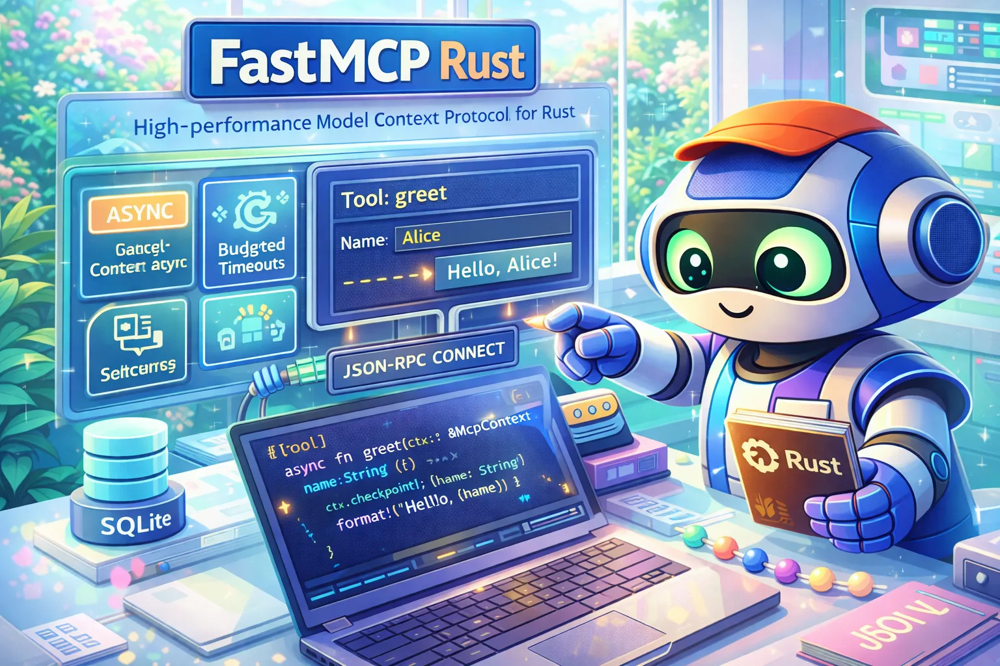

<p align="center">
  
</p>

<h1 align="center">FastMCP Rust</h1>

<p align="center">
  <strong>Cancel-aware Model Context Protocol (MCP) framework for Rust</strong>
</p>

<p align="center">
  <em>A Rust port of <a href="https://github.com/jlowin/fastmcp">jlowin/fastmcp</a> (Python), extended with <a href="https://github.com/Dicklesworthstone/asupersync">asupersync</a> capability contexts and cooperative-cancellation primitives.</em>
</p>

<p align="center">
  
  
  
  
</p>

> **Protocol status (2026-08-24):** MCP 2026-07-28 support is under
> implementation and remains unverified. The root compatibility
> `PROTOCOL_VERSION` is `2024-11-05`; the modern facade's
> `modern::PROTOCOL_VERSION` is `2026-07-28`. Source presence, examples, and
> historical parity rows are not conformance or release evidence. Versions
> through 0.7.1 have been published, but publication and source edits alone do
> not prove historical workflow identities, queued runs, or credentials inert;
> provider-side release-safety evidence is still required.

### Current qualification boundaries

- **Wire cancellation is only partially qualified:** on Unix, the primary
  stdio path keeps receiving while bounded modern requests run in independent
  request-owned children, so it can route cancellation during handler
  execution. Response and notification commits remain serialized at the
  output writer, while exact MCP 2024-11-05 traffic remains serialized through
  its lifecycle worker. Non-Unix stdio and custom/SSE/WebSocket entry points
  retain sequential or blocking boundaries. A non-cooperative handler can
  still exceed the bounded process-exit drain, so end-to-end quiescence and
  reliable `awaitCleanup` semantics remain unverified.
- **Bidirectional calls are not qualified:** the Unix stdio receive pump can
  route sampling, elicitation, and roots responses while exact-2024 lifecycle
  work or modern request children are active. Non-Unix stdio and
  custom/SSE/WebSocket paths reject or lack that split routing. Public HTTP
  has its own dual-era request and response routing, but end-to-end
  bidirectional lifecycle/cancellation evidence is incomplete.
- **Response caching is conservatively partitioned:** eligible production
  requests are keyed by committed authentication facts plus opaque session
  identity and revision. Uncommitted authentication, local-only state views,
  allocation failure, or state mutation during a request cause cache admission
  to fail closed rather than sharing an entry.
- **Authentication admission is incomplete:** recognized credentials in JSON-RPC
  params are supported only as a legacy fallback and are stripped before
  extension middleware and handlers. The public turnkey HTTP path is live,
  but no complete transport-boundary native `Authorization`
  admission/challenge integration is qualified.
- **Legacy Tasks RPC stays dead:** `tasks/list` and `tasks/submit` return
  JSON-RPC `MethodNotFound`. Official MCP 2026-07-28 methods `tasks/get`,
  `tasks/update`, and `tasks/cancel` are served by default (process-local
  in-memory store). Call `ServerBuilder::final_tasks` to supply an
  application-owned store. Creating new tasks still requires the
  application to run a caller-owned task supervisor in its own `Cx`
  region. The historical `with_task_manager` path does not install the
  official methods.
- **OAuth/OIDC are unpromoted source surfaces:** their public building blocks
  remain available for development, but production security/profile
  conformance is unverified and no production-support claim is made for them.
- **CLI inspection is bounded diagnostics, not conformance evidence:** with
  default features in a current source checkout, `fastmcp inspect
  --protocol-policy` reports the selected `auto`, `modern-only`, or
  `legacy-only` era. A selected modern session requires valid
  `_meta.io.modelcontextprotocol/serverInfo` metadata and retains the open
  discovery capability shape (including `completions` and `extensions`)
  subject to output bounds and credential/control-text sanitization; a
  selected legacy session renders only the exact legacy capability shape. A
  `--no-default-features` build supports `modern-only` only. This does not
  qualify either protocol era as aggregate conformance or production
  readiness.
- **Subprocess cleanup is explicit and platform-bounded:**
  `Client::close(&mut self)` returns cleanup failures. The opt-in owned-group mode used by
  `fastmcp test` is Unix-only and fails before spawn elsewhere. It uses a live
  anchor plus an owner-death channel, but cannot contain descendants that
  change group/session, withstand a competing global child reaper, or close a
  control descriptor copied by a host-side fork. Drop is best effort.

---

```bash
# Current published package; publication is not aggregate conformance evidence
cargo add fastmcp-rust@0.7.1

# Or use the git dependency for bleeding-edge changes
cargo add fastmcp-rust --git https://github.com/Dicklesworthstone/fastmcp_rust
```

---

## TL;DR

### The Problem

MCP server implementations need to solve several recurring problems:

- Handler schemas and JSON-RPC dispatch
- Cooperative cancellation and request budgets
- Ownership of concurrent child work
- Transport framing and session lifecycle

### The Solution

**FastMCP Rust** is an MCP framework with asupersync capability contexts, attribute macros, and explicit cancellation/budget surfaces:

```rust
use fastmcp_rust::{modern::ServerBuilder, prelude::*};

#[tool]
async fn greet(ctx: &McpContext, name: String) -> McpResult<String> {
    ctx.checkpoint()?;  // Cancellation point
    Ok(format!("Hello, {name}!"))
}

fn main() {
    ServerBuilder::new("my-server", "1.0.0")
        // Attribute macros generate PascalCase handler values.
        .tool(Greet)
        .build()
        .run_stdio();
}
```

### Why FastMCP Rust?

| Feature | FastMCP Rust | Manual Implementation |
|---------|--------------|----------------------|
| **Async handler API** | `#[tool] async fn` plus handler trait hooks | Manual Future boxing |
| **Cancellation** | Local request checkpoints; live wire interruption remains unverified | Application-specific checks |
| **Timeouts** | Request and handler budget surfaces | Application-specific timers |
| **Concurrent-future ownership** | Context combinators poll caller-owned futures | Manual ownership |
| **Error handling** | 4-valued Outcome | 2-valued Result |
| **Boilerplate** | Generated handler/schema implementations | Handwritten handler/schema implementations |

---

## AGENTS.md

This project includes an [`AGENTS.md`](AGENTS.md) file with guidelines for AI coding agents. Key points:

- **Porting methodology:** Extract spec from legacy → implement from spec → never translate line-by-line
- **Runtime:** Uses [asupersync](https://github.com/Dicklesworthstone/asupersync) exclusively; Tokio and Tokio-based adapters are unsupported
- **Unsafe code:** Forbidden (`#![forbid(unsafe_code)]`)
- **Toolchain:** Rust 2024 edition; pinned `nightly-2026-08-20` / rustc 1.100.0-nightly (`rust-version = "1.100"`)
- **MCP 2026-07-28 support is under implementation and remains unverified.**
- **Aggregate MCP 2026-07-28 support is not claimed by FND-01.**
- **The root compatibility `PROTOCOL_VERSION` is `2024-11-05`; the modern facade's `modern::PROTOCOL_VERSION` is `2026-07-28`. Neither is proof of negotiated 2026-07-28 support.**

---

## Quick Example

```rust
use fastmcp_rust::{modern::ServerBuilder, prelude::*};

// Define a tool with automatic JSON schema generation
#[tool(description = "Calculate the sum of two numbers")]
async fn add(ctx: &McpContext, a: i64, b: i64) -> McpResult<String> {
    ctx.checkpoint()?;  // Check the local cancellation token and budget
    Ok((a + b).to_string())
}

// Define an in-memory resource. Potentially blocking filesystem work is not
// performed inline on the dispatch worker.
#[resource(uri = "config://settings", description = "Application config")]
fn config(ctx: &McpContext) -> McpResult<String> {
    ctx.checkpoint()?;
    Ok(r#"{"theme":"dark"}"#.to_owned())
}

// Define a prompt template
#[prompt(description = "Generate a greeting message")]
async fn greeting(ctx: &McpContext, name: String) -> McpResult<Vec<PromptMessage>> {
    ctx.checkpoint()?;
    Ok(vec![PromptMessage {
        role: Role::User,
        content: Content::text(format!("Please greet {name} warmly.")),
    }])
}

fn main() {
    ServerBuilder::new("example-server", "1.0.0")
        .tool(Add)
        .resource(ConfigResource)
        .prompt(GreetingPrompt)
        .request_timeout(30)  // 30-second budget per request
        .build()
        .run_stdio();
}
```

Run it:

```bash
cargo run -p fastmcp-rust --example echo_server
```

---

## Design Philosophy

### 1. Explicit Cooperative Cancellation

Handlers should check cancellation at natural suspension or iteration boundaries. FastMCP exposes cooperative checkpoints. These local context semantics do not, by themselves, make cancellation interruptible over a live connection; see the qualification boundaries above.

```rust
#[tool]
async fn process_items(
    ctx: &McpContext,
    items: Vec<String>,
) -> McpResult<Vec<Content>> {
    let mut results = vec![];
    for item in items {
        ctx.checkpoint()?;  // Allow graceful cancellation between items
        results.push(Content::text(process(item).await?));
    }
    Ok(results)
}
```

### 2. Budgets, Not Timeouts

Timeouts are "we gave up." Budgets are "you have X resources." The `Budget` type represents deadline, poll-quota, and cost-quota dimensions:

```rust
// Configure a 30-second server-owned request ceiling
ServerBuilder::new("server", "1.0.0")
    .request_timeout(30)
    .tool(MyTool)
    .build()
    .run_stdio();

// Handler can check remaining budget
#[tool]
async fn my_tool(ctx: &McpContext) -> McpResult<String> {
    ctx.checkpoint()?;
    // ... work ...
    Ok("work completed".to_string())
}
```

### 3. Four-Valued Outcomes

`Result<T, E>` has no distinct cancellation or panic variants. FastMCP's asynchronous handler boundary uses `Outcome<T, E>`:

```rust
enum Outcome<T, E> {
    Ok(T),                    // Success
    Err(E),                   // Expected failure
    Cancelled(CancelReason),  // External interruption
    Panicked(PanicPayload),   // Internal failure
}
```

### 4. Capability-oriented handlers

Request authority flows through `McpContext`; application dependencies should likewise be passed explicitly instead of hidden in globals:

```rust
// BAD: Global state access
async fn bad_tool() {
    let db = GLOBAL_DB.lock().await;  // Hidden dependency
}

// GOOD: Explicit capability
async fn good_tool(ctx: &McpContext, db: &DbHandle) {
    db.query(ctx.cx(), "SELECT ...").await;  // Explicit
}
```

### 5. Owned Concurrent Futures

Concurrent child futures remain owned by the request handler and are polled together by context combinators:

```rust
use std::future::Future;
use std::pin::Pin;

#[tool]
async fn parallel_fetch(
    ctx: &McpContext,
    urls: Vec<String>,
) -> McpResult<Vec<Content>> {
    type FetchFuture = Pin<Box<dyn Future<Output = McpResult<String>> + Send>>;

    let futures: Vec<FetchFuture> = urls
        .into_iter()
        .map(|url| Box::pin(fetch(url)) as FetchFuture)
        .collect();

    let results = ctx.join_all(futures).await?;
    results
        .into_iter()
        .map(|result| result.map(Content::text))
        .collect()
}
```

---

## Design Positioning

These are FastMCP Rust design surfaces, not benchmark results or an MCP 2026-07-28 conformance certificate. Competing projects change independently and should be evaluated from their current documentation rather than a static comparison table.

| Area | FastMCP Rust design |
|------|---------------------|
| **Handler API** | `#[tool]`, `#[resource]`, and `#[prompt]` macros plus explicit handler traits |
| **Cancellation** | `McpContext` checkpoints and masks backed by asupersync |
| **Timeouts** | Request and handler budget surfaces |
| **Runtime** | asupersync only; Tokio adapters are unsupported |
| **Outcomes** | Four-valued `Outcome`: success, expected error, cancellation, or panic |
| **Unsafe code** | Forbidden in workspace crates with `#![forbid(unsafe_code)]` |

---

## Installation

### From crates.io (current 0.7.1 package)

The non-yanked `0.7.1` package was published on 2026-08-24. Publication does
not establish aggregate MCP 2026-07-28 conformance, production readiness, or
qualification of every in-tree feature.

```toml
[dependencies]
fastmcp-rust = "0.7.1"
```

### As a Git Dependency

```toml
[dependencies]
fastmcp-rust = { git = "https://github.com/Dicklesworthstone/fastmcp_rust" }
```

### From Source

```bash
git clone https://github.com/Dicklesworthstone/fastmcp_rust.git
cd fastmcp_rust
cargo build --release
```

### CLI binaries (GitHub Releases)

Prebuilt `fastmcp` binaries are published on GitHub Releases. The
`fastmcp-cli` source package is also available from crates.io for Cargo-based
installation. Release archives use `fastmcp-<os>-<arch>` names (`.tar.xz` on
Unix, `.zip` on Windows). Linux and macOS ship amd64/x86_64 and arm64/aarch64
aliases; Windows ships amd64 MSVC.

```bash
# Example: macOS Apple Silicon
curl -fsSL -O https://github.com/Dicklesworthstone/fastmcp_rust/releases/latest/download/fastmcp-darwin-arm64.tar.xz
tar -xJf fastmcp-darwin-arm64.tar.xz
./fastmcp --version
```

### CLI via Cargo (optional)

```bash
cargo install fastmcp-cli --version 0.7.1
```

### Client request deadlines (current source tree)

Ordinary client requests use separate idle and absolute response-wait
deadlines. Both begin after the request send commits. The idle deadline
defaults to 30 seconds; the non-resettable absolute deadline defaults to 120
seconds. Serialization, a blocking send, and teardown are outside these
timers. Only a valid matching progress notification on a request that actually
supplied a progress token can reset idle.

```rust
use std::time::Duration;

use fastmcp_rust::prelude::{Client, ClientBuilder, Cx, McpResult, RequestTimeoutPolicy};

async fn connect(cx: &Cx) -> McpResult<Client> {
    let policy = RequestTimeoutPolicy::new(
        Duration::from_secs(20),
        Duration::from_secs(90),
    )?;
    ClientBuilder::new()
        .request_timeout_policy(policy)
        .connect_stdio_with_cx("my-mcp-server", &[], cx)
        .await
}
```

A live modern `subscriptions/listen` can stay open on the same stdio
`Client` while other requests complete. Call
`Client::open_subscriptions_listener` and then
`Client::next_subscription_event` to drain acknowledgement, catalog, and
resource-update events without collecting the stream to terminal.
`listen_subscriptions_typed` remains the collect-to-terminal adapter.
The same incremental pattern exists on HTTP (`HttpClient::start_subscriptions_listener`),
modern WebSocket (`WebSocketClient::open_subscriptions_listener`), and
`ProxyClient::start_catalog_listener` for stdio and modern HTTP upstreams.
HTTP and WebSocket clients also expose typed `list_tools`/`call_tool`/
`read_resource`/`get_prompt` verbs so callers do not have to decode a raw
core result for ordinary catalog and invocation traffic. HTTP and WebSocket
`list_tools_with_cancellation`/`call_tool_with_cancellation`/
`read_resource_with_cancellation`/`get_prompt_with_cancellation` honor a
caller-owned cancellation domain for those ordinary verbs.
Exact MCP 2024-11-05 HTTP+SSE clients use `Client::sse_with_cx` when the GET
event stream and POST message endpoints are already known.

The published 0.7.1 CLI includes these flags. From a current source checkout,
run the CLI through the workspace to configure the two limits independently:

```bash
cargo run -p fastmcp-cli -- test --idle-timeout 30 --absolute-timeout 120 my-mcp-server
```

The current `fastmcp test` subprocess runner is Unix-only because success
includes verified owned-process-group cleanup. Library callers should likewise
call `client.close()` and handle its `McpResult`; dropping a client is only a
best-effort safety net. The group anchor protects its numeric PGID while it is
live and closes an owner-death channel when the host exits, but this is not
portable process-tree containment or a substitute for Windows Job Objects.

**Requirements:**
- Rust nightly-2026-08-20 (see `rust-toolchain.toml`) for Edition 2024. The last FND-01 evidence snapshot still records `nightly-2026-07-11` until that harness is re-attested.

---

## Quick Start

### 1. Create a New Project

```bash
cargo new my-mcp-server
cd my-mcp-server
```

### 2. Add FastMCP

```toml
# Cargo.toml
[dependencies]
fastmcp-rust = { git = "https://github.com/Dicklesworthstone/fastmcp_rust" }
```

### 3. Write Your Server

```rust
// src/main.rs
use fastmcp_rust::{modern::ServerBuilder, prelude::*};

#[tool(description = "Echo the input message")]
async fn echo(ctx: &McpContext, message: String) -> McpResult<String> {
    ctx.checkpoint()?;
    Ok(message)
}

fn main() {
    ServerBuilder::new("echo-server", "1.0.0")
        .tool(Echo)
        .instructions("A simple echo server for testing")
        .build()
        .run_stdio();
}
```

### 4. Run

```bash
cargo run
```

### 5. Test with MCP Inspector

```bash
npx @modelcontextprotocol/inspector cargo run
```

---

## Architecture

```
┌─────────────────────────────────────────────────────────────────┐
│                        MCP Client                               │
└─────────────────────────────────────────────────────────────────┘
                              │
                              │ JSON-RPC over stdio
                              ▼
┌─────────────────────────────────────────────────────────────────┐
│                      StdioTransport                             │
│  ┌─────────────┐    ┌─────────────┐    ┌─────────────┐         │
│  │   Codec     │───▶│   recv()    │───▶│   send()    │         │
│  │  (NDJSON)   │    │             │    │             │         │
│  └─────────────┘    └─────────────┘    └─────────────┘         │
└─────────────────────────────────────────────────────────────────┘
                              │
                              ▼
┌─────────────────────────────────────────────────────────────────┐
│                         Server                                  │
│  ┌─────────────┐    ┌─────────────┐    ┌─────────────┐         │
│  │   Session   │    │   Router    │    │   Budget    │         │
│  │  (state)    │    │ (dispatch)  │    │ (timeout)   │         │
│  └─────────────┘    └─────────────┘    └─────────────┘         │
│                              │                                  │
│                              ▼                                  │
│  ┌─────────────────────────────────────────────────────────────┐│
│  │                     McpContext                              ││
│  │  ┌─────┐  ┌──────────┐  ┌────────┐  ┌──────┐              ││
│  │  │ Cx  │  │checkpoint│  │ budget │  │masked│              ││
│  │  └─────┘  └──────────┘  └────────┘  └──────┘              ││
│  └─────────────────────────────────────────────────────────────┘│
│                              │                                  │
│                              ▼                                  │
│  ┌──────────────┐  ┌──────────────┐  ┌──────────────┐         │
│  │ ToolHandler  │  │ResourceHandler│ │PromptHandler │         │
│  │  call_async  │  │  read_async  │  │  get_async   │         │
│  └──────────────┘  └──────────────┘  └──────────────┘         │
└─────────────────────────────────────────────────────────────────┘
                              │
                              ▼
┌─────────────────────────────────────────────────────────────────┐
│                       asupersync                                │
│  ┌─────────┐  ┌─────────┐  ┌─────────┐  ┌─────────┐           │
│  │ Runtime │  │  Scope  │  │ Budget  │  │ Outcome │           │
│  └─────────┘  └─────────┘  └─────────┘  └─────────┘           │
└─────────────────────────────────────────────────────────────────┘
```

---

## Crate Structure

FastMCP is organized as a workspace with focused crates:

```
fastmcp_rust/
├── crates/
│   ├── fastmcp/           # Facade crate (published as fastmcp-rust)
│   ├── fastmcp-core/      # McpContext, errors, runtime helpers
│   ├── fastmcp-protocol/  # MCP types, JSON-RPC messages
│   ├── fastmcp-transport/ # Transport implementations (stdio, SSE, WebSocket, HTTP, memory)
│   ├── fastmcp-server/    # Server builder, router, handlers
│   ├── fastmcp-client/    # Client implementation
│   ├── fastmcp-macros/    # Proc-macro crate, published as fastmcp-derive
│   ├── fastmcp-console/   # Console rendering and statistics
│   └── fastmcp-cli/       # fastmcp command-line interface
```

| Crate | Purpose |
|-------|---------|
| `fastmcp-rust` | Convenience re-exports for simple `use fastmcp_rust::prelude::*` |
| `fastmcp-core` | `McpContext` wrapper, error types, `block_on` helper |
| `fastmcp-protocol` | MCP message types, capabilities, JSON-RPC framing |
| `fastmcp-transport` | Transport trait and stdio/SSE/WebSocket/HTTP/memory implementations |
| `fastmcp-server` | `Server`, `ServerBuilder`, routing, handler traits |
| `fastmcp-client` | Subprocess-stdio `Client`, plus public `ClientHttpConnection` and `HttpClient` support for modern HTTP and exact legacy SSE. With the experimental `websocket-experimental` facade profile, public async WebSocket clients accept owned native transports; Auto negotiation uses a caller-owned factory that supplies a fresh upgraded transport for its permitted retry |
| `fastmcp-derive` | Procedural macros for handler generation |

---

## Handler Traits

The signatures below are abridged; asynchronous trait methods return four-valued `McpOutcome` values, not ordinary `McpResult` values.

### ToolHandler

```rust
pub trait ToolHandler: Send + Sync {
    fn definition(&self) -> Tool;
    fn call(
        &self,
        ctx: &McpContext,
        arguments: serde_json::Value,
    ) -> McpResult<Vec<Content>>;

    // Override for true async (default delegates to call())
    fn call_async<'a>(&'a self, ctx: &'a McpContext, arguments: serde_json::Value)
        -> std::pin::Pin<Box<dyn std::future::Future<Output = McpOutcome<Vec<Content>>> + Send + 'a>>;
}
```

### ResourceHandler

```rust
pub trait ResourceHandler: Send + Sync {
    fn definition(&self) -> Resource;
    fn read(&self, ctx: &McpContext) -> McpResult<Vec<ResourceContent>>;

    // Override for true async
    fn read_async<'a>(&'a self, ctx: &'a McpContext)
        -> std::pin::Pin<Box<dyn std::future::Future<Output = McpOutcome<Vec<ResourceContent>>> + Send + 'a>>;
}
```

### PromptHandler

```rust
pub trait PromptHandler: Send + Sync {
    fn definition(&self) -> Prompt;
    fn get(&self, ctx: &McpContext, arguments: std::collections::HashMap<String, String>)
        -> McpResult<Vec<PromptMessage>>;

    // Override for true async
    fn get_async<'a>(
        &'a self,
        ctx: &'a McpContext,
        arguments: std::collections::HashMap<String, String>,
    )
        -> std::pin::Pin<Box<dyn std::future::Future<Output = McpOutcome<Vec<PromptMessage>>> + Send + 'a>>;
}
```

---

## Troubleshooting

| Problem | Cause | Fix |
|---------|-------|-----|
| JSON-RPC `MethodNotFound` for `tools/call` | Tool not registered | Register the generated handler, for example `.tool(MyTool)` |
| Request cancelled mid-operation | Local request cancellation or budget exhaustion | Add checkpoints and mask only the smallest atomic section that must finish; Unix stdio keeps receiving while bounded modern request children run, but output commits are serialized, non-Unix/custom/SSE/WebSocket loops retain blocking boundaries, and a non-cooperative handler can exceed the process-exit quiescence drain |
| Budget exhausted errors | Deadline, poll, or cost dimension exhausted | Inspect the exhausted dimension; increase `.request_timeout(...)` only for a deadline that is intentionally too short |
| `#[tool]` macro compilation error | Unsupported return conversion or argument schema | Prefer `String`, `Vec<Content>`, `McpResult<String>`, or `McpResult<Vec<Content>>` and ensure custom argument types implement `JsonSchema` |
| `TransportError::Io` on startup | stdin unavailable | Ensure nothing else reads stdin |

### Critical Section Example

```rust
use std::sync::atomic::{AtomicU64, Ordering};

// A handler that owns `committed` can call this helper after validation.
fn commit_revision(
    ctx: &McpContext,
    revision: u64,
    committed: &AtomicU64,
) -> McpResult<()> {
    // Mask only a small, non-blocking atomic commit. Masking does not make
    // synchronous filesystem or device I/O bounded or cancel-safe.
    ctx.masked(|| committed.store(revision, Ordering::Release))
        .map_err(|error| McpError::internal_error(error.to_string()))?;
    Ok(())
}
```

---

## Limitations

| Limitation | Details |
|------------|---------|
| **Pinned Nightly Required** | The project contract pins `nightly-2026-08-20`; do not substitute a different toolchain merely because it supports Edition 2024 |
| **Protocol Modernization** | The root compatibility `PROTOCOL_VERSION` remains `2024-11-05`; the modern facade's `modern::PROTOCOL_VERSION` is `2026-07-28`. MCP 2026-07-28 implementation and verification are incomplete |
| **Runtime-context migration** | Library client constructors and returning/custom transport runners require a caller-owned `Cx`. The process-owning CLI and `Server::run_stdio` install the ambient context at their top-level runtime boundary; `test-internals` is confined to test-only dependencies and the facade's opt-in `testing-lab` feature |
| **Network Transports** | The turnkey `run_http*` entry points provide a caller-owned dual-era HTTP listener and dispatch lifecycle. The experimental `websocket-experimental` facade profile also provides native async `bind_websocket` and `serve_websocket` listener lifecycles, plus caller-driven client connection. These surfaces do not establish aggregate conformance or complete lifecycle qualification |
| **Client Transport Coverage** | `fastmcp-client::Client` is subprocess-stdio only; public `ClientHttpConnection` and `HttpClient` provide modern HTTP and exact legacy SSE integration with typed `list_tools`/`call_tool`/`read_resource`/`get_prompt` verbs. Modern HTTP answers typed reverse `sampling/createMessage`, `roots/list`, and `elicitation/create` requests that arrive on a request-owned SSE body by POSTing the JSON-RPC response. Public `HttpClient::call_tool` and `WebSocketClient::call_tool` also follow modern server `input_required` by invoking those same installed handlers locally and retrying with `inputResponses`. Live `bind_http` JSON `tools/call` returns `ctx.final_sampling` and `ctx.final_roots` as `input_required`; a write-half EOF after the request is ordinary H1 completion and does not cancel that result. Public `modern::Client` stdio `call_tool_result` / `read_resource_result` / `get_prompt_result` keep the same live `input_required` branch. A Modern2026 stdio session stamps the same `_meta` protocol version and client capabilities on `start_multiplexed_request` that the typed verbs already send. Public stdio `read_resource` / `get_prompt` follow installed modern reverse handlers the same way `call_tool` does. Stateless HTTP retries stay session-bound, so a second POST cannot resume the first POST's `requestState`. With `websocket-experimental`, the facade exposes `WebSocketClient` with incremental catalog listen, the same typed verbs, and the same modern reverse handlers: ModernOnly and LegacyOnly builders accept an owned async WebSocket transport, while Auto accepts a caller-owned factory that yields a fresh upgraded transport for initial modern discovery and its sole permitted exact-2024 retry |
| **Experimental WebSocket TLS** | The experimental async transport supports `ws://` and `wss://`. `wss://` can use the built-in WebPKI-rooted connector or a caller-supplied TLS connector for private roots, pinning, or client certificates; this connection support does not imply complete TLS, lifecycle, or MCP conformance qualification |
| **HTTP Dispatch Qualification** | Public `run_http*` binds and serves the caller-owned dual-era HTTP lifecycle. `ModernOnly` selects the exact MCP 2026-07-28 era and `LegacyOnly` selects the exact MCP 2024-11-05 era; MCP 2025-11-25 is not an adapter or supported policy. This executable surface does not establish aggregate MCP conformance or complete lifecycle qualification |
| **Wire Cancellation** | On Unix, stdio has a continuous receive pump and bounded concurrent modern request-owned children, so it can route `notifications/cancelled` during handler execution. Response and notification commits are serialized at the output writer; exact MCP 2024-11-05 traffic remains serialized through its lifecycle worker. Non-Unix stdio and custom/SSE/WebSocket loops retain sequential/blocking boundaries, while a non-cooperative handler can exceed the bounded process-exit drain and reliable `awaitCleanup` semantics remain unverified |
| **Silent stdio peers** | On Unix, the public subprocess `Client` enforces configured idle/absolute deadlines at child-pipe readiness and decode boundaries, including silent and partial-frame peers. Generic blocking `StdioTransport::recv`, non-Unix child-pipe reads, and blocking writes retain their documented frame/I/O-boundary limitation; these deadlines are therefore not a portable end-to-end request or process wall-clock guarantee. Those residuals remain FND-04 work |
| **Stdio output backpressure** | On Unix, primary server responses and notifications use serialized nonblocking writes with a two-second commit deadline for ordinary pipes/sockets; a timeout, lock poison, partial write, notification encoding failure, or descriptor-flag restoration failure is connection-fatal. The writer attempts to restore descriptor flags before releasing the local lock; on restoration failure the descriptor may remain nonblocking, and inherited duplicate descriptors can observe the temporary `O_NONBLOCK` setting. Regular files/devices and non-Unix stdout retain blocking-I/O limits. A handler that ignores cancellation may force unsuccessful process exit after the bounded drain; shutdown hooks are skipped unless all worker and modern-child quiescence is proven |
| **Subprocess cleanup** | `Client::close(&mut self) -> McpResult<()>` is the proof-bearing path; Drop is best effort. `fastmcp test` uses Unix-only anchored process-group ownership; successful connections report explicit final cleanup separately, and initialization-cleanup failures remain visible. Descendants can escape via a new group/session, host forks can copy the control descriptor, and `SIGCHLD=SIG_IGN`, `SA_NOCLDWAIT`, or competing global reapers can invalidate reap evidence. Windows Job Object support is not implemented |
| **Development subprocess cleanup** | On Unix, each `fastmcp dev` build/server group contains a signal-immune watchdog tied to a private owner-held control pipe, so ordinary shutdown, child-handle drop, and CLI owner death trigger bounded TERM-then-KILL cleanup. A host-side fork that copies the owner descriptor or a descendant that changes group/session remains outside this boundary; non-Unix `dev` remains fail-closed |
| **Synchronous HTTP readers** | Low-level HTTP parsing checkpoints before/after reads and retries `EINTR`, but a generic synchronous `Read` already blocked in the kernel cannot be preempted. A bounded host must supply readiness-aware/asynchronous I/O. Public turnkey `run_http*` uses its caller-owned asynchronous listener lifecycle, whose broader qualification boundaries remain documented here |
| **Returning transport runners** | `run_transport_returning_with_cx` and the split returning variants return fatal receive/send/close errors and preserve simultaneous run-plus-close failures. Clean EOF/cancellation is `Ok(())`. The legacy custom loop still shares one caller-owned `Cx` across requests and does not prove request-owned isolation |
| **Request Cancellation Ownership** | Unix modern stdio request work runs in independently owned bounded child contexts, but process-exiting shutdown does not wait unboundedly for a non-cooperative child; cancellation therefore is not yet a complete quiescence or `awaitCleanup` guarantee |
| **Bidirectional Response Routing** | On Unix, stdio continuously routes inbound responses while exact-2024 lifecycle work or modern request children are active. Non-Unix stdio and custom/SSE/WebSocket paths do not provide the same split routing. Public HTTP has separate dual-era routing, while end-to-end bidirectional lifecycle qualification remains open |
| **Response Cache Partitioning** | Eligible entries are partitioned by committed authentication facts and opaque session identity/revision; ambiguous admission and state mutation fail closed. This does not promote OAuth/OIDC or establish protocol conformance |
| **Authentication Admission** | JSON-RPC credential fields are a stripped legacy fallback. Public turnkey HTTP is live, but no complete transport-boundary native `Authorization` admission/challenge path is qualified |
| **Tasks RPC** | `tasks/list` and `tasks/submit` stay `MethodNotFound`. Official `tasks/get`, `tasks/update`, and `tasks/cancel` run by default on a process-local in-memory store; `ServerBuilder::final_tasks` replaces that store |
| **HTTP as_proxy auto-follow** | A gateway HTTP `as_proxy` does not auto-follow an upstream server `input_required` task across POSTs; per-request dispatch is stateless and upstream request state cannot resume. Callers resume such upstream tasks through an explicit matching `tasks/update` |
| **OAuth/OIDC Promotion** | Public source APIs exist, but production security and profile conformance remain unverified; they are quarantined from production-support claims |
| **Early Development** | API may change before 1.0 |

---

## FAQ

**Q: Why is Tokio unsupported?**

A: FastMCP Rust is built around asupersync capability contexts, budgets, and cooperative-cancellation surfaces. Tokio and Tokio-based adapters are outside the supported runtime model.

**Q: Can I use this with Claude Desktop?**

A: Stdio integration exists, but compatibility must be checked against the client: the root compatibility `PROTOCOL_VERSION` is `2024-11-05`, the modern facade's `modern::PROTOCOL_VERSION` is `2026-07-28`, and MCP 2026-07-28 support is not yet verified.

**Q: How do I add authentication?**

A: Static-token, OAuth, and OIDC implementation code exists, but OAuth/OIDC
production security and profile conformance remain unverified. Recognized
credentials in JSON-RPC params are only a legacy fallback; FastMCP authenticates
them and strips those fields before extension middleware and handlers. The
quarantined private HTTP helper carries native `Authorization` metadata through
pre-dispatch admission, but a public transport integration still needs a
qualified admission/challenge boundary, TLS, and profile-specific validation.

**Q: What's the performance overhead of checkpoints?**

A: Checkpoints perform cancellation and budget checks. No project benchmark currently supports a universal per-call latency claim; measure them in the target workload if the cost matters.

**Q: Can I use other async runtimes?**

A: No. The current API and implementation require asupersync; other async runtimes are not supported.

**Q: How do I test my handlers?**

A: Construct `McpContext` from an asupersync testing context and a request ID:
```rust
use fastmcp_rust::{Cx, McpContext, McpResult, tool};

#[tool]
fn my_tool(ctx: &McpContext, input: String) -> McpResult<String> {
    ctx.checkpoint()?;
    Ok(input)
}

#[test]
fn test_my_tool() {
    let ctx = McpContext::new(Cx::for_testing(), 1);
    let result = my_tool(&ctx, "input".to_string());
    assert_eq!(result.unwrap(), "input");
}
```

---

## About Contributions

Please don't take this the wrong way, but I do not accept outside contributions for any of my projects. I simply don't have the mental bandwidth to review anything, and it's my name on the thing, so I'm responsible for any problems it causes; thus, the risk-reward is highly asymmetric from my perspective. I'd also have to worry about other "stakeholders," which seems unwise for tools I mostly make for myself for free. Feel free to submit issues, and even PRs if you want to illustrate a proposed fix, but know I won't merge them directly. Instead, I'll have Claude or Codex review submissions via `gh` and independently decide whether and how to address them. Bug reports in particular are welcome. Sorry if this offends, but I want to avoid wasted time and hurt feelings. I understand this isn't in sync with the prevailing open-source ethos that seeks community contributions, but it's the only way I can move at this velocity and keep my sanity.

---

## License

The release-license representation is unresolved: workspace Cargo metadata
declares `MIT`, [LICENSE](LICENSE) contains an additional OpenAI/Anthropic
rider, and [LICENSE-MIT](LICENSE-MIT) contains plain MIT text. Do not infer
authoritative release terms from one of these inputs in isolation. Publication
remains blocked until the explicit release-license decision required by the
implementation plan is reviewed and applied consistently.

---

<p align="center">
  <sub>Built with <a href="https://github.com/Dicklesworthstone/asupersync">asupersync</a> for context-aware async</sub>
</p>
